# 附录

## 附录A 创建一个博客

在第二章中，我们建议你不妨尝试通过博客来帮助消化阅读和实践中的信息。但如果你还没有博客呢？该选择哪个平台呢？

遗憾的是，在博客领域，人们似乎不得不面临艰难抉择：要么选择便捷但会让你和读者暴露在广告、付费墙及各种费用的平台，要么耗费数小时搭建自有主机服务，再花数周时间钻研各种复杂细节。“自己动手”方式最大的益处，或许在于你真正拥有自己的文章，而非受制于服务商及其未来如何变现你内容的决策。

然而，事实证明，你可以两全其美！

### 使用 Github Pages 搭建博客

一个绝佳的解决方案是将博客托管在名为GitHub Pages的平台上。该平台免费、无广告且无付费墙，并以标准格式提供数据，使你随时可将博客迁移至其他主机。但我们所见的所有GitHub Pages使用方法都要求掌握命令行操作和晦涩工具——这些工具通常只有软件开发者才熟悉。例如GitHub官方的博客搭建指南就包含冗长的操作步骤：安装Ruby编程语言、使用 `git` 命令行工具、复制版本号等——总计多达17个步骤！

为简化操作流程，我们开发了一套便捷方案，让你能通过纯浏览器界面满足所有博客需求。你只需约五分钟即可完成新博客的创建与运行。完全免费，若需自定义域名也轻松实现。本节将以我们设计的 `fast_template` 模板为例进行操作说明。（注：请务必访问本书官网获取最新博客推荐，因新工具持续更新。）

#### 创建仓库

你需要一个 GitHub 账户，所以现在就去那里创建一个账户吧，如果你还没有的话。通常，GitHub 是由软件开发人员用来编写代码的，他们使用一个复杂的命令行工具来操作它——但我们将向你展示一种完全不使用命令行的方法！

开始前，请将浏览器指向 https://github.com/fastai/fast_template/generate（确保你已登录）。这将允许你创建一个存储博客的位置，称为仓库。你将看到类似图A-1所示的界面。请注意，你必须严格按照此处示例格式输入仓库名称——即你的 GitHub 用户名后接 `.github.io`。

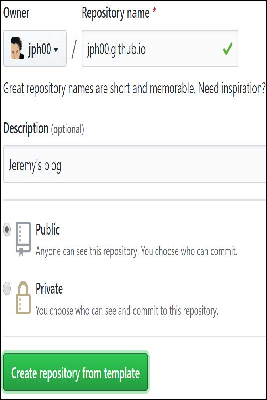

[^图A-1]: 创建你自己的仓库

输入上述内容及任意描述后，点击“从模板创建仓库”。你可以选择将仓库设为“私有”，但既然您创建的是希望他人阅读的博客，让底层文件公开可见应该不会造成困扰。（译者注：如果你是Github免费计划用户，那么如果将仓库设为私有，将无法生成Github Pages）

现在，让我们来设置你的主页吧！

#### 设置你的主页

当读者访问你的博客时，首先看到的是名为 `index.md` 的文件内容。这是 Markdown 格式文件。Markdown 是一种强大而简洁的文本格式化工具，可创建项目符号、斜体、超链接等效果。它被广泛应用于 Jupyter 笔记本的所有格式设置、GitHub网站几乎所有部分，以及互联网上的许多其他地方。要创建Markdown文本，只需输入普通英文（译者注：中文当然也行），然后添加一些特殊字符来实现特殊效果。例如，在单词或短语前后添加 `*` 字符，即可将其设置为斜体。现在就来试试吧。

要打开文件，请在 GitHub 中点击其文件名。要编辑文件，请点击屏幕最右侧的铅笔图标，如图 A-2 所示。

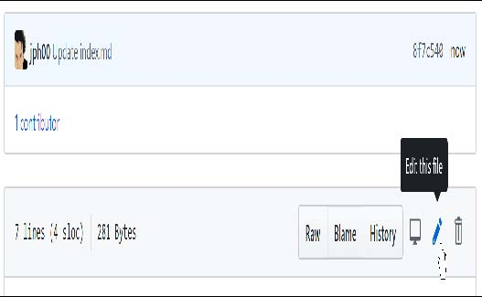

[^图A-2]: 编辑文件

你可以添加、编辑或替换所见文本。点击“预览更改”（Preview changes）按钮（图A-3）即可查看Markdown文本在博客中的显示效果。新增或修改的行将在左侧显示绿色标记条。

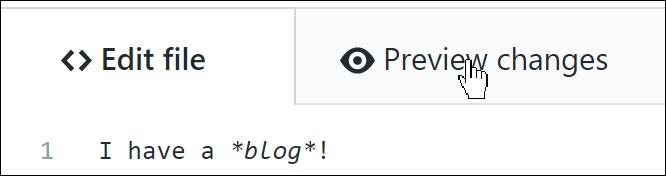

[^图A-3]: 预览更改并检查错误

要保存更改，请滚动至页面底部并点击“提交更改”（Commit changes），如图A-4所示。在GitHub上，“提交”（Commit）意味着将内容保存至GitHub服务器。

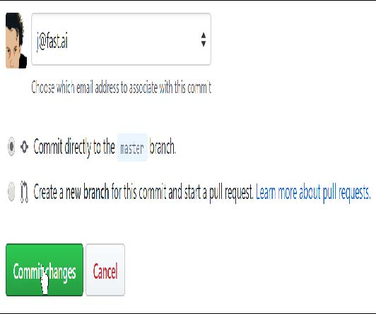

[^图A-4]: 提交更改并保存

接下来，你需要配置博客设置。操作步骤如下：点击名为 `_config.yml` 的文件，然后像编辑索引文件那样点击编辑按钮。修改标题、描述和GitHub用户名字段（参见图A-5）。请注意：冒号前的名称需保留原样，仅在冒号后（加空格）输入新值。若需添加邮箱地址和Twitter用户名，可在此处填写，但请注意这些信息将显示在你的公开博客上。


[^图A-5]: 填写设置文件

完成后，你可以像处理 `index` 文件那样提交更改；随后等待约一分钟，让 GitHub 处理你的新博客。在浏览器中访问 `<username>.github.io`（将 `<username>` 替换为你自己的 GitHub 用户名）。你将看到博客页面，其外观类似于图 A-6 所示。

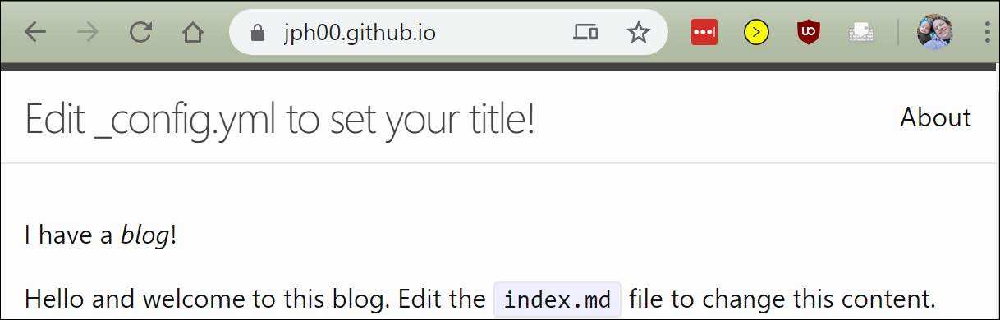

[^图A-6]: 你的博客成功上线啦

#### 创建帖子

现在你可以创建第一篇帖子了。所有博文都将存放在 `_posts`文件夹中。点击该文件夹，然后点击“创建文件”（Create file）按钮。请注意文件命名必须遵循 `<年份>-<月份>-<日期>-<名称>.md`，如图A-7所示，其中<年份>为四位数字，<月份>和<日期>为两位数字。<名称>可自定义为有助于记忆文章主题的任意名称。文件后缀 `.md` 专用于Markdown文档。


[^图A-7]: 命名你的帖子

然后你可以输入你的第一篇帖子内容。唯一规则是：帖子首行必须采用Markdown标题格式。具体操作是在行首添加 `#` 符号，如图A-8所示（该格式生成一级标题，建议仅在文档开头使用一次；二级标题使用 `##` ，三级标题使用 `###` ，依此类推）。

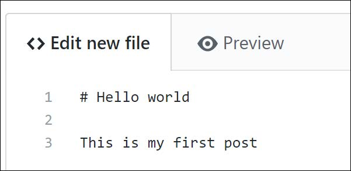

[^图A-8]: 标题的md格式

与之前一样，你可以点击预览按钮查看你的Markdown格式化效果（图A-9）。

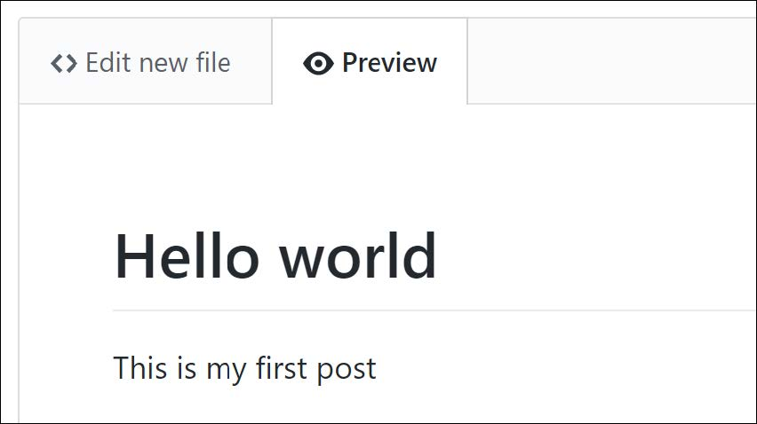

[^图A-9]: 之前的Markdown语法在你的博客上会是什么样子

你需要点击“提交新文件（Commit new file）”按钮将其保存至GitHub，如图A-10所示。

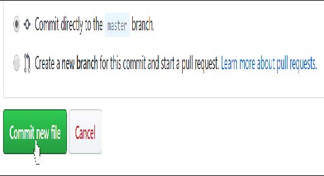

[^A-10]: 提交更改并保存

再次查看你的博客主页，你会发现这篇博文现已显示——图A-11展示了我们刚刚添加的示例博文效果。请注意，你需要等待约一分钟左右，待GitHub处理请求后文件才会显示出来。


[^图A-11]: 你的第一个帖子已经成功发布！

你可能已经注意到，我们提供了一篇示例博客文章，现在你可以将其删除。请像之前那样进入 `_posts` 文件夹，点击 `2020-01-14-welcome.md` 文件，然后点击最右侧的垃圾桶图标（如图A-12所示）。

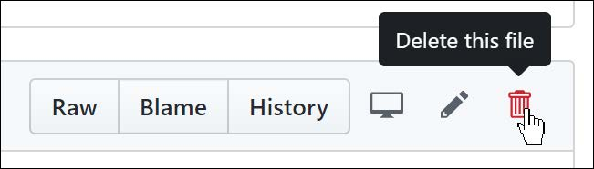

[^图A-12]: 删除示例帖子

在 GitHub 中，除非提交更改，否则任何操作都不会生效——包括删除文件！因此，点击垃圾桶图标后，请滚动至页面底部并提交更改。

你可以在文章中添加图片，只需添加一行Markdown格式，例如：

```markdown

```

要使此功能生效，你需要将图片放置在images文件夹内。具体操作步骤如下：点击images文件夹，然后点击“上传文件”（Upload files）按钮（图A-13）。

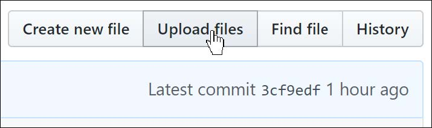

[^图A-13]: 从你的电脑上上传文件

现在让我们看看如何直接在电脑上完成所有这些操作。

#### 同步 GitHub 与你的计算机

你可能出于多种原因需要将博客内容从 GitHub 复制到本地电脑——比如希望离线阅读或编辑文章，或者为 GitHub 仓库意外丢失提前备份。

GitHub不仅允许你将仓库复制到本地计算机，还能实现仓库与计算机的同步。这意味着：你在GitHub上所做的修改会同步到本地计算机；同样，你在本地计算机上的修改也会同步到GitHub。你甚至可允许他人访问并修改你的博客，下次同步时，他们的修改与您你

要使此功能正常工作，你需要在计算机上安装名为 GitHub Desktop 的应用程序。该程序支持 Mac、Windows 和 Linux 系统。按照指引完成安装后，运行程序时系统会提示你登录 GitHub 并选择要同步的仓库。如图 A-14 所示，点击“从互联网克隆仓库”。

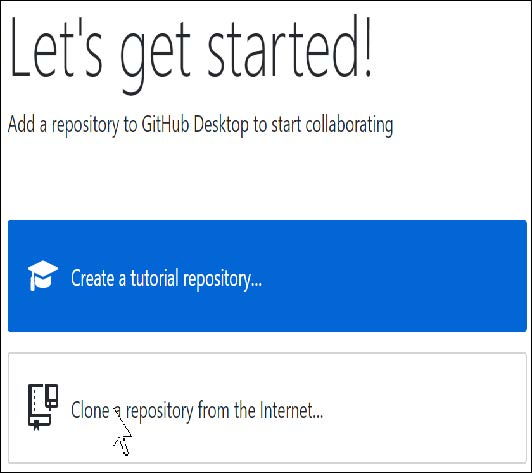

[^图A-14]: 使用桌面端Github克隆仓库

当GitHub完成仓库同步后，你即可点击“在资源管理器（或Finder（译者注：Mac系统的文件管理器。即访达））中查看仓库文件”（如图A-15所示），此时你将看到博客的本地副本！请尝试编辑计算机上的某个文件，随后返回GitHub桌面端，你会发现“同步”按钮正等待你点击。点击后，修改内容将同步至GitHub，网站页面将实时更新显示这些变更。

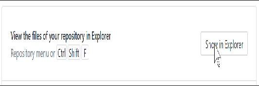

[^A-15]: 在本地查看文件

若你尚未接触过Git，GitHub Desktop是入门的好选择。你将发现，这是大多数数据科学家必备的基础工具。另一款我们希望你爱不释手的工具是Jupyter Notebook——你甚至能直接用它撰写博客！

### 使用 Jupyter 写博客

n 还可以使用Jupyter笔记本撰写博客文章。n 的Markdown单元格、代码单元格以及所有输出内容都将出现在导出的博客文章中。最佳实现方式可能已随时间更新，建议查阅本书官网获取最新信息。截至撰写本文时，最简便的笔记本转博客方案是使用 `fastpages`——这是 `fast_template` 的增强版本。

要用笔记本写博客，只需将其放入博客仓库的 `_notebooks` 文件夹，它就会出现在博客文章列表中。编写笔记本时，请直接写下希望读者看到的内容。由于多数写作平台难以嵌入代码和输出结果，我们常不自觉地减少真实示例的使用。这种方式能有效培养你在写作时大量引用示例的习惯。

通常，你可能希望隐藏诸如导入语句之类的固定代码。你可以在任意单元格顶部添加 `#hide` 标记，使其不显示在输出中。Jupyter会自动显示单元格最后一行代码的结果，因此无需添加 `print` 语句。（包含多余代码会增加读者的认知负担，请避免添加非必需代码！）