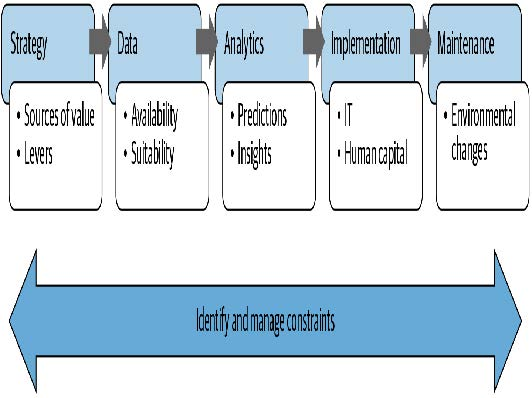
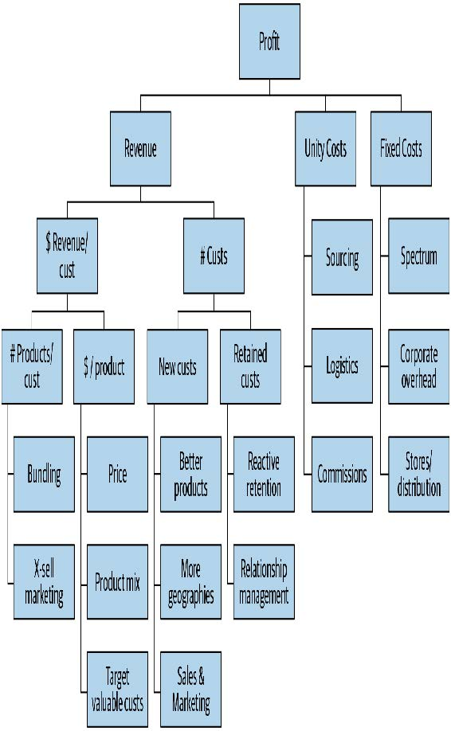

## 附录B 数据项目检查清单

创建有价值的数据项目远不止于训练一个精准的模型！杰里米从事咨询工作时，总会基于以下考量来理解组织开发数据项目的背景，这些考量总结于图B-1：

- 战略

  组织试图实现什么目标，又需要改变哪些杠杆才能更好地达成目标？

- 数据

  组织是否收集了必要数据并确保其可用性？

- 分析能力

  哪些洞察对组织具有实用价值？

- 实施能力

  组织具备哪些可用能力？

- 维护机制

  建立了哪些系统来追踪运营环境的变化？

- 制约因素

  在上述各领域需要考虑哪些制约因素？

[^图B-1]: 分析价值链

他设计了一份问卷，要求客户在项目启动前填写，并在整个项目过程中协助他们完善答案。这份问卷基于数十年来跨多个行业的项目经验，涵盖农业、采矿、银行业、酿酒业、电信业、零售业等领域。

在探讨分析价值链之前，问卷的第一部分涉及数据项目中最关键的员工：数据科学家。

### 数据科学家

数据科学家应拥有晋升为高级管理人员明确的职业路径，同时应制定招聘计划，将数据专家直接引入高级管理岗位。在数据驱动型组织中，数据科学家应位列薪酬最高的员工行列。组织应建立完善机制，使全公司数据科学家能够开展协作并相互学习。

- 当前组织内具备哪些数据科学技能？
- 如何招聘数据科学家？
- 如何在组织内部识别具备数据科学技能的人才？
- 需要哪些技能？如何评估这些技能？这些技能如何被认定为重要技能？
- 使用哪些数据科学咨询服务？在哪些情况下将数据科学工作外包？如何将这些工作转移至组织内部？
- 数据科学家的薪酬水平如何？他们向谁汇报？如何保持其技能更新？
- 数据科学家的职业发展路径是怎样的？
- 拥有强大数据分析能力的高管有多少？
- 如何选择和分配数据科学家的工作？
- 数据科学家可以使用哪些软件和硬件？

### 战略

所有数据项目都应基于解决具有战略重要性的问题。因此，对业务战略的理解必须放在首位。

- 当前组织面临的五大关键战略问题是什么？
- 有哪些可用数据可帮助应对这些问题？
- 是否采用数据驱动方法处理这些问题？数据科学家是否参与其中？
- 组织能够最有效影响哪些利润驱动因素？（参见图B-2）

[^图B-2]: 可能成为组织重要利润驱动因素的要素

- 对于每个已识别的关键利润驱动因素，组织可采取哪些具体行动和决策来影响该驱动因素？包括运营层面的行动（例如致电客户）和战略决策（例如发布新产品）。

- 针对每项最重要的行动与决策，哪些数据（无论是组织内部、供应商提供的，还是未来可收集的数据）可能有助于优化结果？

- 基于上述分析，组织内部数据驱动分析的最大机遇是什么？
- 对于每个机遇：
  - 该设计旨在影响何种价值驱动因素？
  - 它将推动哪些具体行动或决策？
  - 这些行动与决策将如何关联至项目成果？
  - 该项目预计投资回报率是多少？
  - 是否存在可能影响项目的时间限制与截止期限？

### 数据

没有数据，我们就无法训练模型！数据还必须具备可用性、整合性与可验证性。

- 该组织拥有哪些数据平台？这些可能包括数据集市、OLAP多维数据集、数据仓库、Hadoop集群、OLTP系统、部门级电子表格等。
- 请提供任何已整理的信息，以概述组织内的数据可用性状况，以及当前构建数据平台的工作进展和未来规划。
- 现有哪些工具和流程可在不同系统与格式间迁移数据？
- 不同用户组和管理员如何访问数据源？
- 组织内的数据科学家和系统管理员可使用哪些数据访问工具（如数据库客户端、OLAP客户端、内部软件、SAS等）？各工具的使用人数及使用者在组织中的职位都是什么？
- 如何向用户通报新系统上线、系统变更、新增/修改数据元素等信息？请举例说明。
- 数据访问权限限制如何决策？如何管理受保护数据的访问请求？由谁负责？依据何种标准？平均响应时间是多少？请求接受率是多少？如何追踪？
- 组织如何决定何时收集额外数据或购买外部数据？请举例说明。
- 迄今为止，哪些数据被用于分析近期数据驱动型项目？哪些数据被认为最有价值？哪些数据无用？如何判断？
- 哪些额外内部数据可能为拟议项目的数据驱动决策提供洞见？外部数据呢？
- 获取或整合这些数据可能面临哪些限制或挑战？
- 过去两年中，数据收集、编码、整合等环节发生了哪些变化，可能影响已收集数据的解读或可用性？

### 分析能力

数据科学家需要能够获取符合自身特定需求的最新工具。应定期评估新工具，以判断其是否能显著提升现有方法的效能。

- 该组织使用哪些分析工具？由谁使用？这些工具如何选型、配置和维护？在客户端计算机上部署新增分析工具的流程是什么？平均完成时间为多久？请求接受率是多少？
- 外部顾问构建的分析系统如何移交至本组织？是否要求外部承包商限制使用系统以确保结果符合内部基础设施？
- 何种情况下采用云处理？云计算使用计划是什么？
- 何种情况下聘请外部专家进行专项分析？如何管理此类合作？专家如何识别与选拔？
- 近期项目尝试过哪些分析工具？
- 哪些有效，哪些无效？原因何在？
- 请提供这些项目迄今可获取的工作成果。
- 如何评估分析结果？采用哪些指标？参照何种基准？如何判断模型是否“足够好”？
- 组织在何种情境下使用可视化工具、表格报告与预测建模（及类似机器学习工具）？对于更高级的建模方法，如何校准和测试模型？请提供实例。

### 实施能力

技术限制常常是数据项目失败的根源。请在项目初期就充分考虑这些因素！

- 提供一些过去数据驱动项目的实例，其中包含成功与失败的实施案例，并详细说明IT集成和人力资本方面的挑战以及应对方式。
- 在实施前如何验证分析模型的有效性？如何进行基准测试？
- 如何定义分析项目实施的性能要求（在速度和准确性方面）？
- 针对拟议项目，请提供以下信息：
  - 哪些IT系统将用于支持数据驱动的决策与行动
  - 如何实现该IT系统集成
  - 有哪些替代方案可能需要较少的IT集成
  - 哪些工作岗位将受到数据驱动方法的影响
  - 这些员工将接受何种培训、监督与支持
  - 可能出现的实施挑战有哪些
  - 需要哪些利益相关方确保实施成功，以及他们可能如何看待这些项目及其潜在影响

### 维护机制

除非你仔细追踪你的模型，否则可能会发现它们正将你引向灾难。

- 第三方构建的分析系统如何维护？何时移交至内部团队？
- 如何追踪模型有效性？组织何时决定重建模型？
- 数据变更如何在内部传达及管理？
- 数据科学家如何与软件工程师协作确保算法正确实现？
- 测试用例何时开发及如何维护？
- 代码重构何时执行？重构期间如何维护和验证模型的正确性与性能？
- 维护和支持需求如何记录？这些记录如何被利用？

### 制约因素

对于每个正在考虑的项目，列举可能影响项目成功的潜在限制因素。

- 是否需要修改或开发IT系统以应用项目成果？是否有更简便的实施方案可避免重大IT变更？若有，采用简化方案将如何显著降低影响？
- 数据收集、分析或实施方面存在哪些监管限制？近期是否审查过相关法规及判例？可能存在哪些变通方案？
- 组织层面存在哪些限制，包括文化、技能或结构方面的限制？
- 管理层存在哪些限制？
- 过去是否有过可能影响组织看待数据驱动方法的分析项目？