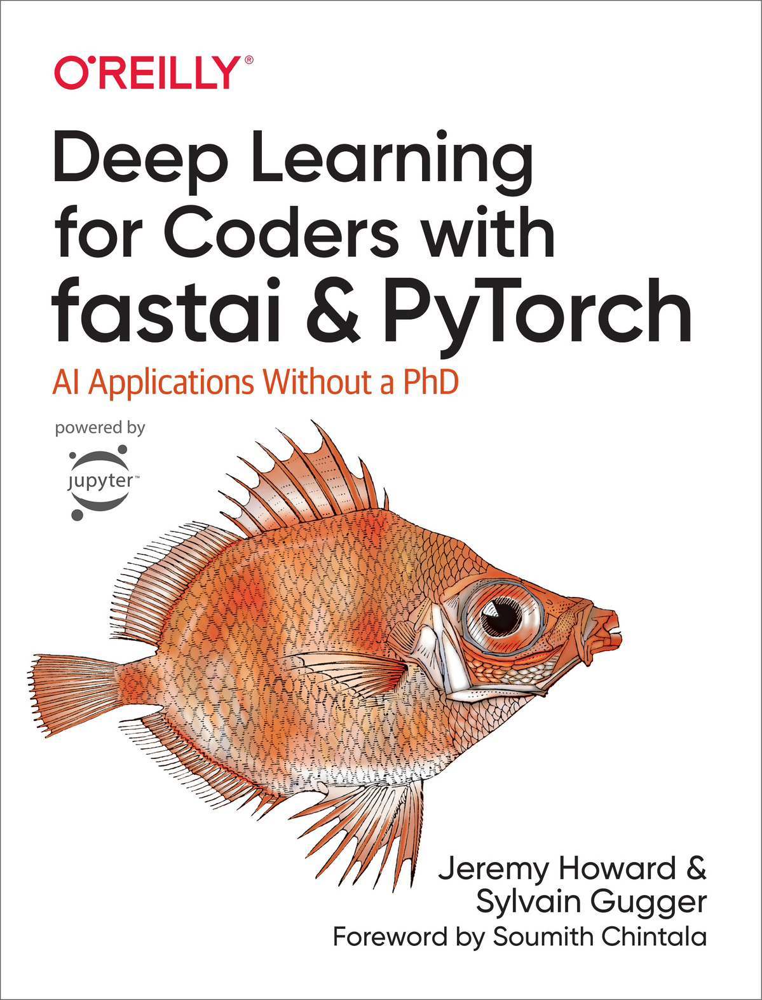

# Deep Learning for Coders with Fastai and PyTorch 非官方中文翻译

本项目是 “Create GUI Applications with Python  Qt6 (5th Edition, PyQt6)” 这本书的非官方中文翻译，原书作者是 **Sylvain Gugger** 和 **Jeremy Howard**  

> [原书指路](https://oreil.ly/deep-learning-for-coders)



值得注意的是，本书原仓库似乎已经有完整的中文翻译，但是个人认为机翻感严重，且格式可能令人难以阅读。本版本的翻译致力于为您带来更好的体验

本书的 [原仓库指路](https://github.com/fastai/fastbook)

## 快速开始

我们现在完成了少部分章节的翻译，我们计划将翻译好的部分打包为PDF文件，并放在了“PDF发行版文件夹”中。当然，您也可以在Release中找到它们，这样您可以直接下载打包好的PDF文件

在本阶段中，我们将每个章节单独创建的文件。您可以直接查看相应的markdown文件

您可以将本仓库克隆到本地方便您进行阅读和文件格式转换

```bash
git clone https://github.com/Drtxdt/Deep-Learning-for-Coders-Chinese-Book.git
cd Deep-Learning-for-Coders-Chinese-Book
```

这里推荐使用Typora进行md文件的查看，还可以以PDF的格式导出

## 有关版权

本翻译采用 MIT 开源许可证：

目前我们已经向出版社发出电子邮件进行申请授权，我们将实时更新进度

还请各位支持一下原书 [原书指路](https://oreil.ly/deep-learning-for-coders)

## 翻译进度

翻译的进度实时更新，具体请以仓库中的文件为准

##  计划

- [ ] 完全汉化（包括代码的注释）

- [ ] 以GitHub Pages的形式进行在线部署，方便诸位的查看

- [ ] 打包为可以直接下载的PDF版本

- [ ] 上传本书源码（在出版社同意后）上传到本仓库方便诸位下载

## 贡献指南

如果您发现了不妥之处，或者您也想为本项目做出贡献，请您提出Issue或者Fork本仓库之后进行Pull Request

我将会写了一个术语表：`术语表.md` 供您参考

另外，还请您遵循以下规范：

- **尽量**保持和原书一致的格式
- 代码块缩进使用**四个空格**而不是制表符`Tab`
- 与术语表尽量保持一致
- 请手动测试一下代码块看看是否可以正常运行，以防复制粘贴时的错误
- 图片请务必使用不带`./`的相对路径

您也可以查看 `CONTRIBUTING.md`来查看具体内容

## 一点碎碎念

本人只是一个为爱发电的大学生，因为在国内很难找到这样一本有趣且实用PyQt参考书，而且据我所知目前没有汉化的版本，所以我就想以微薄之力对其进行汉化，为开源社区做出贡献。我会尽全力使用空闲时间为大家提供精准且符合中文特色的翻译。

如果您认为本仓库对您有帮助，还请您为我们点亮一个Star，这是我持续为爱发电的动力~


