# fastai与PyTorch深度学习实践指南

[TOC]

### 关于本书的赞誉

> 若你正寻找一本从基础入门、引领你直抵研究前沿的指南，此书正是你的不二之选。别让那些博士们独占鳌头——你同样能运用深度学习解决实际问题。
>
> ——Hal Varian,，加州大学伯克利分校名誉教授；谷歌首席经济学家

> 随着人工智能迈入深度学习时代，我们所有人都应尽可能深入了解其运作机制。《深度学习实践指南》为初学者提供了绝佳的入门途径，它成功将多数人视为高度复杂的领域化繁为简。
>
> ——Eric Topol，《深度医疗》作者；斯克里普斯研究所教授

> 杰里米和西尔万将带你踏上一段互动之旅——字面意义上的互动，因为每行代码都可在笔记本中运行——带你穿越深度学习的损失谷与性能峰。本书穿插着多年开发和教授机器学习积累的深刻轶事与实用洞见，以轻松对话的方式阐释深奥技术概念，实现了难得的平衡。本书忠实传承fast.ai屡获殊荣的在线教学理念，为你提供前沿实用工具及真实案例进行实践演练。无论你是初学者还是资深从业者，本书都将助你加速深学习之旅，引领你抵达新的高峰——乃至新的深度。
>
> ——Sebastian Ruder，Deepmind研究科学家

> 杰里米·霍华德与西尔万·古格合著的这部杰作，成功地将人工智能领域与现实世界紧密相连。本书以独特而深刻的洞见，为所有对深度学习感兴趣的读者提供了一本既扎实又通俗易懂的入门指南，堪称该领域众多著作中的指路明灯。
>
> ——Anthony Chang，橙县儿童医院首席智能与创新官

> 如何快速掌握深度学习精髓而不陷入泥潭？如何通过实例与代码快速领悟核心概念、技术要领与行业诀窍？答案就在这里。切勿错过深度学习实践的新经典指南。
>
> ——Oren Etzioni，华盛顿大学教授、艾伦人工智能研究所首席执行官

> 这本书是难得的瑰宝——凝聚了精心设计且极具成效的教学智慧，历经数年反复打磨，造就了数千名满意学员。我便是其中之一。fast.ai以美妙的方式改变了我的生活，我坚信它也能为你带来同样的改变。
>
> ——Jason Antic，《DeOldify》创始人

> 《深度学习实践指南》是一本不可多得的资源。本书开篇即直奔主题，前几章便传授深度学习的有效应用方法。随后以深入浅出的方式全面剖析机器学习模型与框架的内部运作机制，助你透彻理解并在此基础上进行拓展。真希望当初学习机器学习时就有这样的书，堪称经典之作！
>
> ——Emmanuel Ameisen，《构建机器学习驱动的应用程序》作者

> 正如本书第一章第一节所述，“深度学习人人可学”。尽管其他书籍可能提出类似主张，但本书真正践行了这一承诺。作者们虽具备该领域的深厚造诣，却能以完美契合编程背景但缺乏机器学习经验的读者视角进行阐述。本书坚持先展示实例，仅在具体案例中穿插理论讲解。对多数人而言，这正是最佳学习路径。书中不仅全面覆盖了计算机视觉、自然语言处理和表格数据处理等深度学习核心应用领域，更涵盖了其他著作常忽略的数据伦理等关键议题。总而言之，这是程序员精通深度学习的最佳资源之一。
>
> ——Peter Norvig，谷歌研究总监

> 古格和霍华德为所有接触过编程的人打造了一本理想的资源。本书及其配套的fast.ai课程采用实践导向，通过预先编写的可探索复用的代码，以简明实用的方式揭开深度学习的神秘面纱。告别枯燥的理论证明与抽象概念。第一章你将亲手构建首个深度学习模型，读完本书时，你将掌握解读任何深度学习论文方法论章节的核心能力。
>
> ——Curtis Langlotz，斯坦福大学医学与影像人工智能中心主任

> 本书揭开了最神秘的黑匣子——深度学习的神秘面纱。它提供完整的Python笔记本，支持快速代码实验。同时深入探讨人工智能的伦理影响，并展示如何避免其演变为反乌托邦。
>
> ——Guillaume Chaslot，Mozilla研究员

> 作为一名从钢琴家转型为OpenAI研究员的人，我常被问及如何入门深度学习，而我总是推荐《深度学习实践指南》。这本书实现了看似不可能的任务——它既是复杂主题的友好指南，又充满尖端知识，连资深从业者也会爱不释手。
>
> ——Christine Payne，OpenAI研究员

> 一本极具实践性且通俗易懂的书籍，助您快速开启深度学习项目。本书以清晰易懂的方式，诚恳地指引读者踏上深度学习实践之路。无论初学者还是高管都能从中获益。这正是我多年前梦寐以求的指南！
>
> ——Carol Reiley，Drive.ai 创始人兼董事长

> 杰里米和西尔万在深度学习领域的专长、他们对机器学习的务实态度，以及众多宝贵的开源贡献，使他们成为PyTorch社区的核心人物。本书延续了他们与fast.ai社区推动机器学习普及的工作，必将为整个人工智能领域带来巨大裨益。
>
> ——Jerome Pesenti，Facebook人工智能副总裁

> 深度学习是当今最重要的技术之一，它推动了人工智能领域诸多惊人的近期突破。它曾是博士专属领域，如今已非如此！本书基于广受欢迎的fast.ai课程，使任何具备编程经验的人都能掌握深度学习。本书涵盖完整体系，配有精彩的实践案例及配套互动网站。即便是博士学者也能从中获益良多。
>
> ——Gregory Piatetsky-Shapiro，KDnuggets总裁 

> 作为我多年来持续推荐的fast.ai课程的延伸，这本由杰里米和西尔万合著的书籍——两位当今顶尖的深度学习专家——将在短短数月内助你从初学者蜕变为合格的从业者。终于，2020年也涌现出些积极的成果！
>
> ——Louis Monier，Altavista创始人；前爱彼迎人工智能实验室负责人

> 我们推荐这本书！《深度学习实践指南》运用先进框架，快速推进具体的人工智能或自动化任务实践。这为探讨通常被忽视的主题留出空间，例如安全部署模型至生产环境，以及亟需的数据伦理章节。
>
> ——John Mount 和 Nina Zumel，《R语言实用数据科学》作者

> 本书是“为程序员而写”，无需博士学位。我本人拥有博士学位却非程序员，为何受邀撰写书评？只为向各位揭示它究竟有多么惊人！
>
> 翻开第一章几页内容，你就能掌握如何用四行代码、不到一分钟的计算时间，构建出能区分猫狗的尖端神经网络。接着进入第二章，它将带你从模型到生产环境，展示如何无需HTML或JavaScript、无需拥有服务器，就能快速部署网络应用。
>
> 我将此书比作洋葱。它提供最佳配置的完整解决方案，若需调整，可剥去外层；若需更精细的调校，可继续剥离；若追求极致，甚至能深入到裸用PyTorch的层面。在这部600页的著作中，您将获得三种独立声音的全程指引，它们将为您提供方向与独特视角。
>
> ——Alfredo Canziani，纽约大学计算机科学教授

> 《程深度学习实践指南》是一本通俗易懂的对话式书籍，采用全局视角讲解深度学习概念。本书注重让读者从一开始就通过真实案例动手实践，仅在必要时引入相关概念。实践者可通过前半部分的动手实例进入本书的深度学习世界，而当他们穿越后半部分时，会自然接触到更深层的概念，所有有害的误区都将被彻底揭穿。
>
> ——Josh Patterson，帕特森咨询公司

## 真正的前言

深度学习是一项强大的新技术，我们认为它应在众多学科领域得到广泛应用。领域专家最有可能发掘其新应用场景，我们需要更多来自不同背景的人士参与其中并开始运用这项技术。

正因如此，杰里米联合创立了fast.ai，他希望通过免费在线课程和软件让深度学习更易上手。西尔万是Hugging Face的研究工程师。此前他曾在fast.ai担任研究科学家，并曾在为学生准备进入法国精英大学的项目中担任数学和计算机科学教师。我们共同撰写本书，希望将深度学习带给尽可能多的人。

### 谁适合这本书？

如果你是深度学习和机器学习的完全新手，这里非常欢迎你。我们唯一的期望是你已经掌握编程技能，最好是Python语言。

> 没有经验？完全没问题！
>
> 即使你没有任何编程经验也完全没问题！前三章的内容专门为高管、产品经理等群体精心编写，旨在帮助他们掌握深度学习领域最关键的核心知识。当你在文本中看到代码片段时，请尝试浏览它们，以获得对代码功能的直观理解。我们将逐行解析这些代码。语法细节远不如对整体运作机制的高层级理解重要。

如果你已是深具自信的深度学习实践者，本书同样能为你提供诸多启发。我们将向你展示如何取得世界级的成果，包括运用最新研究成果的技术。正如我们将要阐明的，这并不需要高深的数学训练或多年的钻研，你只需要一点点常识和坚韧不拔的毅力。

### 你需要知道些什么？

正如我们之前所说，唯一的先决条件是你懂得编程（一年经验就足够了），最好是掌握Python语言，并且至少完成过高中数学课程的学习。即使你现在记忆模糊也没关系，我们会根据需要进行复习。[Khan Academy](https://www.khanacademy.org/) 提供了丰富的免费在线资源，能为你提供帮助。

我们并不是说深度学习不涉及高中以上的数学知识，但在讲解需要这些知识的主题时，我们会教你所需的基础知识（或引导你获取相关学习资源）。

本书从宏观视角切入，逐步深入细节，因此你可能需要时不时地放下书本，去学习一些补充知识（某种编程方法或数学知识点）。这完全没问题，这正是我们希望读者阅读本书的方式。开始阅读吧，你可以仅在需要时才去查阅补充资源。

请注意，Kindle或其他电子阅读器用户可能需要双击图片才能查看完整尺寸版本。

> 线上资源
>
> 本书中展示的所有代码示例均以Jupyter笔记本的形式在线提供（别担心，您将在第1章中全面了解Jupyter是什么）。这是本书的交互式版本，您可实际执行代码并进行实验。更多详情请访问 [本书网站](https://book.fast.ai/)。该网站还提供各类工具的最新配置指南及若干额外赠章。

### 你将会学到什么？

在你读完这本书之后，你将会知道以下内容：

- 如何训练模型以在以下特定领域实现最先进的结果：
  - 计算机视觉，包括图像分类（例如按品种分类宠物照片）以及图像定位与检测（例如在图像中寻找动物）
  - 自然语言处理（NLP），包括文档分类（例如电影评论、情感分析）和语言建模
  - 表格数据（如销售预测），包含分类变量、连续变量及混合变量，并涵盖时间序列数据。
  - 协同过滤（例如电影推荐）
- 如何将模型转化为web应用程序
- 深度学习模型的工作原理及其应用方法，以及如何利用这些知识提升模型的准确性、速度和可靠性
- 在实践中学会真正重要的最新深度学习技术
- 如何阅读深度学习研究论文
- 如何从零开始实现深度学习算法
- 如何思考工作的伦理影响，以确保你正在让世界变得更美好，且你的工作不会被滥用于危害他人

请参阅目录获取完整列表，但为了让你先睹为快，以下是部分涵盖的技术（不必担心这些术语目前对你来说可能毫无意义——你很快就会掌握它们）：

- 仿射函数与非线性函数
- 参数与激活函数
- 随机初始化与迁移学习
- SGD、Momentum、Adam及其他优化器
- 卷积操作
- 批量归一化
- Dropout（随机失活）
- 数据增强
- 权重衰减
- ResNet与DenseNet架构
- 图像分类与回归
- 嵌入表示
- 循环神经网络（RNNs）
- 分割技术
- U-Net架构
- 以及更多内容！

> 章节问卷
>
> 如果你翻到每章结尾，会发现一份问卷。这是回顾章节内容的好地方——因为（我们希望！）读完每章后，你都能回答所有问题。事实上，有位审阅者（感谢弗雷德！）表示他喜欢先阅读问卷，再研读章节内容，这样就能明确重点关注方向。

### O’Reilly 的线上学习资源

> 注记
>
> 四十余年来，[O'Reilly Media](http://oreilly.com/) 始终致力于提供技术与商业培训、知识及洞见，助力企业取得成功。

我们独特的专家与创新者网络通过书籍、文章及在线学习平台分享知识与专业技能。O'Reilly在线学习平台为你提供按需访问的实时培训课程、深度学习路径、交互式编码环境，以及来自O'Reilly和200多家出版商的海量文本与视频资源。了解更多信息，请访问：http://oreilly.com。

### 如何与我们取得联系

关于本书的任何意见和疑问，请联系出版社：

O’Reilly Media, Inc.
1005 Gravenstein Highway North
Sebastopol, CA 95472
800-998-9938 (in the United States or Canada)
707-829-0515 (international or local)
707-829-0104 (fax)

我们为本书开设了网页，其中列出了勘误表、示例及任何补充信息。你可通过以下网址访问该页面：https://oreil.ly/deep-learning-for-coders。

请发送邮件至 bookquestions@oreilly.com 发表评论或咨询本书的技术问题。

有关我们的书籍和课程的最新资讯，请访问：http://oreilly.com。

在Facebook上关注我们：http://facebook.com/oreilly

在Twitter上关注我们：http://twitter.com/oreillymedia

在YouTube上观看我们的视频：http://www.youtube.com/oreillymedia

## 推荐序

在极短的时间内，深度学习已成为一项广泛实用的技术，在计算机视觉、机器人学、医疗保健、物理学、生物学等众多领域实现了问题的解决与自动化。深度学习令人欣喜之处在于其相对的简洁性。强大的深度学习软件已然建成，让入门变得快速而轻松。短短数周内，你就能掌握基础知识，并熟练运用相关技术。

这开启了一个充满创造力的世界。当你开始将它应用于手头有数据的问题时，看着机器为你解决难题，那种感觉美妙极了。然而，你渐渐意识到自己正逼近一道高墙——你构建的深度学习模型效果远不及预期。此时你便迈入了下一阶段：寻找并研读深度学习领域的尖端研究成果。

然而，深度学习领域存在着庞大的知识体系，背后支撑着三十年的理论、技术与工具发展。当你研读相关研究时，会发现人类往往用极其复杂的方式解释简单事物。科学家在论文中使用的术语和数学符号显得晦涩难懂，而现有的教科书或博客文章似乎都未能以通俗易懂的方式阐述所需的基础知识。工程师和程序员往往默认读者已经了解GPU的工作原理，并掌握各种冷门工具的使用方法。

此刻你一定会渴望有个导师或知己可倾诉。一个曾与你处境相同、精通工具与数学的人——能引领你探索顶尖研究、前沿技术与高级工程，并将复杂知识化繁为简。十年前我正站在你的位置初涉机器学习领域。多年间，我苦苦挣扎于那些略带数学内容的论文。身边虽有良师益友相助，却仍耗费多年才真正驾驭机器学习与深度学习。这段经历促使我共同创建PyTorch——这个让深度学习触手可及的软件框架。

杰里米·霍华德和西尔万·古格也曾与你处境相同。他们渴望学习并应用深度学习技术，却未曾接受过机器学习科学家或工程师的正规训练。与我相似，杰里米和西尔万历经数年逐步精进，最终成为该领域的专家与领军人物。但不同于我的是，杰里米和西尔万无私地投入了大量精力，确保他人不必重蹈他们走过的艰辛之路。他们创建了名为fast.ai的卓越课程，让掌握基础编程的人也能接触前沿深度学习技术。该课程已培养出数十万名热忱的学习者，他们如今都已成为杰出的实践者。

在这本不懈创作的著作中，杰里米与西尔万构建了一场穿越深度学习的奇幻之旅。他们运用简明语言阐释每个概念，将前沿的深度学习技术与尖端研究成果呈现于读者眼前，却又使其通俗易懂。

你将跟随本书畅游计算机视觉的最新进展，深入自然语言处理领域，并在500页的精彩旅程中掌握基础数学知识。这趟旅程不仅充满乐趣，更将引领你将创意转化为实际产品。快快加入fast.ai社区吧——这里汇聚了数千名在线实践者，宛如你的家人一样。无论遇到何种难题，总有志同道合的伙伴与你畅谈，共同构思大大小小的解决方案。

我很高兴你发现了这本书，希望它能激励你将深度学习用于善举，无论问题本质如何。

——Soumith Chintala，PyTorch 联合创始人

# 第一部分：实践中的深度学习

## 1. 你的深度学习旅程

你好，感谢你让我们加入你的深度学习之旅，无论已经走得多远！在本章中，我们将进一步介绍本书的框架架构，阐释深度学习的核心概念，并指导你在不同任务场景下训练首个模型。即使你没有技术或数学背景也完全不必担心（当然若有相关背景也相当有用！）；本书的创作初衷正是为了让深度学习知识惠及最广泛的读者群体。

### 深度学习是大家的

许多人以为要取得深度学习的卓越成果，就必须准备各种稀罕难觅的工具，但正如本书将揭示的那样，这种想法大错特错。表1-1列举了若干实现世界级深度学习时*完全不需要* 的要素。

| 传说（真的不需要） | 真相                                       |
| ------------------ | ------------------------------------------ |
| 很多数学知识       | 会高中数学就行了                           |
| 很多数据           | 我们仅使用不到50项数据就取得了破纪录的成果 |
| 很多很贵很贵的电脑 | 你可以免费获得进行尖端研究所需的一切资源   |

*深度学习* 是一种计算机技术，通过多层神经网络提取和转换数据，应用场景涵盖人类语音识别到动物图像分类。每层网络都从前一层获取输入数据，并逐步进行精炼。这些层通过算法训练，该算法通过最小化错误来提高准确性。通过这种方式，网络可以学会执行特定任务。我们将在下一节详细讨论训练算法。

深度学习兼具强大功能、灵活适应性和操作简便性。正因如此，我们坚信它应广泛应用于众多学科领域，包括社会科学、自然科学、艺术、医学、金融、科学研究等诸多领域。以个人为例，尽管毫无医学背景，Jeremy仍创立了Enlitic公司，该公司运用深度学习算法进行疾病诊断。公司成立仅数月，便宣布其算法识别恶性肿瘤的准确率已超越放射科医师。

以下是一些领域中数千项任务的列表，在这些任务中，深度学习或大量使用深度学习的方法目前是全球最优解：

- 自然语言处理（NLP）

  回答问题；语音识别；文档摘要；文档分类；在文档中查找人名、日期等信息；搜索提及特定概念的文章

- 计算机视觉

  卫星与无人机影像解译（例如用于灾害抗灾能力评估）、人脸识别、图像描述生成、交通标志识别、自动驾驶车辆中行人与车辆定位

- 医药学

  在放射影像（包括CT、MRI和X光影像）中发现异常；统计病理切片中的特征；测量超声影像中的特征；诊断糖尿病视网膜病变

- 生物学

  蛋白质折叠；蛋白质分类；各种基因组学任务，例如肿瘤-正常测序及临床可操作性基因突变分类；细胞分类；蛋白质-蛋白质相互作用分析

- 图像生成

  为图像上色、提升图像分辨率、去除图像噪点、将图像转换为著名艺术家风格的艺术作品

- 推荐系统

  网页搜索、产品推荐、主页布局

- 游戏领域

  国际象棋、围棋、大多数Atari电子游戏以及许多即时战略游戏

- 机器人

  处理难以定位（例如透明、光滑、缺乏纹理）或难以拾取的物体

- 其他应用

  财务与物流预测、文本转语音，以及更多、更多功能……

值得我们注意的是，深度学习的应用如此广泛，然而几乎所有的深度学习都基于一种创新的模型类型：神经网络。

但神经网络实际上并非全新事物。为了更全面地理解该领域，我们不妨从历史沿革说起。

### 神经网络：一段简史

1943年，神经生理学家 Warren McCulloch 与逻辑学家 Walter Pitts 合作，共同开发出一种人工神经元的数学模型。在他们的论文《神经活动内在观念的逻辑演算》中，他们提出如下论断：

> 由于神经活动的“全有或全无”特性，神经事件及其相互关系可通过命题逻辑进行处理。研究发现，每种神经网络的行为均可通过此逻辑进行描述。

McCulloch和Pitts意识到，真实神经元的简化模型可通过简单的加法和阈值处理来表示，如图1-1所示。Pitts是自学成才，12岁时便收到剑桥大学的邀请，本来计划跟随伟大的B ertrand Russell 学习。他并未接受此邀约，事实上，他一生中从未接受过任何高级学位或权威职位的邀请。他大部分著名著作都是在无家可归期间完成的。尽管缺乏官方认可的职位且日益被社会孤立，他与McCulloch的合作仍产生了深远影响，其成果被心理学家Frank Rosenblatt继承发扬。

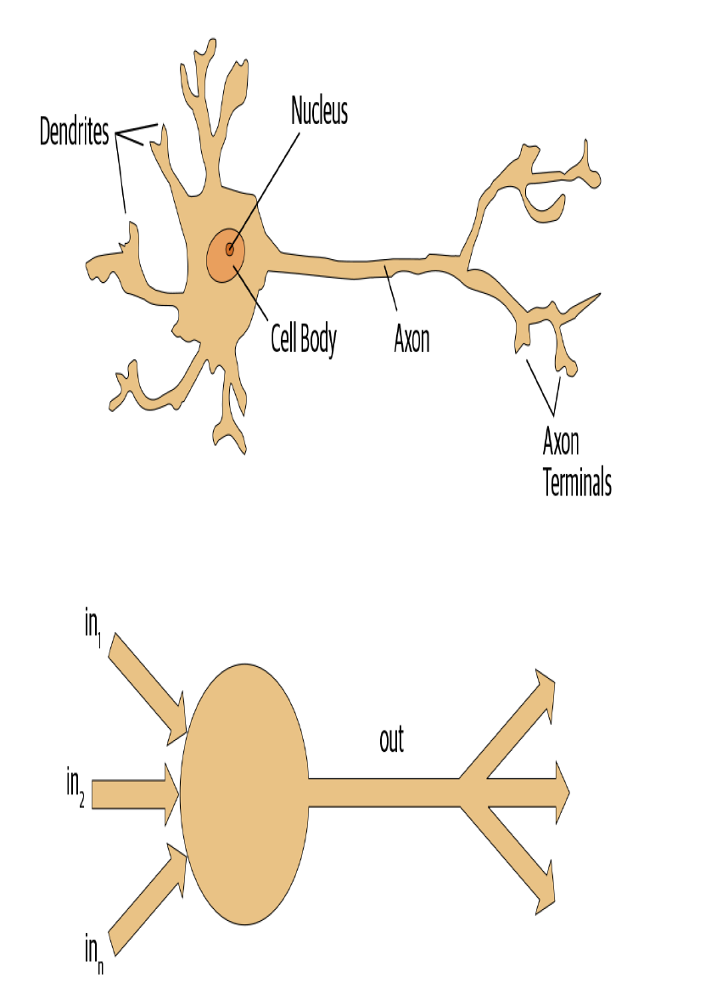

[^图1-1]: 自然神经元与人工神经元

Rosenblatt 进一步发展了人工神经元，使其具备学习能力。更重要的是，他致力于构建首个运用这些原理的装置——马克一型感知器。在《智能自动机的设计》一文中，Rosenblatt 这样描述这项工作：“我们即将见证这样一台机器的诞生——它无需人类训练或控制，就能感知、识别并辨别周围环境。”感知机建成后成功实现了对简单形状的识别。

麻省理工学院的 Marvin Minsky 教授（他与Rosenblatt在同一所高中就读，年级比Rosenblatt低一届！）与 Seymour Papert 特合著了《感知器》（麻省理工出版社）一书，探讨Rosenblatt的发明。他们指出单层感知器无法学习某些简单却关键的数学函数（如异或运算）。在同一本书中，他们同时指出：通过多层结构可突破此限制。遗憾的是，学术界仅广泛认可了前者。此后二十年间，全球学术界几乎完全放弃了对神经网络的研究。

过去五十年间神经网络领域最具里程碑意义的著作，当属David Rumelhart, James McClelland及其PDP研究小组于1986年由麻省理工学院出版社出版的多卷本《并行分布式处理》（Parallel Distributed Processing，PDP）。该书第一章阐述的愿景与Rosenblatt所展现的相呼应：

> 人类比当今计算机更聪明，因为大脑采用的基本计算架构更适合处理人类擅长的自然信息处理任务的核心环节……我们将提出一种用于建模认知过程的计算框架，该框架似乎比其他框架更接近大脑可能采用的计算方式。

PDP理论在此提出的前提是：传统计算机程序的工作方式与大脑截然不同，这或许正是计算机程序（当时）在处理大脑轻松完成的任务（如识别图片中的物体）时表现欠佳的原因。作者声称PDP方法比其他框架更接近大脑运作方式，因此可能更擅长处理此类任务。

事实上，PDP中阐述的方法与当今神经网络采用的方法非常相似。该书将并行分布式处理定义为需要满足以下条件：

- 一组处理单元
- 一种激活状态
- 每个单元的输出函数
- 一种单元间的连接模式
- 一种传播规则，用于通过连接网络传播活动模式
- 一种激活规则，用于将作用于单元的输入与该单元当前状态结合，从而产生单元输出
- 一种学习规则，通过经验修改连接模式
- 一个系统可以正常运行的环境

我们将在这本书中看到，现代神经网络能够满足上述各项要求。

在1980年代，大多数模型都构建了第二层神经元，从而规避了Minsky 和
Papert所指出的问题（若沿用前文框架，这正是他们所说的“单元间连接模式”）。事实上，神经网络在80、90年代被广泛应用于实际项目。然而，理论层面的误解再度阻碍了该领域发展。理论上，仅需增加一层神经元便足以使神经网络近似任何数学函数，但实践中这类网络往往过于庞大且运行缓慢，难以发挥实际效用。

尽管研究人员早在30年前就证明，要获得实用且良好的性能，需要使用更多层神经元，但直到近十年，这一原理才得到更广泛的认可与应用。得益于多层结构的应用，加之计算机硬件的提升、数据可用性的增加以及算法优化使神经网络得以更快更轻松地训练，神经网络如今终于释放出其潜在价值。如今我们已拥有Rosenblatt预言的成果：“无需人类训练或控制，便能感知、识别并判定环境的机器。”

本书将教你如何构建这些内容。不过首先，既然我们即将共度漫长时光，让我们先互相了解一下……

### 我们是谁

我们是Sylvain 和 Jeremy，此次旅程的向导。我们希望您能认为我们非常适合这个职位。

Jeremy 从事机器学习应用与教学工作已有约30年。他25年前开始使用神经网络技术。在此期间，他领导过众多以机器学习为核心的公司和项目，包括创立首家专注深度学习与医学领域的公司Enlitic，并担任全球最大机器学习社区Kaggle的总裁兼首席科学家。他与Rachel Thomas博士共同创立fast.ai，该机构开发的课程正是本书的理论基础。

不时地，你会直接从我们这里收到侧边栏消息，像这样的一条，来自Jeremy：

> JEREMY说
>
> 大家好，我是Jeremy！你们或许会感兴趣的是，我并没有接受过任何正规的技术教育。我获得了哲学专业的文学学士学位，成绩并不突出。比起理论研究，我更热衷于参与实际项目，因此大学期间我一直在麦肯锡公司担任全职管理咨询顾问。如果你也是宁愿亲手实践而非耗费数年钻研抽象概念的人，你定能理解我的处境！请留意我撰写的侧边栏内容，那里提供最适合数学或技术背景较弱人群的信息——也就是像我这样的人……

另一方面，Sylvain 对正规技术教育颇有研究。他撰写了10本数学教材，涵盖了整个法国高等数学课程体系！

> SYLVAIN说
>
> 与Jeremy不同，我并未花费多年时间编写代码并应用机器学习算法。相反，我最近通过观看他的fast.ai课程视频才进入机器学习领域。因此，如果你从未打开过终端并在命令行中编写过命令，你就会理解我的出发点！请留意我添加的侧边栏注释，其中包含最适合具有数学或正式技术背景、但缺乏实际编码经验的人群的信息——也就是像我这样的人……

fast.ai课程吸引了来自世界各地、各行各业的数十万学员。Sylvain成为Jeremy所见过的最杰出的学员，由此加入fast.ai团队，并与Jeremy共同开发了fastai软件库。

这一切意味着，在我们团队中，你将获得两全其美的优势：既有比任何人都更了解该软件的人——因为他们亲手编写了它；既有数学专家，也有编程与机器学习专家；同时还有这样一群人：他们既能体会作为数学领域相对外行者的感受，也能理解在编程与机器学习领域相对陌生的处境。

任何看过体育赛事的人都知道，如果有一对解说搭档，就需要第三人负责“特别点评”。我们的特邀评论员是Alexis Gallagher。Alexis拥有多元化的背景：他曾是数学生物学研究员、剧本作家、即兴表演者、麦肯锡顾问（就像Jeremy！）、Swift程序员，还担任过首席技术官。

> ALEXIS说
>
> 我决定开始学习人工智能了！毕竟其他领域我几乎都尝试过了……虽然我对构建机器学习模型毫无基础，但……这能有多难？我将和你们一样，通过这本书逐步学习。请留意我分享的学习小贴士，这些是我在学习过程中发现的实用技巧，希望对你也有帮助。

### 如何学习深度学习

哈佛大学教授David Perkins在其著作《完整学习法》（Jossey-Bass出版社）中对教学提出了诸多见解。其核心理念在于传授完整的游戏体系。这意味着若教授棒球运动，应先带学员观赛或亲身体验，而非从零开始讲解如何缠绕麻绳制作棒球、抛物线物理原理或球体在球棒上的摩擦系数。

Paul Lockhart，哥伦比亚大学数学博士、布朗大学前教授及中小学数学教师，在其具有深远影响的论文 [《数学家的哀叹》](https://oreil.ly/yNimZ) 中描绘了一个噩梦般的世界：音乐与艺术竟被以数学的方式教授。孩子们必须耗费十余年掌握乐谱与理论，在课堂上反复将乐谱转调至不同调性，才能被允许聆听或演奏音乐。美术课上，学生们学习色彩理论与工具应用，却要等到大学才能真正提笔作画。听起来荒谬？这正是数学的教学现状——我们要求学生耗费数年进行机械记忆，学习枯燥割裂的 *基础* 知识，并宣称这些知识将在未来有所回报，尽管那时大多数人早已放弃这门学科。

遗憾的是，许多深度学习教学资源正是从这里起步——要求学习者跟随黑塞矩阵的定义和损失函数泰勒近似定理进行学习，却从未给出实际运行的代码示例。我们并非贬低微积分。我们热爱微积分，Sylvain 甚至在大学讲授过这门学科，但我们认为它并非学习深度学习的最佳起点！

在深度学习中，若你怀有优化模型的动力，它确实能助你一臂之力。正是这种动力促使你开始学习相关理论。但前提是你必须先拥有模型。我们几乎所有内容都通过真实案例教学。随着案例的深入展开，我们将逐步引导你优化项目，让你在实践中逐步掌握所需的理论基础——这种情境化学习方式能让你真正理解理论的重要性及其运作机制。

因此，我们向你作出如下承诺：在本书的撰写过程中，我们始终遵循以下原则：

- 传授整套技艺

  我们将首先向你展示如何使用完整、可运行、可操作且先进的深度学习网络，通过简单而富有表现力的工具解决现实世界中的问题。随后我们将逐步深入探索这些工具的构建原理，以及构建这些工具的工具是如何诞生的，以此类推……

- 始终以实例教学

  我们将确保内容具备可直观理解的背景与目的，而非从代数符号运算开始。

- 尽可能地简化

  我们耗费多年时间开发工具并完善教学方法，使原本复杂的主题变得简单易懂。

- 清除学习障碍

  深度学习至今仍是少数人的游戏。我们正将其开放，确保人人皆可参与。

深度学习最困难的部分在于手工操作：如何判断数据是否充足、格式是否正确、模型是否正常训练？若出现问题又该如何应对？正因如此，我们主张实践出真知。如同基础数据科学技能，深度学习的精进唯有通过实践经验实现。过度沉溺理论反而可能适得其反。关键在于直接编写代码解决问题：当你具备实践背景和动力时，理论知识自然水到渠成。

我们的旅途中难免会遇到艰难时刻，有时你会感到停滞不前。请坚持下去！翻回书中最后一个你确定没有卡住的部分，然后慢慢读下去，找到第一个不清楚的地方。接着自己尝试一些代码实验，并在谷歌上搜索更多关于你卡住的问题的教程——通常你会发现对材料的不同解读角度，这可能有助于你豁然开朗。另外，首次阅读时无法完全理解内容（尤其是代码）是正常现象。试图逐段理解再推进有时反而困难。当后续内容提供更多背景，形成完整认知后，某些概念反而会豁然开朗。因此若遇到卡壳的章节，不妨先跳过继续阅读，并标记稍后回来重新研究。

请记住，成功从事深度学习并不需要特定的学术背景。许多重要的突破性成果都出自没有博士学位的研究人员之手，例如论文 [《基于深度卷积生成对抗网络的无监督表示学习》](https://oreil.ly/JV6rL) ——这是过去十年最具影响力的论文之一，被引用超过5000次——作者Alec Radford 撰写时还是本科生。即便在特斯拉这样致力于解决自动驾驶汽车极端挑战的公司，CEO埃隆·马斯克也 [表示](https://oreil.ly/nQCmO)：

> 博士学位绝对不是必需的。真正重要的是对人工智能的深刻理解，以及能够以真正有用的方式实现神经网络的能力（后者才是真正的难点）。就算你连高中都没毕业也无所谓。

不过，要想成功，你需要做的是将本书学到的知识应用到个人实践项目中，并始终坚持不懈。

#### 你的项目与你的心态

无论你渴望通过叶片照片识别植物病害，自动生成编织图案，从X光片诊断肺结核，还是判断浣熊何时使用给猫用的门——我们都将助你快速运用深度学习解决自身问题（借助他人预训练模型），随后逐步深入细节。你将在下一章开篇30分钟内，学会如何运用深度学习以顶尖精度解决自身问题！（如果你迫不及待想动手编程，现在即可直接跳转该章节。） 外界存在一种对你不利的误解，他们认为必须拥有谷歌级别的计算资源和数据集才能进行深度学习，但事实并非如此。

那么，哪些任务适合用作测试案例呢？你可以训练模型区分毕加索和莫奈的画作，或是筛选出女儿的照片而非儿子的照片。聚焦于个人爱好和热情往往更有助益——初学时设定四五个小项目而非试图解决宏大难题，效果通常更佳。由于容易陷入困境，过早追求宏大目标往往适得其反。待掌握基础后，再去完成令你真正引以为傲的作品吧！

> JEREMY说
>
> 深度学习几乎能处理任何问题。例如，我创办的第一家初创公司名为FastMail，自1999年成立之初便提供增强型电子邮件服务（至今仍在运营）。2002年，我让它采用一种原始的深度学习形式——单层神经网络，来帮助分类邮件并阻止客户收到垃圾邮件。

在深度学习领域表现出色的人通常具备的性格特征，包括玩心和好奇心。已故物理学家理查德·费曼便是我们预想中深谙深度学习之道的人物典范：他对亚原子粒子运动规律的理解，源于他观察盘子在空中旋转时晃动现象时所产生的兴趣。

现在让我们聚焦于你即将学习的内容，首先从软件开始。

### 软件：PyTorch，fastai以及Jupyter（以及为什么它无关紧要）

我们已完成数百个机器学习项目，使用过数十种软件包和多种编程语言。在fast.ai，我们编写的课程涵盖了当今主流的深度学习和机器学习软件包。自2017年PyTorch问世以来，我们投入上千小时进行测试，最终决定将其应用于未来的课程开发、软件构建及研究工作。此后，PyTorch已成为全球增长最快的深度学习库，并已被顶尖学术会议的大多数研究论文采用。这通常是产业应用的前瞻指标，因为这些论文最终会转化为商业产品与服务。我们发现PyTorch是深度学习领域中最灵活且最具表达力的库。它既不牺牲速度也不牺牲简洁性，二者兼得。

PyTorch最适合作为低级基础库，为高级功能提供基础运算支持。fastai库是基于PyTorch实现高级功能的最流行库，尤其契合本书目标——它独创性地提供了深度分层的软件架构（甚至有同行评审的学术论文探讨这种分层API）。在本书中，随着对深度学习基础的探索日益深入，我们也将逐步剖析fastai的各层架构。本书涵盖fastai库的2.0版本——这是从零重写的版本，提供了诸多独特特性。

然而，具体学习哪种软件并不重要，因为从一个库切换到另一个库只需几天时间。真正重要的是扎实掌握深度学习的基础理论和技术。我们将重点使用能清晰表达学习概念的代码。讲解高级概念时，采用高级fastai代码；教授基础概念时，则使用低级PyTorch甚至纯Python代码。

尽管如今新的深度学习库似乎正以惊人的速度涌现，但你必须做好准备迎接未来数月乃至数年间更迅猛的变化。随着更多人投身该领域，他们将带来更丰富的技能与创意，并尝试更多创新方案。你应当预见，当下所学的任何特定库与软件，一两年后都将被时代淘汰。试想在网络编程领域——这个比深度学习成熟得多且发展更缓慢的领域——技术栈和库的更新换代何其频繁。我们坚信学习的重点应放在理解底层技术原理、掌握实践应用方法，以及快速掌握新工具与技术的能力上。

读完本书，你将理解fastai内部几乎所有代码（以及PyTorch的大部分代码），因为在每个章节中，我们都会深入挖掘一层，向你展示构建和训练模型时究竟发生了什么。这意味着你将掌握现代深度学习中最关键的最佳实践——不仅学会如何使用，更能理解其背后的原理与实现机制。若需在其他框架中应用这些方法，你已具备必要的知识储备。

由于学习深度学习最重要的环节是编写代码和实验，因此拥有一个优秀的代码实验平台至关重要。最受欢迎的编程实验平台名为Jupyter，本书将全程使用该平台。我们将向您展示如何利用Jupyter训练和实验模型，并深入观察数据预处理与模型开发流程的每个阶段。Jupyter 是 Python 数据科学领域最受欢迎的工具，其受欢迎程度绝非偶然。它功能强大、灵活多变且易于使用。我们相信你一定会爱上它！

让我们在实践中看看效果，并训练我们的第一个模型。

### 你的第一个模型

正如我们之前所说，我们将先教你如何操作，再解释原理。遵循这种自上而下的方法，我们将从实际训练图像分类器开始，使其以近乎100%的准确率识别狗和猫。要训练这个模型并运行实验，你需要进行一些初始设置。别担心，这并不像看起来那么困难。

> SYLVAIN说
>
> 即使初次接触时看起来令人望而生畏，也请不要跳过设置环节，尤其当你对终端或命令行等工具几乎毫无经验时。其中大部分操作并非必需，你会发现最简单的服务器只需通过常规网页浏览器即可完成配置。为了真正掌握知识，务必在阅读本书的同时同步进行自己的实验。

#### 获取GPU深度学习服务器

要完成本书中几乎所有内容，你需要一台配备NVIDIA GPU的计算机（遗憾的是，主流深度学习库尚未完全支持其他品牌的GPU）。不过我们不建议你购买新设备；事实上，即使您已有此类设备，我们也不建议你立即使用！配置计算机需要耗费时间和精力，而此刻你应将全部精力投入深度学习。因此我们建议租用预装好所需软件且随时可用的计算机。使用成本低至每小时0.25美元，部分选项甚至完全免费。

> 术语：图形处理单元(GPU)
>
> 又称显卡。这是计算机中一种特殊的处理器，能够同时处理数千个单一任务，专门用于在计算机上显示3D环境以运行游戏。这些基本任务与神经网络的工作原理极为相似，因此GPU运行神经网络的速度可比普通CPU快数百倍。所有现代计算机均配备GPU，但仅少数搭载适用于深度学习的专用GPU。

本书推荐使用的最佳GPU服务器选择会随时间变化，因为公司会更迭，价格也会变动。我们会在 [本书官网](https://book.fast.ai) 上持续更新推荐方案列表，请立即前往该网站，按照指引连接GPU深度学习服务器。无需担心，大多数平台的配置过程仅需约两分钟，且多数平台甚至无需支付费用或提供信用卡信息即可开始使用。

> ALEXIS说
>
> 我的建议：请务必听从！如果你喜欢计算机，难免会想自己组装一台电脑。当心！虽然可行，但过程出乎意料地复杂且容易分心。本书之所以不叫《Ubuntu系统管理、NVIDIA驱动安装、apt-get、conda、pip及Jupyter Notebook配置全攻略》，
> 自有其道理——那得另写一本书。作为亲手设计部署公司生产级机器学习基础设施的人，我可以作证：虽然过程令人满足，但它与建模的关系就像维护飞机与驾驶飞机的关系一样。

网站上显示的每个选项都包含一个教程；完成教程后，您将看到类似于图1-2所示的界面。

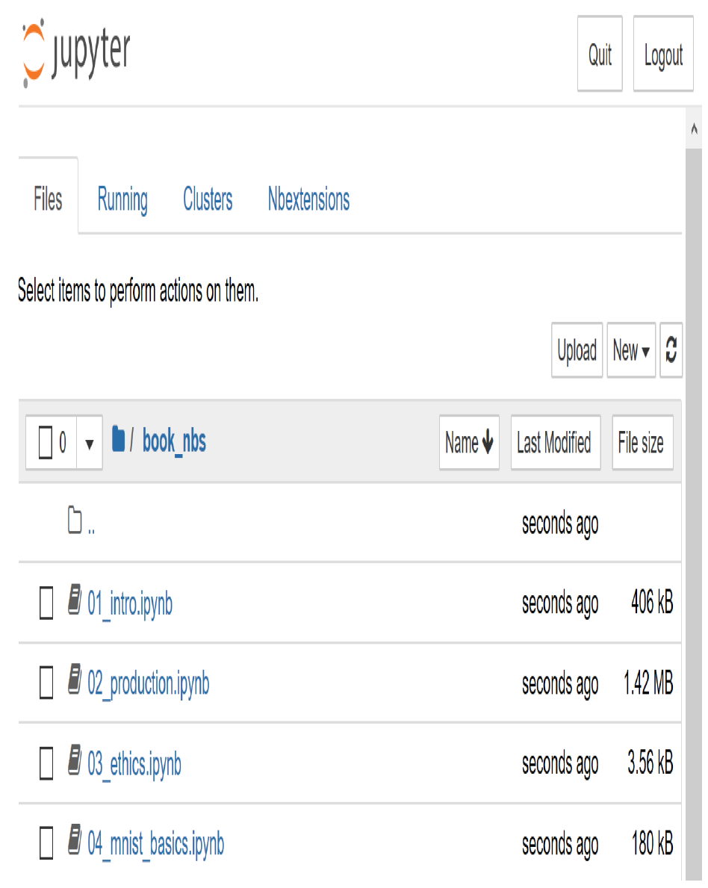

[^图1-2]: Jupyter Notebook 初始视图

现在，你已准备好运行第一个Jupyter笔记本了！

> 术语：Jupyter笔记本
>
> 一款软件，让你能够在单个交互式文档中包含格式化文本、代码、图像、视频等丰富内容。Jupyter凭借其在众多学术领域及工业界的广泛应用和巨大影响力，荣获软件界最高荣誉——ACM软件系统奖。Jupyter 笔记本是数据科学家开发深度学习模型并进行交互时使用最广泛的软件。

> 完整版与精简版
>
> 有两个文件夹包含笔记本的不同版本。完整版本文件夹包含创建你正在阅读的这本书时使用的原始笔记本，包含所有文本和输出内容。精简版保留了相同的标题和代码单元格，但删除了所有输出内容与文字说明。建议在阅读完书中某章节后，关闭书籍并尝试处理精简版笔记本：在执行每个单元格前，先尝试推测其显示内容，同时努力回忆代码所演示的功能。

要打开笔记本，只需单击它。笔记本将打开，其外观大致如图1-3所示（请注意不同平台的细节可能略有差异，这些差异可以忽略）。

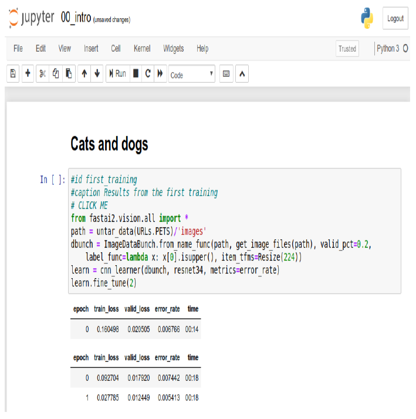

[^图1-3]: 一个Jupyter笔记本

笔记本由单元格构成。单元格主要分为两类：

- 包含格式化文本、图像等内容的单元格。这些单元格采用名为Markdown的格式，您将很快了解该格式。

- 包含可执行代码的单元格，其输出结果将立即显示在下方（可能是纯文本、表格、图像、动画、声音，甚至交互式应用程序）。

Jupyter笔记本有两种模式：编辑模式或命令模式。在编辑模式下，键盘输入的字符会以常规方式进入单元格。但在命令模式下，你不会看到闪烁光标，键盘上的每个按键都将具有特殊功能。

继续操作前，请按键盘上的Escape键切换至命令模式（若已处于命令模式，此操作无效，故请先按此键以防万一）。查看所有可用功能的完整列表请按H键；按Escape键可关闭此帮助界面。请注意，在命令模式下，与大多数程序不同，命令无需配合按住Control、Alt等特殊键——只需直接按下对应字母键即可。

按下 C 键可复制单元格（需先选中该单元格，选中状态会显示为轮廓框；若未选中，请单击该单元格一次）。随后按下 V 键即可粘贴副本。

点击以“# CLICK ME”开头的单元格进行选中它。该行首字符表明后续内容为Python注释，因此单元格执行时会被忽略。剩余部分——信不信由你——居然是一个完整的系统，用于创建并训练识别猫狗的尖端模型。所以，现在就来训练它吧！只需按下键盘上的Shift-Enter，或点击工具栏上的播放按钮。随后请稍等片刻，系统将执行以下操作：

1. 名为 [牛津-IIIT](https://oreil.ly/c_4Bv) 宠物数据集的集合包含37个品种的猫狗共7,349张图像，将从fast.ai数据集库下载至您使用的GPU服务器，随后进行解压。
2. 一个预训练模型将从互联网上下载，该模型已使用获奖模型在130万张图像上完成训练。
3. 预训练模型将运用转移学习领域的最新进展进行微调，从而创建一个专门定制用于识别猫狗的模型。

前两个步骤只需在你的GPU服务器上运行一次。若再次运行该单元格，它将使用已下载的数据集和模型，而非重新下载。让我们看看单元格内容及其结果（表1-2）：

```python
# CLICK ME
from fastai.vision.all import *
path = untar_data(URLs.PETS)/'images'

def is_cat(x): return x[0].isupper()
dls = ImageDataLoaders.from_name_func(
	path, get_image_files(path), valid_pct=0.2, seed=42,
	label_func=is_cat, item_tfms=Resize(224))

learn = cnn_learner(dls, resnet34, metrics=error_rate)
learn.fine_tune(1)
```

| 遍历数 | 训练损失 | 验证损失 | 错误率   | 时间  |
| ------ | -------- | -------- | -------- | ----- |
| 0      | 0.169390 | 0.021388 | 0.005413 | 00:14 |
| 0      | 0.058748 | 0.009240 | 0.002706 | 00:19 |

你可能不会看到与这里完全相同的测试结果。模型训练过程中存在许多微小随机变量的来源。不过在这个示例中，我们通常观察到的错误率远低于0.02。

> 训练时间
>
> 根据你的网络速度，下载预训练模型和数据集可能需要几分钟。运行 `fine_tune` 可能需要一分钟左右。本书中的模型通常需要几分钟才能训练完成，你自己的模型也是如此，因此建议您掌握一些技巧来充分利用这段时间。例如，在模型训练时继续阅读下一节内容，或打开另一个笔记本进行编码实验。

> 本书在Jupyter笔记本中撰写
>
> 我们使用Jupyter笔记本编写本书，因此书中几乎每张图表、表格和计算，都会展示精确的代码供您自行复现。正因如此，你常会看到代码后紧跟着表格、图片或纯文本内容。访问 [本书网站](https://book.fast.ai/)，你将找到所有代码，并可亲自运行和修改每个示例。
>
> 你刚刚在书中看到了输出表格的单元格效果。下面是一个输出文本的单元格示例：
>
> ```python
> 1+1
> ```
>
> ```python
> 2
> ```
>
> Jupyter 将始终打印或显示最后一行（如果有的话）的结果。例如，以下是一个输出图像的单元格示例：
>
> ```python
> img = PILImage.create('images/chapter1_cat_example.jpg')
> img.to_thumb(192)
> ```
>
> 

那么，我们如何判断这个模型是否优秀？在表格最后一列，你可以看到错误率——即识别错误的图像比例。错误率作为我们的评估指标，用于衡量模型质量，其选择标准在于直观易懂。如你所见，该模型几乎完美无缺，尽管训练时间仅需数秒（不包括数据集和预训练模型的一次性下载）。事实上，你现已达成的准确率远超十年前任何人的成就！

最后，让我们验证这个模型是否真正有效。请准备一张狗或猫的照片；若手头没有，只需搜索谷歌图片并下载任意一张图片。现在执行已定义 `uploader` 的单元格，它将生成可点击的按钮，供您选择需要分类的图像：

```python
uploader = widgets.FileUpload()
uploader
```


现在你可以将上传的文件传递给模型。请确保图片是单只狗或猫的清晰照片，而非线稿、卡通或其他类似图像。笔记本将告知你模型判断的对象是狗还是猫，以及判断的置信度。希望你会发现模型表现出色：

```python
img = PILImage.create(uploader.data[0])
is_cat,_,probs = learn.predict(img)
print(f"Is this a cat?: {is_cat}.")
print(f"Probability it's a cat: {probs[1].item():.6f}")

Is this a cat?: True.
Probability it's a cat: 0.999986
```

恭喜你完成了第一个分类器！

但这究竟意味着什么？你究竟做了什么？为了解释清楚，让我们再次拉远视角，把握全局。

#### 什么是机器学习？

你的分类器就是一种深度学习模型。正如之前所述，深度学习模型采用神经网络技术，该技术最初可追溯至1950年代，并因近年来的技术突破而变得极其强大。

另一个关键背景是，深度学习只是机器学习这一更广泛学科中的一个现代分支。要理解你在训练自己的分类模型时所做工作的本质，并不需要理解深度学习。只需认识到你的模型和训练过程如何体现了适用于机器学习的一般性概念即可。

因此在本节中，我们将阐述机器学习。我们将探讨核心概念，并追溯它们如何源自最初提出这些概念的论文。

机器学习与常规编程一样，都是让计算机完成特定任务的方式。但若要用常规编程实现前文所述的功能——识别照片中的狗与猫，我们必须为计算机详细编写完成任务所需的每一步操作步骤。

通常，我们在编写程序时很容易写下完成任务的步骤。我们只需思考如果手动完成任务会采取哪些步骤，然后将其转化为代码。例如，我们可以编写一个对列表进行排序的函数。通常我们会编写类似图1-4所示的函数（其中输入可能是未排序的列表，输出则是排序后的列表）。

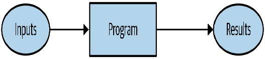

[^图1-4]: 一种传统的程序

但在识别照片中的物体时，情况就复杂得多。当我们在图片中识别某个物体时，具体会经历哪些步骤？我们其实并不清楚，因为整个过程都在大脑中悄然发生，我们对此毫无自觉意识！

早在1949年计算机诞生之初，IBM研究员Arthur Samuel便开始探索让计算机完成任务的新途径，他称之为机器学习。在其1962年的经典论文《人工智能：自动化的新领域》中，他写道：

> 为计算机编写此类计算程序，充其量也只是项艰巨任务，其困难主要并非源于计算机本身的内在复杂性，而是因为必须以令人抓狂的细节程度，逐条阐明整个过程的每个微小步骤。正如任何程序员都会告诉你的那样，计算机是巨型蠢货，而非巨型头脑。

他的基本思路是：与其告诉计算机解决问题的具体步骤，不如展示问题的实例，让计算机自己摸索解法。事实证明这种方法非常有效：到1961年，他的跳棋程序已学会如此之多，竟击败了康涅狄格州冠军！以下是他对该理念的阐述（摘自前文提及的论文）：

> 假设我们设计某种自动测试机制，用于评估当前权重分配方案在实际性能方面的有效性，并提供调整权重分配的机制以实现性能最大化。无需深入探讨具体流程细节，即可预见该机制完全可实现自动化运行，且如此编程的机器将能从经验中“学习”。

这个简短的陈述中蕴含着若干强大的概念：

- “权重分配”的概念
- 每项权重分配都具有某种“实际表现”这一事实
- 必须存在一种“自动手段”来测试该表现
- 需要一种“机制”（即另一个自动过程）通过改变权重分配来提升表现

让我们逐一探讨这些概念，以便理解它们在实践中如何相互配合。首先，我们需要理解塞缪尔所说的权重分配具体指什么。

权重只是变量，而权重分配则是对这些变量值的特定选择。程序的输入是其处理以产生结果的值——例如，将图像像素作为输入，并返回分类结果“狗”。程序的权重分配则是定义程序运行方式的其他值。

因为它们会影响程序运行，某种意义上它们属于另一种输入。我们将更新图1-4中的基本示意图，并用图1-5替换它以反映这一变化。

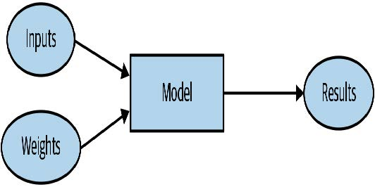

[^图1-5]: 使用权重分配的程序

我们已将方框的名称从程序改为模型。此举旨在遵循现代术语规范，并体现模型作为特殊类型程序的本质：它能根据权重值执行多种不同功能，且可通过多种方式实现。例如在塞缪尔的跳棋程序中，权重值的不同设定将导致截然不同的跳棋策略。

（顺便提一句，以防你遇到这个术语，塞缪尔所说的“权重”如今通常被称为模型参数。权重一词专指特定类型的模型参数。）

接下来，塞缪尔指出我们需要一种自动测试方法，以评估当前权重分配方案在实际表现层面的有效性。以他的跳棋程序为例，模型的“实际表现”即指其下棋水平。通过让两个模型相互对弈，观察哪一方通常获胜，便能自动测试两者的性能表现。

最后，他指出我们需要一种机制来调整权重分配，从而最大化模型性能。例如，我们可以分析胜出模型与失败模型之间的权重差异，并进一步将权重向胜出方向微调。

现在我们明白他为何说这种流程可以完全自动化，而经过如此编程的机器将能从经验中“学习”。当权重调整也实现自动化时——即不再依靠人工调整权重来改进模型，而是依赖基于性能表现自动生成调整方案的机制——学习过程便会完全自动化。

图1-6展示了Samuel关于训练机器学习模型的完整构想。

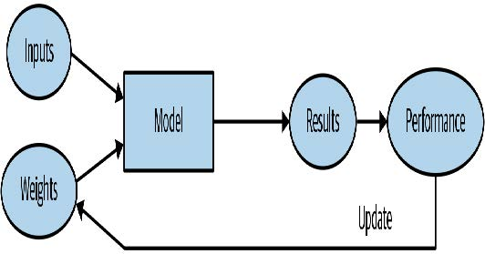

[^图1-6]: 训练机器学习模型

请注意模型结果（例如跳棋游戏中的走法）与模型表现（例如是否获胜或获胜速度）之间的区别。

另外请注意，一旦模型完成训练——即我们选定最终最优的权重分配方案后——这些权重便可视为模型的一部分，因为我们不再对其进行调整。

因此，模型训练完成后实际使用时的效果如图1-7所示。

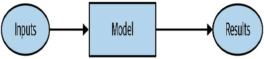

[^图1-7]: 将训练好的模型作为程序使用

这与图1-4中的原始示意图完全相同，只是将“程序”一词替换为“模型”。这是个重要洞见：训练有素的模型可以像普通计算机程序那样被使用。

> 术语：机器学习
>
> 一种通过让计算机从经验中学习而非手动编写每个步骤来开发程序的训练方法。

#### 什么是神经网络？

不难想象跳棋程序的模型可能是什么样子的。模型可能包含多种跳棋策略的编码，以及某种搜索机制，权重参数则决定策略选择方式、搜索过程中棋盘区域的关注重点等。但对于图像识别程序、文本理解程序，或是我们能想象到的许多其他有趣问题，其模型形态却完全难以预料。

我们想要的是一种极其灵活的函数，只需改变其权重，就能解决任何给定问题。令人惊叹的是，这样的函数确实存在！它就是我们之前讨论过的神经网络。也就是说，若将神经网络视为数学函数，它便成为一种依赖权重而具有极高灵活性的函数。一项名为“普适逼近定理”的数学证明表明，理论上该函数能以任意精度解决任何问题。神经网络如此灵活的特性意味着，实践中它们往往是理想的建模工具，你只需专注于训练过程——即寻找合理的权重分配方案。

但这个过程如何实现呢？可以想象，你可能需要为每个问题找到一种新的“机制”来自动更新权重。这将非常费力。我们同样希望找到一种完全通用的方法来更新神经网络的权重，使其在任何给定任务上都能得到改进。幸运的是，这样的方法确实存在！

这被称为随机梯度下降（SGD）。我们将在第四章详细探讨神经网络与SGD的工作原理，并阐释通用逼近定理。但此刻，我们不妨引用塞缪尔本人的话语：*我们无需深入探究该过程的细节，即可理解其完全自动化运行的可能性，并认识到如此编程的机器将能从经验中“学习”。*

> JEREMY说
>
> 别担心，无论是SGD还是神经网络，在数学上都不复杂。它们的工作原理几乎完全依赖加法和乘法（不过加法和乘法可做了不少！）。当学生看到具体细节时，我们听到的主要反应是：“就这么简单？”

换言之，简而言之，神经网络是一种特殊的机器学习模型，完全契合塞缪尔最初的构想。神经网络之所以特殊，在于其高度的灵活性——这意味着它们只需找到合适的权重值，就能解决异常广泛的问题。这种能力之所以强大，是因为随机梯度下降法为我们提供了一种自动寻找这些权重值的方法。

放宽视野之后，现在让我们重新聚焦并借助塞缪尔的框架来重新审视我们的图像分类问题。

我们的输入是图像。我们的权重是神经网络中的权重。我们的模型是神经网络。我们的结果是神经网络计算出的值，例如“狗”或“猫”。

那么下一部分呢？是一种自动测试当前权重分配在实际性能方面有效性的方法吗？确定“实际性能”其实相当简单：我们可以直接将模型的性能定义为其预测正确答案的准确率。

综合以上内容，并假设梯度下降（SGD）是我们更新权重分配的机制，我们就能理解图像分类器如何成为机器学习模型——这与塞缪尔的设想完全一致。

#### 一点深度学习术语

塞缪尔的研究工作开展于1960年代，此后术语体系已发生变化。以下是我们讨论过的所有概念在现代深度学习领域的对应术语：

- 模型（model）的函数形式称为其架构（architecture）（但需注意——有时人们将模型与架构视为同义词，因此可能造成混淆）。
- 权重（weights）称为参数（parameters）。
- 预测值（predictions）基于独立变量（independent variable）计算，即不含标签（labels）的数据。
- 模型输出结果（results）称为预测值（predictions）。
- 性能（performance）评估指标称为损失值（loss）。
- 损失值不仅取决于预测值，还取决于正确标签（亦称目标值（targets）或因变量（dependent variable）），例如“狗”或“猫”。

完成这些修改后，图1-6中的示意图变为图1-8。

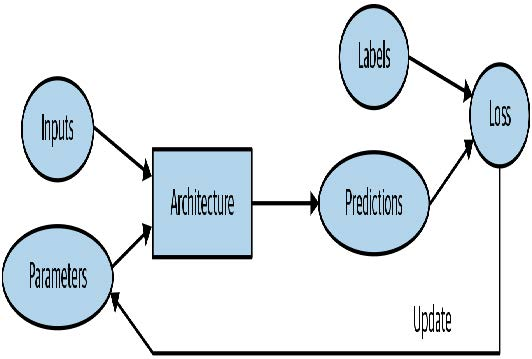

[^图1-8]: 详细的训练循环

#### 机器学习固有的局限性

从这张图中，我们现在可以看出关于训练深度学习模型的一些基本要点：

- 没有数据就无法创建模型。
- 模型只能学习处理用于训练的输入数据中出现的模式。
- 这种学习方法只能产生预测结果，而非推荐行动方案。
- 仅有输入数据示例远远不够，我们还需要为这些数据添加标签（例如：仅有猫狗图片不足以训练模型，必须为每张图片标注标签，明确区分猫与狗）。

总的来说，我们发现大多数声称数据不足的机构，实际上是指缺乏标注数据。任何有兴趣实际应用模型的机构，必然拥有计划用于模型训练的输入数据。而且他们很可能已通过其他方式（如人工操作或启发式程序）持续处理这些数据一段时间，因此他们不然积累了相关的数据！例如，放射科诊所几乎肯定会建立医学影像档案库（因为他们需要追踪患者的长期病情变化）但这些影像可能缺乏包含诊断或干预措施的结构化标签（因为放射科医师通常会写基于自由文本的自然语言报告，而非结构化数据）。本书将大量探讨标注方法，因为这是实践中至关重要的问题。

由于这类机器学习模型只能进行预测（即尝试复现标签），这可能导致组织目标与模型能力之间存在显著差距。例如，本书将教你如何创建推荐系统来预测用户可能购买的产品。这种技术常用于电子商务领域，例如通过展示最高评分的商品来定制主页展示的产品。但此类模型通常是通过分析用户及其购买历史（输入数据）来创建的，并预测用户后续购买或浏览的商品。这意味着模型更可能推荐用户已拥有或已知晓的商品，而非其真正感兴趣的新品。这与本地书店专家的做法截然不同——他们会通过提问了解你的品味，进而推荐你从未听闻的作家或系列作品。

另一项关键洞见来自于思考模型如何与环境交互。这可能形成反馈循环，正如以下所述：

1. 基于历史逮捕地点创建预测性警务模型。实际上，这并非真正预测犯罪，而是预测逮捕行为，因此在某种程度上只是反映了现有警务流程中的偏见。
2. 执法人员可能利用该模型决定警力部署重点区域，导致这些区域逮捕率上升。
3. 这些新增逮捕数据将被回馈至模型，用于训练未来版本的预测模型。

这是一个正反馈循环：模型使用得越多，数据就越偏颇，从而使模型更加偏颇，如此循环往复。

反馈循环在商业环境中也可能引发问题。例如，视频推荐系统可能存在推荐偏向——倾向于推荐给视频观看量最大的用户（例如阴谋论者和极端分子通常比普通用户观看更多在线视频内容），导致这些用户增加视频消费，进而引发更多同类视频被推荐。我们将在第3章中更详细地探讨这一话题。

既然您已经了解了理论基础，让我们回到我们的代码示例，详细看看代码是如何与我们刚刚描述的过程相对应的。

#### 我们的图像识别器是如何工作的

让我们看看图像识别代码是如何实现这些概念的。我们将每行代码单独放在一个单元格中，逐行分析其作用（暂不详解每个参数的细节，但会说明关键部分；完整细节将在本书后续章节中阐述）。第一行导入了完整的 `fastai.vision` 库：

```python
from fastai.vision.all import *
```

这为我们提供了创建各种计算机视觉模型所需的所有函数和类。

> JEREMY说
>
> 许多Python程序员建议避免像这样导入整个库（使用 `import *` 语法），因为在大规模软件项目中可能会引发问题。然而对于交互式工作场景（如Jupyter笔记本），这种方式效果极佳。fastai库正是为支持此类交互式使用而特别设计，它只会将必要的组件导入到你的工作环境中。

第二行代码会从 [fast.ai数据集集合](https://course.fast.ai/datasets) 下载标准数据集（若尚未下载）至服务器，解压数据集（若尚未解压），并返回包含解压路径的 `Path` 对象：

```python
path = untar_data(URLs.PETS)/'images'
```

> SYLVAIN说
>
> 在fast.ai的学习过程中，乃至至今，我掌握了许多高效编程实践技巧。fastai库和fast.ai笔记本中蕴含着大量实用小窍门，这些都助我成长为更优秀的程序员。例如，请注意fastai库返回的并非包含数据集路径的字符串，而是 `Path` 对象——这是Python 3标准库中极具价值的类，能显著简化文件目录操作。若你尚未接触过该类，请务必查阅其文档或教程进行实践。需特别指出的是，该库还提供了便捷的文件目录访问功能。今后遇到实用编程技巧时，我将继续与大家分享。

在第三行，我们定义了一个函数 `is_cat`，它根据数据集创建者提供的文件名规则对猫进行标注：

```python
def is_cat(x): return x[0].isupper()
```

我们在第四行使用该函数，它告知fastai我们拥有何种数据集及其结构：

```python
dls = ImageDataLoaders.from_name_func(
	path, get_image_files(path), valid_pct=0.2, seed=42,
	label_func=is_cat, item_tfms=Resize(224))
```

针对不同类型的深度学习数据集和问题，存在多种数据加载器类——本文使用的是`ImageDataLoaders` 。类名的首部分通常代表数据类型，例如图像或文本。

我们需要告知fastai的另一项重要信息是：如何从数据集中获取标签。计算机视觉数据集通常采用这样的结构：图像标签作为文件名或路径的一部分——最常见的是父文件夹名称。fastai内置了多种标准化标注方法，同时也支持自定义标注方案。此处我们指示fastai使用刚刚定义的 `is_cat` 函数。

最后，我们定义所需的转换器（ `Transforms` ）。转换器包含在训练过程中自动应用的代码；fastai内置了多种预定义转换器，新增转换器只需创建一个Python函数即可。主要分为两类：`item_tfms` 应用于每个项目（本例中每个项目会被缩放为224像素的正方形），而 `batch_tfms` 则利用GPU对整批项目同时处理，因此速度极快（本书后续将展示大量此类示例）。

为何是224像素？这是历史遗留的标准尺寸（旧版预训练模型必须严格采用此尺寸），但你几乎可以传入任意尺寸。增大尺寸通常能获得效果更佳的模型（因其能捕捉更多细节），但需以速度和内存消耗为代价；反之缩小尺寸则效果相反。

> 术语：分类与回归
>
> 分类（Classification）与回归（regression）在机器学习中具有非常特定的含义。本书将重点探讨这两类主要模型。分类模型旨在预测某个类别或分类，即从若干离散选项中进行预测，例如“狗”或“猫”。回归模型则致力于预测一个或多个数值量，例如温度或位置。有时人们会用“回归”一词特指线性回归模型；这种用法并不妥当，本书将避免使用该术语！

宠物数据集包含7,390张猫和狗图片，涵盖37个品种。每张图片通过文件名进行标注：例如文件 `great_pyrenees_173.jpg` 即为数据集中第173张大白熊犬品种的图片示例。若图片为猫，文件名以大写字母开头；反之则以小写字母开头。我们需要告知fastai如何从文件名获取标签，具体方法是调用 `from_name_func`（该函数允许通过函数处理文件名提取标签），并传入 `x[0].isupper()` ——当首字母为大写时（即猫的图片），该函数返回 `True` 。

这里最关键的参数是 `valid_pct=0.2` 。该参数指示fastai保留20%的数据，完全不用于模型训练。这20%的数据称为验证集；剩余80%称为训练集。验证集用于衡量模型准确率。默认情况下，保留的20%数据是随机选取的。参数 `seed=42` 将随机种子固定为固定值，确保每次运行代码时获得相同的验证集。这样当我们修改模型并重新训练时，就能明确任何差异均源于模型变更，而非随机验证集的不同。

fastai始终仅使用验证集展示模型的准确率，绝不使用训练集。这一点至关重要，因为若训练时间足够长且模型足够庞大，它最终会记住数据集中每个项目的标签！这样的结果将无法形成有用的模型，因为我们真正关注的是模型在未见图像上的表现。这始终是构建模型的核心目标：确保模型在训练完成后，仅能处理未来才接触到的数据时仍能发挥作用。

即使模型尚未完全记忆所有数据，在训练初期它也可能已记忆了部分数据。因此，训练时间越长，模型在训练集上的准确率就越高；验证集准确率也会暂时提升，但最终会开始恶化——因为模型开始死记硬背训练集内容，而不是从数据中发现可推广的底层规律。这种情况被称为模型 *过拟合* 。

图1-9展示了过拟合现象，通过一个简化示例说明：该模型仅有一个参数，并基于函数`x**2` 随机生成数据。如图所示，尽管过拟合模型对观测数据点附近的预测准确，但超出该范围时预测结果却严重偏离。

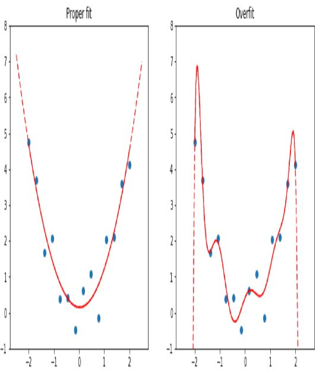

[^图1-9]: 过拟合的例子

**过拟合是所有机器学习从业者在训练过程中面临的最重要且最具挑战性的问题**，不管你用的是什么算法。正如你将看到的，创建一个在训练数据上表现优异的模型并不难，但要使其对从未见过的数据做出准确预测则困难得多。而实践中真正重要的恰恰是这些数据。例如，若你创建一个手写数字分类器（我们即将实践！），用于识别支票上的数字，那么模型训练时接触过的数字在实际应用中根本不会出现——每张支票的书写方式都存在细微差异，这正是模型需要应对的挑战。

在本书中，你将学习多种避免过拟合的方法。然而，你应仅在已经确认过拟合现象确实存在时（即在训练过程中观察到验证准确率下降时）才使用这些方法。我们常看到实践者即使拥有充足数据也过度使用避免过拟合的技术，最终得到的模型精度反而可能低于其本可达到的水平。

> 验证集（validation set）
>
> 在你训练模型时，必须同时准备训练集和验证集，且仅应在验证集上评估模型的准确性。若训练时间过长且数据不足，模型准确率将开始下降，这种现象称为过拟合。fastai默认将 `valid_pct` 设为0.2，因此即使你忘记设置，fastai也会创建验证集！

训练图像识别器的代码第五行指示fastai创建 *卷积神经网络*（CNN），并指定使用何种架构（即创建何种模型）、训练数据集以及评估指标：

```python
learn = cnn_learner(dls, resnet34, metrics=error_rate)
```

为何选择卷积神经网络？这是当前构建计算机视觉模型的尖端方法。本书将全面解析卷积神经网络的工作原理，其结构设计灵感源自人类视觉系统的运作机制。

fastai 中包含多种架构，本书将逐一介绍（同时探讨如何创建自定义架构）。然而大多数情况下，选择架构并非深度学习过程中至关重要的环节。这是学术界热衷讨论的话题，但在实际应用中，你通常无需在此投入过多精力。存在若干通用架构能应对多数场景，本书将重点探讨名为ResNet的架构——它在多数数据集和问题上兼具速度与精度。其中 `resnet34` 中的数字 `34` 代表该架构变体中的层数（其他选项包括 `18` 、`50` 、`101` 和 `152` ）。采用更多层架构的模型训练耗时更长，且更易过拟合（即在验证集准确率开始下降前，可训练的轮次会减少）。但另一方面，当使用更多数据时，这类模型能显著提升准确率。

什么是度量指标？度量指标是一种函数，用于通过验证集衡量模型预测的质量，并在每个训练轮次结束时输出结果。在此我们使用 `error_rate`，这是 fastai 提供的函数，其作用正如其名：告知验证集中被错误分类的图像所占比例。分类任务的另一常用指标是准确率（即`1.0 - error_rate`）。fastai还提供了更多指标，本书后续章节将逐步探讨。

度量（metric）的概念或许会让你联想到损失（loss），但二者存在一个重要区别。损失的全部意义在于定义一种“性能衡量标准”，供训练系统自动更新权重使用。换言之，优秀的损失函数应便于随机梯度下降算法使用。而度量标准则面向人类使用者设计，因此优质的度量标准需具备易于理解的特性，并尽可能贴近模型预期目标。有时损失函数本身可作为合适的度量标准，但并非必然如此。

`cnn_learner` 还包含一个名为 `pretrained` 的参数，默认值为 `True`（因此即使未显式指定，本例中仍会使用该参数）。该参数将模型权重设置为专家预先训练的值，这些权重通过对 130 万张照片（使用著名的 *ImageNet* 数据集）进行训练，已能识别千种不同类别。一个权重已在其他数据集上预先训练的模型被称为预训练模型。你几乎总是应该使用预训练模型，因为这意味着你的模型在尚未接触任何训练数据前就已具备强大能力。正如你将看到的，在深度学习模型中，这些能力中的许多都是你几乎无论项目细节如何都需要的。例如，预训练模型会处理边缘、梯度和颜色检测等功能，这些都是许多任务所必需的。

使用预训练模型时，`cnn_learner` 会移除最后一个层，因为该层总是针对原始训练任务（即 ImageNet 数据集分类）进行专门定制，并用一个或多个随机化权重的新层替换它，这些新层的大小适合您正在处理的数据集。模型的这一部分被称为 *头部*。

使用预训练模型是我们目前最重要的方法，它能让我们用更少的数据、更少的时间和金钱，更快地训练出更精确的模型。你可能会认为这意味着预训练模型应该成为学术界深度学习领域最受关注的研究方向……那你就大错特错了！预训练模型的重要性在多数课程、书籍或软件库特性中普遍未被认可或讨论，学术论文中也鲜少涉及。截至2020年初撰写本文时，这种状况才刚开始改变，但转变过程仍需时日。因此请务必警惕：你接触的大多数人很可能严重低估了在资源有限条件下深度学习的潜力，因为他们很可能并不真正理解如何运用预训练模型。

将预训练模型应用于不同于其原始训练任务的领域，称为 *迁移学习* （transfer learning）。遗憾的是，由于迁移学习研究严重不足，目前可用的预训练模型领域极为有限。例如，医学领域现有的预训练模型寥寥无几，使得该领域难以应用迁移学习。此外，如何将迁移学习应用于时间序列分析等任务，目前仍缺乏深入理解。

> 术语：迁移学习
>
> 将预训练模型用于与其原始训练目的不同的任务。

代码的第六行告诉fastai如何 *拟合*（fit）模型：

```python
learn.fine_tune(1)
```

正如我们所讨论的，该架构仅描述了一个数学函数的模板；在我们为其中数百万个参数提供具体数值之前，它实际上并不能执行任何操作。

这是深度学习的关键——确定如何拟合模型的参数以解决问题。要拟合模型，我们至少需要提供一条信息：每次图像需要处理多少次（称为迭代次数，epoch）。选择的迭代次数主要取决于可用时间长度，以及实际训练模型所需的时间。若选择的迭代次数过少，后续总能增加训练迭代次数。

但为什么该方法名为 `fine_tune` 而不是 `fit`？fastai确实有一个名为 `fit`的方法，它确实能拟合模型（即多次查看训练集中的图像，每次更新参数使预测结果越来越接近目标标签）。但本例中我们基于预训练模型展开工作，且不希望舍弃其已具备的能力。正如本书后续内容将阐述的，针对新数据集调整预训练模型存在若干关键技巧——这一过程被称为微调（fine-tuning）。

> 术语：微调
>
> 一种迁移学习技术，通过使用与预训练不同的任务进行额外轮次训练来更新预训练模型的参数。

当你使用 `fine_tune` 方法时，fastai 会为你自动应用这些技巧。你可以设置若干参数（我们稍后会讨论），但在这里展示的默认形式下，它会执行两个步骤：

1. 使用一个轮次中仅拟合模型中必要的那些部分，以使得新的随机头部能够正确处理你的数据集。
2. 在调用方法时指定所需的迭代次数，用于拟合整个模型，使后期层（特别是头部）的权重更新速度快于前期层（如我们将看到的，前期层通常无需对预训练权重进行大幅调整）。

模型的 *头部* 是指为适应新数据集而新增的特定部分。一个迭代次数指完整遍历数据集一次。调用fit方法后，系统会打印每个训练周期的结果，显示周期编号、训练集与验证集损失值（用于训练模型的“性能评估指标”），以及用户请求的任何指标（本例中为错误率）。

因此，凭借这些代码，我们的模型仅通过标注示例就学会了识别猫和狗。但它究竟是如何做到的呢？

#### 我们的图像识别器学到了什么

目前，我们拥有一个运行良好的图像识别器，但完全不清楚它的工作原理！尽管许多人抱怨深度学习会产生难以理解的“黑箱”模型（即能给出预测结果却无人能理解的系统），但这种说法与事实相去甚远。大量研究表明，我们完全能够深入剖析深度学习模型并从中获取丰富洞见。话虽如此，各类机器学习模型（包括深度学习和传统统计模型）要完全理解仍具挑战性，尤其当它们遇到与训练数据差异极大的新数据时。本书将持续探讨这一问题。

2013年，博士生马特·泽勒（Matt Zeiler）及其导师罗伯·弗格斯（Rob Fergus）发表了[《卷积神经网络的可视化与理解》](https://oreil.ly/iP8cr)，该论文展示了如何可视化模型各层学习到的神经网络权重。他们深入剖析了2012年ImageNet竞赛的冠军模型，并基于此分析大幅优化模型，最终成功夺得2013年竞赛桂冠！图1-10展示了他们发表的第一层权重可视化结果。

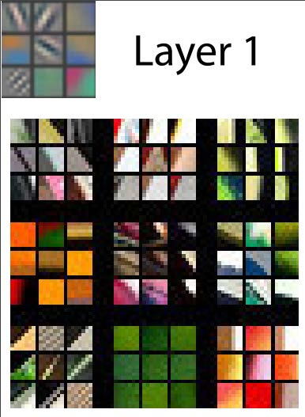

[^图1-10]: 卷积神经网络第一层的激活情况（由Matthew D. Zeiler和Rob Fergus提供）

这张图需要我们说明一下。对于每个层，图像中浅灰色背景的部分显示了重建的权重，而底部较大的区域则显示了训练图像中与每组权重匹配度最高的区域。对于第一层，我们可以看到模型已发现代表对角线、水平线、垂直线以及各种倾斜度的权重。（需注意的是：每层仅展示特征子集，实际所有层中包含数千种特征。）

这些是模型在计算机视觉领域学习到的基本构建模块。神经科学家和计算机视觉研究人员对它们进行了广泛分析，结果表明这些学习到的构建模块与人眼的基本视觉机制极为相似，也与深度学习时代之前开发的手工计算机视觉特征高度吻合。下一层结构如图1-11所示。

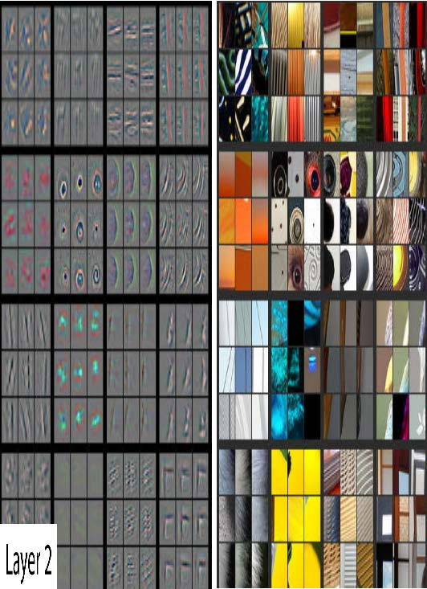

[^图1-11]: 卷积神经网络第二层的激活情况（由Matthew D. Zeiler和Rob Fergus提供）

对于第二层，模型发现的每种特征都有九个权重重建示例。我们可以看到，模型已学会创建特征检测器来寻找拐角、重复线条、圆形及其他简单图案。这些特征由第一层开发的基本构建模块构建而成。对于每种特征，图片右侧展示了实际图像中与之最匹配的小区域。例如第二行第一列的特定图案，其梯度和纹理特征与日落场景高度吻合。

图1-12展示了论文中关于重建第3层特征结果的图像。

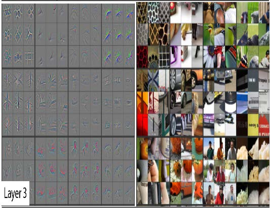

[^图1-12]: 卷积神经网络第三层的激活情况（由Matthew D. Zeiler和Rob Fergus提供）

如图右侧所示，这些特征现已能够识别并匹配更高层次的语义组件，例如汽车轮毂、文本和花瓣。借助这些组件，第4层和第5层可识别更高层次的概念，如图1-13所示。

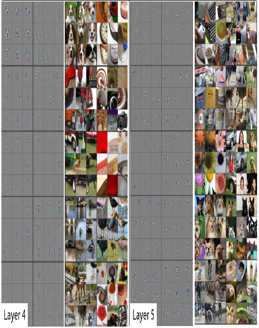

[^图1-13]: 卷积神经网络第四层与第五层的激活图（由Matthew D. Zeiler与Rob Fergus提供）

这个论文研究的是一种名为AlexNet的早期模型，它仅包含五层。此后发展起来的网络可能拥有数百层——因此你可以想象这些模型所能开发出的特征是多么丰富！

在先前对预训练模型进行微调时，我们调整了最后几层的关注点（花卉、人类、动物），使其专门处理猫狗识别问题。更普遍地说，我们可以将此类预训练模型专门化应用于多种不同任务。下面我们来看几个示例：

#### 图像识别器可处理非图像任务

图像识别器顾名思义只能识别图像。但许多事物都可以用图像来表示，这意味着图像识别器能够学习完成多种任务。

例如，声音可以转换为频谱图，这是一种图表，显示音频文件中每个时间点各频率的强度分布。Fast.ai学员Ethan Sutin运用此方法，仅凭8,732条城市声音数据集，便 [轻松超越了现有顶尖环境声音检测模型的公开准确率](https://oreil.ly/747uv)。fastai的 `show_batch` 功能清晰呈现了每种声音独特的频谱图特征，如图1-14所示。

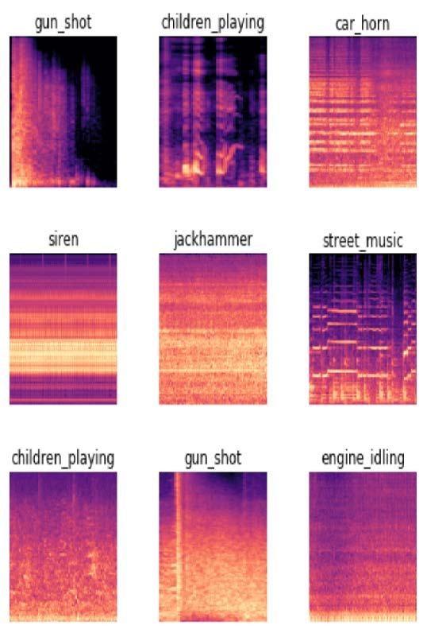

[^图1-14]: 显示 `show_batch` 的声谱图

时间序列可通过将其绘制在图表上轻松转换为图像。然而，通常更明智的做法是尝试以最易提取关键要素的方式呈现数据。在时间序列中，诸如季节性与异常值等特征往往最值得关注。

时间序列数据可进行多种转换。例如，fast.ai学员Ignacio Oguiza利用一种名为“格拉姆角场差分法(Gramian Angular Difference Field，GADF)”的技术，从橄榄油分类的时间序列数据集中生成图像，其结果如图1-15所示。随后他将这些图像输入本章所示的图像分类模型进行训练。尽管训练集仅含30张图像，其准确率仍远超90%，接近当前最先进水平。

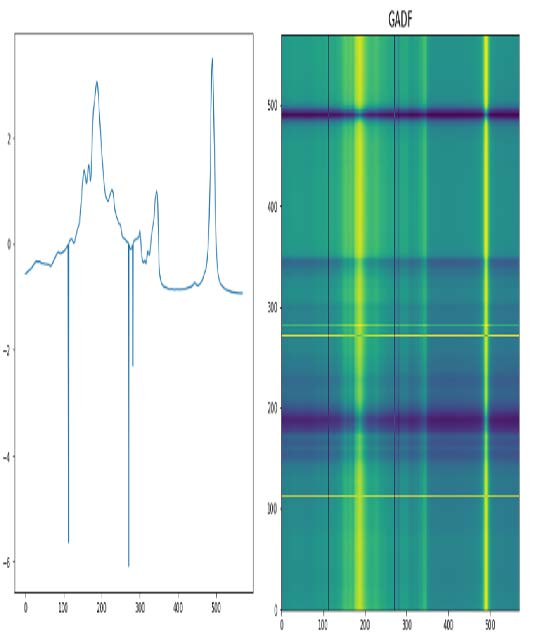

[^图1-15]: 将时间序列转换为图像

另一个有趣的fast.ai学生项目案例来自格列布·埃斯曼（Gleb
Esman）。他在Splunk公司从事欺诈检测工作，使用的是用户鼠标移动轨迹和点击数据集。他将这些数据转化为图像：用彩色线条绘制显示鼠标指针位置、速度和加速度的轨迹，点击点则用彩色小圆圈标注，如图1-16所示。他将这些图像输入到与本章使用的图像识别模型相同的系统中，效果如此出色，最终他还为这种欺诈分析方法申请到了专利！

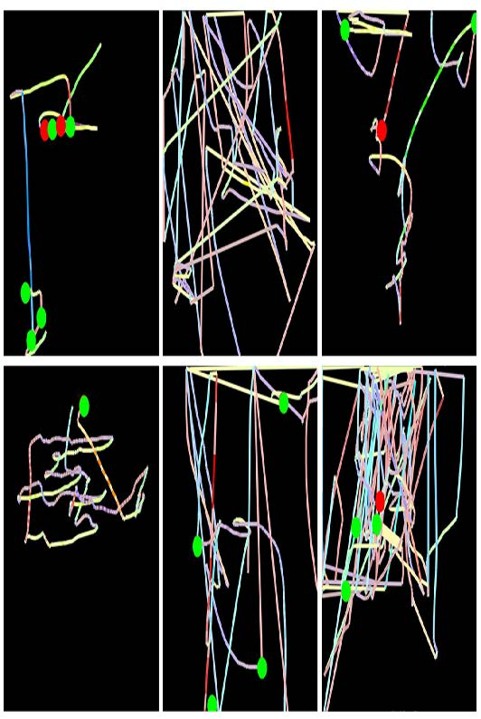

[^图1-16]: 将计算机鼠标行为转换为图像

另一个例子来自马哈茂德·卡拉什（Mahmoud Kalash）等人的论文[《基于深度卷积神经网络的恶意软件分类》](https://oreil.ly/l_knA)，他们其中解释道："恶意软件二进制文件被分割为8位序列，随后转换为等效十进制值。该十进制向量经重塑后生成灰度图像，以呈现恶意软件样本"（见图1-17）。

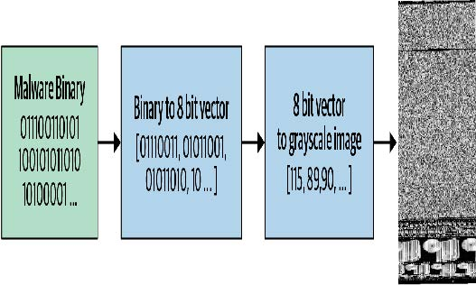

[^图1-17]: 恶意软件分类流程

作者随后展示了通过此过程生成的不同类别恶意软件的“图片”，如图1-18所示。

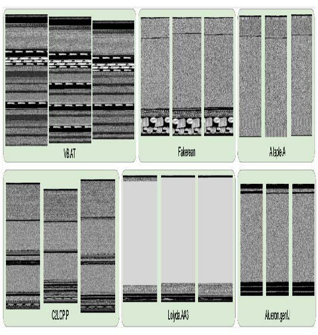

[^图1-18]: 恶意软件示例

如你所见，不同类型的恶意软件在人眼看来具有鲜明特征。研究人员基于这种图像表示训练的模型，其恶意软件分类准确度超越了学术文献中所有既往方法。这为数据集转化为图像表示提供了实用准则：若人眼能从图像中识别类别，深度学习模型同样能够实现。

总的来说，你会发现只要在数据表示方式上稍加创新，深层学习中少数通用方法就能发挥巨大作用！不应将本文所述方法视为“权宜之计”，因为它们往往（如本文所示）能超越先前最先进的结果。这些方法实则是解决此类问题领域的正确思路。

#### 术语回顾

我们刚刚讲解了很多内容，现在简要回顾一下。表1-3提供了实用词汇清单。

| 英文原文        | 术语         | 意义                                                         |
| --------------- | ------------ | ------------------------------------------------------------ |
| Label           | 标签         | 我们试图预测的数据，例如“狗”或“猫”                           |
| Architecture    | 架构         | 我们试图拟合的模型模板。即实际的数学函数，我们将输入数据和参数传递给该函数 |
| Model           | 模型         | 架构与特定参数集的结合                                       |
| Parameters      | 参数         | 模型中改变其可执行任务的值，这些值通过模型训练进行更新       |
| Fit             | 拟合         | 更新模型的参数，使得模型使用输入数据进行预测的结果与目标标签相匹配 |
| Train           | 训练         | 拟合的同义词                                                 |
| Pretrainedmodel | 预训练模型   | 一个已经过训练的模型，通常使用大型数据集训练，并将进行微调。 |
| Finetune        | 微调         | 为不同任务更新预训练模型                                     |
| Epoch           | （迭代）轮次 | 对输入数据进行一次完整的遍历                                 |
| Loss            | 损失         | 衡量模型优劣的指标，用于驱动基于随机梯度下降SGD的训练过程    |
| Metric          | 指标         | 使用验证集衡量模型性能的指标，该验证集专为人类使用而设计     |
| Validation set  | 验证集       | 一组从训练中保留出来的数据，仅用于衡量模型的性能             |
| Training set    | 训练集       | 用于拟合模型的数据；不包含任何来自验证集的数据               |
| Overfitting     | 过拟合       | 以特定方式训练模型，使其记忆输入数据的特定特征，而不是在训练期间未接触过的数据上实现良好泛化。 |
| CNN             | 卷积神经网络 | Convolutional neural network的缩写。一种在计算机视觉任务中表现尤为出色的神经网络类型。 |

掌握这些词汇后，我们现在能够将迄今介绍的所有关键概念整合起来。请花点时间回顾这些定义并阅读以下总结。若你可以理解这些解释，便已具备充分的准备来理解后续的讨论。

*机器学习* 是一门学科，其中我们定义程序的方式并非完全靠手工编写，而是通过从数据中学习。*深度学习* 是机器学习的一个分支，它利用具有多层结构的神经网络。图像分类（也称为图像识别）是其代表性应用。我们从标注数据开始——即为每张图像分配标签以表明其内容的图像集合。我们的目标是创建一个称为模型的程序，当输入新图像时，它能准确预测该图像所代表的内容。

每个模型都始于架构的选择，即该类型模型内部运作的通用模板。训练（或拟合）过程实质是寻找参数值（或权重）的组合，将通用架构专化为适用于特定数据类型的模型。要评估模型在单次预测中的表现，需定义损失函数——它决定了预测结果优劣的评判标准。

为加快训练进程，我们可采用 *预训练模型* ——即已在他人数据集上完成训练的模型。随后通过在自身数据集上进行少量额外训练，使其适应新数据，这一过程称为 *微调* 。

在训练模型时，关键要确保模型具备 *泛化* 能力：它能从数据中学习出普适性规律，这些规律同样适用于模型将要遇到的全新对象，从而对这些对象做出准确预测。风险在于，若训练不当，模型将无法学习普适规律，反而会机械记忆已见过的内容，导致对新图像的预测效果极差。这种失败被称为 *过拟合* 。

为避免这种情况，我们总是将数据分为两部分：*训练集* 和 *验证集* 。我们仅向模型展示 *训练集* 来训练模型，然后通过观察模型在 *验证集* 数据上的表现来评估其性能。通过这种方式，我们检验模型从训练集学习到的知识是否能推广到验证集。为评估模型在验证集上的整体表现，我们定义了评估指标。在训练过程中，当模型处理完训练集所有样本时，我们称之为一个 *迭代轮次* 。

所有这些概念都适用于机器学习的普遍范畴。它们适用于通过数据训练来定义模型的各类方案。深度学习的独特之处在于其特定类别的架构：基于 *神经网络* 的架构。尤其像图像分类这类任务，高度依赖 *卷积神经网络* ——我们稍后将对此进行讨论。

### 深度学习不仅适用于图像分类

近年来，深度学习在图像分类方面的有效性已广受讨论，甚至在识别CT扫描中的恶性肿瘤等复杂任务上展现出超越人类的成果。但它的能力远不止于此，我们将在本文中展示其更多可能。

例如，让我们谈谈对自动驾驶汽车至关重要的一点：在图像中定位物体。如果自动驾驶汽车不知道行人的位置，它就不知道如何避让行人！创建能识别图像中每个像素内容的模型称为 *分割* （segmentation）。以下是使用fastai训练分割模型的方法，我们采用Gabriel J. Brostow等人在论文 [《视频中的语义对象类别：高清真值数据库》](https://oreil.ly/Mqclf) 中提到的 [CamVid数据集](https://oreil.ly/Mqclf) 子集：

```python
path = untar_data(URLs.CAMVID_TINY)
dls = SegmentationDataLoaders.from_label_func(
	path, bs=8, fnames = get_image_files(path/"images"),
	label_func = lambda o:
path/'labels'/f'{o.stem}_P{o.suffix}',
	codes = np.loadtxt(path/'codes.txt', dtype=str)
)

learn = unet_learner(dls, resnet34)
learn.fine_tune(8)
```

| 迭代轮次 | 训练损失 | 验证损失 | 时间  |
| -------- | -------- | -------- | ----- |
| 0        | 2.906601 | 2.347491 | 00:02 |
| 0        | 1.988776 | 1.765969 | 00:02 |
| 1        | 1.703356 | 1.265247 | 00:02 |
| 2        | 1.591550 | 1.309860 | 00:02 |
| 3        | 1.459745 | 1.102660 | 00:02 |
| 4        | 1.324229 | 0.948472 | 00:02 |
| 5        | 1.205859 | 0.894631 | 00:02 |
| 6        | 1.102528 | 0.809563 | 00:02 |
| 7        | 1.020853 | 0.805135 | 00:02 |

我们甚至不会逐行讲解这段代码，因为它几乎与之前的示例完全相同！（我们将在第15章深入探讨分割模型，同时也会详细解析本章简要介绍的所有其他模型，以及更多更多内容。）

我们可以通过要求模型为图像的每个像素进行颜色编码，来直观展示其任务完成效果。如您所见，它几乎完美地将每个物体中的每个像素进行了分类。例如，请注意所有汽车都覆盖着相同的颜色，所有树木也覆盖着相同的颜色（在每对图像中，左侧图像为真实标签，右侧为模型预测结果）：

```python
learn.show_results(max_n=6, figsize=(7,8))
```

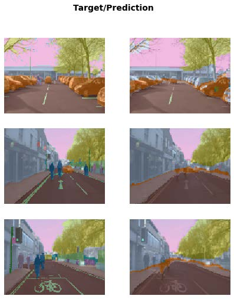

深度学习在过去几年取得突破性进展的另一个领域是自然语言处理（natural language processing，NLP）。如今计算机能够生成文本、自动进行语言翻译、分析评论、标注句子中的词汇，以及完成更多任务。以下是训练模型的全部代码，该模型能够比五年前世界上任何现有技术更精准地分类电影评论的情感倾向：

```python
from fastai.text.all import *
dls = TextDataLoaders.from_folder(untar_data(URLs.IMDB),
                                  valid='test')
learn = text_classifier_learner(dls, AWD_LSTM,
                                drop_mult=0.5, metrics=accuracy)
learn.fine_tune(4, 1e-2)
```

| 迭代轮次 | 训练损失 | 验证损失 | 准确率   | 时间  |
| -------- | -------- | -------- | -------- | ----- |
| 0        | 0.594912 | 0.407416 | 0.823640 | 01:35 |
| 0        | 0.268259 | 0.316242 | 0.876000 | 03:03 |
| 1        | 0.184861 | 0.246242 | 0.898080 | 03:10 |
| 2        | 0.136392 | 0.220086 | 0.918200 | 03:16 |
| 3        | 0.106423 | 0.191092 | 0.931360 | 03:15 |

该模型采用安德鲁·马斯（Andrew Maas）等人发表于 [《学习词向量进行情感分析》](https://oreil.ly/L9vre) 中的 [IMDb大型电影评论数据集](https://oreil.ly/tl-wp) 。它在处理数千字的电影评论时表现良好，但让我们用一篇短评来测试其效果：

```python
learn.predict("I really liked that movie!")
('pos', tensor(1), tensor([0.0041, 0.9959]))
```

在此我们可看到模型将该评论判定为积极评价。结果的第二部分是数据词汇表中“pos”的索引，最后部分则是各分类对应的概率值（“pos”为99.6%，“neg”为0.4%）。

现在轮到你了！写一篇自己的迷你影评，或者从网上复制一篇，看看这个模型会如何评价。

> 顺序很重要
>
> 在 Jupyter 笔记本中，执行每个单元格的顺序至关重要。它不像Excel那样，在任何位置输入内容都会立即更新——它拥有内部状态，每次执行单元格时都会更新。例如，当你运行笔记本的第一个单元格（带有“CLICK ME”注释）时，会创建一个名为 `learn` 的对象，其中包含图像分类问题的模型和数据。
>
> 如果我们直接运行文本中刚刚展示的单元格（用于预测评论是否好评），将会出现错误，因为该学习对象不包含文本分类模型。此单元格需在包含以下内容的单元格之后运行：
>
> ```python
> from fastai.text.all import *
> dls = TextDataLoaders.from_folder(untar_data(URLs.IMDB), valid='test')
> learn = text_classifier_learner(dls, AWD_LSTM, drop_mult=0.5,
>                              metrics=accuracy)
> learn.fine_tune(4, 1e-2)
> ```
>
> 输出结果本身可能具有误导性，因为它们包含单元格上次执行时的结果；若在单元格内修改代码却未重新执行，旧的（有误导性的）结果将持续保留。
>
> 除非我们特别说明，本书网站提供的笔记本应按顺序从上到下运行。通常在实验过程中，你会发现自己为提高效率而随意执行单元格（这是Jupyter笔记本的绝妙特性），但当你完成探索并最终确定代码版本后，请务必确保笔记本中的单元格能按顺序运行（否则以后你未必记得当初那条曲折的探索路径！）。
>
> 在命令模式下，连续输入两次数字0将重启内核（即驱动笔记本的引擎）。此操作将清除当前状态，使笔记本恢复至初始启动状态。通过单元菜单选择“运行上方所有单元”，即可执行当前位置上方所有单元的内容。我们在开发fastai库时发现此功能非常实用。

若你对任何 fastai 方法存在疑问，应使用 `doc` 函数，并传入方法名称：

```python
doc(learn.predict)
```

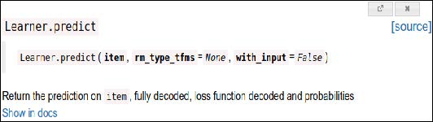

你会看到一个包含简短一行说明的窗口弹出。“在文档中查看（Show in docs）”链接将带你前往完整文档，其中包含所有细节和大量示例。此外，fastai的大多数方法仅需寥寥数行代码，因此你可以点击“源代码”链接查看具体实现原理。

接下来让我们转向一个远不如前者花哨，但或许在商业应用中更具广泛实用价值的话题：从普通表格化的数据中构建模型。

> 术语：表格（tabular）
>
> 表格形式的数据，例如来自电子表格、数据库或逗号分隔值（CSV）文件的数据。表格模型是一种基于表格中其他列的信息来预测表格中某一列的模型。

结果你会发现两者看起来也非常相似。以下是训练模型的必要代码，该模型将基于个人社会经济背景，预测其是否属于高收入群体：

```python
from fastai.tabular.all import *
path = untar_data(URLs.ADULT_SAMPLE)
dls = TabularDataLoaders.from_csv(path/'adult.csv',
                                  path=path, y_names="salary",
                                  cat_names = ['workclass', 'education', 'marital-status',
                                               'occupation',
                                               'relationship', 'race'],
                                  cont_names = ['age', 'fnlwgt', 'education-num'],
                                  procs = [Categorify, FillMissing, Normalize])
learn = tabular_learner(dls, metrics=accuracy)
```

如你所见，我们需要告知fastai哪些列是分类型（包含离散选项集中的某个值，例如 `occupation` ）而哪些是连续型（包含代表数量的数值，例如 `age` ）。

此任务目前尚无预训练模型可用（总体而言，任何表格建模任务都缺乏广泛可用的预训练模型，尽管某些机构已为内部使用创建过此类模型），因此本例中我们不采用 `fine_tune` 方法。取而代之的是，我们采用 `fit_one_cycle` ——这是从零开始训练fastai模型（即不使用迁移学习）最常用的方法：

```python
learn.fit_one_cycle(3)
```

| 迭代轮次 | 训练损失 | 验证损失 | 准确率   | 时间  |
| -------- | -------- | -------- | -------- | ----- |
| 0        | 0.359960 | 0.357917 | 0.831388 | 00:11 |
| 1        | 0.353458 | 0.349657 | 0.837991 | 00:10 |
| 2        | 0.338368 | 0.346997 | 0.843213 | 00:10 |

该模型采用Ron Kohavi的论文 [《提升朴素贝叶斯分类器的准确率：决策树混合方法》](https://oreil.ly/qFOSc) 中的 [成人数据集](https://oreil.ly/qFOSc) ，该数据集包含个人人口统计数据（如教育程度、婚姻状况、种族、性别以及年收入是否超过5万美元）。模型准确率超过80%，在测试集上达到80%以上的准确率。该模型准确率超过80%，训练耗时约30秒。

让我们再来看一个例子吧。推荐系统至关重要，尤其在电子商务领域。亚马逊和奈飞等公司竭力为用户推荐可能感兴趣的商品或影片。以下是利用 [MovieLens数据集](https://oreil.ly/LCfwH) 训练模型的方法，该模型将根据用户的过往观看习惯预测其可能喜欢的电影：

```python
from fastai.collab import *
path = untar_data(URLs.ML_SAMPLE)
dls = CollabDataLoaders.from_csv(path/'ratings.csv')
learn = collab_learner(dls, y_range=(0.5,5.5))
learn.fine_tune(10)
```

| 迭代轮次 | 训练损失 | 验证损失 | 时间  |
| -------- | -------- | -------- | ----- |
| 0        | 1.554056 | 1.428071 | 00:01 |
| 0        | 1.393103 | 1.361342 | 00:01 |
| 1        | 1.297930 | 1.159169 | 00:01 |
| 2        | 1.052705 | 0.827934 | 00:01 |
| 3        | 0.810124 | 0.668735 | 00:01 |
| 4        | 0.711552 | 0.627836 | 00:01 |
| 5        | 0.657402 | 0.611715 | 00:01 |
| 6        | 0.633079 | 0.605733 | 00:01 |
| 7        | 0.622399 | 0.602674 | 00:01 |
| 8        | 0.629075 | 0.601671 | 00:01 |
| 9        | 0.619955 | 0.601550 | 00:01 |

该模型以0.5至5.0的评分尺度预测电影评分，平均误差约为0.6。由于我们预测的是连续数值而非分类结果，必须通过 `y_range` 参数告知fastai目标变量的取值范围。

尽管我们并未实际使用预训练模型（原因与表格模型相同），但此示例表明fastai仍允许我们在这种情况下使用 `fine_tune`（具体原理将在第五章详述）。有时最好通过实验对比 `fine_tune` 与 `fit_one_cycle`，以确定哪种方式最适合你的数据集。

我们可以使用之前看到的相同 `show_results` 调用，查看用户和电影 ID、实际评分以及预测结果的几个示例：

```python
learn.show_results()
```

| 序号 | 用户ID | 电影ID | 评分 | 预测的评分 |
| ---- | ------ | ------ | ---- | ---------- |
| 0    | 157    | 1200   | 4.0  | 3.558502   |
| 1    | 23     | 344    | 2.0  | 2.700709   |
| 2    | 19     | 1221   | 5.0  | 4.390801   |
| 3    | 430    | 592    | 3.5  | 3.944848   |
| 4    | 547    | 858    | 4.0  | 4.076881   |
| 5    | 292    | 39     | 4.5  | 3.753513   |
| 6    | 529    | 1265   | 4.0  | 3.349463   |
| 7    | 19     | 231    | 3.0  | 2.881087   |
| 8    | 475    | 4963   | 4.0  | 4.023387   |
| 9    | 130    | 260    | 4.5  | 3.9797     |

> 数据集：模型的食物
>
> 在本节中，你已经看到不少模型，每个模型都使用不同的数据集训练来完成不同的任务。在机器学习和深度学习领域，没有数据我们就无从下手。因此，那些为我们创建数据集来训练模型的研究者，堪称（常常被低估的）英雄。其中最具实用价值和重要性的数据集，往往成为重要的学术基准——这些数据集被研究者广泛研究，用于比较算法改进效果。部分数据集甚至成为家喻户晓的名字（至少在训练模型的圈子里如此），例如MNIST、CIFAR-10和ImageNet。
>
> 本书所选数据集之所以入选，是因为它们极好地展现了你可能遇到的各类数据类型，且学术文献中存在大量使用这些数据集进行模型推演的实例，你可以根据它们对照自身研究成果。
>
> 本书使用的多数数据集都凝聚了创建者的心血。例如，在后续章节中，我们将展示如何构建法语与英语互译模型。该模型的核心输入源自宾夕法尼亚大学克里斯·卡利森-伯奇（Chris CallisonBurch）教授于2009年构建的法英平行文本语料库。该数据集包含超过2000万对法语-英语句子对。其构建方式极具巧思：通过爬取数百万加拿大网页（这些网页常包含多语言内容），再运用一套简单启发式算法，将法语内容的URL转换为指向相同内容的英文URL。
>
> 在阅读本书中的数据集时，请思考它们可能的来源及整理方式。接着思考你能在自己的项目中创建哪些有趣的数据集。（我们很快将逐步指导你创建自己的图像数据集。）
>
> fast.ai耗费大量时间创建了流行数据集的精简版本，这些版本专门设计用于支持快速原型开发和实验，并更易于学习。在本书中，我们将经常从使用精简版本开始，随后扩展到完整版本（正如本章所做的那样！）。这正是全球顶尖从业者实际建模的操作方式：他们主要在数据子集上进行实验和原型开发，仅在充分理解任务需求后才启用完整数据集。

我们训练的每个模型都显示了训练集和验证集的损失值。优质的验证集是训练过程中最重要的环节之一。让我们了解原因并学习如何创建它。

### 验证集和测试集

正如我们所讨论的，模型的目标是针对数据进行预测。但模型的训练过程本质上是愚蠢的。如果我们用全部数据训练模型，再用同一批数据评估模型，就无法判断模型在未见数据上的表现。缺少这关键信息来指导训练，模型很可能在原数据上预测精准，却在新数据上表现糟糕。

为避免这种情况，我们的第一步是将数据集拆分为两部分：训练集（模型在训练过程中接触的数据）和验证集（也称为开发集，仅用于评估）。这使我们能够检验模型是否能从训练数据中学习到可推广至新数据（即验证数据）的规律。

理解这种情况的一种方式是，从某种意义上说，我们不希望模型通过“作弊”获得良好结果。如果它对某个数据项做出了准确预测，那应该是因为它已经掌握了该类数据项的特征，而不是因为模型曾因为实际接触过该特定数据项而被塑造而成。

将验证数据分离出来意味着我们的模型在训练过程中从未接触过它，因此完全不受其影响，也未以任何形式作弊。对吧？

事实上，情况并非如此简单。现实场景中，我们很少仅通过一次参数训练就构建模型。相反，我们更可能通过探索网络架构、学习率、数据增强策略等多种建模选择，来构建模型的多个版本——这些因素将在后续章节中详细讨论。这些选择中的许多都可以描述为超参数的选择。这个词反映了它们是关于参数的参数，因为它们是更高层次的选择，决定了权重参数的含义。

问题在于，尽管常规训练过程在学习权重参数值时仅关注训练数据的预测结果，但我们人类却并非如此。作为建模者，我们在探索新超参数值时，是通过观察模型对验证数据的预测结果来评估模型的！因此后续版本的模型，间接地受到我们接触过验证数据的影响。正如自动训练过程存在对训练数据过拟合的风险，我们同样面临通过人类试错与探索过程对验证数据过拟合的风险。

解决这个难题的方法是引入另一层更严格保留的数据：测试集。正如我们在训练过程中保留验证数据一样，我们必须将测试集数据完全隔离，甚至不允许它们自己接触。它不能用于改进模型；只能在最终评估模型时使用。实际上，我们根据数据需要被训练和建模过程隐藏的程度，定义了数据切割的分层结构：训练数据完全暴露，验证数据部分暴露，测试数据则完全隐藏。这种分层结构与建模评估流程本身相呼应——包括基于反向传播的自动训练过程、训练阶段间手动调整超参数的半自动过程，以及最终结果的评估环节。

测试集和验证集应包含足够的数据，以确保你可以获得准确率的可靠估计。例如，若你正在创建猫检测器，通常需要验证集中至少包含30只猫。这意味着当数据集包含数千个项目时，使用默认20%的验证集比例可能超出实际需求。另一方面，若数据量充足，将部分数据用于验证通常不会造成任何负面影响。

我们设置两级“保留数据”——验证集和测试集，其中一级数据实际上是自我隐藏的数据——看似有些极端。但这种做法往往不可或缺，因为模型倾向于选择最简单的预测方式（即死记硬背），而我们这些易犯错的人类则容易自我欺骗，误判模型表现优劣。测试集的约束机制能帮助我们保持学术诚信。这并非意味着必须始终设置独立测试集——若数据量极少，仅需验证集即可——但通常情况下，只要条件允许，使用测试集仍是最佳选择。

如果你计划委托第三方进行建模工作，这种严谨性同样至关重要。第三方可能无法准确理解您的需求，甚至其利益驱动可能促使他们刻意曲解要求。一套优质的测试集能显著降低这些风险，并让你评估其工作成果是否真正解决了实际问题。

直白地说，如果你是组织中的高级决策者（或为高级决策者提供建议），最重要的要点在于：只要确保真正理解测试集与验证集的本质及其重要性，就能规避我们在组织采用人工智能时所见到的最大失败根源。例如，若考虑引入外部供应商或服务，务必保留部分测试数据不让供应商接触。随后使用基于实际需求选择的评估指标，在测试数据上验证其模型，并据此判定性能达标标准。（你不妨亲自尝试构建基础模型，这样就能了解最简单的模型能达到什么效果。结果往往会发现，你自己做的简单模型表现可能和外部“专家”提供的模型一样好！）

#### 在定义测试集时需谨慎判断

要妥善定义验证集（以及可能的测试集），有时仅凭随机抽取原始数据集的一部分是远远不够的。请记住：验证集和测试集的关键特性在于，它们必须能代表未来将遇到的全新数据。这听起来像是无法完成的任务！毕竟按定义，这些数据你尚未见过。但通常你仍掌握某些信息。

通过几个典型案例进行分析颇具启发性。这些示例大多来自 [Kaggle平台](https://www.kaggle.com/) 上的预测建模竞赛，这些案例很好地展现了实际工作中可能遇到的各类问题及解决方案。

一种情况可能是分析时间序列数据。对于时间序列，随机抽取数据子集既过于简单（可同时查看预测日期前后数据），也不符合多数商业场景（即利用历史数据构建未来模型）。若数据包含日期且模型用于未来预测，则应选择包含最新日期的连续区间作为验证集（例如最近两周或上月可用数据）。

假设你想要将图1-19中的时间序列数据划分为训练集和验证集。

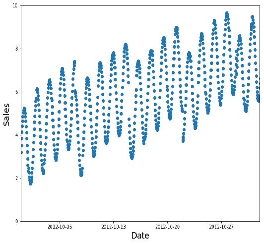

[^图1-19]: 一个时间序列

随机子集是个糟糕的选择（填补空缺过于容易，且无法反映生产环境的实际需求），如图1-20所示。

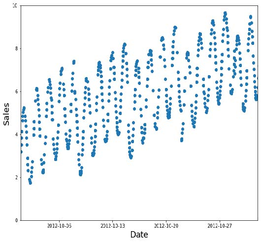

[^图1-20]: 一个糟糕的训练子集

相反，应将较早的数据作为训练集（较晚的数据作为验证集），如图1-21所示。

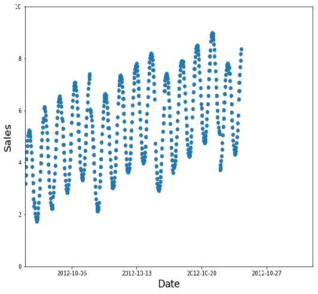

[^图1-21]: 一个好的训练子集

例如，Kaggle曾举办一场 [预测厄瓜多尔连锁杂货店销售额的竞赛](https://oreil.ly/UQoXe) 。Kaggle的训练数据涵盖2013年1月1日至2017年8月15日，测试数据则横跨2017年8月16日至2017年8月31日。通过这种方式，竞赛组织者确保参赛者从其模型的角度出发，对未来时段进行预测。这类似于量化对冲基金交易员通过回测来验证其模型能否基于历史数据预测未来时段的表现。

另一种常见情况是，你能够轻松预见到生产环境中用于预测的数据与训练模型所用的数据在质量上可能存在差异。

在 [Kaggle分心驾驶竞赛中](https://oreil.ly/zT_tC) ，自变量是驾驶员在方向盘前的照片，而因变量则是诸如发短信、吃东西或安全观察前方等分类。许多照片记录的是同一驾驶员在不同姿势下的状态，如图1-22所示。如果你作为保险公司利用这些数据构建模型，请注意最关键的是评估模型对未见驾驶员的预测表现（因训练数据通常仅覆盖小规模人群）。为此，竞赛测试数据特意选用训练集未包含的驾驶员图像。


[^图1-22]: 训练数据中的两个图片

若将图1-22中的某张图像放入训练集，另一张放入验证集，模型对验证集图像的预测将变得轻而易举，从而表现出优于处理新样本时的性能。另一种视角是：若将所有受试者都用于模型训练，模型可能过度拟合特定个体的细节特征，而非真正掌握状态类别（如发短信、进食等）。

在 [Kaggle渔业竞赛](https://oreil.ly/iJwFf) 中也存在类似机制，该竞赛旨在识别渔船捕获的鱼类物种，以减少对濒危种群的非法捕捞。测试集包含未出现在训练数据中的渔船图像，因此在此情况下，验证集也应包含训练集未涵盖的渔船。

有时可能无法明确验证数据将如何不同。例如，对于使用卫星图像的问题，你需要收集更多信息来判断训练集是否仅包含特定地理位置，还是来自地理分布分散的数据。

既然你已经了解了如何构建模型，现在可以决定下一步想深入探索什么内容。

### 一个选择你自己的冒险时刻

如果你希望深入了解如何在实践中运用深度学习模型，包括识别并修复错误、创建真正可运行的网络应用程序，以及避免模型对组织或社会造成意外危害，请继续阅读接下来的两章。如果你希望从深层理解深度学习运作原理开始学习，请直接跳至第4章。（你小时候读过《选择自己的冒险》系列书吗？这本书有点类似那种体验……只不过比该系列书包含了更多深度学习内容。）

要继续阅读本书，你需要通读所有章节，但阅读顺序完全由你自己决定。这些章节之间并不存在依赖关系。如果你跳至第四章，我们将在文末提醒你：请先补读跳过的章节，再继续后续内容。

### 问卷调查

阅读完这么多页文字后，你可能难以确定哪些关键点真正需要关注和记忆。因此，我们在每章结尾准备了一份问题清单及建议步骤。所有答案均藏于章节文本中，若对任何问题存疑，请重新阅读相关段落确保理解。这些问题的完整解答也可在 [书籍官网](https://book.fast.ai/) 查阅。若遇到困惑，你还可访问 [论坛](https://forums.fast.ai/) 寻求其他学习者的帮助。

1. 以下这些对深度学习有必要吗？
   - 很多数学知识
   - 很多数据
   - 很多很贵很贵的电脑
   - 博士学位
2. 请列举五个领域，在这些领域中深度学习目前是全球最优工具。
3. 第一台基于人工神经元原理的设备叫什么名字？
4. 基于同名书籍，并行分布式处理（parallel distributed processing，PDP）有哪些要求？
5. 阻碍神经网络领域发展的两大理论误解是什么？
6. GPU是什么？
7. 打开一个笔记本并执行包含以下内容的单元格：`1+1` 。会发生什么？
8. 请逐个单元格地执行本章笔记本的精简版本。在执行每个单元格之前，请先猜测会发生什么。
9. 完成 [Jupyter Notebook在线附录](https://oreil.ly/9uPZe)
10. 为什么用传统的计算机程序很难识别照片中的图像？
11. 塞缪尔所说的“权重分配”是什么意思？
12. 在深度学习中，我们通常用什么术语来指代塞缪尔所说的“权重”？
13. 绘制一幅图，概括塞缪尔对机器学习模型的观点。
14. 为什么难以理解深度学习模型为何会做出特定预测？
15. 证明神经网络能够以任意精度解决任何数学问题的定理名称是什么？
16. 训练模型需要什么？
17. 反馈循环如何影响预警模型的推广？
18. 我们是否必须始终使用224×224像素的图像来训练猫识别模型？
19. 分类与回归有何区别？
20. 什么是验证集？什么是测试集？为何需要它们？
21. 若未提供验证集，fastai将如何处理？
22. 能否始终使用随机抽样作为验证集？原因何在？
23. 什么是过拟合？请举例说明。
24. 度量指标是什么？它与损失函数有何区别？
25. 预训练模型如何提供帮助？
26. 模型的“头部”指什么？
27. 卷积神经网络的前几层能识别哪些特征？后层又如何？
28. 图像模型仅适用于照片吗？
29. 什么是架构？
30. 什么是分割？
31. `y_range` 是用于什么的？我们何时需要它？
32. 什么是超参数？
33. 在组织中使用AI时，如何最大程度避免失败？

#### 进一步研究

我们的每章还设有“进一步研究”部分，提出书中未完全解答的问题，或提供更高级的习题。这些问题的答案并未公布在书籍网站上，需要您自行开展研究！

1. 为什么GPU对深度学习有帮助？CPU与之有何不同，又为何在深度学习中效率较低？
2. 请尝试思考三个领域，其中反馈循环可能影响机器学习的应用。看看你能否找到实际案例的文献记录。

## 2. 从模型到生产

我们在第一章看到的那六行代码，只是深度学习实际应用过程中的一小部分。本章将通过计算机视觉示例，全面展示创建深度学习应用的端到端流程。具体而言，我们将构建一个熊分类器！在此过程中，我们将探讨深度学习的能力与局限，探索数据集的创建方法，审视实际应用中的潜在陷阱等。其中许多关键要点同样适用于其他深度学习问题（如第一章所示）。如果你处理的问题与本例的核心要素相似，我们相信你可以用极少代码快速获得卓越成果。

让我们先从如何界定问题开始。

### 深度学习实践

我们已经看到，深度学习能够快速解决许多具有挑战性的问题，且所需代码量极少。作为初学者，存在一类问题具有与示例问题足够的相似性，让你能够迅速获得极具实用价值的结果。然而，深度学习并非魔法！同样的六行代码无法适用于当今人们能想到的所有问题。

低估深度学习的局限性而高估其能力，可能导致令人沮丧的糟糕结果——至少在积累经验并能解决问题之前如此。反之，高估深度学习的局限性而低估其能力，则可能让你因自我否定而放弃尝试解决本可攻克的问题。

我们常与那些既低估深度学习局限性又低估其能力的人交谈。这两种情况都可能带来问题：低估能力意味着你可能连那些可能带来巨大益处的方法都不愿尝试；而低估局限性则可能导致你未能考虑并应对重要问题。

最好的做法是保持开放心态。若你愿意接受深度学习可能以少于预期的数据量或复杂度解决部分问题的可能性，便能设计出一个流程，从而找出与特定问题相关的具体能力与限制。这并非意味着要冒险押注——我们将展示如何逐步部署模型，避免产生重大风险，甚至能在投入生产前进行回测验证。

#### 开始你的项目吧

那么，你该从何处开启深度学习之旅？最关键的是确保你有一个项目可供实践——唯有通过自主项目，你才能真正积累构建和使用模型的实战经验。在选择项目时，最重要的考量因素是数据的可用性。

无论你是为自身学习开展项目，还是为组织实践应用而做，都希望能够快速启动。我们目睹过许多学生、研究者和行业从业者在寻找完美数据集的过程中浪费数月乃至数年光阴。目标并非寻找“完美”的数据集或项目，而是立即行动并在此基础上持续迭代。若采纳此法，当完美主义者仍在规划阶段时，你已完成第三轮学习迭代与能力提升！

我们还建议你在项目中采用端到端的迭代方式；不要耗费数月时间微调模型、打磨完美的图形界面或标注完美的数据集……相反，你应该在合理时间内尽可能完善每个步骤，直至项目完成。例如，若最终目标是开发手机应用程序，那么每次迭代后都应能运行该应用。在早期迭代中，你或许需要采取捷径——例如将所有处理工作转移至远程服务器，仅使用简易响应式网页应用。通过贯穿始终的实践，你将洞悉最棘手的环节，并识别出对最终成果影响最显著的关键部分。

在研读本书的过程中，我们建议你通过运行并调整我们提供的笔记本完成大量小型实验，同时逐步开发自己的项目。这样，你就能在我们讲解各项工具和技术时，同步积累实践经验。

> SYLVAIN说
>
> 要充分利用本书，请在每章之间留出时间进行实践，无论是基于你自己的项目，还是探索我们提供的笔记本。随后尝试用新数据集从头重写这些笔记本。唯有通过大量实践（包括失败），你才能培养出训练模型的直觉。

通过采用端到端迭代方法，你还将更清晰地认识到实际所需的数据量。例如，你可能会发现仅能轻松获取200个标注数据样本，除非你实际尝试，否则无法确定这是否足以支撑应用程序在实践中稳定运行的性能需求。

在组织环境中，通过展示真正可运行的原型，你将能向同事证明你的想法切实可行。我们反复观察到，这正是获得组织对项目支持的关键所在。

由于最容易着手开展的项目是那些已有可用数据的项目，这意味着最容易启动的项目很可能与你正在从事的工作相关——因为你已经掌握了相关工作的数据。例如，若从事音乐行业，你可能接触大量录音资料；若担任放射科医师，则可能掌握海量医学影像；若关注野生动物保护，则可能拥有丰富的野生动物影像资源。

有时你需要发挥些创造力。或许你能找到与自己研究领域相关的机器学习项目，比如某个Kaggle竞赛。有时你不得不做出妥协。或许你找不到完全契合特定项目的精准数据，但可以尝试寻找相近领域的数据，或是测量方式不同、解决问题略有差异的数据集。这类相似项目的实践仍能让你掌握整体流程，并可能发现其他捷径、数据来源等。

尤其当你刚接触深度学习时，不宜贸然涉足差异巨大的领域——那些深度学习尚未应用的领域。因为如果模型初始运行不畅，你将无从分辨是自身操作失误，还是所解决的问题本身就不适用于深度学习。届时你甚至无从寻求帮助。因此最佳策略是：先在网上寻找成功案例，选择与自身目标至少部分相似的方向，将数据转换为他人曾使用的格式（例如将数据转化为图像）。让我们审视深度学习的现状，以便你了解当前深度学习擅长处理哪些类型的问题。

#### 深度的学习现状 

让我们先思考深度学习能否有效解决你想要处理的问题。本节概述了2020年初深度学习的发展现状。然而技术发展日新月异，当你阅读本文时，其中部分限制可能已不复存在。我们将努力保持本书网站的及时更新；此外，通过谷歌搜索“当前人工智能能做什么”，很可能获取到最新信息。

##### 计算机视觉

在许多领域，深度学习尚未被用于图像分析，但在已尝试应用的领域中，几乎无一例外地表明计算机识别图像中物体的能力至少与人类相当——甚至超越了专业人士（如放射科医生）的水平。这被称为物体识别。深度学习同样擅长定位图像中的物体，能够标注其位置并命名每个检测到的物体。这被称为物体检测（在第1章提到的变体中，每个像素会根据其所隶属的物体类型进行分类——这称为分割）。

深度学习算法通常不擅长识别与训练数据结构或风格差异显著的图像。例如，若训练数据中不包含黑白图像，模型对黑白图像的识别效果可能较差；同样地，若训练数据未包含手绘图像，模型对这类图像的识别表现也可能欠佳。虽然没有通用方法能检查训练集中缺失哪些图像类型，但本章将展示几种方法，用于在模型投入生产使用时识别数据中出现的意外图像类型（这被称为域外（out-of-domain）数据检测）。

物体检测系统面临的一大挑战在于图像标注过程耗时且成本高昂。目前众多研究正致力于开发工具，以期加快标注速度、简化标注流程，并减少训练精准物体检测模型所需的人工标注数据。其中一种特别有效的方法是通过合成手段生成输入图像的变体，例如旋转图像或调整亮度与对比度；这种技术称为数据增强，同样适用于文本及其他类型模型。本章将对此进行详细探讨。

另一个需要考虑的点是，尽管你的问题表面上可能不像一个计算机视觉问题，但只要稍加想象，或许就能将其转化为计算机视觉问题。例如，如果你试图分类的是声音，可以尝试将声音转换为声波图像，然后基于这些图像训练模型。

##### 文本（自然语言处理）

计算机擅长根据各类标准对短篇与长篇文档进行分类，例如判定是否为垃圾邮件、情感倾向（如评论是正面还是负面）、作者身份、来源网站等。我们尚未发现该领域存在严谨的研究将计算机与人类进行对比，但根据现有案例观察，深度学习在这些任务上的表现似乎与人类相当。

深度学习同样擅长生成符合语境的文本，例如社交媒体帖子的回复，以及模仿特定作者的写作风格。它还擅长使这类内容对人类更具吸引力——事实上，甚至比人类撰写的文本更具吸引力。然而，深度学习并不擅长生成正确的回答！例如，我们目前尚无可靠方法将医学知识库与深度学习模型结合，以生成医学上准确的自然语言回应。这种缺陷极具危险性——因为系统极易生成看似令人信服、实则完全错误的内容，尤其容易误导非专业人士。

另一个担忧在于，社交媒体上那些符合语境且极具说服力的回应，可能被大规模利用——其规模可能远超以往任何水军工厂的数千倍——从而传播虚假信息、制造动荡并煽动冲突。经验法则表明，文本生成模型在技术上永远会略微领先于自动生成文本的识别模型。例如，人们可能利用能识别人工生成内容的模型来改进生成该内容的生成器，直到分类模型完全丧失识别能力。

尽管存在这些问题，深度学习在自然语言处理领域仍有诸多应用：它可用于将文本从一种语言翻译成另一种语言，将长篇文档摘要为更易快速理解的内容，查找所有提及特定概念的文本，等等。遗憾的是，翻译或摘要结果可能包含完全错误的信息！但其性能已足够出色，许多人正在使用这些系统——例如谷歌在线翻译系统（以及我们所知的所有其他在线服务）都基于深度学习技术。

##### 图文结合

深度学习将文本与图像整合到单一模型中的能力，通常远超大多数人的直觉预期。例如，深度学习模型可通过输入图像及其英文说明进行训练，进而学会为新图像自动生成惊人贴切的说明！但需再次强调前文所述的警示：这些说明的准确性无法得到保证。

鉴于这一严重问题，我们通常建议将深度学习作为模型与人类用户紧密协作的流程环节，而非完全自动化的过程。这种协作模式可能使人类的工作效率比纯手工方法提高数个数量级，同时比单纯依靠人工操作产生更精确的流程结果。

例如，自动系统可直接通过CT扫描识别潜在中风患者，并发送高优先级警报以确保医生可以快速阅片。中风治疗窗口仅有三小时，这种快速反馈机制可能挽救生命。与此同时，所有扫描图像仍可按常规流程发送给放射科医生，确保人工介入环节不受影响。其他深度学习模型能自动测量影像中的特定指标，并将测量结果自动填入报告，既提醒医生注意可能遗漏的发现，又提示其他相关病例的参考信息。

##### 表格化的数据

在分析时间序列和表格数据方面，深度学习近年来取得了重大进展。然而，深度学习通常作为多种模型组合的一部分使用。若您现有的系统已采用随机森林或梯度提升机（您即将了解的流行表格建模工具），那么切换至或添加深度学习可能不会带来显著提升。

深度学习确实极大扩展了可纳入的列类型——例如包含自然语言的列（书名、评论等）以及高基数分类列（即包含大量离散选项的列，如邮政编码或产品ID）。但另一方面，深度学习模型通常比随机森林或梯度提升机耗时更长，不过借助RAPIDS等库（为整个建模流程提供GPU加速）这一情况正在改变。我们在第9章中详细探讨了所有这些方法的优缺点。

##### 推荐系统

推荐系统本质上只是表格数据的一种特殊形式。具体而言，它们通常包含一个高基数分类变量来表示用户，以及另一个表示商品（或类似对象）的分类变量。像亚马逊这样的公司，会将客户历来的所有购买行为表示为一个巨大的稀疏矩阵，其中客户作为行，商品作为列。数据科学家将数据转化为此格式后，便会应用某种协同过滤算法填充矩阵。例如：若用户A购买了商品1和10，用户B购买了商品1、2、4和10，系统便会向A推荐购买商品2和4。

由于深度学习模型擅长处理高基数分类变量，它们在推荐系统领域表现尤为出色。正如处理表格数据时那样，当将这些变量与自然语言或图像等其他类型数据结合时，其优势便充分展现出来。它们还能出色地整合所有这些信息类型，并结合以表格形式呈现的附加元数据，例如用户信息、历史交易记录等。

然而，几乎所有机器学习方法都存在一个缺点：它们只能告诉您你特定用户可能喜欢哪些产品，而无法说明哪些推荐对用户真正有用。许多类型的潜在喜好商品推荐可能毫无价值——例如当用户已熟悉这些商品，或它们只是用户已购商品的不同包装形式（如某套小说的合集套装，而用户早已拥有套装中的每本书）。杰里米喜欢阅读特里·普拉切特（Terry
Pratchett）的作品，而亚马逊曾长期只向他推荐普拉切特的著作（见图2-1），这完全没有帮助——因为他早已知晓这些作品！


[^图2-1]: 一种没那么有用的推荐

##### 其他数据类型

通常你会发现，特定领域的数据类型能很好地融入现有分类体系。例如，蛋白质链与自然语言文档极为相似——它们都是由离散标记组成的长序列，序列中贯穿着复杂的关系与意义。事实上，运用自然语言处理的深度学习方法，已成为当前多种蛋白质分析领域的尖端技术。另一个例子是声音数据，其可转化为频谱图进行图像化处理；针对图像的标准深度学习方法在频谱图上同样表现出色。

##### 驱动链方法

许多精确的模型对任何人都毫无用处，而许多不精确的模型却极具实用价值。为确保建模工作在实践中发挥作用，必须考虑成果的应用场景。2012年，Jeremy与Margit Zwemer、Mike Loukides共同提出了一种名为“驱动链方法”（The Drivetrain Approach）的思考框架来应对这一问题。

如图2-2所示的驱动链方法，已在 [《设计卓越数据产品》](https://oreil.ly/KJIIa) 一书中详细阐述。其基本思路是：首先明确目标，接着思考达成目标所需采取的行动，评估现有（或可获取）的辅助数据资源，最后构建模型以确定最优行动方案，从而实现目标层面的最佳效果。

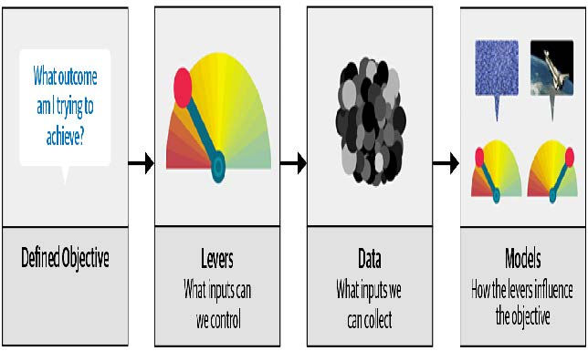

[^图2-2]: 驱动链方法

考虑自动驾驶汽车中的模型：你希望帮助汽车在无需人工干预的情况下安全行驶从点A到点B。卓越的预测建模是解决方案的重要组成部分，但它并非独立存在；随着产品日益复杂，它逐渐融入基础架构之中。使用自动驾驶汽车的用户完全不会意识到，数百（甚至数千）个模型和数千兆字节的数据支撑着它的运行。然而，随着数据科学家构建越来越复杂的产品，他们需要系统化的设计方法。

我们运用数据不仅是为了生成更多数据（以预测形式呈现），更是为了产出可执行的成果。这正是驱动链方法论的核心目标。首先需明确目标——例如谷歌开发首款搜索引擎时，便思考“用户输入搜索词的核心诉求是什么？”由此确立了谷歌的核心目标：“呈现最相关的搜索结果”。下一步是思考可施加哪些杠杆（即采取哪些行动）来更好地实现该目标。对谷歌而言，关键在于搜索结果的排序机制。第三步是考量生成此类排序所需的新数据类型；他们意识到网页间的隐性关联信息——即哪些页面链接到其他页面——可为此目的提供价值。

只有完成这前三步，我们才开始考虑构建预测模型。我们的目标与可用杠杆——即已有的数据和需要补充收集的数据——决定了可构建的模型类型。模型将同时接收杠杆和不可控变量作为输入；通过整合模型输出，即可预测目标的最终状态。

让我们再看一个例子：推荐系统。推荐引擎的目标是通过推荐那些客户在没有推荐的情况下不会购买的商品，以惊喜和愉悦的方式推动额外销售。其杠杆作用在于推荐的排序。要生成能催生新销售的推荐，必须收集新数据。这需要开展大量随机实验，以收集针对不同客户群体、不同推荐方案的海量数据。很少有组织会采取这一步骤；但若缺失此环节，你就无法获取优化推荐所需的关键信息——而优化推荐的真正目标正是提升销售额！

最后，你可以构建两个购买概率模型，分别取决于用户是否看到推荐。这两种概率之差即为给定推荐对顾客的效用函数。当算法推荐顾客已拒绝过的熟悉书籍（两项均值较低）或顾客即使没有推荐也会购买的书籍（两项均值较高且相互抵消）时，该效用函数值将较低。

正如你所见，在实际操作中，模型的实际应用往往需要远不止训练模型那么简单！你通常需要通过实验收集更多数据，并考虑如何将模型整合到正在开发的整体系统中。说到数据，现在让我们聚焦于如何为项目寻找数据。

### 收集数据

对于许多类型的项目，你可能能在网上找到所需的所有数据。本章我们将完成的项目是一款熊探测器，它能区分三种熊：灰熊、黑熊和泰迪熊。互联网上有大量每种熊的图像可供使用，我们只需找到并下载它们的方法即可。

我们为此目的提供了一个工具，你可以使用它跟随本章内容，为自己感兴趣的任何物体创建图像识别应用程序。在fast.ai课程中，数千名学员已在课程论坛展示了他们的成果，内容涵盖从特立尼达的蜂鸟品种到巴拿马的巴士类型——甚至有学员开发了应用程序，帮助未婚妻在圣诞假期辨认他16位表亲！

截至本文撰写之时，必应图片搜索是我们所知查找和下载图片的最佳选择。该服务每月提供1000次免费查询，每次查询最多可下载150张图片。不过，从我们撰写本书到您阅读之时，可能已有更优方案问世，因此请务必访问本书官网查看我们当前的推荐方案。

> 时刻关注最新的服务
>
> 用于创建数据集的服务层出不穷，其功能、接口和定价也经常变化。本节将展示如何使用本书撰写时作为 Azure 认知服务一部分提供的 Bing 图片搜索 API。

要使用必应图片搜索下载图片，你得在微软注册免费账户。你将获得一个密钥，可将其复制并按以下方式输入单元格（将XXX替换为你自己的密钥并执行）：

```python
key = 'XXX'
```

或者，如果你熟悉命令行操作，也可以在终端中通过以下命令设置：

```bash
export AZURE_SEARCH_KEY=your_key_here
```

然后重启Jupyter服务器，在单元格中输入以下内容并执行：

```python
key = os.environ['AZURE_SEARCH_KEY']
```

设置好密钥后，即可使用 `search_images_bing` 函数。该函数由在线笔记本中包含的小型工具类提供（若不确定函数定义位置，只需在笔记本中输入函数名即可查找，如图所示）：

```python
search_images_bing
<function utils.search_images_bing(key, term, min_sz=128)>
```

让我们试试这个函数：

```python
results = search_images_bing(key, 'grizzly bear')
ims = results.attrgot('content_url')
len(ims)

150
```

我们已成功下载了150只灰熊的URL（或者至少是必应图片搜索为该关键词找到的图片）。让我们看看其中一张：

```python
dest = 'images/grizzly.jpg'
download_url(ims[0], dest)
```

```python
im = Image.open(dest)
im.to_thumb(128,128)
```


这似乎效果不错，那么我们来使用fastai的 `download_images` 方法下载每个搜索词的所有URL。我们将把每个URL存放在单独的文件夹中：

```python
bear_types = 'grizzly','black','teddy'
path = Path('bears')

if not path.exists():
    path.mkdir()
    for o in bear_types:
        dest = (path/o)
        dest.mkdir(exist_ok=True)
        results = search_images_bing(key, f'{o} bear')
        download_images(dest, urls=results.attrgot('content_url'))
```

我们的文件夹里保存着图像文件，正如我们所预期的那样：

```python
fns = get_image_files(path)
fns
(#421)
[Path('bears/black/00000095.jpg'),Path('bears/black/00000133.jpg'),Path('
>
bears/black/00000062.jpg'),Path('bears/black/00000023.jpg'),Path('bears/black
>
/00000029.jpg'),Path('bears/black/00000094.jpg'),Path('bears/black/00000124.j
>
pg'),Path('bears/black/00000056.jpeg'),Path('bears/black/00000046.jpg'),Path(
> 'bears/black/00000045.jpg')...]
```

> JEREMY说
>
> 我就是喜欢在Jupyter笔记本里工作！它让我能轻松地逐步构建想要的内容，并在每一步都检查我的工作。我经常犯错，所以这对我真的很有帮助。

我们从互联网上下载文件时，常会遇到部分文件损坏的情况。让我们来检查一下：

```python
failed = verify_images(fns)
failed
(#0) []
```

要删除所有失败的图像，可以使用 `unlink`。与大多数返回集合的 fastai 函数类似， `verify_images` 返回类型为 `L` 的对象，该对象包含 `map` 方法。该方法会对集合中的每个元素调用传递的函数：

```python
failed.map(Path.unlink);
```

> 在Jupyter笔记本中获取帮助
>
> Jupyter笔记本非常适合进行实验并即时查看每个函数的结果，但它还提供了大量功能，帮助你了解如何使用不同函数，甚至直接查看它们的源代码。例如，假设你在单元格中输入以下内容：
>
> ```python
> ??verify_images
> ```
>
> 将弹出一个窗口，显示以下内容：
>
> ```python
> Signature: verify_images(fns)
> Source:
> def verify_images(fns):
> 	"Find images in `fns` that can't be opened"
> 	return L(fns[i] for i,o in
> 		enumerate(parallel(verify_image, fns)) if not o)
> File: ~/git/fastai/fastai/vision/utils.py
> Type: function
> ```
>
> 这告诉我们函数接受哪些参数（`fns`），并展示了源代码及其所属文件。查看该源代码可知，它并行调用 `verify_image` 函数，仅保留该函数返回值为 `False` 的图像文件，这与文档字符串描述一致：它会找出 `fns` 中无法打开的图像文件。
>
> 以下是Jupyter笔记本中其他非常实用的功能：
>
> - 在任何时候，若忘记函数或参数名称的精确拼写，按Tab键即可获得自动补全建议。
> - 在函数括号内同时按下 Shift 和 Tab 键，将弹出显示函数签名及简要说明的窗口。连续按两次可展开文档详情，按三次则在屏幕底部打开完整文档窗口。
> - 在单元格中输入 ?func_name 并执行，将弹出包含函数签名和简要说明的窗口。
> - 在单元格中输入 ??func_name 并执行，将弹出包含函数签名、简要说明及源代码的窗口。
> - 若使用 fastai 库，我们为你新增了 `doc` 函数：在单元格中执行 `doc(func_name)` 将打开一个窗口，显示函数签名、简要说明，以及指向 GitHub 源代码和库文档中完整函数文档的链接。
> - 虽与文档无关但同样实用：若遇到错误需获取帮助，可在任意单元格输入 `%debug` 并执行，即可启动Python调试器，从而检查每个变量的内容。

在此过程中需要注意一点：正如我们在第一章讨论的那样，模型只能反映用于训练它们的数据。而现实世界中充斥着偏颇的数据，这些偏见最终会体现在诸如必应图片搜索（我们曾用其创建数据集）等工具中。例如，假设你想开发一款能帮助用户判断皮肤是否健康的应用，于是你用（比如）“健康皮肤”的搜索结果训练模型。图2-3展示了你可能得到的结果类型。


[^图2-3]: 这是为健康皮肤分类器准备的数据吗？

如果你以此作为训练数据，最终得到的并非健康皮肤检测器，而是年轻白人女性触摸面部检测器！务必仔细思考实际应用中可能遇到的各类数据类型，并仔细核查确保模型源数据涵盖所有类型。（感谢Deb Raji提出健康皮肤的例子。欲深入了解模型偏见，请参阅她的论文 [《可操作性审计：探究公开披露商业AI产品偏颇性能结果的影响》](https://oreil.ly/POS_C) ）

现在我们已经下载了一些数据，需要将其整理成适合模型训练的格式。在fastai中，这意味着创建一个名为 `DataLoaders` 的对象。

### 从数据到  `DataLoaders`

`DataLoaders` 是一个轻量级类，仅用于存储你传入的任何 `DataLoader` 对象，并将其作为 `train` 和 `valid` 提供。尽管它是一个简单的类，但在 fastai 中却至关重要：它为您的模型提供数据。`DataLoaders `的核心功能仅通过以下四行代码实现（它还包含其他一些次要功能，我们暂且略过）：

```python
class DataLoaders(GetAttr):
    def __init__(self, *loaders): self.loaders = loaders
    def __getitem__(self, i): return self.loaders[i]
	train,valid = add_props(lambda i,self: self[i])
```

> 术语：DataLoaders
>
> 一个 fastai 类，用于存储你传递给它的多个 `DataLoader` 对象——通常包含一个 `train` 和 `valid` ，尽管你也可以拥有任意数量的数据集。前两个数据集将作为属性提供。

在书的后半部分，你还将了解到 `Dataset` 和 `Datasets` 类，它们具有相同的关系。要将下载的数据转换为 `DataLoaders` 对象，我们至少需要向fastai提供以下四项信息：

- 我们正在处理哪些类型的数据
- 如何获取项目列表
- 如何标注这些项目
- 如何创建验证集

迄今为止，我们已经看到许多针对特定组合的 *工厂方法* （factory methods），当应用程序和数据结构恰好符合这些预定义方法时，它们非常方便。而当情况并非如此时，fastai提供了一个名为数据块API的极其灵活的系统。借助该API，你可以完全自定义 `DataLoaders` 创建过程的每个阶段。以下是为刚刚下载的数据集创建 `DataLoaders` 所需的步骤：

```python
bears = DataBlock(
    blocks=(ImageBlock, CategoryBlock),
    get_items=get_image_files,
    splitter=RandomSplitter(valid_pct=0.2, seed=42),
    get_y=parent_label,
    item_tfms=Resize(128))
```

让我们依次审视这些参数。首先，我们提供一个元组来指定独立变量和依赖变量的类型：

```python
blocks=(ImageBlock, CategoryBlock)
```

自变量是我们用来进行预测的依据，而因变量则是我们的目标。在此案例中，自变量是一组图像，因变量则是每张图像所属的类别（熊的种类）。在本书后续内容中，我们将看到许多其他类型的数据块。

对于这些 `DataLoaders`  ，我们的底层项目将是文件路径。我们需要告诉 fastai 如何获取这些文件的列表。`get_image_files` 函数接受一个路径参数，并返回该路径下所有图像的列表（默认采用递归方式）：

```python
get_items=get_image_files
```

通常情况下，你下载的数据集已预先定义了验证集。有时通过将训练集和验证集的图像分别存放于不同文件夹实现；有时则提供CSV文件，其中列出每个文件名及其所属数据集。实现方式多种多样，fastai提供通用方法，既可使用其预定义类，也可自行编写实现。

在此情况下，我们希望随机划分训练集和验证集。然而，我们希望每次运行此笔记本时都能获得相同的训练/验证划分，因此我们固定随机种子（计算机实际上并不会真正生成随机数，只是生成看似随机的数字序列；若每次为该序列提供相同的起始点——即种子——则每次都会得到完全相同的序列）。

```python
splitter=RandomSplitter(valid_pct=0.2, seed=42)
```

自变量通常用 `x` 表示，因变量通常用 `y` 表示。在此，我们告知fastai调用何种函数来生成数据集中的标签：

```python
get_y=parent_label
```

`parent_label` 是 fastai 提供的一个函数，它仅用于获取文件所在的文件夹名称。由于我们将每张熊的图像根据熊的类型分别存放在不同的文件夹中，因此该函数将为我们提供所需的标签。

我们的图像尺寸各不相同，这对深度学习构成挑战：我们并非单张输入图像，而是批量处理（即所谓的迷你批次（mini-batch））。为将它们整合成大型数组（通常称为张量（tensor））以供模型处理，所有图像必须统一尺寸。因此需要添加转换操作，将图像尺寸统一调整至相同规格。项转换（Item transforms）是针对每个独立项（无论是图像、类别等）执行的代码片段。fastai内置多种预定义转换，此处我们使用Resize转换并指定128像素的尺寸：

```python
item_tfms=Resize(128)
```

该命令为我们创建了一个 `DataBlock` 对象。它类似于创建 `DataLoaders` 的模板。我们仍需告知fastai实际的数据源——本例中即图像文件所在的路径：

```python
dls = bears.dataloaders(path)
```

`DataLoaders` 包含验证数据加载器和训练数据加载器。`DataLoader` 是一个类，它每次向GPU提供若干个元素的批次。下一章我们将深入探讨该类。当循环遍历数据加载器时，fastai会默认每次提供64个元素，并将其全部堆叠为单个张量。通过调用 `DataLoader` 的 `show_batch` 方法，我们可以查看其中若干元素：

```python
dls.valid.show_batch(max_n=4, nrows=1)
```

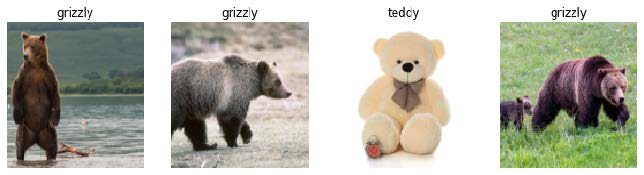

默认情况下，`Resize` 会 *裁剪* （crops）图像以适应请求尺寸的正方形，使用全宽或全高。这可能会导致丢失一些重要细节。或者，你可以要求 fastai 用零（黑色）填充图像，或进行压缩/拉伸：

```python
bears = bears.new(item_tfms=Resize(128, ResizeMethod.Squish))
dls = bears.dataloaders(path)
dls.valid.show_batch(max_n=4, nrows=1)
```

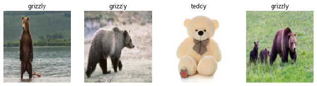

```python
bears = bears.new(item_tfms=Resize(128, ResizeMethod.Pad,
pad_mode='zeros'))
dls = bears.dataloaders(path)
dls.valid.show_batch(max_n=4, nrows=1)
```

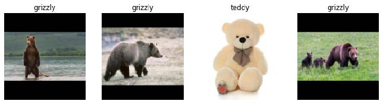

所有这些方法似乎都存在浪费或问题。如果我们压缩或拉伸图像，最终会导致形状不真实，使模型学习到的物体外观与实际不符，这显然会降低识别准确率。如果裁剪图像，则会去除部分用于识别的特征。例如在识别犬猫品种时，裁剪可能导致关键身体部位或面部特征缺失，而这些特征正是区分相似品种的关键。若对图像进行填充，则会产生大量空白区域，不仅造成模型计算资源浪费，还会降低实际使用图像区域的有效分辨率。

相反，我们在实践中通常的做法是随机选取图像的一部分，然后裁剪为仅包含该部分。在每个迭代轮次（即对数据集内所有图像进行一次完整遍历）中，我们随机选取每张图像的不同区域。这意味着模型能够学会聚焦并识别图像中的多样化特征，同时也反映了现实世界中图像的呈现方式：同一物体的不同照片可能存在细微的构图差异。

事实上，一个完全未经训练的神经网络对图像的特性一无所知。它甚至无法识别当物体旋转一度后，它仍然是同一事物的图像！因此，通过训练神经网络识别那些物体位置略有不同、尺寸稍有差异的图像示例，能帮助它理解物体的基本概念，以及物体在图像中的呈现方式。

这里是另一个示例，我们将 `Resize` 替换为 `RandomResizedCrop` ，该变换提供了上述行为。最重要的传入参数是 `min_scale` ，它决定每次操作中图像的最小选取比例：

```python
bears = bears.new(item_tfms=RandomResizedCrop(128, min_scale=0.3))
dls = bears.dataloaders(path)
dls.train.show_batch(max_n=4, nrows=1, unique=True)
```

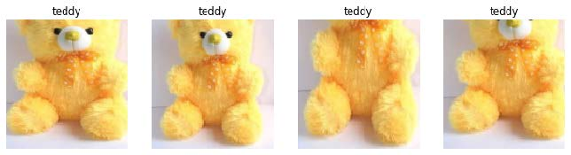

在此，我们使用 `unique=True` 使同一张图像通过不同版本的 `RandomResizedCrop` 变换进行重复处理。

`RandomResizedCrop` 是数据增强这一更普遍技术的一个具体示例。

#### 数据增强

数据增强是指对输入数据进行随机变异处理，使其外观发生改变但不改变数据的含义。常见的图像数据增强技术包括旋转、翻转、透视变形、亮度调整和对比度调整。对于我们在此使用的自然照片图像，`aug_transforms` 函数提供了一套经过验证效果良好的标准增强方案。

由于所有图像现已统一尺寸，我们可以利用GPU对整批图像应用这些增强操作，从而大幅节省时间。要告知fastai对批次应用这些变换，我们使用 `batch_tfms` 参数（注意本例未使用 `RandomResizedCrop`，以便更清晰展示差异；同时采用双倍于默认值的增强量，原因同上）：

```python
bears = bears.new(item_tfms=Resize(128),
batch_tfms=aug_transforms(mult=2))
dls = bears.dataloaders(path)
dls.train.show_batch(max_n=8, nrows=2, unique=True)
```

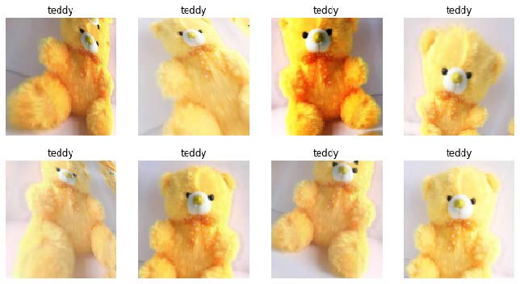

既然我们已经将数据整理成适合模型训练的格式，接下来就用它来训练一个图像分类器吧。

### 训练你的模型，然后用它来清洗你的数据

现在该使用与第一章相同的代码行来训练我们的熊分类器了。由于我们面临的问题数据量有限（每种熊最多150张图片），因此训练模型时将采用 `RandomResizedCrop`方法，图像尺寸设为224像素（这是图像分类中的标准尺寸），并使用默认的 `aug_transforms` 参数：

```python
bears = bears.new(
    item_tfms=RandomResizedCrop(224, min_scale=0.5),
    batch_tfms=aug_transforms())
dls = bears.dataloaders(path)
```

现在我们可以创建我们的 `Learner` 并按常规方式进行微调：

| 迭代轮次 | 训练损失 | 验证损失 | 错误率   | 时间  |
| -------- | -------- | -------- | -------- | ----- |
| 0        | 1.235733 | 0.212541 | 0.087302 | 00:05 |
| 0        | 0.213371 | 0.112450 | 0.023810 | 00:05 |
| 1        | 0.173855 | 0.072306 | 0.023810 | 00:06 |
| 2        | 0.147096 | 0.039068 | 0.015873 | 00:06 |
| 3        | 0.123984 | 0.026801 | 0.015873 | 00:06 |

现在让我们看看模型犯的错误主要是将灰熊误认为泰迪熊（这会危及安全！），还是将灰熊误认为黑熊，抑或其他情况。为可视化呈现，我们可以创建混淆矩阵：

```python
interp = ClassificationInterpretation.from_learner(learn)
interp.plot_confusion_matrix()
```

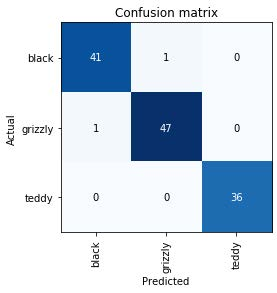

这里行分别代表数据集中所有的黑熊、灰熊和泰迪熊。列分别代表模型预测为黑熊、灰熊和泰迪熊的图像。因此，矩阵对角线显示的是分类正确的图像，非对角线单元格则代表分类错误的图像。这是fastai提供多种模型结果可视化方式之一。该结果（当然！）基于验证集计算得出。通过颜色编码，目标是使除对角线外的所有单元格呈现白色，而对角线区域则显示深蓝色。我们的熊分类器几乎没有出错！

要找出错误的具体发生位置很有帮助，这样就能判断问题是源于数据集（例如根本不是熊的图像，或标注错误）还是模型本身（比如无法处理特殊光照条件下的图像，或角度不同的图像等）。为此，我们可以按损失值对图像进行排序。

*损失值*（loss）是一个数值，当模型预测错误时（特别是当模型对错误答案也充满信心时），或当模型预测正确但对正确答案缺乏信心时，该数值会更高。在第二部分开头，我们将深入学习损失值如何计算以及在训练过程中如何应用。目前，`plot_top_losses` 方法展示了数据集中损失值最高的图像。正如输出标题所示，每张图像都标注了四项信息：预测值、实际值（目标标签）、损失值和置信度。这里的置信度是模型对预测结果赋予的信心水平，取值范围为0到1：

```python
interp.plot_top_losses(5, nrows=1)
```

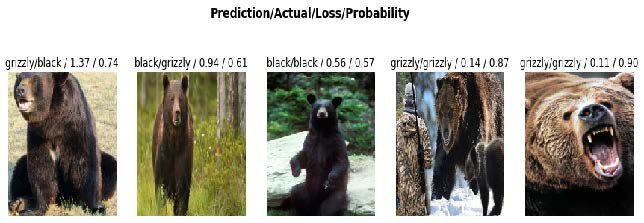

该输出结果表明，损失值最高的图像被系统以高置信度预测为“灰熊”。然而根据我们的Bing图像搜索结果，该图像实际标注为“黑熊”。虽然我们并非熊类专家，但该标签显然存在错误！我们应将其标签修改为“灰熊”。

数据清洗的直观做法是在训练模型前进行。但正如本例所示，模型能帮助我们更快、更轻松地发现数据问题。因此我们通常优先训练一个快速简单的模型，再利用它辅助数据清洗工作。

fastai 包含一个名为 `ImageClassifierCleaner` 的便捷图形界面工具，用于数据清理。该工具允许您选择类别和训练集/验证集，查看损失最高的图像（按顺序排列），并提供菜单选项以选择图像进行删除或重新标注：

```python
cleaner = ImageClassifierCleaner(learn)
cleaner
```

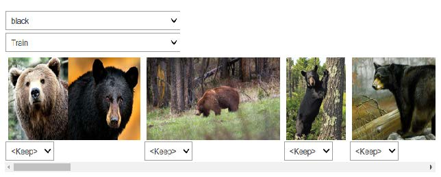

我们发现“黑熊”类别中有一张包含两只熊的图片：一只灰熊，一只黑熊。因此，我们应在此图片下方菜单中选择 `<Delete>`。`ImageClassifierCleaner` 不会自动执行删除或修改标签的操作，它仅返回待修改项目的索引。例如，若要删除（解除关联）所有标记为删除的图像，需执行以下操作：

```python
for idx in cleaner.delete(): cleaner.fns[idx].unlink()
```

要移动已选择不同类别的图片，我们需要运行以下操作：

```python
for idx,cat in cleaner.change(): shutil.move(str(cleaner.fns[idx]),
path/cat)
```

> SYLVAIN说
>
> 数据清洗和模型准备是数据科学家面临的两大挑战，据称耗费了他们90%的时间。fastai库旨在提供工具，使这些工作尽可能轻松。

在本书后续内容中，我们将看到更多基于模型的数据清洗示例。完成数据清洗后，即可重新训练模型。请亲自尝试，看看你的模型的准确率是否有所提升！

> 并不需要大数据
>
> 在完成上述数据集清理步骤后，我们通常能在此任务中实现100%的准确率。即使下载的图像数量远少于当前每类150张的规模，我们依然能获得相同结果。由此可见，所谓深度学习需要海量数据的普遍说法，与事实可能相去甚远！

现在模型已经训练完成，让我们看看如何将其部署到实际应用中。

### 将你的模型转化为在线应用程序

接下来我们将探讨如何将此模型转化为可运行的在线应用程序。我们仅会创建一个基础可运行的原型；本书篇幅有限，无法详尽讲解网络应用程序开发的全部细节。

#### 使用该模型进行推理

当你获得满意的模型后，需要将其保存以便后续复制到生产环境的服务器上使用。请记住，模型由两部分组成：架构和训练参数。最简便的保存方式是同时保存这两部分，这样加载模型时就能确保架构与参数完全匹配。要保存这两部分，请使用 `export` 方法。

该方法甚至省去了定义如何创建 `DataLoaders` 的步骤。这点至关重要，因为否则你将不得不重新定义数据转换方式才能在生产环境中使用模型。fastai默认会自动使用验证集 `DataLoaders` 进行推理，因此数据增强操作不会生效——这通常正是你期望的结果。

当你调用 `export` 时，fastai会保存一个名为 `export.pkl` 的文件：

```python
learn.export()
```

让我们使用 fastai 为 Python 的 Path 类添加的 `ls` 方法来检查文件是否存在：

```python
path = Path()
path.ls(file_exts='.pkl')
(#1) [Path('export.pkl')]
```

无论将应用部署到何处，你都需要此文件。现在，让我们尝试在笔记本中创建一个简单的应用。

当我们使用模型进行预测而非训练时，称为 *推理* （inference.）。要从导出文件创建推理学习器，我们使用`load_learner`函数（在此情况下其实并非必需，因为笔记本中已有可用的学习器；此处演示是为了完整呈现端到端流程）：

```python
learn_inf = load_learner(path/'export.pkl')
```

在进行推理时，我们通常每次只对单张图像进行预测。为此，请向 `predict` 函数传递文件名：

```python
learn_inf.predict('images/grizzly.jpg')

('grizzly', tensor(1), tensor([9.0767e-06, 9.9999e-01, 1.5748e-07]))
```

这返回了三项内容：以你最初提供的相同格式（本例中为字符串）呈现的预测类别、该预测类别的索引，以及各类别的概率值。后两项基于 `DataLoaders` 词汇表中类别的顺序，即存储的所有可能类别列表。推理时，可通过 `Learner` 的属性访问 `DataLoaders` ：

```python
learn_inf.dls.vocab

(#3) ['black','grizzly','teddy']
```

我们在此可见，若使用 `predict` 函数返回的整数在词表中进行索引，则如预期般得到“灰熊”一词。同时请注意，若对概率列表进行索引，可发现该词为灰熊的概率接近1.00。

我们已经掌握了如何从保存的模型中进行预测，因此具备了开始构建应用程序所需的一切。我们可以在Jupyter笔记本中直接实现这一功能。

#### 从模型创建笔记本应用

要在应用程序中使用我们的模型，只需将 `predict` 方法视为常规函数即可。因此，开发人员可利用现有的众多框架和技术，基于该模型创建应用程序。

然而，大多数数据科学家并不熟悉网络应用程序开发领域。因此，让我们尝试使用你目前熟悉的工具：事实证明，仅凭Jupyter笔记本就能创建一个完整的可运行网络应用程序！实现这一目标需要以下两项要素：

- IPython 小部件 (ipywidgets)
- Voilà

IPython小部件是图形用户界面组件，可在网页浏览器中整合JavaScript与Python功能，并能在Jupyter笔记本中创建和使用。例如本章前文介绍的图像清理工具，便是完全通过IPython小部件实现的。但我们不希望要求应用程序用户自行运行Jupyter。

这就是Voilà存在的意义。它是一个系统，能够让由IPython控件组成的应用程序直接提供给终端用户，而用户完全无需使用Jupyter。Voilà利用了笔记本本身就是一种网络应用程序的事实——只是它相当复杂，依赖于另一个网络应用程序：Jupyter本身。本质上，它帮助我们将已隐含创建的复杂网络应用程序（即笔记本）自动转换为更简单、更易部署的网络应用程序，使其像普通网络应用程序而非笔记本那样运行。

但我们仍拥有在笔记本中开发的优势，因此借助 ipywidgets，我们可以逐步构建图形用户界面。我们将采用这种方法创建一个简单的图像分类器。首先，我们需要一个文件上传控件：

```python
btn_upload = widgets.FileUpload()
btn_upload
```


现在我们可以获取图像：

```python
img = PILImage.create(btn_upload.data[-1])
```


我们可以使用一个 `Output` 控件来显示它：

```python
out_pl = widgets.Output()
out_pl.clear_output()
with out_pl: display(img.to_thumb(128,128))
out_pl
```


然后我们就能得到预测结果：

```python
pred,pred_idx,probs = learn_inf.predict(img)
```

并使用 `Label` 来显示它们：

```python
lbl_pred = widgets.Label()
lbl_pred.value = f'Prediction: {pred}; Probability:
{probs[pred_idx]:.04f}'
lbl_pred
```

```text
Prediction: grizzly; Probability: 1.0000
```

我们需要一个按钮来执行分类操作。它的外观与上传按钮完全相同：

```python
btn_run = widgets.Button(description='Classify')
btn_run
```

我们还需要一个点击事件处理程序，即按下时会被调用的函数。我们可以直接复制之前的代码行：

```python
def on_click_classify(change):
    img = PILImage.create(btn_upload.data[-1])
    out_pl.clear_output()
    with out_pl: display(img.to_thumb(128,128))
    pred,pred_idx,probs = learn_inf.predict(img)
    lbl_pred.value = f'Prediction: {pred}; Probability:
    {probs[pred_idx]:.04f}'
btn_run.on_click(on_click_classify)
```

现在吧可以点击按钮进行测试，图像和预测结果将自动更新！

现在我们可以将它们全部放入一个垂直框（`VBox`）中，以完成我们的图形用户界面：

```python
VBox([widgets.Label('Select your bear!'),
	btn_upload, btn_run, out_pl, lbl_pred])
```

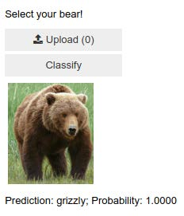

我们已经编写了应用程序所需的所有代码。下一步是将其转换为可部署的形式。

#### 将笔记本变成真正应用程序

现在Jupyter笔记本中的所有功能都已正常运行，我们可以着手创建应用程序了。为此，请新建一个笔记本，仅添加创建并展示所需控件的代码，以及需要显示的文本对应的Markdown格式。请查阅本书代码库中的 `bear_classifier` 笔记本，了解我们创建的简易笔记本应用程序。

若尚未安装Voilà，请将以下代码复制到笔记本单元格中执行：

```bash
!pip install voila
!jupyter serverextension enable voila --sys-prefix
```

以 `!` 开头的单元格不包含 Python 代码，而是包含将被传递至您的 shell（如 bash、Windows PowerShell 等）执行的命令。若您熟悉命令行操作（本书后续将详细探讨），当然也可以直接在终端输入这两行命令（无需 `!` 前缀）。此时第一行将安装 voila 库及应用程序，第二行则将其连接至您现有的 Jupyter 笔记本。

Voilà 运行 Jupyter 笔记本的方式与你当前使用的 Jupyter 笔记本服务器完全相同，但它还实现了至关重要的功能：移除所有单元格输入内容，仅展示输出结果（包括 ipywidgets）以及你的 Markdown 单元格。最终呈现的正是完整的网页应用程序！若要以 Voilà 网络应用形式查看笔记本，请将浏览器地址栏中的“notebooks”替换为“voila/render”。你将看到与笔记本相同的内容，但所有代码单元格均已消失。

当然，你不必使用Voilà或ipywidgets。你的模型本质上只是一个可调用的函数（`pred` , `pred_idx` , `probs = learn.predict(img)` ），因此可在任何框架下使用，部署于任意平台。你还可将通过ipywidgets和Voilà原型化的内容，后续转换为常规Web应用程序。我们在书中展示这种方法，是因为我们认为这对数据科学家及其他非网页开发专家而言，是将模型转化为应用程序的绝佳途径。

我们已经有了应用程序，现在就来部署它吧！

#### 部署你的应用程序

正如你所知，训练几乎任何有用的深度学习模型都需要GPU。那么，在生产环境中使用该模型是否也需要GPU？不需要！你几乎肯定不需要GPU来部署生产环境中的模型。原因有以下几点：

- 正如我们所见，GPU仅在执行大量相同任务的并行处理时才具有优势。若进行图像分类等操作，通常每次仅处理单个用户的图像，且单张图像的处理量往往不足以让GPU持续高效运转。因此CPU通常更具成本效益。
- 另一种方案是等待多个用户提交图像后批量处理，再通过GPU一次性完成计算。但这会导致用户需要等待结果，无法即时获取反馈！且该方案需高流量网站支撑才能实现。若确实需要此功能，可采用微软ONNX Runtime或AWS SageMaker。
- 处理GPU推理涉及显著复杂性。尤其需要手动精细管理GPU内存，并构建严谨的队列系统确保每次仅处理单批次任务。
- CPU服务器市场的竞争远比GPU服务器激烈，因此CPU服务器存在更经济实惠的选择方案。

由于GPU服务的复杂性，许多系统应运而生，试图实现自动化。然而，管理和运行这些系统同样复杂，通常需要将模型编译成该系统专用的不同形式。通常情况下，除非应用程序足够流行，以至于这样做具有明显的经济效益，否则最好避免处理这种复杂性。

至少对于应用程序的初始原型以及任何你想展示的业余项目，你都可以轻松免费托管它们。最佳托管平台与方式会随时间变化，请访问本书官网获取最新建议。本书撰写于2020年初，当前最简便（且免费！）的方案是使用 [Binder](https://mybinder.org/) 。在Binder发布网页应用的步骤如下：

1. 将你的笔记本添加到 GitHub 存储库中。
2. 将该存储库的 URL 粘贴到 Binder 的 URL 字段中，如图 2-4 所示。
3. 将文件下拉菜单切换为URL选项。
4. 在“打开的URL”字段输入 `/voila/render/name.ipynb`（将name替换为你的笔记本名称）。

5. 点击右下角剪贴板按钮复制URL，并将其粘贴至安全位置。
6. 点击启动。


[^图2-4]: 部署到Binder

首次执行此操作时，Binder 构建网站约需 5 分钟。后台正在寻找可运行你应用的虚拟机、分配存储空间，并收集用于 Jupyter、你的笔记本以及将笔记本呈现为网络应用所需的文件。

最后，当应用程序启动运行后，它将引导你的浏览器访问您的新网页应用。你还可以分享已复制的URL链接，让其他人也能访问你的应用。

有关部署网络应用的其他选项（包括免费和付费方案），请务必访问 [本书网站](https://book.fast.ai/) 。

你可能希望将应用程序部署到移动设备或边缘设备（如树莓派）。现有多种库和框架可让你将模型直接集成到移动应用中。然而这些方法往往需要大量额外步骤和冗余代码，且未必支持模型可能使用的所有 PyTorch 和 fastai 层。此外，具体实现方式取决于目标部署的移动设备类型——iOS设备需要特定适配方案，新型Android设备需不同方案，旧版Android设备又需另行处理。因此我们建议尽可能将模型本身部署至服务器，让移动或边缘应用以Web服务形式连接调用。

这种方法有不少优势。初始安装更简单，因为只需部署一个小型图形界面应用程序，它通过连接服务器完成所有繁重工作。更重要的是，核心逻辑的升级可以在服务器端完成，无需分发给所有用户。相较于多数边缘设备，服务器拥有更充裕的内存与处理能力，当模型需求增加时，这些资源也更易于扩展。服务器硬件通常更标准化，且能更好地支持fastai和PyTorch，因此无需将模型编译为其他格式。

当然，这也存在一些弊端。你的应用程序需要网络连接，且每次调用模型时都会产生延迟。（神经网络模型的运行本身就需要时间，因此额外的网络延迟在实际使用中可能不会对用户造成太大影响。事实上，由于服务器端可使用更强大的硬件，整体延迟甚至可能低于本地运行！） 此外，若应用涉及敏感数据，用户可能对数据传输至远程服务器的做法心存顾虑。因此隐私考量有时要求模型必须在边缘设备上运行（通过部署本地服务器——例如置于公司防火墙内——或许能规避此问题）。管理复杂性与扩展服务器同样会产生额外开销，而若模型在边缘设备上运行，每个用户都自带计算资源，这使得随着用户数量增加更易实现扩展（即水平扩展）。

> ALEXIS说
>
> 在工作中，我有机会近距离观察移动机器学习领域正在发生的变化。我们提供一款依赖计算机视觉技术的iPhone应用，多年来一直在云端运行自主开发的计算机视觉模型。当时这是唯一可行的方案，因为这些模型需要大量内存和计算资源，处理输入数据需耗时数分钟。这种方案不仅需要构建模型（很有趣！），还需搭建基础设施来确保一定数量的“计算工作机”始终保持运行（令人担忧），当流量增加时能自动调用更多机器，为大型输入输出数据提供稳定存储空间，并使iOS应用能够实时了解任务执行状态并向用户反馈等。如今苹果提供了将模型转换为设备端高效运行的API，且多数iOS设备都配备了专用机器学习硬件，这已成为主流策略，因此我们的新模型均采用此策略。虽然仍非易事，但对我们而言，为提升用户体验速度并减少服务器维护负担，这笔投入是值得的。现实中，适合你的方案取决于你试图打造的用户体验以及个人能力倾向。若你精通服务器运维，就选择这条路；若你擅长原生移动应用开发，就选择这条路。通往山顶的路，本就有千百条。

总体而言，我们建议在可行的情况下尽可能采用基于CPU的简单服务器方案，只要这种方案还能满足需求。若你足够幸运拥有一个非常成功的应用程序，届时便能证明投资更复杂的部署方案是合理的。

恭喜——你已成功构建深度学习模型并完成部署！现在正是停下来思考可能出现的问题的好时机。

### 如何避免灾难

实际上，深度学习模型只是更大系统中的一环。正如我们在本章开头讨论的，构建数据产品需要考虑从构思到生产部署的端到端全流程。本书无法涵盖部署后数据产品管理的全部复杂性，例如：管理多版本模型、A/B测试、金丝雀式发布（canarying）、数据更新策略（是持续扩充数据集，还是定期清理旧数据？）、处理数据标注、监控全流程、检测模型衰减等问题。

在本节中，我们将概述一些最重要的注意事项；若需更深入探讨部署问题，建议你参阅Emmanuel Ameisin所著的 [《构建机器学习驱动的应用程序》（O’Reilly出版社）](http://shop.oreilly.com/product/0636920215912.do) 一书。

需要考虑的最大问题之一是，理解和测试深度学习模型的行为比编写其他代码困难得多。在常规软件开发中，你可以分析软件执行的具体步骤，并仔细研究哪些步骤符合你试图创建的预期行为。但神经网络的行为并非精确定义，而是源于模型匹配训练数据的过程。

这可能导致灾难性后果！例如，假设我们真的要推出一套熊类探测系统，该系统将安装在国家公园露营地的监控摄像头中，用于向露营者发出熊类接近的警报。如果我们使用基于下载数据集训练的模型，实际应用中就会出现各种问题，例如：

- 处理视频数据而非图像数据
- 处理夜间图像（本数据集可能未包含此类图像）
- 处理低分辨率摄像头图像
- 确保结果返回速度足以满足实际应用需求
- 识别在用户网络照片中罕见姿态的熊（例如背面、部分被灌木遮挡或远离摄像头的位置）

问题很大程度上在于，人们最可能上传到互联网的照片，往往是那些能清晰且富有艺术性地展现拍摄对象的类型——而这并非该系统将接收的输入类型。因此，我们可能需要自行开展大量数据收集和标注工作，才能构建出有用的系统。

这只是域外数据（out-of-domain data）这一更普遍问题的一个例子。也就是说，模型在生产环境中遇到的数据可能与训练期间所见截然不同。对此尚无完整的技术解决方案，我们必须谨慎推进该技术的部署策略。

我们还需谨慎对待其他因素。一个非常普遍的问题是域变化，即模型所处理的数据类型随时间推移而改变。例如，保险公司可能采用深度学习模型作为其定价和风险算法的一部分，但随着时间推移，公司吸引的客户类型及其承保的风险类型可能发生巨大变化，导致原始训练数据不再适用。

域外数据和域迁移问题揭示了一个更广泛的困境：由于神经网络参数数量庞大，我们永远无法完全预知其所有可能的行为模式。这种特性恰恰源于其最突出的优势——灵活性。正是这种灵活性使它们能够解决复杂问题，而这些问题往往连我们都难以明确界定理想的解决方案。然而，好消息是通过精心设计的流程可以缓解这些风险。具体方法因所解决问题的细节而异，但我们将尝试提出一个高层次的解决方案（如图2-5所示），希望能提供有价值的指导。

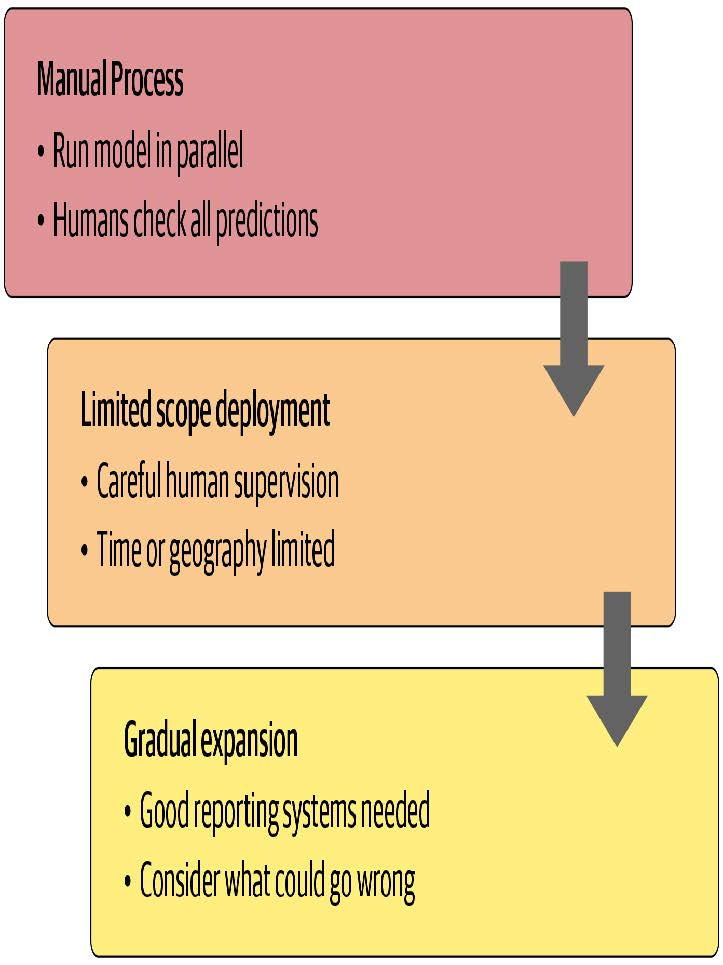

[^图2-5]: 部署过程

在条件允许的情况下，第一步应采用完全手动流程，同时让深度学习模型方案并行运行，但不直接用于驱动任何操作。参与手动流程的人员应查看深度学习输出结果，并核查其合理性。例如，在我们的熊类识别系统中，公园管理员可通过显示所有监控摄像头视频的屏幕，将疑似熊踪迹直接标记为红色。此时管理员仍需保持与模型部署前同等的警觉性——模型仅在协助排查异常问题。

第二步是尝试限制模型的应用范围，并确保其受到人员的严格监督。例如，对模型驱动方法进行地域和时间范围有限的小规模试验。与其在全国所有国家公园部署熊类识别系统，不如选择单一观测点进行为期一周的测试，由护林员在警报发出前逐一核查。

随后应该逐步扩大系统部署范围。在此过程中，务必建立完善的报告机制，确保能及时察觉相较于人工流程的重大操作变动。例如，若某区域新系统上线后熊类警报数量翻倍或减半，则应引起高度警惕。请全面思考系统可能出错的所有途径，进而推演哪些指标、报告或图表能反映这些问题，并确保常规报告中包含相关信息。

> JEREMY说
>
> 二十年前，我创立了一家名为Optimal Decisions的公司，利用机器学习和优化技术帮助大型保险公司制定定价策略，影响着数千亿美元的风险管理。我们运用本文所述方法来管理潜在风险。在与客户合作投入生产前，我们总会通过测试端到端系统对前一年数据进行影响模拟。将新算法投入生产始终是令人提心吊胆的过程，但每次部署都取得了成功。

#### 不可预见的后果与反馈循环

在部署模型时面临的最大挑战之一在于，模型可能改变其所隶属系统的行为模式。例如，假设某项“预测性警务”算法预测特定社区犯罪率将上升，导致更多警力被调往这些社区，进而可能使这些社区的犯罪记录数量增加，如此循环往复。在皇家统计学会论文 [《预测与服务？》](https://oreil.ly/3YEWH) 中，克里斯蒂安·卢姆（Kristian Lum）与威廉·艾萨克（William Isaac）指出：“预测性警务的命名恰如其分——它预测的是未来的警务部署，而非未来的犯罪。”

本案的问题之一在于，当存在偏见时（我们将在下一章深入探讨），反馈循环可能导致这种偏见的负面影响日益恶化。例如，人们担忧这种情况已在美国发生——该国基于种族的逮捕率存在显著偏见。 [美国公民自由联盟指出](https://oreil.ly/A9ijk) ：“尽管使用率大致相当，黑人因大麻被捕的概率是白人的3.73倍。”这种偏见的影响，加上美国多地推行预测性警务算法，促使贝里·威廉姆斯在 [《纽约时报》](https://oreil.ly/xR0di) 撰文写道： “在我职业生涯中备受推崇的技术，如今却被执法部门用于可能导致未来几年内，我现年7岁的儿子仅因种族和居住地就更可能遭受种族定性、被捕——甚至遭遇更糟待遇。”

在部署重要机器学习系统前，一个有益的练习是思考这个问题：“如果它真的、真的非常成功会怎样？”换言之，如果预测能力极强，且其影响行为的能力极其显著，那么谁将受到最大影响？最极端的结果可能呈现何种形态？你又如何知晓真实情况？

这样的思维演练或许能助你制定更周密的部署方案，配备持续监控系统与人工监管机制。当然，若监管意见得不到重视，人工监管便形同虚设——务必确保建立可靠且具有弹性的沟通渠道，使相关人员能够及时掌握问题动态，并具备解决问题的决策权。

### 开始动笔吧！

我们的学生发现，巩固对这些知识理解最有效的方法之一就是动笔写下来。没有什么比尝试向他人讲解某个主题更能检验你对它的理解程度了。即使你永远不会把写的东西给别人看，这也很有帮助——但分享出来效果会更好！因此我们建议，若尚未开始，请创建个人博客。完成本章学习后，你已掌握模型训练与部署方法，正是撰写首篇深度学习实践博客的最佳时机。哪些发现令你惊讶？你所在领域存在哪些深度学习应用机遇？又面临哪些技术障碍？

fast.ai联合创始人Rachel Thomas在 [《为什么你（没错，就是你）应该写博客》](https://oreil.ly/X9-3L) 一文中写道：

> 我给年轻时的自己最重要的建议就是：早点开始写博客。以下是写博客的几个理由：
>
> - 它就像一份简历，但效果更好。我认识几个人，他们的博客文章直接带来了工作机会！
> - 他可以帮助你学习。整理知识总能帮助我梳理自己的想法。检验是否真正理解某件事的标准之一，就是能否向他人解释清楚。写博客正是实现这个目标的好方法。
> - 我的博客文章曾为我赢得会议邀请和演讲机会。正是因为撰写了“我不喜欢TensorFlow”的博文，我受邀参加了TensorFlow开发者峰会（那次经历太棒了！）。
> - 结识新朋友。我曾通过博客结识多位读者，他们主动联系我讨论文章内容。
> - 节省时间。当你反复通过邮件解答相同问题时，不妨将其整理成博客文章——这样下次有人提问时，你就能更高效地分享解决方案。

也许她最重要的建议是：

> 你最适合帮助那些比你落后一步的人。相关知识在你脑海里依然清晰。许多专家早已忘记初学者的感受（或中级学习者的状态），也忘了初次接触某个主题时为何难以理解。你独特的背景、个人风格和知识水平，会为你的写作内容增添别样色彩。

我们在附录A中详细介绍了如何创建博客。若你尚未拥有博客，请立即查阅该附录——我们提供了一种绝佳方案，助您免费开启博客之旅，且完全无广告干扰，甚至还能使用Jupyter Notebook！

### 问卷调查

1. 当前文本模型存在哪些主要缺陷？
2. 文本生成模型可能对社会产生哪些负面影响？
3. 当模型可能出错且错误可能造成危害时，自动化流程的替代方案是什么？
4. 深度学习在处理何种表格数据方面表现尤为出色？
5. 直接将深度学习模型应用于推荐系统的主要弊端是什么？
6. 驱动链方法的具体步骤有哪些？
7. 驱动链方法的步骤如何映射到推荐系统？
8. 使用您整理的数据创建图像识别模型，并将其部署到网络上。
9. 什么是 `DataLoaders`？
10. 创建 `DataLoaders` 时需向fastai提供哪四项参数？
11. `DataBlock` 的 `splitter` 参数有何作用？
12. 如何确保随机分割始终生成相同的验证集？
13. 常用哪些字母表示自变量与因变量？
14. 裁剪（crop）、填充（pad）与压缩（squish）三种缩放方法有何区别？何时应选择其中一种？

15. 什么是数据增强？为何需要它？
16. 举例说明熊分类模型在生产环境中可能表现不佳的情况，原因在于训练数据的结构或风格差异。
17. `item_tfms` 与 `batch_tfms` 有何区别？

18. 什么是混淆矩阵？
19. 导出功能保存什么内容？
20. 当模型用于预测而非训练时，这种操作称为什么？
21. 什么是IPython控件？
22. 何时应使用CPU进行部署？何时更适合使用GPU？
23. 将应用部署到服务器而非客户端（或边缘设备）如手机或电脑的缺点是什么？
24. 实际部署熊类预警系统时可能出现的三类问题示例？
25. 什么是域外数据？
26. 什么是域迁移？
27. 部署流程包含哪三个步骤？

#### 进一步研究

1. 思考驱动链方法如何应用于你感兴趣的项目或问题。
2. 在何种情况下应避免使用特定类型的数据增强？
3. 针对你想应用深度学习的项目，进行思想实验：“如果效果极佳会怎样？”
4. 开设博客并撰写首篇博文。例如，探讨你认为深度学习在感兴趣领域中的潜在应用价值。

## 3. 数据伦理

> 致谢：瑞秋·托马斯博士（DR. RACHEL THOMAS）
>
> 本章由fastai联合创始人、旧金山大学应用数据伦理中心创始主任瑞秋·托马斯博士共同撰写。其内容主要基于她为 [《数据伦理导论》课程](https://ethics.fast.ai/) 设计的教学大纲部分内容。

正如我们在第1章和第2章所讨论的，机器学习模型有时会出错。它们可能存在缺陷，可能在面对从未见过的数据时表现出我们意料之外的行为。或者它们可能完全按设计运行，却被用于我们极力反对的用途。

由于深度学习是一种极其强大的工具，可应用于众多领域，我们审慎考量选择后果显得尤为重要。伦理学的哲学研究本质上是对是非善恶的探究，包括如何定义这些概念、辨识正确与错误的行为，以及理解行为与后果之间的关联。数据伦理学领域已存在多年，众多学者专注于此。它正被用于协助制定多地政策；被大小企业用于思考如何确保产品开发产生良好社会效益；也被研究者用于确保其工作成果用于善而非恶。

因此，作为深度学习从业者，你很可能会在某个时刻面临需要考虑数据伦理的处境。那么，什么是数据伦理？它属于伦理学的子领域，我们就从这里开始探讨。

> JEREMY说
>
> 在大学里，伦理学哲学是我主攻的方向（若非中途辍学投身现实世界，它本该成为我的毕业论文主题）。基于多年伦理学研究，我可以明确告诉你：关于是非善恶的本质、其存在性、辨别标准、善恶之分乃至其他相关议题，世人从未达成共识。所以别对理论抱太大期望！我们这里要聚焦于实例和思考起点，而非理论本身。

在回答 [“什么是伦理学？”](https://oreil.ly/nyVh4) 这个问题时，马克库拉（Markkula Center）应用伦理学中心指出该术语指代以下内容：

- 已经确立的善恶标准，规定着人类应有的行为准则
- 个人道德标准的研究与发展

没有标准答案清单，没有行为准则清单。伦理问题错综复杂且因情境而异，它牵涉众多利益相关者的立场。伦理意识如同肌肉，需要持续锻炼与实践。本章旨在为你提供指引标识，助你在这一旅程中前行。

识别伦理问题最好在协作团队中完成。这是真正融合多元视角的唯一途径。不同背景的人能发现你可能忽略的细节。团队协作对许多“能力建设”活动都大有裨益，包括这项工作。

本章固然不是本书中唯一探讨数据伦理的部分，但专门留出篇幅集中讨论这一议题颇有裨益。为了理清思路，或许最简便的方式是审视若干实例。因此我们精选了三个案例，认为它们能有效阐释若干核心议题。

### 数据伦理的关键示例

我们将从三个具体案例开始，这些案例揭示了技术领域中三种常见的伦理问题（本章后续部分将深入探讨这些问题）：

溯源程序：阿肯色州漏洞百出的医疗算法让患者束手无策。

反馈循环：YouTube（译者注：国外一家著名的视频网站）的推荐系统助推了阴谋论的爆发。

偏见：当在谷歌上搜索一个传统非裔美国人姓名时，它会显示犯罪背景调查的广告。

事实上，在本章介绍的每个概念中，我们都会提供至少一个具体实例。对于每个实例，请思考：若身处该情境，你会采取何种行动？又会遇到哪些阻碍？你会如何应对这些阻碍？需要警惕哪些问题？

#### 漏洞与补救措施：用于医疗福利的漏洞算法

The Verge（译者注：一家知名的美国科技媒体网站） 调查了美国半数以上州用于决定民众医疗保障额度使用的软件，并在题为 [《算法削减你的医疗保障会发生什么》](https://oreil.ly/25drC) 的文章中记录了调查结果。该算法在阿肯色州实施后，数百人（其中许多是重度残疾人士）的医疗保障遭到大幅削减。

例如，脑瘫患者塔米·多布斯需要护理员协助起床、如厕、进食等日常活动，她的护理时长却突然被削减了每周20小时。她无法获得任何关于医疗服务被削减的解释。最终，法庭审理揭露算法软件实施存在缺陷，对糖尿病患者和脑瘫患者造成了负面影响。然而，多布斯和其他依赖这些医疗福利的人仍生活在恐惧中——他们担心自己的福利可能再次遭遇突然且无法解释的削减。

#### 反馈循环：YouTube的推荐系统

当模型开始控制下一轮数据采集时，便可能形成反馈循环。软件自身会迅速使返回的数据产生偏差。

例如，YouTube拥有19亿用户，每天观看超过10亿小时的视频。其推荐算法（由谷歌构建）旨在优化观看时长，约70%的观看内容都由该算法推荐产生。但问题在于：这导致失控的反馈循环，促使《纽约时报》在2019年2月刊发标题为 [“YouTube助推阴谋论爆发，能否遏制？”](https://oreil.ly/Lt3aU) 的报道。表面上，推荐系统在预测用户偏好的内容，但它们同样拥有决定用户可见内容的巨大权力。

#### 偏见：拉坦妮娅·斯威尼教授遭“逮捕”

拉坦妮娅·斯威尼（Latanya Sweeney）博士是哈佛大学教授兼该校数据隐私实验室主任。在题为 [《在线广告投放中的歧视现象》](https://oreil.ly/1qBxU) （见图3-1）的论文中，她描述了自己发现的现象：当谷歌搜索她的名字时，会出现“拉坦妮娅·斯威尼被捕？”的广告，尽管她是唯一已知的拉坦妮娅·斯威尼且从未被捕。然而当她搜索其他名字，如“柯尔斯滕·林奎斯特”（Kirsten Lindquist）时，却获得更中立的广告——尽管该人曾三次被捕。


[^图3-1]: 谷歌搜索显示关于拉坦妮娅·斯威尼教授的逮捕记录广告（其实她从来没被捕过）

作为一名计算机科学家，她系统地研究了这一现象，并分析了超过2000个名字。她发现了一个明显的规律：历史上黑人名字会收到暗示当事人有犯罪记录的广告，而传统白人名字则收到更多中立的广告。

这是偏见的典型例子。它可能对人们的生活产生重大影响——例如，当求职者被谷歌搜索时，可能会显示其存在犯罪记录，而实际上他们并无犯罪史。

#### 为什么这很重要？

面对这些问题时，人们常会自然而然地反问：“那又怎样？这跟我有什么关系？我只是个数据科学家，不是政客。我不是公司里那些决定公司方向的高管，我只是想尽可能构建出最精准的预测模型。”

这些都是非常合理的问题。但我们将尝试说服你，答案在于：所有训练模型的人都必须考虑其模型的使用方式，并思考如何最大限度确保模型被积极利用。你可以采取相应措施，若不采取行动，后果可能相当严重。

当技术人员不惜一切代价专注于技术时，会发生什么可怕的事情？IBM（译者注：国际商业机器公司，美国一家有名的全球公司）与纳粹德国的故事便是其中一个特别骇人的例子。2001年，瑞士法官裁定“有理由推断IBM的技术援助便利了纳粹实施反人类罪行——这些罪行同样涉及IBM机器进行的会计核算与分类工作，并在集中营内部直接应用”。

要知道，IBM曾向纳粹提供数据制表产品，这些产品正是大规模追踪犹太人及其他群体灭绝行动的必需工具。此事由公司高层主导，其营销对象正是希特勒及其领导团队。公司总裁托马斯·沃森（Thomas Watson）亲自批准于1939年推出特殊IBM字母排序机，用于组织波兰犹太人的驱逐行动。图3-2所示为阿道夫·希特勒（最左侧）与IBM首席执行官老汤姆·沃森（左起第二位）会晤场景，此后不久希特勒于1937年授予沃森一枚特殊的“帝国服务勋章”。


[^图3-2]: IBM首席执行官老汤姆·沃森会见阿道夫·希特勒

但这并非孤立事件——该组织的参与范围极其广泛。IBM及其子公司定期在集中营现场提供培训和维护服务：打印卡片、配置机器，并频繁维修故障设备。IBM在其打孔卡系统中建立了分类体系，用于记录每个人的死亡方式、所属群体，以及在庞大的大屠杀系统中追踪所需的后勤信息（见图3-3）。集中营中犹太人的代码为8：约600万人因此丧生。罗姆人（吉普赛人）的编码为12（纳粹将其标记为“反社会分子”，在“吉普赛人营”中逾30万人遇害）。普通处决编码为4，毒气室死亡编码为6。

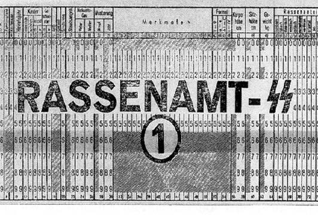

[^图3-3]: IBM在集中营使用的穿孔卡片

当然，参与项目的经理、工程师和技术人员只是过着平凡的生活。照顾家人，周日去教堂，尽己所能做好本职工作。服从命令。营销人员也只是竭尽所能达成业务发展目标。正如《IBM与大屠杀》（Dialog Press出版）作者埃德温·布莱克所言：“对盲目的技术官僚而言，手段比目的更重要。犹太民族的毁灭变得微不足道——因为当全球饥民排起长队时，IBM技术成就带来的振奋感反而因可观利润而倍增。”

请稍作停顿思考：若你发现自己曾参与的系统最终伤害了社会，你会作何感受？你是否愿意了解真相？如何确保此类情况不再发生？我们在此描述的是最极端的情况，但当今社会已能观察到许多与人工智能和机器学习相关的负面后果，本章将探讨其中部分现象。

这不仅是道德负担。有时技术人员会为自己的行为付出非常直接的代价。例如，大众汽车因柴油排放测试作弊丑闻而成为首个入狱者的人，既不是负责该项目的经理，也不是公司掌舵的高管，而是工程师詹姆斯·梁（James Liang）——他只是执行了指令而已。

当然，事情并非全是坏处——如果你参与的项目最终对哪怕一个人产生了巨大的积极影响，这绝对会让你感到非常棒！

好的，希望我们已经说服你应该关注这个问题。但你该怎么做？作为数据科学家，我们天生倾向于通过优化某些指标来改进模型。但优化指标未必能带来更好的结果。即使确实有助于创造更佳结果，它也几乎肯定不是唯一重要的因素。试想从研究者或实践者开发模型算法，到最终用于决策的整个流程。若想获得理想结果，必须将这条完整管道视为一个整体来考量。

通常，从一端到另一端存在一条非常长的链条。如果你是一名研究人员，甚至可能不知道自己的研究是否会被用于任何用途，或者你参与的是数据收集工作——这在整个流程中更为早期——那么这种情况尤为明显。但没有人比你更适合向这条链条中的所有参与者说明你工作的能力、限制和细节。虽然没有万能良方能确保你的工作被正确运用，但通过参与流程并提出关键问题，至少能确保核心议题可以得到充分考量。

有时，面对工作请求的正确回应就是直接说“不”。然而我们常听到的却是：“如果我不做，别人也会做。” 但请想想：既然他们选中你，说明你就是最合适的人选——若你拒绝，这个项目就失去了最佳执行者。倘若前五位被邀请者都拒绝，那岂不是更好！

### 将机器学习与产品设计相结合

想必你从事这项工作的初衷，是希望它能有所用武之地。否则，不过是虚掷光阴。因此，我们不妨先假设你的工作终将有所成就。如今，当你收集数据并构建模型时，需要做出诸多抉择： 你将以何种聚合级别存储数据？该选用哪种损失函数？验证集与训练集如何划分？是优先考虑实现简易性、推理速度，还是模型准确性？模型如何处理域外数据项？它能否进行微调，还是必须定期从头重新训练？

这些不仅是算法问题，更是数据产品设计问题。但产品经理、高管、评审、记者、医生——无论最终开发和使用该系统的人是谁（你的模型是该系统的一部分）——都难以理解你所做的决策，更别说去改变它们。

例如，两项研究发现亚马逊的面部识别软件会产生不准确且存在种族偏见的识别结果。亚马逊辩称研究人员本应修改默认参数，却未解释这如何能改变偏颇的识别结果。更甚者，事实证明亚马逊并未指导使用其软件的警察部门进行参数调整。显然，开发这些算法的研究人员与负责编写警方使用指南的亚马逊文档人员之间存在巨大隔阂。

缺乏紧密整合导致整个社会、警方和亚马逊都陷入严重困境。事实证明，其系统竟错误地将28名国会议员与罪犯照片匹配！而被错误匹配的国会议员中，有色人种比例明显偏高（如图3-4所示）。


[^图3-4]: 国会议员被亚马逊软件匹配到罪犯照片

数据科学家需要成为跨学科团队的一员。而研究人员则需要与最终使用其研究成果的人群紧密合作。更理想的是，领域专家自身能够掌握足够知识，从而能够独立训练和调试某些模型——希望此刻正有几位读者正在研读本书！

现代职场是一个高度专业化的场所。每个人往往都有明确界定的职责范围。尤其在大公司里，要了解整个项目的全貌往往很困难。有时企业甚至会刻意模糊项目目标——如果他们知道员工可能不喜欢答案的话。这种做法通常通过最大限度地将项目拆分成独立模块来实现。

换言之，我们并非说这一切都轻而易举。这很艰难。真的非常艰难。我们都必须竭尽全力。我们常观察到，那些深入参与项目高层级事务、致力于发展跨学科能力和团队的人员，往往成为组织中最重要且回报丰厚的成员。这类工作通常深受高层管理者的重视，即便有时会让中层管理者感到颇为不适。

### 有关数据伦理的话题 

数据伦理是一个广阔的领域，我们无法面面俱到。因此，我们将重点探讨几个我们认为特别相关的主题：

- 诉求与问责机制的必要性
- 反馈循环
- 偏见
- 虚假信息

让我们一个一个来看看

#### 诉求与问责机制

在复杂系统中，人们往往难以明确责任归属。这种现象虽可理解，却难以产生良好结果。以阿肯色州医疗系统为例：程序漏洞导致脑瘫患者丧失必要医疗保障时，算法开发者将责任推给政府官员，而政府官员又归咎于软件实施者。纽约大学教授 [达娜·博伊德（Danah Boyd）](https://oreil.ly/KK5Hf) 对此现象作出如下描述："官僚体系常被用来转移或逃避责任……当今的算法系统正在延续这种官僚作风。"

追溯机制之所以如此必要，还因为数据往往存在错误。审计和错误修正机制至关重要。加州执法部门维护的疑似帮派成员数据库被发现存在大量错误，其中包括42名未满周岁的婴儿（其中28人被标记为“承认帮派成员身份”）。该数据库缺乏错误修正机制，也未建立入库人员后续移除流程。另一个例子是美国信用报告系统：联邦贸易委员会（FTC）2012年对信用报告的大规模研究发现，26%的消费者档案中至少存在一项错误，其中5%的错误可能造成毁灭性后果。

然而，纠正此类错误的过程极其缓慢且不透明。当公共广播电台记者 [鲍比·阿林（Bobby Allyn）](https://oreil.ly/BUD6h) 发现自己被错误地登记为有枪支犯罪记录时，他花了“十多次电话沟通、一位县法院书记员的亲力亲为以及六周时间才解决问题。而且这还是在我以记者身份联系该公司公关部门之后才实现的。”

作为机器学习从业者，我们并不总是认为理解算法最终如何在实践中实现是我们的责任。但我们必须这样做。

#### 反馈循环

我们在第一章中阐述了算法如何与环境交互以形成反馈循环，通过预测强化现实世界中的行动，进而产生更趋同方向的预测。以YouTube推荐系统为例： 几年前，谷歌团队曾阐述如何引入强化学习（与深度学习密切相关，但损失函数代表的是行动发生后可能延迟很久的结果）来改进YouTube推荐系统。他们描述了如何运用算法优化推荐机制，从而最大化用户观看时长。

然而，人类往往容易被争议性内容吸引。这意味着关于阴谋论之类的视频开始被推荐系统越来越多地推荐。更重要的是，研究发现对阴谋论感兴趣的人群恰恰也是大量观看在线视频的人群！因此他们开始越来越沉迷于YouTube。随着YouTube上观看阴谋论视频的人数激增，算法开始推荐更多阴谋论及其他极端主义内容，这又吸引更多极端主义者观看YouTube视频，进而导致更多观众产生极端思想——如此循环往复，最终使算法推荐更多极端内容。整个系统陷入失控的恶性循环。

这种现象并非仅限于此类内容。2019年6月，《纽约时报》发表了一篇题为 [《YouTube数字游乐场：恋童癖者的敞开大门》](https://oreil.ly/81BEy) 的文章，探讨YouTube的推荐系统。文章开篇便讲述了这样一个令人毛骨悚然的故事：

> 克里斯蒂安娜·C（Christiane C）起初并未在意，当她10岁的女儿和朋友上传一段在后院泳池玩耍的视频时……几天后……该视频已获得数千次观看。不久后，观看量飙升至40万次……“我再次看到视频时，被这个数字吓到了，”克里斯蒂安娜说。她的担忧并非多余。研究团队发现，YouTube的自动推荐系统已开始将该视频推送给观看过其他未成年半裸儿童视频的用户。
>
> 单独来看，每段视频或许都纯属无心之作，比如孩子拍摄的家庭录像。任何暴露隐私的画面都转瞬即逝，看似偶然出现。但当它们被组合在一起时，其共同特征便变得无可辩驳。

YouTube的推荐算法开始为恋童癖者策划播放列表，筛选出那些偶然包含未发育完全、衣着暴露的儿童的无辜家庭录像。

谷歌内部没有人计划创建一个将家庭视频转化为恋童癖者色情内容的系统。那么究竟发生了什么？

问题的一部分在于指标在驱动财务重要系统中的核心地位。当算法需要优化某个指标时，正如你所见，它会竭尽全力优化该数值。这往往导致各种边界情况的出现，而与系统交互的人类会主动寻找、发现并利用这些边界情况和反馈循环来谋取私利。

有迹象表明，YouTube的推荐系统在2018年正是如此运作。《卫报》曾刊登题为 [《前YouTube内部人士如何调查其秘密算法》](https://oreil.ly/yjnPT) 的文章，讲述了前YouTube工程师纪尧姆·夏斯洛（Guillaume Chaslot）创建追踪此类问题的 [网站](https://algotransparency.org/) 的故事。夏斯洛在罗伯特·穆勒（Robert Mueller）的《关于俄罗斯干预2016年总统选举的调查报告》发布后，公布了图3-5所示图表。

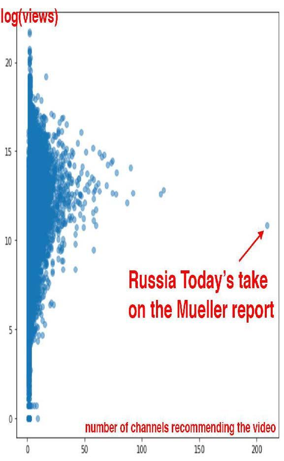

[^图3-5]: 穆勒报告的报道

俄罗斯今日电视台对穆勒报告的报道在推荐频道数量上呈现极端异常值。这表明这家俄罗斯国有媒体可能成功操纵了YouTube的推荐算法。遗憾的是，此类系统的缺乏透明度使得我们难以揭露正在讨论的问题。

本书的审稿人之一奥雷利安·热龙（Aurélien Géron）曾于2013至2016年间领导YouTube的视频分类团队（远早于本书所述事件）。他指出问题不仅在于涉及人类的反馈循环，更存在无需人类参与的反馈循环！他向我们举了一个YouTube的实例：

> 识别视频核心主题的一个重要信号是其所属频道。例如，上传至烹饪频道的视频极可能属于烹饪类。但如何判断频道主题？部分依据正是频道内视频的主题！你发现循环了吗？例如，许多视频的描述中会标注拍摄使用的相机型号。因此，部分视频可能被归类为“摄影”主题。若频道存在此类误分类视频，该频道就可能被归为“摄影”频道，导致未来该频道的视频更容易被错误归类为“摄影”主题。这甚至可能引发失控的病毒式分类！打破这种反馈循环的一种方法是：在分类视频时同时使用包含频道信号和不包含频道信号两种方式。随后在分类频道时，仅采用不包含频道信号所得的分类结果。如此便切断了反馈循环。

在应对这些问题方面，已有个人和组织付出了积极努力。Meetup首席机器学习工程师埃文·埃斯托拉（Evan Estola）曾探讨过这样一个现象：男性对技术聚会的兴趣远高于女性。若将性别纳入考量，Meetup的算法可能会减少向女性推荐技术聚会，导致参与者减少，进而使算法推荐更少活动，形成自我强化的反馈循环。为此，埃文团队作出道德抉择：在推荐算法中明确排除性别因素，避免形成此类反馈循环。令人欣慰的是，该公司不仅未盲目追求指标优化，更深入考量了算法的影响。埃文指出：“你需要决定算法中哪些特征不应使用……最优算法未必是最适合投入生产的方案。”

尽管Meetup选择避免这种结果，但Facebook（译者注：国外一家著名的社交网站）却提供了任由失控的反馈循环肆意蔓延的典型案例。如同YouTube，它往往通过向用户推荐更多阴谋论内容，加剧其对单一阴谋论的极端化倾向。正如研究虚假信息扩散的学者蕾妮·迪雷斯塔（Renee DiResta,）所写：

> 一旦人们加入某个阴谋论倾向的[Facebook]群组，算法就会将他们推送至大量同类群组。加入反疫苗群组后，推荐列表里就会出现反转基因、化学烟雾观察、地平说（没错，真实存在）以及“自然疗法治愈癌症”等群组。推荐引擎非但没有将用户从兔子洞中拉出，反而将他们推得更深。

必须牢记的是，此类行为确实可能发生，当你在自身项目中察觉到最初迹象时，要么预判反馈循环的形成，要么采取积极行动予以打破。另一项需注意的是偏见——正如前章简要讨论过的，偏见与反馈循环的交互作用往往会引发极大困扰。

#### 偏见

关于偏见的网络讨论往往很快就会变得相当混乱。“偏见”一词具有多种不同的含义。统计学家常常认为，当数据伦理学家谈论偏见时，他们指的是偏见这一术语的统计学定义——但事实并非如此。他们当然也不是在谈论模型参数中出现的权重偏差和系统偏差！

他们所讨论的是社会科学中的偏见概念。在 [《理解机器学习意外后果的框架》](https://oreil.ly/aF33V) 一文中，麻省理工学院的哈里尼·苏雷什（Harini Suresh）和约翰·古塔格（John Guttag）描述了机器学习中的六种偏见类型，如图3-6所示。

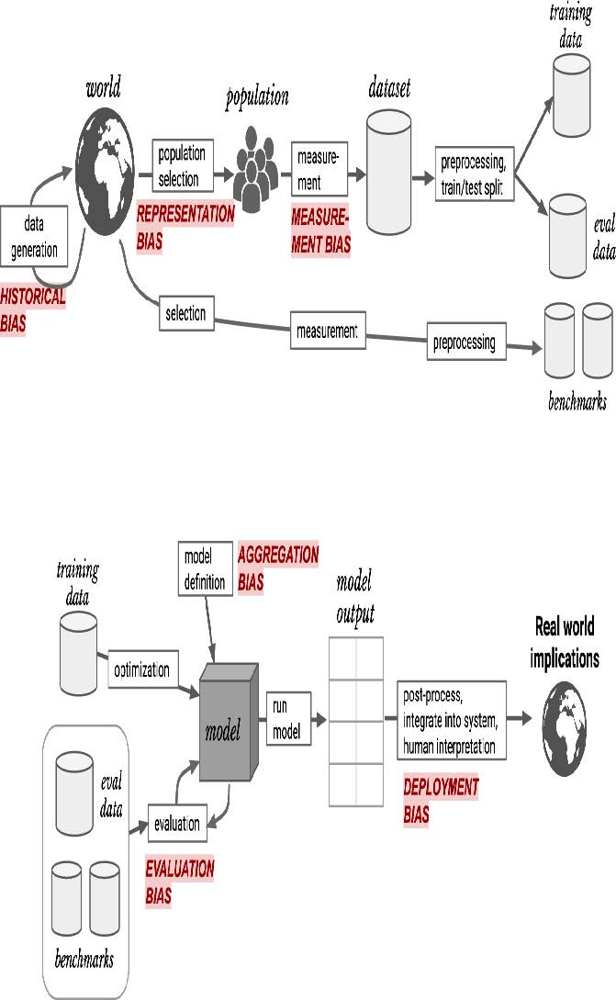

[^图3-6]: 机器学习中的偏见可能来自多种来源（由哈里尼·苏雷什和约翰·V·古塔格提供）

我们将探讨其中四种偏见类型，这些是我们自身工作中发现最具帮助的偏见（其他偏见详情请参阅论文）。

##### 历史偏见

历史偏见源于人类的偏见、流程的偏见以及社会的偏见。Suresh和Guttag指出：“历史偏见是数据生成过程第一步中存在的基本结构性问题，即使在完美的采样和特征选择条件下仍可能存在。”

例如，以下是芝加哥大学森迪尔·穆莱纳坦（Sendhil Mullainathan）在《纽约时报》文章 [《即使我们怀有善意，种族偏见依然存在》](https://oreil.ly/cBQop) 中列举的美国历史上种族偏见的几个例子：

- 当医生看到相同的病历时，他们对黑人患者建议进行心脏导管检查（一项有益的检查）的可能性要低得多。
- 在讨价还价购买二手车时，黑人最初被报价高出700美元，且获得的让步幅度要小得多。
- 在Craigslist上回应公寓租赁广告时，使用黑人名字比使用白人名字获得的回复更少。
- 全白人陪审团对黑人被告的定罪率比白人被告高出16个百分点，但当陪审团中有一名黑人成员时，对两者的定罪率持平。

COMPAS算法在美国广泛用于量刑和保释决定，是重要算法的典型案例。经 [ProPublica](https://oreil.ly/1XocO) 测试，该算法在实际应用中存在明显种族偏见（图3-7）。

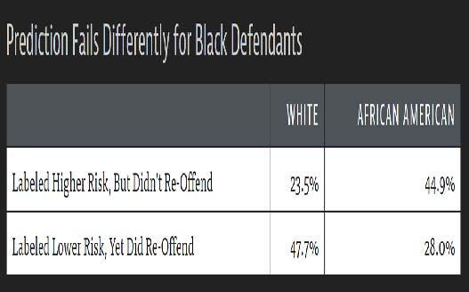

[^图3-7]: COMPAS算法的结果

任何涉及人类的数据集都可能存在此类偏见：医疗数据、销售数据、住房数据、政治数据等等。由于潜在偏见如此普遍，数据集中的偏见也极为普遍。种族偏见甚至出现在计算机视觉领域，如图3-8所示——一位谷歌相册用户在推特上分享的自动分类照片便是例证。


[^图3-8]: 其中一个标签完全错误……

是的，你看到的正是你所想的那样：谷歌相册竟将一位黑人用户与朋友的合影标记为“大猩猩”！这一算法失误引发了媒体的广泛关注。“我们对此深感震惊并诚挚致歉，”该公司的一位女发言人表示，“自动图像标注技术显然仍有大量改进空间，我们正在研究如何防止此类错误再次发生。”

遗憾的是，当输入数据存在问题时，修复机器学习系统中的问题相当困难。正如《卫报》的报道所示（图3-9），谷歌的首次尝试未能令人信服。

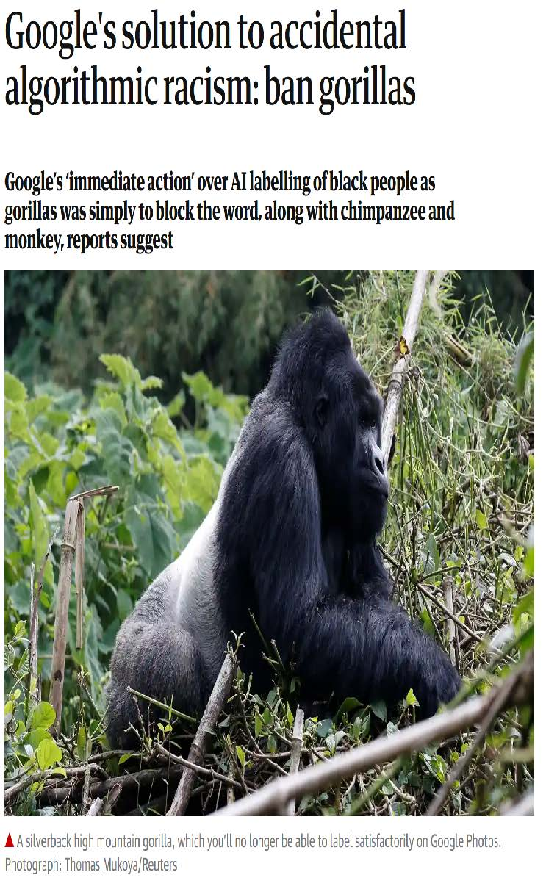

[^图3-9]: 谷歌对该问题的首次回应

此类问题绝非谷歌独有。麻省理工学院的研究人员对最流行的在线计算机视觉API进行了研究，以评估其准确性。但他们并未仅计算单一准确率数值，而是针对四个不同群体分别评估了准确性，如图3-10所示。


[^图3-10]: 不同人脸识别系统按性别和种族划分的错误率

例如，IBM的系统对肤色较深的女性识别错误率高达34.7%，而对肤色较浅的男性仅为0.3%——错误率相差超过100倍！有人错误地认为这种差异仅仅是因为计算机更难识别深色皮肤。然而实际情况是：在该结果引发负面舆论后，所有涉事公司都大幅改进深肤色识别模型，一年后其准确度已接近浅肤色水平。这表明开发者未能使用包含足够深肤色样本的数据集，也未对深肤色样本进行产品测试。

麻省理工学院研究员乔伊·布奥拉姆维尼（Joy Buolamwini）警告道：“我们正以过度自信却准备不足的姿态迈入自动化时代。若未能打造符合伦理且包容多元的人工智能，我们很可能在机器中立性的幌子下，丧失民权运动与性别平等领域取得的成果。”

问题的一部分似乎在于用于训练模型的流行数据集构成存在系统性失衡。Shreya Shankar等人在论文 [《无表征则无分类：评估发展中国家开放数据集中的地理多样性问题》](https://oreil.ly/VqtOA) 的摘要中指出："我们分析了两个大型公开图像数据集以评估地理多样性，发现这些数据集似乎存在明显的欧美中心化表征偏见。此外，我们分析基于这些数据集训练的分类器，评估训练分布的影响，发现不同地域图像的相对性能存在显著差异。"图3-11展示了论文中的图表之一，呈现了当时（直至本书撰写时仍属）最重要的两个模型训练图像数据集的地理构成。

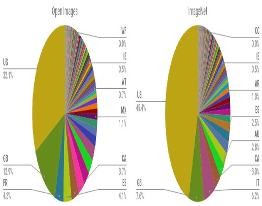

[^图3-11]: 流行训练集中的图像来源

绝大多数图像来自美国及其他西方国家，导致基于ImageNet训练的模型在识别其他国家和文化场景时表现欠佳。例如研究发现，此类模型在识别低收入国家常见的家居物品（如肥皂、香料、沙发或床铺）时表现更差。图3-12展示了Facebook AI研究所Terrance DeVries等人在论文 [《物体识别对所有人有效吗？》](https://oreil.ly/BkFjL) 中用于说明此问题的图像。


[^图3-12]: 物体检测实战

在这个例子中，我们可以看到低收入肥皂的示例与准确结果相去甚远，每项商业图像识别服务都将“食物”预测为最可能的答案！

此外，正如我们稍后将讨论的那样，绝大多数人工智能研究者和开发者都是年轻的白人男性。我们所见的大多数项目，其用户测试主要依赖于产品开发团队的亲朋好友。鉴于此，我们刚才讨论的那类问题也就不足为奇了。

在自然语言处理模型的数据文本中也存在类似的历史偏见。这种偏见在下游机器学习任务中以多种形式显现。例如，据广泛报道，直到去年，谷歌翻译在将土耳其语中性代词“o”译为英语时仍存在系统性偏见：当该代词用于常与男性关联的职业时，系统会使用“he”；而用于常与女性关联的职业时，则使用“she”（图3-13）。


[^图3-13]: 文本数据集中的性别偏见

我们同样能在网络广告中观察到此类偏见。例如，穆罕默德·阿里（Muhammad Ali）等人2019年的 [一项研究](https://oreil.ly/UGxuh) 发现，即便广告投放者并无刻意歧视之意，Facebook仍会根据种族和性别向截然不同的受众展示广告。内容相同的房产广告，若配图分别展示白人家庭或黑人家庭，就会被推送给不同种族的受众群体。

##### 测量偏见

在《美国经济评论》发表的 [《机器学习是否会自动化道德风险与错误》](https://oreil.ly/79Qtn) 一文中，森迪尔·穆莱纳坦（Sendhil Mullainathan）与齐亚德·奥伯迈尔（Ziad Obermeyer）构建了一个模型试图解答此问题：利用历史电子健康记录（EHR）数据，哪些因素最能预测中风风险？该模型得出的首要预测因子如下：

- 既往卒中
- 心血管疾病
- 意外损伤
- 良性乳房肿块
- 结肠镜检查
- 鼻窦炎

然而，只有前两项与中风有关！根据我们迄今的研究，你大概能猜到原因。我们并未真正测量中风——这种情况发生于脑部区域因供血中断而缺氧时。我们实际测量的是：哪些人出现症状、就医、接受相应检查并最终确诊为中风。实际上，中风本身并非与这份完整清单唯一的关联因素——它还与“就医倾向”相关（而就医倾向又受多重因素影响：医疗资源可及性、自付费用能力、是否遭遇种族/性别医疗歧视等）！若你因意外受伤就医的概率较高，那么当你发生中风时，同样更可能及时就医。

这是测量偏见的一个例子。当我们的模型因测量对象错误、测量方式不当或将测量结果不恰当地纳入模型而产生误差时，就会出现这种情况。

##### 聚合偏见

聚合偏见发生于模型未能以整合所有相关因素的方式聚合数据，或模型未包含必要的交互项、非线性项等情形。此类偏差在医疗领域尤为常见。例如，糖尿病治疗方案常基于简单的单变量统计数据，且研究对象往往是规模较小且异质性强的群体。结果分析常忽略不同种族或性别差异。然而研究表明，糖尿病患者的并发症存在种族差异，且糖化血红蛋白水平（一种用于诊断和监测糖尿病的常用指标）在不同种族和性别群体中呈现复杂差异。然而研究表明，不同种族的糖尿病患者会出现不同的并发症，且HbA1c水平（广泛用于糖尿病诊断和监测）在种族与性别间存在复杂差异。这可能导致误诊或治疗失误，因为医疗决策基于的模型未纳入这些关键变量及其交互作用。

##### 表征偏见

论文 [《偏见在生物学中：高风险情境下语义表征偏见的案例研究》](https://oreil.ly/0iowq) 摘要指出，职业领域存在性别失衡现象（例如女性更可能从事护士职业，男性更可能担任牧师），并指出”性别间真实阳性率的差异与现有职业性别失衡相关，这种关联可能加剧现有失衡"。

换言之，研究人员发现预测职业的模型不仅反映了基础人群中实际存在的性别失衡现象，更能将其放大！此类表征偏见相当普遍，尤其常见于简单模型。当存在清晰易见的潜在关联时，简单模型往往会假设这种关联始终成立。如论文图3-14所示，对于女性占比更高的职业，模型往往会高估该职业的普遍程度。

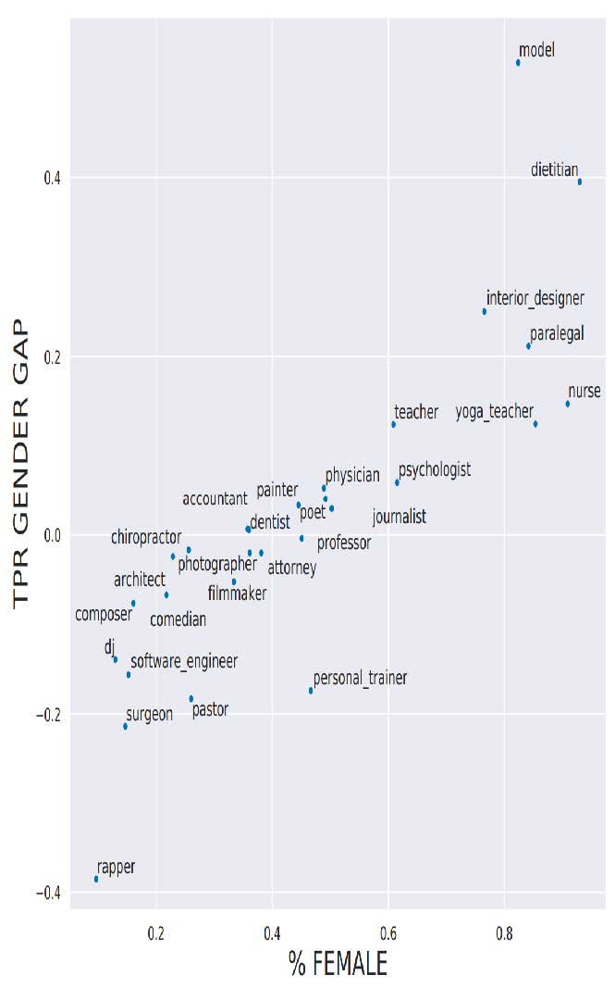

[^图3-14]: 职业预测模型误差与该职业女性占比的对比图

例如，在训练数据集中，女性外科医生占比为14.6%，但在模型预测中，真实阳性结果中女性占比仅为11.6%。因此该模型正在放大训练数据集中存在的偏见。

既然我们已经认识到这些偏见确实存在，我们该如何做才能减轻它们的影响？

##### 应对不同类型的偏见

不同类型的偏见需要不同的缓解方法。虽然收集更多样化的数据集可以解决代表性偏见，但这无法解决历史偏见或测量偏见。所有数据集都存在偏见。完全消除偏见的数据集是不存在的。该领域众多研究者正趋向于一套提案，旨在更完善地记录决策过程、背景信息及具体细节——包括特定数据集的创建方式与原因、适用场景以及局限性。如此一来，使用特定数据集的人员就不会因其偏见和局限性而措手不及。

我们常听到这样的疑问：“人类本就存在偏见，算法偏见又算什么？”这个问题频繁出现，提问者必定有其逻辑依据，但对我们而言却显得缺乏说服力！无论逻辑是否成立，关键在于认识到算法（尤其是机器学习算法！）与人类存在本质差异。请思考以下关于机器学习算法的要点：

- 机器学习会形成反馈循环

  微小的偏见可能因反馈循环而呈指数级快速放大

- 机器学习会放大偏见

  人类偏见可能导致更严重的机器学习偏见

- 算法与人类的运用方式不同

  人类决策者与算法决策者在实践中并非可互换的即插即用模式。具体示例详见下页列表。

- 技术即力量

  而力量伴随着责任。

正如阿肯色州医疗保健案例所示，机器学习在实践中往往并非因能带来更佳效果而被采用，而是因为它更廉价、更高效。凯茜·奥尼尔在其著作《数学毁灭武器》（皇冠出版社）中揭示了一种模式：特权阶层由人处理事务，而穷人则由算法处理事务。这只是算法与人类决策者存在差异的诸多表现之一，其他差异还包括：

- 人们更倾向于认为算法具有客观性或无差错性（即使存在人工干预选项）。
- 算法在实施时往往缺乏申诉机制。
- 算法通常被大规模应用。
- 算法系统成本低廉。

即使没有偏见，算法（尤其是深度学习，因为它是一种如此高效且可扩展的算法）也可能引发负面社会问题，例如被用于传播虚假信息时。

##### 虚假信息

虚假信息（Disinformation）的历史可追溯至数百甚至数千年前。其目的未必在于让人们相信虚假之事，而往往用于制造不和谐与不确定性，使人们放弃寻求真相。当人们收到相互矛盾的说法时，便可能认为自己永远无法分辨该相信谁或相信什么。

有些人认为虚假信息主要是指虚假信息或假新闻，但实际上，虚假信息往往包含真相的种子，或是被断章取义的半真半假内容。拉迪斯拉夫·比特曼（Ladislav Bittman）曾是苏联情报官员，后来叛逃至美国，并在1970至1980年代撰写了多部关于虚假信息在苏联宣传行动中作用的著作。他在《克格勃与苏联虚假信息》（Pergamon出版社）中写道：“大多数宣传活动都是精心设计的混合体，包含事实、半真半假、夸大其词和蓄意谎言。”

近年来，美国对此深有体会——联邦调查局详细披露了2016年大选中与俄罗斯有关的大规模虚假信息行动。了解该行动中使用的虚假信息手段具有重要教育意义。例如，联邦调查局发现俄罗斯虚假信息行动常同时组织两场独立的假“草根”抗议活动——针对同一议题的正反双方各一场——并让双方在同一时间抗议！《休斯顿纪事报》曾报道过其中一场离奇事件（图3-15）：

> 一个自称“德克萨斯之心”的团体在社交媒体上组织了这场抗议活动——他们声称这是反对德克萨斯州“伊斯兰化”的行动。在特拉维斯街的一侧，我发现约有10名抗议者；另一侧则聚集着约50名反抗议者。但我始终找不到集会组织者。没有“德克萨斯之心”。我觉得很奇怪，并在文章中提到：什么组织会在自己组织的活动中缺席？现在我知道原因了。显然，集会组织者当时正在俄罗斯圣彼得堡。“德克萨斯之心”正是特别检察官罗伯特·穆勒近期起诉书中提及的网络水军团体之一，该起诉书指控俄罗斯人试图干预美国总统选举。


[^图3-15]: 由德克萨斯之心团体主办的活动

虚假信息往往涉及协调一致的虚假行为。例如，欺诈性账户可能试图营造出许多人持有特定观点的假象。尽管我们多数人自诩思想独立，但实际上人类进化过程中形成了受内群体影响、对抗外群体的倾向。网络讨论既能塑造我们的观点，也能改变我们认为可接受观点的边界。人类是社会性动物，因此极易受周遭人群影响。激进化现象日益在网络环境中滋生——这种影响正源自网络论坛与社交平台构筑的虚拟空间。

通过自动生成的文本传播虚假信息已成为一个尤为突出的问题，这源于深度学习技术带来的巨大能力提升。我们在第十章深入探讨语言模型创建时将对此问题进行详细讨论。

一种提议的方法是开发某种形式的数字签名，以无缝方式实现它，并建立规范要求我们仅信任经过验证的内容。艾伦人工智能研究所所长奥伦·埃齐奥尼（Oren Etzioni）在题为 [《如何防范基于人工智能的伪造？》](https://oreil.ly/8z7wm) 的文章中提出这样的方案： “人工智能正使高保真伪造变得廉价且自动化，这可能对民主、安全和社会造成灾难性后果。人工智能伪造的幽灵警示我们必须采取行动，使数字签名成为验证数字内容的必要手段。”

虽然我们无法详尽探讨深度学习乃至更广泛的算法所引发的所有伦理问题，但希望这篇简短的导论能成为您深入研究的有用起点。接下来我们将探讨如何识别伦理问题以及如何应对这些问题。

### 识别并处理伦理问题

错误难免发生。发现错误并妥善处理，应成为任何包含机器学习（以及许多其他系统）的设计组成部分。数据伦理领域提出的问题往往复杂且涉及多学科，但我们必须致力于解决这些问题。

那么我们能做什么？这是一个宏大话题，但以下是解决伦理问题的一些步骤：

- 分析你正在参与的项目。
- 在公司内部建立流程，以发现并应对道德风险。
- 支持良好的政策制定。
- 提升多样性。

让我们逐步走一遍每个步骤，从分析你正在进行的项目开始。

#### 分析你正在参与的项目

在考量工作中的伦理影响时，人们很容易忽略重要问题。一个极具帮助的方法就是提出正确的问题。瑞秋·托马斯建议在数据项目开发过程中持续思考以下问题：

- 我们真的应该这样做吗？
- 数据中存在哪些偏见？
- 代码和数据能否接受审计？
- 不同子群体的错误率是多少？
- 基于简单规则的替代方案准确度如何？
- 处理申诉或错误有哪些流程？
- 开发团队的多元化程度如何？

这些问题或许能帮助你识别悬而未决的问题，并找到更易理解和掌控的替代方案。除了提出正确的问题，考虑实施实践和流程同样至关重要。

在此阶段需要考虑的一点是，你正在收集和存储哪些数据。数据往往会被用于与原始意图不同的目的。例如，IBM早在纳粹大屠杀之前就已开始向纳粹德国销售产品，包括协助阿道夫·希特勒于1933年进行的人口普查——该普查有效识别出远超德国此前认知的犹太人群体。同样，美国人口普查数据曾被用于在二战期间拘禁日裔美国人（他们是美国公民）。必须认识到收集的数据和图像日后可能被武器化。哥伦比亚大学教授蒂姆·吴（Tim Wu） [写道](https://oreil.ly/6L0QM) ：“你必须假设Facebook或安卓系统保存的任何个人数据，都是全球政府试图获取或窃贼企图盗取的目标。”

#### 实施流程

马克库拉（Markkula）中心发布了 [《工程/设计实践伦理工具包》](https://oreil.ly/vDGGC) ，其中包含可在贵公司实施的具体实践措施，包括定期开展主动扫描以主动搜寻伦理风险（类似于网络安全渗透测试的方式）、扩大伦理圈以纳入各类利益相关者的视角，以及考虑恶意行为者（恶意行为者可能如何滥用、窃取、曲解、黑客攻击、破坏或武器化你正在构建的内容）。

即使团队缺乏多样性，你仍可尝试主动纳入更广泛群体的视角，思考以下问题（由马克库拉中心提供）：

- 我们究竟默认了谁的利益、需求、技能、经历和价值观，而非真正征询过他们的意见？
- 哪些利益相关者将直接受到我们产品的影响？他们的利益如何得到保障？我们如何确知他们的真实诉求——是否曾主动询问过？
- 哪些群体或个人将受到重大间接影响？
- 哪些未预期的用户可能使用本产品，或将其用于我们最初未设想的用途？

#### 伦理视角

马克库拉中心提供的另一项实用资源是其 [《技术与工程实践中的概念框架》](https://oreil.ly/QnRTt) 。该框架探讨了不同基础伦理视角如何帮助识别具体问题，并提出了以下方法与关键问题：

- 权利方法论

  哪种方案最能尊重所有相关方的权利？

- 正义方法论

  哪种方案能平等或比例地对待所有人？

- 功利主义方法论

  哪种选择能创造最大效益并造成最小伤害？

- 共同利益方法论

  哪种选择最能服务于整个社区，而非仅惠及部分成员？

- 美德方法论

​	哪种选择能引导我成为理想中的自己？

马克库拉的建议包括更深入地探讨这些视角，其中包括从后果的角度审视项目：

- 该项目将直接影响哪些群体？间接影响哪些群体？
- 综合来看，其影响是否可能利大于弊？具体涉及哪些类型的利弊？
- 我们是否考虑了所有相关类型的危害/效益（心理、政治、环境、道德、认知、情感、制度、文化）？
- 该项目可能如何影响后代？
- 项目造成的危害风险是否会不成比例地落在社会弱势群体身上？项目收益是否会不成比例地流向富裕阶层？
- 我们是否充分考虑了“双重用途”及意外的下游影响？

与此相对的另一种视角是义务论视角，它着重关注基本的是非概念：

- 我们必须尊重他人的哪些权利及履行哪些义务？
- 该项目可能如何影响每位利益相关者的尊严与自主权？
- 哪些信任与正义考量与本设计/项目相关？
- 该项目是否涉及对他人相互冲突的道德义务，或利益相关者权利的冲突？如何对这些义务进行优先排序？

要为这类问题构思完整且考虑全面的答案，最有效的方法之一就是确保提问者具有多样性。

#### 多样性的力量

根据 [Element AI的一项研究](https://oreil.ly/sO09p) ，目前人工智能研究人员中女性占比不足12%。在种族和年龄构成方面，相关数据同样严峻。当团队成员背景高度相似时，他们对伦理风险的认知盲区往往也趋于一致。《哈佛商业评论》发表的多项研究表明，多元化团队具有诸多优势，包括：

- [“多样性如何推动创新”](https://oreil.ly/WRFSm)
- [“认知多样性更强的团队解决问题更快”](https://oreil.ly/vKy5b)
- [“多元化团队为何更聪明”](https://oreil.ly/SFVBF)
- [“捍卫你的研究：什么让团队更聪明？更多女性”](https://oreil.ly/A1A5n)

多样性有助于更早发现问题，并考虑更广泛的解决方案。例如，Tracy Chou是Quora的早期工程师。她在 [描述自身经历时](https://oreil.ly/n7WSn) 提到，曾积极倡导公司内部添加一项功能，用于屏蔽网络喷子及其他不良用户。她回忆道：“我迫切希望参与该功能开发，因为我本人在网站上曾遭受敌意和辱骂（性别因素很可能是原因之一）……但若没有这种个人经历，Quora团队很可能不会在平台早期就优先开发屏蔽按钮。” 骚扰行为常迫使边缘群体成员离开在线平台，因此该功能对维护Quora社区生态至关重要。

需要理解的关键点在于，女性离开科技行业的比例是男性的两倍有余。 [《哈佛商业评论》](https://oreil.ly/ZIC7t) 指出，科技行业女性离职率达41%，而男性仅为17%。对超过200本书籍、白皮书及文章的分析表明，她们离职的根本原因在于“遭受不公平对待：薪酬偏低、晋升通道受限、职业发展受阻”。

研究证实了若干阻碍女性在职场晋升的因素。女性在绩效评估中常收到模糊的反馈和人格批评，而男性则获得与业务成果挂钩的可操作性建议（这更有助于提升）。女性常被排除在更具创造性与创新性的岗位之外，也难以获得有助于晋升的高曝光度“挑战性”任务。有研究发现，即使朗读相同文本，男性声音仍被认为比女性声音更具说服力、更基于事实且更符合逻辑。

统计数据显示，接受指导对男性的职业发展有帮助，但对女性却不然。原因在于：当女性接受指导时，得到的建议往往是关于如何改变自我、提升自我认知；而男性获得的指导，则是对其权威的公开认可。猜猜哪种方式对晋升更有助益？

只要合格女性持续退出科技行业，单纯增加女孩编程教育就无法解决困扰该领域的多样性问题。尽管有色人种女性面临更多额外障碍，多样性举措却往往主要聚焦白人女性。在对60名从事STEM研究的有色人种女性的 [访谈](https://oreil.ly/t5C6b) 中，100%的人曾遭受歧视。

科技行业的招聘流程尤其存在缺陷。Triplebyte公司的一项研究揭示了这种弊端——该公司致力于为企业匹配软件工程师，并在招聘过程中实施标准化技术面试。该公司掌握着一组引人入胜的数据：300多名工程师在标准化考试中的表现，以及他们在多家企业面试过程中的实际表现。[Triplebyte研究](https://oreil.ly/2Wtw4) 的首要发现是：“各公司寻求的程序员类型，往往与其业务需求或实际业务关联甚微。这些偏好更多反映了企业文化和创始人的背景。”

这对试图进入深度学习领域的人来说是个挑战，因为如今大多数公司的深度学习团队都由学者创立。这些团队往往寻找“和他们相似”的人——即能解决复杂数学问题、理解晦涩术语的人。他们并不总是懂得如何识别真正擅长运用深度学习解决实际问题的人才。

这为那些愿意超越地位和血统，专注于成果的企业提供了巨大机遇！

#### 公平性、问责制与透明度

计算机科学家专业协会ACM主办了一场名为“公平性、责任性与透明度会议”(ACM FAccT)的数据伦理会议，该会议曾使用缩写FAT，现改用争议较小的FAccT。微软公司亦设有专注于人工智能公平性、责任性、透明度与伦理（FATE）的研究团队。本节中，我们将使用缩写词FAccT来指代公平性、责任性与透明度这三个核心概念。

FAccT是某些人审视伦理问题时采用的视角。

索伦·巴罗卡斯等人撰写的免费在线书籍 [《公平性与机器学习：局限与机遇》](https://fairmlbook.org/) 为此提供了有益参考，该书“从将公平性视为核心关切而非事后考虑的角度审视机器学习”。但书中同时警示：“本书范围刻意保持狭窄……将机器学习伦理局限于技术框架的处理方式，对技术人员和企业而言或许颇具诱惑力——既能聚焦技术干预，又能规避权力与责任等更深层议题。我们对此类诱惑提出警示。”本文不拟概述FAccT伦理框架（该框架在前述著作中有更详尽阐述），而是着重探讨此类狭隘框架的局限性。

检验伦理框架是否完备的有效方法之一，是尝试构思一个案例，使该框架与我们自身的伦理直觉产生分歧。奥斯·凯斯等人通过其论文 [《覆盖提案：分析并改进将老年人转化为高营养浆液的算法系统》](https://oreil.ly/_qug9) 对此进行了生动阐释。论文摘要指出：

> 算法系统的伦理影响在人机交互领域及更广泛的技术设计、开发与政策研究群体中已引发广泛讨论。本文探讨将一项重要的伦理框架——公平性、问责性与透明度（FAT）——应用于解决粮食安全与人口老龄化等社会问题的算法方案。通过采用多种标准化的算法审计与评估方法，我们显著提升了该算法对FAT框架的遵循度，从而构建出更具伦理性与公益性的系统。我们探讨了该方法如何为其他研究者或从业者提供指导，使其在各自领域内确保算法系统产生更优的伦理成果。

本文中，颇具争议的提案（“将老年人转化为高营养浆液”）与研究结果（“极大提升算法对FAT框架的遵循度，从而构建出更符合伦理且有益的系统”）之间存在矛盾——至少可以说如此！

在哲学领域，尤其是伦理学领域，这是一种最有效的工具之一：首先设计出一个流程、定义或问题集等，旨在解决某个问题。接着尝试构想一个案例，使该看似合理的解决方案最终导致一个无人能接受的结论。这将促使人们进一步完善解决方案。

迄今为止，我们主要探讨了你和你的组织能够采取的行动。但有时个人或组织的努力远远不够，政府也需要考虑政策层面的影响。

### 政策的作用

我们常与那些渴望技术或设计方案能彻底解决我们讨论的问题的人交谈；例如，通过技术手段消除数据偏见，或制定降低技术成瘾性的设计准则。尽管这些措施可能有所助益，但不足以解决导致当前局面的根本问题。例如，只要制造成瘾性技术有利可图，企业就会继续这么做，无论其副作用是否助长阴谋论并污染信息生态系统。尽管个别设计师可能尝试调整产品设计，但在根本的利润激励机制改变之前，我们不会看到实质性变革。

#### 监管的有效性

要了解哪些因素能促使企业采取具体行动，不妨看看Facebook的以下两则行为案例。2018年，联合国调查发现Facebook在缅甸罗兴亚少数民族持续遭受种族灭绝中扮演了“决定性角色”。联合国秘书长安东尼奥·古特雷斯（Antonio Guterres）曾称该群体为“全球遭受最严重歧视的民族之一，甚至可能是最严重的”。早在2013年，当地活动人士就警告Facebook高管，其平台正被用于传播仇恨言论并煽动暴力。2015年，他们更被提醒脸书在缅甸可能扮演与卢旺达种族灭绝期间广播电台相同的角色（该事件造成百万人死亡）。然而截至2015年底，Facebook仅雇佣了四名会说缅甸语的承包商。一位知情人士指出："这并非事后诸葛亮。问题的严重性早已昭然若揭。“扎克伯格在国会听证会上承诺将招聘”数十名员工"应对缅甸种族灭绝问题（2018年作此承诺时，种族灭绝行为已持续多年，包括2017年8月后若开邦北部至少288个村庄遭焚毁）。

这与Facebook [在德国迅速招聘1200名员工](https://oreil.ly/q_8Dz) 形成鲜明对比，其目的是试图规避德国新颁布的反仇恨言论法律所规定的巨额罚款（最高可达5000万欧元）。显然，在此事件中，Facebook对经济处罚的威胁反应更为强烈，而非对少数民族遭受系统性摧残的关注。

在 [一篇探讨隐私问题的文章](https://oreil.ly/K5YKf) 中，马切伊·切格洛夫斯基（Maciej Ceglowski）将隐私议题与环境运动进行了类比：

> 这项监管项目在发达国家取得如此成功，以至于我们几乎忘记了没有它的日子。如今在雅加达和德里夺走数千人生命的窒息性雾霾，曾是伦敦的标志性景象。俄亥俄州的库雅霍加河曾长期处于可燃状态。在未预见后果的典型案例中，汽油添加的四乙基铅导致全球暴力犯罪率持续攀升长达五十年。这些危害绝非靠“用钱包投票”、或“审慎审查合作企业的环保政策”、或“停止使用相关技术”就能解决。唯有跨越管辖边界的协同监管——有时需高度技术化——才能扭转局面。某些领域如禁止消耗臭氧层的商用制冷剂，更需要全球共识。如今我们亟需在隐私法领域实现类似的视角转变。

#### 权利与政策

清洁的空气和饮用水是公共产品，仅凭个人市场决策几乎无法保护，而需要协调一致的监管行动。同样，技术滥用导致的诸多意外后果所造成的危害也涉及公共产品，例如信息环境污染或环境隐私恶化。隐私权常被视为个人权利，但广泛监控对社会的影响（即使少数人能够选择退出监控）依然存在。

我们在科技领域看到的问题，许多本质上是人权问题，例如当存在偏见的算法建议对黑人被告判处更长刑期时，当特定招聘广告仅向年轻人展示时，或是当警方使用人脸识别技术识别抗议者时。解决人权问题的适当途径，通常应通过法律途径。

我们既需要监管和法律层面的变革，也需要个人行为的道德规范。仅靠个人行为改变无法解决利润激励机制错位、外部性问题（即企业获取巨额利润的同时将成本与危害转嫁给整个社会）或系统性缺陷。然而法律永远无法覆盖所有边际案例，因此至关重要的是，每位软件开发者和数据科学家都应具备在实践中做出道德决策的能力。

#### 汽车：历史先例

我们面临的问题错综复杂，没有简单的解决方案。这或许令人沮丧，但当我们回顾人类历史上攻克的其他重大挑战时，仍能找到希望。例如提升汽车安全性的运动——该案例被蒂姆尼特·格布鲁等人收录于 [《数据集数据表》](https://oreil.ly/nqG_r) 中，并在设计播客 [《99% Invisible》](https://oreil.ly/2HGPd) 中有所探讨。早期汽车没有安全带，仪表盘上的金属旋钮在碰撞时可能刺穿头骨，普通平板玻璃车窗碎裂时极具杀伤力，不可折叠的方向柱会将驾驶员刺穿。然而，汽车制造商甚至拒绝将安全性视为可改善的议题，普遍认为汽车本就如此，问题根源在于使用者本身。

消费者安全活动家和倡导者历经数十年的努力，才改变了全国的舆论导向，使人们开始思考汽车公司或许应承担某些责任，而这些责任应通过法规来解决。当可折叠转向柱被发明时，由于缺乏经济激励，这项技术在数年内都未能得到应用。通用汽车公司曾雇佣私家侦探试图挖掘消费者安全倡导者拉尔夫·纳德（Ralph Nader）的丑闻。安全带强制安装、碰撞测试假人和可折叠转向柱的普及都是重大胜利。直至2011年，汽车制造商才被强制要求使用代表普通女性体型（而非仅限男性）的碰撞测试假人；此前同等撞击强度下，女性受伤概率比男性高出40%。这生动揭示了偏见、政策与技术如何产生重大后果。

### 总结

在二进制逻辑的工作背景中成长起来的人，最初可能会因伦理问题缺乏明确答案而感到沮丧。然而，我们的工作如何影响世界——包括意外后果以及工作成果被恶意利用——这些影响正是我们能够（也应该！）考虑的最重要问题。尽管没有现成的答案，但存在明确的陷阱需要规避，也有可遵循的实践路径，能引导我们走向更符合伦理的行为。

许多人（包括我们！）都在寻求更令人满意、更扎实的答案，以应对技术带来的有害影响。然而，鉴于我们面临的问题具有复杂、深远且跨学科的特性，并不存在简单的解决方案。朱莉娅·安格温（Julia Angwin）——这位曾任职于ProPublica的高级记者，专注于算法偏见与监控议题（也是2016年调查COMPAS再犯率算法的调查员之一，该调查促成了FAccT领域的诞生）——在 [2019年的一次访谈中](https://oreil.ly/o7FpP) 指出：

> 我坚信要解决问题，必须先诊断问题，而我们目前仍处于诊断阶段。若回顾世纪之交的工业化浪潮，我们经历了约三十年的童工现象、无限制工时、恶劣工作环境。当时需要大量记者揭露丑闻并倡导改革，才能诊断出问题本质，进而通过社会运动推动法律变革。我认为我们正经历数据信息的第二次工业化浪潮……我自认为的职责是尽可能清晰地揭示其弊端，并精准诊断这些问题以便找到解决方案。这是艰巨的工作，需要更多人共同参与。

令人欣慰的是，安格温认为我们目前仍主要处于诊断阶段：若你对这些问题的理解尚不完整，这实属正常且自然。尽管我们尚未找到“解药”，但持续努力以更深入理解并应对当前面临的问题至关重要。

本书审稿人之一弗雷德·门罗（Fred Monroe）曾从事对冲基金交易工作。他读完本章后指出，书中讨论的诸多问题（如数据分布与模型训练数据存在巨大差异、模型部署后反馈循环的影响等）同样是构建盈利交易模型的关键议题。考量社会影响所需采取的措施，与评估组织、市场及客户影响的举措存在高度重叠——因此深入思考伦理问题，同样有助于全面优化数据产品的成功路径！

### 问卷调查

1. 伦理学是否提供了一份“正确答案”清单？
2. 在思考伦理问题时，与不同背景的人合作有何助益？
3. IBM在纳粹德国扮演了什么角色？该公司为何参与其中？员工又为何参与？
4. 在大众汽车柴油门丑闻中，首位入狱者的角色是什么？

5. 加州执法部门维护的疑似帮派成员数据库存在什么问题？
6. 为何YouTube的推荐算法会向恋童癖者推荐半裸儿童视频，尽管谷歌员工从未编程此功能？
7. 指标中心化存在哪些问题？
8. Meetup.com为何未在其技术聚会推荐系统中纳入性别因素？
9. 据Suresh和Guttag所述，机器学习中存在哪六种偏见类型？
10. 请举出美国历史上两种种族偏见实例。
11. ImageNet中的图像主要来自哪些来源？
12. 在论文《机器学习是否会自动化道德风险与错误？》中，为何发现鼻窦炎可预测中风？
13. 什么是表征偏差？
14. 在决策应用层面，机器与人类有何差异？
15. 虚假信息是否等同于“假新闻”？
16. 为何通过自动生成文本传播的虚假信息是特别严重的问题？
17. 马克库拉中心提出的五种伦理视角是什么？
18. 在哪些领域政策是解决数据伦理问题的合适工具？

#### 进一步研究

1. 阅读文章 [《算法裁减医疗资源时会发生什么》](https://oreil.ly/5Ziok) 。未来如何避免此类问题？
2. 调研YouTube推荐系统及其社会影响。你认为推荐系统是否必然存在负面反馈循环？谷歌可采取哪些措施避免此类循环？政府又该如何应对？
3. 阅读论文 [《在线广告投放中的歧视现象》](https://oreil.ly/jgKpM) 。你认为谷歌是否应对斯威尼博士遭遇的事件负责？何种应对措施更为恰当？
4. 跨学科团队如何帮助规避负面后果？
5. 阅读论文 [《机器学习是否会自动化道德风险与错误？》](https://oreil.ly/tLLOf) 你认为应采取哪些行动应对文中指出的问题？

6. 阅读文章 [《如何防范基于AI的伪造技术？》](https://oreil.ly/6MQe4) 你认为埃齐奥尼提出的方案可行吗？为什么？

7. 完成“分析你正在参与的项目”部分。
8. 思考你的团队是否需要增加多样性。若需改进，哪些方法可能有效？

### 实践中的深度学习：完结撒花！

恭喜！你已完成本书第一部分的学习。在本节中，我们试图向你展示深度学习的强大能力，以及如何运用它来创建实际应用和产品。此时若能花些时间实践所学内容，你将从本书中获得更多收获。或许你已在阅读过程中实践过这些内容——若果真如此，太棒了！若尚未尝试，也完全不必担心——现在正是开始亲身实践的最佳时机。

若你尚未访问本书官网，请立即前往。确保你已完成笔记本运行环境的配置至关重要。成为高效的深度学习实践者关键在于实践，因此你需要进行模型训练。若尚未启动笔记本，请立即运行！同时请务必查看网站上的重要更新或通知；深度学习领域变化迅速，而我们无法修改书中印刷内容，因此网站才是获取最新信息的可靠渠道。

请确保你已完成以下步骤：

1. 连接到任意一个本书网站推荐的GPU Jupyter服务器。
2. 亲自运行第一个笔记本。
3. 上传你在第一个笔记本中找到的图像；然后尝试上传几张不同类型的图像，观察结果。
4. 运行第二个笔记本，根据你构思的图像搜索查询收集自己的数据集。
5. 思考如何运用深度学习技术助力个人项目，包括可利用的数据类型、可能遇到的难题，以及实际操作中如何缓解这些问题。

在本书的下一部分，你将深入理解深度学习的运作原理与核心机制，而非仅停留在实践应用层面。这种原理性认知对从业者和研究者都至关重要——在这个新兴领域中，几乎每个项目都需要进行不同程度的定制化调整与故障排查。你对深度学习基础理解得越透彻，你的模型就越优秀。这些基础知识对高管、产品经理等群体重要性较低（尽管仍有价值，欢迎继续阅读！），但对亲自训练和部署模型的任何人而言都至关重要。

# 第二部分：理解fastai的应用

## 4. 幕后揭秘：训练数字分类器

在第二章了解了训练各类模型的过程后，现在让我们深入探究其内部机制，具体了解其运作原理。我们将从计算机视觉入手，介绍深度学习的基础工具与核心概念。

准确地说，我们将探讨数组与张量的作用，以及广播机制——一种能有力地表达其应用的强大技术。我们将阐释随机梯度下降（SGD）机制，即通过自动更新权重实现学习的过程。我们将探讨基础分类任务中损失函数的选择策略，以及小批量训练的作用机制。同时阐述基础神经网络的数学原理，最终将所有知识点整合应用。

在后续章节中，我们将深入探讨其他应用场景，并观察这些概念与工具如何实现泛化应用。但本章的核心在于奠定基础。坦率地说，这也使得本章成为最难理解的部分之一——因为所有概念都相互依存。如同拱门结构，唯有每块石料各就其位，整体架构才能稳固支撑。同样如同拱门，一旦建成，它便成为能支撑其他事物的强大结构。但搭建过程需要些耐心。

让我们开始吧。第一步是思考图像在计算机中是如何表示的。

### 像素：计算机视觉的基础

要理解计算机视觉模型的工作原理，我们首先需要了解计算机如何处理图像。我们将使用计算机视觉领域最著名的数据集之一——MNIST进行实验。该数据集包含手写数字图像，由美国国家标准与技术研究院收集，并由扬·勒丘恩（Yann Lecun）及其团队整理成机器学习数据集。1998年，勒丘恩在LeNet-5系统中应用MNIST数据集，该系统首次实现了手写数字序列的实用级识别能力。这堪称人工智能发展史上最重要的突破之一。

> 坚韧不拔的精神与深度学习
>
> 深度学习的故事，是少数几位执着研究者坚韧不拔的奋斗史。在经历了早期的希望（以及炒作！）之后，神经网络在1990年代和2000年代一度失宠，仅有少数研究者仍在努力使其有效运作。其中三位——扬·勒丘恩（Yann Lecun）、约书亚·本吉奥（Yoshua Bengio）和杰弗里·辛顿（Geoffrey Hinton）——在克服了机器学习与统计学界普遍的怀疑与冷遇后，于2018年荣获计算机科学最高荣誉图灵奖（被公认为“计算机科学领域的诺贝尔奖”）。
>
> 辛顿曾讲述过这样的现象：那些成果远超以往任何研究的学术论文，仅仅因为采用了神经网络技术，就会被顶尖期刊和会议拒稿。勒库恩在卷积神经网络领域的研究（我们将在下一节探讨）证明了这类模型能够识别手写文本——这是前所未有的突破。然而这项突破性成果却被多数研究者忽视，即便当时它已在商业领域应用，处理了全美10%的支票读取任务！
>
> 除了这三位图灵奖得主，还有许多其他研究者为推动人工智能发展付出了艰辛努力。例如，尤尔根·施密德胡伯（Jurgen Schmidhuber）（许多人认为他本应共享图灵奖）开创了诸多重要理念，包括与学生塞普·霍赫赖特（Sepp Hochreiter）共同研发长短期记忆（LSTM）架构（该架构广泛应用于语音识别及其他文本建模任务，并在第1章的IMDb示例中使用）。或许最关键的是，保罗·韦伯斯（Paul Werbos）于1974年发明了神经网络的反向传播算法——本章展示的这项技术已成为神经网络训练的通用方法（Werbos 1994）。这项突破性成果在数十年间几乎无人问津，如今却被公认为现代人工智能最重要的基石。
>
> 这里有我们所有人都能学到的东西！在深度学习的征途中，你将遭遇诸多障碍——既有技术层面的阻碍，也有（更为棘手的）来自身边那些不相信你成功的人的质疑。唯一能确保失败的方法，就是停止尝试。我们发现，所有从fast.ai成长为世界级实践者的学员，唯一共同的特质就是——他们都极其坚韧不拔。

在本入门教程中，我们将尝试创建一个模型，使其能够将任意图像分类为3或7。现在，让我们下载包含仅这些数字图像的MNIST样本：

```python
path = untar_data(URLs.MNIST_SAMPLE)
```

我们可以使用 fastai 添加的 `ls` 方法查看此目录中的内容。该方法返回一个名为` L` 的特殊 fastai 类对象，它不仅具备 Python 内置 `list` 的所有功能，还提供了更多扩展功能。其中一项便捷特性是：打印时会先显示项目总数再列出具体内容（若超过10项则仅显示前几项）：

```python
path.ls()

(#9)
[Path('cleaned.csv'),Path('item_list.txt'),Path('trained_model.pkl'),Path('
>
models'),Path('valid'),Path('labels.csv'),Path('export.pkl'),Path('history.cs
> v'),Path('train')]
```

MNIST数据集遵循机器学习数据集的通用布局：训练集与验证集（和/或测试集）分别存放在独立文件夹中。让我们看看训练集内部包含哪些内容：

```python
(path/'train').ls()

(#2) [Path('train/7'),Path('train/3')]
```

有一个3的文件夹，还有一个7的文件夹。用机器学习术语来说，我们称“3”和“7”是该数据集中的标签（或目标值）。让我们查看其中一个文件夹（使用 `sorted` 确保我们看到相同的文件顺序）：

```python
threes = (path/'train'/'3').ls().sorted()
sevens = (path/'train'/'7').ls().sorted()
threes

(#6131)
[Path('train/3/10.png'),Path('train/3/10000.png'),Path('train/3/10011.pn
>
g'),Path('train/3/10031.png'),Path('train/3/10034.png'),Path('train/3/10042.p
>
ng'),Path('train/3/10052.png'),Path('train/3/1007.png'),Path('train/3/10074.p
> ng'),Path('train/3/10091.png')...]
```

正如我们所料，这里充满了图像文件。现在让我们看一个。这是一张手写数字3的图像，取自著名的MNIST手写数字数据集。

```python
im3_path = threes[1]
im3 = Image.open(im3_path)
im3
```

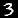

这里我们使用了Python图像库（PIL）中的 `Image` 类，这是用于打开、处理和查看图像最广泛使用的Python软件包。Jupyter能够识别PIL图像，因此会自动为我们显示图像。

在计算机中，一切都以数字形式呈现。要查看构成图像的数字，我们需要将其转换为NumPy数组或PyTorch张量。例如，图像的一部分转换为NumPy数组后如下所示：

```python
array(im3)[4:10,4:10]
```

```text
array([[ 0, 0, 0, 0, 0, 0],
	[ 0, 0, 0, 0, 0, 29],
	[ 0, 0, 0, 48, 166, 224],
	[ 0, 93, 244, 249, 253, 187],
	[ 0, 107, 253, 253, 230, 48],
	[ 0, 3, 20, 20, 15, 0]], dtype=uint8)
```

`4:10` 表示我们请求了从索引 4（包含）到 10（不包含）的行（译者注：这是Python的切片，它总是遵循左闭右开的原则），以及相同的列范围。NumPy 的索引方向是从上到下、从左到右，因此该区域位于图像左上角附近。以下是 PyTorch 张量对应的表示形式：

```python
tensor(im3)[4:10,4:10]
```

```text
tensor([[ 0, 0, 0, 0, 0, 0],
	[ 0, 0, 0, 0, 0, 29],
	[ 0, 0, 0, 48, 166, 224],
	[ 0, 93, 244, 249, 253, 187],
	[ 0, 107, 253, 253, 230, 48],
	[ 0, 3, 20, 20, 15, 0]], dtype=torch.uint8)
```

我们可以对数组进行切片操作，仅提取包含数字顶部的部分，然后使用Pandas数据框通过渐变色对数值进行编码，这清晰地展示了图像如何由像素值生成：

```python
im3_t = tensor(im3)
df = pd.DataFrame(im3_t[4:15,4:22])
df.style.set_properties(**{'fontsize':'
6pt'}).background_gradient('Greys')
```

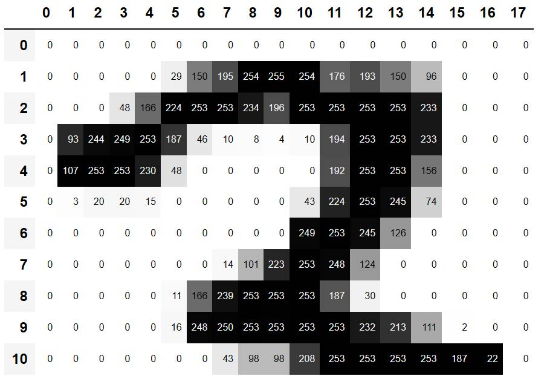

你可以看到背景中的白色像素存储为数字0，黑色存储为数字255，而灰色调则介于两者之间。整张图像包含28个横向像素和28个纵向像素，总计768个像素点。（这远小于手机摄像头拍摄的数百万像素图像，但作为初学阶段的学习和实验对象非常合适。我们很快会逐步过渡到更大尺寸的全彩图像。）

那么，现在你已经了解了计算机眼中图像的模样，让我们回顾我们的目标：创建一个能够识别数字3和7的模型。你将如何让计算机实现这个功能呢？

> 停下来思考一下！
>
> 在继续阅读之前，请花片刻时间思考计算机如何识别这两个数字。它可能关注哪些特征？如何识别这些特征？又如何将它们组合起来？学习的最佳方式是自己尝试解决问题，而非直接阅读他人答案；因此请暂时放下这本书，拿纸笔记录下你的想法。

### 首次尝试：像素相似度

那么，这里有一个初步想法：我们是否可以先计算所有数字“3”的像素平均值，再对数字“7”进行同样的操作？这样就能得到两个组平均值，定义我们所说的“理想”数字3和数字7。接着，要将图像分类为某个数字，我们只需判断图像与这两个理想数字中的哪个更相似。这种方法显然比毫无头绪要好得多，因此可以作为良好的基准方案。

> 术语：基准方案（baseline）
>
> 一个你确信能表现不错的简单模型。它应该易于实现且便于测试，这样你就能逐一验证改进方案，确保它们始终优于基准模型。若没有合理的基准模型作为起点，就很难判断那些花哨的模型是否真正有效。建立基准的有效方法之一是像我们在此所做的那样：构思一个简单易实现的模型。另一种方法是寻找解决过类似问题的案例，下载相关代码并在你的数据集上运行。理想情况下，两种方法都尝试！

我们简单模型的第一步是计算两个组中每个像素值的平均值。在此过程中，我们将学习许多实用的Python数值编程技巧！

让我们创建一个张量，将所有3的值堆叠在一起。我们已经知道如何创建包含单张图像的张量。要创建包含目录中所有图像的张量，我们将首先使用Python列表推导式生成单张图像张量的普通列表。

在开发过程中，我们将使用Jupyter进行一些小测试——例如，确保返回的项数看起来合理：

```python
seven_tensors = [tensor(Image.open(o)) for o in sevens]
three_tensors = [tensor(Image.open(o)) for o in threes]
len(three_tensors),len(seven_tensors)
```

```text
(6131, 6265)
```

> 列表推导式
>
> 列表推导式和字典推导式是Python的一项绝妙特性。许多Python程序员——包括本书作者——每天都在使用它们，它们是“地道Python”的重要组成部分。但来自其他语言的程序员可能从未见过它们。网络上已有大量优质教程可供查阅，因此我们在此不再赘述。以下提供简要说明和示例供您入门：列表推导式格式如下：`new_list = [f(o) for o in a_list if o>0]`。该表达式将返回 `a_list` 中所有大于 0 的元素，并在返回前通过函数 `f` 进行处理。其结构包含三部分：迭代集合（`a_list`）、可选过滤条件（`if o>0`）以及对每个元素执行的操作（`f(o)`）。这种写法不仅更简洁，而且比用循环创建相同列表的替代方法快得多。

我们还将检查其中一张图像是否正常显示。由于现在我们处理的是张量（Jupyter默认会将其打印为数值），而非PIL图像（Jupyter默认会显示图像），因此需要使用fastai的`show_image` 函数来显示图像：

```python
show_image(three_tensors[1]);
```

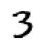

对于每个像素位置，我们需要计算所有图像中该像素的强度平均值。为此，首先将列表中的所有图像合并为单个三维张量。描述此类张量最常见的方式是将其称为三阶张量。我们常需将集合中的单个张量堆叠成单一张量。不出所料，PyTorch内置名为`stack`的函数可用于此目的。

PyTorch 中某些操作（如计算均值）需要我们将整数 *类型转换* （cast）为浮点类型。由于后续会用到，我们现在也需将堆叠张量转换为浮点类型。在 PyTorch 中进行类型转换非常简单：只需写出目标类型名称，并将其作为方法调用即可。

通常，当图像采用浮点数表示时，像素值预期在0到1之间，因此我们在此处也需除以255：

```python
stacked_sevens = torch.stack(seven_tensors).float()/255
stacked_threes = torch.stack(three_tensors).float()/255
stacked_threes.shape
```

```text
torch.Size([6131, 28, 28])
```

张量的最重要属性或许是其形状。这揭示了每个轴的长度。在此案例中，我们可知共有6,131张图像，每张尺寸为28×28像素。这个张量本身并未明确规定：第一轴代表图像数量、第二轴代表高度、第三轴代表宽度——张量的语义完全取决于我们如何构建它。对PyTorch而言，它只是内存中的一组数字。

张量的形状长度即为其阶数（rank）：

```python
len(stacked_threes.shape)
```

```python
3
```

你必须牢记并熟练运用这些张量术语：阶数指张量的轴数或维数；形状指张量各轴的大小。

> ALEXIS说
>
> 请注意，“维度”一词有时具有双重含义。我们生活在“三维空间”中，物理位置可由长度为3的向量 `v` 描述。但根据PyTorch的定义，属性 `v.ndim`（看似表示v的“维数”）却等于1而非3！为什么？因为v作为向量属于阶数为1的张量，意味着它仅有一条轴（即使该轴长度为3）。换言之，“维度”有时指轴的长度（如“空间是三维的”），有时指阶数或轴的数量（如“矩阵有两个维度”）。当概念混淆时，我发现将所有表述转化为“阶数”、“轴”和“长度”这三个明确术语会很有帮助。

我们也可以直接使用 `ndim` 获取张量的阶数：

```python
stacked_threes.ndim
```

```python
3
```

最后，我们可以计算出理想的3维张量形态。通过对堆叠后的3阶张量沿0维方向求均值，即可得到所有图像张量的平均值。该维度正是索引所有图像的维度。

换言之，对于每个像素位置，这将计算该像素在所有图像中的平均值。结果将是每个像素位置对应一个数值，即一张单一图像。如下所示：

```python
mean3 = stacked_threes.mean(0)
show_image(mean3);
```

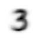

根据该数据集，这是理想的“3”数值！（你或许不喜欢，但这就是峰值“3”的性能的表现形态。）你可以看到：当所有图像都认为该区域应为暗部时，它呈现出极深的暗度；而在图像存在分歧的区域，则会变得纤细而模糊。

现在我们对7也做同样的事情，但把所有步骤合并在一起以节省时间：

```python
mean7 = stacked_sevens.mean(0)
show_image(mean7);
```


现在我们选取任意一个3，并测量它与我们“理想数字”之间的距离。

> 停下来思考一下！
>
> 如何计算特定图像与我们每个理想数字的相似度？请记得在继续之前暂时放下这本书，先记下一些想法！研究表明，当你通过解决问题、进行实验和亲自尝试新想法来参与学习过程时，记忆力和理解力会显著提升。

以下是“3”的示例：

```python
a_3 = stacked_threes[1]
show_image(a_3);
```


如何判断它与理想数字3的距离？我们不能简单地将该图像像素与理想数字像素之间的差异相加。某些差异为正值，某些为负值，这些差异会相互抵消，导致某些区域过暗、某些区域过亮的图像可能显示为与理想数字的总差异为零。这会产生误导！

为避免这种情况，数据科学家主要采用两种方法来衡量此情境中的距离：

- 取差值绝对值的均值（绝对值是将负值替换为正值的函数）。这称为平均绝对差或L1范数。

- 取差值平方的均值（使所有值变为正值），然后求平方根（取消平方操作）。这称为均方根误差（RMSE）或L2范数。

> 忘记数学也没关系
>
> 本书通常假设读者已完成高中数学课程，并至少记得其中部分内容——但谁都会遗忘某些知识！这完全取决于你在此期间恰好练习过哪些内容。也许你已经忘记了平方根是什么，或者它们确切的运作方式。没关系！每当遇到本书未充分阐述的数学概念时，请务必暂停推进，立即查阅相关资料。确保你理解其基本原理、运作机制及应用场景。可通过可汗学院等优质资源重温知识点，例如该平台就提供了精彩的平方根入门教程。

现在让我们同时尝试这两种方法：

```python
dist_3_abs = (a_3 - mean3).abs().mean()
dist_3_sqr = ((a_3 - mean3)**2).mean().sqrt()
dist_3_abs,dist_3_sqr
```

```text
(tensor(0.1114), tensor(0.2021))
```

```python
dist_7_abs = (a_3 - mean7).abs().mean()
dist_7_sqr = ((a_3 - mean7)**2).mean().sqrt()
dist_7_abs,dist_7_sqr
```

```python
(tensor(0.1586), tensor(0.3021))
```

在这两种情况下，我们的3与“理想”3之间的距离都小于到理想7的距离，因此在这种情况下，我们的简单模型将给出正确的预测。

PyTorch 已将这两种损失函数都作为内置功能提供。您可以在 `torch.nn.functional` 中找到它们，PyTorch 团队建议导入时使用 `F`（在 fastai 中默认即以此名称提供）：

```python
F.l1_loss(a_3.float(),mean7), F.mse_loss(a_3,mean7).sqrt()
```

```text
(tensor(0.1586), tensor(0.3021))
```

此处 `MSE` 代表均方误差（mean squared error），`l1` 指代数学术语中的均值绝对值（数学中称为L1范数）。

> SYLVAIN说
>
> 直观而言，L1范数与均方误差（MSE）的区别在于：后者对较大误差的惩罚力度大于前者（而对小误差则更为宽容）。

> JEREMY说
>
> 初次见到这个L1玩意儿时，我查了查它到底是什么意思。在谷歌上发现它是一种使用绝对值的向量范数（vector norm），于是又查了“向量范数”开始阅读： 设V为实数或复数域F上的向量空间，V上的范数即为满足下列性质的任意非负值函数p: V → \[0,+∞): 对所有a ∈ F及所有u, v ∈ V，p(u + v) ≤ p(u) + p(v)...然后我就没再读下去。“唉，我永远搞不懂数学！”我第n次这样想着。后来我发现，每当这些复杂的数学术语在实践中出现时，其实都能用一小段代码替代！比如L1损失就是 `(a-b).abs().mean()`，其中a和b是张量。数学家们的思维方式确实与我不同……本书将确保每次出现数学术语时，都会同步给出对应的代码片段，并用通俗易懂的语言解释其原理。

我们刚刚完成了对PyTorch张量的各种数学运算。如果你之前用PyTorch做过数值编程，可能会发现这些操作与NumPy数组类似。让我们来看看这两种重要的数据结构。

#### NumPy数组与PyTorch张量

[NumPy](https://numpy.org/) 是 Python 中最广泛使用的科学计算和数值编程库。它提供了与 PyTorch 类似的功能和 API，但不支持使用 GPU 或计算梯度——这两者对深度学习都至关重要。因此，在本书中，我们将在可能的情况下普遍使用 PyTorch 张量而非 NumPy 数组。

（请注意，fastai 为 NumPy 和 PyTorch 添加了一些功能，使它们在某些方面更相似。如果本书中的任何代码在你的计算机上无法运行，可能是你忘记在笔记本开头添加类似以下的导入语句：`from fastai.vision.all import *`。）

但什么是数组和张量，你又为何需要关注它们？

相较于许多语言，Python运行速度较慢。在Python、NumPy或PyTorch中表现出色的高效代码，很可能是为编译对象编写的封装层——这些对象通常用其他语言（特别是C语言）编写并经过优化。事实上，NumPy数组和PyTorch张量完成计算的速度，可能比使用纯Python快数千倍。

NumPy数组是一种多维数据表，其中所有元素类型相同。由于数据类型不受限制，数组甚至可以包含嵌套数组，其中最内层数组可能具有不同尺寸——这种结构称为锯齿状数组。所谓“多维数据表”，例如包括：列表（一维）、表格或矩阵（二维）、表格的表格（三维）等等。若元素均为整型或浮点型等简单类型，NumPy将以紧凑的C语言数据结构存储于内存中。这正是NumPy的优势所在：其丰富的运算符与方法能以与优化C语言相同的运算速度处理这些紧凑结构，因为它们本身就是用优化C语言编写的。

PyTorch张量与NumPy数组几乎相同，但存在一项额外限制，该限制解锁了更多功能。两者相同之处在于，它们都是多维数据表，且所有元素类型一致。然而，其限制在于张量不能随意使用任意类型——所有分量必须采用单一基本数值类型。因此张量不如真正的阵列阵列灵活。例如 PyTorch 张量不能具有锯齿状结构，始终保持规则的多维矩形结构。

NumPy 在这些结构上支持的大多数方法和运算符，PyTorch 同样支持，但 PyTorch 张量还具备额外功能。其中一项重要能力是这些结构可驻留在 GPU 上，此时其计算将针对 GPU 进行优化，运行速度将大幅提升（前提是处理大量数据值）。此外，PyTorch能自动计算这些运算的导数，包括复合运算的导数。正如你将看到的，若缺少此功能，深度学习在实际应用中将难以实现。

> SYLVAIN说
>
> 如果你不知道什么是C语言，别担心：你完全不需要它。简而言之，它是一种低级语言（低级意味着更接近计算机内部使用的语言），与Python相比速度极快。在Python编程中若想利用其速度优势，请尽量避免编写循环，改用直接操作数组或张量的命令。

对于Python程序员而言，或许最重要的编程技能就是掌握如何高效使用数组/张量API。本书后续将展示更多技巧，但现阶段您需要了解的核心要点如下：

要创建数组或张量，请将列表（或列表的列表，或列表的列表的列表等）传递给 `array` 或 `tensor`：

```python
data = [[1,2,3],[4,5,6]]
arr = array (data)
tns = tensor(data)
```

```python
arr # numpy
```

```python
array([[1, 2, 3],
	[4, 5, 6]])
```

```python
tns # pytorch
```

```python
tensor([[1, 2, 3],
	[4, 5, 6]])
```

以下所有操作均在张量上展示，但其语法和结果与NumPy数组完全相同。

你可以选择一行（请注意，与Python中的列表类似，张量采用0索引，因此1指代第二行/列）：

```python
tns[1]
```

```text
tensor([4, 5, 6])
```

或者通过使用 `:` 表示所有第一个轴（我们有时将张量/数组的维度称为轴）：

```python
tns[:,1]
```

```python
tensor([2, 5])
```

你可以结合Python切片语法（`[起始:终止]`，且 `终止` 不包含）来选择行或列的一部分：

```python
tns[1,1:3]
```

```text
tensor([5, 6])
```

并且你可以使用标准运算符，例如 `+` 、`-` 、`*` 和 ` /`：

```python
tns+1
```

```text
tensor([[2, 3, 4],
	[5, 6, 7]])
```

张量具有类型：

```python
tns.type()
```

```text
'torch.LongTensor'
```

并将根据需要自动更改该类型；例如，从 `int` 到 `float`：

```python
tns*1.5
```

```text
tensor([[1.5000, 3.0000, 4.5000],
	[6.0000, 7.5000, 9.0000]])
```

那么，我们的基准模型是否有效？要量化这一点，我们必须定义一个指标。

### 使用广播计算指标

请记住，度量值是基于模型预测结果和数据集中的正确标签计算得出的数值，用于评估模型性能。例如，我们可以使用上一节中提到的任一函数——均方误差或均方根误差，并计算它们在整个数据集上的平均值。然而，这些数值对大多数人而言并不直观；实际应用中，我们通常采用准确率作为分类模型的评估指标。

正如我们讨论过的，我们希望在验证集上计算指标。这样做是为了避免无意中出现过拟合——即训练出的模型仅在训练数据上表现良好。虽然当前尝试的像素相似度模型本身不存在这种风险（因其不含训练组件），但我们仍将遵循常规做法使用验证集，为后续的二次尝试做好准备。

要获得验证集，我们需要从训练数据中完全剔除部分数据，确保模型完全无法接触这些数据。事实上，MNIST数据集的创建者已经为我们做好了这项工作。还记得那个名为 `valid` 的独立目录吗？这个目录正是为此而设！

那么首先，让我们从该目录中创建 "3"和 "7" 的张量。这些张量将用于计算衡量初始模型质量的指标，该指标通过评估与理想图像的距离来实现：

```python
valid_3_tens = torch.stack([tensor(Image.open(o))
                            for o in (path/'valid'/'3').ls()])
valid_3_tens = valid_3_tens.float()/255
valid_7_tens = torch.stack([tensor(Image.open(o))
                            for o in (path/'valid'/'7').ls()])
valid_7_tens = valid_7_tens.float()/255
valid_3_tens.shape,valid_7_tens.shape
```

```text
(torch.Size([1010, 28, 28]), torch.Size([1028, 28, 28]))
```

养成边操作边检查形状的习惯很有必要。这里我们看到两个张量：一个表示由1,010张28×28图像组成的3验证集，另一个表示由1,028张28×28图像组成的7验证集。

我们最终要编写一个函数 `is_3`，用于判断任意图像更接近于数字3还是数字7。该函数将通过比较图像与两个“理想数字”的相似度来实现判断。为此，我们需要定义距离的概念——即一个计算两幅图像之间距离的函数。

我们可以编写一个简单的函数，使用与上一节中编写的表达式非常相似的表达式来计算均方根误差：

```python
def mnist_distance(a,b): return (a-b).abs().mean((-1,-2))
mnist_distance(a_3, mean3)
```

```text
tensor(0.1114)
```

这是我们先前计算的两幅图像间距离值，即理想图像 `mean_3` 与任意样本图像 `a_3`，它们均为形状为 `[28,28]` 的单图像张量。

但要计算整体准确率的度量指标，我们需要为验证集中的每张图像计算其与理想值3的距离。如何进行这项计算？我们可以遍历验证集张量 `valid_3_tens` 中所有单张图像张量，该张量形状为 `[1010,28,28]`，代表1010张图像。但存在更优解法

当我们使用这个完全相同的距离函数——它原本是为比较两张单一图像而设计的——但将代表 3s 验证集的张量 `valid_3_tens` 作为参数传入时，会发生一件有趣的事情：

```python
valid_3_dist = mnist_distance(valid_3_tens, mean3)
valid_3_dist, valid_3_dist.shape
```

```text
(tensor([0.1050, 0.1526, 0.1186, ..., 0.1122, 0.1170, 0.1086]),
torch.Size([1010]))
```

与其抱怨形状不匹配，它反而将每张图像的距离作为向量（即秩为1的张量）返回，长度为1,010（即验证集中3的数量）。这是怎么回事？

再看一遍我们的函数 `mnist_distance`，你会发现其中包含了减法运算（`a-b`）。关键技巧在于：当PyTorch尝试对不同秩的两个张量执行简单减法时，会自动启用广播机制——它会将秩较小的张量自动扩展为与秩较大张量相同的尺寸。广播功能极大简化了张量编程的复杂性，是张量编程的核心特性之一。

在广播操作后，两个参数张量具有相同的秩，PyTorch 应用其对同秩张量的常规逻辑：对两个张量的每个对应元素执行操作，并返回张量结果。例如：

```python
tensor([1,2,3]) + tensor([1,1,1])
```

```text
tensor([2, 3, 4])
```

因此在此情况下，PyTorch 将 `mean3`（一个表示单张图像的 2 维张量）视为 1,010 张相同图像的副本，然后将这些副本分别从验证集中的每个 3 中减去。你认为这个张量的形状会是什么？在查看答案之前，请尝试自己推导：

```python
(valid_3_tens-mean3).shape
```

```text
torch.Size([1010, 28, 28])
```

我们正在计算理想值3与验证集中的1,010个3之间的差异，针对每张28×28的图像分别计算，最终形成 `[1010,28,28]` 的形状。

关于广播机制的实现方式，有几点重要说明：这些特性不仅使其在表达能力方面具有价值，更在性能层面展现出显著优势：

- PyTorch 实际上并未复制 `mean3` 1,010 次。它只是模拟出该形状的张量，但并未分配额外内存。
- 所有计算都在C语言环境中完成（若使用GPU，则通过CUDA实现——相当于GPU端的C语言），其运行速度比纯Python快数万倍（在GPU上甚至可达数百万倍！）。

这适用于PyTorch中所有广播操作、元素级运算及函数。 *掌握这项技术是编写高效PyTorch代码的关键所在*。

在 `mnist_distance` 中，我们看到可以 `abs`。现在你可能已经猜到，当应用于张量时，它会做什么。它将该方法应用于张量中的每个单独元素，并返回一个包含结果的张量（即，它以元素方式应用该方法）。因此，在此情况下，我们将得到 1,010 个绝对值。

最后，我们的函数调用 `mean(-1,-2)`。元组 `(-1,-2)` 代表一组轴范围。在Python中，`-1` 表示最后一个元素，`-2` 表示倒数第二个元素。因此在此情况下，这告诉PyTorch我们需要对张量最后两个轴索引的值进行均值计算。最后两个轴分别对应图像的水平和垂直维度。对最后两个轴求均值后，我们仅剩下张量的第一个轴，该轴索引图像元素，因此最终尺寸为( `1010` )。换言之，我们对每张图像中所有像素的强度值进行了平均计算。

在本书后续章节中，特别是第17章，我们将深入学习广播技术，并定期进行实践操作。

我们可以使用 `mnist_distance` 来判断图像是否为数字 3，具体逻辑如下：若待判数字与标准 3 之间的距离小于其与标准 7 的距离，则判定为 3。该函数将自动执行广播操作并逐元素应用，这与所有 PyTorch 函数和运算符的行为一致：

```python
def is_3(x): return mnist_distance(x,mean3) < mnist_distance(x,mean7)
```

让我们用我们的示例案例来测试一下：

```python
is_3(a_3), is_3(a_3).float()
```

```text
(tensor(True), tensor(1.))
```

请注意，当我们将布尔响应转换为浮点数时，`True` 对应`1.0`，而 `False` 对应 `0.0`。

得益于广播机制，我们还可以在完整的 "3" 验证集上进行测试：

```python
is_3(valid_3_tens)
```

```text
tensor([True, True, True, ..., True, True, True])
```

现在我们可以计算每个3和7的准确率，方法是取该函数在所有3上的平均值，以及其在所有7上的逆函数的平均值：

```python
accuracy_3s = is_3(valid_3_tens).float() .mean()
accuracy_7s = (1 - is_3(valid_7_tens).float()).mean()
accuracy_3s,accuracy_7s,(accuracy_3s+accuracy_7s)/2
```

```text
(tensor(0.9168), tensor(0.9854), tensor(0.9511))
```

这看起来是个不错的开端！我们在3和7的识别上都达到了90%以上的准确率，并且学会了如何通过广播操作便捷地定义指标。但说实话：3和7的外观差异非常明显。而且目前我们只识别了10个数字中的2个。所以我们需要做得更好！

要做得更好，或许是时候尝试一种真正具备学习能力的系统——它能够自动调整自身以提升性能。换言之，现在是时候探讨训练过程和梯度下降法了。

### 随机梯度下降法

你还记得亚瑟·塞缪尔对机器学习的描述吗？我们在第一章中曾引用过他的话。

> 假设我们设计某种自动测试机制，用于评估当前权重分配方案在实际性能方面的有效性，并提供调整权重分配的机制以实现性能最大化。无需深入探讨具体流程细节，即可预见该机制完全可实现自动化运行，且如此编程的机器将能够从经验中“学习”。

正如我们讨论的那样，这是实现模型不断改进的关键——它能够学习。但我们的像素相似度方法并未真正实现这一点。我们既没有权重分配机制，也没有通过测试权重分配效果来改进的方法。换言之，我们无法通过调整参数集来真正提升像素相似度方法的性能。要发挥深度学习的强大能力，首先必须按照塞缪尔描述的方式来表征任务。

与其试图寻找图像与“理想图像”之间的相似性，我们不妨逐个分析每个像素，为每个像素赋予权重值，使得权重值最高的那部分像素，对应特定类别中最可能呈现黑色的区域。例如，位于右下方的像素在识别数字7时激活概率较低，因此应赋予其较低的权重；但这些像素在识别数字8时激活概率较高，故应赋予其较高的权重。这可通过函数形式及各类别对应的权重值集来表示——例如数字8的概率：

```python
def pr_eight(x,w) = (x*w).sum()
```

在此我们假设 `X` 是图像，以向量形式表示——换言之，所有行被首尾相接堆叠成一条长线。同时假设权重为向量 `W` 。若存在此函数，我们只需某种方式更新权重使其略有改善。通过这种方法，我们可以重复此步骤多次，使权重不断优化，直至达到最佳状态。

我们希望找到向量 `W` 的具体值，使得对于数字8的图像，函数结果值较高；对于非数字8的图像，函数结果值较低。寻找最佳向量 `W` 的过程，本质上是在探索识别8的最佳函数。（由于尚未采用深度神经网络，我们目前受限于函数的处理能力——本章后续将解决这一限制。）

具体而言，将此函数转换为机器学习分类器所需的步骤如下：

1. *初始化* （Initialize）权重。
2. 对每张图像，使用这些权重 *预测* （predict）其是否呈现为数字3或7。
3. 根据这些预测结果，计算模型性能指标（即 *损失值* （loss））。
4. 计算 *梯度* （gradient），该值衡量每个权重变化对损失值的影响。
5. 根据计算结果 *调整* （Step）（即改变）所有权重值。
6. 返回步骤2 *重复* （repeat）整个过程。
7. 持续迭代直至决定 *终止* （stop）训练（例如模型达到预期精度或训练时间超限）。

如图4-1所示的这七个步骤，是所有深度学习模型训练的核心。深度学习竟完全依赖于这些步骤，这令人极其惊讶且违背直觉。如此简单的过程竟能解决如此复杂的问题，实在令人惊叹。但正如你将看到的，它确实做到了！

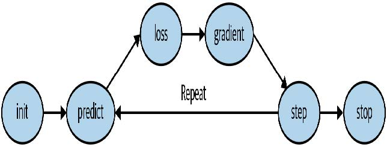

[^图4-1]: 梯度下降过程

实现这七个步骤的方法多种多样，我们将在本书后续章节中逐步学习这些方法。这些细节对深度学习从业者至关重要，但实际上每个步骤的通用方法都遵循着一些基本原则。以下是一些指导方针：

- 初始化

  我们将参数初始化为随机值。这听起来或许令人惊讶。我们当然可以选择其他初始化方式，例如将参数设为该类别中像素被激活的百分比——但既然我们已知存在优化权重的常规方法，事实证明直接采用随机权重作为起点完全可行。

- 损失值

  这正是塞缪尔所指的——通过实际性能来检验当前权重分配的有效性。我们需要一个函数，当模型性能良好时返回较小的数值（标准做法是将小损失视为良好，大损失视为不良，尽管这仅是约定俗成的做法）。

- 调整

  判断权重应微增还是微减的简易方法就是直接尝试：将权重小幅调整后，观察损失值是上升还是下降。找到正确方向后，可逐步增减调整幅度，直至找到效果最佳的数值。但这种方法效率十分低下！正如我们将要看到的，微积分的魔力让我们无需逐次尝试微调，就能直接确定每个权重的调整方向和大致幅度。实现方法是计算梯度——这本质上是性能优化手段，通过较慢的手动过程同样能获得完全相同的结果。

- 停止

  在确定模型需要训练的迭代轮次数量后（前文列表中已给出若干建议），我们便执行该决策。对于我们的数字分类器，我们将持续训练直至模型准确率开始下降，或训练时间耗尽。

在将这些步骤应用于图像分类问题之前，让我们通过一个更简单的案例来说明它们的运作方式。首先定义一个极其简单的函数——二次函数，假设这是我们的损失函数，其中 `x` 是该函数的权重参数：

```python
def f(x): return x**2
```

以下是该函数的图：

```python
plot_function(f, 'x', 'x**2')
```

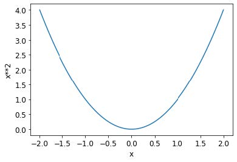

我们之前描述的步骤序列首先为某个参数选择一个随机值，然后计算损失值：

```python
plot_function(f, 'x', 'x**2')
plt.scatter(-1.5, f(-1.5), color='red');
```

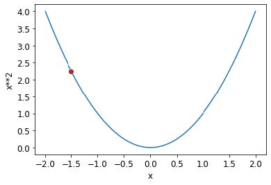

现在我们观察参数增减一点点时会发生什么——即调整。这本质上就是特定点处的斜率：

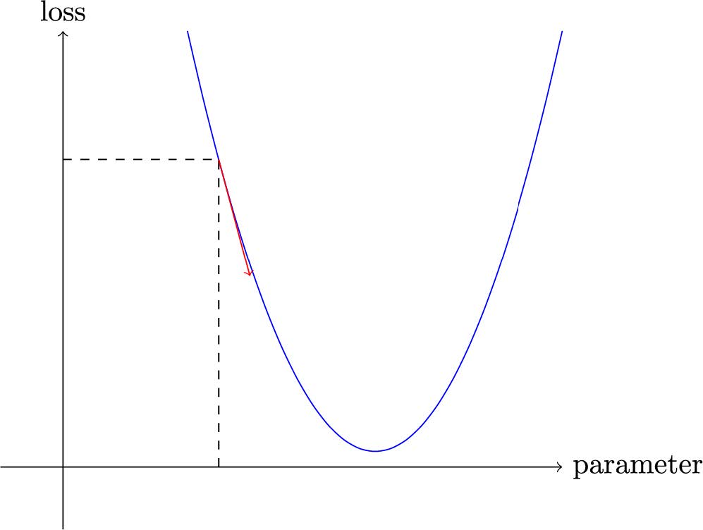

我们可以沿着斜率方向稍微改变权重，重新计算损失和调整值，并重复几次。最终，我们将到达曲线上的最低点：

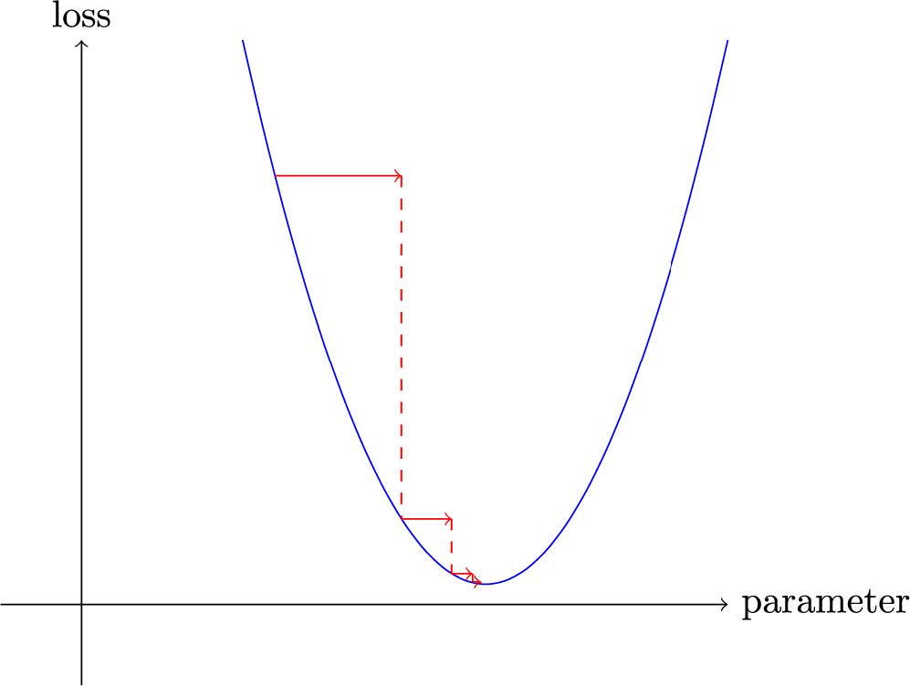

这个基本思想可以追溯到艾萨克·牛顿（Isaac Newton），他指出我们可以以此方式优化任意函数。无论函数变得多么复杂，这种梯度下降的基本方法都不会发生显著改变。本书后续章节中出现的细微变化，仅在于通过寻找更优的步长来提升计算效率的实用技巧。

#### 计算梯度

关键的一步在于计算梯度。正如我们所提到的，我们使用微积分进行性能优化；它能让我们更快速地计算出，当调整参数增减时损失函数将上升还是下降。换言之，梯度会告诉我们需要调整每个权重多少，才能使模型表现更优。

你可能还记得高中微积分课上学到的知识：函数的导数能告诉你参数变化会如何改变结果。如果忘了也别担心，高中毕业后忘记微积分的人可不少！但在继续学习前，你需要对导数有基本的直观理解。若相关概念仍模糊不清，建议前往可汗学院完成基础导数课程。无需掌握具体计算方法，只需理解导数的本质即可。

关于导数的关键点在于：对于任何函数——例如上一节中出现的二次函数——我们都能计算其导数。导数本身是另一种函数，它计算的是变化率而非数值本身。例如，二次函数在数值3处的导数，揭示了该函数在3处的变化速率。更具体地说，你可能记得梯度定义为升高/水平移动，即函数值的变化除以参数值的变化。当我们知道函数将如何变化时，就知道该如何使其更小。这正是机器学习的关键：找到改变函数参数的方法使其更小。微积分为我们提供了计算捷径——导数，它使我们能够直接计算函数的梯度。

需要注意的一点是，我们的函数包含大量需要调整的权重，因此在计算导数时，我们不会得到一个数值，而是会得到许多数值——每个权重对应一个梯度。但这里并无数学上的复杂之处；你可以先计算某个权重的导数，将其他权重视为常量，然后对每个权重重复此过程。所有权重的梯度都是通过这种方式计算得出的。

我们刚才提到，你无需亲自计算任何梯度。这怎么可能？令人惊叹的是，PyTorch能够自动计算几乎任何函数的导数！更令人赞叹的是，它执行得非常迅速。大多数情况下，其速度至少与你手动创建的任何导数函数相当。让我们通过一个示例来验证。

首先，让我们选取一个需要计算梯度的张量值：

```python
xt = tensor(3.).requires_grad_()
```

你应该注意到了那个特殊的`requires_grad_`方法了吧？这就是我们用来告诉PyTorch的魔法咒语——我们需要计算该变量在该值处的梯度。它本质上是在给变量打标签，这样PyTorch就会记住如何计算你后续请求的其他直接计算操作的梯度。

> ALEXIS说
>
> 如果你之前有数学或物理背景，这个API可能会让你感到困惑。在那些领域中，函数的“梯度”只是另一个函数（即其导数），因此你可能会期望梯度相关的API返回一个新函数。但在深度学习中，“梯度”通常指函数导数在特定参数值处的数值。PyTorch 的 API 同样将焦点放在参数上，而非你实际计算梯度的函数本身。初看或许令人费解，但这只是视角的差异。

现在我们用该值计算函数。请注意PyTorch不仅打印计算结果，还标注了它拥有一个梯度函数——该函数将在需要时用于计算梯度：

```python
yt = f(xt)
yt
```

```text
tensor(9., grad_fn=<PowBackward0>)
```

最后，我们让PyTorch为我们计算梯度：

```python
yt.backward()
```

此处的“反向”指的是反向传播（backpropagation），这是计算每层导数的命名过程。我们将在第17章中具体探讨其实现方式——届时将从零开始计算深度神经网络的梯度。该过程称为网络的反向传播，与用于计算激活值的前向传播相对应。若将 `backward` 直接命名为 `calculate_grad`，事情或许会简单些，但深度学习从业者确实热衷于在任何可能的地方添加专业术语！

现在我们可以检查张量的 `grad` 属性来查看梯度：

```python
xt.grad
```

```text
tensor(6.)
```

如果你还记得高中微积分的规则，`x**2` 的导数是 `2*x` ，而我们有 `x=3` ，因此梯度应为 `2*3=6` ——这正是PyTorch为我们计算出的结果！

现在我们将重复前面的步骤，但这次为函数提供一个向量参数：

```python
xt = tensor([3.,4.,10.]).requires_grad_()
xt
```

```text
tensor([ 3., 4., 10.], requires_grad=True)
```

我们将向函数添加 `sum` 方法，使其能够接收向量（即秩为1的张量）并返回标量（即秩为0的张量）：

```python
def f(x): return (x**2).sum()

yt = f(xt)
yt
```

```text
tensor(125., grad_fn=<SumBackward0>)
```

我们的梯度为 `2*xt` ，正如我们所预期的那样！

```python
yt.backward()
xt.grad
```

```text
tensor([ 6., 8., 20.])
```

梯度仅告诉我们函数的斜率，却无法精确指示参数应调整的幅度。但它们确实能提供某种参考：若斜率极大，可能意味着需要进行更多调整；反之若斜率极小，则暗示我们已接近最优值。

#### 调整学习率

根据梯度值决定如何调整参数，是深度学习过程中至关重要的一环。几乎所有方法都基于一个基本思路：将梯度乘以某个小数值，即学习率（LR）。学习率通常取值于0.001至0.1之间，但理论上可设为任意数值。人们常通过尝试不同学习率，在训练后筛选出最佳模型参数（本书后续将介绍更优方法——学习率搜索器）。选定学习率后，可通过以下简单函数调整参数：

```python
w -= w.grad * lr
```

这被称为参数步进（stepping），采用优化步长法（optimization step）。

如果你选择的学习率过低，可能意味着需要执行大量迭代步骤。图4-2对此进行了说明。

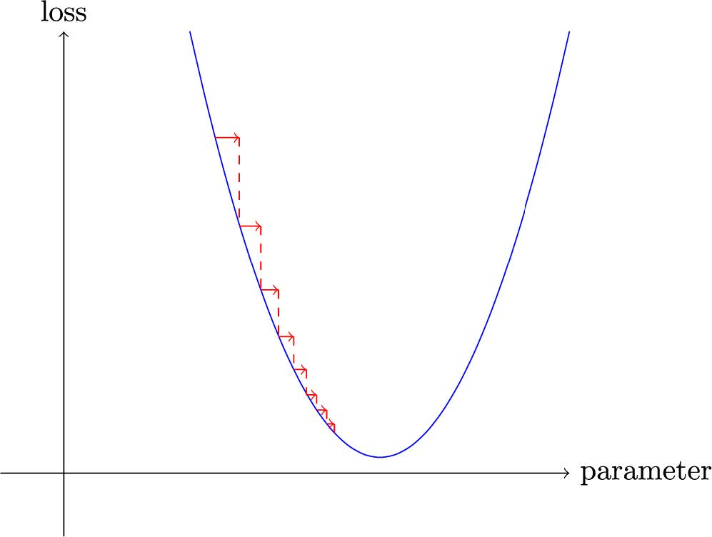

[^图4-2]: 低学习率的梯度下降法

但选择过高的学习率会更糟——它会导致损失进一步恶化，正如我们在图4-3中所见！

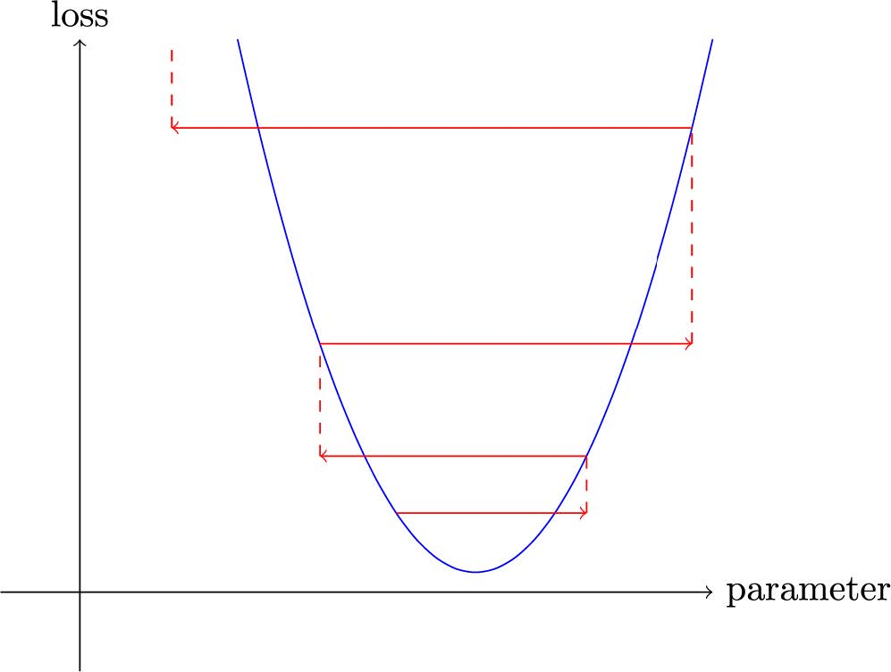

[^图4-3]: 高学习率的梯度下降法

若学习率过高，模型可能出现“弹跳”现象而非收敛；图4-4展示了这种情况如何导致训练过程需要大量迭代才能成功。

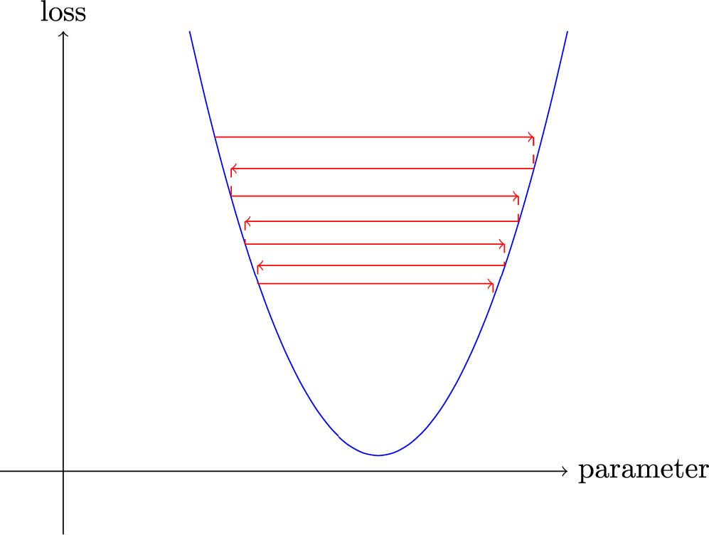

[^图4-4]: 带弹跳学习率的梯度下降法

现在让我们通过一个端到端的示例来应用所有这些内容。

#### 一个端到端梯度下降示例

我们已经了解了如何使用梯度来最小化损失。现在，让我们通过一个随机梯度下降（SGD）的示例，看看如何利用寻找极小值的过程来训练模型，使其更好地拟合数据。

让我们从一个简单的合成示例模型开始。想象你在测量过山车翻越山脊顶部时的速度。它会从高速开始，然后在爬坡时逐渐减速；在山顶达到最慢速度，随后在下坡时再次加速。你需要构建一个描述速度随时间变化的模型。若你每秒手动测量20秒内的速度，数据可能呈现如下形态：

```python
time = torch.arange(0,20).float(); time
```

```text
tensor([ 0., 1., 2., 3., 4., 5., 6., 7., 8., 9., 10., 11., 12.,
13.,
> 14., 15., 16., 17., 18., 19.])
```

```python
speed = torch.randn(20)*3 + 0.75*(time-9.5)**2 + 1
plt.scatter(time,speed);
```

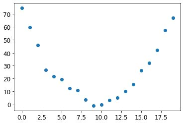

我们添加了一点随机噪声，因为手动测量不够精确。这意味着要回答“过山车速度是多少”的问题并不容易。使用梯度下降法，我们可以尝试寻找与观测数据匹配的函数。由于无法考虑所有可能的函数，我们假设其为二次函数，即形式为 `a*(time**2)+(b*time)+c` 的函数。

我们需要明确区分函数的输入（测量过山车速度的时刻）与参数（定义所测二次曲线值的数值）。因此，我们将参数集中到一个参数中，从而在函数签名中将输入 `t` 与参数 `params` 分离：

```python
def f(t, params):
    a,b,c = params
    return a*(t**2) + (b*t) + c
```

换言之，我们将寻找最优拟合函数的问题简化为寻找最佳二次函数。这极大简化了问题，因为每个二次函数都完全由三个参数 `a`、`b` 和 `c` 定义。因此，要找到最佳二次函数，我们只需确定 `a`、`b` 和 `c` 的最佳取值即可。

如果我们能为二次函数的三个参数解决这个问题，就能将同样的方法应用于其他参数更复杂的函数——例如神经网络。让我们先找出函数 `f` 的参数，然后再回来用神经网络对MNIST数据集进行同样的处理。

我们首先需要明确“最佳”的定义。通过选择损失函数（loss function）来精确定义这一概念，该函数将根据预测值与目标值返回数值，其中函数值越低对应的预测效果越“优越”。对于连续型数据，通常采用均方误差（mean squared error）作为衡量标准：

```python
def mse(preds, targets): return ((preds-targets)**2).mean()
```

现在，让我们逐步完成七步流程

##### 步骤 1：初始化参数

首先，我们将参数初始化为随机值，并通过 `requires_grad_` 告知 PyTorch 我们需要追踪它们的梯度：

```python
params = torch.randn(3).requires_grad_()
```

##### 步骤2：计算预测值

然后，我们来计算预测值：

```python
preds = f(time, params)
```

让我们创建一个小函数来看看我们的预测与目标值有多接近，并看看结果：

```python
def show_preds(preds, ax=None):
    if ax is None: ax=plt.subplots()[1]
    ax.scatter(time, speed)
    ax.scatter(time, to_np(preds), color='red')
    ax.set_ylim(-300,100)
    
show_preds(preds)
```

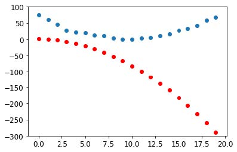

这看起来并不太接近——我们的随机参数表明过山车最终会倒退行驶，因为我们测得的是负速度！

##### 步骤3：计算损失

我们按以下方式计算损失：

```python
loss = mse(preds, speed)
loss
```

```text
tensor(25823.8086, grad_fn=<MeanBackward0>)
```

我们的目标是改进这一点。为此，我们需要了解梯度。

##### 步骤4：计算梯度

下一步是计算梯度，或者说，参数需要如何变化的近似值：

```python
loss.backward()
params.grad
```

```text
tensor([-53195.8594, -3419.7146, -253.8908])
```

```python
params.grad * 1e-5
```

```text
tensor([-0.5320, -0.0342, -0.0025])
```

我们可以利用这些梯度来优化参数。我们需要设定一个学习率（具体实践方法将在下一章讨论；目前暂设为1e-5或0.00001）：

```python
params
```

```text
tensor([-0.7658, -0.7506, 1.3525], requires_grad=True)
```

##### 步骤5：调整权重

现在我们需要根据刚刚计算出的梯度更新参数：

```python
lr = 1e-5
params.data -= lr * params.grad.data
params.grad = None
```

> ALEXIS说
>
> 理解这部分需要回顾最近我们讲的内容。为计算梯度，我们对 `loss` 函数调用`backward` 。但该 `loss` 函数本身由 `mse` 计算得出，而 `mse` 又以 `preds` 作为输入，`preds` 通过函数 `f` 计算获得，`f` 的输入是 `params` 参数——这正是我们最初调用 `required_grads_` 的对象，正是这个原始调用使我们现在能够对损失函数调用 `backward` 。这串函数调用链体现了函数的数学复合特性，使PyTorch能在底层运用微积分链式法则计算梯度。

让我们看看损失是否有所改善：

```python
preds = f(time,params)
mse(preds, speed)
```

```text
tensor(5435.5366, grad_fn=<MeanBackward0>)
```

再来看看这个图：

```python
show_preds(preds)
```

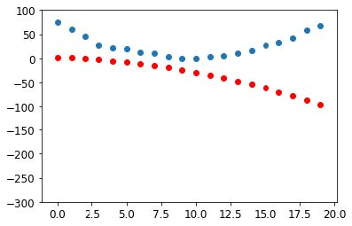

我们需要重复执行这个操作几次，因此我们将创建一个函数来应用单一步骤：

```python
def apply_step(params, prn=True):
    preds = f(time, params)
    loss = mse(preds, speed)
    loss.backward()
    params.data -= lr * params.grad.data
    params.grad = None
    if prn: print(loss.item())
    return preds
```

##### 步骤6：重复该过程

现在我们开始迭代。通过循环执行多次改进，我们希望最终获得理想结果：

```python
for i in range(10): apply_step(params)
```

```text
5435.53662109375
1577.4495849609375
847.3780517578125
709.22265625
683.0757446289062
678.12451171875
677.1839599609375
677.0025024414062
676.96435546875
676.9537353515625
```

损失值正在下降，正如我们所期望的那样！但仅关注这些损失数值会掩盖一个事实：每次迭代都在尝试完全不同的二次函数，这是在寻找最佳二次函数的过程中。如果我们不输出损失函数，而是在每个步骤绘制该函数，就能直观地看到这个过程。这样就能观察到曲线如何逐渐逼近数据的最佳二次函数：

```python
_,axs = plt.subplots(1,4,figsize=(12,3))
for ax in axs: show_preds(apply_step(params, False), ax)
plt.tight_layout()
```

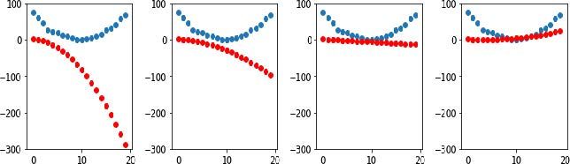

##### 步骤7：终止

我们只是随意决定在10个迭代轮次后停止训练。实际操作中，我们会像之前讨论的那样，通过观察训练集和验证集的损失值以及评估指标来决定何时停止训练。

#### 梯度下降法的总结

既然你已经了解了每个步骤的运作机制，让我们重新审视梯度下降过程的图形化表示（图4-5），并进行简要回顾。


[^图4-5]: 梯度下降过程

最初，我们模型的权重可以是随机的（从头开始训练），也可以来自预训练模型（迁移学习）。在第一种情况下，输入得到的输出结果与预期目标毫无关联；即使在第二种情况下，预训练模型也可能难以胜任我们特定的目标任务。因此模型需要学习更优的权重参数。

我们首先通过损失函数将模型输出的结果与目标值进行比较（我们拥有标注数据，因此知道模型应给出何种结果），该函数返回一个数值，我们需要通过调整权重使其尽可能降低。为此，我们从训练集中提取若干数据项（如图像）并输入模型。通过损失函数比对对应目标值，所得分数反映预测偏差程度。随后我们微调权重参数以实现预测精度的小幅提升。

为了解如何调整权重以改善损失函数表现，我们运用微积分计算梯度值（实际上由PyTorch自动完成）。不妨通过一个类比来理解： 假设你在山里迷路，车停在最低处。要找到回车的位置，你可能会随机方向乱逛，但这可能帮不上什么忙。既然知道车辆在最低点，你最好顺着山坡往下走。只要始终朝着最陡的下坡方向前进，最终就能抵达目的地。我们利用梯度大小（即斜坡陡峭程度）来决定步幅大小；具体而言，将梯度乘以我们设定的学习率来确定步长。随后持续迭代直至抵达最低点——即停车场所在位置——此时即可停止。

我们刚才所见的内容均可直接应用于MNIST数据集，损失函数除外。现在让我们探讨如何定义一个有效的训练目标函数。

### MNIST的损失函数

我们已经有了我们的 `xs`——即我们的自变量，也就是图像本身。我们将把它们全部拼接成一个张量，同时将它们从矩阵列表（三阶张量）转换为向量列表（二阶张量）。可通过 PyTorch 的 `view` 方法实现，该方法能在不改变张量内容的前提下调整其形状。参数 `-1` 在 `view` 中具有特殊含义，表示“使该轴尽可能大以容纳所有数据”：

```python
train_x = torch.cat([stacked_threes, stacked_sevens]).view(-1, 28*28)
```

每张图像都需要一个标签。我们将用1表示 "3"，用0表示 "7" ：

```python
train_y = tensor([1]*len(threes) + [0]*len(sevens)).unsqueeze(1)
train_x.shape,train_y.shape
```

```text
(torch.Size([12396, 784]), torch.Size([12396, 1]))
```

PyTorch 中的 `Datadet` 在索引时必须返回 `(x, y)` 元组。Python 提供的 `zip` 函数结合列表使用，可轻松实现此功能：

```python
dset = list(zip(train_x,train_y))
x,y = dset[0]
x.shape,y
```

```text
(torch.Size([784]), tensor([1]))
```

```python
valid_x = torch.cat([valid_3_tens, valid_7_tens]).view(-1, 28*28)
valid_y = tensor([1]*len(valid_3_tens) +
[0]*len(valid_7_tens)).unsqueeze(1)
valid_dset = list(zip(valid_x,valid_y))
```

现在我们需要为每个像素赋予一个（初始随机）权重（这是我们七步流程中的初始化步骤）：

```python
def init_params(size, std=1.0): return
(torch.randn(size)*std).requires_grad_()

weights = init_params((28*28,1))
```

函数 `weights*pixels` 的灵活性不足——当像素值为 0 时，该函数始终等于 0（即其截距为 0）。你可能还记得中学数学中直线的公式为 `y=w*x+b`；我们仍然需要 `b` 项。我们将同样将其初始化为一个随机数：

```python
bias = init_params(1)
```

在神经网络中，方程 `y=w*x+b` 中的 `w` 被称为权重（weights），`b` 则称为偏置（bias）。权重与偏置共同构成参数（parameters）。

> 术语：参数
>
> 模型的权重和偏置。权重即公式 `w*x+b` 中的 `w`，偏置则是该公式中的 `b`。

现在我们可以为一张图像计算预测结果：

```python
(train_x[0]*weights.T).sum() + bias
```

```text
tensor([20.2336], grad_fn=<AddBackward0>)
```

虽然我们可以使用Python的 `for` 循环来计算每张图像的预测结果，但这种方式会非常缓慢。由于Python循环无法在GPU上运行，且Python本身在循环处理方面效率较低，我们需要尽可能利用高级函数将计算逻辑封装到模型中。

在此情况下，存在一种极其便捷的数学运算，可计算矩阵每行对应的 `w*x` 值——这被称为矩阵乘法。图4-6展示了矩阵乘法的具体形式。

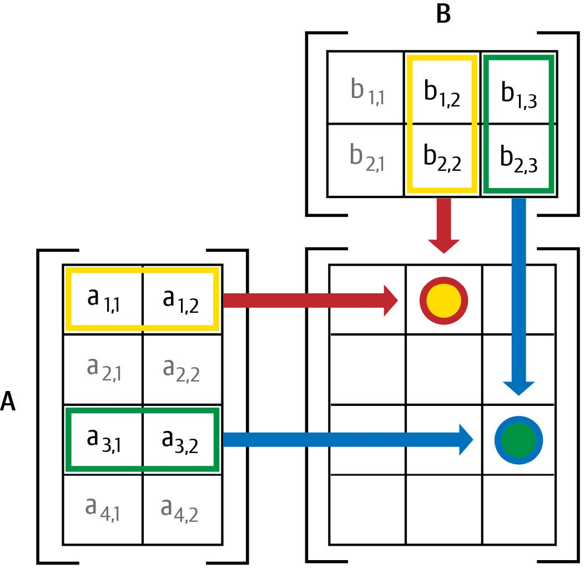

[^图4-6]: 矩阵乘法

这张图展示了两个矩阵 `A` 和 `B` 的相乘过程。结果矩阵 `AB` 的每个元素，都是通过将 `A` 矩阵对应行中的每个元素与 `B` 矩阵对应列中的每个元素相乘后求和得出的。例如，第1行第2列（带红框的黄点）的计算方式为：`a1,1 * b1,2 + a1,2 * b2,2`。若需复习矩阵乘法，建议参阅可汗学院的《矩阵乘法入门》，因这是深度学习中最核心的数学运算。

在 Python 中，矩阵乘法使用 `@` 运算符表示。让我们试试看：

```python
def linear1(xb): return xb@weights + bias
preds = linear1(train_x)
preds
```

```text
tensor([[20.2336],
	[17.0644],
	[15.2384],
	...,
	[18.3804],
	[23.8567],
	[28.6816]], grad_fn=<AddBackward0>)
```

第一个元素与我们之前计算的结果一致，这符合预期。这个公式——`批量 @ 权重 + 偏置`——是任何神经网络的两个基本公式之一（另一个是激活函数，我们稍后会看到）。

让我们检查准确性。要判断输出是3还是7，只需检查它是否大于0，因此每个元素的准确率可通过广播运算（无需循环！）按以下方式计算：

```python
corrects = (preds>0.0).float() == train_y
corrects
```

```text
tensor([[ True],
	[ True],
	[ True],
	...,
	[False],
	[False],
	[False]])
```

```python
corrects.float().mean().item()
```

```text
0.4912068545818329
```

现在让我们看看当其中一个权重发生微小变化时，准确率的变化情况：

```python
weights[0] *= 1.0001

preds = linear1(train_x)
((preds>0.0).float() == train_y).float().mean().item()
```

```text
0.4912068545818329
```

正如我们所见，要使用梯度下降法改进模型，我们需要梯度；而要计算梯度，则需要一个能反映模型优劣的损失函数。这是因为梯度衡量的是当权重发生微小调整时，损失函数的变化程度。

因此，我们需要选择一个损失函数。最直接的方法是将准确率（即我们的评估指标）直接作为损失函数。在这种情况下，我们将对每张图像进行预测计算，收集这些预测值以计算整体准确率，然后根据该整体准确率计算每个权重的梯度。

很遗憾，我们这里遇到了一个严重的技术问题。函数的梯度即其斜率或陡度，可定义为纵坐标变化量除以横坐标变化量——即函数值上升或下降的幅度除以输入值的变化量。数学表达式如下：

```python
(y_new – y_old) / (x_new – x_old)
```

当 `x_new` 与 `x_old` 非常相似时，即两者差异极小时，这种方法能很好地近似梯度值。但准确率仅在预测值从3变为7或从7变为3时才会发生变化。问题在于：权重从 `x_old` 到 `x_new` 的微小变化通常不会引发预测结果改变，因此 `(y_new – y_old)` 几乎总是等于 0。换言之，梯度在绝大多数位置都趋近于零。

权重值的微小变化通常不会改变准确率。这意味着将准确率作为损失函数毫无意义——若采用此方法，绝大多数情况下梯度值将为零，模型将无法从该数值中学习。

> SYLVAIN说
>
> 从数学角度而言，精度是一个几乎处处恒定的函数（仅在阈值0.5处例外），因此其导数几乎处处为零（在阈值处为无穷大）。这导致梯度值要么为零要么为无穷大，对模型更新毫无用处。

相反，我们需要一种损失函数，当权重带来略微更好的预测时，它能产生略微更小的损失。那么“略微更好的预测”具体是什么样子的呢？在这种情况下，这意味着：如果正确答案是3，分数会略高一些；如果正确答案是7，分数会略低一些。

现在我们来编写这样一个函数。它应该采用什么形式？

损失函数接收的不是图像本身，而是模型给出的预测结果。因此我们定义一个参数 `prds`，其取值范围在 0 到 1 之间，每个值代表模型预测某张图像为 3 的概率。这是一个向量（即阶数为 1 的张量），通过图像索引进行映射。

损失函数的目的是衡量预测值与真实值（即目标值，又称标签）之间的差异。因此，我们再创建一个名为 `trgts` 的参数，其值为 0 或 1，用于指示图像是否实际属于类别 3。它同样是一个向量（即另一个阶数为 1 的张量），通过图像索引进行标记。

例如，假设我们有三张已知数字为3、7和3的图像。假设模型以高置信度（`0.9`）预测第一张是3，以较低置信度（`0.4`）预测第二张是7，并以中等置信度（`0.2`）错误预测最后一张是7。这意味着损失函数将接收以下值作为输入：

```python
trgts = tensor([1,0,1])
prds = tensor([0.9, 0.4, 0.2])
```

以下是我们首次尝试设计的损失函数，用于衡量 `predictions` 与 `targets` 之间的距离：

```python
def mnist_loss(predictions, targets):
    return torch.where(targets==1, 1-predictions, predictions).mean()
```

我们正在使用一个新函数 `torch.where(a,b,c)`。它相当于运行列表推导式 `[b[i] if a[i] else c[i] for i in range(len(a))]`，但能在张量上以C/CUDA速度运行。通俗来说，该函数会测量每个预测值与理想值1之间的距离（当预测值应为1时），以及与理想值0之间的距离（当预测值应为0时），最终计算所有距离的平均值。

> 读读文档吧
>
> 了解PyTorch这类函数至关重要，因为在Python中遍历张量时，其运行速度取决于Python而非C/CUDA！现在请尝试运行 `help(torch.where)` 查看该函数文档，或者更推荐直接访问PyTorch文档网站查阅。

让我们在 `prds` 和 `trgts` 上试试看：

```python
torch.where(trgts==1, 1-prds, prds)
```

```text
tensor([0.1000, 0.4000, 0.8000])
```

可以看出，当预测更准确时，该函数返回的数值更低；当准确预测更可靠（绝对值更高）时，返回值更低；当不准确预测更不可靠时，返回值同样更低。在PyTorch中，我们始终认为损失函数的数值越低越好。由于最终损失需要一个标量值，`mnist_loss` 会取前一个张量的均值：

```python
mnist_loss(prds,trgts)
```

```text
tensor(0.4333)
```

例如，如果我们将对某个“错误”目标的预测值从 `0.2` 改为 `0.8` ，损失值就会下降，这表明该预测更准确：

```python
mnist_loss(tensor([0.9, 0.4, 0.8]),trgts)
```

```text
tensor(0.2333)
```

当前我们定义的 `mnist_loss` 存在一个问题，即它假设预测值始终在0到1之间。因此我们需要确保实际情况确实如此！恰巧存在一个能实现此功能的函数——让我们来看看。

#### Sigmoid函数

`sigmoid` 函数始终输出介于 0 到 1 之间的数值。其定义如下：

```python
def sigmoid(x): return 1/(1+torch.exp(-x))
```

PyTorch 为我们定义了一个加速版本，因此我们实际上不需要自己实现。这是深度学习中的一个重要函数，因为我们经常需要确保数值在 0 到 1 之间。它的实现如下：

```python
plot_function(torch.sigmoid, title='Sigmoid', min=-4, max=4)
```

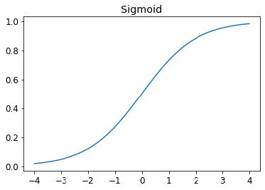

如你所见，它能将任何输入值（无论是正数还是负数）平滑转换为0到1之间的输出值。这条平滑曲线仅呈上升趋势，这使得梯度下降法更容易找到有意义的梯度。

让我们更新 `mnist_loss`，使其首先对输入应用 `sigmoid` 函数：

```python
def mnist_loss(predictions, targets):
    predictions = predictions.sigmoid()
    return torch.where(targets==1, 1-predictions, predictions).mean()
```

现在我们可以确信，即使预测值不在0到1之间，损失函数依然有效。唯一的要求是：更高的预测值对应更高的置信度。

在定义了损失函数之后，现在正是回顾我们为何这样做的最佳时机。毕竟我们原本已有整体准确率这一度量指标，那么为何还要定义损失函数呢？

关键区别在于：度量标准旨在驱动人类理解，而损失函数则用于驱动自动学习。要实现自动学习，损失函数必须是具有有效导数的函数。它不能存在大面积平坦区段和剧烈跳变，而必须保持合理平滑。因此我们设计了能对置信度微小变化作出响应的损失函数。该要求意味着损失函数有时无法完全体现我们的实际目标，而是我们在真实目标与可通过梯度优化的函数之间做出的折中。系统会为数据集中的每个项目计算损失值，并在每个训练周期结束时对所有损失值取平均，最终报告该周期的整体均值。

另一方面，指标是我们关注的数字。这些值会在每个训练迭代轮次结束时输出，用于评估模型表现。在判断模型性能时，我们必须学会关注这些指标而非损失值。

#### SGD 和小批量训练

既然我们已经有了适合驱动SGD的损失函数，就可以考虑学习过程下一阶段涉及的细节了——即根据梯度来改变或更新权重。这被称为优化步骤（optimization step）。

要执行优化步骤，我们需要计算一个或多个数据项的损失值。该使用多少个数据项呢？我们可以对整个数据集进行计算并取平均值，也可以仅对单个数据项计算。但这两种方法都不理想。计算整个数据集的损失值耗时过长；仅计算单个数据项的损失值又无法充分利用信息，导致梯度不精确且不稳定。这样做虽然费力更新权重，却只考虑了模型在该单个数据项上性能的提升。

因此我们采取折中方案：每次计算少量数据项的平均损失值。这被称为小批量（mini-batch）。小批量中的数据项数量称为批量大小。更大的批量意味着你能从损失函数中获得更精确、更稳定的数据集梯度估计，但训练耗时更长，每个迭代轮次处理的迷你批次数量也会减少。选择合适的批量大小是深度学习从业者为快速准确训练模型必须做出的决策之一。本书将探讨如何做出这个选择。

使用小批量训练而非对单个数据项计算梯度的另一个重要原因在于：实际训练中我们几乎总是在GPU等加速器上进行。这类加速器只有在同时处理大量任务时才能发挥高效性能，因此为其提供海量数据进行处理非常有益。使用小批量处理正是实现这一目标的最佳方式之一。但需注意，若一次性提供过多数据，加速器将面临内存不足的困境——让GPU高效运转同样需要技巧！

正如你在第二章关于数据增强的讨论中所见，若能在训练过程中引入变量，我们就能获得更好的泛化能力。其中一种简单而有效的方法，就是改变每个小批次中包含的数据项。与其在每个迭代轮次期间按顺序遍历数据集，我们通常的做法是在创建小批次前随机打乱数据集顺序。PyTorch 和 fastai 提供了一个名为 `DataLoader` 的类，它能自动完成数据打乱和小批次整理工作。

`DataLoader` 可接收任何 Python 集合，并将其转换为遍历多个批次的迭代器，例如：

```python
coll = range(15)
dl = DataLoader(coll, batch_size=5, shuffle=True)
list(dl)
```

```text
[tensor([ 3, 12, 8, 10, 2]),
tensor([ 9, 4, 7, 14, 5]),
tensor([ 1, 13, 0, 6, 11])]
```

训练模型时，我们需要的并非任意Python集合，而是包含自变量和因变量（即模型的输入与目标）的集合。在PyTorch中，包含自变量与因变量元组的集合称为数据集（`Dataset`）。以下是一个极其简单的数据集示例：

```python
ds = L(enumerate(string.ascii_lowercase))
ds
```

```text
(#26) [(0, 'a'),(1, 'b'),(2, 'c'),(3, 'd'),(4, 'e'),(5, 'f'),(6, 'g'),(7,
> 'h'),(8, 'i'),(9, 'j')...]
```

当我们将 `Dataset` 传递给 `DataLoader` 时，我们会得到许多批次，这些批次本身是张量元组，代表着独立变量和依赖变量的批次：

```python
dl = DataLoader(ds, batch_size=6, shuffle=True)
list(dl)
```

```text
[(tensor([17, 18, 10, 22, 8, 14]), ('r', 's', 'k', 'w', 'i', 'o')),
(tensor([20, 15, 9, 13, 21, 12]), ('u', 'p', 'j', 'n', 'v', 'm')),
(tensor([ 7, 25, 6, 5, 11, 23]), ('h', 'z', 'g', 'f', 'l', 'x')),
(tensor([ 1, 3, 0, 24, 19, 16]), ('b', 'd', 'a', 'y', 't', 'q')),
(tensor([2, 4]), ('c', 'e'))]
```

现在，我们准备使用SGD编写模型的第一个训练循环！

### 整合所有内容

现在是时候实现图4-1中所示的过程了。在代码中，我们的过程将在每个迭代轮次中以类似以下方式实现：

```python
for x,y in dl:
    pred = model(x)
    loss = loss_func(pred, y)
    loss.backward()
    parameters -= parameters.grad * lr
```

首先，让我们重新初始化参数：

```python
weights = init_params((28*28,1))
bias = init_params(1)
```

`DataLoader` 可从 `Dataset` 创建：

```python
dl = DataLoader(dset, batch_size=256)
xb,yb = first(dl)
xb.shape,yb.shape
```

```text
(torch.Size([256, 784]), torch.Size([256, 1]))
```

我们将对验证集执行相同的操作：

```python
valid_dl = DataLoader(valid_dset, batch_size=256)
```

让我们创建一个大小为4的小批次用于测试：

```python
batch = train_x[:4]
batch.shape
```

```text
torch.Size([4, 784])
```

```python
preds = linear1(batch)
preds
```

```text
tensor([[-11.1002],
	[ 5.9263],
	[ 9.9627],
	[ -8.1484]], grad_fn=<AddBackward0>)
```

```python
loss = mnist_loss(preds, train_y[:4])
loss
```

```text
tensor(0.5006, grad_fn=<MeanBackward0>)
```

现在我们可以计算梯度：

```python
loss.backward()
weights.grad.shape,weights.grad.mean(),bias.grad
```

```text
(torch.Size([784, 1]), tensor(-0.0001), tensor([-0.0008]))
```

让我们把这些都封装到一个函数中：

```python
def calc_grad(xb, yb, model):
    preds = model(xb)
    loss = mnist_loss(preds, yb)
    loss.backward()
```

然后测试一下：

```python
calc_grad(batch, train_y[:4], linear1)
weights.grad.mean(),bias.grad
```

```text
(tensor(-0.0002), tensor([-0.0015]))
```

但看我们调用两次会发生什么：

```python
calc_grad(batch, train_y[:4], linear1)
weights.grad.mean(),bias.grad
```

```text
(tensor(-0.0003), tensor([-0.0023]))
```

梯度发生了变化！这是因为`loss.backward`会将 `loss` 的梯度添加到当前存储的任何梯度中。因此，我们必须先将当前梯度设置为0：

```python
weights.grad.zero_()
bias.grad.zero_();
```

> 原地操作(IN-PLACE OPERATIONS)
>
> PyTorch 中名称以下划线结尾的方法会就地修改其对象。例如，`bias.zero_` 将张量 `bias` 的所有元素设置为 `0`。

我们仅剩的步骤是根据梯度和学习率更新权重与偏置。执行此操作时，必须告知PyTorch不要对该步骤求导——否则在计算下一批次的导数时会导致混乱！若对张量的 `data` 属性进行赋值，PyTorch将不会对该步骤求导。以下是我们一个迭代轮次的基本训练循环：

```python
def train_epoch(model, lr, params):
    for xb,yb in dl:
        calc_grad(xb, yb, model)
        for p in params:
            p.data -= p.grad*lr
            p.grad.zero_()
```

我们还想通过验证集的准确率来检验模型表现。判断输出值代表3还是7时，只需检查其是否大于0。因此每个元素的准确率可通过广播运算（无需循环！）按以下方式计算：

```python
(preds>0.0).float() == train_y[:4]
```

```text
tensor([[False],
	[ True],
	[ True],
	[False]])
```

这便为我们提供了用于计算验证准确率的函数：

```python
def batch_accuracy(xb, yb):
    preds = xb.sigmoid()
    correct = (preds>0.5) == yb
    return correct.float().mean()
```

我们来测一下能不能正常运行：

```python
batch_accuracy(linear1(batch), train_y[:4])
```

```text
tensor(0.5000)
```

然后将批次合并：

```python
def validate_epoch(model):
    accs = [batch_accuracy(model(xb), yb) for xb,yb in valid_dl]
    return round(torch.stack(accs).mean().item(), 4)

validate_epoch(linear1)
```

```text
0.5219
```

这就是我们的起点。让我们训练一个迭代轮次，看看准确率是否有所提升：

```python
lr = 1.
params = weights,bias
train_epoch(linear1, lr, params)
validate_epoch(linear1)
```

```text
0.6883
```

再做几个：

```python
for i in range(20):
    train_epoch(linear1, lr, params)
    print(validate_epoch(linear1), end=' ')
```

```text
0.8314 0.9017 0.9227 0.9349 0.9438 0.9501 0.9535 0.9564 0.9594 0.9618
0.9613
> 0.9638 0.9643 0.9652 0.9662 0.9677 0.9687 0.9691 0.9691 0.9696
```

看起来不错！我们已经达到了与“像素相似度”方法相当的精度，并且构建了一个可供扩展的通用基础框架。下一步我们将创建一个对象来处理梯度下降步骤。在PyTorch中，这个对象被称为优化器（optimizer）。

#### 创建优化器

由于这是如此基础的通用框架，PyTorch提供了一些实用类来简化实现过程。首先我们可以将线性函数替换为PyTorch的 `nn.Linear` 模块。模块是继承自PyTorch `nn.Module` 类的对象。该类的对象行为与标准Python函数完全一致，即通过括号调用时，它们将返回模型的激活值。

`nn.Linear` 实现了 `init_params` 和 `linear` 的组合功能。它将权重和偏置整合到单个类中。以下是复制上一节模型的实现方式：

```python
linear_model = nn.Linear(28*28,1)
```

每个PyTorch模块都清楚自身可训练的参数；这些参数可通过 `parameters` 方法获取：

```python
w,b = linear_model.parameters()
w.shape,b.shape
```

```text
(torch.Size([1, 784]), torch.Size([1]))
```

我们可以利用这些信息创建一个优化器：

```python
class BasicOptim:
    def __init__(self,params,lr): self.params,self.lr = list(params),lr
    
    def step(self, *args, **kwargs):
        for p in self.params: p.data -= p.grad.data * self.lr
        
    def zero_grad(self, *args, **kwargs):
        for p in self.params: p.grad = None
```

我们可以传递模型的参数来创建优化器：

```python
opt = BasicOptim(linear_model.parameters(), lr)
```

我们的训练循环现在可以简化为：

```python
def train_epoch(model):
    for xb,yb in dl:
        calc_grad(xb, yb, model)
        opt.step()
        opt.zero_grad()
```

我们的验证函数完全不需要改变：

```python
validate_epoch(linear_model)
```

```text
0.4157
```

让我们把这个小训练循环封装成函数，这样会更简洁：

```python
def train_model(model, epochs):
    for i in range(epochs):
        train_epoch(model)
        print(validate_epoch(model), end=' ')
```

结果与上一节相同：

```python
train_model(linear_model, 20)
```

```text
0.4932 0.8618 0.8203 0.9102 0.9331 0.9468 0.9555 0.9629 0.9658 0.9673
0.9687
> 0.9707 0.9726 0.9751 0.9761 0.9761 0.9775 0.978 0.9785 0.9785
```

fastai 提供了 `SGD` 类，默认情况下，它与我们的 `BasicOptim` 实现相同功能：

```python
linear_model = nn.Linear(28*28,1)
opt = SGD(linear_model.parameters(), lr)
train_model(linear_model, 20)
```

```text
0.4932 0.852 0.8335 0.9116 0.9326 0.9473 0.9555 0.9624 0.9648 0.9668
0.9692
> 0.9712 0.9731 0.9746 0.9761 0.9765 0.9775 0.978 0.9785 0.9785
```

fastai 还提供了 `Learner.fit` 方法，我们可以使用它来替代 `train_model`。要创建一个 `Learner`，我们首先需要创建 `DataLoaders`，通过传入我们的训练集和验证集 `DataLoaders`：

```python
dls = DataLoaders(dl, valid_dl)
```

要创建一个无需应用程序（如 `cnn_learner`）的 `Learner`，我们需要传入本章创建的所有元素： `DataLoaders` 、模型、优化函数（将接收参数）、损失函数，以及可选的打印指标：

```python
learn = Learner(dls, nn.Linear(28*28,1), opt_func=SGD,
loss_func=mnist_loss, metrics=batch_accuracy)
```

现在我们可以调用 `fit`：

```python
learn.fit(10, lr=lr)
```

| 迭代轮次 | 训练损失 | 验证损失 | 批准确度 | 时间  |
| -------- | -------- | -------- | -------- | ----- |
| 0        | 0.636857 | 0.503549 | 0.495584 | 00:00 |
| 1        | 0.545725 | 0.170281 | 0.866045 | 00:00 |
| 2        | 0.199223 | 0.184893 | 0.831207 | 00:00 |
| 3        | 0.086580 | 0.107836 | 0.911187 | 00:00 |
| 4        | 0.045185 | 0.078481 | 0.932777 | 00:00 |
| 5        | 0.029108 | 0.062792 | 0.946516 | 00:00 |
| 6        | 0.022560 | 0.053017 | 0.955348 | 00:00 |
| 7        | 0.019687 | 0.046500 | 0.962218 | 00:00 |
| 8        | 0.018252 | 0.041929 | 0.965162 | 00:00 |
| 9        | 0.017402 | 0.038573 | 0.967615 | 00:00 |

如你所见，PyTorch 和 fastai 的类并没有什么神奇之处。它们只是预先打包的便捷组件，能让你的工作轻松不少！（它们还提供了许多额外功能，我们将在后续章节中使用。）

借助这些课程，我们现在可以将线性模型替换为神经网络。

### 添加非线性项

到目前为止，我们已经建立了一个优化函数参数的通用流程，并将其应用于一个简单的线性分类器——这种分类器在功能上存在局限性。要使其更复杂（并能处理更多任务），我们需要在两个线性分类器之间添加非线性元素（即不同于ax+b的形式）——这正是神经网络的本质所在。

以下是基本神经网络的完整定义：

```python
def simple_net(xb):
    res = xb@w1 + b1
    res = res.max(tensor(0.0))
    res = res@w2 + b2
    return res
```

就是这样！`simple_net` 中只有两个线性分类器，它们之间连接了一个 `max` 函数。

此处，`w1` 和 `w2` 是权重张量，`b1` 和 `b2` 是偏置张量；即，这些参数最初是随机初始化的，正如我们在上一节中所做的那样：

```python
w1 = init_params((28*28,30))
b1 = init_params(30)
w2 = init_params((30,1))
b2 = init_params(1)
```

关键点在于 `w1` 有30个输出激活（这意味着 `w2` 必须有30个输入激活，因此两者匹配）。这意味着第一层能够构建30种不同的特征，每种特征代表不同像素组合。你可以将这个 `30` 改为任意值，从而调整模型的复杂程度。

那个小小的函数 `res.max(tensor(0.0))` 被称为整流线性单元（rectified linear unit），也称 ReLU。我们都认同“整流线性单元”听起来相当高深复杂……但实际上它不过就是 `res.max(tensor(0.0))` ——换句话说，就是把所有负数替换为零。这个微小函数在PyTorch中也以 `F.relu` 的形式提供：

```python
plot_function(F.relu)
```

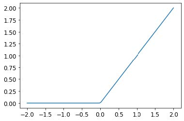

> JEREMY说
>
> 深度学习领域存在大量专业术语，例如整流线性单元（rectified linear unit）等。正如本例所示，绝大多数术语的复杂程度其实只需一行简短代码即可实现。现实情况是，学者们为发表论文需要让内容显得尽可能高深精妙，而引入专业术语正是常用手段。遗憾的是，这导致该领域显得远比实际更令人望而生畏、难以入门。学习术语确实必要，否则论文和教程对你而言将毫无意义。但这并不意味着你需要畏惧术语。只需记住：当遇到陌生词汇时，它们几乎必然指向极其简单的概念。

我们的基本思路是通过增加线性层的数量，使模型进行更多计算，从而能够拟合更复杂的函数。但直接将多个线性层串联起来毫无意义，因为当我们反复进行乘法运算后再累加时，完全可以用不同项相乘后仅累加一次的方式替代！也就是说，任意数量的线性层串联结构，都可以用参数不同的单个线性层来替代。

但若在它们之间插入非线性函数（如 `max` 函数），上述关系便不再成立。此时每个线性层与其他层基本解耦，能够独立完成其特定任务。 `max` 函数尤为有趣，因为它本质上相当于一个简单的 `if` 语句。

> SYLVAIN说
>
> 从数学角度而言，两个线性函数的复合仍是一个线性函数。因此，我们可以随意堆叠多个线性分类器，只要它们之间不包含非线性函数，其效果就等同于单个线性分类器。

令人惊叹的是，数学上可以证明：只要找到 `w1` 和 `w2` 的正确参数，并使这些矩阵足够大，这个小函数就能以任意高的精度解决任何可计算问题。对于任意扭曲的函数，我们都可以将其近似为多条连线组合而成；要使其更接近波浪函数，只需使用更短的线条即可。；要使其更接近原始曲线，只需使用更短的直线即可。这被称为通用逼近定理（universal approximation theorem）。我们这里的三行代码被称为层（layers）。第一层和第三层称为线性层（linear layers），而第二行代码则被称为非线性函数（nonlinearity）或激活函数（activation function）。

与上一节相同，我们可以通过利用 PyTorch 的特性，用更简洁的代码替代这段代码。

```python
simple_net = nn.Sequential(
    nn.Linear(28*28,30),
    nn.ReLU(),
    nn.Linear(30,1)
)
```

`nn.Sequential` 会创建一个模块，该模块将依次调用列出的各个层或函数。

`nn.ReLU` 是 PyTorch 中的一个模块，其功能与 `F.relu` 函数完全相同。模型中可用的多数函数都有对应的模块形式。通常只需将 `F` 替换为 `nn` 并调整大小写即可。使用`nn.Sequential` 时，PyTorch要求采用模块版本。由于模块属于类，我们需要进行实例化，因此本例中使用 `nn.ReLU` 。

由于 `nn.Sequential` 是模块，我们可以获取其参数，该操作将返回其所包含所有模块的完整参数列表。让我们试试看！由于这是更深层的模型，我们将采用更低的学习率并增加几个迭代轮次：

```python
learn = Learner(dls, simple_net, opt_func=SGD,
                loss_func=mnist_loss, metrics=batch_accuracy)
```

```python
learn.fit(40, 0.1)
```

为节省篇幅，我们在这里没有展示40行输出结果；训练过程已记录于 `learn.recorder` 文件中，输出表格存储在 `values` 属性内，因此我们可以绘制训练过程中的准确率曲线：

```python
plt.plot(L(learn.recorder.values).itemgot(2));
```

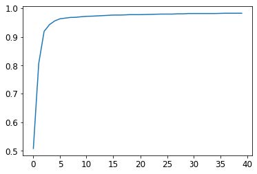

我们可以查看最终的准确率：

```python
learn.recorder.values[-1][2]
```

```text
0.982826292514801
```

此时此刻，我们拥有某种相当神奇的东西：

- 一个能够以任意精度解决任何问题的函数（神经网络），前提是拥有正确的参数集
- 一种为任意函数寻找最佳参数集的方法（随机梯度下降）

这就是深度学习能创造如此惊人成果的原因。我们发现许多学生必须迈出的最大一步就是相信这些简单的技术组合真的能解决任何问题。这似乎好得难以置信——事情肯定比这更困难复杂吧？我们的建议是：亲自动手试试！我们刚刚在MNIST数据集上进行了验证，你已看到结果。由于我们全程亲手实现（梯度计算除外），你完全可以确信背后不存在任何特殊魔法。

#### 深入探索

我们没有必要仅限于两个线性层。只要在每对线性层之间添加非线性变换，我们就可以随意增加层数。然而正如你将了解到的那样，模型越深，实际优化参数就越困难。本书后续章节将介绍一些简单却极具成效的深度模型训练技巧。

我们已知单个非线性函数配合两个线性层便足以近似任意函数。那么为何还要使用更深的模型？关键在于性能表现。采用更深的模型（即更多层结构）时，我们无需使用过多参数；实践证明，使用较小矩阵搭配更多层结构，反而能获得优于大矩阵少层结构的预测效果。

这意味着我们可以更快地训练模型，且占用的内存更少。在1990年代，研究人员过于专注于普遍逼近定理，鲜少有人尝试使用多个非线性函数。这种理论性强而实用性弱的基础理论，使该领域发展停滞了多年。然而部分研究者仍坚持探索深度模型，最终成功证明这些模型在实际应用中表现更优。随后理论研究揭示了其背后的原理。如今，仅采用单一非线性变换的神经网络已极为罕见。

当我们使用与第1章相同的方法训练一个18层模型时，会发生以下情况：

```python
dls = ImageDataLoaders.from_folder(path)
learn = cnn_learner(dls, resnet18, pretrained=False,
                    loss_func=F.cross_entropy, metrics=accuracy)
learn.fit_one_cycle(1, 0.1)
```

| 迭代轮次 | 训练损失 | 验证损失 | 准确度   | 时间  |
| -------- | -------- | -------- | -------- | ----- |
| 0        | 0.082089 | 0.009578 | 0.997056 | 00:11 |

近乎100%的准确率！这与我们简单的神经网络相比有着天壤之别。但正如你在本书后续内容中将了解到的那样，只需掌握几个小技巧，你就能从零开始获得如此出色的结果。你已经掌握了关键的基础知识。（当然，即使你精通所有技巧，也几乎总是会选择使用PyTorch和fastai提供的预构建类，因为它们能让你免于亲自处理所有细节。）

### 术语回顾

恭喜：你现在已经掌握了从零开始创建并训练深度神经网络的方法！我们经历了相当多的步骤才走到这一步，但你可能会惊讶于它实际上是多么简单。

既然我们已走到这一步，现在正是定义并回顾一些术语和关键概念的好时机。

神经网络包含大量数字，但它们仅分为两类：计算出的数值，以及用于计算这些数值的参数。这为我们提供了需要掌握的两个最重要的术语：

- 激活值（Activations）

  经计算得出的数值（包括线性层与非线性层计算结果）

- 参数（Parameters）

  随机初始化并经过优化的数值（即定义模型的数值）

在本书中，我们将频繁讨论激活值和参数。请牢记它们具有特定含义——它们是数值。这些并非抽象概念，而是模型中实际存在的具体数值。成为优秀的深度学习实践者，关键在于养成观察激活函数与参数的习惯，通过绘制图表来检验它们是否正常运作。

我们的激活值和参数都封装在张量（tensors）中。这些本质上是形状规则的数组——例如矩阵。矩阵具有行和列，我们称之为轴（axes）或维度（dimensions.）。张量的维数即为其阶数（rank）。存在一些特殊张量：

- 0阶：标量（scalar）
- 1阶：向量（vector）
- 2阶：矩阵（matrix）

神经网络包含多个层。每层要么是线性（linear）的，要么是非线性（nonlinear）的。我们通常在神经网络中交替使用这两种层。有时人们将线性层及其后续的非线性层统称为单一层。是的，这确实容易混淆。有时非线性层也被称为激活函数（activation function）。

表4-1总结了与梯度下降法（SGD）相关的关键概念。

| 英文原文         | 术语     | 含义                                                         |
| ---------------- | -------- | ------------------------------------------------------------ |
| ReLU             | ReLU函数 | 一种对负数返回0，并对正数保持不变的函数。                    |
| Mini-batch       | 小批次   | 一小批输入和标签被聚合到两个数组中。梯度下降步长在此批次上进行更新（而非整个迭代轮次）。 |
| Forward pass     | 前向传播 | 将模型应用于某些输入并计算预测结果。                         |
| Loss             | 损失     | 一个代表模型表现优劣的值。                                   |
| Gradient         | 梯度     | 模型中某参数对损失的导数。                                   |
| Backward pass    | 反向传播 | 计算损失函数对所有模型参数的梯度。                           |
| Gradient descent | 梯度下降 | 沿着与梯度相反的方向移动一步，使模型参数略微得到改进。       |
| Learning rate    | 学习率   | 在应用梯度下降法更新模型参数时，我们采取的步长大小           |

> 提醒：选择你自己的冒险
>
> 你是否因迫不及待想一探究竟而跳过了第二章和第三章？那么，现在就提醒你：请立刻返回第二章，因为你很快就会需要这些知识！

### 问卷调查

1. 计算机如何表示灰度图像？彩色图像呢？
2. `MNIST_SAMPLE` 数据集中的文件和文件夹是如何组织的？原因何在？

3. 解释基于“像素相似度”的数字分类方法如何运作。
4. 什么是列表推导式？请创建一个从列表中筛选奇数并将其翻倍的示例。
5. 什么是三阶张量？

6. 张量的阶数与形状有何区别？如何从形状中获取阶数？
7. RMSE和L1范数是什么？
8. 如何对数千个数字同时进行计算，且计算速度比Python循环快数千倍？
9. 创建一个包含1到9的3×3张量或数组。将其翻倍。选取右下角四个数字。

10. 什么是广播？
11. 评估指标通常使用训练集还是验证集计算？为什么？

12. 什么是随机梯度下降（SGD）？
13. SGD为何采用小批量训练？
14. 机器学习中SGD的七个步骤是什么？
15. 如何初始化模型权重？
16. 什么是损失？
17. 为何不能始终使用高学习率？
18. 什么是梯度？
19. 你是否需要掌握梯度计算方法？
20. 为何不能将准确率作为损失函数？
21. 绘制sigmoid函数曲线。其形状有何特殊性？
22. 损失函数与度量指标有何区别？
23. 使用学习率计算新权重的函数是什么？
24. `DataLoader` 类的作用是什么？
25. 编写伪代码展示SGD在每个迭代轮次中的基本步骤。
26. 创建一个函数，如果传入两个参数 `[1,2,3,4]` 和 `'abcd'` 之后返回了 `[(1, ‘a’), (2, ‘b’), (3, ‘c’), (4, ‘d’)]` ，该输出数据结构有何特殊之处？

27. PyTorch 中 `view` 方法的作用是什么？
28. 神经网络中的偏置参数是什么？为何我们需要它们？

29. Python中的 `@` 运算符有何作用？
30. `backward` 方法执行什么操作？
31. 为什么需要将梯度归零？
32. 训练模型时需向 `Learner` 传递哪些参数？
33. 请用Python或伪代码展示训练循环的基本步骤。
34. 什么是ReLU？请绘制其在 `-2` 到 `+2` 区间内的曲线图。
35. 什么是激活函数？
36. `F.relu` 与 `nn.ReLU` 之间有何区别？
37. 普适逼近定理表明仅用单个非线性函数即可任意精确地逼近任意函数。那么为什么我们通常使用多个？

#### 进一步研究

1. 基于本章展示的训练循环，从零开始实现你自己的 `Learner`。
2. 使用完整的MNIST数据集（所有数字，不仅限于3和7）完成本章所有步骤。这是个重大项目，完成它需要花费相当多的时间！你需要自行开展研究，以解决过程中遇到的各种障碍。

## 5. 图像分类

既然你已经理解了深度学习的本质、应用场景以及如何创建和部署模型，现在是时候深入探索了！在理想状态下，深度学习从业者无需了解底层运作的每个细节。但现实世界远非如此。事实上，要让模型真正有效且稳定运行，你必须精准把控大量细节，并持续进行多项验证。这个过程需要你能够透视神经网络在训练和预测过程中的内部运作，发现潜在问题并掌握解决的方法。

因此，从本书此处开始，我们将深入探讨深度学习的运作机制。计算机视觉模型、自然语言处理模型、表格模型等的架构是什么？如何构建符合特定领域需求的架构？如何从训练过程中获得最佳结果？如何提升运行速度？当数据集发生变化时需要调整哪些要素？

我们将从重温第一章中探讨过的基本应用开始，但会着重实现两点：

- 优化这些应用。
- 将其应用于更广泛的数据类型。

要完成这两项任务，我们必须掌握深度学习拼图的所有组成部分。这包括不同类型的神经网络层、正则化方法、优化器、如何将层组合成网络架构、标注技术等等。不过我们不会一次性地把所有知识点倒给你，而是根据项目需求循序渐进地引入这些内容，以解决实际项目中遇到的具体问题。

### 从猫狗到宠物品种

在我们的第一个模型中，我们学会了如何区分狗和猫。就在几年前，这还被视为极具挑战性的任务——如今却变得轻而易举！我们无法通过这个案例展示模型训练的细节精妙之处，因为无需关注任何细节就能获得近乎完美的结果。但事实证明，同一数据集还能让我们攻克更艰巨的难题：识别每张图片中宠物的具体品种。

在第一章中，我们将应用场景视为已解决的问题。但现实世界并非如此运作。我们从一个完全陌生的数据集开始。接着必须摸索其构成方式，探索如何从中提取所需数据，并理解这些数据的形态特征。本书后续内容将向你展示如何在实践中解决这些问题，涵盖所有必要的过渡步骤——既要深入理解处理中的数据，又要同步验证建模过程。

我们已经下载了宠物数据集，并可通过与第1章相同的代码获取该数据集的路径：

```python
from fastai2.vision.all import *
path = untar_data(URLs.PETS)
```

若要理解如何从每张图片中提取每只宠物的品种，我们需要先了解数据的布局方式。这类数据布局细节是深度学习拼图中至关重要的一环。数据通常以以下两种形式之一提供：

- 代表数据项的独立文件，例如文本文档或图像，可能组织在文件夹中，或通过文件名体现这些项的相关信息
- 数据表格（例如CSV格式），其中每行代表一个数据项，可能包含文件名以建立表格数据与其他格式数据（如文本文档和图像）之间的关联

这些规则存在例外情况——尤其在基因组学等领域，那里可能存在二进制数据库格式甚至网络流——但总体而言，你将处理的大多数数据集都将采用这两种格式的某种组合形式。

要查看数据集中的内容，我们可以使用 `ls` 方法：

```python
path.ls()
```

```text
(#3) [Path('annotations'),Path('images'),Path('models')]
```

我们可以看到，该数据集提供了图像（images）目录和注释（annotations）目录。[数据集网站](https://oreil.ly/xveoN) 说明注释目录包含宠物位置信息而非物种信息。本章将进行分类任务而非定位任务，也就是说我们关注的是宠物的种类而非位置。因此，我们暂时忽略注释目录。现在，让我们查看图像目录：

```python
(path/"images").ls()
```

```text
(#7394)
[Path('images/great_pyrenees_173.jpg'),Path('images/wheaten_terrier_46.j
>
pg'),Path('images/Ragdoll_262.jpg'),Path('images/german_shorthaired_3.jpg'),P
>
ath('images/american_bulldog_196.jpg'),Path('images/boxer_188.jpg'),Path('ima
>
ges/staffordshire_bull_terrier_173.jpg'),Path('images/basset_hound_71.jpg'),P
>
ath('images/staffordshire_bull_terrier_37.jpg'),Path('images/yorkshire_terrie
> r_18.jpg')...]
```

fastai 中大多数返回集合的函数和方法都使用名为 `L` 的类。该类可视为普通 Python 列表类型的增强版本，为常见操作提供了额外便利。例如，当我们在笔记本中显示该类对象时，其呈现格式如上面所示。首先显示的是集合中项的数量，前缀为 `#`。在前面的输出中，你还会注意到列表末尾带有省略号。这意味着仅显示了前几个元素——这其实是件好事，毕竟我们可不想在屏幕上看到超过7000个文件名！

通过分析这些文件名，我们可以看出它们的结构特征。每个文件名包含宠物品种名称，随后是一个下划线（`_`），接着是一个数字，最后是文件扩展名。我们需要编写一段代码从单个路径中提取品种信息。Jupyter笔记本能轻松实现这一点，因为我们可以逐步构建出可用的功能模块，然后将其应用于整个数据集。此时我们必须十分谨慎，避免过早下结论。例如你仔细观察会发现，某些宠物品种名称包含多个单词，因此不能简单地在首个下划线处截断。为了验证我们的代码，我们选取其中一个文件名：

```python
fname = (path/"images").ls()[0]
```

从这类字符串中提取信息的最强大且灵活的方式是使用 *正则表达式*（regular expression，也称为regex）。正则表达式是一种特殊的字符串，采用正则表达式语言编写，用于定义通用规则来判定另一个字符串是否通过测试（即“匹配”该正则表达式），同时也可从中提取特定部分或多个部分。在此场景中，我们需要一个能从文件名中提取宠物品种的正则表达式。

我们在此无法提供完整的正则表达式教程，但网上有许多优秀的教程可供参考，而且我们知道许多读者早已熟悉这个强大的工具。如果你还没掌握，也完全不必担心——这正是弥补这一缺憾的绝佳机会！我们认为正则表达式是编程工具箱中最实用的工具之一，许多学员都告诉我们这是他们最期待学习的内容。现在就去谷歌搜索“正则表达式教程”吧，浏览完相关资料后再回到这里。本书官网也提供了我们精选的教程列表。

> ALEXIS说
>
> 正则表达式不仅实用性极强，其起源也颇具趣味。之所以称为“正则”，是因为它们最初是“正则语言”的范例——这种语言属于乔姆斯基层次结构中的最低层级。该语法分类体系由语言学家诺姆·乔姆斯基（Noam Chomsky）创立，他同时撰写了开创性著作《句法结构》——这部开创性著作致力于探索人类语言背后的形式语法。这正是计算机科学的魅力所在：你每日随手取用的工具，其设计理念或许源自太空飞船。

编写正则表达式时，最佳的入门方式是先用一个示例进行测试。让我们使用 `findall` 方法，将正则表达式应用于 `fname` 对象的文件名：

```python
re.findall(r'(.+)_\d+.jpg$', fname.name)
```

```text
['great_pyrenees']
```

此正则表达式提取所有位于最后一个下划线前的字符，前提是后续字符为数字，且文件后缀为JPEG格式。

既然我们已确认正则表达式适用于示例，现在就用它来标注整个数据集。fastai 提供了多种用于标注的类。对于正则表达式标注，我们可以使用 `RegexLabeller` 类。在本示例中，我们使用第2章介绍的数据块API（实际上我们几乎总是使用数据块API——它比第1章介绍的简单工厂方法灵活得多）：

```python
pets = DataBlock(blocks = (ImageBlock, CategoryBlock),
                 get_items=get_image_files,
                 splitter=RandomSplitter(seed=42),
                 get_y=using_attr(RegexLabeller(r'(.+)_\d+.jpg$'),
                                  'name'),
                 item_tfms=Resize(460),
                 batch_tfms=aug_transforms(size=224, min_scale=0.75))
dls = pets.dataloaders(path/"images")
```

这个 `DataBlock` 的调用中有两行代码是我们之前未曾见过的关键部分：

```python
item_tfms=Resize(460),
batch_tfms=aug_transforms(size=224, min_scale=0.75)
```

这些代码实现了我们称为预尺寸化（presizing）的fastai数据增强策略。预尺寸化是一种特殊的图像增强方式，旨在最大限度减少数据破坏的同时保持良好性能。

### 预尺寸化

我们需要图像具有相同的尺寸，以便它们能够组合成张量传递给GPU。同时，我们希望尽量减少执行的不同增强计算的数量。性能要求表明，我们应尽可能将增强变换组合为更少的变换（以降低计算量和有损操作次数），并将图像转换为统一尺寸（以提升GPU处理效率）。

我们的挑战在于，若在缩小至增强尺寸后执行，多种常见的数据增强变换可能会引入虚假的空白区域、降低数据质量，或两者兼而有之。例如，将图像旋转45度会使新边界范围的角落区域出现空白，这无法为模型提供任何学习信息。许多旋转和缩放操作需要通过插值生成像素。这些插值像素虽源自原始图像数据，但质量仍会降低。

为应对这些挑战，预尺寸调整采用了如图5-1所示的两种策略：

1. 将图像调整为相对“较大”的尺寸——即尺寸显著大于目标训练尺寸。
2. 将所有常见的增强操作（包括调整为最终目标尺寸）组合为一项操作，并在处理结束时仅在GPU上执行一次组合操作，而非分别执行各项操作并进行多次插值。

第一步是调整尺寸，生成足够大的图像以保留余量，从而我们能在内部区域进行进一步的增强变换而不产生空白区域。该变换通过采用大裁剪尺寸调整为正方形实现。在训练集上，裁剪区域随机选取，裁剪尺寸则选取覆盖图像宽度或高度中较小者。第二步中，所有数据增强操作均交由GPU处理，所有潜在的破坏性操作会被集中执行，并在最后进行单次插值处理。

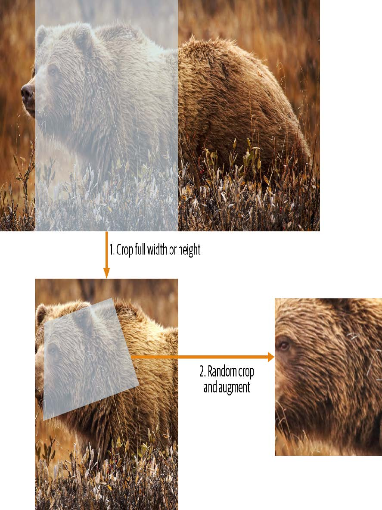

[^图5-1]: 在训练集上预先调整尺寸

这张图展示了两个步骤：

1. 裁剪完整宽度或高度：该操作位于 `item_tfms` 中，因此在图像复制到GPU前会应用于每张图像。此步骤用于确保所有图像尺寸一致。在训练集上，裁剪区域随机选择；在验证集上，始终选择图像的中心正方形区域。
2. 随机裁剪与数据增强：该操作位于 `batch_tfms` 中，因此在GPU上对整个批次批量处理，效率极高。在验证集上，此处仅执行调整至模型所需最终尺寸的操作。而在训练集上，则优先执行随机裁剪及其他增强操作。

要在fastai中实现此流程，需将 `Resize` 作为项目转换使用较大尺寸，并将`RandomResizedCrop` 作为批量转换使用较小尺寸。若在 `aug_transforms` 函数中包含`min_scale` 参数（如前文 `DataBlock` 调用所示），系统将自动添加 `RandomResizedCrop` 。你也可在初始 `Resize` 操作中使用 `pad` 或 `squish` 替代默认的 `crop` 操作。

图5-2展示了两种图像处理方式的差异：右侧图像经过放大、插值、旋转，再进行二次插值（这是其他所有深度学习库采用的方法）；左侧图像则将放大与旋转作为单一操作处理，仅进行一次插值（fastai方法）。


[^图5-2]: fastai的数据增强策略（左）与传统方法（右）的对比

可以看出右侧图像的清晰度较低，左下角存在反射填充伪影；此外左上角的草丛已完全消失。实践表明，预尺寸处理能显著提升模型精度，同时通常还能加快处理速度。

fastai库还提供了简便的方法，可在训练模型前检查数据状态，这是极其重要的一步。接下来我们将探讨这些方法。

#### 检查和调试数据块

我们永远不能想当然地认为代码运行完美无缺。编写数据块就像绘制蓝图。代码中存在语法错误时，系统会提示报错信息，但无法保证模板能按预期处理数据源。因此在训练模型前，务必始终检查数据。

你可以使用 `show_batch` 方法实现：

```python
dls.show_batch(nrows=1, ncols=3)
```

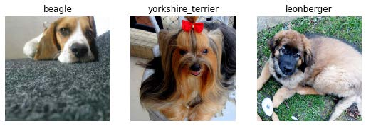

请仔细查看每张图片，确认每张图片的标签是否与该宠物品种相符。数据科学家处理的数据往往不如领域专家熟悉：例如，我其实并不认识其中许多宠物品种。由于我并非宠物品种专家，此时我会使用谷歌图片搜索部分品种，确保图片与输出结果中的样貌相符。

如果在构建数据块时出现错误，你很可能在此步骤之前无法察觉。为了排查此类问题，我们建议你使用 `summary` 方法。该方法将尝试根据你提供的源数据创建批处理任务，并生成大量详细信息。此外，若操作失败，你将精确定位错误发生点，库文件也会尝试提供帮助。例如常见错误是忘记使用 `Resize` 转换，导致图片尺寸不统一而无法批量处理。此类情况下的摘要示例如下（注：具体文本可能随版本更新，但可供参考）：

```python
pets1 = DataBlock(blocks = (ImageBlock, CategoryBlock),
                  get_items=get_image_files,
                  splitter=RandomSplitter(seed=42),
                  get_y=using_attr(RegexLabeller(r'(.+)_\d+.jpg$'),
                                   'name'))
pets1.summary(path/"images")
```

```text
Setting-up type transforms pipelines
Collecting items from /home/sgugger/.fastai/data/oxford-iiit-pet/images
Found 7390 items
2 datasets of sizes 5912,1478
Setting up Pipeline: PILBase.create
Setting up Pipeline: partial -> Categorize
Building one sample
Pipeline: PILBase.create
starting from
/home/sgugger/.fastai/data/oxford-iiitpet/
images/american_bulldog_83.jpg
applying PILBase.create gives
PILImage mode=RGB size=375x500
Pipeline: partial -> Categorize
starting from
/home/sgugger/.fastai/data/oxford-iiitpet/
images/american_bulldog_83.jpg
applying partial gives
american_bulldog
applying Categorize gives
TensorCategory(12)
Final sample: (PILImage mode=RGB size=375x500, TensorCategory(12))
Setting up after_item: Pipeline: ToTensor
Setting up before_batch: Pipeline:
Setting up after_batch: Pipeline: IntToFloatTensor
Building one batch
Applying item_tfms to the first sample:
Pipeline: ToTensor
starting from
(PILImage mode=RGB size=375x500, TensorCategory(12))
applying ToTensor gives
(TensorImage of size 3x500x375, TensorCategory(12))
Adding the next 3 samples
No before_batch transform to apply
Collating items in a batch
Error! It's not possible to collate your items in a batch
Could not collate the 0-th members of your tuples because got the
following
shapes:
torch.Size([3, 500, 375]),torch.Size([3, 375, 500]),torch.Size([3, 333,
500]),
torch.Size([3, 375, 500])
```

你可以清楚地看到我们如何收集数据并进行拆分，如何从文件名转换为样本（元组(image, category)），随后应用了哪些项目转换，以及为何无法将这些样本批量归集（因形状不一致所致）。

当你认为数据看起来正确时，我们通常建议下一步应使用它来训练一个简单模型。我们常看到人们过度拖延实际模型的训练过程，结果导致他们无法了解基准结果的真实表现。或许你的问题根本不需要复杂的领域特定工程处理，又或许数据似乎完全无法训练模型——这些都是你需要尽早确认的关键信息。

在本次初步测试中，我们将沿用第一章中使用的简单模型：

```python
learn = cnn_learner(dls, resnet34, metrics=error_rate)
learn.fine_tune(2)
```

| 迭代轮次 | 训练损失 | 验证损失 | 错误率   | 时间  |
| -------- | -------- | -------- | -------- | ----- |
| 0        | 1.491732 | 0.337355 | 0.108254 | 00:18 |
| 0        | 0.503154 | 0.293404 | 0.096076 | 00:23 |
| 1        | 0.314759 | 0.225316 | 0.066306 | 00:23 |

正如我们之前简要讨论过的，拟合模型时显示的表格展示了每次训练的迭代轮次后的结果。请记住，一个迭代轮次指的是对数据集中所有图像进行一次完整遍历的过程。表格列出的内容包括：训练集样本的平均损失值、验证集的损失值，以及我们请求的任何指标——本例中即错误率。

请记住，损失函数就是我们用来优化模型参数的函数，不管它是什么种类。但我们尚未实际告知fastai应使用哪种损失函数。那么它会怎么做？fastai通常会根据数据类型和模型类型自动选择合适的损失函数。本例中，我们处理的是图像数据且结果为分类变量，因此fastai默认采用 *交叉熵损失* （cross-entropy loss）。

### 交叉熵损失

交叉熵损失是一种损失函数，它与上一章中使用的类似，但（正如我们将看到的）具有两个优势：

- 即使因变量具有超过两个类别时，该方法依然有效。
- 它能实现更快且更可靠的训练过程。

要理解交叉熵损失函数如何处理超过两类的因变量，我们首先需要了解损失函数实际处理的数据和激活函数的具体形态。

#### 查看激活项和标签

让我们来看看模型的激活情况。要从我们的 `DataLoaders` 中获取一批真实数据，我们可以使用 `one_batch` 方法：

```python
x,y = dls.one_batch()
```

如你所见，这将以小批量形式返回因变量和自变量。让我们看看因变量包含哪些内容：

```python
y
```

```text
TensorCategory([11, 0, 0, 5, 20, 4, 22, 31, 23, 10, 20, 2, 3, 27,
18, 23,
> 33, 5, 24, 7, 6, 12, 9, 11, 35, 14, 10, 15, 3, 3, 21, 5, 19,
14, 12,
> 15, 27, 1, 17, 10, 7, 6, 15, 23, 36, 1, 35, 6,
4, 29, 24, 32, 2, 14, 26, 25, 21, 0, 29, 31, 18, 7, 7, 17],
> device='cuda:5')
```

我们的批量大小为64，因此该张量包含64行。每行是一个介于0到36之间的整数，代表37种可能的宠物品种。我们可通过 `Learner.get_preds` 函数查看预测结果（即神经网络最终层的激活值）。该函数接受数据集索引（0表示训练集，1表示验证集）或批次迭代器作为参数。因此，我们只需传递包含批次的简单列表即可获取预测结果。默认情况下该函数会返回预测值和目标值，但由于我们已拥有目标值，可通过将目标值赋给特殊变量 `_ `来忽略目标值：

```python
preds,_ = learn.get_preds(dl=[(x,y)])
preds[0]
```

```text
tensor([7.9069e-04, 6.2350e-05, 3.7607e-05, 2.9260e-06, 1.3032e-05,
2.5760e-05,
> 6.2341e-08, 3.6400e-07, 4.1311e-06, 1.3310e-04, 2.3090e-03, 9.9281e-
01,
> 4.6494e-05, 6.4266e-07, 1.9780e-06, 5.7005e-07,
3.3448e-06, 3.5691e-03, 3.4385e-06, 1.1578e-05, 1.5916e-06,
8.5567e-08,
> 5.0773e-08, 2.2978e-06, 1.4150e-06, 3.5459e-07, 1.4599e-04, 5.6198e-
08,
> 3.4108e-07, 2.0813e-06, 8.0568e-07, 4.3381e-07,
1.0069e-05, 9.1020e-07, 4.8714e-06, 1.2734e-06, 2.4735e-06])
```

实际预测结果是37个介于0和1之间的概率值，它们相加总和为1：

```python
len(preds[0]),preds[0].sum()
```

```text
(37, tensor(1.0000))
```

为了将模型的激活值转换为这样的预测结果，我们使用了一种称为softmax激活函数的算法。

#### Softmax

在我们的分类模型中，我们使用最终层的softmax激活函数，以确保激活值均介于0到1之间，且其总和为1。

Softmax 与我们之前看到的 sigmoid 函数类似。作为回顾，sigmoid 的形式如下：

```python
plot_function(torch.sigmoid, min=-4,max=4)
```

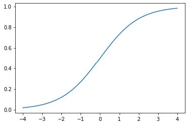

我们可以将此函数应用于神经网络中单列激活值，并得到一列介于0到1之间的数值，因此它作为最终层的激活函数非常实用。

现在考虑一下，如果我们希望在目标中包含更多类别（例如37种宠物品种），会发生什么情况。这意味着我们需要的激活值将不止一列：每个类别都需要一个激活值。例如，我们可以创建一个预测3和7的神经网络，该网络返回两个激活值，每个类别对应一个——这将是构建更通用方法的良好开端。本例中我们使用标准差为2的随机数（即 `randn` 乘以2），假设拥有六张图像和两个可能类别（第一列代表3类，第二列代表7类）：

```python
acts = torch.randn((6,2))*2
acts
```

```text
tensor([[ 0.6734, 0.2576],
	[ 0.4689, 0.4607],
	[-2.2457, -0.3727],
	[ 4.4164, -1.2760],
	[ 0.9233, 0.5347],
	[ 1.0698, 1.6187]])
```

我们不能直接对这个取sigmoid函数，因为我们得到的行和并不等于1（我们希望3的概率加上7的概率之和等于1）：

```python
acts.sigmoid()
```

```text
tensor([[0.6623, 0.5641],
	[0.6151, 0.6132],
	[0.0957, 0.4079],
	[0.9881, 0.2182],
	[0.7157, 0.6306],
	[0.7446, 0.8346]])
```

在第4章中，我们的人工神经网络为每张图像生成单一激活值，并将其传入 `sigmoid` 函数。该激活值代表模型对输入为数字3的置信度。二元问题是分类问题的特例，因为目标可视为单一布尔值——正如我们在 `mnist_loss` 中的处理方式。但二元问题也可置于更普遍的分类器框架下思考——即具有任意数量类别的分类器：本例中恰巧有两个类别。正如熊分类器所示，我们的神经网络将为每个类别返回一个激活值。

那么在二进制情况下，这些激活值究竟代表什么？单对激活值仅表示输入属于3与属于7的相对置信度。整体数值高低并不重要——关键在于哪个值更高，以及两者差距的大小。

我们预期既然这只是同一问题的另一种表述方式，我们应该能够直接对神经网络的双激活版本应用 `sigmoid` 函数。事实确实如此！我们只需计算神经网络激活值之间的差值——这反映了我们对输入是3而非7的置信度差异——然后对该差值进行sigmoid变换：

```python
(acts[:,0]-acts[:,1]).sigmoid()
```

```text
tensor([0.6025, 0.5021, 0.1332, 0.9966, 0.5959, 0.3661])
```

第二列（即出现7的概率）只需用1减去该值即可。现在我们需要一种方法，使其也能处理超过两列的情况。事实证明，这个名为 `softmax` 的函数正是为此而生：

```python
def softmax(x): return exp(x) / exp(x).sum(dim=1, keepdim=True)
```

> 术语：指数函数（EXPONENTIAL FUNCTION，EXP）
>
> 定义为 `e**x`，其中 e 是约等于 2.718 的特殊常数。它是自然对数函数的反函数。请注意 `exp` 函数始终为正且增长极快！

让我们验证 `softmax` 函数对第一列返回的值与 `sigmoid` 函数相同，而对第二列返回的值是从1减去这些值的结果：

```python
sm_acts = torch.softmax(acts, dim=1)
sm_acts
```

```text
tensor([[0.6025, 0.3975],
	[0.5021, 0.4979],
	[0.1332, 0.8668],
	[0.9966, 0.0034],
	[0.5959, 0.4041],
	[0.3661, 0.6339]])
```

`softmax` 是 `sigmoid` 函数在多类别分类中的对应形式——当类别数超过两个且各类别概率之和必须为1时，我们必须使用它；即使只有两个类别，我们也常使用它以保持一致性。我们当然可以设计其他满足所有激活值在0到1之间且总和为1的函数；但没有其他函数能像sigmoid函数那样具有平滑对称的特性。此外，稍后我们将看到softmax函数与下一节要探讨的损失函数配合使用效果极佳。

如果我们有三个输出激活值（例如在熊分类器中），那么对单张熊图像计算softmax的流程大致如图5-3所示。

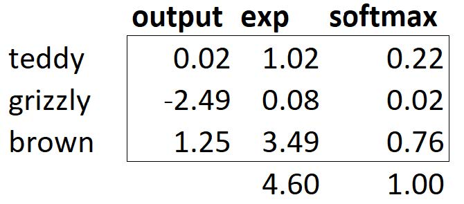

[^图5-3]: 熊分类器中softmax函数的应用示例

这个函数实际起什么作用？它负责取指数确保所有数字均为正值，再除以总和则保证最终得到一组数字之和为1。指数函数还具有一个优越特性：若激活值 `x` 中某项数值略高于其他项，指数运算将放大该差异（因其呈指数级增长），这意味着在softmax计算中，该数值将更接近1。

直观而言，softmax函数 *本质* 上是希望从多个类别中选取一个，因此当我们知道每张图片都有明确标签时，它非常适合训练分类器。（需注意在推理阶段可能不太理想，因为你可能希望模型有时能告知其未识别出训练期间见过的任何类别，而非因激活分数略高就选取某个类别。这种情况下，使用多个二元输出列训练模型可能更合适，每个列都采用sigmoid激活函数。）

Softmax 是交叉熵损失的第一部分——第二部分是对数似然（log likelihood）。

#### 对数似然

在上一章计算MNIST示例的损失时，我们使用了以下公式：

```python
def mnist_loss(inputs, targets):
    inputs = inputs.sigmoid()
    return torch.where(targets==1, 1-inputs, inputs).mean()
```

正如我们从sigmoid函数转向softmax函数一样，我们需要扩展损失函数以支持二元分类之外的任务——它必须能够对任意数量的类别进行分类（本例中共有37个类别）。经过softmax处理后的激活值介于0到1之间，且在预测批次中每行的总和为1。目标值为0至36之间的整数。

在二元分类中，我们使用 `torch.where` 在 `inputs` 与 `1 - inputs` 间进行筛选。当我们将二元分类视为具有两个类别的一般分类问题时，处理起来会更简单——因为（如前面所述）此时我们拥有两列数据，分别对应 `inputs` 与 `1 - inputs` 。因此只需从对应的列中进行筛选即可。让我们尝试在 PyTorch 中实现这一方案。以合成数据中的 3 和 7 为例，假设标签如下：

```python
targ = tensor([0,1,0,1,1,0])
```

以下是softmax激活函数的输出：

```python
sm_acts
```

```text
tensor([[0.6025, 0.3975],
	[0.5021, 0.4979],
	[0.1332, 0.8668],
	[0.9966, 0.0034],
	[0.5959, 0.4041],
	[0.3661, 0.6339]])
```

然后对于每个 `targ` 项，我们可以使用张量索引选择 `sm_acts` 中相应的列，如下所示：

```python
idx = range(6)
sm_acts[idx, targ]
```

```text
tensor([0.6025, 0.4979, 0.1332, 0.0034, 0.4041, 0.3661])
```

要准确了解这里的情况，我们得将所有列整合到一张表格中。其中前两列是我们的激活值，接着是目标值、行索引，最后是前文代码中显示的结果：

| 3        | 7          | targ | idx  | 损失       |
| -------- | ---------- | ---- | ---- | ---------- |
| 0.602469 | 0.397531   | 0    | 0    | 0.602469   |
| 0.502065 | 0.497935   | 1    | 1    | 0.497935   |
| 0.133188 | 0.866811   | 0    | 2    | 0.133188   |
| 0.99664  | 0.00336017 | 1    | 3    | 0.00336017 |
| 0.595949 | 0.404051   | 1    | 4    | 0.404051   |
| 0.366118 | 0.633882   | 0    | 5    | 0.366118   |

观察此表可知，最后一列可通过将 `targ` 和 `idx` 列作为索引，插入包含3列和7列的双列矩阵来计算。这正是 `sm_acts[idx, targ]` 所实现的功能。

真正有趣的是，这种方法在超过两列时同样有效。试想：若为每个数字（0至9）添加激活列，且 `targ` 包含0至9的数值，只要激活列之和为1（使用softmax时必然满足），我们就能获得一个损失函数，清晰展示对每个数字的预测精度。

我们仅从包含正确标签的列中选择损失值。无需考虑其他列，因为根据softmax的定义，它们的总和等于1减去对应正确标签的激活值。因此，使正确标签的激活值尽可能高，必然意味着我们也在降低其余列的激活值。

PyTorch提供了一个与 `sm_acts[range(n), targ]` 完全相同的功能（只是取了负值，因为后续应用对数运算时会得到负数），该函数名为 `nll_loss` （NLL代表负对数似然（negative log likelihood））：

```python
-sm_acts[idx, targ]
```

```text
tensor([-0.6025, -0.4979, -0.1332, -0.0034, -0.4041, -0.3661])
```

```python
F.nll_loss(sm_acts, targ, reduction='none')
```

```text
tensor([-0.6025, -0.4979, -0.1332, -0.0034, -0.4041, -0.3661])
```

尽管名称如此，这个 PyTorch 函数并不取对数。我们将在下一节中探讨原因，但首先，让我们看看取对数为何有用。

#### 取对数

上一节中我们看到的函数作为损失函数表现相当不错，但我们可以进一步优化它。问题在于我们使用的是概率值，而概率值不能小于0或大于1。这意味着模型不会区分预测结果是0.99还是0.999——虽然两者非常接近，但从另一个角度看，0.999的置信度是0.99的十倍。因此，我们需要将0到1之间的数值转换为负无穷到正无穷之间的数值。数学中恰好存在实现此功能的函数：对数函数（`torch.log` 可直接调用）。该函数对小于0的数值未定义，其形式如下：

```python
plot_function(torch.log, min=0,max=4)
```

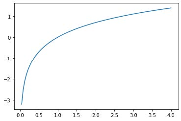

“对数”这个词是否让你联想到什么？对数函数具有以下恒等式：

```python
y = b**a
a = log(y,b)
```

在此情况下，我们假设 `log(y,b)` 返回以 b 为底的 y 的对数。然而，PyTorch 并未如此定义 `log`：Python 中的 `log` 使用特殊常数 e（2.718…）作为底数。

或许对你而言，你可能20多年没有接触过对数这个概念了。但它却是深度学习中诸多领域至关重要的数学思想，此刻正是重温其精髓的绝佳时机。理解对数的核心在于把握以下关系：

```python
log(a*b) = log(a)+log(b)
```

当我们看到这种格式时，它看起来有些枯燥，但请思考其真正含义。这意味着当基础信号呈指数增长或乘法增长时，对数值会线性增加。例如，这种特性被应用于地震强度的里氏震级和噪音水平的分贝标度。在金融图表中也常采用这种方式，以便更清晰地展示复合增长率。计算机科学家钟爱对数运算，因为它能将可能产生极大或极小数值的修饰操作，转化为加法运算——后者极少会导致计算机难以处理的量级变化。

> SYLVAIN说
>
> 不仅计算机科学家热爱对数！在计算机出现之前，工程师和科学家使用一种名为计算尺（slide rule）的特殊量具，通过累加对数来实现乘法运算。对数在物理学中被广泛应用于处理极大或极小数值的乘法运算，并在众多其他领域发挥着重要作用。

对概率值取正数或负数的对数均值（取决于该概率对应的是正确类别还是错误类别），即可得到负对数似然损失（negative log likelihood loss）。在PyTorch中，`nll_loss` 假设你已经对softmax结果取了对数，因此它不会为你执行对数运算。

> 名称易混淆，请多加留意
>
> `nll_loss` 中的“nll”代表“负对数似然”，但它实际上根本不进行取对数操作！它假设你已经完成了对数运算。PyTorch 提供了一个名为 `log_softmax` 的函数，该函数以快速且精确的方式结合了对数运算和软最大化。`nll_loss` 的设计意图是在 `log_softmax` 之后使用。

当我们先计算softmax，再取其对数似然值时，这种组合被称为交叉熵损失。在PyTorch中，该功能通过 `nn.CrossEntropyLoss` 实现（实际实现中会先执行 `log_softmax` 再计算 `nll_loss` ）：

```python
loss_func = nn.CrossEntropyLoss()
```

如你所见，这是一个类。实例化它会得到一个行为类似于函数的对象：

```python
loss_func(acts, targ)
```

```text
tensor(1.8045)
```

所有 PyTorch 损失函数均提供两种形式：刚刚展示的类形式，以及可在 `F` 命名空间中使用的纯函数形式：

```python
F.cross_entropy(acts, targ)
```

```text
tensor(1.8045)
```

两种方式都可行，可在任何场景下使用。我们注意到大多数人倾向于使用类版本，且PyTorch官方文档和示例中也更常采用这种方式，因此我们也将主要使用该版本。

默认情况下，PyTorch 损失函数会计算所有元素损失的平均值。你可以使用 `reduction=‘none’` 来禁用该行为：

```python
nn.CrossEntropyLoss(reduction='none')(acts, targ)
```

```text
tensor([0.5067, 0.6973, 2.0160, 5.6958, 0.9062, 1.0048])
```

> SYLVAIN说
>
> 当我们考察交叉熵损失的梯度时，会发现一个有趣的特性。`cross_entropy(a,b)` 的梯度为 `softmax(a)-b` 。由于 `softmax(a)` 是模型的最终激活值，这意味着梯度与预测值和目标值之间的差异成正比。这与回归中的均方误差（假设没有像 `y_range` 添加的最终激活函数）完全一致，因为 `(a-b)**2` 的梯度为 `2*(a-b)` 。由于梯度呈线性变化，我们不会观察到梯度的突变或指数增长，这将使模型训练过程更为平滑。

我们现在已经看清了损失函数背后隐藏的所有要素。但尽管它能为模型表现的优劣赋予具体数值，却无法帮助我们判断模型是否真正有效。接下来让我们探讨几种解读模型预测结果的方法。

### 解释模型

损失函数很难直接解读，因为它们的设计初衷是让计算机能够进行梯度计算和优化，而非供人类理解。正因如此我们才需要评估指标——这些指标虽不参与优化过程，却能帮助我们这些人类理解模型运作机制。当前我们的准确率表现相当不错！那么问题出在哪里呢？

我们在第1章中看到，我们可以使用混淆矩阵来观察模型表现优异和表现欠佳的领域：

```python
interp = ClassificationInterpretation.from_learner(learn)
interp.plot_confusion_matrix(figsize=(12,12), dpi=60)
```

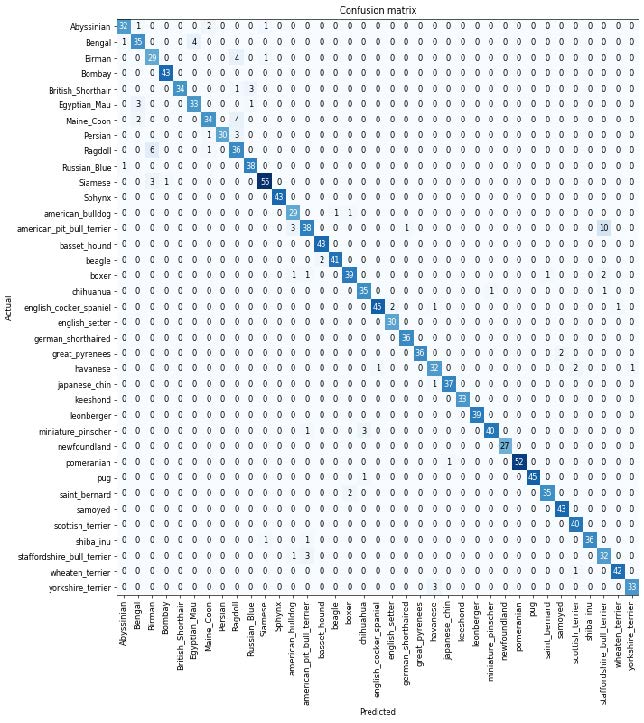

哎呀——这种情况下，混淆矩阵实在难以阅读。我们有37种宠物品种，意味着这个巨型矩阵里竟有37×37个条目！不妨改用`most_confused`方法，它会直接展示混淆矩阵中预测错误率最高的单元格（此处指错误率至少达到5%及以上的单元格）：

```python
interp.most_confused(min_val=5)
```

```text
[('american_pit_bull_terrier', 'staffordshire_bull_terrier', 10),
('Ragdoll', 'Birman', 6)]
```

由于我们并非宠物品种专家，很难判断这些分类错误是否反映了识别品种的实际困难。因此我们再次求助谷歌。简单搜索后发现，此处展示的常见分类错误往往涉及连专业育种者都存在分歧的品种差异。这让我们确信自己正走在正确的道路上。

我们似乎已经有了一个良好的基础。现在我们能做些什么来让它变得更好呢？

### 改进我们的模型

接下来我们将探讨一系列技术手段，以提升模型训练效果并优化其性能。在此过程中，我们将进一步阐释迁移学习的原理，并说明如何在最大程度避免破坏预训练权重的前提下，对预训练模型进行最优的微调。

训练模型时首先需要设置的是学习率。我们在上一章中了解到，学习率需要恰到好处才能实现最高效的训练，那么如何选择合适的值呢？fastai为此提供了一个工具。

#### 学习率探索器

在训练模型时，我们最关键的任务之一就是确保学习率设置得当。若学习率过低，模型训练可能需要耗费大量迭代周期。这不仅浪费时间，还可能导致过拟合问题——因为每次完整遍历数据集时，模型都有机会将数据内容记忆下来。

那我们就把学习率调得超高吧？行，试试看会怎样：

```python
learn = cnn_learner(dls, resnet34, metrics=error_rate)
learn.fine_tune(1, base_lr=0.1)
```

| 迭代轮次 | 训练损失 | 验证损失  | 错误率   | 时间  |
| -------- | -------- | --------- | -------- | ----- |
| 0        | 8.946717 | 47.954632 | 0.893775 | 00:20 |
| 0        | 7.231843 | 4.119265  | 0.954668 | 00:24 |

这情况不太妙。具体过程是这样的：优化器虽然朝着正确方向迈进，但步子迈得太大，完全越过了最小损失点。多次重复这个过程后，结果反而离目标越来越远，而非越来越近！

如何找到完美的学习率——既不过高也不过低？2015年，研究员莱斯利·史密斯（Leslie Smith）提出了一个绝妙方案，即学习率探索器（learning rate
finder.）。其核心思路是：从极小的学习率开始，小到我们完全不必担心它会过大而失控。我们用这个学习率处理一个小批次，观察后续损失值，然后按特定比例（例如每次翻倍）增加学习率。接着处理另一个小批次，追踪损失值，再次将学习率翻倍。持续迭代直至损失值开始恶化而非改善，此时即表明调整过度。此时应选择略低于该点的学习率。我们建议采用以下任一方案：

- 比实现最小损失时的值低一个数量级（即最小值除以10）
- 损失明显下降的最后一个点

学习率查找器会计算曲线上的这些点来协助你。这两条规则通常会得出相近的数值。在第一章中，我们并未指定学习率，而是使用了fastai库的默认值（即1e-3。译者注：就是0.001）：

```python
learn = cnn_learner(dls, resnet34, metrics=error_rate)
lr_min,lr_steep = learn.lr_find()
```

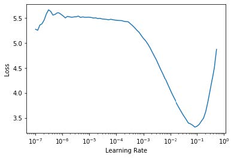

```python
print(f"Minimum/10: {lr_min:.2e}, steepest point: {lr_steep:.2e}")
```

```text
Minimum/10: 8.32e-03, steepest point: 6.31e-03
```

从图中可见，在1e-6至1e-3的范围内，模型几乎没有进展且无法训练。随后损失值开始下降直至达到最小值，之后又再度上升。我们不希望学习率超过1e-1，因为这会导致训练发散（不妨亲自动手验证一下），但1e-1本身已过高：此时我们已脱离损失值持续下降的阶段。

在此学习率图中，学习率约为3e-3似乎较为合适，因此我们选择该值：

```python
learn = cnn_learner(dls, resnet34, metrics=error_rate)
learn.fine_tune(2, base_lr=3e-3)
```

| 迭代轮次 | 训练损失 | 验证损失 | 错误率   | 时间  |
| -------- | -------- | -------- | -------- | ----- |
| 0        | 1.071820 | 0.427476 | 0.133965 | 00:19 |
| 0        | 0.738273 | 0.541828 | 0.150880 | 00:24 |
| 1        | 0.401544 | 0.266623 | 0.081867 | 00:24 |

> 对数标尺（LOGARITHMIC SCALE）
>
> 学习率查找图采用对数刻度，因此1e-3与1e-2之间的中点位于3e-3至4e-3之间。这是因为我们主要关注学习率的数量级。

有趣的是，学习率优化算法直到2015年才被发现，而神经网络自1950年代起便已开始研发。在此漫长历程中，寻找合适的学习率或许始终是从业者面临最重要且最具挑战性的难题。该解决方案无需任何高深数学、巨型计算资源、海量数据集，或任何可能阻碍好奇研究者接触的技术门槛。更值得注意的是，史密斯并非硅谷精英实验室成员，而是一名海军研究员。这一切都在说明：深度学习领域的突破性工作，完全不需要依赖庞大资源、精英团队或尖端数学理念。仍有大量工作亟待完成，所需的不过是些许常识、创造力与坚韧不拔的精神。

既然我们已经获得了适合训练模型的良好学习率，接下来让我们探讨如何对预训练模型的权重进行微调。

#### 解冻与迁移学习

我们在第一章中简要讨论了迁移学习的工作原理。我们看到其基本思路是：将预训练模型（可能基于数百万数据点训练，例如ImageNet）针对另一项任务进行微调。但这究竟意味着什么？

我们现在知道卷积神经网络由多个线性层组成，每两层之间都连接一个非线性激活函数，最后接一个或多个最终线性层，末端使用软最大似然等激活函数。最终线性层采用具有足够列数的矩阵，使得输出尺寸与模型中的类别数相同（假设我们进行的是分类任务）。

在迁移学习场景中进行微调时，这个最终的线性层对我们几乎毫无用处，因为它专为分类原始预训练数据集中的类别而设计。因此进行迁移学习时，我们会移除该层，将其替换为符合目标任务所需输出数量的新线性层（本例中应有37个激活单元）。

这个新添加的线性层将具有完全随机的权重。因此，我们在微调前的模型会产生完全随机的输出。但这并不意味着它是一个完全随机的模型！在最后一个层之前的全部层都经过精心训练，能够胜任一般的图像分类任务。正如我们在第1章 Zeiler 和 Fergus 论文的图像中看到的（参见图1-10至1-13），前几层编码的是通用概念，如检测梯度和边缘；而后续层编码的概念对我们仍有价值，例如识别眼球和毛发。

我们希望以这样的方式训练模型：允许它保留预训练模型中所有通用有用的知识，利用这些知识解决我们的特定任务（分类宠物品种），并仅根据任务具体需求进行必要调整。

在微调过程中，我们的挑战在于替换新增线性层中的随机权重，同时确保这些权重能准确完成目标任务（宠物品种分类），且不破坏精心预训练的权重及其他层。一个简单技巧可实现此目标：指示优化器仅更新随机添加的末端层权重。完全不改变神经网络其余部分的权重。这被称为冻结（freezing）预训练层。

当我们从预训练网络创建模型时，fastai 会自动冻结所有预训练层。当调用 `fine_tune` 方法时，fastai 会执行两项操作：

- 对随机添加的层进行一个迭代轮次的训练，其余所有层保持冻结状态
- 解冻所有层，并按要求训练指定迭代轮次次数

虽然这是合理的默认方法，但针对你自己的特定数据集，稍作调整可能会获得更佳的效果。`fine_tune` 方法提供参数可调整其行为，但若需实现自定义操作，直接调用底层方法或许更为便捷。请注意，你可通过以下语法查看方法的源代码：

```python
learn.fine_tune??
```

那么让我们尝试手动操作。首先，我们将使用 `fit_one_cycle` 对随机添加的层进行三个迭代轮次的训练。正如第一章所述，`fit_one_cycle` 是无需使用 `fine_tune` 训练模型的推荐方法。本书后续章节将阐明其原理；简而言之，`fit_one_cycle` 的作用是：以低学习率启动训练，在训练初期逐步提升学习率，随后在训练后期再次逐步降低学习率：

```python
learn = cnn_learner(dls, resnet34, metrics=error_rate)
learn.fit_one_cycle(3, 3e-3)
```

| 迭代轮次 | 训练损失 | 验证损失 | 错误率   | 时间  |
| -------- | -------- | -------- | -------- | ----- |
| 0        | 1.188042 | 0.355024 | 0.102842 | 00:20 |
| 1        | 0.534234 | 0.302453 | 0.094723 | 00:20 |
| 2        | 0.325031 | 0.222268 | 0.074425 | 00:20 |

然后我们将模型解冻：

```python
learn.unfreeze()
```

然后再次运行 `lr_find`，因为需要训练的层数增加，且权重已训练了三个迭代轮次，这意味着我们先前找到的学习率不再适用：

```python
learn.lr_find()
```

```text
(1.0964782268274575e-05, 1.5848931980144698e-06)
```

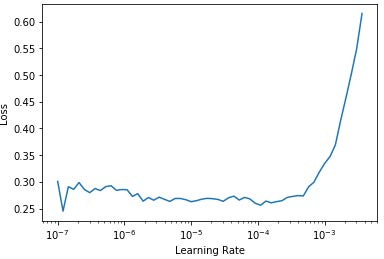

请注意，该图与随机权重时的图略有不同：我们没有看到表明模型正在训练的陡峭下降曲线。这是因为我们的模型已经训练完毕。当前曲线呈现平缓区域后陡然上升，我们应选择陡升前的点位——例如1e-5。最大梯度点在此处并非目标，应予以忽略。

让我们以合适的学习率进行训练：

```python
learn.fit_one_cycle(6, lr_max=1e-5)
```

| 迭代轮次 | 训练损失 | 验证损失 | 错误率   | 时间  |
| -------- | -------- | -------- | -------- | ----- |
| 0        | 0.263579 | 0.217419 | 0.069012 | 00:24 |
| 1        | 0.253060 | 0.210346 | 0.062923 | 00:24 |
| 2        | 0.224340 | 0.207357 | 0.060217 | 00:24 |
| 3        | 0.200195 | 0.207244 | 0.061570 | 00:24 |
| 4        | 0.194269 | 0.200149 | 0.059540 | 00:25 |
| 5        | 0.173164 | 0.202301 | 0.059540 | 00:25 |

这使我们的模型有所改进，但仍有提升空间。预训练模型的最深层可能不需要像最后一层那样高的学习率，因此我们应该为这些层设置不同的学习率——这被称为使用鉴别性学习率（discriminative learning rates）。

#### 鉴别性学习率

即使在解冻后，我们仍然非常重视预训练权重的质量。我们不期望这些预训练参数的最佳学习率能达到随机添加参数的水平——即便我们已对随机添加参数进行了数个迭代轮次的调优。请记住，预训练权重是在数百万张图像上经过数百个迭代轮次的训练才形成的。

此外，你还记得我们在第一章看到的那些图像吗？它们展示了每一层学习的内容。第一层学习的是非常基础的东西，比如边缘检测器和梯度检测器；这些对于几乎任何任务都同样有用。而后续层学习的概念则复杂得多，比如“眼睛”和“日落”——这些概念对你的任务可能毫无用处（比如你在分类汽车型号）。因此让后续层比前层更快地进行微调是合理的。

因此，fastai的默认策略是采用鉴别式学习率。该技术最初在ULMFiT自然语言处理（NLP）迁移学习方法中提出，我们将在第10章详细介绍。如同深度学习中许多优秀理念，其原理极其简单：神经网络早期层采用较低学习率，后期层（尤其是随机添加层）则采用较高学习率。该理念基于 Jason Yosinski 等人的研究洞见，他们在 2014 年指出：在迁移学习中，神经网络的不同层级应以不同速度进行训练（如图 5-4 所示）。

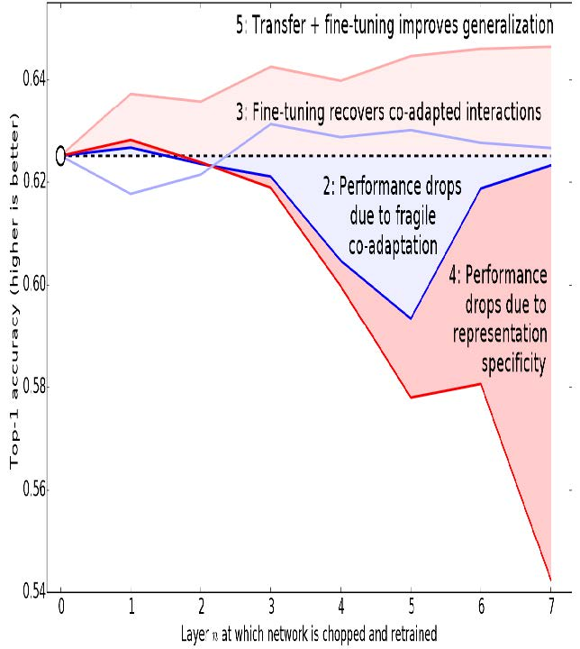

[^图5-4]: 不同层级与训练方法对迁移学习的影响（由Jason Yosinski等人提供）

fastai 允许你在任何需要学习率的地方传递 Python 切片对象。传递的第一个值将作为神经网络最底层的学习率，第二个值则作为顶层的学习率。中间各层的学习率将在该范围内呈乘法等距分布。让我们用这种方法复制之前的训练，但这次只将网络最底层的学习率设为1e-6；其他层将按比例递增至1e-4。训练一段时间后看看会发生什么：

```python
learn = cnn_learner(dls, resnet34, metrics=error_rate)
learn.fit_one_cycle(3, 3e-3)
learn.unfreeze()
learn.fit_one_cycle(12, lr_max=slice(1e-6,1e-4))
```

| 迭代轮次 | 训练损失 | 验证损失 | 错误率   | 时间  |
| -------- | -------- | -------- | -------- | ----- |
| 0        | 1.145300 | 0.345568 | 0.119756 | 00:20 |
| 1        | 0.533986 | 0.251944 | 0.077131 | 00:20 |
| 2        | 0.317696 | 0.208371 | 0.069012 | 00:20 |
| 0        | 0.257977 | 0.205400 | 0.067659 | 00:25 |
| 1        | 0.246763 | 0.205107 | 0.066306 | 00:25 |
| 2        | 0.240595 | 0.193848 | 0.062246 | 00:25 |
| 3        | 0.209988 | 0.198061 | 0.062923 | 00:25 |
| 4        | 0.194756 | 0.193130 | 0.064276 | 00:25 |
| 5        | 0.169985 | 0.187885 | 0.056157 | 00:25 |
| 6        | 0.153205 | 0.186145 | 0.058863 | 00:25 |
| 7        | 0.141480 | 0.185316 | 0.053451 | 00:25 |
| 8        | 0.128564 | 0.180999 | 0.051421 | 00:25 |
| 9        | 0.126941 | 0.186288 | 0.054127 | 00:25 |
| 10       | 0.130064 | 0.181764 | 0.054127 | 00:25 |
| 11       | 0.124281 | 0.181855 | 0.054127 | 00:25 |

现在微调效果非常好！

fastai 可以为我们绘制训练集和验证集损失的图表：

```python
learn.recorder.plot_loss()
```

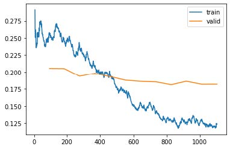

如你所见，训练损失值持续改善。但请注意，验证损失的改善最终会放缓，有时甚至恶化！这正是模型开始过拟合的标志。具体而言，模型对预测结果变得过度自信。但这并不意味着其准确性必然下降。观察每个迭代轮次的训练结果表格，你会发现即使验证损失变差，准确率往往仍在持续提升。最终决定成败的是准确率——或者更普遍地说，是你选择的评估指标，而非损失值。损失值只是我们赋予计算机的优化辅助函数。

在训练模型时，你还需决定训练时长。我们接下来将探讨这个问题。

#### 选择迭代轮次的数量

在选择训练迭代轮次时，你常会发现时间限制比泛化能力和准确率更关键。因此训练的首要策略应是：直接选取能在你可接受等待时间内完成的迭代轮次。随后观察训练集和验证集损失曲线（如前所述），尤其关注评估指标。若发现即使在最后几个迭代轮次中指标仍在持续改善，则说明训练时间并未过长。

另一方面，你可能会发现所选指标在训练结束时确实恶化了。请记住，我们关注的不仅是验证损失变差，更在于实际指标的恶化。训练过程中验证集损失会先恶化，因为模型产生过度自信；随后才会因错误记忆数据而恶化。实践中我们只关注后者。请记住，损失函数只是优化器用于求导优化的工具，并非我们真正关心的目标。

在采用单周期训练之前，人们通常会在每个迭代轮次结束时保存模型，然后从每个迭代轮次保存的所有模型中选择准确率最高的模型。这种方法被称为 *早期停止*（early stopping）。然而这种方法很难获得最佳结果，因为中间阶段的迭代轮次发生在学习率尚未降至极小值之前——而只有在极小值状态下模型才能真正找到最优解。因此若发现模型出现过拟合，应从头开始重新训练，并根据先前最佳结果出现的迭代轮次总数来设定新训练的总迭代轮次。

若你有时间进行更多迭代轮次，不妨将时间用于训练更多参数——即采用更深的网络架构。

#### 更深层的架构

通常而言，参数更多的模型能更精确地拟合数据。（此概括存在诸多例外情况，具体取决于所用架构的细节，但目前仍可作为合理经验法则。） 对于本书将涉及的大多数架构，只需增加更多层即可构建更大版本。但由于我们希望使用预训练模型，必须确保选择的层数已包含预训练内容。

这就是为什么在实践中，架构往往只有少数几种变体。例如，本章使用的ResNet架构有18层、34层、50层、101层和152层等变体，它们都在ImageNet上进行了预训练。更大规模的ResNet版本（更多层数和参数，有时称为模型容量，capacity）总能带来更优的训练损失，但同时更容易出现过拟合问题——因为其拥有更多可能导致过拟合的参数。

通常而言，更大的模型能够更好地捕捉数据中真实的潜在关联，同时也能捕捉并记住单张图像的具体细节。

然而，使用更深的模型将需要更多的GPU内存，因此你可能需要缩小批量大小以避免内存不足错误。这种情况发生在你试图在GPU中塞入过多数据时，表现为如下状态：

```text
Cuda runtime error: out of memory
```

遇到这种情况时，你可能需要重启笔记本。解决方法是使用较小的批量大小，即每次向模型传递更少数量的图像组。你可以在创建 `DataLoaders` 时设置 `bs=` 参数来指定所需的批量大小。

更深架构的另一个缺点是训练时间显著延长。混合精度训练能大幅提升效率——该技术指在训练过程中尽可能使用精度较低的数值（半精度浮点数，half-precision floating point，亦称fp16）。截至2020年初撰写本文时，几乎所有NVIDIA GPU都支持名为张量核心的特殊功能，该功能可将神经网络训练速度提升2-3倍，同时大幅降低GPU内存需求。要在fastai中启用此功能，只需在创建 `Learner` 后添加 `to_fp16()`（同时需导入该模块）。

你无法事先确切知道针对特定问题的最佳架构——你需要尝试训练几种方案。现在就让我们尝试使用混合精度训练ResNet-50：

```python
from fastai2.callback.fp16 import *
learn = cnn_learner(dls, resnet50, metrics=error_rate).to_fp16()
learn.fine_tune(6, freeze_epochs=3)
```

| 迭代轮次 | 训练损失 | 验证损失 | 错误率   | 时间  |
| -------- | -------- | -------- | -------- | ----- |
| 0        | 1.427505 | 0.310554 | 0.098782 | 00:21 |
| 1        | 0.606785 | 0.302325 | 0.094723 | 00:22 |
| 2        | 0.409267 | 0.294803 | 0.091340 | 00:21 |
| 0        | 0.261121 | 0.274507 | 0.083897 | 00:26 |
| 1        | 0.296653 | 0.318649 | 0.084574 | 00:26 |
| 2        | 0.242356 | 0.253677 | 0.069012 | 00:26 |
| 3        | 0.150684 | 0.251438 | 0.065629 | 00:26 |
| 4        | 0.094997 | 0.239772 | 0.064276 | 00:26 |
| 5        | 0.061144 | 0.228082 | 0.054804 | 00:26 |

你会发现我们在此处重新启用了 `fine_tune` ，毕竟它实在太方便了！我们可以传入 `freeze_epochs` 参数，告知fastai在模型冻结期间需要训练多少个迭代轮次。对于大多数数据集，它会自动调整学习率以适应训练需求。

在此情况下，我们并未观察到深度模型具有明显优势。这一点值得牢记——更大规模的模型未必适用于你的具体场景！在开始扩展模型规模前，请务必先尝试小型模型。

### 总结

在本章中，你学习了一些重要的实用技巧，既包括为建模准备图像数据（预处理尺寸、数据块摘要），也涵盖模型拟合过程（学习率搜索器、解冻机制、判别式学习率、设置迭代轮次以及使用更深层的架构）。运用这些工具将帮助你更快地构建更精确的图像模型。

我们还讨论了交叉熵损失。本书这一部分值得花大量时间研读。虽然实践中你可能无需从头实现交叉熵损失，但理解该函数的输入与输出至关重要——因为它（或其变体，如下一章将见）几乎应用于所有分类模型。因此当你需要调试模型、将模型投入生产环境或提升模型准确率时，必须能够分析其激活值和损失函数，理解其运作机制及背后的原因。若不理解损失函数，便无法有效完成这些工作。

如果交叉熵损失函数尚未让你豁然开朗，别担心——你终将领悟！首先，请重温前一章节，确保你真正理解了 `mnist_loss`。接着逐步完成本章笔记本中的单元格，我们将逐项解析交叉熵损失函数的构成。务必理解每项计算的意义及其背后的原理。你可以试试自己创建一些小型张量，并将它们传入函数中，观察函数返回的结果。

请记住：实现交叉熵损失函数时所做的选择并不是唯一可能的方案。正如我们在回归分析中可选择均方误差或均方绝对差（L1）一样，此处的具体实现细节同样可以调整。若您对其他可能有效的函数有想法，欢迎在本章笔记本中尝试！（不过要提前提醒：你可能会发现模型训练速度变慢且准确率下降。这是因为交叉熵损失的梯度与激活值和目标值之间的差异成正比，因此梯度下降算法总能为权重提供精确缩放的步长。）

### 调查问卷

1. 为什么我们先在CPU上调整为较大尺寸，再在GPU上调整为较小尺寸？
2. 若不熟悉正则表达式，请查找相关教程及习题集并完成练习。可参考本书官网的建议资源。
3. 深度学习数据集最常采用的两种数据提供方式是什么？
4. 查阅L函数文档，尝试使用其新增的若干方法。
5. 查阅Python `pathlib` 模块文档，尝试使用 `Path` 类的若干方法。
6. 举例说明图像变换可能导致数据质量下降的两种方式。
7. fastai提供何种方法可查看 `DataLoaders` 中的数据？

8. fastai提供了哪些方法来帮助调试 `DataBlock`？
9. 在彻底清理数据之前，是否应该推迟模型训练？
10. PyTorch中的交叉熵损失由哪两部分组合而成？
11. softmax确保了激活值的哪两个特性？这为何重要？
12. 何种情况下可能需要激活函数不具备这两种特性？
13. 请自行计算图5-3中的 `exp` 和 `softmax` 列数据（可使用电子表格、计算器或笔记本完成）。
14. 为何无法使用 `torch.where` 为标签超过两类的数据集创建损失函数？
15. log(–2) 的值是多少？为什么？
16. 从学习率查找器中选择学习率时，有哪些实用经验法则？
17. `fine_tune` 方法执行哪两个步骤？
18. 在 Jupyter Notebook 中如何获取方法或函数的源代码？
19. 什么是判别性学习率？
20. 当将Python切片对象作为学习率传递给fastai时，如何解释该对象？
21. 为何在单轮训练中采用早期停止策略效果不佳？
22. `resnet50` 与 `resnet101` 有何区别？
23. `to_fp16` 函数的功能是什么？

#### 进一步研究

1. 查找Leslie Smith提出的学习率查找器相关论文，并阅读该论文。
2. 尝试提升本章分类器的准确率。你能达到的最高准确率是多少？查阅论坛和书籍官网，了解其他同学使用该数据集取得的成果及具体方法。

## 6. 其他计算机视觉问题

在上章中，你学习了在实际训练模型时的一些重要实用技巧。选择学习率和迭代轮次等考虑因素对获得良好结果至关重要。

在本章中，我们将探讨另外两种计算机视觉问题：多标签分类与回归。前者出现在需要为每张图像预测多个标签（有时甚至不预测任何标签）的情境下；后者则发生在标签为单个或多个数值——即数量而不是类别——的情况下。

在此过程中，我们将更深入地研究深度学习模型中的输出激活函数、目标函数和损失函数。

### 多标签分类

多标签分类（Multi-label classification）是指识别图像中物体的类别，这些图像可能包含不止一种物体类型。目标类别中可能存在多种物体，也可能完全不存在任何物体。

例如，这种方法对我们的熊分类器来说会非常有效。我们在第二章推出的熊分类器存在一个问题：当用户上传非熊类物体时，模型仍会将其识别为灰熊、黑熊或泰迪熊——它完全无法预测“根本不是熊”。事实上，完成本章学习后，建议你回到图像分类器应用程序，尝试使用多标签技术重新训练模型，然后通过输入不属于任何已识别类别的图像进行测试。

实际上，我们很少见到有人为此目的训练多标签分类器——但我们经常看到用户和开发者都在抱怨这个问题。这个简单解决方案似乎并未被广泛理解或重视！由于实际中存在零匹配或多匹配图像的情况更为常见，我们或许应该预期，在实际应用中多标签分类器比单标签分类器更具广泛适用性。

首先让我们看看多标签数据集是什么样子的；然后我们将说明如何为模型准备数据。你会发现模型的架构与前一章相比没有变化，只有损失函数有所不同。让我们从数据开始。

#### 数据

在本例中，我们将使用PASCAL数据集，该数据集每张图像可能包含多种分类对象。

我们首先按常规步骤下载并解压数据集：

```python
from fastai.vision.all import *
path = untar_data(URLs.PASCAL_2007)
```

该数据集与我们之前见过的不同，它并非按文件名或文件夹进行结构化组织，而是附带一个CSV文件，告知我们每张图像应使用何种标签。我们可以将CSV文件读入Pandas数据框进行检查：

```python
df = pd.read_csv(path/'train.csv')
df.head()
```

| 文件名     | 标签         | 是否已经遍历 |
| ---------- | ------------ | ------------ |
| 000005.jpg | chair        | True         |
| 000007.jpg | car          | True         |
| 000009.jpg | horse person | True         |
| 000012.jpg | car          | False        |
| 000016.jpg | bicycle      | True         |

如你所见，每张图片中的类别列表均以空格分隔的字符串形式呈现。

> pandas和Dataframe
>
> 不，它其实不是熊猫！Pandas 是一个用于处理和分析表格数据及时间序列数据的 Python 库。其核心类是 `DataFrame`，它表示一个由行和列组成的表格。
>
> 你可以从CSV文件、数据库表、Python字典以及许多其他来源获取DataFrame。在Jupyter中，DataFrame会以格式化表格的形式输出，如下所示。
>
> 你可以通过 `iloc` 属性访问 DataFrame 中的行和列，就像操作矩阵一样：
>
> ```python
> df.iloc[:,0]
> ```
>
> ```text
> 0 000005.jpg
> 1 000007.jpg
> 2 000009.jpg
> 3 000012.jpg
> 4 000016.jpg
> ...
> 5006 009954.jpg
> 5007 009955.jpg
> 5008 009958.jpg
> 5009 009959.jpg
> 5010 009961.jpg
> Name: fname, Length: 5011, dtype: object
> ```
>
> ```python
> df.iloc[0,:]
> # Trailing :s are always optional (in numpy, pytorch, pandas, etc.),
> # so this is equivalent:
> df.iloc[0]
> ```
>
> ```text
> fname 000005.jpg
> labels chair
> is_valid True
> Name: 0, dtype: object
> ```
>
> 你还可以通过直接在数据框中进行索引，根据列名获取特定列：
>
> ```python
> df['fname']
> ```
>
> ```text
> 0 000005.jpg
> 1 000007.jpg
> 2 000009.jpg
> 3 000012.jpg
> 4 000016.jpg
> ...
> 5006 009954.jpg
> 5007 009955.jpg
> 5008 009958.jpg
> 5009 009959.jpg
> 5010 009961.jpg
> Name: fname, Length: 5011, dtype: object
> ```
>
> 你可以创建新列并使用列进行计算：
>
> ```python
> df1 = pd.DataFrame()
> df1['a'] = [1,2,3,4]
> df1
> ```
>
> | 序号 | a    |
> | ---- | ---- |
> | 0    | 1    |
> | 1    | 2    |
> | 2    | 3    |
> | 3    | 4    |
>
> ```python
> df1['b'] = [10, 20, 30, 40]
> df1['a'] + df1['b']
> ```
>
> ```text
> 0 11
> 1 22
> 2 33
> 3 44
> dtype: int64
> ```
>
> Pandas 是一个快速且灵活的库，是每位数据科学家 Python 工具箱中的重要组成部分。遗憾的是，其 API 可能令人困惑且出人意料，因此需要一段时间才能熟悉它。若你尚未接触过Pandas，建议先完成入门教程；我们尤其推荐Pandas创始人Wes McKinney所著的 [《Python数据分析》（O'Reilly出版）](http://shop.oreilly.com/product/0636920050896.do) 。该书同时涵盖matplotlib和NumPy等重要库。本文将简要说明实际操作中遇到的Pandas功能，但不会达到McKinney著作的深度。

既然我们已经了解了数据的形态，接下来就让它为模型训练做好准备吧。

#### 构建数据块

如何将 `DataFrame` 对象转换为 `DataLoaders` 对象？我们通常建议在可能的情况下使用数据块API创建 `DataLoaders` 对象，因为它兼具灵活性与简洁性。本文将以该数据集为例，展示实际操作中使用数据块API构建 `DataLoaders` 对象的具体步骤。

正如我们所见，PyTorch 和 fastai 主要通过两种类来表示和访问训练集或验证集：

`Dataset` ：一个返回单个项目独立变量和依赖变量元组的集合

`DataLoader` ：一个迭代器，提供由多个小批量组成的流，其中每个小批量包含一组独立变量批次和一组依赖变量批次。

除此之外，fastai 还提供了两个类，用于将训练集和验证集整合在一起：

`Datasets` ：包含训练数据集和验证数据集的迭代器

`DataLoaders` ：包含训练数据加载器和验证数据加载器的对象

由于 `DataLoader` 是在 `Dataset` 基础上构建的，并为其添加了额外功能（将多个项目合并为小批量），因此通常最简便的做法是先创建并测试 `Datasets` ，待其正常运行后再研究`DataLoaders`。

创建 `DataBlock` 时，我们采取循序渐进的方式，一步步构建，并利用笔记本随时检查数据。这种方法能确保编码过程中保持工作节奏，同时及时发现问题。调试起来也非常轻松——因为一旦出现问题，你立刻就能锁定在刚刚输入的那行代码上！

让我们从最简单的案例开始，即不带任何参数创建的数据块：

```python
dblock = DataBlock()
```

我们可以由此创建一个 `Datasets` 。唯一需要的是数据源——在本例中，就是我们的DataFrame

```python
dsets = dblock.datasets(df)
```

这包含一个 `train` 和一个 `valid` 数据集，我们可以对其进行索引：

```python
dsets.train[0]
```

```text
(fname 008663.jpg
labels car person
is_valid False
Name: 4346, dtype: object,
fname 008663.jpg
labels car person
is_valid False
Name: 4346, dtype: object)
```

如你所见，这只是将DataFrame中的一行数据返回了两次。这是因为默认情况下，数据块假设我们有两部分内容：输入和目标。我们需要从DataFrame中提取相应的字段，这可以通过传递 `get_x` 和 `get_y` 函数来实现：

```python
dblock = DataBlock(get_x = lambda r: r['fname'], get_y = lambda r:
r['labels'])
dsets = dblock.datasets(df)
dsets.train[0]
```

```text
('005620.jpg', 'aeroplane')
```

如你所见，我们并未采用常规方式定义函数，而是使用了Python的 `lambda` 关键字。这只是定义函数并进行引用的快捷方式。以下更冗长的写法效果完全相同：

```python
def get_x(r): return r['fname']
def get_y(r): return r['labels']
dblock = DataBlock(get_x = get_x, get_y = get_y)
dsets = dblock.datasets(df)
dsets.train[0]
```

```text
('002549.jpg', 'tvmonitor')
```

Lambda函数非常适合快速迭代，但它们不支持序列化，因此若需在训练后导出 `Learner` ，建议采用更冗长的实现方式（若仅用于实验则使用Lambda函数即可）。

我们可以看出，自变量需要转换为完整路径才能作为图像打开，而因变量则需要按空格字符拆分（这是Python `split` 函数的默认行为），从而形成一个列表：

```python
def get_x(r): return path/'train'/r['fname']
def get_y(r): return r['labels'].split(' ')
dblock = DataBlock(get_x = get_x, get_y = get_y)
dsets = dblock.datasets(df)
dsets.train[0]
```

```text
(Path('/home/sgugger/.fastai/data/pascal_2007/train/008663.jpg'),
['car', 'person'])
```

要实际打开图像并将其转换为张量，我们需要使用一组变换；块类型将提供这些变换。我们可以使用之前用过的相同块类型，但有一个例外：`ImageBlock` 将再次正常工作，因为我们有一个指向有效图像的路径，但 `CategoryBlock` 将无法工作。问题在于该块返回单个整数，而我们需要为每个元素分配多个标签。为解决此问题，我们采用 `MultiCategoryBlock` 。该类型块期望接收字符串列表（正如当前情况），现在让我们测试效果：

```python
dblock = DataBlock(blocks=(ImageBlock, MultiCategoryBlock),
                   get_x = get_x, get_y = get_y)
dsets = dblock.datasets(df)
dsets.train[0]
```

```text
(PILImage mode=RGB size=500x375,
TensorMultiCategory([0., 0., 0., 0., 0., 0., 0., 0., 0., 0., 0., 1., 0.,
0.,
> 0., 0., 0., 0., 0., 0.]))
```

如你所见，我们的类别列表编码方式与常规的 `CategoryBlock` 不同。在常规情况下，我们使用单个整数表示某个类别是否存在，该整数基于该类别在词汇表中的位置。然而在此处，我们采用了一组0的列表，其中某个类别存在的位置对应1。例如，若第二和第四位置出现1，则表示词汇表中的第2和第4项出现在图像中。这种编码方式称为单热编码。之所以不能直接使用类别索引列表，是因为每个列表的长度会不同，而PyTorch要求张量元素必须具有相同长度。

> 术语：独热编码（ONE-HOT ENCODING）
>
> 使用一个由0组成的向量，在数据中出现的每个位置填入1，以此编码一个整数列表。

让我们检查这个示例中各类别的含义（我们使用了便捷的 `torch.where` 函数，该函数会告诉我们所有满足条件为真或假的索引）：

```python
idxs = torch.where(dsets.train[0][1]==1.)[0]
dsets.train.vocab[idxs]
```

```text
(#1) ['dog']
```

借助 NumPy 数组、PyTorch 张量和 fastai 的 `L` 类，我们可以直接使用列表或向量进行索引，这使得大量代码（如本例所示）变得更加清晰简洁。

迄今为止我们忽略了 `is_valid` 列，这意味着 `DataBlock` 默认采用随机分割。要显式选择验证集元素，我们需要编写函数并将其传递给 `splitter`（或使用fastai的预定义函数/类）。该函数接收输入项（此处为整个DataFrame），必须返回两个（或更多）整数列表：

```python
def splitter(df):
    train = df.index[~df['is_valid']].tolist()
    valid = df.index[df['is_valid']].tolist()
    return train,valid

dblock = DataBlock(blocks=(ImageBlock, MultiCategoryBlock),
                   splitter=splitter,
                   get_x=get_x,
                   get_y=get_y)

dsets = dblock.datasets(df)
dsets.train[0]
```

```text
(PILImage mode=RGB size=500x333,
TensorMultiCategory([0., 0., 0., 0., 0., 0., 1., 0., 0., 0., 0., 0., 0.,
0.,
> 0., 0., 0., 0., 0., 0.]))
```

正如我们所讨论的，`DataLoader` 将 `Dataset` 中的项目整理成一个小批次。这是一个张量元组，其中每个张量简单地堆叠了 `Dataset` 项目中该位置的项目。

既然我们已经确认了单个项目看起来没问题，还有最后一步：我们需要确保能够创建数据加载器，这意味着必须保证每个项目的尺寸一致。为此，我们可以使用`RandomResizedCrop`：

```python
dblock = DataBlock(blocks=(ImageBlock, MultiCategoryBlock),
                   splitter=splitter,
                   get_x=get_x,
                   get_y=get_y,
                   item_tfms = RandomResizedCrop(128, min_scale=0.35))
dls = dblock.dataloaders(df)
```

现在我们可以展示我们的数据样本：

```python
dls.show_batch(nrows=1, ncols=3)
```

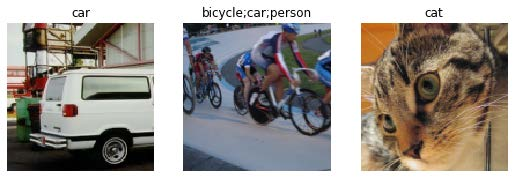

请记住，如果你从 `DataBlock` 创建 `DataLoaders` 时出现任何问题，或想精确查看 `Datablock` 的运行情况，可使用上一章介绍的 `summary` 方法。

我们的数据现已准备就绪，可用于训练模型。正如我们将看到的，当创建 `Learner` 时，表面上一切保持不变，但fastai库会在后台为我们选择新的损失函数：二元交叉熵（binary cross entropy）。

#### 二元交叉熵

现在我们将创建 `Learner` 。我们在第4章中了解到， `Learner` 对象包含四个主要部分：模型、 `DataLoaders` 对象、 `Optimizer` 以及要使用的损失函数。我们已具备 `DataLoaders` ，可利用fastai的 `ResNet` 模型（后续将学习从零创建），也掌握了创建 `SGD` 优化器的方法。因此重点在于确保选择合适的损失函数。为此，我们将使用 `cnn_learner` 创建学习器，以便观察其激活过程：

```python
learn = cnn_learner(dls, resnet18)
```

我们还看到，`Learner` 中的模型通常是继承自 `nn.Module` 类的对象，我们可以使用括号调用它，它将返回模型的激活值。你需要将独立变量作为小批量传递给它。我们可以从 `DataLoader` 中获取一个小批量，然后将其传递给模型来尝试：

```python
x,y = dls.train.one_batch()
activs = learn.model(x)
activs.shape
```

```text
torch.Size([64, 20])
```

想想激活函数为何呈现这种形态——我们采用64的批量大小，需要计算20个类别各自的概率。以下是其中一个激活值的具体形态：

```python
activs[0]
```

```text
tensor([ 2.0258, -1.3543, 1.4640, 1.7754, -1.2820, -5.8053, 3.6130,
0.7193,
> -4.3683, -2.5001, -2.8373, -1.8037, 2.0122, 0.6189, 1.9729,
0.8999,
> -2.6769, -0.3829, 1.2212, 1.6073],
device='cuda:0', grad_fn=<SelectBackward>)
```

> 获取模型激活值
>
> 掌握手动获取小批量数据并将其传递给模型的方法，同时观察激活值和损失值，对调试模型至关重要。这种方法对学习也大有裨益，能让你清晰洞察模型的运行机制。

它们尚未缩放至0到1之间，但我们在第4章中学习了如何使用 `sigmoid` 函数实现这一操作。我们还了解了如何基于此计算损失——这是第4章中的损失函数，并如前一章所述添加了对数运算：

```python
def binary_cross_entropy(inputs, targets):
    inputs = inputs.sigmoid()
    return -torch.where(targets==1, inputs, 1-inputs).log().mean()
```

请注意，由于我们的因变量采用独热编码，因此无法直接使用 `nll_loss` 或 `softmax`（因此也不能使用 `cross_entropy`）：

- 正如我们所见，`softmax` 要求所有预测值之和为1，且倾向于将某一激活值推高至远超其他值（因使用了 `exp` 函数）；然而，图像中可能存在多个我们确信存在的物体，因此将激活值总和限制为1并非明智之举。基于相同逻辑，若认为图像中不存在任何类别，我们可能希望总和小于1。

- 正如我们所见，`nll_loss` 仅返回单个激活值：即与单个标签对应的激活值。当存在多个标签时，这种设计便失去意义。

另一方面，`binary_cross_entropy` 函数（它只是将 `mnist_loss` 与 `log` 结合使用）恰好满足我们的需求，这得益于PyTorch元素级运算的魔力。该函数会逐列将每个激活值与每个目标值进行比较，因此我们无需额外操作即可实现多列计算功能。

> JEREMY说
>
> 使用PyTorch这类支持广播和元素级运算的库时，我特别欣赏的一点是：经常能编写出无需修改就能同时适用于单个元素和批量元素的代码。`binary_cross_entropy` 就是绝佳范例。借助这些运算特性，我们无需手动编写循环，PyTorch会根据张量的秩自动完成必要的迭代处理。

PyTorch已经为我们提供了这个功能。事实上，它提供了多种版本，名称却相当令人困惑！

`F.binary_cross_entropy` 及其模块等效函数 `nn.BCELoss` 会对单热编码的目标计算交叉熵，但不包含初始的 `sigmoid` 函数。通常针对独热编码目标，应使用 `F.binary_cross_entropy_with_logits`（或 `nn.BCEWithLogitsLoss` ），该函数同时包含sigmoid映射与二元交叉熵计算，如前例所示。

对于单标签数据集（如MNIST或宠物数据集），其中目标以单个整数编码的情况，对应的损失函数为：`F.nll_loss` 或 `nn.NLLLoss`（适用于不带初始softmax的版本）`F.cross_entropy` 或 `nn.CrossEntropyLoss`（适用于带初始softmax的版本）

由于目标采用独热编码，我们将使用 `BCEWithLogitsLoss`：

```python
loss_func = nn.BCEWithLogitsLoss()
loss = loss_func(activs, y)
loss
```

```text
tensor(1.0082, device='cuda:5', grad_fn=
<BinaryCrossEntropyWithLogitsBackward>)
```

我们无需告知fastai使用此损失函数（尽管需要时可以指定），因为它会自动为我们选择。fastai知道 `DataLoaders` 包含多个类别标签，因此默认会使用`nn.BCEWithLogitsLoss`。与前一章相比，我们使用的度量标准有所变化：由于这是多标签问题，我们不能使用准确率函数。为什么呢？因为准确率是通过以下方式将我们的输出与目标进行比较的：

```python
def accuracy(inp, targ, axis=-1):
    "Compute accuracy with `targ` when `pred` is bs * n_classes"
    pred = inp.argmax(dim=axis)
    return (pred == targ).float().mean()
```

预测的类别是激活值最高的那个（这就是 `argmax` 的作用）。但这里无法奏效，因为单张图像可能存在多个预测结果。对激活值应用sigmoid函数（使其介于0和1之间）后，我们需要通过设定阈值来决定哪些值为0、哪些值为1。每个大于阈值的值将被视为1，每个小于阈值的值将被视为0：

```python
def accuracy_multi(inp, targ, thresh=0.5, sigmoid=True):
    "Compute accuracy when `inp` and `targ` are the same size."
    if sigmoid: inp = inp.sigmoid()
    return ((inp>thresh)==targ.bool()).float().mean()
```

如果直接将 `accuracy_multi` 作为指标传递，它将使用 `threhold` 的默认值 0.5。我们可能需要调整该默认值，并创建一个具有不同默认值的新版本 `accuracy_multi` 。为此，Python 提供了一个名为 `partial` 的函数。它允许我们将函数与某些参数或关键字参数绑定，从而创建该函数的新版本——每次调用时都会自动包含这些参数。例如，以下是一个接受两个参数的简单函数：

```python
def say_hello(name, say_what="Hello"): return f"{say_what} {name}."
say_hello('Jeremy'),say_hello('Jeremy', 'Ahoy!')
```

```text
('Hello Jeremy.', 'Ahoy! Jeremy.')
```

我们可以使用 `partial` 切换到该函数的法语版本：

```python
f = partial(say_hello, say_what="Bonjour")
f("Jeremy"),f("Sylvain")
```

```text
('Bonjour Jeremy.', 'Bonjour Sylvain.')
```

现在我们可以训练模型了。让我们尝试将准确率阈值设为0.2作为评估指标：

```python
learn = cnn_learner(dls, resnet50, metrics=partial(accuracy_multi,
thresh=0.2))
learn.fine_tune(3, base_lr=3e-3, freeze_epochs=4)
```

| 迭代轮次 | 训练损失 | 验证损失 | 精度倍数 | 时间  |
| -------- | -------- | -------- | -------- | ----- |
| 0        | 0.903610 | 0.659728 | 0.263068 | 00:07 |
| 1        | 0.724266 | 0.346332 | 0.525458 | 00:07 |
| 2        | 0.415597 | 0.125662 | 0.937590 | 00:07 |
| 3        | 0.254987 | 0.116880 | 0.945418 | 00:07 |
| 0        | 0.123872 | 0.132634 | 0.940179 | 00:08 |
| 1        | 0.112387 | 0.113758 | 0.949343 | 00:08 |
| 2        | 0.092151 | 0.104368 | 0.951195 | 00:08 |

选择阈值至关重要。若阈值设定过低，往往会遗漏正确标注的对象。我们可通过修改评估指标并调用 `validate` 函数来验证此现象，该函数将返回验证损失与评估指标：

```python
learn.metrics = partial(accuracy_multi, thresh=0.1)
learn.validate()
```

```text
(#2) [0.10436797887086868,0.93057781457901]
```

若选择的阈值过高，你将仅筛选出模型高度确信的对象：

```python
learn.metrics = partial(accuracy_multi, thresh=0.99)
learn.validate()
```

```text
(#2) [0.10436797887086868,0.9416930675506592]
```

通过尝试几个阈值并观察效果，我们可以找到最佳阈值。如果只获取一次预测结果，这个过程会快得多：

```python
preds,targs = learn.get_preds()
```

然后我们可以直接调用度量函数。请注意，默认情况下 `get_preds` 会为我们应用输出激活函数（本例中为sigmoid），因此我们需要告知 `accuracy_multi` 不要应用该函数：

```python
accuracy_multi(preds, targs, thresh=0.9, sigmoid=False)
```

```text
TensorMultiCategory(0.9554)
```

现在我们可以使用这种方法来确定最佳阈值水平：

```python
xs = torch.linspace(0.05,0.95,29)
accs = [accuracy_multi(preds, targs, thresh=i, sigmoid=False) for i in
xs]
plt.plot(xs,accs);
```

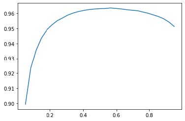

在此情况下，我们利用验证集来选择超参数（阈值），这正是验证集的用途。有时学生会担心我们可能对验证集 *过拟合* ，因为我们尝试了大量值来寻找最佳方案。然而，如图所示，在此情况下调整阈值会得到平滑曲线，这表明我们显然没有选取不恰当的异常值。这恰恰说明理论（避免频繁调整超参数以免过拟合）与实践（若拟合关系平滑则可接受）之间存在差异，需谨慎区分。

本章关于多标签分类的内容到此结束。接下来，我们将探讨回归问题。

### 回归

人们很容易将深度学习模型归类到特定领域，例如计算机视觉、自然语言处理等等。事实上，fastai正是这样划分其应用场景的——很大程度上是因为大多数人习惯于这种思维方式。

但实际上，这掩盖了一个更有趣且更深层的视角。模型是由其自变量、因变量以及损失函数共同定义的。这意味着模型类型远比简单的基于域的划分要丰富得多。或许我们拥有图像作为自变量，文本作为因变量（例如根据图像生成标题）；又或许我们拥有文本作为自变量，图像作为因变量（例如根据标题生成图像——这在深度学习中完全可行！）；又或者我们同时拥有图像、文本和表格数据作为自变量，试图预测产品购买行为……可能性确实无穷无尽。

要突破固定应用的局限，为新问题打造创新解决方案，深入理解数据块API（以及可能涉及的中间层API——本书后续章节将介绍）至关重要。以图像回归问题为例：该问题指从数据集中进行学习，其中独立变量为图像，而因变量为一个或多个浮点数。人们常将图像回归视为独立应用——但正如你将在此处所见，我们完全可将其视为数据块API之上的又一个卷积神经网络。

我们将直接跳入图像回归的一个稍显复杂的变体，因为我们知道你已经准备好了！我们将构建关键点模型。关键点指图像中特定位置的标记——本次实验将使用人像图像，目标是定位每张图像中人物面部的中心点。这意味着我们需要为每张图像预测两个数值：面部中心点的行号与列号。

#### 数据整合

本节我们将使用 [Biwi Kinect头部姿势数据集](https://oreil.ly/-4cO-) 。首先按常规方式下载数据集：

```python
path = untar_data(URLs.BIWI_HEAD_POSE)
```

让我们看看我们有什么吧！

```python
path.ls()
```

```text
(#50)
[Path('13.obj'),Path('07.obj'),Path('06.obj'),Path('13'),Path('10'),Path('
> 02'),Path('11'),Path('01'),Path('20.obj'),Path('17')...]
```

共有24个目录，编号从01到24（对应不同被摄者），每个目录下都有对应的 `.obj` 文件（此处无需使用）。让我们查看其中一个目录的内容：

```python
(path/'01').ls()
```

```text
(#1000)
[Path('01/frame_00281_pose.txt'),Path('01/frame_00078_pose.txt'),Path('0
>
1/frame_00349_rgb.jpg'),Path('01/frame_00304_pose.txt'),Path('01/frame_00207_
>
pose.txt'),Path('01/frame_00116_rgb.jpg'),Path('01/frame_00084_rgb.jpg'),Path
>
('01/frame_00070_rgb.jpg'),Path('01/frame_00125_pose.txt'),Path('01/frame_003
> 24_rgb.jpg')...]
```

在子目录中，我们存放着不同的帧数据。每帧都包含一张图像文件（ `_rgb.jpg`）和一个姿势文件（ `_pose.txt` ）。我们可以使用 `get_image_files` 函数递归获取所有图像文件，然后编写一个函数将图像文件名转换为对应的姿势文件：

```python
img_files = get_image_files(path)
def img2pose(x): return Path(f'{str(x)[:-7]}pose.txt')
img2pose(img_files[0])
```

```text
Path('13/frame_00349_pose.txt')
```

让我们来看看第一张图片：

```python
im = PILImage.create(img_files[0])
im.shape
```

```text
(480, 640)
```

```python
im.to_thumb(160)
```


[Biwi数据集网站](https://oreil.ly/wHL28) 曾用于说明与每张图像关联的姿势文本文件格式，该文件标注了头部中心点的位置。具体细节对我们的目的而言并不重要，因此我们仅展示用于提取头部中心点的函数：

```python
cal = np.genfromtxt(path/'01'/'rgb.cal', skip_footer=6)
def get_ctr(f):
    ctr = np.genfromtxt(img2pose(f), skip_header=3)
    c1 = ctr[0] * cal[0][0]/ctr[2] + cal[0][2]
    c2 = ctr[1] * cal[1][1]/ctr[2] + cal[1][2]
    return tensor([c1,c2])
```

该函数返回坐标作为包含两个元素的张量：

```python
get_ctr(img_files[0])
```

```text
tensor([384.6370, 259.4787])
```

我们可以将此函数作为 `get_y` 传递给 `DataBlock`，因为它负责为每个项目打标签。我们将把图像尺寸缩小至输入尺寸的一半，以稍微加快训练速度。

需要注意的一点是，我们不应随意使用随机分割器。该数据集中同一批人会出现在多张图像中，但我们需要确保模型能够泛化到尚未见过的个体。数据集中的每个文件夹都包含某位个人的图像。因此，我们可以创建一个分割函数，当仅包含单个人时返回 `True` ，从而生成仅包含该人图像的验证集。

与之前数据块示例的唯一区别在于，第二个数据块是 `PointBlock` 。此设计旨在告知fastai标签代表坐标信息，从而使其在执行数据增强时，能对坐标数据应用与图像相同的增强操作：

```python
biwi = DataBlock(
    blocks=(ImageBlock, PointBlock),
    get_items=get_image_files,
    get_y=get_ctr,
    splitter=FuncSplitter(lambda o: o.parent.name=='13'),
    batch_tfms=[*aug_transforms(size=(240,320)),
                Normalize.from_stats(*imagenet_stats)]
)
```

> 点与数据增强
>
> 我们尚未发现其他库（fastai除外）能够自动且正确地对坐标数据应用增强技术。因此，若你使用其他库处理此类问题，可能需要禁用数据增强功能。

在进行任何建模之前，我们应该先检查数据以确认其看起来正常：

```python
dls = biwi.dataloaders(path)
dls.show_batch(max_n=9, figsize=(8,6))
```

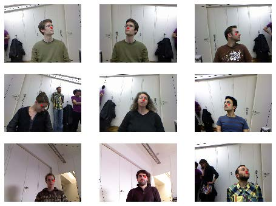

看起来不错！除了直观检查批次数据外，建议同时查看底层张量（尤其对学生而言，这有助于理清模型实际处理的内容）：

```python
xb,yb = dls.one_batch()
xb.shape,yb.shape
```

```python
(torch.Size([64, 3, 240, 320]), torch.Size([64, 1, 2]))
```

请确保你理解为何这些形状适用于我们的肖批次。

以下是因变量中一行数据的示例：

```python
yb[0]
```

```python
tensor([[0.0111, 0.1810]], device='cuda:5')
```

如你所见，我们无需使用独立的图像回归应用程序；我们只需标注数据，并告知fastai自变量和因变量分别代表何种数据类型。

创建我们的 `Learner` 对象也是同样的道理。我们将使用之前相同的函数，添加一个新参数，然后就能准备训练模型了。

#### 训练模型

照例，我们可以使用 `cnn_learner` 来创建我们的 `Learner`。还记得在第 1 章中，我们如何使用 `y_range` 告诉 fastai 目标值的范围吗？这里我们也将采用相同的做法（fastai 和 PyTorch 中的坐标始终会被重新缩放至 -1 到 +1 之间）：

```python
learn = cnn_learner(dls, resnet18, y_range=(-1,1))
```

`y_range` 在 fastai 中通过 `sigmoid_range` 实现，其定义如下：

```python
def sigmoid_range(x, lo, hi): return torch.sigmoid(x) * (hi-lo) + lo
```

如果定义了 `y_range`，则此处设置为模型的最终层。请花点时间思考该函数的作用，以及为何它强制模型输出激活值在 `(lo,hi)` 范围内。

它看起来是这样的：

```python
plot_function(partial(sigmoid_range,lo=-1,hi=1), min=-4, max=4)
```

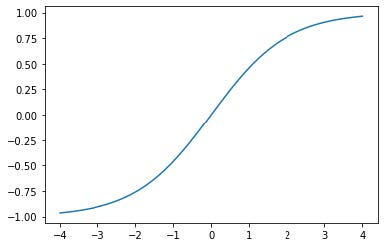

我们没有指定损失函数，这意味着我们将使用fastai默认选择的函数。让我们看看它为我们选了什么：

```python
dls.loss_func
```

```text
FlattenedLoss of MSELoss()
```

这很合理，因为当坐标作为因变量时，我们通常试图尽可能精确地预测结果——这正是均方误差损失（`MSELoss`）的核心功能。若需使用其他损失函数，可通过 `loss_func` 参数将其传递给 `cnn_learner` 模型。

请注意，我们并未指定任何度量指标。这是因为均方误差（MSE）本身已是该任务的有效度量指标（尽管在求取平方根后，其可解释性可能更高）。

我们可以使用学习率查找器选择一个合适的学习率：

```python
learn.lr_find()
```

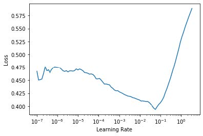

我们将尝试使用2e-2的LR值：

```python
lr = 2e-2
learn.fit_one_cycle(5, lr)
```

| 迭代轮次 | 训练损失 | 验证损失 | 时间  |
| -------- | -------- | -------- | ----- |
| 0        | 0.045840 | 0.012957 | 00:36 |
| 1        | 0.006369 | 0.001853 | 00:36 |
| 2        | 0.003000 | 0.000496 | 00:37 |
| 3        | 0.001963 | 0.000360 | 00:37 |
| 4        | 0.001584 | 0.000116 | 00:36 |

通常运行此程序时，我们会得到约0.0001的损失值，这对应于以下平均坐标预测误差：

```python
math.sqrt(0.0001)
```

```text
0.01
```

这听起来非常准确！但重要的是通过`Learner.show_results`查看我们的结果。左侧是实际（真实值）坐标，右侧是模型的预测结果：

```python
learn.show_results(ds_idx=1, max_n=3, figsize=(6,8))
```

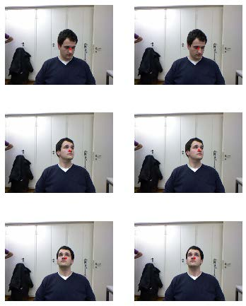

令人惊叹的是，仅需几分钟的计算，我们便创建了如此精确的关键点模型，且无需任何特定领域的专用应用程序。这正是基于灵活API构建模型并运用迁移学习的强大之处！尤其令人惊叹的是，我们竟能如此高效地实现迁移学习——即便任务完全不同：预训练模型原本用于图像分类，我们却将其微调用于图像回归。

### 总结

在看似截然不同的问题中（单标签分类、多标签分类和回归），我们最终使用的模型其实相同，只是输出数量不同。唯一变化的是损失函数，因此务必仔细核对所选损失函数是否适用于当前问题。

fastai会自动尝试从你构建的 `DataLoaders` 中选择合适的损失函数，但若你使用纯PyTorch构建数据加载器，请务必仔细考虑损失函数的选择，并记住你很可能需要以下内容：

- `nn.CrossEntropyLoss` 用于单标签分类
- `nn.BCEWithLogitsLoss` 用于多标签分类
- `nn.MSELoss` 用于回归

### 问卷调查

1. 多标签分类如何提升熊分类器的可用性？
2. 在多标签分类问题中如何编码因变量？
3. 如何像访问矩阵那样访问DataFrame的行和列？
4. 如何根据名称从DataFrame中获取列？
5. `Dataset` 与 `DataLoader` 有何区别？
6. `Datasets` 对象通常包含哪些内容？
7. `DataLoaders` 对象通常包含哪些内容？
8. Python中的 `lambda` 表达式有何作用？
9. 使用数据块API时，有哪些方法可自定义自变量与因变量的创建方式？
10. 使用独热编码目标时，为何softmax不适合作为输出激活函数？
11. 使用独热编码目标时，为何 `nll_loss` 不适合作为损失函数？
12. `nn.BCELoss` 与 `nn.BCEWithLogitsLoss` 有何区别？
13. 为何多标签问题中不能使用常规准确率？
14. 何时可在验证集上调整超参数？
15. fastai 中如何实现 `y_range`？（请你自己试试实现并测试，禁止偷看代码！）
16. 何为回归问题？此类问题应采用何种损失函数？
17. 你需要做什么才能确保 fastai 库对输入图像和目标点坐标应用相同的数据增强？

#### 进一步研究

1. 阅读关于Pandas DataFrames的教程，并尝试几个你感兴趣的方法。参考书籍官网推荐的教程。
2. 使用多标签分类法重新训练熊分类器。尝试使其在不含熊的图像上有效工作，并在网页应用中展示该信息。测试包含两种熊的图像，并验证多标签分类是否影响单标签数据集的准确率。

## 7. 训练一个最先进的模型

本章介绍了训练图像分类模型并获得最先进结果的更高级技术。如果你希望深入了解深度学习的其他应用场景，可跳过本章内容，稍后再行补习——后续章节不会预设读者已掌握本章知识。

我们将探讨归一化技术、一种名为Mixup的强大数据增强技术、渐进式尺寸调整方法以及测试时增强技术。为演示上述内容，我们将使用ImageNet子集Imagenette从零开始训练模型（不采用迁移学习）。该子集包含原始ImageNet数据集中10个差异显著的类别，便于实验时加速训练进程。

与之前的数据集相比，这次要做好将困难得多，因为我们使用的是全尺寸、全彩图像——这些照片中的物体尺寸各异、朝向不同、光照条件多样等等。因此在本章中，我们将介绍一些关键技术，帮助你充分挖掘数据集的潜力——尤其当你需要从零开始训练模型，或采用迁移学习在与预训练模型截然不同的数据集上训练模型时。

### Imagenette数据集

fast.ai刚问世的时候，人们主要使用三种数据集来构建和测试计算机视觉模型：

- ImageNet

  包含130万张尺寸各异的图像，宽度约500像素，涵盖1000个类别，训练耗时数日

- MNIST

  5万张28×28像素灰度手写数字图像

- CIFAR10

  6万张32×32像素彩色图像，分为10个类别

问题在于较小的数据集无法有效推广到大型ImageNet数据集。那些在ImageNet上表现良好的方法，通常必须在ImageNet上开发和训练。这导致许多人认为，只有拥有巨量计算资源的研究人员才能有效参与图像分类算法的开发。

我们认为这种说法不太可能成立。我们从未见过任何研究表明ImageNet恰好是理想规模，也从未见过其他数据集无法提供有价值的洞察。因此我们希望创建一个新数据集，让研究人员能够快速低成本地测试算法，同时该数据集提供的洞察也适用于完整的ImageNet数据集。

大约三小时后，我们创建了Imagenette。我们从完整的ImageNet中选取了10个类别，这些类别彼此差异显著。正如我们所期望的，我们能够快速且低成本地创建出能够识别这些类别的分类器。随后我们尝试了若干算法调整，以观察它们对Imagenette的影响。发现部分调整效果显著，于是我们将其应用于ImageNet测试——令人欣喜的是，这些优化在ImageNet上同样表现出色！

这里有一个重要信息：你获得的数据集未必是你想要的数据集。尤其不可能成为你用于开发和原型设计的理想数据集。你应力求迭代速度控制在几分钟内——即当你想尝试新想法时，应能在几分钟内完成模型训练并观察效果。若实验耗时过长，请思考如何缩减数据集或简化模型以提升实验速度。实验次数越多，效果越佳！

让我们从这个数据集开始吧：

```python
from fastai.vision.all import *
path = untar_data(URLs.IMAGENETTE)
```

首先，我们将数据集装入DataLoaders对象，使用第5章介绍的预缩放技巧：

```python
dblock = DataBlock(blocks=(ImageBlock(), CategoryBlock()),
                   get_items=get_image_files,
                   get_y=parent_label,
                   item_tfms=Resize(460),
                   batch_tfms=aug_transforms(size=224,
                                             min_scale=0.75))
dls = dblock.dataloaders(path, bs=64)
```

接下来我们将进行一次创建基准模型的训练：

```python
model = xresnet50()
learn = Learner(dls, model,
loss_func=CrossEntropyLossFlat(), metrics=accuracy)
learn.fit_one_cycle(5, 3e-3)
```

| 迭代轮次 | 训练损失 | 验证损失 | 准确度   | 时间  |
| -------- | -------- | -------- | -------- | ----- |
| 0        | 1.583403 | 2.064317 | 0.401792 | 01:03 |
| 1        | 1.208877 | 1.260106 | 0.601568 | 01:02 |
| 2        | 0.925265 | 1.036154 | 0.664302 | 01:03 |
| 3        | 0.730190 | 0.700906 | 0.777819 | 01:03 |
| 4        | 0.585707 | 0.541810 | 0.825243 | 01:03 |

这是一个不错的基准模型，因为我们并未使用预训练模型，但我们还能做得更好。当处理从零开始训练的模型，或将模型微调到与预训练数据集截然不同的数据集时，一些额外技术就显得至关重要。在本章后续内容中，我们将探讨一些关键方法，这些方法值得你深入了解。首要方法是数据的归一化处理（normalizing）。

### 归一化处理

在训练模型时，若输入数据经过归一化处理会更有利——即数据均值为0且标准差为1。但大多数图像和计算机视觉库使用的像素值范围在0到255之间，或0到1之间；无论哪种情况，数据都不可能满足均值为0、标准差为1的条件。

让我们抓取一批数据，观察这些值——通过计算除通道轴（即轴1）以外所有轴的平均值：

```python
x,y = dls.one_batch()
x.mean(dim=[0,2,3]),x.std(dim=[0,2,3])
```

```text
(TensorImage([0.4842, 0.4711, 0.4511], device='cuda:5'),
TensorImage([0.2873, 0.2893, 0.3110], device='cuda:5'))
```

正如我们预期的那样，均值和标准差与期望值相差甚远。所幸在fastai中通过添加 `Normalize` 转换即可轻松实现数据归一化。该转换可同时作用于整个肖批次，因此可将其添加至数据块的 `batch_tfms` 部分。需向该转换器传递期望使用的均值和标准差；fastai已预置ImageNet数据集的标准均值与标准差。（若未向 `Normalize` 转换器传递统计参数，fastai将自动从单批次数据中计算得出。）

让我们添加这个转换（使用 `imagenet_stats`，因为 Imagenette 是 ImageNet 的子集），现在来看一个批次：

```python
def get_dls(bs, size):
    dblock = DataBlock(blocks=(ImageBlock, CategoryBlock),
                       get_items=get_image_files,
                       get_y=parent_label,
                       item_tfms=Resize(460),
                       batch_tfms=[*aug_transforms(size=size,
                                                   min_scale=0.75),
                                   Normalize.from_stats(*imagenet_stats)])
    return dblock.dataloaders(path, bs=bs)

dls = get_dls(64, 224)

x,y = dls.one_batch()
x.mean(dim=[0,2,3]),x.std(dim=[0,2,3])

(TensorImage([-0.0787, 0.0525, 0.2136], device='cuda:5'),
 TensorImage([1.2330, 1.2112, 1.3031], device='cuda:5'))
```

让我们看看这对训练模型产生了什么影响：

```python
model = xresnet50()
learn = Learner(dls, model,
loss_func=CrossEntropyLossFlat(), metrics=accuracy)
learn.fit_one_cycle(5, 3e-3)
```

| 迭代轮次 | 训练损失 | 验证损失 | 准确度   | 时间  |
| -------- | -------- | -------- | -------- | ----- |
| 0        | 1.632865 | 2.250024 | 0.391337 | 01:02 |
| 1        | 1.294041 | 1.579932 | 0.517177 | 01:02 |
| 2        | 0.960535 | 1.069164 | 0.657207 | 01:04 |
| 3        | 0.730220 | 0.767433 | 0.771845 | 01:05 |
| 4        | 0.577889 | 0.550673 | 0.824496 | 01:06 |

尽管在此处作用有限，但归一化处理在使用预训练模型时尤为重要。预训练模型仅能处理其训练数据中出现过的数据类型。若模型训练数据中像素值均值为0，而你的数据中像素最小值恰为0，那么模型所呈现的图像将与预期效果大相径庭！

这意味着当你分发模型时，也需要同时分发用于归一化处理的统计参数，因为任何使用该模型进行推理或迁移学习的人都需要使用相同的统计参数。同样地，如果你使用的是他人训练的模型，请务必查明他们使用的归一化统计参数，并确保保持一致。

在之前的章节中我们无需处理归一化问题，因为当通过 `cnn_learner` 使用预训练模型时，fastai库会自动添加正确的 `Normalize` 转换；该模型已在 `Normalize` 中预先训练了特定统计参数（通常来自ImageNet数据集），因此库可以自动填充这些参数。请注意这仅适用于预训练模型，因此当我们从零开始训练时，需要手动添加这些信息。

迄今为止，我们所有的训练都是在224尺寸下完成的。我们可以在更小的尺寸下开始训练，然后再过渡到该尺寸。这被称为渐进式尺寸调整（progressive resizing）。

### 渐进式尺寸调整

当fast.ai及其学生团队在2018年赢得 [DAWNBench竞赛](https://oreil.ly/16tar) 时，一项至关重要的创新其实非常简单：训练初期使用小尺寸图像，训练后期切换至大尺寸图像。在大部分迭代轮次中使用小尺寸图像能显著加快训练进度，而最终使用大尺寸图像完成训练则能大幅提升最终准确率。我们称这种方法为渐进式尺寸调整。

> 术语：渐进式尺寸调整
>
> 在训练过程中逐步使用越来越大的图像。

正如我们所见，卷积神经网络所学习的特征类型与图像尺寸毫无关联——早期层会识别边缘和梯度等特征，而后期层则可能识别鼻子和日落等特征。因此，在训练过程中改变图像尺寸，并不意味着我们必须为模型寻找完全不同的参数。

但显然小图像和大图像之间存在差异，因此我们不应期望模型在完全不做调整的情况下继续保持同样的性能。这是否让你联想到某些概念？当我们提出这个想法时，立刻联想到迁移学习！我们试图让模型学习完成与先前任务略有不同的任务。因此，在调整图像尺寸后，我们应该能够使用 `fine_tune` 方法。

渐进式尺寸调整还具有额外优势：它属于数据增强的另一种形式。因此，采用渐进式尺寸调整训练的模型通常能展现更强的泛化能力。

要实现渐进式调整大小，最便捷的方式是先创建一个 `get_dls` 函数，该函数接受图像尺寸和批量大小作为参数（如同上一节所示），并返回相应的 `DataLoaders`。

现在你可以创建小型 `DataLoaders` ，并像往常一样使用 `fit_one_cycle` 方法，训练迭代轮次比常规训练更短：

```python
dls = get_dls(128, 128)
learn = Learner(dls, xresnet50(),
                loss_func=CrossEntropyLossFlat(),
                metrics=accuracy)
learn.fit_one_cycle(4, 3e-3)
```

| 迭代轮次 | 训练损失 | 验证损失 | 准确率   | 时间  |
| -------- | -------- | -------- | -------- | ----- |
| 0        | 1.902943 | 2.447006 | 0.401419 | 00:30 |
| 1        | 1.315203 | 1.572992 | 0.525765 | 00:30 |
| 2        | 1.001199 | 0.767886 | 0.759149 | 00:30 |
| 3        | 0.765864 | 0.665562 | 0.797984 | 00:30 |

然后你可以替换 `Learner` 内部的 `DataLoaders` ，并进行微调：

```python
learn.dls = get_dls(64, 224)
learn.fine_tune(5, 1e-3)
```

| 迭代轮次 | 训练损失 | 验证损失 | 准确率   | 时间  |
| -------- | -------- | -------- | -------- | ----- |
| 0        | 0.985213 | 1.654063 | 0.565721 | 01:06 |
| 0        | 0.706869 | 0.689622 | 0.784541 | 01:07 |
| 1        | 0.739217 | 0.928541 | 0.712472 | 01:07 |
| 2        | 0.629462 | 0.788906 | 0.764003 | 01:07 |
| 3        | 0.491912 | 0.502622 | 0.836445 | 01:06 |
| 4        | 0.414880 | 0.431332 | 0.863331 | 01:06 |

如你所见，我们的性能有了显著提升，且在小尺寸图像上的初始训练阶段，每个迭代轮次的速度都大幅加快。

你可以随意重复增加尺寸和训练更多迭代轮次的过程，以获得任意大小的图像——当然，使用超过磁盘上图像尺寸的图像并不会带来任何好处。

请注意，对于迁移学习而言，渐进式缩放实际上可能损害性能。这种情况最可能发生在以下情形：预训练模型与迁移学习任务高度相似，且数据集和模型均基于尺寸相近的图像进行训练，因此权重无需大幅调整。此时，使用较小尺寸图像进行训练可能会破坏预训练权重。

另一方面，如果迁移学习任务将使用与预训练任务中图像尺寸、形状或风格不同的图像，渐进式缩放可能会有所帮助。一如既往，对于“这会有帮助吗？”的回答是：“试试看！”

另一种尝试是将数据增强技术应用于验证集。迄今为止，我们仅在训练集上应用该技术，而验证集始终使用相同图像。但或许我们可以尝试对验证集的若干增强版本进行预测，并取其平均值。接下来我们将探讨这种方法。

### 测试时增强

我们一直采用随机裁剪作为数据增强手段，这能提升模型泛化能力，从而减少所需训练数据量。当使用随机裁剪时，fastai会自动对验证集采用中心裁剪策略——即在图像中心选择最大正方形区域，且裁剪范围不超出图像边界。

这常常会引发问题。例如在多标签数据集中，图像边缘有时会存在小型物体；这些物体可能在中心裁剪时被完全裁切掉。即使在宠物品种分类这类问题中，用于识别正确品种的关键特征——例如鼻子的颜色——也可能在裁剪过程中被剔除。

解决此问题的方案之一是完全避免随机裁剪。取而代之，我们可以直接将矩形图像压缩或拉伸以适应正方形区域。但这样会错失一种非常有用的数据增强手段，同时也会增加模型进行图像识别的难度——因为模型必须学会识别被压缩和拉伸的图像，而非仅识别比例正确的图像。

另一种解决方案是在验证时不进行居中裁剪，而是从原始矩形图像中选取多个裁剪区域，将每个区域输入模型后取预测值的最大值或平均值。实际上，这种方法不仅适用于不同裁剪区域，还可应用于所有测试增强参数的不同取值。这被称为测试时增强（test time augmentation，TTA）。

> 术语：测试时增强
>
> 在推理或验证过程中，通过数据增强技术为每张图像生成多个版本，随后对每个增强版本的图像预测结果取平均值或最大值。

根据数据集的不同，测试时间增强技术可显著提升准确率。该技术完全不改变训练所需时间，但会因请求的测试增强图像数量增加，相应延长验证或推理所需时间。默认情况下，fastai将使用未增强的中心裁剪图像加四张随机增强图像。

你可以将任何 `DataLoader` 传递给fastai的 `tta` 方法；默认情况下，它将使用你的验证集：

```python
preds,targs = learn.tta()
accuracy(preds, targs).item()
```

```text
0.8737863898277283
```

如我们所见，使用TTA能显著提升性能，且无需额外训练。但它确实会降低推理速度——若为TTA平均处理五张图像，推理速度将降低五倍。

我们已经看到了一些数据增强如何帮助训练更优质模型的实例。现在让我们聚焦于一种名为Mixup的新型数据增强技术。

### Mixup

Mixup 是由张宏毅（Hongyi Zhang）等人于2017年在论文 [《mixup：超越经验风险最小化》](https://oreil.ly/UvIkN) 中提出，是一种强大的数据增强技术，能够显著提升准确率——尤其当数据量有限且缺乏基于相似数据集训练的预训练模型时。该论文阐述道： “虽然数据增强能持续提升泛化能力，但该过程依赖于数据集特性，因此需要借助专家知识。”例如，图像翻转作为数据增强的常见手段，究竟应仅进行水平翻转还是同时进行垂直翻转？答案取决于具体数据集。此外，若某项操作（如翻转）无法提供足够的数据增强效果，你无法简单地“增加翻转次数”。此时需要具备可调节增强程度的技术手段——既能“增强”也能“减弱”变化幅度，从而找到最适合你的方案。

Mixup 的工作原理如下，针对每张图像：

1. 从数据集中随机选取另一张图像。
2. 随机选取一个权重值。
3. 对选取的图像与当前图像进行加权平均（使用步骤2的权重值），此结果即为自变量。
4. 对该图像的标签与当前图像的标签进行加权平均（使用相同权重值），此结果即为因变量。

在伪代码中，我们这样操作（其中 `t` 是加权平均的权重）：

```python
image2,target2 = dataset[randint(0,len(dataset)]
t = random_float(0.5,1.0)
new_image = t * image1 + (1-t) * image2
new_target = t * target1 + (1-t) * target2
```

要使该方法生效，目标变量需要进行独热编码。论文中使用图7-1中的方程对此进行了描述（其中λ与伪代码中的t相同）。

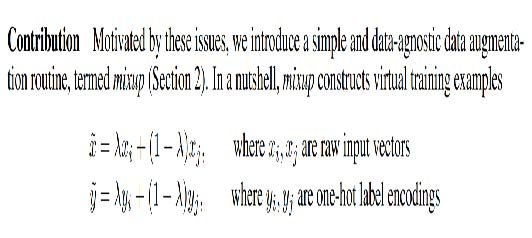

[^图7-1]: 摘自《Mixup》论文

> 论文与数学
>
> 接下来我们将在这本书中阅读越来越多的研究论文。既然你已经掌握了基本术语，你可能会惊讶地发现，只要稍加练习，你竟能理解其中如此多的内容！你会注意到一个现象：希腊字母（如λ）几乎出现在所有论文中。最好能记住所有希腊字母的名称，否则很难独立阅读论文并记住它们（同样也难以理解基于这些字母的代码——因为代码常直接使用希腊字母的拼写名称，例如 `lambda`）。
>
> 论文的更大问题在于它们用数学而非代码来解释原理。若你缺乏数学背景，初看时可能会感到畏难困惑。但请记住：数学表达的本质是代码将要实现的内容，这只是描述同一事物的另一种方式！阅读几篇论文后，你会逐渐掌握更多符号。若遇到陌生符号，可查阅维基百科的数学符号列表，或在 [Detexify](https://oreil.ly/92u4d) 中手绘符号——该工具（运用机器学习技术！）能识别手绘符号名称，随后你便能通过该名称在线查询其含义。

图7-2展示了当我们对图像进行 *线性组合*（linear
combination） 时呈现的效果，这与Mixup算法中的处理方式一致。

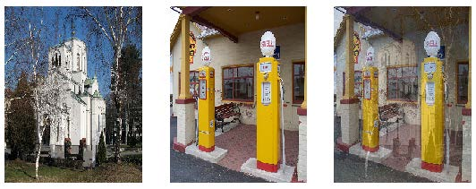

[^图7-2]: 混合教堂与加油站

第三张图像通过添加第一张图像的0.3倍与第二张图像的0.7倍构建而成。在此示例中，模型应预测“教堂”还是“加油站”？正确答案是30%教堂与70%加油站——因为若对独热编码目标进行线性组合，结果正是如此。例如假设存在10个类别，其中“教堂”对应索引2，“加油站”对应索引7。其独热编码表示如下：

```python
[0, 0, 1, 0, 0, 0, 0, 0, 0, 0] and [0, 0, 0, 0, 0, 0, 0, 1,
0, 0]
```

那么，我们的最终目标是：

```python
[0, 0, 0.3, 0, 0, 0, 0, 0.7, 0, 0]
```

这一切在 fastai 中都是通过向我们的学习器添加回调函数（callback）来实现的。 `Learner. Callbacks` 是 fastai 内部用于在训练循环中注入自定义行为的机制（例如学习率调度或混合精度训练）。关于回调的全部知识——包括如何创建自己的回调——你将在第16章学习。目前只需知道：通过 `Learner` 的 `cbs` 参数即可传递回调函数。

以下是使用Mixup训练模型的过程：

```python
model = xresnet50()
learn = Learner(dls, model,
                loss_func=CrossEntropyLossFlat(),
                metrics=accuracy, cbs=Mixup)
learn.fit_one_cycle(5, 3e-3)
```

当我们用这种方式处理的数据训练模型时会发生什么？显然，训练难度会增加，因为难以辨别每张图像的内容。模型不仅需要为每张图像预测两个标签（而非单一标签），还需确定每个标签的权重。不过过拟合似乎不太可能成为问题，因为我们在每个迭代轮次中展示的并非同一张图像，而是随机组合的两张图像。

与我们见过的其他数据增强方法相比，Mixup需要更长的迭代轮次才能获得更高的准确率。你可以通过fastai仓库中的 `examples/train_imagenette.py` 脚本，分别尝试带Mixup和不带Mixup训练Imagenette数据集。截至本文撰写时，[Imagenette 存储库](https://oreil.ly/3Gt56) 的排行榜显示：所有超过 80 迭代轮次的领先结果均采用了 Mixup，而较少迭代轮次的训练则未使用该方法。这与我们使用 Mixup 的经验相符。

Mixup之所以如此令人兴奋，部分原因在于它不仅适用于照片数据，还能应用于其他类型的数据。事实上，有人甚至在模型内部的激活函数上使用Mixup也取得了良好效果——不仅限于输入数据，这使得Mixup也能应用于自然语言处理及其他数据类型。

Mixup 还为我们解决了另一个微妙的问题，即我们之前使用的模型实际上无法实现完美的损失函数。问题在于我们的标签是 1 和 0，但 softmax 和 sigmoid 的输出永远不可能等于 1 或 0。这意味着训练模型会不断将激活值推向极端，导致迭代轮次越多，激活值就越趋近于极端值。

借助Mixup模型，我们不再面临这个问题，因为只有当我们恰好与同一类别的另一张图像进行“混合”时，标签才会精确地呈现为1或0。其余情况下，标签将呈现为线性组合，例如先前教堂和加油站示例中出现的0.7和0.3。

然而，此方法存在一个问题：Mixup会“意外地”使标签值大于0或小于1。也就是说，我们并未明确告知模型需要以这种方式调整标签。因此，若想调整标签更接近或远离0和1，就必须改变Mixup的量——这同时也会改变数据增强的量，而这可能并非我们所期望的。不过，存在一种更直接的处理方式，即使用标签平滑化（label smoothing）。

### 标签平滑化

在损失函数的理论表达中，分类问题中的目标变量采用独热编码（实际中为节省内存通常避免此操作，但计算出的损失与实际采用独热编码时完全一致）。这意味着模型被训练为对除目标类别外的所有类别返回0，仅对目标类别返回1。即使0.999的预测精度也不够理想；模型会获取梯度并学习以更高置信度预测激活值。这种机制助长了过拟合现象，导致推理阶段模型无法提供有意义的概率：即使置信度不高，它仍会始终将预测类别标记为1——仅仅因为训练过程如此设定。

如果数据标注不完美，这种情况可能造成严重危害。在第2章研究的熊分类器中，我们发现部分图像存在标注错误，或同时包含两种不同熊类。总体而言，数据永远不可能完美无缺。即便标注由人工完成，人类也可能出错，或在难以标注的图像上产生意见分歧。

相反，我们可以将所有1替换为略小于1的数值，将所有0替换为略大于0的数值，然后进行训练。这被称为标签平滑化。通过降低模型的置信度，标签平滑能增强训练的鲁棒性——即使存在标签错误的数据。最终生成的模型将在推理阶段展现更强的泛化能力。

标签平滑在实践中的运作方式如下：我们从独热编码的标签开始，将所有0替换为 ϵ/
N（希腊字母epsilon，该符号源自 [引入标签平滑化的论文](https://oreil.ly/L3ypf) 并被fastai代码沿用），其中N为类别数，ϵ为参数（通常取0.1，意味着我们对标签存在10%的不确定性）。由于要求标签总和为1，我们同时将所有1替换为1 − ϵ + ϵ/N。这样做避免模型过度关注高概率标签。在我们的Imagenette示例中（包含10个类别），目标值将变为如下形式（此处以索引3对应的目标为例）：

```python
[0.01, 0.01, 0.01, 0.91, 0.01, 0.01, 0.01, 0.01, 0.01, 0.01]
```

实际上，我们并不希望对标签进行独热编码，而幸运的是我们也无需这样做（独热编码仅适用于解释标签平滑化并实现可视化）。

> 有关标签平滑化的那个论文
>
> 以下是Christian Szegedy等人论文中对标签平滑化原理的阐述：
>
> > 对于有限的 $z_k$，该最大值无法实现，但当所有 $k \neq y$ 时 $z_y ≫ z_k$（即真实标签对应的对数似然值远大于其他所有对数似然值）时，可趋近该值。然而这可能引发两个问题：首先可能导致过拟合——若模型学会为每个训练样本赋予真实标签的最大似然概率，则无法保证泛化能力；其次，它会促使最大对数似然值与其他所有值之间的差异增大，这种情况结合有界梯度 $\frac{\partial l}{\partial z_k}$ ，会降低模型的适应能力。直观而言，这是因为模型对其预测结果产生过度自信。
>
> 让我们练习阅读论文的技巧来尝试解读这段内容。“该最大值”指的是段落前文提及的正类标签值为1的事实。因此，任何数值（无限大除外）经过sigmoid或softmax函数后都不会得到1的结果。在论文中通常不会直接写明“任意值”，而是用符号表示——此处即 $z_k$。这种简写在论文中很有用，因为后续可再次引用时，读者便能明确讨论的是哪个数值。
>
> 然后它写道：“当所有 $k \neq y$ 时 $z_y ≫ z_k$”这种情况下，论文会在数学推导后立即给出英文说明，这很方便，因为你可以直接阅读说明。在数学公式中，y指代目标值（y在论文前文已定义；有时符号定义位置不易查找，但几乎所有论文都会在某处定义所有符号），而 $z_y$ 是对应该目标的激活值。因此要接近 1，该激活值必须远高于该预测的所有其他激活值。
>
> 接下来，考虑以下陈述：“如果模型学会为每个训练样本分配给真实标签的完整概率，则无法保证其泛化能力。”这意味着当 $z_y$ 变得非常大时，模型中将需要大量权重和激活值。过大的权重会导致“崎岖”的函数特性——输入的微小变化会引发预测结果的剧烈波动。这对泛化能力极为不利，因为这意味着仅需改变一个像素点，就可能彻底颠覆预测结果！
>
> 最后，我们得到“它会促使最大对数似然值与其他所有值之间的差异增大，这种情况结合有界梯度 $\frac{\partial l}{\partial z_k}$ ，会降低模型的适应能力”。请记住，交叉熵的梯度本质上是输出值减去目标值。由于输出值和目标值都在0到1之间，因此差值范围在-1到1之间，这就是论文指出梯度是“有界”的（不可能无限大）。因此，我们的随机梯度下降（SGD）步长也是有界的。“降低模型的适应能力”意味着在迁移学习场景中，模型难以更新。这是因为错误预测导致的损失差异是无限的，但每次我们只能采取有限的步长。

要在实践中使用它，我们只需在调用 `Learner` 时修改损失函数：

```python
model = xresnet50()
learn = Learner(dls, model,
                loss_func=LabelSmoothingCrossEntropy(),
                metrics=accuracy)
learn.fit_one_cycle(5, 3e-3)
```

与混淆类似，在训练更多迭代轮次之前，通常不会看到标签平滑带来的显著改进。亲自尝试看看：需要训练多少迭代轮次才能看到标签平滑的效果提升？

### 总结

现在你已掌握训练计算机视觉尖端模型的全部要领，无论是从零开始还是采用迁移学习。接下来只需针对自身问题展开实验！你可以尝试通过延长训练时间并结合Mixup和/或标签平滑化技术，验证是否能避免过拟合并获得更佳效果。同时可尝试渐进式尺寸调整和测试时间增强策略。

最重要的是，请记住：如果数据集规模庞大，对整个数据集进行原型设计毫无意义。应像我们处理Imagenette那样，寻找能代表整体的小型子集，并在该子集上进行实验。

在接下来的三章中，我们将探讨fastai直接支持的其他应用：协同过滤（collaborative filtering）、表格建模（tabular modeling）以及文本处理（working with text）。本书后续章节将回归计算机视觉领域，并在第13章深入探讨卷积神经网络。

### 问卷调查

1. ImageNet与Imagenette有何区别？何时更适合在其中一个数据集上进行实验？

2. 什么是归一化？
3. 使用预训练模型时为何无需关注归一化？
4. 什么是渐进式缩放？
5. 请在自己的项目中实现渐进式尺寸，并看看是否有效？
6. 什么是测试时增强？如何在fastai中使用该技术？
7. 推理时使用TTA是否比常规推理更慢或更快？原因何在？
8. 什么是Mixup？如何在fastai中使用该技术？
9. Mixup如何防止模型过度自信？
10. 为何使用Mixup训练五个迭代轮次后效果反而不如未使用Mixup时？
11. 标签平滑化的核心原理是什么？
12. 标签平滑化能解决数据中的哪些问题？
13. 在五分类标签平滑化中，索引为1的目标标签对应什么？
14. 在新数据集上快速实验原型时，第一步该做什么？

#### 进一步研究

1. 使用 fastai 文档构建一个函数，将图像裁剪为四个角的正方形；然后实现一种 TTA 方法，对中心裁剪区域和四个裁剪区域的预测结果进行平均。这有帮助吗？它比 fastai 的 TTA 方法更好吗？
2. 在 arXiv 上找到 Mixup 论文并阅读。再选读一两篇介绍Mixup变体的近期论文，尝试将其应用于你的问题。

3. 查找使用Mixup训练Imagenette的数据集脚本，将其作为范例编写适用于你项目的长期训练脚本。执行脚本并观察效果。

4. 阅读侧边栏“优化标签平滑化的那个论文”；接着查阅原始论文相关章节，尝试理解其逻辑。遇到困难时请大胆求助！

## 8. 深度解析协同过滤

一个常见的问题是：当存在多个用户和多个产品时，如何为每个用户推荐最可能有用的产品。这类问题存在多种变体：例如推荐电影（如Netflix（译者注：国外一家知名视频平台）所做）、确定用户主页的突出内容、决定社交媒体信息流中展示哪些故事等等。解决此类问题的通用方案称为 *协同过滤* （collaborative filtering），其运作原理如下：分析当前用户使用或点赞过的商品，找出其他用户使用或点赞过相似商品的记录，进而推荐这些用户使用或点赞过的其他商品。

例如，在Netflix上，你可能观看过大量属于科幻题材、充满动作场面且制作于1970年代的电影。Netflix可能并不了解你观看的具体影片属性，但它能发现：那些与你观看相同影片的用户，往往也倾向于观看其他同样属于科幻题材、动作场面丰富且制作于1970年代的电影。换言之，采用这种方法时，我们无需了解电影本身的任何信息，只需知道谁喜欢观看这些电影即可。

这种方法还能解决更广泛的问题类型，这些问题未必涉及用户和产品。事实上，在协同过滤领域，我们通常使用“项目”而非“产品”作为分析对象。项目可以是用户点击的链接、为患者选择的诊断方案等等。

关键的基础概念是 *潜在因子* （latent factors）。在Netflix的例子中，我们最初假设你喜欢老派、动作场面丰富的科幻电影。但你从未告诉Netflix自己喜欢这类电影。Netflix也无需在其电影数据库中添加列来标注影片类型。然而，必然存在某种潜在概念——科幻、动作、电影年代——这些概念至少对部分用户的观影决策具有重要意义。

在本章中，我们将着手解决这个电影推荐问题。首先，我们将获取一些适合协同过滤模型的数据。

### 数据初探

我们无法获取Netflix完整的电影观看历史数据集，但有一个名为 [MovieLens](https://oreil.ly/gP3Q5) 的优质数据集可供使用。该数据集包含数千万条电影评分记录（由电影ID、用户ID和数值评分组成），不过本例中我们将仅使用其中10万条样本数据。若您感兴趣，可尝试将此方法应用于完整的2500万条推荐数据集，这将是一个极好的学习项目。该数据集可从其官网获取。

该数据集可通过常规的fastai函数获取：

```python
from fastai.collab import *
from fastai.tabular.all import *
path = untar_data(URLs.ML_100k)
```

根据README说明，主数据表位于 `u.data` 文件中。该文件采用制表符分隔格式，列名依次为用户（user）、电影（movie）、评分（rating）和时间戳（timestamp）。由于这些名称未进行编码处理，使用Pandas读取文件时需明确指定列名。以下是打开该数据表进行查看的方法：

```python
ratings = pd.read_csv(path/'u.data', delimiter='\t',
                      header=None,
                      names=
                      ['user','movie','rating','timestamp'])
ratings.head()
```

| 序号 | 用户 | 电影 | 评分 | 时间戳    |
| ---- | ---- | ---- | ---- | --------- |
| 0    | 196  | 242  | 3    | 881250949 |
| 1    | 186  | 302  | 3    | 891717742 |
| 2    | 22   | 377  | 1    | 878887116 |
| 3    | 244  | 51   | 2    | 880606923 |
| 4    | 166  | 346  | 1    | 886397596 |

尽管这包含了我们所需的所有信息，但这种呈现方式对人类查看数据并不特别有用。图8-1展示了将相同数据交叉表化后形成的更易于人类理解的表格。


[^图8-1]: 电影与用户交叉表

我们仅选取了部分最受欢迎的电影，以及观看电影最多的用户，作为此交叉表示例。表格中的空单元格正是我们希望模型学习填充的部分。这些位置对应用户尚未评价的影片，推测是因其尚未观看。对于每位用户，我们需要推断出他们最可能喜欢的影片类型。

如果我们知道每位用户对电影可能归属的重要类别的偏好程度——例如类型、年龄、偏好的导演和演员等，同时掌握每部电影的相同信息，那么填充此表格的简便方法就是将每部电影的这些信息相乘，形成组合值。例如，假设这些因素在-1至+1之间变化，正数表示匹配度更高，负数表示匹配度更低，类别包括科幻、动作和老电影，那么我们可以将电影《最后的天行者》表示如下：

```python
last_skywalker = np.array([0.98,0.9,-0.9])
```

例如，这里我们将“非常科幻”评分为0.98，而“非常非古典”评分为-0.9。我们可以这样描述一位喜欢现代科幻动作电影的用户：

```python
user1 = np.array([0.9,0.8,-0.6])
```

现在我们可以计算这个组合的匹配情况：

```python
(user1*last_skywalker).sum()
```

```text
2.1420000000000003
```

当我们将两个向量相乘并求和时，这被称为点积（dot product）。它在机器学习中应用广泛，并构成了矩阵乘法的基础。在第17章中，我们将深入探讨矩阵乘法与点积的相关内容。

> 术语：点积
>
> 将两个向量的元素相乘，然后将结果相加的数学运算。

另一方面，我们可以将电影《卡萨布兰卡》表示为：

```python
casablanca = np.array([-0.99,-0.3,0.8])
```

此组合之间的匹配关系如图所示：

```python
(user1*casablanca).sum()
```

```text
-1.611
```

由于我们不知道潜在因子是什么，也不知道如何为每个用户和电影评分，因此需要学习这些因子。

### 学习潜在因子

令人惊讶的是，定义模型结构（如前一节所示）与学习模型结构之间差异甚微，因为我们只需采用通用的梯度下降方法即可。

该方法的第一步是随机初始化若干参数。这些参数将构成每个用户和电影的一组潜在因子。我们需要确定使用多少个因子，具体选择方法稍后讨论，为便于说明，现暂设为5个。由于每位用户和每部电影都对应一组因子，我们可在交叉表中将这些随机初始化值直接显示在用户与电影数据旁，并在中间区域填入所有组合的点积值。例如，图8-2展示了在Microsoft Excel中的呈现效果，左上角单元格的公式作为示例展示。

该方法的第二步是计算预测值。如前所述，我们只需计算每部电影与每位用户的点积即可。例如，若第一个潜在用户因子代表用户对动作片的偏好程度，而第一个潜在电影因子代表影片是否包含大量动作场景，当用户喜欢动作片且电影动作场景丰富时，或用户不喜欢动作片且电影无动作场景时，两者乘积将显著增高。反之，若出现不匹配情况（用户热爱动作片但电影非动作片，或用户不喜欢动作片而电影恰是动作片），该乘积值将非常低。

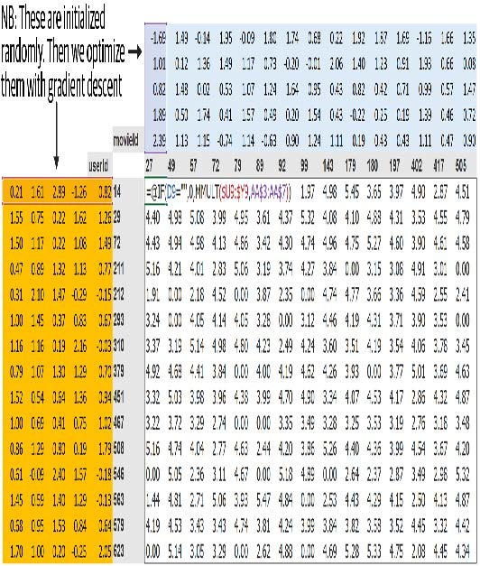

[^图8-2]: 交叉表中的潜在因子

第三步是计算损失值。我们可以使用任何损失函数；目前选择均方误差，因为这是衡量预测准确度的一种合理方式。

这就是我们所需的全部。在此基础上，我们可以使用随机梯度下降法优化参数（潜在因子），从而最小化损失。在每个步骤中，随机梯度下降优化器将通过点积计算每部电影与每位用户的匹配度，并将其与每位用户对每部电影的实际评分进行比较。随后计算该值的导数，并乘以学习率调整权重。经过大量迭代后，损失函数将持续优化，推荐效果也会越来越好。

要使用常规的 `Learner.fit` 函数，我们需要将数据装载到 `DataLoaders` 中，因此现在让我们专注于此。

### 创建 `DataLoaders`

在展示数据时，我们更希望看到电影标题而非其ID。表 `u.item` 包含ID与标题的对应关系：

```python
movies = pd.read_csv(path/'u.item', delimiter='|',
                     encoding='latin-1',
                     usecols=(0,1), names=('movie','title'),
                     header=None)
movies.head()
```

| 序号 | 电影 | 标题              |
| ---- | ---- | ----------------- |
| 0    | 1    | Toy Story (1995)  |
| 1    | 2    | GoldenEye (1995)  |
| 2    | 3    | Four Rooms (1995) |
| 3    | 4    | Get Shorty (1995) |
| 4    | 5    | Copycat (1995)    |

我们可以将此与我们的 `ratings` 表合并，以获取按标题分类的用户评分：

```python
ratings = ratings.merge(movies)
ratings.head()
```

| 序号 | 用户 | 电影 | 评分 | 时间戳    | 标题         |
| ---- | ---- | ---- | ---- | --------- | ------------ |
| 0    | 196  | 242  | 3    | 881250949 | Kolya (1996) |
| 1    | 63   | 242  | 3    | 875747190 | Kolya (1996) |
| 2    | 226  | 242  | 5    | 883888671 | Kolya (1996) |
| 3    | 154  | 242  | 3    | 879138235 | Kolya (1996) |
| 4    | 306  | 242  | 5    | 876503793 | Kolya (1996) |

然后我们可以根据此表格构建一个 `DataLoaders` 对象。默认情况下，它将第一列作为用户名，第二列作为项目（此处指电影），第三列作为评分。在我们的场景中，需要修改 `item_name` 的值，以便使用标题而非ID：

```python
dls = CollabDataLoaders.from_df(ratings, item_name='title',
                                bs=64)
dls.show_batch()
```

| 序号 | 用户 | 标题                               | 评分 |
| ---- | ---- | ---------------------------------- | ---- |
| 0    | 207  | Four Weddings and a Funeral (1994) | 3    |
| 1    | 565  | Remains of the Day, The (1993)     | 5    |
| 2    | 506  | Kids (1995)                        | 1    |
| 3    | 845  | Chasing Amy (1997)                 | 3    |
| 4    | 798  | Being Human (1993)                 | 2    |
| 5    | 500  | Down by Law (1986)                 | 4    |
| 6    | 409  | Much Ado About Nothing (1993)      | 3    |
| 7    | 721  | Braveheart (1995)                  | 5    |
| 8    | 316  | Psycho (1960)                      | 2    |
| 9    | 883  | Judgment Night (1993)              | 5    |

要在 PyTorch 中表示协同过滤，我们不能直接使用交叉表表示法，尤其当需要将其融入深度学习框架时。我们可以将电影和用户的潜在因子表表示为简单的矩阵：

```python
n_users = len(dls.classes['user'])
n_movies = len(dls.classes['title'])
n_factors = 5

user_factors = torch.randn(n_users, n_factors)
movie_factors = torch.randn(n_movies, n_factors)
```

要计算特定电影与用户组合的结果，我们需要在电影潜在因子矩阵中查找该电影的索引，并在用户潜在因子矩阵中查找该用户的索引；随后即可对两个潜在因子向量进行点积运算。但索引查找（look up in an index）并非深度学习模型所擅长的操作。它们只掌握矩阵乘法和激活函数的运算。

幸运的是，我们发现可以将索引查找表示为矩阵乘法。关键在于用独热编码向量替换索引。以下是向量与表示索引3的独热编码向量相乘的结果示例：

```python
one_hot_3 = one_hot(3, n_users).float()
user_factors.t() @ one_hot_3
```

```text
tensor([-0.4586, -0.9915, -0.4052, -0.3621, -0.5908])
```

它给出了与矩阵中索引为3的元素相同的向量：

```python
user_factors[3]
```

```text
tensor([-0.4586, -0.9915, -0.4052, -0.3621, -0.5908])
```

如果同时对几个索引执行此操作，我们将得到一个由独热编码向量组成的矩阵，而该操作本质上是矩阵乘法！这种构建模型的架构完全可行，但会消耗远超必要的内存和时间。我们知道，存储独热编码向量或搜索其中数字1的出现根本没有实质意义——我们本应能直接用整数索引数组. 因此，包括 PyTorch 在内的大多数深度学习库都提供了一个专门层来实现这一功能：它使用整数对向量进行索引，但其导数计算方式与执行与独热编码向量矩阵乘法时完全一致。这种技术被称为嵌入（embedding）。

> 术语：嵌入
>
> 与独热编码矩阵相乘时，可利用计算捷径——即通过直接索引实现。这个概念看似复杂，实则简单。你用来与独热编码矩阵相乘（或通过计算捷径直接索引）的矩阵，被称为嵌入矩阵。

在计算机视觉领域，我们可以通过像素的RGB值轻松获取其全部信息：彩色图像中的每个像素由三个数值表示。这三个数值分别对应红色、绿色和蓝色成分，足以支撑后续模型的运行。

对于当前问题，我们无法像描述用户或电影那样轻松地定义特征。可能存在与类型相关的关联：若某用户偏好爱情片，则其对爱情电影的评分往往较高。其他因素还包括电影是偏重动作场面还是对话戏份，或是是否包含用户特别喜爱的特定演员。

如何确定数字来描述这些特征？答案是，我们不会强行规定。我们将让模型自行学习这些特征。通过分析用户与电影之间的现有关联，模型能够自主识别哪些特征重要，哪些不重要。

这就是嵌入的含义。我们将为每位用户和每部电影分配一个特定长度的随机向量（此处为 `n_factors=5` ），并将这些参数设为可学习参数。这意味着在每次迭代中，当我们通过预测值与目标值的对比计算损失时，将求解损失函数对这些嵌入向量的梯度，并依据随机梯度下降（或其它优化器）的规则进行参数更新。

起初，这些数字毫无意义，因为我们是随机选取的，但训练结束后它们就会产生意义。通过仅基于现有用户与电影关联数据进行学习（不依赖其他信息），我们会发现模型仍能提取出重要特征，从而将商业大片与独立电影区分开来，将动作片与爱情片区分开来，等等。

我们现在能够从头开始创建整个模型了。

### 从零开始的协同过滤

在使用PyTorch编写模型之前，我们首先需要掌握面向对象编程和Python的基础知识。如果你此前未接触过面向对象编程，我们将在此进行简要介绍，但建议你查阅相关教程并进行实践练习后再继续学习。

面向对象编程的核心概念是类（class）。在本书中我们一直在使用类，例如 `DataLoader` 、`String` 和 `Learner` 。Python也使我们能够轻松创建新类。以下是一个简单类的示例：

```python
class Example:
    def __init__(self, a): self.a = a
    def say(self,x): return f'Hello {self.a}, {x}.'
```

其中最重要的部分是名为 `__init__`（发音为双下划线初始化）的特殊方法。在Python中，任何像这样用双下划线包围的方法都被视为特殊方法，这表明该方法名关联着额外的行为。对于 `__init__` 而言，当创建新对象时Python会调用此方法。因此，此处可用于设置任何需要在对象创建时初始化的状态。用户构造类实例时传递的参数将作为参数传递给 `__init__` 方法。请注意，类内部定义的任何方法的首个参数均为 `self` ，因此可利用此参数设置和获取所需的任何属性：

```python
ex = Example('Sylvain')
ex.say('nice to meet you')
```

```text
'Hello Sylvain, nice to meet you.'
```

另请注意，创建新的PyTorch模块需要继承自 `Module` 类。继承是面向对象编程的重要概念，本文不作详细讨论——简而言之，它意味着我们可以为现有类添加额外行为。PyTorch已提供 `Module` 类，该类提供了我们需要构建的基础框架。因此，我们在定义的类名后添加该基类名，如下例所示：

创建新的PyTorch模块时，最后需要了解的是：当调用该模块时，PyTorch会调用类中名为 `forward` 的方法，并将调用中包含的所有参数传递给该方法。以下是定义点积模型的类：

```python
class DotProduct(Module):
    def __init__(self, n_users, n_movies, n_factors):
        self.user_factors = Embedding(n_users, n_factors)
        self.movie_factors = Embedding(n_movies, n_factors)
        
    def forward(self, x):
        users = self.user_factors(x[:,0])
        movies = self.movie_factors(x[:,1])
        return (users * movies).sum(dim=1)
```

如果你此前未接触过面向对象编程，请不必担心；本书中你无需频繁使用该技术。我们在此提及此方法，仅是因为多数在线教程与文档均采用面向对象的语法。

请注意，模型的输入是一个形状为 `batch_size x 2` 的张量，其中第一列（`x[:, 0]`）包含用户ID，第二列（`x[:, 1]`）包含电影ID。如前所述，我们使用嵌入层来表示用户和电影潜在因子的矩阵：

```python
x,y = dls.one_batch()
x.shape
```

```text
torch.Size([64, 2])
```

现在我们已经定义了架构并创建了参数矩阵，需要创建一个 `Learner` 来优化模型。过去我们使用过诸如 `cnn_learner` 之类的特殊函数，它们会为特定应用自动完成所有配置。由于本次是从零开始构建，我们将使用基础的 `Learner` 类：

```python
model = DotProduct(n_users, n_movies, 50)
learn = Learner(dls, model, loss_func=MSELossFlat())
```

我们现在准备好拟合模型：

```python
learn.fit_one_cycle(5, 5e-3)
```

| 迭代轮次 | 训练损失 | 验证损失 | 时间  |
| -------- | -------- | -------- | ----- |
| 0        | 1.326261 | 1.295701 | 00:12 |
| 1        | 1.091352 | 1.091475 | 00:11 |
| 2        | 0.961574 | 0.977690 | 00:11 |
| 3        | 0.829995 | 0.893122 | 00:11 |
| 4        | 0.781661 | 0.876511 | 00:12 |

要使该模型稍有改进，首先可以将预测值强制限制在0到5之间。为此只需使用`sigmoid_range` 函数，具体方法参见第六章。根据经验观察，将范围略微扩展至5以上效果更佳，因此我们采用 `(0, 5.5)` 区间：

```python
class DotProduct(Module):
    def __init__(self, n_users, n_movies, n_factors,
                 y_range=(0,5.5)):
        self.user_factors = Embedding(n_users, n_factors)
        self.movie_factors = Embedding(n_movies, n_factors)
        self.y_range = y_range
        
    def forward(self, x):
        users = self.user_factors(x[:,0])
        movies = self.movie_factors(x[:,1])
        return sigmoid_range((users * movies).sum(dim=1),
                             *self.y_range)
        
model = DotProduct(n_users, n_movies, 50)
learn = Learner(dls, model, loss_func=MSELossFlat())
learn.fit_one_cycle(5, 5e-3)
```

| 迭代轮次 | 训练损失 | 验证损失 | 时间  |
| -------- | -------- | -------- | ----- |
| 0        | 0.976380 | 1.001455 | 00:12 |
| 1        | 0.875964 | 0.919960 | 00:12 |
| 2        | 0.685377 | 0.870664 | 00:12 |
| 3        | 0.483701 | 0.874071 | 00:12 |
| 4        | 0.385249 | 0.878055 | 00:12 |

这是一个合理的起点，但我们可以做得更好。一个明显的缺失部分是：某些用户的推荐倾向比其他人更积极或更消极，某些电影本身就比其他作品更出色或更糟糕。但在我们的点积表示中，我们无法编码这两种情况。例如，若你只能描述一部电影是“非常科幻”、‘非常动作导向’、“非常非经典”，那么你实际上无法判断大多数人是否喜欢它。

这是因为目前我们只有权重，还没有偏置项。如果我们能为每个用户和每部电影分别设置一个数值，将其加到评分上，就能完美解决这个缺失的部分。因此首先，让我们调整模型架构：

```python
class DotProductBias(Module):
    def __init__(self, n_users, n_movies, n_factors,
                 y_range=(0,5.5)):
        self.user_factors = Embedding(n_users, n_factors)
        self.user_bias = Embedding(n_users, 1)
        self.movie_factors = Embedding(n_movies, n_factors)
        self.movie_bias = Embedding(n_movies, 1)
        self.y_range = y_range
        
    def forward(self, x):
        users = self.user_factors(x[:,0])
        movies = self.movie_factors(x[:,1])
        res = (users * movies).sum(dim=1, keepdim=True)
        res += self.user_bias(x[:,0]) +
        self.movie_bias(x[:,1])
        return sigmoid_range(res, *self.y_range)
```

让我们试着训练这个模型，看看效果如何：

```python
model = DotProductBias(n_users, n_movies, 50)
learn = Learner(dls, model, loss_func=MSELossFlat())
learn.fit_one_cycle(5, 5e-3)
```

| 迭代轮次 | 训练损失 | 验证损失 | 时间  |
| -------- | -------- | -------- | ----- |
| 0        | 0.929161 | 0.936303 | 00:13 |
| 1        | 0.820444 | 0.861306 | 00:13 |
| 2        | 0.621612 | 0.865306 | 00:14 |
| 3        | 0.404648 | 0.886448 | 00:13 |
| 4        | 0.292948 | 0.892580 | 00:13 |

结果非但没有变好，反而变得更糟（至少在训练结束时如此）。为什么会这样？仔细观察两次训练过程，我们发现验证集损失在中途停止下降并开始恶化。正如我们所见，这是过拟合的明确信号。这种情况下无法使用数据增强技术，因此必须采用其他正则化方法。权重衰减（weight decay）便是一种有效的解决方案。

#### 权重衰减

权重衰减，或者叫L2正则化，是在损失函数中添加所有权重平方之和。为什么我们这样做？因为当我们计算梯度时，它会为梯度贡献额外项，从而促使权重尽可能减小。

为什么这样能防止过拟合？其原理在于：系数越大，损失函数中的峡谷就越陡峭。以抛物线 `y = a * (x**2)` 为例，当 a 值增大时，抛物线弧度越陡，其形成的峡谷就越狭窄：

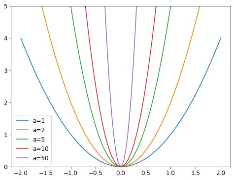

因此，让模型学习高阶参数可能会导致它用一个过于复杂的函数拟合训练集中的所有数据点，这种函数具有非常陡峭的变化，从而导致过拟合。

限制权重过度增长会阻碍模型训练，但能提升其泛化能力。我们来简要地回顾一下理论：权重衰减（简称`wd`）是控制损失函数中平方和项的参数（假设 `parameters` 为所有参数的张量）：

```python
loss_with_wd = loss + wd * (parameters**2).sum()
```

但在实际操作中，计算这个大求和并将其加到损失函数上会非常低效（且可能数值不稳定）。如果你还记得一点高中数学知识，可能会想起 `p**2` 对 `p`的导数是 `2*p` ，因此将这个大求和加到损失函数上，与执行以下操作完全相同：

```python
parameters.grad += wd * 2 * parameters
```

实际上，由于 `wd` 是我们选择的参数，我们可以将其设置为原值的两倍，因此方程中甚至无需 `*2` 。要在 fastai 中使用权重衰减，请在调用 `fit` 或 `fit_one_cycle` 时传入 `wd` 参数（两者均可传入）：

```python
model = DotProductBias(n_users, n_movies, 50)
learn = Learner(dls, model, loss_func=MSELossFlat())
learn.fit_one_cycle(5, 5e-3, wd=0.1)
```

| 迭代轮次 | 训练损失 | 验证损失 | 时间  |
| -------- | -------- | -------- | ----- |
| 0        | 0.972090 | 0.962366 | 00:13 |
| 1        | 0.875591 | 0.885106 | 00:13 |
| 2        | 0.723798 | 0.839880 | 00:13 |
| 3        | 0.586002 | 0.823225 | 00:13 |
| 4        | 0.490980 | 0.823060 | 00:13 |

现在好多了！

#### 创建我们自己的嵌入模块

迄今为止，我们使用嵌入技术时并未深入思考其工作原理。现在让我们尝试不使用该类重新实现点积偏置层。每个嵌入都需要随机初始化的权重矩阵。但需注意：回顾第4章所述，优化器要求能通过模块的 `parameters` 方法获取所有参数。然而这并非完全自动实现——若仅将张量作为属性添加到 `Module` 中，它将不会被包含在 `parameters` 中：

```python
class T(Module):
    def __init__(self): self.a = torch.ones(3)
```

```python
L(T().parameters())
```

```text
(#0) []
```

要告知 `Module` 我们将张量作为参数处理，需要用 `nn.Parameter` 类将其包装。该类本身不提供任何额外功能（仅会自动调用 `requires_grad_` ），仅作为标记用于标识参数范围：

```python
class T(Module):
    def __init__(self): self.a = nn.Parameter(torch.ones(3))
    
L(T().parameters())
```

```text
(#1) [Parameter containing:
tensor([1., 1., 1.], requires_grad=True)]
```

所有 PyTorch 模块都使用 `nn.Parameter` 来处理任何可训练参数，因此我们此前无需显式使用这个封装器：

```python
class T(Module):
    def __init__(self): self.a = nn.Linear(1, 3, bias=False)
    
t = T()
L(t.parameters())
```

```text
(#1) [Parameter containing:
tensor([[-0.9595],
[-0.8490],
[ 0.8159]], requires_grad=True)]
```

```python
type(t.a.weight)
```

```text
torch.nn.parameter.Parameter
```

我们可以创建一个张量作为参数，并进行随机初始化，如下所示：

```python
def create_params(size):
    return nn.Parameter(torch.zeros(*size).normal_(0, 0.01))
```

让我们再次利用它来创建 `DotProductBias` ，但不包含嵌入：

```python
class DotProductBias(Module):
    def __init__(self, n_users, n_movies, n_factors,
                 y_range=(0,5.5)):
        self.user_factors = create_params([n_users,
                                           n_factors])
        self.user_bias = create_params([n_users])
        self.movie_factors = create_params([n_movies,
                                            n_factors])
        self.movie_bias = create_params([n_movies])
        self.y_range = y_range
        
    def forward(self, x):
        users = self.user_factors[x[:,0]]
        movies = self.movie_factors[x[:,1]]
        res = (users*movies).sum(dim=1)
        res += self.user_bias[x[:,0]] +
        self.movie_bias[x[:,1]]
        return sigmoid_range(res, *self.y_range)
```

那么让我们再次训练模型，以验证是否能得到与上一节大致相同的结果：

```python
model = DotProductBias(n_users, n_movies, 50)
learn = Learner(dls, model, loss_func=MSELossFlat())
learn.fit_one_cycle(5, 5e-3, wd=0.1)
```

| 迭代轮次 | 训练损失 | 验证损失 | 时间  |
| -------- | -------- | -------- | ----- |
| 0        | 0.962146 | 0.936952 | 00:14 |
| 1        | 0.858084 | 0.884951 | 00:14 |
| 2        | 0.740883 | 0.838549 | 00:14 |
| 3        | 0.592497 | 0.823599 | 00:14 |
| 4        | 0.473570 | 0.824263 | 00:14 |

现在，让我们看看我们的模型学到了什么。

### 解释嵌入与偏差

我们的模型已具备实用价值，能够为用户提供电影推荐——但更值得关注的是它所发现的参数。其中最易解读的是偏向性参数。以下是偏向向量值最低的电影：

```python
movie_bias = learn.model.movie_bias.squeeze()
idxs = movie_bias.argsort()[:5]
[dls.classes['title'][i] for i in idxs]
```

```text
['Children of the Corn: The Gathering (1996)',
'Lawnmower Man 2: Beyond Cyberspace (1996)',
'Beautician and the Beast, The (1997)',
'Crow: City of Angels, The (1996)',
'Home Alone 3 (1997)']
```

想想这意味着什么。它表明的是：对于每部电影，即使用户与它的潜在特征高度匹配（稍后我们将看到，这些特征往往代表动作强度、电影年代等要素），用户通常仍然不喜欢它。我们本可直接按平均评分排序电影，但观察学习到的偏好揭示了更耐人寻味的信息：它不仅表明某类电影通常不受观众青睐，更揭示了即便属于观众本应喜爱的类型，人们也往往不愿观看！同理，以下是偏好值最高的影片：

```python
idxs = movie_bias.argsort(descending=True)[:5]
[dls.classes['title'][i] for i in idxs]
```

```text
['L.A. Confidential (1997)',
'Titanic (1997)',
'Silence of the Lambs, The (1991)',
'Shawshank Redemption, The (1994)',
'Star Wars (1977)']
```

因此，例如，即使你平时不喜欢侦探电影，你也可能会喜欢《洛城机密》！

直接解读嵌入矩阵并非易事。

其中涉及的因素实在太多，人类难以全面考量。但有一种技术能从中提取出最重要的潜在维度，即主成分分析（principal component analysis, PCA）。本书不会深入探讨该方法，因为它对深度学习实践者而言并非必备知识。若感兴趣，建议查阅fast.ai课程 [《程序员的计算线性代数》](https://oreil.ly/NLj2R) 。图8-3展示了基于两个最强PCA成分的电影数据可视化效果。

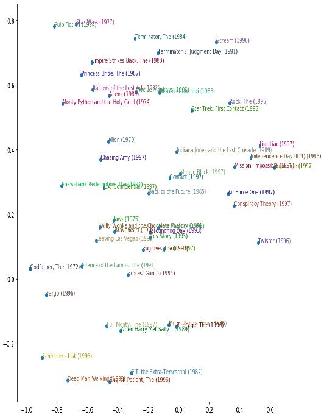

[^图8-3]: 基于两个最强PCA成分的电影表示

我们在此可见，模型似乎发现了经典电影与流行文化电影的概念差异，或者说这里所呈现的或许是影评界公认的评价。

> JEREMY说
>
> 无论训练多少模型，我始终为这些随机初始化的数字集合感到震撼与惊喜——它们仅凭如此简单的机制，竟能自主发掘数据中的奥秘。这简直像作弊般神奇：我编写的代码能完成实用任务，却从未真正告诉它该如何实现！

我们从零开始定义模型以向你展示其内部机制，但你也可以直接使用fastai库进行构建。接下来我们将探讨具体实现方法。

#### 使用 fastai.collab

我们可以使用fastai的 `collab_learner` ，基于之前展示的精确结构创建并训练协同过滤模型：

```python
learn = collab_learner(dls, n_factors=50, y_range=(0, 5.5))
learn.fit_one_cycle(5, 5e-3, wd=0.1)
```

| 迭代轮次 | 训练损失 | 验证损失 | 时间  |
| -------- | -------- | -------- | ----- |
| 0        | 0.931751 | 0.953806 | 00:13 |
| 1        | 0.851826 | 0.878119 | 00:13 |
| 2        | 0.715254 | 0.834711 | 00:13 |
| 3        | 0.583173 | 0.821470 | 00:13 |
| 4        | 0.496625 | 0.821688 | 00:13 |

通过打印模型可以查看各层的名称：

```python
learn.model
```

```text
EmbeddingDotBias(
(u_weight): Embedding(944, 50)
(i_weight): Embedding(1635, 50)
(u_bias): Embedding(944, 1)
(i_bias): Embedding(1635, 1)
)
```

我们可以利用这些工具复现上一节中的任何分析——例如：

```python
movie_bias = learn.model.i_bias.weight.squeeze()
idxs = movie_bias.argsort(descending=True)[:5]
[dls.classes['title'][i] for i in idxs]
```

```text
['Titanic (1997)',
"Schindler's List (1993)",
'Shawshank Redemption, The (1994)',
'L.A. Confidential (1997)',
'Silence of the Lambs, The (1991)']
```

利用这些已学习的嵌入向量，我们还可以做一件有趣的事情：计算距离。

#### 嵌入距离

在二维地图上，我们可通过毕达哥拉斯公式（译者注：在中国这个一般叫勾股定理）计算两点间距离：$\sqrt{x^2+y^2}$（其中x和y分别表示坐标在两轴上的距离）。对于50维空间的嵌入，我们采用完全相同的方法，只是需要求和所有50个坐标距离的平方。

如果存在两部几乎完全相同的电影，它们的嵌入向量也必然高度相似，因为喜欢这两部电影的用户群体几乎完全重合。这里存在一个更普遍的原理：电影相似性可通过喜欢这些电影的用户相似性来定义。这直接意味着两部电影的嵌入向量之间的距离可以定义这种相似性。我们可以利用这个原理找到与《沉默的羔羊》最相似的电影：

```python
movie_factors = learn.model.i_weight.weight
idx = dls.classes['title'].o2i['Silence of the Lambs, The
                               (1991)']
                               distances = nn.CosineSimilarity(dim=1)(movie_factors,
                                                                      movie_factors[idx][None])
idx = distances.argsort(descending=True)[1]
dls.classes['title'][idx]
```

```text
'Dial M for Murder (1954)'
```

既然我们已经成功训练了模型，现在来看看如何处理用户没有数据的情况。我们该如何为新用户提供推荐？

### 引导式协同过滤模型

在实践中使用协同过滤模型面临的最大挑战是引导问题。该问题的极端情况是没有用户，因此没有可供学习的历史数据。面对首位用户时，该推荐哪些商品？

但即便你是拥有悠久用户交易历史的成熟企业，仍面临一个问题：当新用户注册时该如何处理？当产品组合新增商品时又该如何应对？对此并无神奇解决方案，我们提出的建议本质上只是运用常识的不同变体。你可以为新用户分配其他用户所有嵌入向量的平均值，但这种方法存在问题：这种特定的潜在因素组合可能并不常见（例如，科幻因素的平均值可能很高，动作因素的平均值可能很低，但喜欢科幻却不喜欢动作的人并不多见）。更优方案是选取特定用户作为 *平均品味* 的代表。

更优秀的做法是基于用户元数据构建表格模型来生成初始嵌入向量。当用户注册时，考虑一下哪些问题能帮助你理解其偏好。随后可创建一个模型：因变量为用户的嵌入向量，自变量则包含你向其提问所得的结果及其注册元数据。下一节我们将探讨如何构建此类表格模型。（你可能注意到，当注册Pandora或Netflix等服务时，它们通常会询问你偏好的电影或音乐类型；这正是它们生成初始协同过滤推荐的原理。）

需要注意的是，少数极度热情的用户可能最终主导了整个用户群体的推荐结果。这种现象在电影推荐系统中尤为常见——动漫爱好者往往大量观看此类作品，鲜少涉猎其他类型，且热衷于在网站上投入大量时间评分。结果导致动漫作品在众多“史上最佳电影榜单”中严重过载。这种情况下，样本偏差问题显而易见；但若偏差发生在潜在因子层面，则可能完全难以察觉。

此类问题可能彻底改变用户群体的构成，并影响系统的运行机制。这种现象尤其因正反馈循环而显著。若少数用户倾向于主导推荐系统的方向，他们自然会吸引更多同类用户加入系统。这无疑会放大最初的表征偏差——此类偏差具有自然的指数级放大倾向。你或许见过企业高管对在线平台急速恶化感到震惊的案例——这些平台竟开始传递与创始人价值观相悖的内容。在这种反馈循环作用下，价值观分歧不仅会迅速发生，更会在悄无声息中持续恶化，直至为时已晚才被察觉。

在这样的自我强化系统中，我们或许应该预期此类反馈循环是常态而非例外。因此，你应当预见它们的存在，提前规划应对方案，并明确如何处理这些问题。尝试思考反馈循环在系统中可能呈现的所有形态，以及如何在数据中识别它们。归根结底，这又回到了我们最初关于如何避免机器学习系统部署灾难的建议：关键在于确保人为干预环节的存在，实施严密监控，并采取循序渐进、审慎周密的部署策略。

我们的点积模型效果相当出色，它构成了许多成功推荐系统的基础。这种协同过滤方法被称为概率矩阵分解（probabilistic matrix factorization，PMF）。另一种方法是深度学习，在相同数据条件下通常能取得类似的良好效果。

### 深度学习在协同过滤中的应用

要将我们的架构转化为深度学习模型，第一步是取嵌入查找的结果，并将这些激活值拼接在一起。这样就得到一个矩阵，随后我们可以按常规方式将其传递通过线性层和非线性层。

由于我们将对嵌入矩阵进行拼接而非求其点积，因此两个嵌入矩阵可以具有不同的尺寸（即不同的潜在因子数量）。fastai 提供了一个 `get_emb_sz` 函数，该函数基于 fast.ai 实践中验证有效的启发式算法，为您的数据推荐嵌入矩阵的推荐尺寸：

```python
embs = get_emb_sz(dls)
embs
```

```text
[(944, 74), (1635, 101)]
```

让我们实现这个类：

```python
class CollabNN(Module):
    def __init__(self, user_sz, item_sz, y_range=(0,5.5),
                 n_act=100):
        self.user_factors = Embedding(*user_sz)
        self.item_factors = Embedding(*item_sz)
        self.layers = nn.Sequential(
            nn.Linear(user_sz[1]+item_sz[1], n_act),
            nn.ReLU(),
            nn.Linear(n_act, 1))
        self.y_range = y_range
        
    def forward(self, x):
        embs =
        self.user_factors(x[:,0]),self.item_factors(x[:,1])
        x = self.layers(torch.cat(embs, dim=1))
        return sigmoid_range(x, *self.y_range)
```

并用它创建一个模型：

```python
model = CollabNN(*embs)
```

`CollabNN` 以与本章先前类相同的方式创建嵌入（`Embedding`）层，只是现在使用了嵌入尺寸。`self.layers` 与我们在第4章为MNIST创建的迷你神经网络完全相同。随后在前向传播中，我们应用嵌入操作，将结果拼接后传递至迷你神经网络。最后，我们像之前模型那样应用 `sigmoid_range` 函数。

让我们看看它是否能训练：

```python
learn = Learner(dls, model, loss_func=MSELossFlat())
learn.fit_one_cycle(5, 5e-3, wd=0.01)
```

| 迭代轮次 | 训练损失 | 验证损失 | 时间  |
| -------- | -------- | -------- | ----- |
| 0        | 0.940104 | 0.959786 | 00:15 |
| 1        | 0.893943 | 0.905222 | 00:14 |
| 2        | 0.865591 | 0.875238 | 00:14 |
| 3        | 0.800177 | 0.867468 | 00:14 |
| 4        | 0.760255 | 0.867455 | 00:14 |

fastai 在调用 `collab_learner` 时若传入 `use_nn=True`（包括为你调用 `get_emb_sz`），便会在 fastai.collab 中提供此模型，并支持轻松创建更多层。例如，这里我们创建了两个隐藏层，尺寸分别为 100 和 50：

```python
learn = collab_learner(dls, use_nn=True, y_range=(0, 5.5),
layers=[100,50])
learn.fit_one_cycle(5, 5e-3, wd=0.1)
```

| 迭代轮次 | 训练损失 | 验证损失 | 时间  |
| -------- | -------- | -------- | ----- |
| 0        | 1.002747 | 0.972392 | 00:16 |
| 1        | 0.926903 | 0.922348 | 00:16 |
| 2        | 0.877160 | 0.893401 | 00:16 |
| 3        | 0.838334 | 0.865040 | 00:16 |
| 4        | 0.781666 | 0.864936 | 00:16 |

`learn.model` 是类型为 `EmbeddingNN` 的对象。让我们来看看 fastai 对此类的代码：

```python
@delegates(TabularModel)
class EmbeddingNN(TabularModel):
    def __init__(self, emb_szs, layers, **kwargs):
        super().__init__(emb_szs, layers=layers, n_cont=0,
                         out_sz=1, **kwargs)
```

哇，代码量真不多！这个类继承自 `TabularModel` ，所有功能都来自该基类。在 `__init__` 中，它调用 `TabularModel` 的同名方法，传入参数 `n_cont=0` 和 `out_sz=1`；除此之外，它仅将接收到的所有参数原样传递过去。

> `kwargs` 与 `@delegates`修饰符
>
> `EmbeddingNN` 将 `**kwargs` 作为 `__init__` 的参数。在 Python 中，参数列表中的 `**kwargs` 表示“将所有额外的关键字参数放入名为 `kwargs` 的字典中”。而在参数列表中，`**kwargs` 表示“将 `kwargs` 字典中的所有键值对作为命名参数插入此处”。这种方法被许多流行库采用，例如 `matplotlib` 中，其核心绘图函数 `simply` 具有 `plot(*args, **kwargs)` 的签名。该绘图函数的文档说明写道“ `kwargs` 参数包含 `Line2D` 的属性”，随后列出了这些属性。
>
> 我们在 `EmbeddingNN` 中使用 `**kwargs` 来避免重复编写 `TabularModel` 的所有参数，并保持参数同步。然而这使得我们的 API 难以操作，因为Jupyter Notebook无法识别可用参数。因此，参数名的Tab补全功能和签名弹出列表等功能将无法正常工作。
>
> fastai 通过提供一个特殊的 `@delegates` 修饰符来解决这个问题，该修饰符会自动修改类或函数（此处为 `EmbeddingNN`）的签名，将所有关键字参数插入签名中。

尽管 `EmbeddingNN` 的结果略逊于点积方法（这彰显了精心构建领域架构的力量），但它确实让我们能够实现一项至关重要的功能：现在我们可以直接整合其他用户和电影信息、日期时间信息，或任何可能与推荐相关的信息。这正是 `TabularModel` 的作用所在。事实上，我们现在已知 `EmbeddingNN` 本质上就是一种 `TabularModel` ，其参数设置为 `n_cont=0` 且输出尺寸 `out_sz=1` 。因此，我们应当深入学习 `TabularModel及其应用技巧以获得更优结果！相关内容将在下一章展开。

### 总结

在首个非计算机视觉应用中，我们研究了推荐系统，并观察到梯度下降如何从历史评分中学习物品的内在因素或偏好。这些因素进而能为我们提供数据信息。

我们还用PyTorch构建了首个模型。本书后续章节将深入探讨更多相关内容，但在此之前，让我们先完成对深度学习其他通用应用场景的探索，继续聚焦表格数据领域。

### 问卷调查

1. 协同过滤解决了什么问题？
2. 它是如何解决的？
3. 为什么协同过滤预测模型可能无法成为一个非常有用的推荐系统？
4. 协同过滤数据的交叉表表示是什么样子的？

5. 编写代码生成MovieLens数据的交叉表表示（你可能需要进行网络搜索！）
6. 什么是潜在因子？为何称为“潜在”？
7. 什么是点积？使用纯Python列表手动计算点积
8. `pandas.DataFrame.merge` 函数的作用是什么？
9. 什么是嵌入矩阵？
10. 嵌入与独热编码向量矩阵之间有何关系？
11. 若独热编码向量能实现相同功能，为何仍需嵌入？
12. 训练开始前（假设未使用预训练模型），嵌入包含哪些内容？
13. 创建一个类（尽可能不偷看代码！）并使用它。
14. `x[:,0]` 返回什么？
15. 重写 `DotProduct` 类（尽可能不偷看代码！）并用它训练模型。
16. MovieLens适合使用哪种损失函数？为什么？
17. 若对MovieLens使用交叉熵损失会怎样？需要如何修改模型？
18. 偏置项在点积模型中有什么作用？
19. 权重衰减的另一个名称是什么？
20. 写出权重衰减的计算公式（别偷看！）。
21. 写出权重衰减的梯度方程。它为何有助于降低权重？

22. 为什么降低权重能提升泛化能力？
23. PyTorch中的 `argsort` 函数有何作用？
24. 对电影偏好进行排序与按电影平均整体评分是否效果相同？为什么？
25. 如何打印模型中各层的名称及详细信息？
26. 协同过滤中的“引导采样问题”指什么？
27. 如何处理新用户和新电影的引导采样问题？
28. 反馈循环如何影响协同过滤系统？
29. 在协同过滤中使用神经网络时，为何电影和用户可采用不同数量的因子？
30. `CollabNN` 模型中为何包含 `nn.Sequential` 组件？
31. 若需在协同过滤模型中添加用户/商品元数据或时间戳等信息，应采用何种模型？

#### 进一步研究

1. 仔细比较 `DotProductBias` 的嵌入版本与 `create_params` 版本之间的所有差异，并尝试理解每项修改的必要性。若不确定，可逐项撤销修改观察效果。（注意：甚至 `forward` 中使用的括号类型也发生了变化！）
2. 寻找其他三个应用协同过滤的领域，分析该方法在这些场景中的优缺点。
3. 使用完整的MovieLens数据集完成本笔记本，并将结果与在线基准进行对比。尝试提升预测准确率。可参考书籍官网和fast.ai论坛获取思路。注意完整数据集包含更多列——尝试利用这些列（下一章内容可能提供启发）。
4. 为MovieLens创建采用交叉熵损失的模型，并与本章模型进行对比。

## 9. 深度解析表格建模

表格建模采用表格形式的数据（如电子表格或CSV文件）。其目标是基于其他列的值来预测某一列的值。本章不仅将探讨深度学习，还将介绍更通用的机器学习技术（如随机森林），因为根据具体问题需求，这些技术可能产生更优结果。

我们将探讨如何预处理和清理数据，以及如何解读模型训练后的结果，但首先要了解如何将包含类别信息的列输入到期望数值输入的模型中——这需要借助嵌入技术实现。

### 分类化嵌入

在表格数据中，某些列可能包含数值数据（如“年龄”），而其他列则包含字符串值（如“性别”）。数值数据可直接输入模型（可选预处理），但其他列需转换为数字。由于这些列的值对应不同类别，我们通常称此类变量为分类变量（categorical variables）。第一类则称为连续变量（continuous variables）。

> 术语：连续变量与分类变量
>
> 连续变量是数值数据，例如“年龄”，可直接输入模型，因为它们支持直接加法和乘法运算。分类变量包含若干离散类别，例如“电影ID”，这类变量不支持加法和乘法运算（即使它们以数字形式存储）。

2015年底，罗斯曼销售竞赛在Kaggle平台举行。参赛者获得德国多家门店的广泛数据，他们的任务是预测特定日期的销售额。该竞赛旨在协助企业优化库存管理，在满足需求的同时避免积压冗余库存。官方训练集提供了丰富的门店数据，同时允许参赛者使用额外数据——前提是这些数据必须公开且对所有参赛者平等开放。

一位金牌得主采用了深度学习技术，这是已知最早的尖端深度学习表格模型实例之一。其方法基于领域知识，所需特征工程远少于其他金牌得主。论文 [《类别变量的实体嵌入》](https://oreil.ly/VmgoU) 详细阐述了该方法。在书籍官网的 [线上专有章节](https://book.fast.ai/) 中，我们展示了如何从零开始复现该模型，并达到论文中展示的相同精度。论文摘要中，作者（Cheng Guo 和 Felix Bekhahn）指出：

> 实体嵌入不仅能减少内存占用并加速神经网络运行，与独热编码相比，更重要的是通过在嵌入空间中将相似值映射至邻近位置，揭示了分类变量的内在属性……[该方法]对包含大量高基数特征的数据集尤为有效，在其他方法容易过拟合的场景下表现突出…… 由于实体嵌入为分类变量定义了距离度量，它可用于分类数据的可视化与数据聚类。

在构建协同过滤模型时，我们已注意到所有这些要点。然而，我们清楚地看到这些洞见远不止于协同过滤本身。

该论文还指出（正如我们在前一章讨论的那样），嵌入层完全等同于在每个单热编码输入层之后放置一个普通的线性层。作者使用图9-1中的示意图来展示这种等价性。请注意，“稠密层”与“线性层”具有相同含义，而独热编码层代表输入。

这一见解至关重要，因为我们已掌握线性层的训练方法，这表明从架构和训练算法的角度来看，嵌入层只是另一种层。在前一章构建协同过滤神经网络时，我们也从实践中验证了这一点——该网络结构与图示完全一致。

正如我们分析电影评论的嵌入权重那样，实体嵌入论文的作者们也分析了其销售预测模型的嵌入权重。他们的发现令人惊叹，并印证了第二个关键洞见：嵌入技术将分类变量转化为既连续又具有实际意义的输入。

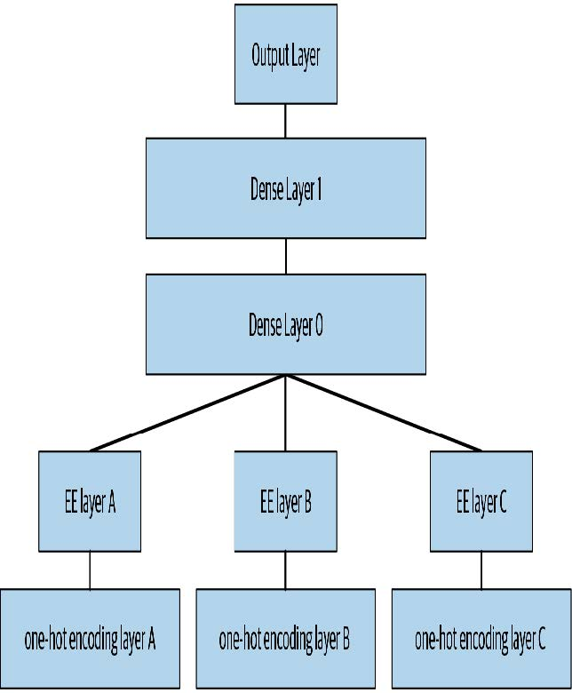

[^图9-1]: 神经网络中的实体嵌套（由Cheng Guo和Felix Berkhahn提供）

图9-2中的图像阐释了这些概念。它们基于论文中采用的方法，并结合了我们添加的分析内容。

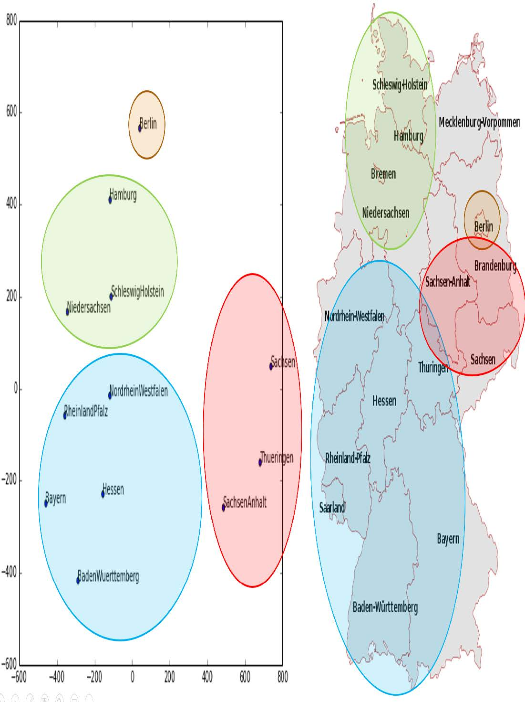

[^图9-2]: 国家嵌入与地图（由Cheng Guo和Felix Berkhahn提供）

左侧是州类别可能取值的嵌入矩阵图示。对于分类变量，我们称其可能取值为“层级”（或“类别”或“类”），因此此处一个层级是“柏林”，另一个是“汉堡”（译者注：这是德国的一个城市，而不是那种你爱吃的食物！）等等。右侧是德国地图。德国各州的实际地理位置并未包含在原始数据中，但模型仅凭商店销售行为就自主学习到了它们的位置！

你还记得我们讨论过嵌入之间的距离吗？论文作者将商店嵌入之间的距离与商店实际地理距离绘制成图（见图9-3）。他们发现两者吻合得非常紧密！

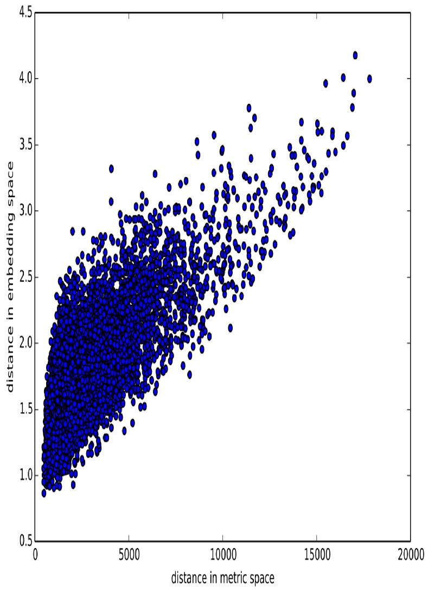

[^图9-3]: 店铺间距（由Cheng Guo和Felix Berkhahn提供）

我们甚至尝试绘制了星期和月份的嵌入图，发现日历上相邻的日期和月份在嵌入图中也呈现出相近的分布，如图9-4所示。

这两个例子突出的特点在于：我们向模型提供的是关于离散实体（如德国各州或星期几）的基本分类数据，随后模型通过学习为这些实体构建了嵌入表示，从而定义了它们之间连续的距离概念。由于这种嵌入距离是基于数据中的真实模式学习而来的，因此往往能与我们的直觉相吻合。

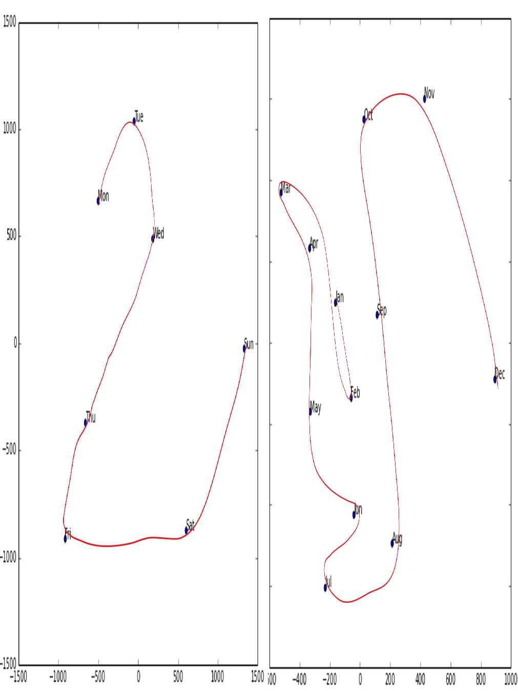

[^图9-4]: 日期嵌入（由Cheng Guo和Felix Berkhahn提供）

此外，嵌入向量本身具有连续性这一特性也极具价值，因为模型更擅长处理连续变量。考虑到模型由众多连续参数权重和连续激活值构成，且通过梯度下降（一种用于寻找连续函数极值的学习算法）进行更新，这种优势便不足为奇。

另一个好处是，我们可以将连续嵌入值与真正的连续输入数据直接结合：只需将变量拼接起来，并将拼接后的数据输入到第一个稠密层即可。换言之，原始分类数据在与原始连续输入数据交互前，会先经嵌入层进行转换。这正是fastai以及Guo和Berkhahn处理包含连续与分类变量的表格模型的方式。

采用这种连接方法的一个实例是谷歌在Google Play上如何进行推荐，正如论文 [《推荐系统中的宽与深的学习》](https://oreil.ly/wsnvQ) 中所阐述的。图9-5对此进行了说明。

有趣的是，谷歌团队将前一章中我们看到的两种方法结合起来：点积（他们称之为叉积）和神经网络方法。

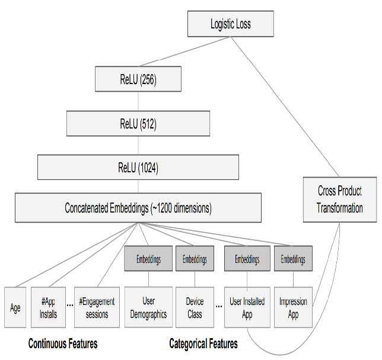

[^图9-5]: Google Play推荐系统

让我们稍作停顿。迄今为止，解决所有建模问题的方案都是训练深度学习模型。对于图像、声音、自然语言文本等复杂非结构化数据而言，这确实是个相当不错的经验法则。深度学习在协同过滤领域同样表现出色。但对于表格数据的分析，它未必总是最佳的起点。

### 深度学习之外

大多数机器学习课程会向你抛出数十种算法，仅附带简短的技术说明来解释其背后的数学原理，或许还会给出一个玩具示例。面对如此庞杂的技术体系，你往往感到困惑，对如何实际应用这些技术也几乎一无所知。

好消息是，现代机器学习可以浓缩为几种关键技术，这些技术具有广泛适用性。最新研究表明，绝大多数数据集仅需两种方法就能得到最佳建模：

- 决策树集成（即随机森林和梯度提升机），主要适用于结构化数据（例如大多数公司数据库表中的数据）
- 采用随机梯度下降（SGD）训练的多层神经网络（即浅层和/或深度学习），主要适用于非结构化数据（例如音频、图像和自然语言）

尽管深度学习在处理非结构化数据时几乎总是明显更优，但这两种方法在处理多种结构化数据时往往能得出相当相似的结果。但决策树集成模型通常训练速度更快，往往更易于解释，无需特殊GPU硬件即可进行大规模推理，且通常需要较少的超参数调优。它们也比深度学习流行得更久，因此围绕它们形成了更成熟的工具生态系统和文档体系。

最重要的是，对于决策树集成模型而言，解释表格数据模型的关键步骤要容易得多。现有的工具和方法能够解答以下相关问题：数据集中哪些列对预测最为重要？它们与因变量有何关联？它们之间如何相互作用？以及哪些特定特征对某些观测值最为关键？

因此，决策树集合是我们分析新表格数据集的首选方法。

此准则的例外情况是当数据集满足以下任一条件时：

- 存在一些高基数分类变量，它们至关重要（“基数”指代表类别的离散层级数量，因此高基数分类变量类似于邮政编码，可能包含数千个层级）。
- 某些列包含的数据最适合通过神经网络进行理解，例如纯文本数据。

在实际操作中，当我们处理满足这些特殊条件的数据集时，我们总是同时尝试决策树集成和深度学习，以确定哪种方法效果最佳。在协同过滤示例中，深度学习很可能成为有效方案，因为我们至少存在两个高基数分类变量：用户和电影。但实际情况往往没有这么简单，通常会同时存在高基数与低基数分类变量以及连续变量。

无论哪种情况，显然我们都需要将决策树集成模型加入我们的建模工具箱！

迄今为止，我们几乎所有繁重的工作都依赖PyTorch和fastai完成。但这些库主要为需要大量矩阵乘法和导数运算的算法设计（比如深度学习！）。决策树完全不依赖这些操作，因此PyTorch用处不大。

相反，我们将主要依赖一个名为 `scikit-learn`（也称为 `sklearn`）的库。`Scikit-learn`是创建机器学习模型的热门库，采用深层学习未涵盖的方法。此外，我们需要进行表格数据处理和查询，因此将使用 Pandas 库。最后还需 NumPy ，因为它是 sklearn 和Pandas共同依赖的核心数值编程库。

本书没有时间深入探讨所有这些库，因此我们仅会简要介绍每个库的主要部分。若需更深入的讨论，我们强烈推荐韦斯·麦金尼（Wes McKinney’s）的 [《Python数据分析》](http://shop.oreilly.com/product/0636920050896.do) （O'Reilly出版社）。麦金尼正是Pandas的创建者，因此你完全可以信赖书中信息的准确性！

首先，让我们收集将要使用的数据。

### 数据集

本章使用的数据集源自推土机蓝皮书Kaggle竞赛，其描述如下：“竞赛目标是基于设备使用情况、类型及配置，预测某台重型设备在拍卖中的成交价格。数据来源于拍卖结果公告，包含设备使用情况及配置信息。”

这是一种非常常见的数据集类型和预测问题，类似于你在项目或工作中可能遇到的情况。该数据集可在Kaggle网站上下载，该网站专门举办数据科学竞赛。

#### Kaggle上的比赛

Kaggle 是有志成为数据科学家或希望提升机器学习技能者的绝佳资源。没有什么比亲自动手实践并获得实时反馈更能帮助你提升技能了。

Kaggle 提供以下内容：

- 有趣的数据集
- 关于你表现的反馈
- 排行榜，助你了解优秀方案、可行方案及前沿技术
- 获奖选手撰写的博客文章，分享实用技巧与方法

迄今为止，我们所有的数据集均可通过fastai的集成数据集系统下载。然而，本章将使用的数据集仅可在Kaggle获取。因此，你需要先在该网站注册，然后进入 [竞赛页面](https://oreil.ly/B9wfd) 。在该页面点击“规则”，再点击“我理解并接受”。（尽管竞赛已结束，你不会参与其中，但仍需同意规则才能下载数据。）

下载Kaggle数据集最简单的方法是使用Kaggle API。你可以通过 `pip` 安装该API，在笔记本单元格中运行以下命令：

```bash
!pip install kaggle
```

使用Kaggle API需要API密钥；获取方式如下：在Kaggle网站点击个人头像，选择“我的账户”，然后点击“创建新API令牌”。这可以将把名为 `kaggle.json`的文件保存至您的电脑。你需要将此密钥复制到你的GPU服务器上。为此，请打开下载的文件，复制其内容，并将其粘贴到本章关联笔记本中以下单元格的单引号内（例如：`creds = ‘{“username”:“xxx”,‘key’:“xxx”}’`）：

```python
creds = ''
```

然后执行此单元格（此操作只需运行一次）：

```python
cred_path = Path('~/.kaggle/kaggle.json').expanduser()
if not cred_path.exists():
    cred_path.parent.mkdir(exist_ok=True)
    cred_path.write(creds)
    cred_path.chmod(0o600)
```

现在你可以从Kaggle下载数据集！请选择下载路径：

```python
path = URLs.path('bluebook')
path
```

```text
Path('/home/sgugger/.fastai/archive/bluebook')
```

并使用Kaggle API将数据集下载到该路径并解压：

```python
if not path.exists():
    path.mkdir()
    api.competition_download_cli('bluebook-for-bulldozers', path=path)
    file_extract(path/'bluebook-for-bulldozers.zip')
    
path.ls(file_type='text')
```

```text
(#7)
[Path('Valid.csv'),Path('Machine_Appendix.csv'),Path('ValidSolution.csv'),P
>
ath('TrainAndValid.csv'),Path('random_forest_benchmark_test.csv'),Path('Test.
> csv'),Path('median_benchmark.csv')]
```

既然我们已经下载了数据集，现在就来看看它吧！

#### 来看看数据

Kaggle 提供了我们数据集中部分字段的信息。数据页面说明 `train.csv` 中的关键字段如下：

- `SalesID`

  销售的唯一标识符。

- `MachineID`

  机器的唯一标识符。一台机器可被多次售出。

- `saleprice`

  机器在拍卖中的成交价格（仅在train.csv中提供）。

- `saledate`

  销售发生的时间。

在任何数据科学工作中， *直接查看数据* 至关重要，这样可以确保你理解其格式、存储方式、包含的值类型等。即使你已阅读过数据描述，实际数据也可能与你预期不符。我们将首先将训练集读取到Pandas数据框中。通常建议同时指定 `low_memory=False` 参数，除非Pandas实际内存不足并返回错误。`low_memory` 参数默认值为 `True`，它指示Pandas每次仅分析少量数据行以确定各列数据类型。这意味着Pandas可能为不同数据行分配不同数据类型，通常会导致后续数据处理错误或模型训练问题。

让我们加载数据并查看列：

```python
df = pd.read_csv(path/'TrainAndValid.csv', low_memory=False)
```

```python
df.columns
```

```text
Index(['SalesID', 'SalePrice', 'MachineID', 'ModelID', 'datasource',
'auctioneerID', 'YearMade', 'MachineHoursCurrentMeter',
'UsageBand',
'saledate', 'fiModelDesc', 'fiBaseModel', 'fiSecondaryDesc',
'fiModelSeries', 'fiModelDescriptor', 'ProductSize',
'fiProductClassDesc', 'state', 'ProductGroup', 'ProductGroupDesc',
'Drive_System', 'Enclosure', 'Forks', 'Pad_Type', 'Ride_Control',
'Stick', 'Transmission', 'Turbocharged', 'Blade_Extension',
'Blade_Width', 'Enclosure_Type', 'Engine_Horsepower',
'Hydraulics',
'Pushblock', 'Ripper', 'Scarifier', 'Tip_Control', 'Tire_Size',
'Coupler', 'Coupler_System', 'Grouser_Tracks', 'Hydraulics_Flow',
'Track_Type', 'Undercarriage_Pad_Width', 'Stick_Length', 'Thumb',
'Pattern_Changer', 'Grouser_Type', 'Backhoe_Mounting',
'Blade_Type',
'Travel_Controls', 'Differential_Type', 'Steering_Controls'],
dtype='object')
```

这可有不少列需要我们查看！不妨浏览数据集，了解每列包含哪些信息。接下来我们将学习如何“锁定”最有趣的部分。

此时，处理序数列是一个不错的下一步操作。这指的是包含字符串或类似内容的列，但这些字符串具有自然排序关系。例如，以下是 `ProductSize` 的等级：

```python
df['ProductSize'].unique()
```

```text
array([nan, 'Medium', 'Small', 'Large / Medium', 'Mini', 'Large',
'Compact'],
> dtype=object)
```

我们可以像这样告诉Pandas这些层级的合适排序：

```python
sizes = 'Large','Large / Medium','Medium','Small','Mini','Compact'
```

```python
df['ProductSize'] = df['ProductSize'].astype('category')
df['ProductSize'].cat.set_categories(sizes, ordered=True, inplace=True)
```

最重要的数据列是因变量——即我们想要预测的变量。请记住，模型的度量标准是反映预测质量的函数。注意项目采用何种度量标准至关重要。通常，选择度量标准是项目设置的重要环节。在多数情况下，选择合适的度量标准不仅是简单选用现有变量，更像是一个设计过程。你需要仔细思考：究竟哪个度量指标（或指标组合）能真正衡量你所关注的模型质量概念？若现有变量中没有能体现该指标的变量，则应尝试利用现有变量构建该指标。

然而在此案例中，Kaggle明确指定了评估指标：实际拍卖价格与预测价格之间的对数均方根误差（the root mean squared log, RMLSE）。我们只需进行少量处理即可应用该指标：对价格取对数后，其 `m_rmse` 值即为最终所需结果：

```python
dep_var = 'SalePrice'
```

```python
df[dep_var] = np.log(df[dep_var])
```

现在，我们准备探索适用于表格数据的首个机器学习算法：决策树。

### 决策树

决策树集成，顾名思义，依赖于决策树。那么我们就从这里开始吧！决策树会对数据提出一系列二元（是或否）问题。每次提问后，树上该分支的数据都会被划分为“是”与“否”两条路径（如图9-6所示）。经过一次或多次提问后，系统要么根据所有先前答案给出预测，要么需要继续提问。

这组问题构成了一个流程，用于处理任何数据项——无论是来自训练集的项还是新项——并将其分配到某个组别。具体而言，在完成问答后，我们可以判定该项与所有在训练数据集中给出相同答案集的训练数据项属于同一组别。但这有何用？我们模型的目标是预测数据项的值，而非将它们归入训练数据集中的组别。其价值在于：我们现在能为每个组别分配预测值——对于回归任务，我们取该组内数据项的目标均值。

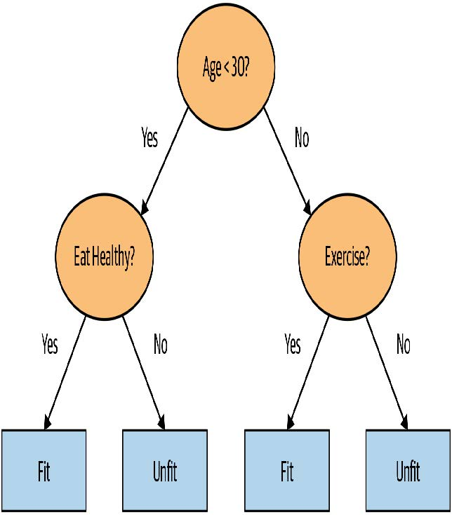

[^图9-6]: 一种决策树的示例

让我们思考如何找到正确的问题。当然，我们不希望自己创建所有这些问题——这正是计算机的用武之地！训练决策树的基本步骤可以非常简单地写下来：

1. 依次遍历数据集的每一列。
2. 对每列数据，依次遍历该列的所有可能取值水平。
3. 尝试将数据分为两组：一组取值大于该数值，另一组取值小于该数值（若为分类变量，则根据是否等于该分类变量的特定取值水平进行划分）。
4. 计算两组数据的平均售价，并评估其与设备实际售价的吻合度。将此视为基础预测模型：设备售价即归属组别的平均售价。
5. 遍历所有列及其所有可能的取值后，选择能使该简单模型获得最佳预测结果的分割点。
6. 基于选定的分割点，数据现分为两组。将每组视为独立数据集，通过重复执行步骤1为各组寻找最佳分割点。
7. 递归执行此过程，直至满足各组的终止条件——例如当某组仅剩20项时停止进一步分割。

虽然这个算法自己实现起来相当简单（而且这样做是个很好的练习），但我们可以通过使用sklearn内置的实现来节省一些时间。

不过，首先我们需要进行一些数据准备工作。

> ALEXIS说
>
> 这里有一个值得深思的问题。如果我们认为定义决策树的过程本质上是在变量上选择一组分割问题的序列，那么我们可能会问：我们如何确定这个过程选择的是正确的序列？其规则在于：先选择能产生最佳分割（即最精确地将项目划分为两个独立类别）的分割问题，再将相同规则应用于分割后形成的子集，如此循环往复。这种方法在计算机科学中被称为“贪心算法”。你能想象这样一种情境吗：提出一个“效力较弱”的分割问题，反而能在后续路径（或者说主干路径！）上实现更优分割，从而获得整体更佳的结果？

#### 日期处理

数据准备的第一步是丰富日期表示形式。我们刚才描述的决策树的基本原理是二分法——将一个群体分为两部分。对于序数变量，我们根据变量值是否大于（或小于）阈值划分数据集；对于分类变量，则根据变量是否属于特定类别进行划分。因此该算法能同时基于序数数据和分类数据对数据集进行分割。

但这如何适用于常见的数据类型——日期呢？你可能希望将日期视为序数值，因为说某个日期大于另一个是有意义的。然而，日期与大多数序数值略有不同，某些日期在质上与其他日期存在差异，这种差异往往与我们所建模的系统密切相关。

为使算法智能处理日期，我们希望模型不仅能判断日期新旧顺序， 我们可能希望模型基于以下因素进行决策：该日期所属的星期几、是否为法定假日、所属月份等。为此，我们将每个日期列替换为一组日期元数据列，例如假日、星期几和月份。这些列提供了我们认为可能有用的分类数据。

fastai 提供了一个能帮我们完成此操作的函数——我们只需传入包含日期的列名：

```python
df = add_datepart(df, 'saledate')
```

既然说到这里，我们也对测试集做同样的处理：

```python
df_test = pd.read_csv(path/'Test.csv', low_memory=False)
df_test = add_datepart(df_test, 'saledate')
```

我们可以看到，现在我们的DataFrame中出现了许多新列：

```python
' '.join(o for o in df.columns if o.startswith('sale'))
```

```text
'saleYear saleMonth saleWeek saleDay saleDayofweek saleDayofyear
> saleIs_month_end saleIs_month_start saleIs_quarter_end
saleIs_quarter_start
> saleIs_year_end saleIs_year_start saleElapsed'
```

这是个不错的开端，但我们还需要进行更多清理工作。为此，我们将使用名为 `TabularPandas` 和 `TabularProc` 的fastai对象。

#### 使用 TabularPandas 和 TabularProc

第二项预处理工作是确保能够处理字符串和缺失数据。默认情况下，sklearn 无法处理这两类数据。我们将转而使用 fastai 的 `TabularPandas` 类，该类封装了 Pandas DataFrame 并提供若干便利功能。为 `TabularPandas` 填充数据时，我们将使用两个 `TabularProc`： `Categorify` 和 `FillMissing` 。`TabularProc` 与常规的 `Transform` 类似，但具有以下区别：

- 它返回与传入对象完全相同的对象，并在原地修改该对象。
- 它在数据首次传入时执行一次转换，而不是在访问数据时延迟执行。

`Categorify` 是一个 `TabularProc`，用于将列替换为数值型分类列。 `FillMissing` 是一个 `TabularProc`，用于将缺失值替换为列的中位数，并创建一个新的布尔列，该列对任何缺失值的行设置为 `True`。这两种转换几乎适用于您使用的所有表格数据集，因此这是数据处理的良好起点。

```python
procs = [Categorify, FillMissing]
```

`TabularPandas` 还将为我们处理数据集的训练集和验证集划分。然而，我们需要格外谨慎地设计验证集，确保其特性与Kaggle用于评判竞赛的测试集保持一致。

回顾第1章讨论的验证集与测试集的区别。验证集是指我们在训练过程中保留的数据，用于确保训练过程不会对训练数据过度拟合。测试集则是更深层隔离的数据，我们完全无法接触，其目的在于确保在探索不同模型架构和超参数时，不会对验证数据产生过拟合。我们无权查看测试集，但需要定义验证数据使其与训练数据保持类似于测试集的关系。

在某些情况下，只需随机选择数据点的一个子集即可实现。但本例不属于此类情况，因为这是时间序列数据。

若观察测试集所涵盖的时间范围，你会发现它覆盖了从2012年5月起长达六个月的周期，这比训练集中任何日期都更晚。这种设计颇具深意——竞赛主办方希望确保模型具备预测未来的能力。但这也意味着，若要构建有效的验证集，其时间节点也应晚于训练集。Kaggle训练数据截止于2012年4月，因此我们将定义一个更窄的训练数据集，仅包含2011年11月前的Kaggle训练数据，同时定义一个包含2011年11月后数据的验证集。

为此我们使用 `np.where` 函数，这个有用的函数会返回（作为元组的首个元素）所有 `True` 值的索引：

```python
cond = (df.saleYear<2011) | (df.saleMonth<10)
train_idx = np.where( cond)[0]
valid_idx = np.where(~cond)[0]
```

```python
splits = (list(train_idx),list(valid_idx))
```

`TabularPandas` 需要指定哪些列是连续型数据，哪些是分类型数据。我们可通过辅助函数 `cont_cat_split` 自动处理：

```python
cont,cat = cont_cat_split(df, 1, dep_var=dep_var)
```

```python
to = TabularPandas(df, procs, cat, cont, y_names=dep_var, splits=splits)
```

`TabularPandas` 的行为与 fastai `Datasets` 对象非常相似，包括提供 `train` 和 `valid` 属性。

```python
len(to.train),len(to.valid)
```

```text
(404710, 7988)
```

我们可以看到数据仍以字符串形式显示类别（此处仅展示部分列，因完整表格过大无法完整呈现）：

```python
to.show(3)
```

| 序号 | state          | ProductGroup | Drive_System | Enclosure  | SalePrice |
| ---- | -------------- | ------------ | ------------ | ---------- | --------- |
| 0    | Alabama        | WL           | #na#         | EROPS w AC | 11.097410 |
| 1    | North Carolina | WL           | #na#         | EROPS w AC | 10.950807 |
| 2    | New York       | SSL          | #na#         | OROPS      | 9.210340  |

然而，底层项目均为数值型：

```python
to.items.head(3)
```

| 序号 | state | ProductGroup | Drive_System | Enclosure |
| ---- | ----- | ------------ | ------------ | --------- |
| 0    | 1     | 6            | 0            | 3         |
| 1    | 33    | 6            | 0            | 3         |
| 2    | 32    | 3            | 0            | 6         |

将分类列转换为数字的过程，只需将每个唯一级别替换为数字即可。这些数字会按列中出现的顺序连续分配，因此转换后的分类列数字本身并无特殊含义。例外情况是：若先将列转换为Pandas有序类别（如先前对 `ProductSize` 列的处理），此时将采用用户指定的排序顺序。可通过查看 `classes` 属性查看映射关系：

```python
to.classes['ProductSize']
```

```text
(#7) ['#na#','Large','Large / Medium','Medium','Small','Mini','Compact']
```

由于处理数据至此需耗时约一分钟，我们应当保存当前状态——这样未来便可从这里继续工作，无需重新执行先前步骤。fastai 提供了 `save` 方法，该方法利用 Python 的 pickle 系统，可保存几乎任何 Python 对象：

```python
(path/'to.pkl').save(to)
```

要稍后重新读取此内容，你需要输入以下内容：

```python
to = (path/'to.pkl').load()
```

现在所有预处理工作都已完成，我们可以开始创建决策树了。

#### 创建决策树

首先，我们定义自变量和因变量：

```python
xs,y = to.train.xs,to.train.y
valid_xs,valid_y = to.valid.xs,to.valid.y
```

现在我们的数据均为数值型且无缺失值，我们可以创建一个决策树：

```python
m = DecisionTreeRegressor(max_leaf_nodes=4)
m.fit(xs, y) ;
```

为简化起见，我们让 sklearn 仅创建四个叶节点。要查看其学习结果，可显示决策树：

```python
draw_tree(m, xs, size=7, leaves_parallel=True, precision=2)
```

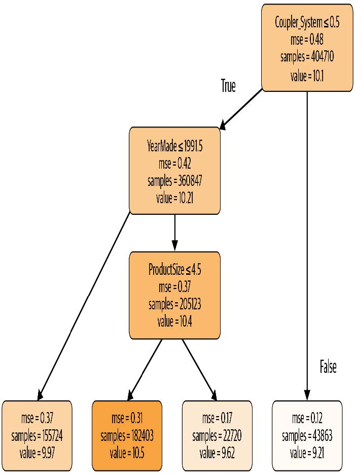

理解这张图是理解决策树的最佳途径之一，因此我们将从顶部开始，逐步解释每个部分。

顶层节点代表尚未进行任何分割时的初始模型，此时所有数据均归属于单一组别。这是最简化的模型形态，相当于未提出任何问题，其预测值始终等同于整个数据集的平均值。在此案例中，该模型对销售价格对数值的预测结果为10.1。其均方误差为0.48，开方后为0.69。（需注意：除非看到 `m_rmse` 即均方根误差，否则所见数值均为开方前的原始值，即差异平方的简单平均值。） 该组共包含404,710条拍卖记录——即训练集总规模。最后显示的信息是最佳分割决策标准，即基于 `coupler_system` 列进行分割。

向下左移，该节点显示当 `coupler_system` 值小于0.5时，共有360,847条设备拍卖记录。该组因变量的平均值为10.21。从初始模型向下右移，则可看到 `coupler_system` 值大于0.5的记录。

底下那行包含我们的叶节点：这些节点没有答案输出，因为已无更多问题待解答。该行最右侧节点包含 `coupler_system` 大于0.5的记录。平均值为9.21，由此可见决策树算法确实找到了一个二元决策点，将高价值拍卖结果与低价值拍卖结果分隔开来。仅依据 `coupler_system` 参数进行预测时，平均值为9.21，而实际值为10.1。

在首个决策点之后回到顶层节点，我们看到基于“ `YearMade` 是否小于等于1991.5”的第二个二元决策分支已建立。对于满足此条件的组（注意，该组已历经基于 `coupler_system` 和 `YearMade` 的两次二分决策），平均值为9.97，包含155,724条拍卖记录。对于该决策为假的拍卖组，平均值为10.4，共计205,123条记录。由此可见，决策树算法再次成功将高价拍卖记录拆分为两个价值差异显著的子组。

我们可使用Terence Parr强大的 [dtreeviz库](https://oreil.ly/e9KrM) 展示相同信息：

```python
samp_idx = np.random.permutation(len(y))[:500]
dtreeviz(m, xs.iloc[samp_idx], y.iloc[samp_idx], xs.columns, dep_var,
         fontname='DejaVu Sans', scale=1.6, label_fontsize=10,
         orientation='LR')
```

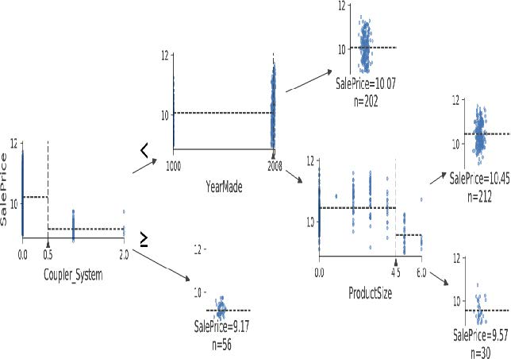

这张图表展示了每个分割点的数据分布情况。我们清晰地看到，我们的 `YearMade` 数据存在问题：竟有生产于公元1000年的推土机！这很可能是缺失值代码（一种在数据中未出现过、用于填补缺失值的占位符）。对于建模而言，1000年值尚可接受，但如图所示，这个异常值会使我们关注的数值更难可视化。因此，让我们将其替换为1950年：

```python
xs.loc[xs['YearMade']<1900, 'YearMade'] = 1950
valid_xs.loc[valid_xs['YearMade']<1900, 'YearMade'] = 1950
```

该调整使树形可视化中的分支更加清晰，尽管它并未显著改变模型的预测结果。这充分展现了决策树对数据问题的强大容错性！

```python
m = DecisionTreeRegressor(max_leaf_nodes=4).fit(xs, y)
dtreeviz(m, xs.iloc[samp_idx], y.iloc[samp_idx], xs.columns, dep_var,
         fontname='DejaVu Sans', scale=1.6, label_fontsize=10,
         orientation='LR')
```

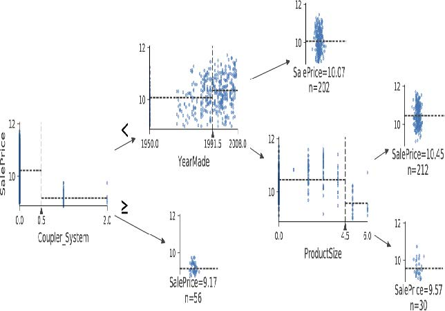

现在让我们让决策树算法构建更大的树。这里我们没有传入任何停止条件，例如 `max_leaf_nodes` ：

```python
m = DecisionTreeRegressor()
m.fit(xs, y);
```

我们将创建一个小函数来检查模型的均方根误差（`m_rmse`），因为这是竞赛的评判标准：

```python
def r_mse(pred,y): return round(math.sqrt(((pred-y)**2).mean()), 6)
def m_rmse(m, xs, y): return r_mse(m.predict(xs), y)
```

```python
m_rmse(m, xs, y)
```

```text
0.0
```

那么，我们的模型完美无缺，对吧？别急……记住，我们必须检查验证集，确保没有过拟合：

```python
m_rmse(m, valid_xs, valid_y)
```

```text
0.337727
```

哎呀——看起来我们可能严重过拟合了。原因如下：

```python
m.get_n_leaves(), len(xs)
```

```text
(340909, 404710)
```

我们的叶节点数量几乎和数据点一样多！这似乎有些过度热情了。确实，sklearn的默认设置允许它持续分割节点，直到每个叶节点只剩一个项目。让我们修改停止规则，要求sklearn确保每个叶节点至少包含25条拍卖记录：

```python
m = DecisionTreeRegressor(min_samples_leaf=25)
m.fit(to.train.xs, to.train.y)
m_rmse(m, xs, y), m_rmse(m, valid_xs, valid_y)
```

```text
(0.248562, 0.32368)
```

这样看起来好多了。我们再检查一下叶片的数量：

```python
m.get_n_leaves()
```

```text
12397
```

现在合理多了！

> ALEXIS说
>
> 以下是我对叶节点数量超过数据项数量的过拟合决策树的直观理解。以“二十问”游戏为例：选择者暗中想象一个物体（如“我们的电视机”），猜谜者则通过提出20个只能用是或否回答的问题来尝试猜出该物体（如“它比面包盒大吗？”）。猜谜者并非预测数值，而是试图从所有可想象的物体集合中识别特定物体。当决策树的叶节点数量超过域中可能对象的总数时，它本质上就是一个训练有素的猜谜者。它已掌握识别训练集中特定数据项所需的问题序列，其“预测”行为仅是描述该项的值。这实质上是记忆训练集的过程——即过拟合。

构建决策树是建立数据模型的有效方法。它具有极高的灵活性，能够清晰处理变量间的非线性关系与交互作用。但我们发现，决策树在泛化能力（通过构建小型树可实现）与训练集准确性（通过使用大型树可实现）之间存在根本性权衡。

那么如何两全其美呢？在处理完一个重要的遗漏细节——如何处理分类变量后，我们将为你揭晓答案。

#### 分类变量

在上一章中，当处理深度学习网络时，我们通过独热编码处理分类变量，并将其输入嵌入层。嵌入层帮助模型发现这些变量不同层级的含义（分类变量的层级本身并无内在意义，除非我们使用Pandas手动指定排序）。在决策树中，我们没有嵌入层——那么未经处理的分类变量是如何在决策树中发挥作用的？例如，产品代码这类变量该如何被利用？

简而言之：它就是管用！设想这样一种情况：某产品代码在拍卖中的价格远高于其他所有代码。此时，任何二元分割都会导致该产品代码被归入某个组别，而该组别的价格必然高于另一组别。因此，我们的简单决策树构建算法会选择这种分割方式。后续训练过程中，算法将能进一步分割包含高价产品代码的子组，随着时间推移，决策树将精准锁定该高价产品。

也可以使用独热编码将单个分类变量替换为多个独热编码列，其中每列代表该变量的一个可能取值。Pandas的 `get_dummies` 方法正是为此而设计。

然而，实际上并无证据表明此类方法能改善最终结果。因此我们通常尽可能避免采用这种做法，因为它最终会使数据集更难处理。2019年，Marvin Wright与Inke König在论文 [《随机森林中分类预测变量的分割》](https://oreil.ly/ojzKJ) 中探讨了这一问题：

> 对于名义型预测变量，标准方法是考虑所有 $2^{k-1}$ 种二元划分方案。然而这种指数级关系会产生大量待评估的潜在分割方案，从而增加计算复杂度，并限制大多数实现方案中可能的类别数量。对于二元分类与回归，研究表明：在每次分割中对预测变量类别进行排序，所得分割结果与标准方法完全一致。这能显著降低计算复杂度——当名义预测变量包含 $k$ 个类别时，仅需考虑 $k − 1$ 种分割方案。

既然你已经理解了决策树的工作原理，现在是时候介绍那个兼具两者优势的解决方案：随机森林。

### 随机森林

1994年，伯克利教授利奥·布雷曼（Leo Breiman）退休一年后发表了一篇名为 [《预测变量袋装法》](https://oreil.ly/6gMuG) 的小型技术报告，该报告最终成为现代机器学习领域最具影响力的思想之一。报告开篇写道：

> 袋装预测器是一种生成多个预测器版本的方法，通过聚合这些版本获得最终预测器。聚合过程对各版本进行平均处理……通过对学习集进行引导抽样复制形成多个版本，并将这些版本作为新的学习集。测试表明……袋装法能显著提升预测精度。关键要素在于预测方法的不稳定性。若扰动学习集能导致构建的预测器发生显著变化，则袋装法可提升准确率。

以下是布雷曼提出的程序：

1. 随机选取数据行中的一个子集（即“学习集的引导法复制”）。
2. 使用该子集训练模型。
3. 保存该模型，然后重复步骤1数次。
4. 由此将获得多个训练模型。进行预测时，使用所有模型进行预测，然后取各模型预测结果的平均值。

该方法称为袋装法（bagging）。其基于一个深刻而重要的洞见：尽管每个基于数据子集训练的模型都会比基于完整数据集训练的模型产生更多错误，但这些错误之间并不存在相关性。不同模型会产生不同的错误。因此这些错误的平均值为零！因此，当模型数量增加时，通过融合所有模型的预测结果，最终得到的预测值将逐渐接近真实答案。这一非凡结论意味着：几乎任何机器学习算法的准确性都能通过多次训练得到提升——每次训练使用数据的不同随机子集，并取其预测结果的平均值。

2001年，布雷曼进一步证明这种建模方法应用于决策树构建算法时尤为强大。他不仅在训练模型时随机选择行数据，更在决策树每次分裂时从列数据子集中随机选取。他将此方法命名为随机森林。如今它或许已成为应用最广泛且实践价值最高的机器学习方法。

本质上，随机森林是一种通过平均大量决策树预测结果的模型，这些决策树通过随机调整各种参数生成——这些参数决定了用于训练树的数据及其他树参数。袋装法是集合学习的一种特定方法，即整合多个模型的结果。为了解其实际运作原理，让我们开始创建自己的随机森林吧！

#### 创建随机森林

我们可以像创建决策树那样创建随机森林，只不过现在还需要指定一些参数，这些参数用于指示森林中应包含多少棵树、如何对数据项（行）进行子集划分，以及如何对字段（列）进行子集划分。

在以下函数定义中，`n_estimators` 指定所需的树数量，`max_samples` 指定每棵树训练时采样的行数，`max_features` 指定每个分裂点采样的列数（其中 `0.5` 表示“取总列数的一半”）。我们还可通过添加前文使用的 `min_samples_leaf` 参数，指定何时停止树节点分裂，从而有效限制树的深度。最后，传递 `n_jobs=-1` 参数告知 sklearn 调用所有 CPU 并行构建决策树。通过创建此类辅助函数，本章后续内容中可更快速地尝试不同参数组合：

```python
def rf(xs, y, n_estimators=40, max_samples=200_000,
       max_features=0.5, min_samples_leaf=5, **kwargs):
    return RandomForestRegressor(n_jobs=-1, n_estimators=n_estimators,
                                 max_samples=max_samples, max_features=max_features,
                                 min_samples_leaf=min_samples_leaf, oob_score=True).fit(xs, y)
```

```python
m = rf(xs, y);
```

我们的验证均方根误差（RMSE）现已显著优于先前使用决策树回归器（`DecisionTreeRegressor`）获得的结果——该模型仅基于全部可用数据构建了一棵决策树：

```python
m_rmse(m, xs, y), m_rmse(m, valid_xs, valid_y)
```

```text
(0.170896, 0.233502)
```

随机森林最重要的特性之一是其对超参数选择，如 `max_features` 的敏感度较低。 `n_estimators` 参数可设置为训练时间允许的最大值——树木数量越多，模型精度越高。`max_samples` 通常可保留默认值，除非数据点超过20万，此时将其设为20万可显著加快训练速度且几乎不影响精度。`max_features=0.5` 和 `min_samples_leaf=4` 通常效果良好，当然sklearn的默认值同样适用。

sklearn文档展示了不同 `max_features` 选项效果的 [示例](https://oreil.ly/E0Och) ，随着树的数量增加。在图中，蓝色曲线使用最少特征，绿色曲线使用最多特征（即全部特征）。如图9-7所示，采用特征子集但树数量较多的模型能获得最低误差率。

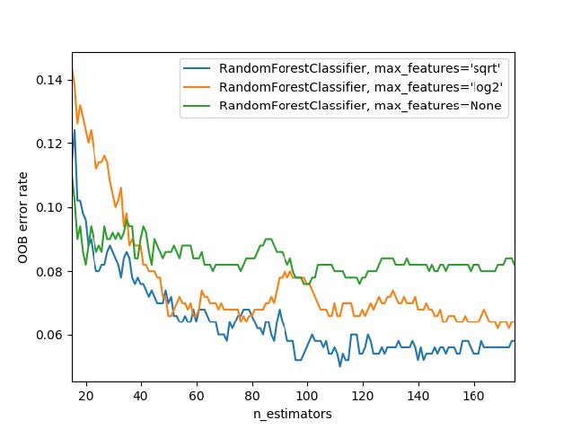

[^图9-7]: 基于最大特征数和树数的误差（来源：https://oreil.ly/E0Och）

要了解 `n_estimators` 参数的影响，让我们获取森林中每棵独立树的预测结果（这些结果存储在 `estimators_` 属性中）：

```python
preds = np.stack([t.predict(valid_xs) for t in m.estimators_])
```

如你所见，`preds.mean(0)` 的结果与我们的随机森林模型完全一致：

```python
r_mse(preds.mean(0), valid_y)
```

```text
0.233502
```

让我们看看随着树的数量不断增加，均方根误差会发生什么变化。如你所见，在达到约30棵树之后，改进幅度明显趋于平缓：

```python
plt.plot([r_mse(preds[:i+1].mean(0), valid_y) for i in range(40)]);
```

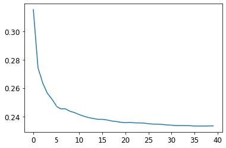

我们在验证集上的表现不如训练集。但这究竟是过度拟合所致，还是因为验证集覆盖了不同的时间段，还是说两者兼而有之？仅凭现有信息，我们无法判断。不过，随机森林有一个非常巧妙的技巧——称为 *袋外误差*（out-of-bag，OOB），它能帮助我们解决这个问题（还有更多问题！）。

#### 袋外误差

请记住，在随机森林中，每棵树都是基于训练数据的不同子集进行训练的。袋外误差是一种通过仅将未参与训练的数据行纳入行误差树的计算中，来衡量训练数据集预测误差的方法。这使我们能够判断模型是否存在过拟合现象，而无需额外的验证集。

> ALEXIS说
>
> 我的直觉是，由于每棵树都是用随机选取的不同行子集训练的，袋外误差有点像想象每棵树因此也拥有自己的验证集。这个验证集就是该树训练时未选中的那些行。

这在训练数据量较少时尤为有益，因为它使我们无需移除数据项创建验证集，即可检验模型是否具备泛化能力。出局预测结果存储于 `oob_prediction_` 属性中。请注意，我们将其与训练标签进行比较，因为该预测是基于训练集构建的决策树计算得出：

```python
r_mse(m.oob_prediction_, y)
```

```text
0.210686
```

我们可以发现，我们的OOB误差远低于验证集误差。这意味着除了正常的泛化误差外，还有其他因素导致了该误差。本章后续部分将探讨其原因。

这是解读模型预测的一种方式——现在让我们更多地关注这些内容。

### 模型解释

对于表格数据，模型解释尤为重要。对于给定模型，我们最可能关注的是以下几点：

- 我们对使用特定数据行进行预测的信心有多大？
- 在使用特定数据行进行预测时，哪些因素最为关键，它们如何影响预测结果？
- 哪些列是最强预测因子，哪些可以忽略？
- 就预测目的而言，哪些列之间存在实质性冗余？
- 当我们调整这些列时，预测结果会如何变化？

正如我们将看到的，随机森林特别适合回答这些问题。让我们从第一个问题开始吧！

#### 预测置信度的树变异性

我们看到模型如何通过平均单棵决策树的预测结果来获得整体预测——即对目标值的估计。但如何判断该估计的置信度？一种简便方法是采用决策树预测结果的标准差，而非仅使用均值。这能反映预测结果的相对置信度。通常我们需要更谨慎地对待预测结果差异显著的行（即标准差较高）——相较于预测结果一致性较高的情况（标准差较低），这类行所呈现的结果更值得警惕。

在 “创建随机森林” 这一节中，我们了解了如何对验证集进行预测，通过Python列表推导式对森林中的每棵树执行此操作：

```python
preds = np.stack([t.predict(valid_xs) for t in m.estimators_])
```

```python
preds.shape
```

```text
(40, 7988)
```

现在我们对验证集中的每棵决策树和每次拍卖都进行了预测（共40棵决策树和7,988次拍卖）。

通过此方法，我们可以计算出所有决策树对每次拍卖的预测结果的标准差：

```python
preds_std = preds.std(0)
```

以下是前五次拍卖预测的标准差——即验证集的前五行：

```python
preds_std[:5]
```

```text
array([0.21529149, 0.10351274, 0.08901878, 0.28374773, 0.11977206])
```

如你所见，预测结果的置信度差异显著。某些拍卖的标准差较低，因为决策树结果一致； 而另一些拍卖的标准差较高，因为树模型之间存在分歧。这些信息在实际应用场景中很有价值；例如，若使用该模型决定拍卖竞标对象，低置信度预测可能促使你在出价前更仔细地考察该物品。

#### 特征重要性

通常仅知道模型能做出准确预测是不够的——我们还想了解其预测机制。*特征重要度*（feature importances） 正提供了这种洞察。通过查看sklearn随机森林模型的 `feature_importances_` 属性，可直接获取这些数据。以下是一个简单函数，可将数据导入DataFrame并进行排序：

```python
def rf_feat_importance(m, df):
    return pd.DataFrame({'cols':df.columns, 'imp':m.feature_importances_}
                       ).sort_values('imp', ascending=False)
```

模型特征重要性分析显示，前几项最重要列的评分远高于其余列，其中（不出所料） `YearMade` 和 `ProductSize` 位居榜首：

```python
fi = rf_feat_importance(m, xs)
fi[:10]
```

| 序号 | 列                 | imp      |
| ---- | ------------------ | -------- |
| 69   | YearMade           | 0.182890 |
| 6    | ProductSize        | 0.127268 |
| 30   | Coupler_System     | 0.117698 |
| 7    | fiProductClassDesc | 0.069939 |
| 66   | ModelID            | 0.057263 |
| 77   | saleElapsed        | 0.050113 |
| 32   | Hydraulics_Flow    | 0.047091 |
| 3    | fiSecondaryDesc    | 0.041225 |
| 31   | Grouser_Tracks     | 0.031988 |
| 1    | fiModelDesc        | 0.031838 |

特征重要性图更清晰地展示了各特征的相对重要性：

```python
def plot_fi(fi):
    return fi.plot('cols', 'imp', 'barh', figsize=(12,7), legend=False)

plot_fi(fi[:30]);
```

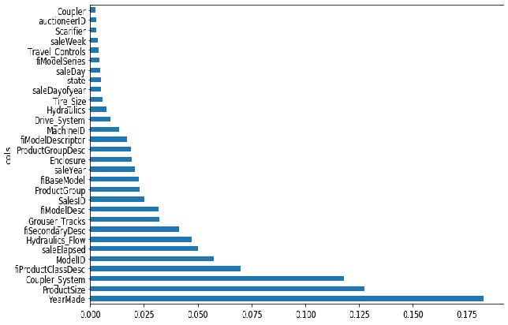

这些重要性的计算方式相当简单而优雅。特征重要性算法遍历每棵树，然后递归探索每个分支。在每个分支处，算法会检查该分支采用的特征以及该分支对模型提升的程度。提升值（按该组数据行数加权）将计入该特征的重要性得分。所有树的所有分支得分相加后，最终通过归一化处理使总和为1。

#### 移除低重要性变量

似乎通过移除重要性较低的变量，我们可以使用列的子集并仍获得良好结果。让我们尝试仅保留特征重要性大于0.005的变量：

```python
to_keep = fi[fi.imp>0.005].cols
len(to_keep)
```

```text
21
```

我们可以仅使用这部分列对模型进行重新训练：

```python
xs_imp = xs[to_keep]
valid_xs_imp = valid_xs[to_keep]
```

```python
m = rf(xs_imp, y)
```

结果如下：

```python
m_rmse(m, xs_imp, y), m_rmse(m, valid_xs_imp, valid_y)
```

```text
(0.181208, 0.232323)
```

我们的准确率大致相当，但需要研究的列数却少得多：

```python
len(xs.columns), len(xs_imp.columns)
```

```text
(78, 21)
```

我们发现，改进模型的第一步通常是简化模型——78个列对我们来说实在太多，无法深入研究每个列！此外，在实践中，更简单、更易解释的模型往往更容易部署和维护。

这也使得我们的特征重要性图更易于解读。让我们再看一遍：

```python
plot_fi(rf_feat_importance(m, xs_imp));
```

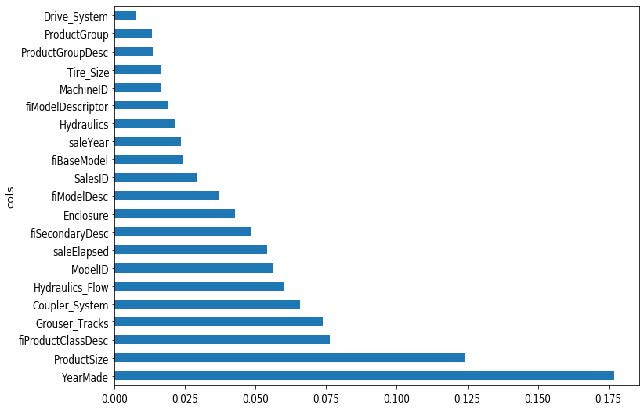

使解读更困难的一点在于，似乎存在一些含义极为相似的变量：例如 `ProductGroup` 和 `ProductGroupDesc` 。让我们尝试移除任何冗余特征。

#### 移除冗余功能

让我们从这里开始：

```python
cluster_columns(xs_imp)
```

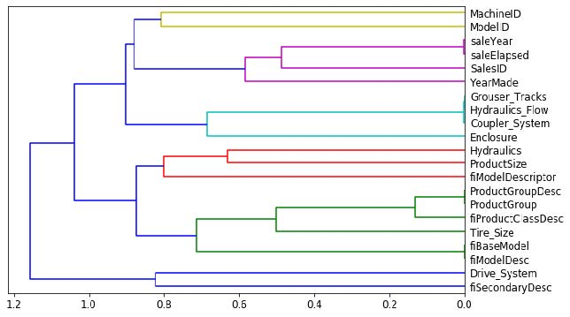

在此图表中，相似度最高的列对是那些在早期就合并在一起的，远离左侧树状图的“根节点”。不出所料，字段 `ProductGroup` 和 `ProductGroupDesc` 在早期就已合并，`saleYear `与 `saleElapsed` 、 `fiModelDesc` 与 `fiBaseModel` 亦是如此。这些字段可能相关性极高，几乎可以视为彼此的同义词。

> 相似性判定
>
> 通过计算等级相关系数可找出最相似的配对，这意味着所有数值均被替换为其等级（即该列中的第一、第二、第三等序位），随后再计算相关系数。（不过你大可忽略这个细节，因为本书后续内容不会再提及！）

让我们尝试移除部分密切相关的特征，看看能否在不影响准确率的前提下简化模型。首先创建一个函数，通过降低 `max_samples` 参数值并提高 `min_samples_leaf` 参数值，快速训练随机森林并返回OOB评分。OOB评分是sklearn返回的数值，取值范围从完美模型的1.0到随机模型的0.0（在统计学中称为R，但具体细节对本说明不重要）。我们不需要它非常精确——仅将其用于比较不同模型，这些模型是通过移除部分可能冗余的列生成的。

```python
def get_oob(df):
    m = RandomForestRegressor(n_estimators=40, min_samples_leaf=15,
                              max_samples=50000, max_features=0.5, n_jobs=-1, oob_score=True)
    m.fit(df, y)
    return m.oob_score_
```

以下是我们设定的基准：

```python
get_oob(xs_imp)
```

```text
0.8771039618198545
```

现在我们尝试逐个移除可能冗余的变量：

```python
{c:get_oob(xs_imp.drop(c, axis=1)) for c in (
    'saleYear', 'saleElapsed', 'ProductGroupDesc','ProductGroup',
    'fiModelDesc', 'fiBaseModel',
    'Hydraulics_Flow','Grouser_Tracks', 'Coupler_System')}
```

```text
{'saleYear': 0.8759666979317242,
'saleElapsed': 0.8728423449081594,
'ProductGroupDesc': 0.877877012281002,
'ProductGroup': 0.8772503407182847,
'fiModelDesc': 0.8756415073829513,
'fiBaseModel': 0.8765165299438019,
'Hydraulics_Flow': 0.8778545895742573,
'Grouser_Tracks': 0.8773718142788077,
'Coupler_System': 0.8778016988955392}
```

现在我们尝试删除多个变量。我们将从之前观察到的紧密对齐的变量对中各删除一个。让我们看看会发生什么：

```python
to_drop = ['saleYear', 'ProductGroupDesc', 'fiBaseModel',
           'Grouser_Tracks']
get_oob(xs_imp.drop(to_drop, axis=1))
```

```text
0.8739605718147015
```

看起来不错！这其实比包含所有字段的模型差不了多少。让我们创建不含这些列的数据框，并保存它们：

```python
xs_final = xs_imp.drop(to_drop, axis=1)
valid_xs_final = valid_xs_imp.drop(to_drop, axis=1)
(path/'xs_final.pkl').save(xs_final)
(path/'valid_xs_final.pkl').save(valid_xs_final)
```

我们可以稍后再重新加载它们：

```python
xs_final = (path/'xs_final.pkl').load()
valid_xs_final = (path/'valid_xs_final.pkl').load()
```

现在我们可以再次检查均方根误差，以确认精度没有发生显著变化：

```python
m = rf(xs_final, y)
m_rmse(m, xs_final, y), m_rmse(m, valid_xs_final, valid_y)
```

```text
(0.183263, 0.233846)
```

通过聚焦最重要的变量并剔除部分冗余变量，我们大幅简化了模型。现在，让我们借助偏依赖图观察这些变量如何影响预测结果。

#### 部分依赖

正如我们所见，最重要的两个预测变量是 `ProductSize` 和 `YearMade` 。我们希望理解这些预测变量与销售价格之间的关系。首先检查各类别值的计数（通过Pandas的`value_counts` 方法提供）是个好主意，这样可以了解每个类别的常见程度：

```python
p = valid_xs_final['ProductSize'].value_counts(sort=False).plot.barh()
c = to.classes['ProductSize']
plt.yticks(range(len(c)), c);
```

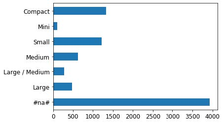

最大的组是`#na#`，这是fastai对缺失值应用的标签。

现在我们对 `YearMade` 做同样的处理。由于这是个数值特征，我们需要绘制直方图，将年份值分组到几个离散区间中：

```python
ax = valid_xs_final['YearMade'].hist()
```

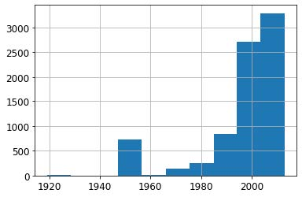

除特殊值1950（用于编码缺失年份值）外，大部分数据均来自1990年之后。

现在我们可以开始分析部分依赖图（partial dependence plots）了。部分依赖图试图回答以下问题：如果某行数据仅受该特征影响而变化，它将如何影响因变量？

例如，在其他条件不变的情况下， `YearMade` 如何影响销售价格？要回答这个问题，我们不能简单地取每个生产年份的平均销售价格。这种方法的问题在于，许多其他因素也会逐年变化，例如销售的产品种类、配备空调的产品数量、通货膨胀率等等。因此，单纯对所有同年份拍卖进行平均计算，实际上也包含了其他所有变量随生产年份变化所产生的影响，以及这些综合变化对价格造成的整体影响。

相反，我们采取的做法是将 `YearMade` 列中的每个数值全部替换为1950，随后为每场拍卖计算预测售价，并取所有拍卖的平均值。接着依次对1951年、1952年等年份重复此操作，直至最终年份2011年。此举可纯粹孤立 `YearMade` 的影响（即便实现方式是通过对某些虚拟记录取平均值——这些记录被赋予了可能实际不存在的生产年份值，且该值可能与其他字段值并存）。

> ALEXIS说
>
> 若你具有哲学思维，思考我们为完成这项计算而同时处理的各种假设性情境时，难免会感到头晕目眩。首先，所有预测本身都具有假设性，因为我们并非记录经验数据。其次，我们关注的重点并非单纯探究当改变生产年份并同时改变其他所有变量时，售价会如何变化。我们真正探究的是：在仅改变年份的假想情境中，售价将如何变化。哎呀！能提出如此问题实属不易。如果你想深入探索分析这些微妙现象的正式方法，我推荐 Judea Pearl 与 Dana Mackenzie 近期合著的因果关系专著《为什么之书》（Basic Books出版）。

利用这些平均值，我们可以在x轴上绘制每年数据，在y轴上绘制每个预测值。最终得到的就是部分依赖图。让我们来看看：

```python
from sklearn.inspection import plot_partial_dependence
fig,ax = plt.subplots(figsize=(12, 4))
plot_partial_dependence(m, valid_xs_final, ['YearMade','ProductSize'],
                        grid_resolution=20, ax=ax);
```

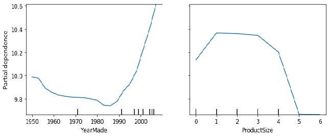

首先观察 `YearMade` 图，特别是1990年后的部分（正如我们所指出的，该时段数据最为丰富），可见年份与价格之间存在近乎线性的关系。需注意我们的因变量是经对数转换后的结果，这意味着实际价格呈现指数级增长。此现象符合预期：折旧通常被视为随时间推移的乘法因子，因此对于特定销售日期，生产年份的变化应与销售价格呈现指数关系。

`ProductSize` 部分图略显令人担忧。它显示最后一个组别（我们看到该组别对应缺失值）具有最低价格。若要在实践中运用这一洞察，我们需要探究缺失值频现的原因及其背后的含义。缺失值有时可成为有用的预测变量——这完全取决于导致缺失的原因。但某些情况下，它们也可能暗示数据泄露（Data Leakage）问题。

#### 数据泄露

在论文 [《数据挖掘中的泄露：定义、检测与规避》](https://oreil.ly/XwvYf) 中，Shachar Kaufman等人将泄露描述如下：

> 在数据挖掘问题中引入目标对象的相关信息，而这些信息本不应被合法获取用于挖掘。一个简单的泄露示例是模型将目标对象本身作为输入，从而得出诸如“下雨天会下雨”的结论。实际操作中，此类非法信息的引入往往是无意的，且常因数据收集、聚合与预处理过程而助长。

他们举例说明：

> IBM曾实施过一个真实的商业智能项目，该项目通过分析潜在客户网站上的关键词等信息，识别出特定产品的潜在客户。该方法最终被认定为信息泄露，因为用于训练的网站内容采样时间点恰逢潜在客户已转为正式客户，且网站中残留着所购IBM产品的痕迹——例如“Websphere”一词（常见于采购公告或客户使用的特定产品功能说明中）。

数据泄露具有隐蔽性，且可能以多种形式出现。尤其值得注意的是，缺失值往往代表着数据泄露。

例如，杰里米参加了一场旨在预测哪些研究人员最终会获得研究资助的Kaggle竞赛。数据由某所大学提供，包含数千个研究项目的实例，以及相关研究人员的背景信息和每项资助申请最终是否获批的数据。该大学希望利用竞赛中开发的模型对资助申请进行成功概率排序，从而优化审批流程。

杰里米使用随机森林对数据进行建模，随后通过特征重要性分析确定了最具预测价值的特征。他发现了三个令人惊讶的现象：

- 该模型能够在95%以上的情况下准确预测谁将获得资助。
- 看似毫无意义的标识符列竟成为最重要的预测因子。
- 星期几和年内的日期列也具有很高的预测能力；例如，绝大多数提交日期为周日的资助申请均获批准，而许多获批的资助申请提交日期均为1月1日。

对于标识符列，部分依赖图显示当信息缺失时，申请几乎总是被拒绝。实践中发现，大学往往在资助申请获批后才填写这些信息。对于未获批的申请，这些字段通常直接留空。因此，这些信息在收到申请时本就不存在，也无法用于构建预测模型——这属于数据泄露。

同样地，成功申请的最终处理通常在周末或年末以批处理方式自动完成。最终处理日期最终被记录在数据中，因此尽管该信息具有预测性，但在收到申请时实际上并不可用。

本示例展示了识别数据泄露最实用且简单的做法，即构建模型后执行以下步骤：

- 检查模型准确性是否好得令人难以置信。
- 寻找在实践中毫无意义的重要预测变量。
- 寻找在实践中毫无意义的部分依赖图结果。

回想我们设计的熊探测器，这恰恰印证了我们在第2章提出的建议——通常先构建模型再进行数据清理是明智之举，而非反其道而行。模型能帮助你识别潜在的数据问题。

它还能借助树解释器（树解释器），帮助你识别哪些因素影响特定预测。

#### 树解释器

在本节开头，我们提到希望能够回答五个问题：

- 我们对使用特定数据行进行预测的信心有多大？
- 在使用特定数据行进行预测时，哪些因素最为关键，它们如何影响预测结果？
- 哪些列是预测能力最强的变量？
- 哪些列在预测过程中彼此之间存在实质性冗余？
- 当我们调整这些列时，预测结果会如何变化？

我们已经处理了其中四个问题，只剩下第二个问题尚未解决。要回答这个问题，我们需要使用 `treeinterpreter` 库。同时，我们将借助 `waterfallcharts` 库绘制结果图表。您可以在笔记本单元格中运行以下命令安装这些库：

```bash
!pip install treeinterpreter
!pip install waterfallcharts
```

我们已经了解了如何计算整个随机森林中特征的重要性。基本思路是观察每个变量在每棵树的每个分支中对模型改进的贡献，然后将每个变量的所有贡献相加。

我们完全可以做同样的事情，但仅针对单行数据。例如，假设我们正在关注拍卖中的某件物品。模型可能预测该物品价格将非常高昂，而我们想知道原因。因此，我们提取该单行数据，将其输入第一棵决策树，观察树中每个节点使用的分割方式。针对每次分割，我们计算相较于树的父节点，该变量在分割点的重要性增减值。对所有决策树重复此过程，最终累加所有分割变量的重要性变化总量。

例如，让我们选取验证集的前几行：

```python
row = valid_xs_final.iloc[:5]
```

然后我们可以将这些传递给 `treeinterpreter`：

```python
prediction,bias,contributions = treeinterpreter.predict(m, row.values)
```

`prediction` 即随机森林的预测结果。 `bias` 是基于因变量均值的预测值（即每棵树的根节点模型）。 `contributions` 最为关键——它揭示了每个自变量导致的预测值总变化量。因此，每行数据中 `contributions` 与 `bias` 之和必须等于 `prediction` 。让我们仅关注第一行：

```python
prediction[0], bias[0], contributions[0].sum()
```

```text
(array([9.98234598]), 10.104309759725059, -0.12196378442186026)
```

最清晰的贡献展示方式是采用瀑布图。它呈现了所有自变量的正负贡献如何累加形成最终预测值——即此处右侧标注为“净值”的列：

```python
waterfall(valid_xs_final.columns, contributions[0], threshold=0.08,
          rotation_value=45,formatting='{:,.3f}');
```

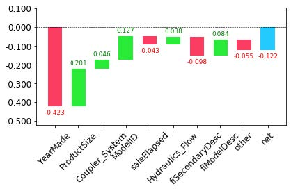

此类信息在生产环境中最为有用，而非模型开发阶段。你可以利用它向数据产品的用户提供有价值的信息，说明预测背后的基本推理过程。

既然我们已经介绍了若干经典机器学习技术来解决这个问题，现在让我们看看深度学习能带来怎样的突破！

### 外推与神经网络

随机森林与所有机器学习或深度学习算法一样，存在一个问题：它们对新数据的泛化能力并不总是理想。我们将探讨在哪些情况下神经网络能实现更好的泛化，但首先让我们看看随机森林面临的外推问题，以及它们如何帮助识别域外数据。

#### 外推问题

让我们考虑一个简单的任务：根据40个数据点进行预测，这些数据点显示出一个略带噪声的线性关系：

```python
x_lin = torch.linspace(0,20, steps=40)
y_lin = x_lin + torch.randn_like(x_lin)
plt.scatter(x_lin, y_lin);
```

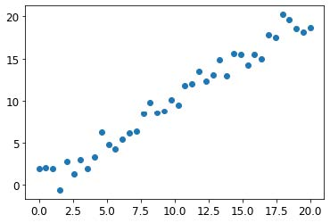

尽管我们只有一个独立变量，sklearn期望的是一个独立变量矩阵，而非单个向量。因此我们需要将向量转换为单列矩阵，即把形状从 `[40]` 改为 `[40,1]` 。实现方式之一是使用 `unsqueeze` 方法，该方法会在张量指定维度添加新的单位轴：

```python
xs_lin = x_lin.unsqueeze(1)
x_lin.shape,xs_lin.shape
```

```text
(torch.Size([40]), torch.Size([40, 1]))
```

更灵活的方法是使用特殊值 `None` 对数组或张量进行切片，这会在该位置引入一个额外的单位轴：

```python
x_lin[:,None].shape
```

```text
torch.Size([40, 1])
```

现在我们可以为这组数据创建随机森林模型。我们将仅使用前30行数据来训练模型：

```python
m_lin = RandomForestRegressor().fit(xs_lin[:30],y_lin[:30])
```

然后我们将使用完整数据集对模型进行测试。蓝色点代表训练数据，红色点代表预测结果：

```python
plt.scatter(x_lin, y_lin, 20)
plt.scatter(x_lin, m_lin.predict(xs_lin), color='red', alpha=0.5);
```

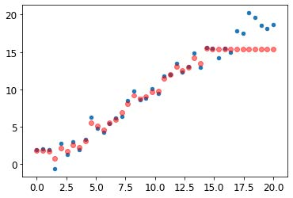

我们遇到大麻烦了！在训练数据覆盖范围之外的预测结果都偏低。你认为这是为什么呢？

请记住，随机森林只是对多棵决策树的预测结果进行平均。而单棵决策树仅预测叶节点中行数据的平均值。因此，无论是单棵决策树还是随机森林，都无法预测超出训练数据范围的值。对于反映时间趋势的数据（如通货膨胀）而言，这种特性尤为棘手——当你试图预测未来时点时，预测结果将系统性地偏低。

但问题不仅限于时间变量。从更普遍的意义上说，随机森林无法对未见过的数据类型进行外推。因此我们必须确保验证集不包含域外数据。

#### 发现域外数据

有时很难判断测试集是否与训练数据具有相同的分布特性，或者若存在差异，哪些列反映了这种差异。其实有个简单的方法可以解决这个问题——使用随机森林！

但在本例中，我们并非使用随机森林来预测实际的因变量，而是尝试预测某行数据属于验证集还是训练集。为直观展示这一过程，我们将训练集与验证集合并，创建一个表示每行数据所属数据集的因变量，基于该数据构建随机森林，并获取其特征重要性：

```python
df_dom = pd.concat([xs_final, valid_xs_final])
is_valid = np.array([0]*len(xs_final) + [1]*len(valid_xs_final))

m = rf(df_dom, is_valid)
rf_feat_importance(m, df_dom)[:6]
```

| 序号 | 列          | imp      |
| ---- | ----------- | -------- |
| 5    | saleElapsed | 0.859446 |
| 9    | SalesID     | 0.119325 |
| 13   | MachineID   | 0.014259 |
| 0    | YearMade    | 0.001793 |
| 8    | fiModelDesc | 0.001740 |
| 11   | Enclosure   | 0.000657 |

这表明训练集与验证集之间存在三列显著差异：`saleElapsed`、`SalesID` 和 `MachineID`。`saleElapsed` 的差异原因显而易见：该字段记录数据集起始时间与每行数据之间的天数，因此直接编码了日期信息。`SalesID` 的差异则表明拍卖销售的标识符可能随时间递增。`MachineID` 则表明，这些拍卖中售出的单件商品可能也存在类似情况。

让我们先获取原始随机森林模型的均方根误差基准值，然后依次评估移除每列数据的影响：

```python
m = rf(xs_final, y)
print('orig', m_rmse(m, valid_xs_final, valid_y))

for c in ('SalesID','saleElapsed','MachineID'):
    m = rf(xs_final.drop(c,axis=1), y)
    print(c, m_rmse(m, valid_xs_final.drop(c,axis=1), valid_y))
```

```text
orig 0.232795
SalesID 0.23109
saleElapsed 0.236221
MachineID 0.233492
```

看起来我们可以移除 `SalesID` 和 `MachineID` 而不影响准确性。让我们来验证一下：

```python
time_vars = ['SalesID','MachineID']
xs_final_time = xs_final.drop(time_vars, axis=1)
valid_xs_time = valid_xs_final.drop(time_vars, axis=1)

m = rf(xs_final_time, y)
m_rmse(m, valid_xs_time, valid_y)
```

```text
0.231307
```

移除这些变量后，模型的准确性略有提升；但更重要的是，这将增强模型随时间推移的稳健性，并使其更易于维护和理解。我们建议对所有数据集都尝试构建一个以 `is_valid` 作为因变量的模型（正如我们在此处的做法）。这种方法往往能揭示那些可能被忽略的细微领域偏移问题。

在我们这种情况下，一个可能有帮助的方法就是直接避免使用旧数据。旧数据往往显示出已经不再成立的关系。让我们尝试只使用最近几年的数据：

```python
xs['saleYear'].hist();
```

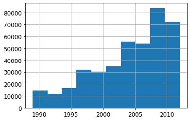

以下是针对该子集训练的结果：

```python
filt = xs['saleYear']>2004
xs_filt = xs_final_time[filt]
y_filt = y[filt]
```

```python
m = rf(xs_filt, y_filt)
m_rmse(m, xs_filt, y_filt), m_rmse(m, valid_xs_time, valid_y)
```

```text
(0.17768, 0.230631)
```

情况略有好转，这说明不必总是使用全部数据集；有时子集反而效果更佳。

让我们看看使用神经网络是否会有帮助。

#### 使用神经网络

我们可以采用相同的方法构建神经网络模型。首先，让我们复现创建 `TabularPandas` 对象时所采取的步骤：

```python
df_nn = pd.read_csv(path/'TrainAndValid.csv', low_memory=False)
df_nn['ProductSize'] = df_nn['ProductSize'].astype('category')
df_nn['ProductSize'].cat.set_categories(sizes, ordered=True,
inplace=True)
df_nn[dep_var] = np.log(df_nn[dep_var])
df_nn = add_datepart(df_nn, 'saledate')
```

我们可以利用在随机森林中剔除多余列的工作成果，通过为神经网络使用相同的列集来实现：

```python
df_nn_final = df_nn[list(xs_final_time.columns) + [dep_var]]
```

与决策树方法相比，神经网络对分类列的处理方式截然不同。正如我们在第8章所见，在神经网络中处理分类变量的一种绝佳方式是使用嵌入。创建嵌入时，fastai需要确定哪些列应被视为分类变量。它通过比较变量中不同层级的数量与 `max_card` 参数的值来实现：若前者较小，fastai将把该变量视为分类变量。嵌入维度超过10,000时，通常应在测试过更优分组方案后再使用，因此我们将 `max_card` 值设为9,000：

```python
cont_nn,cat_nn = cont_cat_split(df_nn_final, max_card=9000,
dep_var=dep_var)
```

然而，在此情况下，存在一个我们绝对不应将其视为分类变量的变量：`saleElapsed`。根据定义，分类变量无法推断其已知值域之外的情况，但我们需要预测未来的拍卖成交价格。因此，我们必须将其转化为连续变量：

```python
cont_nn.append('saleElapsed')
cat_nn.remove('saleElapsed')
```

让我们来看看我们目前选定的每个分类变量的基数：

```python
df_nn_final[cat_nn].nunique()
```

```text
YearMade 73
ProductSize 6
Coupler_System 2
fiProductClassDesc 74
ModelID 5281
Hydraulics_Flow 3
fiSecondaryDesc 177
fiModelDesc 5059
ProductGroup 6
Enclosure 6
fiModelDescriptor 140
Drive_System 4
Hydraulics 12
Tire_Size 17
dtype: int64
```

设备“型号”相关的两个变量均具有极高的基数，这表明它们可能包含相似且冗余的信息。需注意的是，在分析冗余特征时未必能发现此类情况，因为该分析依赖于相似变量按相同顺序排列（即它们需要具有相似命名的层级）。若某列包含5,000个层级，则嵌入矩阵需容纳5,000列，若可能应尽量避免这种情况。让我们观察移除其中一个模型列对随机森林的影响：

```python
xs_filt2 = xs_filt.drop('fiModelDescriptor', axis=1)
valid_xs_time2 = valid_xs_time.drop('fiModelDescriptor', axis=1)
m2 = rf(xs_filt2, y_filt)
m_rmse(m, xs_filt2, y_filt), m_rmse(m2, valid_xs_time2, valid_y)
```

```text
(0.176706, 0.230642)
```

影响微乎其微，因此我们将将其从神经网络的预测变量中移除：

```python
cat_nn.remove('fiModelDescriptor')
```

我们可以像创建随机森林时那样创建 `TabularPandas` 对象，但需要添加一个非常重要的步骤：归一化。随机森林无需任何归一化——树构建过程只关注变量中值的顺序，完全不关心它们的缩放比例。但正如我们所见，神经网络确实会关注这一点。因此在构建 `TabularPandas` 对象时，我们需添加 `Normalize` 处理器：

```python
procs_nn = [Categorify, FillMissing, Normalize]
to_nn = TabularPandas(df_nn_final, procs_nn, cat_nn, cont_nn,
                      splits=splits, y_names=dep_var)
```

表格模型和数据通常不需要太多GPU内存，因此我们可以使用更大的批量大小：

```python
dls = to_nn.dataloaders(1024)
```

正如我们讨论过的，为回归模型设置 `y_range` 是个好主意，因此让我们找到因变量的最小值和最大值：

```python
y = to_nn.train.y
y.min(),y.max()
```

```text
(8.465899897028686, 11.863582336583399)
```

现在我们可以创建 `Learner` 来构建这个表格模型。照例，我们使用应用程序专属的学习器函数，以利用其应用程序定制的默认设置。我们将损失函数设为均方误差（MSE），因为这是本次竞赛采用的标准。

默认情况下，对于表格数据，fastai会创建一个包含两个隐藏层的神经网络，分别具有200和100个激活单元。对于小型数据集而言效果良好，但本例数据集规模较大，因此我们将层大小调整为500和250：

```python
from fastai.tabular.all import *
```

```python
learn = tabular_learner(dls, y_range=(8,12), layers=[500,250],
                        n_out=1, loss_func=F.mse_loss)
```

```python
learn.lr_find()
```

```text
(0.005754399299621582, 0.0002754228771664202)
```

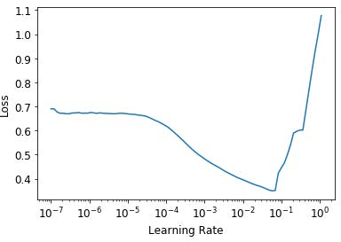

无需使用 `fine_tune`，我们将用 `fit_one_cycle` 训练几个迭代轮次，看看效果如何：

```python
learn.fit_one_cycle(5, 1e-2)
```

| 迭代轮次 | 训练损失 | 验证损失 | 时间  |
| -------- | -------- | -------- | ----- |
| 0        | 0.069705 | 0.062389 | 00:11 |
| 1        | 0.056253 | 0.058489 | 00:11 |
| 2        | 0.048385 | 0.052256 | 00:11 |
| 3        | 0.043400 | 0.050743 | 00:11 |
| 4        | 0.040358 | 0.050986 | 00:11 |

我们可以使用 `r_mse` 函数将结果与之前获得的随机森林结果进行比较：

```python
preds,targs = learn.get_preds()
r_mse(preds,targs)
```

```text
0.2258
```

它比随机森林模型要好得多（尽管训练时间更长，且对超参数调优的要求更严格）。

在继续之前，让我们先保存模型，以防日后需要再次使用：

```python
learn.save('nn')
```

> FASTAI 的表格类
>
> 在fastai中，表格模型本质上是一种接收连续型或分类型数据列，并预测类别（分类模型）或连续值（回归模型）的模型。分类型自变量会经过嵌入处理并进行拼接——正如我们在协同过滤中使用的神经网络所见——随后连续型变量也会进行拼接。
>
> 在 `tabular_learner` 中创建的模型是 `TabularModel` 类的对象。现在查看 `tabular_learner` 的源代码（请记住，在 Jupyter 中它被称为 `tabular_learner??`）。你会发现它与 `collab_learner` 类似，首先调用 `get_emb_sz` 计算合适的嵌入维度（可通过 `emb_szs` 参数覆盖设置，该参数是一个字典，包含需要手动设置维度的列名），并设置其他默认值。除此之外，它会创建  `TabularModel` 并将其传递给 `TabularLearner`（注意 `TabularLearner` 与 `Learner` 完全相同，仅 `predict` 方法经过定制）。
>
> 这意味着所有工作实际上都在 `TabularModel` 中完成，现在请查看该类的源代码。除了 `BatchNorm1d` 和 `Dropout` 层（我们稍后将学习）之外，你现在已掌握理解整个类的必要知识。请回顾上一章末尾关于 `EmbeddingNN` 的讨论。请回想它向 `TabularModel` 传递了 `n_cont=0` 参数。现在我们明白原因所在：因为连续变量数量为零（在fastai中，`n_` 前缀表示“数量”，`cont` 是“连续”（continuous”）的缩写）。

另一种有助于泛化的方法是使用多个模型并对其预测结果取平均值——正如前文所述，这种技术被称为集成（ensembling）。

### 集成

复习一下随机森林效果卓越的原始原理：每棵树都存在误差，但这些误差彼此无关联，因此当树的数量足够多时，误差的平均值应趋近于零。类似的逻辑同样适用于考虑对采用不同算法训练的模型进行预测平均。

在我们的案例中，存在两种训练算法截然不同的模型：随机森林与神经网络。合理推测这两种模型产生的错误类型应有显著差异。因此，我们可预期其预测结果的平均值将优于任一模型的单独预测。

正如我们之前所见，随机森林本身就是一种集成方法。但我们可以将随机森林纳入另一个集成模型——由随机森林和神经网络组成的集成模型！虽然集成方法并不能决定建模过程的成败，但它确实能为已构建的模型提供额外的提升效果。

我们需要注意的一个小问题是，PyTorch模型和sklearn模型生成的数据类型不同：PyTorch提供的是2阶张量（列矩阵），而NumPy提供的是1阶数组（向量）。`squeeze` 会移除张量中所有单位轴，`to_np` 则将其转换为NumPy数组：

```python
rf_preds = m.predict(valid_xs_time)
ens_preds = (to_np(preds.squeeze()) + rf_preds) /2
```

这使我们获得了比任何单一模型单独运行时更优的结果：

```python
r_mse(ens_preds,valid_y)
```

```text
0.22291
```

事实上，这个结果比Kaggle排行榜上显示的任何分数都要好。不过，由于Kaggle排行榜使用的是我们无法获取的独立数据集，因此无法直接比较。Kaggle不允许我们提交到这个旧竞赛中以了解我们的表现如何，但我们的结果无疑令人鼓舞！

#### 增强

迄今为止，我们采用的集成方法是袋装法（bagging），该方法通过取平均值的方式整合多个模型（每个模型在不同的数据子集上训练）。正如我们所见，当这种方法应用于决策树时，就被称为随机森林。

另一种重要的集成方法称为增强法（boosting），其中我们添加模型而非对它们取平均值。提升法的工作原理如下：

1. 训练一个对数据集拟合不足的小型模型。
2. 计算该模型在训练集上的预测值。
3. 将预测值从目标值中减去；这些差值称为残差（residuals），代表训练集中每个点的误差。

4. 返回步骤1，但不再使用原始目标值，而是将残差作为训练目标。

5. 重复此过程直至满足停止条件，例如达到最大树数，或验证集误差开始恶化。

采用这种方法，每棵新树都将尝试拟合所有先前树的残差总和。由于我们通过将新树的预测值从前一树的残差中减去来持续生成新的残差，因此残差值将越来越小。

要使用增强树集成法进行预测，我们得先计算每棵树的预测值，然后将它们全部相加。遵循此基本方法的模型众多，且同一模型常有不同称谓。梯度提升机（Gradient boosting machines，GBM）和梯度提升决策树（gradient boosted decision trees，GBDT）是最常见的术语，亦可能见到具体实现库的名称；撰写本文时，XGBoost是最流行的实现库。

请注意，与随机森林不同，这种方法无法防止过拟合。在随机森林中增加树的数量不会导致过拟合，因为每棵树都是独立的。但在提升式集成中，树的数量越多，训练误差就越好，最终会在验证集上出现过拟合现象。

我们在此不会详细探讨如何训练梯度提升树集成模型，因为该领域发展日新月异，任何指导在您阅读本文时几乎都已过时。撰写本文时，sklearn刚新增了 `HistGradientBoostingRegressor` 类，其性能表现卓越。该类（以及我们所见的所有梯度提升树方法）存在大量需调整的超参数。与随机森林不同，梯度提升树对超参数选择极为敏感；实践中多数人采用循环遍历超参数区间的方法来寻找最优参数。

另一种效果显著的技术是在机器学习模型中使用神经网络学习到的嵌入。

#### 将嵌入与其他方法结合

本章开头提及的实体嵌入论文摘要指出："当训练好的神经网络生成的嵌入作为输入特征使用时，能显著提升所有测试机器学习方法的性能。"该摘要包含了图9-8所示的极具价值的表格。

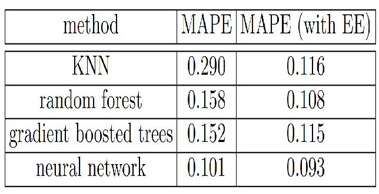

[^图9-8]: 将神经网络嵌入作为其他机器学习方法输入的影响（由Cheng Guo和Felix Berkhahn提供）

此处展示了四种建模技术之间的平均百分比误差（mean average percent error，MAPE）对比，其中三种我们已有所了解，另有一种是k-最近邻（k-nearest
neighbors，KNN）——一种极为简单的基准方法。第一列数值展示了在竞赛数据集上直接应用各方法的结果；第二列则呈现了先用分类嵌入训练神经网络，再将这些嵌入替换原始分类列进行建模的效果。可见所有情况下，采用嵌入数据而非原始分类数据都显著提升了模型性能。

这是一个非常重要的结果，因为它表明在推理阶段无需使用神经网络，就能获得神经网络的大部分性能提升。只需使用嵌入（本质上只是数组查找）配合小型决策树集成即可实现。

这些嵌入甚至不必为组织中的每个模型或任务单独学习。相反，一旦为特定任务的某列数据学习到一组嵌入，它们就可以存储在中央位置并被多个模型复用。事实上，通过与大型企业其他从业者的私下交流，我们了解到这种做法已在许多地方得到应用。

### 总结

我们探讨了两种表格建模方法：决策树集成与神经网络。同时提及了两种决策树集成方法：随机森林与梯度提升机。每种方法都有效，但也需要权衡取舍：

- 随机森林是最易训练的模型，因为它们对超参数选择具有极强的鲁棒性，且几乎不需要预处理。训练速度快，只要构建足够多的树就不会过拟合。但其准确性可能稍逊一筹，尤其在需要外推的情况下，例如预测未来时间段。
- 梯度提升机理论上与随机森林训练速度相当，但实践中需反复尝试超参数。其可能出现过拟合，但通常比随机森林更精准。
- 神经网络训练耗时最长，且需要额外预处理（如归一化），该归一化操作在推理阶段也需保持一致。若能谨慎调整超参数并避免过拟合，神经网络可提供卓越结果并具备良好外推能力。

我们建议从随机森林模型开始分析。这将为您提供一个坚实的基准，您可以确信这是合理的起点。随后可利用该模型进行特征选择和局部依赖性分析，从而更深入地理解你的数据。

在此基础上，你可以尝试神经网络和梯度提升模型。若它们能在合理时间内显著提升验证集效果，即可采用。如果决策树集成效果良好，可尝试向数据中添加分类变量的嵌入向量，观察是否能提升决策树的学习效果。

### 问卷调查

1. 什么是连续变量？
2. 什么是分类变量？
3. 请列举两个用于表示分类变量可能取值的术语。
4. 什么是密集层？
5. 实体嵌入如何减少内存使用并加速神经网络？
6. 实体嵌入对哪些类型的数据集特别有用？
7. 机器学习算法主要分为哪两大类？
8. 为何某些分类列需要特殊排序？如何在Pandas中实现？

9. 概述决策树算法的工作原理。
10. 日期变量为何不同于常规分类或连续变量？如何预处理使其适用于模型？
11. 在推土机竞赛中是否应随机选择验证集？若不应，应选择何种验证集？
12. 什么是pickle？它的用途是什么？
13. 本章绘制的决策树中，`mse`、`samples` 和 `values` 如何计算？
14. 构建决策树前如何处理异常值？
15. 决策树中如何处理分类变量？
16. 什么是袋装法？
17. 创建随机森林时，`max_samples` 与 `max_features` 有何区别？
18. 若将 `n_estimators` 设为极高值，是否可能导致过拟合？原因何在？
19. 在“创建随机森林”章节中，图9-7之后为什么 `preds.mean(0)` 与随机森林结果一致？
20. 什么是袋外误差？
21. 列举模型验证集误差可能高于出树误差的原因。如何验证这些假设？
22. 解释随机森林为何能有效解答下列问题：
    - 使用特定数据行进行预测时，我们对预测结果的置信度如何？
    - 针对特定数据行的预测，哪些因素最关键？它们如何影响预测结果？
    - 哪些列是最强预测因子？
    - 当调整这些列时，预测结果如何变化？

23. 移除不重要变量的目的是什么？
24. 展示树解释器结果的理想图表类型是什么？
25. 什么是外推问题？
26. 如何判断测试集或验证集的分布是否与训练集不同？
27. 尽管独立值少于9,000个，我们为什么还要将 `saleElapsed`设为连续变量？
28. 什么是增强法？
29. 如何将嵌入向量应用于随机森林？预期效果如何？
30. 为何表格建模不应始终采用神经网络？

#### 进一步研究

1. 在Kaggle上选择一个包含表格数据（当前或历史数据）的竞赛，尝试将本章所学技术应用于该竞赛以获得最佳结果。将您的结果与私有排行榜进行比较。
2. 亲自从头实现本章的决策树算法，并将其应用于第一项练习中使用的数据集。
3. 将本章神经网络生成的嵌入向量应用于随机森林模型，观察能否提升我们观察到的随机森林结果。

4. 解释 `TabularModel` 源代码中每行代码的功能（`BatchNorm1d` 和 `Dropout` 层除外）。

## 10. 深度解析NLP：循环神经网络（RNNs）

在第一章中，我们看到深度学习可用于自然语言数据集并取得卓越成果。我们的示例依赖于使用预训练语言模型并对其进行微调来分类评论。该示例突显了自然语言处理（NLP）与计算机视觉中迁移学习的差异：通常在NLP领域，预训练模型是在不同任务上训练的。

我们所说的语言模型，是一种经过训练后能够根据文本中已读内容预测下一个单词的模型。此类任务称为自监督学习（self-supervised learning）：我们无需为模型标注标签，只需输入海量文本数据。模型会自动从数据中获取标签，而这项任务绝非易事——要准确预测句子中的下一个单词，模型必须逐步建立对英语（或其他语言）的理解能力。自监督学习也可应用于其他领域；例如，参见 [《自监督学习与计算机视觉》](https://oreil.ly/ECjfJ) 了解视觉应用的入门知识。自监督学习通常不用于直接训练模型，而是用于预训练用于迁移学习的模型。

> 术语：自监督学习
>
> 使用嵌入在自变量中的标签训练模型，而非依赖外部标签。例如，训练模型预测文本中的下一个单词。

我们在第一章用于分类IMDb影评的语言模型是在维基百科上预训练的。通过直接将该语言模型微调为电影评论分类器，我们获得了很不错的结果，但如果增加一个步骤，效果将更佳。维基百科的英语与IMDb的英语存在细微差异，因此与其直接跳转到分类器，我们可先将预训练语言模型微调至IMDb语料库，再以此作为分类器的基础模型。

即使我们的语言模型掌握了任务所用语言的基础知识（例如预训练模型基于英语），适应目标语料库的风格仍大有裨益。该语料库可能采用更非正式的语言，或更具技术性，包含需要学习的新词汇或不同的句子构造方式。以IMDb数据集为例，其中包含大量电影导演和演员的名字，其语言风格通常比维基百科更不正式。

我们已经看到，借助fastai库，我们可以下载预训练的英语语言模型，并利用它在自然语言处理分类任务中获得最先进的结果。（我们预计更多语言的预训练模型很快就会面世；事实上，当你阅读本书时，它们很可能已经可用。）那么，我们为何还要深入学习如何训练语言模型呢？

当然，其中一个原因是理解所用模型的基础原理很有帮助。但还有另一个非常实际的原因：若在微调分类模型之前先对（基于序列的）语言模型进行微调，则能获得更优结果。例如在IMDb情感分析任务中，数据集包含50,000条未标注正负向标签的额外影评。由于训练集和验证集各含25,000条标注影评，总计构成100,000条影评数据。我们可以利用所有这些评论来微调预训练语言模型——该模型仅基于维基百科文章训练过；这将产生一个特别擅长预测电影评论下一个单词的语言模型。

这被称为通用语言模型微调（Universal Language Model Fine-tuning，ULMFiT）方法。该方法的论文表明，在将语言模型迁移学习到分类任务之前，额外添加这一微调阶段能显著提升预测效果。采用此方法后，我们在自然语言处理中的迁移学习包含三个阶段，如图10-1所示。

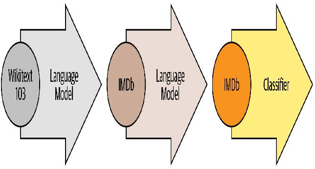

[^图10-1]: ULMFiT流程

接下来我们将探讨如何运用神经网络解决这个语言建模问题，并运用前两章介绍的概念。但在继续阅读之前，请先停下来思考一下：你会如何着手解决这个问题？

### 文本预处理

我们目前掌握的知识如何用于构建语言模型，这绝非显而易见。句子长度各异，文档篇幅冗长，那么如何利用神经网络预测句子的下一个词呢？让我们一起来看看吧！

我们已经了解了如何将分类变量用作神经网络的自变量。以下是我们对单个分类变量采用的方法：

1. 列出该分类变量所有可能的取值（我们将此列表称为词汇表（vocab））。
2. 将每个取值替换为其在词汇表中的索引。
3. 为其创建嵌入矩阵，其中每行对应一个取值（即词汇表中的每个项）。
4. 将该嵌入矩阵作为神经网络的第一层使用。（专用嵌入矩阵可直接接收步骤2生成的原始词表索引作为输入；这与接收表示索引的one-hot编码向量作为输入的矩阵功能等效，但前者速度更快且效率更高。）

我们也能对文本做几乎相同的事情！新颖之处在于序列的概念。首先我们将数据集中的所有文档拼接成一个超长字符串，并将其拆分为单词（或词元，tokens），从而得到一个超长的单词列表。我们的自变量将是由该超长列表中第一个单词开始、倒数第二个单词结束的单词序列，而因变量则是从第二个单词开始、到最后一个单词结束的单词序列。

我们的词汇表将包含两种词汇：预训练模型词汇库中已有的常用词，以及我们语料库中特有的新词（例如电影术语或演员姓名）。我们的嵌入矩阵将据此构建：对于预训练模型词汇表中的词汇，我们将取预训练模型嵌入矩阵中对应的行；但对于新词，由于没有对应项，我们将直接用随机向量初始化该行。

创建语言模型所需的每个步骤都涉及自然语言处理领域的专业术语，同时提供可用的fastai和PyTorch类库辅助实现。具体步骤如下：

- 分词处理

  将文本转换为单词列表（或字符列表、子字符串列表，具体取决于模型的粒度）。

- 数字化处理

  列出所有出现的唯一单词（词汇表），并通过查询词汇表中的索引将每个单词转换为数字。

- 语言模型数据加载器创建

  fastai提供的 `LMDataLoader` 类能自动处理创建与独立变量偏移一个令牌的依赖变量。它还可以处理若干关键细节，例如如何清洗训练数据以确保依赖变量与独立变量保持所需结构。

- 语言模型创建

  我们需要一种特殊模型来处理前所未有的任务：处理大小任意的输入列表。实现方式多种多样，本章将采用循环神经网络（RNN）。RNN的细节将在第12章详述，目前可将其视为另一种深度神经网络。

让我们详细看看每个步骤是如何运作的。

#### 词元化

当我们说“将文本转换为单词列表”时，遗漏了许多细节。例如，标点符号该如何处理？像“don't”这样的词该如何处理？它是一个词还是两个词？长长的医学术语或化学术语又该如何处理？是否应该将其拆解为独立的意义单元？连字符连接的词呢？德语和波兰语这类能由大量成分组合成超长单词的语言又该如何处理？而日语和汉语这类根本不使用词根、甚至没有明确词汇概念（译者注：汉语当然有词汇的概念，但是没有显式的词边界，也就是没有空格将句子分为若干个片段，且计算分词存在歧义）的语言呢？

由于这些问题没有唯一正确的答案，因此词元化也没有唯一的方法。主要有三种方法：

- 基于单词的分割方式

  将句子按空格分割，同时应用特定语言规则尝试分离语义单元（即使存在无空格情况，例如将“don't”拆分为“do n't”）。通常标点符号也会被分割为独立词素。

- 基于子词的分割方式

  将单词分割为更小的部分，基于最常出现的子字符串。例如，“occasion”可能被分割为“o c ca sion”。

- 基于字符的分割方式

  将句子分割为单个字符。

我们将在此探讨词级和次词级分词，而基于字符的分词则留待你在本章末尾的问卷中自行实现。

> 术语：词元
>
> 由分词过程创建的列表中的一个元素。它可以是一个单词、单词的一部分（一个子词）或一个字符。

#### 基于fastai的词元分割

fastai 并未提供专属的分词器，而是为外部库中的多种分词器提供统一接口。分词技术是活跃的研究领域，新型与改进型分词器层出不穷，因此 fastai 的默认分词器也会随之更新。但其 API 和选项不会发生太大变化，因为 fastai 致力于在底层技术迭代时保持 API 的一致性。

让我们用第一章中使用的IMDb数据集来试试看：

```python
from fastai.text.all import *
path = untar_data(URLs.IMDB)
```

我们需要获取文本文件以便测试分词器。正如 `get_image_files`（我们已多次使用该函数）能获取路径下的所有图像文件，`get_text_files` 则能获取路径下的所有文本文件。我们还可以选择性地传入 `folders` 参数，将搜索范围限定在特定子文件夹列表中：

```python
files = get_text_files(path, folders = ['train', 'test', 'unsup'])
```

以下是一篇评论，我们将对其进行分词处理（为节省篇幅，此处仅打印其开头部分）：

```python
txt = files[0].open().read(); txt[:75]
```

```text
'This movie, which I just discovered at the video store, has apparently sit '
```

在撰写本书时，fastai的默认英语词分词器使用了一个名为 `spaCy` 的库。它拥有一个复杂的规则引擎，包含针对URL、特定英语特殊词汇等场景的专属规则。不过我们不会直接使用 `SpacyTokenizer` ，而是采用 `WordTokenizer` ——该分词器始终指向fastai当前默认的词分词器（可能并非spaCy，具体取决于你使用的版本）。

让我们试试看。我们将使用 fastai 的 `coll_repr(collection, n)` 函数来显示结果。该函数会显示 `collection` 的前 `n` 个元素及其完整大小——这是 `L` 的默认实现方式。请注意，fastai 的分词器需要处理文档集合，因此我们需要将 `txt` 包裹在列表中：

```python
spacy = WordTokenizer()
toks = first(spacy([txt]))
print(coll_repr(toks, 30))
```

```text
(#201)
['This','movie',',','which','I','just','discovered','at','the','video','s
>
tore',',','has','apparently','sit','around','for','a','couple','of','years','
> without','a','distributor','.','It',"'s",'easy','to','see'...]
```

如你所见，spaCy主要只是将单词和标点符号分隔开来。但它在此还做了另一件事：将“it's”拆分为“it”和“'s”。这符合直觉——实际上它们本就是两个独立的词。当考虑到所有需要处理的细节时，词元化工作竟是如此微妙。好在spaCy能相当出色地处理这些情况——例如我们看到，当句号用于结束句子时会被拆分，但在缩写词或数字中则保持完整：

```python
first(spacy(['The U.S. dollar $1 is $1.00.']))
```

```text
(#9) ['The','U.S.','dollar','$','1','is','$','1.00','.']
```

fastai 随后通过 `Tokenizer` 类为分词过程添加了额外功能：

```python
tkn = Tokenizer(spacy)
print(coll_repr(tkn(txt), 31))
```

```text
(#228)
['xxbos','xxmaj','this','movie',',','which','i','just','discovered','at',
>
'the','video','store',',','has','apparently','sit','around','for','a','couple
>
','of','years','without','a','distributor','.','xxmaj','it',"'s",'easy'...]
```

请注意，现在出现了一些以字符“xx”开头的标记，这在英语中并非常见的词前缀。这些是特殊标记（special tokens）。

例如，列表中的第一个项目 `xxbos` 是一个特殊标记，表示新文本的开始（“BOS”是自然语言处理中的标准缩写，意为“流的开始”）。通过识别这个开始标记，模型将能够学会“忘记”先前内容，专注于后续词汇。

这些特殊标记并非直接来自spaCy。它们之所以存在，是因为fastai在处理文本时默认应用了若干规则来添加它们。这些规则旨在帮助模型更轻松地识别句子中的重要部分。某种程度上，我们正在将原始英语序列转换为一种简化的词元化语言——这种语言的设计初衷就是让模型更容易学习。

例如，规则会将四个感叹号序列替换为单个感叹号，后跟特殊重复字符标记，再接数字4。这样模型嵌入矩阵就能编码 *重复标点* （repeated character）等通用概念的信息，而无需为每种标点符号的重复次数单独设置标记。同样地，大写单词将被替换为特殊的大写标记，后跟该单词的小写版本。这样嵌入矩阵只需存储单词的小写形式，既节省计算和内存资源，又能学习到大写概念。

以下是一些你将看到的主要特殊标记：

- `xxbos`

  表示文本的开头（此处为评论）

- `xxmaj`

  表示下一个单词以大写字母开头（因为我们已将所有内容转换为小写）

- `xxunk`

  表示下一个单词未知

要查看使用的规则，你可以检查默认规则：

```python
defaults.text_proc_rules
```

```text
[<function fastai.text.core.fix_html(x)>,
<function fastai.text.core.replace_rep(t)>,
<function fastai.text.core.replace_wrep(t)>,
<function fastai.text.core.spec_add_spaces(t)>,
<function fastai.text.core.rm_useless_spaces(t)>,
<function fastai.text.core.replace_all_caps(t)>,
<function fastai.text.core.replace_maj(t)>,
<function fastai.text.core.lowercase(t, add_bos=True, add_eos=False)>]
```

与往常一样，你可以在笔记本中输入下列内容查看每个示例的源代码：

```python
??replace_rep
```

以下是每项功能的简要说明：

- `fix_html`

  将特殊HTML字符替换为可读版本（IMDb评论中存在大量此类字符）

- `replace_rep`

  将重复三次及以上的任意字符替换为特殊重复标记（`xxrep`），后跟重复次数，最后是原始字符

- `replace_wrep`

  将重复三次及以上的单词替换为特殊标记：单词重复标记（`xxwrep`）+ 重复次数 + 原单词

- `spec_add_spaces`

  在 `/` 和 `#` 周围添加空格

- `rm_useless_spaces`

  移除所有重复出现的空格字符

- `replace_all_caps`

  将全大写单词转换为小写，并在其前添加全大写标记（`xxcap`）

- `replace_maj`

  将首字母大写的单词转换为小写，并在其前添加首字母大写标记（`xxmaj`）

- `lowercase`

  将所有文本转换为小写，并在开头添加小写标记（`xxbos`）和/或结尾添加全小写标记（`xxeos`）

让我们看看其中几个的实际应用：

```python
coll_repr(tkn('&copy; Fast.ai www.fast.ai/INDEX'), 31)
```

```text
"(#11)
['xxbos','©','xxmaj','fast.ai','xxrep','3','w','.fast.ai','/','xxup','ind
> ex'...]"
```

现在让我们看看子词分词器是如何工作的。

#### 子词分词器

除了前文所述的词分隔方法外，另一种流行的分隔方式是子词分隔。词分隔基于这样一个假设：空格能有效区分句子中各语义成分。然而这种假设并不总是成立。例如考虑这句话：我的名字是郝杰瑞（中文对应英文“My name is Jeremy Howard”）。这种情况用词分词器处理效果很差，因为句子中根本没有空格！中文和日语等语言不使用空格，实际上它们甚至没有明确的“词”概念。而土耳其语和匈牙利语等语言可以将多个子词无空格地组合在一起，形成包含大量独立信息的长词。

处理这些情况时，通常最好采用子词分词法。该方法分为两个步骤：

1. 分析文档语料库，找出最常出现的字母组合。这些组合即构成词汇表。
2. 使用该词汇表中的子词单元对语料库进行分词处理。

让我们看一个例子。对于我们的语料库，我们将使用前2000条电影评论：

```python
txts = L(o.open().read() for o in files[:2000])
```

我们实例化分词器时，需传入要创建的词表大小，随后需要对其进行“训练”。即让其读取文档并找出常见字符序列以构建词表。此操作通过 `setup` 方法实现。稍后将看到，`setup` 是fastai的特殊方法，在常规数据处理流程中会自动调用。但当前我们手动操作所有步骤，因此需自行调用该方法。以下函数根据指定词表大小执行这些步骤，并展示示例输出：

```py
def subword(sz):
    sp = SubwordTokenizer(vocab_sz=sz)
    sp.setup(txts)
    return ' '.join(first(sp([txt]))[:40])
```

让我们试试看：

```python
subword(1000)
```

```text
'▁This ▁movie , ▁which ▁I ▁just ▁dis c over ed ▁at ▁the ▁video ▁st
or e , ▁has
> ▁a p par ent ly ▁s it ▁around ▁for ▁a ▁couple ▁of ▁years ▁without ▁a ▁dis t
> ri but or . ▁It'
```

使用 fastai 的子词分词器时，特殊字符 `_` 代表原始文本中的空格字符。

如果使用较小的词汇表，每个词元将代表更少的字符，因此需要更多词元来表示一个句子：

```python
subword(200)
```

```text
'▁ T h i s ▁movie , ▁w h i ch ▁I ▁ j us t ▁ d i s c o ver ed ▁a t ▁the ▁ v id e
> o ▁ st or e , ▁h a s'
```

另一方面，如果我们使用更大的词汇表，大多数常见的英语单词最终会进入词汇表本身，这样我们就不需要用那么多单词来表示一个句子：

```python
subword(10000)
```

```text
"▁This ▁movie , ▁which ▁I ▁just ▁discover ed ▁at ▁the ▁video ▁store
, ▁has
> ▁apparently ▁sit ▁around ▁for ▁a ▁couple ▁of ▁years ▁without ▁a ▁distributor
> . ▁It ' s ▁easy ▁to ▁see ▁why . ▁The ▁story ▁of ▁two ▁friends ▁living"
```

选择子词词汇量大小是一种权衡：更大的词汇量意味着每句的词元数量减少，从而加快训练速度、降低内存需求，并减少模型需要记忆的状态；但另一方面，这意味着更大的嵌入矩阵，需要更多数据来学习。

总体而言，子词分词技术提供了一种在字符分词（即使用小型子词词库）与词分词（即使用大型子词词库）之间轻松扩展的方法，且能处理所有人类语言而无需开发特定语言算法。它甚至能处理其他“语言”，例如基因组序列或MIDI乐谱！正因如此，过去一年间该方法的普及度急剧攀升，极有可能成为最主流的分词方案（待您阅读本文时，它或许已然如此！）。

将文本分割为词元后，我们需要将其转换为数字。接下来我们将探讨这一过程。

#### 使用fastai进行数值化

数值化（Numericalization）是将标记映射为整数的处理过程。其步骤与创建 `Category` 变量基本相同，例如MNIST数据集中的数字依赖变量：

1. 列出该分类变量（词表）的所有可能取值（即词表）。
2. 将每个取值替换为其在词表中的索引。

让我们看看它在之前看到的词分隔文本中的实际应用：

```python
toks = tkn(txt)
print(coll_repr(tkn(txt), 31))
```

```text
(#228)
['xxbos','xxmaj','this','movie',',','which','i','just','discovered','at',
>
'the','video','store',',','has','apparently','sit','around','for','a','couple
>
','of','years','without','a','distributor','.','xxmaj','it',"'s",'easy'...]
```

与 `SubwordTokenizer` 类似，我们需要调用 `Numericalize` 的 `setup` 方法；这是创建词汇表的方式。这意味着我们首先需要已分词的语料库。由于分词过程耗时较长，fastai会并行处理；但在此手动演示中，我们将使用一个小型子集：

```python
toks200 = txts[:200].map(tkn)
toks200[0]
```

```text
(#228)
>
['xxbos','xxmaj','this','movie',',','which','i','just','discovered','at'...]
```

我们可以将此传递给 `setup` 来创建词汇表：

```python
num = Numericalize()
num.setup(toks200)
coll_repr(num.vocab,20)
```

```text
"(#2000)
['xxunk','xxpad','xxbos','xxeos','xxfld','xxrep','xxwrep','xxup','xxmaj
> ','the','.',',','a','and','of','to','is','in','i','it'...]"
```

我们的特殊规则标记优先出现，随后每个词按出现频率排序各出现一次。`Numericalize` 的默认参数为 `min_freq=3` 和 `max_vocab=60000` 。当 `max_vocab=60000` 时，fastai会将除最常见的60,000个词之外的所有词替换为特殊未知词标记 `xxunk`。此机制有助于避免嵌入矩阵过度膨胀——过大的矩阵会拖慢训练速度、消耗过多内存，且可能导致罕见词缺乏足够训练数据来构建有效表示。不过后者问题更宜通过调整 `min_freq` 解决：默认值 `3` 意味着出现次数少于3次的词汇均会被替换为 `xxunk`。

fastai 还可通过你提供的词汇表对数据集进行数值化处理，只需将词汇列表作为 `vocab` 参数传递即可。

创建 `Numericalize` 对象后，我们就可以像使用函数一样使用它。

```python
nums = num(toks)[:20]; nums
```

```text
tensor([ 2, 8, 21, 28, 11, 90, 18, 59, 0, 45, 9, 351, 499,
11,
> 72, 533, 584, 146, 29, 12])
```

这次，我们的词元已被转换为模型可接收的整数张量。我们可以验证它们映射回原始文本：

```python
' '.join(num.vocab[o] for o in nums)
```

```text
'xxbos xxmaj this movie , which i just xxunk at the video store , has
apparently
> sit around for a'
```

既然我们已经有了数据，就需要将它们分批处理以供模型使用。

#### 将文本分批处理以供语言模型使用

在处理图像时，我们需要先将所有图像调整为相同高度和宽度，再将其分组为小批量数据，以便高效地堆叠到单个张量中。而文字处理则有所不同，因为文字无法简单地调整为指定长度。此外，我们希望语言模型按顺序读取文本，从而高效预测下一个单词。这意味着每个新批次必须精确接续上一个批次结束的位置。

假设我们有以下文本：

> In this chapter, we will go back over the example of classifying movie reviews we
> studied in chapter 1 and dig deeper under the surface. First we will look at the
> processing steps necessary to convert text into numbers and how to customize it. By doing this, we’ll have another example of the PreProcessor used in the data block API.
> Then we will study how we build a language model and train it for a while.

词元化过程将添加特殊标记并处理标点符号，最终返回以下文本：

> xxbos xxmaj in this chapter , we will go back over the example of classifying
> movie reviews we studied in chapter 1 and dig deeper under the surface . xxmaj
> first we will look at the processing steps necessary to convert text into numbers
> and how to customize it . xxmaj by doing this , we ‘ll have another example of the preprocessor used in the data block xxup api . \n xxmaj then we will study how we build a language model and train it for a while .

我们现在有90个词元，它们之间用空格分隔。假设我们想要批处理大小为6。我们需要将这段文本拆分为6个连续的部分，每个部分长度为15：

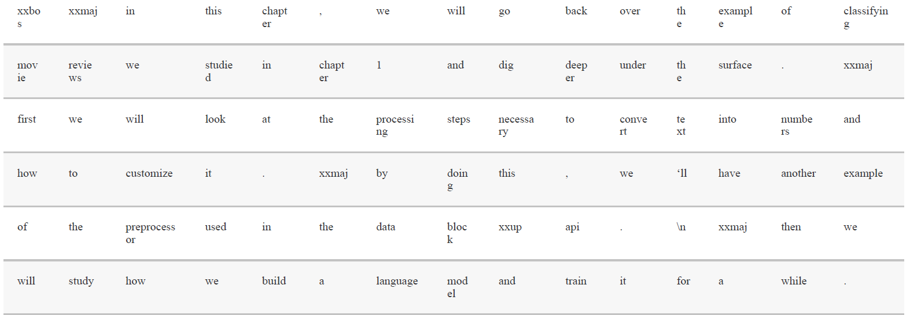

在理想情况下，我们可以将这批数据直接输入模型。但这种方法无法扩展，因为在实际应用中，很难将包含所有标记的单批数据装入GPU内存（此处仅90个词元，而IMDb所有评论合计达数百万条）。

因此，我们需要将这个数组更精细地划分为具有固定序列长度的子数组。保持这些子数组内部及跨子数组的顺序至关重要，因为我们将使用一种维护状态的模型——该模型在预测后续内容时，能够记住先前读取的内容。

回到我们之前那个包含6个长度为15的批次的例子，如果我们选择序列长度为5，这意味着我们首先输入以下数组：

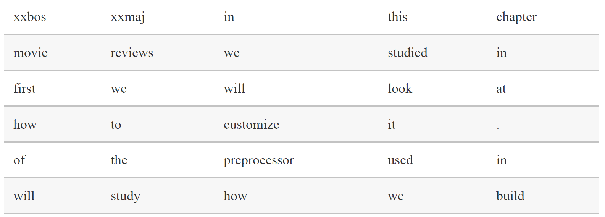

然后是这个：

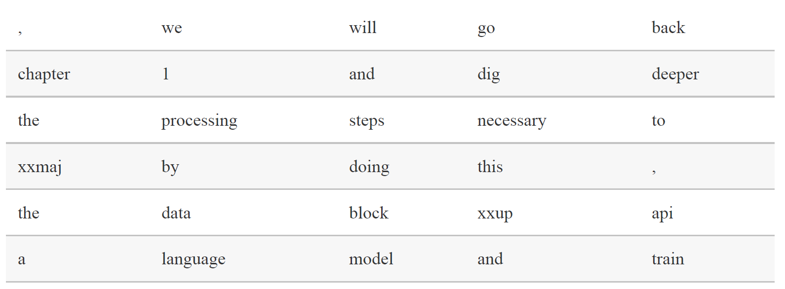

最后：

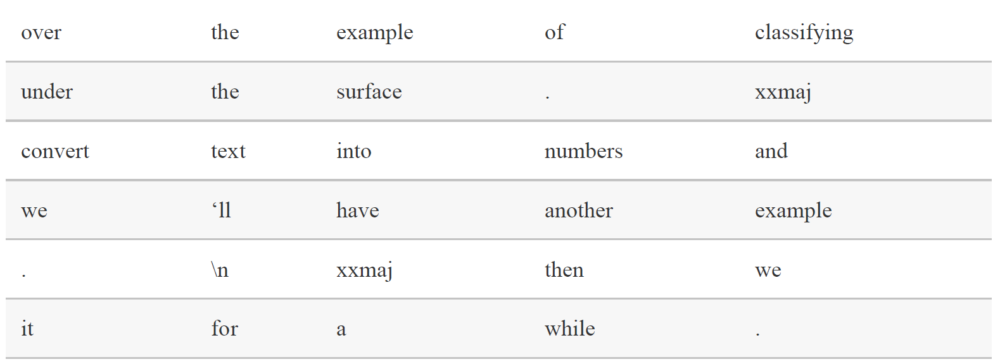

回到我们的电影评论数据集，第一步是将单个文本拼接成一个流。与图像处理类似，最佳做法是随机化输入顺序。因此在每个训练迭代轮次的开始，我们将打乱条目顺序生成新数据流（注意：打乱的是文档顺序而非文档内单词顺序，否则文本将失去语义！）。

然后我们将该数据流分割为若干批次（即批次大小）。

例如，若数据流包含50,000个词元且批次大小设为10，则会生成10个各含5,000个词元的子数据流。关键在于我们保留了词元的顺序（即第一个子流从1到5000，第二个从5001到10000...），因为我们希望模型能够连续读取文本行（如前例所示）。预处理阶段会在每段文本开头添加 `xxbos` 标记，以便模型在读取流数据时识别新条目的起始位置。

简而言之，在每个时间步长中，我们将文档集合重新洗牌并串联成一个词元流。随后将该流切割成若干固定长度的连续子流。模型会按顺序读取这些子流，并借助内部状态机制，无论选择何种序列长度，都能产生相同的激活结果。

当我们创建一个 `LMDataLoader` 时，这些操作都是由fastai库在后台自动完成的。具体实现方式是：首先将我们的 `Numericalize` 对象应用于分词后的文本数据。

```python
nums200 = toks200.map(num)
```

然后将它传递给 `LMDataLoader`：

```python
dl = LMDataLoader(nums200)
```

让我们通过获取第一批数据来确认这是否产生了预期结果。

```python
x,y = first(dl)
x.shape,y.shape
```

```text
(torch.Size([64, 72]), torch.Size([64, 72]))
```

然后查看自变量的第一行，它应该是第一个文本的开头：

```python
' '.join(num.vocab[o] for o in x[0][:20])
```

```text
'xxbos xxmaj this movie , which i just xxunk at the video store , has
apparently
> sit around for a'
```

因变量是相同项偏移一个词元的结果：

```python
' '.join(num.vocab[o] for o in y[0][:20])
```

```text
'xxmaj this movie , which i just xxunk at the video store , has
apparently sit
> around for a couple'
```

至此，我们对数据所需的所有预处理步骤均已完成。现在，我们已准备好训练文本分类器。

### 训练文本分类器

正如本章开头所述，使用迁移学习训练尖端文本分类器需要两个步骤：首先，我们需要将预先在维基百科上训练的语言模型微调到IMDb评论语料库上；然后，我们可以使用该模型来训练分类器。

老规矩，我们先从整理数据开始。

#### 基于DataBlock的语言模型

当 `TextBlock` 被传递给 `DataBlock` 时，fastai会自动处理分词和数值化操作。所有可传递给 `Tokenizer` 和 `Numericalize` 的参数同样可传递给 `TextBlock` 。在下一章中，我们将讨论分别执行这些步骤的最简便方法，以简化调试过程。但你始终可以参照前文所述，通过在数据子集上手动运行这些步骤进行调试。别忘了 `DataBlock` 的便捷 `summary` 方法，它对排查数据问题非常有用。

以下是使用 `TextBlock` 创建语言模型的方法，采用 fastai 的默认设置：

```python
get_imdb = partial(get_text_files, folders=['train', 'test', 'unsup'])

dls_lm = DataBlock(
    blocks=TextBlock.from_folder(path, is_lm=True),
    get_items=get_imdb, splitter=RandomSplitter(0.1)
).dataloaders(path, path=path, bs=128, seq_len=80)
```

与我们在 `DataBlock` 中使用过的其他类型不同的是，我们并非直接调用类本身（例如 `TextBlock(...)` ），而是调用类方法。类方法是Python中属于类而非对象的方法（若不熟悉此概念，请务必在线搜索相关资料，因为它在众多Python库和应用中被广泛使用；本书此前虽多次用到，但未特别强调）。`TextBlock` 的特殊性在于：数值化器的词汇表构建过程可能耗时较长（我们需要读取并分词每份文档才能生成词表）。

为了尽可能提高效率，fastai 进行了若干优化：

- 它将分词后的文档保存在临时文件夹中，因此无需重复进行分词处理。
- 它通过并行运行多个分词进程，充分利用计算机的CPU资源。

我们需要告诉 `TextBlock` 如何访问文本，以便它能执行这项初始预处理——这就是 `from_folder` 的作用。

`show_batch` 随后按常规方式运行：

```python
dls_lm.show_batch(max_n=2)
```

| text                                                         | text_                                                        |
| ------------------------------------------------------------ | ------------------------------------------------------------ |
| xxbos xxmaj it ’s awesome ! xxmaj in xxmaj story xxmaj mode , your going from punk to pro . xxmaj you have to complete goals that involve skating , driving , and walking . xxmaj you create your own skater and give it a name , and you can make it look stupid or realistic . xxmaj you are with your friend xxmaj eric throughout the game until he betrays you and gets you kicked off of the skateboard | xxmaj it ’s awesome ! xxmaj in xxmaj story xxmaj mode , your going from punk to pro . xxmaj you have to complete goals that involve skating , driving , and walking . xxmaj you create your own skater and give it a name , and you can make it look stupid or realistic . xxmaj you are with your friend xxmaj eric throughout the game until he betrays you and gets you kicked off of the skateboard xxunk |
| what xxmaj i ‘ve read , xxmaj death xxmaj bed is based on an actual dream , xxmaj george xxmaj barry , the director , successfully transferred dream to film , only a genius could accomplish such a task . \n\n xxmaj old mansions make for good quality horror , as do portraits , not sure what to make of the killer bed with its killer yellow liquid , quite a bizarre dream , indeed . xxmaj also , this | xxmaj i ‘ve read , xxmaj death xxmaj bed is based on an actual dream , xxmaj george xxmaj barry , the director , successfully transferred dream to film , only a genius could accomplish such a task . \n\n xxmaj old mansions make for good quality horror , as do portraits , not sure what to make of the killer bed with its killer yellow liquid , quite a bizarre dream , indeed . xxmaj also , this is |

现在数据准备就绪，我们可以对预训练语言模型进行微调。

#### 语言模型的微调

要将整数词索引转换为可用于神经网络的激活值，我们将采用嵌入技术——正如在协同过滤和表格建模中使用的那样。随后，我们将这些嵌入值输入到循环神经网络中，采用名为AWD-LSTM的架构（第12章将展示如何从零构建此类模型）。如前所述，预训练模型中的嵌入向量会与随机嵌入向量合并，后者用于补充预训练词汇表中缺失的词汇。此过程在 `language_model_learner` 内部自动完成：

```python
learn = language_model_learner(
    dls_lm, AWD_LSTM, drop_mult=0.3,
    metrics=[accuracy, Perplexity()]).to_fp16()
```

默认使用的损失函数是交叉熵损失，因为我们本质上面临的是分类问题（不同类别即词汇表中的单词）。此处采用的困惑度度量常用于自然语言处理中的语言模型：它是损失值的指数（即 `torch.exp(cross_entropy)`）。我们同时引入准确率指标，用于衡量模型预测下一个单词时的正确次数——因为交叉熵（如前所述）既难以解释，又更侧重反映模型置信度而非实际准确性。

让我们回到本章开头的流程图。第一阶段的箭头已为我们完成，并作为预训练模型在fastai中提供，而我们刚刚为第二阶段构建了 `DataLoaders` 和 `Learner` 。现在，我们准备好对语言模型进行微调了！


每次训练一个迭代轮次需要相当长的时间，因此我们将在训练过程中保存中间模型结果。由于 `fine_tune` 不会自动执行此操作，我们将使用 `fit_one_cycle`。与 `cnn_learner` 类似，`language_model_learner` 在使用预训练模型时（默认情况）会自动调用 `freeze`，因此仅训练嵌入层（模型中唯一包含随机初始化权重的部分——即 IMDb 词汇表中存在但预训练模型词汇表中缺失的词汇嵌入）：

```python
learn.fit_one_cycle(1, 2e-2)
```

| 迭代轮次 | 训练损失 | 验证损失 | 准确率   | 困惑度    | 时间  |
| -------- | -------- | -------- | -------- | --------- | ----- |
| 0        | 4.120048 | 3.912788 | 0.299565 | 50.038246 | 11:39 |

该模型训练耗时较长，因此正好可以借此机会讨论保存中间结果的问题。

#### 模型的保存与加载

你可以像这样轻松地保存模型的状态：

```python
learn.save('1epoch')
```

这将在 `learn.path/models/` 目录下创建名为 `1epoch.pth` 的文件。如果你希望在另一台机器上以相同方式创建学习器后加载模型，或稍后继续训练，可按以下方式加载该文件内容：

```python
learn = learn.load('1epoch')
```

初始训练完成后，我们可以继续进行模型解冻后的微调：

```python
learn.unfreeze()
learn.fit_one_cycle(10, 2e-3)
```

| 迭代轮次 | 训练损失 | 验证损失 | 准确率   | 困惑度    | 时间  |
| -------- | -------- | -------- | -------- | --------- | ----- |
| 0        | 3.893486 | 3.772820 | 0.317104 | 43.502548 | 12:37 |
| 1        | 3.820479 | 3.717197 | 0.323790 | 41.148880 | 12:30 |
| 2        | 3.735622 | 3.659760 | 0.330321 | 38.851997 | 12:09 |
| 3        | 3.677086 | 3.624794 | 0.333960 | 37.516987 | 12:12 |
| 4        | 3.636646 | 3.601300 | 0.337017 | 36.645859 | 12:05 |
| 5        | 3.553636 | 3.584241 | 0.339355 | 36.026001 | 12:04 |
| 6        | 3.507634 | 3.571892 | 0.341353 | 35.583862 | 12:08 |
| 7        | 3.444101 | 3.565988 | 0.342194 | 35.374371 | 12:08 |
| 8        | 3.398597 | 3.566283 | 0.342647 | 35.384815 | 12:11 |
| 9        | 3.375563 | 3.568166 | 0.342528 | 35.451500 | 12:05 |

完成上述操作后，我们将保存模型除最终层之外的所有部分——该最终层负责将激活值转换为词汇表中每个词元的选择概率。不含最终层的模型称为编码器（encoder），可通过`save_encoder` 函数保存：

```python
learn.save_encoder('finetuned')
```

> 术语：编码器
>
> 该模型不包含任务特异性最终层。该术语在视觉卷积神经网络中的含义与“主体”基本相同，但在自然语言处理和生成模型中，“编码器”一词更常用。

至此，文本分类流程的第二阶段——语言模型的微调工作已完成。现在我们可以利用该模型，结合IMDb情感标签对分类器进行微调。不过在进入分类器微调环节之前，让我们先尝试一个不同的操作：用我们的模型生成随机影评。

#### 生成文本

由于我们的模型经过训练能够预测句子中的下一个单词，因此我们可以利用它来编写新的评论：

```python
TEXT = "I liked this movie because"
N_WORDS = 40
N_SENTENCES = 2
preds = [learn.predict(TEXT, N_WORDS, temperature=0.75)
         for _ in range(N_SENTENCES)]
```

```python
print("\n".join(preds))
```

```text
i liked this movie because of its story and characters . The story line
was very
> strong , very good for a sci - fi film . The main character , Alucard
, was
> very well developed and brought the whole story
i liked this movie because i like the idea of the premise of the movie ,
the (
> very ) convenient virus ( which , when you have to kill a few people ,
the "
> evil " machine has to be used to protect
```

如你所见，我们加入了随机性（根据模型返回的概率随机选择单词），因此不会出现完全相同的评论。我们的模型并未预先编程任何句式结构或语法规则，却明显掌握了大量英语句式特征：可见其正确使用大写字母（“I”被转换为小写“i”，因规则要求单词需两个字符以上才视为大写，故小写处理属正常现象），且时态运用保持一致。这篇综合评论乍看合乎逻辑，只有仔细阅读才能察觉某些细节略有偏差。对于仅训练数小时的模型而言，这已相当出色！

但我们的最终目标并非训练模型生成评论，而是对评论进行分类……那么就让我们用这个模型来实现这个目标吧。

#### 创建分类器数据加载器

我们现在正从语言模型微调转向分类器微调。回顾一下，语言模型预测文档的下一个单词，因此不需要任何外部标签。而分类器则预测外部标签——以IMDb为例，它预测的是文档的情感倾向。

这意味着我们用于自然语言处理分类的 `DataBlock` 结构将看起来非常熟悉。它几乎与我们处理过的众多图像分类数据集完全相同：

```python
dls_clas = DataBlock(
    blocks=(TextBlock.from_folder(path,
                                  vocab=dls_lm.vocab),CategoryBlock),
    get_y = parent_label,
    get_items=partial(get_text_files, folders=['train', 'test']),
    splitter=GrandparentSplitter(valid_name='test')
).dataloaders(path, path=path, bs=128, seq_len=72)
```

与图像分类类似，`show_batch` 方法会展示每个自变量（本例中为电影评论文本）对应的因变量（即情感倾向）：

```python
dls_clas.show_batch(max_n=3)
```

| 序号 | 文本                                                         | 类别 |
| ---- | ------------------------------------------------------------ | ---- |
| 0    | xxbos i rate this movie with 3 skulls , only coz the girls knew how to scream , this could ‘ve been a better movie , if actors were better , the twins were xxup ok , i believed they were evil , but the eldest and youngest brother , they sucked really bad , it seemed like they were reading the scripts instead of acting them … . spoiler : if they ‘re vampire ’s why do they freeze the blood ? vampires ca n’t drink frozen blood , the sister in the movie says let ’s drink her while she is alive … .but then when they ‘re moving to another house , they take on a cooler they ‘re frozen blood . end of spoiler \n\n it was a huge waste of time , and that made me mad coz i read all the reviews of how | neg  |
| 1    | xxbos i have read all of the xxmaj love xxmaj come xxmaj softly books . xxmaj knowing full well that movies can not use all aspects of the book , but generally they at least have the main point of the book . i was highly disappointed in this movie . xxmaj the only thing that they have in this movie that is in the book is that xxmaj missy ’s father comes to xxunk in the book both parents come ) . xxmaj that is all . xxmaj the story line was so twisted and far fetch and yes , sad , from the book , that i just could n’t enjoy it . xxmaj even if i did n’t read the book it was too sad . i do know that xxmaj pioneer life was rough , but the whole movie was a downer . xxmaj the rating | neg  |
| 2    | xxbos xxmaj this , for lack of a better term , movie is lousy . xxmaj where do i start … … \n\n xxmaj cinemaphotography - xxmaj this was , perhaps , the worst xxmaj i ‘ve seen this year . xxmaj it looked like the camera was being tossed from camera man to camera man . xxmaj maybe they only had one camera . xxmaj it gives you the sensation of being a volleyball . \n\n xxmaj there are a bunch of scenes , haphazardly , thrown in with no continuity at all . xxmaj when they did the ' split screen ' , it was absurd . xxmaj everything was squished flat , it looked ridiculous . \n\n xxmaj the color tones were way off . xxmaj these people need to learn how to balance a camera . xxmaj this ' movie ' is poorly made , and | neg  |

来看看 `DataBlock` 的定义，每个部分都与先前构建的数据块相似，但存在两个重要例外：

- `TextBlock.from_folder` 不再包含 `is_lm=True` 参数。
- 我们将创建的 `vocab` 传递给语言模型微调。

我们传递语言模型的词汇表是为了确保使用相同的词元到索引映射关系。否则，我们在微调语言模型中学习到的嵌入向量将无法被该模型理解，微调步骤也将毫无意义。

通过传递 `is_lm=False`（或完全不传递 `is_lm`，因为其默认值为 `False`），我们告知 `TextBlock` 当前处理的是常规标注数据，而非将后续词元作为标签使用。然而我们仍需应对一个挑战，即如何将多份文档整合为一个小批次。让我们通过一个示例来演示：尝试创建包含前10个文档的小批次。首先我们将它们数值化：

```python
nums_samp = toks200[:10].map(num)
```

现在让我们看看这10篇电影评论中每篇包含多少个词元：

```python
nums_samp.map(len)
```

```text
(#10) [228,238,121,290,196,194,533,124,581,155]
```

请记住，PyTorch `DataLoaders` 需要将批次中的所有项目整合为单个张量，而单个张量具有固定形状（即每个轴上都有特定长度，且所有项目必须保持一致）。这应该听起来很熟悉：我们在处理图像时也遇到过相同的问题。当时我们通过裁剪、填充和/或压缩手段使所有输入达到相同尺寸。但裁剪对文档可能并非良策，因为很可能导致关键信息丢失（尽管图像同样存在此问题，我们仍采用裁剪；目前自然语言处理领域尚未充分探索数据增强技术，或许裁剪在NLP中同样存在应用空间！）。文档无法进行“压缩”操作，因此只剩下填充这一方案！

我们将扩展最短文本使其长度一致。为此，我们使用一种特殊填充词元，该词元会被模型忽略。此外，为避免内存问题并提升性能，我们将把长度大致相同的文本批量处理（训练集会进行一定程度的打乱）。具体实现方式是：在每个训练周期开始前，大致按文档长度对训练集进行排序。这样整理成单批次的文档长度就会趋于一致。我们不会将每个批次都填充到相同大小，而是以批次中最长文档的长度作为目标尺寸。

> 动态调整图像大小
>
> 对图像进行类似操作也是可行的，这对于尺寸不规则的矩形图像尤为有用。但在撰写本文时，尚无库对此提供良好支持，也没有相关论文探讨该问题。不过我们计划近期将此功能添加到fastai中，敬请关注本书官网；一旦功能完善，我们将立即发布相关信息。

当使用 `is_lm=False` 的 `TextBlock` 时，数据块 API 会自动为我们完成排序和填充操作。（对于语言模型数据，我们不会遇到同样的问题，因为我们会先将所有文档拼接在一起，然后再将其分割为等长段落。）

现在我们可以创建一个模型来对文本进行分类：

```python
learn = text_classifier_learner(dls_clas, AWD_LSTM, drop_mult=0.5,
                                metrics=accuracy).to_fp16()
```

在训练分类器之前，最后一步是从我们微调过的语言模型中加载编码器。我们使用 `load_encoder` 而非 `load` ，因为编码器仅有预训练权重可用；若加载不完整模型， `load` 默认会引发异常：

```python
learn = learn.load_encoder('finetuned')
```

#### 分类器的微调

最后一步是采用鉴别学习率和渐进解冻策略（gradual unfreezing）进行训练。在计算机视觉领域，我们通常一次性解冻整个模型，但对于自然语言处理分类器，我们发现每次解冻少量层级能带来显著差异：

```python
learn.fit_one_cycle(1, 2e-2)
```

| 迭代轮次 | 训练损失 | 验证损失 | 准确率   | 时间  |
| -------- | -------- | -------- | -------- | ----- |
| 0        | 0.347427 | 0.184480 | 0.929320 | 00:33 |

仅用一个迭代轮次，我们就得到了与第1章训练相同的成果——还不错！我们可以向 `freeze_to` 传递 `-2` 参数，以此冻结除最后两个参数组之外的所有参数：

```python
learn.freeze_to(-2)
learn.fit_one_cycle(1, slice(1e-2/(2.6**4),1e-2))
```

| 迭代轮次 | 训练损失 | 验证损失 | 准确率   | 时间  |
| -------- | -------- | -------- | -------- | ----- |
| 0        | 0.247763 | 0.171683 | 0.934640 | 00:37 |

然后我们可以再稍稍解冻一下，继续训练：

```python
learn.freeze_to(-3)
learn.fit_one_cycle(1, slice(5e-3/(2.6**4),5e-3))
```

| 迭代轮次 | 训练损失 | 验证损失 | 准确率   | 时间  |
| -------- | -------- | -------- | -------- | ----- |
| 0        | 0.193377 | 0.156696 | 0.941200 | 00:45 |

最后，我们来解冻整个模型！

```python
learn.unfreeze()
learn.fit_one_cycle(2, slice(1e-3/(2.6**4),1e-3))
```

| 迭代轮次 | 训练损失 | 验证损失 | 准确率   | 时间  |
| -------- | -------- | -------- | -------- | ----- |
| 0        | 0.172888 | 0.153770 | 0.943120 | 01:01 |
| 1        | 0.161492 | 0.155567 | 0.942640 | 00:57 |

我们实现了94.3%的准确率，这在三年前还是顶尖水平。通过用所有倒序文本训练另一个模型，并取两个模型的预测结果平均值，我们甚至能达到95.1%的准确率——这正是ULMFiT论文提出的最新纪录。该纪录仅在数月前被打破——通过对更大规模模型进行微调，并采用昂贵的数据增强技术（将句子翻译成另一种语言再译回，同时使用另一模型进行翻译）。

利用预训练模型，我们可以构建出功能强大的微调语言模型，既能生成虚假评论，也能协助识别虚假评论。这项技术令人振奋，但需谨记它同样可能被用于恶意目的。

### 虚假信息与语言模型

在深度学习语言模型尚未普及的年代，即便基于规则的简单算法也能被用于创建虚假账户，试图影响政策制定者。现任ProPublica计算记者的杰夫·高（Jeff Kao）分析了2017年美国联邦通信委员会（FCC）关于废除网络中立性提案的公众评论。他在题为 [《百万份废除网络中立性支持意见或系伪造》](https://oreil.ly/ptq8B) 中，他揭露了大量反对网络中立性的评论疑似通过某种填空式邮件合并程序生成。图10-2中，高将虚假评论进行色彩标注，清晰展现其公式化特征。


[^图10-2]: 美国联邦通信委员会在网络中立性辩论期间收到的评论

高估算称，“在超过2200万条评论中，真正独特的不足80万条”，且“超过99%的真正独特评论都支持保留网络中立性”。

鉴于2017年以来语言建模技术的进步，如今此类欺诈活动几乎难以察觉。你现在已掌握所有必要工具，足以创建令人信服的语言模型——这种模型能生成符合语境且可信的文本。它未必完全准确无误，但绝对具有说服力。试想这项技术若与近年我们所知的虚假信息传播活动相结合会产生何种影响。请看图10-3展示的Reddit对话：基于OpenAI GPT-2算法的语言模型正就“美国政府是否应削减国防开支”这一议题进行自我对话。


[^图10-3]: Reddit上自我对话的算法

在此案例中，对话是由算法生成的。但试想若恶意行为者决定在社交网络中释放此类算法——他们可缓慢谨慎地操作，让算法随时间推移逐步积累追随者与信任度。要操控数百万账号实施此类操作，所需资源其实并不多。在这种情境下，我们不难想象最终会出现这样的局面：网络上绝大多数言论都来自机器人账号，而无人察觉其中玄机。

我们已经开始看到机器学习被用于生成身份的实例。例如，图10-4展示了凯蒂·琼斯（Katie Jones）的领英个人资料。


[^图10-4]: 凯蒂·琼斯（Katie Jones）的领英个人资料

凯蒂·琼斯在领英上与华盛顿多家主流智库成员互相关联。但她根本不存在。你所看到的这张照片是由生成对抗网络自动生成的，事实上，根本不存在名为凯蒂·琼斯的人从战略与国际研究中心毕业。

许多人认为或希望算法能在此为我们提供保护——即我们能开发出能够自动识别自动生成内容的分类算法。然而问题在于，这永远是一场军备竞赛：更优的分类（或鉴别器）算法反而会被用来创造更强大的生成算法。

### 总结

在本章中，我们探讨了fastai库最后一个开箱即用的应用领域：文本。我们接触了两种模型：能够生成文本的语言模型，以及判定评论正负向的分类器。为构建前沿分类器，我们采用预训练语言模型，针对任务语料集进行微调，再将其主体（编码器）与新头部结合进行分类任务。

在本书这一部分结束之前，我们将探讨fastai库如何帮助你针对具体问题整合数据。

### 问卷调查

1. 什么是自监督学习？
2. 什么是语言模型？
3. 为什么语言模型被视为自监督模型？
4. 自监督模型通常用于什么？
5. 为什么要对语言模型进行微调？
6. 创建尖端文本分类器的三个步骤是什么？
7. 50,000条无标签电影评论如何帮助创建更优的IMDb数据集文本分类器？

8. 为语言模型准备数据需要哪三个步骤？
9. 什么是词元化？为何我们需要这样做？
10. 请列举三种词元化的方法。
11. 什么是 `xxbos` ？
12. 请列举fastai在文本分词过程中应用的四条规则。
13. 为何重复字符会被替换为显示重复次数及重复字符的标记？
14. 什么是数字化处理？
15. 为何某些词会被替换为“未知词”标记？
16. 当批量大小为64时，表示首个批次的张量首行包含数据集前64个词元。该张量的第二行包含什么？第二个批次的首行又包含什么？（注意——学生常答错此题！请务必在教材官网核对答案。）
17. 为何文本分类需要填充？语言模型为何不需要填充？
18. NLP的嵌入矩阵包含哪些内容？其形状如何？
19. 什么是困惑度？
20. 为何必须将语言模型的词汇表传递给分类器数据块？
21. 什么是渐进解冻？
22. 为何文本生成技术往往领先于机器生成文本的自动识别技术？

#### 进一步研究

1. 了解语言模型与虚假信息的相关知识。当前最优秀的语言模型有哪些？观察它们的输出结果。你认为它们具有说服力吗？恶意行为者如何利用此类模型制造冲突与不确定性？

2. 鉴于模型难以持续识别机器生成的文本，面对利用深度学习的大规模虚假信息传播活动，我们还需要哪些其他应对策略？

## 11. 使用 fastai 的中层 API 进行数据处理

我们已经了解了 `Tokenizer` 和 `Numericalize` 对文本集合的作用，以及它们如何在数据块API中被使用——该API通过 `TextBlock` 直接为我们处理这些转换。但如果我们只想应用其中一种转换呢？无论是为了查看中间结果，还是因为文本已完成词元化？更普遍地说，当数据块API无法灵活满足特定用例时，我们该如何应对？此时需要借助fastai的中层数据处理API——数据块API正是构建于该层之上，因此它不仅能实现数据块API的所有功能，更能提供远超其范围的扩展能力。

### 深入探索 fastai 的分层式 API

 fastai库基于分层API（layered API）构建。最顶层是应用程序，正如我们在第一章所见，它们让我们仅用五行代码就能训练模型。例如在为文本分类器创建 `DataLoaders` 时，我们使用了以下代码行：

```python
from fastai.text.all import *
dls = TextDataLoaders.from_folder(untar_data(URLs.IMDB), valid='test')
```

工厂方法 `TextDataLoaders.from_folder` 在数据结构与 IMDb 数据集完全一致时非常便捷，但实际应用中往往并非如此。数据块 API 提供了更高的灵活性。正如前一章所示，我们可通过以下方式实现相同效果：

```python
path = untar_data(URLs.IMDB)
dls = DataBlock(
    blocks=(TextBlock.from_folder(path),CategoryBlock),
    get_y = parent_label,
    get_items=partial(get_text_files, folders=['train', 'test']),
    splitter=GrandparentSplitter(valid_name='test')
).dataloaders(path)
```

但有时它不够灵活。例如，在调试过程中，我们可能只需要应用该数据块附带的部分转换操作。或者，我们可能需要为某个未被fastai直接支持的应用程序创建 `DataLoaders`。本节将深入剖析 fastai 内部用于实现数据块 API 的组件。掌握这些原理将使你能够充分利用该中间层 API 的强大功能与灵活特性。

> 中间层 API
>
> 中间层API不仅包含创建 `DataLoader` 的功能，还提供了回调系统，允许我们按需定制训练循环，以及通用优化器。这两者都将在第16章中详细介绍。

#### 变换

在上一章探讨词元化和数字化时，我们首先收集了大量文本：

```python
files = get_text_files(path, folders = ['train', 'test'])
txts = L(o.open().read() for o in files[:2000])
```

随后我们演示了如何使用 `Tokenizer` 对它们进行分词处理

```python
tok = Tokenizer.from_folder(path)
tok.setup(txts)
toks = txts.map(tok)
toks[0]
```

```text
(#374) ['xxbos','xxmaj','well',',','"','cube','"','(','1997',')'...]
```

以及如何进行数值化处理，包括自动为我们的语料库创建词汇表：

```python
num = Numericalize()
num.setup(toks)
nums = toks.map(num)
nums[0][:10]
```

```text
tensor([ 2, 8, 76, 10, 23, 3112, 23, 34, 3113, 33])
```

这些类还提供了 `decode` 方法。例如，`Numericalize.decode` 会返回字符串词元：

```python
nums_dec = num.decode(nums[0][:10]); nums_dec
```

```text
(#10) ['xxbos','xxmaj','well',',','"','cube','"','(','1997',')']
```

`Tokenizer.decode` 将此转换回单个字符串（但可能与原始字符串不完全相同；这取决于分词器是否可逆，而本书撰写时默认的词分词器不可逆）：

```python
tok.decode(nums_dec)
```

```text
'xxbos xxmaj well , " cube " ( 1997 )'
```

`decode` 函数被 fastai 的 `show_batch` 和 `show_results` 以及其他一些推理方法所使用，用于将预测结果和迷你批次转换为人类可理解的表示形式。

在前面的示例中，对于每个 `tok` 或 `num` ，我们创建了一个名为 `setup` 的方法（该方法在必要时为 `tok` 训练分词器，并为 `num` 创建词汇表），将其应用于原始文本（通过将对象作为函数调用），最后将结果解码回可理解的表示形式。这些步骤是大多数数据预处理任务的必需环节，因此 fastai 提供了一个封装这些步骤的类——`Transform` 类。`Tokenize` 和 `Numericalize` 都是 `Transform` 的子类。

通常而言，`Transform` 是一个行为类似函数的对象，它具有可选的 `setup` 方法（用于初始化内部状态，例如 `num` 中的词汇表）和可选的 `decode` 方法（用于反转该函数，但这种反转可能并不完美，正如我们从 `tok` 中所见）。

`decode` 的一个典型示例可见于第7章介绍的 `Normalize` 变换：为实现图像绘制，其 `decode` 方法会撤销归一化操作（即乘以标准差并加回均值）。另一方面，数据增强变换不提供 `decode` 方法，因为我们需要展示图像变化效果，以确保数据增强按预期发挥作用。

`Transforms` 的特殊行为在于它们总是作用于元组之上。通常，我们的数据始终是 (输入,目标) 形式的元组（有时包含多个输入或多个目标）。当对这类元素应用变换（如调整尺寸）时，我们并不希望整体调整元组的尺寸，而是分别调整输入（若适用）和目标（若适用）的尺寸。进行数据增强的批量变换同样如此：当输入是图像而目标是分割掩膜时，变换需以相同方式分别应用于输入和目标。

如果我们将文本元组传递给 `tok` 方法，就能看到这种行为：

```python
tok((txts[0], txts[1]))
```

```text
((#374) ['xxbos','xxmaj','well',',','"','cube','"','(','1997',')'...],
(#207)
>
['xxbos','xxmaj','conrad','xxmaj','hall','went','out','with','a','bang'...])
```

#### 编写你自己的转换器

如果你想编写自定义转换函数应用于数据，最简便的方式是编写函数。如示例所示，当提供类型参数时，转换函数仅对匹配类型生效（否则将始终生效）。在以下代码中，函数签名中的 ` :int` 表示 `f `仅作用于整数类型。因此 `tfm(2.0)` 返回 `2.0`，而 `tfm(2)` 返回 `3`：

```python
def f(x:int): return x+1
tfm = Transform(f)
tfm(2),tfm(2.0)
```

```text
(3, 2.0)
```

在此处，`f` 被转换为一个没有 `setup` 方法且没有 `decode` 方法的 `Transform`。

Python 提供了一种特殊语法，用于将函数（如 `f`）传递给另一个函数（或行为类似函数的对象，在 Python 中称为可调用对象（callable）），这种机制称为装饰器（decorator）。使用装饰器时，需在可调用对象前添加 `@` 符号，并将其置于函数定义之前（关于 Python 装饰器的优质在线教程众多，如果你还不熟悉这个概念，建议查阅相关教程）。以下代码与前文示例完全等效：

```python
@Transform
def f(x:int): return x+1
f(2),f(2.0)
```

```text
(3, 2.0)
```

如果你想实现初始化或解码功能，则需继承 `Transform` 类，在 `encodes` 中实现实际编码行为，随后（可选）在 `setups` 中实现初始化行为，并在 `decodes` 中实现解码行为：

```python
class NormalizeMean(Transform):
    def setups(self, items): self.mean = sum(items)/len(items)
    def encodes(self, x): return x-self.mean
    def decodes(self, x): return x+self.mean
```

在此，`NormalizeMean` 将在初始化阶段设置特定状态（传入所有元素的均值）；随后进行的变换是减去该均值。为实现解码目的，我们通过加回均值来实现该变换的逆操作。以下是 `NormalizeMean` 的应用示例：

```python
tfm = NormalizeMean()
tfm.setup([1,2,3,4,5])
start = 2
y = tfm(start)
z = tfm.decode(y)
tfm.mean,y,z
```

```text
(3.0, -1.0, 2.0)
```

请注意，对于以下每种方法，调用的方法与实现的方法是不同的：

| 类                    | 调用                   | 实现      |
| --------------------- | ---------------------- | --------- |
| `nn.Module` (PyTorch) | `()`（即作为函数调用） | `forward` |
| `Transform`           | `()`                   | `encodes` |
| `Transform`           | `decode()`             | `decodes` |
| `Transform`           | `setup()`              | `setups`  |

因此，例如你永远不会直接调用 `setups`，而是调用 `setup`。原因是 `setup` 会在你调用 setups 之前和之后为你执行一些操作。要深入了解 `Transforms` 以及如何利用它们根据输入类型实现不同行为，请务必查阅 fastai 文档中的教程。

#### `Pipeline` 类

要组合多个转换操作，fastai 提供了 `Pipeline` 类。我们通过向其传递一个转换操作列表来定义 `Pipeline`；它将自动组合内部的转换操作。当对某个对象调用 `Pipeline` 时，它会按顺序自动调用内部的转换操作：

```python
tfms = Pipeline([tok, num])
t = tfms(txts[0]); t[:20]
```

```text
tensor([ 2, 8, 76, 10, 23, 3112, 23, 34, 3113, 33,
10, 8,
> 4477, 22, 88, 32, 10, 27, 42, 14])
```

然后你可以对编码结果调用 `decode` 操作，以获取可显示和分析的内容：

```python
tfms.decode(t)[:100]
```

```text
'xxbos xxmaj well , " cube " ( 1997 ) , xxmaj vincenzo \'s first movie ,
was one
> of the most interesti'
```

唯一与 `Transform` 不同之处在于设置方式。要正确为某些数据设置 `Transform`  的 `Pipeline` ，需要使用 `TfmdLists` 。

### TfmdLists 和 Datasets：转换后的集合

你的数据通常是一组原始项（如文件名或 `DataFrame` 中的行），你应该希望对这些项进行一系列转换。我们刚刚看到，在fastai中，一系列转换由 `Pipeline` 表示。将该 `Pipeline` 与原始项组合的类称为 `TfmdLists`。

#### TfmdLists

以下是实现上一节中转换的简便方法：

```python
tls = TfmdLists(files, [Tokenizer.from_folder(path), Numericalize])
```

初始化时，`TfmdLists` 将按顺序自动调用每个 `Transform` 的 `setup` 方法，为每个 `Transform` 提供经过所有先前 `Transform` 依次转换后的元素，而非原始元素。我们只需通过索引访问 `TfmdLists`，即可获取管道对任意原始元素的处理结果：

```python
t = tls[0]; t[:20]
```

```text
tensor([ 2, 8, 91, 11, 22, 5793, 22, 37, 4910,
34,
> 11, 8, 13042, 23, 107, 30, 11, 25, 44, 14])
```

而 `TfmdLists` 懂得如何为展示目的进行解码：

```python
tls.decode(t)[:100]
```

```text
'xxbos xxmaj well , " cube " ( 1997 ) , xxmaj vincenzo \'s first movie ,
was one
> of the most interesti'
```

事实上，它甚至还有一个 `show` 方法：

```python
tls.show(t)
```

```text
xxbos xxmaj well , " cube " ( 1997 ) , xxmaj vincenzo 's first movie ,
was one
> of the most interesting and tricky ideas that xxmaj i 've ever seen
when
> talking about movies . xxmaj they had just one scenery , a bunch of
actors
> and a plot . xxmaj so , what made it so special were all the
effective
> direction , great dialogs and a bizarre condition that characters had
to deal
> like rats in a labyrinth . xxmaj his second movie , " cypher " ( 2002
) , was
> all about its story , but it was n't so good as " cube " but here are
the
> characters being tested like rats again .
" nothing " is something very interesting and gets xxmaj vincenzo
coming back
> to his ' cube days ' , locking the characters once again in a very
different
> space with no time once more playing with the characters like playing
with
> rats in an experience room . xxmaj but instead of a thriller sci - fi
( even
> some of the promotional teasers and trailers erroneous seemed like
that ) , "
> nothing " is a loose and light comedy that for sure can be called a
modern
> satire about our society and also about the intolerant world we 're
living .
> xxmaj once again xxmaj xxunk amaze us with a great idea into a so
small kind
> of thing . 2 actors and a blinding white scenario , that 's all you
got most
> part of time and you do n't need more than that . xxmaj while " cube
" is a
> claustrophobic experience and " cypher " confusing , " nothing " is
> completely the opposite but at the same time also desperate .
xxmaj this movie proves once again that a smart idea means much more
than just
> a millionaire budget . xxmaj of course that the movie fails sometimes
, but
> its prime idea means a lot and offsets any flaws . xxmaj there 's
nothing
> more to be said about this movie because everything is a brilliant
surprise
> and a totally different experience that i had in movies since " cube
" .
```

`TfmdLists` 的命名带有“s”后缀，因为它能通过 `splits` 参数同时处理训练集和验证集。你只需传入训练集元素的索引和验证集元素的索引即可：

```python
cut = int(len(files)*0.8)
splits = [list(range(cut)), list(range(cut,len(files)))]
tls = TfmdLists(files, [Tokenizer.from_folder(path), Numericalize],
                splits=splits)
```

然后你可以通过 `train` 和 `valid` 属性访问它们：

```python
tls.valid[0][:20]
```

```text
tensor([ 2, 8, 20, 30, 87, 510, 1570, 12, 408,
379,
> 4196, 10, 8, 20, 30, 16, 13, 12216, 202, 509])
```

如果你手动编写了一个 `Transform` 方法，用于一次性完成所有预处理工作，将原始项目转换为包含输入和目标的元组，那么 `TfmdLists` 正是你需要的类。你可以直接通过 `dataloaders` 方法将其转换为 `DataLoaders` 对象。这正是我们将在本章后面的双胞胎示例中要实现的功能。

通常情况下，你应该会拥有两条（或更多）并行的转换管道：一条用于将原始项目处理为输入，另一条用于将原始项目处理为目标。例如，这里定义的管道仅将原始文本处理为输入。如果要进行文本分类，还需将标签处理为目标。

为此，我们需要完成两项操作。首先从父文件夹中获取标签名称。为此提供了一个名为  `parent_label` 的函数：

```python
lbls = files.map(parent_label)
lbls
```

```text
(#50000)
['pos','pos','pos','pos','pos','pos','pos','pos','pos','pos'...]
```

那么我们需要一个 `Tranform`  ，它会在初始化时抓取唯一项并构建词汇表，在调用时将字符串标签转换为整数。fastai 为我们提供了这样的功能，它被称为 `Categorize`：

```python
cat = Categorize()
cat.setup(lbls)
cat.vocab, cat(lbls[0])
```

```text
((#2) ['neg','pos'], TensorCategory(1))
```

要对文件列表自动完成整个设置，我们可以像之前那样创建一个`TfmdLists`：

```python
tls_y = TfmdLists(files, [parent_label, Categorize()])
tls_y[0]
```

```text
TensorCategory(1)
```

但这样我们最终会得到两个独立的对象来处理输入和目标，这并非我们想要的结果。此时 `Datasets` 便派上了用场。

#### Datasets

`Datasets` 将对同一原始对象并行应用两个（或更多）数据处理管道，并构建包含结果的元组。与 `TfmdLists` 类似，它会自动完成初始化工作。当我们对 `Datasets` 进行索引时，它将返回包含每个管道处理结果的元组：

```python
x_tfms = [Tokenizer.from_folder(path), Numericalize]
y_tfms = [parent_label, Categorize()]
dsets = Datasets(files, [x_tfms, y_tfms])
x,y = dsets[0]
x[:20],y
```

如同 `TfmdLists` 一样，我们可以将 `splits` 方法的结果传递给 `Datasets` 来将数据分割为训练集和验证集：

```python
x_tfms = [Tokenizer.from_folder(path), Numericalize]
y_tfms = [parent_label, Categorize()]
dsets = Datasets(files, [x_tfms, y_tfms], splits=splits)
x,y = dsets.valid[0]
x[:20],y
```

```text
(tensor([ 2, 8, 20, 30, 87, 510, 1570, 12, 408,
379,
> 4196, 10, 8, 20, 30, 16, 13, 12216, 202,
509]),
TensorCategory(0))
```

它还能解码任何处理过的元组或直接显示：

```python
t = dsets.valid[0]
dsets.decode(t)
```

```text
('xxbos xxmaj this movie had horrible lighting and terrible camera
movements .
> xxmaj this movie is a jumpy horror flick with no meaning at all .
xxmaj the
> slashes are totally fake looking . xxmaj it looks like some 17 year -
old
> idiot wrote this movie and a 10 year old kid shot it . xxmaj with the
worst
> acting you can ever find . xxmaj people are tired of knives . xxmaj
at least
> move on to guns or fire . xxmaj it has almost exact lines from " when
a xxmaj
> stranger xxmaj calls " . xxmaj with gruesome killings , only crazy
people
> would enjoy this movie . xxmaj it is obvious the writer does n\'t
have kids
> or even care for them . i mean at show some mercy . xxmaj just to sum
it up ,
> this movie is a " b " movie and it sucked . xxmaj just for your own
sake , do
> n\'t even think about wasting your time watching this crappy movie
.',
'neg')
```

最后一步是将我们的 `Datasets` 对象转换为 `DataLoaders` ，这可通过 `dataloaders` 方法实现。在此过程中，我们需要传递一个特殊参数来处理填充问题（如前一章所述）。该操作必须在批处理元素之前完成，因此我们将其传递给 `before_batch` 方法：

```python
dls = dsets.dataloaders(bs=64, before_batch=pad_input)
```

`dataloaders` 会直接调用 `DataLoader` 处理 `Datasets` 的每个子集。fastai的`DataLoader` 继承了同名PyTorch类，负责将数据集中的元素分批处理。它提供了丰富的定制选项，其中最关键的定制点如下：

- `after_item`

  应用于数据集内抓取每个项之后。相当于 `DataBlock` 中的 `item_tfms`。

- `before_batch`

  应用于项列表在合并之前。这是将项填充至相同大小的理想位置。

- `after_batch`

  应用于批次整体构建之后。相当于 `DataBlock` 中的 `batch_tfms`。

综上所述，以下是为文本分类准备数据所需的完整代码：

```python
tfms = [[Tokenizer.from_folder(path), Numericalize], [parent_label,
Categorize]]
files = get_text_files(path, folders = ['train', 'test'])
splits = GrandparentSplitter(valid_name='test')(files)
dsets = Datasets(files, tfms, splits=splits)
dls = dsets.dataloaders(dl_type=SortedDL, before_batch=pad_input)
```

与先前代码相比，主要有两处差异：一是使用 `GrandparentSplitter` 来分割训练集和验证集，二是添加了 `dl_type` 参数。该参数用于告知 `dataloaders` 使用 `DataLoader` 类的 `SortedDL` 实现，而非常规实现。`SortedDL` 通过将长度大致相等的样本归入批次来构建批次。

这与之前的 `DataBlock` 完全相同：

```python
path = untar_data(URLs.IMDB)
dls = DataBlock(
    blocks=(TextBlock.from_folder(path),CategoryBlock),
    get_y = parent_label,
    get_items=partial(get_text_files, folders=['train', 'test']),
    splitter=GrandparentSplitter(valid_name='test')
).dataloaders(path)
```

但现在你知道如何自定义其中的每一部分了！

现在让我们通过一个计算机视觉示例，实践刚刚学到的使用这个中层API进行数据预处理的方法。

### 应用中层数据API：孪生体（Siamese Pair）

一个二元分类模型（Siamese model）需要处理两张图像，并判断它们是否属于同一类别。本例中我们将再次使用宠物数据集，为模型准备数据以预测两张宠物图像是否属于同一品种。本文将说明如何为这类模型准备数据，并在第15章中进行模型训练。

首先——让我们获取数据集中的图像：

```python
from fastai.vision.all import *
path = untar_data(URLs.PETS)
files = get_image_files(path/"images")
```

如果我们完全不关心对象的展示效果，可以直接创建一个转换器来预处理整个文件列表。但既然需要查看这些图像，就必须创建自定义类型。当调用 `TfmdLists` 或 `Datasets` 对象的 `show` 方法时，它会解码项目直至找到包含show方法的类型，并用该方法展示对象。该 `show` 方法会接收一个 `ctx` 参数，对于图像可能是 `matplotlib` 坐标轴，对于文本可能是DataFrame的行。

在此我们创建了一个继承自 `Tuple` 类的 `SiameseImage` 对象，用于包含三项内容：两张图像，以及一个布尔值（当图像属于同一品种时为 `True` ）。我们还实现了特殊的 `show`方法，使其能将两张图像以中间黑色线条相连的方式拼接显示。不必过多关注 `if` 条件语句中的逻辑（该条件用于在图像为Python图像而非张量时显示 `SiameseImage`）；关键部分在于最后三行代码：

```python
class SiameseImage(Tuple):
    def show(self, ctx=None, **kwargs):
        img1,img2,same_breed = self
        if not isinstance(img1, Tensor):
            if img2.size != img1.size: img2 = img2.resize(img1.size)
            t1,t2 = tensor(img1),tensor(img2)
            t1,t2 = t1.permute(2,0,1),t2.permute(2,0,1)
        else: t1,t2 = img1,img2
        line = t1.new_zeros(t1.shape[0], t1.shape[1], 10)
        return show_image(torch.cat([t1,line,t2], dim=2),
                          title=same_breed, ctx=ctx)
```

让我们创建第一个 `SiameseImage`，并验证我们的 `show` 方法是否正常工作：

```python
img = PILImage.create(files[0])
s = SiameseImage(img, img, True)
s.show();
```


我们还可以尝试使用另一张不属于同一类别的图像：

```python
img1 = PILImage.create(files[1])
s1 = SiameseImage(img, img1, False)
s1.show();
```


我们之前看到的转换操作的关键点在于它们会对元组或其子类进行分派。这正是我们在此选择继承 `Tuple` 类的原因——通过这种方式，我们可以将任何适用于图像的转换应用于我们的 `SiameseImage`，而该转换将作用于元组中的每张图像：

```python
s2 = Resize(224)(s1)
s2.show();
```

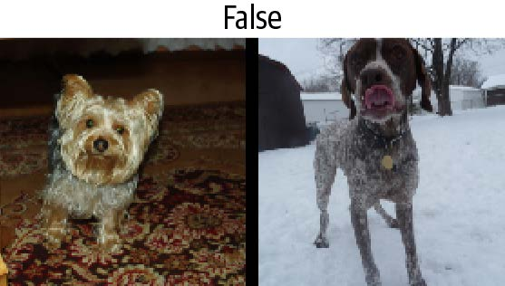

在此，`Resize` 变换方法被应用于两张图像，但不适用于布尔标志。即使我们使用自定义类型，仍可充分利用库内所有数据增强变换。

现在我们准备构建用于处理数据的 `Transform` ，以满足孪生模型的需求。首先，我们需要一个函数来确定所有图像的类别：

```python
def label_func(fname):
    return re.match(r'^(.*)_\d+.jpg$', fname.name).groups()[0]
```

对于每张图像，我们的转换器将以0.5的概率从同一类别中抽取图像并返回带有真实标签的 `SiameseImage` ，或从其他类别中抽取图像并返回带有错误标签的 `SiameseImage` 。所有操作均在私有函数 `_draw` 中完成。训练集与验证集存在一个关键差异，因此转换器需通过数据分割进行初始化：在训练集上，每次读取图像时都会进行随机选择；而在验证集上，仅在初始化时一次性完成随机分配。如此便能在训练过程中获取多样化的样本，同时保持验证集始终一致：

```python
class SiameseTransform(Transform):
    def __init__(self, files, label_func, splits):
        self.labels = files.map(label_func).unique()
        self.lbl2files = {l: L(f for f in files if label_func(f) == l)
                          for l in self.labels}
        self.label_func = label_func
        self.valid = {f: self._draw(f) for f in files[splits[1]]}
        
    def encodes(self, f):
        f2,t = self.valid.get(f, self._draw(f))
        img1,img2 = PILImage.create(f),PILImage.create(f2)
        return SiameseImage(img1, img2, t)
    
    def _draw(self, f):
        same = random.random() < 0.5
        cls = self.label_func(f)
        if not same:
            cls = random.choice(L(l for l in self.labels if l != cls))
        return random.choice(self.lbl2files[cls]),same
```

然后我们可以创建我们的主要转换：

```python
splits = RandomSplitter()(files)
tfm = SiameseTransform(files, label_func, splits)
tfm(files[0]).show();
```


在中层数据采集API中，我们有两个对象可用于对项集应用转换：`TfmdLists` 和`Datasets` 。回顾前文所述，前者应用单个 `Pipeline` ，后者则并行应用多个 `PipeLines` 以构建元组。由于此处的主转换已直接构建元组，因此我们使用 `TfmdLists` ：

```python
tls = TfmdLists(files, tfm, splits=splits)
show_at(tls.valid, 0);
```

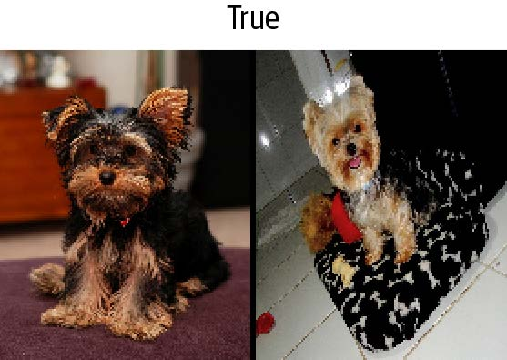

最后，我们可以通过调用 `dataloaders` 方法将数据加载到 `DataLoaders` 中。需要注意的是，该方法不支持像 `DataBlock` 那样传入`item_tfms` 和 `batch_tfms` 参数。fastai的`DataLoader` 提供了若干基于事件命名的钩子函数：在抓取数据项后执行的操作称为`after_item`，而批次构建完成后执行的操作则称为 `after_batch`：

```python
dls = tls.dataloaders(after_item=[Resize(224), ToTensor],
                      after_batch=[IntToFloatTensor,
                                   Normalize.from_stats(*imagenet_stats)])
```

请注意，我们需要传递比通常更多的转换——这是因为数据块API通常会自动添加它们：

- `ToTensor` 是将图像转换为张量的函数（同样，它应用于元组的每个部分）。
- `IntToFloatTensor` 将包含0到255整数的图像张量转换为浮点张量，并除以255使值介于0到1之间。

现在我们可以使用这些 `DataLoaders`  训练模型。由于它需要处理两张图像而非一张，因此相较于 `cnn_learner` 提供的常规模型，它需要更多定制化设置。具体如何创建此类模型并进行训练，我们将在第15章中详细说明。

### 总结

fastai提供分层API。当数据处于常规设置时，仅需一行代码即可获取数据，使初学者能够专注于模型训练，而无需耗费过多时间整理数据。高级数据块API通过支持模块组合提供更大灵活性。其底层的中级API则赋予更强的数据项转换能力。在实际应用中，这可能是你最常用的功能，我们希望它能最大限度简化数据处理流程。

### 问卷调查

1. 为什么说fastai具有“分层”API？这意味着什么？
2. `Transform` 为何包含 `decode` 方法？其作用是什么？
3. `Transform` 为何包含 `setup` 方法？其作用是什么？
4. 当对元组调用 `Transform` 时，其工作原理是什么？
5. 编写自定义 `Transform` 时需要实现哪些方法？
6. 编写一个 `Normalize` 转换器，实现数据项的完全标准化（减去均值并除以数据集标准差），且能反向解码该操作。尽量避免提前查看实现！
7. 编写一个对分词文本进行数值化的 `Transform`（应能根据输入数据集自动设置词汇表，并包含decode方法）。如有需要可参考fastai源代码。
8. 什么是 `Pipeline` ？
9. 什么是 `TfmdLists`？
10. 什么是 `Datasets`？它与 `TfmdLists` 有何区别？
11. 为什么 `TfmdLists` 和 `Datasets` 的名称都带“s”？
12. 如何从 `TfmdLists` 或 `Datasets` 构建 `DataLoaders`？
13. 从 `TfmdLists` 或 `Datasets` 构建 `DataLoaders` 时，如何传递 `item_tfms` 和 `batch_tfms` 参数？
14. 若需让自定义项目与 `show_batch` 或 `show_results` 等方法协同工作，需要进行哪些操作？
15. 为何能轻松将fastai数据增强转换应用于构建的 `SiamesePair` ？

#### 进一步研究

1. 使用中级 API 在自己的数据集上准备 `DataLoaders` 中的数据。尝试使用第 1 章中的 Pet 数据集和 Adult 数据集进行操作。
2. 查阅 fastai 文档中的 Siamese 教程，学习如何为新型项目自定义 `show_batch` 和 `show_results` 的行为。在自己的项目中实现该功能。

### 理解fastai的应用场景：阶段性总结

恭喜你——你已经完成了本书所有章节的学习，这些章节涵盖了训练模型和使用深度学习的关键实践部分！你已经掌握了如何使用fastai的所有内置应用程序，以及如何通过数据块API和损失函数进行定制。你甚至掌握了从零构建神经网络并进行训练的方法！（希望你现在也懂得提出关键问题，确保自己的成果能助力社会进步。）

你现有的知识已足以创建多种类型神经网络应用的完整工作原型。更重要的是，它将帮助你理解深度学习模型的能力和局限性，以及如何设计出与之高度契合的系统。

在本书的后续章节中，我们将逐层剖析这些应用程序，以理解它们所依托的基础架构。这对深度学习从业者至关重要，因为这使您能够检查和调试所构建的模型，并为特定项目定制开发全新的应用程序。

# 第三部分：深度学习基础

## 12. 从零开始构建语言模型

现在，我们准备深入探索……深入探索深度学习！你已经学会了如何训练基本的神经网络，但如何在此基础上创建最先进的模型呢？在本书这一部分，我们将揭开所有谜团，从语言模型开始。

在第10章中，你应该已了解如何通过微调预训练语言模型来构建文本分类器。本章将详细解析该模型的内部机制，并阐释循环神经网络的本质。首先，让我们收集一些数据，以便快速构建各类模型的原型。

### 数据

每当我们着手解决新问题时，总会先构思最简洁的数据集，以便快速轻松地测试方法并解读结果。几年前开始研究语言建模时，我们找不到能快速原型化的数据集，于是自己创建了一个。我们称之为“人类数字集”（Human Numbers），它仅包含用英文书写的头10,000个数字。

> JEREMY说
>
> 我观察到即使在经验丰富的从业者中，最常见的实际错误之一也是在分析过程中未能在适当的时机使用合适的数据集。尤其值得注意的是，多数人往往从规模过大且过于复杂的数据集开始着手。

我们可以按常规方式下载、解压并查看数据集：

```python
from fastai.text.all import *
path = untar_data(URLs.HUMAN_NUMBERS)
```

```python
path.ls()
```

```text
(#2) [Path('train.txt'),Path('valid.txt')]
```

让我们打开这两个文件看看里面有什么。首先，我们将所有文本合并在一起，忽略数据集提供的训练集/验证集划分（稍后再处理这个问题）：

```python
lines = L()
with open(path/'train.txt') as f: lines += L(*f.readlines())
with open(path/'valid.txt') as f: lines += L(*f.readlines())
lines
```

```text
(#9998) ['one \n','two \n','three \n','four \n','five \n','six
\n','seven
> \n','eight \n','nine \n','ten \n'...]
```

我们将所有这些行合并成一个大型数据流。为标记从一个数字切换到下一个数字的位置，我们使用 `.` 作为分隔符：

```python
text = ' . '.join([l.strip() for l in lines])
text[:100]
```

```text
'one . two . three . four . five . six . seven . eight . nine . ten
. eleven .
> twelve . thirteen . fo'
```

我们可以将该数据集按空格分隔进行分词处理：

```python
tokens = text.split(' ')
tokens[:10]
```

```text
['one', '.', 'two', '.', 'three', '.', 'four', '.', 'five', '.']
```

要进行数值化处理，我们需要创建一个包含所有唯一标记的列表（就是我们的词汇表）：

```python
vocab = L(*tokens).unique()
vocab
```

```text
(#30)
['one','.','two','three','four','five','six','seven','eight','nine'...]
```

然后我们可以将词元转换为数字，方法是查阅词汇表中每个词元的索引：

```python
word2idx = {w:i for i,w in enumerate(vocab)}
nums = L(word2idx[i] for i in tokens)
nums
```

```text
(#63095) [0,1,2,1,3,1,4,1,5,1...]
```

既然我们现在拥有一个小型数据集，语言建模应该是一项轻松的任务，我们可以构建我们的第一个模型。

### 从零开始构建我们的首个语言模型

将此转化为神经网络的简易方法是：规定我们基于前三个单词来预测每个单词。我们可以创建一个包含所有三个单词序列的列表作为自变量，并将每个序列后的下一个单词作为因变量。

我们可以用纯Python实现。先用词元来演示，确认一下效果：

```python
L((tokens[i:i+3], tokens[i+3]) for i in range(0,len(tokens)-4,3))
```

```text
(#21031) [(['one', '.', 'two'], '.'),(['.', 'three', '.'], 'four'),
(['four',
> '.', 'five'], '.'),(['.', 'six', '.'], 'seven'),(['seven', '.',
'eight'],
> '.'),(['.', 'nine', '.'], 'ten'),(['ten', '.', 'eleven'], '.'),
(['.',
> 'twelve', '.'], 'thirteen'),(['thirteen', '.', 'fourteen'],
'.'),(['.',
> 'fifteen', '.'], 'sixteen')...]
```

现在我们将使用数值化的张量来实现，这正是模型实际会使用的形式：

```python
seqs = L((tensor(nums[i:i+3]), nums[i+3]) for i in
range(0,len(nums)-4,3))
seqs
```

```text
(#21031) [(tensor([0, 1, 2]), 1),(tensor([1, 3, 1]), 4),(tensor([4,
1, 5]),
> 1),(tensor([1, 6, 1]), 7),(tensor([7, 1, 8]), 1),(tensor([1, 9,
1]),
> 10),(tensor([10, 1, 11]), 1),(tensor([ 1, 12, 1]), 13),
(tensor([13, 1,
> 14]), 1),(tensor([ 1, 15, 1]), 16)...]
```

我们可以使用 `DataLoader` 类轻松批量处理这些数据。目前，我们将随机拆分序列：

```python
bs = 64
cut = int(len(seqs) * 0.8)
dls = DataLoaders.from_dsets(seqs[:cut], seqs[cut:], bs=64,
shuffle=False)
```

现在我们可以构建一个神经网络架构，该架构以三个单词作为输入，并返回词汇表中每个可能后续单词的概率预测。我们将使用三个标准线性层，但进行两处调整。

第一个调整是：第一层线性层仅使用第一个单词的嵌入作为激活值；第二层使用第二个单词的嵌入加上第一层的输出激活值；第三层则使用第三个单词的嵌入加上第二层的输出激活值。其关键效果在于，每个单词都在其所有前置单词的信息语境中被解读。

第二个调整是这三个层级将使用相同的权重矩阵。单个词语对先前词语激活值的影响不应因词语位置而改变。换言之，激活值会随数据在层级间传递而变化，但层级权重本身在不同层级间保持恒定。因此，单个层级不会学习特定序列位置，而必须掌握处理所有位置的能力。

由于层权重不会改变，你可以将连续的层视为“相同层”的重复。实际上，PyTorch将这种概念具体化了：我们只需创建一个层，即可多次使用它。

#### 基于PyTorch的语言模型

现在我们可以创建之前描述的语言模型模块了。

```python
class LMModel1(Module):
    def __init__(self, vocab_sz, n_hidden):
        self.i_h = nn.Embedding(vocab_sz, n_hidden)
        self.h_h = nn.Linear(n_hidden, n_hidden)
        self.h_o = nn.Linear(n_hidden,vocab_sz)
        
    def forward(self, x):
        h = F.relu(self.h_h(self.i_h(x[:,0])))
        h = h + self.i_h(x[:,1])
        h = F.relu(self.h_h(h))
        h = h + self.i_h(x[:,2])
        h = F.relu(self.h_h(h))
        return self.h_o(h)
```

如你所见，我们创建了三个层级：

- 嵌入层（`i_h`，用于输入到隐藏层）
- 用于生成下一个单词激活值的线性层（`h_h`，用于隐藏层到隐藏层）
- 用于预测第四个单词的最终线性层（`h_o`，用于隐藏层到输出层）

用图示形式可能更容易理解，因此我们来定义一个基本神经网络的简易图示表示法。图12-1展示了我们将如何表示具有一个隐藏层的神经网络。


[^图12-1]: 简单神经网络的图示表示

每种形状代表激活状态：矩形表示输入层激活，圆形表示隐藏层（内部层）激活，三角形表示输出层激活。本章所有示意图均采用这些形状（如图12-2所示）。

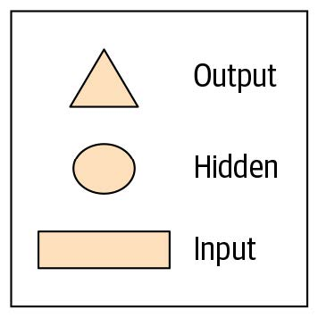

[^图12-2]: 我们在图示中使用的形状

箭头表示实际的层计算——即线性层后接激活函数。采用这种记法的图12-3展示了我们简单语言模型的结构。

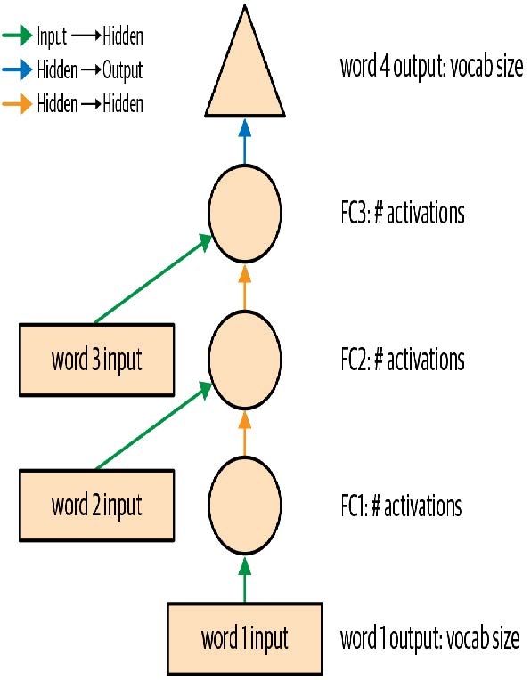

[^图12-3]: 我们基础语言模型的表示

为简化说明，我们已将层计算的细节从每条箭头中移除。同时采用颜色编码法标记箭头，使得所有同色箭头对应相同的权重矩阵。例如，所有输入层均使用相同的嵌入矩阵，因此它们都呈现相同颜色（绿色）。

让我们尝试训练这个模型，看看效果如何：

```python
learn = Learner(dls, LMModel1(len(vocab), 64),
                loss_func=F.cross_entropy,
                metrics=accuracy)
learn.fit_one_cycle(4, 1e-3)
```

| 迭代轮次 | 训练损失 | 验证损失 | 准确率   | 时间  |
| -------- | -------- | -------- | -------- | ----- |
| 0        | 1.824297 | 1.970941 | 0.467554 | 00:02 |
| 1        | 1.386973 | 1.823242 | 0.467554 | 00:02 |
| 2        | 1.417556 | 1.654497 | 0.494414 | 00:02 |
| 3        | 1.376440 | 1.650849 | 0.494414 | 00:02 |

要检验这种方法是否有效，我们先看看最简单的模型能给出什么结果。在这种情况下，我们总能预测出最常见的词元，因此让我们找出在验证集中哪个词元最常成为目标：

```python
n,counts = 0,torch.zeros(len(vocab))
for x,y in dls.valid:
    n += y.shape[0]
    for i in range_of(vocab): counts[i] += (y==i).long().sum()
    idx = torch.argmax(counts)
    idx, vocab[idx.item()], counts[idx].item()/n
```

```text
(tensor(29), 'thousand', 0.15165200855716662)
```

最常见的词元索引为29，对应词元 `thousand` 。若始终预测该词元，准确率仅约15%，因此我们的表现已大幅提升！

> ALEXIS说
>
> 我最初猜测分隔符会是最常见的标记，因为每个数字都对应一个。但观察 `tokens` 时我突然想起，大数字是用多个词汇书写的——在计数到10,000的过程中会频繁出现“千”字：五千、五千零一、五千零二等等。哎呀！审视数据时，既能发现微妙特征，也能察觉令人尴尬的显而易见之处。

这是一个不错的基本模型。让我们看看如何用循环重构它。

#### 我们的第一个循环神经网络

仔细观察我们模块的代码，我们可通过用 `for` 循环替换调用层级的重复代码来简化实现。此举不仅能精简代码，更将带来显著优势：我们的模块将能灵活适配不同长度的词元序列——不再局限于长度为三的词元列表：

```python
class LMModel2(Module):
    def __init__(self, vocab_sz, n_hidden):
        self.i_h = nn.Embedding(vocab_sz, n_hidden)
        self.h_h = nn.Linear(n_hidden, n_hidden)
        self.h_o = nn.Linear(n_hidden,vocab_sz)
        
    def forward(self, x):
        h = 0
        for i in range(3):
            h = h + self.i_h(x[:,i])
            h = F.relu(self.h_h(h))
            return self.h_o(h)
```

让我们检查一下使用此重构是否得到相同的结果：

```python
learn = Learner(dls, LMModel2(len(vocab), 64),
                loss_func=F.cross_entropy,
                metrics=accuracy)
learn.fit_one_cycle(4, 1e-3)
```

| 迭代轮次 | 训练损失 | 验证损失 | 准确率   | 时间  |
| -------- | -------- | -------- | -------- | ----- |
| 0        | 1.816274 | 1.964143 | 0.460185 | 00:02 |
| 1        | 1.423805 | 1.739964 | 0.473259 | 00:02 |
| 2        | 1.430327 | 1.685172 | 0.485382 | 00:02 |
| 3        | 1.388390 | 1.657033 | 0.470406 | 00:02 |

我们也可以完全以相同的方式重构我们的图示表示，如图12-4所示（在此我们同样省略了激活大小的细节，并沿用了图12-3中的箭头颜色）。


[^图12-4]: 基本循环神经网络

你会发现每次循环都会更新一组激活值，这些值存储在变量h中——这被称为隐藏状态（hidden state）。

> 术语：隐藏状态
>
> 在递归神经网络的每个步骤中更新的激活值。

使用此类循环定义的神经网络称为循环神经网络（RNN）。需要认识到，RNN并非复杂的新型架构，而是通过 `for` 循环对多层神经网络进行的重构。

> ALEXIS说
>
> 我的真实想法：如果它们被称为“looping neural networks”或LNN，看起来就会少一半的吓人感！

既然我们已经了解了循环神经网络是什么，现在就让我们尝试改进它。

### 改进循环神经网络

观察我们的循环神经网络代码时，一个看似存在的问题是：我们为每个新输入序列将隐藏状态初始化为零。这为何构成问题？我们刻意缩短样本序列长度以便轻松批量处理。但若正确排序这些样本，模型将按顺序读取样本序列，从而使模型暴露于原始序列的连续长片段中。

另一个值得探讨的方向是增强预测信号：既然能利用中间预测结果同时推断第二、第三个词，为何仅预测第四个词？让我们看看如何实现这些改进，首先从添加状态开始。

#### 保持循环神经网络的状态

由于我们为每个新样本将模型的隐藏状态初始化为零，我们正在丢弃迄今为止所见句子的所有信息，这意味着模型实际上并不了解我们在整体计数序列中的当前位置。这个问题很容易解决：只需将隐藏状态的初始化移至 `__init__` 方法即可。

但这种修复方案会引发一个微妙却关键的问题：它实际上使我们的人工神经网络深度等同于文档中所有词元的总数。例如，若数据集包含10,000个词元，我们便会构建出一个拥有10,000层的人工神经网络。

要理解这种情况的原因，请参考图12-3中循环神经网络的原始图示表示（在使用for循环重构之前）。可见每层都对应一个输入标记。在讨论用 `for` 循环重构前的递归神经网络表示时，我们称之为展开表示（unrolled representation）。理解递归神经网络时，考虑展开表示往往很有帮助。

十万层神经网络的问题在于，当你处理到数据集的第10000个词时，仍需计算所有层的导数直至第一层。这确实会非常耗时且占用大量内存。即使在GPU上存储一个迷你批次也几乎不可能实现。

解决此问题的方案是告知PyTorch，我们不希望将梯度反向传播至整个隐式神经网络。取而代之的是，我们仅仅保留最后三层的梯度。为清除PyTorch中的所有梯度历史记录，我们使用 `detach` 方法。

这是我们循环神经网络的新版本。它现在具有状态性，因为它会记住不同 `forward` 调用之间的激活值，这些激活值代表了它在批次中处理不同样本时的使用情况：

```python
class LMModel3(Module):
    def __init__(self, vocab_sz, n_hidden):
        self.i_h = nn.Embedding(vocab_sz, n_hidden)
        self.h_h = nn.Linear(n_hidden, n_hidden)
        self.h_o = nn.Linear(n_hidden,vocab_sz)
        self.h = 0
        
    def forward(self, x):
        for i in range(3):
            self.h = self.h + self.i_h(x[:,i])
            self.h = F.relu(self.h_h(self.h))
            out = self.h_o(self.h)
            self.h = self.h.detach()
            return out
        
    def reset(self): self.h = 0
```

无论选择何种序列长度，该模型的激活值都保持不变，因为隐藏层状态会记住前一批次最后的激活值。唯一不同之处在于每步计算的梯度：它们仅基于过去序列长度内的标记进行计算，而非整个数据流。这种方法称为时间反向传播（backpropagation through
time，BPTT）。

> 术语：时间反向传播
>
> 将神经网络视为每个时间步仅含一层（通常通过循环重构实现），将其作为单一大型模型进行处理，并按常规方式计算梯度。为避免内存耗尽和时间超时，我们通常采用截断式（truncated）反向传播时间推导，该方法每隔若干时间步便将隐藏状态的计算步骤历史进行“分离”。

要使用 `LMModel3`，我们需要确保样本将按特定顺序呈现。正如我们在第10章所见，若第一个批次的首行是 `dset[0]`，则第二个批次的首行应为 `dset[1]`，这样模型才能感知文本的连续流动。

在第10章中，`LMDataLoader` 为我们完成了这项工作。这次我们将自己动手实现。

为此，我们将重新排列数据集。首先将样本划分为 `m = len(dset) // bs` 个组（这相当于将整个拼接数据集分割为 64 个等分片段，因为这里使用了 `bs=64`）。`m` 表示每个片段的长度。例如，若使用完整数据集（尽管稍后将实际划分为训练集与验证集），结构如下：

```python
m = len(seqs)//bs
m,bs,len(seqs)
```

```text
(328, 64, 21031)
```

第一批将由样本组成

```text
(0, m, 2*m, ..., (bs-1)*m)
```

第二批样本

```text
(1, m+1, 2*m+1, ..., (bs-1)*m+1)
```

等等。这样，在每个迭代轮次中，模型将在批次中的每行上看到一块大小为 `3*m`（因为每个文本大小为 3）的连续文本。

以下函数执行重新索引操作：

```python
def group_chunks(ds, bs):
    m = len(ds) // bs
    new_ds = L()
    for i in range(m): new_ds += L(ds[i + m*j] for j in range(bs))
    return new_ds
```

然后我们在构建 `DataLoaders` 时传入 `drop_last=True`，以丢弃最后一个不符合 `bs` 形状的批次。同时传入 `shuffle=False` 确保文本按顺序读取：

```python
cut = int(len(seqs) * 0.8)
dls = DataLoaders.from_dsets(
    group_chunks(seqs[:cut], bs),
    group_chunks(seqs[cut:], bs),
    bs=bs, drop_last=True, shuffle=False)
```

最后要添加的是通过回调函数对训练循环进行微调。我们将在第16章深入探讨回调机制；此处的回调将在每个训练迭代轮次开始时及每次验证阶段前调用模型的重置方法。由于该方法用于将模型隐藏状态清零，此操作可确保在读取连续文本块前恢复初始状态。我们还可适当延长训练时长：

```python
learn = Learner(dls, LMModel3(len(vocab), 64),
                loss_func=F.cross_entropy,
                metrics=accuracy, cbs=ModelResetter)
learn.fit_one_cycle(10, 3e-3)
```

| 迭代轮次 | 训练损失 | 验证损失 | 准确率   | 时间  |
| -------- | -------- | -------- | -------- | ----- |
| 0        | 1.677074 | 1.827367 | 0.467548 | 00:02 |
| 1        | 1.282722 | 1.870913 | 0.388942 | 00:02 |
| 2        | 1.090705 | 1.651793 | 0.462500 | 00:02 |
| 3        | 1.005092 | 1.613794 | 0.516587 | 00:02 |
| 4        | 0.965975 | 1.560775 | 0.551202 | 00:02 |
| 5        | 0.916182 | 1.595857 | 0.560577 | 00:02 |
| 6        | 0.897657 | 1.539733 | 0.574279 | 00:02 |
| 7        | 0.836274 | 1.585141 | 0.583173 | 00:02 |
| 8        | 0.805877 | 1.629808 | 0.586779 | 00:02 |
| 9        | 0.795096 | 1.651267 | 0.588942 | 00:02 |

这已经好多了！下一步是使用更多目标，并将它们与中间预测结果进行比较。

#### 创造更多信号

当前方法的另一个问题在于，我们仅针对每三个输入词预测一个输出词。因此，用于更新权重的反馈信号量未能达到最大化。如图12-5所示，若能在每个单词之后预测下一个词，而非每三个词预测一次，效果将更为理想。

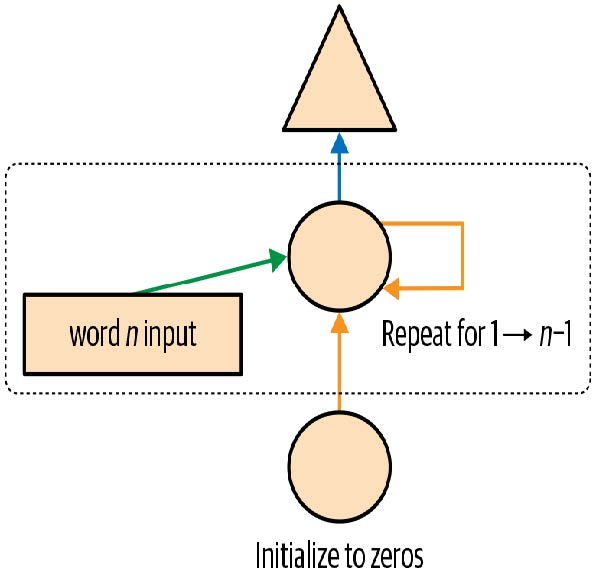

[^图12-5]: 在每个词元之后进行RNN预测

这很容易添加。我们首先需要修改数据，使因变量包含每个输入词之后的三个后续词。我们不用 `3` 这个数字，而是使用一个属性 `sl`（序列长度），并将其设置得稍大一些：

```python
sl = 16
seqs = L((tensor(nums[i:i+sl]), tensor(nums[i+1:i+sl+1]))
         for i in range(0,len(nums)-sl-1,sl))
cut = int(len(seqs) * 0.8)
dls = DataLoaders.from_dsets(group_chunks(seqs[:cut], bs),
                             group_chunks(seqs[cut:], bs),
                             bs=bs, drop_last=True, shuffle=False)
```

观察 `seqs` 的第一个元素，我们发现它包含两个大小相同的列表。第二个列表与第一个相同，但偏移了一个元素：

```python
[L(vocab[o] for o in s) for s in seqs[0]]
```

```text
[(#16) ['one','.','two','.','three','.','four','.','five','.'...],
(#16) ['.','two','.','three','.','four','.','five','.','six'...]]
```

现在我们需要修改模型，使其在每个单词之后输出预测结果，而不是仅在三个单词序列的末尾输出：

```python
class LMModel4(Module):
    def __init__(self, vocab_sz, n_hidden):
        self.i_h = nn.Embedding(vocab_sz, n_hidden)
        self.h_h = nn.Linear(n_hidden, n_hidden)
        self.h_o = nn.Linear(n_hidden,vocab_sz)
        self.h = 0
        
    def forward(self, x):
        outs = []
        for i in range(sl):
            self.h = self.h + self.i_h(x[:,i])
            self.h = F.relu(self.h_h(self.h))
            outs.append(self.h_o(self.h))
            self.h = self.h.detach()
            return torch.stack(outs, dim=1)
        
    def reset(self): self.h = 0
```

该模型将返回形状为 `bs x sl x vocab_sz` 的输出（因为我们在 `dim=1` 上进行了堆叠）。我们的目标形状为 `bs x sl`，因此在 `F.cross_entropy` 中使用前需要先将其展平：

```python
def loss_func(inp, targ):
    return F.cross_entropy(inp.view(-1, len(vocab)), targ.view(-1))
```

现在我们可以使用这个损失函数来训练模型：

```python
learn = Learner(dls, LMModel4(len(vocab), 64), loss_func=loss_func,
                metrics=accuracy, cbs=ModelResetter)
learn.fit_one_cycle(15, 3e-3)
```

| 迭代轮次 | 训练损失 | 验证损失 | 准确率   | 时间  |
| -------- | -------- | -------- | -------- | ----- |
| 0        | 3.103298 | 2.874341 | 0.212565 | 00:01 |
| 1        | 2.231964 | 1.971280 | 0.462158 | 00:01 |
| 2        | 1.711358 | 1.813547 | 0.461182 | 00:01 |
| 3        | 1.448516 | 1.828176 | 0.483236 | 00:01 |
| 4        | 1.288630 | 1.659564 | 0.520671 | 00:01 |
| 5        | 1.161470 | 1.714023 | 0.554932 | 00:01 |
| 6        | 1.055568 | 1.660916 | 0.575033 | 00:01 |
| 7        | 0.960765 | 1.719624 | 0.591064 | 00:01 |
| 8        | 0.870153 | 1.839560 | 0.614665 | 00:01 |
| 9        | 0.808545 | 1.770278 | 0.624349 | 00:01 |
| 10       | 0.758084 | 1.842931 | 0.610758 | 00:01 |
| 11       | 0.719320 | 1.799527 | 0.646566 | 00:01 |
| 12       | 0.683439 | 1.917928 | 0.649821 | 00:01 |
| 13       | 0.660283 | 1.874712 | 0.628581 | 00:01 |
| 14       | 0.646154 | 1.877519 | 0.640055 | 00:01 |

由于任务有所变化且变得更复杂，我们需要延长训练时间。但最终能获得不错的结果……至少有时如此。若多次运行程序，你会发现不同运行结果差异显著。这是因为我们实际构建的是深度神经网络，可能产生极大或极小的梯度值。本章后续部分将探讨如何应对这一问题。

现在，获得更好模型的明显途径是增加深度：在基础循环神经网络中，隐藏层状态与输出激活之间仅有一个线性层，因此增加更多层或许能获得更佳效果。

### 多层循环神经网络

在多层循环神经网络中，我们将循环神经网络的激活值传递到第二个循环神经网络，如图12-6所示。

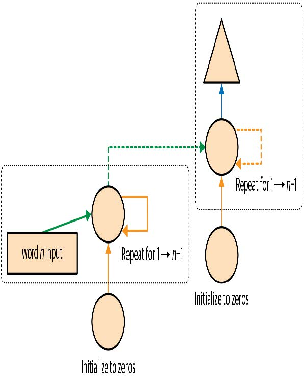

[^图12-6]: 2层的循环神经网络

展开后的表示如图12-7所示（与图12-3类似）。

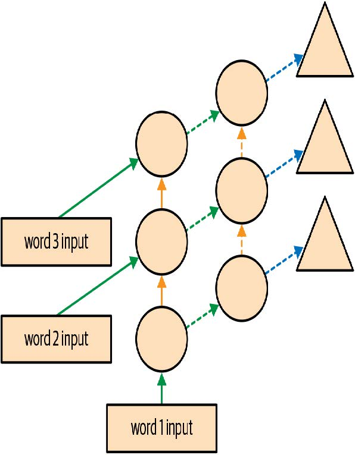

[^图12-7]: 2层的展开的循环神经网络

#### 模型

通过使用PyTorch的 `RNN` 类，我们可以节省一些时间。该类不仅实现了我们之前创建的内容，还提供了堆叠多个循环神经网络的选项，正如我们之前讨论的那样：

```python
class LMModel5(Module):
    def __init__(self, vocab_sz, n_hidden, n_layers):
        self.i_h = nn.Embedding(vocab_sz, n_hidden)
        self.rnn = nn.RNN(n_hidden, n_hidden, n_layers,
                          batch_first=True)
        self.h_o = nn.Linear(n_hidden, vocab_sz)
        self.h = torch.zeros(n_layers, bs, n_hidden)
        
    def forward(self, x):
        res,h = self.rnn(self.i_h(x), self.h)
        self.h = h.detach()
        return self.h_o(res)
    
    def reset(self): self.h.zero_()
    
learn = Learner(dls, LMModel5(len(vocab), 64, 2),
                loss_func=CrossEntropyLossFlat(),
                metrics=accuracy, cbs=ModelResetter)
learn.fit_one_cycle(15, 3e-3)
```

| 迭代轮次 | 训练损失 | 验证损失 | 准确率   | 时间  |
| -------- | -------- | -------- | -------- | ----- |
| 0        | 3.055853 | 2.591640 | 0.437907 | 00:01 |
| 1        | 2.162359 | 1.787310 | 0.471598 | 00:01 |
| 2        | 1.710663 | 1.941807 | 0.321777 | 00:01 |
| 3        | 1.520783 | 1.999726 | 0.312012 | 00:01 |
| 4        | 1.330846 | 2.012902 | 0.413249 | 00:01 |
| 5        | 1.163297 | 1.896192 | 0.450684 | 00:01 |
| 6        | 1.033813 | 2.005209 | 0.434814 | 00:01 |
| 7        | 0.919090 | 2.047083 | 0.456706 | 00:01 |
| 8        | 0.822939 | 2.068031 | 0.468831 | 00:01 |
| 9        | 0.750180 | 2.136064 | 0.475098 | 00:01 |
| 10       | 0.695120 | 2.139140 | 0.485433 | 00:01 |
| 11       | 0.655752 | 2.155081 | 0.493652 | 00:01 |
| 12       | 0.629650 | 2.162583 | 0.498535 | 00:01 |
| 13       | 0.613583 | 2.171649 | 0.491048 | 00:01 |
| 14       | 0.604309 | 2.180355 | 0.487874 | 00:01 |

这结果令人失望……我们之前的单层循环神经网络表现更好。为什么？原因在于模型更深，导致激活函数出现爆炸或消失现象。

#### 爆炸性激活或消失性激活

实际上，从这类循环神经网络中创建精确模型颇具挑战。若减少 `detach` 调用频率并增加层数，我们将获得更佳效果——这能为循环神经网络提供更长的学习时间跨度和更丰富的特征生成能力。但这也意味着需要训练更深层的模型。深度学习发展的核心挑战，正是如何有效训练这类模型。

这之所以具有挑战性，是因为当你多次乘以一个矩阵时会发生什么。想想当你多次乘以一个数时会发生什么。例如，从1开始乘以2，你会得到数列1,2,4,8,…，经过32步后，你已经达到了4,294,967,296。类似问题也出现在乘以0.5时：你得到0.5、0.25、0.125…经过32步后，结果仅为0.00000000023。由此可见，即使乘以略高于或略低于1的数值，经过几次重复乘法运算后，初始数值也会呈现爆炸式增长或消失。

由于矩阵乘法本质上就是数字相乘相加，因此重复矩阵乘法也会产生完全相同的结果。而深度神经网络正是如此——每增加一层就相当于进行一次矩阵乘法。这意味着深度神经网络极易产生极大或极小的数值。

这是一个问题，因为计算机存储数字的方式（称为浮点数）意味着数字离零点越远，其精度就越低。图12-8中的示意图摘自一篇精彩的文章 [《关于浮点数你永远不想知道却不得不了解的事》](https://oreil.ly/c_kG9) ，它展示了浮点数的精度在数轴上的变化情况。


[^图12-8]: 浮点数的精度

这种不精确性意味着，在深度网络中，用于更新权重的梯度计算结果常常会变成零或无穷大。这通常被称为梯度消失或梯度爆炸问题。这意味着在随机梯度下降（SGD）中，权重要么完全不更新，要么突然跳到无穷大。无论哪种情况，权重都无法通过训练得到改善。

研究人员已开发出应对该问题的方案，我们将在本书后续章节中展开讨论。其中一种方法是修改层的定义，以降低其发生激活爆炸的可能性。具体实现细节将在第13章讨论批量归一化时，以及第14章探讨ResNet时展开阐述——尽管实践中通常无需深究这些细节（除非你是致力于开发新解决方案的研究人员）。另一种应对策略是谨慎处理初始化，我们将在第17章深入探讨。

对于循环神经网络，我们常采用两种层类型来避免激活函数爆炸：门控循环单元（gated recurrent units，GRU）和长短期记忆（long short-term memory，LSTM）层。这两种层在PyTorch中均可使用，可直接替代RNN层。本书仅涵盖LSTM内容；网上已有大量优质教程详解GRU——它只是LSTM设计的一个细微变体。

### LSTM

LSTM是一种由Jürgen Schmidhuber和Sepp Hochreiter于1997年提出的架构。该架构中存在两个隐藏状态，而非一个。在基础循环神经网络中，隐藏状态即为循环神经网络在前一时间步的输出。该隐藏状态承担着两项职责：

- 为输出层提供正确信息以预测正确的下一个词
- 保留句子中所有发生内容的记忆

例如，考虑以下句子：“Henry has a dog and he likes his dog very much”（亨利有一只狗，他非常喜欢他的狗）和“Sophie has a dog and she likes her dog very much”（苏菲有一只狗，她非常喜欢她的狗）。很明显，循环神经网络需要记住句子开头的名字，才能预测“he/she”或“his/her”。

实际上，循环神经网络在保留句子早期信息方面表现极差，这正是LSTM引入额外隐藏状态（称为单元状态，cell state）的动因。单元状态负责维持长时记忆，而隐藏状态则专注于预测下一个词元。让我们深入探究其实现机制，并从零开始构建LSTM模型。

#### 从零开始构建LSTM

要构建LSTM，我们首先需要理解其架构。图12-9展示了其内部结构

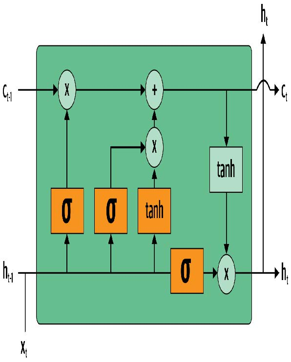

[^图12-9]: LSTM的架构

在这张图中，输入变量 $x_t$ 从左侧输入，同时携带前一层的隐藏状态($h_{t−1}$)和单元状态($c_{t−1}$)。四个橙色框代表四层（我们的神经网络），激活函数采用sigmoid（$\sigma$）或tanh。tanh本质上是将sigmoid函数缩放至-1到1的范围。其数学表达式可写为：
$$
\tanh(x)=\frac{e^x+e^{-x}}{e^x-e^{-x}}=2\sigma(2x)-1
$$
其中 $\sigma$ 为sigmoid函数。图中绿色圆圈表示元素级运算。右侧输出的结果是新的隐藏层状态($h_t$)和新的单元状态($c_t$)，准备接收下一个输入。新的隐藏层状态同时作为输出使用，因此箭头会分叉向上延伸。

让我们逐一解析这四个神经网络（称为门），并说明示意图——但在此之前，请注意顶部的单元状态几乎没有变化。它甚至没有直接经过神经网络！这正是它能保持长期状态的原因。

首先，输入和旧隐藏状态的箭头被合并在一起。在本章早些时候编写的循环神经网络中，我们是将它们相加。而在LSTM中，我们将它们堆叠成一个大型张量。这意味着我们的嵌入维度（即$x_t$的维度）可以与隐藏状态的维度不同。若将它们分别命名为 `n_in` 和 `n_hid` ，底部箭头的大小为 `n_in + n_hid` ；因此所有神经网络单元（橙色框）均为线性层，其输入为 `n_in + n_hid` 维，输出为 `n_hid` 维。

从左至右看，第一个门称为遗忘门（forget gate）。由于它是由线性层后接sigmoid函数构成，其输出将包含介于0和1之间的标量值。我们将该结果与单元状态相乘，以此决定保留与舍弃的信息：接近0的值被丢弃，接近1的值被保留。这赋予LSTM遗忘长期状态信息的能力。例如在遇到句点或 `xxbos` 标记时，我们期望它（已学会）重置单元状态。

第二个门称为输入门（input gate）。它与第三个门（该门没有正式名称，有时被称为单元门）协同工作以更新单元状态。例如，当出现新的性别代词时，我们需要替换遗忘门移除的性别信息。与遗忘门类似，输入门决定细胞状态中哪些元素需要更新（值接近1）或保持不变（值接近0）。第三门则决定更新后的数值范围（通过tanh函数实现，取值范围为-1到1），最终结果将累加至单元状态。

最后一个门是输出门（output gate）。它决定从单元状态中使用哪些信息来生成输出。单元状态经过tanh变换后，与输出门的sigmoid输出进行组合，结果即为新的隐藏层状态。在代码层面，我们可以这样编写相同的步骤：

```python
class LSTMCell(Module):
    def __init__(self, ni, nh):
        self.forget_gate = nn.Linear(ni + nh, nh)
        self.input_gate = nn.Linear(ni + nh, nh)
        self.cell_gate = nn.Linear(ni + nh, nh)
        self.output_gate = nn.Linear(ni + nh, nh)
        
    def forward(self, input, state):
        h,c = state
        h = torch.stack([h, input], dim=1)
        forget = torch.sigmoid(self.forget_gate(h))
        c = c * forget
        inp = torch.sigmoid(self.input_gate(h))
        cell = torch.tanh(self.cell_gate(h))
        c = c + inp * cell
        out = torch.sigmoid(self.output_gate(h))
        h = outgate * torch.tanh(c)
        return h, (h,c)
```

在实践中，我们可以重构代码。此外，从性能角度来看，执行一次大型矩阵乘法比执行四次小型乘法更优（因为我们仅在GPU上启动一次特殊的快速内核，这能让GPU获得更多并行处理的工作量）。堆叠操作耗时较长（因为需要在GPU上移动其中一个张量以形成连续数组），因此我们为输入层和隐藏层分别设置独立层。优化后的重构代码如下：

```python
class LSTMCell(Module):
    def __init__(self, ni, nh):
        self.ih = nn.Linear(ni,4*nh)
        self.hh = nn.Linear(nh,4*nh)
    def forward(self, input, state):
        h,c = state
        # One big multiplication for all the gates is better than 4
        smaller ones
        gates = (self.ih(input) + self.hh(h)).chunk(4, 1)
        ingate,forgetgate,outgate = map(torch.sigmoid, gates[:3])
        cellgate = gates[3].tanh()
        c = (forgetgate*c) + (ingate*cellgate)
        h = outgate * c.tanh()
        return h, (h,c)
```

在此我们使用PyTorch的 `chunk` 方法将张量分割为四部分。其工作原理如下：

```python
t = torch.arange(0,10); t
```

```text
tensor([0, 1, 2, 3, 4, 5, 6, 7, 8, 9])
```

```python
t.chunk(2)
```

```text
(tensor([0, 1, 2, 3, 4]), tensor([5, 6, 7, 8, 9]))
```

现在让我们用这个架构来训练语言模型吧！

#### 使用LSTM训练语言模型

以下是与 `LMModel5` 相同的网络结构，采用两层LSTM。我们可以使用更高的学习率进行训练，缩短训练时间，从而获得更高的准确率：

```python
class LMModel6(Module):
    def __init__(self, vocab_sz, n_hidden, n_layers):
        self.i_h = nn.Embedding(vocab_sz, n_hidden)
        self.rnn = nn.LSTM(n_hidden, n_hidden, n_layers,
                           batch_first=True)
        self.h_o = nn.Linear(n_hidden, vocab_sz)
        self.h = [torch.zeros(n_layers, bs, n_hidden) for _ in
                  range(2)]
        
    def forward(self, x):
        res,h = self.rnn(self.i_h(x), self.h)
        self.h = [h_.detach() for h_ in h]
        return self.h_o(res)
    
    def reset(self):
        for h in self.h: h.zero_()
```

```python
learn = Learner(dls, LMModel6(len(vocab), 64, 2),
                loss_func=CrossEntropyLossFlat(),
                metrics=accuracy, cbs=ModelResetter)
learn.fit_one_cycle(15, 1e-2)
```

| 迭代轮次 | 训练损失 | 验证损失 | 准确率   | 时间  |
| -------- | -------- | -------- | -------- | ----- |
| 0        | 3.000821 | 2.663942 | 0.438314 | 00:02 |
| 1        | 2.139642 | 2.184780 | 0.240479 | 00:02 |
| 2        | 1.607275 | 1.812682 | 0.439779 | 00:02 |
| 3        | 1.347711 | 1.830982 | 0.497477 | 00:02 |
| 4        | 1.123113 | 1.937766 | 0.594401 | 00:02 |
| 5        | 0.852042 | 2.012127 | 0.631592 | 00:02 |
| 6        | 0.565494 | 1.312742 | 0.725749 | 00:02 |
| 7        | 0.347445 | 1.297934 | 0.711263 | 00:02 |
| 8        | 0.208191 | 1.441269 | 0.731201 | 00:02 |
| 9        | 0.126335 | 1.569952 | 0.737305 | 00:02 |
| 10       | 0.079761 | 1.427187 | 0.754150 | 00:02 |
| 11       | 0.052990 | 1.494990 | 0.745117 | 00:02 |
| 12       | 0.039008 | 1.393731 | 0.757894 | 00:02 |
| 13       | 0.031502 | 1.373210 | 0.758464 | 00:02 |
| 14       | 0.028068 | 1.368083 | 0.758464 | 00:02 |

这比多层循环神经网络效果更好！不过我们仍能看出存在轻微的过拟合现象，这表明适度正则化或许有所帮助。

### 对LSTM进行正则化

递归神经网络通常难以训练，原因在于我们之前提到的激活值和梯度消失问题。使用LSTM（或GRU）单元比普通RNN更易于训练，但它们仍然极易出现过拟合。数据增强虽可作为解决方案，但在文本数据中的应用远少于图像数据——因为多数情况下需要额外模型生成随机增强数据（例如将文本翻译成其他语言再译回原语言）。总体而言，文本数据增强目前仍属探索不足的领域。

然而，我们可采用其他正则化技术来减少过拟合，这些技术在论文 [《LSTM语言模型的正则化与优化》](https://oreil.ly/Rf-OG) 中进行了深入探讨。该论文展示了如何通过有效运用dropout、激活正则化及时间激活正则化，使LSTM模型超越此前需要更复杂架构才能实现的顶尖水平。作者将采用这些技术的LSTM称为AWD-LSTM。接下来我们将逐一探讨这些技术。

#### Dropout

Dropout是一种正则化技术，由Geoffrey Hinton等人于 [《通过防止特征检测器的协同适应来改进神经网络》](https://oreil.ly/-_xie) 一文中提出。其基本原理是在训练过程中随机将部分激活值置零。这确保所有神经元都能积极参与输出计算，如图12-10所示（摘自Nitish Srivastava等人的 [《Dropout：防止神经网络过拟合的简易方法》](https://oreil.ly/pYNxF) ）。

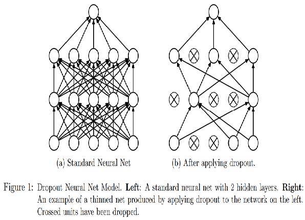

[^图12-10]: 在神经网络中应用dropout技术（由Nitish Srivastava等人提供）

Hinton在一次采访中解释dropout功能的灵感来源时，用了个贴切的比喻：

> 我去银行办事。柜员们频繁更换，我问其中一位原因。他说不清楚，但员工确实经常调动。我猜想这必然是因为要成功骗取银行资金，需要员工之间相互配合。这让我意识到：每次处理不同数据样本时随机移除不同子集的神经元，就能防止串通行为，从而减少过拟合现象。

在同一场访谈中，他还解释说神经科学提供了额外的灵感：

> 我们并不真正了解神经元为何会产生尖峰。一种理论认为，它们需要保持噪声以实现正则化，因为我们拥有的参数远多于数据点。dropout的核心思想在于：当激活函数存在噪声时，我们便能够构建更庞大的模型。

这解释了为什么正则化有助于泛化：首先它能促进神经元更好地协同工作；其次它使激活值更具噪声特性，从而增强模型的鲁棒性。

然而我们可以看到，如果仅将这些激活值归零而不做其他处理，模型将难以训练：当激活值从五个（由于应用了ReLU激活函数，这些值均为正数）骤减至两个时，其量级将发生显著变化。因此，当我们以概率 `p` 应用 dropout 时，会通过将所有激活值除以 `1-p` 进行重新缩放（平均而言 `p` 值会被归零，故保留 `1-p`），如图 12-11 所示。


[^图12-11]: 为何在应用dropout时对激活值进行缩放（摘自Nitish Srivastava等人的研究）

这是PyTorch中dropout层的完整实现（尽管PyTorch的原生层实际上是用C语言而非Python编写的）：

```python
class Dropout(Module):
    def __init__(self, p): self.p = p
    def forward(self, x):
        if not self.training: return x
    mask = x.new(*x.shape).bernoulli_(1-p)
    return x * mask.div_(1-p)
```

`bernoulli_` 方法生成一个包含随机零（概率为 `p` ）和随机一（概率为`1-p`）的张量，该张量与输入相乘后再除以`1-p`。请注意 `training` 属性的使用——该属性在任何PyTorch `nn.Module` 中均可用，用于指示当前处于训练模式还是推理模式。

> 自己动手做实验
>
> 在本书前几章中，我们本应在此添加一个 `bernoulli_` 的代码示例，以便你直观了解其运作原理。但既然你已具备独立完成的能力，我们将逐步减少示例数量，转而期待你自己通过自主实验探索机制。在本章结尾的问卷中，你会看到我们要求你对 `bernoulli_` 进行实验——但请不要等到我们要求你实验才去理解所学代码，请主动实践！

在将LSTM输出传递至最终层之前使用Dropout技术可有效降低过拟合风险。该技术亦广泛应用于其他模型，包括 `fastai.vision` 默认的卷积神经网络头部。在 `fastai.tabular` 中，通过传递 `ps` 参数（每个“p”对应添加的 `Dropout` 层）即可启用此功能，具体实现将在第15章详述。

Dropout在训练模式和验证模式下表现不同，我们通过 `Dropout` 中的 `training` 属性进行了指定。调用 `Module` 的 `train` 方法会将 `training` 设为 `True`（同时作用于调用该方法的模块及其递归包含的所有模块），而 `eval` 则将其设为 `False`。调用 `Learner` 的方法时会自动执行此操作，但若未使用该类，请根据需要手动切换设置。

#### 激活正则化与时间激活正则化

激活正则化（Activation regularization，AR）和时间激活正则化（temporal activation regularization，TAR）是两种与权重衰减非常相似的正则化方法，详见第8章。应用权重衰减时，我们会在损失函数中添加一个微小惩罚项，旨在使权重尽可能小。而激活正则化则不同，我们试图最小化的不是权重，而是LSTM最终输出的激活值。

为使最终激活值规范化，我们需将这些值存储在某处，然后将它们平方的均值添加到损失函数中（同时加入一个乘数 `alpha` ，其作用类似于权重衰减中的 `wd` ）：

```python
loss += alpha * activations.pow(2).mean()
```

时间激活正则化与我们预测句子中词元的事实相关。这意味着当按顺序阅读时，LSTM模型的输出结果应当具有某种逻辑连贯性。TAR通过在损失函数中添加惩罚项来鼓励这种行为，使连续两个激活值之间的差异尽可能小：我们的激活张量具有 `bs x sl x n_hid` 的形状，且沿序列长度轴（中间维度）读取连续激活值。由此，TAR可表示为：

```python
loss += beta * (activations[:,1:] -
activations[:,:-1]).pow(2).mean()
```

`alpha` 和 `beta` 随后成为两个需要调优的超参数。要使该方案生效，我们需要带 dropout 的模型返回三项内容：正确输出、LSTM 层掉出前的激活值，以及 LSTM 层掉出后的激活值。AR通常应用于dropout后的激活值（避免对后续归零的激活值施加惩罚），而TAR则应用于未dropout的激活值（因归零会导致相邻时间步之间产生巨大差异）。名为`RNNRegularizer` 的回调函数将为我们执行此正则化操作。

#### 训练权重绑定的正则化LSTM

我们可以将dropout（应用于进入输出层之前）与AR和TAR结合，来训练之前的LSTM。只需返回三项结果而非一项：LSTM的常规输出、掉出激活值以及LSTM的激活值。后两项将由回调函数 `RNNRegularization` 处理，用于计算损失函数的贡献值。

从AWD-LSTM论文中，我们还可以借鉴另一个有用的技巧：权重绑定（weight tying）。在语言模型中，输入嵌入表示从英语单词到激活值的映射，而输出隐藏层则表示从激活值到英语单词的映射。直观上我们可能认为这两种映射可以相同。在PyTorch中，我们可通过为这些层分配相同的权重矩阵来实现：

```python
self.h_o.weight = self.i_h.weight
```

在 `LMMModel7` 中，我们加入了以下最终调整：

```python
class LMModel7(Module):
    def __init__(self, vocab_sz, n_hidden, n_layers, p):
        self.i_h = nn.Embedding(vocab_sz, n_hidden)
        self.rnn = nn.LSTM(n_hidden, n_hidden, n_layers,
                           batch_first=True)
        self.drop = nn.Dropout(p)
        self.h_o = nn.Linear(n_hidden, vocab_sz)
        self.h_o.weight = self.i_h.weight
        self.h = [torch.zeros(n_layers, bs, n_hidden) for _ in
                  range(2)]
        
    def forward(self, x):
        raw,h = self.rnn(self.i_h(x), self.h)
        out = self.drop(raw)
        self.h = [h_.detach() for h_ in h]
        return self.h_o(out),raw,out
    
    def reset(self):
        for h in self.h: h.zero_()
```

我们可以使用 `RNNRegularizer` 回调函数创建一个正则化 `Learner`：

```python
learn = Learner(dls, LMModel7(len(vocab), 64, 2, 0.5),
                loss_func=CrossEntropyLossFlat(), metrics=accuracy,
                cbs=[ModelResetter, RNNRegularizer(alpha=2,
                                                   beta=1)])
```

`TextLearner` 会自动为我们添加这两个回调函数（默认使用 `alpha` 和 `beta` 的这些值），因此我们可以简化前面的代码行：

```python
learn = TextLearner(dls, LMModel7(len(vocab), 64, 2, 0.4),
                    loss_func=CrossEntropyLossFlat(),
                    metrics=accuracy)
```

然后我们可以训练模型，并通过将权重衰减增加到 `0.1`来添加额外的正则化：

```python
learn.fit_one_cycle(15, 1e-2, wd=0.1)
```

| 迭代轮次 | 训练损失 | 验证损失 | 准确率   | 时间  |
| -------- | -------- | -------- | -------- | ----- |
| 0        | 2.693885 | 2.013484 | 0.466634 | 00:02 |
| 1        | 1.685549 | 1.187310 | 0.629313 | 00:02 |
| 2        | 0.973307 | 0.791398 | 0.745605 | 00:02 |
| 3        | 0.555823 | 0.640412 | 0.794108 | 00:02 |
| 4        | 0.351802 | 0.557247 | 0.836100 | 00:02 |
| 5        | 0.244986 | 0.594977 | 0.807292 | 00:02 |
| 6        | 0.192231 | 0.511690 | 0.846761 | 00:02 |
| 7        | 0.162456 | 0.520370 | 0.858073 | 00:02 |
| 8        | 0.142664 | 0.525918 | 0.842285 | 00:02 |
| 9        | 0.128493 | 0.495029 | 0.858073 | 00:02 |
| 10       | 0.117589 | 0.464236 | 0.867188 | 00:02 |
| 11       | 0.109808 | 0.466550 | 0.869303 | 00:02 |
| 12       | 0.104216 | 0.455151 | 0.871826 | 00:02 |
| 13       | 0.100271 | 0.452659 | 0.873617 | 00:02 |
| 14       | 0.098121 | 0.458372 | 0.869385 | 00:02 |

这不比我们先前的模型好多了！

### 总结

现在你已经了解了第10章文本分类中使用的AWD-LSTM架构的全部内容。该架构在更多位置采用了dropout技术：

- 嵌入层后置dropout（嵌入层之后）
- 输入层后置dropout（嵌入层之后）
- 权重后置dropout（应用于每次训练步骤中LSTM的权重）
- 隐藏层后置dropout（应用于两层之间的隐藏状态）

这使得模型更加规范化。由于调整这五个dropout值（包括输出层前的dropout）较为复杂，我们已确定了合理的默认值，并允许通过该章节中提到的 `drop_mult` 参数整体调节dropout的强度（该参数将乘以每个dropout值）。

另一种非常强大的架构是Transformers架构，尤其适用于“序列到序列”问题（即因变量本身是可变长序列的问题，如语言翻译）。你可以在 [本书网站](https://book.fast.ai/) 的附录章节中找到相关内容。

### 问卷调查

1. 若项目数据集庞大复杂，处理耗时过长，应如何应对？
2. 为何要在创建语言模型前将数据集中的文档进行拼接？
3. 若使用标准全连接网络预测前三个单词后的第四个单词，需对模型进行哪两项调整？
4. 如何在 PyTorch 中实现权重矩阵在多层间的共享？
5. 编写一个模块，在不预览后续内容的情况下，根据句子前两个词预测第三个词。
6. 什么是循环神经网络？
7. 什么是隐藏状态？
8. 在 `LMModel1` 中，隐藏状态的对应概念是什么？
9. 为保持 RNN 的状态，为何必须按顺序将文本传递给模型？
10. RNN 的“展开”表示是什么？
11. 为何在 RNN 中维护隐藏状态会导致内存和性能问题？如何解决？
12. 什么是 BPTT？
13. 编写代码打印验证集的前几批数据，包括将令牌ID转换回英文字符串（参照第10章IMDb数据批处理的处理方式）。
14. `ModelResetter` 回调函数的作用是什么？为何需要它？
15. 每三个输入词仅预测一个输出词有何弊端？
16. 为何 `LMModel4` 需要自定义损失函数？
17. `LMModel4` 训练过程为何不稳定？
18. 在展开表示中可见循环神经网络具有多层结构，那么为何需要堆叠RNN才能获得更佳效果？
19. 绘制堆叠式（多层）RNN的示意图。
20. 为何减少 `detach` 调用频率能提升RNN效果？实际应用中简单RNN为何可能无法实现？
21. 深度网络为何可能产生极大或极小的激活值？这有何影响？
22. 在计算机浮点数表示中，哪些数值具有最高精度？
23. 梯度消失现象为何会阻碍训练？
24. LSTM架构中设置两个隐藏状态有何作用？各自功能是什么？
25. LSTM中这两种状态分别如何称呼？
26. tanh函数是什么？它与sigmoid函数有何关联？
27. 在`LSTMCell` 中以下代码段的作用是：

```python
h = torch.stack([h, input], dim=1)
```

28. PyTorch中 `chunk` 函数的功能是什么？

29. 请仔细研究 `LSTMCell` 的重构版本，确保理解其与非重构版本实现相同功能的方式及原因。

30. 为何 `LMModel6` 可使用更高学习率？

31. AWD-LSTM模型中使用了哪三种正则化技术？

32. 什么是dropout？

33. 为何要对dropout中的权重进行缩放？该操作在训练、推理还是两者中应用？

34. `Dropout`中这行代码的作用是什么：

    ```python
    if not self.training: return x
    ```

35. 通过 `bernoulli_` 进行实验以理解其工作原理。

36. 在PyTorch中如何设置模型为训练模式或者评估模式？

37. 写出激活正则化的方程（数学表达或代码均可）。它与权重衰减有何区别？

38. 写出时间激活正则化的方程（数学表达或代码均可）。为何不适用于计算机视觉问题？

39. 语言模型中的权重绑定是什么？

#### 进一步研究

1. 在 `LMModel2` 中，为什么前向传播可以直接从 `h=0` 开始？为什么不需要显式声明 `h=torch.zeros(...)` ？
2. 从零开始编写LSTM的代码（可参考图12-9）。
3. 在网上搜索GRU架构，从零实现该模型并尝试训练。观察结果是否与本章展示的相似，并将结果与PyTorch内置GRU模块进行对比。
4. 查阅fastai中AWD-LSTM的源代码，尝试将每行代码映射至本章阐述的概念。

## 13. 卷积神经网络

在第四章中，我们学习了如何创建一个能够识别图像的神经网络。在区分数字3和7时，我们实现了略高于98%的准确率——但同时也看到，fastai内置的分类器能够达到接近100%的准确率。现在，让我们开始尝试缩小这个差距。

在本章中，我们将首先深入探讨卷积的本质，并从零开始构建卷积神经网络。随后我们将研究一系列提升训练稳定性的技术，并掌握库通常为我们自动应用的各项优化技巧，从而获得卓越的训练效果。

### 卷积的魔力

机器学习从业者手中最强大的工具之一便是特征工程（feature engineering）。特征（feature）是对数据进行的转换，旨在使其更易于建模。例如，我们在第9章对表格数据集预处理时使用的 `add_datepart` 函数，就为Bulldozers数据集添加了日期特征。那么，我们又能从图像中创建哪些特征呢？

> 术语：特征工程
>
> 创建输入数据的新的转换，以便更轻松地进行建模。

在图像中，特征是指视觉上具有辨识度的属性。例如数字7的特征在于：数字顶部附近有一条水平边，其下方则有一条从右上至左下的斜边。另一方面，数字3的特征在于：左上角与右下角各有一条同向斜边，左下角与右上角各有一条反向斜边，中部、顶部和底部均有水平边等。那么，如果我们能提取每张图像中边界出现的位置信息，并将其作为特征（而非原始像素）使用，会怎样呢？

事实证明，在计算机视觉领域，从图像中检测边缘是一项非常常见的任务，其实现方式却出人意料地简单。为此，我们使用一种称为卷积（convolution）的运算。卷积仅需乘法和加法两种运算——而这两种运算正是本书中所有深度学习模型中绝大多数计算的核心！

卷积操作是将卷积核（kernel）应用于图像。卷积核是一个小矩阵，例如图13-1右上角的3×3矩阵。

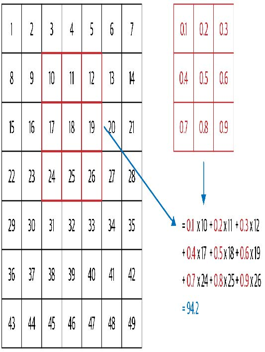

[^图13-1]: 将卷积核应用于一个位置

左侧的7×7网格是我们将要应用卷积核的图像。卷积运算将卷积核的每个元素与图像中3×3块的每个元素相乘，然后将这些乘积相加。图13-1展示了将核应用于图像单一位置的示例，即围绕单元格18的3×3区域。

让我们用代码来实现。首先，创建一个3×3的小矩阵，如下所示：

```python
top_edge = tensor([[-1,-1,-1],
                   [ 0, 0, 0],
                   [ 1, 1, 1]]).float()
```

我们将称之为我们的核函数（因为这就是那些高深的计算机视觉研究者对这些东西的称呼）。当然，我们还需要一张图像：

```python
path = untar_data(URLs.MNIST_SAMPLE)
```

```python
im3 = Image.open(path/'train'/'3'/'12.png')
show_image(im3);
```

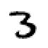

现在我们将取图像顶部的3×3像素正方形，并将其中每个值分别与核函数中的每个元素相乘。然后我们将它们相加，如下所示：

```python
im3_t = tensor(im3)
im3_t[0:3,0:3] * top_edge
```

```text
tensor([[-0., -0., -0.],
[0., 0., 0.],
[0., 0., 0.]])
```

```python
(im3_t[0:3,0:3] * top_edge).sum()
```

```text
tensor(0.)
```

目前没什么意思——左上角的所有像素都是白色的。不过我们选几个更有意思的位置：

```python
df = pd.DataFrame(im3_t[:10,:20])
df.style.set_properties(**{'fontsize':'
6pt'}).background_gradient('Greys')
```

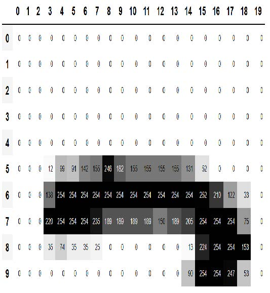

在单元格5,7处存在一条顶边。让我们在此重复计算：

```python
(im3_t[4:7,6:9] * top_edge).sum()
```

```text
tensor(762.)
```

在单元格8,18处有一个右边界。这能告诉我们什么？

```python
(im3_t[7:10,17:20] * top_edge).sum()
```

```text
tensor(-29.)
```

如你所见，这个小型计算返回了一个较大的数值，其中3×3像素的正方形代表顶部边缘（即正方形顶部值较低，而正下方值较高）。这是因为核函数中的 `-1` 值在此情况下影响甚微，而 `1` 值却影响巨大。

让我们稍微看看数学原理。过滤器会从图像中提取任意3×3大小的窗口，如果我们将像素值命名为这样：
$$
a_1\space a_2\space a_3 \\
a_4\space a_5\space a_6 \\
a_7\space a_8\space a_9
$$
它将返回 $a_1 + a_2 + a_3 − a_7 − a_8 − a_9$。如果我们处于图像中 $a_1$、$a_2$ 和 $a_3$ 的总和等于 $a_7$ 、$a_8$ 和 $a_9$ 的部分，则各项将相互抵消，结果为 0。然而，若 $a_1$ 大于 $a_7$ 、$a_2$ 大于 $a_8$ 且 $a_3$ 大于 $a_9$ ，则最终结果数值更大。因此该滤波器可检测水平边缘——更精确地说，是图像顶部亮区向底部暗区过渡的边缘。

将滤波器调整为顶部为 `1` 、底部为 `-1` 的排列方式，即可检测从暗到亮的水平边缘。若将 `1` 和 `-1` 排列为列而非行，则可获得检测垂直边缘的滤波器。每组权重设置都会产生不同类型的输出结果。

让我们创建一个函数来处理单个位置的情况，并验证它是否与之前的结果一致：

```python
def apply_kernel(row, col, kernel):
    return (im3_t[row-1:row+2,col-1:col+2] * kernel).sum()
```

```python
apply_kernel(5,7,top_edge)
```

```text
tensor(762.)
```

但请注意，我们不能将其应用于角落（例如位置0,0），因为该处不存在完整的3×3方格。

#### 卷积核映射

我们可以将 `apply_kernel()` 函数映射到坐标网格上。也就是说，我们将把3×3核函数应用到图像的每个3×3区域。例如，图13-2展示了在5×5图像的第一行中，3×3核函数可应用的位置。


[^图13-2]: 在网格上应用核函数

要生成坐标网格，我们可以使用嵌套列表推导式（nested list comprehension），如下所示：

```python
[[(i,j) for j in range(1,5)] for i in range(1,5)]
```

```text
[[(1, 1), (1, 2), (1, 3), (1, 4)],
[(2, 1), (2, 2), (2, 3), (2, 4)],
[(3, 1), (3, 2), (3, 3), (3, 4)],
[(4, 1), (4, 2), (4, 3), (4, 4)]]
```

> 嵌套列表推导式
>
> 嵌套列表推导式在Python中应用广泛，因此若你此前未接触过，请花几分钟确保理解此处的运作机制，并尝试编写自己的嵌套列表推导式。

以下是在坐标网格上应用我们内核的结果：

```python
rng = range(1,27)
top_edge3 = tensor([[apply_kernel(i,j,top_edge) for j in
                     rng] for i in rng])
show_image(top_edge3);
```


看起来不错！图像顶部边缘为黑色，底部边缘为白色（因为它们与顶部边缘相对）。现在图像中也包含负数，`matplotlib` 已自动调整颜色：白色代表图像中最小的数值，黑色代表最大的数值，而零值则显示为灰色。

我们也可以对左侧边缘尝试相同的方法：

```python
left_edge = tensor([[-1,1,0],
                    [-1,1,0],
                    [-1,1,0]]).float()

left_edge3 = tensor([[apply_kernel(i,j,left_edge) for j in
                      rng] for i in rng])

show_image(left_edge3);
```

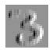

正如我们之前提到的，卷积操作是指将卷积核应用于网格的过程。文森特·杜穆兰（Vincent Dumoulin）和弗朗切斯科·维辛（Francesco Visin）的论文 [《深度学习卷积运算指南》](https://oreil.ly/les1R) 中包含大量精彩的示意图，展示了图像卷积核的应用方式。图13-3摘自该论文，底部展示了一幅浅蓝色4×4图像，其上应用着深蓝色3×3核，最终在顶部生成2×2的绿色输出激活图。

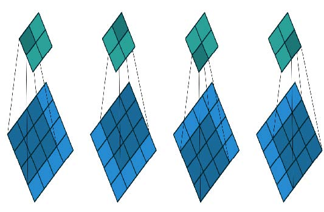

[^图13-3]: 将3×3核应用于4×4图像的结果（由Vincent Dumoulin和Francesco Visin提供）

观察结果的形状。若原始图像高度为 `h`，宽度为 `w`，我们能找到多少个 3×3 的窗口？如示例所示，共有 `h-2` × `w-2` 个窗口，因此最终生成的图像高度为 `h-2`，宽度为 `w-2`。

我们不会从头实现这个卷积函数，而是直接使用PyTorch的实现（它比我们用Python能实现的任何方案都快得多）。

#### 使用PyTorch实现卷积

卷积是一种非常重要且广泛使用的操作，PyTorch已将其内置。该函数名为 `F.conv2d`（需注意 `F` 是fastai从 `torch.nn.functional` 导入的模块，此做法符合PyTorch推荐规范）。PyTorch文档指出该函数包含以下参数：

- `input`

  输入张量，形状为 (`minibatch, in_channels, iH, iW`)

- `weight`

  过滤器，形状为 (`out_channels, in_channels, kH, kW`)

这里 `iH,iW` 是图像的高度和宽度（即 `28,28`），而 `kH,kW` 是我们的卷积核的高度和宽度（`3,3`）。但显然，PyTorch期望这两个参数均为阶数为4的张量，而当前我们仅有阶数为2的张量（即矩阵或双轴数组）。

这些额外轴的存在源于PyTorch的几项特殊设计。其首项设计在于PyTorch能够同时对多张图像执行卷积操作。这意味着我们可以一次性对批处理中的所有元素同时调用该操作！

第二个技巧在于PyTorch能够同时应用多个核。因此我们也创建对角线边缘核，然后将所有四个边缘核堆叠成单一张量：

```python
diag1_edge = tensor([[ 0,-1, 1],
                     [-1, 1, 0],
                     [ 1, 0, 0]]).float()
diag2_edge = tensor([[ 1,-1, 0],
                     [ 0, 1,-1],
                     [ 0, 0, 1]]).float()

edge_kernels = torch.stack([left_edge, top_edge, diag1_edge,
                            diag2_edge])
edge_kernels.shape
```

```text
torch.Size([4, 3, 3])
```

要验证这一点，我们需要一个 `DataLoader` 和一个样本小批量。让我们使用数据块API：

```python
mnist = DataBlock((ImageBlock(cls=PILImageBW),
                   CategoryBlock),
                  get_items=get_image_files,
                  splitter=GrandparentSplitter(),
                  get_y=parent_label)
dls = mnist.dataloaders(path)
xb,yb = first(dls.valid)
xb.shape
```

```text
torch.Size([64, 1, 28, 28])
```

默认情况下，fastai 在使用数据块时会将数据放置在 GPU 上。让我们在示例中将其移至 CPU：

```python
xb,yb = to_cpu(xb),to_cpu(yb)
```

每批次包含64张图像，每张图像为单通道，尺寸为28×28像素。 `F.conv2d` 同样可处理多通道（彩色）图像。通道指图像中的单一基本颜色——对于常规全彩图像，通常包含红、绿、蓝三个通道。PyTorch将图像表示为三维张量，其维度如下：

```text
[channels, rows, columns]
```

本章后续内容将介绍如何处理多个通道。传递给 `F.conv2d` 的核函数必须是4阶张量：

```text
[channels_in, features_out, rows, columns]
```

`edge_kernels` 目前缺少以下内容之一：我们需要告知 PyTorch 该核函数的输入通道数为一，具体操作是在 PyTorch 文档标注的 `in_channels` 预期位置插入一个尺寸为一的轴（称为单位轴）。要向张量插入单位轴，我们得使用 `unsqueeze` 方法：

```python
edge_kernels.shape,edge_kernels.unsqueeze(1).shape
```

```text
(torch.Size([4, 3, 3]), torch.Size([4, 1, 3, 3]))
```

现在这是 `edge_kernels` 的正确形状。让我们将所有内容传入 `conv2d` ：

```python
edge_kernels = edge_kernels.unsqueeze(1)
```

```python
batch_features = F.conv2d(xb, edge_kernels)
batch_features.shape
```

输出形状显示我们的小批次包含64张图像、4个卷积核以及26×26的边缘映射图（我们最初使用的是28×28图像，但如前所述每边丢失了一个像素）。可以看出，我们获得的结果与手动操作时完全一致：

```python
show_image(batch_features[0,0]);
```

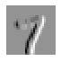

PyTorch最关键的绝招在于它能利用GPU并行处理所有任务——将多个内核应用于多张图像的多个通道。并行处理大量任务对GPU的高效运作至关重要；若逐个执行这些操作，速度往往会降低数百倍（若使用前文的手动卷积循环，速度甚至会降低数百万倍！）。因此，要成为优秀的深度学习实践者，关键技能之一就是让GPU同时处理大量任务。

如果能在每个轴上保留那两个像素就好了。实现方法是添加填充（padding），即在图像外围增加额外的像素。最常见的做法是添加零值像素。

#### 步长与填充

通过适当的填充，我们可以确保输出激活图与原始图像尺寸一致，这在构建网络架构时能大大简化工作。图13-4展示了添加填充后如何使卷积核能够作用于图像角落区域。

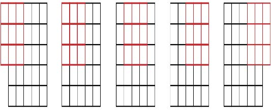

[^图13-4]: 带填充的卷积

采用5×5输入、4×4卷积核和2像素填充后，最终得到一个6×6的激活图，如图13-5所示。


[^图13-5]: 一个4×4核，配以5×5输入和2像素填充（由Vincent Dumoulin和Francesco Visin提供）

若添加尺寸为 `ks` × `ks` 的核（`ks` 为奇数），则为保持相同形状所需的两侧填充量为 `ks//2` 。若 `ks` 为偶数，则顶部/底部与左侧/右侧所需填充量不同，但实际中我们几乎从不使用偶数尺寸的滤波器。

到现在为止，我们在网格上应用卷积核时，每次只移动一个像素。但我们可以跳跃更远的距离；例如，每次应用卷积核后可移动两个像素，如图13-6所示。这被称为步长为2的卷积。实际应用中最常见的核尺寸为3×3，最常用的填充值为1。如后续所示，步长为2的卷积有助于缩小输出尺寸，而步长为1的卷积则能在保持输出尺寸不变的情况下增加层数。


[^图13-6]: 3×3 卷积核，5×5 输入，步长为 2 的卷积，1 像素填充（由 Vincent Dumoulin 和 Francesco Visin 提供）

在尺寸为 `h` × `w` 的图像中，使用填充值1和步长2时，结果尺寸为 `(h+1)//2` × `(w+1)//2` 。各维度的一般公式为：

```python
(n + 2*pad - ks) // stride + 1
```

其中 `pad` 是填充量，`ks` 是核的大小，`stride` 是步长。

现在让我们看看卷积结果的像素值是如何计算的。

#### 理解卷积方程

为快速阐释卷积背后的数学原理，fast.ai学员Matt Kleinsmith提出了一个绝妙方案：[从不同视角展示卷积神经网络](https://oreil.ly/wZuBs) 。这个方案如此精妙且实用，我们在此也一并呈现！

这是我们的3×3像素图像，每个像素都标有字母：

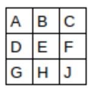

这是我们的核函数，每个权重都标注了希腊字母：

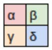

由于滤镜在图像中出现了四次，因此我们得到四个结果：

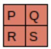

图13-7展示了我们如何将核函数应用于图像的每个区域以获得相应结果。

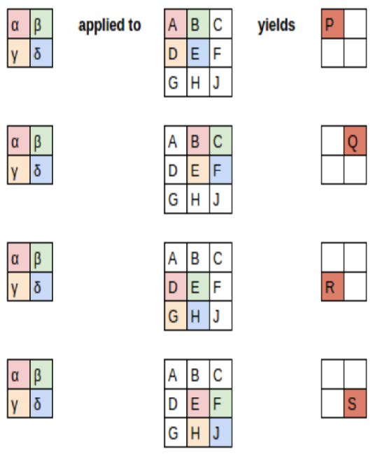

[^图13-7]: 应用内核

方程视图如图13-8所示。

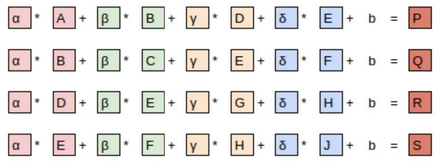

[^图13-8]: 方程

请注意，偏置项 `b` 在图像的每个区域中都是相同的。你可以将偏置视为滤波器的一部分，正如权重 ($\alpha,\beta,\gamma,\delta$) 是滤波器的一部分一样。

这里有一个有趣的见解——卷积可以表示为一种特殊的矩阵乘法，如图13-9所示。权重矩阵与传统神经网络中的权重矩阵完全相同。然而，这个权重矩阵具有两个特殊属性：

1. 灰色显示的零值不可训练。这意味着它们在整个优化过程中将保持为零。
2. 部分权重相等，虽然它们可训练（即可改变），但必须保持相等。这些称为共享权重。

这些零值对应滤波器无法处理的像素。权重矩阵的每一行对应滤波器的一次应用。

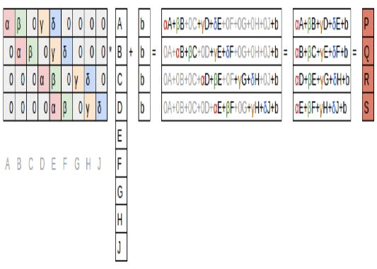

[^图13-9]: 卷积作为矩阵乘法

既然我们已经理解了卷积的概念，现在就用它来构建神经网络。

### 我们的第一个卷积神经网络

我们没有理由认为某些特定的边缘滤波器是图像识别中最有效的核函数。此外，我们已经看到在后续层中，卷积核会将低层特征进行复杂的变换，但我们尚未掌握如何手动构建这些核函数。

相反，最好直接学习卷积核的值。我们已经知道如何做到这一点——梯度下降！实际上，模型将学习对分类有用的特征。当我们使用卷积层替代（或补充）常规线性层时，便构成了卷积神经网络（convolutional neural network，CNN）。

#### 创建卷积神经网络

让我们回到第4章中的基本神经网络。它被定义如下：

```python
simple_net = nn.Sequential(
    nn.Linear(28*28,30),
    nn.ReLU(),
    nn.Linear(30,1)
)
```

我们可以查看模型的定义：

```python
simple_net
```

```text
Sequential(
(0): Linear(in_features=784, out_features=30, bias=True)
(1): ReLU()
(2): Linear(in_features=30, out_features=1, bias=True)
)
```

现在我们希望创建一个与该线性模型类似的架构，但使用卷积层替代线性层。`nn.Conv2d` 是 `F.conv2d` 的模块等效实现。在构建架构时，它比 `F.conv2d` 更便捷，因为实例化时会自动为我们生成权重矩阵。

以下是一种可能的架构：

```python
broken_cnn = sequential(
    nn.Conv2d(1,30, kernel_size=3, padding=1),
    nn.ReLU(),
    nn.Conv2d(30,1, kernel_size=3, padding=1)
)
```

需要注意的是，我们无需将输入尺寸明确设定为 `28×28` 。这是因为线性层需要为每个像素在权重矩阵中分配权重，因此必须知道像素数量；而卷积操作会自动应用于每个像素。正如前文所述，权重仅取决于输入输出通道数和卷积核尺寸。

思考输出形状会是什么样；然后让我们尝试一下并看看：

```python
broken_cnn(xb).shape
```

```text
torch.Size([64, 1, 28, 28])
```

这无法用于分类任务，因为我们需要每张图像对应单一输出激活值，而非28×28的激活图。解决方法之一是使用足够多次步长为2的卷积，使最终层尺寸为1。经过一次步长为2的卷积后，尺寸将变为14×14；两次后变为7×7；接着依次为4×4、2×2，最终达到尺寸1。

现在我们来尝试一下。首先，我们将定义一个函数，其中包含每次卷积操作中将使用的基本参数：

```python
def conv(ni, nf, ks=3, act=True):
    res = nn.Conv2d(ni, nf, stride=2, kernel_size=ks,
                    padding=ks//2)
    if act: res = nn.Sequential(res, nn.ReLU())
    return res
```

> 重构
>
> 通过这种方式重构神经网络的某些部分，能显著降低因架构不一致导致错误的概率，同时让读者更清晰地看到层结构中哪些部分正在发生实际变化。

当我们使用步长为2的卷积时，通常会同时增加特征数量。这是因为我们在激活图中将激活数量减少了4倍；我们不希望一次就大幅降低层的容量。

> 术语：通道与特征
>
> 这两个术语基本可互换使用，指代权重矩阵的第二轴尺寸，即卷积后每个网格单元对应的激活数量。特征（features）绝不指代输入数据，而通道（channels）既可指代输入数据（通常通道表示颜色），也可指代网络内部的激活状态。

以下是构建简单卷积神经网络的方法：

```python
simple_cnn = sequential(
    conv(1 ,4), #14x14
    conv(4 ,8), #7x7
    conv(8 ,16), #4x4
    conv(16,32), #2x2
    conv(32,2, act=False), #1x1
    Flatten(),
)
```

> JEREMY说
>
> 我喜欢在每次卷积后添加类似此处的注释，以展示每层之后激活图的大小。这些注释假设输入尺寸为28×28。

现在网络输出两个激活值，它们分别映射到标签中的两个可能级别：

```python
simple_cnn(xb).shape
```

```text
torch.Size([64, 2])
```

现在我们可以创建我们的 `Learner` ：

```python
learn = Learner(dls, simple_cnn, loss_func=F.cross_entropy,
metrics=accuracy)
```

要准确了解模型内部的运作情况，我们可以使用 `summary` 函数：

```python
learn.summary()
```

```text
Sequential (Input shape: ['64 x 1 x 28 x 28'])
================================================================
Layer (type) Output Shape Param #
Trainable
================================================================
Conv2d 64 x 4 x 14 x 14 40 True
________________________________________________________________
ReLU 64 x 4 x 14 x 14 0 False
________________________________________________________________
Conv2d 64 x 8 x 7 x 7 296 True
________________________________________________________________
ReLU 64 x 8 x 7 x 7 0 False
________________________________________________________________
Conv2d 64 x 16 x 4 x 4 1,168 True
________________________________________________________________
ReLU 64 x 16 x 4 x 4 0 False
________________________________________________________________
Conv2d 64 x 32 x 2 x 2 4,640 True
________________________________________________________________
ReLU 64 x 32 x 2 x 2 0 False
________________________________________________________________
Conv2d 64 x 2 x 1 x 1 578 True
________________________________________________________________
Flatten 64 x 2 0 False
________________________________________________________________


Total params: 6,722
Total trainable params: 6,722
Total non-trainable params: 0
Optimizer used: <function Adam at 0x7fbc9c258cb0>
Loss function: <function cross_entropy at 0x7fbca9ba0170>
Callbacks:
- TrainEvalCallback
- Recorder
- ProgressCallback
```

请注意，最终 `Conv2d` 层的输出为 `64x2x1x1` 。我们需要移除这些额外的 `1x1` 维度，这正是 `Flatten` 模块的作用。它本质上与PyTorch的 `squeeze` 方法相同，但以模块形式实现。

让我们看看这个模型能否训练成功！由于这是我们首次构建的深度神经网络，我们将采用更低的学习率和更长的训练周期：

```python
learn.fit_one_cycle(2, 0.01)
```

| 迭代轮次 | 训练损失 | 验证损失 | 准确率   | 时间  |
| -------- | -------- | -------- | -------- | ----- |
| 0        | 0.072684 | 0.045110 | 0.990186 | 00:05 |
| 1        | 0.022580 | 0.030775 | 0.990186 | 00:05 |

成功！结果正逐渐接近我们之前获得的 `ResNet18` 效果，尽管还未完全达到，且需要更多训练迭代轮次，同时必须采用更低的学习率。虽然还有些技巧需要掌握，但我们正越来越接近能够从零构建现代卷积神经网络的目标。

#### 理解卷积运算

从摘要中可以看出，我们有一个大小为 `64x1x28x28` 的输入。轴序为 `batch,channel,height,width` 。这通常表示为 `NCHW`（其中 `N` 表示批量大小）。另一方面，TensorFlow使用 `NHWC` 轴序。以下是第一层：

```python
m = learn.model[0]
m
```

```text
Sequential(
(0): Conv2d(1, 4, kernel_size=(3, 3), stride=(2, 2),
padding=(1, 1))
(1): ReLU()
)
```

因此我们有1个输入通道、4个输出通道和一个3×3卷积核。让我们查看第一个卷积的权重：

```python
m[0].weight.shape
```

```text
torch.Size([4, 1, 3, 3])
```

摘要显示我们有40个参数，而 `4×1×3×3` 等于36。另外四个参数是什么？让我们看看偏置项包含什么：

```python
m[0].bias.shape
```

```text
torch.Size([4])
```

现在我们可以利用这些信息来阐明上一节中的陈述：“当使用步长为2的卷积时，我们通常会增加特征数量，因为激活图中的激活数量减少了4倍；我们不希望单次大幅降低层的容量。”

每个通道都对应一个偏置项。（当它们不是输入通道时有时通道被称为特征或滤波器）输出形状为 `64x4x14x14` ，因此这将成为下一层的输入形状。根据摘要，下一层有296个参数。为简化说明，暂忽略批量轴。因此在 `14×14=196` 个位置上，我们需进行 `296-8=288` 次权重乘法（为简化起见忽略偏置项），即本层共需执行 `196×288=56,448` 次乘法运算。下一层将进行 `7×7×(1168-16)=56,448` 次乘法运算。

这里的情况是，我们的步长为2的卷积将网格尺寸从 `14x14` 减半至 `7x7` ，同时我们将滤波器数量从8倍增至16，因此整体计算量并未改变。如果在每层步长为2的卷积层中保持通道数不变，随着网络层级加深，计算量将逐渐减少。但我们知道深层需要计算语义丰富的特征（如眼睛或毛发），因此计算量减少显然不合逻辑。

另一种思考方式是基于感受野（receptive fields）的概念来理解。

#### 感受野

感受野是指参与某一层计算的图像区域。在书籍网站上，你会找到一个名为 `conv-example.xlsx` 的Excel电子表格，其中展示了使用MNIST数字数据集计算两个步长为2的卷积层的过程。每个卷积层仅包含一个卷积核。图13-10展示了当我们点击卷积层2区域的某个单元格（该单元格显示第二个卷积层的输出结果）并选择“追踪前置操作”时所呈现的内容。


[^图13-10]: Conv2层的直接前置层

此处，绿色边框的单元格是我们点击的单元格，蓝色高亮单元格则是其前置单元格（precedents）——用于计算其值的单元格。这些单元格分别对应输入层（左侧）的3×3区域单元格，以及滤波器（右侧）中的单元格。现在再次点击“追踪前置单元”（trace precedents），即可查看用于计算这些输入值的单元。图13-11展示了此时的情况。


[^图13-11]: Conv2层的次级先例

在此示例中，我们仅有两个卷积层，每层步长均为2，因此现在可追溯至输入图像。我们可以看到，输入层中一个7×7的单元区域被用于计算Conv2层中单个绿色单元。这个7×7区域即为Conv2层中绿色激活单元输入端的感受野。同时可见，由于存在两层结构，现在需要第二个滤波器核。

从这个例子中可以看出，网络层级越深（具体来说，某层之前经过的步长为2的卷积层越多），该层激活的感受野就越大。较大的感受野意味着计算该层每个激活值时会使用输入图像的大片区域。我们已知在网络的深层网络层中存在语义丰富的特征，对应更大的感受野。因此我们预期，为处理这种日益增长的复杂性，每个特征都需要更多的权重。这与上一节所述观点本质相同：当在网络中引入步长为2的卷积时，也应相应增加通道数量。

在撰写本章时，我们面临诸多亟待解答的疑问，只为能向你尽可能清晰地阐释卷积神经网络。信不信由你，我们竟在Twitter（译者注：现在这个社交平台叫做X）上找到了大部分答案。现在让我们稍作停顿，就此话题展开讨论，随后再继续探讨彩色图像的内容。

#### 关于Twitter的说明

我们对社交网络的使用，至少可以说并不频繁。但本书的宗旨是助你成为最优秀的深度学习实践者，若不提及Twitter在我们自身深度学习旅程中的重要性，实属失职。要知道，Twitter还有另一面——远离特朗普和卡戴珊家族的喧嚣，那里每天都有深度学习研究者和实践者交流专业见解。就在撰写本节内容时，杰里米想确认关于步长为2的卷积的论述是否准确，于是他在Twitter上提问：


> 翻译：我忘了为什么我们从步长1卷积配合RAX池化转为步长2卷积？为什么不用步长1卷积配合平均池化（或者说某些现代网络是否采用这种方案）？这只是经验之谈，还是存在更深层的缘由？是否有人做过消融实验？

几分钟后，这个答案就出现了：

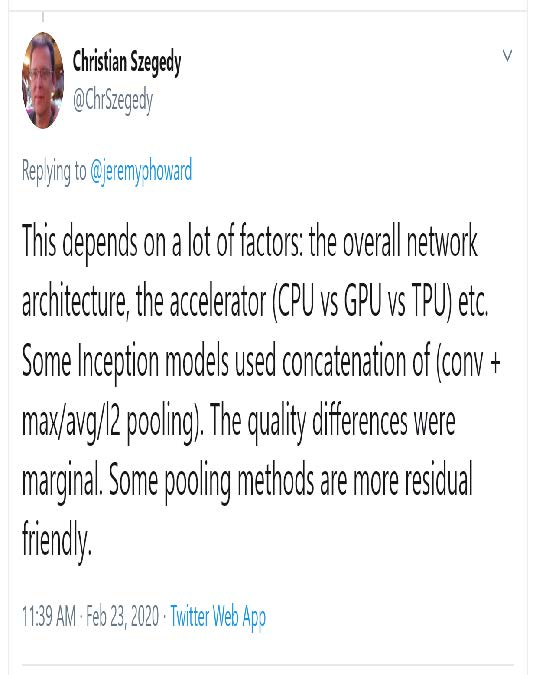

> 翻译：这取决于诸多因素：整体网络架构、加速器（CPU vs GPU vs TPU）等。某些Inception模型采用（卷积+卷积反向/平均取值池化）的串联方式，其质量差异微乎其微，某些池化方法更适合残差连接。

克里斯蒂安·塞格迪（Christian Szegedy）是2014年ImageNet冠军模型 [Inception](https://oreil.ly/hGE_Y) 的首要作者，该模型为现代神经网络提供了诸多关键洞见。两小时后，以下内容出现：


> 翻译：我1989年初发表在《神经计算》上的卷积神经网络论文，采用步长为2且不进行池化的方案，纯粹因为计算速度快。第二篇论文（NIPS 1989）采用了步长+平均池化/双曲正切函数的方案，在邮政编码数字识别上效果更佳，但这可能由多种因素造成。

你认得这个名字吗？你在第二章就见过它，当时我们正在讨论那些奠定当今深度学习基础的图灵奖得主！

杰里米还在推特上寻求帮助，想确认我们在第七章中对标签平滑的描述是否准确，并再次直接获得了克里斯蒂安·塞格迪的回应（标签平滑最初是在Inception论文中提出的）：


> 翻译：这段内容主要由谢尔盖撰写，因此他可能是最合适的咨询对象。我认为你对标签平滑的阐述相当准确，该段落的解读是正确的。

当今深度学习领域的许多顶尖人物都是推特活跃用户，且非常乐于与更广泛的社区互动。一个不错的入门方式是查看杰里米近期点赞的推文列表，或是西尔万的点赞记录。这样你就能看到我们认为值得关注的推特用户列表，这些用户发表的观点既有趣又实用。

Twitter是我们获取有趣论文、软件发布及其他深度学习资讯的主要渠道。若想与深度学习社区建立联系，我们建议你同时参与fast.ai论坛和Twitter互动。

话虽如此，让我们回到本章的核心内容。迄今为止，我们展示的图片示例均为黑白图像，每个像素仅包含一个数值。实际上，大多数彩色图像每个像素包含三个数值来定义颜色。接下来我们将探讨如何处理彩色图像。

### 彩色图像

彩色图像是一个三阶张量：

```python
im = image2tensor(Image.open('images/grizzly.jpg'))
im.shape
```

```text
torch.Size([3, 1000, 846])
```

```python
show_image(im);
```


第一轴包含红、绿、蓝三个通道：

```python
_,axs = subplots(1,3)
for bear,ax,color in zip(im,axs,('Reds','Greens','Blues')):
    show_image(255-bear, ax=ax, cmap=color)
```


我们已经了解了卷积操作对图像单个通道上单个滤波器的作用（示例基于方形图像）。卷积层会接收具有特定通道数（常规RGB彩色图像的首层为三个通道）的图像，并输出具有不同通道数的图像。如同我们用隐藏层大小表示线性层的神经元数量，我们可以自由设定任意数量的滤波器，每个滤波器都能实现特定功能（例如检测水平边缘、垂直边缘等），从而实现类似第二章所研究的示例效果。

在一个滑动窗口中，我们拥有特定数量的通道，且需要与通道数相等的滤波器（并非所有通道都使用相同的核）。因此我们的核尺寸并非3×3，而是通道输入数 `ch_in` 乘以3×3。在每个通道上，我们将窗口元素与对应滤波器的元素相乘，然后将结果相加（如前所述），并对所有滤波器求和。如图13-12所示的示例中，该窗口上卷积层的结果为红色+绿色+蓝色。

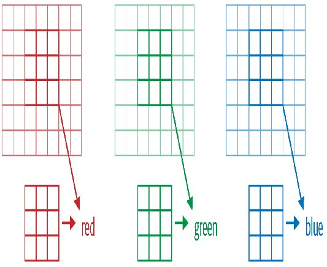

[^图13-12]: 对RGB图像进行卷积

因此，要对彩色图像进行卷积运算，我们需要一个尺寸与图像第一轴匹配的卷积核张量。在图像的每个位置，卷积核与图像块的对应部分进行相乘。

这些数值随后被全部相加，为每个输出特征的每个网格位置生成一个单一数值，如图13-13所示。


[^图13-13]: 添加RGB滤波器

然后我们有这样的 `ch_out` 滤波器，因此最终卷积层的结果将是一批具有 `ch_out` 通道数、高度和宽度由先前公式给定的图像。这将产生尺寸为 `ch_in x ks x ks` 的 `ch_out` 张量，我们将其表示为一个四维的大张量。在 PyTorch 中，这些权重的维度顺序为 `ch_out x ch_in x ks x ks`。

此外，我们可能需要为每个滤波器设置偏置项。在前例中，卷积层的最终结果将为 $y_R + y_G + y_B + b$ 。与线性层类似，偏置项的数量等于核的数量，因此偏置项是一个大小为 `ch_out` 的向量。

在设置卷积神经网络进行彩色图像训练时，无需特殊机制。只需确保第一层具有三个输入即可。

处理彩色图像的方法多种多样。例如，你可以将图像转为黑白，将RGB颜色空间转换为HSV（色相、饱和度和明度）颜色空间等等。实验表明，只要转换过程中不丢失信息，改变颜色编码方式通常不会影响模型结果。因此，转换为黑白图像是个糟糕的主意，因为它会彻底消除颜色信息（这可能至关重要；例如，某种宠物品种可能具有独特的毛色特征）；但转换为HSV通常不会产生任何影响。

现在你明白齐勒和弗格斯论文中《神经网络学到了什么》第一章的那些图示了！作为回顾，这是他们展示的第一层部分权重的示意图：


这是将卷积核的三片切片，针对每个输出特征，以图像形式呈现。我们可以看到，尽管神经网络的创建者从未明确设计用于检测边缘等特征的核函数，但神经网络通过随机梯度下降法自动发现了这些特征。

现在让我们看看如何训练这些卷积神经网络，并向大家展示fastai在后台用于高效训练的所有技术。

### 提升训练稳定性

既然我们已经能很好地区分3和7，那就来挑战更难的任务——识别全部10个数字。这意味着我们需要使用 `MNIST` 数据集而非 `MNIST_SAMPLE` ：

```python
path = untar_data(URLs.MNIST)
path.ls()
```

```text
(#2) [Path('testing'),Path('training')]
```

数据存放在名为 `training` 和 `testing` 的两个文件夹中，因此我们需要告知 `GrandparentSplitter` 这一设置（默认使用 `train` 和 `valid`）。我们在 `get_dls` 函数中完成此操作，该函数的定义便于后续灵活调整批量大小：

```python
def get_dls(bs=64):
    return DataBlock(
        blocks=(ImageBlock(cls=PILImageBW), CategoryBlock),
        get_items=get_image_files,
        splitter=GrandparentSplitter('training','testing'),
        get_y=parent_label,
        batch_tfms=Normalize()
    ).dataloaders(path, bs=bs)
    
dls = get_dls()
```

请记住，在使用数据之前先查看它总是明智之举：

```python
dls.show_batch(max_n=9, figsize=(4,4))
```

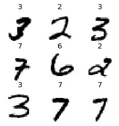

既然数据已经准备就绪，我们就可以用它来训练一个简单的模型。

#### 简单的基准模型

在本章前文，我们基于 `conv` 函数构建了一个模型，如下所示：

```python
def conv(ni, nf, ks=3, act=True):
    res = nn.Conv2d(ni, nf, stride=2, kernel_size=ks,
                    padding=ks//2)
    if act: res = nn.Sequential(res, nn.ReLU())
    return res
```

让我们从一个基础卷积神经网络作为基线模型开始。我们将沿用之前相同的网络结构，但做一个调整：增加激活层数量。由于需要区分的数值更多，我们很可能需要学习更多的卷积滤波器。

正如我们讨论的那样，每次遇到步长为2的层时，我们通常希望将滤波器数量翻倍。增加整个网络中滤波器数量的一种方法是将第一层的激活数量翻倍——这样后续每层的规模也将达到先前版本的两倍。

但这会引发一个微妙的问题。考虑应用于每个像素的卷积核。默认情况下，我们使用3×3像素的卷积核。因此，每个位置上卷积核作用的像素总数为3×3=9个。先前第一层有四个输出滤波器，这意味着每个位置需要从九个像素中计算四个值。试想若将输出倍增至八个滤波器会怎样。此时应用核时，我们将用九个像素计算八个数值。这意味着模型几乎无法真正学习：输出规模与输入规模几乎相同。神经网络只有在被迫如此时才会创造有用特征——即当某项运算的输出数量显著少于输入数量时。

为了解决这个问题，我们可以在第一层使用更大的卷积核。如果采用5×5像素的卷积核，每次卷积操作将使用25个像素。由此创建八个滤波器意味着神经网络必须发现一些有用的特征：

```py
def simple_cnn():
    return sequential(
        conv(1 ,8, ks=5), #14x14
        conv(8 ,16), #7x7
        conv(16,32), #4x4
        conv(32,64), #2x2
        conv(64,10, act=False), #1x1
        Flatten(),
    )
```

正如你即将看到的，我们可以在模型训练过程中对其进行观察，以寻找优化训练效果的方法。为此，我们使用 `ActivationStats` 回调函数，它会记录每个可训练层的激活值均值、标准差及直方图（如前所述，回调函数用于向训练循环添加行为；其具体工作原理将在第16章探讨）：

```python
from fastai.callback.hook import *
```

我们希望快速训练，这意味着以较高的学习速率进行训练。让我们看看在0.06的学习速率下效果如何：

```python
def fit(epochs=1):
    learn = Learner(dls, simple_cnn(),
                    loss_func=F.cross_entropy,
                    metrics=accuracy,
                    cbs=ActivationStats(with_hist=True))
    learn.fit(epochs, 0.06)
    return learn

learn = fit()
```

| 迭代轮次 | 训练损失 | 验证损失 | 准确率   | 时间  |
| -------- | -------- | -------- | -------- | ----- |
| 0        | 2.307071 | 2.305865 | 0.113500 | 00:16 |

这次训练效果实在不理想！让我们找出原因。

传递给 `Learner` 的回调函数有一个便捷特性：它们会自动以回调类名称（转换为驼峰式命名法）作为变量名自动提供访问。因此，我们的 `ActivationStats` 回调可通过`activation_stats` 访问。相信你还记得 `learn.recorder` ...能猜到它是如何实现的吗？没错，它正是名为 `Recorder` 的回调函数！

`ActivationStats` 包含一些用于绘制训练过程中激活值的实用工具。`plot_layer_stats(idx)`  可绘制第 `idx` 层激活值的均值与标准差，同时显示接近零值的激活比例。以下是第一层的绘图结果：

```python
learn.activation_stats.plot_layer_stats(0)
```

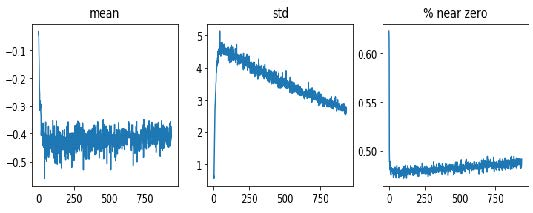

通常我们的模型在训练过程中，各层激活值的均值和标准差应保持一致或至少平滑。接近零的激活值尤其棘手，因为这意味着模型中存在完全无意义的计算（毕竟零的乘积仍是零）。当某层出现零值时，这些零值通常会传递到下一层...进而产生更多零值。以下是网络倒数第二层的示例：

```python
learn.activation_stats.plot_layer_stats(-2)
```


正如预期的那样，随着网络层数的增加，问题在网络末端变得更加严重，因为不稳定性和零激活现象在各层中不断累积。让我们看看如何使训练过程更加稳定。

#### 增加批量大小

提高训练稳定性的一种方法是增加批量大小。较大的批次能获得更精确的梯度，因为它们基于更多数据计算得出。然而，较大的批量意味着每个迭代轮次的批次数量减少，这将降低模型更新权重的机会。让我们看看批量大小为 512 是否有效：

```python
dls = get_dls(512)
```

```python
learn = fit()
```

| 迭代轮次 | 训练损失 | 验证损失 | 准确率   | 时间  |
| -------- | -------- | -------- | -------- | ----- |
| 0        | 2.309385 | 2.302744 | 0.113500 | 00:08 |

让我们看看倒数第二层是什么样子的：

```python
learn.activation_stats.plot_layer_stats(-2)
```

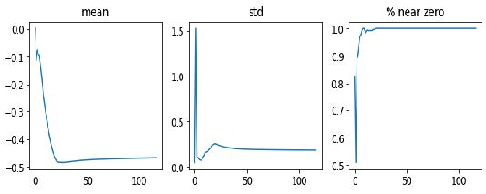

同样，我们的大多数激活值都接近零。让我们看看还能采取哪些措施来提高训练稳定性。

#### 单周期训练

我们的初始权重并不适合我们试图解决的任务。因此，以高学习率开始训练是危险的：正如我们所见，训练很可能立即发散。我们也不希望以高学习率结束训练，以免跳过某个最小值。但训练后期我们需要采用高学习率，因为这样能显著加快训练速度。因此训练过程中应动态调整学习率：从低值开始，逐步提升至高峰值，最终再回落至低值。

莱斯利·史密斯（Leslie Smith）（没错，就是发明学习率查找器的那个家伙！）在其论文 [《超收敛：利用大学习率实现神经网络的快速训练》](https://oreil.ly/EB8NU) 中发展了这一理念。他设计了分阶段的学习率调优方案：第一阶段学习率从最小值递增至最大值（预热，warmup），第二阶段则递减回最小值（退火，annealing）。史密斯将这种组合训练法命名为”单周期训练"（1cycle training）。

单周期训练使我们能够采用远高于其他训练方式的最大学习率，从而带来两大优势：

- 通过采用更高的学习率进行训练，我们能更快地完成训练——史密斯将这种现象称为超收敛。
- 通过采用更高的学习率进行训练，我们能减少过拟合现象，因为我们跳过了尖锐的局部极小值，最终落在了损失函数更平滑（因此更具泛化能力）的部分。

第二个观点颇为有趣且微妙；它基于这样一个观察：一个具有良好泛化能力的模型，其损失值在输入发生微小变化时不会显著改变。若模型以高学习率训练较长时间，且在此过程中能找到较好的损失值，则说明它必然找到了一个泛化能力强的区域——因为模型在批次间会频繁跳跃（这正是高学习率的基本定义）。问题在于，正如我们讨论过的，直接采用高学习率更可能导致损失函数发散而非收敛。因此我们不会直接采用高学习率，而是从低学习率起步——此时损失函数不会发散——并允许优化器通过逐步提升学习率，在参数空间中寻找越来越平滑的区域。

然后，当我们在参数空间中找到一个平滑区域后，我们需要定位该区域的最佳点，这意味着必须再次降低学习率。正因如此，单周期训练法采用了渐进式学习率预热和渐进式学习率冷却机制。许多研究者发现，实践中这种方法能获得更精确的模型并加快训练速度。因此它成为fastai中 `fine_tune` 的默认训练策略。

在第16章中，我们将全面学习梯度下降中的动量（momentum）技术。简而言之，动量是一种使优化器不仅沿梯度方向移动，同时延续先前步长的方向移动的技术。Leslie Smith在 [《神经网络超参数的系统化方法：第一部分》](https://oreil.ly/oL7GT) 中提出了周期动量概念。该方法使动量方向与学习率呈反向变化：高学习率阶段采用较小动量，退火阶段则重新增强动量作用。

我们可以在fastai中通过调用 `fit_one_cycle` 实现单周期训练：

```python
def fit(epochs=1, lr=0.06):
    learn = Learner(dls, simple_cnn(),
                    loss_func=F.cross_entropy,
                    metrics=accuracy,
                    cbs=ActivationStats(with_hist=True))
    learn.fit_one_cycle(epochs, lr)
    return learn

learn = fit()
```

| 迭代轮次 | 训练损失 | 验证损失 | 准确率   | 时间  |
| -------- | -------- | -------- | -------- | ----- |
| 0        | 0.210838 | 0.084827 | 0.974300 | 00:08 |

我们终于取得进展了！现在它能提供合理的准确度。

在训练过程中，我们可通过调用 `learn.recorder` 的 `plot_sched` 方法实时查看学习率和动量参数。`learn.recorder`（顾名思义）会记录训练期间的所有动态，包括损失值、指标以及学习率、动量等超参数：

```python
learn.recorder.plot_sched()
```


史密斯最初的单周期论文采用了线性预热和线性退火。如您所见，我们在fastai中通过将其与另一种流行方法——余弦退火相结合来改进该方案。`fit_one_cycle` 提供了以下可调整参数：

- `lr_max`

  将会被使用的最高学习率（也可为各层组对应学习率的列表，或包含首尾层组学习率的Python切片对象）

- `div`

  将 `lr_max` 除以该值所得的初始学习率

- `div_final`

  用于计算终止学习率的 `lr_max` 分数值

- `pct_start`

  预热阶段占批次总数的百分比

- `moms`

  元组 (`mom1,mom2,mom3`)，其中 `mom1` 为初始动量，`mom2` 为最小动量，`mom3` 为最终动量

让我们再次查看我们的图层统计数据：

```python
learn.activation_stats.plot_layer_stats(-2)
```


非零权重的比例正在显著改善，尽管它仍然相当高。通过使用 `color_dim` 并传入层索引，我们可以更深入地了解训练过程中的情况：

```python
learn.activation_stats.color_dim(-2)
```


`color_dim` 由fast.ai与学生Stefano Giomo共同开发。Giomo将该理念称为“多彩维度”，并深入阐述了该方法的起源与细节。其基本思路是绘制某一层的激活值直方图，我们期望该直方图能呈现出类似正态分布的平滑模式（图13-14）。

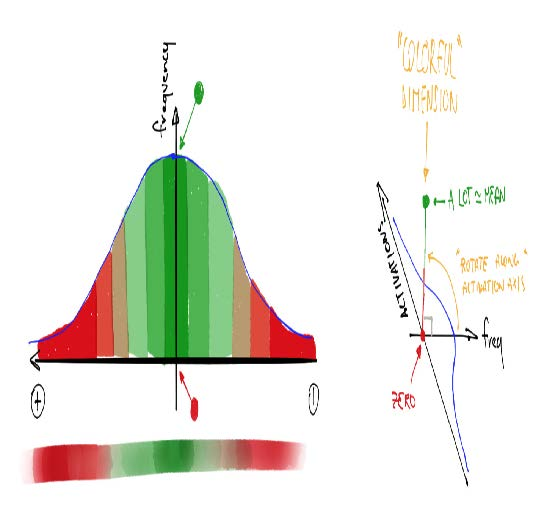

[^图13-14]: 彩色维度直方图（由Stefano Giomo提供）

创建 `color_dim` 时，我们取左侧显示的直方图，将其转换为底部所示的彩色表示形式。随后将其旋转90度，如右侧所示。我们发现对直方图值取对数后，分布关系更为清晰。随后，Giomo描述道：

> 最终图层的绘制方式是将每批次激活值的直方图沿水平轴堆叠。因此可视化中的每个垂直切片代表单批次的激活直方图。颜色强度对应直方图高度，即每个直方图区间内的激活值数量。

图13-15展示了所有这些如何相互配合。


[^图13-15]: 多彩维度概要（由Stefano Giomo提供）

这说明当f服从正态分布时，log(f)比f更丰富多彩，因为取对数会将高斯曲线转化为二次曲线，其峰值更宽。

那么，考虑到这一点，让我们再看看倒数第二层的结果：

```python
learn.activation_stats.color_dim(-2)
```


这张图展现了典型的“训练失败”案例。起始状态下几乎所有激活值都为零——左侧深蓝色区域即为此状态。底部亮黄色区域代表接近零的激活值。随后在最初几批数据中，非零激活值呈指数级增长，但增长过度导致网络崩溃！深蓝色区域重新出现，底部又变为明亮的黄色。这几乎像是训练从头开始重启。随后激活值再次上升又再度崩溃。经过数次循环后，最终激活值分布于整个数值区间。

训练过程若能从一开始就保持平稳，效果会好得多。指数增长后又骤然崩溃的循环往往导致大量接近零的激活值，从而造成训练速度缓慢且最终效果不佳。解决此问题的一种方法是采用批量归一化。

#### 批量归一化

为了解决上一节中出现的训练速度慢且最终结果不佳的问题，我们需要修正初始阶段接近零的激活值占比过大的情况，并在整个训练过程中努力维持激活值的良好分布。

谢尔盖·约菲（Sergey Ioffe）和克里斯蒂安·塞格迪（Christian Szegedy）在2015年的论文 [《批量归一化：通过减少内部协变量偏移加速深度网络训练》](https://oreil.ly/MTZJL) 中提出了解决方案。在摘要中，他们描述了我们所见到的这个问题：

> 训练深度神经网络的复杂性在于，随着前层参数的变化，各层输入的分布也会在训练过程中发生改变。这迫使我们采用更低的学习率并谨慎初始化参数，从而减缓了训练速度……我们将此现象称为内部协变量偏移，并通过归一化层输入来解决该问题。

他们提出的解决方案如下：

> 将归一化纳入模型架构，并在每次训练小批量中执行归一化操作。批量归一化使我们能够使用更高的学习率，同时对初始化操作的要求也更宽松。

该论文一经发布便引起巨大轰动，因为它包含了图13-16中的图表，该图表清晰地证明了批量归一化能够训练出比当前最先进模型（Inception架构）更精确、速度约快5倍的模型。


[^图13-16]: 批量归一化的影响（由Sergey Ioffe和Christian Szegedy提供）

批量归一化（常称为batchnorm）的工作原理是计算某一层激活值的均值和标准差，并利用这些参数对激活值进行归一化处理。然而这种方法可能引发问题，因为网络可能需要某些激活值保持极高水平才能实现精准预测。因此他们还添加了两个可学习参数（即在梯度下降步骤中更新），通常称为 `gamma` 和 `beta` 。在将激活值归一化得到新激活向量 `y` 后，批量归一化层会输出 `gamma*y + beta`。

因此我们的激活函数可以具有任意均值或方差，它们与前一层结果的均值和标准差无关。这些统计量是独立学习的，从而简化了模型的训练过程。训练与验证阶段的行为存在差异：训练时采用批次均值与标准差进行数据归一化，而验证阶段则使用训练过程中计算的统计量移动均值进行归一化。

让我们在 `conv` 中添加一个批归一化层：

```python
def conv(ni, nf, ks=3, act=True):
    layers = [nn.Conv2d(ni, nf, stride=2, kernel_size=ks,
                        padding=ks//2)]
    layers.append(nn.BatchNorm2d(nf))
    if act: layers.append(nn.ReLU())
    return nn.Sequential(*layers)
```

然后拟合我们的模型：

```python
learn = fit()
```

| 迭代轮次 | 训练损失 | 验证损失 | 准确率   | 时间  |
| -------- | -------- | -------- | -------- | ----- |
| 0        | 0.130036 | 0.055021 | 0.986400 | 00:10 |

这真是个好结果！让我们来看看 `color_dim`：

```python
learn.activation_stats.color_dim(-4)
```


这正是我们所期待的：激活函数平稳发展，没有“崩溃”现象。批归一化在这里确实兑现了它的承诺！事实上，批归一化如此成功，以至于我们几乎在所有现代神经网络中都能看到它（或非常相似的技术）。

关于包含批量正则化层的模型，一个有趣的观察是它们往往比不含该层的模型具有更好的泛化能力。尽管目前尚未看到对此现象的严谨分析，但多数研究者认为原因在于批量正则化为训练过程增添了额外的随机性。每个小批次的均值和标准差都会与其他小批次略有不同。因此，每次激活值都会被不同的数值进行归一化。为了使模型能够做出准确预测，它必须学会对这些变化保持鲁棒性。总体而言，在训练过程中增加额外的随机性通常是有益的。

既然进展顺利，我们再训练几个迭代轮次看看效果如何。事实上，我们应该提高学习率——毕竟批量归一化论文的摘要声称我们应该能够“以更高的学习率进行训练”：

```python
learn = fit(5, lr=0.1)
```

| 迭代轮次 | 训练损失 | 验证损失 | 准确率   | 时间  |
| -------- | -------- | -------- | -------- | ----- |
| 0        | 0.191731 | 0.121738 | 0.960900 | 00:11 |
| 1        | 0.083739 | 0.055808 | 0.981800 | 00:10 |
| 2        | 0.053161 | 0.044485 | 0.987100 | 00:10 |
| 3        | 0.034433 | 0.030233 | 0.990200 | 00:10 |
| 4        | 0.017646 | 0.025407 | 0.991200 | 00:10 |

```python
learn = fit(5, lr=0.1)
```

| 迭代轮次 | 训练损失 | 验证损失 | 准确率   | 时间  |
| -------- | -------- | -------- | -------- | ----- |
| 0        | 0.183244 | 0.084025 | 0.975800 | 00:13 |
| 1        | 0.080774 | 0.067060 | 0.978800 | 00:12 |
| 2        | 0.050215 | 0.062595 | 0.981300 | 00:12 |
| 3        | 0.030020 | 0.030315 | 0.990700 | 00:12 |
| 4        | 0.015131 | 0.025148 | 0.992100 | 00:12 |

至此，可以说我们已经掌握了识别数字的方法！现在该挑战更难的内容了……

### 总结

我们已经看到卷积本质上是一种矩阵乘法，对权重矩阵施加了两个约束：某些元素永远为零，某些元素被绑定（强制保持相同值）。在第1章中，我们回顾了1986年著作《并行分布式处理》提出的八项要求，其中一项正是“单元间的连接模式”。这些约束条件恰恰实现了这一目标：它们强制形成了特定的连接模式。

这些约束使我们在模型中能使用更少的参数，同时不牺牲对复杂视觉特征的表征能力。这意味着我们可以更快地训练更深的模型，且过度拟合更少。尽管普适逼近定理表明全连接网络应能通过单层隐藏层表示任何内容，但实践证明，通过精心设计网络架构，我们能够训练出性能更优的模型。

卷积层是迄今为止神经网络中最常见的连接模式（与常规线性层并列，后者被称为全连接层，fully connected），但未来很可能还会发现更多连接模式。

我们还了解了如何解读网络中各层的激活值，以判断训练是否顺利，以及批量归一化如何帮助规范训练过程并使其更平稳。在下一章中，我们将结合这两种层来构建计算机视觉领域最流行的架构：残差网络（residual network）。

### 问卷调查

1. 什么是特征？
2. 写出顶部边缘检测器的卷积核矩阵。
3. 写出3×3卷积核对图像中单个像素执行的数学运算。
4. 将卷积核应用于3×3全零矩阵时，其输出值是多少？
5. 什么是填充？
6. 什么是步长？
7. 创建嵌套列表推导式完成任意自选任务。
8. PyTorch二维卷积的 `input` 参数与 `weight` 参数形状分别是什么？
9. 什么是通道？
10. 卷积与矩阵乘法之间有何关系？
11. 什么是卷积神经网络？
12. 重构神经网络定义的某些部分有何益处？
13. 什么是 `Flatten` ？它需要在MNIST卷积神经网络的哪个位置使用？为什么？
14. NCHW代表什么？
15. MNIST卷积神经网络第三层为何包含 `7×7×(1168-16)` 次乘法运算？
16. 感受野是什么？
17. 经过两次步长为2的卷积后，激活函数的感受野尺寸是什么？为什么是这样？
18. 亲自运行 `conv-example.xlsx` 文件，尝试调整 `trace precedents` 参数。
19. 查看Jeremy或Sylvain的近期Twitter点赞列表，看看能否发现有趣的资源或灵感。
20. 彩色图像如何表示为张量？
21. 卷积如何处理彩色输入？
22. 我们能用什么方法查看 `DataLoaders` 中的数据？
23. 为何每次stride-2卷积后都要翻倍滤波器数量？
24. 为何在MNIST数据集的首次卷积中使用更大核尺寸（ `simple_cnn` 实现）？
25. `ActivationStats` 为每个层保存哪些信息？
26. 如何在训练后访问学习器的回调函数？
27. `plot_layer_stats` 绘制的三项统计指标分别是什么？x轴代表什么？
28. 激活值接近零会引发什么问题？
29. 使用较大批量训练的优缺点是什么？
30. 为何应避免在训练初期使用高学习率？
31. 什么是单周期训练？
32. 高学习率训练有何优势？
33. 为何训练末期需采用低学习率？
34. 循环动量是什么？
35. 哪个回调函数在训练过程中追踪超参数值（及其他信息）？
36. `color_dim` 图中单列像素代表什么？
37. `color_dim` 中“不良训练”呈现何种形态？原因何在？
38. 批量归一化层包含哪些可训练参数？
39. 训练阶段批量归一化采用何种统计量进行归一化？验证阶段呢？
40. 为何采用批量归一化层的模型泛化能力更强？

#### 进一步研究

1. 除边缘检测器外，计算机视觉领域还采用了哪些其他特征（尤其在深度学习普及之前）？
2. PyTorch中还提供了其他归一化层。尝试使用它们并观察效果。了解其他归一化层的开发背景及其与批量归一化的差异。
3. 尝试将激活函数移至 `conv` 中批量归一化层之后。这样做是否会产生影响？探究推荐的操作顺序及其依据。

## 14. ResNets（残差神经网络）

在本章中，我们将基于上一章介绍的卷积神经网络，向你介绍ResNet（残差神经网络）架构。该架构由何恺明（Kaiming He）等人于2015年在论文 [《图像识别的深度残差学习》](https://oreil.ly/b68K8) 中提出，至今仍是应用最广泛的模型架构。近期图像模型的发展几乎都沿用了残差连接这一核心技巧，多数情况下只是对原始ResNet架构的局部优化。

我们将首先展示最初设计的ResNet基础模型，随后阐述使其性能更优的现代改进方案。但首先，我们需要一个比MNIST数据集稍具挑战性的问题，因为常规卷积神经网络在此数据集上已接近100%准确率。

### 回到 Imagenette 数据集

当我们的模型准确率已达到前一章MNIST数据集的水平时，评估模型改进效果将变得困难。因此我们将回归Imagenette数据集，挑战更复杂的图像分类问题。为保持计算效率，我们将继续使用小尺寸图像进行训练。

让我们获取数据——我们将使用已调整为160像素的版本以进一步提升速度，并随机裁剪为128像素：

```python
def get_data(url, presize, resize):
    path = untar_data(url)
    return DataBlock(
        blocks=(ImageBlock, CategoryBlock),
        get_items=get_image_files,
        splitter=GrandparentSplitter(valid_name='val'),
        get_y=parent_label, item_tfms=Resize(presize),
        batch_tfms=[*aug_transforms(min_scale=0.5,
                                    size=resize),
                    Normalize.from_stats(*imagenet_stats)],
    ).dataloaders(path, bs=128)
    
dls = get_data(URLs.IMAGENETTE_160, 160, 128)

dls.show_batch(max_n=4)
```


在研究MNIST数据集时，我们处理的是28×28像素的图像。而针对Imagenette数据集，我们将使用128×128像素的图像进行训练。后续我们还希望能够使用更大尺寸的图像——至少达到ImageNet标准的224×224像素。你还记得我们如何从MNIST卷积神经网络中提取每张图像的单一激活向量吗？

我们采用的方法是确保存在足够多的步长为2的卷积，使得最终层的网格尺寸为1。随后我们将最终得到的单元轴展平，从而为每张图像生成一个向量（即一个小批次的激活矩阵）。虽然对Imagenette数据集也可采用相同方法，但这会引发两个问题：

- 我们需要大量步长为2的卷积层才能最终构建出1×1的卷积网络——所需层数可能远超常规选择。
- 该模型仅适用于原始训练尺寸的图像，无法处理其他尺寸的图像。

解决第一个问题的方案之一是将最终卷积层展平，使其能处理除1×1以外的网格尺寸。我们可以像之前那样，通过将每行排列在前一行之后，将矩阵展平为向量。事实上，这是2013年之前卷积神经网络几乎始终采用的方法。最著名的例子是2013年ImageNet冠军模型VGG，至今仍被沿用。但这种架构存在另一缺陷：不仅无法处理训练集以外尺寸的图像，还因展开卷积层导致大量激活值涌入最终层，从而消耗海量内存。因此最终层的权重矩阵体积庞大。

这个问题通过创建全卷积网络（fully convolutional）可以得以解决。全卷积网络的诀窍在于对卷积网格上的激活值取平均值。换言之，我们只需使用以下函数：

```python
def avg_pool(x): return x.mean((2,3))
```

如你所见，该操作是在x轴和y轴上取平均值。此函数将始终将激活值网格转换为每帧图像的单个激活值。PyTorch提供了一个功能更灵活的模块 `nn.AdaptiveAvgPool2d` ，它能将激活值网格平均到任意尺寸的目标区域（尽管我们几乎总是使用尺寸为1的输出）。

因此，全卷积网络包含多个卷积层，其中部分层步长为2，其末端依次连接自适应平均池化层、消除单位轴的展平层，最终接线性层。以下是我们的首个全卷积网络：

```python
def block(ni, nf): return ConvLayer(ni, nf, stride=2)
def get_model():
    return nn.Sequential(
        block(3, 16),
        block(16, 32),
        block(32, 64),
        block(64, 128),
        block(128, 256),
        nn.AdaptiveAvgPool2d(1),
        Flatten(),
        nn.Linear(256, dls.c))
```

我们将用其他变体替换网络中的 `block` 实现，因此不再将其称为卷积层。同时，通过利用fastai的 `ConvLayer` ，我们节省了时间——该组件已提供前一章 `conv` 功能（以及更多扩展功能！）。

> 停下来好好想想
>
> 请思考这个问题：这种方法适用于光学字符识别（OCR）问题（如MNIST）吗？绝大多数处理OCR及类似问题的从业者倾向于使用全卷积网络，因为这几乎是当今主流的解决方案。但这其实毫无意义！试想：若将数字切成碎片、打乱排列，再根据平均形态判断是3还是8——这种方法根本无法区分数字形态！而自适应均值池化本质上正是如此操作！全卷积网络真正适合的场景，仅限于那些不存在单一正确方向或尺寸的对象（例如大多数自然照片）。

完成卷积层处理后，我们将获得尺寸为 `bs × ch × h × w`（批量大小、特定通道数、高度和宽度）的激活值。为将其转换为尺寸为 `bs × ch` 的张量，我们需对最后两个维度取平均值，并像先前模型中那样将末尾的 1×1 维度展平。

这与常规池化不同，因为这些层通常会对给定大小的窗口取平均值（平均池化）或最大值（最大池化）。例如，早期卷积神经网络中广泛使用的尺寸为2的最大池化层，通过取每个2×2窗口（步长为2）的最大值，将图像尺寸在每个维度上缩减一半。

与之前相同，我们可以使用自定义模型定义一个 `Learner` ，然后用之前获取的数据对其进行训练：

```python
def get_learner(m):
    return Learner(dls, m, loss_func=nn.CrossEntropyLoss(),
                   metrics=accuracy
                  ).to_fp16()
    
learn = get_learner(get_model())
```

```python
learn.lr_find()
```

```text
(0.47863011360168456, 3.981071710586548)
```


对于卷积神经网络，3e-3通常是一个不错的学习率，这里似乎也是如此，因此我们尝试使用该参数：

```python
learn.fit_one_cycle(5, 3e-3)
```

| 迭代轮次 | 训练损失 | 验证损失 | 准确率   | 时间  |
| -------- | -------- | -------- | -------- | ----- |
| 0        | 1.901582 | 2.155090 | 0.325350 | 00:07 |
| 1        | 1.559855 | 1.586795 | 0.507771 | 00:07 |
| 2        | 1.296350 | 1.295499 | 0.571720 | 00:07 |
| 3        | 1.144139 | 1.139257 | 0.639236 | 00:07 |
| 4        | 1.049770 | 1.092619 | 0.659108 | 00:07 |

考虑到我们需要从10个类别中选出正确答案，且仅训练了5个迭代轮次，这个开局相当不错！使用更深的模型可以取得远超此效果，但单纯堆叠新层并不会显著提升结果（你可以亲自尝试验证！）。为解决此问题，ResNet引入了跳跃连接（skip connections）的概念。我们将在下一节深入探讨ResNet的这一特性及其他方面。

### 构建现代卷积神经网络：ResNet

现在我们已具备构建自本书开篇以来在计算机视觉任务中使用的模型所需的所有组件：ResNets。我们将阐述其核心原理，并展示相较于先前模型它如何提升Imagenette数据集的识别精度，随后将构建包含所有最新优化方案的版本。

#### 跳跃连接

2015年，ResNet论文的作者们注意到一个令他们感到好奇的现象。即使使用了批归一化，他们发现使用更多层的网络表现反而不如使用较少层的网络——而两个模型之间并无其他差异。最耐人寻味的是，这种差异不仅出现在验证集，训练集同样存在；因此这不仅是泛化问题，更是训练问题。正如论文所阐述：

> 出乎意料的是，这种性能下降并非由过拟合引起，且在深度足够的模型中增加更多层反而会导致训练误差上升——正如[先前报道]所述，并经我们的实验充分验证。

图14-1中的图表说明了这一现象，左侧为训练误差，右侧为测试误差。

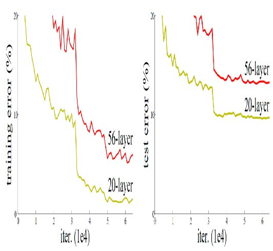

[^图14-1]: 不同深度网络的训练（由Kaiming He等人提供）

正如作者在此提及，他们并非首批注意到这一奇特现象的人。但他们率先实现了至关重要的突破：

> 让我们考虑一种较浅的架构及其更深的对应模型，后者在其基础上增加了更多层。通过构造方法，更深的模型存在解法：新增层为恒等映射，其余层则从已学习的较浅模型中复制而来。

由于这是一篇学术论文，该过程的描述方式较为晦涩，但其概念其实非常简单：从一个训练良好的20层神经网络开始，再添加36个完全不起作用的层（例如，它们可以是线性层，单个权重等于1，偏置等于0）。最终得到的56层网络与20层网络表现完全相同，这证明总存在深度网络能达到至少与任何浅层网络相当的性能。但出于某种原因，梯度下降法似乎无法找到这些深度网络。

> 术语：恒等映射
>
> 完全不改变输入内容就直接返回它。这个过程由一个恒等函数完成。

实际上，还有另一种创建额外36层的方法，它要有趣得多。如果我们将所有 `conv(x)` 替换为 `x + conv(x)` ，其中 `conv` 是上一章中添加二次卷积、ReLU激活函数和批量归一化层的函数，会怎样？此外，回顾批归一化层的运算公式：`gamma*y + beta` 。若将这些最终批归一化层的 `gamma` 初始化为零，则额外36层的 `conv(x)` 将始终等于零，意味着 `x+conv(x)` 永远等于 `x` 。

这给我们带来了什么？关键在于，这36个额外层目前是恒等映射（identity mapping,），但它们拥有参数，这意味着它们可被训练。因此我们可以先采用最优的20层模型，添加这36个初始状态为空的额外层，再对整个56层模型进行微调。这36个额外层就能学习到使其发挥最大效用的参数！

ResNet论文提出了一种变体方案，即跳过每隔一次的卷积操作，从而实质上得到 `x+conv2(conv1(x))` 的结构。如图14-2（摘自论文）所示。

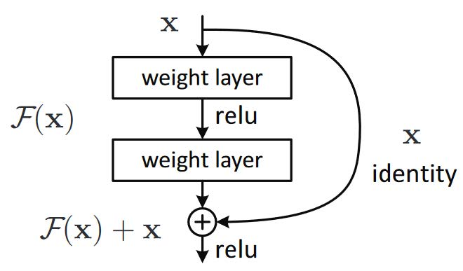

[^图14-2]: 一个简单的ResNet模块（由Kaiming He等人提供）

右侧的箭头仅表示 `x+conv2(conv1(x))` 中的 `x` 部分，称为恒等分支（identity branch）或跳跃连接。左侧路径则是 `conv2(conv1(x))` 部分。可将恒等路径理解为从输入到输出的直达通道。

在ResNet中，我们并非先训练较少层数，再在末端添加新层并进行微调。相反，我们全程使用如图14-2所示的ResNet模块构建卷积神经网络，这些模块采用常规方式从零初始化，并通过标准的随机梯度下降算法进行训练。我们依靠跳跃连接使网络更易于通过随机梯度下降进行训练。

还有另一种（基本等效的）方式来理解这些ResNet块。论文是这样描述的：

> 与其期望每几层堆叠层直接拟合期望的底层映射，我们明确让这些层拟合残差映射。形式上，将期望的底层映射记为 $H(x)$，我们让堆叠的非线性层拟合另一映射：$F(x) := H(x)−x$。原始映射被重构为 $F(x)+x$。我们假设优化残差映射比优化原始未参照映射更容易。极端情况下，若恒等映射为最优解，则将残差推至零比用非线性层堆叠拟合恒等映射更为简便。

再次强调，这段文字相当晦涩难懂——让我们尝试用通俗语言重新表述！假设某层的输出结果为x，而我们使用ResNet模块返回 `y = x + block(x)` ，此时我们并非要求该模块预测 `y` 值，而是要求它预测 `y` 与 `x` 之间的差异。因此这些模块的任务并非预测特定特征，而是最小化x与期望值y之间的误差。ResNet的优势在于能学习“不做任何操作”与“通过两个卷积层模块（含可训练权重）”之间的细微差异。其命名由来正是如此：它们预测的是残差（提醒：“残差”即预测值减去目标值）。

这两种思考ResNet的方式都共享一个关键概念：易学性。这是个重要的主题。回顾普适逼近定理，该定理指出足够大的网络能够学习任何事物。这一结论依然成立，但实际情况是：神经网络在理论上能学习的内容，与在现实数据和训练机制下易于学习的内容之间，存在着关键差异。过去十年神经网络的诸多突破，都如同ResNet模块的设计——它们实现了将理论上可行的方案转化为实际可操作方案的突破。

> 真实恒等路径
>
> 原始论文实际上并未在每个模块的最后一个批量归一化层中使用零作为 `gamma` 的初始值；这一技巧是在几年后才出现的。因此原始版本的ResNet在训练初期并未完全通过真实身份路径穿行于各ResNet模块，但具备“穿越”跳跃连接的能力确实显著提升了训练效果。添加批归一化 `gamma` 初始化技巧后，模型得以在更高的学习率下进行训练。

以下是简单ResNet模块的定义（由于 `norm_type=NormType.BatchZero` ，fastai将最后一个批量归一化层的 `gamma` 权重初始化为零）：

```python
class ResBlock(Module):
    def __init__(self, ni, nf):
        self.convs = nn.Sequential(
            ConvLayer(ni,nf),
            ConvLayer(nf,nf, norm_type=NormType.BatchZero))
        
    def forward(self, x): return x + self.convs(x)
```

然而这存在两个问题：它无法处理步长非1的情况，且要求 `ni==nf` 。请稍作停顿仔细思考为何会如此。

问题在于，当某个卷积层的步长为2时，输出激活值的网格尺寸将在每个轴上缩小至输入尺寸的一半。因此在 `forward` 时无法将结果累加回x，因为x与输出激活值的维度不匹配。当 `ni != nf` 时同样存在根本性问题：输入与输出连接的形状差异将导致无法进行加法运算。

要解决这个问题，我们需要一种方法来改变 `x` 的形状，使其与 `self.convs` 的结果匹配。将网格尺寸减半可以通过使用步长为2的平均池化层来实现：即一个从输入中提取2×2补丁并用其平均值替换它们的层。

改变通道数可通过卷积实现。但我们希望这种跳跃连接尽可能接近恒等映射，这意味着要使卷积尽可能简单。最简单的卷积是卷积核大小为1的卷积。这意味着卷积核尺寸为 `ni × nf × 1 × 1`，仅对每个输入像素的通道进行点积运算——完全不涉及像素间的组合。这种1x1卷积在现代卷积神经网络中广泛应用，请花点时间思考其工作原理。

> 术语：1x1卷积
>
> 一种卷积操作，其卷积核尺寸为1。

以下是一个利用这些技巧处理跳过连接中形状变化的ResBlock：

```python
def _conv_block(ni,nf,stride):
    return nn.Sequential(
        ConvLayer(ni, nf, stride=stride),
        ConvLayer(nf, nf, act_cls=None,
                  norm_type=NormType.BatchZero))
    
class ResBlock(Module):
    def __init__(self, ni, nf, stride=1):
        self.convs = _conv_block(ni,nf,stride)
        self.idconv = noop if ni==nf else ConvLayer(ni, nf,
                                                    1, act_cls=None)
        self.pool = noop if stride==1 else nn.AvgPool2d(2,
                                                        ceil_mode=True)
    def forward(self, x):
        return F.relu(self.convs(x) +
                      self.idconv(self.pool(x)))
```

请注意，我们在此使用了 `noop` 函数，该函数仅原样返回其输入（noop是计算机科学术语，代表“无操作”,no operation）。当 `nf==nf` 时，`idconv` 完全不执行任何操作；当 `stride==1` 时，`pool` 同样不执行任何操作——这正是我们在跳跃连接中所需的效果。

此外，你会发现我们已将ReLU函数（`act_cls=None`）从 `convs` 中的最后一个卷积层和 `idconv` 中移除，并将其移至添加跳跃连接之后。这样设计的思路是：整个ResNet模块相当于一个卷积层，而激活函数应位于卷积层之后。

让我们用 `ResBlock` 替换原 `block` 并进行测试：

```python
def block(ni,nf): return ResBlock(ni, nf, stride=2)
learn = get_learner(get_model())
```

```python
learn.fit_one_cycle(5, 3e-3)
```

| 迭代轮次 | 训练损失 | 验证损失 | 准确率   | 时间  |
| -------- | -------- | -------- | -------- | ----- |
| 0        | 1.973174 | 1.845491 | 0.373248 | 00:08 |
| 1        | 1.678627 | 1.778713 | 0.439236 | 00:08 |
| 2        | 1.386163 | 1.596503 | 0.507261 | 00:08 |
| 3        | 1.177839 | 1.102993 | 0.644841 | 00:09 |
| 4        | 1.052435 | 1.038013 | 0.667771 | 00:09 |

情况也好不到哪里去。但这一切的初衷本是让我们能够训练更深的模型，而我们目前尚未真正发挥其优势。要创建深度翻倍的模型，只需将原有 `block` 替换为两个连续的 `ResBlock` 即可：

```python
def block(ni, nf):
    return nn.Sequential(ResBlock(ni, nf, stride=2),
                         ResBlock(nf, nf))
```

```python
learn = get_learner(get_model())
learn.fit_one_cycle(5, 3e-3)
```

| 迭代轮次 | 训练损失 | 验证损失 | 准确率   | 时间  |
| -------- | -------- | -------- | -------- | ----- |
| 0        | 1.964076 | 1.864578 | 0.355159 | 00:12 |
| 1        | 1.636880 | 1.596789 | 0.502675 | 00:12 |
| 2        | 1.335378 | 1.304472 | 0.588535 | 00:12 |
| 3        | 1.089160 | 1.065063 | 0.663185 | 00:12 |
| 4        | 0.942904 | 0.963589 | 0.692739 | 00:12 |

现在我们进展顺利！

ResNet论文的作者们随后赢得了2015年ImageNet挑战赛。当时这无疑是计算机视觉领域最重要的年度赛事。我们已经见证过另一位ImageNet冠军：2013年的获胜者齐勒（Zeiler）和弗格斯（Fergus）。值得注意的是，这两次突破的起点都是实验观察：齐勒和弗格斯关注的是各层实际学习的内容，而ResNet作者则关注哪些类型的网络能够被训练。这种设计和分析深思熟虑的实验的能力，甚至仅仅是看到意外结果时说一句“嗯，这很有意思”，然后最重要的是，以极大的毅力着手弄清楚究竟发生了什么，正是许多科学发现的核心。深度学习正是如此。“嗯，这很有意思”，并最关键的是以极大毅力着手探究究竟发生了什么——正是许多科学发现的核心所在。深度学习不同于纯数学，它是一个高度实验性的领域，因此成为优秀的实践者而非仅是理论家至关重要。

自ResNet问世以来，该模型已被广泛研究并应用于多个领域。其中最具启发性的论文之一是Hao li等人2018年发表的 [《神经网络损失景观可视化》](https://oreil.ly/C9cFi) ，该研究表明跳跃连接有助于平滑损失函数，从而避免陷入陡峭区域，显著简化训练过程。图14-3展示了论文中令人惊叹的示意图，左侧呈现了梯度下降算法在优化常规卷积神经网络时需穿越的崎岖地形，右侧则是ResNet网络平滑的优化路径。


[^图14-3]: ResNet对损失景观的影响图（由Hao Li等人提供）

我们的首个模型已相当出色，但后续研究发现更多可提升其性能的技巧。接下来我们将探讨这些技巧。

#### 尖端ResNet

在 [《卷积神经网络图像分类技巧集》](https://oreil.ly/n-qhd) 一文中，Tong He等人研究了ResNet架构的变体，这些变体在参数数量或计算成本方面几乎不增加额外负担。通过采用改良的ResNet-50架构与混合训练技术，他们在ImageNet数据集上实现了94.6%的前五准确率（top-5 accuracy），而常规ResNet-50模型（未采用混合训练）仅为92.2%。该结果优于深度加倍（同时速度减半且过度拟合风险显著增加）的常规ResNet模型。

> 术语：前五准确率
>
> 一种衡量目标标签出现在模型前5预测中的频率的指标。该指标在ImageNet竞赛中被采用，因为许多图像包含多个物体，或包含易混淆的物体，甚至可能被贴上相似的错误标签。在这些情况下，仅考察第一位准确率可能不够恰当。但随着卷积神经网络性能的显著提升，如今第一位准确率已接近100%，因此部分研究者开始将第一位准确率应用于ImageNet评估。

我们将使用这个调整后的版本来扩展到完整的ResNet，因为它表现明显更优。它与之前的实现略有不同：它并非直接从ResNet模块开始，而是先放置几个卷积层，随后接一个最大池化层。这就是网络前端（称为网络主干（stem））的结构：

```python
def _resnet_stem(*sizes):
    return [
        ConvLayer(sizes[i], sizes[i+1], 3, stride = 2 if
                  i==0 else 1)
        for i in range(len(sizes)-1)
    ] + [nn.MaxPool2d(kernel_size=3, stride=2, padding=1)]
    
_resnet_stem(3,32,32,64)
```

```text
[ConvLayer(
(0): Conv2d(3, 32, kernel_size=(3, 3), stride=(2, 2),
padding=(1, 1))
(1): BatchNorm2d(32, eps=1e-05, momentum=0.1)
(2): ReLU()
), ConvLayer(
(0): Conv2d(32, 32, kernel_size=(3, 3), stride=(1, 1),
padding=(1, 1))
(1): BatchNorm2d(32, eps=1e-05, momentum=0.1)
(2): ReLU()
), ConvLayer(
(0): Conv2d(32, 64, kernel_size=(3, 3), stride=(1, 1),
padding=(1, 1))
(1): BatchNorm2d(64, eps=1e-05, momentum=0.1)
(2): ReLU()
), MaxPool2d(kernel_size=3, stride=2, padding=1,
ceil_mode=False)]
```

> 术语：主干
>
> 卷积神经网络的最初几层。通常情况下，主干部分的结构与卷积神经网络主体不同。

我们采用纯卷积层主干而非ResNet模块的原因，源于对所有深度卷积神经网络的一个重要认识：绝大多数计算都发生在早期层。因此，我们应当尽可能保持早期层的快速与简洁。

要理解为何早期层需要如此多的计算，请考虑对128像素输入图像进行首次卷积时的情况。若采用步长为1的卷积，则需将卷积核应用于128×128像素中的每个像素点——这将产生大量运算！然而在后续层中，网格尺寸可能缩小至4×4甚至2×2，因此需要执行的卷积核应用次数大幅减少。

另一方面，第一层卷积仅有3个输入特征和32个输出特征。由于采用3×3卷积核，其权重参数为3×32×3×3=864个。但最后一层卷积将拥有256个输入特征和512个输出特征，由此产生的权重参数高达1,179,648个！因此前几层承担了绝大多数计算量，而最后几层则占据了绝大多数参数。

ResNet模块比普通卷积模块消耗更多计算资源，因为（在步长为2的情况下）ResNet模块包含三个卷积层和一个池化层。这就是为什么我们希望在ResNet的开头使用普通卷积层。

现在我们准备展示现代ResNet的实现方式，采用“技巧袋”策略。它使用四组ResNet模块，分别配备64、128、256和512个滤波器。每组模块均以步长为2的模块开头，唯独第一组例外——因为它紧接在最大池化层之后：

```python
class ResNet(nn.Sequential):
    def __init__(self, n_out, layers, expansion=1):
        stem = _resnet_stem(3,32,32,64)
        self.block_szs = [64, 64, 128, 256, 512]
        for i in range(1,5): self.block_szs[i] *= expansion
        blocks = [self._make_layer(*o) for o in
                  enumerate(layers)]
        super().__init__(*stem, *blocks,
                         nn.AdaptiveAvgPool2d(1), Flatten(),
                         nn.Linear(self.block_szs[-1],
                                   n_out))
        
    def _make_layer(self, idx, n_layers):
        stride = 1 if idx==0 else 2
        ch_in,ch_out = self.block_szs[idx:idx+2]
        return nn.Sequential(*[
            ResBlock(ch_in if i==0 else ch_out, ch_out,
                     stride if i==0 else 1)
            for i in range(n_layers)
        ])
```

 `_make_layer` 函数的作用是创建一系列 `n_layers` 块。第一个块从 `ch_in` 到 `ch_out` ， `stride` 为指定值；其余均为步长为1的块，张量从 `ch_out` 到 `ch_out` 。定义完这些块后，模型就完全是顺序的，因此我们将其定义为 `nn.Sequential` 的子类。（暂时忽略展开参数；我们将在下一节讨论它。目前该参数设为1，因此不产生任何作用。）

各种版本的模型（ResNet-18、-34、-50等）仅改变了这些组中每个块的数量。这是ResNet-18的定义：

```python
rn = ResNet(dls.c, [2,2,2,2])
```

让我们训练它一会儿，看看它与前一个模型的表现如何：

```python
learn = get_learner(rn)
learn.fit_one_cycle(5, 3e-3)
```

| 迭代轮次 | 训练损失 | 验证损失 | 准确率   | 时间  |
| -------- | -------- | -------- | -------- | ----- |
| 0        | 1.673882 | 1.828394 | 0.413758 | 00:13 |
| 1        | 1.331675 | 1.572685 | 0.518217 | 00:13 |
| 2        | 1.087224 | 1.086102 | 0.650701 | 00:13 |
| 3        | 0.900428 | 0.968219 | 0.684331 | 00:12 |
| 4        | 0.760280 | 0.782558 | 0.757197 | 00:12 |

尽管我们拥有更多通道（因此模型精度更高），但得益于优化的主干处理机制，训练速度与之前同样高效。

为使模型深度增加而不消耗过多计算资源或内存，我们可以采用ResNet论文中为深度达50层及以上的ResNet提出的另一种层：瓶颈层（bottleneck layer）。

#### 瓶颈层

与堆叠两个卷积层（卷积核尺寸为3）不同，瓶颈层采用三层卷积：两层1×1卷积（位于首尾两端）和一层3×3卷积，如图14-4右侧所示。

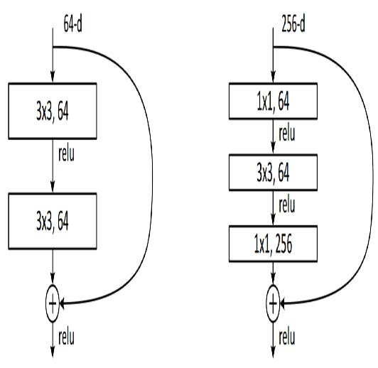

[^图14-4]: 常规和瓶颈ResNet模块的比较（由He Kaiming等人提供）

为什么这样做有帮助？1×1卷积速度更快，因此即使这个设计看似更复杂，该模块的执行速度仍快于我们之前看到的第一个ResNet模块。这使得我们可以使用更多滤波器：如图所示，输入和输出的滤波器数量增加了四倍（256个而非64个）。1×1卷积先缩减再恢复通道数（故得名瓶颈卷积）。总体效果是我们在相同时间内能使用更多滤波器。

让我们尝试用这个瓶颈设计替换我们的 `ResBlock`：

```python
def _conv_block(ni,nf,stride):
    return nn.Sequential(
        ConvLayer(ni, nf//4, 1),
        ConvLayer(nf//4, nf//4, stride=stride),
        ConvLayer(nf//4, nf, 1, act_cls=None,
                  norm_type=NormType.BatchZero))
```

我们将以此创建一个分组尺寸为( `3,4,6,3` )的ResNet-50网络。现在需要将 `4` 传递给ResNet的 `expansion` 参数，因为我们需要从四倍少的通道开始，最终得到四倍多的通道。

像这样更深的网络在仅训练5个迭代轮次时通常不会显示改进，因此这次我们将训练周期延长至20个迭代轮次，以充分发挥更大模型的潜力。为了获得真正出色的结果，我们还应使用更大尺寸的图像：

```python
dls = get_data(URLs.IMAGENETTE_320, presize=320, resize=224)
```

我们无需为更大的224像素图像做任何额外处理；得益于全卷积网络，它能自动适应。这也解释了为何我们在书中早期就能实现渐进式缩放（progressive resizing）——所用模型均为全卷积结构，甚至能对不同尺寸训练的模型进行微调。现在我们可以训练模型并观察效果：

```python
rn = ResNet(dls.c, [3,4,6,3], 4)
```

```python
learn = get_learner(rn)
learn.fit_one_cycle(20, 3e-3)
```

| 迭代轮次 | 训练损失 | 验证损失 | 准确率   | 时间  |
| -------- | -------- | -------- | -------- | ----- |
| 0        | 1.613448 | 1.473355 | 0.514140 | 00:31 |
| 1        | 1.359604 | 2.050794 | 0.397452 | 00:31 |
| 2        | 1.253112 | 4.511735 | 0.387006 | 00:31 |
| 3        | 1.133450 | 2.575221 | 0.396178 | 00:31 |
| 4        | 1.054752 | 1.264525 | 0.613758 | 00:32 |
| 5        | 0.927930 | 2.670484 | 0.422675 | 00:32 |
| 6        | 0.838268 | 1.724588 | 0.528662 | 00:32 |
| 7        | 0.748289 | 1.180668 | 0.666497 | 00:31 |
| 8        | 0.688637 | 1.245039 | 0.650446 | 00:32 |
| 9        | 0.645530 | 1.053691 | 0.674904 | 00:31 |
| 10       | 0.593401 | 1.180786 | 0.676433 | 00:32 |
| 11       | 0.536634 | 0.879937 | 0.713885 | 00:32 |
| 12       | 0.479208 | 0.798356 | 0.741656 | 00:32 |
| 13       | 0.440071 | 0.600644 | 0.806879 | 00:32 |
| 14       | 0.402952 | 0.450296 | 0.858599 | 00:32 |
| 15       | 0.359117 | 0.486126 | 0.846369 | 00:32 |
| 16       | 0.313642 | 0.442215 | 0.861911 | 00:32 |
| 17       | 0.294050 | 0.485967 | 0.853503 | 00:32 |
| 18       | 0.270583 | 0.408566 | 0.875924 | 00:32 |
| 19       | 0.266003 | 0.411752 | 0.872611 | 00:32 |

我们现在取得了非常好的结果！试试添加混淆器，然后训练一百个迭代轮次——趁你去吃午饭的时候。你将获得一个从零开始训练的、非常精确的图像分类器。

我们在此展示的瓶颈设计通常仅用于ResNet-50、-101和-152模型。ResNet-18和-34模型通常采用前文所述的非瓶颈设计。然而我们发现，即使在较浅的网络中，瓶颈层通常也能发挥更佳效果。这恰恰说明论文中的细微设计往往能沿用多年——即便并非最优方案！质疑既定假设和“众所周知的事实”始终是明智之举，因为这个领域仍处于发展初期，许多细节尚未完善。

### 总结

你现在已经了解了自第一章以来我们用于计算机视觉的模型是如何构建的，它们通过跳跃连接使更深层的模型得以训练。尽管已有大量研究致力于探索更优架构，但所有方案都以不同形式运用这一技巧，为输入到网络末端的传播开辟直通路径。在迁移学习中，ResNet作为预训练模型发挥核心作用。下一章我们将深入剖析，这些模型如何基于ResNet构建的最终细节。

### 问卷调查

1. 在前几章用于MNIST的卷积神经网络中，我们如何得到单个激活向量？为什么它不适用于Imagenette数据集？
2. 对于Imagenette数据集，我们采取了什么替代方案？
3. 什么是自适应池化？
4. 什么是平均池化？
5. 为什么在自适应平均池化层后需要Flatten操作？
6. 什么是跳跃连接？
7. 跳跃连接为何能支持更深层模型的训练？
8. 图14-1展示了什么？如何由此产生跳跃连接的构想？
9. 什么是恒等映射？
10. ResNet模块的基本方程是什么（忽略批量归一化和ReLU层）？
11. ResNet与残差有何关联？
12. 当存在步长为2的卷积时，如何处理跳跃连接？当滤波器数量变化时又如何处理？
13. 如何用向量点积表示1×1卷积？
14. 使用 `F.conv2d` 或 `nn.Conv2d` 创建1×1卷积并应用于图像，图像的形状会发生什么变化？
15. `noop` 函数返回什么值？
16. 解释图14-3所示内容。
17. 何时前五名准确率优于榜首准确率？
18. 卷积神经网络的主干指什么？
19. 为何在卷积神经网络主干中使用普通卷积而非ResNet模块？
20. 瓶颈模块与普通ResNet模块有何区别？
21. 瓶颈模块为何运行速度更快？
22. 全卷积网络（及采用自适应池化的网络）如何实现渐进式尺寸调整？

#### 进一步研究

1. 尝试为MNIST数据集创建一个采用自适应平均池化的全卷积网络（注意此时需要更少的步长为2的卷积层）。与不包含此类池化层的网络相比，其效果如何？
2. 第17章将介绍爱因斯坦求和符号。你可以先跳至相关章节了解原理，再使用 `torch.einsum` 实现1×1卷积操作，并与 `torch.conv2d` 实现的同类操作进行对比。

3. 使用纯PyTorch或纯Python编写前五名准确率函数。
4. 在Imagenette数据集上进行更多轮训练，分别测试启用和禁用标签平滑的效果。查看Imagenette排行榜，观察你的结果能接近榜首成绩到什么程度。阅读相关链接页面，了解领先方法的具体描述。

## 15. 深度解析应用程序架构

我们现在处于一个令人振奋的阶段，你应该可以全面理解我们用于计算机视觉、自然语言处理和表格分析等尖端模型的架构了。在本章中，我们将填补关于fastai应用模型运作机制的所有细节空白，并向你展示如何构建这些模型。

我们还将回顾第11章中为孪生网络设计的自定义数据预处理管道，并演示如何利用fastai库中的组件为新任务构建定制化的预训练模型。

我们将从计算机视觉开始。

### 计算机视觉

对于计算机视觉应用，我们根据任务需求使用 `cnn_learner` 和 `unet_learner` 函数构建模型。本节将探讨如何构建本书第一、二部分中使用的 `Learner` 对象。

#### `cnn_learner`

让我们看看使用 `cnn_learner` 函数时会发生什么。首先，我们向该函数传递一个用于构建网络主体的架构。大多数情况下，我们会使用 ResNet，而你已经知道如何创建它，因此无需深入探讨。预训练权重会按需下载并加载到 ResNet 中。

然后，对于迁移学习，需要对网络进行裁剪（cut）。这指的是切除最终层——该层仅负责ImageNet特有的分类任务。实际上，我们不仅切除这一层，而是从自适应平均池化层开始的所有层。其原因稍后将变得清晰。由于不同架构可能采用不同类型的池化层，甚至完全不同的头部结构，我们并非仅通过寻找自适应池化层来决定预训练模型的切割点。而是为每个模型准备了一份信息字典，用于确定其主体结束与头部开始的位置。我们称之为 `model_meta` ——以下是ResNet50的对应信息：

```python
model_meta[resnet50]
```

```text
{'cut': -2,
'split': <function fastai.vision.learner._resnet_split(m)>,
'stats': ([0.485, 0.456, 0.406], [0.229, 0.224, 0.225])}
```

> 术语：（神经网络的）躯干与头部
>
> 神经网络的头部是专门处理特定任务的部分。对于卷积神经网络，通常指自适应平均池化层之后的部分。躯干则涵盖其余所有部分，包括主干（我们在第14章中已学习过）。

如果我们取 `-2` 切割点之前的全部层，就能得到模型中fastai将保留用于迁移学习的部分。现在，我们添加新的头部。这是通过 `create_head` 函数创建的：

```python
create_head(20,2)
```

```text
Sequential(
(0): AdaptiveConcatPool2d(
(ap): AdaptiveAvgPool2d(output_size=1)
(mp): AdaptiveMaxPool2d(output_size=1)
)
(1): Flatten()
(2): BatchNorm1d(20, eps=1e-05, momentum=0.1, affine=True)
(3): Dropout(p=0.25, inplace=False)
(4): Linear(in_features=20, out_features=512, bias=False)
(5): ReLU(inplace=True)
(6): BatchNorm1d(512, eps=1e-05, momentum=0.1,
affine=True)
(7): Dropout(p=0.5, inplace=False)
(8): Linear(in_features=512, out_features=2, bias=False)
)
```

通过这个函数，你可以选择在末端添加多少个额外的线性层，每个层后应用多少比例的dropout，以及使用何种池化方式。默认情况下，fastai会同时应用平均池化和最大池化，并将两者进行拼接（即 `AdaptiveConcatPool2d` 层）。这种方法虽不常见，但近年来在fastai及其他研究机构独立开发，相较于仅使用平均池化，通常能带来小幅性能提升。

fastai 与大多数库略有不同，其默认在卷积神经网络头部添加两个线性层而非一个。正如我们所见，原因在于即使将预训练模型迁移到差异极大的领域时，迁移学习仍可能发挥作用。然而仅使用单个线性层往往难以满足此类场景需求；实践表明采用双线性层能使迁移学习在更多情境下更快速、更便捷地应用。

> 最后一批归一化
>
> 值得关注的 `create_head` 参数是 `bn_final`。将其设为 `True` 将使批量归一化层作为最终层添加。这有助于模型根据输出激活值进行合理缩放。目前尚未见此方法在文献中发表，但实践中我们发现它在所有应用场景中效果良好。

现在让我们看看 `unet_learner` 在第1章展示的分割问题中做了什么。

#### `unet_learner`

深度学习中最引人入胜的架构之一，正是我们在第一章用于分割任务的那种。图像分割是一项极具挑战性的任务，因为其输出本质上是一张图像——或者说一个像素网格，其中每个像素都承载着预测标签。其他任务也采用类似基本设计，例如提升图像分辨率（超分辨率）、为黑白图像上色（着色），或将照片转化为合成画作（风格迁移）——本书在线章节将涵盖这些任务，请务必在本章阅读后查阅。在每种情况下，我们都是从一张图像出发，将其转换为另一张尺寸或宽高比相同的图像，但像素经过某种方式的改变。我们称这些为生成式视觉模型。

我们的做法是采用与上一节完全相同的CNN头部开发方法。例如，我们从ResNet开始，切除自适应池化层及其之后的所有层，然后用自定义头部替换这些层，该头部负责生成任务。

上一句里有太多模糊处理了！我们究竟该如何创建一个能生成图像的卷积神经网络头部？假设我们从一张224像素的输入图像开始，经过ResNet主干网络处理后，最终得到的是一组7×7的卷积激活值网格。如何将这些激活值转换成224像素的分割掩膜？

当然，我们使用神经网络来实现！因此需要某种层来增加卷积神经网络的网格尺寸。一种简单方法是将7×7网格中的每个像素替换为2×2方格中的四个像素。这四个像素将具有相同值——这被称为最近邻插值（nearest neighbor interpolation）。PyTorch提供了一个实现此功能的层，因此可选方案是创建一个包含步长为1的卷积层（例如常包含批归一化和ReLU层）的头部，并在其中穿插2×2最近邻插值层。事实上，你现在就可以尝试！尝试创建一个基于此设计的自定义头部，并在CamVid分割任务上测试。你将发现结果尚可，尽管不如第一章的测试效果出色。

另一种方法是用转置卷积（transposed convolution，也称为半步长卷积，stride half convolution）替代最近邻和卷积组合。该方法与常规卷积完全相同，但会在输入图像所有像素间插入零填充。通过图示最易理解——图15-1摘自第13章讨论的优秀卷积运算论文，展示了3×3转置卷积应用于3×3图像的示意图。

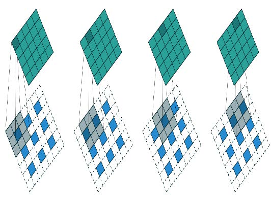

[^图15-1]: 转置卷积（由Vincent Dumoulin和Francesco Visin提供）

如你所见，此操作将增加输入数据的尺寸。你现在可通过fastai的 `ConvLayer` 类进行验证：在自定义头部中传入参数 `transpose=True` ，即可创建转置卷积层替代常规卷积层。

然而，这两种方法都效果不佳。问题在于，我们的7×7网格根本没有足够的信息来生成224×224像素的输出。这要求每个网格单元的激活值必须包含足够的信息，才能完整地重构输出中的每个像素——这要求实在太高了。

解决方案是采用跳跃连接，类似于ResNet网络，但将连接从ResNet主体部分的激活层直接跳转至架构另一侧的转置卷积激活层。如图15-2所示，该方法由Olaf Ronneberger等人于2015年在论文 [《U-Net：用于生物医学图像分割的卷积神经网络》](https://oreil.ly/6ely4) 中提出。尽管该论文聚焦于医学应用，但U-Net彻底革新了各类生成式视觉模型。


[^图15-2]: U-Net架构（由Olaf Ronneberger、Philipp Fischer和Thomas Brox提出）

左侧展示的是卷积神经网络的主体结构（此处采用的是常规卷积神经网络而非ResNet，且使用2×2最大池化替代步长为2的卷积，因为该论文撰写时ResNet尚未出现），右侧则是转置卷积层（“上卷积”，up-conv）。额外的跳跃连接以灰箭头形式从左向右贯穿（有时称为交叉连接，cross connections）。由此可见为什么它被称为U-Net！

在此架构中，转置卷积的输入不仅包含前一层的低分辨率网格，还包含ResNet头部的更高分辨率网格。这使得U-Net能够根据需求利用原始图像的所有信息。U-Net面临的一个挑战是其具体架构取决于图像尺寸。fastai提供独特的 `DynamicUnet` 类，可根据输入数据自动生成适配尺寸的架构。

现在让我们聚焦于一个示例，其中我们将利用 fastai 库来编写自定义模型。

#### 孪生神经网络

让我们回到第11章为孪生网络设置的输入管道。如你所知，它包含一对图像，标签为 `True` 或 `False` ，取决于它们是否属于同一类别。

基于刚才所见内容，让我们为该任务构建一个自定义模型并进行训练。具体如何操作？我们将使用预训练架构，将两张图像输入其中。随后可将结果拼接后送入自定义头部，该头部将返回两个预测结果。在模块层面，其结构如下所示：

```python
class SiameseModel(Module):
    def __init__(self, encoder, head):
        self.encoder,self.head = encoder,head
        
    def forward(self, x1, x2):
        ftrs = torch.cat([self.encoder(x1),
                          self.encoder(x2)], dim=1)
        return self.head(ftrs)
```

要创建我们的编码器，只需像之前所述那样，取一个预训练模型并进行裁剪。`create_body` 函数会为我们完成这项工作，我们只需传入裁剪位置即可。如前所述，根据预训练模型的元数据字典，ResNet模型的裁剪值为 `-2` ：

```python
encoder = create_body(resnet34, cut=-2)
```

然后我们可以创建我们的头部。观察编码器可知，最后一层有512个特征，因此这个头部需要接收 `512×4` 个输入。为什么是4？首先我们需要乘以2，因为我们有两张图像。然后由于我们使用了concat-pool技巧，还需要再乘以2。因此我们按以下方式创建头部：

```python
head = create_head(512*4, 2, ps=0.5)
```

借助我们的编码器和头部，现在我们可以构建模型：

```python
model = SiameseModel(encoder, head)
```

在使用 `Learner` 之前，我们还需要定义两件事。首先，我们必须定义要使用的损失函数。它采用常规的交叉熵，但由于目标值是布尔值，我们需要将其转换为整数，否则PyTorch会抛出错误：

```python
def loss_func(out, targ):
    return nn.CrossEntropyLoss()(out, targ.long())
```

更重要的是，要充分利用迁移学习，我们需要定义一个自定义分割器（splitter）。分割器是一个函数，用于告知fastai库如何将模型拆分为参数组。这些参数组在迁移学习过程中被用于后台操作，仅训练模型的头部参数。

这里我们需要两个参数组：一个用于编码器，一个用于头部。因此我们可以定义以下拆分器（ `params` 只是一个返回给定模块所有参数的函数）：

```python
def siamese_splitter(model):
    return [params(model.encoder), params(model.head)]
```

然后我们可以传递数据、模型、损失函数、分割器以及任何所需的指标来定义 `Learner` 。由于我们没有使用fastai提供的转移学习便捷函数（如 `cnn_learner` ），必须手动调用 `learn.freeze` 方法。这将确保仅训练最后一个参数组（本例中为头部参数）。

```python
learn = Learner(dls, model, loss_func=loss_func,
                splitter=siamese_splitter, metrics=accuracy)

learn.freeze()
```

然后我们可以直接用常规方法训练模型：

```python
learn.fit_one_cycle(4, 3e-3)
```

| 迭代轮次 | 训练损失 | 验证损失 | 准确率   | 时间  |
| -------- | -------- | -------- | -------- | ----- |
| 0        | 0.367015 | 0.281242 | 0.885656 | 00:26 |
| 1        | 0.307688 | 0.214721 | 0.915426 | 00:26 |
| 2        | 0.275221 | 0.170615 | 0.936401 | 00:26 |
| 3        | 0.223771 | 0.159633 | 0.943843 | 00:26 |

现在我们解冻模型，并使用鉴别性学习率（即主体采用较低学习率，头部采用较高学习率）对整个模型进行进一步微调：

```python
learn.unfreeze()
learn.fit_one_cycle(4, slice(1e-6,1e-4))
```

| 迭代轮次 | 训练损失 | 验证损失 | 准确率   | 时间  |
| -------- | -------- | -------- | -------- | ----- |
| 0        | 0.212744 | 0.159033 | 0.944520 | 00:35 |
| 1        | 0.201893 | 0.159615 | 0.942490 | 00:35 |
| 2        | 0.204606 | 0.152338 | 0.945196 | 00:36 |
| 3        | 0.213203 | 0.148346 | 0.947903 | 00:36 |

当我们考虑到采用相同训练方式（未进行数据增强）的分类器错误率高达7%时，94.8%的表现已经非常不错了。

既然我们已经了解了如何创建完整的尖端计算机视觉模型，接下来让我们转向自然语言处理领域。

### 自然语言处理

将AWD-LSTM语言模型转换为迁移学习分类器，就像我们在第10章所做的那样，其过程与本章第一部分对 `cnn_learner` 的操作极为相似。此处无需“元”（meta）字典，因为主体部分无需支持多种架构。我们只需为语言模型的编码器选择堆叠式循环神经网络（单个PyTorch模块）。该编码器将为输入的每个单词提供激活值，因为语言模型需要对每个后续单词进行预测输出。

要据此创建分类器，我们采用ULMFiT论文中描述的“文本分类的批量推导时间传递（BPT3C）”方法：

> 我们将文档划分为固定长度为b的批次。在每个批次的开头，模型会根据前一批次的最终状态进行初始化；我们记录用于均值池化和最大池化的隐藏状态；梯度会反向传播至那些隐藏状态对最终预测产生影响的批次。实际操作中，我们采用可变长度的反向传播序列。

换言之，分类器包含一个 `for` 循环，用于遍历序列中的每批数据。状态在批次间保持不变，且每批次的激活值均被存储。最终，我们采用与计算机视觉模型相同的平均与最大值拼接池化技巧——但这次并非对卷积神经网络的网格单元进行池化，而是对递归神经网络序列进行池化。

对于这个 `for` 循环，我们需要分批收集数据，但每个文本都需要单独处理，因为它们各自带有不同的标签。然而，这些文本的长度很可能不尽相同，这意味着我们无法像处理语言模型那样将它们全部放入同一个数组中。

填充机制正是在此发挥作用：当抓取大量文本时，我们会确定最长文本的长度，然后用名为xxpad的特殊标记填充较短文本。为避免极端情况——例如同一批次中存在2000个词元的文本与仅10个词元的文本（导致大量填充操作和计算资源浪费），我们通过调整随机性确保相似长度的文本被分组处理。训练集中的文本顺序仍保留一定随机性（验证集可按长度排序），但并非完全随机。

这是在创建 `DataLoaders` 时，由fastai库在后台自动完成的。

### 表格化

最后，我们来看看 `fastai.tabular` 模型。（我们无需单独研究协同过滤模型，因为我们已经了解到这些模型要么就是表格模型，要么采用点积方法——而我们之前已经从头实现了这种方法。）

以下是 TabularModel 的 `forward` 方法：

```python
if self.n_emb != 0:
    x = [e(x_cat[:,i]) for i,e in enumerate(self.embeds)]
    x = torch.cat(x, 1)
    x = self.emb_drop(x)
if self.n_cont != 0:
    x_cont = self.bn_cont(x_cont)
    x = torch.cat([x, x_cont], 1) if self.n_emb != 0 else
    x_cont
return self.layers(x)
```

我们在此不展示 `__init__` 方法，因其内容较为简单，但将依次向前分析每行代码。首行仅用于检测是否存在嵌入数据——若仅处理连续变量，可跳过此部分：

```python
if self.n_emb != 0:
```

`self.embeds` 包含嵌入矩阵，因此这将获取每个元素的激活值。

```python
	x = [e(x_cat[:,i]) for i,e in enumerate(self.embeds)]
```

并将它们连接成一个张量：

```python
	x = torch.cat(x, 1)
```

然后应用了dropout机制。你可以通过将 `emb_drop` 传递给 `__init__` 来更改此值：

```python
	x = self.emb_drop(x)
```

现在我们测试是否存在需要处理的连续变量：

```python
if self.n_cont != 0:
```

它们被传递到一个批量归一化层

```	python
	x_cont = self.bn_cont(x_cont)
```

并与嵌入激活值（若有的话）进行连接：

```python
	x = torch.cat([x, x_cont], 1) if self.n_emb != 0 else
x_cont
```

最后，该输入通过线性层进行处理（若 `use_bn` 为 `True`，则每个线性层包含批量归一化；若 `ps` 被设置为某个值或值列表，则包含dropout）：

```python
return self.layers(x)
```

恭喜！现在你已经掌握了fastai库中使用的所有架构细节！

### 总结

正如你所见，深度学习架构的细节如今无需令你望而生畏。你可以深入查看fastai和PyTorch的代码，亲眼见证其运作机制。更重要的是，你得尝试理解这些机制背后的原理。你可以查阅代码中引用的论文，尝试理解代码如何与论文描述的算法相匹配。

现在我们已经研究了模型的所有组成部分以及传入其中的数据，可以思考这对实际深度学习意味着什么。若拥有无限数据、无限内存和无限时间，建议很简单：用所有数据对巨型模型进行长时间训练。但深度学习之所以复杂，恰恰在于数据、内存和时间通常都存在限制。若内存或时间即将耗尽，解决方案是训练更小的模型；若训练时间不足以达到过拟合状态，则意味着未能充分发挥模型的潜力。

因此，第一步是达到可能出现过拟合的程度。然后问题在于如何减少这种过拟合。图15-3展示了我们建议从该阶段开始优先执行的步骤。


[^图15-3]: 减少过拟合的步骤

许多从业者在面对过拟合模型时，往往从这张图的错误起点开始。他们的第一反应是采用更小的模型或增加正则化。除非模型训练耗费过多时间或内存，否则缩小模型规模绝对应该是最后采取的措施。模型规模的缩减会削弱其捕捉数据中微妙关联的能力。

相反，你首先应该寻求创造更多数据。这可能包括：为现有数据添加更多标签；寻找模型可解决的额外任务（或者换个角度思考，识别可建模的不同类型标签）；或通过更多或不同的数据增强技术创建额外的合成数据。得益于Mixup算法及类似方法的发展，如今几乎所有类型的数据都能实现有效的数据增强。

当你收集到认为合理可得的最大数据量，并通过利用所有可获取的标签及实施所有合理的数据增强手段来最大限度地发挥数据效能后，若仍出现过拟合现象，则应考虑采用更具泛化能力的架构。例如，添加批量归一化可能有助于提升泛化能力。

若在充分利用数据并优化架构后仍出现过拟合，可考虑采用正则化技术。通常在最后一层或两层添加dropout能有效正则化模型。但正如我们从AWD-LSTM发展历程所知，在模型各层添加不同类型的dropout往往能获得更显著效果。总体而言，正则化更强的较大模型通常更具灵活性，因此相较于正则化较弱的小型模型，其预测精度往往更高。

只有在考虑过所有这些方案后，我们才会建议你尝试使用更小版本的架构。

### 问卷调查

1. 神经网络的头部是什么？
2. 神经网络的主体是什么？
3. 什么是神经网络的“切割”？为什么在迁移学习中需要这样做？
4. `model_meta` 是什么？尝试打印它以查看内部内容。
5. 阅读 `create_head` 的源代码，确保理解每行代码的作用。
6. 观察 `create_head` 的输出结果，确保理解每层存在的意义，以及 `create_head` 源代码如何生成这些层。
7. 探索如何修改 `create_cnn` 生成的dropout参数、层尺寸及层数，尝试寻找能提升宠物识别器准确率的参数组合。
8. `AdaptiveConcatPool2d` 的功能是什么？
9. 最近邻插值法是什么？如何将其用于卷积激活值的上采样？
10. 转置卷积是什么？其别称是什么？
11. 使用 `transpose=True` 创建转置卷积层，并将其应用于图像。检查输出形状。
12. 绘制U-Net网络架构图。
13. 文本分类的反向传播时间推延（BPT3C）是什么？
14. BPT3C中如何处理不同长度的序列？
15. 尝试在笔记本中分别运行 `TabularModel.forward` 的每行代码（每行代码单独占用一个单元格），并观察各步骤的输入输出形状。
16. `TabularModel` 中 `self.layers` 如何定义？
17. 防止过拟合的五个步骤是什么？
18. 为什么在尝试其他防止过拟合的方法前，不先降低架构复杂度？

#### 进一步研究

1. 编写自定义头部模型，尝试用它训练宠物识别器。看看能否获得比fastai默认模型更好的效果。
2. 在卷积神经网络头部中切换使用 `AdaptiveConcatPool2d` 和 `AdaptiveAvgPool2d` ，观察其效果差异。
3. 为每个ResNet模块编写自定义分割器创建独立参数组，并将主干单独分组。尝试训练后观察宠物识别器的性能提升。
4. 阅读关于生成式图像模型的在线章节，尝试为每个ResNet模块创建独立参数组，并将主干单独分组。尝试训练后观察宠物识别器的性能提升。参数组，并为茎部单独创建一个组。尝试用它进行训练，看看是否能提高宠物识别器的性能。

5. 阅读关于生成式图像模型的在线章节，并创建你自己的着色器、超分辨率模型或风格迁移模型。
6. 使用最近邻插值创建自定义头部，并用它对CamVid进行分割。

## 16. 训练过程

现在你已经掌握了如何为计算机视觉、自然图像处理、表格分析和协同过滤创建尖端架构，并懂得如何快速训练它们。那么我们完成了吗？还差一点。我们还需要进一步探索训练过程中的某些细节。

我们在第4章阐述了随机梯度下降的基础原理：将小批量数据传递给模型，通过损失函数将其与目标值进行比较，随后计算该损失函数对每个权重的梯度，最后使用公式更新权重：

```python
new_weight = weight - lr * weight.grad
```

我们从头开始在训练循环中实现了这一过程，并发现PyTorch提供了一个简单的 `nn.SGD` 类，它能为我们完成每个参数的计算。在本章中，我们将基于灵活的基础架构构建更高效的优化器。但这并非我们在训练过程中可能需要调整的全部内容。针对训练循环的任何调整，我们都需要一种方式在 SGD 基础架构中插入代码。fastai 库通过回调系统实现这一功能，我们将全面讲解其使用方法。

首先采用标准的梯度下降法作为基准模型，随后我们将介绍最常用的优化器。

### 建立基准模型

首先我们将使用普通的SGD创建基准模型，并与fastai的默认优化器进行比较。我们将从获取Imagenette数据集开始，使用与第14章相同的 `get_data` 函数：

```python
dls = get_data(URLs.IMAGENETTE_160, 160, 128)
```

我们将创建一个未预训练的ResNet-34模型，并传递接收到的任何参数：

```python
def get_learner(**kwargs):
    return cnn_learner(dls, resnet34, pretrained=False,
                       metrics=accuracy, **kwargs).to_fp16()
```

以下是默认的fastai优化器，采用常规的3e-3学习率：

```python
learn = get_learner()
learn.fit_one_cycle(3, 0.003)
```

| 迭代轮次 | 训练损失 | 验证损失 | 准确率   | 时间  |
| -------- | -------- | -------- | -------- | ----- |
| 0        | 2.571932 | 2.685040 | 0.322548 | 00:11 |
| 1        | 1.904674 | 1.852589 | 0.437452 | 00:11 |
| 2        | 1.586909 | 1.374908 | 0.594904 | 00:11 |

现在我们尝试使用普通的SGD。我们可以将 `opt_func`（优化函数）传递给  `cnn_learner`，让fastai使用任意优化器：

```python
learn = get_learner(opt_func=SGD)
```

首先要查看的是 `lr_find`：

```python
learn.lr_find()
```

```text
(0.017378008365631102, 3.019951861915615e-07)
```

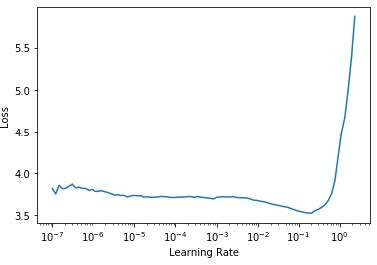

看来我们需要使用比平时更高的学习率：

```python
learn.fit_one_cycle(3, 0.03, moms=(0,0,0))
```

| 迭代轮次 | 训练损失 | 验证损失 | 准确率   | 时间  |
| -------- | -------- | -------- | -------- | ----- |
| 0        | 2.969412 | 2.214596 | 0.242038 | 00:09 |
| 1        | 2.442730 | 1.845950 | 0.362548 | 00:09 |
| 2        | 2.157159 | 1.741143 | 0.408917 | 00:09 |

由于动量加速梯度下降法效果显著，fastai在 `fit_one_cycle` 中默认启用该功能，因此我们通过 `moms=(0,0,0)` 将其关闭。动量机制将在后续章节详细讨论。

显然，普通的随机梯度下降法训练速度不如我们期望的快。那么让我们学习一些技巧来实现加速训练吧！

### 通用优化器

要构建我们的加速随机梯度下降技巧，需要从一个灵活的优化器基础开始。在fastai之前，没有库提供这样的基础，但在fastai的开发过程中，我们意识到学术文献中所有优化的改进都可以通过优化器回调（optimizer callbacks）来实现。这些可组合的小代码片段可在优化器中自由组合搭配，构建出完整的优化器步骤。它们由fastai轻量级的 `Optimizer` 类调用。本书中使用的两个关键方法在 `Optimizer` 中的定义如下：

```python
def zero_grad(self):
    for p,*_ in self.all_params():
        p.grad.detach_()
        p.grad.zero_()
        
def step(self):
    for p,pg,state,hyper in self.all_params():
        for cb in self.cbs:
            state = _update(state, cb(p, **{**state,
                                            **hyper}))
            self.state[p] = state
```

正如我们在从头训练MNIST模型时所见， `zero_grad` 只是遍历模型的参数并将梯度设为零。它还会调用 `detach_` ，该函数会清除所有梯度计算的历史记录，因为在 `zero_grad` 之后这些记录就不再需要了。

更有趣的方法是 `step`，它循环遍历回调函数（`cbs`）并调用它们来更新参数（ `_update` 函数仅在 `cb` 返回任何值时调用 `state.update` ）。如你所见，`Optimizer` 本身并不执行任何随机梯度下降步骤。让我们看看如何为 `Optimizer` 添加随机梯度下降功能。

以下是一个执行单次随机梯度下降步长的优化器回调函数，其实现方式是：将梯度与 `-lr` 相乘，并将结果加到参数上（当PyTorch的 `Tensor.add_` 接收两个参数时，会在相加前先进行相乘运算）：

```python
def sgd_cb(p, lr, **kwargs): p.data.add_(-lr, p.grad.data)
```

我们可以使用 `cbs` 参数将此参数传递给 `Optimizer` ；我们需要使用 `partial` 函数，因为 `Learner` 稍后会调用此函数来创建我们的优化器：

```python
opt_func = partial(Optimizer, cbs=[sgd_cb])
```

让我们看看这个能否训练成功：

```python
learn = get_learner(opt_func=opt_func)
learn.fit(3, 0.03)
```

| 迭代轮次 | 训练损失 | 验证损失 | 准确率   | 时间  |
| -------- | -------- | -------- | -------- | ----- |
| 0        | 2.730918 | 2.009971 | 0.332739 | 00:09 |
| 1        | 2.204893 | 1.747202 | 0.441529 | 00:09 |
| 2        | 1.875621 | 1.684515 | 0.445350 | 00:09 |

成功了！原来这就是我们在fastai中从零创建随机梯度下降的方法。现在让我们看看这个“动量”究竟是什么。

### 动量优化器

正如第四章所述，梯度下降法可类比为站在山顶，通过每次沿着最陡坡度方向迈步向下移动。但若让一个球滚下山坡呢？由于具有动量，它在每个位置并不会精确沿着梯度方向滚动。动量更大的球体（例如更重的球）会跳过小凸起和坑洞，更可能抵达崎岖的山底；而乒乓球则会卡在每个细微缝隙中。

那么我们如何将这个想法应用到梯度下降算法中呢？我们可以使用移动平均值，而不是仅使用当前梯度来计算步长：

```python
weight.avg = beta * weight.avg + (1-beta) * weight.grad
new_weight = weight - lr * weight.avg
```

这里 `beta` 是我们选择的一个数值，用于定义动量的大小。若 `beta` 为0，则第一个方程变为 `weight.avg = weight.grad`，最终得到纯粹的梯度下降算法。但若取值接近1时，主方向选择则取前几步的平均值。（如果你有统计学基础，你应该会发现第一个等式对应指数加权移动平均，该方法常用于数据去噪并提取潜在趋势。）

请注意，我们写入 `weight.avg` 是为了强调需要为模型的每个参数分别存储移动平均值（它们各自拥有独立的移动平均值）。

图16-1展示了一个单参数的噪声数据示例，其中动量曲线以红色绘制，参数梯度以蓝色绘制。梯度先增后减，而动量在追踪总体趋势时表现良好，且未过度受噪声影响。

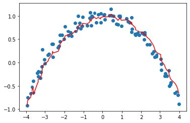

当损失函数存在需要穿越的狭窄峡谷时，该方法效果尤为显著：标准梯度下降会使我们不断在两侧弹跳，而动量梯度下降则会取其平均值，使我们顺畅地沿着侧面滚落。参数 `beta` 决定动量强度： `beta` 值较小时，我们更贴近实际梯度值； `beta` 值较高时，则主要沿梯度平均值方向移动，梯度变化需经过一段时间才会改变这种趋势。

当 `beta` 值较大时，我们可能忽略梯度方向已发生改变，从而在局部小极小值处翻转。这是我们期望的副作用：直观而言，当模型接收新输入时，它会呈现出类似训练集样本的特征，但并非完全相同。该输入对应的损失函数点将接近训练结束时达到的最小值，但并非精确落在该极小值上。因此我们更倾向于在宽广的最小值区域内训练，该区域内邻近点的损失值大致相当（或可理解为损失曲线尽可能平坦的点）。图16-2展示了当 `beta` 值变化时图16-1中曲线的动态变化。


[^图16-2]: 不同β值下的动量

从这些例子中可以看出，过高的 `beta` 值会导致梯度变化被整体忽略。在动量式梯度下降算法中，常用的 `beta` 值为0.9。

`fit_one_cycle` 默认以 0.95 的 `beta` 开始，逐步调整至 0.85，并在训练结束时逐渐恢复至 0.95。让我们看看在普通随机梯度下降中加入动量后训练效果如何。

为增强优化器的运算效率，我们首先需要追踪移动平均梯度，这可通过另一个回调函数实现。当优化器回调函数返回 `dist` 时，该字典将用于更新优化器状态，并在下一步传递回优化器。因此，此回调函数将通过名为 `grad_avg` 的参数追踪梯度平均值：

```python
def average_grad(p, mom, grad_avg=None, **kwargs):
    if grad_avg is None: grad_avg =
    torch.zeros_like(p.grad.data)
    return {'grad_avg': grad_avg*mom + p.grad.data}
```

使用时只需将步骤函数中的 `p.grad.data` 替换为 `grad_avg` 即可：

```python
def momentum_step(p, lr, grad_avg, **kwargs): p.data.add_(-
lr, grad_avg)
```

```python
opt_func = partial(Optimizer, cbs=
[average_grad,momentum_step], mom=0.9)
```

`Learner` 会自动安排 `mom` 和 `lr` ，因此 `fit_one_cycle` 甚至能与我们的自定义优化器配合使用：

```python
learn = get_learner(opt_func=opt_func)
learn.fit_one_cycle(3, 0.03)
```

| 迭代轮次 | 训练损失 | 验证损失 | 准确率   | 时间  |
| -------- | -------- | -------- | -------- | ----- |
| 0        | 2.856000 | 2.493429 | 0.246115 | 00:10 |
| 1        | 2.504205 | 2.463813 | 0.348280 | 00:10 |
| 2        | 2.187387 | 1.755670 | 0.418853 | 00:10 |

```python
learn.recorder.plot_sched()
```

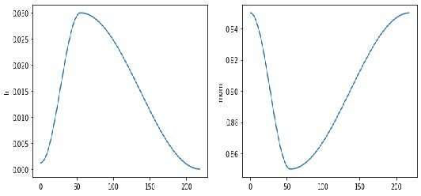

我们仍然没有取得理想的效果，所以让我们看看还能采取哪些措施。

### RMSProp算法

RMSProp是Geoffrey Hinton在其Coursera课程 [《机器学习中的神经网络》](https://oreil.ly/FVcIE) 第6e讲中提出的另一种SGD变体。其与SGD的核心差异在于采用自适应学习率：不再为所有参数使用统一学习率，而是为每个参数分配独立的学习率，并由全局学习率进行调控。通过为需要大幅调整的权重赋予更高学习率，同时为表现良好的权重设置较低学习率，从而显著提升训练速度。

如何决定哪些参数应采用高学习率，哪些不应采用？我们可以观察梯度来判断。若某个参数的梯度长期接近于零，则该参数需要更高的学习率，因为此时损失函数趋于平坦。反之，若梯度波动剧烈，则应谨慎选择较低学习率以避免收敛失败。我们不能简单地取梯度的平均值来判断变化幅度，因为正负数相差较大时平均值接近零。替代方案是采用常规技巧：取绝对值或平方值（然后在求均值后取平方根）。

再次，为确定噪声背后的总体趋势，我们将使用移动平均值——具体而言，是梯度平方的移动平均值。随后通过以下方式更新对应权重：取当前梯度（作为方向）除以该移动平均值的平方根（如此可实现：当平均值较低时，有效学习率相应提高；当平均值较高时，有效学习率相应降低）：

```python
w.square_avg = alpha * w.square_avg + (1-alpha) * (w.grad **
2)
new_w = w - lr * w.grad / math.sqrt(w.square_avg + eps)
```

添加 `eps`（epsilon）参数是为了提高数值稳定性（通常设置为1e-8），而 `alpha` 的默认值通常为0.99。

我们可以像为 `avg_grad` 所做的那样，将此添加到优化器中，但需要额外添加 `**2`：

```python
def average_sqr_grad(p, sqr_mom, sqr_avg=None, **kwargs):
    if sqr_avg is None: sqr_avg =
    torch.zeros_like(p.grad.data)
    return {'sqr_avg': sqr_avg*sqr_mom + p.grad.data**2}
```

我们可以像之前那样定义阶跃函数和优化器：

```python
def rms_prop_step(p, lr, sqr_avg, eps, grad_avg=None,
                  **kwargs):
    denom = sqr_avg.sqrt().add_(eps)
    p.data.addcdiv_(-lr, p.grad, denom)
    opt_func = partial(Optimizer, cbs=
                       [average_sqr_grad,rms_prop_step],
                       sqr_mom=0.99, eps=1e-7)
```

让我们试试看：

```python
learn = get_learner(opt_func=opt_func)
learn.fit_one_cycle(3, 0.003)
```

| 迭代轮次 | 训练损失 | 验证损失 | 准确率   | 时间  |
| -------- | -------- | -------- | -------- | ----- |
| 0        | 2.766912 | 1.845900 | 0.402548 | 00:11 |
| 1        | 2.194586 | 1.510269 | 0.504459 | 00:11 |
| 2        | 1.869099 | 1.447939 | 0.544968 | 00:11 |

好多了！现在我们只需将这些想法整合起来，而我们已有Adam优化器——fastAI的默认优化器。

### Adam优化器

Adam将梯度下降（SGD）与动量和均方根正则化（RMSProp）的理念融合：它采用梯度的移动平均值作为方向，并除以梯度平方的移动平均值的平方根，从而为每个参数提供自适应的学习率。

Adam计算移动平均线的方式还存在另一处差异。它采用无偏移动平均线，即

```python
w.avg = beta * w.avg + (1-beta) * w.grad
unbias_avg = w.avg / (1 - (beta**(i+1)))
```

若当前为第 `i` 次迭代（从0开始计数，与Python一致）。这个除数 `1 - (beta ** (i+1))` 确保无偏平均值更接近初始阶段的梯度（由于 `beta < 1` ，分母很快趋近于1）。

综合以上内容，我们的更新步骤如下：

```python
w.avg = beta1 * w.avg + (1-beta1) * w.grad
unbias_avg = w.avg / (1 - (beta1**(i+1)))
w.sqr_avg = beta2 * w.sqr_avg + (1-beta2) * (w.grad ** 2)
new_w = w - lr * unbias_avg / sqrt(w.sqr_avg + eps)
```

至于RMSProp，`eps` 通常设置为1e-8，而文献建议的 `(beta1,beta2)` 默认值为 `(0.9,0.999)` 。

在fastai中，我们默认使用Adam优化器，因其能加快训练速度，但我们发现 `beta2=0.99` 更适合当前采用的学习率调度方案。 `beta1` 是动量参数，通过 `fit_one_cycle` 调用中的 `moms` 参数进行指定。关于 `eps` 参数，fastai默认值为 1e-5。`eps` 不仅用于数值稳定性控制，更重要的是：较高的 `eps` 值会限制调整后学习率的最大值。以极端情况为例，若 `eps` 设为1，则调整后的学习率永远不会超过基础学习率。

本书不会展示全部代码，你可查阅fastai的GitHub仓库（浏览 `_nbs` 文件夹并搜索名为 `optimizer` 的笔记本）。你将看到我们迄今展示的所有代码，以及Adam等其他优化器，还有大量示例和测试。

从SGD切换到Adam时，一个变化点在于权重衰减的应用方式，这可能带来重要影响。

### 解耦权重衰减

权重衰减（我们在第8章讨论过）等同于（在标准SGD情况下）通过以下方式更新参数：

```python
new_weight = weight - lr*weight.grad - lr*wd*weight
```

该公式的最后一部分解释了此技术的命名依据：每个权重都会按 `lr * wd` 的因子衰减。

权重衰减的另一个名称是L2正则化（L2 regularization），其实现方式是将所有权重平方之和（乘以权重衰减因子）添加到损失函数中。正如我们在第8章所见，这可直接通过梯度表达：

```python
weight.grad += wd*weight
```

对于SGD，这两个公式是等价的。然而，这种等价性仅适用于标准梯度下降，因为正如我们在动量、RMSProp或Adam中看到的那样，其更新公式围绕梯度包含了额外的计算。

大多数库采用第二种公式，但伊利亚·洛什奇洛夫（Ilya Loshchilov）和弗兰克·胡特（Frank Hutter）在 [《解耦权重衰减正则化》](https://oreil.ly/w37Ac) 一文中指出，对于Adam优化器或动量优化器而言，第一种公式才是唯一正确的方法，因此fastai将其设为默认选项。

现在你已知晓隐藏在 `learn.fit_one_cycle` 之后的所有秘密!

优化器仅是训练流程的一部分。当你需要修改fastai的训练循环时，无法直接修改库内的代码。为此，我们设计了一套回调系统，让你能在独立代码块中编写任意调整方案，并自由组合搭配。

### 回调函数

有时需要对训练机制稍作调整。事实上，我们已经见过相关案例：Mixup、fp16训练、训练循环神经网络时每隔一个迭代轮次重置模型等等。那么，我们该如何对训练过程进行这类微调呢？

我们已经了解了基础训练循环，借助 `Optimizer` 类，一个迭代轮次的训练过程如下所示：

```python
for xb,yb in dl:
    loss = loss_func(model(xb), yb)
    loss.backward()
    opt.step()
    opt.zero_grad()
```

图16-3展示了如何进行可视化呈现。


[^图16-3]: 基本训练循环

深度学习从业者定制训练循环的常规做法是复制现有训练循环，然后在其中插入特定修改所需的代码。网上绝大多数代码都是这种形式。但这种做法存在严重问题。

某个经过特定调整的训练循环不太可能满足你的具体需求。训练循环可进行数百种修改，这意味着存在数以十亿计的可能组合。你不能简单地从这个训练循环中复制一个调整，从那个训练循环中复制另一个调整，就期望它们能协同工作。每个调整都基于对运行环境的不同假设，采用不同的命名规范，并要求数据采用不同的格式。

我们需要一种方法，允许用户在训练循环的任意位置插入自定义代码，但必须以一致且明确定义的方式实现。计算机科学家早已提出了一个优雅的解决方案：回调函数。回调函数是由你编写并注入到另一段代码中、在预定义位置执行的代码片段。事实上，多年以来回调机制已在深度学习训练循环中应用。问题在于早期库仅支持在极少数必要位置插入代码——更关键的是，回调功能未能实现其应有的全部潜力。

为了实现与手动复制粘贴训练循环并直接插入代码同样的灵活性，回调函数必须能够读取训练循环中所有可用的信息，根据需要修改所有内容，并完全控制批次、迭代轮次甚至整个训练循环的终止时机。fastai 是首个提供完整功能的库。它修改训练循环使其呈现如图 16-4 所示的结构。

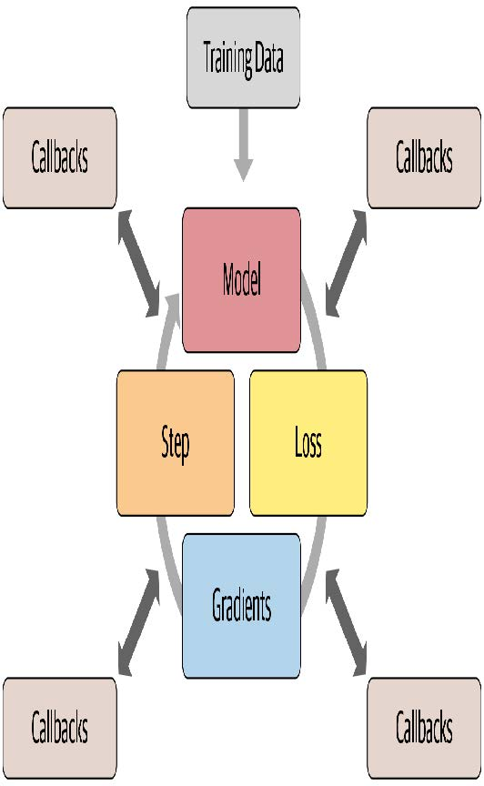

[^图16-4]: 带有回调函数的训练循环

过去几年间，这种方法的有效性已得到充分验证——通过使用fastai回调系统，我们成功实现了每篇尝试的新论文，并满足了用户对修改训练循环的所有需求。训练循环本身无需任何改动。图16-5展示了新增回调中的部分示例。


[^图16-5]: 一些fastai的回调函数

这很重要，因为它意味着无论我们脑海中有何想法都能付诸实践。我们无需深入研究PyTorch或fastai的源代码，也无需拼凑一次性系统来验证想法。当我们通过实现自定义回调函数来拓展思路时，这些功能将与fastai提供的所有特性无缝协同——进度条、混合精度训练、超参数退火等功能皆可自然获得。

另一个优势在于它便于逐步移除或添加功能，并执行消融研究。你只需调整传递给拟合函数的回调函数列表即可。

例如，以下是训练循环中每批次运行的 fastai 源代码：

```python
try:
    self._split(b);
    self('begin_batch')
    self.pred = self.model(*self.xb);
    self('after_pred')
    self.loss = self.loss_func(self.pred, *self.yb);
    self('after_loss')
    if not self.training: return
self.loss.backward();
self('after_backward')
self.opt.step();
self('after_step')
self.opt.zero_grad()
except CancelBatchException:
    self('after_cancel_batch')
finally:
    self('after_batch')
```

形式为 `self(‘...’)` 的调用即为回调函数被调用的位置。如你所见，这发生在每个训练步骤之后。回调函数将接收完整的训练状态，并可对其进行修改。例如，输入数据和目标标签分别存储在 `self.xb` 和 `self.yb` 中；回调函数可修改这些数据以改变训练循环所处理的数据。它还能修改 `self.loss` 甚至梯度值。

让我们通过编写回调函数来看看实际效果如何

#### 编写一个回调函数

当你需要编写自己的回调函数时，可用的事件完整列表如下：

- `begin_fit`

  在执行任何操作前调用；适用于初始化设置。

- `begin_epoch`

  在每个迭代轮次开始时调用；适用于需要在每迭代轮次重置的任何行为。

- `begin_train`

  在迭代轮次的训练阶段开始时调用。

- `begin_batch`

  在每个批次开始时调用，紧接在抽取该批次之后。可用于批次处理的必要配置（如超参数调度）或在输入/目标进入模型前进行修改（例如应用混合操作）。

- `after_pred`

  在模型对批次计算输出后调用。可用于在损失函数接收前修改该输出。

- `after_loss`

  在损失计算完成后、反向传播前调用。可用于向损失添加惩罚项（例如 RNN 训练中的 AR 或 TAR）。

- `after_backward`

  在反向传播完成后、参数更新前调用。可用于在参数更新前修改梯度（例如通过梯度裁剪）。

- `after_step`

  在步长执行后、梯度归零前调用。

- `after_batch`

  在批次结束时调用，用于执行批次间必要的清理操作。

- `after_train`

  在训练阶段结束时调用。

- `begin_validate`

  在迭代轮次验证阶段开始时调用；适用于验证阶段特有的初始化设置。

- `after_validate`

  在迭代轮次验证阶段结束时调用。

- `after_epoch`

  在迭代轮次结束时调用，用于执行下个迭代轮次前的清理工作。

- `after_fit`

  在训练结束时调用，执行最终清理操作。

此列表中的元素可作为特殊变量 `event` 的属性使用，因此你只需在笔记本中输入 `event.` 并按下 Tab 键，即可查看所有选项的列表。

让我们看一个例子。你还记得在第12章中，我们需要确保在每个迭代轮次的训练和验证开始时调用特殊的 `reset` 方法吗？我们使用 fastai 提供的 `ModelResetter` 回调函数来实现这一点。但它究竟是如何工作的呢？以下是该类的完整源代码：

```python
class ModelResetter(Callback):
    def begin_train(self): self.model.reset()
    def begin_validate(self): self.model.reset()
```

是的，其实就是这样！它只是执行了我们在前一段所述的内容：完成一个迭代轮次的训练或验证后，调用一个名为 `reset` 的方法。

回调函数通常像这样“简洁明了”。事实上，我们再来看看另一个示例。以下是添加RNN正则化（AR和TAR）的回调函数在fastai中的源代码：

```python
class RNNRegularizer(Callback):
    def __init__(self, alpha=0., beta=0.):
        self.alpha,self.beta = alpha,beta
        
    def after_pred(self):
        self.raw_out,self.out = self.pred[1],self.pred[2]
        self.learn.pred = self.pred[0]
        
    def after_loss(self):
        if not self.training: return
    
    	if self.alpha != 0.:
            self.learn.loss += self.alpha *
            self.out[-1].float().pow(2).mean()
            if self.beta != 0.:
                h = self.raw_out[-1]
                if len(h)>1:
                    self.learn.loss += self.beta * (h[:,1:] -
                                                    h[:,:-1]                                                   ).float().pow(2).mean()
```

> 自己来写代码：
>
> 请重新阅读《激活正则化与时间激活正则化》，然后再次审视此处的代码。确保你理解其运作机制及背后的原理。

在这两个示例中，请注意我们如何通过直接检查 `self.model` 或 `self.pred` 来访问训练循环的属性。这是因为回调函数总是会尝试从关联的学习器内部获取其自身不具备的属性。这些是 `self.learn.model` 或 `self.learn.pred` 的快捷方式。请注意，它们仅适用于读取属性，而不能用于写入属性——这正是当 `RNNRegularizer` 修改损失值或预测值时，你会看到 `self.learn.loss =` 或 `self.learn.pred =` 的原因。

在编写回调函数时，`Learner` 的以下属性可用：

- `model`

  用于训练/验证的模型。

- `data`

  `DataLoaders` 的底层。

- `loss_func`

  使用的损失函数。

- `opt`

  用于更新模型参数的优化器。

- `opt_func`

  用于创建优化器的函数。

- `cbs`

  包含所有 `Callbacks` 的列表。

- `dl`

  当前用于迭代的 `DataLoader` 。

- `x/xb`

  从 `self.dl` 中提取的最后一个输入（可能被回调函数修改）。`xb` 始终为元组（可能仅含一个元素）。`x` 经过解元组化处理。仅可对 `xb` 进行赋值。

- `y/yb`

  从 `self.dl` 中抽取的最后一个目标值（可能被回调函数修改）。`yb` 始终为元组（可能仅含一个元素），`y` 经过解元组化处理。仅可对 `yb` 进行赋值。

- `pred`

  来自 `self.model` 的最后预测结果（可能被回调函数修改）。

- `loss`

  最后计算的损失值（可能被回调函数修改）。

- `n_epoch`

  本次训练的迭代轮次总数。

- `n_iter`

  当前 `self.dl` 的迭代次数。

- `epoch`

  当前迭代轮次的索引（范围 `0` 至 `n_epoch-1`）。

- `iter`

  当前 `self.dl` 中的迭代索引（范围 `0` 至 `n_iter-1`）。

以下属性由 `TrainEvalCallback` 函数添加，除非你刻意移除了该回调函数，否则应可使用：

- `train_iter`

  自本次训练开始以来完成的训练迭代次数

- `pct_train`

  已完成训练迭代的百分比（范围为0到1）

- `training`

  用于标记当前是否处于训练模式的标志

以下属性由 `Recorder` 添加，除非你刻意移除了该回调函数，否则应始终可用：

- `smooth_loss`

  训练损失的指数平均版本

回调函数也可通过异常系统中断训练循环的任意部分。

#### 回调顺序与异常处理

有时回调函数需要能够指示fastai跳过某个批次或整个迭代轮次，甚至完全停止训练。例如，考虑 `TerminateOnNaNCallback` 这个便捷的回调函数——当损失值变为无穷大或NaN（非数值）时，它会自动终止训练。以下是该回调函数的fastai源代码：

```python
class TerminateOnNaNCallback(Callback):
    run_before=Recorder
    def after_batch(self):
        if torch.isinf(self.loss) or torch.isnan(self.loss):
            raise CancelFitException
```

`raise CancelFitException` 异常的代码行指示训练循环在此处中断训练。训练循环捕获此异常后，将不再执行后续训练或验证操作。可用的回调控制流异常如下：

- `CancelFitException`

  跳过本批次剩余部分，转至 `after_batch`。

- `CancelEpochException`

  跳过本训练迭代轮次剩余部分，转至 `after_train`。

- `CancelTrainException`

  跳过该迭代轮次剩余验证阶段，转至 `after_validate`。

- `CancelValidException`

  跳过该迭代轮次剩余验证阶段，转至 `after_epoch`。

- `CancelBatchException`

  中断训练，转至 `after_fit`。

你可以检测是否发生了上述异常之一，并添加代码，该代码将在以下事件发生后立即执行：

- `after_cancel_batch`

  在 `CancelBatchException` 异常发生后立即到达，在进入 `after_batch` 之前

- `after_cancel_train`

  在 `CancelTrainException` 异常发生后立即到达，在进入 `after_epoch` 之前

- `after_cancel_valid`

  在 `CancelValidException` 异常发生后立即触发，随后进入 `after_epoch`

- `after_cancel_epoch`

  在 `CancelEpochException` 异常发生后立即触发，随后进入 `after_epoch`

- `after_cancel_fit`

  在 `CancelFitException` 异常发生后立即触发，随后进入 `after_fit`

有时回调函数需要按特定顺序调用。例如，在 `TerminateOnNaNCallback` 的情况下，确保 `Recorder` 在该回调函数之后运行其 `after_batch` 方法回调至关重要，这样可以避免记录 `NaN` 损失。你可在回调中指定 `run_before`（该回调必须在…之前执行）或 `run_after`（该回调必须在…之后执行），以确保所需的执行顺序。

### 总结

在本章中，我们深入探讨了训练循环，研究了梯度下降算法的变体及其更强大的原因。在撰写本书时，开发新型优化器仍是活跃的研究领域，因此当你阅读本章时，本书网站可能已发布附录介绍最新变体。请务必了解我们的通用优化器框架如何助你快速实现新型优化器。

我们还研究了强大的回调系统，它允许你在每次训练步骤之间检查和修改任何参数，从而实现对训练循环的全面定制。

### 问卷调查

1. SGD的单步更新公式是什么？请用数学表达式或代码（任选其一）说明。
2. 要使用非默认优化器时，应向 `cnn_learner` 传递什么参数？
3. 什么是优化器回调函数？
4. 优化器中的 `zero_grad` 函数有何作用？
5. 优化器中的 `step` 函数如何实现？通用优化器中如何实现？
6. 重写 `sgd_cb` 函数，用 `+=` 运算符替代 `add_`。
7. 什么是动量法？写出计算公式。
8. 动量的物理类比是什么？它如何应用于模型训练场景？
9. 增大动量值对梯度有何影响？
10. 单轮训练中动量的默认值是多少？
11. 什么是RMSProp？写出计算公式。
12. 梯度的平方值代表什么？
13. Adam 优化器与动量法、RMSProp 的区别？
14. 写出 Adam 优化器的计算公式。
15. 计算若干批次虚拟数据的 `unbias_avg` 和 `w.avg` 值。
16. Adam 优化器中 `eps` 值过高会产生什么影响？
17. 阅读 fastai 仓库中的优化器笔记本并执行。
18. 动态学习率方法（如 Adam法）在何种情况下会改变权重衰减的行为？
19. 训练循环包含哪四个步骤？
20. 为什么使用回调比为每次调整都编写新训练循环更好？
21. fastai 回调系统的哪些设计使其灵活到如同复制粘贴代码片段？
22. 编写回调时如何获取可用事件列表？
23. 编写 `ModelResetter` 回调（不使用 peeking）。
24. 如何在回调内部访问训练循环的必要属性？何时可使用或不可使用其配套快捷方式？
25. 回调如何影响训练循环的控制流？
26. 编写 `TerminateOnNaN` 回调（尽可能不偷看代码）。
27. 如何确保回调在另一个回调之前或之后运行？

#### 进一步研究

1. 查阅《修正Adam算法》论文，使用通用优化器框架实现该算法并进行测试。搜索其他在实践中表现良好的新型优化器，选取其中一种进行实现。
2. 查阅文档中的混合精度回调函数。尝试理解每个事件和代码行所起的作用。
3. 从零开始实现你自己的学习率搜索器版本。将其与fastai的版本进行比较。

4. 查看fastai自带回调函数的源代码。看看能否找到与你目标相似的实现，以获取灵感。

### 深度学习基础：总结

恭喜你——你已经完成了本书“深度学习基础”章节的学习！现在你已掌握fastai所有应用程序和核心架构的构建原理，以及推荐的训练方法——更具备从零构建这些系统的全部知识。虽然你可能无需亲手编写训练循环或批量归一化层，但理解底层机制对调试、性能分析和解决方案部署都很有帮助。

既然你已经理解了fastai应用程序的基础知识，请务必花些时间深入研究笔记本的源代码，并运行和实验其中的部分内容。这将使你更清楚地了解fastai中所有内容的具体开发方式。

在下一部分中，我们将深入探索神经网络的底层机制：我们将研究神经网络实际的前向传播和反向传播过程，并了解可用于提升性能的工具。随后我们将开展一个项目，整合本书所有内容，以此构建用于解释卷积神经网络的工具。最后但同样重要的是，我们将从零开始构建fastai的 `Learner` 类。

# 第四部分：从零开始的深度学习

## 17. 神经网络基础

本章开启一段旅程，我们将深入剖析前几章所用模型的内部机制。虽然涉及许多熟悉的内容，但这次我们将更聚焦于实现细节，而非实际应用层面的“如何实现”与“为何如此设计”。

我们将从零开始构建所有内容，仅使用张量的基本索引操作。我们将从头编写神经网络，然后手动实现反向传播，以便在调用 `loss.backward` 时精确理解 PyTorch 内部的运作机制。我们还将探索如何通过自定义自动微分函数扩展 PyTorch，从而能够指定专属的前向与反向计算流程。

### 从零开始构建神经网络层

让我们先重新梳理矩阵乘法在基础神经网络中的应用原理。由于我们将从零开始构建所有内容，初期仅使用纯Python实现（除PyTorch张量索引操作外），待掌握创建方法后再用PyTorch功能替换纯Python代码。

#### 神经元建模

一个神经元接收特定数量的输入，并对每个输入赋予内部权重。它将这些加权输入相加产生输出，并添加一个内部偏置。在数学上，这可表示为：
$$
out=\sum_{i=1}^{n}x_iw_i+b
$$
若我们将输入命名为 $(x_1,\dots, x_n)$，权重命名为 $(w_1,\dots,w_n)$，偏置项命名为 $b$。在代码中对应如下：

```python
output = sum([x*w for x,w in zip(inputs,weights)]) + bias
```

该输出随后被输入到称为激活函数的非线性函数中，再传递至另一个神经元。在深度学习中，最常见的激活函数是ReLU，正如我们所见，这其实是这样一种表达方式：

```python
def relu(x): return x if x >= 0 else 0
```

随后通过将大量神经元按顺序分层堆叠，构建出深度学习模型。我们创建一个包含特定数量神经元（称为隐藏层大小）的第一层，并将所有输入连接至该层的每个神经元。此类层通常被称为全连接层、稠密层（因其紧密连接特性）或线性层。

它要求你针对每个 `input` 和每个具有给定 `weight` 的神经元，计算点积：

```python
sum([x*w for x,w in zip(input,weight)])
```

如果你学过一点线性代数，可能会记得，当进行矩阵乘法时，会出现大量点积运算。更精确地说，若输入数据存储在矩阵 x 中，其尺寸为 `batch_size × n_inputs`；若我们将神经元的权重归类到矩阵 `w` 中，其尺寸为 `n_neurons × n_inputs`（每个神经元的权重数量必须与其输入数量相同）；并将所有偏置值存储在向量 `b` 中，其尺寸为 `n_neurons`，那么该全连接层的输出为：

```python
y = x @ w.t() + b
```

其中 `@` 表示矩阵乘法，`w.t()` 是 `w` 的转置矩阵。输出 `y` 的尺寸为 `batch_size × n_neurons`，在位置 `(i,j)` 处我们得到如下结果（供数学爱好者参考）：
$$
y_{i,j}=\sum_{k=1}^{n}x_{i,k}w_{k,j}+b_j
$$
或者用代码表示：

```python
y[i,j] = sum([a * b for a,b in zip(x[i,:],w[j,:])]) + b[j]
```

转置是必要的，因为在矩阵乘法 `m @ n` 的数学定义中，系数 `(i,j)` 的形式如下：

```python
sum([a * b for a,b in zip(m[i,:],n[:,j])])
```

因此我们需要的基本运算就是矩阵乘法，因为它正是神经网络核心中隐藏的本质。

#### 从零开始的矩阵乘法

在允许使用PyTorch版本之前，让我们先编写一个计算两个张量矩阵乘积的函数。我们将仅使用PyTorch张量中的索引功能：

```python
import torch
from torch import tensor
```

我们需要三个嵌套的 `for` 循环：一个用于行索引，一个用于列索引，一个用于内部求和。`ac` 和 `ar` 分别表示 `a` 的列数和 `a` 的行数（`b` 也遵循相同约定），并通过检查 `a` 的列数是否等于 `b` 的行数来确保矩阵乘法计算的可行性：

```python
def matmul(a,b):
    ar,ac = a.shape # n_rows * n_cols
    br,bc = b.shape
    assert ac==br
    c = torch.zeros(ar, bc)
    for i in range(ar):
        for j in range(bc):
            for k in range(ac): c[i,j] += a[i,k] * b[k,j]
    return c
```

为验证此方法，我们将假设（使用随机矩阵）处理一个包含5张MNIST图像的小批量数据集，这些图像被展平为 `28×28` 的向量，并通过线性模型将其转换为10个激活值：

```python
m1 = torch.randn(5,28*28)
m2 = torch.randn(784,10)
```

让我们使用Jupyter的“魔法”命令 `%time` 来计时我们的函数：

```python
%time t1=matmul(m1, m2)
```

```text
CPU times: user 1.15 s, sys: 4.09 ms, total: 1.15 s
Wall time: 1.15 s
```

再看看这与PyTorch内置的 `@` 相比如何？

```python
%timeit -n 20 t2=m1@m2
```

```text
14 μs ± 8.95 μs per loop (mean ± std. dev. of 7 runs, 20
loops each)
```

如我们所见，在Python中使用三重嵌套循环是个糟糕的主意！Python本就是一种运行缓慢的语言，这种写法效率极低。我们发现PyTorch的速度比Python快约10万倍——这还是在尚未启用GPU加速的情况下！

这种差异从何而来？PyTorch并未用Python实现矩阵乘法，而是采用C++实现以提升速度。通常，当我们对张量进行计算时，需要将其向量化以充分发挥PyTorch的速度优势，这通常通过两种技术实现：元素级运算和广播。

#### 元素级运算

所有基本运算符（`+, -, *, /, >, <, ==`）均可进行元素级运算。这意味着当两个张量 `a` 和 `b` 具有相同形状时，若写为 `a+b`，则会得到一个由 a 和 b 元素之和组成的张量：

```python
a = tensor([10., 6, -4])
b = tensor([2., 8, 7])
a + b
```

```text
tensor([12., 14., 3.])
```

布尔运算符将返回一个布尔值数组：

```python
a < b
```

```text
tensor([False, True, True])
```

若要判断向量 `a` 的每个元素是否都小于向量 `b` 的对应元素，或判断两个张量是否相等，我们需要将这些元素级运算与 `torch.all` 函数结合使用：

```python
(a < b).all(), (a==b).all()
```

```text
(tensor(False), tensor(False))
```

缩减操作（如 `all`、`sum` 和 `mean`）会返回仅含一个元素的张量，称为零阶张量。若需将其转换为普通的 Python 布尔值或数字，需调用 `.item`：

```python
(a + b).mean().item()
```

```text
9.666666984558105
```

元素级运算适用于任意阶张量，只要它们具有相同的形状：

```python
m = tensor([[1., 2, 3], [4,5,6], [7,8,9]])
m*m
```

```text
tensor([[ 1., 4., 9.],
[16., 25., 36.],
[49., 64., 81.]])
```

然而，对于形状不相同的张量，无法执行元素级运算（除非它们可广播，详见下一节讨论）：

```python
n = tensor([[1., 2, 3], [4,5,6]])
m*n
```

```text
RuntimeError: The size of tensor a (3) must match the size
of tensor b (2) at
dimension 0
```

通过元素级运算，我们可以移除三个嵌套循环中的一个：在求和所有元素之前，先将对应于 `a` 的第 i 行与 `b` 的第 j 列的张量相乘，这将提高计算速度，因为此时内部循环将由 PyTorch 以 C 语言的速度执行。

要访问某一列或某一行，只需编写 `a[i,:]` 或 `b[:,j`]。冒号表示取该维度上的所有元素。我们也可以通过传递范围（如 `1:5`）来限制取值范围，而非仅使用冒号。此时将取第 1 至第 4 列的元素（第二个数字不包含该列）。

一种简化方式是始终省略尾随冒号，因此 `a[i,:]` 可简写为 `a[i]`。基于上述原则，我们可以重写矩阵乘法的新版本：

```python
def matmul(a,b):
    ar,ac = a.shape
    br,bc = b.shape
    assert ac==br
    c = torch.zeros(ar, bc)
    for i in range(ar):
        for j in range(bc): c[i,j] = (a[i] * b[:,j]).sum()
    return c
```

```text
%timeit -n 20 t3 = matmul(m1,m2)
```

```text
1.7 ms ± 88.1 μs per loop (mean ± std. dev. of 7 runs, 20
loops each)
```

仅通过移除内部 `for` 循环，我们的速度已提升约 700 倍！而这仅仅是开始——借助广播功能，我们还能移除另一个循环，实现更显著的加速效果。

#### 广播

正如我们在第4章所讨论的，广播是 [Numpy库](https://oreil.ly/nlV7Q) 引入的一个术语，用于描述不同阶数张量在算术运算中的处理方式。例如，显然无法将3×3矩阵与4×5矩阵相加，但若要将一个标量（可表示为1×1张量）与矩阵相加呢？或者将3维向量与3×4矩阵相加呢？这两种情况下，我们都能找到使该运算成立的方法。

广播机制提供了具体规则，用于规范元素级运算中形状的兼容性，以及如何扩展较小形状的张量以匹配较大形状的张量。若想编写高效运行的代码，掌握这些规则至关重要。本节将扩展我们对广播机制的先前讨论，深入理解这些规则。

##### 使用标量进行广播

标量广播是最简单的广播类型。当我们有一个张量 `a` 和一个标量时，只需想象一个与 `a` 形状相同的张量，其中填充着该标量，然后执行运算：

```text
a = tensor([10., 6, -4])
a > 0
```

```text
tensor([ True, True, False])
```

我们如何实现这种比较？`0` 被广播为与 `a` 具有相同的维度。请注意，此操作无需在内存中创建一个充满零的张量（那样效率低下）。

若需对数据集进行标准化处理，可通过以下方式实现：从整个数据集（矩阵）中减去均值（标量），再除以标准差（另一个标量）：

```python
m = tensor([[1., 2, 3], [4,5,6], [7,8,9]])
(m - 5) / 2.73
```

```text
tensor([[-1.4652, -1.0989, -0.7326],
[-0.3663, 0.0000, 0.3663],
[ 0.7326, 1.0989, 1.4652]])
```

如果矩阵的每行都有不同的运算方式呢？在这种情况下，你需要将向量广播为矩阵。

##### 将向量广播为矩阵

我们可以按以下方式将向量广播为矩阵：

```python
c = tensor([10.,20,30])
m = tensor([[1., 2, 3], [4,5,6], [7,8,9]])
m.shape,c.shape
```

```text
(torch.Size([3, 3]), torch.Size([3]))
```

```python
m + c
```

```text
tensor([[11., 22., 33.],
[14., 25., 36.],
[17., 28., 39.]])
```

此处将 `c` 的元素展开为三行匹配数据，使运算得以实现。同样地，PyTorch并未在内存中实际创建 `c` 的三个副本。这由后台的 `expand_as` 方法完成：

```python
c.expand_as(m)
```

```text
tensor([[10., 20., 30.],
[10., 20., 30.],
[10., 20., 30.]])
```

若考察对应的张量，可通过其存储属性（该属性展示张量实际占用的内存内容）来验证是否存在无用数据：

```python
t = c.expand_as(m)
t.storage()
```

```text
10.0
20.0
30.0
[torch.FloatStorage of size 3]
```

尽管张量官方定义有九个元素，但是内存中仅存储了三个标量。这得益于一个巧妙的技巧：为该维度设置步长为0（这意味着当PyTorch通过累加步长寻找下一行时，该维度不会移动）：

```python
t.stride(), t.shape
```

```text
((0, 1), torch.Size([3, 3]))
```

由于 `m` 是3×3的张量，广播操作有两种方式。选择在最后维度进行广播是广播规则的约定惯例，与张量排列顺序无关。若采用以下方式操作，结果相同：

```python
c + m
```

```text
tensor([[11., 22., 33.],
[14., 25., 36.],
[17., 28., 39.]])
```

事实上，仅能使用 `m×n` 矩阵来广播 `n` 维向量：

```python
c = tensor([10.,20,30])
m = tensor([[1., 2, 3], [4,5,6]])
c+m
```

```text
tensor([[11., 22., 33.],
[14., 25., 36.]])
```

这行不通：

```python
c = tensor([10.,20])
m = tensor([[1., 2, 3], [4,5,6]])
c+m
```

```text
RuntimeError: The size of tensor a (2) must match the size
of tensor b (3) at
dimension 1
```

若要在另一维度进行广播，我们需要将向量的形状转换为3×1矩阵。这可通过PyTorch的 `unsqueeze` 方法实现：

```python
c = tensor([10.,20,30])
m = tensor([[1., 2, 3], [4,5,6], [7,8,9]])
c = c.unsqueeze(1)
m.shape,c.shape
```

```text
(torch.Size([3, 3]), torch.Size([3, 1]))
```

这次，`c` 在列侧展开：

```python
c+m
```

```text
tensor([[11., 12., 13.],
[24., 25., 26.],
[37., 38., 39.]])
```

与之前相同，内存中仅存储三个标量：

```python
t = c.expand_as(m)
t.storage()
```

```text
10.0
20.0
30.0
[torch.FloatStorage of size 3]
```

扩展后的张量具有正确的形状，因为列维度的步长为0：

```python
t.stride(), t.shape
```

```text
((1, 0), torch.Size([3, 3]))
```

在广播操作中，若需添加维度，默认会在开头添加。此前进行广播时，PyTorch 实际上在后台执行了 `c.unsqueeze(0)` 操作：

```python
c = tensor([10.,20,30])
c.shape, c.unsqueeze(0).shape,c.unsqueeze(1).shape
```

```text
(torch.Size([3]), torch.Size([1, 3]), torch.Size([3, 1]))
```

`uncompress` 命令可通过 `None` 索引替代：

```python
c.shape, c[None,:].shape,c[:,None].shape
```

```text
(torch.Size([3]), torch.Size([1, 3]), torch.Size([3, 1]))
```

尾随冒号可省略，而 `...` 表示所有前置维度

```python
c[None].shape,c[...,None].shape
```

```text
(torch.Size([1, 3]), torch.Size([3, 1]))
```

这样，我们就能在矩阵乘法函数中移除另一个 `for` 循环。现在，无需将 `a[i]` 与 `b[:,j]` 相乘，而是通过广播操作将 `a[i]` 与整个矩阵 `b` 相乘，然后求和结果：

```python
def matmul(a,b):
    ar,ac = a.shape
    br,bc = b.shape
    assert ac==br
    c = torch.zeros(ar, bc)
    for i in range(ar):
        # c[i,j] = (a[i,:] * b[:,j]).sum() # previous
        c[i] = (a[i ].unsqueeze(-1) * b).sum(dim=0)
    return c
```

```text
%timeit -n 20 t4 = matmul(m1,m2)
```

```text
357 μs ± 7.2 μs per loop (mean ± std. dev. of 7 runs, 20
loops each)
```

我们现在的速度比最初实现快了3700倍！在继续之前，让我们更详细地讨论广播规则。

#### 广播规则

当对两个张量进行操作时，PyTorch会逐元素比较它们的形状。它从尾部维度开始，逐步向头部推进，遇到空维度时加1。当满足以下任一条件时，两个维度即为兼容（compatible）：

- 它们是相等的。
- 其中一个为1，此时该维度将被广播使其与另一个相同。

数组不必具有相同的维数。例如，若有一个256×256×3的RGB值数组，且需要对图像中每种颜色应用不同的缩放系数，则可将该图像与一个包含三个值的一维数组相乘。根据广播规则对齐这些数组末尾轴的尺寸后，可验证它们是兼容的：

```python
Image (3d tensor): 256 x 256 x 3
Scale (1d tensor): (1) (1) 3
Result (3d tensor): 256 x 256 x 3
```

然而，一个尺寸为256×256的二维张量与我们的图像不兼容：

```text
Image (3d tensor): 256 x 256 x 3
Scale (1d tensor): (1) 256 x 256
Error
```

在我们之前关于3×3矩阵和3维向量的示例中，广播操作是在行方向上进行的：

```text
Matrix (2d tensor): 3 x 3
Vector (1d tensor): (1) 3
Result (2d tensor): 3 x 3
```

作为练习，请尝试确定需要添加哪些维度（以及添加位置），当你需要对一批尺寸为 `64×3×256×256` 的图像进行归一化处理时，这些图像对应的向量包含三个元素（一个表示均值，另一个表示标准差）。

简化张量运算的另一种有效方法是采用爱因斯坦求和约定。

#### 爱因斯坦求和

在使用 PyTorch 的 `@` 运算符或 `torch.matmul` 之前，我们还有一种最后的矩阵乘法实现方式：爱因斯坦求和（`einsum`）。这是将乘积与求和以通用方式组合的紧凑表示法。我们写出这样的方程：

```python
ik,kj -> ij
```

左侧表示操作数的维度，用逗号分隔。这里有两个张量，每个张量各有两个维度（`i,k` 和 `k,j`）。右侧表示结果的维度，因此这里得到一个具有两个维度 `i,j` 的张量。

爱因斯坦求和符号的规则如下：

1. 重复的下标将隐含地进行求和。
2. 每个下标在任何项中最多出现两次。
3. 每个项必须包含相同的非重复下标。

因此在我们的例子中，由于 `k` 是重复的，我们需要对该索引求和。最终，该公式表示当我们将 `(i,j)` 填入时所得到的矩阵——即第一个张量中所有系数 `(i,k)` 与第二个张量中系数 `(k,j)` 相乘的和……这正是矩阵乘法！

以下是在 PyTorch 中实现此功能的代码：

```python
def matmul(a,b): return torch.einsum('ik,kj->ij', a, b)
```

爱因斯坦求和是一种表达涉及索引和积和的运算的非常实用的方法。请注意，左侧可以只有一个元素。例如：

```python
torch.einsum('ij->ji', a)
```

它返回矩阵 a 的转置。你也可以拥有三个或更多的成员：

```python
torch.einsum('bi,ij,bj->b', a, b, c)
```

这将返回一个大小为 `b` 的向量，其中第 k 个坐标是 `a[k,i]`、`b[i,j]` 和 `c[k,j]` 的和。当因批处理而存在更多维度时，这种表示法尤为便捷。例如，若你有两批矩阵并希望按批次计算矩阵乘积，可采用以下方式：

```python
torch.einsum('bik,bkj->bij', a, b)
```

让我们回到使用 `einsum` 实现的新 `matmul` 实现，并看看它的速度：

```python
%timeit -n 20 t5 = matmul(m1,m2)
```

```text
68.7 μs ± 4.06 μs per loop (mean ± std. dev. of 7 runs, 20
loops each)
```

如你所见，它不仅实用，而且速度极快。`einsum` 通常是PyTorch中执行自定义操作最快捷的方式，无需深入C++和CUDA。（但正如你在《从零开始实现矩阵乘法》中的结果所见，它通常不如精心优化的CUDA代码高效。）

既然我们已经掌握了从零开始实现矩阵乘法的方法，现在就可以仅使用矩阵乘法来构建神经网络——具体而言，就是实现其前向传播和反向传播过程。

### 前向传播和反向传播

正如我们在第4章所见，要训练模型，我们需要计算给定损失函数对所有参数的梯度，这被称为反向传播。在正向传播中，我们基于矩阵乘法计算模型对特定输入的输出。在定义首个神经网络时，我们将深入探讨权重初始化的关键问题——这对于确保训练正常启动至关重要。

#### 定义并初始化一层

我们将首先以两层神经网络为例。正如我们所见，单层网络可表示为 `y = x @ w + b`，其中 `x` 是输入，`y` 是输出，`w` 是该层的权重（若不进行转置，其大小为输入数量乘以神经元数量），`b` 是偏置向量：

```python
def lin(x, w, b): return x @ w + b
```

我们可以将第二层叠加在第一层之上，但由于数学上两个线性运算的复合仍是线性运算，这只有在中间加入非线性元素（称为激活函数）时才有意义。正如本章开头所述，在深度学习应用中，最常用的激活函数是ReLU，它返回 `x` 与 `0` 中的较大值。

本章不会实际训练模型，因此我们将使用随机张量作为输入和目标。假设输入是200个大小为100的向量，我们将其分组为一个批次；目标则是200个随机浮点数：

```python
x = torch.randn(200, 100)
y = torch.randn(200)
```

对于我们的两层模型，需要两个权重矩阵和两个偏置向量。假设隐藏层大小为50，输出层大小为1（在本示例中，每个输入对应一个浮点数输出）。权重初始化为随机值，偏置初始化为零：

```python
w1 = torch.randn(100,50)
b1 = torch.zeros(50)
w2 = torch.randn(50,1)
b2 = torch.zeros(1)
```

那么我们第一层的结果就是这样：

```python
l1 = lin(x, w1, b1)
l1.shape
```

```text
torch.Size([200, 50])
```

请注意，该公式适用于我们的输入批次，并返回一个隐藏状态批次：`l1` 是尺寸为 200（我们的批次大小）× 50（我们的隐藏层尺寸）的矩阵。

然而，我们的模型初始化方式存在问题。要理解这个问题，我们需要查看 `l1` 的均值和标准差（std）：

```python
l1.mean(), l1.std()
```

```text
(tensor(0.0019), tensor(10.1058))
```

均值接近零，这很正常，因为我们的输入矩阵和权重矩阵的均值都接近零。但标准差——它代表激活值偏离均值的程度——却从1飙升至10。这确实是个大问题，因为这仅仅发生在单层网络中。现代神经网络可能包含数百层，若每层都将激活值的尺度放大10倍，到最后一层时，我们得到的数值将超出计算机的表示能力。

事实上，只要对x与100×100尺寸的随机矩阵进行50次乘法运算，就会得到这样的结果：

```python
x = torch.randn(200, 100)
for i in range(50): x = x @ torch.randn(100,100)
x[0:5,0:5]
```

```text
tensor([[nan, nan, nan, nan, nan],
[nan, nan, nan, nan, nan],
[nan, nan, nan, nan, nan],
[nan, nan, nan, nan, nan],
[nan, nan, nan, nan, nan]])
```

结果到处都是 `nan` 。也许我们的矩阵规模过大，需要更小的权重？但若使用过小的权重，又会出现相反的问题——激活值的范围将从1缩小到0.1，经过100层后，最终得到的是满屏的零：

```python
x = torch.randn(200, 100)
for i in range(50): x = x @ (torch.randn(100,100) * 0.01)
x[0:5,0:5]
```

```text
tensor([[0., 0., 0., 0., 0.],
[0., 0., 0., 0., 0.],
[0., 0., 0., 0., 0.],
[0., 0., 0., 0., 0.],
[0., 0., 0., 0., 0.]])
```

因此我们必须精确调整权重矩阵的缩放因子，确保激活值的标准差保持为1。正如Xavier Glorot和Yoshua Bengio在 [《理解深度前馈神经网络训练的难度》](https://oreil.ly/9tiTC) 中所阐述的，可通过数学方法精确计算该值：给定层的正确缩放因子为 $1/\sqrt{n_{in}}$，其中 $n_{in}$ 代表输入数量。

在我们的情况下，如果输入有100个，我们应该将权重矩阵缩放为0.1：

```python
x = torch.randn(200, 100)
for i in range(50): x = x @ (torch.randn(100,100) * 0.1)
x[0:5,0:5]
```

```text
tensor([[ 0.7554, 0.6167, -0.1757, -1.5662, 0.5644],
[-0.1987, 0.6292, 0.3283, -1.1538, 0.5416],
[ 0.6106, 0.2556, -0.0618, -0.9463, 0.4445],
[ 0.4484, 0.7144, 0.1164, -0.8626, 0.4413],
[ 0.3463, 0.5930, 0.3375, -0.9486, 0.5643]])
```

终于出现了一些既非零也 `nan` 的数值！请注意我们的激活值尺度有多么稳定，即使经过50个虚假层之后依然如此：

```python
x.std()
```

```text
tensor(0.7042)
```

若稍作调整缩放值，你会发现即使从0.1稍作偏离，也会导致结果呈现极小或极大的数值，因此正确初始化权重至关重要。

让我们回到我们的神经网络。由于我们稍微调整了输入，需要重新定义它们：

```python
x = torch.randn(200, 100)
y = torch.randn(200)
```

至于权重，我们将采用正确的权重初始化方法，即Xavier初始化（或称Glorot初始化）：

```python
from math import sqrt
w1 = torch.randn(100,50) / sqrt(100)
b1 = torch.zeros(50)
w2 = torch.randn(50,1) / sqrt(50)
b2 = torch.zeros(1)
```

现在如果我们计算第一层的结果，可以验证均值和标准差都在可控范围内：

```python
l1 = lin(x, w1, b1)
l1.mean(),l1.std()
```

```text
(tensor(-0.0050), tensor(1.0000))
```

很好。现在我们需要经过一个ReLU激活函数，因此来定义一个。ReLU会移除负值并用零替换它们，这意味着它将张量值限制在零点：

```python
def relu(x): return x.clamp_min(0.)
```

我们通过此方式传递激活：

```python
l2 = relu(l1)
l2.mean(),l2.std()
```

```text
(tensor(0.3961), tensor(0.5783))
```

我们又回到了起点：激活值的均值已降至0.4（这很正常，毕竟我们去除了负值），标准差也降至0.58。因此和之前一样，经过几层处理后，最终结果很可能全是零：

```python
x = torch.randn(200, 100)
for i in range(50): x = relu(x @ (torch.randn(100,100) *
0.1))
x[0:5,0:5]
```

```text
tensor([[0.0000e+00, 1.9689e-08, 4.2820e-08, 0.0000e+00,
0.0000e+00],
[0.0000e+00, 1.6701e-08, 4.3501e-08, 0.0000e+00,
0.0000e+00],
[0.0000e+00, 1.0976e-08, 3.0411e-08, 0.0000e+00,
0.0000e+00],
[0.0000e+00, 1.8457e-08, 4.9469e-08, 0.0000e+00,
0.0000e+00],
[0.0000e+00, 1.9949e-08, 4.1643e-08, 0.0000e+00,
0.0000e+00]])
```

这意味着我们的初始化设置存在问题。原因何在？当Glorot和Bengio撰写论文时，神经网络中最常用的激活函数是双曲正切函数（tanh，即他们采用的函数），而该初始化方案并未考虑ReLU特性。所幸已有研究者完成了相关计算，为我们推导出了正确的缩放因子。在[《深入研究整流器：超越人类水平的性能》](https://oreil.ly/-_quA) （即我们之前提到的引入ResNet的论文）中，Kaiming He等人指出应改用以下缩放因子：$\sqrt{2/n_{in}}$，其中 $n_{in}$ 是模型的输入数量。让我们看看这会带来什么效果：

```python
x = torch.randn(200, 100)
for i in range(50): x = relu(x @ (torch.randn(100,100) *
sqrt(2/100)))
x[0:5,0:5]
```

```text
tensor([[0.2871, 0.0000, 0.0000, 0.0000, 0.0026],
[0.4546, 0.0000, 0.0000, 0.0000, 0.0015],
[0.6178, 0.0000, 0.0000, 0.0180, 0.0079],
[0.3333, 0.0000, 0.0000, 0.0545, 0.0000],
[0.1940, 0.0000, 0.0000, 0.0000, 0.0096]])
```

这次情况好多了：我们的数值这次没有全部归零。那么让我们回到神经网络的定义，并使用这种初始化方法（它被称为Kaiming 初始化或 He 初始化）：

```python
x = torch.randn(200, 100)
y = torch.randn(200)

w1 = torch.randn(100,50) * sqrt(2 / 100)
b1 = torch.zeros(50)
w2 = torch.randn(50,1) * sqrt(2 / 50)
b2 = torch.zeros(1)
```

让我们看看经过第一层线性层和ReLU激活后的激活值规模：

```python
l1 = lin(x, w1, b1)
l2 = relu(l1)
l2.mean(), l2.std()
```

```text
(tensor(0.5661), tensor(0.8339))
```

好多了！现在权重已正确初始化，我们可以定义整个模型：

```python
def model(x):
    l1 = lin(x, w1, b1)
    l2 = relu(l1)
    l3 = lin(l2, w2, b2)
    return l3
```

这是前向传播。现在只需将我们的输出与现有标签（本例中为随机数）通过损失函数进行比较。此处我们将采用均方误差（MSE）。（这是个简化问题，而该损失函数最便于后续计算梯度。）

唯一的微妙之处在于我们的输出和目标并非完全同形——经过模型处理后，我们得到的是这样的输出：

```python
out = model(x)
out.shape
```

```text
torch.Size([200, 1])
```

为消除这个尾随的1维度，我们使用 `squeeze` 函数：

```python
def mse(output, targ): return (output.squeeze(-1) -
targ).pow(2).mean()
```

现在我们可以计算损失了：

```python
loss = mse(out, y)
```

关于前向传播就说到这里——现在我们来看看梯度。

#### 梯度与反向传播

我们已经看到，PyTorch通过对 `loss.backward` 的魔法调用计算出我们所需的所有梯度，但让我们深入探究其背后的运作机制。

现在需要计算模型所有权重（即 `w1` 、`b1`、`w2`和 `b2` 中的所有浮点数）对损失函数的梯度。为此需要运用一些数学知识——具体来说是链式法则。这是微积分中指导我们如何计算复合函数导数的规则：
$$
(g\circ f)'(x)=g'(f(x))f'(x)
$$

> JEREMY说
>
> 我发现这个符号很难理解，所以更倾向于这样思考：如果 `y = g(u)` 且 `u = f(x)`，那么 `dy/dx = dy/du * du/dx`。这两种符号表示相同的概念，因此选择适合你的即可。

我们的损失函数是由多种功能组成的复合体：均方误差（其本身又是均值与2的幂次的组合）、第二层线性层、ReLU激活函数以及第一层线性层。例如，若要求解损失函数对 `b2` 的梯度，且我们的损失函数定义如下：

```python
loss = mse(out,y) = mse(lin(l2, w2, b2), y)
```

链式法则告诉我们，我们有以下公式：
$$
\frac{\mathrm{d}loss}{\mathrm{~d}b_{2}}=\frac{\mathrm{d}loss}{\mathrm{~d}out}\times\frac{\mathrm{d}out}{\mathrm{~d}b_{2}}=\frac{\mathrm{d}}{\mathrm{d}out}mse(out,y)\times\frac{\mathrm{d}}{\mathrm{d}b_{2}}\operatorname{lin}\left(l_{2}, w_{2},b_{2}\right)
$$
要计算损失函数对 $b_2$ 的梯度，我们首先需要计算损失函数对输出out的梯度。若要求解损失函数对 $w_2$ 的梯度，过程同样适用。因此，要获得损失函数对 $b_1$ 或 $w_1$ 的梯度，我们需要先求解损失函数对 $l_1$ 的梯度，而这又需要损失函数对 $l_2$ 的梯度，进而需要损失函数对输出 out 的梯度。

因此，要计算更新所需的所有梯度，我们需要从模型的输出开始，逐层向后推导——这就是该步骤被称为反向传播的原因。我们可通过让每个实现的函数（`relu`、`mse`、`lin`）提供其反向传播步骤来自动化该过程：即如何从损失函数对输出的梯度推导出损失函数对输入的梯度。

在此我们将这些梯度填充到每个张量的属性中，有点类似于PyTorch对 `.grad` 的处理方式。

首先是损失函数对模型输出（即损失函数输入）的梯度。我们先撤销 `mse` 中的 `squeeze` 操作，然后使用求导公式得到 $x^2$ 的导数：$2x$。均值的导数即为 $1/n$，其中 $n$ 是输入元素的数量：

```python
def mse_grad(inp, targ):
    # grad of loss with respect to output of previous layer
    inp.g = 2. * (inp.squeeze() - targ).unsqueeze(-1) /
    inp.shape[0]
```

对于ReLU层和线性层的梯度，我们使用损失函数对输出（即 `out.g` ）的梯度，并应用链式法则计算损失函数对输入（即 `inp.g` ）的梯度。链式法则表明：`inp.g = relu'(inp) * out.g` 。 `relu` 函数的导数取值为0（当输入为负值时）或1（当输入为正值时），因此可得：

```python
def relu_grad(inp, out):
    # grad of relu with respect to input activations
    inp.g = (inp>0).float() * out.g
```

该方案用于计算损失函数对线性层中输入、权重和偏置的梯度，其原理如下：

```python
def lin_grad(inp, out, w, b):
    # grad of matmul with respect to input
    inp.g = out.g @ w.t()
    w.g = inp.t() @ out.g
    b.g = out.g.sum(0)
```

我们不会过多探讨定义这些公式的数学表达式，因为它们对我们的目的而言并不重要。不过，如果你对这个主题感兴趣，不妨看看可汗学院精彩的微积分课程。

> SymPy
>
> SymPy 是一个符号计算库，在处理微积分时极为实用。根据 [文档](https://oreil.ly/i1lK9) 所述：
>
> > 符号计算处理的是数学对象的符号化计算。这意味着数学对象被精确表示而非近似表示，且含有未求值变量的数学表达式保持符号形式。
>
> 要进行符号计算，我们先定义一个符号，然后进行计算，如下所示：
>
> ```python
> from sympy import symbols,diff
> sx,sy = symbols('sx sy')
> diff(sx**2, sx)
> ```
>
> ```text
> 2*sx
> ```
>
> 这里，SymPy已经为我们求出了 `x**2` 的导数！它能处理复杂的复合表达式求导，简化并因式分解方程，而且它的功能远不止于此。如今人们几乎没有必要手动进行微积分计算——计算梯度时PyTorch代劳，展示方程时SymPy代劳！

定义完这些函数后，我们便可利用它们编写反向传播。由于每个梯度值会自动填入对应张量中，我们无需将 `_grad` 函数的结果存储在任何地方——只需按正向传播的逆序执行这些函数，确保每个函数中都存在 `out.g` ：

```python
def forward_and_backward(inp, targ):
    # forward pass:
    l1 = inp @ w1 + b1
    l2 = relu(l1)
    out = l2 @ w2 + b2
    # we don't actually need the loss in backward!
    loss = mse(out, targ)
    # backward pass:
    mse_grad(out, targ)
    lin_grad(l2, out, w2, b2)
    relu_grad(l1, l2)
    lin_grad(inp, l1, w1, b1)
```

现在我们可以访问模型参数的梯度，分别存储在 `w1.g`、`b1.g`、`w2.g` 和 `b2.g` 中。我们已成功定义模型——接下来让我们将其改造成更符合 PyTorch 模块的形态。

#### 重构模型

我们使用的三个函数关联着两个操作：正向传播和反向传播。无需分别编写这两个过程，我们可以创建一个类将它们封装起来。该类还能存储反向传播所需的输入和输出参数。这样，我们只需调用 `backward` 函数即可：

```python
class Relu():
    def __call__(self, inp):
        self.inp = inp
        self.out = inp.clamp_min(0.)
        return self.out
    
    def backward(self): self.inp.g = (self.inp>0).float() * self.out.g
```

`__call__` 是 Python 中的一个魔术名称，它将使我们的类可调用。当我们输入 `y = Relu() (x)` 时，这段代码就会被执行。我们也可以为线性层和均方误差损失函数实现类似功能：

```python
class Lin():
    def __init__(self, w, b): self.w,self.b = w,b
    
    def __call__(self, inp):
        self.inp = inp
        self.out = inp@self.w + self.b
        return self.out
    
    def backward(self):
        self.inp.g = self.out.g @ self.w.t()
        self.w.g = self.inp.t() @ self.out.g
        self.b.g = self.out.g.sum(0)
        
class Mse():
    def __call__(self, inp, targ):
        self.inp = inp
        self.targ = targ
        self.out = (inp.squeeze() - targ).pow(2).mean()
        return self.out
    
    def backward(self):
        x = (self.inp.squeeze()-self.targ).unsqueeze(-1)
        self.inp.g = 2.*x/self.targ.shape[0]
```

然后我们可以将所有内容放入一个模型中，该模型由我们的张量 `w1`、`b1`、`w2` 和 `b2` 初始化：

```python
class Model():
    def __init__(self, w1, b1, w2, b2):
        self.layers = [Lin(w1,b1), Relu(), Lin(w2,b2)]
        self.loss = Mse()
        
    def __call__(self, x, targ):
        for l in self.layers: x = l(x)
        return self.loss(x, targ)
    
    def backward(self):
        self.loss.backward()
        for l in reversed(self.layers): l.backward()
```

这种重构方式的优点在于，将事物注册为模型层后，正向和反向传播的实现变得非常简单。若需实例化模型，只需编写如下代码：

```python
model = Model(w1, b1, w2, b2)
```

前向传播可按以下方式执行：

```python
loss = model(x, y)
```

以及使用此方法的反向传递：

```python
model.backward()
```

#### 转向PyTorch

我们编写的 `Lin` 、`Mse` 和 `Relu` 类具有许多共同点，因此我们可以让它们都继承自同一个基类：

```python
class LayerFunction():
    def __call__(self, *args):
        self.args = args
        self.out = self.forward(*args)
        return self.out
    
    def forward(self): raise Exception('not implemented')
    def bwd(self): raise Exception('not implemented')
    def backward(self): self.bwd(self.out, *self.args)
```

然后我们只需在每个子类中实现 `forward` 和 `bwd` 方法：

```python
class Relu(LayerFunction):
    def forward(self, inp): return inp.clamp_min(0.)
	def bwd(self, out, inp): inp.g = (inp>0).float() * out.g
    
class Lin(LayerFunction):
    def __init__(self, w, b): self.w,self.b = w,b
    
    def forward(self, inp): return inp@self.w + self.b

	def bwd(self, out, inp):
    inp.g = out.g @ self.w.t()
    self.w.g = self.inp.t() @ self.out.g
    self.b.g = out.g.sum(0)
class Mse(LayerFunction):
    def forward (self, inp, targ): return (inp.squeeze() - targ).pow(2).mean()

    def bwd(self, out, inp, targ):
        inp.g = 2*(inp.squeeze()-targ).unsqueeze(-1) / targ.shape[0]
```

模型其余部分可与之前保持一致。这正越来越接近 PyTorch 的实现方式。每个需要求导的基本函数都以 `torch.autograd.Function` 对象的形式编写，该对象包含 `forward` 和 `backward` 方法。PyTorch 会追踪所有计算操作，以便正确执行反向传播——除非我们将张量的 `requires_grad` 属性设为 `False`。

编写这类函数（几乎）和编写原始类一样简单。区别在于我们需要选择保存的内容以及放入上下文变量的内容（以确保不保存任何不需要的内容），并在 `backward` 中返回梯度。虽然很少需要编写自定义函数，但若遇到特殊需求或想调整常规函数的梯度，可按以下方式实现：

```python
from torch.autograd import Function
class MyRelu(Function):
    @staticmethod
    def forward(ctx, i):
        result = i.clamp_min(0.)
        ctx.save_for_backward(i)
        return result
    
    @staticmethod
    def backward(ctx, grad_output):
        i, = ctx.saved_tensors
        return grad_output * (i>0).float()
```

用于构建更复杂模型以利用这些函数的结构是 `torch.nn.Module`。这是所有模型的基础结构，迄今为止你所见到的所有神经网络都属于该类。它主要用于注册所有可训练参数，正如我们所见，这些参数可在训练循环中使用。

要实现 `nn.Module`，只需执行以下步骤：

1. 确保在初始化时首先调用父类的 `__init__` 方法。
2. 使用 `nn.Parameter` 定义模型的所有参数属性。
3. 定义一个 `forward` 函数，该函数返回模型的输出结果。

例如，以下是从零开始构建的线性层：

```python
import torch.nn as nn

class LinearLayer(nn.Module):
    def __init__(self, n_in, n_out):
        super().__init__()
        self.weight = nn.Parameter(torch.randn(n_out, n_in)
                                   * sqrt(2/n_in))
        self.bias = nn.Parameter(torch.zeros(n_out))
        
    def forward(self, x): return x @ self.weight.t() + self.bias
```

如你所见，本类会自动记录哪些参数已被定义：

```python
lin = LinearLayer(10,2)
p1,p2 = lin.parameters()
p1.shape,p2.shape
```

```text
(torch.Size([2, 10]), torch.Size([2]))
```

正是由于 `nn.Module` 的这一特性，我们只需声明 `opt.step`，优化器便会自动遍历所有参数并逐个更新。

请注意，在 PyTorch 中，权重以 `n_out x n_in` 的矩阵形式存储，因此我们在正向传播中需要进行转置操作。

通过使用PyTorch的线性层（该层同样采用Kaiming初始化），本章构建的模型可表示为：

```python
class Model(nn.Module):
    def __init__(self, n_in, nh, n_out):
        super().__init__()
        self.layers = nn.Sequential(
            nn.Linear(n_in,nh), nn.ReLU(),
            nn.Linear(nh,n_out))
        self.loss = mse
    def forward(self, x, targ): return self.loss(self.layers(x).squeeze(), targ)
```

fastai 提供了自己的 `Module` 变体，它与 `nn.Module` 完全相同，但无需你调用 `super().__init__()`（它会自动为你完成）：

```python
class Model(Module):
    def __init__(self, n_in, nh, n_out):
        self.layers = nn.Sequential(
            nn.Linear(n_in,nh), nn.ReLU(),
            nn.Linear(nh,n_out))
        self.loss = mse
    def forward(self, x, targ): return self.loss(self.layers(x).squeeze(), targ)
```

在第19章中，我们将从这样的模型出发，学习如何从零构建训练循环，并将其重构为我们在前几章中使用的形式。

### 总结

在本章中，我们探索了深度学习的基础，从矩阵乘法开始，逐步实现神经网络的前向传播和反向传播。随后我们重构了代码，展示了PyTorch底层的工作原理。

以下是几点需要记住的事项：

- 神经网络本质上是由矩阵乘法组成的集合，其间穿插着非线性操作。
- Python运行较慢，因此要编写高效代码，我们必须进行向量化处理，并利用元素级运算和广播等技术。
- 若两个张量的末端开始向后递归的维度匹配（即维度相同或其中一个为1），则它们可进行广播。为使张量具备广播性，可能需要通过 `unsqueeze` 或 `None` 索引添加1维度。
- 正确初始化神经网络对启动训练至关重要。当使用ReLU非线性函数时，应采用Kaiming初始化。
- 反向传播是链式法则的多次应用，从模型输出逐层逆向计算梯度。
- 当继承 `nn.Module` 类（若未使用 fastai 的 `Module`）时，需在 `__init__` 方法中调用父类的 `__init__` 方法，并定义接收输入并返回预期结果的 `forward` 函数。

### 问卷调查

1. 编写实现单个神经元的Python代码。
2. 编写实现ReLU函数的Python代码。
3. 编写基于矩阵乘法的全连接层Python代码。
4. 编写纯Python实现的全连接层代码（即使用列表推导式和Python内置功能）。
5. 什么是层的“隐藏层大小”？
6. PyTorch 中 `t` 方法的作用是什么？
7. 为什么纯 Python 实现的矩阵乘法效率极低？
8. 在 `matmul` 中，为何 `ac==br`？
9. 在 Jupyter Notebook 中如何测量单个单元格的执行时间？
10. 什么是元素级运算？
11. 编写 PyTorch 代码，测试 `a` 的每个元素是否大于 `b` 的对应元素。
12. 什么是阶数为 0 的张量？如何将其转换为普通 Python 数据类型？
13. 此代码返回什么结果？原因是什么？

```python
tensor([1,2]) + tensor([1])
```

14. 此表达式返回什么结果？原因？

```python
tensor([1,2]) + tensor([1,2,3])
```

15. 元素级运算如何帮助我们加速矩阵乘法？
16. 广播规则是什么？
17. `expand_as` 是什么？举例说明如何使用它来匹配广播结果。
18. `unsqueeze` 如何帮助解决特定广播问题？
19. 如何通过索引实现与 `unsqueeze` 相同的效果？
20. 如何展示张量实际使用的内存内容？
21. 当向3×3矩阵添加3维向量时，向量元素会被添加到矩阵的每行还是每列？向量元素是与矩阵的每行还是每列相加？（请务必在笔记本中运行代码验证答案）

22. 广播和 `expand_as` 是否会增加内存使用？为什么？
23. 使用爱因斯坦求和实现矩阵乘法。
24. `einsum` 左侧的重复索引字母代表什么含义？
25. 爱因斯坦求和符号的三大规则是什么？为什么？

26. 神经网络的前向传播与反向传播分别指什么？
27. 为何需要存储前向传播中计算的中间层激活值？
28. 激活值标准差偏离1过远会产生什么弊端？
29. 权重初始化如何帮助避免此问题？
30. 对于纯线性层及线性层后接ReLU层，分别如何初始化权重以获得标准差为1的结果？
31. 为何损失函数中需采用 `squeeze` 方法？
32. `squeeze` 方法的参数作用是什么？尽管PyTorch不强制要求，为何添加该参数可能至关重要？
33. 什么是链式法则？用本章给出的两种形式之一展示其公式。
34. 展示如何运用链式法则计算 `mse(lin(l2, w2, b2), y)` 的梯度。
35. ReLU函数的梯度是什么？用数学表达式或代码展示。（无需死记硬背——尝试根据函数形状推导）

36. 反向传播中需按什么顺序调用 `*_grad` 函数？原因？
37. `__call__` 是什么？
38. 实现 `torch.autograd.Function` 时必须实现哪些方法？
39. 从零编写 `nn.Linear` 并测试其功能。
40. `nn.Module` 与 fastai 的 `Module` 有何区别？

#### 进一步研究

1. 将ReLU实现为 `torch.autograd.Function`，并用其训练模型。
2. 若具备数学背景，请用数学符号推导线性层的梯度。将其映射到本章的实现中。
3. 学习PyTorch中的 `unfold` 方法，结合矩阵乘法实现自定义的二维卷积函数，并训练使用该函数的卷积神经网络。
4. 使用NumPy替代PyTorch实现本章所有内容。

## 18. 利用 CAM 作为 CNN 的解释

既然我们已经掌握了从零构建几乎任何东西的方法，就让我们运用这些知识创造出全新的（且非常实用的！）功能：类激活图。它能帮助我们理解卷积神经网络为何做出特定预测。

在此过程中，我们将了解PyTorch一个之前未曾接触的实用功能——钩子（hook），并应用本书后续章节中介绍的诸多概念。若想真正检验你对本书内容的理解，完成本章学习后，不妨暂时搁置书本，尝试从零开始独立重现此处的所有思路（切勿偷看！）。

### CAM与钩子

类激活图（class activation map，CAM）由Bolei Zhou等人于 [《学习用于判别式定位的深度特征》](https://oreil.ly/5hik3) 中提出。它利用最后一个卷积层（平均池化层之前）的输出与预测结果，生成热力图可视化模型决策依据，是实现模型可解释性的有效工具。

更精确地说，在卷积层的每个位置，我们使用的滤波器数量与最后一个线性层相同。因此，我们可以计算这些激活值与最终权重的点积，从而为特征图上的每个位置获得用于决策的特征得分。

在训练过程中，我们需要一种方法来访问模型内部的激活值。在PyTorch中，这可以通过钩子实现。钩子相当于fastai中的回调函数，但不同之处在于：fastai的 `Learner` 回调允许你在训练循环中注入代码，而钩子则允许你直接在前向和反向传播计算过程中注入代码。我们可以将钩子附加到模型的任意层，它将在计算输出时（前向钩子）或反向传播期间（反向钩子）执行。前向钩子是一个接受三个参数的函数——模块、输入和输出——它可以执行任何你想要的行为。（fastai还提供了一个便捷的 `HookCallback`，本文不作详述，但建议查阅fastai文档；它能让钩子的操作稍显轻松。）

为了便于说明，我们将使用在第1章训练的猫狗识别模型：

```python
path = untar_data(URLs.PETS)/'images'
def is_cat(x): return x[0].isupper()
dls = ImageDataLoaders.from_name_func(
    path, get_image_files(path), valid_pct=0.2, seed=21,
    label_func=is_cat, item_tfms=Resize(224))
learn = cnn_learner(dls, resnet34, metrics=error_rate)
learn.fine_tune(1)
```

| 迭代轮次 | 训练损失 | 验证损失 | 错误率   | 时间  |
| -------- | -------- | -------- | -------- | ----- |
| 0        | 0.141987 | 0.018823 | 0.007442 | 00:16 |
| 0        | 0.050934 | 0.015366 | 0.006766 | 00:21 |

首先，我们将获取一张猫的图片和一批数据：

```python
img = PILImage.create('images/chapter1_cat_example.jpg')
x, = first(dls.test_dl([img]))
```

对于CAM，我们需要存储最后一个卷积层的激活值。我们将钩子函数封装在类中，使其具有可供后续访问的状态，并直接存储输出值的副本：

```python
class Hook():
    def hook_func(self, m, i, o): self.stored = o.detach().clone()
```

然后我们可以实例化一个 `Hook` 并将其附加到目标层，该层是卷积神经网络主体的最后一层：

```python
hook_output = Hook()
hook = learn.model[0].register_forward_hook(hook_output.hook_func)
```

现在我们可以抓取一批数据，并将其输入我们的模型：

```python
with torch.no_grad(): output = learn.model.eval()(x)
```

我们可以访问存储的激活值：

```python
act = hook_output.stored[0]
```

让我们也重新核对一下我们的预测：

```python
F.softmax(output, dim=-1)
```

```text
tensor([[7.3566e-07, 1.0000e+00]], device='cuda:0')
```

我们知道 `0`（代表 `False` ）对应的是“狗”，因为fastai会自动对类别进行排序，但我们仍可通过查看 `dls.vocab` 进行复核：

```python
dls.vocab
```

```text
(#2) [False,True]
```

因此，我们的模型对这张图片是猫的识别结果非常有把握。

要计算权重矩阵（2×激活数量）与激活数据（批量大小×激活×行×列）的点积，我们使用自定义的 `einsum` 函数：

```python
x.shape
```

```text
torch.Size([1, 3, 224, 224])
```

```python
cam_map = torch.einsum('ck,kij->cij', learn.model[1]
[-1].weight, act)
cam_map.shape
```

```text
torch.Size([2, 7, 7])
```

对于批处理中的每张图像和每个类别，我们都会获得一张7×7的特征图，它告诉我们激活值较高的区域和较低的区域。这将使我们能够看到图片的哪些区域影响了模型的决策。

例如，我们可以找出哪些区域促使模型判定该动物是猫（注意需要对输入 `x` 进行 `decode` ，因为它已被 `DataLoader` 归一化处理，且需要转换为 `TensorImage` 类型——本书撰写时PyTorch在索引操作中不保留类型，但你阅读时可能已修复此问题）：

```python
x_dec = TensorImage(dls.train.decode((x,))[0][0])
_,ax = plt.subplots()
x_dec.show(ctx=ax)
ax.imshow(cam_map[1].detach().cpu(), alpha=0.6, extent=
          (0,224,224,0),
          interpolation='bilinear', cmap='magma');
```


在此案例中，亮黄色区域对应高激活度，紫色区域则对应低激活度。由此可见，头部和前爪是促使模型判定为猫咪图片的两大关键区域。

完成钩子操作后，应将其移除，否则可能会导致内存泄漏：

```python
hook.remove()
```

因此通常建议将 `Hook` 类设计为上下文管理器（context manager），在进入钩子时进行注册，离开时予以移除。上下文管理器是 Python 的特殊机制，当对象在 `with` 语句中创建时调用 `__enter__` 方法，并在 `with` 语句结束时调用 `__exit__` 方法。例如，Python 处理 `with open(...) as f`: 结构的方式正是如此——这种常用于文件打开的写法无需显式调用 `close(f)` 即可完成关闭操作。

如果我们将 `Hook` 定义如下：

```python
class Hook():
    def __init__(self, m):
        self.hook = m.register_forward_hook(self.hook_func)
    def hook_func(self, m, i, o): self.stored = o.detach().clone()
    def __enter__(self, *args): return self
    def __exit__(self, *args): self.hook.remove()
```

我们可以这样安全地使用它：

```python
with Hook(learn.model[0]) as hook:
    with torch.no_grad(): output = learn.model.eval()
    (x.cuda())
    act = hook.stored
```

fastai 为你提供了这个 Hook 类，以及其他一些便捷的类，以简化钩子的使用。

该方法虽有用，但仅适用于最后一层。梯度CAM作为其变体，解决了这一问题。

### 梯度CAM

我们刚刚看到的方法只能计算包含最后激活的热力图，因为获得特征后，我们必须将其与最后的权重矩阵相乘。这种方法对网络内部层无效。2016年论文 [《Grad-CAM：为何如此表述？》](https://oreil.ly/4krXE) 提出变体方案，利用目标类别的最终激活梯度。若回顾反向传播原理，由于末层为线性层，其输出对该层输入的梯度恰等于层权重。

随着层数加深，我们仍需梯度，但它们不再等同于权重。我们必须自行计算。PyTorch会在反向传播过程中为我们计算每层的梯度，但不会存储这些梯度（除非张量设置了`requires_grad=True`）。不过，我们可以在反向传播过程中注册一个钩子，PyTorch会将梯度作为参数传递给该钩子，从而实现梯度的存储。为此，我们将使用 `HookBwd` 类——它与 `Hook` 类功能相似，但拦截并存储的是梯度而非激活值：

```python
class HookBwd():
    def __init__(self, m):
        self.hook = m.register_backward_hook(self.hook_func)
    def hook_func(self, m, gi, go): self.stored = go[0].detach().clone()
    def __enter__(self, *args): return self
    def __exit__(self, *args): self.hook.remove()
```

然后对于类索引 1（对应 `True`，即“猫”），我们截取最后卷积层的特征，如同之前所做，并计算该类输出激活的梯度。我们不能直接调用 `output.backward`，因为梯度仅对标量（通常是我们的损失函数）有意义，而 `output` 是阶数为 2 的张量。但若选取单张图像（我们使用索引0）和单个类别（我们使用索引1），即可通过 `output[0,cls].backward` 计算任意权重或激活值相对于该单一值的梯度。我们的钩子函数截获这些梯度，将其作为权重使用：

```python
cls = 1
with HookBwd(learn.model[0]) as hookg:
    with Hook(learn.model[0]) as hook:
        output = learn.model.eval()(x.cuda())
        act = hook.stored
    output[0,cls].backward()
    grad = hookg.stored
```

Grad-CAM的权重由特征图上梯度的平均值给出。然后它与之前完全相同：

```python
w = grad[0].mean(dim=[1,2], keepdim=True)
cam_map = (w * act[0]).sum(0)
_,ax = plt.subplots()
x_dec.show(ctx=ax)
ax.imshow(cam_map.detach().cpu(), alpha=0.6, extent=
          (0,224,224,0),
          interpolation='bilinear', cmap='magma');
```


Grad-CAM的创新之处在于它可应用于任意层。例如，我们将其应用于倒数第二个ResNet组的输出层：

```python
with HookBwd(learn.model[0][-2]) as hookg:
    with Hook(learn.model[0][-2]) as hook:
        output = learn.model.eval()(x.cuda())
        act = hook.stored
    output[0,cls].backward()
    grad = hookg.stored
```

```python
w = grad[0].mean(dim=[1,2], keepdim=True)
cam_map = (w * act[0]).sum(0)
```

现在我们可以查看该层的激活图：

```python
_,ax = plt.subplots()
x_dec.show(ctx=ax)
ax.imshow(cam_map.detach().cpu(), alpha=0.6, extent=
          (0,224,224,0),
          interpolation='bilinear', cmap='magma');
```


### 总结

模型解释是当前活跃的研究领域，本简短章节仅触及了其可能性的表面。类激活图通过展示图像中对特定预测贡献最大的区域，帮助我们理解模型为何得出该结果。这有助于分析误报现象，并找出训练数据中缺失的内容以避免误报。

### 问卷调查

1. 什么是 PyTorch 中的钩子？
2. CAM 使用哪个层的输出？
3. 为什么 CAM 需要钩子？
4. 查看 `ActivationStats` 类的源代码，并观察它如何使用钩子。

5. 编写一个钩子，用于存储模型中指定层的激活值（尽可能别偷看代码）。

6. 为何在获取激活值前调用 `eval` ？为何使用 `no_grad` ？
7. 使用 `torch.einsum` 计算模型主体最后一次激活中每个位置的“狗”或“猫”评分。

8. 如何验证类别顺序（即索引→类别的对应关系）？
9. 显示输入图像时为何使用 `decode`？
10. 什么是上下文管理器？创建时需要定义哪些特殊方法？
11. 为何不能在网络内部层使用普通 CAM？
12. 进行 Grad-CAM 时为何需要在反向传播中注册钩子？
13. 当 `output` 是每张图像每类输出激活的2维张量时，为何不能直接调 `output.backward`？

#### 进一步研究

1. 尝试移除 `keepdim` 参数并观察结果。请查阅 PyTorch 文档中该参数的说明。为何本笔记本需要使用此参数？
2. 创建一个类似于本笔记本的 NLP 项目，用于分析电影评论中哪些词汇对评估特定评论的情感倾向最具影响力。

## 19. 从零开始构建fastai的学习器

本章（除结论和在线章节外）将呈现不同于前几章的样貌。它包含远多于前几章的代码，而文字部分则大幅精简。我们将引入新的Python关键字和库，但不作详细讨论。本章旨在成为你重大研究项目的起点。我们将从零开始实现 fastai 和 PyTorch API 的核心组件，仅基于第十七章开发的组件进行构建！最终目标是创建属于你自己的 `Learner` 类及若干回调函数——足以在 Imagenette 数据集上训练模型，并涵盖我们所学每项关键技术的实例。在构建 `Learner` 的过程中，我们将创建自定义版本的 `Module`、`Parameter` 以及并行的`DataLoader`，让你深入理解这些PyTorch类的核心功能。

本章末尾的问卷调查尤为重要。我们将以此为起点，引导你探索诸多有趣的方向。建议你在电脑上同步阅读本章内容，通过大量实验、网络搜索及其他必要途径深入理解相关知识。通过本书前文的学习，你已掌握所需技能与专业知识，我们相信你定能出色完成！

让我们先手动收集一些数据。

### 收集数据

请查看 `untar_data` 的源代码以了解其工作原理。我们将在此处使用它来获取 Imagenette 数据集的 160 像素版本，用于本章：

```python
path = untar_data(URLs.IMAGENETTE_160)
```

要访问图像文件，我们可以使用 `get_image_files`：

```python
t = get_image_files(path)
t[0]
```

```text
Path('/home/jhoward/.fastai/data/imagenette2-
160/val/n03417042/n03417042_3752.JP
> EG')
```

或者我们也可以仅使用Python的标准库中的 `glob` 模块实现相同功能：

```python
from glob import glob
files = L(glob(f'{path}/**/*.JPEG', recursive=True)).map(Path)
files[0]
```

```text
Path('/home/jhoward/.fastai/data/imagenette2-
160/val/n03417042/n03417042_3752.JP
> EG')
```

查看 `get_image_files` 的源代码，你会发现它使用了 Python 的 `os.walk`；这个函数比 `glob` 更快且更灵活，请务必尝试使用它。

我们可以使用Python图像库的 `Image` 类打开图像：

```python
im = Image.open(files[0])
im
```


```python
im_t = tensor(im)
im_t.shape
```

```text
torch.Size([160, 213, 3])
```

这将成为我们自变量的基础。对于因变量，我们可以使用 `pathlib` 中的 `Path.parent`。首先我们需要词汇表。

```python
lbls = files.map(Self.parent.name()).unique(); lbls
```

```text
(#10)
['n03417042','n03445777','n03888257','n03394916','n02979186','n03000684','
> n03425413','n01440764','n03028079','n02102040']
```

反向映射，得益于 `L.val2idx`：

```python
v2i = lbls.val2idx(); v2i
```

```text
{'n03417042': 0,
'n03445777': 1,
'n03888257': 2,
'n03394916': 3,
'n02979186': 4,
'n03000684': 5,
'n03425413': 6,
'n01440764': 7,
'n03028079': 8,
'n02102040': 9}
```

这就是我们需要整合数据集的所有组件。

#### 数据集

PyTorch 中的 `Dataset` 可以是任何支持索引（`__getitem__`）和 `len`计算的对象：

```python
class Dataset:
    def __init__(self, fns): self.fns=fns
    def __len__(self): return len(self.fns)
    def __getitem__(self, i):
        im = Image.open(self.fns[i]).resize((64,64)).convert('RGB')
        y = v2i[self.fns[i].parent.name]
        return tensor(im).float()/255, tensor(y)
```

我们需要一份训练集和验证集文件名的列表，用于传递给 `Dataset.__init__` ：

```python
train_filt = L(o.parent.parent.name=='train' for o in files)
train,valid = files[train_filt],files[~train_filt]
len(train),len(valid)
```

```text
(9469, 3925)
```

现在我们可以试一试：

```python
train_ds,valid_ds = Dataset(train),Dataset(valid)
x,y = train_ds[0]
x.shape,y
```

```text
(torch.Size([64, 64, 3]), tensor(0))
```

```python
show_image(x, title=lbls[y]);
```


如你所见，我们的数据集将自变量和因变量以元组形式返回，这正是我们所需的格式。接下来需要将这些数据整合为小批量。通常使用 `torch.stack` 实现此操作，我们在此也将采用该方法：

```python
def collate(idxs, ds):
    xb,yb = zip(*[ds[i] for i in idxs])
    return torch.stack(xb),torch.stack(yb)
```

以下是一个包含两项内容的小批次处理，用于测试我们的 `collate` 功能：

```python
x,y = collate([1,2], train_ds)
x.shape,y
```

```text
(torch.Size([2, 64, 64, 3]), tensor([0, 0]))
```

现在我们拥有了数据集和排序函数，可以着手创建 `DataLoader` 了。这里我们将添加两项功能：训练集的可选 `shuffle` 机制，以及用于并行执行预处理任务的`ProcessPoolExecutor` 。并行数据加载器至关重要，因为打开和解码JPEG图像的过程非常耗时。单个CPU核心无法快速解码图像以维持现代GPU的满负荷运行。以下是我们的 `DataLoader` 类：

```python
class DataLoader:
    def __init__(self, ds, bs=128, shuffle=False, n_workers=1):
        self.ds,self.bs,self.shuffle,self.n_workers =
        ds,bs,shuffle,n_workers
    def __len__(self): return (len(self.ds)-1)//self.bs+1
    def __iter__(self):
        idxs = L.range(self.ds)
        if self.shuffle: idxs = idxs.shuffle()
        chunks = [idxs[n:n+self.bs] for n in range(0, len(self.ds),
                                                   self.bs)]
        with ProcessPoolExecutor(self.n_workers) as ex:
            yield from ex.map(collate, chunks, ds=self.ds)
```

让我们用训练集和验证集来试试看：

```python
n_workers = min(16, defaults.cpus)
train_dl = DataLoader(train_ds, bs=128, shuffle=True,
n_workers=n_workers)
valid_dl = DataLoader(valid_ds, bs=256, shuffle=False,
n_workers=n_workers)
xb,yb = first(train_dl)
xb.shape,yb.shape,len(train_dl)
```

```text
(torch.Size([128, 64, 64, 3]), torch.Size([128]), 74)
```

这个数据加载器虽然比PyTorch的稍慢，但实现方式简单得多。因此，当你调试复杂的数据加载流程时，不妨尝试手动操作，这样能更清晰地看清具体发生了什么。

为了进行归一化处理，我们需要图像统计信息。通常情况下，在单个训练小批次上计算这些统计信息即可，因为这里不需要精确度：

```python
stats = [xb.mean((0,1,2)),xb.std((0,1,2))]
stats
```

```text
[tensor([0.4544, 0.4453, 0.4141]), tensor([0.2812, 0.2766, 0.2981])]
```

我们的 `Normalize` 类只需存储这些统计数据并应用它们（若想了解为何需要 `to_device` 方法，请尝试将其注释掉，观察后续笔记本中的运行结果）：

```python
class Normalize:
    def __init__(self, stats): self.stats=stats
    def __call__(self, x):
        if x.device != self.stats[0].device:
            self.stats = to_device(self.stats, x.device)
        return (x-self.stats[0])/self.stats[1]
```

我们总喜欢在笔记本上测试我们构建的一切，一完成构建就立即测试：

```python
norm = Normalize(stats)
def tfm_x(x): return norm(x).permute((0,3,1,2))
```

```python
t = tfm_x(x)
t.mean((0,2,3)),t.std((0,2,3))
```

```text
(tensor([0.3732, 0.4907, 0.5633]), tensor([1.0212, 1.0311, 1.0131]))
```

此处 `tfm_x` 不仅执行了 `Normalize` 操作，还把轴序从 `NHWC` 切换为 `NCHW`（若需回顾这些缩写含义，请参阅第 13 章）。PIL 使用 `HWC` 轴序，而该序列无法与 PyTorch 兼容，因此需要进行此 `permute` 操作。

这就是我们模型所需的所有数据。现在我们需要模型本身了！

### 模块与参数

要创建模型，我们需要 `Module`。要创建 `Module`，我们需要 `Parameter`，因此我们从这里开始。回顾第8章所述，`Parameter` 类“除自动调用 `requires_grad_` 外不提供任何功能，仅作为标记用于标识参数包含内容”。以下定义正是如此：

```python
class Parameter(Tensor):
    def __new__(self, x): return Tensor._make_subclass(Parameter, x,
                                                       True)
    def __init__(self, *args, **kwargs): self.requires_grad_()
```

此处的实现略显笨拙：我们必须定义特殊的Python方法 `__new__` 并使用PyTorch内部方法 `_make_subclass`，因为在撰写本文时，PyTorch尚未提供官方支持的API来正确处理此类子类化操作。你阅读本文时此问题可能已修复，请访问本书网站查看最新说明。

我们的 `Parameter` 现在完全像张量那样工作，这正是我们想要的效果：

```python
Parameter(tensor(3.))
```

```text
tensor(3., requires_grad=True)
```

既然我们有了这个，就可以定义 `Module` ：

```python
class Module:
    def __init__(self):
        self.hook,self.params,self.children,self._training = None,[],
        [],False
        
    def register_parameters(self, *ps): self.params += ps
    def register_modules (self, *ms): self.children += ms
    
    @property
    def training(self): return self._training
    @training.setter
    def training(self,v):
        self._training = v
        for m in self.children: m.training=v
        
    def parameters(self):
        return self.params + sum([m.parameters() for m in
                                  self.children], [])
    def __setattr__(self,k,v):
        super().__setattr__(k,v)
        if isinstance(v,Parameter): self.register_parameters(v)
        if isinstance(v,Module): self.register_modules(v)
        
    def __call__(self, *args, **kwargs):
        res = self.forward(*args, **kwargs)
        if self.hook is not None: self.hook(res, args)
        return res
    
    def cuda(self):
        for p in self.parameters(): p.data = p.data.cuda()
```

关键功能在于 `parameters` 的定义：

```python
self.params + sum([m.parameters() for m in self.children], [])
```

这意味着我们可以向任何 `Module` 查询其参数，它都会返回这些参数，包括其所有子模块的参数（递归返回）。但它如何知道自己的参数是什么？这要归功于实现了Python的特殊 `__setattr__` 方法，每当Python为类设置属性时，该方法就会被调用。我们的实现包含以下代码行：

```py
if isinstance(v,Parameter): self.register_parameters(v)
```

如你所见，这里我们使用新的 `Parameter` 类作为“标记”——任何此类对象都会被添加到我们的 `params`中。

Python的 `__call__` 方法允许我们定义当对象被视为函数时发生的行为；我们只需调用`forward`（该方法在此不存在，因此需要由子类添加）。在执行前，若存在钩子则会调用它。现在你可看到 PyTorch 钩子根本不做任何复杂操作——它们只是调用已注册的钩子。

除了这些功能模块外，我们的模块还提供了 `cuda` 和 `training` 属性，我们稍后将使用它们。

现在我们可以创建第一个 `Module` ，即 `ConLayer` ：

```python
class ConvLayer(Module):
    def __init__(self, ni, nf, stride=1, bias=True, act=True):
        super().__init__()
        self.w = Parameter(torch.zeros(nf,ni,3,3))
        self.b = Parameter(torch.zeros(nf)) if bias else None
        self.act,self.stride = act,stride
        init = nn.init.kaiming_normal_ if act else
        nn.init.xavier_normal_
        init(self.w)
        
    def forward(self, x):
        x = F.conv2d(x, self.w, self.b, stride=self.stride, padding=1)
        if self.act: x = F.relu(x)
        return x
```

我们不会从头实现 `F.conv2d` ，因为你应该已经在第17章的问卷中（使用 `unfold` ）完成了这项工作。我们只需创建一个小型类，将其与偏置和权重初始化功能封装起来。现在让我们通过 `Module.parameters` 验证其正确性：

```python
l = ConvLayer(3, 4)
len(l.parameters())
```

```text
2
```

并且我们可以调用它（这将导致 `forward` 被调用）：

```python
xbt = tfm_x(xb)
r = l(xbt)
r.shape
```

```text
torch.Size([128, 4, 64, 64])
```

同样地，我们可以实现 `Linear` ：

```python
class Linear(Module):
    def __init__(self, ni, nf):
        super().__init__()
        self.w = Parameter(torch.zeros(nf,ni))
        self.b = Parameter(torch.zeros(nf))
        nn.init.xavier_normal_(self.w)
        
    def forward(self, x): return x@self.w.t() + self.b
```

并测试其是否正常工作：

```python
l = Linear(4,2)
r = l(torch.ones(3,4))
r.shape
```

```text
torch.Size([3, 2])
```

我们还需创建一个测试模块，用于验证当包含多个参数作为属性时，它们是否均能正确注册：

```python
class T(Module):
    def __init__(self):
        super().__init__()
        self.c,self.l = ConvLayer(3,4),Linear(4,2)
```

由于我们有一个卷积层和一个线性层，每个层都包含权重和偏置，因此总共应有四个参数：

```python
t = T()
len(t.parameters())
```

```text
4
```

我们还应发现，在此类中调用 `cuda` 会将所有这些参数置于GPU上：

```python
t.cuda()
t.l.w.device
```

```text
device(type='cuda', index=5)
```

现在我们可以利用这些组件来构建卷积神经网络。

#### 简易的卷积神经网络

正如我们所见，`Sequential` 类使许多架构更易于实现，因此让我们创建一个：

```python
class Sequential(Module):
    def __init__(self, *layers):
        super().__init__()
        self.layers = layers
        self.register_modules(*layers)
        
    def forward(self, x):
        for l in self.layers: x = l(x)
        return x
```

此处的 `forward`传播方法仅依次调用各层。请注意必须使用我们在 `Module` 中定义的 `register_modules` 方法，否则 `layers` 的内容将不会出现在 `parameters` 中。

> 所有代码都在这里
>
> 请记住，我们在此并未使用任何PyTorch模块功能；所有内容均由我们自行定义。因此，如果你不确定 `register_modules` 的作用或其必要性，请重新审阅 `Module` 模块的代码，看看我们实际编写的内容！

我们可以创建一个简化的 `AdaptivePool` ，仅处理向1×1输出池的聚合操作，并通过使用 `mean` 函数将其展平：

```python
class AdaptivePool(Module):
    def forward(self, x): return x.mean((2,3))
```

这足以让我们创建一个卷积神经网络了！

```python
def simple_cnn():
    return Sequential(
        ConvLayer(3 ,16 ,stride=2), #32
        ConvLayer(16,32 ,stride=2), #16
        ConvLayer(32,64 ,stride=2), # 8
        ConvLayer(64,128,stride=2), # 4
        AdaptivePool(),
        Linear(128, 10)
    )
```

让我们看看我们的参数是否都注册正确：

```python
m = simple_cnn()
len(m.parameters())
```

```text
10
```

现在我们可以尝试添加一个钩子。请注意，我们在 `Module` 中只预留了一个钩子的空间；你可以将其改为列表形式，或使用 `Pipeline` 之类的工具将多个钩子作为单个函数运行：

```python
def print_stats(outp, inp): print
(outp.mean().item(),outp.std().item())
for i in range(4): m.layers[i].hook = print_stats
```

```python
r = m(xbt)
r.shape
```

```text
0.5239089727401733 0.8776043057441711
0.43470510840415955 0.8347987532615662
0.4357188045978546 0.7621666193008423
0.46562111377716064 0.7416611313819885
torch.Size([128, 10])
```

我们拥有数据和模型。现在我们需要一个损失函数。

### 损失函数

我们已经了解了如何定义“负对数似然函数”：

```python
def nll(input, target): return -input[range(target.shape[0]),
target].mean()
```

实际上，这里没有取对数，因为我们采用了与PyTorch相同的定义。这意味着我们需要将log与softmax结合使用：

```python
def log_softmax(x): return
(x.exp()/(x.exp().sum(-1,keepdim=True))).log()
```

```python
sm = log_softmax(r); sm[0][0]
```

```text
tensor(-1.2790, grad_fn=<SelectBackward>)
```

将这些结合起来，我们得到交叉熵损失：

```python
loss = nll(sm, yb)
loss
```

```text
tensor(2.5666, grad_fn=<NegBackward>)
```

请注意该公式
$$
\log(\frac a b)=\log(a)-\log(b)
$$
在计算对数软最大值时提供了简化，该函数先前定义为： `(x.exp()/(x.exp().sum(-1))).log()` ：

```python
def log_softmax(x): return x - x.exp().sum(-1,keepdim=True).log()
sm = log_softmax(r); sm[0][0]
```

```text
tensor(-1.2790, grad_fn=<SelectBackward>)
```

然后，有一种更稳定的方法来计算指数和对数，称为LogSumExp技巧。其核心思想是使用以下公式：
$$
\log\left(\sum_{j=1}^{n} e^{x_{j}}\right) = \log\left(e^{a} \sum_{j=1}^{n} e^{x_{j}-a}\right) = a + \log\left(\sum_{j=1}^{n} e^{x_{j}-a}\right)
$$
其中 $a$ 是 $x_j$ 的最大值

以下是相同内容的代码实现：

```python
x = torch.rand(5)
a = x.max()
x.exp().sum().log() == a + (x-a).exp().sum().log()
```

```python
tensor(True)
```

我们将把这段代码封装成一个函数

```python
def logsumexp(x):
    m = x.max(-1)[0]
    return m + (x-m[:,None]).exp().sum(-1).log()
logsumexp(r)[0]
```

```text
tensor(3.9784, grad_fn=<SelectBackward>)
```

因此我们可以将其用于我们的 `log_softmax` 函数

```python
def log_softmax(x): return x - x.logsumexp(-1,keepdim=True)
```

这与之前的结果相同：

```python
sm = log_softmax(r); sm[0][0]
```

```text
tensor(-1.2790, grad_fn=<SelectBackward>)
```

我们可以使用这些来创建 `cross_entropy`：

```python
def cross_entropy(preds, yb): return nll(log_softmax(preds),
yb).mean()
```

现在让我们将所有这些部分组合起来，创建一个 `Learner` 。

### 学习器

我们拥有数据、模型和损失函数；在拟合模型之前，我们只需再准备一项——优化器！以下是随机梯度下降：

```python
class SGD:
    def __init__(self, params, lr, wd=0.): store_attr(self,
                                                      'params,lr,wd')
    def step(self):
        for p in self.params:
            p.data -= (p.grad.data + p.data*self.wd) * self.lr
            p.grad.data.zero_()
```

正如本书所示，使用 `Learner` 能让工作更轻松。 `Learner` 需要了解我们的训练集和验证集，这意味着我们需要数据加载器来存储它们。我们不需要其他功能，只需一个存储和访问它们的位置：

```python
class DataLoaders:
    def __init__(self, *dls): self.train,self.valid = dls
dls = DataLoaders(train_dl,valid_dl)
```

现在我们可以创建我们的 `Learner` 类了：

```python
class Learner:
    def __init__(self, model, dls, loss_func, lr, cbs, opt_func=SGD):
        store_attr(self, 'model,dls,loss_func,lr,cbs,opt_func')
        for cb in cbs: cb.learner = self
        
    def one_batch(self):
        self('before_batch')
        xb,yb = self.batch
        self.preds = self.model(xb)
        self.loss = self.loss_func(self.preds, yb)
        if self.model.training:
            self.loss.backward()
            self.opt.step()
            self('after_batch')
            
    def one_epoch(self, train):
        self.model.training = train
        self('before_epoch')
        dl = self.dls.train if train else self.dls.valid
        for self.num,self.batch in enumerate(progress_bar(dl,
                                                         leave=False)):
            self.one_batch()
        self('after_epoch')
        
    def fit(self, n_epochs):
        self('before_fit')
        self.opt = self.opt_func(self.model.parameters(), self.lr)
        self.n_epochs = n_epochs
        try:
            for self.epoch in range(n_epochs):
                self.one_epoch(True)
                self.one_epoch(False)
        except CancelFitException: pass
        self('after_fit')
        
    def __call__(self,name):
        for cb in self.cbs: getattr(cb,name,noop)()
```

这是本书中创建的最大类，但每个方法都相当简短，因此通过逐个查看，您应该能够理解其运作机制。

我们将调用的主要方法是 `fit` 。该方法通过以下循环实现：

```python
for self.epoch in range(n_epochs)
```

在每个迭代轮次中，分别针对 `train=True` 和 `train=False` 调用 `self.one_epoch`。随后 `self.one_epoch` 会根据实际情况（在用 `fastprogress.progress_bar` 包装 `DataLoader` 后），分别针对 `dls.train` 或 `dls.valid` 中的每个批次调用 `self.one_batch`。最后， `self.one_batch` 遵循本书贯穿始终的常规步骤集，用于拟合一个迷你批次。

在每个步骤前后，`Learner` 都会调用 `self` ，而 `self` 会调用 `__call__`（这是Python的标准功能）。`__call__` 方法对 `self.cbs` 中的每个回调函数调用 `getattr(cb,name)`，该Python内置函数返回具有指定名称的属性（此处为方法）。例如，当 `self(‘before_fit’)` 被调用时，会为每个定义了该方法的回调函数调用 `cb.before_fit()` 。

如你所见，`Learner` 实际上只是使用了我们的标准训练循环，只是它还会在适当的时候调用回调函数。那么，让我们来定义一些回调函数吧！

#### 回调函数

在 `Learner.__init__` 中，我们有

```python
for cb in cbs: cb.learner = self
```

换句话说，每个回调函数都知道自己被用于哪个学习器。这至关重要，因为否则回调函数既无法从学习器获取信息，也无法修改学习器内部状态。鉴于从学习器获取信息极为常见，我们通过将 `Callback` 定义为 `GetAttr` 的子类来简化操作，并为其设置默认属性 `learner`：

```python
class Callback(GetAttr): _default='learner'
```

`GetAttr` 是 fastai 中的一个类，它为你实现了 Python 的标准 `__getattr__` 和 `__dir__` 方法，因此当你尝试访问不存在的属性时，它会将请求转发至你定义的 `_default` 对象。

例如，我们希望在拟合开始时自动将所有模型参数移至GPU。可通过将 `before_fit` 定义为 `self.learner.model.cuda` 实现；但由于 `learner` 是默认属性，且 `SetupLearnerCB` 继承自 `Callback`（后者继承自 `GetAttr` ），因此可省略 `.learner` 直接调用 `self.model.cuda` ：

```python
class SetupLearnerCB(Callback):
    def before_batch(self):
        xb,yb = to_device(self.batch)
        self.learner.batch = tfm_x(xb),yb
        
    def before_fit(self): self.model.cuda()
```

在 `SetupLearnerCB` 中，我们还通过调用 `to_device(self.batch` )将每个小批量数据移至GPU（也可使用更长的 `to_device(self.learner.batch)` ）。但请注意，在语句 `self.learner.batch = tfm_x(xb),yb` 中，我们不能移除 `.learner`，因为此处是在设置属性而非获取属性。

在尝试我们的 `Learner` 之前，先创建一个回调函数来追踪并打印进度。否则，我们无法真正确定它是否正常工作：

```python
class TrackResults(Callback):
    def before_epoch(self): self.accs,self.losses,self.ns = [],[],[]
    
    def after_epoch(self):
        n = sum(self.ns)
        print(self.epoch, self.model.training,
              sum(self.losses).item()/n, sum(self.accs).item()/n)
        
    def after_batch(self):
        xb,yb = self.batch
        acc = (self.preds.argmax(dim=1)==yb).float().sum()
        self.accs.append(acc)
        n = len(xb)
        self.losses.append(self.loss*n)
        self.ns.append(n)
```

现在，我们准备好首次使用我们的 `Learner` 了！

```python
cbs = [SetupLearnerCB(),TrackResults()]
learn = Learner(simple_cnn(), dls, cross_entropy, lr=0.1, cbs=cbs)
learn.fit(1)
```

```text
0 True 2.1275552130636814 0.2314922378287042
```

```text
0 False 1.9942575636942674 0.2991082802547771
```

令人惊叹的是，我们竟能用如此简洁的代码实现fastai `Learner`中的所有核心思想！现在让我们添加学习率调度功能。

#### 学习率调度

若想获得良好效果，我们需要LR Finder和单周期训练。这两者都是退火回调函数——即在训练过程中逐步调整超参数。以下是 `LRFinder` 的实现：

```python
class LRFinder(Callback):
    def before_fit(self):
        self.losses,self.lrs = [],[]
        self.learner.lr = 1e-6
        
    def before_batch(self):
        if not self.model.training: return
        self.opt.lr *= 1.2
        
    def after_batch(self):
        if not self.model.training: return
    if self.opt.lr>10 or torch.isnan(self.loss): raise CancelFitException
    self.losses.append(self.loss.item())
    self.lrs.append(self.opt.lr)
```

这展示了我们如何使用 `CancelFitException`，它本身是一个空类，仅用于标识异常类型。在 `Learner` 中可以看到该异常已被捕获。（你需要自行添加并测试 `CancelBatchException`、`CancelEpochException` 等异常。）现在让我们将其添加到回调列表中进行测试：

```python
lrfind = LRFinder()
learn = Learner(simple_cnn(), dls, cross_entropy, lr=0.1, cbs=cbs+
[lrfind])
learn.fit(2)
```

```text
0 True 2.6336045582954903 0.11014890695955222
```

```text
0 False 2.230653363853503 0.18318471337579617
```

再看看结果：

```python
plt.plot(lrfind.lrs[:-2],lrfind.losses[:-2])
plt.xscale('log')
```


现在我们可以定义我们的 `OneCycle` 训练回调函数：

```python
class OneCycle(Callback):
    def __init__(self, base_lr): self.base_lr = base_lr
    def before_fit(self): self.lrs = []
    
    def before_batch(self):
        if not self.model.training: return
        n = len(self.dls.train)
        bn = self.epoch*n + self.num
        mn = self.n_epochs*n
        pct = bn/mn
        pct_start,div_start = 0.25,10
        if pct<pct_start:
            pct /= pct_start
            lr = (1-pct)*self.base_lr/div_start + pct*self.base_lr
        else:
            pct = (pct-pct_start)/(1-pct_start)
            lr = (1-pct)*self.base_lr
            self.opt.lr = lr
            self.lrs.append(lr)
```

我们将尝试0.1的LR值：

```python
onecyc = OneCycle(0.1)
learn = Learner(simple_cnn(), dls, cross_entropy, lr=0.1, cbs=cbs+
[onecyc])
```

让我们暂时拟合一下，看看效果如何（书中不会展示全部输出结果——请在笔记本中尝试以查看结果）：

```python
learn.fit(8)
```

最后，我们将验证学习率是否遵循了我们定义的计划（如您所见，这里并未采用余弦退火法）：

```python
plt.plot(onecyc.lrs);
```

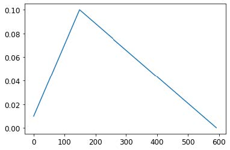

### 总结

在本章中，我们通过重新实现的方式探索了fastai库核心概念的具体实现方式。由于内容主要以代码为主，建议你务必通过查阅本书官网上的对应笔记本进行实践操作。既然你已了解其构建原理，下一步请务必查阅 fastai 文档中的中级和高级教程，学习如何定制库中的每个细节。

### 问卷调查

> 实验
>
> 对于要求解释函数或类是什么的问题，你还应完成自己的代码实验。

1. 什么是 `glob` ？
2. 如何使用Python图像库打开图像？
3. `L.map` 的作用是什么？
4. `Self` 的作用是什么？
5. `L.val2idx` 是什么？
6. 创建自定义数据集需要实现哪些方法？
7. 从Imagenette打开图像时为何要调用 `convert` ？
8. `~` 的作用是什么？它如何用于分割训练集和验证集？
9. `~` 是否适用于 `L` 或 `Tensor` 类？对 NumPy 数组、Python 列表或 Pandas DataFrame 又如何？
10. `ProcessPoolExecutor` 是什么？
11. `L.range(self.ds)` 如何工作？
12. `__iter__` 是什么？
13. `first` 是什么？
14. `permute` 是什么？为何需要它？
15. 何谓递归函数？它如何帮助我们定义 `parameters` 方法？
16. 编写递归函数返回斐波那契数列的前20项。
17. `super` 是什么？
18. `Module` 的子类为何需要重写 `forward` 而非定义 `__call__` ？
19. 在 `ConvLayer` 中，`init` 为何依赖 `act`？
20. `Sequential` 为何需要调用 `register_modules`？
21. 编写一个钩子函数，打印每个层激活值的形状。
22. 什么是 LogSumExp 优化技巧？
23. `log_softmax` 有何用处？
24. 什么是 `GetAttr`？它如何帮助回调函数？
25. 重新实现本章中任意一个回调函数，且不继承自 `Callback` 或 `GetAttr` 。
26. `Learner.__call__` 的作用是什么？
27. 什么是 `getattr` ？（注意与 `GetAttr` 的大小写差异！）
28. `fit` 中为何设置 `try` 块？
29. `one_batch` 中为何要检查 `model.training` ？
30. `store_attr` 的作用是什么？
31. `TrackResults.before_epoch` 的目的何在？
32. `model.cuda` 的功能及工作原理是什么？
33. 为何在 `LRFinder` 和 `OneCycle` 中需要检查 `model.training` 状态？
34. 在 `OneCycle` 中实现余弦退火算法。

#### 进一步研究

1. 从零开始编写 `resnet18`（必要时可参考第14章），并使用本章的 `Learner` 进行训练。
2. 从零实现一个批归一化层，并在你自己的 `resnet18` 中使用它。
3. 编写一个用于本章的 `Mixup` 回调函数。
4. 为SGD添加动量。
5. 从 fastai（或其他库）中挑选若干感兴趣的功能，使用本章创建的对象实现它们。
6. 选择一篇尚未在 fastai 或 PyTorch 中实现的研究论文，使用本章创建的对象进行实现。随后：
   - 将该论文移植到 fastai。
   - 向 fastai 提交 pull request，或创建自己的扩展模块并发布。

​	提示：使用 `nbdev` 创建和部署包可能有所帮助。

## 20. 结语

恭喜！你做到了！若你已完成所有笔记本的学习，便已加入这个虽小却日益壮大的群体——他们能够驾驭深度学习的力量解决实际问题。你或许并不这么认为——事实上，你很可能确实如此。我们反复观察到，完成fast.ai课程的学生往往严重低估自己作为深度学习实践者的能力。我们同样发现，这些学习者常被传统学术背景的人低估。因此，若想超越自我与他人的预期，合上本书后你将采取的行动，比此前所有努力都更为关键。

最重要的是像动量那样保持持续增长。事实上，正如你从优化器研究中了解到的那样，动量具有自我增强的特性！因此，请思考当下能采取哪些措施来维持并加速你的深度学习之旅。图20-1能为你提供一些思路。


[^图20-1]: 下一步应该做什么

在这本书中，我们多次探讨了写的价值，无论是代码还是散文。但或许你至今的写作量尚未达到预期。没关系！现在正是扭转局面的绝佳时机。此刻你心中有太多话要说。或许你已在数据集上进行过某些实验，而其他人似乎从未以相同视角审视过这些数据。向世界分享你的发现吧！又或许你在阅读过程中萌生了某些灵感——现在正是将这些想法转化为代码的最佳时机。

如果你想分享想法，fast.ai论坛是个相当低调的交流平台。您会发现那里的社区充满支持与帮助，欢迎随时造访并分享你的近况。或者，不妨尝试解答那些比你更早踏上学习之路的伙伴们提出的问题。

若你在深度学习的旅程中取得了一些成就——无论大小——请务必告诉我们！在论坛上分享这些成果尤其有益，因为了解其他学员的成功经验能带来极大的激励作用。

对许多人而言，保持学习旅程连贯性的关键方法或许是围绕学习建立社群。例如，你可以在本地社区组织小型深度学习聚会，组建学习小组，甚至主动在本地聚会上分享你的学习成果或感兴趣的特定领域。不必在意自己尚未成为世界顶尖专家——关键在于你已掌握许多他人尚未了解的知识，因此你的见解很可能受到重视。

另一个被许多人认为有用的社区活动是定期举办的读书会或论文阅读会。你或许能在自己居住的社区找到现有的活动，如果没有的话，不妨尝试发起一个。即使只有另一个人与你共同参与，也能为你提供坚持下去所需的支持与鼓励。

如果你所在的地区不便与志同道合者线下聚会，欢迎光临论坛——那里总有人在组建虚拟学习小组。这类小组通常由一群人每周通过视频聊天聚会，共同探讨深度学习相关议题。

希望到此刻，你已经完成了一些小型项目和实验。我们建议你下一步选择其中一个项目，全力将其打磨到最佳状态。真正将其打磨成你能力范围内最优秀的作品——一件令你真正引以为傲的作品。这将迫使你深入探索某个主题，既能检验你的理解程度，又能让你看到专注投入时能达到的高度。

此外，你或许可以看看fast.ai的免费在线课程，它涵盖了与本书相同的知识内容。有时，通过两种不同方式接触相同内容，能真正帮助你厘清思路。事实上，人类学习研究者发现，学习知识的最佳方式之一就是从不同角度观察同一事物，并通过不同方式进行描述。

你的最终任务，若你选择接受，便是拿起这本书，将其赠予你认识的人——让另一个人开启属于他们自己的深度学习之旅！

# 附录

## 附录A 创建一个博客

在第二章中，我们建议你不妨尝试通过博客来帮助消化阅读和实践中的信息。但如果你还没有博客呢？该选择哪个平台呢？

遗憾的是，在博客领域，人们似乎不得不面临艰难抉择：要么选择便捷但会让你和读者暴露在广告、付费墙及各种费用的平台，要么耗费数小时搭建自有主机服务，再花数周时间钻研各种复杂细节。“自己动手”方式最大的益处，或许在于你真正拥有自己的文章，而非受制于服务商及其未来如何变现你内容的决策。

然而，事实证明，你可以两全其美！

### 使用 Github Pages 搭建博客

一个绝佳的解决方案是将博客托管在名为GitHub Pages的平台上。该平台免费、无广告且无付费墙，并以标准格式提供数据，使你随时可将博客迁移至其他主机。但我们所见的所有GitHub Pages使用方法都要求掌握命令行操作和晦涩工具——这些工具通常只有软件开发者才熟悉。例如GitHub官方的博客搭建指南就包含冗长的操作步骤：安装Ruby编程语言、使用 `git` 命令行工具、复制版本号等——总计多达17个步骤！

为简化操作流程，我们开发了一套便捷方案，让你能通过纯浏览器界面满足所有博客需求。你只需约五分钟即可完成新博客的创建与运行。完全免费，若需自定义域名也轻松实现。本节将以我们设计的 `fast_template` 模板为例进行操作说明。（注：请务必访问本书官网获取最新博客推荐，因新工具持续更新。）

#### 创建仓库

你需要一个 GitHub 账户，所以现在就去那里创建一个账户吧，如果你还没有的话。通常，GitHub 是由软件开发人员用来编写代码的，他们使用一个复杂的命令行工具来操作它——但我们将向你展示一种完全不使用命令行的方法！

开始前，请将浏览器指向 https://github.com/fastai/fast_template/generate（确保你已登录）。这将允许你创建一个存储博客的位置，称为仓库。你将看到类似图A-1所示的界面。请注意，你必须严格按照此处示例格式输入仓库名称——即你的 GitHub 用户名后接 `.github.io`。


[^图A-1]: 创建你自己的仓库

输入上述内容及任意描述后，点击“从模板创建仓库”。你可以选择将仓库设为“私有”，但既然您创建的是希望他人阅读的博客，让底层文件公开可见应该不会造成困扰。（译者注：如果你是Github免费计划用户，那么如果将仓库设为私有，将无法生成Github Pages）

现在，让我们来设置你的主页吧！

#### 设置你的主页

当读者访问你的博客时，首先看到的是名为 `index.md` 的文件内容。这是 Markdown 格式文件。Markdown 是一种强大而简洁的文本格式化工具，可创建项目符号、斜体、超链接等效果。它被广泛应用于 Jupyter 笔记本的所有格式设置、GitHub网站几乎所有部分，以及互联网上的许多其他地方。要创建Markdown文本，只需输入普通英文（译者注：中文当然也行），然后添加一些特殊字符来实现特殊效果。例如，在单词或短语前后添加 `*` 字符，即可将其设置为斜体。现在就来试试吧。

要打开文件，请在 GitHub 中点击其文件名。要编辑文件，请点击屏幕最右侧的铅笔图标，如图 A-2 所示。


[^图A-2]: 编辑文件

你可以添加、编辑或替换所见文本。点击“预览更改”（Preview changes）按钮（图A-3）即可查看Markdown文本在博客中的显示效果。新增或修改的行将在左侧显示绿色标记条。


[^图A-3]: 预览更改并检查错误

要保存更改，请滚动至页面底部并点击“提交更改”（Commit changes），如图A-4所示。在GitHub上，“提交”（Commit）意味着将内容保存至GitHub服务器。


[^图A-4]: 提交更改并保存

接下来，你需要配置博客设置。操作步骤如下：点击名为 `_config.yml` 的文件，然后像编辑索引文件那样点击编辑按钮。修改标题、描述和GitHub用户名字段（参见图A-5）。请注意：冒号前的名称需保留原样，仅在冒号后（加空格）输入新值。若需添加邮箱地址和Twitter用户名，可在此处填写，但请注意这些信息将显示在你的公开博客上。


[^图A-5]: 填写设置文件

完成后，你可以像处理 `index` 文件那样提交更改；随后等待约一分钟，让 GitHub 处理你的新博客。在浏览器中访问 `<username>.github.io`（将 `<username>` 替换为你自己的 GitHub 用户名）。你将看到博客页面，其外观类似于图 A-6 所示。


[^图A-6]: 你的博客成功上线啦

#### 创建帖子

现在你可以创建第一篇帖子了。所有博文都将存放在 `_posts`文件夹中。点击该文件夹，然后点击“创建文件”（Create file）按钮。请注意文件命名必须遵循 `<年份>-<月份>-<日期>-<名称>.md`，如图A-7所示，其中<年份>为四位数字，<月份>和<日期>为两位数字。<名称>可自定义为有助于记忆文章主题的任意名称。文件后缀 `.md` 专用于Markdown文档。


[^图A-7]: 命名你的帖子

然后你可以输入你的第一篇帖子内容。唯一规则是：帖子首行必须采用Markdown标题格式。具体操作是在行首添加 `#` 符号，如图A-8所示（该格式生成一级标题，建议仅在文档开头使用一次；二级标题使用 `##` ，三级标题使用 `###` ，依此类推）。


[^图A-8]: 标题的md格式

与之前一样，你可以点击预览按钮查看你的Markdown格式化效果（图A-9）。


[^图A-9]: 之前的Markdown语法在你的博客上会是什么样子

你需要点击“提交新文件（Commit new file）”按钮将其保存至GitHub，如图A-10所示。


[^A-10]: 提交更改并保存

再次查看你的博客主页，你会发现这篇博文现已显示——图A-11展示了我们刚刚添加的示例博文效果。请注意，你需要等待约一分钟左右，待GitHub处理请求后文件才会显示出来。


[^图A-11]: 你的第一个帖子已经成功发布！

你可能已经注意到，我们提供了一篇示例博客文章，现在你可以将其删除。请像之前那样进入 `_posts` 文件夹，点击 `2020-01-14-welcome.md` 文件，然后点击最右侧的垃圾桶图标（如图A-12所示）。


[^图A-12]: 删除示例帖子

在 GitHub 中，除非提交更改，否则任何操作都不会生效——包括删除文件！因此，点击垃圾桶图标后，请滚动至页面底部并提交更改。

你可以在文章中添加图片，只需添加一行Markdown格式，例如：

```markdown

```

要使此功能生效，你需要将图片放置在images文件夹内。具体操作步骤如下：点击images文件夹，然后点击“上传文件”（Upload files）按钮（图A-13）。


[^图A-13]: 从你的电脑上上传文件

现在让我们看看如何直接在电脑上完成所有这些操作。

#### 同步 GitHub 与你的计算机

你可能出于多种原因需要将博客内容从 GitHub 复制到本地电脑——比如希望离线阅读或编辑文章，或者为 GitHub 仓库意外丢失提前备份。

GitHub不仅允许你将仓库复制到本地计算机，还能实现仓库与计算机的同步。这意味着：你在GitHub上所做的修改会同步到本地计算机；同样，你在本地计算机上的修改也会同步到GitHub。你甚至可允许他人访问并修改你的博客，下次同步时，他们的修改与您你

要使此功能正常工作，你需要在计算机上安装名为 GitHub Desktop 的应用程序。该程序支持 Mac、Windows 和 Linux 系统。按照指引完成安装后，运行程序时系统会提示你登录 GitHub 并选择要同步的仓库。如图 A-14 所示，点击“从互联网克隆仓库”。


[^图A-14]: 使用桌面端Github克隆仓库

当GitHub完成仓库同步后，你即可点击“在资源管理器（或Finder（译者注：Mac系统的文件管理器。即访达））中查看仓库文件”（如图A-15所示），此时你将看到博客的本地副本！请尝试编辑计算机上的某个文件，随后返回GitHub桌面端，你会发现“同步”按钮正等待你点击。点击后，修改内容将同步至GitHub，网站页面将实时更新显示这些变更。


[^A-15]: 在本地查看文件

若你尚未接触过Git，GitHub Desktop是入门的好选择。你将发现，这是大多数数据科学家必备的基础工具。另一款我们希望你爱不释手的工具是Jupyter Notebook——你甚至能直接用它撰写博客！

### 使用 Jupyter 写博客

n 还可以使用Jupyter笔记本撰写博客文章。n 的Markdown单元格、代码单元格以及所有输出内容都将出现在导出的博客文章中。最佳实现方式可能已随时间更新，建议查阅本书官网获取最新信息。截至撰写本文时，最简便的笔记本转博客方案是使用 `fastpages`——这是 `fast_template` 的增强版本。

要用笔记本写博客，只需将其放入博客仓库的 `_notebooks` 文件夹，它就会出现在博客文章列表中。编写笔记本时，请直接写下希望读者看到的内容。由于多数写作平台难以嵌入代码和输出结果，我们常不自觉地减少真实示例的使用。这种方式能有效培养你在写作时大量引用示例的习惯。

通常，你可能希望隐藏诸如导入语句之类的固定代码。你可以在任意单元格顶部添加 `#hide` 标记，使其不显示在输出中。Jupyter会自动显示单元格最后一行代码的结果，因此无需添加 `print` 语句。（包含多余代码会增加读者的认知负担，请避免添加非必需代码！）

## 附录B 数据项目检查清单

创建有价值的数据项目远不止于训练一个精准的模型！杰里米从事咨询工作时，总会基于以下考量来理解组织开发数据项目的背景，这些考量总结于图B-1：

- 战略

  组织试图实现什么目标，又需要改变哪些杠杆才能更好地达成目标？

- 数据

  组织是否收集了必要数据并确保其可用性？

- 分析能力

  哪些洞察对组织具有实用价值？

- 实施能力

  组织具备哪些可用能力？

- 维护机制

  建立了哪些系统来追踪运营环境的变化？

- 制约因素

  在上述各领域需要考虑哪些制约因素？


[^图B-1]: 分析价值链

他设计了一份问卷，要求客户在项目启动前填写，并在整个项目过程中协助他们完善答案。这份问卷基于数十年来跨多个行业的项目经验，涵盖农业、采矿、银行业、酿酒业、电信业、零售业等领域。

在探讨分析价值链之前，问卷的第一部分涉及数据项目中最关键的员工：数据科学家。

### 数据科学家

数据科学家应拥有晋升为高级管理人员明确的职业路径，同时应制定招聘计划，将数据专家直接引入高级管理岗位。在数据驱动型组织中，数据科学家应位列薪酬最高的员工行列。组织应建立完善机制，使全公司数据科学家能够开展协作并相互学习。

- 当前组织内具备哪些数据科学技能？
- 如何招聘数据科学家？
- 如何在组织内部识别具备数据科学技能的人才？
- 需要哪些技能？如何评估这些技能？这些技能如何被认定为重要技能？
- 使用哪些数据科学咨询服务？在哪些情况下将数据科学工作外包？如何将这些工作转移至组织内部？
- 数据科学家的薪酬水平如何？他们向谁汇报？如何保持其技能更新？
- 数据科学家的职业发展路径是怎样的？
- 拥有强大数据分析能力的高管有多少？
- 如何选择和分配数据科学家的工作？
- 数据科学家可以使用哪些软件和硬件？

### 战略

所有数据项目都应基于解决具有战略重要性的问题。因此，对业务战略的理解必须放在首位。

- 当前组织面临的五大关键战略问题是什么？
- 有哪些可用数据可帮助应对这些问题？
- 是否采用数据驱动方法处理这些问题？数据科学家是否参与其中？
- 组织能够最有效影响哪些利润驱动因素？（参见图B-2）


[^图B-2]: 可能成为组织重要利润驱动因素的要素

- 对于每个已识别的关键利润驱动因素，组织可采取哪些具体行动和决策来影响该驱动因素？包括运营层面的行动（例如致电客户）和战略决策（例如发布新产品）。

- 针对每项最重要的行动与决策，哪些数据（无论是组织内部、供应商提供的，还是未来可收集的数据）可能有助于优化结果？

- 基于上述分析，组织内部数据驱动分析的最大机遇是什么？
- 对于每个机遇：
  - 该设计旨在影响何种价值驱动因素？
  - 它将推动哪些具体行动或决策？
  - 这些行动与决策将如何关联至项目成果？
  - 该项目预计投资回报率是多少？
  - 是否存在可能影响项目的时间限制与截止期限？

### 数据

没有数据，我们就无法训练模型！数据还必须具备可用性、整合性与可验证性。

- 该组织拥有哪些数据平台？这些可能包括数据集市、OLAP多维数据集、数据仓库、Hadoop集群、OLTP系统、部门级电子表格等。
- 请提供任何已整理的信息，以概述组织内的数据可用性状况，以及当前构建数据平台的工作进展和未来规划。
- 现有哪些工具和流程可在不同系统与格式间迁移数据？
- 不同用户组和管理员如何访问数据源？
- 组织内的数据科学家和系统管理员可使用哪些数据访问工具（如数据库客户端、OLAP客户端、内部软件、SAS等）？各工具的使用人数及使用者在组织中的职位都是什么？
- 如何向用户通报新系统上线、系统变更、新增/修改数据元素等信息？请举例说明。
- 数据访问权限限制如何决策？如何管理受保护数据的访问请求？由谁负责？依据何种标准？平均响应时间是多少？请求接受率是多少？如何追踪？
- 组织如何决定何时收集额外数据或购买外部数据？请举例说明。
- 迄今为止，哪些数据被用于分析近期数据驱动型项目？哪些数据被认为最有价值？哪些数据无用？如何判断？
- 哪些额外内部数据可能为拟议项目的数据驱动决策提供洞见？外部数据呢？
- 获取或整合这些数据可能面临哪些限制或挑战？
- 过去两年中，数据收集、编码、整合等环节发生了哪些变化，可能影响已收集数据的解读或可用性？

### 分析能力

数据科学家需要能够获取符合自身特定需求的最新工具。应定期评估新工具，以判断其是否能显著提升现有方法的效能。

- 该组织使用哪些分析工具？由谁使用？这些工具如何选型、配置和维护？在客户端计算机上部署新增分析工具的流程是什么？平均完成时间为多久？请求接受率是多少？
- 外部顾问构建的分析系统如何移交至本组织？是否要求外部承包商限制使用系统以确保结果符合内部基础设施？
- 何种情况下采用云处理？云计算使用计划是什么？
- 何种情况下聘请外部专家进行专项分析？如何管理此类合作？专家如何识别与选拔？
- 近期项目尝试过哪些分析工具？
- 哪些有效，哪些无效？原因何在？
- 请提供这些项目迄今可获取的工作成果。
- 如何评估分析结果？采用哪些指标？参照何种基准？如何判断模型是否“足够好”？
- 组织在何种情境下使用可视化工具、表格报告与预测建模（及类似机器学习工具）？对于更高级的建模方法，如何校准和测试模型？请提供实例。

### 实施能力

技术限制常常是数据项目失败的根源。请在项目初期就充分考虑这些因素！

- 提供一些过去数据驱动项目的实例，其中包含成功与失败的实施案例，并详细说明IT集成和人力资本方面的挑战以及应对方式。
- 在实施前如何验证分析模型的有效性？如何进行基准测试？
- 如何定义分析项目实施的性能要求（在速度和准确性方面）？
- 针对拟议项目，请提供以下信息：
  - 哪些IT系统将用于支持数据驱动的决策与行动
  - 如何实现该IT系统集成
  - 有哪些替代方案可能需要较少的IT集成
  - 哪些工作岗位将受到数据驱动方法的影响
  - 这些员工将接受何种培训、监督与支持
  - 可能出现的实施挑战有哪些
  - 需要哪些利益相关方确保实施成功，以及他们可能如何看待这些项目及其潜在影响

### 维护机制

除非你仔细追踪你的模型，否则可能会发现它们正将你引向灾难。

- 第三方构建的分析系统如何维护？何时移交至内部团队？
- 如何追踪模型有效性？组织何时决定重建模型？
- 数据变更如何在内部传达及管理？
- 数据科学家如何与软件工程师协作确保算法正确实现？
- 测试用例何时开发及如何维护？
- 代码重构何时执行？重构期间如何维护和验证模型的正确性与性能？
- 维护和支持需求如何记录？这些记录如何被利用？

### 制约因素

对于每个正在考虑的项目，列举可能影响项目成功的潜在限制因素。

- 是否需要修改或开发IT系统以应用项目成果？是否有更简便的实施方案可避免重大IT变更？若有，采用简化方案将如何显著降低影响？
- 数据收集、分析或实施方面存在哪些监管限制？近期是否审查过相关法规及判例？可能存在哪些变通方案？
- 组织层面存在哪些限制，包括文化、技能或结构方面的限制？
- 管理层存在哪些限制？
- 过去是否有过可能影响组织看待数据驱动方法的分析项目？