# 第一部分：实践中的深度学习

## 1. 你的深度学习旅程

你好，感谢你让我们加入你的深度学习之旅，无论已经走得多远！在本章中，我们将进一步介绍本书的框架架构，阐释深度学习的核心概念，并指导你在不同任务场景下训练首个模型。即使你没有技术或数学背景也完全不必担心（当然若有相关背景也相当有用！）；本书的创作初衷正是为了让深度学习知识惠及最广泛的读者群体。

### 深度学习是大家的

许多人以为要取得深度学习的卓越成果，就必须准备各种稀罕难觅的工具，但正如本书将揭示的那样，这种想法大错特错。表1-1列举了若干实现世界级深度学习时*完全不需要* 的要素。

| 传说（真的不需要） | 真相                                       |
| ------------------ | ------------------------------------------ |
| 很多数学知识       | 会高中数学就行了                           |
| 很多数据           | 我们仅使用不到50项数据就取得了破纪录的成果 |
| 很多很贵很贵的电脑 | 你可以免费获得进行尖端研究所需的一切资源   |

*深度学习* 是一种计算机技术，通过多层神经网络提取和转换数据，应用场景涵盖人类语音识别到动物图像分类。每层网络都从前一层获取输入数据，并逐步进行精炼。这些层通过算法训练，该算法通过最小化错误来提高准确性。通过这种方式，网络可以学会执行特定任务。我们将在下一节详细讨论训练算法。

深度学习兼具强大功能、灵活适应性和操作简便性。正因如此，我们坚信它应广泛应用于众多学科领域，包括社会科学、自然科学、艺术、医学、金融、科学研究等诸多领域。以个人为例，尽管毫无医学背景，Jeremy仍创立了Enlitic公司，该公司运用深度学习算法进行疾病诊断。公司成立仅数月，便宣布其算法识别恶性肿瘤的准确率已超越放射科医师。

以下是一些领域中数千项任务的列表，在这些任务中，深度学习或大量使用深度学习的方法目前是全球最优解：

- 自然语言处理（NLP）

  回答问题；语音识别；文档摘要；文档分类；在文档中查找人名、日期等信息；搜索提及特定概念的文章

- 计算机视觉

  卫星与无人机影像解译（例如用于灾害抗灾能力评估）、人脸识别、图像描述生成、交通标志识别、自动驾驶车辆中行人与车辆定位

- 医药学

  在放射影像（包括CT、MRI和X光影像）中发现异常；统计病理切片中的特征；测量超声影像中的特征；诊断糖尿病视网膜病变

- 生物学

  蛋白质折叠；蛋白质分类；各种基因组学任务，例如肿瘤-正常测序及临床可操作性基因突变分类；细胞分类；蛋白质-蛋白质相互作用分析

- 图像生成

  为图像上色、提升图像分辨率、去除图像噪点、将图像转换为著名艺术家风格的艺术作品

- 推荐系统

  网页搜索、产品推荐、主页布局

- 游戏领域

  国际象棋、围棋、大多数Atari电子游戏以及许多即时战略游戏

- 机器人

  处理难以定位（例如透明、光滑、缺乏纹理）或难以拾取的物体

- 其他应用

  财务与物流预测、文本转语音，以及更多、更多功能……

值得我们注意的是，深度学习的应用如此广泛，然而几乎所有的深度学习都基于一种创新的模型类型：神经网络。

但神经网络实际上并非全新事物。为了更全面地理解该领域，我们不妨从历史沿革说起。

### 神经网络：一段简史

1943年，神经生理学家 Warren McCulloch 与逻辑学家 Walter Pitts 合作，共同开发出一种人工神经元的数学模型。在他们的论文《神经活动内在观念的逻辑演算》中，他们提出如下论断：

> 由于神经活动的“全有或全无”特性，神经事件及其相互关系可通过命题逻辑进行处理。研究发现，每种神经网络的行为均可通过此逻辑进行描述。

McCulloch和Pitts意识到，真实神经元的简化模型可通过简单的加法和阈值处理来表示，如图1-1所示。Pitts是自学成才，12岁时便收到剑桥大学的邀请，本来计划跟随伟大的B ertrand Russell 学习。他并未接受此邀约，事实上，他一生中从未接受过任何高级学位或权威职位的邀请。他大部分著名著作都是在无家可归期间完成的。尽管缺乏官方认可的职位且日益被社会孤立，他与McCulloch的合作仍产生了深远影响，其成果被心理学家Frank Rosenblatt继承发扬。


[^图1-1]: 自然神经元与人工神经元

Rosenblatt 进一步发展了人工神经元，使其具备学习能力。更重要的是，他致力于构建首个运用这些原理的装置——马克一型感知器。在《智能自动机的设计》一文中，Rosenblatt 这样描述这项工作：“我们即将见证这样一台机器的诞生——它无需人类训练或控制，就能感知、识别并辨别周围环境。”感知机建成后成功实现了对简单形状的识别。

麻省理工学院的 Marvin Minsky 教授（他与Rosenblatt在同一所高中就读，年级比Rosenblatt低一届！）与 Seymour Papert 特合著了《感知器》（麻省理工出版社）一书，探讨Rosenblatt的发明。他们指出单层感知器无法学习某些简单却关键的数学函数（如异或运算）。在同一本书中，他们同时指出：通过多层结构可突破此限制。遗憾的是，学术界仅广泛认可了前者。此后二十年间，全球学术界几乎完全放弃了对神经网络的研究。

过去五十年间神经网络领域最具里程碑意义的著作，当属David Rumelhart, James McClelland及其PDP研究小组于1986年由麻省理工学院出版社出版的多卷本《并行分布式处理》（Parallel Distributed Processing，PDP）。该书第一章阐述的愿景与Rosenblatt所展现的相呼应：

> 人类比当今计算机更聪明，因为大脑采用的基本计算架构更适合处理人类擅长的自然信息处理任务的核心环节……我们将提出一种用于建模认知过程的计算框架，该框架似乎比其他框架更接近大脑可能采用的计算方式。

PDP理论在此提出的前提是：传统计算机程序的工作方式与大脑截然不同，这或许正是计算机程序（当时）在处理大脑轻松完成的任务（如识别图片中的物体）时表现欠佳的原因。作者声称PDP方法比其他框架更接近大脑运作方式，因此可能更擅长处理此类任务。

事实上，PDP中阐述的方法与当今神经网络采用的方法非常相似。该书将并行分布式处理定义为需要满足以下条件：

- 一组处理单元
- 一种激活状态
- 每个单元的输出函数
- 一种单元间的连接模式
- 一种传播规则，用于通过连接网络传播活动模式
- 一种激活规则，用于将作用于单元的输入与该单元当前状态结合，从而产生单元输出
- 一种学习规则，通过经验修改连接模式
- 一个系统可以正常运行的环境

我们将在这本书中看到，现代神经网络能够满足上述各项要求。

在1980年代，大多数模型都构建了第二层神经元，从而规避了Minsky 和
Papert所指出的问题（若沿用前文框架，这正是他们所说的“单元间连接模式”）。事实上，神经网络在80、90年代被广泛应用于实际项目。然而，理论层面的误解再度阻碍了该领域发展。理论上，仅需增加一层神经元便足以使神经网络近似任何数学函数，但实践中这类网络往往过于庞大且运行缓慢，难以发挥实际效用。

尽管研究人员早在30年前就证明，要获得实用且良好的性能，需要使用更多层神经元，但直到近十年，这一原理才得到更广泛的认可与应用。得益于多层结构的应用，加之计算机硬件的提升、数据可用性的增加以及算法优化使神经网络得以更快更轻松地训练，神经网络如今终于释放出其潜在价值。如今我们已拥有Rosenblatt预言的成果：“无需人类训练或控制，便能感知、识别并判定环境的机器。”

本书将教你如何构建这些内容。不过首先，既然我们即将共度漫长时光，让我们先互相了解一下……

### 我们是谁

我们是Sylvain 和 Jeremy，此次旅程的向导。我们希望您能认为我们非常适合这个职位。

Jeremy 从事机器学习应用与教学工作已有约30年。他25年前开始使用神经网络技术。在此期间，他领导过众多以机器学习为核心的公司和项目，包括创立首家专注深度学习与医学领域的公司Enlitic，并担任全球最大机器学习社区Kaggle的总裁兼首席科学家。他与Rachel Thomas博士共同创立fast.ai，该机构开发的课程正是本书的理论基础。

不时地，你会直接从我们这里收到侧边栏消息，像这样的一条，来自Jeremy：

> JEREMY说
>
> 大家好，我是Jeremy！你们或许会感兴趣的是，我并没有接受过任何正规的技术教育。我获得了哲学专业的文学学士学位，成绩并不突出。比起理论研究，我更热衷于参与实际项目，因此大学期间我一直在麦肯锡公司担任全职管理咨询顾问。如果你也是宁愿亲手实践而非耗费数年钻研抽象概念的人，你定能理解我的处境！请留意我撰写的侧边栏内容，那里提供最适合数学或技术背景较弱人群的信息——也就是像我这样的人……

另一方面，Sylvain 对正规技术教育颇有研究。他撰写了10本数学教材，涵盖了整个法国高等数学课程体系！

> SYLVAIN说
>
> 与Jeremy不同，我并未花费多年时间编写代码并应用机器学习算法。相反，我最近通过观看他的fast.ai课程视频才进入机器学习领域。因此，如果你从未打开过终端并在命令行中编写过命令，你就会理解我的出发点！请留意我添加的侧边栏注释，其中包含最适合具有数学或正式技术背景、但缺乏实际编码经验的人群的信息——也就是像我这样的人……

fast.ai课程吸引了来自世界各地、各行各业的数十万学员。Sylvain成为Jeremy所见过的最杰出的学员，由此加入fast.ai团队，并与Jeremy共同开发了fastai软件库。

这一切意味着，在我们团队中，你将获得两全其美的优势：既有比任何人都更了解该软件的人——因为他们亲手编写了它；既有数学专家，也有编程与机器学习专家；同时还有这样一群人：他们既能体会作为数学领域相对外行者的感受，也能理解在编程与机器学习领域相对陌生的处境。

任何看过体育赛事的人都知道，如果有一对解说搭档，就需要第三人负责“特别点评”。我们的特邀评论员是Alexis Gallagher。Alexis拥有多元化的背景：他曾是数学生物学研究员、剧本作家、即兴表演者、麦肯锡顾问（就像Jeremy！）、Swift程序员，还担任过首席技术官。

> ALEXIS说
>
> 我决定开始学习人工智能了！毕竟其他领域我几乎都尝试过了……虽然我对构建机器学习模型毫无基础，但……这能有多难？我将和你们一样，通过这本书逐步学习。请留意我分享的学习小贴士，这些是我在学习过程中发现的实用技巧，希望对你也有帮助。

### 如何学习深度学习

哈佛大学教授David Perkins在其著作《完整学习法》（Jossey-Bass出版社）中对教学提出了诸多见解。其核心理念在于传授完整的游戏体系。这意味着若教授棒球运动，应先带学员观赛或亲身体验，而非从零开始讲解如何缠绕麻绳制作棒球、抛物线物理原理或球体在球棒上的摩擦系数。

Paul Lockhart，哥伦比亚大学数学博士、布朗大学前教授及中小学数学教师，在其具有深远影响的论文 [《数学家的哀叹》](https://oreil.ly/yNimZ) 中描绘了一个噩梦般的世界：音乐与艺术竟被以数学的方式教授。孩子们必须耗费十余年掌握乐谱与理论，在课堂上反复将乐谱转调至不同调性，才能被允许聆听或演奏音乐。美术课上，学生们学习色彩理论与工具应用，却要等到大学才能真正提笔作画。听起来荒谬？这正是数学的教学现状——我们要求学生耗费数年进行机械记忆，学习枯燥割裂的 *基础* 知识，并宣称这些知识将在未来有所回报，尽管那时大多数人早已放弃这门学科。

遗憾的是，许多深度学习教学资源正是从这里起步——要求学习者跟随黑塞矩阵的定义和损失函数泰勒近似定理进行学习，却从未给出实际运行的代码示例。我们并非贬低微积分。我们热爱微积分，Sylvain 甚至在大学讲授过这门学科，但我们认为它并非学习深度学习的最佳起点！

在深度学习中，若你怀有优化模型的动力，它确实能助你一臂之力。正是这种动力促使你开始学习相关理论。但前提是你必须先拥有模型。我们几乎所有内容都通过真实案例教学。随着案例的深入展开，我们将逐步引导你优化项目，让你在实践中逐步掌握所需的理论基础——这种情境化学习方式能让你真正理解理论的重要性及其运作机制。

因此，我们向你作出如下承诺：在本书的撰写过程中，我们始终遵循以下原则：

- 传授整套技艺

  我们将首先向你展示如何使用完整、可运行、可操作且先进的深度学习网络，通过简单而富有表现力的工具解决现实世界中的问题。随后我们将逐步深入探索这些工具的构建原理，以及构建这些工具的工具是如何诞生的，以此类推……

- 始终以实例教学

  我们将确保内容具备可直观理解的背景与目的，而非从代数符号运算开始。

- 尽可能地简化

  我们耗费多年时间开发工具并完善教学方法，使原本复杂的主题变得简单易懂。

- 清除学习障碍

  深度学习至今仍是少数人的游戏。我们正将其开放，确保人人皆可参与。

深度学习最困难的部分在于手工操作：如何判断数据是否充足、格式是否正确、模型是否正常训练？若出现问题又该如何应对？正因如此，我们主张实践出真知。如同基础数据科学技能，深度学习的精进唯有通过实践经验实现。过度沉溺理论反而可能适得其反。关键在于直接编写代码解决问题：当你具备实践背景和动力时，理论知识自然水到渠成。

我们的旅途中难免会遇到艰难时刻，有时你会感到停滞不前。请坚持下去！翻回书中最后一个你确定没有卡住的部分，然后慢慢读下去，找到第一个不清楚的地方。接着自己尝试一些代码实验，并在谷歌上搜索更多关于你卡住的问题的教程——通常你会发现对材料的不同解读角度，这可能有助于你豁然开朗。另外，首次阅读时无法完全理解内容（尤其是代码）是正常现象。试图逐段理解再推进有时反而困难。当后续内容提供更多背景，形成完整认知后，某些概念反而会豁然开朗。因此若遇到卡壳的章节，不妨先跳过继续阅读，并标记稍后回来重新研究。

请记住，成功从事深度学习并不需要特定的学术背景。许多重要的突破性成果都出自没有博士学位的研究人员之手，例如论文 [《基于深度卷积生成对抗网络的无监督表示学习》](https://oreil.ly/JV6rL) ——这是过去十年最具影响力的论文之一，被引用超过5000次——作者Alec Radford 撰写时还是本科生。即便在特斯拉这样致力于解决自动驾驶汽车极端挑战的公司，CEO埃隆·马斯克也 [表示](https://oreil.ly/nQCmO)：

> 博士学位绝对不是必需的。真正重要的是对人工智能的深刻理解，以及能够以真正有用的方式实现神经网络的能力（后者才是真正的难点）。就算你连高中都没毕业也无所谓。

不过，要想成功，你需要做的是将本书学到的知识应用到个人实践项目中，并始终坚持不懈。

#### 你的项目与你的心态

无论你渴望通过叶片照片识别植物病害，自动生成编织图案，从X光片诊断肺结核，还是判断浣熊何时使用给猫用的门——我们都将助你快速运用深度学习解决自身问题（借助他人预训练模型），随后逐步深入细节。你将在下一章开篇30分钟内，学会如何运用深度学习以顶尖精度解决自身问题！（如果你迫不及待想动手编程，现在即可直接跳转该章节。） 外界存在一种对你不利的误解，他们认为必须拥有谷歌级别的计算资源和数据集才能进行深度学习，但事实并非如此。

那么，哪些任务适合用作测试案例呢？你可以训练模型区分毕加索和莫奈的画作，或是筛选出女儿的照片而非儿子的照片。聚焦于个人爱好和热情往往更有助益——初学时设定四五个小项目而非试图解决宏大难题，效果通常更佳。由于容易陷入困境，过早追求宏大目标往往适得其反。待掌握基础后，再去完成令你真正引以为傲的作品吧！

> JEREMY说
>
> 深度学习几乎能处理任何问题。例如，我创办的第一家初创公司名为FastMail，自1999年成立之初便提供增强型电子邮件服务（至今仍在运营）。2002年，我让它采用一种原始的深度学习形式——单层神经网络，来帮助分类邮件并阻止客户收到垃圾邮件。

在深度学习领域表现出色的人通常具备的性格特征，包括玩心和好奇心。已故物理学家理查德·费曼便是我们预想中深谙深度学习之道的人物典范：他对亚原子粒子运动规律的理解，源于他观察盘子在空中旋转时晃动现象时所产生的兴趣。

现在让我们聚焦于你即将学习的内容，首先从软件开始。

### 软件：PyTorch，fastai以及Jupyter（以及为什么它无关紧要）

我们已完成数百个机器学习项目，使用过数十种软件包和多种编程语言。在fast.ai，我们编写的课程涵盖了当今主流的深度学习和机器学习软件包。自2017年PyTorch问世以来，我们投入上千小时进行测试，最终决定将其应用于未来的课程开发、软件构建及研究工作。此后，PyTorch已成为全球增长最快的深度学习库，并已被顶尖学术会议的大多数研究论文采用。这通常是产业应用的前瞻指标，因为这些论文最终会转化为商业产品与服务。我们发现PyTorch是深度学习领域中最灵活且最具表达力的库。它既不牺牲速度也不牺牲简洁性，二者兼得。

PyTorch最适合作为低级基础库，为高级功能提供基础运算支持。fastai库是基于PyTorch实现高级功能的最流行库，尤其契合本书目标——它独创性地提供了深度分层的软件架构（甚至有同行评审的学术论文探讨这种分层API）。在本书中，随着对深度学习基础的探索日益深入，我们也将逐步剖析fastai的各层架构。本书涵盖fastai库的2.0版本——这是从零重写的版本，提供了诸多独特特性。

然而，具体学习哪种软件并不重要，因为从一个库切换到另一个库只需几天时间。真正重要的是扎实掌握深度学习的基础理论和技术。我们将重点使用能清晰表达学习概念的代码。讲解高级概念时，采用高级fastai代码；教授基础概念时，则使用低级PyTorch甚至纯Python代码。

尽管如今新的深度学习库似乎正以惊人的速度涌现，但你必须做好准备迎接未来数月乃至数年间更迅猛的变化。随着更多人投身该领域，他们将带来更丰富的技能与创意，并尝试更多创新方案。你应当预见，当下所学的任何特定库与软件，一两年后都将被时代淘汰。试想在网络编程领域——这个比深度学习成熟得多且发展更缓慢的领域——技术栈和库的更新换代何其频繁。我们坚信学习的重点应放在理解底层技术原理、掌握实践应用方法，以及快速掌握新工具与技术的能力上。

读完本书，你将理解fastai内部几乎所有代码（以及PyTorch的大部分代码），因为在每个章节中，我们都会深入挖掘一层，向你展示构建和训练模型时究竟发生了什么。这意味着你将掌握现代深度学习中最关键的最佳实践——不仅学会如何使用，更能理解其背后的原理与实现机制。若需在其他框架中应用这些方法，你已具备必要的知识储备。

由于学习深度学习最重要的环节是编写代码和实验，因此拥有一个优秀的代码实验平台至关重要。最受欢迎的编程实验平台名为Jupyter，本书将全程使用该平台。我们将向您展示如何利用Jupyter训练和实验模型，并深入观察数据预处理与模型开发流程的每个阶段。Jupyter 是 Python 数据科学领域最受欢迎的工具，其受欢迎程度绝非偶然。它功能强大、灵活多变且易于使用。我们相信你一定会爱上它！

让我们在实践中看看效果，并训练我们的第一个模型。

### 你的第一个模型

正如我们之前所说，我们将先教你如何操作，再解释原理。遵循这种自上而下的方法，我们将从实际训练图像分类器开始，使其以近乎100%的准确率识别狗和猫。要训练这个模型并运行实验，你需要进行一些初始设置。别担心，这并不像看起来那么困难。

> SYLVAIN说
>
> 即使初次接触时看起来令人望而生畏，也请不要跳过设置环节，尤其当你对终端或命令行等工具几乎毫无经验时。其中大部分操作并非必需，你会发现最简单的服务器只需通过常规网页浏览器即可完成配置。为了真正掌握知识，务必在阅读本书的同时同步进行自己的实验。

#### 获取GPU深度学习服务器

要完成本书中几乎所有内容，你需要一台配备NVIDIA GPU的计算机（遗憾的是，主流深度学习库尚未完全支持其他品牌的GPU）。不过我们不建议你购买新设备；事实上，即使您已有此类设备，我们也不建议你立即使用！配置计算机需要耗费时间和精力，而此刻你应将全部精力投入深度学习。因此我们建议租用预装好所需软件且随时可用的计算机。使用成本低至每小时0.25美元，部分选项甚至完全免费。

> 术语：图形处理单元(GPU)
>
> 又称显卡。这是计算机中一种特殊的处理器，能够同时处理数千个单一任务，专门用于在计算机上显示3D环境以运行游戏。这些基本任务与神经网络的工作原理极为相似，因此GPU运行神经网络的速度可比普通CPU快数百倍。所有现代计算机均配备GPU，但仅少数搭载适用于深度学习的专用GPU。

本书推荐使用的最佳GPU服务器选择会随时间变化，因为公司会更迭，价格也会变动。我们会在 [本书官网](https://book.fast.ai) 上持续更新推荐方案列表，请立即前往该网站，按照指引连接GPU深度学习服务器。无需担心，大多数平台的配置过程仅需约两分钟，且多数平台甚至无需支付费用或提供信用卡信息即可开始使用。

> ALEXIS说
>
> 我的建议：请务必听从！如果你喜欢计算机，难免会想自己组装一台电脑。当心！虽然可行，但过程出乎意料地复杂且容易分心。本书之所以不叫《Ubuntu系统管理、NVIDIA驱动安装、apt-get、conda、pip及Jupyter Notebook配置全攻略》，
> 自有其道理——那得另写一本书。作为亲手设计部署公司生产级机器学习基础设施的人，我可以作证：虽然过程令人满足，但它与建模的关系就像维护飞机与驾驶飞机的关系一样。

网站上显示的每个选项都包含一个教程；完成教程后，您将看到类似于图1-2所示的界面。

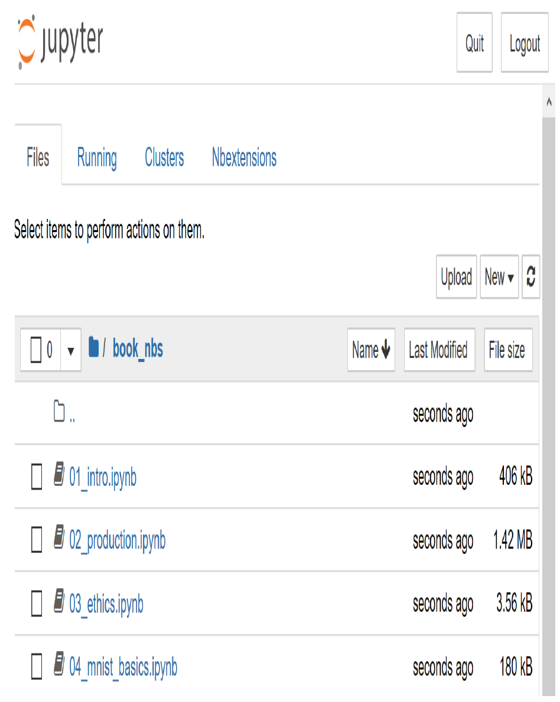

[^图1-2]: Jupyter Notebook 初始视图

现在，你已准备好运行第一个Jupyter笔记本了！

> 术语：Jupyter笔记本
>
> 一款软件，让你能够在单个交互式文档中包含格式化文本、代码、图像、视频等丰富内容。Jupyter凭借其在众多学术领域及工业界的广泛应用和巨大影响力，荣获软件界最高荣誉——ACM软件系统奖。Jupyter 笔记本是数据科学家开发深度学习模型并进行交互时使用最广泛的软件。

> 完整版与精简版
>
> 有两个文件夹包含笔记本的不同版本。完整版本文件夹包含创建你正在阅读的这本书时使用的原始笔记本，包含所有文本和输出内容。精简版保留了相同的标题和代码单元格，但删除了所有输出内容与文字说明。建议在阅读完书中某章节后，关闭书籍并尝试处理精简版笔记本：在执行每个单元格前，先尝试推测其显示内容，同时努力回忆代码所演示的功能。

要打开笔记本，只需单击它。笔记本将打开，其外观大致如图1-3所示（请注意不同平台的细节可能略有差异，这些差异可以忽略）。

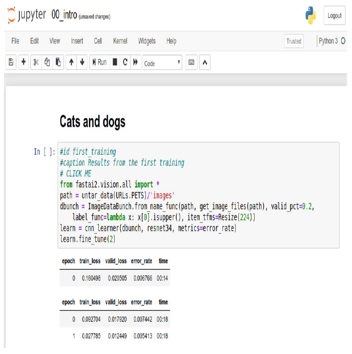

[^图1-3]: 一个Jupyter笔记本

笔记本由单元格构成。单元格主要分为两类：

- 包含格式化文本、图像等内容的单元格。这些单元格采用名为Markdown的格式，您将很快了解该格式。

- 包含可执行代码的单元格，其输出结果将立即显示在下方（可能是纯文本、表格、图像、动画、声音，甚至交互式应用程序）。

Jupyter笔记本有两种模式：编辑模式或命令模式。在编辑模式下，键盘输入的字符会以常规方式进入单元格。但在命令模式下，你不会看到闪烁光标，键盘上的每个按键都将具有特殊功能。

继续操作前，请按键盘上的Escape键切换至命令模式（若已处于命令模式，此操作无效，故请先按此键以防万一）。查看所有可用功能的完整列表请按H键；按Escape键可关闭此帮助界面。请注意，在命令模式下，与大多数程序不同，命令无需配合按住Control、Alt等特殊键——只需直接按下对应字母键即可。

按下 C 键可复制单元格（需先选中该单元格，选中状态会显示为轮廓框；若未选中，请单击该单元格一次）。随后按下 V 键即可粘贴副本。

点击以“# CLICK ME”开头的单元格进行选中它。该行首字符表明后续内容为Python注释，因此单元格执行时会被忽略。剩余部分——信不信由你——居然是一个完整的系统，用于创建并训练识别猫狗的尖端模型。所以，现在就来训练它吧！只需按下键盘上的Shift-Enter，或点击工具栏上的播放按钮。随后请稍等片刻，系统将执行以下操作：

1. 名为 [牛津-IIIT](https://oreil.ly/c_4Bv) 宠物数据集的集合包含37个品种的猫狗共7,349张图像，将从fast.ai数据集库下载至您使用的GPU服务器，随后进行解压。
2. 一个预训练模型将从互联网上下载，该模型已使用获奖模型在130万张图像上完成训练。
3. 预训练模型将运用转移学习领域的最新进展进行微调，从而创建一个专门定制用于识别猫狗的模型。

前两个步骤只需在你的GPU服务器上运行一次。若再次运行该单元格，它将使用已下载的数据集和模型，而非重新下载。让我们看看单元格内容及其结果（表1-2）：

```python
# CLICK ME
from fastai.vision.all import *
path = untar_data(URLs.PETS)/'images'

def is_cat(x): return x[0].isupper()
dls = ImageDataLoaders.from_name_func(
	path, get_image_files(path), valid_pct=0.2, seed=42,
	label_func=is_cat, item_tfms=Resize(224))

learn = cnn_learner(dls, resnet34, metrics=error_rate)
learn.fine_tune(1)
```

| 遍历数 | 训练损失 | 验证损失 | 错误率   | 时间  |
| ------ | -------- | -------- | -------- | ----- |
| 0      | 0.169390 | 0.021388 | 0.005413 | 00:14 |
| 0      | 0.058748 | 0.009240 | 0.002706 | 00:19 |

你可能不会看到与这里完全相同的测试结果。模型训练过程中存在许多微小随机变量的来源。不过在这个示例中，我们通常观察到的错误率远低于0.02。

> 训练时间
>
> 根据你的网络速度，下载预训练模型和数据集可能需要几分钟。运行 `fine_tune` 可能需要一分钟左右。本书中的模型通常需要几分钟才能训练完成，你自己的模型也是如此，因此建议您掌握一些技巧来充分利用这段时间。例如，在模型训练时继续阅读下一节内容，或打开另一个笔记本进行编码实验。

> 本书在Jupyter笔记本中撰写
>
> 我们使用Jupyter笔记本编写本书，因此书中几乎每张图表、表格和计算，都会展示精确的代码供您自行复现。正因如此，你常会看到代码后紧跟着表格、图片或纯文本内容。访问 [本书网站](https://book.fast.ai/)，你将找到所有代码，并可亲自运行和修改每个示例。
>
> 你刚刚在书中看到了输出表格的单元格效果。下面是一个输出文本的单元格示例：
>
> ```python
> 1+1
> ```
>
> ```python
> 2
> ```
>
> Jupyter 将始终打印或显示最后一行（如果有的话）的结果。例如，以下是一个输出图像的单元格示例：
>
> ```python
> img = PILImage.create('images/chapter1_cat_example.jpg')
> img.to_thumb(192)
> ```
>
> 

那么，我们如何判断这个模型是否优秀？在表格最后一列，你可以看到错误率——即识别错误的图像比例。错误率作为我们的评估指标，用于衡量模型质量，其选择标准在于直观易懂。如你所见，该模型几乎完美无缺，尽管训练时间仅需数秒（不包括数据集和预训练模型的一次性下载）。事实上，你现已达成的准确率远超十年前任何人的成就！

最后，让我们验证这个模型是否真正有效。请准备一张狗或猫的照片；若手头没有，只需搜索谷歌图片并下载任意一张图片。现在执行已定义 `uploader` 的单元格，它将生成可点击的按钮，供您选择需要分类的图像：

```python
uploader = widgets.FileUpload()
uploader
```


现在你可以将上传的文件传递给模型。请确保图片是单只狗或猫的清晰照片，而非线稿、卡通或其他类似图像。笔记本将告知你模型判断的对象是狗还是猫，以及判断的置信度。希望你会发现模型表现出色：

```python
img = PILImage.create(uploader.data[0])
is_cat,_,probs = learn.predict(img)
print(f"Is this a cat?: {is_cat}.")
print(f"Probability it's a cat: {probs[1].item():.6f}")

Is this a cat?: True.
Probability it's a cat: 0.999986
```

恭喜你完成了第一个分类器！

但这究竟意味着什么？你究竟做了什么？为了解释清楚，让我们再次拉远视角，把握全局。

#### 什么是机器学习？

你的分类器就是一种深度学习模型。正如之前所述，深度学习模型采用神经网络技术，该技术最初可追溯至1950年代，并因近年来的技术突破而变得极其强大。

另一个关键背景是，深度学习只是机器学习这一更广泛学科中的一个现代分支。要理解你在训练自己的分类模型时所做工作的本质，并不需要理解深度学习。只需认识到你的模型和训练过程如何体现了适用于机器学习的一般性概念即可。

因此在本节中，我们将阐述机器学习。我们将探讨核心概念，并追溯它们如何源自最初提出这些概念的论文。

机器学习与常规编程一样，都是让计算机完成特定任务的方式。但若要用常规编程实现前文所述的功能——识别照片中的狗与猫，我们必须为计算机详细编写完成任务所需的每一步操作步骤。

通常，我们在编写程序时很容易写下完成任务的步骤。我们只需思考如果手动完成任务会采取哪些步骤，然后将其转化为代码。例如，我们可以编写一个对列表进行排序的函数。通常我们会编写类似图1-4所示的函数（其中输入可能是未排序的列表，输出则是排序后的列表）。

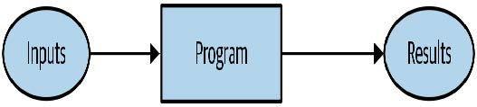

[^图1-4]: 一种传统的程序

但在识别照片中的物体时，情况就复杂得多。当我们在图片中识别某个物体时，具体会经历哪些步骤？我们其实并不清楚，因为整个过程都在大脑中悄然发生，我们对此毫无自觉意识！

早在1949年计算机诞生之初，IBM研究员Arthur Samuel便开始探索让计算机完成任务的新途径，他称之为机器学习。在其1962年的经典论文《人工智能：自动化的新领域》中，他写道：

> 为计算机编写此类计算程序，充其量也只是项艰巨任务，其困难主要并非源于计算机本身的内在复杂性，而是因为必须以令人抓狂的细节程度，逐条阐明整个过程的每个微小步骤。正如任何程序员都会告诉你的那样，计算机是巨型蠢货，而非巨型头脑。

他的基本思路是：与其告诉计算机解决问题的具体步骤，不如展示问题的实例，让计算机自己摸索解法。事实证明这种方法非常有效：到1961年，他的跳棋程序已学会如此之多，竟击败了康涅狄格州冠军！以下是他对该理念的阐述（摘自前文提及的论文）：

> 假设我们设计某种自动测试机制，用于评估当前权重分配方案在实际性能方面的有效性，并提供调整权重分配的机制以实现性能最大化。无需深入探讨具体流程细节，即可预见该机制完全可实现自动化运行，且如此编程的机器将能从经验中“学习”。

这个简短的陈述中蕴含着若干强大的概念：

- “权重分配”的概念
- 每项权重分配都具有某种“实际表现”这一事实
- 必须存在一种“自动手段”来测试该表现
- 需要一种“机制”（即另一个自动过程）通过改变权重分配来提升表现

让我们逐一探讨这些概念，以便理解它们在实践中如何相互配合。首先，我们需要理解塞缪尔所说的权重分配具体指什么。

权重只是变量，而权重分配则是对这些变量值的特定选择。程序的输入是其处理以产生结果的值——例如，将图像像素作为输入，并返回分类结果“狗”。程序的权重分配则是定义程序运行方式的其他值。

因为它们会影响程序运行，某种意义上它们属于另一种输入。我们将更新图1-4中的基本示意图，并用图1-5替换它以反映这一变化。

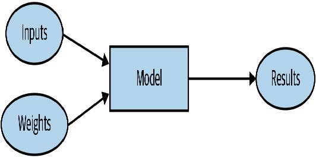

[^图1-5]: 使用权重分配的程序

我们已将方框的名称从程序改为模型。此举旨在遵循现代术语规范，并体现模型作为特殊类型程序的本质：它能根据权重值执行多种不同功能，且可通过多种方式实现。例如在塞缪尔的跳棋程序中，权重值的不同设定将导致截然不同的跳棋策略。

（顺便提一句，以防你遇到这个术语，塞缪尔所说的“权重”如今通常被称为模型参数。权重一词专指特定类型的模型参数。）

接下来，塞缪尔指出我们需要一种自动测试方法，以评估当前权重分配方案在实际表现层面的有效性。以他的跳棋程序为例，模型的“实际表现”即指其下棋水平。通过让两个模型相互对弈，观察哪一方通常获胜，便能自动测试两者的性能表现。

最后，他指出我们需要一种机制来调整权重分配，从而最大化模型性能。例如，我们可以分析胜出模型与失败模型之间的权重差异，并进一步将权重向胜出方向微调。

现在我们明白他为何说这种流程可以完全自动化，而经过如此编程的机器将能从经验中“学习”。当权重调整也实现自动化时——即不再依靠人工调整权重来改进模型，而是依赖基于性能表现自动生成调整方案的机制——学习过程便会完全自动化。

图1-6展示了Samuel关于训练机器学习模型的完整构想。

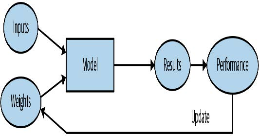

[^图1-6]: 训练机器学习模型

请注意模型结果（例如跳棋游戏中的走法）与模型表现（例如是否获胜或获胜速度）之间的区别。

另外请注意，一旦模型完成训练——即我们选定最终最优的权重分配方案后——这些权重便可视为模型的一部分，因为我们不再对其进行调整。

因此，模型训练完成后实际使用时的效果如图1-7所示。

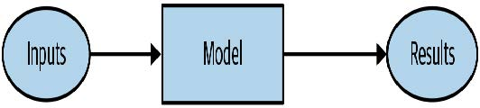

[^图1-7]: 将训练好的模型作为程序使用

这与图1-4中的原始示意图完全相同，只是将“程序”一词替换为“模型”。这是个重要洞见：训练有素的模型可以像普通计算机程序那样被使用。

> 术语：机器学习
>
> 一种通过让计算机从经验中学习而非手动编写每个步骤来开发程序的训练方法。

#### 什么是神经网络？

不难想象跳棋程序的模型可能是什么样子的。模型可能包含多种跳棋策略的编码，以及某种搜索机制，权重参数则决定策略选择方式、搜索过程中棋盘区域的关注重点等。但对于图像识别程序、文本理解程序，或是我们能想象到的许多其他有趣问题，其模型形态却完全难以预料。

我们想要的是一种极其灵活的函数，只需改变其权重，就能解决任何给定问题。令人惊叹的是，这样的函数确实存在！它就是我们之前讨论过的神经网络。也就是说，若将神经网络视为数学函数，它便成为一种依赖权重而具有极高灵活性的函数。一项名为“普适逼近定理”的数学证明表明，理论上该函数能以任意精度解决任何问题。神经网络如此灵活的特性意味着，实践中它们往往是理想的建模工具，你只需专注于训练过程——即寻找合理的权重分配方案。

但这个过程如何实现呢？可以想象，你可能需要为每个问题找到一种新的“机制”来自动更新权重。这将非常费力。我们同样希望找到一种完全通用的方法来更新神经网络的权重，使其在任何给定任务上都能得到改进。幸运的是，这样的方法确实存在！

这被称为随机梯度下降（SGD）。我们将在第四章详细探讨神经网络与SGD的工作原理，并阐释通用逼近定理。但此刻，我们不妨引用塞缪尔本人的话语：*我们无需深入探究该过程的细节，即可理解其完全自动化运行的可能性，并认识到如此编程的机器将能从经验中“学习”。*

> JEREMY说
>
> 别担心，无论是SGD还是神经网络，在数学上都不复杂。它们的工作原理几乎完全依赖加法和乘法（不过加法和乘法可做了不少！）。当学生看到具体细节时，我们听到的主要反应是：“就这么简单？”

换言之，简而言之，神经网络是一种特殊的机器学习模型，完全契合塞缪尔最初的构想。神经网络之所以特殊，在于其高度的灵活性——这意味着它们只需找到合适的权重值，就能解决异常广泛的问题。这种能力之所以强大，是因为随机梯度下降法为我们提供了一种自动寻找这些权重值的方法。

放宽视野之后，现在让我们重新聚焦并借助塞缪尔的框架来重新审视我们的图像分类问题。

我们的输入是图像。我们的权重是神经网络中的权重。我们的模型是神经网络。我们的结果是神经网络计算出的值，例如“狗”或“猫”。

那么下一部分呢？是一种自动测试当前权重分配在实际性能方面有效性的方法吗？确定“实际性能”其实相当简单：我们可以直接将模型的性能定义为其预测正确答案的准确率。

综合以上内容，并假设梯度下降（SGD）是我们更新权重分配的机制，我们就能理解图像分类器如何成为机器学习模型——这与塞缪尔的设想完全一致。

#### 一点深度学习术语

塞缪尔的研究工作开展于1960年代，此后术语体系已发生变化。以下是我们讨论过的所有概念在现代深度学习领域的对应术语：

- 模型（model）的函数形式称为其架构（architecture）（但需注意——有时人们将模型与架构视为同义词，因此可能造成混淆）。
- 权重（weights）称为参数（parameters）。
- 预测值（predictions）基于独立变量（independent variable）计算，即不含标签（labels）的数据。
- 模型输出结果（results）称为预测值（predictions）。
- 性能（performance）评估指标称为损失值（loss）。
- 损失值不仅取决于预测值，还取决于正确标签（亦称目标值（targets）或因变量（dependent variable）），例如“狗”或“猫”。

完成这些修改后，图1-6中的示意图变为图1-8。

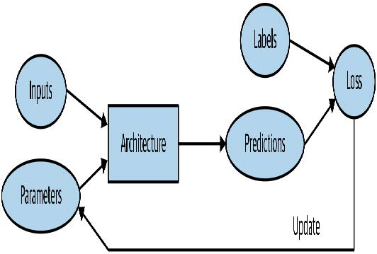

[^图1-8]: 详细的训练循环

#### 机器学习固有的局限性

从这张图中，我们现在可以看出关于训练深度学习模型的一些基本要点：

- 没有数据就无法创建模型。
- 模型只能学习处理用于训练的输入数据中出现的模式。
- 这种学习方法只能产生预测结果，而非推荐行动方案。
- 仅有输入数据示例远远不够，我们还需要为这些数据添加标签（例如：仅有猫狗图片不足以训练模型，必须为每张图片标注标签，明确区分猫与狗）。

总的来说，我们发现大多数声称数据不足的机构，实际上是指缺乏标注数据。任何有兴趣实际应用模型的机构，必然拥有计划用于模型训练的输入数据。而且他们很可能已通过其他方式（如人工操作或启发式程序）持续处理这些数据一段时间，因此他们不然积累了相关的数据！例如，放射科诊所几乎肯定会建立医学影像档案库（因为他们需要追踪患者的长期病情变化）但这些影像可能缺乏包含诊断或干预措施的结构化标签（因为放射科医师通常会写基于自由文本的自然语言报告，而非结构化数据）。本书将大量探讨标注方法，因为这是实践中至关重要的问题。

由于这类机器学习模型只能进行预测（即尝试复现标签），这可能导致组织目标与模型能力之间存在显著差距。例如，本书将教你如何创建推荐系统来预测用户可能购买的产品。这种技术常用于电子商务领域，例如通过展示最高评分的商品来定制主页展示的产品。但此类模型通常是通过分析用户及其购买历史（输入数据）来创建的，并预测用户后续购买或浏览的商品。这意味着模型更可能推荐用户已拥有或已知晓的商品，而非其真正感兴趣的新品。这与本地书店专家的做法截然不同——他们会通过提问了解你的品味，进而推荐你从未听闻的作家或系列作品。

另一项关键洞见来自于思考模型如何与环境交互。这可能形成反馈循环，正如以下所述：

1. 基于历史逮捕地点创建预测性警务模型。实际上，这并非真正预测犯罪，而是预测逮捕行为，因此在某种程度上只是反映了现有警务流程中的偏见。
2. 执法人员可能利用该模型决定警力部署重点区域，导致这些区域逮捕率上升。
3. 这些新增逮捕数据将被回馈至模型，用于训练未来版本的预测模型。

这是一个正反馈循环：模型使用得越多，数据就越偏颇，从而使模型更加偏颇，如此循环往复。

反馈循环在商业环境中也可能引发问题。例如，视频推荐系统可能存在推荐偏向——倾向于推荐给视频观看量最大的用户（例如阴谋论者和极端分子通常比普通用户观看更多在线视频内容），导致这些用户增加视频消费，进而引发更多同类视频被推荐。我们将在第3章中更详细地探讨这一话题。

既然您已经了解了理论基础，让我们回到我们的代码示例，详细看看代码是如何与我们刚刚描述的过程相对应的。

#### 我们的图像识别器是如何工作的

让我们看看图像识别代码是如何实现这些概念的。我们将每行代码单独放在一个单元格中，逐行分析其作用（暂不详解每个参数的细节，但会说明关键部分；完整细节将在本书后续章节中阐述）。第一行导入了完整的 `fastai.vision` 库：

```python
from fastai.vision.all import *
```

这为我们提供了创建各种计算机视觉模型所需的所有函数和类。

> JEREMY说
>
> 许多Python程序员建议避免像这样导入整个库（使用 `import *` 语法），因为在大规模软件项目中可能会引发问题。然而对于交互式工作场景（如Jupyter笔记本），这种方式效果极佳。fastai库正是为支持此类交互式使用而特别设计，它只会将必要的组件导入到你的工作环境中。

第二行代码会从 [fast.ai数据集集合](https://course.fast.ai/datasets) 下载标准数据集（若尚未下载）至服务器，解压数据集（若尚未解压），并返回包含解压路径的 `Path` 对象：

```python
path = untar_data(URLs.PETS)/'images'
```

> SYLVAIN说
>
> 在fast.ai的学习过程中，乃至至今，我掌握了许多高效编程实践技巧。fastai库和fast.ai笔记本中蕴含着大量实用小窍门，这些都助我成长为更优秀的程序员。例如，请注意fastai库返回的并非包含数据集路径的字符串，而是 `Path` 对象——这是Python 3标准库中极具价值的类，能显著简化文件目录操作。若你尚未接触过该类，请务必查阅其文档或教程进行实践。需特别指出的是，该库还提供了便捷的文件目录访问功能。今后遇到实用编程技巧时，我将继续与大家分享。

在第三行，我们定义了一个函数 `is_cat`，它根据数据集创建者提供的文件名规则对猫进行标注：

```python
def is_cat(x): return x[0].isupper()
```

我们在第四行使用该函数，它告知fastai我们拥有何种数据集及其结构：

```python
dls = ImageDataLoaders.from_name_func(
	path, get_image_files(path), valid_pct=0.2, seed=42,
	label_func=is_cat, item_tfms=Resize(224))
```

针对不同类型的深度学习数据集和问题，存在多种数据加载器类——本文使用的是`ImageDataLoaders` 。类名的首部分通常代表数据类型，例如图像或文本。

我们需要告知fastai的另一项重要信息是：如何从数据集中获取标签。计算机视觉数据集通常采用这样的结构：图像标签作为文件名或路径的一部分——最常见的是父文件夹名称。fastai内置了多种标准化标注方法，同时也支持自定义标注方案。此处我们指示fastai使用刚刚定义的 `is_cat` 函数。

最后，我们定义所需的转换器（ `Transforms` ）。转换器包含在训练过程中自动应用的代码；fastai内置了多种预定义转换器，新增转换器只需创建一个Python函数即可。主要分为两类：`item_tfms` 应用于每个项目（本例中每个项目会被缩放为224像素的正方形），而 `batch_tfms` 则利用GPU对整批项目同时处理，因此速度极快（本书后续将展示大量此类示例）。

为何是224像素？这是历史遗留的标准尺寸（旧版预训练模型必须严格采用此尺寸），但你几乎可以传入任意尺寸。增大尺寸通常能获得效果更佳的模型（因其能捕捉更多细节），但需以速度和内存消耗为代价；反之缩小尺寸则效果相反。

> 术语：分类与回归
>
> 分类（Classification）与回归（regression）在机器学习中具有非常特定的含义。本书将重点探讨这两类主要模型。分类模型旨在预测某个类别或分类，即从若干离散选项中进行预测，例如“狗”或“猫”。回归模型则致力于预测一个或多个数值量，例如温度或位置。有时人们会用“回归”一词特指线性回归模型；这种用法并不妥当，本书将避免使用该术语！

宠物数据集包含7,390张猫和狗图片，涵盖37个品种。每张图片通过文件名进行标注：例如文件 `great_pyrenees_173.jpg` 即为数据集中第173张大白熊犬品种的图片示例。若图片为猫，文件名以大写字母开头；反之则以小写字母开头。我们需要告知fastai如何从文件名获取标签，具体方法是调用 `from_name_func`（该函数允许通过函数处理文件名提取标签），并传入 `x[0].isupper()` ——当首字母为大写时（即猫的图片），该函数返回 `True` 。

这里最关键的参数是 `valid_pct=0.2` 。该参数指示fastai保留20%的数据，完全不用于模型训练。这20%的数据称为验证集；剩余80%称为训练集。验证集用于衡量模型准确率。默认情况下，保留的20%数据是随机选取的。参数 `seed=42` 将随机种子固定为固定值，确保每次运行代码时获得相同的验证集。这样当我们修改模型并重新训练时，就能明确任何差异均源于模型变更，而非随机验证集的不同。

fastai始终仅使用验证集展示模型的准确率，绝不使用训练集。这一点至关重要，因为若训练时间足够长且模型足够庞大，它最终会记住数据集中每个项目的标签！这样的结果将无法形成有用的模型，因为我们真正关注的是模型在未见图像上的表现。这始终是构建模型的核心目标：确保模型在训练完成后，仅能处理未来才接触到的数据时仍能发挥作用。

即使模型尚未完全记忆所有数据，在训练初期它也可能已记忆了部分数据。因此，训练时间越长，模型在训练集上的准确率就越高；验证集准确率也会暂时提升，但最终会开始恶化——因为模型开始死记硬背训练集内容，而不是从数据中发现可推广的底层规律。这种情况被称为模型 *过拟合* 。

图1-9展示了过拟合现象，通过一个简化示例说明：该模型仅有一个参数，并基于函数`x**2` 随机生成数据。如图所示，尽管过拟合模型对观测数据点附近的预测准确，但超出该范围时预测结果却严重偏离。

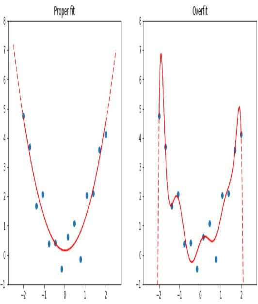

[^图1-9]: 过拟合的例子

**过拟合是所有机器学习从业者在训练过程中面临的最重要且最具挑战性的问题**，不管你用的是什么算法。正如你将看到的，创建一个在训练数据上表现优异的模型并不难，但要使其对从未见过的数据做出准确预测则困难得多。而实践中真正重要的恰恰是这些数据。例如，若你创建一个手写数字分类器（我们即将实践！），用于识别支票上的数字，那么模型训练时接触过的数字在实际应用中根本不会出现——每张支票的书写方式都存在细微差异，这正是模型需要应对的挑战。

在本书中，你将学习多种避免过拟合的方法。然而，你应仅在已经确认过拟合现象确实存在时（即在训练过程中观察到验证准确率下降时）才使用这些方法。我们常看到实践者即使拥有充足数据也过度使用避免过拟合的技术，最终得到的模型精度反而可能低于其本可达到的水平。

> 验证集（validation set）
>
> 在你训练模型时，必须同时准备训练集和验证集，且仅应在验证集上评估模型的准确性。若训练时间过长且数据不足，模型准确率将开始下降，这种现象称为过拟合。fastai默认将 `valid_pct` 设为0.2，因此即使你忘记设置，fastai也会创建验证集！

训练图像识别器的代码第五行指示fastai创建 *卷积神经网络*（CNN），并指定使用何种架构（即创建何种模型）、训练数据集以及评估指标：

```python
learn = cnn_learner(dls, resnet34, metrics=error_rate)
```

为何选择卷积神经网络？这是当前构建计算机视觉模型的尖端方法。本书将全面解析卷积神经网络的工作原理，其结构设计灵感源自人类视觉系统的运作机制。

fastai 中包含多种架构，本书将逐一介绍（同时探讨如何创建自定义架构）。然而大多数情况下，选择架构并非深度学习过程中至关重要的环节。这是学术界热衷讨论的话题，但在实际应用中，你通常无需在此投入过多精力。存在若干通用架构能应对多数场景，本书将重点探讨名为ResNet的架构——它在多数数据集和问题上兼具速度与精度。其中 `resnet34` 中的数字 `34` 代表该架构变体中的层数（其他选项包括 `18` 、`50` 、`101` 和 `152` ）。采用更多层架构的模型训练耗时更长，且更易过拟合（即在验证集准确率开始下降前，可训练的轮次会减少）。但另一方面，当使用更多数据时，这类模型能显著提升准确率。

什么是度量指标？度量指标是一种函数，用于通过验证集衡量模型预测的质量，并在每个训练轮次结束时输出结果。在此我们使用 `error_rate`，这是 fastai 提供的函数，其作用正如其名：告知验证集中被错误分类的图像所占比例。分类任务的另一常用指标是准确率（即`1.0 - error_rate`）。fastai还提供了更多指标，本书后续章节将逐步探讨。

度量（metric）的概念或许会让你联想到损失（loss），但二者存在一个重要区别。损失的全部意义在于定义一种“性能衡量标准”，供训练系统自动更新权重使用。换言之，优秀的损失函数应便于随机梯度下降算法使用。而度量标准则面向人类使用者设计，因此优质的度量标准需具备易于理解的特性，并尽可能贴近模型预期目标。有时损失函数本身可作为合适的度量标准，但并非必然如此。

`cnn_learner` 还包含一个名为 `pretrained` 的参数，默认值为 `True`（因此即使未显式指定，本例中仍会使用该参数）。该参数将模型权重设置为专家预先训练的值，这些权重通过对 130 万张照片（使用著名的 *ImageNet* 数据集）进行训练，已能识别千种不同类别。一个权重已在其他数据集上预先训练的模型被称为预训练模型。你几乎总是应该使用预训练模型，因为这意味着你的模型在尚未接触任何训练数据前就已具备强大能力。正如你将看到的，在深度学习模型中，这些能力中的许多都是你几乎无论项目细节如何都需要的。例如，预训练模型会处理边缘、梯度和颜色检测等功能，这些都是许多任务所必需的。

使用预训练模型时，`cnn_learner` 会移除最后一个层，因为该层总是针对原始训练任务（即 ImageNet 数据集分类）进行专门定制，并用一个或多个随机化权重的新层替换它，这些新层的大小适合您正在处理的数据集。模型的这一部分被称为 *头部*。

使用预训练模型是我们目前最重要的方法，它能让我们用更少的数据、更少的时间和金钱，更快地训练出更精确的模型。你可能会认为这意味着预训练模型应该成为学术界深度学习领域最受关注的研究方向……那你就大错特错了！预训练模型的重要性在多数课程、书籍或软件库特性中普遍未被认可或讨论，学术论文中也鲜少涉及。截至2020年初撰写本文时，这种状况才刚开始改变，但转变过程仍需时日。因此请务必警惕：你接触的大多数人很可能严重低估了在资源有限条件下深度学习的潜力，因为他们很可能并不真正理解如何运用预训练模型。

将预训练模型应用于不同于其原始训练任务的领域，称为 *迁移学习* （transfer learning）。遗憾的是，由于迁移学习研究严重不足，目前可用的预训练模型领域极为有限。例如，医学领域现有的预训练模型寥寥无几，使得该领域难以应用迁移学习。此外，如何将迁移学习应用于时间序列分析等任务，目前仍缺乏深入理解。

> 术语：迁移学习
>
> 将预训练模型用于与其原始训练目的不同的任务。

代码的第六行告诉fastai如何 *拟合*（fit）模型：

```python
learn.fine_tune(1)
```

正如我们所讨论的，该架构仅描述了一个数学函数的模板；在我们为其中数百万个参数提供具体数值之前，它实际上并不能执行任何操作。

这是深度学习的关键——确定如何拟合模型的参数以解决问题。要拟合模型，我们至少需要提供一条信息：每次图像需要处理多少次（称为迭代次数，epoch）。选择的迭代次数主要取决于可用时间长度，以及实际训练模型所需的时间。若选择的迭代次数过少，后续总能增加训练迭代次数。

但为什么该方法名为 `fine_tune` 而不是 `fit`？fastai确实有一个名为 `fit`的方法，它确实能拟合模型（即多次查看训练集中的图像，每次更新参数使预测结果越来越接近目标标签）。但本例中我们基于预训练模型展开工作，且不希望舍弃其已具备的能力。正如本书后续内容将阐述的，针对新数据集调整预训练模型存在若干关键技巧——这一过程被称为微调（fine-tuning）。

> 术语：微调
>
> 一种迁移学习技术，通过使用与预训练不同的任务进行额外轮次训练来更新预训练模型的参数。

当你使用 `fine_tune` 方法时，fastai 会为你自动应用这些技巧。你可以设置若干参数（我们稍后会讨论），但在这里展示的默认形式下，它会执行两个步骤：

1. 使用一个轮次中仅拟合模型中必要的那些部分，以使得新的随机头部能够正确处理你的数据集。
2. 在调用方法时指定所需的迭代次数，用于拟合整个模型，使后期层（特别是头部）的权重更新速度快于前期层（如我们将看到的，前期层通常无需对预训练权重进行大幅调整）。

模型的 *头部* 是指为适应新数据集而新增的特定部分。一个迭代次数指完整遍历数据集一次。调用fit方法后，系统会打印每个训练周期的结果，显示周期编号、训练集与验证集损失值（用于训练模型的“性能评估指标”），以及用户请求的任何指标（本例中为错误率）。

因此，凭借这些代码，我们的模型仅通过标注示例就学会了识别猫和狗。但它究竟是如何做到的呢？

#### 我们的图像识别器学到了什么

目前，我们拥有一个运行良好的图像识别器，但完全不清楚它的工作原理！尽管许多人抱怨深度学习会产生难以理解的“黑箱”模型（即能给出预测结果却无人能理解的系统），但这种说法与事实相去甚远。大量研究表明，我们完全能够深入剖析深度学习模型并从中获取丰富洞见。话虽如此，各类机器学习模型（包括深度学习和传统统计模型）要完全理解仍具挑战性，尤其当它们遇到与训练数据差异极大的新数据时。本书将持续探讨这一问题。

2013年，博士生马特·泽勒（Matt Zeiler）及其导师罗伯·弗格斯（Rob Fergus）发表了[《卷积神经网络的可视化与理解》](https://oreil.ly/iP8cr)，该论文展示了如何可视化模型各层学习到的神经网络权重。他们深入剖析了2012年ImageNet竞赛的冠军模型，并基于此分析大幅优化模型，最终成功夺得2013年竞赛桂冠！图1-10展示了他们发表的第一层权重可视化结果。

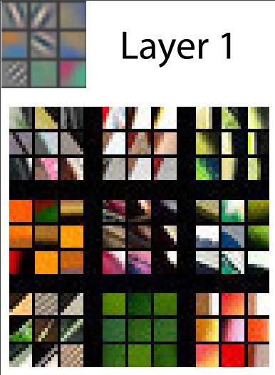

[^图1-10]: 卷积神经网络第一层的激活情况（由Matthew D. Zeiler和Rob Fergus提供）

这张图需要我们说明一下。对于每个层，图像中浅灰色背景的部分显示了重建的权重，而底部较大的区域则显示了训练图像中与每组权重匹配度最高的区域。对于第一层，我们可以看到模型已发现代表对角线、水平线、垂直线以及各种倾斜度的权重。（需注意的是：每层仅展示特征子集，实际所有层中包含数千种特征。）

这些是模型在计算机视觉领域学习到的基本构建模块。神经科学家和计算机视觉研究人员对它们进行了广泛分析，结果表明这些学习到的构建模块与人眼的基本视觉机制极为相似，也与深度学习时代之前开发的手工计算机视觉特征高度吻合。下一层结构如图1-11所示。

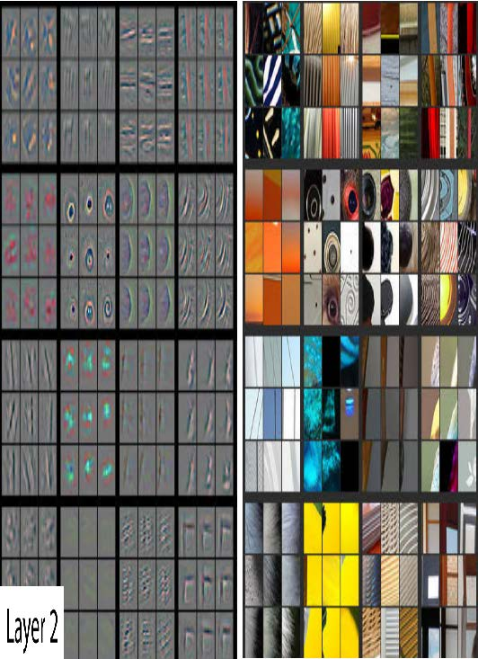

[^图1-11]: 卷积神经网络第二层的激活情况（由Matthew D. Zeiler和Rob Fergus提供）

对于第二层，模型发现的每种特征都有九个权重重建示例。我们可以看到，模型已学会创建特征检测器来寻找拐角、重复线条、圆形及其他简单图案。这些特征由第一层开发的基本构建模块构建而成。对于每种特征，图片右侧展示了实际图像中与之最匹配的小区域。例如第二行第一列的特定图案，其梯度和纹理特征与日落场景高度吻合。

图1-12展示了论文中关于重建第3层特征结果的图像。

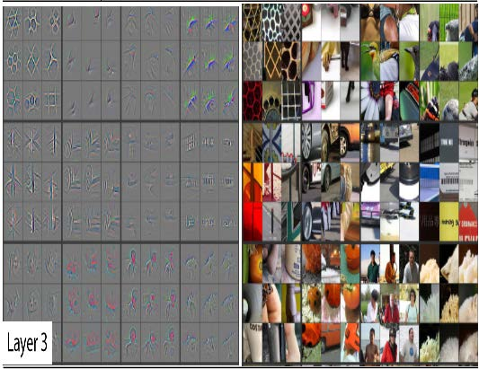

[^图1-12]: 卷积神经网络第三层的激活情况（由Matthew D. Zeiler和Rob Fergus提供）

如图右侧所示，这些特征现已能够识别并匹配更高层次的语义组件，例如汽车轮毂、文本和花瓣。借助这些组件，第4层和第5层可识别更高层次的概念，如图1-13所示。

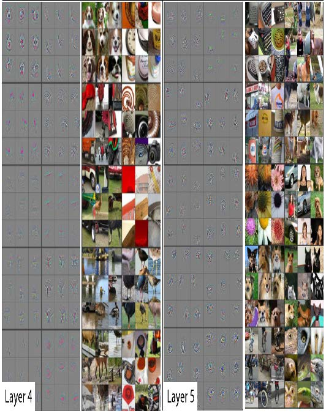

[^图1-13]: 卷积神经网络第四层与第五层的激活图（由Matthew D. Zeiler与Rob Fergus提供）

这个论文研究的是一种名为AlexNet的早期模型，它仅包含五层。此后发展起来的网络可能拥有数百层——因此你可以想象这些模型所能开发出的特征是多么丰富！

在先前对预训练模型进行微调时，我们调整了最后几层的关注点（花卉、人类、动物），使其专门处理猫狗识别问题。更普遍地说，我们可以将此类预训练模型专门化应用于多种不同任务。下面我们来看几个示例：

#### 图像识别器可处理非图像任务

图像识别器顾名思义只能识别图像。但许多事物都可以用图像来表示，这意味着图像识别器能够学习完成多种任务。

例如，声音可以转换为频谱图，这是一种图表，显示音频文件中每个时间点各频率的强度分布。Fast.ai学员Ethan Sutin运用此方法，仅凭8,732条城市声音数据集，便 [轻松超越了现有顶尖环境声音检测模型的公开准确率](https://oreil.ly/747uv)。fastai的 `show_batch` 功能清晰呈现了每种声音独特的频谱图特征，如图1-14所示。

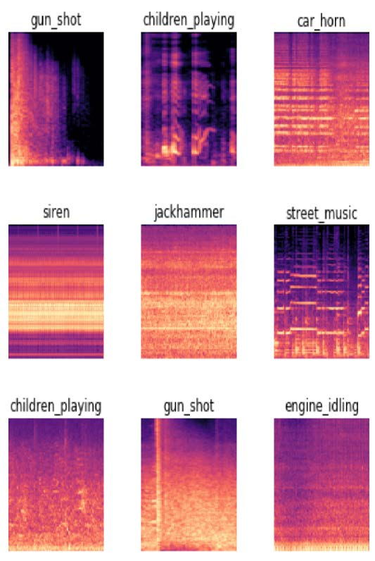

[^图1-14]: 显示 `show_batch` 的声谱图

时间序列可通过将其绘制在图表上轻松转换为图像。然而，通常更明智的做法是尝试以最易提取关键要素的方式呈现数据。在时间序列中，诸如季节性与异常值等特征往往最值得关注。

时间序列数据可进行多种转换。例如，fast.ai学员Ignacio Oguiza利用一种名为“格拉姆角场差分法(Gramian Angular Difference Field，GADF)”的技术，从橄榄油分类的时间序列数据集中生成图像，其结果如图1-15所示。随后他将这些图像输入本章所示的图像分类模型进行训练。尽管训练集仅含30张图像，其准确率仍远超90%，接近当前最先进水平。

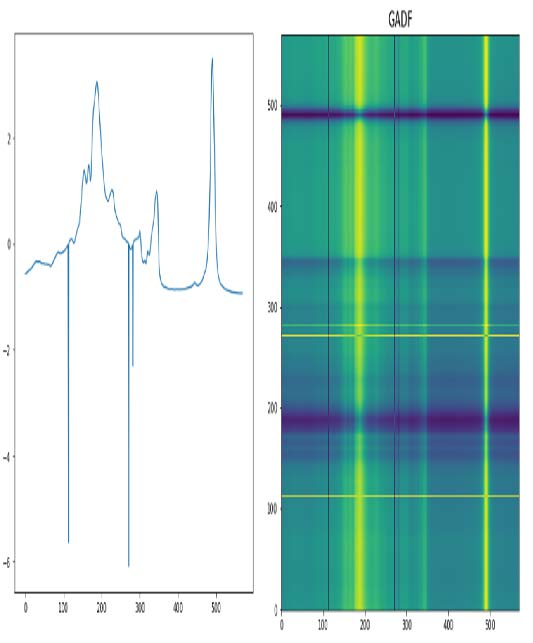

[^图1-15]: 将时间序列转换为图像

另一个有趣的fast.ai学生项目案例来自格列布·埃斯曼（Gleb
Esman）。他在Splunk公司从事欺诈检测工作，使用的是用户鼠标移动轨迹和点击数据集。他将这些数据转化为图像：用彩色线条绘制显示鼠标指针位置、速度和加速度的轨迹，点击点则用彩色小圆圈标注，如图1-16所示。他将这些图像输入到与本章使用的图像识别模型相同的系统中，效果如此出色，最终他还为这种欺诈分析方法申请到了专利！

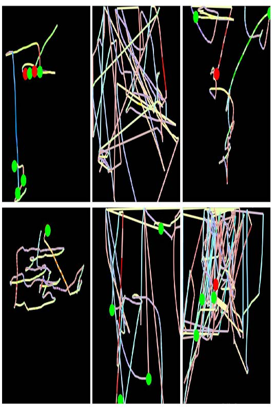

[^图1-16]: 将计算机鼠标行为转换为图像

另一个例子来自马哈茂德·卡拉什（Mahmoud Kalash）等人的论文[《基于深度卷积神经网络的恶意软件分类》](https://oreil.ly/l_knA)，他们其中解释道："恶意软件二进制文件被分割为8位序列，随后转换为等效十进制值。该十进制向量经重塑后生成灰度图像，以呈现恶意软件样本"（见图1-17）。

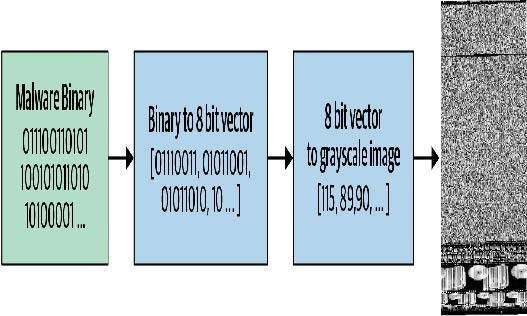

[^图1-17]: 恶意软件分类流程

作者随后展示了通过此过程生成的不同类别恶意软件的“图片”，如图1-18所示。

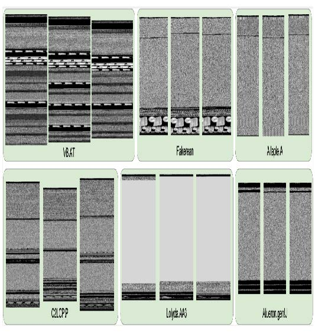

[^图1-18]: 恶意软件示例

如你所见，不同类型的恶意软件在人眼看来具有鲜明特征。研究人员基于这种图像表示训练的模型，其恶意软件分类准确度超越了学术文献中所有既往方法。这为数据集转化为图像表示提供了实用准则：若人眼能从图像中识别类别，深度学习模型同样能够实现。

总的来说，你会发现只要在数据表示方式上稍加创新，深层学习中少数通用方法就能发挥巨大作用！不应将本文所述方法视为“权宜之计”，因为它们往往（如本文所示）能超越先前最先进的结果。这些方法实则是解决此类问题领域的正确思路。

#### 术语回顾

我们刚刚讲解了很多内容，现在简要回顾一下。表1-3提供了实用词汇清单。

| 英文原文        | 术语         | 意义                                                         |
| --------------- | ------------ | ------------------------------------------------------------ |
| Label           | 标签         | 我们试图预测的数据，例如“狗”或“猫”                           |
| Architecture    | 架构         | 我们试图拟合的模型模板。即实际的数学函数，我们将输入数据和参数传递给该函数 |
| Model           | 模型         | 架构与特定参数集的结合                                       |
| Parameters      | 参数         | 模型中改变其可执行任务的值，这些值通过模型训练进行更新       |
| Fit             | 拟合         | 更新模型的参数，使得模型使用输入数据进行预测的结果与目标标签相匹配 |
| Train           | 训练         | 拟合的同义词                                                 |
| Pretrainedmodel | 预训练模型   | 一个已经过训练的模型，通常使用大型数据集训练，并将进行微调。 |
| Finetune        | 微调         | 为不同任务更新预训练模型                                     |
| Epoch           | （迭代）轮次 | 对输入数据进行一次完整的遍历                                 |
| Loss            | 损失         | 衡量模型优劣的指标，用于驱动基于随机梯度下降SGD的训练过程    |
| Metric          | 指标         | 使用验证集衡量模型性能的指标，该验证集专为人类使用而设计     |
| Validation set  | 验证集       | 一组从训练中保留出来的数据，仅用于衡量模型的性能             |
| Training set    | 训练集       | 用于拟合模型的数据；不包含任何来自验证集的数据               |
| Overfitting     | 过拟合       | 以特定方式训练模型，使其记忆输入数据的特定特征，而不是在训练期间未接触过的数据上实现良好泛化。 |
| CNN             | 卷积神经网络 | Convolutional neural network的缩写。一种在计算机视觉任务中表现尤为出色的神经网络类型。 |

掌握这些词汇后，我们现在能够将迄今介绍的所有关键概念整合起来。请花点时间回顾这些定义并阅读以下总结。若你可以理解这些解释，便已具备充分的准备来理解后续的讨论。

*机器学习* 是一门学科，其中我们定义程序的方式并非完全靠手工编写，而是通过从数据中学习。*深度学习* 是机器学习的一个分支，它利用具有多层结构的神经网络。图像分类（也称为图像识别）是其代表性应用。我们从标注数据开始——即为每张图像分配标签以表明其内容的图像集合。我们的目标是创建一个称为模型的程序，当输入新图像时，它能准确预测该图像所代表的内容。

每个模型都始于架构的选择，即该类型模型内部运作的通用模板。训练（或拟合）过程实质是寻找参数值（或权重）的组合，将通用架构专化为适用于特定数据类型的模型。要评估模型在单次预测中的表现，需定义损失函数——它决定了预测结果优劣的评判标准。

为加快训练进程，我们可采用 *预训练模型* ——即已在他人数据集上完成训练的模型。随后通过在自身数据集上进行少量额外训练，使其适应新数据，这一过程称为 *微调* 。

在训练模型时，关键要确保模型具备 *泛化* 能力：它能从数据中学习出普适性规律，这些规律同样适用于模型将要遇到的全新对象，从而对这些对象做出准确预测。风险在于，若训练不当，模型将无法学习普适规律，反而会机械记忆已见过的内容，导致对新图像的预测效果极差。这种失败被称为 *过拟合* 。

为避免这种情况，我们总是将数据分为两部分：*训练集* 和 *验证集* 。我们仅向模型展示 *训练集* 来训练模型，然后通过观察模型在 *验证集* 数据上的表现来评估其性能。通过这种方式，我们检验模型从训练集学习到的知识是否能推广到验证集。为评估模型在验证集上的整体表现，我们定义了评估指标。在训练过程中，当模型处理完训练集所有样本时，我们称之为一个 *迭代轮次* 。

所有这些概念都适用于机器学习的普遍范畴。它们适用于通过数据训练来定义模型的各类方案。深度学习的独特之处在于其特定类别的架构：基于 *神经网络* 的架构。尤其像图像分类这类任务，高度依赖 *卷积神经网络* ——我们稍后将对此进行讨论。

### 深度学习不仅适用于图像分类

近年来，深度学习在图像分类方面的有效性已广受讨论，甚至在识别CT扫描中的恶性肿瘤等复杂任务上展现出超越人类的成果。但它的能力远不止于此，我们将在本文中展示其更多可能。

例如，让我们谈谈对自动驾驶汽车至关重要的一点：在图像中定位物体。如果自动驾驶汽车不知道行人的位置，它就不知道如何避让行人！创建能识别图像中每个像素内容的模型称为 *分割* （segmentation）。以下是使用fastai训练分割模型的方法，我们采用Gabriel J. Brostow等人在论文 [《视频中的语义对象类别：高清真值数据库》](https://oreil.ly/Mqclf) 中提到的 [CamVid数据集](https://oreil.ly/Mqclf) 子集：

```python
path = untar_data(URLs.CAMVID_TINY)
dls = SegmentationDataLoaders.from_label_func(
	path, bs=8, fnames = get_image_files(path/"images"),
	label_func = lambda o:
path/'labels'/f'{o.stem}_P{o.suffix}',
	codes = np.loadtxt(path/'codes.txt', dtype=str)
)

learn = unet_learner(dls, resnet34)
learn.fine_tune(8)
```

| 迭代轮次 | 训练损失 | 验证损失 | 时间  |
| -------- | -------- | -------- | ----- |
| 0        | 2.906601 | 2.347491 | 00:02 |
| 0        | 1.988776 | 1.765969 | 00:02 |
| 1        | 1.703356 | 1.265247 | 00:02 |
| 2        | 1.591550 | 1.309860 | 00:02 |
| 3        | 1.459745 | 1.102660 | 00:02 |
| 4        | 1.324229 | 0.948472 | 00:02 |
| 5        | 1.205859 | 0.894631 | 00:02 |
| 6        | 1.102528 | 0.809563 | 00:02 |
| 7        | 1.020853 | 0.805135 | 00:02 |

我们甚至不会逐行讲解这段代码，因为它几乎与之前的示例完全相同！（我们将在第15章深入探讨分割模型，同时也会详细解析本章简要介绍的所有其他模型，以及更多更多内容。）

我们可以通过要求模型为图像的每个像素进行颜色编码，来直观展示其任务完成效果。如您所见，它几乎完美地将每个物体中的每个像素进行了分类。例如，请注意所有汽车都覆盖着相同的颜色，所有树木也覆盖着相同的颜色（在每对图像中，左侧图像为真实标签，右侧为模型预测结果）：

```python
learn.show_results(max_n=6, figsize=(7,8))
```

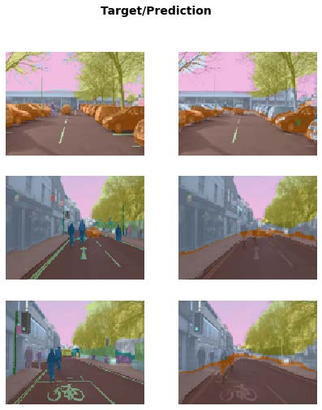

深度学习在过去几年取得突破性进展的另一个领域是自然语言处理（natural language processing，NLP）。如今计算机能够生成文本、自动进行语言翻译、分析评论、标注句子中的词汇，以及完成更多任务。以下是训练模型的全部代码，该模型能够比五年前世界上任何现有技术更精准地分类电影评论的情感倾向：

```python
from fastai.text.all import *
dls = TextDataLoaders.from_folder(untar_data(URLs.IMDB),
                                  valid='test')
learn = text_classifier_learner(dls, AWD_LSTM,
                                drop_mult=0.5, metrics=accuracy)
learn.fine_tune(4, 1e-2)
```

| 迭代轮次 | 训练损失 | 验证损失 | 准确率   | 时间  |
| -------- | -------- | -------- | -------- | ----- |
| 0        | 0.594912 | 0.407416 | 0.823640 | 01:35 |
| 0        | 0.268259 | 0.316242 | 0.876000 | 03:03 |
| 1        | 0.184861 | 0.246242 | 0.898080 | 03:10 |
| 2        | 0.136392 | 0.220086 | 0.918200 | 03:16 |
| 3        | 0.106423 | 0.191092 | 0.931360 | 03:15 |

该模型采用安德鲁·马斯（Andrew Maas）等人发表于 [《学习词向量进行情感分析》](https://oreil.ly/L9vre) 中的 [IMDb大型电影评论数据集](https://oreil.ly/tl-wp) 。它在处理数千字的电影评论时表现良好，但让我们用一篇短评来测试其效果：

```python
learn.predict("I really liked that movie!")
('pos', tensor(1), tensor([0.0041, 0.9959]))
```

在此我们可看到模型将该评论判定为积极评价。结果的第二部分是数据词汇表中“pos”的索引，最后部分则是各分类对应的概率值（“pos”为99.6%，“neg”为0.4%）。

现在轮到你了！写一篇自己的迷你影评，或者从网上复制一篇，看看这个模型会如何评价。

> 顺序很重要
>
> 在 Jupyter 笔记本中，执行每个单元格的顺序至关重要。它不像Excel那样，在任何位置输入内容都会立即更新——它拥有内部状态，每次执行单元格时都会更新。例如，当你运行笔记本的第一个单元格（带有“CLICK ME”注释）时，会创建一个名为 `learn` 的对象，其中包含图像分类问题的模型和数据。
>
> 如果我们直接运行文本中刚刚展示的单元格（用于预测评论是否好评），将会出现错误，因为该学习对象不包含文本分类模型。此单元格需在包含以下内容的单元格之后运行：
>
> ```python
> from fastai.text.all import *
> dls = TextDataLoaders.from_folder(untar_data(URLs.IMDB), valid='test')
> learn = text_classifier_learner(dls, AWD_LSTM, drop_mult=0.5,
>                                 metrics=accuracy)
> learn.fine_tune(4, 1e-2)
> ```
>
> 输出结果本身可能具有误导性，因为它们包含单元格上次执行时的结果；若在单元格内修改代码却未重新执行，旧的（有误导性的）结果将持续保留。
>
> 除非我们特别说明，本书网站提供的笔记本应按顺序从上到下运行。通常在实验过程中，你会发现自己为提高效率而随意执行单元格（这是Jupyter笔记本的绝妙特性），但当你完成探索并最终确定代码版本后，请务必确保笔记本中的单元格能按顺序运行（否则以后你未必记得当初那条曲折的探索路径！）。
>
> 在命令模式下，连续输入两次数字0将重启内核（即驱动笔记本的引擎）。此操作将清除当前状态，使笔记本恢复至初始启动状态。通过单元菜单选择“运行上方所有单元”，即可执行当前位置上方所有单元的内容。我们在开发fastai库时发现此功能非常实用。

若你对任何 fastai 方法存在疑问，应使用 `doc` 函数，并传入方法名称：

```python
doc(learn.predict)
```

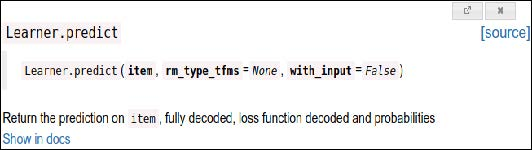

你会看到一个包含简短一行说明的窗口弹出。“在文档中查看（Show in docs）”链接将带你前往完整文档，其中包含所有细节和大量示例。此外，fastai的大多数方法仅需寥寥数行代码，因此你可以点击“源代码”链接查看具体实现原理。

接下来让我们转向一个远不如前者花哨，但或许在商业应用中更具广泛实用价值的话题：从普通表格化的数据中构建模型。

> 术语：表格（tabular）
>
> 表格形式的数据，例如来自电子表格、数据库或逗号分隔值（CSV）文件的数据。表格模型是一种基于表格中其他列的信息来预测表格中某一列的模型。

结果你会发现两者看起来也非常相似。以下是训练模型的必要代码，该模型将基于个人社会经济背景，预测其是否属于高收入群体：

```python
from fastai.tabular.all import *
path = untar_data(URLs.ADULT_SAMPLE)
dls = TabularDataLoaders.from_csv(path/'adult.csv',
                                  path=path, y_names="salary",
                                  cat_names = ['workclass', 'education', 'marital-status',
                                               'occupation',
                                               'relationship', 'race'],
                                  cont_names = ['age', 'fnlwgt', 'education-num'],
                                  procs = [Categorify, FillMissing, Normalize])
learn = tabular_learner(dls, metrics=accuracy)
```

如你所见，我们需要告知fastai哪些列是分类型（包含离散选项集中的某个值，例如 `occupation` ）而哪些是连续型（包含代表数量的数值，例如 `age` ）。

此任务目前尚无预训练模型可用（总体而言，任何表格建模任务都缺乏广泛可用的预训练模型，尽管某些机构已为内部使用创建过此类模型），因此本例中我们不采用 `fine_tune` 方法。取而代之的是，我们采用 `fit_one_cycle` ——这是从零开始训练fastai模型（即不使用迁移学习）最常用的方法：

```python
learn.fit_one_cycle(3)
```

| 迭代轮次 | 训练损失 | 验证损失 | 准确率   | 时间  |
| -------- | -------- | -------- | -------- | ----- |
| 0        | 0.359960 | 0.357917 | 0.831388 | 00:11 |
| 1        | 0.353458 | 0.349657 | 0.837991 | 00:10 |
| 2        | 0.338368 | 0.346997 | 0.843213 | 00:10 |

该模型采用Ron Kohavi的论文 [《提升朴素贝叶斯分类器的准确率：决策树混合方法》](https://oreil.ly/qFOSc) 中的 [成人数据集](https://oreil.ly/qFOSc) ，该数据集包含个人人口统计数据（如教育程度、婚姻状况、种族、性别以及年收入是否超过5万美元）。模型准确率超过80%，在测试集上达到80%以上的准确率。该模型准确率超过80%，训练耗时约30秒。

让我们再来看一个例子吧。推荐系统至关重要，尤其在电子商务领域。亚马逊和奈飞等公司竭力为用户推荐可能感兴趣的商品或影片。以下是利用 [MovieLens数据集](https://oreil.ly/LCfwH) 训练模型的方法，该模型将根据用户的过往观看习惯预测其可能喜欢的电影：

```python
from fastai.collab import *
path = untar_data(URLs.ML_SAMPLE)
dls = CollabDataLoaders.from_csv(path/'ratings.csv')
learn = collab_learner(dls, y_range=(0.5,5.5))
learn.fine_tune(10)
```

| 迭代轮次 | 训练损失 | 验证损失 | 时间  |
| -------- | -------- | -------- | ----- |
| 0        | 1.554056 | 1.428071 | 00:01 |
| 0        | 1.393103 | 1.361342 | 00:01 |
| 1        | 1.297930 | 1.159169 | 00:01 |
| 2        | 1.052705 | 0.827934 | 00:01 |
| 3        | 0.810124 | 0.668735 | 00:01 |
| 4        | 0.711552 | 0.627836 | 00:01 |
| 5        | 0.657402 | 0.611715 | 00:01 |
| 6        | 0.633079 | 0.605733 | 00:01 |
| 7        | 0.622399 | 0.602674 | 00:01 |
| 8        | 0.629075 | 0.601671 | 00:01 |
| 9        | 0.619955 | 0.601550 | 00:01 |

该模型以0.5至5.0的评分尺度预测电影评分，平均误差约为0.6。由于我们预测的是连续数值而非分类结果，必须通过 `y_range` 参数告知fastai目标变量的取值范围。

尽管我们并未实际使用预训练模型（原因与表格模型相同），但此示例表明fastai仍允许我们在这种情况下使用 `fine_tune`（具体原理将在第五章详述）。有时最好通过实验对比 `fine_tune` 与 `fit_one_cycle`，以确定哪种方式最适合你的数据集。

我们可以使用之前看到的相同 `show_results` 调用，查看用户和电影 ID、实际评分以及预测结果的几个示例：

```python
learn.show_results()
```

| 序号 | 用户ID | 电影ID | 评分 | 预测的评分 |
| ---- | ------ | ------ | ---- | ---------- |
| 0    | 157    | 1200   | 4.0  | 3.558502   |
| 1    | 23     | 344    | 2.0  | 2.700709   |
| 2    | 19     | 1221   | 5.0  | 4.390801   |
| 3    | 430    | 592    | 3.5  | 3.944848   |
| 4    | 547    | 858    | 4.0  | 4.076881   |
| 5    | 292    | 39     | 4.5  | 3.753513   |
| 6    | 529    | 1265   | 4.0  | 3.349463   |
| 7    | 19     | 231    | 3.0  | 2.881087   |
| 8    | 475    | 4963   | 4.0  | 4.023387   |
| 9    | 130    | 260    | 4.5  | 3.9797     |

> 数据集：模型的食物
>
> 在本节中，你已经看到不少模型，每个模型都使用不同的数据集训练来完成不同的任务。在机器学习和深度学习领域，没有数据我们就无从下手。因此，那些为我们创建数据集来训练模型的研究者，堪称（常常被低估的）英雄。其中最具实用价值和重要性的数据集，往往成为重要的学术基准——这些数据集被研究者广泛研究，用于比较算法改进效果。部分数据集甚至成为家喻户晓的名字（至少在训练模型的圈子里如此），例如MNIST、CIFAR-10和ImageNet。
>
> 本书所选数据集之所以入选，是因为它们极好地展现了你可能遇到的各类数据类型，且学术文献中存在大量使用这些数据集进行模型推演的实例，你可以根据它们对照自身研究成果。
>
> 本书使用的多数数据集都凝聚了创建者的心血。例如，在后续章节中，我们将展示如何构建法语与英语互译模型。该模型的核心输入源自宾夕法尼亚大学克里斯·卡利森-伯奇（Chris CallisonBurch）教授于2009年构建的法英平行文本语料库。该数据集包含超过2000万对法语-英语句子对。其构建方式极具巧思：通过爬取数百万加拿大网页（这些网页常包含多语言内容），再运用一套简单启发式算法，将法语内容的URL转换为指向相同内容的英文URL。
>
> 在阅读本书中的数据集时，请思考它们可能的来源及整理方式。接着思考你能在自己的项目中创建哪些有趣的数据集。（我们很快将逐步指导你创建自己的图像数据集。）
>
> fast.ai耗费大量时间创建了流行数据集的精简版本，这些版本专门设计用于支持快速原型开发和实验，并更易于学习。在本书中，我们将经常从使用精简版本开始，随后扩展到完整版本（正如本章所做的那样！）。这正是全球顶尖从业者实际建模的操作方式：他们主要在数据子集上进行实验和原型开发，仅在充分理解任务需求后才启用完整数据集。

我们训练的每个模型都显示了训练集和验证集的损失值。优质的验证集是训练过程中最重要的环节之一。让我们了解原因并学习如何创建它。

### 验证集和测试集

正如我们所讨论的，模型的目标是针对数据进行预测。但模型的训练过程本质上是愚蠢的。如果我们用全部数据训练模型，再用同一批数据评估模型，就无法判断模型在未见数据上的表现。缺少这关键信息来指导训练，模型很可能在原数据上预测精准，却在新数据上表现糟糕。

为避免这种情况，我们的第一步是将数据集拆分为两部分：训练集（模型在训练过程中接触的数据）和验证集（也称为开发集，仅用于评估）。这使我们能够检验模型是否能从训练数据中学习到可推广至新数据（即验证数据）的规律。

理解这种情况的一种方式是，从某种意义上说，我们不希望模型通过“作弊”获得良好结果。如果它对某个数据项做出了准确预测，那应该是因为它已经掌握了该类数据项的特征，而不是因为模型曾因为实际接触过该特定数据项而被塑造而成。

将验证数据分离出来意味着我们的模型在训练过程中从未接触过它，因此完全不受其影响，也未以任何形式作弊。对吧？

事实上，情况并非如此简单。现实场景中，我们很少仅通过一次参数训练就构建模型。相反，我们更可能通过探索网络架构、学习率、数据增强策略等多种建模选择，来构建模型的多个版本——这些因素将在后续章节中详细讨论。这些选择中的许多都可以描述为超参数的选择。这个词反映了它们是关于参数的参数，因为它们是更高层次的选择，决定了权重参数的含义。

问题在于，尽管常规训练过程在学习权重参数值时仅关注训练数据的预测结果，但我们人类却并非如此。作为建模者，我们在探索新超参数值时，是通过观察模型对验证数据的预测结果来评估模型的！因此后续版本的模型，间接地受到我们接触过验证数据的影响。正如自动训练过程存在对训练数据过拟合的风险，我们同样面临通过人类试错与探索过程对验证数据过拟合的风险。

解决这个难题的方法是引入另一层更严格保留的数据：测试集。正如我们在训练过程中保留验证数据一样，我们必须将测试集数据完全隔离，甚至不允许它们自己接触。它不能用于改进模型；只能在最终评估模型时使用。实际上，我们根据数据需要被训练和建模过程隐藏的程度，定义了数据切割的分层结构：训练数据完全暴露，验证数据部分暴露，测试数据则完全隐藏。这种分层结构与建模评估流程本身相呼应——包括基于反向传播的自动训练过程、训练阶段间手动调整超参数的半自动过程，以及最终结果的评估环节。

测试集和验证集应包含足够的数据，以确保你可以获得准确率的可靠估计。例如，若你正在创建猫检测器，通常需要验证集中至少包含30只猫。这意味着当数据集包含数千个项目时，使用默认20%的验证集比例可能超出实际需求。另一方面，若数据量充足，将部分数据用于验证通常不会造成任何负面影响。

我们设置两级“保留数据”——验证集和测试集，其中一级数据实际上是自我隐藏的数据——看似有些极端。但这种做法往往不可或缺，因为模型倾向于选择最简单的预测方式（即死记硬背），而我们这些易犯错的人类则容易自我欺骗，误判模型表现优劣。测试集的约束机制能帮助我们保持学术诚信。这并非意味着必须始终设置独立测试集——若数据量极少，仅需验证集即可——但通常情况下，只要条件允许，使用测试集仍是最佳选择。

如果你计划委托第三方进行建模工作，这种严谨性同样至关重要。第三方可能无法准确理解您的需求，甚至其利益驱动可能促使他们刻意曲解要求。一套优质的测试集能显著降低这些风险，并让你评估其工作成果是否真正解决了实际问题。

直白地说，如果你是组织中的高级决策者（或为高级决策者提供建议），最重要的要点在于：只要确保真正理解测试集与验证集的本质及其重要性，就能规避我们在组织采用人工智能时所见到的最大失败根源。例如，若考虑引入外部供应商或服务，务必保留部分测试数据不让供应商接触。随后使用基于实际需求选择的评估指标，在测试数据上验证其模型，并据此判定性能达标标准。（你不妨亲自尝试构建基础模型，这样就能了解最简单的模型能达到什么效果。结果往往会发现，你自己做的简单模型表现可能和外部“专家”提供的模型一样好！）

#### 在定义测试集时需谨慎判断

要妥善定义验证集（以及可能的测试集），有时仅凭随机抽取原始数据集的一部分是远远不够的。请记住：验证集和测试集的关键特性在于，它们必须能代表未来将遇到的全新数据。这听起来像是无法完成的任务！毕竟按定义，这些数据你尚未见过。但通常你仍掌握某些信息。

通过几个典型案例进行分析颇具启发性。这些示例大多来自 [Kaggle平台](https://www.kaggle.com/) 上的预测建模竞赛，这些案例很好地展现了实际工作中可能遇到的各类问题及解决方案。

一种情况可能是分析时间序列数据。对于时间序列，随机抽取数据子集既过于简单（可同时查看预测日期前后数据），也不符合多数商业场景（即利用历史数据构建未来模型）。若数据包含日期且模型用于未来预测，则应选择包含最新日期的连续区间作为验证集（例如最近两周或上月可用数据）。

假设你想要将图1-19中的时间序列数据划分为训练集和验证集。

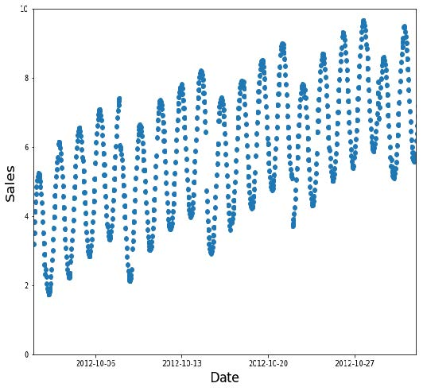

[^图1-19]: 一个时间序列

随机子集是个糟糕的选择（填补空缺过于容易，且无法反映生产环境的实际需求），如图1-20所示。

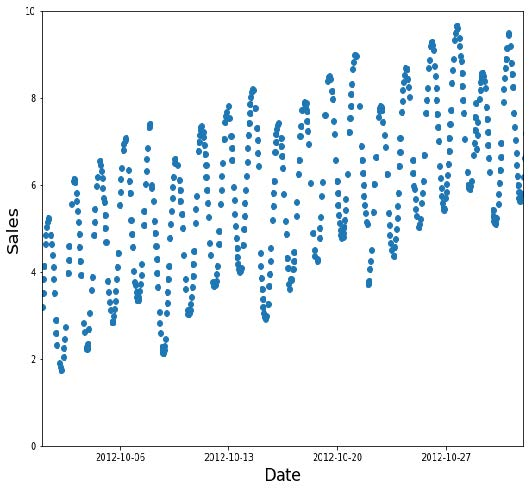

[^图1-20]: 一个糟糕的训练子集

相反，应将较早的数据作为训练集（较晚的数据作为验证集），如图1-21所示。

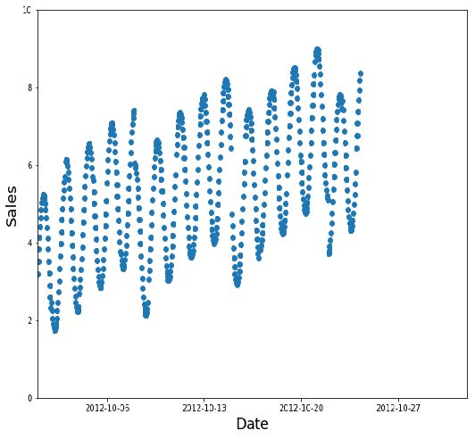

[^图1-21]: 一个好的训练子集

例如，Kaggle曾举办一场 [预测厄瓜多尔连锁杂货店销售额的竞赛](https://oreil.ly/UQoXe) 。Kaggle的训练数据涵盖2013年1月1日至2017年8月15日，测试数据则横跨2017年8月16日至2017年8月31日。通过这种方式，竞赛组织者确保参赛者从其模型的角度出发，对未来时段进行预测。这类似于量化对冲基金交易员通过回测来验证其模型能否基于历史数据预测未来时段的表现。

另一种常见情况是，你能够轻松预见到生产环境中用于预测的数据与训练模型所用的数据在质量上可能存在差异。

在 [Kaggle分心驾驶竞赛中](https://oreil.ly/zT_tC) ，自变量是驾驶员在方向盘前的照片，而因变量则是诸如发短信、吃东西或安全观察前方等分类。许多照片记录的是同一驾驶员在不同姿势下的状态，如图1-22所示。如果你作为保险公司利用这些数据构建模型，请注意最关键的是评估模型对未见驾驶员的预测表现（因训练数据通常仅覆盖小规模人群）。为此，竞赛测试数据特意选用训练集未包含的驾驶员图像。


[^图1-22]: 训练数据中的两个图片

若将图1-22中的某张图像放入训练集，另一张放入验证集，模型对验证集图像的预测将变得轻而易举，从而表现出优于处理新样本时的性能。另一种视角是：若将所有受试者都用于模型训练，模型可能过度拟合特定个体的细节特征，而非真正掌握状态类别（如发短信、进食等）。

在 [Kaggle渔业竞赛](https://oreil.ly/iJwFf) 中也存在类似机制，该竞赛旨在识别渔船捕获的鱼类物种，以减少对濒危种群的非法捕捞。测试集包含未出现在训练数据中的渔船图像，因此在此情况下，验证集也应包含训练集未涵盖的渔船。

有时可能无法明确验证数据将如何不同。例如，对于使用卫星图像的问题，你需要收集更多信息来判断训练集是否仅包含特定地理位置，还是来自地理分布分散的数据。

既然你已经了解了如何构建模型，现在可以决定下一步想深入探索什么内容。

### 一个选择你自己的冒险时刻

如果你希望深入了解如何在实践中运用深度学习模型，包括识别并修复错误、创建真正可运行的网络应用程序，以及避免模型对组织或社会造成意外危害，请继续阅读接下来的两章。如果你希望从深层理解深度学习运作原理开始学习，请直接跳至第4章。（你小时候读过《选择自己的冒险》系列书吗？这本书有点类似那种体验……只不过比该系列书包含了更多深度学习内容。）

要继续阅读本书，你需要通读所有章节，但阅读顺序完全由你自己决定。这些章节之间并不存在依赖关系。如果你跳至第四章，我们将在文末提醒你：请先补读跳过的章节，再继续后续内容。

### 问卷调查

阅读完这么多页文字后，你可能难以确定哪些关键点真正需要关注和记忆。因此，我们在每章结尾准备了一份问题清单及建议步骤。所有答案均藏于章节文本中，若对任何问题存疑，请重新阅读相关段落确保理解。这些问题的完整解答也可在 [书籍官网](https://book.fast.ai/) 查阅。若遇到困惑，你还可访问 [论坛](https://forums.fast.ai/) 寻求其他学习者的帮助。

1. 以下这些对深度学习有必要吗？
   - 很多数学知识
   - 很多数据
   - 很多很贵很贵的电脑
   - 博士学位
2. 请列举五个领域，在这些领域中深度学习目前是全球最优工具。
3. 第一台基于人工神经元原理的设备叫什么名字？
4. 基于同名书籍，并行分布式处理（parallel distributed processing，PDP）有哪些要求？
5. 阻碍神经网络领域发展的两大理论误解是什么？
6. GPU是什么？
7. 打开一个笔记本并执行包含以下内容的单元格：`1+1` 。会发生什么？
8. 请逐个单元格地执行本章笔记本的精简版本。在执行每个单元格之前，请先猜测会发生什么。
9. 完成 [Jupyter Notebook在线附录](https://oreil.ly/9uPZe)
10. 为什么用传统的计算机程序很难识别照片中的图像？
11. 塞缪尔所说的“权重分配”是什么意思？
12. 在深度学习中，我们通常用什么术语来指代塞缪尔所说的“权重”？
13. 绘制一幅图，概括塞缪尔对机器学习模型的观点。
14. 为什么难以理解深度学习模型为何会做出特定预测？
15. 证明神经网络能够以任意精度解决任何数学问题的定理名称是什么？
16. 训练模型需要什么？
17. 反馈循环如何影响预警模型的推广？
18. 我们是否必须始终使用224×224像素的图像来训练猫识别模型？
19. 分类与回归有何区别？
20. 什么是验证集？什么是测试集？为何需要它们？
21. 若未提供验证集，fastai将如何处理？
22. 能否始终使用随机抽样作为验证集？原因何在？
23. 什么是过拟合？请举例说明。
24. 度量指标是什么？它与损失函数有何区别？
25. 预训练模型如何提供帮助？
26. 模型的“头部”指什么？
27. 卷积神经网络的前几层能识别哪些特征？后层又如何？
28. 图像模型仅适用于照片吗？
29. 什么是架构？
30. 什么是分割？
31. `y_range` 是用于什么的？我们何时需要它？
32. 什么是超参数？
33. 在组织中使用AI时，如何最大程度避免失败？

#### 进一步研究

我们的每章还设有“进一步研究”部分，提出书中未完全解答的问题，或提供更高级的习题。这些问题的答案并未公布在书籍网站上，需要您自行开展研究！

1. 为什么GPU对深度学习有帮助？CPU与之有何不同，又为何在深度学习中效率较低？
2. 请尝试思考三个领域，其中反馈循环可能影响机器学习的应用。看看你能否找到实际案例的文献记录。
