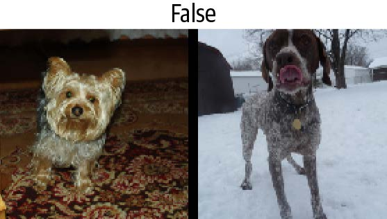
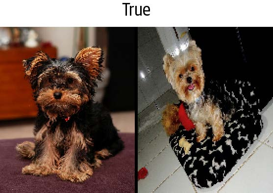

## 11. 使用 fastai 的中层 API 进行数据处理

我们已经了解了 `Tokenizer` 和 `Numericalize` 对文本集合的作用，以及它们如何在数据块API中被使用——该API通过 `TextBlock` 直接为我们处理这些转换。但如果我们只想应用其中一种转换呢？无论是为了查看中间结果，还是因为文本已完成词元化？更普遍地说，当数据块API无法灵活满足特定用例时，我们该如何应对？此时需要借助fastai的中层数据处理API——数据块API正是构建于该层之上，因此它不仅能实现数据块API的所有功能，更能提供远超其范围的扩展能力。

### 深入探索 fastai 的分层式 API

 fastai库基于分层API（layered API）构建。最顶层是应用程序，正如我们在第一章所见，它们让我们仅用五行代码就能训练模型。例如在为文本分类器创建 `DataLoaders` 时，我们使用了以下代码行：

```python
from fastai.text.all import *
dls = TextDataLoaders.from_folder(untar_data(URLs.IMDB), valid='test')
```

工厂方法 `TextDataLoaders.from_folder` 在数据结构与 IMDb 数据集完全一致时非常便捷，但实际应用中往往并非如此。数据块 API 提供了更高的灵活性。正如前一章所示，我们可通过以下方式实现相同效果：

```python
path = untar_data(URLs.IMDB)
dls = DataBlock(
    blocks=(TextBlock.from_folder(path),CategoryBlock),
    get_y = parent_label,
    get_items=partial(get_text_files, folders=['train', 'test']),
    splitter=GrandparentSplitter(valid_name='test')
).dataloaders(path)
```

但有时它不够灵活。例如，在调试过程中，我们可能只需要应用该数据块附带的部分转换操作。或者，我们可能需要为某个未被fastai直接支持的应用程序创建 `DataLoaders`。本节将深入剖析 fastai 内部用于实现数据块 API 的组件。掌握这些原理将使你能够充分利用该中间层 API 的强大功能与灵活特性。

> 中间层 API
>
> 中间层API不仅包含创建 `DataLoader` 的功能，还提供了回调系统，允许我们按需定制训练循环，以及通用优化器。这两者都将在第16章中详细介绍。

#### 变换

在上一章探讨词元化和数字化时，我们首先收集了大量文本：

```python
files = get_text_files(path, folders = ['train', 'test'])
txts = L(o.open().read() for o in files[:2000])
```

随后我们演示了如何使用 `Tokenizer` 对它们进行分词处理

```python
tok = Tokenizer.from_folder(path)
tok.setup(txts)
toks = txts.map(tok)
toks[0]
```

```text
(#374) ['xxbos','xxmaj','well',',','"','cube','"','(','1997',')'...]
```

以及如何进行数值化处理，包括自动为我们的语料库创建词汇表：

```python
num = Numericalize()
num.setup(toks)
nums = toks.map(num)
nums[0][:10]
```

```text
tensor([ 2, 8, 76, 10, 23, 3112, 23, 34, 3113, 33])
```

这些类还提供了 `decode` 方法。例如，`Numericalize.decode` 会返回字符串词元：

```python
nums_dec = num.decode(nums[0][:10]); nums_dec
```

```text
(#10) ['xxbos','xxmaj','well',',','"','cube','"','(','1997',')']
```

`Tokenizer.decode` 将此转换回单个字符串（但可能与原始字符串不完全相同；这取决于分词器是否可逆，而本书撰写时默认的词分词器不可逆）：

```python
tok.decode(nums_dec)
```

```text
'xxbos xxmaj well , " cube " ( 1997 )'
```

`decode` 函数被 fastai 的 `show_batch` 和 `show_results` 以及其他一些推理方法所使用，用于将预测结果和迷你批次转换为人类可理解的表示形式。

在前面的示例中，对于每个 `tok` 或 `num` ，我们创建了一个名为 `setup` 的方法（该方法在必要时为 `tok` 训练分词器，并为 `num` 创建词汇表），将其应用于原始文本（通过将对象作为函数调用），最后将结果解码回可理解的表示形式。这些步骤是大多数数据预处理任务的必需环节，因此 fastai 提供了一个封装这些步骤的类——`Transform` 类。`Tokenize` 和 `Numericalize` 都是 `Transform` 的子类。

通常而言，`Transform` 是一个行为类似函数的对象，它具有可选的 `setup` 方法（用于初始化内部状态，例如 `num` 中的词汇表）和可选的 `decode` 方法（用于反转该函数，但这种反转可能并不完美，正如我们从 `tok` 中所见）。

`decode` 的一个典型示例可见于第7章介绍的 `Normalize` 变换：为实现图像绘制，其 `decode` 方法会撤销归一化操作（即乘以标准差并加回均值）。另一方面，数据增强变换不提供 `decode` 方法，因为我们需要展示图像变化效果，以确保数据增强按预期发挥作用。

`Transforms` 的特殊行为在于它们总是作用于元组之上。通常，我们的数据始终是 (输入,目标) 形式的元组（有时包含多个输入或多个目标）。当对这类元素应用变换（如调整尺寸）时，我们并不希望整体调整元组的尺寸，而是分别调整输入（若适用）和目标（若适用）的尺寸。进行数据增强的批量变换同样如此：当输入是图像而目标是分割掩膜时，变换需以相同方式分别应用于输入和目标。

如果我们将文本元组传递给 `tok` 方法，就能看到这种行为：

```python
tok((txts[0], txts[1]))
```

```text
((#374) ['xxbos','xxmaj','well',',','"','cube','"','(','1997',')'...],
(#207)
>
['xxbos','xxmaj','conrad','xxmaj','hall','went','out','with','a','bang'...])
```

#### 编写你自己的转换器

如果你想编写自定义转换函数应用于数据，最简便的方式是编写函数。如示例所示，当提供类型参数时，转换函数仅对匹配类型生效（否则将始终生效）。在以下代码中，函数签名中的 ` :int` 表示 `f `仅作用于整数类型。因此 `tfm(2.0)` 返回 `2.0`，而 `tfm(2)` 返回 `3`：

```python
def f(x:int): return x+1
tfm = Transform(f)
tfm(2),tfm(2.0)
```

```text
(3, 2.0)
```

在此处，`f` 被转换为一个没有 `setup` 方法且没有 `decode` 方法的 `Transform`。

Python 提供了一种特殊语法，用于将函数（如 `f`）传递给另一个函数（或行为类似函数的对象，在 Python 中称为可调用对象（callable）），这种机制称为装饰器（decorator）。使用装饰器时，需在可调用对象前添加 `@` 符号，并将其置于函数定义之前（关于 Python 装饰器的优质在线教程众多，如果你还不熟悉这个概念，建议查阅相关教程）。以下代码与前文示例完全等效：

```python
@Transform
def f(x:int): return x+1
f(2),f(2.0)
```

```text
(3, 2.0)
```

如果你想实现初始化或解码功能，则需继承 `Transform` 类，在 `encodes` 中实现实际编码行为，随后（可选）在 `setups` 中实现初始化行为，并在 `decodes` 中实现解码行为：

```python
class NormalizeMean(Transform):
    def setups(self, items): self.mean = sum(items)/len(items)
    def encodes(self, x): return x-self.mean
    def decodes(self, x): return x+self.mean
```

在此，`NormalizeMean` 将在初始化阶段设置特定状态（传入所有元素的均值）；随后进行的变换是减去该均值。为实现解码目的，我们通过加回均值来实现该变换的逆操作。以下是 `NormalizeMean` 的应用示例：

```python
tfm = NormalizeMean()
tfm.setup([1,2,3,4,5])
start = 2
y = tfm(start)
z = tfm.decode(y)
tfm.mean,y,z
```

```text
(3.0, -1.0, 2.0)
```

请注意，对于以下每种方法，调用的方法与实现的方法是不同的：

| 类                    | 调用                   | 实现      |
| --------------------- | ---------------------- | --------- |
| `nn.Module` (PyTorch) | `()`（即作为函数调用） | `forward` |
| `Transform`           | `()`                   | `encodes` |
| `Transform`           | `decode()`             | `decodes` |
| `Transform`           | `setup()`              | `setups`  |

因此，例如你永远不会直接调用 `setups`，而是调用 `setup`。原因是 `setup` 会在你调用 setups 之前和之后为你执行一些操作。要深入了解 `Transforms` 以及如何利用它们根据输入类型实现不同行为，请务必查阅 fastai 文档中的教程。

#### `Pipeline` 类

要组合多个转换操作，fastai 提供了 `Pipeline` 类。我们通过向其传递一个转换操作列表来定义 `Pipeline`；它将自动组合内部的转换操作。当对某个对象调用 `Pipeline` 时，它会按顺序自动调用内部的转换操作：

```python
tfms = Pipeline([tok, num])
t = tfms(txts[0]); t[:20]
```

```text
tensor([ 2, 8, 76, 10, 23, 3112, 23, 34, 3113, 33,
10, 8,
> 4477, 22, 88, 32, 10, 27, 42, 14])
```

然后你可以对编码结果调用 `decode` 操作，以获取可显示和分析的内容：

```python
tfms.decode(t)[:100]
```

```text
'xxbos xxmaj well , " cube " ( 1997 ) , xxmaj vincenzo \'s first movie ,
was one
> of the most interesti'
```

唯一与 `Transform` 不同之处在于设置方式。要正确为某些数据设置 `Transform`  的 `Pipeline` ，需要使用 `TfmdLists` 。

### TfmdLists 和 Datasets：转换后的集合

你的数据通常是一组原始项（如文件名或 `DataFrame` 中的行），你应该希望对这些项进行一系列转换。我们刚刚看到，在fastai中，一系列转换由 `Pipeline` 表示。将该 `Pipeline` 与原始项组合的类称为 `TfmdLists`。

#### TfmdLists

以下是实现上一节中转换的简便方法：

```python
tls = TfmdLists(files, [Tokenizer.from_folder(path), Numericalize])
```

初始化时，`TfmdLists` 将按顺序自动调用每个 `Transform` 的 `setup` 方法，为每个 `Transform` 提供经过所有先前 `Transform` 依次转换后的元素，而非原始元素。我们只需通过索引访问 `TfmdLists`，即可获取管道对任意原始元素的处理结果：

```python
t = tls[0]; t[:20]
```

```text
tensor([ 2, 8, 91, 11, 22, 5793, 22, 37, 4910,
34,
> 11, 8, 13042, 23, 107, 30, 11, 25, 44, 14])
```

而 `TfmdLists` 懂得如何为展示目的进行解码：

```python
tls.decode(t)[:100]
```

```text
'xxbos xxmaj well , " cube " ( 1997 ) , xxmaj vincenzo \'s first movie ,
was one
> of the most interesti'
```

事实上，它甚至还有一个 `show` 方法：

```python
tls.show(t)
```

```text
xxbos xxmaj well , " cube " ( 1997 ) , xxmaj vincenzo 's first movie ,
was one
> of the most interesting and tricky ideas that xxmaj i 've ever seen
when
> talking about movies . xxmaj they had just one scenery , a bunch of
actors
> and a plot . xxmaj so , what made it so special were all the
effective
> direction , great dialogs and a bizarre condition that characters had
to deal
> like rats in a labyrinth . xxmaj his second movie , " cypher " ( 2002
) , was
> all about its story , but it was n't so good as " cube " but here are
the
> characters being tested like rats again .
" nothing " is something very interesting and gets xxmaj vincenzo
coming back
> to his ' cube days ' , locking the characters once again in a very
different
> space with no time once more playing with the characters like playing
with
> rats in an experience room . xxmaj but instead of a thriller sci - fi
( even
> some of the promotional teasers and trailers erroneous seemed like
that ) , "
> nothing " is a loose and light comedy that for sure can be called a
modern
> satire about our society and also about the intolerant world we 're
living .
> xxmaj once again xxmaj xxunk amaze us with a great idea into a so
small kind
> of thing . 2 actors and a blinding white scenario , that 's all you
got most
> part of time and you do n't need more than that . xxmaj while " cube
" is a
> claustrophobic experience and " cypher " confusing , " nothing " is
> completely the opposite but at the same time also desperate .
xxmaj this movie proves once again that a smart idea means much more
than just
> a millionaire budget . xxmaj of course that the movie fails sometimes
, but
> its prime idea means a lot and offsets any flaws . xxmaj there 's
nothing
> more to be said about this movie because everything is a brilliant
surprise
> and a totally different experience that i had in movies since " cube
" .
```

`TfmdLists` 的命名带有“s”后缀，因为它能通过 `splits` 参数同时处理训练集和验证集。你只需传入训练集元素的索引和验证集元素的索引即可：

```python
cut = int(len(files)*0.8)
splits = [list(range(cut)), list(range(cut,len(files)))]
tls = TfmdLists(files, [Tokenizer.from_folder(path), Numericalize],
                splits=splits)
```

然后你可以通过 `train` 和 `valid` 属性访问它们：

```python
tls.valid[0][:20]
```

```text
tensor([ 2, 8, 20, 30, 87, 510, 1570, 12, 408,
379,
> 4196, 10, 8, 20, 30, 16, 13, 12216, 202, 509])
```

如果你手动编写了一个 `Transform` 方法，用于一次性完成所有预处理工作，将原始项目转换为包含输入和目标的元组，那么 `TfmdLists` 正是你需要的类。你可以直接通过 `dataloaders` 方法将其转换为 `DataLoaders` 对象。这正是我们将在本章后面的双胞胎示例中要实现的功能。

通常情况下，你应该会拥有两条（或更多）并行的转换管道：一条用于将原始项目处理为输入，另一条用于将原始项目处理为目标。例如，这里定义的管道仅将原始文本处理为输入。如果要进行文本分类，还需将标签处理为目标。

为此，我们需要完成两项操作。首先从父文件夹中获取标签名称。为此提供了一个名为  `parent_label` 的函数：

```python
lbls = files.map(parent_label)
lbls
```

```text
(#50000)
['pos','pos','pos','pos','pos','pos','pos','pos','pos','pos'...]
```

那么我们需要一个 `Tranform`  ，它会在初始化时抓取唯一项并构建词汇表，在调用时将字符串标签转换为整数。fastai 为我们提供了这样的功能，它被称为 `Categorize`：

```python
cat = Categorize()
cat.setup(lbls)
cat.vocab, cat(lbls[0])
```

```text
((#2) ['neg','pos'], TensorCategory(1))
```

要对文件列表自动完成整个设置，我们可以像之前那样创建一个`TfmdLists`：

```python
tls_y = TfmdLists(files, [parent_label, Categorize()])
tls_y[0]
```

```text
TensorCategory(1)
```

但这样我们最终会得到两个独立的对象来处理输入和目标，这并非我们想要的结果。此时 `Datasets` 便派上了用场。

#### Datasets

`Datasets` 将对同一原始对象并行应用两个（或更多）数据处理管道，并构建包含结果的元组。与 `TfmdLists` 类似，它会自动完成初始化工作。当我们对 `Datasets` 进行索引时，它将返回包含每个管道处理结果的元组：

```python
x_tfms = [Tokenizer.from_folder(path), Numericalize]
y_tfms = [parent_label, Categorize()]
dsets = Datasets(files, [x_tfms, y_tfms])
x,y = dsets[0]
x[:20],y
```

如同 `TfmdLists` 一样，我们可以将 `splits` 方法的结果传递给 `Datasets` 来将数据分割为训练集和验证集：

```python
x_tfms = [Tokenizer.from_folder(path), Numericalize]
y_tfms = [parent_label, Categorize()]
dsets = Datasets(files, [x_tfms, y_tfms], splits=splits)
x,y = dsets.valid[0]
x[:20],y
```

```text
(tensor([ 2, 8, 20, 30, 87, 510, 1570, 12, 408,
379,
> 4196, 10, 8, 20, 30, 16, 13, 12216, 202,
509]),
TensorCategory(0))
```

它还能解码任何处理过的元组或直接显示：

```python
t = dsets.valid[0]
dsets.decode(t)
```

```text
('xxbos xxmaj this movie had horrible lighting and terrible camera
movements .
> xxmaj this movie is a jumpy horror flick with no meaning at all .
xxmaj the
> slashes are totally fake looking . xxmaj it looks like some 17 year -
old
> idiot wrote this movie and a 10 year old kid shot it . xxmaj with the
worst
> acting you can ever find . xxmaj people are tired of knives . xxmaj
at least
> move on to guns or fire . xxmaj it has almost exact lines from " when
a xxmaj
> stranger xxmaj calls " . xxmaj with gruesome killings , only crazy
people
> would enjoy this movie . xxmaj it is obvious the writer does n\'t
have kids
> or even care for them . i mean at show some mercy . xxmaj just to sum
it up ,
> this movie is a " b " movie and it sucked . xxmaj just for your own
sake , do
> n\'t even think about wasting your time watching this crappy movie
.',
'neg')
```

最后一步是将我们的 `Datasets` 对象转换为 `DataLoaders` ，这可通过 `dataloaders` 方法实现。在此过程中，我们需要传递一个特殊参数来处理填充问题（如前一章所述）。该操作必须在批处理元素之前完成，因此我们将其传递给 `before_batch` 方法：

```python
dls = dsets.dataloaders(bs=64, before_batch=pad_input)
```

`dataloaders` 会直接调用 `DataLoader` 处理 `Datasets` 的每个子集。fastai的`DataLoader` 继承了同名PyTorch类，负责将数据集中的元素分批处理。它提供了丰富的定制选项，其中最关键的定制点如下：

- `after_item`

  应用于数据集内抓取每个项之后。相当于 `DataBlock` 中的 `item_tfms`。

- `before_batch`

  应用于项列表在合并之前。这是将项填充至相同大小的理想位置。

- `after_batch`

  应用于批次整体构建之后。相当于 `DataBlock` 中的 `batch_tfms`。

综上所述，以下是为文本分类准备数据所需的完整代码：

```python
tfms = [[Tokenizer.from_folder(path), Numericalize], [parent_label,
Categorize]]
files = get_text_files(path, folders = ['train', 'test'])
splits = GrandparentSplitter(valid_name='test')(files)
dsets = Datasets(files, tfms, splits=splits)
dls = dsets.dataloaders(dl_type=SortedDL, before_batch=pad_input)
```

与先前代码相比，主要有两处差异：一是使用 `GrandparentSplitter` 来分割训练集和验证集，二是添加了 `dl_type` 参数。该参数用于告知 `dataloaders` 使用 `DataLoader` 类的 `SortedDL` 实现，而非常规实现。`SortedDL` 通过将长度大致相等的样本归入批次来构建批次。

这与之前的 `DataBlock` 完全相同：

```python
path = untar_data(URLs.IMDB)
dls = DataBlock(
    blocks=(TextBlock.from_folder(path),CategoryBlock),
    get_y = parent_label,
    get_items=partial(get_text_files, folders=['train', 'test']),
    splitter=GrandparentSplitter(valid_name='test')
).dataloaders(path)
```

但现在你知道如何自定义其中的每一部分了！

现在让我们通过一个计算机视觉示例，实践刚刚学到的使用这个中层API进行数据预处理的方法。

### 应用中层数据API：孪生体（Siamese Pair）

一个二元分类模型（Siamese model）需要处理两张图像，并判断它们是否属于同一类别。本例中我们将再次使用宠物数据集，为模型准备数据以预测两张宠物图像是否属于同一品种。本文将说明如何为这类模型准备数据，并在第15章中进行模型训练。

首先——让我们获取数据集中的图像：

```python
from fastai.vision.all import *
path = untar_data(URLs.PETS)
files = get_image_files(path/"images")
```

如果我们完全不关心对象的展示效果，可以直接创建一个转换器来预处理整个文件列表。但既然需要查看这些图像，就必须创建自定义类型。当调用 `TfmdLists` 或 `Datasets` 对象的 `show` 方法时，它会解码项目直至找到包含show方法的类型，并用该方法展示对象。该 `show` 方法会接收一个 `ctx` 参数，对于图像可能是 `matplotlib` 坐标轴，对于文本可能是DataFrame的行。

在此我们创建了一个继承自 `Tuple` 类的 `SiameseImage` 对象，用于包含三项内容：两张图像，以及一个布尔值（当图像属于同一品种时为 `True` ）。我们还实现了特殊的 `show`方法，使其能将两张图像以中间黑色线条相连的方式拼接显示。不必过多关注 `if` 条件语句中的逻辑（该条件用于在图像为Python图像而非张量时显示 `SiameseImage`）；关键部分在于最后三行代码：

```python
class SiameseImage(Tuple):
    def show(self, ctx=None, **kwargs):
        img1,img2,same_breed = self
        if not isinstance(img1, Tensor):
            if img2.size != img1.size: img2 = img2.resize(img1.size)
            t1,t2 = tensor(img1),tensor(img2)
            t1,t2 = t1.permute(2,0,1),t2.permute(2,0,1)
        else: t1,t2 = img1,img2
        line = t1.new_zeros(t1.shape[0], t1.shape[1], 10)
        return show_image(torch.cat([t1,line,t2], dim=2),
                          title=same_breed, ctx=ctx)
```

让我们创建第一个 `SiameseImage`，并验证我们的 `show` 方法是否正常工作：

```python
img = PILImage.create(files[0])
s = SiameseImage(img, img, True)
s.show();
```


我们还可以尝试使用另一张不属于同一类别的图像：

```python
img1 = PILImage.create(files[1])
s1 = SiameseImage(img, img1, False)
s1.show();
```


我们之前看到的转换操作的关键点在于它们会对元组或其子类进行分派。这正是我们在此选择继承 `Tuple` 类的原因——通过这种方式，我们可以将任何适用于图像的转换应用于我们的 `SiameseImage`，而该转换将作用于元组中的每张图像：

```python
s2 = Resize(224)(s1)
s2.show();
```



在此，`Resize` 变换方法被应用于两张图像，但不适用于布尔标志。即使我们使用自定义类型，仍可充分利用库内所有数据增强变换。

现在我们准备构建用于处理数据的 `Transform` ，以满足孪生模型的需求。首先，我们需要一个函数来确定所有图像的类别：

```python
def label_func(fname):
    return re.match(r'^(.*)_\d+.jpg$', fname.name).groups()[0]
```

对于每张图像，我们的转换器将以0.5的概率从同一类别中抽取图像并返回带有真实标签的 `SiameseImage` ，或从其他类别中抽取图像并返回带有错误标签的 `SiameseImage` 。所有操作均在私有函数 `_draw` 中完成。训练集与验证集存在一个关键差异，因此转换器需通过数据分割进行初始化：在训练集上，每次读取图像时都会进行随机选择；而在验证集上，仅在初始化时一次性完成随机分配。如此便能在训练过程中获取多样化的样本，同时保持验证集始终一致：

```python
class SiameseTransform(Transform):
    def __init__(self, files, label_func, splits):
        self.labels = files.map(label_func).unique()
        self.lbl2files = {l: L(f for f in files if label_func(f) == l)
                          for l in self.labels}
        self.label_func = label_func
        self.valid = {f: self._draw(f) for f in files[splits[1]]}
        
    def encodes(self, f):
        f2,t = self.valid.get(f, self._draw(f))
        img1,img2 = PILImage.create(f),PILImage.create(f2)
        return SiameseImage(img1, img2, t)
    
    def _draw(self, f):
        same = random.random() < 0.5
        cls = self.label_func(f)
        if not same:
            cls = random.choice(L(l for l in self.labels if l != cls))
        return random.choice(self.lbl2files[cls]),same
```

然后我们可以创建我们的主要转换：

```python
splits = RandomSplitter()(files)
tfm = SiameseTransform(files, label_func, splits)
tfm(files[0]).show();
```


在中层数据采集API中，我们有两个对象可用于对项集应用转换：`TfmdLists` 和`Datasets` 。回顾前文所述，前者应用单个 `Pipeline` ，后者则并行应用多个 `PipeLines` 以构建元组。由于此处的主转换已直接构建元组，因此我们使用 `TfmdLists` ：

```python
tls = TfmdLists(files, tfm, splits=splits)
show_at(tls.valid, 0);
```



最后，我们可以通过调用 `dataloaders` 方法将数据加载到 `DataLoaders` 中。需要注意的是，该方法不支持像 `DataBlock` 那样传入`item_tfms` 和 `batch_tfms` 参数。fastai的`DataLoader` 提供了若干基于事件命名的钩子函数：在抓取数据项后执行的操作称为`after_item`，而批次构建完成后执行的操作则称为 `after_batch`：

```python
dls = tls.dataloaders(after_item=[Resize(224), ToTensor],
                      after_batch=[IntToFloatTensor,
                                   Normalize.from_stats(*imagenet_stats)])
```

请注意，我们需要传递比通常更多的转换——这是因为数据块API通常会自动添加它们：

- `ToTensor` 是将图像转换为张量的函数（同样，它应用于元组的每个部分）。
- `IntToFloatTensor` 将包含0到255整数的图像张量转换为浮点张量，并除以255使值介于0到1之间。

现在我们可以使用这些 `DataLoaders`  训练模型。由于它需要处理两张图像而非一张，因此相较于 `cnn_learner` 提供的常规模型，它需要更多定制化设置。具体如何创建此类模型并进行训练，我们将在第15章中详细说明。

### 总结

fastai提供分层API。当数据处于常规设置时，仅需一行代码即可获取数据，使初学者能够专注于模型训练，而无需耗费过多时间整理数据。高级数据块API通过支持模块组合提供更大灵活性。其底层的中级API则赋予更强的数据项转换能力。在实际应用中，这可能是你最常用的功能，我们希望它能最大限度简化数据处理流程。

### 问卷调查

1. 为什么说fastai具有“分层”API？这意味着什么？
2. `Transform` 为何包含 `decode` 方法？其作用是什么？
3. `Transform` 为何包含 `setup` 方法？其作用是什么？
4. 当对元组调用 `Transform` 时，其工作原理是什么？
5. 编写自定义 `Transform` 时需要实现哪些方法？
6. 编写一个 `Normalize` 转换器，实现数据项的完全标准化（减去均值并除以数据集标准差），且能反向解码该操作。尽量避免提前查看实现！
7. 编写一个对分词文本进行数值化的 `Transform`（应能根据输入数据集自动设置词汇表，并包含decode方法）。如有需要可参考fastai源代码。
8. 什么是 `Pipeline` ？
9. 什么是 `TfmdLists`？
10. 什么是 `Datasets`？它与 `TfmdLists` 有何区别？
11. 为什么 `TfmdLists` 和 `Datasets` 的名称都带“s”？
12. 如何从 `TfmdLists` 或 `Datasets` 构建 `DataLoaders`？
13. 从 `TfmdLists` 或 `Datasets` 构建 `DataLoaders` 时，如何传递 `item_tfms` 和 `batch_tfms` 参数？
14. 若需让自定义项目与 `show_batch` 或 `show_results` 等方法协同工作，需要进行哪些操作？
15. 为何能轻松将fastai数据增强转换应用于构建的 `SiamesePair` ？

#### 进一步研究

1. 使用中级 API 在自己的数据集上准备 `DataLoaders` 中的数据。尝试使用第 1 章中的 Pet 数据集和 Adult 数据集进行操作。
2. 查阅 fastai 文档中的 Siamese 教程，学习如何为新型项目自定义 `show_batch` 和 `show_results` 的行为。在自己的项目中实现该功能。

### 理解fastai的应用场景：阶段性总结

恭喜你——你已经完成了本书所有章节的学习，这些章节涵盖了训练模型和使用深度学习的关键实践部分！你已经掌握了如何使用fastai的所有内置应用程序，以及如何通过数据块API和损失函数进行定制。你甚至掌握了从零构建神经网络并进行训练的方法！（希望你现在也懂得提出关键问题，确保自己的成果能助力社会进步。）

你现有的知识已足以创建多种类型神经网络应用的完整工作原型。更重要的是，它将帮助你理解深度学习模型的能力和局限性，以及如何设计出与之高度契合的系统。

在本书的后续章节中，我们将逐层剖析这些应用程序，以理解它们所依托的基础架构。这对深度学习从业者至关重要，因为这使您能够检查和调试所构建的模型，并为特定项目定制开发全新的应用程序。
