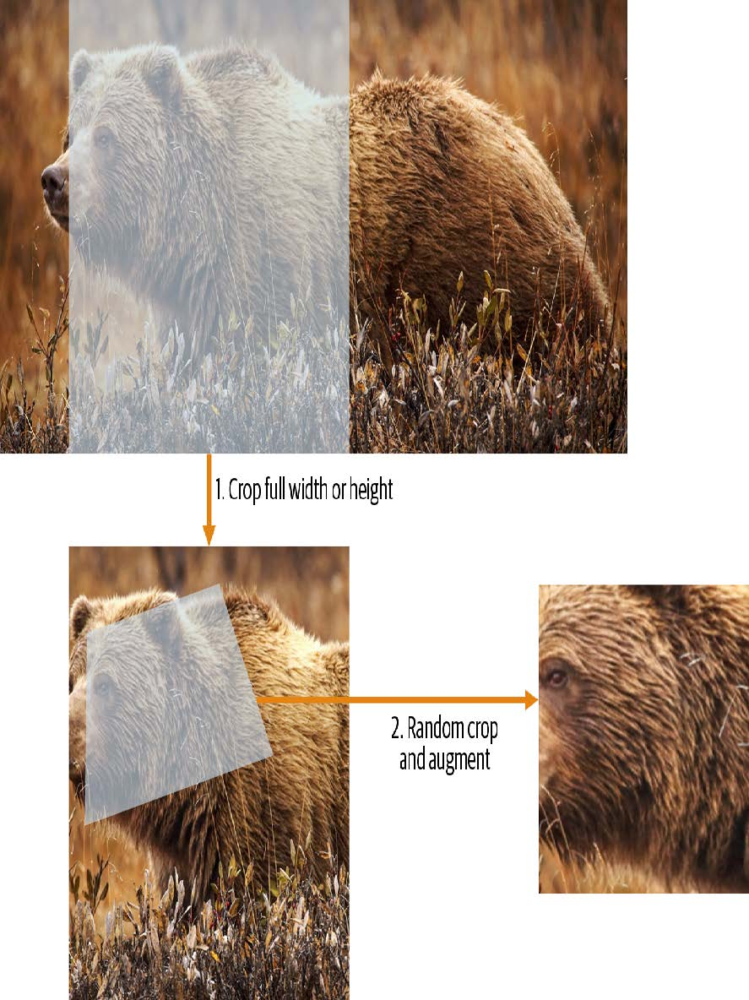
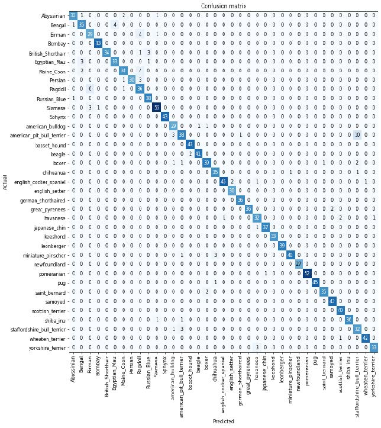
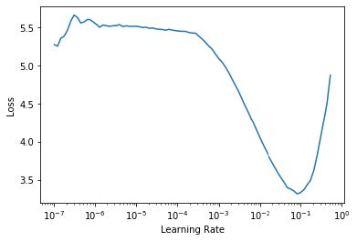
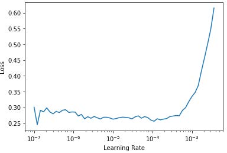
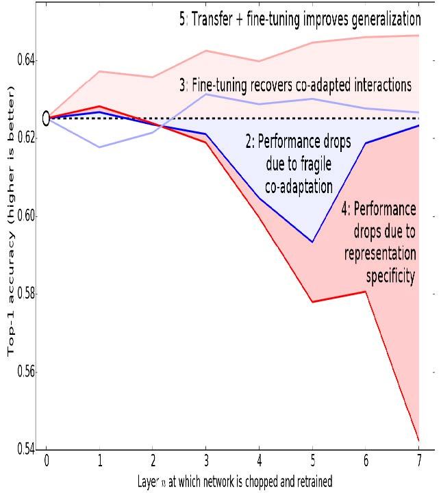
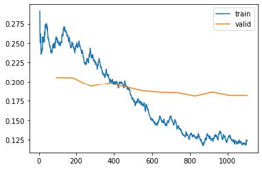

## 5. 图像分类

既然你已经理解了深度学习的本质、应用场景以及如何创建和部署模型，现在是时候深入探索了！在理想状态下，深度学习从业者无需了解底层运作的每个细节。但现实世界远非如此。事实上，要让模型真正有效且稳定运行，你必须精准把控大量细节，并持续进行多项验证。这个过程需要你能够透视神经网络在训练和预测过程中的内部运作，发现潜在问题并掌握解决的方法。

因此，从本书此处开始，我们将深入探讨深度学习的运作机制。计算机视觉模型、自然语言处理模型、表格模型等的架构是什么？如何构建符合特定领域需求的架构？如何从训练过程中获得最佳结果？如何提升运行速度？当数据集发生变化时需要调整哪些要素？

我们将从重温第一章中探讨过的基本应用开始，但会着重实现两点：

- 优化这些应用。
- 将其应用于更广泛的数据类型。

要完成这两项任务，我们必须掌握深度学习拼图的所有组成部分。这包括不同类型的神经网络层、正则化方法、优化器、如何将层组合成网络架构、标注技术等等。不过我们不会一次性地把所有知识点倒给你，而是根据项目需求循序渐进地引入这些内容，以解决实际项目中遇到的具体问题。

### 从猫狗到宠物品种

在我们的第一个模型中，我们学会了如何区分狗和猫。就在几年前，这还被视为极具挑战性的任务——如今却变得轻而易举！我们无法通过这个案例展示模型训练的细节精妙之处，因为无需关注任何细节就能获得近乎完美的结果。但事实证明，同一数据集还能让我们攻克更艰巨的难题：识别每张图片中宠物的具体品种。

在第一章中，我们将应用场景视为已解决的问题。但现实世界并非如此运作。我们从一个完全陌生的数据集开始。接着必须摸索其构成方式，探索如何从中提取所需数据，并理解这些数据的形态特征。本书后续内容将向你展示如何在实践中解决这些问题，涵盖所有必要的过渡步骤——既要深入理解处理中的数据，又要同步验证建模过程。

我们已经下载了宠物数据集，并可通过与第1章相同的代码获取该数据集的路径：

```python
from fastai2.vision.all import *
path = untar_data(URLs.PETS)
```

若要理解如何从每张图片中提取每只宠物的品种，我们需要先了解数据的布局方式。这类数据布局细节是深度学习拼图中至关重要的一环。数据通常以以下两种形式之一提供：

- 代表数据项的独立文件，例如文本文档或图像，可能组织在文件夹中，或通过文件名体现这些项的相关信息
- 数据表格（例如CSV格式），其中每行代表一个数据项，可能包含文件名以建立表格数据与其他格式数据（如文本文档和图像）之间的关联

这些规则存在例外情况——尤其在基因组学等领域，那里可能存在二进制数据库格式甚至网络流——但总体而言，你将处理的大多数数据集都将采用这两种格式的某种组合形式。

要查看数据集中的内容，我们可以使用 `ls` 方法：

```python
path.ls()
```

```text
(#3) [Path('annotations'),Path('images'),Path('models')]
```

我们可以看到，该数据集提供了图像（images）目录和注释（annotations）目录。[数据集网站](https://oreil.ly/xveoN) 说明注释目录包含宠物位置信息而非物种信息。本章将进行分类任务而非定位任务，也就是说我们关注的是宠物的种类而非位置。因此，我们暂时忽略注释目录。现在，让我们查看图像目录：

```python
(path/"images").ls()
```

```text
(#7394)
[Path('images/great_pyrenees_173.jpg'),Path('images/wheaten_terrier_46.j
>
pg'),Path('images/Ragdoll_262.jpg'),Path('images/german_shorthaired_3.jpg'),P
>
ath('images/american_bulldog_196.jpg'),Path('images/boxer_188.jpg'),Path('ima
>
ges/staffordshire_bull_terrier_173.jpg'),Path('images/basset_hound_71.jpg'),P
>
ath('images/staffordshire_bull_terrier_37.jpg'),Path('images/yorkshire_terrie
> r_18.jpg')...]
```

fastai 中大多数返回集合的函数和方法都使用名为 `L` 的类。该类可视为普通 Python 列表类型的增强版本，为常见操作提供了额外便利。例如，当我们在笔记本中显示该类对象时，其呈现格式如上面所示。首先显示的是集合中项的数量，前缀为 `#`。在前面的输出中，你还会注意到列表末尾带有省略号。这意味着仅显示了前几个元素——这其实是件好事，毕竟我们可不想在屏幕上看到超过7000个文件名！

通过分析这些文件名，我们可以看出它们的结构特征。每个文件名包含宠物品种名称，随后是一个下划线（`_`），接着是一个数字，最后是文件扩展名。我们需要编写一段代码从单个路径中提取品种信息。Jupyter笔记本能轻松实现这一点，因为我们可以逐步构建出可用的功能模块，然后将其应用于整个数据集。此时我们必须十分谨慎，避免过早下结论。例如你仔细观察会发现，某些宠物品种名称包含多个单词，因此不能简单地在首个下划线处截断。为了验证我们的代码，我们选取其中一个文件名：

```python
fname = (path/"images").ls()[0]
```

从这类字符串中提取信息的最强大且灵活的方式是使用 *正则表达式*（regular expression，也称为regex）。正则表达式是一种特殊的字符串，采用正则表达式语言编写，用于定义通用规则来判定另一个字符串是否通过测试（即“匹配”该正则表达式），同时也可从中提取特定部分或多个部分。在此场景中，我们需要一个能从文件名中提取宠物品种的正则表达式。

我们在此无法提供完整的正则表达式教程，但网上有许多优秀的教程可供参考，而且我们知道许多读者早已熟悉这个强大的工具。如果你还没掌握，也完全不必担心——这正是弥补这一缺憾的绝佳机会！我们认为正则表达式是编程工具箱中最实用的工具之一，许多学员都告诉我们这是他们最期待学习的内容。现在就去谷歌搜索“正则表达式教程”吧，浏览完相关资料后再回到这里。本书官网也提供了我们精选的教程列表。

> ALEXIS说
>
> 正则表达式不仅实用性极强，其起源也颇具趣味。之所以称为“正则”，是因为它们最初是“正则语言”的范例——这种语言属于乔姆斯基层次结构中的最低层级。该语法分类体系由语言学家诺姆·乔姆斯基（Noam Chomsky）创立，他同时撰写了开创性著作《句法结构》——这部开创性著作致力于探索人类语言背后的形式语法。这正是计算机科学的魅力所在：你每日随手取用的工具，其设计理念或许源自太空飞船。

编写正则表达式时，最佳的入门方式是先用一个示例进行测试。让我们使用 `findall` 方法，将正则表达式应用于 `fname` 对象的文件名：

```python
re.findall(r'(.+)_\d+.jpg$', fname.name)
```

```text
['great_pyrenees']
```

此正则表达式提取所有位于最后一个下划线前的字符，前提是后续字符为数字，且文件后缀为JPEG格式。

既然我们已确认正则表达式适用于示例，现在就用它来标注整个数据集。fastai 提供了多种用于标注的类。对于正则表达式标注，我们可以使用 `RegexLabeller` 类。在本示例中，我们使用第2章介绍的数据块API（实际上我们几乎总是使用数据块API——它比第1章介绍的简单工厂方法灵活得多）：

```python
pets = DataBlock(blocks = (ImageBlock, CategoryBlock),
                 get_items=get_image_files,
                 splitter=RandomSplitter(seed=42),
                 get_y=using_attr(RegexLabeller(r'(.+)_\d+.jpg$'),
                                  'name'),
                 item_tfms=Resize(460),
                 batch_tfms=aug_transforms(size=224, min_scale=0.75))
dls = pets.dataloaders(path/"images")
```

这个 `DataBlock` 的调用中有两行代码是我们之前未曾见过的关键部分：

```python
item_tfms=Resize(460),
batch_tfms=aug_transforms(size=224, min_scale=0.75)
```

这些代码实现了我们称为预尺寸化（presizing）的fastai数据增强策略。预尺寸化是一种特殊的图像增强方式，旨在最大限度减少数据破坏的同时保持良好性能。

### 预尺寸化

我们需要图像具有相同的尺寸，以便它们能够组合成张量传递给GPU。同时，我们希望尽量减少执行的不同增强计算的数量。性能要求表明，我们应尽可能将增强变换组合为更少的变换（以降低计算量和有损操作次数），并将图像转换为统一尺寸（以提升GPU处理效率）。

我们的挑战在于，若在缩小至增强尺寸后执行，多种常见的数据增强变换可能会引入虚假的空白区域、降低数据质量，或两者兼而有之。例如，将图像旋转45度会使新边界范围的角落区域出现空白，这无法为模型提供任何学习信息。许多旋转和缩放操作需要通过插值生成像素。这些插值像素虽源自原始图像数据，但质量仍会降低。

为应对这些挑战，预尺寸调整采用了如图5-1所示的两种策略：

1. 将图像调整为相对“较大”的尺寸——即尺寸显著大于目标训练尺寸。
2. 将所有常见的增强操作（包括调整为最终目标尺寸）组合为一项操作，并在处理结束时仅在GPU上执行一次组合操作，而非分别执行各项操作并进行多次插值。

第一步是调整尺寸，生成足够大的图像以保留余量，从而我们能在内部区域进行进一步的增强变换而不产生空白区域。该变换通过采用大裁剪尺寸调整为正方形实现。在训练集上，裁剪区域随机选取，裁剪尺寸则选取覆盖图像宽度或高度中较小者。第二步中，所有数据增强操作均交由GPU处理，所有潜在的破坏性操作会被集中执行，并在最后进行单次插值处理。



[^图5-1]: 在训练集上预先调整尺寸

这张图展示了两个步骤：

1. 裁剪完整宽度或高度：该操作位于 `item_tfms` 中，因此在图像复制到GPU前会应用于每张图像。此步骤用于确保所有图像尺寸一致。在训练集上，裁剪区域随机选择；在验证集上，始终选择图像的中心正方形区域。
2. 随机裁剪与数据增强：该操作位于 `batch_tfms` 中，因此在GPU上对整个批次批量处理，效率极高。在验证集上，此处仅执行调整至模型所需最终尺寸的操作。而在训练集上，则优先执行随机裁剪及其他增强操作。

要在fastai中实现此流程，需将 `Resize` 作为项目转换使用较大尺寸，并将`RandomResizedCrop` 作为批量转换使用较小尺寸。若在 `aug_transforms` 函数中包含`min_scale` 参数（如前文 `DataBlock` 调用所示），系统将自动添加 `RandomResizedCrop` 。你也可在初始 `Resize` 操作中使用 `pad` 或 `squish` 替代默认的 `crop` 操作。

图5-2展示了两种图像处理方式的差异：右侧图像经过放大、插值、旋转，再进行二次插值（这是其他所有深度学习库采用的方法）；左侧图像则将放大与旋转作为单一操作处理，仅进行一次插值（fastai方法）。


[^图5-2]: fastai的数据增强策略（左）与传统方法（右）的对比

可以看出右侧图像的清晰度较低，左下角存在反射填充伪影；此外左上角的草丛已完全消失。实践表明，预尺寸处理能显著提升模型精度，同时通常还能加快处理速度。

fastai库还提供了简便的方法，可在训练模型前检查数据状态，这是极其重要的一步。接下来我们将探讨这些方法。

#### 检查和调试数据块

我们永远不能想当然地认为代码运行完美无缺。编写数据块就像绘制蓝图。代码中存在语法错误时，系统会提示报错信息，但无法保证模板能按预期处理数据源。因此在训练模型前，务必始终检查数据。

你可以使用 `show_batch` 方法实现：

```python
dls.show_batch(nrows=1, ncols=3)
```


请仔细查看每张图片，确认每张图片的标签是否与该宠物品种相符。数据科学家处理的数据往往不如领域专家熟悉：例如，我其实并不认识其中许多宠物品种。由于我并非宠物品种专家，此时我会使用谷歌图片搜索部分品种，确保图片与输出结果中的样貌相符。

如果在构建数据块时出现错误，你很可能在此步骤之前无法察觉。为了排查此类问题，我们建议你使用 `summary` 方法。该方法将尝试根据你提供的源数据创建批处理任务，并生成大量详细信息。此外，若操作失败，你将精确定位错误发生点，库文件也会尝试提供帮助。例如常见错误是忘记使用 `Resize` 转换，导致图片尺寸不统一而无法批量处理。此类情况下的摘要示例如下（注：具体文本可能随版本更新，但可供参考）：

```python
pets1 = DataBlock(blocks = (ImageBlock, CategoryBlock),
                  get_items=get_image_files,
                  splitter=RandomSplitter(seed=42),
                  get_y=using_attr(RegexLabeller(r'(.+)_\d+.jpg$'),
                                   'name'))
pets1.summary(path/"images")
```

```text
Setting-up type transforms pipelines
Collecting items from /home/sgugger/.fastai/data/oxford-iiit-pet/images
Found 7390 items
2 datasets of sizes 5912,1478
Setting up Pipeline: PILBase.create
Setting up Pipeline: partial -> Categorize
Building one sample
Pipeline: PILBase.create
starting from
/home/sgugger/.fastai/data/oxford-iiitpet/
images/american_bulldog_83.jpg
applying PILBase.create gives
PILImage mode=RGB size=375x500
Pipeline: partial -> Categorize
starting from
/home/sgugger/.fastai/data/oxford-iiitpet/
images/american_bulldog_83.jpg
applying partial gives
american_bulldog
applying Categorize gives
TensorCategory(12)
Final sample: (PILImage mode=RGB size=375x500, TensorCategory(12))
Setting up after_item: Pipeline: ToTensor
Setting up before_batch: Pipeline:
Setting up after_batch: Pipeline: IntToFloatTensor
Building one batch
Applying item_tfms to the first sample:
Pipeline: ToTensor
starting from
(PILImage mode=RGB size=375x500, TensorCategory(12))
applying ToTensor gives
(TensorImage of size 3x500x375, TensorCategory(12))
Adding the next 3 samples
No before_batch transform to apply
Collating items in a batch
Error! It's not possible to collate your items in a batch
Could not collate the 0-th members of your tuples because got the
following
shapes:
torch.Size([3, 500, 375]),torch.Size([3, 375, 500]),torch.Size([3, 333,
500]),
torch.Size([3, 375, 500])
```

你可以清楚地看到我们如何收集数据并进行拆分，如何从文件名转换为样本（元组(image, category)），随后应用了哪些项目转换，以及为何无法将这些样本批量归集（因形状不一致所致）。

当你认为数据看起来正确时，我们通常建议下一步应使用它来训练一个简单模型。我们常看到人们过度拖延实际模型的训练过程，结果导致他们无法了解基准结果的真实表现。或许你的问题根本不需要复杂的领域特定工程处理，又或许数据似乎完全无法训练模型——这些都是你需要尽早确认的关键信息。

在本次初步测试中，我们将沿用第一章中使用的简单模型：

```python
learn = cnn_learner(dls, resnet34, metrics=error_rate)
learn.fine_tune(2)
```

| 迭代轮次 | 训练损失 | 验证损失 | 错误率   | 时间  |
| -------- | -------- | -------- | -------- | ----- |
| 0        | 1.491732 | 0.337355 | 0.108254 | 00:18 |
| 0        | 0.503154 | 0.293404 | 0.096076 | 00:23 |
| 1        | 0.314759 | 0.225316 | 0.066306 | 00:23 |

正如我们之前简要讨论过的，拟合模型时显示的表格展示了每次训练的迭代轮次后的结果。请记住，一个迭代轮次指的是对数据集中所有图像进行一次完整遍历的过程。表格列出的内容包括：训练集样本的平均损失值、验证集的损失值，以及我们请求的任何指标——本例中即错误率。

请记住，损失函数就是我们用来优化模型参数的函数，不管它是什么种类。但我们尚未实际告知fastai应使用哪种损失函数。那么它会怎么做？fastai通常会根据数据类型和模型类型自动选择合适的损失函数。本例中，我们处理的是图像数据且结果为分类变量，因此fastai默认采用 *交叉熵损失* （cross-entropy loss）。

### 交叉熵损失

交叉熵损失是一种损失函数，它与上一章中使用的类似，但（正如我们将看到的）具有两个优势：

- 即使因变量具有超过两个类别时，该方法依然有效。
- 它能实现更快且更可靠的训练过程。

要理解交叉熵损失函数如何处理超过两类的因变量，我们首先需要了解损失函数实际处理的数据和激活函数的具体形态。

#### 查看激活项和标签

让我们来看看模型的激活情况。要从我们的 `DataLoaders` 中获取一批真实数据，我们可以使用 `one_batch` 方法：

```python
x,y = dls.one_batch()
```

如你所见，这将以小批量形式返回因变量和自变量。让我们看看因变量包含哪些内容：

```python
y
```

```text
TensorCategory([11, 0, 0, 5, 20, 4, 22, 31, 23, 10, 20, 2, 3, 27,
18, 23,
> 33, 5, 24, 7, 6, 12, 9, 11, 35, 14, 10, 15, 3, 3, 21, 5, 19,
14, 12,
> 15, 27, 1, 17, 10, 7, 6, 15, 23, 36, 1, 35, 6,
4, 29, 24, 32, 2, 14, 26, 25, 21, 0, 29, 31, 18, 7, 7, 17],
> device='cuda:5')
```

我们的批量大小为64，因此该张量包含64行。每行是一个介于0到36之间的整数，代表37种可能的宠物品种。我们可通过 `Learner.get_preds` 函数查看预测结果（即神经网络最终层的激活值）。该函数接受数据集索引（0表示训练集，1表示验证集）或批次迭代器作为参数。因此，我们只需传递包含批次的简单列表即可获取预测结果。默认情况下该函数会返回预测值和目标值，但由于我们已拥有目标值，可通过将目标值赋给特殊变量 `_ `来忽略目标值：

```python
preds,_ = learn.get_preds(dl=[(x,y)])
preds[0]
```

```text
tensor([7.9069e-04, 6.2350e-05, 3.7607e-05, 2.9260e-06, 1.3032e-05,
2.5760e-05,
> 6.2341e-08, 3.6400e-07, 4.1311e-06, 1.3310e-04, 2.3090e-03, 9.9281e-
01,
> 4.6494e-05, 6.4266e-07, 1.9780e-06, 5.7005e-07,
3.3448e-06, 3.5691e-03, 3.4385e-06, 1.1578e-05, 1.5916e-06,
8.5567e-08,
> 5.0773e-08, 2.2978e-06, 1.4150e-06, 3.5459e-07, 1.4599e-04, 5.6198e-
08,
> 3.4108e-07, 2.0813e-06, 8.0568e-07, 4.3381e-07,
1.0069e-05, 9.1020e-07, 4.8714e-06, 1.2734e-06, 2.4735e-06])
```

实际预测结果是37个介于0和1之间的概率值，它们相加总和为1：

```python
len(preds[0]),preds[0].sum()
```

```text
(37, tensor(1.0000))
```

为了将模型的激活值转换为这样的预测结果，我们使用了一种称为softmax激活函数的算法。

#### Softmax

在我们的分类模型中，我们使用最终层的softmax激活函数，以确保激活值均介于0到1之间，且其总和为1。

Softmax 与我们之前看到的 sigmoid 函数类似。作为回顾，sigmoid 的形式如下：

```python
plot_function(torch.sigmoid, min=-4,max=4)
```


我们可以将此函数应用于神经网络中单列激活值，并得到一列介于0到1之间的数值，因此它作为最终层的激活函数非常实用。

现在考虑一下，如果我们希望在目标中包含更多类别（例如37种宠物品种），会发生什么情况。这意味着我们需要的激活值将不止一列：每个类别都需要一个激活值。例如，我们可以创建一个预测3和7的神经网络，该网络返回两个激活值，每个类别对应一个——这将是构建更通用方法的良好开端。本例中我们使用标准差为2的随机数（即 `randn` 乘以2），假设拥有六张图像和两个可能类别（第一列代表3类，第二列代表7类）：

```python
acts = torch.randn((6,2))*2
acts
```

```text
tensor([[ 0.6734, 0.2576],
	[ 0.4689, 0.4607],
	[-2.2457, -0.3727],
	[ 4.4164, -1.2760],
	[ 0.9233, 0.5347],
	[ 1.0698, 1.6187]])
```

我们不能直接对这个取sigmoid函数，因为我们得到的行和并不等于1（我们希望3的概率加上7的概率之和等于1）：

```python
acts.sigmoid()
```

```text
tensor([[0.6623, 0.5641],
	[0.6151, 0.6132],
	[0.0957, 0.4079],
	[0.9881, 0.2182],
	[0.7157, 0.6306],
	[0.7446, 0.8346]])
```

在第4章中，我们的人工神经网络为每张图像生成单一激活值，并将其传入 `sigmoid` 函数。该激活值代表模型对输入为数字3的置信度。二元问题是分类问题的特例，因为目标可视为单一布尔值——正如我们在 `mnist_loss` 中的处理方式。但二元问题也可置于更普遍的分类器框架下思考——即具有任意数量类别的分类器：本例中恰巧有两个类别。正如熊分类器所示，我们的神经网络将为每个类别返回一个激活值。

那么在二进制情况下，这些激活值究竟代表什么？单对激活值仅表示输入属于3与属于7的相对置信度。整体数值高低并不重要——关键在于哪个值更高，以及两者差距的大小。

我们预期既然这只是同一问题的另一种表述方式，我们应该能够直接对神经网络的双激活版本应用 `sigmoid` 函数。事实确实如此！我们只需计算神经网络激活值之间的差值——这反映了我们对输入是3而非7的置信度差异——然后对该差值进行sigmoid变换：

```python
(acts[:,0]-acts[:,1]).sigmoid()
```

```text
tensor([0.6025, 0.5021, 0.1332, 0.9966, 0.5959, 0.3661])
```

第二列（即出现7的概率）只需用1减去该值即可。现在我们需要一种方法，使其也能处理超过两列的情况。事实证明，这个名为 `softmax` 的函数正是为此而生：

```python
def softmax(x): return exp(x) / exp(x).sum(dim=1, keepdim=True)
```

> 术语：指数函数（EXPONENTIAL FUNCTION，EXP）
>
> 定义为 `e**x`，其中 e 是约等于 2.718 的特殊常数。它是自然对数函数的反函数。请注意 `exp` 函数始终为正且增长极快！

让我们验证 `softmax` 函数对第一列返回的值与 `sigmoid` 函数相同，而对第二列返回的值是从1减去这些值的结果：

```python
sm_acts = torch.softmax(acts, dim=1)
sm_acts
```

```text
tensor([[0.6025, 0.3975],
	[0.5021, 0.4979],
	[0.1332, 0.8668],
	[0.9966, 0.0034],
	[0.5959, 0.4041],
	[0.3661, 0.6339]])
```

`softmax` 是 `sigmoid` 函数在多类别分类中的对应形式——当类别数超过两个且各类别概率之和必须为1时，我们必须使用它；即使只有两个类别，我们也常使用它以保持一致性。我们当然可以设计其他满足所有激活值在0到1之间且总和为1的函数；但没有其他函数能像sigmoid函数那样具有平滑对称的特性。此外，稍后我们将看到softmax函数与下一节要探讨的损失函数配合使用效果极佳。

如果我们有三个输出激活值（例如在熊分类器中），那么对单张熊图像计算softmax的流程大致如图5-3所示。


[^图5-3]: 熊分类器中softmax函数的应用示例

这个函数实际起什么作用？它负责取指数确保所有数字均为正值，再除以总和则保证最终得到一组数字之和为1。指数函数还具有一个优越特性：若激活值 `x` 中某项数值略高于其他项，指数运算将放大该差异（因其呈指数级增长），这意味着在softmax计算中，该数值将更接近1。

直观而言，softmax函数 *本质* 上是希望从多个类别中选取一个，因此当我们知道每张图片都有明确标签时，它非常适合训练分类器。（需注意在推理阶段可能不太理想，因为你可能希望模型有时能告知其未识别出训练期间见过的任何类别，而非因激活分数略高就选取某个类别。这种情况下，使用多个二元输出列训练模型可能更合适，每个列都采用sigmoid激活函数。）

Softmax 是交叉熵损失的第一部分——第二部分是对数似然（log likelihood）。

#### 对数似然

在上一章计算MNIST示例的损失时，我们使用了以下公式：

```python
def mnist_loss(inputs, targets):
    inputs = inputs.sigmoid()
    return torch.where(targets==1, 1-inputs, inputs).mean()
```

正如我们从sigmoid函数转向softmax函数一样，我们需要扩展损失函数以支持二元分类之外的任务——它必须能够对任意数量的类别进行分类（本例中共有37个类别）。经过softmax处理后的激活值介于0到1之间，且在预测批次中每行的总和为1。目标值为0至36之间的整数。

在二元分类中，我们使用 `torch.where` 在 `inputs` 与 `1 - inputs` 间进行筛选。当我们将二元分类视为具有两个类别的一般分类问题时，处理起来会更简单——因为（如前面所述）此时我们拥有两列数据，分别对应 `inputs` 与 `1 - inputs` 。因此只需从对应的列中进行筛选即可。让我们尝试在 PyTorch 中实现这一方案。以合成数据中的 3 和 7 为例，假设标签如下：

```python
targ = tensor([0,1,0,1,1,0])
```

以下是softmax激活函数的输出：

```python
sm_acts
```

```text
tensor([[0.6025, 0.3975],
	[0.5021, 0.4979],
	[0.1332, 0.8668],
	[0.9966, 0.0034],
	[0.5959, 0.4041],
	[0.3661, 0.6339]])
```

然后对于每个 `targ` 项，我们可以使用张量索引选择 `sm_acts` 中相应的列，如下所示：

```python
idx = range(6)
sm_acts[idx, targ]
```

```text
tensor([0.6025, 0.4979, 0.1332, 0.0034, 0.4041, 0.3661])
```

要准确了解这里的情况，我们得将所有列整合到一张表格中。其中前两列是我们的激活值，接着是目标值、行索引，最后是前文代码中显示的结果：

| 3        | 7          | targ | idx  | 损失       |
| -------- | ---------- | ---- | ---- | ---------- |
| 0.602469 | 0.397531   | 0    | 0    | 0.602469   |
| 0.502065 | 0.497935   | 1    | 1    | 0.497935   |
| 0.133188 | 0.866811   | 0    | 2    | 0.133188   |
| 0.99664  | 0.00336017 | 1    | 3    | 0.00336017 |
| 0.595949 | 0.404051   | 1    | 4    | 0.404051   |
| 0.366118 | 0.633882   | 0    | 5    | 0.366118   |

观察此表可知，最后一列可通过将 `targ` 和 `idx` 列作为索引，插入包含3列和7列的双列矩阵来计算。这正是 `sm_acts[idx, targ]` 所实现的功能。

真正有趣的是，这种方法在超过两列时同样有效。试想：若为每个数字（0至9）添加激活列，且 `targ` 包含0至9的数值，只要激活列之和为1（使用softmax时必然满足），我们就能获得一个损失函数，清晰展示对每个数字的预测精度。

我们仅从包含正确标签的列中选择损失值。无需考虑其他列，因为根据softmax的定义，它们的总和等于1减去对应正确标签的激活值。因此，使正确标签的激活值尽可能高，必然意味着我们也在降低其余列的激活值。

PyTorch提供了一个与 `sm_acts[range(n), targ]` 完全相同的功能（只是取了负值，因为后续应用对数运算时会得到负数），该函数名为 `nll_loss` （NLL代表负对数似然（negative log likelihood））：

```python
-sm_acts[idx, targ]
```

```text
tensor([-0.6025, -0.4979, -0.1332, -0.0034, -0.4041, -0.3661])
```

```python
F.nll_loss(sm_acts, targ, reduction='none')
```

```text
tensor([-0.6025, -0.4979, -0.1332, -0.0034, -0.4041, -0.3661])
```

尽管名称如此，这个 PyTorch 函数并不取对数。我们将在下一节中探讨原因，但首先，让我们看看取对数为何有用。

#### 取对数

上一节中我们看到的函数作为损失函数表现相当不错，但我们可以进一步优化它。问题在于我们使用的是概率值，而概率值不能小于0或大于1。这意味着模型不会区分预测结果是0.99还是0.999——虽然两者非常接近，但从另一个角度看，0.999的置信度是0.99的十倍。因此，我们需要将0到1之间的数值转换为负无穷到正无穷之间的数值。数学中恰好存在实现此功能的函数：对数函数（`torch.log` 可直接调用）。该函数对小于0的数值未定义，其形式如下：

```python
plot_function(torch.log, min=0,max=4)
```


“对数”这个词是否让你联想到什么？对数函数具有以下恒等式：

```python
y = b**a
a = log(y,b)
```

在此情况下，我们假设 `log(y,b)` 返回以 b 为底的 y 的对数。然而，PyTorch 并未如此定义 `log`：Python 中的 `log` 使用特殊常数 e（2.718…）作为底数。

或许对你而言，你可能20多年没有接触过对数这个概念了。但它却是深度学习中诸多领域至关重要的数学思想，此刻正是重温其精髓的绝佳时机。理解对数的核心在于把握以下关系：

```python
log(a*b) = log(a)+log(b)
```

当我们看到这种格式时，它看起来有些枯燥，但请思考其真正含义。这意味着当基础信号呈指数增长或乘法增长时，对数值会线性增加。例如，这种特性被应用于地震强度的里氏震级和噪音水平的分贝标度。在金融图表中也常采用这种方式，以便更清晰地展示复合增长率。计算机科学家钟爱对数运算，因为它能将可能产生极大或极小数值的修饰操作，转化为加法运算——后者极少会导致计算机难以处理的量级变化。

> SYLVAIN说
>
> 不仅计算机科学家热爱对数！在计算机出现之前，工程师和科学家使用一种名为计算尺（slide rule）的特殊量具，通过累加对数来实现乘法运算。对数在物理学中被广泛应用于处理极大或极小数值的乘法运算，并在众多其他领域发挥着重要作用。

对概率值取正数或负数的对数均值（取决于该概率对应的是正确类别还是错误类别），即可得到负对数似然损失（negative log likelihood loss）。在PyTorch中，`nll_loss` 假设你已经对softmax结果取了对数，因此它不会为你执行对数运算。

> 名称易混淆，请多加留意
>
> `nll_loss` 中的“nll”代表“负对数似然”，但它实际上根本不进行取对数操作！它假设你已经完成了对数运算。PyTorch 提供了一个名为 `log_softmax` 的函数，该函数以快速且精确的方式结合了对数运算和软最大化。`nll_loss` 的设计意图是在 `log_softmax` 之后使用。

当我们先计算softmax，再取其对数似然值时，这种组合被称为交叉熵损失。在PyTorch中，该功能通过 `nn.CrossEntropyLoss` 实现（实际实现中会先执行 `log_softmax` 再计算 `nll_loss` ）：

```python
loss_func = nn.CrossEntropyLoss()
```

如你所见，这是一个类。实例化它会得到一个行为类似于函数的对象：

```python
loss_func(acts, targ)
```

```text
tensor(1.8045)
```

所有 PyTorch 损失函数均提供两种形式：刚刚展示的类形式，以及可在 `F` 命名空间中使用的纯函数形式：

```python
F.cross_entropy(acts, targ)
```

```text
tensor(1.8045)
```

两种方式都可行，可在任何场景下使用。我们注意到大多数人倾向于使用类版本，且PyTorch官方文档和示例中也更常采用这种方式，因此我们也将主要使用该版本。

默认情况下，PyTorch 损失函数会计算所有元素损失的平均值。你可以使用 `reduction=‘none’` 来禁用该行为：

```python
nn.CrossEntropyLoss(reduction='none')(acts, targ)
```

```text
tensor([0.5067, 0.6973, 2.0160, 5.6958, 0.9062, 1.0048])
```

> SYLVAIN说
>
> 当我们考察交叉熵损失的梯度时，会发现一个有趣的特性。`cross_entropy(a,b)` 的梯度为 `softmax(a)-b` 。由于 `softmax(a)` 是模型的最终激活值，这意味着梯度与预测值和目标值之间的差异成正比。这与回归中的均方误差（假设没有像 `y_range` 添加的最终激活函数）完全一致，因为 `(a-b)**2` 的梯度为 `2*(a-b)` 。由于梯度呈线性变化，我们不会观察到梯度的突变或指数增长，这将使模型训练过程更为平滑。

我们现在已经看清了损失函数背后隐藏的所有要素。但尽管它能为模型表现的优劣赋予具体数值，却无法帮助我们判断模型是否真正有效。接下来让我们探讨几种解读模型预测结果的方法。

### 解释模型

损失函数很难直接解读，因为它们的设计初衷是让计算机能够进行梯度计算和优化，而非供人类理解。正因如此我们才需要评估指标——这些指标虽不参与优化过程，却能帮助我们这些人类理解模型运作机制。当前我们的准确率表现相当不错！那么问题出在哪里呢？

我们在第1章中看到，我们可以使用混淆矩阵来观察模型表现优异和表现欠佳的领域：

```python
interp = ClassificationInterpretation.from_learner(learn)
interp.plot_confusion_matrix(figsize=(12,12), dpi=60)
```



哎呀——这种情况下，混淆矩阵实在难以阅读。我们有37种宠物品种，意味着这个巨型矩阵里竟有37×37个条目！不妨改用`most_confused`方法，它会直接展示混淆矩阵中预测错误率最高的单元格（此处指错误率至少达到5%及以上的单元格）：

```python
interp.most_confused(min_val=5)
```

```text
[('american_pit_bull_terrier', 'staffordshire_bull_terrier', 10),
('Ragdoll', 'Birman', 6)]
```

由于我们并非宠物品种专家，很难判断这些分类错误是否反映了识别品种的实际困难。因此我们再次求助谷歌。简单搜索后发现，此处展示的常见分类错误往往涉及连专业育种者都存在分歧的品种差异。这让我们确信自己正走在正确的道路上。

我们似乎已经有了一个良好的基础。现在我们能做些什么来让它变得更好呢？

### 改进我们的模型

接下来我们将探讨一系列技术手段，以提升模型训练效果并优化其性能。在此过程中，我们将进一步阐释迁移学习的原理，并说明如何在最大程度避免破坏预训练权重的前提下，对预训练模型进行最优的微调。

训练模型时首先需要设置的是学习率。我们在上一章中了解到，学习率需要恰到好处才能实现最高效的训练，那么如何选择合适的值呢？fastai为此提供了一个工具。

#### 学习率探索器

在训练模型时，我们最关键的任务之一就是确保学习率设置得当。若学习率过低，模型训练可能需要耗费大量迭代周期。这不仅浪费时间，还可能导致过拟合问题——因为每次完整遍历数据集时，模型都有机会将数据内容记忆下来。

那我们就把学习率调得超高吧？行，试试看会怎样：

```python
learn = cnn_learner(dls, resnet34, metrics=error_rate)
learn.fine_tune(1, base_lr=0.1)
```

| 迭代轮次 | 训练损失 | 验证损失  | 错误率   | 时间  |
| -------- | -------- | --------- | -------- | ----- |
| 0        | 8.946717 | 47.954632 | 0.893775 | 00:20 |
| 0        | 7.231843 | 4.119265  | 0.954668 | 00:24 |

这情况不太妙。具体过程是这样的：优化器虽然朝着正确方向迈进，但步子迈得太大，完全越过了最小损失点。多次重复这个过程后，结果反而离目标越来越远，而非越来越近！

如何找到完美的学习率——既不过高也不过低？2015年，研究员莱斯利·史密斯（Leslie Smith）提出了一个绝妙方案，即学习率探索器（learning rate
finder.）。其核心思路是：从极小的学习率开始，小到我们完全不必担心它会过大而失控。我们用这个学习率处理一个小批次，观察后续损失值，然后按特定比例（例如每次翻倍）增加学习率。接着处理另一个小批次，追踪损失值，再次将学习率翻倍。持续迭代直至损失值开始恶化而非改善，此时即表明调整过度。此时应选择略低于该点的学习率。我们建议采用以下任一方案：

- 比实现最小损失时的值低一个数量级（即最小值除以10）
- 损失明显下降的最后一个点

学习率查找器会计算曲线上的这些点来协助你。这两条规则通常会得出相近的数值。在第一章中，我们并未指定学习率，而是使用了fastai库的默认值（即1e-3。译者注：就是0.001）：

```python
learn = cnn_learner(dls, resnet34, metrics=error_rate)
lr_min,lr_steep = learn.lr_find()
```



```python
print(f"Minimum/10: {lr_min:.2e}, steepest point: {lr_steep:.2e}")
```

```text
Minimum/10: 8.32e-03, steepest point: 6.31e-03
```

从图中可见，在1e-6至1e-3的范围内，模型几乎没有进展且无法训练。随后损失值开始下降直至达到最小值，之后又再度上升。我们不希望学习率超过1e-1，因为这会导致训练发散（不妨亲自动手验证一下），但1e-1本身已过高：此时我们已脱离损失值持续下降的阶段。

在此学习率图中，学习率约为3e-3似乎较为合适，因此我们选择该值：

```python
learn = cnn_learner(dls, resnet34, metrics=error_rate)
learn.fine_tune(2, base_lr=3e-3)
```

| 迭代轮次 | 训练损失 | 验证损失 | 错误率   | 时间  |
| -------- | -------- | -------- | -------- | ----- |
| 0        | 1.071820 | 0.427476 | 0.133965 | 00:19 |
| 0        | 0.738273 | 0.541828 | 0.150880 | 00:24 |
| 1        | 0.401544 | 0.266623 | 0.081867 | 00:24 |

> 对数标尺（LOGARITHMIC SCALE）
>
> 学习率查找图采用对数刻度，因此1e-3与1e-2之间的中点位于3e-3至4e-3之间。这是因为我们主要关注学习率的数量级。

有趣的是，学习率优化算法直到2015年才被发现，而神经网络自1950年代起便已开始研发。在此漫长历程中，寻找合适的学习率或许始终是从业者面临最重要且最具挑战性的难题。该解决方案无需任何高深数学、巨型计算资源、海量数据集，或任何可能阻碍好奇研究者接触的技术门槛。更值得注意的是，史密斯并非硅谷精英实验室成员，而是一名海军研究员。这一切都在说明：深度学习领域的突破性工作，完全不需要依赖庞大资源、精英团队或尖端数学理念。仍有大量工作亟待完成，所需的不过是些许常识、创造力与坚韧不拔的精神。

既然我们已经获得了适合训练模型的良好学习率，接下来让我们探讨如何对预训练模型的权重进行微调。

#### 解冻与迁移学习

我们在第一章中简要讨论了迁移学习的工作原理。我们看到其基本思路是：将预训练模型（可能基于数百万数据点训练，例如ImageNet）针对另一项任务进行微调。但这究竟意味着什么？

我们现在知道卷积神经网络由多个线性层组成，每两层之间都连接一个非线性激活函数，最后接一个或多个最终线性层，末端使用软最大似然等激活函数。最终线性层采用具有足够列数的矩阵，使得输出尺寸与模型中的类别数相同（假设我们进行的是分类任务）。

在迁移学习场景中进行微调时，这个最终的线性层对我们几乎毫无用处，因为它专为分类原始预训练数据集中的类别而设计。因此进行迁移学习时，我们会移除该层，将其替换为符合目标任务所需输出数量的新线性层（本例中应有37个激活单元）。

这个新添加的线性层将具有完全随机的权重。因此，我们在微调前的模型会产生完全随机的输出。但这并不意味着它是一个完全随机的模型！在最后一个层之前的全部层都经过精心训练，能够胜任一般的图像分类任务。正如我们在第1章 Zeiler 和 Fergus 论文的图像中看到的（参见图1-10至1-13），前几层编码的是通用概念，如检测梯度和边缘；而后续层编码的概念对我们仍有价值，例如识别眼球和毛发。

我们希望以这样的方式训练模型：允许它保留预训练模型中所有通用有用的知识，利用这些知识解决我们的特定任务（分类宠物品种），并仅根据任务具体需求进行必要调整。

在微调过程中，我们的挑战在于替换新增线性层中的随机权重，同时确保这些权重能准确完成目标任务（宠物品种分类），且不破坏精心预训练的权重及其他层。一个简单技巧可实现此目标：指示优化器仅更新随机添加的末端层权重。完全不改变神经网络其余部分的权重。这被称为冻结（freezing）预训练层。

当我们从预训练网络创建模型时，fastai 会自动冻结所有预训练层。当调用 `fine_tune` 方法时，fastai 会执行两项操作：

- 对随机添加的层进行一个迭代轮次的训练，其余所有层保持冻结状态
- 解冻所有层，并按要求训练指定迭代轮次次数

虽然这是合理的默认方法，但针对你自己的特定数据集，稍作调整可能会获得更佳的效果。`fine_tune` 方法提供参数可调整其行为，但若需实现自定义操作，直接调用底层方法或许更为便捷。请注意，你可通过以下语法查看方法的源代码：

```python
learn.fine_tune??
```

那么让我们尝试手动操作。首先，我们将使用 `fit_one_cycle` 对随机添加的层进行三个迭代轮次的训练。正如第一章所述，`fit_one_cycle` 是无需使用 `fine_tune` 训练模型的推荐方法。本书后续章节将阐明其原理；简而言之，`fit_one_cycle` 的作用是：以低学习率启动训练，在训练初期逐步提升学习率，随后在训练后期再次逐步降低学习率：

```python
learn = cnn_learner(dls, resnet34, metrics=error_rate)
learn.fit_one_cycle(3, 3e-3)
```

| 迭代轮次 | 训练损失 | 验证损失 | 错误率   | 时间  |
| -------- | -------- | -------- | -------- | ----- |
| 0        | 1.188042 | 0.355024 | 0.102842 | 00:20 |
| 1        | 0.534234 | 0.302453 | 0.094723 | 00:20 |
| 2        | 0.325031 | 0.222268 | 0.074425 | 00:20 |

然后我们将模型解冻：

```python
learn.unfreeze()
```

然后再次运行 `lr_find`，因为需要训练的层数增加，且权重已训练了三个迭代轮次，这意味着我们先前找到的学习率不再适用：

```python
learn.lr_find()
```

```text
(1.0964782268274575e-05, 1.5848931980144698e-06)
```



请注意，该图与随机权重时的图略有不同：我们没有看到表明模型正在训练的陡峭下降曲线。这是因为我们的模型已经训练完毕。当前曲线呈现平缓区域后陡然上升，我们应选择陡升前的点位——例如1e-5。最大梯度点在此处并非目标，应予以忽略。

让我们以合适的学习率进行训练：

```python
learn.fit_one_cycle(6, lr_max=1e-5)
```

| 迭代轮次 | 训练损失 | 验证损失 | 错误率   | 时间  |
| -------- | -------- | -------- | -------- | ----- |
| 0        | 0.263579 | 0.217419 | 0.069012 | 00:24 |
| 1        | 0.253060 | 0.210346 | 0.062923 | 00:24 |
| 2        | 0.224340 | 0.207357 | 0.060217 | 00:24 |
| 3        | 0.200195 | 0.207244 | 0.061570 | 00:24 |
| 4        | 0.194269 | 0.200149 | 0.059540 | 00:25 |
| 5        | 0.173164 | 0.202301 | 0.059540 | 00:25 |

这使我们的模型有所改进，但仍有提升空间。预训练模型的最深层可能不需要像最后一层那样高的学习率，因此我们应该为这些层设置不同的学习率——这被称为使用鉴别性学习率（discriminative learning rates）。

#### 鉴别性学习率

即使在解冻后，我们仍然非常重视预训练权重的质量。我们不期望这些预训练参数的最佳学习率能达到随机添加参数的水平——即便我们已对随机添加参数进行了数个迭代轮次的调优。请记住，预训练权重是在数百万张图像上经过数百个迭代轮次的训练才形成的。

此外，你还记得我们在第一章看到的那些图像吗？它们展示了每一层学习的内容。第一层学习的是非常基础的东西，比如边缘检测器和梯度检测器；这些对于几乎任何任务都同样有用。而后续层学习的概念则复杂得多，比如“眼睛”和“日落”——这些概念对你的任务可能毫无用处（比如你在分类汽车型号）。因此让后续层比前层更快地进行微调是合理的。

因此，fastai的默认策略是采用鉴别式学习率。该技术最初在ULMFiT自然语言处理（NLP）迁移学习方法中提出，我们将在第10章详细介绍。如同深度学习中许多优秀理念，其原理极其简单：神经网络早期层采用较低学习率，后期层（尤其是随机添加层）则采用较高学习率。该理念基于 Jason Yosinski 等人的研究洞见，他们在 2014 年指出：在迁移学习中，神经网络的不同层级应以不同速度进行训练（如图 5-4 所示）。



[^图5-4]: 不同层级与训练方法对迁移学习的影响（由Jason Yosinski等人提供）

fastai 允许你在任何需要学习率的地方传递 Python 切片对象。传递的第一个值将作为神经网络最底层的学习率，第二个值则作为顶层的学习率。中间各层的学习率将在该范围内呈乘法等距分布。让我们用这种方法复制之前的训练，但这次只将网络最底层的学习率设为1e-6；其他层将按比例递增至1e-4。训练一段时间后看看会发生什么：

```python
learn = cnn_learner(dls, resnet34, metrics=error_rate)
learn.fit_one_cycle(3, 3e-3)
learn.unfreeze()
learn.fit_one_cycle(12, lr_max=slice(1e-6,1e-4))
```

| 迭代轮次 | 训练损失 | 验证损失 | 错误率   | 时间  |
| -------- | -------- | -------- | -------- | ----- |
| 0        | 1.145300 | 0.345568 | 0.119756 | 00:20 |
| 1        | 0.533986 | 0.251944 | 0.077131 | 00:20 |
| 2        | 0.317696 | 0.208371 | 0.069012 | 00:20 |
| 0        | 0.257977 | 0.205400 | 0.067659 | 00:25 |
| 1        | 0.246763 | 0.205107 | 0.066306 | 00:25 |
| 2        | 0.240595 | 0.193848 | 0.062246 | 00:25 |
| 3        | 0.209988 | 0.198061 | 0.062923 | 00:25 |
| 4        | 0.194756 | 0.193130 | 0.064276 | 00:25 |
| 5        | 0.169985 | 0.187885 | 0.056157 | 00:25 |
| 6        | 0.153205 | 0.186145 | 0.058863 | 00:25 |
| 7        | 0.141480 | 0.185316 | 0.053451 | 00:25 |
| 8        | 0.128564 | 0.180999 | 0.051421 | 00:25 |
| 9        | 0.126941 | 0.186288 | 0.054127 | 00:25 |
| 10       | 0.130064 | 0.181764 | 0.054127 | 00:25 |
| 11       | 0.124281 | 0.181855 | 0.054127 | 00:25 |

现在微调效果非常好！

fastai 可以为我们绘制训练集和验证集损失的图表：

```python
learn.recorder.plot_loss()
```



如你所见，训练损失值持续改善。但请注意，验证损失的改善最终会放缓，有时甚至恶化！这正是模型开始过拟合的标志。具体而言，模型对预测结果变得过度自信。但这并不意味着其准确性必然下降。观察每个迭代轮次的训练结果表格，你会发现即使验证损失变差，准确率往往仍在持续提升。最终决定成败的是准确率——或者更普遍地说，是你选择的评估指标，而非损失值。损失值只是我们赋予计算机的优化辅助函数。

在训练模型时，你还需决定训练时长。我们接下来将探讨这个问题。

#### 选择迭代轮次的数量

在选择训练迭代轮次时，你常会发现时间限制比泛化能力和准确率更关键。因此训练的首要策略应是：直接选取能在你可接受等待时间内完成的迭代轮次。随后观察训练集和验证集损失曲线（如前所述），尤其关注评估指标。若发现即使在最后几个迭代轮次中指标仍在持续改善，则说明训练时间并未过长。

另一方面，你可能会发现所选指标在训练结束时确实恶化了。请记住，我们关注的不仅是验证损失变差，更在于实际指标的恶化。训练过程中验证集损失会先恶化，因为模型产生过度自信；随后才会因错误记忆数据而恶化。实践中我们只关注后者。请记住，损失函数只是优化器用于求导优化的工具，并非我们真正关心的目标。

在采用单周期训练之前，人们通常会在每个迭代轮次结束时保存模型，然后从每个迭代轮次保存的所有模型中选择准确率最高的模型。这种方法被称为 *早期停止*（early stopping）。然而这种方法很难获得最佳结果，因为中间阶段的迭代轮次发生在学习率尚未降至极小值之前——而只有在极小值状态下模型才能真正找到最优解。因此若发现模型出现过拟合，应从头开始重新训练，并根据先前最佳结果出现的迭代轮次总数来设定新训练的总迭代轮次。

若你有时间进行更多迭代轮次，不妨将时间用于训练更多参数——即采用更深的网络架构。

#### 更深层的架构

通常而言，参数更多的模型能更精确地拟合数据。（此概括存在诸多例外情况，具体取决于所用架构的细节，但目前仍可作为合理经验法则。） 对于本书将涉及的大多数架构，只需增加更多层即可构建更大版本。但由于我们希望使用预训练模型，必须确保选择的层数已包含预训练内容。

这就是为什么在实践中，架构往往只有少数几种变体。例如，本章使用的ResNet架构有18层、34层、50层、101层和152层等变体，它们都在ImageNet上进行了预训练。更大规模的ResNet版本（更多层数和参数，有时称为模型容量，capacity）总能带来更优的训练损失，但同时更容易出现过拟合问题——因为其拥有更多可能导致过拟合的参数。

通常而言，更大的模型能够更好地捕捉数据中真实的潜在关联，同时也能捕捉并记住单张图像的具体细节。

然而，使用更深的模型将需要更多的GPU内存，因此你可能需要缩小批量大小以避免内存不足错误。这种情况发生在你试图在GPU中塞入过多数据时，表现为如下状态：

```text
Cuda runtime error: out of memory
```

遇到这种情况时，你可能需要重启笔记本。解决方法是使用较小的批量大小，即每次向模型传递更少数量的图像组。你可以在创建 `DataLoaders` 时设置 `bs=` 参数来指定所需的批量大小。

更深架构的另一个缺点是训练时间显著延长。混合精度训练能大幅提升效率——该技术指在训练过程中尽可能使用精度较低的数值（半精度浮点数，half-precision floating point，亦称fp16）。截至2020年初撰写本文时，几乎所有NVIDIA GPU都支持名为张量核心的特殊功能，该功能可将神经网络训练速度提升2-3倍，同时大幅降低GPU内存需求。要在fastai中启用此功能，只需在创建 `Learner` 后添加 `to_fp16()`（同时需导入该模块）。

你无法事先确切知道针对特定问题的最佳架构——你需要尝试训练几种方案。现在就让我们尝试使用混合精度训练ResNet-50：

```python
from fastai2.callback.fp16 import *
learn = cnn_learner(dls, resnet50, metrics=error_rate).to_fp16()
learn.fine_tune(6, freeze_epochs=3)
```

| 迭代轮次 | 训练损失 | 验证损失 | 错误率   | 时间  |
| -------- | -------- | -------- | -------- | ----- |
| 0        | 1.427505 | 0.310554 | 0.098782 | 00:21 |
| 1        | 0.606785 | 0.302325 | 0.094723 | 00:22 |
| 2        | 0.409267 | 0.294803 | 0.091340 | 00:21 |
| 0        | 0.261121 | 0.274507 | 0.083897 | 00:26 |
| 1        | 0.296653 | 0.318649 | 0.084574 | 00:26 |
| 2        | 0.242356 | 0.253677 | 0.069012 | 00:26 |
| 3        | 0.150684 | 0.251438 | 0.065629 | 00:26 |
| 4        | 0.094997 | 0.239772 | 0.064276 | 00:26 |
| 5        | 0.061144 | 0.228082 | 0.054804 | 00:26 |

你会发现我们在此处重新启用了 `fine_tune` ，毕竟它实在太方便了！我们可以传入 `freeze_epochs` 参数，告知fastai在模型冻结期间需要训练多少个迭代轮次。对于大多数数据集，它会自动调整学习率以适应训练需求。

在此情况下，我们并未观察到深度模型具有明显优势。这一点值得牢记——更大规模的模型未必适用于你的具体场景！在开始扩展模型规模前，请务必先尝试小型模型。

### 总结

在本章中，你学习了一些重要的实用技巧，既包括为建模准备图像数据（预处理尺寸、数据块摘要），也涵盖模型拟合过程（学习率搜索器、解冻机制、判别式学习率、设置迭代轮次以及使用更深层的架构）。运用这些工具将帮助你更快地构建更精确的图像模型。

我们还讨论了交叉熵损失。本书这一部分值得花大量时间研读。虽然实践中你可能无需从头实现交叉熵损失，但理解该函数的输入与输出至关重要——因为它（或其变体，如下一章将见）几乎应用于所有分类模型。因此当你需要调试模型、将模型投入生产环境或提升模型准确率时，必须能够分析其激活值和损失函数，理解其运作机制及背后的原因。若不理解损失函数，便无法有效完成这些工作。

如果交叉熵损失函数尚未让你豁然开朗，别担心——你终将领悟！首先，请重温前一章节，确保你真正理解了 `mnist_loss`。接着逐步完成本章笔记本中的单元格，我们将逐项解析交叉熵损失函数的构成。务必理解每项计算的意义及其背后的原理。你可以试试自己创建一些小型张量，并将它们传入函数中，观察函数返回的结果。

请记住：实现交叉熵损失函数时所做的选择并不是唯一可能的方案。正如我们在回归分析中可选择均方误差或均方绝对差（L1）一样，此处的具体实现细节同样可以调整。若您对其他可能有效的函数有想法，欢迎在本章笔记本中尝试！（不过要提前提醒：你可能会发现模型训练速度变慢且准确率下降。这是因为交叉熵损失的梯度与激活值和目标值之间的差异成正比，因此梯度下降算法总能为权重提供精确缩放的步长。）

### 调查问卷

1. 为什么我们先在CPU上调整为较大尺寸，再在GPU上调整为较小尺寸？
2. 若不熟悉正则表达式，请查找相关教程及习题集并完成练习。可参考本书官网的建议资源。
3. 深度学习数据集最常采用的两种数据提供方式是什么？
4. 查阅L函数文档，尝试使用其新增的若干方法。
5. 查阅Python `pathlib` 模块文档，尝试使用 `Path` 类的若干方法。
6. 举例说明图像变换可能导致数据质量下降的两种方式。
7. fastai提供何种方法可查看 `DataLoaders` 中的数据？

8. fastai提供了哪些方法来帮助调试 `DataBlock`？
9. 在彻底清理数据之前，是否应该推迟模型训练？
10. PyTorch中的交叉熵损失由哪两部分组合而成？
11. softmax确保了激活值的哪两个特性？这为何重要？
12. 何种情况下可能需要激活函数不具备这两种特性？
13. 请自行计算图5-3中的 `exp` 和 `softmax` 列数据（可使用电子表格、计算器或笔记本完成）。
14. 为何无法使用 `torch.where` 为标签超过两类的数据集创建损失函数？
15. log(–2) 的值是多少？为什么？
16. 从学习率查找器中选择学习率时，有哪些实用经验法则？
17. `fine_tune` 方法执行哪两个步骤？
18. 在 Jupyter Notebook 中如何获取方法或函数的源代码？
19. 什么是判别性学习率？
20. 当将Python切片对象作为学习率传递给fastai时，如何解释该对象？
21. 为何在单轮训练中采用早期停止策略效果不佳？
22. `resnet50` 与 `resnet101` 有何区别？
23. `to_fp16` 函数的功能是什么？

#### 进一步研究

1. 查找Leslie Smith提出的学习率查找器相关论文，并阅读该论文。
2. 尝试提升本章分类器的准确率。你能达到的最高准确率是多少？查阅论坛和书籍官网，了解其他同学使用该数据集取得的成果及具体方法。
