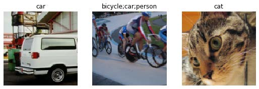
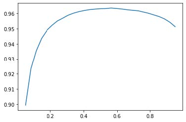

## 6. 其他计算机视觉问题

在上章中，你学习了在实际训练模型时的一些重要实用技巧。选择学习率和迭代轮次等考虑因素对获得良好结果至关重要。

在本章中，我们将探讨另外两种计算机视觉问题：多标签分类与回归。前者出现在需要为每张图像预测多个标签（有时甚至不预测任何标签）的情境下；后者则发生在标签为单个或多个数值——即数量而不是类别——的情况下。

在此过程中，我们将更深入地研究深度学习模型中的输出激活函数、目标函数和损失函数。

### 多标签分类

多标签分类（Multi-label classification）是指识别图像中物体的类别，这些图像可能包含不止一种物体类型。目标类别中可能存在多种物体，也可能完全不存在任何物体。

例如，这种方法对我们的熊分类器来说会非常有效。我们在第二章推出的熊分类器存在一个问题：当用户上传非熊类物体时，模型仍会将其识别为灰熊、黑熊或泰迪熊——它完全无法预测“根本不是熊”。事实上，完成本章学习后，建议你回到图像分类器应用程序，尝试使用多标签技术重新训练模型，然后通过输入不属于任何已识别类别的图像进行测试。

实际上，我们很少见到有人为此目的训练多标签分类器——但我们经常看到用户和开发者都在抱怨这个问题。这个简单解决方案似乎并未被广泛理解或重视！由于实际中存在零匹配或多匹配图像的情况更为常见，我们或许应该预期，在实际应用中多标签分类器比单标签分类器更具广泛适用性。

首先让我们看看多标签数据集是什么样子的；然后我们将说明如何为模型准备数据。你会发现模型的架构与前一章相比没有变化，只有损失函数有所不同。让我们从数据开始。

#### 数据

在本例中，我们将使用PASCAL数据集，该数据集每张图像可能包含多种分类对象。

我们首先按常规步骤下载并解压数据集：

```python
from fastai.vision.all import *
path = untar_data(URLs.PASCAL_2007)
```

该数据集与我们之前见过的不同，它并非按文件名或文件夹进行结构化组织，而是附带一个CSV文件，告知我们每张图像应使用何种标签。我们可以将CSV文件读入Pandas数据框进行检查：

```python
df = pd.read_csv(path/'train.csv')
df.head()
```

| 文件名     | 标签         | 是否已经遍历 |
| ---------- | ------------ | ------------ |
| 000005.jpg | chair        | True         |
| 000007.jpg | car          | True         |
| 000009.jpg | horse person | True         |
| 000012.jpg | car          | False        |
| 000016.jpg | bicycle      | True         |

如你所见，每张图片中的类别列表均以空格分隔的字符串形式呈现。

> pandas和Dataframe
>
> 不，它其实不是熊猫！Pandas 是一个用于处理和分析表格数据及时间序列数据的 Python 库。其核心类是 `DataFrame`，它表示一个由行和列组成的表格。
>
> 你可以从CSV文件、数据库表、Python字典以及许多其他来源获取DataFrame。在Jupyter中，DataFrame会以格式化表格的形式输出，如下所示。
>
> 你可以通过 `iloc` 属性访问 DataFrame 中的行和列，就像操作矩阵一样：
>
> ```python
> df.iloc[:,0]
> ```
>
> ```text
> 0 000005.jpg
> 1 000007.jpg
> 2 000009.jpg
> 3 000012.jpg
> 4 000016.jpg
> ...
> 5006 009954.jpg
> 5007 009955.jpg
> 5008 009958.jpg
> 5009 009959.jpg
> 5010 009961.jpg
> Name: fname, Length: 5011, dtype: object
> ```
>
> ```python
> df.iloc[0,:]
> # Trailing :s are always optional (in numpy, pytorch, pandas, etc.),
> # so this is equivalent:
> df.iloc[0]
> ```
>
> ```text
> fname 000005.jpg
> labels chair
> is_valid True
> Name: 0, dtype: object
> ```
>
> 你还可以通过直接在数据框中进行索引，根据列名获取特定列：
>
> ```python
> df['fname']
> ```
>
> ```text
> 0 000005.jpg
> 1 000007.jpg
> 2 000009.jpg
> 3 000012.jpg
> 4 000016.jpg
> ...
> 5006 009954.jpg
> 5007 009955.jpg
> 5008 009958.jpg
> 5009 009959.jpg
> 5010 009961.jpg
> Name: fname, Length: 5011, dtype: object
> ```
>
> 你可以创建新列并使用列进行计算：
>
> ```python
> df1 = pd.DataFrame()
> df1['a'] = [1,2,3,4]
> df1
> ```
>
> | 序号 | a    |
> | ---- | ---- |
> | 0    | 1    |
> | 1    | 2    |
> | 2    | 3    |
> | 3    | 4    |
>
> ```python
> df1['b'] = [10, 20, 30, 40]
> df1['a'] + df1['b']
> ```
>
> ```text
> 0 11
> 1 22
> 2 33
> 3 44
> dtype: int64
> ```
>
> Pandas 是一个快速且灵活的库，是每位数据科学家 Python 工具箱中的重要组成部分。遗憾的是，其 API 可能令人困惑且出人意料，因此需要一段时间才能熟悉它。若你尚未接触过Pandas，建议先完成入门教程；我们尤其推荐Pandas创始人Wes McKinney所著的 [《Python数据分析》（O'Reilly出版）](http://shop.oreilly.com/product/0636920050896.do) 。该书同时涵盖matplotlib和NumPy等重要库。本文将简要说明实际操作中遇到的Pandas功能，但不会达到McKinney著作的深度。

既然我们已经了解了数据的形态，接下来就让它为模型训练做好准备吧。

#### 构建数据块

如何将 `DataFrame` 对象转换为 `DataLoaders` 对象？我们通常建议在可能的情况下使用数据块API创建 `DataLoaders` 对象，因为它兼具灵活性与简洁性。本文将以该数据集为例，展示实际操作中使用数据块API构建 `DataLoaders` 对象的具体步骤。

正如我们所见，PyTorch 和 fastai 主要通过两种类来表示和访问训练集或验证集：

`Dataset` ：一个返回单个项目独立变量和依赖变量元组的集合

`DataLoader` ：一个迭代器，提供由多个小批量组成的流，其中每个小批量包含一组独立变量批次和一组依赖变量批次。

除此之外，fastai 还提供了两个类，用于将训练集和验证集整合在一起：

`Datasets` ：包含训练数据集和验证数据集的迭代器

`DataLoaders` ：包含训练数据加载器和验证数据加载器的对象

由于 `DataLoader` 是在 `Dataset` 基础上构建的，并为其添加了额外功能（将多个项目合并为小批量），因此通常最简便的做法是先创建并测试 `Datasets` ，待其正常运行后再研究`DataLoaders`。

创建 `DataBlock` 时，我们采取循序渐进的方式，一步步构建，并利用笔记本随时检查数据。这种方法能确保编码过程中保持工作节奏，同时及时发现问题。调试起来也非常轻松——因为一旦出现问题，你立刻就能锁定在刚刚输入的那行代码上！

让我们从最简单的案例开始，即不带任何参数创建的数据块：

```python
dblock = DataBlock()
```

我们可以由此创建一个 `Datasets` 。唯一需要的是数据源——在本例中，就是我们的DataFrame

```python
dsets = dblock.datasets(df)
```

这包含一个 `train` 和一个 `valid` 数据集，我们可以对其进行索引：

```python
dsets.train[0]
```

```text
(fname 008663.jpg
labels car person
is_valid False
Name: 4346, dtype: object,
fname 008663.jpg
labels car person
is_valid False
Name: 4346, dtype: object)
```

如你所见，这只是将DataFrame中的一行数据返回了两次。这是因为默认情况下，数据块假设我们有两部分内容：输入和目标。我们需要从DataFrame中提取相应的字段，这可以通过传递 `get_x` 和 `get_y` 函数来实现：

```python
dblock = DataBlock(get_x = lambda r: r['fname'], get_y = lambda r:
r['labels'])
dsets = dblock.datasets(df)
dsets.train[0]
```

```text
('005620.jpg', 'aeroplane')
```

如你所见，我们并未采用常规方式定义函数，而是使用了Python的 `lambda` 关键字。这只是定义函数并进行引用的快捷方式。以下更冗长的写法效果完全相同：

```python
def get_x(r): return r['fname']
def get_y(r): return r['labels']
dblock = DataBlock(get_x = get_x, get_y = get_y)
dsets = dblock.datasets(df)
dsets.train[0]
```

```text
('002549.jpg', 'tvmonitor')
```

Lambda函数非常适合快速迭代，但它们不支持序列化，因此若需在训练后导出 `Learner` ，建议采用更冗长的实现方式（若仅用于实验则使用Lambda函数即可）。

我们可以看出，自变量需要转换为完整路径才能作为图像打开，而因变量则需要按空格字符拆分（这是Python `split` 函数的默认行为），从而形成一个列表：

```python
def get_x(r): return path/'train'/r['fname']
def get_y(r): return r['labels'].split(' ')
dblock = DataBlock(get_x = get_x, get_y = get_y)
dsets = dblock.datasets(df)
dsets.train[0]
```

```text
(Path('/home/sgugger/.fastai/data/pascal_2007/train/008663.jpg'),
['car', 'person'])
```

要实际打开图像并将其转换为张量，我们需要使用一组变换；块类型将提供这些变换。我们可以使用之前用过的相同块类型，但有一个例外：`ImageBlock` 将再次正常工作，因为我们有一个指向有效图像的路径，但 `CategoryBlock` 将无法工作。问题在于该块返回单个整数，而我们需要为每个元素分配多个标签。为解决此问题，我们采用 `MultiCategoryBlock` 。该类型块期望接收字符串列表（正如当前情况），现在让我们测试效果：

```python
dblock = DataBlock(blocks=(ImageBlock, MultiCategoryBlock),
                   get_x = get_x, get_y = get_y)
dsets = dblock.datasets(df)
dsets.train[0]
```

```text
(PILImage mode=RGB size=500x375,
TensorMultiCategory([0., 0., 0., 0., 0., 0., 0., 0., 0., 0., 0., 1., 0.,
0.,
> 0., 0., 0., 0., 0., 0.]))
```

如你所见，我们的类别列表编码方式与常规的 `CategoryBlock` 不同。在常规情况下，我们使用单个整数表示某个类别是否存在，该整数基于该类别在词汇表中的位置。然而在此处，我们采用了一组0的列表，其中某个类别存在的位置对应1。例如，若第二和第四位置出现1，则表示词汇表中的第2和第4项出现在图像中。这种编码方式称为单热编码。之所以不能直接使用类别索引列表，是因为每个列表的长度会不同，而PyTorch要求张量元素必须具有相同长度。

> 术语：独热编码（ONE-HOT ENCODING）
>
> 使用一个由0组成的向量，在数据中出现的每个位置填入1，以此编码一个整数列表。

让我们检查这个示例中各类别的含义（我们使用了便捷的 `torch.where` 函数，该函数会告诉我们所有满足条件为真或假的索引）：

```python
idxs = torch.where(dsets.train[0][1]==1.)[0]
dsets.train.vocab[idxs]
```

```text
(#1) ['dog']
```

借助 NumPy 数组、PyTorch 张量和 fastai 的 `L` 类，我们可以直接使用列表或向量进行索引，这使得大量代码（如本例所示）变得更加清晰简洁。

迄今为止我们忽略了 `is_valid` 列，这意味着 `DataBlock` 默认采用随机分割。要显式选择验证集元素，我们需要编写函数并将其传递给 `splitter`（或使用fastai的预定义函数/类）。该函数接收输入项（此处为整个DataFrame），必须返回两个（或更多）整数列表：

```python
def splitter(df):
    train = df.index[~df['is_valid']].tolist()
    valid = df.index[df['is_valid']].tolist()
    return train,valid

dblock = DataBlock(blocks=(ImageBlock, MultiCategoryBlock),
                   splitter=splitter,
                   get_x=get_x,
                   get_y=get_y)

dsets = dblock.datasets(df)
dsets.train[0]
```

```text
(PILImage mode=RGB size=500x333,
TensorMultiCategory([0., 0., 0., 0., 0., 0., 1., 0., 0., 0., 0., 0., 0.,
0.,
> 0., 0., 0., 0., 0., 0.]))
```

正如我们所讨论的，`DataLoader` 将 `Dataset` 中的项目整理成一个小批次。这是一个张量元组，其中每个张量简单地堆叠了 `Dataset` 项目中该位置的项目。

既然我们已经确认了单个项目看起来没问题，还有最后一步：我们需要确保能够创建数据加载器，这意味着必须保证每个项目的尺寸一致。为此，我们可以使用`RandomResizedCrop`：

```python
dblock = DataBlock(blocks=(ImageBlock, MultiCategoryBlock),
                   splitter=splitter,
                   get_x=get_x,
                   get_y=get_y,
                   item_tfms = RandomResizedCrop(128, min_scale=0.35))
dls = dblock.dataloaders(df)
```

现在我们可以展示我们的数据样本：

```python
dls.show_batch(nrows=1, ncols=3)
```



请记住，如果你从 `DataBlock` 创建 `DataLoaders` 时出现任何问题，或想精确查看 `Datablock` 的运行情况，可使用上一章介绍的 `summary` 方法。

我们的数据现已准备就绪，可用于训练模型。正如我们将看到的，当创建 `Learner` 时，表面上一切保持不变，但fastai库会在后台为我们选择新的损失函数：二元交叉熵（binary cross entropy）。

#### 二元交叉熵

现在我们将创建 `Learner` 。我们在第4章中了解到， `Learner` 对象包含四个主要部分：模型、 `DataLoaders` 对象、 `Optimizer` 以及要使用的损失函数。我们已具备 `DataLoaders` ，可利用fastai的 `ResNet` 模型（后续将学习从零创建），也掌握了创建 `SGD` 优化器的方法。因此重点在于确保选择合适的损失函数。为此，我们将使用 `cnn_learner` 创建学习器，以便观察其激活过程：

```python
learn = cnn_learner(dls, resnet18)
```

我们还看到，`Learner` 中的模型通常是继承自 `nn.Module` 类的对象，我们可以使用括号调用它，它将返回模型的激活值。你需要将独立变量作为小批量传递给它。我们可以从 `DataLoader` 中获取一个小批量，然后将其传递给模型来尝试：

```python
x,y = dls.train.one_batch()
activs = learn.model(x)
activs.shape
```

```text
torch.Size([64, 20])
```

想想激活函数为何呈现这种形态——我们采用64的批量大小，需要计算20个类别各自的概率。以下是其中一个激活值的具体形态：

```python
activs[0]
```

```text
tensor([ 2.0258, -1.3543, 1.4640, 1.7754, -1.2820, -5.8053, 3.6130,
0.7193,
> -4.3683, -2.5001, -2.8373, -1.8037, 2.0122, 0.6189, 1.9729,
0.8999,
> -2.6769, -0.3829, 1.2212, 1.6073],
device='cuda:0', grad_fn=<SelectBackward>)
```

> 获取模型激活值
>
> 掌握手动获取小批量数据并将其传递给模型的方法，同时观察激活值和损失值，对调试模型至关重要。这种方法对学习也大有裨益，能让你清晰洞察模型的运行机制。

它们尚未缩放至0到1之间，但我们在第4章中学习了如何使用 `sigmoid` 函数实现这一操作。我们还了解了如何基于此计算损失——这是第4章中的损失函数，并如前一章所述添加了对数运算：

```python
def binary_cross_entropy(inputs, targets):
    inputs = inputs.sigmoid()
    return -torch.where(targets==1, inputs, 1-inputs).log().mean()
```

请注意，由于我们的因变量采用独热编码，因此无法直接使用 `nll_loss` 或 `softmax`（因此也不能使用 `cross_entropy`）：

- 正如我们所见，`softmax` 要求所有预测值之和为1，且倾向于将某一激活值推高至远超其他值（因使用了 `exp` 函数）；然而，图像中可能存在多个我们确信存在的物体，因此将激活值总和限制为1并非明智之举。基于相同逻辑，若认为图像中不存在任何类别，我们可能希望总和小于1。

- 正如我们所见，`nll_loss` 仅返回单个激活值：即与单个标签对应的激活值。当存在多个标签时，这种设计便失去意义。

另一方面，`binary_cross_entropy` 函数（它只是将 `mnist_loss` 与 `log` 结合使用）恰好满足我们的需求，这得益于PyTorch元素级运算的魔力。该函数会逐列将每个激活值与每个目标值进行比较，因此我们无需额外操作即可实现多列计算功能。

> JEREMY说
>
> 使用PyTorch这类支持广播和元素级运算的库时，我特别欣赏的一点是：经常能编写出无需修改就能同时适用于单个元素和批量元素的代码。`binary_cross_entropy` 就是绝佳范例。借助这些运算特性，我们无需手动编写循环，PyTorch会根据张量的秩自动完成必要的迭代处理。

PyTorch已经为我们提供了这个功能。事实上，它提供了多种版本，名称却相当令人困惑！

`F.binary_cross_entropy` 及其模块等效函数 `nn.BCELoss` 会对单热编码的目标计算交叉熵，但不包含初始的 `sigmoid` 函数。通常针对独热编码目标，应使用 `F.binary_cross_entropy_with_logits`（或 `nn.BCEWithLogitsLoss` ），该函数同时包含sigmoid映射与二元交叉熵计算，如前例所示。

对于单标签数据集（如MNIST或宠物数据集），其中目标以单个整数编码的情况，对应的损失函数为：`F.nll_loss` 或 `nn.NLLLoss`（适用于不带初始softmax的版本）`F.cross_entropy` 或 `nn.CrossEntropyLoss`（适用于带初始softmax的版本）

由于目标采用独热编码，我们将使用 `BCEWithLogitsLoss`：

```python
loss_func = nn.BCEWithLogitsLoss()
loss = loss_func(activs, y)
loss
```

```text
tensor(1.0082, device='cuda:5', grad_fn=
<BinaryCrossEntropyWithLogitsBackward>)
```

我们无需告知fastai使用此损失函数（尽管需要时可以指定），因为它会自动为我们选择。fastai知道 `DataLoaders` 包含多个类别标签，因此默认会使用`nn.BCEWithLogitsLoss`。与前一章相比，我们使用的度量标准有所变化：由于这是多标签问题，我们不能使用准确率函数。为什么呢？因为准确率是通过以下方式将我们的输出与目标进行比较的：

```python
def accuracy(inp, targ, axis=-1):
    "Compute accuracy with `targ` when `pred` is bs * n_classes"
    pred = inp.argmax(dim=axis)
    return (pred == targ).float().mean()
```

预测的类别是激活值最高的那个（这就是 `argmax` 的作用）。但这里无法奏效，因为单张图像可能存在多个预测结果。对激活值应用sigmoid函数（使其介于0和1之间）后，我们需要通过设定阈值来决定哪些值为0、哪些值为1。每个大于阈值的值将被视为1，每个小于阈值的值将被视为0：

```python
def accuracy_multi(inp, targ, thresh=0.5, sigmoid=True):
    "Compute accuracy when `inp` and `targ` are the same size."
    if sigmoid: inp = inp.sigmoid()
    return ((inp>thresh)==targ.bool()).float().mean()
```

如果直接将 `accuracy_multi` 作为指标传递，它将使用 `threhold` 的默认值 0.5。我们可能需要调整该默认值，并创建一个具有不同默认值的新版本 `accuracy_multi` 。为此，Python 提供了一个名为 `partial` 的函数。它允许我们将函数与某些参数或关键字参数绑定，从而创建该函数的新版本——每次调用时都会自动包含这些参数。例如，以下是一个接受两个参数的简单函数：

```python
def say_hello(name, say_what="Hello"): return f"{say_what} {name}."
say_hello('Jeremy'),say_hello('Jeremy', 'Ahoy!')
```

```text
('Hello Jeremy.', 'Ahoy! Jeremy.')
```

我们可以使用 `partial` 切换到该函数的法语版本：

```python
f = partial(say_hello, say_what="Bonjour")
f("Jeremy"),f("Sylvain")
```

```text
('Bonjour Jeremy.', 'Bonjour Sylvain.')
```

现在我们可以训练模型了。让我们尝试将准确率阈值设为0.2作为评估指标：

```python
learn = cnn_learner(dls, resnet50, metrics=partial(accuracy_multi,
thresh=0.2))
learn.fine_tune(3, base_lr=3e-3, freeze_epochs=4)
```

| 迭代轮次 | 训练损失 | 验证损失 | 精度倍数 | 时间  |
| -------- | -------- | -------- | -------- | ----- |
| 0        | 0.903610 | 0.659728 | 0.263068 | 00:07 |
| 1        | 0.724266 | 0.346332 | 0.525458 | 00:07 |
| 2        | 0.415597 | 0.125662 | 0.937590 | 00:07 |
| 3        | 0.254987 | 0.116880 | 0.945418 | 00:07 |
| 0        | 0.123872 | 0.132634 | 0.940179 | 00:08 |
| 1        | 0.112387 | 0.113758 | 0.949343 | 00:08 |
| 2        | 0.092151 | 0.104368 | 0.951195 | 00:08 |

选择阈值至关重要。若阈值设定过低，往往会遗漏正确标注的对象。我们可通过修改评估指标并调用 `validate` 函数来验证此现象，该函数将返回验证损失与评估指标：

```python
learn.metrics = partial(accuracy_multi, thresh=0.1)
learn.validate()
```

```text
(#2) [0.10436797887086868,0.93057781457901]
```

若选择的阈值过高，你将仅筛选出模型高度确信的对象：

```python
learn.metrics = partial(accuracy_multi, thresh=0.99)
learn.validate()
```

```text
(#2) [0.10436797887086868,0.9416930675506592]
```

通过尝试几个阈值并观察效果，我们可以找到最佳阈值。如果只获取一次预测结果，这个过程会快得多：

```python
preds,targs = learn.get_preds()
```

然后我们可以直接调用度量函数。请注意，默认情况下 `get_preds` 会为我们应用输出激活函数（本例中为sigmoid），因此我们需要告知 `accuracy_multi` 不要应用该函数：

```python
accuracy_multi(preds, targs, thresh=0.9, sigmoid=False)
```

```text
TensorMultiCategory(0.9554)
```

现在我们可以使用这种方法来确定最佳阈值水平：

```python
xs = torch.linspace(0.05,0.95,29)
accs = [accuracy_multi(preds, targs, thresh=i, sigmoid=False) for i in
xs]
plt.plot(xs,accs);
```



在此情况下，我们利用验证集来选择超参数（阈值），这正是验证集的用途。有时学生会担心我们可能对验证集 *过拟合* ，因为我们尝试了大量值来寻找最佳方案。然而，如图所示，在此情况下调整阈值会得到平滑曲线，这表明我们显然没有选取不恰当的异常值。这恰恰说明理论（避免频繁调整超参数以免过拟合）与实践（若拟合关系平滑则可接受）之间存在差异，需谨慎区分。

本章关于多标签分类的内容到此结束。接下来，我们将探讨回归问题。

### 回归

人们很容易将深度学习模型归类到特定领域，例如计算机视觉、自然语言处理等等。事实上，fastai正是这样划分其应用场景的——很大程度上是因为大多数人习惯于这种思维方式。

但实际上，这掩盖了一个更有趣且更深层的视角。模型是由其自变量、因变量以及损失函数共同定义的。这意味着模型类型远比简单的基于域的划分要丰富得多。或许我们拥有图像作为自变量，文本作为因变量（例如根据图像生成标题）；又或许我们拥有文本作为自变量，图像作为因变量（例如根据标题生成图像——这在深度学习中完全可行！）；又或者我们同时拥有图像、文本和表格数据作为自变量，试图预测产品购买行为……可能性确实无穷无尽。

要突破固定应用的局限，为新问题打造创新解决方案，深入理解数据块API（以及可能涉及的中间层API——本书后续章节将介绍）至关重要。以图像回归问题为例：该问题指从数据集中进行学习，其中独立变量为图像，而因变量为一个或多个浮点数。人们常将图像回归视为独立应用——但正如你将在此处所见，我们完全可将其视为数据块API之上的又一个卷积神经网络。

我们将直接跳入图像回归的一个稍显复杂的变体，因为我们知道你已经准备好了！我们将构建关键点模型。关键点指图像中特定位置的标记——本次实验将使用人像图像，目标是定位每张图像中人物面部的中心点。这意味着我们需要为每张图像预测两个数值：面部中心点的行号与列号。

#### 数据整合

本节我们将使用 [Biwi Kinect头部姿势数据集](https://oreil.ly/-4cO-) 。首先按常规方式下载数据集：

```python
path = untar_data(URLs.BIWI_HEAD_POSE)
```

让我们看看我们有什么吧！

```python
path.ls()
```

```text
(#50)
[Path('13.obj'),Path('07.obj'),Path('06.obj'),Path('13'),Path('10'),Path('
> 02'),Path('11'),Path('01'),Path('20.obj'),Path('17')...]
```

共有24个目录，编号从01到24（对应不同被摄者），每个目录下都有对应的 `.obj` 文件（此处无需使用）。让我们查看其中一个目录的内容：

```python
(path/'01').ls()
```

```text
(#1000)
[Path('01/frame_00281_pose.txt'),Path('01/frame_00078_pose.txt'),Path('0
>
1/frame_00349_rgb.jpg'),Path('01/frame_00304_pose.txt'),Path('01/frame_00207_
>
pose.txt'),Path('01/frame_00116_rgb.jpg'),Path('01/frame_00084_rgb.jpg'),Path
>
('01/frame_00070_rgb.jpg'),Path('01/frame_00125_pose.txt'),Path('01/frame_003
> 24_rgb.jpg')...]
```

在子目录中，我们存放着不同的帧数据。每帧都包含一张图像文件（ `_rgb.jpg`）和一个姿势文件（ `_pose.txt` ）。我们可以使用 `get_image_files` 函数递归获取所有图像文件，然后编写一个函数将图像文件名转换为对应的姿势文件：

```python
img_files = get_image_files(path)
def img2pose(x): return Path(f'{str(x)[:-7]}pose.txt')
img2pose(img_files[0])
```

```text
Path('13/frame_00349_pose.txt')
```

让我们来看看第一张图片：

```python
im = PILImage.create(img_files[0])
im.shape
```

```text
(480, 640)
```

```python
im.to_thumb(160)
```


[Biwi数据集网站](https://oreil.ly/wHL28) 曾用于说明与每张图像关联的姿势文本文件格式，该文件标注了头部中心点的位置。具体细节对我们的目的而言并不重要，因此我们仅展示用于提取头部中心点的函数：

```python
cal = np.genfromtxt(path/'01'/'rgb.cal', skip_footer=6)
def get_ctr(f):
    ctr = np.genfromtxt(img2pose(f), skip_header=3)
    c1 = ctr[0] * cal[0][0]/ctr[2] + cal[0][2]
    c2 = ctr[1] * cal[1][1]/ctr[2] + cal[1][2]
    return tensor([c1,c2])
```

该函数返回坐标作为包含两个元素的张量：

```python
get_ctr(img_files[0])
```

```text
tensor([384.6370, 259.4787])
```

我们可以将此函数作为 `get_y` 传递给 `DataBlock`，因为它负责为每个项目打标签。我们将把图像尺寸缩小至输入尺寸的一半，以稍微加快训练速度。

需要注意的一点是，我们不应随意使用随机分割器。该数据集中同一批人会出现在多张图像中，但我们需要确保模型能够泛化到尚未见过的个体。数据集中的每个文件夹都包含某位个人的图像。因此，我们可以创建一个分割函数，当仅包含单个人时返回 `True` ，从而生成仅包含该人图像的验证集。

与之前数据块示例的唯一区别在于，第二个数据块是 `PointBlock` 。此设计旨在告知fastai标签代表坐标信息，从而使其在执行数据增强时，能对坐标数据应用与图像相同的增强操作：

```python
biwi = DataBlock(
    blocks=(ImageBlock, PointBlock),
    get_items=get_image_files,
    get_y=get_ctr,
    splitter=FuncSplitter(lambda o: o.parent.name=='13'),
    batch_tfms=[*aug_transforms(size=(240,320)),
                Normalize.from_stats(*imagenet_stats)]
)
```

> 点与数据增强
>
> 我们尚未发现其他库（fastai除外）能够自动且正确地对坐标数据应用增强技术。因此，若你使用其他库处理此类问题，可能需要禁用数据增强功能。

在进行任何建模之前，我们应该先检查数据以确认其看起来正常：

```python
dls = biwi.dataloaders(path)
dls.show_batch(max_n=9, figsize=(8,6))
```


# P376

