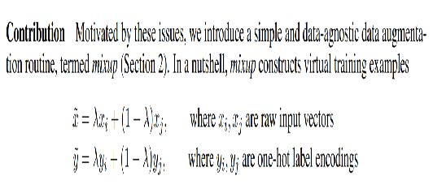
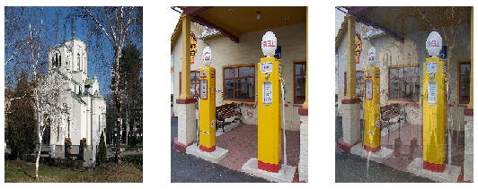

## 7. 训练一个最先进的模型

本章介绍了训练图像分类模型并获得最先进结果的更高级技术。如果你希望深入了解深度学习的其他应用场景，可跳过本章内容，稍后再行补习——后续章节不会预设读者已掌握本章知识。

我们将探讨归一化技术、一种名为Mixup的强大数据增强技术、渐进式尺寸调整方法以及测试时增强技术。为演示上述内容，我们将使用ImageNet子集Imagenette从零开始训练模型（不采用迁移学习）。该子集包含原始ImageNet数据集中10个差异显著的类别，便于实验时加速训练进程。

与之前的数据集相比，这次要做好将困难得多，因为我们使用的是全尺寸、全彩图像——这些照片中的物体尺寸各异、朝向不同、光照条件多样等等。因此在本章中，我们将介绍一些关键技术，帮助你充分挖掘数据集的潜力——尤其当你需要从零开始训练模型，或采用迁移学习在与预训练模型截然不同的数据集上训练模型时。

### Imagenette数据集

fast.ai刚问世的时候，人们主要使用三种数据集来构建和测试计算机视觉模型：

- ImageNet

  包含130万张尺寸各异的图像，宽度约500像素，涵盖1000个类别，训练耗时数日

- MNIST

  5万张28×28像素灰度手写数字图像

- CIFAR10

  6万张32×32像素彩色图像，分为10个类别

问题在于较小的数据集无法有效推广到大型ImageNet数据集。那些在ImageNet上表现良好的方法，通常必须在ImageNet上开发和训练。这导致许多人认为，只有拥有巨量计算资源的研究人员才能有效参与图像分类算法的开发。

我们认为这种说法不太可能成立。我们从未见过任何研究表明ImageNet恰好是理想规模，也从未见过其他数据集无法提供有价值的洞察。因此我们希望创建一个新数据集，让研究人员能够快速低成本地测试算法，同时该数据集提供的洞察也适用于完整的ImageNet数据集。

大约三小时后，我们创建了Imagenette。我们从完整的ImageNet中选取了10个类别，这些类别彼此差异显著。正如我们所期望的，我们能够快速且低成本地创建出能够识别这些类别的分类器。随后我们尝试了若干算法调整，以观察它们对Imagenette的影响。发现部分调整效果显著，于是我们将其应用于ImageNet测试——令人欣喜的是，这些优化在ImageNet上同样表现出色！

这里有一个重要信息：你获得的数据集未必是你想要的数据集。尤其不可能成为你用于开发和原型设计的理想数据集。你应力求迭代速度控制在几分钟内——即当你想尝试新想法时，应能在几分钟内完成模型训练并观察效果。若实验耗时过长，请思考如何缩减数据集或简化模型以提升实验速度。实验次数越多，效果越佳！

让我们从这个数据集开始吧：

```python
from fastai.vision.all import *
path = untar_data(URLs.IMAGENETTE)
```

首先，我们将数据集装入DataLoaders对象，使用第5章介绍的预缩放技巧：

```python
dblock = DataBlock(blocks=(ImageBlock(), CategoryBlock()),
                   get_items=get_image_files,
                   get_y=parent_label,
                   item_tfms=Resize(460),
                   batch_tfms=aug_transforms(size=224,
                                             min_scale=0.75))
dls = dblock.dataloaders(path, bs=64)
```

接下来我们将进行一次创建基准模型的训练：

```python
model = xresnet50()
learn = Learner(dls, model,
loss_func=CrossEntropyLossFlat(), metrics=accuracy)
learn.fit_one_cycle(5, 3e-3)
```

| 迭代轮次 | 训练损失 | 验证损失 | 准确度   | 时间  |
| -------- | -------- | -------- | -------- | ----- |
| 0        | 1.583403 | 2.064317 | 0.401792 | 01:03 |
| 1        | 1.208877 | 1.260106 | 0.601568 | 01:02 |
| 2        | 0.925265 | 1.036154 | 0.664302 | 01:03 |
| 3        | 0.730190 | 0.700906 | 0.777819 | 01:03 |
| 4        | 0.585707 | 0.541810 | 0.825243 | 01:03 |

这是一个不错的基准模型，因为我们并未使用预训练模型，但我们还能做得更好。当处理从零开始训练的模型，或将模型微调到与预训练数据集截然不同的数据集时，一些额外技术就显得至关重要。在本章后续内容中，我们将探讨一些关键方法，这些方法值得你深入了解。首要方法是数据的归一化处理（normalizing）。

### 归一化处理

在训练模型时，若输入数据经过归一化处理会更有利——即数据均值为0且标准差为1。但大多数图像和计算机视觉库使用的像素值范围在0到255之间，或0到1之间；无论哪种情况，数据都不可能满足均值为0、标准差为1的条件。

让我们抓取一批数据，观察这些值——通过计算除通道轴（即轴1）以外所有轴的平均值：

```python
x,y = dls.one_batch()
x.mean(dim=[0,2,3]),x.std(dim=[0,2,3])
```

```text
(TensorImage([0.4842, 0.4711, 0.4511], device='cuda:5'),
TensorImage([0.2873, 0.2893, 0.3110], device='cuda:5'))
```

正如我们预期的那样，均值和标准差与期望值相差甚远。所幸在fastai中通过添加 `Normalize` 转换即可轻松实现数据归一化。该转换可同时作用于整个肖批次，因此可将其添加至数据块的 `batch_tfms` 部分。需向该转换器传递期望使用的均值和标准差；fastai已预置ImageNet数据集的标准均值与标准差。（若未向 `Normalize` 转换器传递统计参数，fastai将自动从单批次数据中计算得出。）

让我们添加这个转换（使用 `imagenet_stats`，因为 Imagenette 是 ImageNet 的子集），现在来看一个批次：

```python
def get_dls(bs, size):
    dblock = DataBlock(blocks=(ImageBlock, CategoryBlock),
                       get_items=get_image_files,
                       get_y=parent_label,
                       item_tfms=Resize(460),
                       batch_tfms=[*aug_transforms(size=size,
                                                   min_scale=0.75),
                                   Normalize.from_stats(*imagenet_stats)])
    return dblock.dataloaders(path, bs=bs)

dls = get_dls(64, 224)

x,y = dls.one_batch()
x.mean(dim=[0,2,3]),x.std(dim=[0,2,3])

(TensorImage([-0.0787, 0.0525, 0.2136], device='cuda:5'),
 TensorImage([1.2330, 1.2112, 1.3031], device='cuda:5'))
```

让我们看看这对训练模型产生了什么影响：

```python
model = xresnet50()
learn = Learner(dls, model,
loss_func=CrossEntropyLossFlat(), metrics=accuracy)
learn.fit_one_cycle(5, 3e-3)
```

| 迭代轮次 | 训练损失 | 验证损失 | 准确度   | 时间  |
| -------- | -------- | -------- | -------- | ----- |
| 0        | 1.632865 | 2.250024 | 0.391337 | 01:02 |
| 1        | 1.294041 | 1.579932 | 0.517177 | 01:02 |
| 2        | 0.960535 | 1.069164 | 0.657207 | 01:04 |
| 3        | 0.730220 | 0.767433 | 0.771845 | 01:05 |
| 4        | 0.577889 | 0.550673 | 0.824496 | 01:06 |

尽管在此处作用有限，但归一化处理在使用预训练模型时尤为重要。预训练模型仅能处理其训练数据中出现过的数据类型。若模型训练数据中像素值均值为0，而你的数据中像素最小值恰为0，那么模型所呈现的图像将与预期效果大相径庭！

这意味着当你分发模型时，也需要同时分发用于归一化处理的统计参数，因为任何使用该模型进行推理或迁移学习的人都需要使用相同的统计参数。同样地，如果你使用的是他人训练的模型，请务必查明他们使用的归一化统计参数，并确保保持一致。

在之前的章节中我们无需处理归一化问题，因为当通过 `cnn_learner` 使用预训练模型时，fastai库会自动添加正确的 `Normalize` 转换；该模型已在 `Normalize` 中预先训练了特定统计参数（通常来自ImageNet数据集），因此库可以自动填充这些参数。请注意这仅适用于预训练模型，因此当我们从零开始训练时，需要手动添加这些信息。

迄今为止，我们所有的训练都是在224尺寸下完成的。我们可以在更小的尺寸下开始训练，然后再过渡到该尺寸。这被称为渐进式尺寸调整（progressive resizing）。

### 渐进式尺寸调整

当fast.ai及其学生团队在2018年赢得 [DAWNBench竞赛](https://oreil.ly/16tar) 时，一项至关重要的创新其实非常简单：训练初期使用小尺寸图像，训练后期切换至大尺寸图像。在大部分迭代轮次中使用小尺寸图像能显著加快训练进度，而最终使用大尺寸图像完成训练则能大幅提升最终准确率。我们称这种方法为渐进式尺寸调整。

> 术语：渐进式尺寸调整
>
> 在训练过程中逐步使用越来越大的图像。

正如我们所见，卷积神经网络所学习的特征类型与图像尺寸毫无关联——早期层会识别边缘和梯度等特征，而后期层则可能识别鼻子和日落等特征。因此，在训练过程中改变图像尺寸，并不意味着我们必须为模型寻找完全不同的参数。

但显然小图像和大图像之间存在差异，因此我们不应期望模型在完全不做调整的情况下继续保持同样的性能。这是否让你联想到某些概念？当我们提出这个想法时，立刻联想到迁移学习！我们试图让模型学习完成与先前任务略有不同的任务。因此，在调整图像尺寸后，我们应该能够使用 `fine_tune` 方法。

渐进式尺寸调整还具有额外优势：它属于数据增强的另一种形式。因此，采用渐进式尺寸调整训练的模型通常能展现更强的泛化能力。

要实现渐进式调整大小，最便捷的方式是先创建一个 `get_dls` 函数，该函数接受图像尺寸和批量大小作为参数（如同上一节所示），并返回相应的 `DataLoaders`。

现在你可以创建小型 `DataLoaders` ，并像往常一样使用 `fit_one_cycle` 方法，训练迭代轮次比常规训练更短：

```python
dls = get_dls(128, 128)
learn = Learner(dls, xresnet50(),
                loss_func=CrossEntropyLossFlat(),
                metrics=accuracy)
learn.fit_one_cycle(4, 3e-3)
```

| 迭代轮次 | 训练损失 | 验证损失 | 准确率   | 时间  |
| -------- | -------- | -------- | -------- | ----- |
| 0        | 1.902943 | 2.447006 | 0.401419 | 00:30 |
| 1        | 1.315203 | 1.572992 | 0.525765 | 00:30 |
| 2        | 1.001199 | 0.767886 | 0.759149 | 00:30 |
| 3        | 0.765864 | 0.665562 | 0.797984 | 00:30 |

然后你可以替换 `Learner` 内部的 `DataLoaders` ，并进行微调：

```python
learn.dls = get_dls(64, 224)
learn.fine_tune(5, 1e-3)
```

| 迭代轮次 | 训练损失 | 验证损失 | 准确率   | 时间  |
| -------- | -------- | -------- | -------- | ----- |
| 0        | 0.985213 | 1.654063 | 0.565721 | 01:06 |
| 0        | 0.706869 | 0.689622 | 0.784541 | 01:07 |
| 1        | 0.739217 | 0.928541 | 0.712472 | 01:07 |
| 2        | 0.629462 | 0.788906 | 0.764003 | 01:07 |
| 3        | 0.491912 | 0.502622 | 0.836445 | 01:06 |
| 4        | 0.414880 | 0.431332 | 0.863331 | 01:06 |

如你所见，我们的性能有了显著提升，且在小尺寸图像上的初始训练阶段，每个迭代轮次的速度都大幅加快。

你可以随意重复增加尺寸和训练更多迭代轮次的过程，以获得任意大小的图像——当然，使用超过磁盘上图像尺寸的图像并不会带来任何好处。

请注意，对于迁移学习而言，渐进式缩放实际上可能损害性能。这种情况最可能发生在以下情形：预训练模型与迁移学习任务高度相似，且数据集和模型均基于尺寸相近的图像进行训练，因此权重无需大幅调整。此时，使用较小尺寸图像进行训练可能会破坏预训练权重。

另一方面，如果迁移学习任务将使用与预训练任务中图像尺寸、形状或风格不同的图像，渐进式缩放可能会有所帮助。一如既往，对于“这会有帮助吗？”的回答是：“试试看！”

另一种尝试是将数据增强技术应用于验证集。迄今为止，我们仅在训练集上应用该技术，而验证集始终使用相同图像。但或许我们可以尝试对验证集的若干增强版本进行预测，并取其平均值。接下来我们将探讨这种方法。

### 测试时增强

我们一直采用随机裁剪作为数据增强手段，这能提升模型泛化能力，从而减少所需训练数据量。当使用随机裁剪时，fastai会自动对验证集采用中心裁剪策略——即在图像中心选择最大正方形区域，且裁剪范围不超出图像边界。

这常常会引发问题。例如在多标签数据集中，图像边缘有时会存在小型物体；这些物体可能在中心裁剪时被完全裁切掉。即使在宠物品种分类这类问题中，用于识别正确品种的关键特征——例如鼻子的颜色——也可能在裁剪过程中被剔除。

解决此问题的方案之一是完全避免随机裁剪。取而代之，我们可以直接将矩形图像压缩或拉伸以适应正方形区域。但这样会错失一种非常有用的数据增强手段，同时也会增加模型进行图像识别的难度——因为模型必须学会识别被压缩和拉伸的图像，而非仅识别比例正确的图像。

另一种解决方案是在验证时不进行居中裁剪，而是从原始矩形图像中选取多个裁剪区域，将每个区域输入模型后取预测值的最大值或平均值。实际上，这种方法不仅适用于不同裁剪区域，还可应用于所有测试增强参数的不同取值。这被称为测试时增强（test time augmentation，TTA）。

> 术语：测试时增强
>
> 在推理或验证过程中，通过数据增强技术为每张图像生成多个版本，随后对每个增强版本的图像预测结果取平均值或最大值。

根据数据集的不同，测试时间增强技术可显著提升准确率。该技术完全不改变训练所需时间，但会因请求的测试增强图像数量增加，相应延长验证或推理所需时间。默认情况下，fastai将使用未增强的中心裁剪图像加四张随机增强图像。

你可以将任何 `DataLoader` 传递给fastai的 `tta` 方法；默认情况下，它将使用你的验证集：

```python
preds,targs = learn.tta()
accuracy(preds, targs).item()
```

```text
0.8737863898277283
```

如我们所见，使用TTA能显著提升性能，且无需额外训练。但它确实会降低推理速度——若为TTA平均处理五张图像，推理速度将降低五倍。

我们已经看到了一些数据增强如何帮助训练更优质模型的实例。现在让我们聚焦于一种名为Mixup的新型数据增强技术。

### Mixup

Mixup 是由张宏毅（Hongyi Zhang）等人于2017年在论文 [《mixup：超越经验风险最小化》](https://oreil.ly/UvIkN) 中提出，是一种强大的数据增强技术，能够显著提升准确率——尤其当数据量有限且缺乏基于相似数据集训练的预训练模型时。该论文阐述道： “虽然数据增强能持续提升泛化能力，但该过程依赖于数据集特性，因此需要借助专家知识。”例如，图像翻转作为数据增强的常见手段，究竟应仅进行水平翻转还是同时进行垂直翻转？答案取决于具体数据集。此外，若某项操作（如翻转）无法提供足够的数据增强效果，你无法简单地“增加翻转次数”。此时需要具备可调节增强程度的技术手段——既能“增强”也能“减弱”变化幅度，从而找到最适合你的方案。

Mixup 的工作原理如下，针对每张图像：

1. 从数据集中随机选取另一张图像。
2. 随机选取一个权重值。
3. 对选取的图像与当前图像进行加权平均（使用步骤2的权重值），此结果即为自变量。
4. 对该图像的标签与当前图像的标签进行加权平均（使用相同权重值），此结果即为因变量。

在伪代码中，我们这样操作（其中 `t` 是加权平均的权重）：

```python
image2,target2 = dataset[randint(0,len(dataset)]
t = random_float(0.5,1.0)
new_image = t * image1 + (1-t) * image2
new_target = t * target1 + (1-t) * target2
```

要使该方法生效，目标变量需要进行独热编码。论文中使用图7-1中的方程对此进行了描述（其中λ与伪代码中的t相同）。



[^图7-1]: 摘自《Mixup》论文

> 论文与数学
>
> 接下来我们将在这本书中阅读越来越多的研究论文。既然你已经掌握了基本术语，你可能会惊讶地发现，只要稍加练习，你竟能理解其中如此多的内容！你会注意到一个现象：希腊字母（如λ）几乎出现在所有论文中。最好能记住所有希腊字母的名称，否则很难独立阅读论文并记住它们（同样也难以理解基于这些字母的代码——因为代码常直接使用希腊字母的拼写名称，例如 `lambda`）。
>
> 论文的更大问题在于它们用数学而非代码来解释原理。若你缺乏数学背景，初看时可能会感到畏难困惑。但请记住：数学表达的本质是代码将要实现的内容，这只是描述同一事物的另一种方式！阅读几篇论文后，你会逐渐掌握更多符号。若遇到陌生符号，可查阅维基百科的数学符号列表，或在 [Detexify](https://oreil.ly/92u4d) 中手绘符号——该工具（运用机器学习技术！）能识别手绘符号名称，随后你便能通过该名称在线查询其含义。

图7-2展示了当我们对图像进行 *线性组合*（linear
combination） 时呈现的效果，这与Mixup算法中的处理方式一致。



[^图7-2]: 混合教堂与加油站

第三张图像通过添加第一张图像的0.3倍与第二张图像的0.7倍构建而成。在此示例中，模型应预测“教堂”还是“加油站”？正确答案是30%教堂与70%加油站——因为若对独热编码目标进行线性组合，结果正是如此。例如假设存在10个类别，其中“教堂”对应索引2，“加油站”对应索引7。其独热编码表示如下：

```python
[0, 0, 1, 0, 0, 0, 0, 0, 0, 0] and [0, 0, 0, 0, 0, 0, 0, 1,
0, 0]
```

那么，我们的最终目标是：

```python
[0, 0, 0.3, 0, 0, 0, 0, 0.7, 0, 0]
```

这一切在 fastai 中都是通过向我们的学习器添加回调函数（callback）来实现的。 `Learner. Callbacks` 是 fastai 内部用于在训练循环中注入自定义行为的机制（例如学习率调度或混合精度训练）。关于回调的全部知识——包括如何创建自己的回调——你将在第16章学习。目前只需知道：通过 `Learner` 的 `cbs` 参数即可传递回调函数。

以下是使用Mixup训练模型的过程：

```python
model = xresnet50()
learn = Learner(dls, model,
                loss_func=CrossEntropyLossFlat(),
                metrics=accuracy, cbs=Mixup)
learn.fit_one_cycle(5, 3e-3)
```

当我们用这种方式处理的数据训练模型时会发生什么？显然，训练难度会增加，因为难以辨别每张图像的内容。模型不仅需要为每张图像预测两个标签（而非单一标签），还需确定每个标签的权重。不过过拟合似乎不太可能成为问题，因为我们在每个迭代轮次中展示的并非同一张图像，而是随机组合的两张图像。

与我们见过的其他数据增强方法相比，Mixup需要更长的迭代轮次才能获得更高的准确率。你可以通过fastai仓库中的 `examples/train_imagenette.py` 脚本，分别尝试带Mixup和不带Mixup训练Imagenette数据集。截至本文撰写时，[Imagenette 存储库](https://oreil.ly/3Gt56) 的排行榜显示：所有超过 80 迭代轮次的领先结果均采用了 Mixup，而较少迭代轮次的训练则未使用该方法。这与我们使用 Mixup 的经验相符。

Mixup之所以如此令人兴奋，部分原因在于它不仅适用于照片数据，还能应用于其他类型的数据。事实上，有人甚至在模型内部的激活函数上使用Mixup也取得了良好效果——不仅限于输入数据，这使得Mixup也能应用于自然语言处理及其他数据类型。

Mixup 还为我们解决了另一个微妙的问题，即我们之前使用的模型实际上无法实现完美的损失函数。问题在于我们的标签是 1 和 0，但 softmax 和 sigmoid 的输出永远不可能等于 1 或 0。这意味着训练模型会不断将激活值推向极端，导致迭代轮次越多，激活值就越趋近于极端值。

借助Mixup模型，我们不再面临这个问题，因为只有当我们恰好与同一类别的另一张图像进行“混合”时，标签才会精确地呈现为1或0。其余情况下，标签将呈现为线性组合，例如先前教堂和加油站示例中出现的0.7和0.3。

然而，此方法存在一个问题：Mixup会“意外地”使标签值大于0或小于1。也就是说，我们并未明确告知模型需要以这种方式调整标签。因此，若想调整标签更接近或远离0和1，就必须改变Mixup的量——这同时也会改变数据增强的量，而这可能并非我们所期望的。不过，存在一种更直接的处理方式，即使用标签平滑化（label smoothing）。

### 标签平滑化

在损失函数的理论表达中，分类问题中的目标变量采用独热编码（实际中为节省内存通常避免此操作，但计算出的损失与实际采用独热编码时完全一致）。这意味着模型被训练为对除目标类别外的所有类别返回0，仅对目标类别返回1。即使0.999的预测精度也不够理想；模型会获取梯度并学习以更高置信度预测激活值。这种机制助长了过拟合现象，导致推理阶段模型无法提供有意义的概率：即使置信度不高，它仍会始终将预测类别标记为1——仅仅因为训练过程如此设定。

如果数据标注不完美，这种情况可能造成严重危害。在第2章研究的熊分类器中，我们发现部分图像存在标注错误，或同时包含两种不同熊类。总体而言，数据永远不可能完美无缺。即便标注由人工完成，人类也可能出错，或在难以标注的图像上产生意见分歧。

相反，我们可以将所有1替换为略小于1的数值，将所有0替换为略大于0的数值，然后进行训练。这被称为标签平滑化。通过降低模型的置信度，标签平滑能增强训练的鲁棒性——即使存在标签错误的数据。最终生成的模型将在推理阶段展现更强的泛化能力。

标签平滑在实践中的运作方式如下：我们从独热编码的标签开始，将所有0替换为 ϵ/
N（希腊字母epsilon，该符号源自 [引入标签平滑化的论文](https://oreil.ly/L3ypf) 并被fastai代码沿用），其中N为类别数，ϵ为参数（通常取0.1，意味着我们对标签存在10%的不确定性）。由于要求标签总和为1，我们同时将所有1替换为1 − ϵ + ϵ/N。这样做避免模型过度关注高概率标签。在我们的Imagenette示例中（包含10个类别），目标值将变为如下形式（此处以索引3对应的目标为例）：

```python
[0.01, 0.01, 0.01, 0.91, 0.01, 0.01, 0.01, 0.01, 0.01, 0.01]
```

实际上，我们并不希望对标签进行独热编码，而幸运的是我们也无需这样做（独热编码仅适用于解释标签平滑化并实现可视化）。

> 有关标签平滑化的那个论文
>
> 以下是Christian Szegedy等人论文中对标签平滑化原理的阐述：
>
> > 对于有限的 $z_k$，该最大值无法实现，但当所有 $k \neq y$ 时 $z_y ≫ z_k$（即真实标签对应的对数似然值远大于其他所有对数似然值）时，可趋近该值。然而这可能引发两个问题：首先可能导致过拟合——若模型学会为每个训练样本赋予真实标签的最大似然概率，则无法保证泛化能力；其次，它会促使最大对数似然值与其他所有值之间的差异增大，这种情况结合有界梯度 $\frac{\partial l}{\partial z_k}$ ，会降低模型的适应能力。直观而言，这是因为模型对其预测结果产生过度自信。
>
> 让我们练习阅读论文的技巧来尝试解读这段内容。“该最大值”指的是段落前文提及的正类标签值为1的事实。因此，任何数值（无限大除外）经过sigmoid或softmax函数后都不会得到1的结果。在论文中通常不会直接写明“任意值”，而是用符号表示——此处即 $z_k$。这种简写在论文中很有用，因为后续可再次引用时，读者便能明确讨论的是哪个数值。
>
> 然后它写道：“当所有 $k \neq y$ 时 $z_y ≫ z_k$”这种情况下，论文会在数学推导后立即给出英文说明，这很方便，因为你可以直接阅读说明。在数学公式中，y指代目标值（y在论文前文已定义；有时符号定义位置不易查找，但几乎所有论文都会在某处定义所有符号），而 $z_y$ 是对应该目标的激活值。因此要接近 1，该激活值必须远高于该预测的所有其他激活值。
>
> 接下来，考虑以下陈述：“如果模型学会为每个训练样本分配给真实标签的完整概率，则无法保证其泛化能力。”这意味着当 $z_y$ 变得非常大时，模型中将需要大量权重和激活值。过大的权重会导致“崎岖”的函数特性——输入的微小变化会引发预测结果的剧烈波动。这对泛化能力极为不利，因为这意味着仅需改变一个像素点，就可能彻底颠覆预测结果！
>
> 最后，我们得到“它会促使最大对数似然值与其他所有值之间的差异增大，这种情况结合有界梯度 $\frac{\partial l}{\partial z_k}$ ，会降低模型的适应能力”。请记住，交叉熵的梯度本质上是输出值减去目标值。由于输出值和目标值都在0到1之间，因此差值范围在-1到1之间，这就是论文指出梯度是“有界”的（不可能无限大）。因此，我们的随机梯度下降（SGD）步长也是有界的。“降低模型的适应能力”意味着在迁移学习场景中，模型难以更新。这是因为错误预测导致的损失差异是无限的，但每次我们只能采取有限的步长。

要在实践中使用它，我们只需在调用 `Learner` 时修改损失函数：

```python
model = xresnet50()
learn = Learner(dls, model,
                loss_func=LabelSmoothingCrossEntropy(),
                metrics=accuracy)
learn.fit_one_cycle(5, 3e-3)
```

与混淆类似，在训练更多迭代轮次之前，通常不会看到标签平滑带来的显著改进。亲自尝试看看：需要训练多少迭代轮次才能看到标签平滑的效果提升？

### 总结

现在你已掌握训练计算机视觉尖端模型的全部要领，无论是从零开始还是采用迁移学习。接下来只需针对自身问题展开实验！你可以尝试通过延长训练时间并结合Mixup和/或标签平滑化技术，验证是否能避免过拟合并获得更佳效果。同时可尝试渐进式尺寸调整和测试时间增强策略。

最重要的是，请记住：如果数据集规模庞大，对整个数据集进行原型设计毫无意义。应像我们处理Imagenette那样，寻找能代表整体的小型子集，并在该子集上进行实验。

在接下来的三章中，我们将探讨fastai直接支持的其他应用：协同过滤（collaborative filtering）、表格建模（tabular modeling）以及文本处理（working with text）。本书后续章节将回归计算机视觉领域，并在第13章深入探讨卷积神经网络。

### 问卷调查

1. ImageNet与Imagenette有何区别？何时更适合在其中一个数据集上进行实验？

2. 什么是归一化？
3. 使用预训练模型时为何无需关注归一化？
4. 什么是渐进式缩放？
5. 请在自己的项目中实现渐进式尺寸，并看看是否有效？
6. 什么是测试时增强？如何在fastai中使用该技术？
7. 推理时使用TTA是否比常规推理更慢或更快？原因何在？
8. 什么是Mixup？如何在fastai中使用该技术？
9. Mixup如何防止模型过度自信？
10. 为何使用Mixup训练五个迭代轮次后效果反而不如未使用Mixup时？
11. 标签平滑化的核心原理是什么？
12. 标签平滑化能解决数据中的哪些问题？
13. 在五分类标签平滑化中，索引为1的目标标签对应什么？
14. 在新数据集上快速实验原型时，第一步该做什么？

#### 进一步研究

1. 使用 fastai 文档构建一个函数，将图像裁剪为四个角的正方形；然后实现一种 TTA 方法，对中心裁剪区域和四个裁剪区域的预测结果进行平均。这有帮助吗？它比 fastai 的 TTA 方法更好吗？
2. 在 arXiv 上找到 Mixup 论文并阅读。再选读一两篇介绍Mixup变体的近期论文，尝试将其应用于你的问题。

3. 查找使用Mixup训练Imagenette的数据集脚本，将其作为范例编写适用于你项目的长期训练脚本。执行脚本并观察效果。

4. 阅读侧边栏“优化标签平滑化的那个论文”；接着查阅原始论文相关章节，尝试理解其逻辑。遇到困难时请大胆求助！
