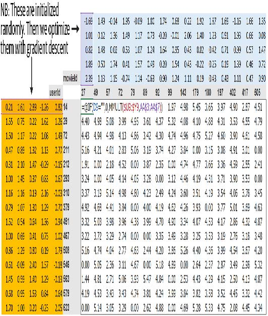
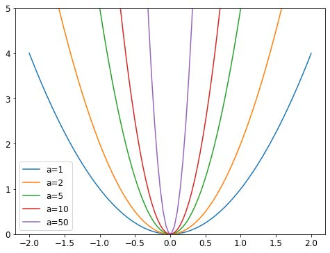
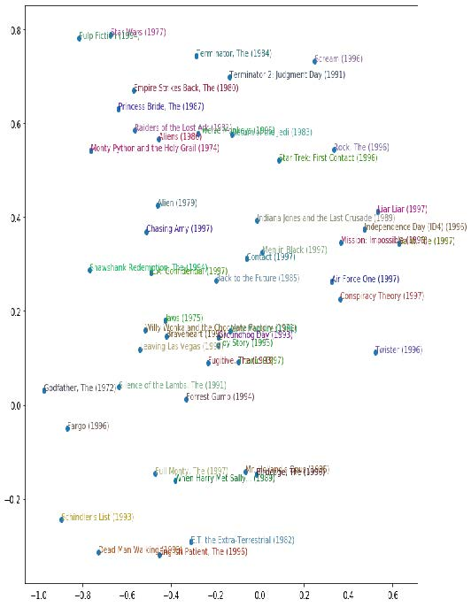

## 8. 深度解析协同过滤

一个常见的问题是：当存在多个用户和多个产品时，如何为每个用户推荐最可能有用的产品。这类问题存在多种变体：例如推荐电影（如Netflix（译者注：国外一家知名视频平台）所做）、确定用户主页的突出内容、决定社交媒体信息流中展示哪些故事等等。解决此类问题的通用方案称为 *协同过滤* （collaborative filtering），其运作原理如下：分析当前用户使用或点赞过的商品，找出其他用户使用或点赞过相似商品的记录，进而推荐这些用户使用或点赞过的其他商品。

例如，在Netflix上，你可能观看过大量属于科幻题材、充满动作场面且制作于1970年代的电影。Netflix可能并不了解你观看的具体影片属性，但它能发现：那些与你观看相同影片的用户，往往也倾向于观看其他同样属于科幻题材、动作场面丰富且制作于1970年代的电影。换言之，采用这种方法时，我们无需了解电影本身的任何信息，只需知道谁喜欢观看这些电影即可。

这种方法还能解决更广泛的问题类型，这些问题未必涉及用户和产品。事实上，在协同过滤领域，我们通常使用“项目”而非“产品”作为分析对象。项目可以是用户点击的链接、为患者选择的诊断方案等等。

关键的基础概念是 *潜在因子* （latent factors）。在Netflix的例子中，我们最初假设你喜欢老派、动作场面丰富的科幻电影。但你从未告诉Netflix自己喜欢这类电影。Netflix也无需在其电影数据库中添加列来标注影片类型。然而，必然存在某种潜在概念——科幻、动作、电影年代——这些概念至少对部分用户的观影决策具有重要意义。

在本章中，我们将着手解决这个电影推荐问题。首先，我们将获取一些适合协同过滤模型的数据。

### 数据初探

我们无法获取Netflix完整的电影观看历史数据集，但有一个名为 [MovieLens](https://oreil.ly/gP3Q5) 的优质数据集可供使用。该数据集包含数千万条电影评分记录（由电影ID、用户ID和数值评分组成），不过本例中我们将仅使用其中10万条样本数据。若您感兴趣，可尝试将此方法应用于完整的2500万条推荐数据集，这将是一个极好的学习项目。该数据集可从其官网获取。

该数据集可通过常规的fastai函数获取：

```python
from fastai.collab import *
from fastai.tabular.all import *
path = untar_data(URLs.ML_100k)
```

根据README说明，主数据表位于 `u.data` 文件中。该文件采用制表符分隔格式，列名依次为用户（user）、电影（movie）、评分（rating）和时间戳（timestamp）。由于这些名称未进行编码处理，使用Pandas读取文件时需明确指定列名。以下是打开该数据表进行查看的方法：

```python
ratings = pd.read_csv(path/'u.data', delimiter='\t',
                      header=None,
                      names=
                      ['user','movie','rating','timestamp'])
ratings.head()
```

| 序号 | 用户 | 电影 | 评分 | 时间戳    |
| ---- | ---- | ---- | ---- | --------- |
| 0    | 196  | 242  | 3    | 881250949 |
| 1    | 186  | 302  | 3    | 891717742 |
| 2    | 22   | 377  | 1    | 878887116 |
| 3    | 244  | 51   | 2    | 880606923 |
| 4    | 166  | 346  | 1    | 886397596 |

尽管这包含了我们所需的所有信息，但这种呈现方式对人类查看数据并不特别有用。图8-1展示了将相同数据交叉表化后形成的更易于人类理解的表格。


[^图8-1]: 电影与用户交叉表

我们仅选取了部分最受欢迎的电影，以及观看电影最多的用户，作为此交叉表示例。表格中的空单元格正是我们希望模型学习填充的部分。这些位置对应用户尚未评价的影片，推测是因其尚未观看。对于每位用户，我们需要推断出他们最可能喜欢的影片类型。

如果我们知道每位用户对电影可能归属的重要类别的偏好程度——例如类型、年龄、偏好的导演和演员等，同时掌握每部电影的相同信息，那么填充此表格的简便方法就是将每部电影的这些信息相乘，形成组合值。例如，假设这些因素在-1至+1之间变化，正数表示匹配度更高，负数表示匹配度更低，类别包括科幻、动作和老电影，那么我们可以将电影《最后的天行者》表示如下：

```python
last_skywalker = np.array([0.98,0.9,-0.9])
```

例如，这里我们将“非常科幻”评分为0.98，而“非常非古典”评分为-0.9。我们可以这样描述一位喜欢现代科幻动作电影的用户：

```python
user1 = np.array([0.9,0.8,-0.6])
```

现在我们可以计算这个组合的匹配情况：

```python
(user1*last_skywalker).sum()
```

```text
2.1420000000000003
```

当我们将两个向量相乘并求和时，这被称为点积（dot product）。它在机器学习中应用广泛，并构成了矩阵乘法的基础。在第17章中，我们将深入探讨矩阵乘法与点积的相关内容。

> 术语：点积
>
> 将两个向量的元素相乘，然后将结果相加的数学运算。

另一方面，我们可以将电影《卡萨布兰卡》表示为：

```python
casablanca = np.array([-0.99,-0.3,0.8])
```

此组合之间的匹配关系如图所示：

```python
(user1*casablanca).sum()
```

```text
-1.611
```

由于我们不知道潜在因子是什么，也不知道如何为每个用户和电影评分，因此需要学习这些因子。

### 学习潜在因子

令人惊讶的是，定义模型结构（如前一节所示）与学习模型结构之间差异甚微，因为我们只需采用通用的梯度下降方法即可。

该方法的第一步是随机初始化若干参数。这些参数将构成每个用户和电影的一组潜在因子。我们需要确定使用多少个因子，具体选择方法稍后讨论，为便于说明，现暂设为5个。由于每位用户和每部电影都对应一组因子，我们可在交叉表中将这些随机初始化值直接显示在用户与电影数据旁，并在中间区域填入所有组合的点积值。例如，图8-2展示了在Microsoft Excel中的呈现效果，左上角单元格的公式作为示例展示。

该方法的第二步是计算预测值。如前所述，我们只需计算每部电影与每位用户的点积即可。例如，若第一个潜在用户因子代表用户对动作片的偏好程度，而第一个潜在电影因子代表影片是否包含大量动作场景，当用户喜欢动作片且电影动作场景丰富时，或用户不喜欢动作片且电影无动作场景时，两者乘积将显著增高。反之，若出现不匹配情况（用户热爱动作片但电影非动作片，或用户不喜欢动作片而电影恰是动作片），该乘积值将非常低。



[^图8-2]: 交叉表中的潜在因子

第三步是计算损失值。我们可以使用任何损失函数；目前选择均方误差，因为这是衡量预测准确度的一种合理方式。

这就是我们所需的全部。在此基础上，我们可以使用随机梯度下降法优化参数（潜在因子），从而最小化损失。在每个步骤中，随机梯度下降优化器将通过点积计算每部电影与每位用户的匹配度，并将其与每位用户对每部电影的实际评分进行比较。随后计算该值的导数，并乘以学习率调整权重。经过大量迭代后，损失函数将持续优化，推荐效果也会越来越好。

要使用常规的 `Learner.fit` 函数，我们需要将数据装载到 `DataLoaders` 中，因此现在让我们专注于此。

### 创建 `DataLoaders`

在展示数据时，我们更希望看到电影标题而非其ID。表 `u.item` 包含ID与标题的对应关系：

```python
movies = pd.read_csv(path/'u.item', delimiter='|',
                     encoding='latin-1',
                     usecols=(0,1), names=('movie','title'),
                     header=None)
movies.head()
```

| 序号 | 电影 | 标题              |
| ---- | ---- | ----------------- |
| 0    | 1    | Toy Story (1995)  |
| 1    | 2    | GoldenEye (1995)  |
| 2    | 3    | Four Rooms (1995) |
| 3    | 4    | Get Shorty (1995) |
| 4    | 5    | Copycat (1995)    |

我们可以将此与我们的 `ratings` 表合并，以获取按标题分类的用户评分：

```python
ratings = ratings.merge(movies)
ratings.head()
```

| 序号 | 用户 | 电影 | 评分 | 时间戳    | 标题         |
| ---- | ---- | ---- | ---- | --------- | ------------ |
| 0    | 196  | 242  | 3    | 881250949 | Kolya (1996) |
| 1    | 63   | 242  | 3    | 875747190 | Kolya (1996) |
| 2    | 226  | 242  | 5    | 883888671 | Kolya (1996) |
| 3    | 154  | 242  | 3    | 879138235 | Kolya (1996) |
| 4    | 306  | 242  | 5    | 876503793 | Kolya (1996) |

然后我们可以根据此表格构建一个 `DataLoaders` 对象。默认情况下，它将第一列作为用户名，第二列作为项目（此处指电影），第三列作为评分。在我们的场景中，需要修改 `item_name` 的值，以便使用标题而非ID：

```python
dls = CollabDataLoaders.from_df(ratings, item_name='title',
                                bs=64)
dls.show_batch()
```

| 序号 | 用户 | 标题                               | 评分 |
| ---- | ---- | ---------------------------------- | ---- |
| 0    | 207  | Four Weddings and a Funeral (1994) | 3    |
| 1    | 565  | Remains of the Day, The (1993)     | 5    |
| 2    | 506  | Kids (1995)                        | 1    |
| 3    | 845  | Chasing Amy (1997)                 | 3    |
| 4    | 798  | Being Human (1993)                 | 2    |
| 5    | 500  | Down by Law (1986)                 | 4    |
| 6    | 409  | Much Ado About Nothing (1993)      | 3    |
| 7    | 721  | Braveheart (1995)                  | 5    |
| 8    | 316  | Psycho (1960)                      | 2    |
| 9    | 883  | Judgment Night (1993)              | 5    |

要在 PyTorch 中表示协同过滤，我们不能直接使用交叉表表示法，尤其当需要将其融入深度学习框架时。我们可以将电影和用户的潜在因子表表示为简单的矩阵：

```python
n_users = len(dls.classes['user'])
n_movies = len(dls.classes['title'])
n_factors = 5

user_factors = torch.randn(n_users, n_factors)
movie_factors = torch.randn(n_movies, n_factors)
```

要计算特定电影与用户组合的结果，我们需要在电影潜在因子矩阵中查找该电影的索引，并在用户潜在因子矩阵中查找该用户的索引；随后即可对两个潜在因子向量进行点积运算。但索引查找（look up in an index）并非深度学习模型所擅长的操作。它们只掌握矩阵乘法和激活函数的运算。

幸运的是，我们发现可以将索引查找表示为矩阵乘法。关键在于用独热编码向量替换索引。以下是向量与表示索引3的独热编码向量相乘的结果示例：

```python
one_hot_3 = one_hot(3, n_users).float()
user_factors.t() @ one_hot_3
```

```text
tensor([-0.4586, -0.9915, -0.4052, -0.3621, -0.5908])
```

它给出了与矩阵中索引为3的元素相同的向量：

```python
user_factors[3]
```

```text
tensor([-0.4586, -0.9915, -0.4052, -0.3621, -0.5908])
```

如果同时对几个索引执行此操作，我们将得到一个由独热编码向量组成的矩阵，而该操作本质上是矩阵乘法！这种构建模型的架构完全可行，但会消耗远超必要的内存和时间。我们知道，存储独热编码向量或搜索其中数字1的出现根本没有实质意义——我们本应能直接用整数索引数组. 因此，包括 PyTorch 在内的大多数深度学习库都提供了一个专门层来实现这一功能：它使用整数对向量进行索引，但其导数计算方式与执行与独热编码向量矩阵乘法时完全一致。这种技术被称为嵌入（embedding）。

> 术语：嵌入
>
> 与独热编码矩阵相乘时，可利用计算捷径——即通过直接索引实现。这个概念看似复杂，实则简单。你用来与独热编码矩阵相乘（或通过计算捷径直接索引）的矩阵，被称为嵌入矩阵。

在计算机视觉领域，我们可以通过像素的RGB值轻松获取其全部信息：彩色图像中的每个像素由三个数值表示。这三个数值分别对应红色、绿色和蓝色成分，足以支撑后续模型的运行。

对于当前问题，我们无法像描述用户或电影那样轻松地定义特征。可能存在与类型相关的关联：若某用户偏好爱情片，则其对爱情电影的评分往往较高。其他因素还包括电影是偏重动作场面还是对话戏份，或是是否包含用户特别喜爱的特定演员。

如何确定数字来描述这些特征？答案是，我们不会强行规定。我们将让模型自行学习这些特征。通过分析用户与电影之间的现有关联，模型能够自主识别哪些特征重要，哪些不重要。

这就是嵌入的含义。我们将为每位用户和每部电影分配一个特定长度的随机向量（此处为 `n_factors=5` ），并将这些参数设为可学习参数。这意味着在每次迭代中，当我们通过预测值与目标值的对比计算损失时，将求解损失函数对这些嵌入向量的梯度，并依据随机梯度下降（或其它优化器）的规则进行参数更新。

起初，这些数字毫无意义，因为我们是随机选取的，但训练结束后它们就会产生意义。通过仅基于现有用户与电影关联数据进行学习（不依赖其他信息），我们会发现模型仍能提取出重要特征，从而将商业大片与独立电影区分开来，将动作片与爱情片区分开来，等等。

我们现在能够从头开始创建整个模型了。

### 从零开始的协同过滤

在使用PyTorch编写模型之前，我们首先需要掌握面向对象编程和Python的基础知识。如果你此前未接触过面向对象编程，我们将在此进行简要介绍，但建议你查阅相关教程并进行实践练习后再继续学习。

面向对象编程的核心概念是类（class）。在本书中我们一直在使用类，例如 `DataLoader` 、`String` 和 `Learner` 。Python也使我们能够轻松创建新类。以下是一个简单类的示例：

```python
class Example:
    def __init__(self, a): self.a = a
    def say(self,x): return f'Hello {self.a}, {x}.'
```

其中最重要的部分是名为 `__init__`（发音为双下划线初始化）的特殊方法。在Python中，任何像这样用双下划线包围的方法都被视为特殊方法，这表明该方法名关联着额外的行为。对于 `__init__` 而言，当创建新对象时Python会调用此方法。因此，此处可用于设置任何需要在对象创建时初始化的状态。用户构造类实例时传递的参数将作为参数传递给 `__init__` 方法。请注意，类内部定义的任何方法的首个参数均为 `self` ，因此可利用此参数设置和获取所需的任何属性：

```python
ex = Example('Sylvain')
ex.say('nice to meet you')
```

```text
'Hello Sylvain, nice to meet you.'
```

另请注意，创建新的PyTorch模块需要继承自 `Module` 类。继承是面向对象编程的重要概念，本文不作详细讨论——简而言之，它意味着我们可以为现有类添加额外行为。PyTorch已提供 `Module` 类，该类提供了我们需要构建的基础框架。因此，我们在定义的类名后添加该基类名，如下例所示：

创建新的PyTorch模块时，最后需要了解的是：当调用该模块时，PyTorch会调用类中名为 `forward` 的方法，并将调用中包含的所有参数传递给该方法。以下是定义点积模型的类：

```python
class DotProduct(Module):
    def __init__(self, n_users, n_movies, n_factors):
        self.user_factors = Embedding(n_users, n_factors)
        self.movie_factors = Embedding(n_movies, n_factors)
        
    def forward(self, x):
        users = self.user_factors(x[:,0])
        movies = self.movie_factors(x[:,1])
        return (users * movies).sum(dim=1)
```

如果你此前未接触过面向对象编程，请不必担心；本书中你无需频繁使用该技术。我们在此提及此方法，仅是因为多数在线教程与文档均采用面向对象的语法。

请注意，模型的输入是一个形状为 `batch_size x 2` 的张量，其中第一列（`x[:, 0]`）包含用户ID，第二列（`x[:, 1]`）包含电影ID。如前所述，我们使用嵌入层来表示用户和电影潜在因子的矩阵：

```python
x,y = dls.one_batch()
x.shape
```

```text
torch.Size([64, 2])
```

现在我们已经定义了架构并创建了参数矩阵，需要创建一个 `Learner` 来优化模型。过去我们使用过诸如 `cnn_learner` 之类的特殊函数，它们会为特定应用自动完成所有配置。由于本次是从零开始构建，我们将使用基础的 `Learner` 类：

```python
model = DotProduct(n_users, n_movies, 50)
learn = Learner(dls, model, loss_func=MSELossFlat())
```

我们现在准备好拟合模型：

```python
learn.fit_one_cycle(5, 5e-3)
```

| 迭代轮次 | 训练损失 | 验证损失 | 时间  |
| -------- | -------- | -------- | ----- |
| 0        | 1.326261 | 1.295701 | 00:12 |
| 1        | 1.091352 | 1.091475 | 00:11 |
| 2        | 0.961574 | 0.977690 | 00:11 |
| 3        | 0.829995 | 0.893122 | 00:11 |
| 4        | 0.781661 | 0.876511 | 00:12 |

要使该模型稍有改进，首先可以将预测值强制限制在0到5之间。为此只需使用`sigmoid_range` 函数，具体方法参见第六章。根据经验观察，将范围略微扩展至5以上效果更佳，因此我们采用 `(0, 5.5)` 区间：

```python
class DotProduct(Module):
    def __init__(self, n_users, n_movies, n_factors,
                 y_range=(0,5.5)):
        self.user_factors = Embedding(n_users, n_factors)
        self.movie_factors = Embedding(n_movies, n_factors)
        self.y_range = y_range
        
    def forward(self, x):
        users = self.user_factors(x[:,0])
        movies = self.movie_factors(x[:,1])
        return sigmoid_range((users * movies).sum(dim=1),
                             *self.y_range)
        
model = DotProduct(n_users, n_movies, 50)
learn = Learner(dls, model, loss_func=MSELossFlat())
learn.fit_one_cycle(5, 5e-3)
```

| 迭代轮次 | 训练损失 | 验证损失 | 时间  |
| -------- | -------- | -------- | ----- |
| 0        | 0.976380 | 1.001455 | 00:12 |
| 1        | 0.875964 | 0.919960 | 00:12 |
| 2        | 0.685377 | 0.870664 | 00:12 |
| 3        | 0.483701 | 0.874071 | 00:12 |
| 4        | 0.385249 | 0.878055 | 00:12 |

这是一个合理的起点，但我们可以做得更好。一个明显的缺失部分是：某些用户的推荐倾向比其他人更积极或更消极，某些电影本身就比其他作品更出色或更糟糕。但在我们的点积表示中，我们无法编码这两种情况。例如，若你只能描述一部电影是“非常科幻”、‘非常动作导向’、“非常非经典”，那么你实际上无法判断大多数人是否喜欢它。

这是因为目前我们只有权重，还没有偏置项。如果我们能为每个用户和每部电影分别设置一个数值，将其加到评分上，就能完美解决这个缺失的部分。因此首先，让我们调整模型架构：

```python
class DotProductBias(Module):
    def __init__(self, n_users, n_movies, n_factors,
                 y_range=(0,5.5)):
        self.user_factors = Embedding(n_users, n_factors)
        self.user_bias = Embedding(n_users, 1)
        self.movie_factors = Embedding(n_movies, n_factors)
        self.movie_bias = Embedding(n_movies, 1)
        self.y_range = y_range
        
    def forward(self, x):
        users = self.user_factors(x[:,0])
        movies = self.movie_factors(x[:,1])
        res = (users * movies).sum(dim=1, keepdim=True)
        res += self.user_bias(x[:,0]) +
        self.movie_bias(x[:,1])
        return sigmoid_range(res, *self.y_range)
```

让我们试着训练这个模型，看看效果如何：

```python
model = DotProductBias(n_users, n_movies, 50)
learn = Learner(dls, model, loss_func=MSELossFlat())
learn.fit_one_cycle(5, 5e-3)
```

| 迭代轮次 | 训练损失 | 验证损失 | 时间  |
| -------- | -------- | -------- | ----- |
| 0        | 0.929161 | 0.936303 | 00:13 |
| 1        | 0.820444 | 0.861306 | 00:13 |
| 2        | 0.621612 | 0.865306 | 00:14 |
| 3        | 0.404648 | 0.886448 | 00:13 |
| 4        | 0.292948 | 0.892580 | 00:13 |

结果非但没有变好，反而变得更糟（至少在训练结束时如此）。为什么会这样？仔细观察两次训练过程，我们发现验证集损失在中途停止下降并开始恶化。正如我们所见，这是过拟合的明确信号。这种情况下无法使用数据增强技术，因此必须采用其他正则化方法。权重衰减（weight decay）便是一种有效的解决方案。

#### 权重衰减

权重衰减，或者叫L2正则化，是在损失函数中添加所有权重平方之和。为什么我们这样做？因为当我们计算梯度时，它会为梯度贡献额外项，从而促使权重尽可能减小。

为什么这样能防止过拟合？其原理在于：系数越大，损失函数中的峡谷就越陡峭。以抛物线 `y = a * (x**2)` 为例，当 a 值增大时，抛物线弧度越陡，其形成的峡谷就越狭窄：



因此，让模型学习高阶参数可能会导致它用一个过于复杂的函数拟合训练集中的所有数据点，这种函数具有非常陡峭的变化，从而导致过拟合。

限制权重过度增长会阻碍模型训练，但能提升其泛化能力。我们来简要地回顾一下理论：权重衰减（简称`wd`）是控制损失函数中平方和项的参数（假设 `parameters` 为所有参数的张量）：

```python
loss_with_wd = loss + wd * (parameters**2).sum()
```

但在实际操作中，计算这个大求和并将其加到损失函数上会非常低效（且可能数值不稳定）。如果你还记得一点高中数学知识，可能会想起 `p**2` 对 `p`的导数是 `2*p` ，因此将这个大求和加到损失函数上，与执行以下操作完全相同：

```python
parameters.grad += wd * 2 * parameters
```

实际上，由于 `wd` 是我们选择的参数，我们可以将其设置为原值的两倍，因此方程中甚至无需 `*2` 。要在 fastai 中使用权重衰减，请在调用 `fit` 或 `fit_one_cycle` 时传入 `wd` 参数（两者均可传入）：

```python
model = DotProductBias(n_users, n_movies, 50)
learn = Learner(dls, model, loss_func=MSELossFlat())
learn.fit_one_cycle(5, 5e-3, wd=0.1)
```

| 迭代轮次 | 训练损失 | 验证损失 | 时间  |
| -------- | -------- | -------- | ----- |
| 0        | 0.972090 | 0.962366 | 00:13 |
| 1        | 0.875591 | 0.885106 | 00:13 |
| 2        | 0.723798 | 0.839880 | 00:13 |
| 3        | 0.586002 | 0.823225 | 00:13 |
| 4        | 0.490980 | 0.823060 | 00:13 |

现在好多了！

#### 创建我们自己的嵌入模块

迄今为止，我们使用嵌入技术时并未深入思考其工作原理。现在让我们尝试不使用该类重新实现点积偏置层。每个嵌入都需要随机初始化的权重矩阵。但需注意：回顾第4章所述，优化器要求能通过模块的 `parameters` 方法获取所有参数。然而这并非完全自动实现——若仅将张量作为属性添加到 `Module` 中，它将不会被包含在 `parameters` 中：

```python
class T(Module):
    def __init__(self): self.a = torch.ones(3)
```

```python
L(T().parameters())
```

```text
(#0) []
```

要告知 `Module` 我们将张量作为参数处理，需要用 `nn.Parameter` 类将其包装。该类本身不提供任何额外功能（仅会自动调用 `requires_grad_` ），仅作为标记用于标识参数范围：

```python
class T(Module):
    def __init__(self): self.a = nn.Parameter(torch.ones(3))
    
L(T().parameters())
```

```text
(#1) [Parameter containing:
tensor([1., 1., 1.], requires_grad=True)]
```

所有 PyTorch 模块都使用 `nn.Parameter` 来处理任何可训练参数，因此我们此前无需显式使用这个封装器：

```python
class T(Module):
    def __init__(self): self.a = nn.Linear(1, 3, bias=False)
    
t = T()
L(t.parameters())
```

```text
(#1) [Parameter containing:
tensor([[-0.9595],
[-0.8490],
[ 0.8159]], requires_grad=True)]
```

```python
type(t.a.weight)
```

```text
torch.nn.parameter.Parameter
```

我们可以创建一个张量作为参数，并进行随机初始化，如下所示：

```python
def create_params(size):
    return nn.Parameter(torch.zeros(*size).normal_(0, 0.01))
```

让我们再次利用它来创建 `DotProductBias` ，但不包含嵌入：

```python
class DotProductBias(Module):
    def __init__(self, n_users, n_movies, n_factors,
                 y_range=(0,5.5)):
        self.user_factors = create_params([n_users,
                                           n_factors])
        self.user_bias = create_params([n_users])
        self.movie_factors = create_params([n_movies,
                                            n_factors])
        self.movie_bias = create_params([n_movies])
        self.y_range = y_range
        
    def forward(self, x):
        users = self.user_factors[x[:,0]]
        movies = self.movie_factors[x[:,1]]
        res = (users*movies).sum(dim=1)
        res += self.user_bias[x[:,0]] +
        self.movie_bias[x[:,1]]
        return sigmoid_range(res, *self.y_range)
```

那么让我们再次训练模型，以验证是否能得到与上一节大致相同的结果：

```python
model = DotProductBias(n_users, n_movies, 50)
learn = Learner(dls, model, loss_func=MSELossFlat())
learn.fit_one_cycle(5, 5e-3, wd=0.1)
```

| 迭代轮次 | 训练损失 | 验证损失 | 时间  |
| -------- | -------- | -------- | ----- |
| 0        | 0.962146 | 0.936952 | 00:14 |
| 1        | 0.858084 | 0.884951 | 00:14 |
| 2        | 0.740883 | 0.838549 | 00:14 |
| 3        | 0.592497 | 0.823599 | 00:14 |
| 4        | 0.473570 | 0.824263 | 00:14 |

现在，让我们看看我们的模型学到了什么。

### 解释嵌入与偏差

我们的模型已具备实用价值，能够为用户提供电影推荐——但更值得关注的是它所发现的参数。其中最易解读的是偏向性参数。以下是偏向向量值最低的电影：

```python
movie_bias = learn.model.movie_bias.squeeze()
idxs = movie_bias.argsort()[:5]
[dls.classes['title'][i] for i in idxs]
```

```text
['Children of the Corn: The Gathering (1996)',
'Lawnmower Man 2: Beyond Cyberspace (1996)',
'Beautician and the Beast, The (1997)',
'Crow: City of Angels, The (1996)',
'Home Alone 3 (1997)']
```

想想这意味着什么。它表明的是：对于每部电影，即使用户与它的潜在特征高度匹配（稍后我们将看到，这些特征往往代表动作强度、电影年代等要素），用户通常仍然不喜欢它。我们本可直接按平均评分排序电影，但观察学习到的偏好揭示了更耐人寻味的信息：它不仅表明某类电影通常不受观众青睐，更揭示了即便属于观众本应喜爱的类型，人们也往往不愿观看！同理，以下是偏好值最高的影片：

```python
idxs = movie_bias.argsort(descending=True)[:5]
[dls.classes['title'][i] for i in idxs]
```

```text
['L.A. Confidential (1997)',
'Titanic (1997)',
'Silence of the Lambs, The (1991)',
'Shawshank Redemption, The (1994)',
'Star Wars (1977)']
```

因此，例如，即使你平时不喜欢侦探电影，你也可能会喜欢《洛城机密》！

直接解读嵌入矩阵并非易事。

其中涉及的因素实在太多，人类难以全面考量。但有一种技术能从中提取出最重要的潜在维度，即主成分分析（principal component analysis, PCA）。本书不会深入探讨该方法，因为它对深度学习实践者而言并非必备知识。若感兴趣，建议查阅fast.ai课程 [《程序员的计算线性代数》](https://oreil.ly/NLj2R) 。图8-3展示了基于两个最强PCA成分的电影数据可视化效果。



[^图8-3]: 基于两个最强PCA成分的电影表示

我们在此可见，模型似乎发现了经典电影与流行文化电影的概念差异，或者说这里所呈现的或许是影评界公认的评价。

> JEREMY说
>
> 无论训练多少模型，我始终为这些随机初始化的数字集合感到震撼与惊喜——它们仅凭如此简单的机制，竟能自主发掘数据中的奥秘。这简直像作弊般神奇：我编写的代码能完成实用任务，却从未真正告诉它该如何实现！

我们从零开始定义模型以向你展示其内部机制，但你也可以直接使用fastai库进行构建。接下来我们将探讨具体实现方法。

#### 使用 fastai.collab

我们可以使用fastai的 `collab_learner` ，基于之前展示的精确结构创建并训练协同过滤模型：

```python
learn = collab_learner(dls, n_factors=50, y_range=(0, 5.5))
learn.fit_one_cycle(5, 5e-3, wd=0.1)
```

| 迭代轮次 | 训练损失 | 验证损失 | 时间  |
| -------- | -------- | -------- | ----- |
| 0        | 0.931751 | 0.953806 | 00:13 |
| 1        | 0.851826 | 0.878119 | 00:13 |
| 2        | 0.715254 | 0.834711 | 00:13 |
| 3        | 0.583173 | 0.821470 | 00:13 |
| 4        | 0.496625 | 0.821688 | 00:13 |

通过打印模型可以查看各层的名称：

```python
learn.model
```

```text
EmbeddingDotBias(
(u_weight): Embedding(944, 50)
(i_weight): Embedding(1635, 50)
(u_bias): Embedding(944, 1)
(i_bias): Embedding(1635, 1)
)
```

我们可以利用这些工具复现上一节中的任何分析——例如：

```python
movie_bias = learn.model.i_bias.weight.squeeze()
idxs = movie_bias.argsort(descending=True)[:5]
[dls.classes['title'][i] for i in idxs]
```

```text
['Titanic (1997)',
"Schindler's List (1993)",
'Shawshank Redemption, The (1994)',
'L.A. Confidential (1997)',
'Silence of the Lambs, The (1991)']
```

利用这些已学习的嵌入向量，我们还可以做一件有趣的事情：计算距离。

#### 嵌入距离

在二维地图上，我们可通过毕达哥拉斯公式（译者注：在中国这个一般叫勾股定理）计算两点间距离：$\sqrt{x^2+y^2}$（其中x和y分别表示坐标在两轴上的距离）。对于50维空间的嵌入，我们采用完全相同的方法，只是需要求和所有50个坐标距离的平方。

如果存在两部几乎完全相同的电影，它们的嵌入向量也必然高度相似，因为喜欢这两部电影的用户群体几乎完全重合。这里存在一个更普遍的原理：电影相似性可通过喜欢这些电影的用户相似性来定义。这直接意味着两部电影的嵌入向量之间的距离可以定义这种相似性。我们可以利用这个原理找到与《沉默的羔羊》最相似的电影：

```python
movie_factors = learn.model.i_weight.weight
idx = dls.classes['title'].o2i['Silence of the Lambs, The
                               (1991)']
                               distances = nn.CosineSimilarity(dim=1)(movie_factors,
                                                                      movie_factors[idx][None])
idx = distances.argsort(descending=True)[1]
dls.classes['title'][idx]
```

```text
'Dial M for Murder (1954)'
```

既然我们已经成功训练了模型，现在来看看如何处理用户没有数据的情况。我们该如何为新用户提供推荐？

### 引导式协同过滤模型

在实践中使用协同过滤模型面临的最大挑战是引导问题。该问题的极端情况是没有用户，因此没有可供学习的历史数据。面对首位用户时，该推荐哪些商品？

但即便你是拥有悠久用户交易历史的成熟企业，仍面临一个问题：当新用户注册时该如何处理？当产品组合新增商品时又该如何应对？对此并无神奇解决方案，我们提出的建议本质上只是运用常识的不同变体。你可以为新用户分配其他用户所有嵌入向量的平均值，但这种方法存在问题：这种特定的潜在因素组合可能并不常见（例如，科幻因素的平均值可能很高，动作因素的平均值可能很低，但喜欢科幻却不喜欢动作的人并不多见）。更优方案是选取特定用户作为 *平均品味* 的代表。

更优秀的做法是基于用户元数据构建表格模型来生成初始嵌入向量。当用户注册时，考虑一下哪些问题能帮助你理解其偏好。随后可创建一个模型：因变量为用户的嵌入向量，自变量则包含你向其提问所得的结果及其注册元数据。下一节我们将探讨如何构建此类表格模型。（你可能注意到，当注册Pandora或Netflix等服务时，它们通常会询问你偏好的电影或音乐类型；这正是它们生成初始协同过滤推荐的原理。）

需要注意的是，少数极度热情的用户可能最终主导了整个用户群体的推荐结果。这种现象在电影推荐系统中尤为常见——动漫爱好者往往大量观看此类作品，鲜少涉猎其他类型，且热衷于在网站上投入大量时间评分。结果导致动漫作品在众多“史上最佳电影榜单”中严重过载。这种情况下，样本偏差问题显而易见；但若偏差发生在潜在因子层面，则可能完全难以察觉。

此类问题可能彻底改变用户群体的构成，并影响系统的运行机制。这种现象尤其因正反馈循环而显著。若少数用户倾向于主导推荐系统的方向，他们自然会吸引更多同类用户加入系统。这无疑会放大最初的表征偏差——此类偏差具有自然的指数级放大倾向。你或许见过企业高管对在线平台急速恶化感到震惊的案例——这些平台竟开始传递与创始人价值观相悖的内容。在这种反馈循环作用下，价值观分歧不仅会迅速发生，更会在悄无声息中持续恶化，直至为时已晚才被察觉。

在这样的自我强化系统中，我们或许应该预期此类反馈循环是常态而非例外。因此，你应当预见它们的存在，提前规划应对方案，并明确如何处理这些问题。尝试思考反馈循环在系统中可能呈现的所有形态，以及如何在数据中识别它们。归根结底，这又回到了我们最初关于如何避免机器学习系统部署灾难的建议：关键在于确保人为干预环节的存在，实施严密监控，并采取循序渐进、审慎周密的部署策略。

我们的点积模型效果相当出色，它构成了许多成功推荐系统的基础。这种协同过滤方法被称为概率矩阵分解（probabilistic matrix factorization，PMF）。另一种方法是深度学习，在相同数据条件下通常能取得类似的良好效果。

### 深度学习在协同过滤中的应用

要将我们的架构转化为深度学习模型，第一步是取嵌入查找的结果，并将这些激活值拼接在一起。这样就得到一个矩阵，随后我们可以按常规方式将其传递通过线性层和非线性层。

由于我们将对嵌入矩阵进行拼接而非求其点积，因此两个嵌入矩阵可以具有不同的尺寸（即不同的潜在因子数量）。fastai 提供了一个 `get_emb_sz` 函数，该函数基于 fast.ai 实践中验证有效的启发式算法，为您的数据推荐嵌入矩阵的推荐尺寸：

```python
embs = get_emb_sz(dls)
embs
```

```text
[(944, 74), (1635, 101)]
```

让我们实现这个类：

```python
class CollabNN(Module):
    def __init__(self, user_sz, item_sz, y_range=(0,5.5),
                 n_act=100):
        self.user_factors = Embedding(*user_sz)
        self.item_factors = Embedding(*item_sz)
        self.layers = nn.Sequential(
            nn.Linear(user_sz[1]+item_sz[1], n_act),
            nn.ReLU(),
            nn.Linear(n_act, 1))
        self.y_range = y_range
        
    def forward(self, x):
        embs =
        self.user_factors(x[:,0]),self.item_factors(x[:,1])
        x = self.layers(torch.cat(embs, dim=1))
        return sigmoid_range(x, *self.y_range)
```

并用它创建一个模型：

```python
model = CollabNN(*embs)
```

`CollabNN` 以与本章先前类相同的方式创建嵌入（`Embedding`）层，只是现在使用了嵌入尺寸。`self.layers` 与我们在第4章为MNIST创建的迷你神经网络完全相同。随后在前向传播中，我们应用嵌入操作，将结果拼接后传递至迷你神经网络。最后，我们像之前模型那样应用 `sigmoid_range` 函数。

让我们看看它是否能训练：

```python
learn = Learner(dls, model, loss_func=MSELossFlat())
learn.fit_one_cycle(5, 5e-3, wd=0.01)
```

| 迭代轮次 | 训练损失 | 验证损失 | 时间  |
| -------- | -------- | -------- | ----- |
| 0        | 0.940104 | 0.959786 | 00:15 |
| 1        | 0.893943 | 0.905222 | 00:14 |
| 2        | 0.865591 | 0.875238 | 00:14 |
| 3        | 0.800177 | 0.867468 | 00:14 |
| 4        | 0.760255 | 0.867455 | 00:14 |

fastai 在调用 `collab_learner` 时若传入 `use_nn=True`（包括为你调用 `get_emb_sz`），便会在 fastai.collab 中提供此模型，并支持轻松创建更多层。例如，这里我们创建了两个隐藏层，尺寸分别为 100 和 50：

```python
learn = collab_learner(dls, use_nn=True, y_range=(0, 5.5),
layers=[100,50])
learn.fit_one_cycle(5, 5e-3, wd=0.1)
```

| 迭代轮次 | 训练损失 | 验证损失 | 时间  |
| -------- | -------- | -------- | ----- |
| 0        | 1.002747 | 0.972392 | 00:16 |
| 1        | 0.926903 | 0.922348 | 00:16 |
| 2        | 0.877160 | 0.893401 | 00:16 |
| 3        | 0.838334 | 0.865040 | 00:16 |
| 4        | 0.781666 | 0.864936 | 00:16 |

`learn.model` 是类型为 `EmbeddingNN` 的对象。让我们来看看 fastai 对此类的代码：

```python
@delegates(TabularModel)
class EmbeddingNN(TabularModel):
    def __init__(self, emb_szs, layers, **kwargs):
        super().__init__(emb_szs, layers=layers, n_cont=0,
                         out_sz=1, **kwargs)
```

哇，代码量真不多！这个类继承自 `TabularModel` ，所有功能都来自该基类。在 `__init__` 中，它调用 `TabularModel` 的同名方法，传入参数 `n_cont=0` 和 `out_sz=1`；除此之外，它仅将接收到的所有参数原样传递过去。

> `kwargs` 与 `@delegates`修饰符
>
> `EmbeddingNN` 将 `**kwargs` 作为 `__init__` 的参数。在 Python 中，参数列表中的 `**kwargs` 表示“将所有额外的关键字参数放入名为 `kwargs` 的字典中”。而在参数列表中，`**kwargs` 表示“将 `kwargs` 字典中的所有键值对作为命名参数插入此处”。这种方法被许多流行库采用，例如 `matplotlib` 中，其核心绘图函数 `simply` 具有 `plot(*args, **kwargs)` 的签名。该绘图函数的文档说明写道“ `kwargs` 参数包含 `Line2D` 的属性”，随后列出了这些属性。
>
> 我们在 `EmbeddingNN` 中使用 `**kwargs` 来避免重复编写 `TabularModel` 的所有参数，并保持参数同步。然而这使得我们的 API 难以操作，因为Jupyter Notebook无法识别可用参数。因此，参数名的Tab补全功能和签名弹出列表等功能将无法正常工作。
>
> fastai 通过提供一个特殊的 `@delegates` 修饰符来解决这个问题，该修饰符会自动修改类或函数（此处为 `EmbeddingNN`）的签名，将所有关键字参数插入签名中。

尽管 `EmbeddingNN` 的结果略逊于点积方法（这彰显了精心构建领域架构的力量），但它确实让我们能够实现一项至关重要的功能：现在我们可以直接整合其他用户和电影信息、日期时间信息，或任何可能与推荐相关的信息。这正是 `TabularModel` 的作用所在。事实上，我们现在已知 `EmbeddingNN` 本质上就是一种 `TabularModel` ，其参数设置为 `n_cont=0` 且输出尺寸 `out_sz=1` 。因此，我们应当深入学习 `TabularModel及其应用技巧以获得更优结果！相关内容将在下一章展开。

### 总结

在首个非计算机视觉应用中，我们研究了推荐系统，并观察到梯度下降如何从历史评分中学习物品的内在因素或偏好。这些因素进而能为我们提供数据信息。

我们还用PyTorch构建了首个模型。本书后续章节将深入探讨更多相关内容，但在此之前，让我们先完成对深度学习其他通用应用场景的探索，继续聚焦表格数据领域。

### 问卷调查

1. 协同过滤解决了什么问题？
2. 它是如何解决的？
3. 为什么协同过滤预测模型可能无法成为一个非常有用的推荐系统？
4. 协同过滤数据的交叉表表示是什么样子的？

5. 编写代码生成MovieLens数据的交叉表表示（你可能需要进行网络搜索！）
6. 什么是潜在因子？为何称为“潜在”？
7. 什么是点积？使用纯Python列表手动计算点积
8. `pandas.DataFrame.merge` 函数的作用是什么？
9. 什么是嵌入矩阵？
10. 嵌入与独热编码向量矩阵之间有何关系？
11. 若独热编码向量能实现相同功能，为何仍需嵌入？
12. 训练开始前（假设未使用预训练模型），嵌入包含哪些内容？
13. 创建一个类（尽可能不偷看代码！）并使用它。
14. `x[:,0]` 返回什么？
15. 重写 `DotProduct` 类（尽可能不偷看代码！）并用它训练模型。
16. MovieLens适合使用哪种损失函数？为什么？
17. 若对MovieLens使用交叉熵损失会怎样？需要如何修改模型？
18. 偏置项在点积模型中有什么作用？
19. 权重衰减的另一个名称是什么？
20. 写出权重衰减的计算公式（别偷看！）。
21. 写出权重衰减的梯度方程。它为何有助于降低权重？

22. 为什么降低权重能提升泛化能力？
23. PyTorch中的 `argsort` 函数有何作用？
24. 对电影偏好进行排序与按电影平均整体评分是否效果相同？为什么？
25. 如何打印模型中各层的名称及详细信息？
26. 协同过滤中的“引导采样问题”指什么？
27. 如何处理新用户和新电影的引导采样问题？
28. 反馈循环如何影响协同过滤系统？
29. 在协同过滤中使用神经网络时，为何电影和用户可采用不同数量的因子？
30. `CollabNN` 模型中为何包含 `nn.Sequential` 组件？
31. 若需在协同过滤模型中添加用户/商品元数据或时间戳等信息，应采用何种模型？

#### 进一步研究

1. 仔细比较 `DotProductBias` 的嵌入版本与 `create_params` 版本之间的所有差异，并尝试理解每项修改的必要性。若不确定，可逐项撤销修改观察效果。（注意：甚至 `forward` 中使用的括号类型也发生了变化！）
2. 寻找其他三个应用协同过滤的领域，分析该方法在这些场景中的优缺点。
3. 使用完整的MovieLens数据集完成本笔记本，并将结果与在线基准进行对比。尝试提升预测准确率。可参考书籍官网和fast.ai论坛获取思路。注意完整数据集包含更多列——尝试利用这些列（下一章内容可能提供启发）。
4. 为MovieLens创建采用交叉熵损失的模型，并与本章模型进行对比。
