## 9. 深度解析表格建模

表格建模采用表格形式的数据（如电子表格或CSV文件）。其目标是基于其他列的值来预测某一列的值。本章不仅将探讨深度学习，还将介绍更通用的机器学习技术（如随机森林），因为根据具体问题需求，这些技术可能产生更优结果。

我们将探讨如何预处理和清理数据，以及如何解读模型训练后的结果，但首先要了解如何将包含类别信息的列输入到期望数值输入的模型中——这需要借助嵌入技术实现。

### 分类化嵌入

在表格数据中，某些列可能包含数值数据（如“年龄”），而其他列则包含字符串值（如“性别”）。数值数据可直接输入模型（可选预处理），但其他列需转换为数字。由于这些列的值对应不同类别，我们通常称此类变量为分类变量（categorical variables）。第一类则称为连续变量（continuous variables）。

> 术语：连续变量与分类变量
>
> 连续变量是数值数据，例如“年龄”，可直接输入模型，因为它们支持直接加法和乘法运算。分类变量包含若干离散类别，例如“电影ID”，这类变量不支持加法和乘法运算（即使它们以数字形式存储）。

2015年底，罗斯曼销售竞赛在Kaggle平台举行。参赛者获得德国多家门店的广泛数据，他们的任务是预测特定日期的销售额。该竞赛旨在协助企业优化库存管理，在满足需求的同时避免积压冗余库存。官方训练集提供了丰富的门店数据，同时允许参赛者使用额外数据——前提是这些数据必须公开且对所有参赛者平等开放。

一位金牌得主采用了深度学习技术，这是已知最早的尖端深度学习表格模型实例之一。其方法基于领域知识，所需特征工程远少于其他金牌得主。论文 [《类别变量的实体嵌入》](https://oreil.ly/VmgoU) 详细阐述了该方法。在书籍官网的 [线上专有章节](https://book.fast.ai/) 中，我们展示了如何从零开始复现该模型，并达到论文中展示的相同精度。论文摘要中，作者（Cheng Guo 和 Felix Bekhahn）指出：

> 实体嵌入不仅能减少内存占用并加速神经网络运行，与独热编码相比，更重要的是通过在嵌入空间中将相似值映射至邻近位置，揭示了分类变量的内在属性……[该方法]对包含大量高基数特征的数据集尤为有效，在其他方法容易过拟合的场景下表现突出…… 由于实体嵌入为分类变量定义了距离度量，它可用于分类数据的可视化与数据聚类。

在构建协同过滤模型时，我们已注意到所有这些要点。然而，我们清楚地看到这些洞见远不止于协同过滤本身。

该论文还指出（正如我们在前一章讨论的那样），嵌入层完全等同于在每个单热编码输入层之后放置一个普通的线性层。作者使用图9-1中的示意图来展示这种等价性。请注意，“稠密层”与“线性层”具有相同含义，而独热编码层代表输入。

这一见解至关重要，因为我们已掌握线性层的训练方法，这表明从架构和训练算法的角度来看，嵌入层只是另一种层。在前一章构建协同过滤神经网络时，我们也从实践中验证了这一点——该网络结构与图示完全一致。

正如我们分析电影评论的嵌入权重那样，实体嵌入论文的作者们也分析了其销售预测模型的嵌入权重。他们的发现令人惊叹，并印证了第二个关键洞见：嵌入技术将分类变量转化为既连续又具有实际意义的输入。

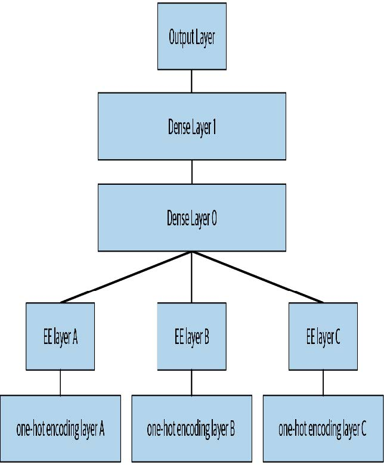

[^图9-1]: 神经网络中的实体嵌套（由Cheng Guo和Felix Berkhahn提供）

图9-2中的图像阐释了这些概念。它们基于论文中采用的方法，并结合了我们添加的分析内容。

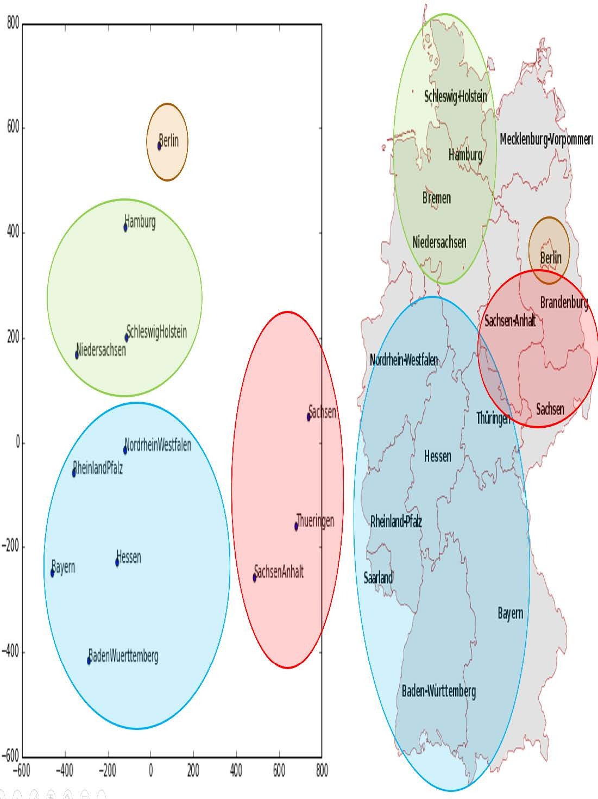

[^图9-2]: 国家嵌入与地图（由Cheng Guo和Felix Berkhahn提供）

左侧是州类别可能取值的嵌入矩阵图示。对于分类变量，我们称其可能取值为“层级”（或“类别”或“类”），因此此处一个层级是“柏林”，另一个是“汉堡”（译者注：这是德国的一个城市，而不是那种你爱吃的食物！）等等。右侧是德国地图。德国各州的实际地理位置并未包含在原始数据中，但模型仅凭商店销售行为就自主学习到了它们的位置！

你还记得我们讨论过嵌入之间的距离吗？论文作者将商店嵌入之间的距离与商店实际地理距离绘制成图（见图9-3）。他们发现两者吻合得非常紧密！

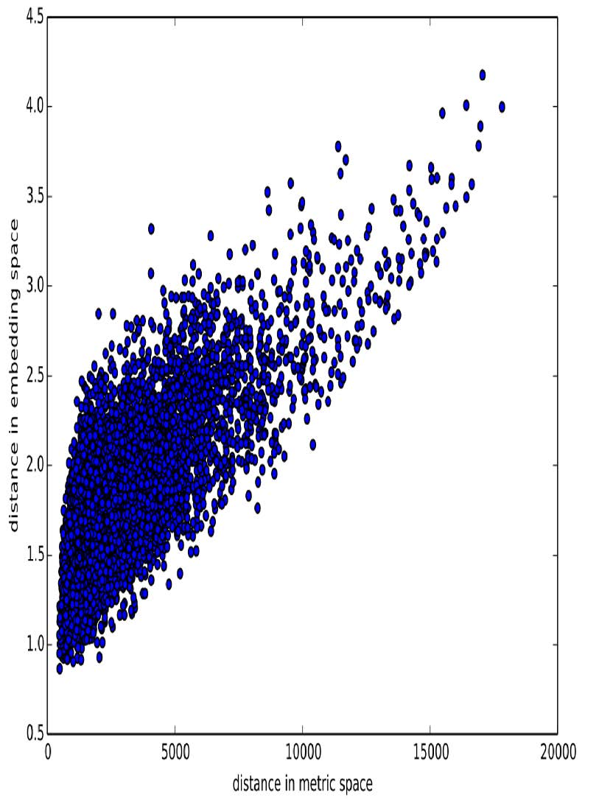

[^图9-3]: 店铺间距（由Cheng Guo和Felix Berkhahn提供）

我们甚至尝试绘制了星期和月份的嵌入图，发现日历上相邻的日期和月份在嵌入图中也呈现出相近的分布，如图9-4所示。

这两个例子突出的特点在于：我们向模型提供的是关于离散实体（如德国各州或星期几）的基本分类数据，随后模型通过学习为这些实体构建了嵌入表示，从而定义了它们之间连续的距离概念。由于这种嵌入距离是基于数据中的真实模式学习而来的，因此往往能与我们的直觉相吻合。

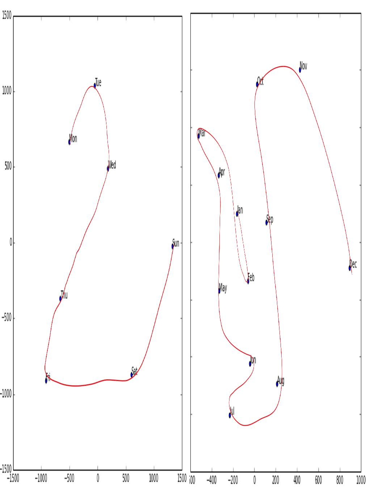

[^图9-4]: 日期嵌入（由Cheng Guo和Felix Berkhahn提供）

此外，嵌入向量本身具有连续性这一特性也极具价值，因为模型更擅长处理连续变量。考虑到模型由众多连续参数权重和连续激活值构成，且通过梯度下降（一种用于寻找连续函数极值的学习算法）进行更新，这种优势便不足为奇。

另一个好处是，我们可以将连续嵌入值与真正的连续输入数据直接结合：只需将变量拼接起来，并将拼接后的数据输入到第一个稠密层即可。换言之，原始分类数据在与原始连续输入数据交互前，会先经嵌入层进行转换。这正是fastai以及Guo和Berkhahn处理包含连续与分类变量的表格模型的方式。

采用这种连接方法的一个实例是谷歌在Google Play上如何进行推荐，正如论文 [《推荐系统中的宽与深的学习》](https://oreil.ly/wsnvQ) 中所阐述的。图9-5对此进行了说明。

有趣的是，谷歌团队将前一章中我们看到的两种方法结合起来：点积（他们称之为叉积）和神经网络方法。

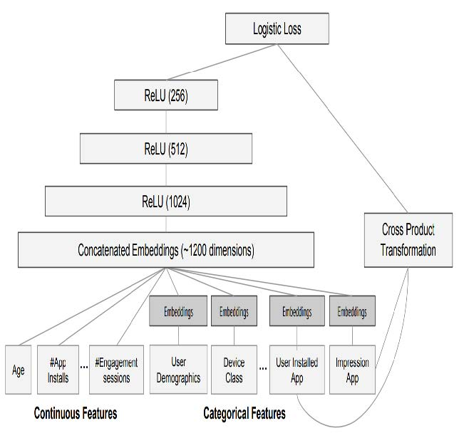

[^图9-5]: Google Play推荐系统

让我们稍作停顿。迄今为止，解决所有建模问题的方案都是训练深度学习模型。对于图像、声音、自然语言文本等复杂非结构化数据而言，这确实是个相当不错的经验法则。深度学习在协同过滤领域同样表现出色。但对于表格数据的分析，它未必总是最佳的起点。

### 深度学习之外

大多数机器学习课程会向你抛出数十种算法，仅附带简短的技术说明来解释其背后的数学原理，或许还会给出一个玩具示例。面对如此庞杂的技术体系，你往往感到困惑，对如何实际应用这些技术也几乎一无所知。

好消息是，现代机器学习可以浓缩为几种关键技术，这些技术具有广泛适用性。最新研究表明，绝大多数数据集仅需两种方法就能得到最佳建模：

- 决策树集成（即随机森林和梯度提升机），主要适用于结构化数据（例如大多数公司数据库表中的数据）
- 采用随机梯度下降（SGD）训练的多层神经网络（即浅层和/或深度学习），主要适用于非结构化数据（例如音频、图像和自然语言）

尽管深度学习在处理非结构化数据时几乎总是明显更优，但这两种方法在处理多种结构化数据时往往能得出相当相似的结果。但决策树集成模型通常训练速度更快，往往更易于解释，无需特殊GPU硬件即可进行大规模推理，且通常需要较少的超参数调优。它们也比深度学习流行得更久，因此围绕它们形成了更成熟的工具生态系统和文档体系。

最重要的是，对于决策树集成模型而言，解释表格数据模型的关键步骤要容易得多。现有的工具和方法能够解答以下相关问题：数据集中哪些列对预测最为重要？它们与因变量有何关联？它们之间如何相互作用？以及哪些特定特征对某些观测值最为关键？

因此，决策树集合是我们分析新表格数据集的首选方法。

此准则的例外情况是当数据集满足以下任一条件时：

- 存在一些高基数分类变量，它们至关重要（“基数”指代表类别的离散层级数量，因此高基数分类变量类似于邮政编码，可能包含数千个层级）。
- 某些列包含的数据最适合通过神经网络进行理解，例如纯文本数据。

在实际操作中，当我们处理满足这些特殊条件的数据集时，我们总是同时尝试决策树集成和深度学习，以确定哪种方法效果最佳。在协同过滤示例中，深度学习很可能成为有效方案，因为我们至少存在两个高基数分类变量：用户和电影。但实际情况往往没有这么简单，通常会同时存在高基数与低基数分类变量以及连续变量。

无论哪种情况，显然我们都需要将决策树集成模型加入我们的建模工具箱！

迄今为止，我们几乎所有繁重的工作都依赖PyTorch和fastai完成。但这些库主要为需要大量矩阵乘法和导数运算的算法设计（比如深度学习！）。决策树完全不依赖这些操作，因此PyTorch用处不大。

相反，我们将主要依赖一个名为 `scikit-learn`（也称为 `sklearn`）的库。`Scikit-learn`是创建机器学习模型的热门库，采用深层学习未涵盖的方法。此外，我们需要进行表格数据处理和查询，因此将使用 Pandas 库。最后还需 NumPy ，因为它是 sklearn 和Pandas共同依赖的核心数值编程库。

本书没有时间深入探讨所有这些库，因此我们仅会简要介绍每个库的主要部分。若需更深入的讨论，我们强烈推荐韦斯·麦金尼（Wes McKinney’s）的 [《Python数据分析》](http://shop.oreilly.com/product/0636920050896.do) （O'Reilly出版社）。麦金尼正是Pandas的创建者，因此你完全可以信赖书中信息的准确性！

首先，让我们收集将要使用的数据。

### 数据集

本章使用的数据集源自推土机蓝皮书Kaggle竞赛，其描述如下：“竞赛目标是基于设备使用情况、类型及配置，预测某台重型设备在拍卖中的成交价格。数据来源于拍卖结果公告，包含设备使用情况及配置信息。”

这是一种非常常见的数据集类型和预测问题，类似于你在项目或工作中可能遇到的情况。该数据集可在Kaggle网站上下载，该网站专门举办数据科学竞赛。

#### Kaggle上的比赛

Kaggle 是有志成为数据科学家或希望提升机器学习技能者的绝佳资源。没有什么比亲自动手实践并获得实时反馈更能帮助你提升技能了。

Kaggle 提供以下内容：

- 有趣的数据集
- 关于你表现的反馈
- 排行榜，助你了解优秀方案、可行方案及前沿技术
- 获奖选手撰写的博客文章，分享实用技巧与方法

迄今为止，我们所有的数据集均可通过fastai的集成数据集系统下载。然而，本章将使用的数据集仅可在Kaggle获取。因此，你需要先在该网站注册，然后进入 [竞赛页面](https://oreil.ly/B9wfd) 。在该页面点击“规则”，再点击“我理解并接受”。（尽管竞赛已结束，你不会参与其中，但仍需同意规则才能下载数据。）

下载Kaggle数据集最简单的方法是使用Kaggle API。你可以通过 `pip` 安装该API，在笔记本单元格中运行以下命令：

```bash
!pip install kaggle
```

使用Kaggle API需要API密钥；获取方式如下：在Kaggle网站点击个人头像，选择“我的账户”，然后点击“创建新API令牌”。这可以将把名为 `kaggle.json`的文件保存至您的电脑。你需要将此密钥复制到你的GPU服务器上。为此，请打开下载的文件，复制其内容，并将其粘贴到本章关联笔记本中以下单元格的单引号内（例如：`creds = ‘{“username”:“xxx”,‘key’:“xxx”}’`）：

```python
creds = ''
```

然后执行此单元格（此操作只需运行一次）：

```python
cred_path = Path('~/.kaggle/kaggle.json').expanduser()
if not cred_path.exists():
    cred_path.parent.mkdir(exist_ok=True)
    cred_path.write(creds)
    cred_path.chmod(0o600)
```

现在你可以从Kaggle下载数据集！请选择下载路径：

```python
path = URLs.path('bluebook')
path
```

```text
Path('/home/sgugger/.fastai/archive/bluebook')
```

并使用Kaggle API将数据集下载到该路径并解压：

```python
if not path.exists():
    path.mkdir()
    api.competition_download_cli('bluebook-for-bulldozers', path=path)
    file_extract(path/'bluebook-for-bulldozers.zip')
    
path.ls(file_type='text')
```

```text
(#7)
[Path('Valid.csv'),Path('Machine_Appendix.csv'),Path('ValidSolution.csv'),P
>
ath('TrainAndValid.csv'),Path('random_forest_benchmark_test.csv'),Path('Test.
> csv'),Path('median_benchmark.csv')]
```

既然我们已经下载了数据集，现在就来看看它吧！

#### 来看看数据

Kaggle 提供了我们数据集中部分字段的信息。数据页面说明 `train.csv` 中的关键字段如下：

- `SalesID`

  销售的唯一标识符。

- `MachineID`

  机器的唯一标识符。一台机器可被多次售出。

- `saleprice`

  机器在拍卖中的成交价格（仅在train.csv中提供）。

- `saledate`

  销售发生的时间。

在任何数据科学工作中， *直接查看数据* 至关重要，这样可以确保你理解其格式、存储方式、包含的值类型等。即使你已阅读过数据描述，实际数据也可能与你预期不符。我们将首先将训练集读取到Pandas数据框中。通常建议同时指定 `low_memory=False` 参数，除非Pandas实际内存不足并返回错误。`low_memory` 参数默认值为 `True`，它指示Pandas每次仅分析少量数据行以确定各列数据类型。这意味着Pandas可能为不同数据行分配不同数据类型，通常会导致后续数据处理错误或模型训练问题。

让我们加载数据并查看列：

```python
df = pd.read_csv(path/'TrainAndValid.csv', low_memory=False)
```

```python
df.columns
```

```text
Index(['SalesID', 'SalePrice', 'MachineID', 'ModelID', 'datasource',
'auctioneerID', 'YearMade', 'MachineHoursCurrentMeter',
'UsageBand',
'saledate', 'fiModelDesc', 'fiBaseModel', 'fiSecondaryDesc',
'fiModelSeries', 'fiModelDescriptor', 'ProductSize',
'fiProductClassDesc', 'state', 'ProductGroup', 'ProductGroupDesc',
'Drive_System', 'Enclosure', 'Forks', 'Pad_Type', 'Ride_Control',
'Stick', 'Transmission', 'Turbocharged', 'Blade_Extension',
'Blade_Width', 'Enclosure_Type', 'Engine_Horsepower',
'Hydraulics',
'Pushblock', 'Ripper', 'Scarifier', 'Tip_Control', 'Tire_Size',
'Coupler', 'Coupler_System', 'Grouser_Tracks', 'Hydraulics_Flow',
'Track_Type', 'Undercarriage_Pad_Width', 'Stick_Length', 'Thumb',
'Pattern_Changer', 'Grouser_Type', 'Backhoe_Mounting',
'Blade_Type',
'Travel_Controls', 'Differential_Type', 'Steering_Controls'],
dtype='object')
```

这可有不少列需要我们查看！不妨浏览数据集，了解每列包含哪些信息。接下来我们将学习如何“锁定”最有趣的部分。

此时，处理序数列是一个不错的下一步操作。这指的是包含字符串或类似内容的列，但这些字符串具有自然排序关系。例如，以下是 `ProductSize` 的等级：

```python
df['ProductSize'].unique()
```

```text
array([nan, 'Medium', 'Small', 'Large / Medium', 'Mini', 'Large',
'Compact'],
> dtype=object)
```

我们可以像这样告诉Pandas这些层级的合适排序：

```python
sizes = 'Large','Large / Medium','Medium','Small','Mini','Compact'
```

```python
df['ProductSize'] = df['ProductSize'].astype('category')
df['ProductSize'].cat.set_categories(sizes, ordered=True, inplace=True)
```

最重要的数据列是因变量——即我们想要预测的变量。请记住，模型的度量标准是反映预测质量的函数。注意项目采用何种度量标准至关重要。通常，选择度量标准是项目设置的重要环节。在多数情况下，选择合适的度量标准不仅是简单选用现有变量，更像是一个设计过程。你需要仔细思考：究竟哪个度量指标（或指标组合）能真正衡量你所关注的模型质量概念？若现有变量中没有能体现该指标的变量，则应尝试利用现有变量构建该指标。

然而在此案例中，Kaggle明确指定了评估指标：实际拍卖价格与预测价格之间的对数均方根误差（the root mean squared log, RMLSE）。我们只需进行少量处理即可应用该指标：对价格取对数后，其 `m_rmse` 值即为最终所需结果：

```python
dep_var = 'SalePrice'
```

```python
df[dep_var] = np.log(df[dep_var])
```

现在，我们准备探索适用于表格数据的首个机器学习算法：决策树。

### 决策树

决策树集成，顾名思义，依赖于决策树。那么我们就从这里开始吧！决策树会对数据提出一系列二元（是或否）问题。每次提问后，树上该分支的数据都会被划分为“是”与“否”两条路径（如图9-6所示）。经过一次或多次提问后，系统要么根据所有先前答案给出预测，要么需要继续提问。

这组问题构成了一个流程，用于处理任何数据项——无论是来自训练集的项还是新项——并将其分配到某个组别。具体而言，在完成问答后，我们可以判定该项与所有在训练数据集中给出相同答案集的训练数据项属于同一组别。但这有何用？我们模型的目标是预测数据项的值，而非将它们归入训练数据集中的组别。其价值在于：我们现在能为每个组别分配预测值——对于回归任务，我们取该组内数据项的目标均值。

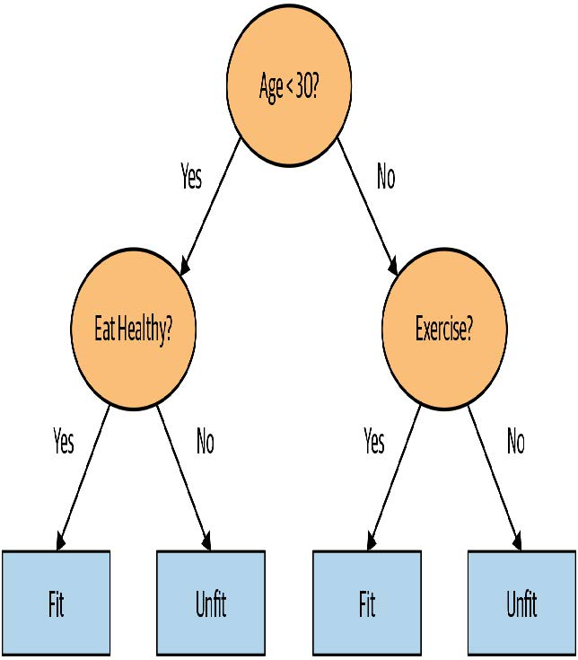

[^图9-6]: 一种决策树的示例

让我们思考如何找到正确的问题。当然，我们不希望自己创建所有这些问题——这正是计算机的用武之地！训练决策树的基本步骤可以非常简单地写下来：

1. 依次遍历数据集的每一列。
2. 对每列数据，依次遍历该列的所有可能取值水平。
3. 尝试将数据分为两组：一组取值大于该数值，另一组取值小于该数值（若为分类变量，则根据是否等于该分类变量的特定取值水平进行划分）。
4. 计算两组数据的平均售价，并评估其与设备实际售价的吻合度。将此视为基础预测模型：设备售价即归属组别的平均售价。
5. 遍历所有列及其所有可能的取值后，选择能使该简单模型获得最佳预测结果的分割点。
6. 基于选定的分割点，数据现分为两组。将每组视为独立数据集，通过重复执行步骤1为各组寻找最佳分割点。
7. 递归执行此过程，直至满足各组的终止条件——例如当某组仅剩20项时停止进一步分割。

虽然这个算法自己实现起来相当简单（而且这样做是个很好的练习），但我们可以通过使用sklearn内置的实现来节省一些时间。

不过，首先我们需要进行一些数据准备工作。

> ALEXIS说
>
> 这里有一个值得深思的问题。如果我们认为定义决策树的过程本质上是在变量上选择一组分割问题的序列，那么我们可能会问：我们如何确定这个过程选择的是正确的序列？其规则在于：先选择能产生最佳分割（即最精确地将项目划分为两个独立类别）的分割问题，再将相同规则应用于分割后形成的子集，如此循环往复。这种方法在计算机科学中被称为“贪心算法”。你能想象这样一种情境吗：提出一个“效力较弱”的分割问题，反而能在后续路径（或者说主干路径！）上实现更优分割，从而获得整体更佳的结果？

#### 日期处理

数据准备的第一步是丰富日期表示形式。我们刚才描述的决策树的基本原理是二分法——将一个群体分为两部分。对于序数变量，我们根据变量值是否大于（或小于）阈值划分数据集；对于分类变量，则根据变量是否属于特定类别进行划分。因此该算法能同时基于序数数据和分类数据对数据集进行分割。

但这如何适用于常见的数据类型——日期呢？你可能希望将日期视为序数值，因为说某个日期大于另一个是有意义的。然而，日期与大多数序数值略有不同，某些日期在质上与其他日期存在差异，这种差异往往与我们所建模的系统密切相关。

为使算法智能处理日期，我们希望模型不仅能判断日期新旧顺序， 我们可能希望模型基于以下因素进行决策：该日期所属的星期几、是否为法定假日、所属月份等。为此，我们将每个日期列替换为一组日期元数据列，例如假日、星期几和月份。这些列提供了我们认为可能有用的分类数据。

fastai 提供了一个能帮我们完成此操作的函数——我们只需传入包含日期的列名：

```python
df = add_datepart(df, 'saledate')
```

既然说到这里，我们也对测试集做同样的处理：

```python
df_test = pd.read_csv(path/'Test.csv', low_memory=False)
df_test = add_datepart(df_test, 'saledate')
```

我们可以看到，现在我们的DataFrame中出现了许多新列：

```python
' '.join(o for o in df.columns if o.startswith('sale'))
```

```text
'saleYear saleMonth saleWeek saleDay saleDayofweek saleDayofyear
> saleIs_month_end saleIs_month_start saleIs_quarter_end
saleIs_quarter_start
> saleIs_year_end saleIs_year_start saleElapsed'
```

这是个不错的开端，但我们还需要进行更多清理工作。为此，我们将使用名为 `TabularPandas` 和 `TabularProc` 的fastai对象。

#### 使用 TabularPandas 和 TabularProc

第二项预处理工作是确保能够处理字符串和缺失数据。默认情况下，sklearn 无法处理这两类数据。我们将转而使用 fastai 的 `TabularPandas` 类，该类封装了 Pandas DataFrame 并提供若干便利功能。为 `TabularPandas` 填充数据时，我们将使用两个 `TabularProc`： `Categorify` 和 `FillMissing` 。`TabularProc` 与常规的 `Transform` 类似，但具有以下区别：

- 它返回与传入对象完全相同的对象，并在原地修改该对象。
- 它在数据首次传入时执行一次转换，而不是在访问数据时延迟执行。

`Categorify` 是一个 `TabularProc`，用于将列替换为数值型分类列。 `FillMissing` 是一个 `TabularProc`，用于将缺失值替换为列的中位数，并创建一个新的布尔列，该列对任何缺失值的行设置为 `True`。这两种转换几乎适用于您使用的所有表格数据集，因此这是数据处理的良好起点。

```python
procs = [Categorify, FillMissing]
```

`TabularPandas` 还将为我们处理数据集的训练集和验证集划分。然而，我们需要格外谨慎地设计验证集，确保其特性与Kaggle用于评判竞赛的测试集保持一致。

回顾第1章讨论的验证集与测试集的区别。验证集是指我们在训练过程中保留的数据，用于确保训练过程不会对训练数据过度拟合。测试集则是更深层隔离的数据，我们完全无法接触，其目的在于确保在探索不同模型架构和超参数时，不会对验证数据产生过拟合。我们无权查看测试集，但需要定义验证数据使其与训练数据保持类似于测试集的关系。

在某些情况下，只需随机选择数据点的一个子集即可实现。但本例不属于此类情况，因为这是时间序列数据。

若观察测试集所涵盖的时间范围，你会发现它覆盖了从2012年5月起长达六个月的周期，这比训练集中任何日期都更晚。这种设计颇具深意——竞赛主办方希望确保模型具备预测未来的能力。但这也意味着，若要构建有效的验证集，其时间节点也应晚于训练集。Kaggle训练数据截止于2012年4月，因此我们将定义一个更窄的训练数据集，仅包含2011年11月前的Kaggle训练数据，同时定义一个包含2011年11月后数据的验证集。

为此我们使用 `np.where` 函数，这个有用的函数会返回（作为元组的首个元素）所有 `True` 值的索引：

```python
cond = (df.saleYear<2011) | (df.saleMonth<10)
train_idx = np.where( cond)[0]
valid_idx = np.where(~cond)[0]
```

```python
splits = (list(train_idx),list(valid_idx))
```

`TabularPandas` 需要指定哪些列是连续型数据，哪些是分类型数据。我们可通过辅助函数 `cont_cat_split` 自动处理：

```python
cont,cat = cont_cat_split(df, 1, dep_var=dep_var)
```

```python
to = TabularPandas(df, procs, cat, cont, y_names=dep_var, splits=splits)
```

`TabularPandas` 的行为与 fastai `Datasets` 对象非常相似，包括提供 `train` 和 `valid` 属性。

```python
len(to.train),len(to.valid)
```

```text
(404710, 7988)
```

我们可以看到数据仍以字符串形式显示类别（此处仅展示部分列，因完整表格过大无法完整呈现）：

```python
to.show(3)
```

| 序号 | state          | ProductGroup | Drive_System | Enclosure  | SalePrice |
| ---- | -------------- | ------------ | ------------ | ---------- | --------- |
| 0    | Alabama        | WL           | #na#         | EROPS w AC | 11.097410 |
| 1    | North Carolina | WL           | #na#         | EROPS w AC | 10.950807 |
| 2    | New York       | SSL          | #na#         | OROPS      | 9.210340  |

然而，底层项目均为数值型：

```python
to.items.head(3)
```

| 序号 | state | ProductGroup | Drive_System | Enclosure |
| ---- | ----- | ------------ | ------------ | --------- |
| 0    | 1     | 6            | 0            | 3         |
| 1    | 33    | 6            | 0            | 3         |
| 2    | 32    | 3            | 0            | 6         |

将分类列转换为数字的过程，只需将每个唯一级别替换为数字即可。这些数字会按列中出现的顺序连续分配，因此转换后的分类列数字本身并无特殊含义。例外情况是：若先将列转换为Pandas有序类别（如先前对 `ProductSize` 列的处理），此时将采用用户指定的排序顺序。可通过查看 `classes` 属性查看映射关系：

```python
to.classes['ProductSize']
```

```text
(#7) ['#na#','Large','Large / Medium','Medium','Small','Mini','Compact']
```

由于处理数据至此需耗时约一分钟，我们应当保存当前状态——这样未来便可从这里继续工作，无需重新执行先前步骤。fastai 提供了 `save` 方法，该方法利用 Python 的 pickle 系统，可保存几乎任何 Python 对象：

```python
(path/'to.pkl').save(to)
```

要稍后重新读取此内容，你需要输入以下内容：

```python
to = (path/'to.pkl').load()
```

现在所有预处理工作都已完成，我们可以开始创建决策树了。

#### 创建决策树

首先，我们定义自变量和因变量：

```python
xs,y = to.train.xs,to.train.y
valid_xs,valid_y = to.valid.xs,to.valid.y
```

现在我们的数据均为数值型且无缺失值，我们可以创建一个决策树：

```python
m = DecisionTreeRegressor(max_leaf_nodes=4)
m.fit(xs, y) ;
```

为简化起见，我们让 sklearn 仅创建四个叶节点。要查看其学习结果，可显示决策树：

```python
draw_tree(m, xs, size=7, leaves_parallel=True, precision=2)
```

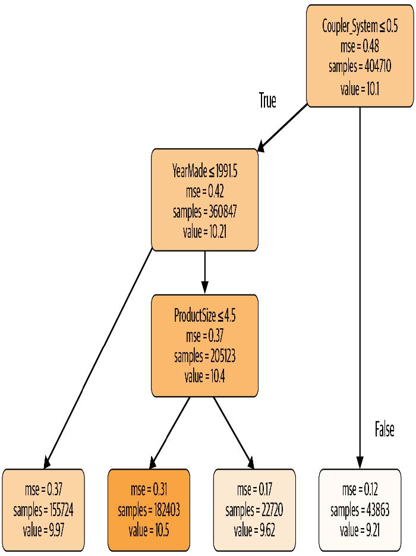

理解这张图是理解决策树的最佳途径之一，因此我们将从顶部开始，逐步解释每个部分。

顶层节点代表尚未进行任何分割时的初始模型，此时所有数据均归属于单一组别。这是最简化的模型形态，相当于未提出任何问题，其预测值始终等同于整个数据集的平均值。在此案例中，该模型对销售价格对数值的预测结果为10.1。其均方误差为0.48，开方后为0.69。（需注意：除非看到 `m_rmse` 即均方根误差，否则所见数值均为开方前的原始值，即差异平方的简单平均值。） 该组共包含404,710条拍卖记录——即训练集总规模。最后显示的信息是最佳分割决策标准，即基于 `coupler_system` 列进行分割。

向下左移，该节点显示当 `coupler_system` 值小于0.5时，共有360,847条设备拍卖记录。该组因变量的平均值为10.21。从初始模型向下右移，则可看到 `coupler_system` 值大于0.5的记录。

底下那行包含我们的叶节点：这些节点没有答案输出，因为已无更多问题待解答。该行最右侧节点包含 `coupler_system` 大于0.5的记录。平均值为9.21，由此可见决策树算法确实找到了一个二元决策点，将高价值拍卖结果与低价值拍卖结果分隔开来。仅依据 `coupler_system` 参数进行预测时，平均值为9.21，而实际值为10.1。

在首个决策点之后回到顶层节点，我们看到基于“ `YearMade` 是否小于等于1991.5”的第二个二元决策分支已建立。对于满足此条件的组（注意，该组已历经基于 `coupler_system` 和 `YearMade` 的两次二分决策），平均值为9.97，包含155,724条拍卖记录。对于该决策为假的拍卖组，平均值为10.4，共计205,123条记录。由此可见，决策树算法再次成功将高价拍卖记录拆分为两个价值差异显著的子组。

我们可使用Terence Parr强大的 [dtreeviz库](https://oreil.ly/e9KrM) 展示相同信息：

```python
samp_idx = np.random.permutation(len(y))[:500]
dtreeviz(m, xs.iloc[samp_idx], y.iloc[samp_idx], xs.columns, dep_var,
         fontname='DejaVu Sans', scale=1.6, label_fontsize=10,
         orientation='LR')
```

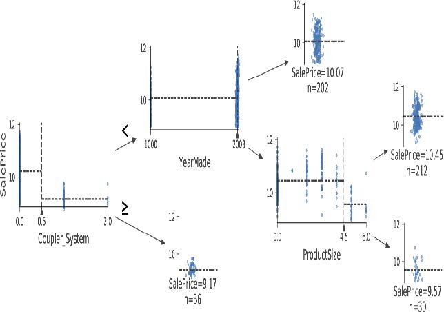

这张图表展示了每个分割点的数据分布情况。我们清晰地看到，我们的 `YearMade` 数据存在问题：竟有生产于公元1000年的推土机！这很可能是缺失值代码（一种在数据中未出现过、用于填补缺失值的占位符）。对于建模而言，1000年值尚可接受，但如图所示，这个异常值会使我们关注的数值更难可视化。因此，让我们将其替换为1950年：

```python
xs.loc[xs['YearMade']<1900, 'YearMade'] = 1950
valid_xs.loc[valid_xs['YearMade']<1900, 'YearMade'] = 1950
```

该调整使树形可视化中的分支更加清晰，尽管它并未显著改变模型的预测结果。这充分展现了决策树对数据问题的强大容错性！

```python
m = DecisionTreeRegressor(max_leaf_nodes=4).fit(xs, y)
dtreeviz(m, xs.iloc[samp_idx], y.iloc[samp_idx], xs.columns, dep_var,
         fontname='DejaVu Sans', scale=1.6, label_fontsize=10,
         orientation='LR')
```

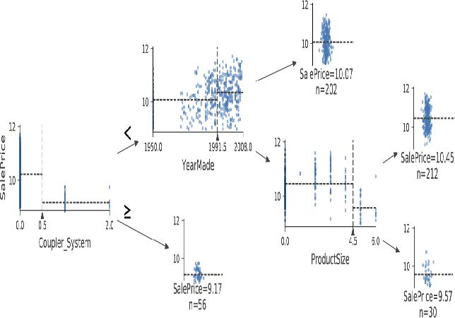

现在让我们让决策树算法构建更大的树。这里我们没有传入任何停止条件，例如 `max_leaf_nodes` ：

```python
m = DecisionTreeRegressor()
m.fit(xs, y);
```

我们将创建一个小函数来检查模型的均方根误差（`m_rmse`），因为这是竞赛的评判标准：

```python
def r_mse(pred,y): return round(math.sqrt(((pred-y)**2).mean()), 6)
def m_rmse(m, xs, y): return r_mse(m.predict(xs), y)
```

```python
m_rmse(m, xs, y)
```

```text
0.0
```

那么，我们的模型完美无缺，对吧？别急……记住，我们必须检查验证集，确保没有过拟合：

```python
m_rmse(m, valid_xs, valid_y)
```

```text
0.337727
```

哎呀——看起来我们可能严重过拟合了。原因如下：

```python
m.get_n_leaves(), len(xs)
```

```text
(340909, 404710)
```

我们的叶节点数量几乎和数据点一样多！这似乎有些过度热情了。确实，sklearn的默认设置允许它持续分割节点，直到每个叶节点只剩一个项目。让我们修改停止规则，要求sklearn确保每个叶节点至少包含25条拍卖记录：

```python
m = DecisionTreeRegressor(min_samples_leaf=25)
m.fit(to.train.xs, to.train.y)
m_rmse(m, xs, y), m_rmse(m, valid_xs, valid_y)
```

```text
(0.248562, 0.32368)
```

这样看起来好多了。我们再检查一下叶片的数量：

```python
m.get_n_leaves()
```

```text
12397
```

现在合理多了！

> ALEXIS说
>
> 以下是我对叶节点数量超过数据项数量的过拟合决策树的直观理解。以“二十问”游戏为例：选择者暗中想象一个物体（如“我们的电视机”），猜谜者则通过提出20个只能用是或否回答的问题来尝试猜出该物体（如“它比面包盒大吗？”）。猜谜者并非预测数值，而是试图从所有可想象的物体集合中识别特定物体。当决策树的叶节点数量超过域中可能对象的总数时，它本质上就是一个训练有素的猜谜者。它已掌握识别训练集中特定数据项所需的问题序列，其“预测”行为仅是描述该项的值。这实质上是记忆训练集的过程——即过拟合。

构建决策树是建立数据模型的有效方法。它具有极高的灵活性，能够清晰处理变量间的非线性关系与交互作用。但我们发现，决策树在泛化能力（通过构建小型树可实现）与训练集准确性（通过使用大型树可实现）之间存在根本性权衡。

那么如何两全其美呢？在处理完一个重要的遗漏细节——如何处理分类变量后，我们将为你揭晓答案。

#### 分类变量

在上一章中，当处理深度学习网络时，我们通过独热编码处理分类变量，并将其输入嵌入层。嵌入层帮助模型发现这些变量不同层级的含义（分类变量的层级本身并无内在意义，除非我们使用Pandas手动指定排序）。在决策树中，我们没有嵌入层——那么未经处理的分类变量是如何在决策树中发挥作用的？例如，产品代码这类变量该如何被利用？

简而言之：它就是管用！设想这样一种情况：某产品代码在拍卖中的价格远高于其他所有代码。此时，任何二元分割都会导致该产品代码被归入某个组别，而该组别的价格必然高于另一组别。因此，我们的简单决策树构建算法会选择这种分割方式。后续训练过程中，算法将能进一步分割包含高价产品代码的子组，随着时间推移，决策树将精准锁定该高价产品。

也可以使用独热编码将单个分类变量替换为多个独热编码列，其中每列代表该变量的一个可能取值。Pandas的 `get_dummies` 方法正是为此而设计。

然而，实际上并无证据表明此类方法能改善最终结果。因此我们通常尽可能避免采用这种做法，因为它最终会使数据集更难处理。2019年，Marvin Wright与Inke König在论文 [《随机森林中分类预测变量的分割》](https://oreil.ly/ojzKJ) 中探讨了这一问题：

> 对于名义型预测变量，标准方法是考虑所有 $2^{k-1}$ 种二元划分方案。然而这种指数级关系会产生大量待评估的潜在分割方案，从而增加计算复杂度，并限制大多数实现方案中可能的类别数量。对于二元分类与回归，研究表明：在每次分割中对预测变量类别进行排序，所得分割结果与标准方法完全一致。这能显著降低计算复杂度——当名义预测变量包含 $k$ 个类别时，仅需考虑 $k − 1$ 种分割方案。

既然你已经理解了决策树的工作原理，现在是时候介绍那个兼具两者优势的解决方案：随机森林。

### 随机森林

1994年，伯克利教授利奥·布雷曼（Leo Breiman）退休一年后发表了一篇名为 [《预测变量袋装法》](https://oreil.ly/6gMuG) 的小型技术报告，该报告最终成为现代机器学习领域最具影响力的思想之一。报告开篇写道：

> 袋装预测器是一种生成多个预测器版本的方法，通过聚合这些版本获得最终预测器。聚合过程对各版本进行平均处理……通过对学习集进行引导抽样复制形成多个版本，并将这些版本作为新的学习集。测试表明……袋装法能显著提升预测精度。关键要素在于预测方法的不稳定性。若扰动学习集能导致构建的预测器发生显著变化，则袋装法可提升准确率。

以下是布雷曼提出的程序：

1. 随机选取数据行中的一个子集（即“学习集的引导法复制”）。
2. 使用该子集训练模型。
3. 保存该模型，然后重复步骤1数次。
4. 由此将获得多个训练模型。进行预测时，使用所有模型进行预测，然后取各模型预测结果的平均值。

该方法称为袋装法（bagging）。其基于一个深刻而重要的洞见：尽管每个基于数据子集训练的模型都会比基于完整数据集训练的模型产生更多错误，但这些错误之间并不存在相关性。不同模型会产生不同的错误。因此这些错误的平均值为零！因此，当模型数量增加时，通过融合所有模型的预测结果，最终得到的预测值将逐渐接近真实答案。这一非凡结论意味着：几乎任何机器学习算法的准确性都能通过多次训练得到提升——每次训练使用数据的不同随机子集，并取其预测结果的平均值。

2001年，布雷曼进一步证明这种建模方法应用于决策树构建算法时尤为强大。他不仅在训练模型时随机选择行数据，更在决策树每次分裂时从列数据子集中随机选取。他将此方法命名为随机森林。如今它或许已成为应用最广泛且实践价值最高的机器学习方法。

本质上，随机森林是一种通过平均大量决策树预测结果的模型，这些决策树通过随机调整各种参数生成——这些参数决定了用于训练树的数据及其他树参数。袋装法是集合学习的一种特定方法，即整合多个模型的结果。为了解其实际运作原理，让我们开始创建自己的随机森林吧！

#### 创建随机森林

我们可以像创建决策树那样创建随机森林，只不过现在还需要指定一些参数，这些参数用于指示森林中应包含多少棵树、如何对数据项（行）进行子集划分，以及如何对字段（列）进行子集划分。

在以下函数定义中，`n_estimators` 指定所需的树数量，`max_samples` 指定每棵树训练时采样的行数，`max_features` 指定每个分裂点采样的列数（其中 `0.5` 表示“取总列数的一半”）。我们还可通过添加前文使用的 `min_samples_leaf` 参数，指定何时停止树节点分裂，从而有效限制树的深度。最后，传递 `n_jobs=-1` 参数告知 sklearn 调用所有 CPU 并行构建决策树。通过创建此类辅助函数，本章后续内容中可更快速地尝试不同参数组合：

```python
def rf(xs, y, n_estimators=40, max_samples=200_000,
       max_features=0.5, min_samples_leaf=5, **kwargs):
    return RandomForestRegressor(n_jobs=-1, n_estimators=n_estimators,
                                 max_samples=max_samples, max_features=max_features,
                                 min_samples_leaf=min_samples_leaf, oob_score=True).fit(xs, y)
```

```python
m = rf(xs, y);
```

我们的验证均方根误差（RMSE）现已显著优于先前使用决策树回归器（`DecisionTreeRegressor`）获得的结果——该模型仅基于全部可用数据构建了一棵决策树：

```python
m_rmse(m, xs, y), m_rmse(m, valid_xs, valid_y)
```

```text
(0.170896, 0.233502)
```

随机森林最重要的特性之一是其对超参数选择，如 `max_features` 的敏感度较低。 `n_estimators` 参数可设置为训练时间允许的最大值——树木数量越多，模型精度越高。`max_samples` 通常可保留默认值，除非数据点超过20万，此时将其设为20万可显著加快训练速度且几乎不影响精度。`max_features=0.5` 和 `min_samples_leaf=4` 通常效果良好，当然sklearn的默认值同样适用。

sklearn文档展示了不同 `max_features` 选项效果的 [示例](https://oreil.ly/E0Och) ，随着树的数量增加。在图中，蓝色曲线使用最少特征，绿色曲线使用最多特征（即全部特征）。如图9-7所示，采用特征子集但树数量较多的模型能获得最低误差率。

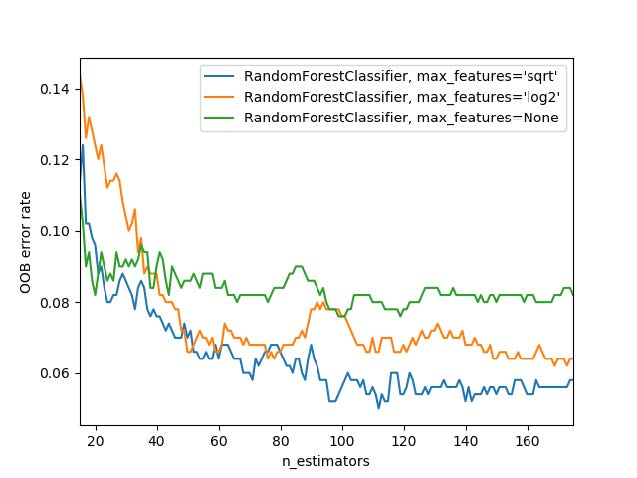

[^图9-7]: 基于最大特征数和树数的误差（来源：https://oreil.ly/E0Och）

要了解 `n_estimators` 参数的影响，让我们获取森林中每棵独立树的预测结果（这些结果存储在 `estimators_` 属性中）：

```python
preds = np.stack([t.predict(valid_xs) for t in m.estimators_])
```

如你所见，`preds.mean(0)` 的结果与我们的随机森林模型完全一致：

```python
r_mse(preds.mean(0), valid_y)
```

```text
0.233502
```

让我们看看随着树的数量不断增加，均方根误差会发生什么变化。如你所见，在达到约30棵树之后，改进幅度明显趋于平缓：

```python
plt.plot([r_mse(preds[:i+1].mean(0), valid_y) for i in range(40)]);
```

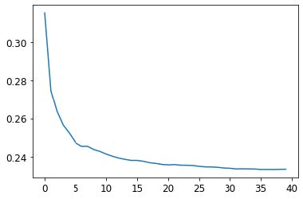

我们在验证集上的表现不如训练集。但这究竟是过度拟合所致，还是因为验证集覆盖了不同的时间段，还是说两者兼而有之？仅凭现有信息，我们无法判断。不过，随机森林有一个非常巧妙的技巧——称为 *袋外误差*（out-of-bag，OOB），它能帮助我们解决这个问题（还有更多问题！）。

#### 袋外误差

请记住，在随机森林中，每棵树都是基于训练数据的不同子集进行训练的。袋外误差是一种通过仅将未参与训练的数据行纳入行误差树的计算中，来衡量训练数据集预测误差的方法。这使我们能够判断模型是否存在过拟合现象，而无需额外的验证集。

> ALEXIS说
>
> 我的直觉是，由于每棵树都是用随机选取的不同行子集训练的，袋外误差有点像想象每棵树因此也拥有自己的验证集。这个验证集就是该树训练时未选中的那些行。

这在训练数据量较少时尤为有益，因为它使我们无需移除数据项创建验证集，即可检验模型是否具备泛化能力。出局预测结果存储于 `oob_prediction_` 属性中。请注意，我们将其与训练标签进行比较，因为该预测是基于训练集构建的决策树计算得出：

```python
r_mse(m.oob_prediction_, y)
```

```text
0.210686
```

我们可以发现，我们的OOB误差远低于验证集误差。这意味着除了正常的泛化误差外，还有其他因素导致了该误差。本章后续部分将探讨其原因。

这是解读模型预测的一种方式——现在让我们更多地关注这些内容。

### 模型解释

对于表格数据，模型解释尤为重要。对于给定模型，我们最可能关注的是以下几点：

- 我们对使用特定数据行进行预测的信心有多大？
- 在使用特定数据行进行预测时，哪些因素最为关键，它们如何影响预测结果？
- 哪些列是最强预测因子，哪些可以忽略？
- 就预测目的而言，哪些列之间存在实质性冗余？
- 当我们调整这些列时，预测结果会如何变化？

正如我们将看到的，随机森林特别适合回答这些问题。让我们从第一个问题开始吧！

#### 预测置信度的树变异性

我们看到模型如何通过平均单棵决策树的预测结果来获得整体预测——即对目标值的估计。但如何判断该估计的置信度？一种简便方法是采用决策树预测结果的标准差，而非仅使用均值。这能反映预测结果的相对置信度。通常我们需要更谨慎地对待预测结果差异显著的行（即标准差较高）——相较于预测结果一致性较高的情况（标准差较低），这类行所呈现的结果更值得警惕。

在 “创建随机森林” 这一节中，我们了解了如何对验证集进行预测，通过Python列表推导式对森林中的每棵树执行此操作：

```python
preds = np.stack([t.predict(valid_xs) for t in m.estimators_])
```

```python
preds.shape
```

```text
(40, 7988)
```

现在我们对验证集中的每棵决策树和每次拍卖都进行了预测（共40棵决策树和7,988次拍卖）。

通过此方法，我们可以计算出所有决策树对每次拍卖的预测结果的标准差：

```python
preds_std = preds.std(0)
```

以下是前五次拍卖预测的标准差——即验证集的前五行：

```python
preds_std[:5]
```

```text
array([0.21529149, 0.10351274, 0.08901878, 0.28374773, 0.11977206])
```

如你所见，预测结果的置信度差异显著。某些拍卖的标准差较低，因为决策树结果一致； 而另一些拍卖的标准差较高，因为树模型之间存在分歧。这些信息在实际应用场景中很有价值；例如，若使用该模型决定拍卖竞标对象，低置信度预测可能促使你在出价前更仔细地考察该物品。

#### 特征重要性

通常仅知道模型能做出准确预测是不够的——我们还想了解其预测机制。*特征重要度*（feature importances） 正提供了这种洞察。通过查看sklearn随机森林模型的 `feature_importances_` 属性，可直接获取这些数据。以下是一个简单函数，可将数据导入DataFrame并进行排序：

```python
def rf_feat_importance(m, df):
    return pd.DataFrame({'cols':df.columns, 'imp':m.feature_importances_}
                       ).sort_values('imp', ascending=False)
```

模型特征重要性分析显示，前几项最重要列的评分远高于其余列，其中（不出所料） `YearMade` 和 `ProductSize` 位居榜首：

```python
fi = rf_feat_importance(m, xs)
fi[:10]
```

| 序号 | 列                 | imp      |
| ---- | ------------------ | -------- |
| 69   | YearMade           | 0.182890 |
| 6    | ProductSize        | 0.127268 |
| 30   | Coupler_System     | 0.117698 |
| 7    | fiProductClassDesc | 0.069939 |
| 66   | ModelID            | 0.057263 |
| 77   | saleElapsed        | 0.050113 |
| 32   | Hydraulics_Flow    | 0.047091 |
| 3    | fiSecondaryDesc    | 0.041225 |
| 31   | Grouser_Tracks     | 0.031988 |
| 1    | fiModelDesc        | 0.031838 |

特征重要性图更清晰地展示了各特征的相对重要性：

```python
def plot_fi(fi):
    return fi.plot('cols', 'imp', 'barh', figsize=(12,7), legend=False)

plot_fi(fi[:30]);
```

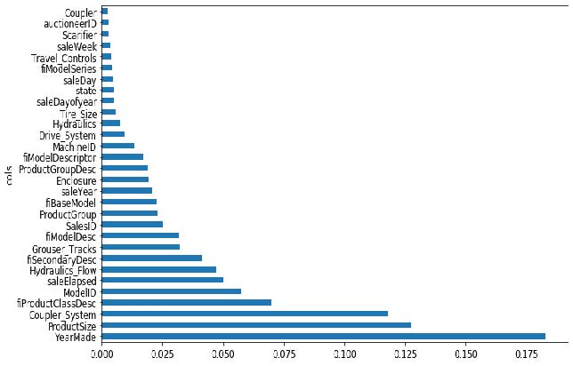

这些重要性的计算方式相当简单而优雅。特征重要性算法遍历每棵树，然后递归探索每个分支。在每个分支处，算法会检查该分支采用的特征以及该分支对模型提升的程度。提升值（按该组数据行数加权）将计入该特征的重要性得分。所有树的所有分支得分相加后，最终通过归一化处理使总和为1。

#### 移除低重要性变量

似乎通过移除重要性较低的变量，我们可以使用列的子集并仍获得良好结果。让我们尝试仅保留特征重要性大于0.005的变量：

```python
to_keep = fi[fi.imp>0.005].cols
len(to_keep)
```

```text
21
```

我们可以仅使用这部分列对模型进行重新训练：

```python
xs_imp = xs[to_keep]
valid_xs_imp = valid_xs[to_keep]
```

```python
m = rf(xs_imp, y)
```

结果如下：

```python
m_rmse(m, xs_imp, y), m_rmse(m, valid_xs_imp, valid_y)
```

```text
(0.181208, 0.232323)
```

我们的准确率大致相当，但需要研究的列数却少得多：

```python
len(xs.columns), len(xs_imp.columns)
```

```text
(78, 21)
```

我们发现，改进模型的第一步通常是简化模型——78个列对我们来说实在太多，无法深入研究每个列！此外，在实践中，更简单、更易解释的模型往往更容易部署和维护。

这也使得我们的特征重要性图更易于解读。让我们再看一遍：

```python
plot_fi(rf_feat_importance(m, xs_imp));
```

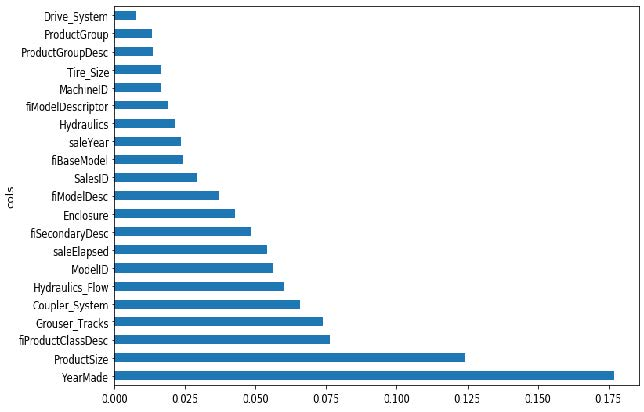

使解读更困难的一点在于，似乎存在一些含义极为相似的变量：例如 `ProductGroup` 和 `ProductGroupDesc` 。让我们尝试移除任何冗余特征。

#### 移除冗余功能

让我们从这里开始：

```python
cluster_columns(xs_imp)
```

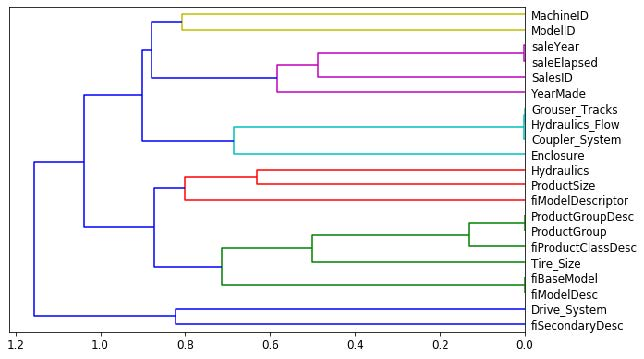

在此图表中，相似度最高的列对是那些在早期就合并在一起的，远离左侧树状图的“根节点”。不出所料，字段 `ProductGroup` 和 `ProductGroupDesc` 在早期就已合并，`saleYear `与 `saleElapsed` 、 `fiModelDesc` 与 `fiBaseModel` 亦是如此。这些字段可能相关性极高，几乎可以视为彼此的同义词。

> 相似性判定
>
> 通过计算等级相关系数可找出最相似的配对，这意味着所有数值均被替换为其等级（即该列中的第一、第二、第三等序位），随后再计算相关系数。（不过你大可忽略这个细节，因为本书后续内容不会再提及！）

让我们尝试移除部分密切相关的特征，看看能否在不影响准确率的前提下简化模型。首先创建一个函数，通过降低 `max_samples` 参数值并提高 `min_samples_leaf` 参数值，快速训练随机森林并返回OOB评分。OOB评分是sklearn返回的数值，取值范围从完美模型的1.0到随机模型的0.0（在统计学中称为R，但具体细节对本说明不重要）。我们不需要它非常精确——仅将其用于比较不同模型，这些模型是通过移除部分可能冗余的列生成的。

```python
def get_oob(df):
    m = RandomForestRegressor(n_estimators=40, min_samples_leaf=15,
                              max_samples=50000, max_features=0.5, n_jobs=-1, oob_score=True)
    m.fit(df, y)
    return m.oob_score_
```

以下是我们设定的基准：

```python
get_oob(xs_imp)
```

```text
0.8771039618198545
```

现在我们尝试逐个移除可能冗余的变量：

```python
{c:get_oob(xs_imp.drop(c, axis=1)) for c in (
    'saleYear', 'saleElapsed', 'ProductGroupDesc','ProductGroup',
    'fiModelDesc', 'fiBaseModel',
    'Hydraulics_Flow','Grouser_Tracks', 'Coupler_System')}
```

```text
{'saleYear': 0.8759666979317242,
'saleElapsed': 0.8728423449081594,
'ProductGroupDesc': 0.877877012281002,
'ProductGroup': 0.8772503407182847,
'fiModelDesc': 0.8756415073829513,
'fiBaseModel': 0.8765165299438019,
'Hydraulics_Flow': 0.8778545895742573,
'Grouser_Tracks': 0.8773718142788077,
'Coupler_System': 0.8778016988955392}
```

现在我们尝试删除多个变量。我们将从之前观察到的紧密对齐的变量对中各删除一个。让我们看看会发生什么：

```python
to_drop = ['saleYear', 'ProductGroupDesc', 'fiBaseModel',
           'Grouser_Tracks']
get_oob(xs_imp.drop(to_drop, axis=1))
```

```text
0.8739605718147015
```

看起来不错！这其实比包含所有字段的模型差不了多少。让我们创建不含这些列的数据框，并保存它们：

```python
xs_final = xs_imp.drop(to_drop, axis=1)
valid_xs_final = valid_xs_imp.drop(to_drop, axis=1)
(path/'xs_final.pkl').save(xs_final)
(path/'valid_xs_final.pkl').save(valid_xs_final)
```

我们可以稍后再重新加载它们：

```python
xs_final = (path/'xs_final.pkl').load()
valid_xs_final = (path/'valid_xs_final.pkl').load()
```

现在我们可以再次检查均方根误差，以确认精度没有发生显著变化：

```python
m = rf(xs_final, y)
m_rmse(m, xs_final, y), m_rmse(m, valid_xs_final, valid_y)
```

```text
(0.183263, 0.233846)
```

通过聚焦最重要的变量并剔除部分冗余变量，我们大幅简化了模型。现在，让我们借助偏依赖图观察这些变量如何影响预测结果。

#### 部分依赖

正如我们所见，最重要的两个预测变量是 `ProductSize` 和 `YearMade` 。我们希望理解这些预测变量与销售价格之间的关系。首先检查各类别值的计数（通过Pandas的`value_counts` 方法提供）是个好主意，这样可以了解每个类别的常见程度：

```python
p = valid_xs_final['ProductSize'].value_counts(sort=False).plot.barh()
c = to.classes['ProductSize']
plt.yticks(range(len(c)), c);
```

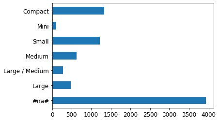

最大的组是`#na#`，这是fastai对缺失值应用的标签。

现在我们对 `YearMade` 做同样的处理。由于这是个数值特征，我们需要绘制直方图，将年份值分组到几个离散区间中：

```python
ax = valid_xs_final['YearMade'].hist()
```

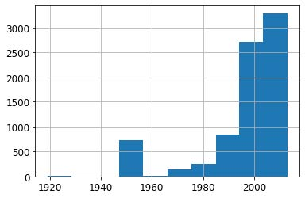

除特殊值1950（用于编码缺失年份值）外，大部分数据均来自1990年之后。

现在我们可以开始分析部分依赖图（partial dependence plots）了。部分依赖图试图回答以下问题：如果某行数据仅受该特征影响而变化，它将如何影响因变量？

例如，在其他条件不变的情况下， `YearMade` 如何影响销售价格？要回答这个问题，我们不能简单地取每个生产年份的平均销售价格。这种方法的问题在于，许多其他因素也会逐年变化，例如销售的产品种类、配备空调的产品数量、通货膨胀率等等。因此，单纯对所有同年份拍卖进行平均计算，实际上也包含了其他所有变量随生产年份变化所产生的影响，以及这些综合变化对价格造成的整体影响。

相反，我们采取的做法是将 `YearMade` 列中的每个数值全部替换为1950，随后为每场拍卖计算预测售价，并取所有拍卖的平均值。接着依次对1951年、1952年等年份重复此操作，直至最终年份2011年。此举可纯粹孤立 `YearMade` 的影响（即便实现方式是通过对某些虚拟记录取平均值——这些记录被赋予了可能实际不存在的生产年份值，且该值可能与其他字段值并存）。

> ALEXIS说
>
> 若你具有哲学思维，思考我们为完成这项计算而同时处理的各种假设性情境时，难免会感到头晕目眩。首先，所有预测本身都具有假设性，因为我们并非记录经验数据。其次，我们关注的重点并非单纯探究当改变生产年份并同时改变其他所有变量时，售价会如何变化。我们真正探究的是：在仅改变年份的假想情境中，售价将如何变化。哎呀！能提出如此问题实属不易。如果你想深入探索分析这些微妙现象的正式方法，我推荐 Judea Pearl 与 Dana Mackenzie 近期合著的因果关系专著《为什么之书》（Basic Books出版）。

利用这些平均值，我们可以在x轴上绘制每年数据，在y轴上绘制每个预测值。最终得到的就是部分依赖图。让我们来看看：

```python
from sklearn.inspection import plot_partial_dependence
fig,ax = plt.subplots(figsize=(12, 4))
plot_partial_dependence(m, valid_xs_final, ['YearMade','ProductSize'],
                        grid_resolution=20, ax=ax);
```

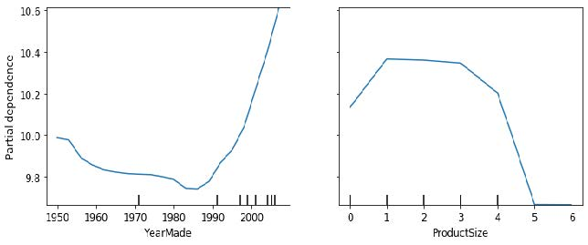

首先观察 `YearMade` 图，特别是1990年后的部分（正如我们所指出的，该时段数据最为丰富），可见年份与价格之间存在近乎线性的关系。需注意我们的因变量是经对数转换后的结果，这意味着实际价格呈现指数级增长。此现象符合预期：折旧通常被视为随时间推移的乘法因子，因此对于特定销售日期，生产年份的变化应与销售价格呈现指数关系。

`ProductSize` 部分图略显令人担忧。它显示最后一个组别（我们看到该组别对应缺失值）具有最低价格。若要在实践中运用这一洞察，我们需要探究缺失值频现的原因及其背后的含义。缺失值有时可成为有用的预测变量——这完全取决于导致缺失的原因。但某些情况下，它们也可能暗示数据泄露（Data Leakage）问题。

#### 数据泄露

在论文 [《数据挖掘中的泄露：定义、检测与规避》](https://oreil.ly/XwvYf) 中，Shachar Kaufman等人将泄露描述如下：

> 在数据挖掘问题中引入目标对象的相关信息，而这些信息本不应被合法获取用于挖掘。一个简单的泄露示例是模型将目标对象本身作为输入，从而得出诸如“下雨天会下雨”的结论。实际操作中，此类非法信息的引入往往是无意的，且常因数据收集、聚合与预处理过程而助长。

他们举例说明：

> IBM曾实施过一个真实的商业智能项目，该项目通过分析潜在客户网站上的关键词等信息，识别出特定产品的潜在客户。该方法最终被认定为信息泄露，因为用于训练的网站内容采样时间点恰逢潜在客户已转为正式客户，且网站中残留着所购IBM产品的痕迹——例如“Websphere”一词（常见于采购公告或客户使用的特定产品功能说明中）。

数据泄露具有隐蔽性，且可能以多种形式出现。尤其值得注意的是，缺失值往往代表着数据泄露。

例如，杰里米参加了一场旨在预测哪些研究人员最终会获得研究资助的Kaggle竞赛。数据由某所大学提供，包含数千个研究项目的实例，以及相关研究人员的背景信息和每项资助申请最终是否获批的数据。该大学希望利用竞赛中开发的模型对资助申请进行成功概率排序，从而优化审批流程。

杰里米使用随机森林对数据进行建模，随后通过特征重要性分析确定了最具预测价值的特征。他发现了三个令人惊讶的现象：

- 该模型能够在95%以上的情况下准确预测谁将获得资助。
- 看似毫无意义的标识符列竟成为最重要的预测因子。
- 星期几和年内的日期列也具有很高的预测能力；例如，绝大多数提交日期为周日的资助申请均获批准，而许多获批的资助申请提交日期均为1月1日。

对于标识符列，部分依赖图显示当信息缺失时，申请几乎总是被拒绝。实践中发现，大学往往在资助申请获批后才填写这些信息。对于未获批的申请，这些字段通常直接留空。因此，这些信息在收到申请时本就不存在，也无法用于构建预测模型——这属于数据泄露。

同样地，成功申请的最终处理通常在周末或年末以批处理方式自动完成。最终处理日期最终被记录在数据中，因此尽管该信息具有预测性，但在收到申请时实际上并不可用。

本示例展示了识别数据泄露最实用且简单的做法，即构建模型后执行以下步骤：

- 检查模型准确性是否好得令人难以置信。
- 寻找在实践中毫无意义的重要预测变量。
- 寻找在实践中毫无意义的部分依赖图结果。

回想我们设计的熊探测器，这恰恰印证了我们在第2章提出的建议——通常先构建模型再进行数据清理是明智之举，而非反其道而行。模型能帮助你识别潜在的数据问题。

它还能借助树解释器（树解释器），帮助你识别哪些因素影响特定预测。

#### 树解释器

在本节开头，我们提到希望能够回答五个问题：

- 我们对使用特定数据行进行预测的信心有多大？
- 在使用特定数据行进行预测时，哪些因素最为关键，它们如何影响预测结果？
- 哪些列是预测能力最强的变量？
- 哪些列在预测过程中彼此之间存在实质性冗余？
- 当我们调整这些列时，预测结果会如何变化？

我们已经处理了其中四个问题，只剩下第二个问题尚未解决。要回答这个问题，我们需要使用 `treeinterpreter` 库。同时，我们将借助 `waterfallcharts` 库绘制结果图表。您可以在笔记本单元格中运行以下命令安装这些库：

```bash
!pip install treeinterpreter
!pip install waterfallcharts
```

我们已经了解了如何计算整个随机森林中特征的重要性。基本思路是观察每个变量在每棵树的每个分支中对模型改进的贡献，然后将每个变量的所有贡献相加。

我们完全可以做同样的事情，但仅针对单行数据。例如，假设我们正在关注拍卖中的某件物品。模型可能预测该物品价格将非常高昂，而我们想知道原因。因此，我们提取该单行数据，将其输入第一棵决策树，观察树中每个节点使用的分割方式。针对每次分割，我们计算相较于树的父节点，该变量在分割点的重要性增减值。对所有决策树重复此过程，最终累加所有分割变量的重要性变化总量。

例如，让我们选取验证集的前几行：

```python
row = valid_xs_final.iloc[:5]
```

然后我们可以将这些传递给 `treeinterpreter`：

```python
prediction,bias,contributions = treeinterpreter.predict(m, row.values)
```

`prediction` 即随机森林的预测结果。 `bias` 是基于因变量均值的预测值（即每棵树的根节点模型）。 `contributions` 最为关键——它揭示了每个自变量导致的预测值总变化量。因此，每行数据中 `contributions` 与 `bias` 之和必须等于 `prediction` 。让我们仅关注第一行：

```python
prediction[0], bias[0], contributions[0].sum()
```

```text
(array([9.98234598]), 10.104309759725059, -0.12196378442186026)
```

最清晰的贡献展示方式是采用瀑布图。它呈现了所有自变量的正负贡献如何累加形成最终预测值——即此处右侧标注为“净值”的列：

```python
waterfall(valid_xs_final.columns, contributions[0], threshold=0.08,
          rotation_value=45,formatting='{:,.3f}');
```

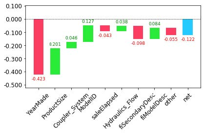

此类信息在生产环境中最为有用，而非模型开发阶段。你可以利用它向数据产品的用户提供有价值的信息，说明预测背后的基本推理过程。

既然我们已经介绍了若干经典机器学习技术来解决这个问题，现在让我们看看深度学习能带来怎样的突破！

### 外推与神经网络

随机森林与所有机器学习或深度学习算法一样，存在一个问题：它们对新数据的泛化能力并不总是理想。我们将探讨在哪些情况下神经网络能实现更好的泛化，但首先让我们看看随机森林面临的外推问题，以及它们如何帮助识别域外数据。

#### 外推问题

让我们考虑一个简单的任务：根据40个数据点进行预测，这些数据点显示出一个略带噪声的线性关系：

```python
x_lin = torch.linspace(0,20, steps=40)
y_lin = x_lin + torch.randn_like(x_lin)
plt.scatter(x_lin, y_lin);
```

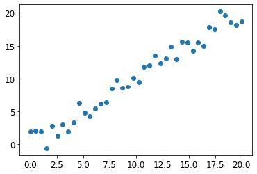

尽管我们只有一个独立变量，sklearn期望的是一个独立变量矩阵，而非单个向量。因此我们需要将向量转换为单列矩阵，即把形状从 `[40]` 改为 `[40,1]` 。实现方式之一是使用 `unsqueeze` 方法，该方法会在张量指定维度添加新的单位轴：

```python
xs_lin = x_lin.unsqueeze(1)
x_lin.shape,xs_lin.shape
```

```text
(torch.Size([40]), torch.Size([40, 1]))
```

更灵活的方法是使用特殊值 `None` 对数组或张量进行切片，这会在该位置引入一个额外的单位轴：

```python
x_lin[:,None].shape
```

```text
torch.Size([40, 1])
```

现在我们可以为这组数据创建随机森林模型。我们将仅使用前30行数据来训练模型：

```python
m_lin = RandomForestRegressor().fit(xs_lin[:30],y_lin[:30])
```

然后我们将使用完整数据集对模型进行测试。蓝色点代表训练数据，红色点代表预测结果：

```python
plt.scatter(x_lin, y_lin, 20)
plt.scatter(x_lin, m_lin.predict(xs_lin), color='red', alpha=0.5);
```

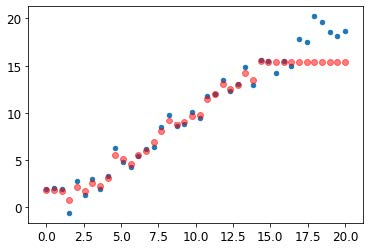

我们遇到大麻烦了！在训练数据覆盖范围之外的预测结果都偏低。你认为这是为什么呢？

请记住，随机森林只是对多棵决策树的预测结果进行平均。而单棵决策树仅预测叶节点中行数据的平均值。因此，无论是单棵决策树还是随机森林，都无法预测超出训练数据范围的值。对于反映时间趋势的数据（如通货膨胀）而言，这种特性尤为棘手——当你试图预测未来时点时，预测结果将系统性地偏低。

但问题不仅限于时间变量。从更普遍的意义上说，随机森林无法对未见过的数据类型进行外推。因此我们必须确保验证集不包含域外数据。

#### 发现域外数据

有时很难判断测试集是否与训练数据具有相同的分布特性，或者若存在差异，哪些列反映了这种差异。其实有个简单的方法可以解决这个问题——使用随机森林！

但在本例中，我们并非使用随机森林来预测实际的因变量，而是尝试预测某行数据属于验证集还是训练集。为直观展示这一过程，我们将训练集与验证集合并，创建一个表示每行数据所属数据集的因变量，基于该数据构建随机森林，并获取其特征重要性：

```python
df_dom = pd.concat([xs_final, valid_xs_final])
is_valid = np.array([0]*len(xs_final) + [1]*len(valid_xs_final))

m = rf(df_dom, is_valid)
rf_feat_importance(m, df_dom)[:6]
```

| 序号 | 列          | imp      |
| ---- | ----------- | -------- |
| 5    | saleElapsed | 0.859446 |
| 9    | SalesID     | 0.119325 |
| 13   | MachineID   | 0.014259 |
| 0    | YearMade    | 0.001793 |
| 8    | fiModelDesc | 0.001740 |
| 11   | Enclosure   | 0.000657 |

这表明训练集与验证集之间存在三列显著差异：`saleElapsed`、`SalesID` 和 `MachineID`。`saleElapsed` 的差异原因显而易见：该字段记录数据集起始时间与每行数据之间的天数，因此直接编码了日期信息。`SalesID` 的差异则表明拍卖销售的标识符可能随时间递增。`MachineID` 则表明，这些拍卖中售出的单件商品可能也存在类似情况。

让我们先获取原始随机森林模型的均方根误差基准值，然后依次评估移除每列数据的影响：

```python
m = rf(xs_final, y)
print('orig', m_rmse(m, valid_xs_final, valid_y))

for c in ('SalesID','saleElapsed','MachineID'):
    m = rf(xs_final.drop(c,axis=1), y)
    print(c, m_rmse(m, valid_xs_final.drop(c,axis=1), valid_y))
```

```text
orig 0.232795
SalesID 0.23109
saleElapsed 0.236221
MachineID 0.233492
```

看起来我们可以移除 `SalesID` 和 `MachineID` 而不影响准确性。让我们来验证一下：

```python
time_vars = ['SalesID','MachineID']
xs_final_time = xs_final.drop(time_vars, axis=1)
valid_xs_time = valid_xs_final.drop(time_vars, axis=1)

m = rf(xs_final_time, y)
m_rmse(m, valid_xs_time, valid_y)
```

```text
0.231307
```

移除这些变量后，模型的准确性略有提升；但更重要的是，这将增强模型随时间推移的稳健性，并使其更易于维护和理解。我们建议对所有数据集都尝试构建一个以 `is_valid` 作为因变量的模型（正如我们在此处的做法）。这种方法往往能揭示那些可能被忽略的细微领域偏移问题。

在我们这种情况下，一个可能有帮助的方法就是直接避免使用旧数据。旧数据往往显示出已经不再成立的关系。让我们尝试只使用最近几年的数据：

```python
xs['saleYear'].hist();
```

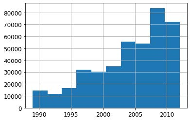

以下是针对该子集训练的结果：

```python
filt = xs['saleYear']>2004
xs_filt = xs_final_time[filt]
y_filt = y[filt]
```

```python
m = rf(xs_filt, y_filt)
m_rmse(m, xs_filt, y_filt), m_rmse(m, valid_xs_time, valid_y)
```

```text
(0.17768, 0.230631)
```

情况略有好转，这说明不必总是使用全部数据集；有时子集反而效果更佳。

让我们看看使用神经网络是否会有帮助。

#### 使用神经网络

我们可以采用相同的方法构建神经网络模型。首先，让我们复现创建 `TabularPandas` 对象时所采取的步骤：

```python
df_nn = pd.read_csv(path/'TrainAndValid.csv', low_memory=False)
df_nn['ProductSize'] = df_nn['ProductSize'].astype('category')
df_nn['ProductSize'].cat.set_categories(sizes, ordered=True,
inplace=True)
df_nn[dep_var] = np.log(df_nn[dep_var])
df_nn = add_datepart(df_nn, 'saledate')
```

我们可以利用在随机森林中剔除多余列的工作成果，通过为神经网络使用相同的列集来实现：

```python
df_nn_final = df_nn[list(xs_final_time.columns) + [dep_var]]
```

与决策树方法相比，神经网络对分类列的处理方式截然不同。正如我们在第8章所见，在神经网络中处理分类变量的一种绝佳方式是使用嵌入。创建嵌入时，fastai需要确定哪些列应被视为分类变量。它通过比较变量中不同层级的数量与 `max_card` 参数的值来实现：若前者较小，fastai将把该变量视为分类变量。嵌入维度超过10,000时，通常应在测试过更优分组方案后再使用，因此我们将 `max_card` 值设为9,000：

```python
cont_nn,cat_nn = cont_cat_split(df_nn_final, max_card=9000,
dep_var=dep_var)
```

然而，在此情况下，存在一个我们绝对不应将其视为分类变量的变量：`saleElapsed`。根据定义，分类变量无法推断其已知值域之外的情况，但我们需要预测未来的拍卖成交价格。因此，我们必须将其转化为连续变量：

```python
cont_nn.append('saleElapsed')
cat_nn.remove('saleElapsed')
```

让我们来看看我们目前选定的每个分类变量的基数：

```python
df_nn_final[cat_nn].nunique()
```

```text
YearMade 73
ProductSize 6
Coupler_System 2
fiProductClassDesc 74
ModelID 5281
Hydraulics_Flow 3
fiSecondaryDesc 177
fiModelDesc 5059
ProductGroup 6
Enclosure 6
fiModelDescriptor 140
Drive_System 4
Hydraulics 12
Tire_Size 17
dtype: int64
```

设备“型号”相关的两个变量均具有极高的基数，这表明它们可能包含相似且冗余的信息。需注意的是，在分析冗余特征时未必能发现此类情况，因为该分析依赖于相似变量按相同顺序排列（即它们需要具有相似命名的层级）。若某列包含5,000个层级，则嵌入矩阵需容纳5,000列，若可能应尽量避免这种情况。让我们观察移除其中一个模型列对随机森林的影响：

```python
xs_filt2 = xs_filt.drop('fiModelDescriptor', axis=1)
valid_xs_time2 = valid_xs_time.drop('fiModelDescriptor', axis=1)
m2 = rf(xs_filt2, y_filt)
m_rmse(m, xs_filt2, y_filt), m_rmse(m2, valid_xs_time2, valid_y)
```

```text
(0.176706, 0.230642)
```

影响微乎其微，因此我们将将其从神经网络的预测变量中移除：

```python
cat_nn.remove('fiModelDescriptor')
```

我们可以像创建随机森林时那样创建 `TabularPandas` 对象，但需要添加一个非常重要的步骤：归一化。随机森林无需任何归一化——树构建过程只关注变量中值的顺序，完全不关心它们的缩放比例。但正如我们所见，神经网络确实会关注这一点。因此在构建 `TabularPandas` 对象时，我们需添加 `Normalize` 处理器：

```python
procs_nn = [Categorify, FillMissing, Normalize]
to_nn = TabularPandas(df_nn_final, procs_nn, cat_nn, cont_nn,
                      splits=splits, y_names=dep_var)
```

表格模型和数据通常不需要太多GPU内存，因此我们可以使用更大的批量大小：

```python
dls = to_nn.dataloaders(1024)
```

正如我们讨论过的，为回归模型设置 `y_range` 是个好主意，因此让我们找到因变量的最小值和最大值：

```python
y = to_nn.train.y
y.min(),y.max()
```

```text
(8.465899897028686, 11.863582336583399)
```

现在我们可以创建 `Learner` 来构建这个表格模型。照例，我们使用应用程序专属的学习器函数，以利用其应用程序定制的默认设置。我们将损失函数设为均方误差（MSE），因为这是本次竞赛采用的标准。

默认情况下，对于表格数据，fastai会创建一个包含两个隐藏层的神经网络，分别具有200和100个激活单元。对于小型数据集而言效果良好，但本例数据集规模较大，因此我们将层大小调整为500和250：

```python
from fastai.tabular.all import *
```

```python
learn = tabular_learner(dls, y_range=(8,12), layers=[500,250],
                        n_out=1, loss_func=F.mse_loss)
```

```python
learn.lr_find()
```

```text
(0.005754399299621582, 0.0002754228771664202)
```

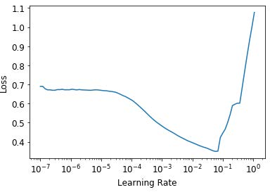

无需使用 `fine_tune`，我们将用 `fit_one_cycle` 训练几个迭代轮次，看看效果如何：

```python
learn.fit_one_cycle(5, 1e-2)
```

| 迭代轮次 | 训练损失 | 验证损失 | 时间  |
| -------- | -------- | -------- | ----- |
| 0        | 0.069705 | 0.062389 | 00:11 |
| 1        | 0.056253 | 0.058489 | 00:11 |
| 2        | 0.048385 | 0.052256 | 00:11 |
| 3        | 0.043400 | 0.050743 | 00:11 |
| 4        | 0.040358 | 0.050986 | 00:11 |

我们可以使用 `r_mse` 函数将结果与之前获得的随机森林结果进行比较：

```python
preds,targs = learn.get_preds()
r_mse(preds,targs)
```

```text
0.2258
```

它比随机森林模型要好得多（尽管训练时间更长，且对超参数调优的要求更严格）。

在继续之前，让我们先保存模型，以防日后需要再次使用：

```python
learn.save('nn')
```

> FASTAI 的表格类
>
> 在fastai中，表格模型本质上是一种接收连续型或分类型数据列，并预测类别（分类模型）或连续值（回归模型）的模型。分类型自变量会经过嵌入处理并进行拼接——正如我们在协同过滤中使用的神经网络所见——随后连续型变量也会进行拼接。
>
> 在 `tabular_learner` 中创建的模型是 `TabularModel` 类的对象。现在查看 `tabular_learner` 的源代码（请记住，在 Jupyter 中它被称为 `tabular_learner??`）。你会发现它与 `collab_learner` 类似，首先调用 `get_emb_sz` 计算合适的嵌入维度（可通过 `emb_szs` 参数覆盖设置，该参数是一个字典，包含需要手动设置维度的列名），并设置其他默认值。除此之外，它会创建  `TabularModel` 并将其传递给 `TabularLearner`（注意 `TabularLearner` 与 `Learner` 完全相同，仅 `predict` 方法经过定制）。
>
> 这意味着所有工作实际上都在 `TabularModel` 中完成，现在请查看该类的源代码。除了 `BatchNorm1d` 和 `Dropout` 层（我们稍后将学习）之外，你现在已掌握理解整个类的必要知识。请回顾上一章末尾关于 `EmbeddingNN` 的讨论。请回想它向 `TabularModel` 传递了 `n_cont=0` 参数。现在我们明白原因所在：因为连续变量数量为零（在fastai中，`n_` 前缀表示“数量”，`cont` 是“连续”（continuous”）的缩写）。

另一种有助于泛化的方法是使用多个模型并对其预测结果取平均值——正如前文所述，这种技术被称为集成（ensembling）。

### 集成

复习一下随机森林效果卓越的原始原理：每棵树都存在误差，但这些误差彼此无关联，因此当树的数量足够多时，误差的平均值应趋近于零。类似的逻辑同样适用于考虑对采用不同算法训练的模型进行预测平均。

在我们的案例中，存在两种训练算法截然不同的模型：随机森林与神经网络。合理推测这两种模型产生的错误类型应有显著差异。因此，我们可预期其预测结果的平均值将优于任一模型的单独预测。

正如我们之前所见，随机森林本身就是一种集成方法。但我们可以将随机森林纳入另一个集成模型——由随机森林和神经网络组成的集成模型！虽然集成方法并不能决定建模过程的成败，但它确实能为已构建的模型提供额外的提升效果。

我们需要注意的一个小问题是，PyTorch模型和sklearn模型生成的数据类型不同：PyTorch提供的是2阶张量（列矩阵），而NumPy提供的是1阶数组（向量）。`squeeze` 会移除张量中所有单位轴，`to_np` 则将其转换为NumPy数组：

```python
rf_preds = m.predict(valid_xs_time)
ens_preds = (to_np(preds.squeeze()) + rf_preds) /2
```

这使我们获得了比任何单一模型单独运行时更优的结果：

```python
r_mse(ens_preds,valid_y)
```

```text
0.22291
```

事实上，这个结果比Kaggle排行榜上显示的任何分数都要好。不过，由于Kaggle排行榜使用的是我们无法获取的独立数据集，因此无法直接比较。Kaggle不允许我们提交到这个旧竞赛中以了解我们的表现如何，但我们的结果无疑令人鼓舞！

#### 增强

迄今为止，我们采用的集成方法是袋装法（bagging），该方法通过取平均值的方式整合多个模型（每个模型在不同的数据子集上训练）。正如我们所见，当这种方法应用于决策树时，就被称为随机森林。

另一种重要的集成方法称为增强法（boosting），其中我们添加模型而非对它们取平均值。提升法的工作原理如下：

1. 训练一个对数据集拟合不足的小型模型。
2. 计算该模型在训练集上的预测值。
3. 将预测值从目标值中减去；这些差值称为残差（residuals），代表训练集中每个点的误差。

4. 返回步骤1，但不再使用原始目标值，而是将残差作为训练目标。

5. 重复此过程直至满足停止条件，例如达到最大树数，或验证集误差开始恶化。

采用这种方法，每棵新树都将尝试拟合所有先前树的残差总和。由于我们通过将新树的预测值从前一树的残差中减去来持续生成新的残差，因此残差值将越来越小。

要使用增强树集成法进行预测，我们得先计算每棵树的预测值，然后将它们全部相加。遵循此基本方法的模型众多，且同一模型常有不同称谓。梯度提升机（Gradient boosting machines，GBM）和梯度提升决策树（gradient boosted decision trees，GBDT）是最常见的术语，亦可能见到具体实现库的名称；撰写本文时，XGBoost是最流行的实现库。

请注意，与随机森林不同，这种方法无法防止过拟合。在随机森林中增加树的数量不会导致过拟合，因为每棵树都是独立的。但在提升式集成中，树的数量越多，训练误差就越好，最终会在验证集上出现过拟合现象。

我们在此不会详细探讨如何训练梯度提升树集成模型，因为该领域发展日新月异，任何指导在您阅读本文时几乎都已过时。撰写本文时，sklearn刚新增了 `HistGradientBoostingRegressor` 类，其性能表现卓越。该类（以及我们所见的所有梯度提升树方法）存在大量需调整的超参数。与随机森林不同，梯度提升树对超参数选择极为敏感；实践中多数人采用循环遍历超参数区间的方法来寻找最优参数。

另一种效果显著的技术是在机器学习模型中使用神经网络学习到的嵌入。

#### 将嵌入与其他方法结合

本章开头提及的实体嵌入论文摘要指出："当训练好的神经网络生成的嵌入作为输入特征使用时，能显著提升所有测试机器学习方法的性能。"该摘要包含了图9-8所示的极具价值的表格。

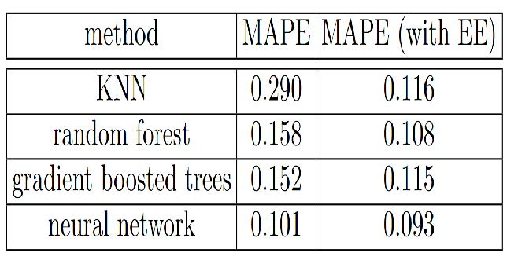

[^图9-8]: 将神经网络嵌入作为其他机器学习方法输入的影响（由Cheng Guo和Felix Berkhahn提供）

此处展示了四种建模技术之间的平均百分比误差（mean average percent error，MAPE）对比，其中三种我们已有所了解，另有一种是k-最近邻（k-nearest
neighbors，KNN）——一种极为简单的基准方法。第一列数值展示了在竞赛数据集上直接应用各方法的结果；第二列则呈现了先用分类嵌入训练神经网络，再将这些嵌入替换原始分类列进行建模的效果。可见所有情况下，采用嵌入数据而非原始分类数据都显著提升了模型性能。

这是一个非常重要的结果，因为它表明在推理阶段无需使用神经网络，就能获得神经网络的大部分性能提升。只需使用嵌入（本质上只是数组查找）配合小型决策树集成即可实现。

这些嵌入甚至不必为组织中的每个模型或任务单独学习。相反，一旦为特定任务的某列数据学习到一组嵌入，它们就可以存储在中央位置并被多个模型复用。事实上，通过与大型企业其他从业者的私下交流，我们了解到这种做法已在许多地方得到应用。

### 总结

我们探讨了两种表格建模方法：决策树集成与神经网络。同时提及了两种决策树集成方法：随机森林与梯度提升机。每种方法都有效，但也需要权衡取舍：

- 随机森林是最易训练的模型，因为它们对超参数选择具有极强的鲁棒性，且几乎不需要预处理。训练速度快，只要构建足够多的树就不会过拟合。但其准确性可能稍逊一筹，尤其在需要外推的情况下，例如预测未来时间段。
- 梯度提升机理论上与随机森林训练速度相当，但实践中需反复尝试超参数。其可能出现过拟合，但通常比随机森林更精准。
- 神经网络训练耗时最长，且需要额外预处理（如归一化），该归一化操作在推理阶段也需保持一致。若能谨慎调整超参数并避免过拟合，神经网络可提供卓越结果并具备良好外推能力。

我们建议从随机森林模型开始分析。这将为您提供一个坚实的基准，您可以确信这是合理的起点。随后可利用该模型进行特征选择和局部依赖性分析，从而更深入地理解你的数据。

在此基础上，你可以尝试神经网络和梯度提升模型。若它们能在合理时间内显著提升验证集效果，即可采用。如果决策树集成效果良好，可尝试向数据中添加分类变量的嵌入向量，观察是否能提升决策树的学习效果。

### 问卷调查

1. 什么是连续变量？
2. 什么是分类变量？
3. 请列举两个用于表示分类变量可能取值的术语。
4. 什么是密集层？
5. 实体嵌入如何减少内存使用并加速神经网络？
6. 实体嵌入对哪些类型的数据集特别有用？
7. 机器学习算法主要分为哪两大类？
8. 为何某些分类列需要特殊排序？如何在Pandas中实现？

9. 概述决策树算法的工作原理。
10. 日期变量为何不同于常规分类或连续变量？如何预处理使其适用于模型？
11. 在推土机竞赛中是否应随机选择验证集？若不应，应选择何种验证集？
12. 什么是pickle？它的用途是什么？
13. 本章绘制的决策树中，`mse`、`samples` 和 `values` 如何计算？
14. 构建决策树前如何处理异常值？
15. 决策树中如何处理分类变量？
16. 什么是袋装法？
17. 创建随机森林时，`max_samples` 与 `max_features` 有何区别？
18. 若将 `n_estimators` 设为极高值，是否可能导致过拟合？原因何在？
19. 在“创建随机森林”章节中，图9-7之后为什么 `preds.mean(0)` 与随机森林结果一致？
20. 什么是袋外误差？
21. 列举模型验证集误差可能高于出树误差的原因。如何验证这些假设？
22. 解释随机森林为何能有效解答下列问题：
    - 使用特定数据行进行预测时，我们对预测结果的置信度如何？
    - 针对特定数据行的预测，哪些因素最关键？它们如何影响预测结果？
    - 哪些列是最强预测因子？
    - 当调整这些列时，预测结果如何变化？

23. 移除不重要变量的目的是什么？
24. 展示树解释器结果的理想图表类型是什么？
25. 什么是外推问题？
26. 如何判断测试集或验证集的分布是否与训练集不同？
27. 尽管独立值少于9,000个，我们为什么还要将 `saleElapsed`设为连续变量？
28. 什么是增强法？
29. 如何将嵌入向量应用于随机森林？预期效果如何？
30. 为何表格建模不应始终采用神经网络？

#### 进一步研究

1. 在Kaggle上选择一个包含表格数据（当前或历史数据）的竞赛，尝试将本章所学技术应用于该竞赛以获得最佳结果。将您的结果与私有排行榜进行比较。
2. 亲自从头实现本章的决策树算法，并将其应用于第一项练习中使用的数据集。
3. 将本章神经网络生成的嵌入向量应用于随机森林模型，观察能否提升我们观察到的随机森林结果。

4. 解释 `TabularModel` 源代码中每行代码的功能（`BatchNorm1d` 和 `Dropout` 层除外）。
