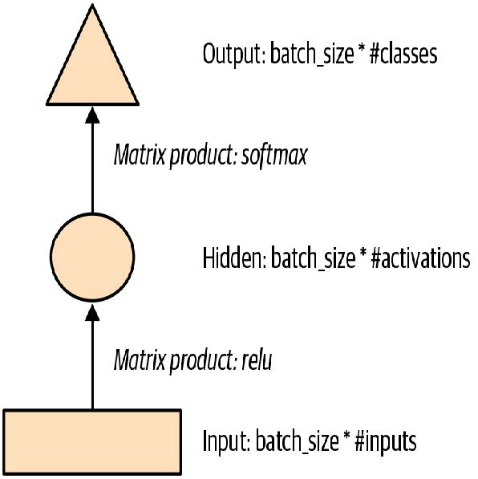
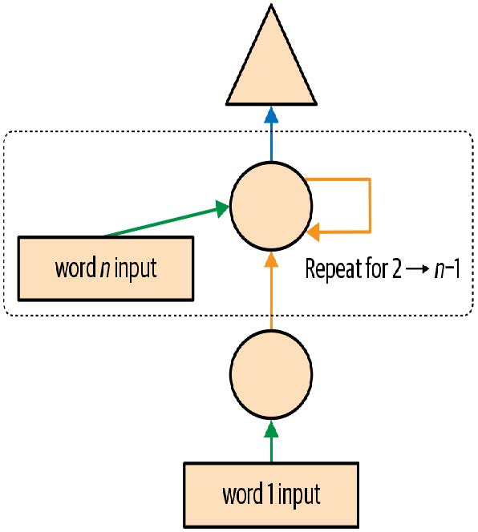
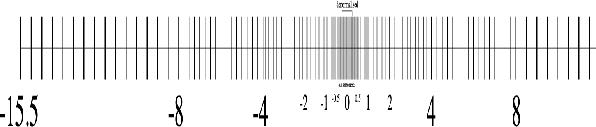
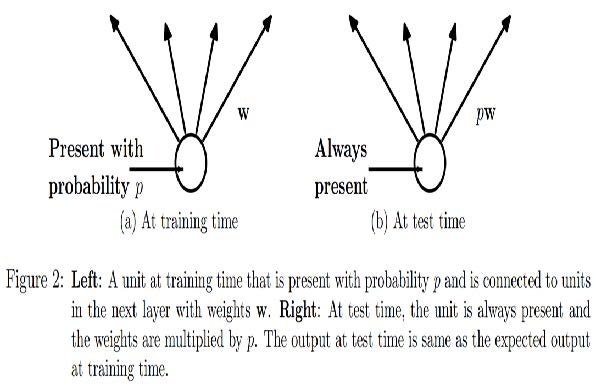

# 第三部分：深度学习基础

## 12. 从零开始构建语言模型

现在，我们准备深入探索……深入探索深度学习！你已经学会了如何训练基本的神经网络，但如何在此基础上创建最先进的模型呢？在本书这一部分，我们将揭开所有谜团，从语言模型开始。

在第10章中，你应该已了解如何通过微调预训练语言模型来构建文本分类器。本章将详细解析该模型的内部机制，并阐释循环神经网络的本质。首先，让我们收集一些数据，以便快速构建各类模型的原型。

### 数据

每当我们着手解决新问题时，总会先构思最简洁的数据集，以便快速轻松地测试方法并解读结果。几年前开始研究语言建模时，我们找不到能快速原型化的数据集，于是自己创建了一个。我们称之为“人类数字集”（Human Numbers），它仅包含用英文书写的头10,000个数字。

> JEREMY说
>
> 我观察到即使在经验丰富的从业者中，最常见的实际错误之一也是在分析过程中未能在适当的时机使用合适的数据集。尤其值得注意的是，多数人往往从规模过大且过于复杂的数据集开始着手。

我们可以按常规方式下载、解压并查看数据集：

```python
from fastai.text.all import *
path = untar_data(URLs.HUMAN_NUMBERS)
```

```python
path.ls()
```

```text
(#2) [Path('train.txt'),Path('valid.txt')]
```

让我们打开这两个文件看看里面有什么。首先，我们将所有文本合并在一起，忽略数据集提供的训练集/验证集划分（稍后再处理这个问题）：

```python
lines = L()
with open(path/'train.txt') as f: lines += L(*f.readlines())
with open(path/'valid.txt') as f: lines += L(*f.readlines())
lines
```

```text
(#9998) ['one \n','two \n','three \n','four \n','five \n','six
\n','seven
> \n','eight \n','nine \n','ten \n'...]
```

我们将所有这些行合并成一个大型数据流。为标记从一个数字切换到下一个数字的位置，我们使用 `.` 作为分隔符：

```python
text = ' . '.join([l.strip() for l in lines])
text[:100]
```

```text
'one . two . three . four . five . six . seven . eight . nine . ten
. eleven .
> twelve . thirteen . fo'
```

我们可以将该数据集按空格分隔进行分词处理：

```python
tokens = text.split(' ')
tokens[:10]
```

```text
['one', '.', 'two', '.', 'three', '.', 'four', '.', 'five', '.']
```

要进行数值化处理，我们需要创建一个包含所有唯一标记的列表（就是我们的词汇表）：

```python
vocab = L(*tokens).unique()
vocab
```

```text
(#30)
['one','.','two','three','four','five','six','seven','eight','nine'...]
```

然后我们可以将词元转换为数字，方法是查阅词汇表中每个词元的索引：

```python
word2idx = {w:i for i,w in enumerate(vocab)}
nums = L(word2idx[i] for i in tokens)
nums
```

```text
(#63095) [0,1,2,1,3,1,4,1,5,1...]
```

既然我们现在拥有一个小型数据集，语言建模应该是一项轻松的任务，我们可以构建我们的第一个模型。

### 从零开始构建我们的首个语言模型

将此转化为神经网络的简易方法是：规定我们基于前三个单词来预测每个单词。我们可以创建一个包含所有三个单词序列的列表作为自变量，并将每个序列后的下一个单词作为因变量。

我们可以用纯Python实现。先用词元来演示，确认一下效果：

```python
L((tokens[i:i+3], tokens[i+3]) for i in range(0,len(tokens)-4,3))
```

```text
(#21031) [(['one', '.', 'two'], '.'),(['.', 'three', '.'], 'four'),
(['four',
> '.', 'five'], '.'),(['.', 'six', '.'], 'seven'),(['seven', '.',
'eight'],
> '.'),(['.', 'nine', '.'], 'ten'),(['ten', '.', 'eleven'], '.'),
(['.',
> 'twelve', '.'], 'thirteen'),(['thirteen', '.', 'fourteen'],
'.'),(['.',
> 'fifteen', '.'], 'sixteen')...]
```

现在我们将使用数值化的张量来实现，这正是模型实际会使用的形式：

```python
seqs = L((tensor(nums[i:i+3]), nums[i+3]) for i in
range(0,len(nums)-4,3))
seqs
```

```text
(#21031) [(tensor([0, 1, 2]), 1),(tensor([1, 3, 1]), 4),(tensor([4,
1, 5]),
> 1),(tensor([1, 6, 1]), 7),(tensor([7, 1, 8]), 1),(tensor([1, 9,
1]),
> 10),(tensor([10, 1, 11]), 1),(tensor([ 1, 12, 1]), 13),
(tensor([13, 1,
> 14]), 1),(tensor([ 1, 15, 1]), 16)...]
```

我们可以使用 `DataLoader` 类轻松批量处理这些数据。目前，我们将随机拆分序列：

```python
bs = 64
cut = int(len(seqs) * 0.8)
dls = DataLoaders.from_dsets(seqs[:cut], seqs[cut:], bs=64,
shuffle=False)
```

现在我们可以构建一个神经网络架构，该架构以三个单词作为输入，并返回词汇表中每个可能后续单词的概率预测。我们将使用三个标准线性层，但进行两处调整。

第一个调整是：第一层线性层仅使用第一个单词的嵌入作为激活值；第二层使用第二个单词的嵌入加上第一层的输出激活值；第三层则使用第三个单词的嵌入加上第二层的输出激活值。其关键效果在于，每个单词都在其所有前置单词的信息语境中被解读。

第二个调整是这三个层级将使用相同的权重矩阵。单个词语对先前词语激活值的影响不应因词语位置而改变。换言之，激活值会随数据在层级间传递而变化，但层级权重本身在不同层级间保持恒定。因此，单个层级不会学习特定序列位置，而必须掌握处理所有位置的能力。

由于层权重不会改变，你可以将连续的层视为“相同层”的重复。实际上，PyTorch将这种概念具体化了：我们只需创建一个层，即可多次使用它。

#### 基于PyTorch的语言模型

现在我们可以创建之前描述的语言模型模块了。

```python
class LMModel1(Module):
    def __init__(self, vocab_sz, n_hidden):
        self.i_h = nn.Embedding(vocab_sz, n_hidden)
        self.h_h = nn.Linear(n_hidden, n_hidden)
        self.h_o = nn.Linear(n_hidden,vocab_sz)
        
    def forward(self, x):
        h = F.relu(self.h_h(self.i_h(x[:,0])))
        h = h + self.i_h(x[:,1])
        h = F.relu(self.h_h(h))
        h = h + self.i_h(x[:,2])
        h = F.relu(self.h_h(h))
        return self.h_o(h)
```

如你所见，我们创建了三个层级：

- 嵌入层（`i_h`，用于输入到隐藏层）
- 用于生成下一个单词激活值的线性层（`h_h`，用于隐藏层到隐藏层）
- 用于预测第四个单词的最终线性层（`h_o`，用于隐藏层到输出层）

用图示形式可能更容易理解，因此我们来定义一个基本神经网络的简易图示表示法。图12-1展示了我们将如何表示具有一个隐藏层的神经网络。



[^图12-1]: 简单神经网络的图示表示

每种形状代表激活状态：矩形表示输入层激活，圆形表示隐藏层（内部层）激活，三角形表示输出层激活。本章所有示意图均采用这些形状（如图12-2所示）。


[^图12-2]: 我们在图示中使用的形状

箭头表示实际的层计算——即线性层后接激活函数。采用这种记法的图12-3展示了我们简单语言模型的结构。


[^图12-3]: 我们基础语言模型的表示

为简化说明，我们已将层计算的细节从每条箭头中移除。同时采用颜色编码法标记箭头，使得所有同色箭头对应相同的权重矩阵。例如，所有输入层均使用相同的嵌入矩阵，因此它们都呈现相同颜色（绿色）。

让我们尝试训练这个模型，看看效果如何：

```python
learn = Learner(dls, LMModel1(len(vocab), 64),
                loss_func=F.cross_entropy,
                metrics=accuracy)
learn.fit_one_cycle(4, 1e-3)
```

| 迭代轮次 | 训练损失 | 验证损失 | 准确率   | 时间  |
| -------- | -------- | -------- | -------- | ----- |
| 0        | 1.824297 | 1.970941 | 0.467554 | 00:02 |
| 1        | 1.386973 | 1.823242 | 0.467554 | 00:02 |
| 2        | 1.417556 | 1.654497 | 0.494414 | 00:02 |
| 3        | 1.376440 | 1.650849 | 0.494414 | 00:02 |

要检验这种方法是否有效，我们先看看最简单的模型能给出什么结果。在这种情况下，我们总能预测出最常见的词元，因此让我们找出在验证集中哪个词元最常成为目标：

```python
n,counts = 0,torch.zeros(len(vocab))
for x,y in dls.valid:
    n += y.shape[0]
    for i in range_of(vocab): counts[i] += (y==i).long().sum()
    idx = torch.argmax(counts)
    idx, vocab[idx.item()], counts[idx].item()/n
```

```text
(tensor(29), 'thousand', 0.15165200855716662)
```

最常见的词元索引为29，对应词元 `thousand` 。若始终预测该词元，准确率仅约15%，因此我们的表现已大幅提升！

> ALEXIS说
>
> 我最初猜测分隔符会是最常见的标记，因为每个数字都对应一个。但观察 `tokens` 时我突然想起，大数字是用多个词汇书写的——在计数到10,000的过程中会频繁出现“千”字：五千、五千零一、五千零二等等。哎呀！审视数据时，既能发现微妙特征，也能察觉令人尴尬的显而易见之处。

这是一个不错的基本模型。让我们看看如何用循环重构它。

#### 我们的第一个循环神经网络

仔细观察我们模块的代码，我们可通过用 `for` 循环替换调用层级的重复代码来简化实现。此举不仅能精简代码，更将带来显著优势：我们的模块将能灵活适配不同长度的词元序列——不再局限于长度为三的词元列表：

```python
class LMModel2(Module):
    def __init__(self, vocab_sz, n_hidden):
        self.i_h = nn.Embedding(vocab_sz, n_hidden)
        self.h_h = nn.Linear(n_hidden, n_hidden)
        self.h_o = nn.Linear(n_hidden,vocab_sz)
        
    def forward(self, x):
        h = 0
        for i in range(3):
            h = h + self.i_h(x[:,i])
            h = F.relu(self.h_h(h))
            return self.h_o(h)
```

让我们检查一下使用此重构是否得到相同的结果：

```python
learn = Learner(dls, LMModel2(len(vocab), 64),
                loss_func=F.cross_entropy,
                metrics=accuracy)
learn.fit_one_cycle(4, 1e-3)
```

| 迭代轮次 | 训练损失 | 验证损失 | 准确率   | 时间  |
| -------- | -------- | -------- | -------- | ----- |
| 0        | 1.816274 | 1.964143 | 0.460185 | 00:02 |
| 1        | 1.423805 | 1.739964 | 0.473259 | 00:02 |
| 2        | 1.430327 | 1.685172 | 0.485382 | 00:02 |
| 3        | 1.388390 | 1.657033 | 0.470406 | 00:02 |

我们也可以完全以相同的方式重构我们的图示表示，如图12-4所示（在此我们同样省略了激活大小的细节，并沿用了图12-3中的箭头颜色）。



[^图12-4]: 基本循环神经网络

你会发现每次循环都会更新一组激活值，这些值存储在变量h中——这被称为隐藏状态（hidden state）。

> 术语：隐藏状态
>
> 在递归神经网络的每个步骤中更新的激活值。

使用此类循环定义的神经网络称为循环神经网络（RNN）。需要认识到，RNN并非复杂的新型架构，而是通过 `for` 循环对多层神经网络进行的重构。

> ALEXIS说
>
> 我的真实想法：如果它们被称为“looping neural networks”或LNN，看起来就会少一半的吓人感！

既然我们已经了解了循环神经网络是什么，现在就让我们尝试改进它。

### 改进循环神经网络

观察我们的循环神经网络代码时，一个看似存在的问题是：我们为每个新输入序列将隐藏状态初始化为零。这为何构成问题？我们刻意缩短样本序列长度以便轻松批量处理。但若正确排序这些样本，模型将按顺序读取样本序列，从而使模型暴露于原始序列的连续长片段中。

另一个值得探讨的方向是增强预测信号：既然能利用中间预测结果同时推断第二、第三个词，为何仅预测第四个词？让我们看看如何实现这些改进，首先从添加状态开始。

#### 保持循环神经网络的状态

由于我们为每个新样本将模型的隐藏状态初始化为零，我们正在丢弃迄今为止所见句子的所有信息，这意味着模型实际上并不了解我们在整体计数序列中的当前位置。这个问题很容易解决：只需将隐藏状态的初始化移至 `__init__` 方法即可。

但这种修复方案会引发一个微妙却关键的问题：它实际上使我们的人工神经网络深度等同于文档中所有词元的总数。例如，若数据集包含10,000个词元，我们便会构建出一个拥有10,000层的人工神经网络。

要理解这种情况的原因，请参考图12-3中循环神经网络的原始图示表示（在使用for循环重构之前）。可见每层都对应一个输入标记。在讨论用 `for` 循环重构前的递归神经网络表示时，我们称之为展开表示（unrolled representation）。理解递归神经网络时，考虑展开表示往往很有帮助。

十万层神经网络的问题在于，当你处理到数据集的第10000个词时，仍需计算所有层的导数直至第一层。这确实会非常耗时且占用大量内存。即使在GPU上存储一个迷你批次也几乎不可能实现。

解决此问题的方案是告知PyTorch，我们不希望将梯度反向传播至整个隐式神经网络。取而代之的是，我们仅仅保留最后三层的梯度。为清除PyTorch中的所有梯度历史记录，我们使用 `detach` 方法。

这是我们循环神经网络的新版本。它现在具有状态性，因为它会记住不同 `forward` 调用之间的激活值，这些激活值代表了它在批次中处理不同样本时的使用情况：

```python
class LMModel3(Module):
    def __init__(self, vocab_sz, n_hidden):
        self.i_h = nn.Embedding(vocab_sz, n_hidden)
        self.h_h = nn.Linear(n_hidden, n_hidden)
        self.h_o = nn.Linear(n_hidden,vocab_sz)
        self.h = 0
        
    def forward(self, x):
        for i in range(3):
            self.h = self.h + self.i_h(x[:,i])
            self.h = F.relu(self.h_h(self.h))
            out = self.h_o(self.h)
            self.h = self.h.detach()
            return out
        
    def reset(self): self.h = 0
```

无论选择何种序列长度，该模型的激活值都保持不变，因为隐藏层状态会记住前一批次最后的激活值。唯一不同之处在于每步计算的梯度：它们仅基于过去序列长度内的标记进行计算，而非整个数据流。这种方法称为时间反向传播（backpropagation through
time，BPTT）。

> 术语：时间反向传播
>
> 将神经网络视为每个时间步仅含一层（通常通过循环重构实现），将其作为单一大型模型进行处理，并按常规方式计算梯度。为避免内存耗尽和时间超时，我们通常采用截断式（truncated）反向传播时间推导，该方法每隔若干时间步便将隐藏状态的计算步骤历史进行“分离”。

要使用 `LMModel3`，我们需要确保样本将按特定顺序呈现。正如我们在第10章所见，若第一个批次的首行是 `dset[0]`，则第二个批次的首行应为 `dset[1]`，这样模型才能感知文本的连续流动。

在第10章中，`LMDataLoader` 为我们完成了这项工作。这次我们将自己动手实现。

为此，我们将重新排列数据集。首先将样本划分为 `m = len(dset) // bs` 个组（这相当于将整个拼接数据集分割为 64 个等分片段，因为这里使用了 `bs=64`）。`m` 表示每个片段的长度。例如，若使用完整数据集（尽管稍后将实际划分为训练集与验证集），结构如下：

```python
m = len(seqs)//bs
m,bs,len(seqs)
```

```text
(328, 64, 21031)
```

第一批将由样本组成

```text
(0, m, 2*m, ..., (bs-1)*m)
```

第二批样本

```text
(1, m+1, 2*m+1, ..., (bs-1)*m+1)
```

等等。这样，在每个迭代轮次中，模型将在批次中的每行上看到一块大小为 `3*m`（因为每个文本大小为 3）的连续文本。

以下函数执行重新索引操作：

```python
def group_chunks(ds, bs):
    m = len(ds) // bs
    new_ds = L()
    for i in range(m): new_ds += L(ds[i + m*j] for j in range(bs))
    return new_ds
```

然后我们在构建 `DataLoaders` 时传入 `drop_last=True`，以丢弃最后一个不符合 `bs` 形状的批次。同时传入 `shuffle=False` 确保文本按顺序读取：

```python
cut = int(len(seqs) * 0.8)
dls = DataLoaders.from_dsets(
    group_chunks(seqs[:cut], bs),
    group_chunks(seqs[cut:], bs),
    bs=bs, drop_last=True, shuffle=False)
```

最后要添加的是通过回调函数对训练循环进行微调。我们将在第16章深入探讨回调机制；此处的回调将在每个训练迭代轮次开始时及每次验证阶段前调用模型的重置方法。由于该方法用于将模型隐藏状态清零，此操作可确保在读取连续文本块前恢复初始状态。我们还可适当延长训练时长：

```python
learn = Learner(dls, LMModel3(len(vocab), 64),
                loss_func=F.cross_entropy,
                metrics=accuracy, cbs=ModelResetter)
learn.fit_one_cycle(10, 3e-3)
```

| 迭代轮次 | 训练损失 | 验证损失 | 准确率   | 时间  |
| -------- | -------- | -------- | -------- | ----- |
| 0        | 1.677074 | 1.827367 | 0.467548 | 00:02 |
| 1        | 1.282722 | 1.870913 | 0.388942 | 00:02 |
| 2        | 1.090705 | 1.651793 | 0.462500 | 00:02 |
| 3        | 1.005092 | 1.613794 | 0.516587 | 00:02 |
| 4        | 0.965975 | 1.560775 | 0.551202 | 00:02 |
| 5        | 0.916182 | 1.595857 | 0.560577 | 00:02 |
| 6        | 0.897657 | 1.539733 | 0.574279 | 00:02 |
| 7        | 0.836274 | 1.585141 | 0.583173 | 00:02 |
| 8        | 0.805877 | 1.629808 | 0.586779 | 00:02 |
| 9        | 0.795096 | 1.651267 | 0.588942 | 00:02 |

这已经好多了！下一步是使用更多目标，并将它们与中间预测结果进行比较。

#### 创造更多信号

当前方法的另一个问题在于，我们仅针对每三个输入词预测一个输出词。因此，用于更新权重的反馈信号量未能达到最大化。如图12-5所示，若能在每个单词之后预测下一个词，而非每三个词预测一次，效果将更为理想。


[^图12-5]: 在每个词元之后进行RNN预测

这很容易添加。我们首先需要修改数据，使因变量包含每个输入词之后的三个后续词。我们不用 `3` 这个数字，而是使用一个属性 `sl`（序列长度），并将其设置得稍大一些：

```python
sl = 16
seqs = L((tensor(nums[i:i+sl]), tensor(nums[i+1:i+sl+1]))
         for i in range(0,len(nums)-sl-1,sl))
cut = int(len(seqs) * 0.8)
dls = DataLoaders.from_dsets(group_chunks(seqs[:cut], bs),
                             group_chunks(seqs[cut:], bs),
                             bs=bs, drop_last=True, shuffle=False)
```

观察 `seqs` 的第一个元素，我们发现它包含两个大小相同的列表。第二个列表与第一个相同，但偏移了一个元素：

```python
[L(vocab[o] for o in s) for s in seqs[0]]
```

```text
[(#16) ['one','.','two','.','three','.','four','.','five','.'...],
(#16) ['.','two','.','three','.','four','.','five','.','six'...]]
```

现在我们需要修改模型，使其在每个单词之后输出预测结果，而不是仅在三个单词序列的末尾输出：

```python
class LMModel4(Module):
    def __init__(self, vocab_sz, n_hidden):
        self.i_h = nn.Embedding(vocab_sz, n_hidden)
        self.h_h = nn.Linear(n_hidden, n_hidden)
        self.h_o = nn.Linear(n_hidden,vocab_sz)
        self.h = 0
        
    def forward(self, x):
        outs = []
        for i in range(sl):
            self.h = self.h + self.i_h(x[:,i])
            self.h = F.relu(self.h_h(self.h))
            outs.append(self.h_o(self.h))
            self.h = self.h.detach()
            return torch.stack(outs, dim=1)
        
    def reset(self): self.h = 0
```

该模型将返回形状为 `bs x sl x vocab_sz` 的输出（因为我们在 `dim=1` 上进行了堆叠）。我们的目标形状为 `bs x sl`，因此在 `F.cross_entropy` 中使用前需要先将其展平：

```python
def loss_func(inp, targ):
    return F.cross_entropy(inp.view(-1, len(vocab)), targ.view(-1))
```

现在我们可以使用这个损失函数来训练模型：

```python
learn = Learner(dls, LMModel4(len(vocab), 64), loss_func=loss_func,
                metrics=accuracy, cbs=ModelResetter)
learn.fit_one_cycle(15, 3e-3)
```

| 迭代轮次 | 训练损失 | 验证损失 | 准确率   | 时间  |
| -------- | -------- | -------- | -------- | ----- |
| 0        | 3.103298 | 2.874341 | 0.212565 | 00:01 |
| 1        | 2.231964 | 1.971280 | 0.462158 | 00:01 |
| 2        | 1.711358 | 1.813547 | 0.461182 | 00:01 |
| 3        | 1.448516 | 1.828176 | 0.483236 | 00:01 |
| 4        | 1.288630 | 1.659564 | 0.520671 | 00:01 |
| 5        | 1.161470 | 1.714023 | 0.554932 | 00:01 |
| 6        | 1.055568 | 1.660916 | 0.575033 | 00:01 |
| 7        | 0.960765 | 1.719624 | 0.591064 | 00:01 |
| 8        | 0.870153 | 1.839560 | 0.614665 | 00:01 |
| 9        | 0.808545 | 1.770278 | 0.624349 | 00:01 |
| 10       | 0.758084 | 1.842931 | 0.610758 | 00:01 |
| 11       | 0.719320 | 1.799527 | 0.646566 | 00:01 |
| 12       | 0.683439 | 1.917928 | 0.649821 | 00:01 |
| 13       | 0.660283 | 1.874712 | 0.628581 | 00:01 |
| 14       | 0.646154 | 1.877519 | 0.640055 | 00:01 |

由于任务有所变化且变得更复杂，我们需要延长训练时间。但最终能获得不错的结果……至少有时如此。若多次运行程序，你会发现不同运行结果差异显著。这是因为我们实际构建的是深度神经网络，可能产生极大或极小的梯度值。本章后续部分将探讨如何应对这一问题。

现在，获得更好模型的明显途径是增加深度：在基础循环神经网络中，隐藏层状态与输出激活之间仅有一个线性层，因此增加更多层或许能获得更佳效果。

### 多层循环神经网络

在多层循环神经网络中，我们将循环神经网络的激活值传递到第二个循环神经网络，如图12-6所示。


[^图12-6]: 2层的循环神经网络

展开后的表示如图12-7所示（与图12-3类似）。


[^图12-7]: 2层的展开的循环神经网络

#### 模型

通过使用PyTorch的 `RNN` 类，我们可以节省一些时间。该类不仅实现了我们之前创建的内容，还提供了堆叠多个循环神经网络的选项，正如我们之前讨论的那样：

```python
class LMModel5(Module):
    def __init__(self, vocab_sz, n_hidden, n_layers):
        self.i_h = nn.Embedding(vocab_sz, n_hidden)
        self.rnn = nn.RNN(n_hidden, n_hidden, n_layers,
                          batch_first=True)
        self.h_o = nn.Linear(n_hidden, vocab_sz)
        self.h = torch.zeros(n_layers, bs, n_hidden)
        
    def forward(self, x):
        res,h = self.rnn(self.i_h(x), self.h)
        self.h = h.detach()
        return self.h_o(res)
    
    def reset(self): self.h.zero_()
    
learn = Learner(dls, LMModel5(len(vocab), 64, 2),
                loss_func=CrossEntropyLossFlat(),
                metrics=accuracy, cbs=ModelResetter)
learn.fit_one_cycle(15, 3e-3)
```

| 迭代轮次 | 训练损失 | 验证损失 | 准确率   | 时间  |
| -------- | -------- | -------- | -------- | ----- |
| 0        | 3.055853 | 2.591640 | 0.437907 | 00:01 |
| 1        | 2.162359 | 1.787310 | 0.471598 | 00:01 |
| 2        | 1.710663 | 1.941807 | 0.321777 | 00:01 |
| 3        | 1.520783 | 1.999726 | 0.312012 | 00:01 |
| 4        | 1.330846 | 2.012902 | 0.413249 | 00:01 |
| 5        | 1.163297 | 1.896192 | 0.450684 | 00:01 |
| 6        | 1.033813 | 2.005209 | 0.434814 | 00:01 |
| 7        | 0.919090 | 2.047083 | 0.456706 | 00:01 |
| 8        | 0.822939 | 2.068031 | 0.468831 | 00:01 |
| 9        | 0.750180 | 2.136064 | 0.475098 | 00:01 |
| 10       | 0.695120 | 2.139140 | 0.485433 | 00:01 |
| 11       | 0.655752 | 2.155081 | 0.493652 | 00:01 |
| 12       | 0.629650 | 2.162583 | 0.498535 | 00:01 |
| 13       | 0.613583 | 2.171649 | 0.491048 | 00:01 |
| 14       | 0.604309 | 2.180355 | 0.487874 | 00:01 |

这结果令人失望……我们之前的单层循环神经网络表现更好。为什么？原因在于模型更深，导致激活函数出现爆炸或消失现象。

#### 爆炸性激活或消失性激活

实际上，从这类循环神经网络中创建精确模型颇具挑战。若减少 `detach` 调用频率并增加层数，我们将获得更佳效果——这能为循环神经网络提供更长的学习时间跨度和更丰富的特征生成能力。但这也意味着需要训练更深层的模型。深度学习发展的核心挑战，正是如何有效训练这类模型。

这之所以具有挑战性，是因为当你多次乘以一个矩阵时会发生什么。想想当你多次乘以一个数时会发生什么。例如，从1开始乘以2，你会得到数列1,2,4,8,…，经过32步后，你已经达到了4,294,967,296。类似问题也出现在乘以0.5时：你得到0.5、0.25、0.125…经过32步后，结果仅为0.00000000023。由此可见，即使乘以略高于或略低于1的数值，经过几次重复乘法运算后，初始数值也会呈现爆炸式增长或消失。

由于矩阵乘法本质上就是数字相乘相加，因此重复矩阵乘法也会产生完全相同的结果。而深度神经网络正是如此——每增加一层就相当于进行一次矩阵乘法。这意味着深度神经网络极易产生极大或极小的数值。

这是一个问题，因为计算机存储数字的方式（称为浮点数）意味着数字离零点越远，其精度就越低。图12-8中的示意图摘自一篇精彩的文章 [《关于浮点数你永远不想知道却不得不了解的事》](https://oreil.ly/c_kG9) ，它展示了浮点数的精度在数轴上的变化情况。



[^图12-8]: 浮点数的精度

这种不精确性意味着，在深度网络中，用于更新权重的梯度计算结果常常会变成零或无穷大。这通常被称为梯度消失或梯度爆炸问题。这意味着在随机梯度下降（SGD）中，权重要么完全不更新，要么突然跳到无穷大。无论哪种情况，权重都无法通过训练得到改善。

研究人员已开发出应对该问题的方案，我们将在本书后续章节中展开讨论。其中一种方法是修改层的定义，以降低其发生激活爆炸的可能性。具体实现细节将在第13章讨论批量归一化时，以及第14章探讨ResNet时展开阐述——尽管实践中通常无需深究这些细节（除非你是致力于开发新解决方案的研究人员）。另一种应对策略是谨慎处理初始化，我们将在第17章深入探讨。

对于循环神经网络，我们常采用两种层类型来避免激活函数爆炸：门控循环单元（gated recurrent units，GRU）和长短期记忆（long short-term memory，LSTM）层。这两种层在PyTorch中均可使用，可直接替代RNN层。本书仅涵盖LSTM内容；网上已有大量优质教程详解GRU——它只是LSTM设计的一个细微变体。

### LSTM

LSTM是一种由Jürgen Schmidhuber和Sepp Hochreiter于1997年提出的架构。该架构中存在两个隐藏状态，而非一个。在基础循环神经网络中，隐藏状态即为循环神经网络在前一时间步的输出。该隐藏状态承担着两项职责：

- 为输出层提供正确信息以预测正确的下一个词
- 保留句子中所有发生内容的记忆

例如，考虑以下句子：“Henry has a dog and he likes his dog very much”（亨利有一只狗，他非常喜欢他的狗）和“Sophie has a dog and she likes her dog very much”（苏菲有一只狗，她非常喜欢她的狗）。很明显，循环神经网络需要记住句子开头的名字，才能预测“he/she”或“his/her”。

实际上，循环神经网络在保留句子早期信息方面表现极差，这正是LSTM引入额外隐藏状态（称为单元状态，cell state）的动因。单元状态负责维持长时记忆，而隐藏状态则专注于预测下一个词元。让我们深入探究其实现机制，并从零开始构建LSTM模型。

#### 从零开始构建LSTM

要构建LSTM，我们首先需要理解其架构。图12-9展示了其内部结构


[^图12-9]: LSTM的架构

在这张图中，输入变量 $x_t$ 从左侧输入，同时携带前一层的隐藏状态($h_{t−1}$)和单元状态($c_{t−1}$)。四个橙色框代表四层（我们的神经网络），激活函数采用sigmoid（$\sigma$）或tanh。tanh本质上是将sigmoid函数缩放至-1到1的范围。其数学表达式可写为：
$$
\tanh(x)=\frac{e^x+e^{-x}}{e^x-e^{-x}}=2\sigma(2x)-1
$$
其中 $\sigma$ 为sigmoid函数。图中绿色圆圈表示元素级运算。右侧输出的结果是新的隐藏层状态($h_t$)和新的单元状态($c_t$)，准备接收下一个输入。新的隐藏层状态同时作为输出使用，因此箭头会分叉向上延伸。

让我们逐一解析这四个神经网络（称为门），并说明示意图——但在此之前，请注意顶部的单元状态几乎没有变化。它甚至没有直接经过神经网络！这正是它能保持长期状态的原因。

首先，输入和旧隐藏状态的箭头被合并在一起。在本章早些时候编写的循环神经网络中，我们是将它们相加。而在LSTM中，我们将它们堆叠成一个大型张量。这意味着我们的嵌入维度（即$x_t$的维度）可以与隐藏状态的维度不同。若将它们分别命名为 `n_in` 和 `n_hid` ，底部箭头的大小为 `n_in + n_hid` ；因此所有神经网络单元（橙色框）均为线性层，其输入为 `n_in + n_hid` 维，输出为 `n_hid` 维。

从左至右看，第一个门称为遗忘门（forget gate）。由于它是由线性层后接sigmoid函数构成，其输出将包含介于0和1之间的标量值。我们将该结果与单元状态相乘，以此决定保留与舍弃的信息：接近0的值被丢弃，接近1的值被保留。这赋予LSTM遗忘长期状态信息的能力。例如在遇到句点或 `xxbos` 标记时，我们期望它（已学会）重置单元状态。

第二个门称为输入门（input gate）。它与第三个门（该门没有正式名称，有时被称为单元门）协同工作以更新单元状态。例如，当出现新的性别代词时，我们需要替换遗忘门移除的性别信息。与遗忘门类似，输入门决定细胞状态中哪些元素需要更新（值接近1）或保持不变（值接近0）。第三门则决定更新后的数值范围（通过tanh函数实现，取值范围为-1到1），最终结果将累加至单元状态。

最后一个门是输出门（output gate）。它决定从单元状态中使用哪些信息来生成输出。单元状态经过tanh变换后，与输出门的sigmoid输出进行组合，结果即为新的隐藏层状态。在代码层面，我们可以这样编写相同的步骤：

```python
class LSTMCell(Module):
    def __init__(self, ni, nh):
        self.forget_gate = nn.Linear(ni + nh, nh)
        self.input_gate = nn.Linear(ni + nh, nh)
        self.cell_gate = nn.Linear(ni + nh, nh)
        self.output_gate = nn.Linear(ni + nh, nh)
        
    def forward(self, input, state):
        h,c = state
        h = torch.stack([h, input], dim=1)
        forget = torch.sigmoid(self.forget_gate(h))
        c = c * forget
        inp = torch.sigmoid(self.input_gate(h))
        cell = torch.tanh(self.cell_gate(h))
        c = c + inp * cell
        out = torch.sigmoid(self.output_gate(h))
        h = outgate * torch.tanh(c)
        return h, (h,c)
```

在实践中，我们可以重构代码。此外，从性能角度来看，执行一次大型矩阵乘法比执行四次小型乘法更优（因为我们仅在GPU上启动一次特殊的快速内核，这能让GPU获得更多并行处理的工作量）。堆叠操作耗时较长（因为需要在GPU上移动其中一个张量以形成连续数组），因此我们为输入层和隐藏层分别设置独立层。优化后的重构代码如下：

```python
class LSTMCell(Module):
    def __init__(self, ni, nh):
        self.ih = nn.Linear(ni,4*nh)
        self.hh = nn.Linear(nh,4*nh)
    def forward(self, input, state):
        h,c = state
        # One big multiplication for all the gates is better than 4
        smaller ones
        gates = (self.ih(input) + self.hh(h)).chunk(4, 1)
        ingate,forgetgate,outgate = map(torch.sigmoid, gates[:3])
        cellgate = gates[3].tanh()
        c = (forgetgate*c) + (ingate*cellgate)
        h = outgate * c.tanh()
        return h, (h,c)
```

在此我们使用PyTorch的 `chunk` 方法将张量分割为四部分。其工作原理如下：

```python
t = torch.arange(0,10); t
```

```text
tensor([0, 1, 2, 3, 4, 5, 6, 7, 8, 9])
```

```python
t.chunk(2)
```

```text
(tensor([0, 1, 2, 3, 4]), tensor([5, 6, 7, 8, 9]))
```

现在让我们用这个架构来训练语言模型吧！

#### 使用LSTM训练语言模型

以下是与 `LMModel5` 相同的网络结构，采用两层LSTM。我们可以使用更高的学习率进行训练，缩短训练时间，从而获得更高的准确率：

```python
class LMModel6(Module):
    def __init__(self, vocab_sz, n_hidden, n_layers):
        self.i_h = nn.Embedding(vocab_sz, n_hidden)
        self.rnn = nn.LSTM(n_hidden, n_hidden, n_layers,
                           batch_first=True)
        self.h_o = nn.Linear(n_hidden, vocab_sz)
        self.h = [torch.zeros(n_layers, bs, n_hidden) for _ in
                  range(2)]
        
    def forward(self, x):
        res,h = self.rnn(self.i_h(x), self.h)
        self.h = [h_.detach() for h_ in h]
        return self.h_o(res)
    
    def reset(self):
        for h in self.h: h.zero_()
```

```python
learn = Learner(dls, LMModel6(len(vocab), 64, 2),
                loss_func=CrossEntropyLossFlat(),
                metrics=accuracy, cbs=ModelResetter)
learn.fit_one_cycle(15, 1e-2)
```

| 迭代轮次 | 训练损失 | 验证损失 | 准确率   | 时间  |
| -------- | -------- | -------- | -------- | ----- |
| 0        | 3.000821 | 2.663942 | 0.438314 | 00:02 |
| 1        | 2.139642 | 2.184780 | 0.240479 | 00:02 |
| 2        | 1.607275 | 1.812682 | 0.439779 | 00:02 |
| 3        | 1.347711 | 1.830982 | 0.497477 | 00:02 |
| 4        | 1.123113 | 1.937766 | 0.594401 | 00:02 |
| 5        | 0.852042 | 2.012127 | 0.631592 | 00:02 |
| 6        | 0.565494 | 1.312742 | 0.725749 | 00:02 |
| 7        | 0.347445 | 1.297934 | 0.711263 | 00:02 |
| 8        | 0.208191 | 1.441269 | 0.731201 | 00:02 |
| 9        | 0.126335 | 1.569952 | 0.737305 | 00:02 |
| 10       | 0.079761 | 1.427187 | 0.754150 | 00:02 |
| 11       | 0.052990 | 1.494990 | 0.745117 | 00:02 |
| 12       | 0.039008 | 1.393731 | 0.757894 | 00:02 |
| 13       | 0.031502 | 1.373210 | 0.758464 | 00:02 |
| 14       | 0.028068 | 1.368083 | 0.758464 | 00:02 |

这比多层循环神经网络效果更好！不过我们仍能看出存在轻微的过拟合现象，这表明适度正则化或许有所帮助。

### 对LSTM进行正则化

递归神经网络通常难以训练，原因在于我们之前提到的激活值和梯度消失问题。使用LSTM（或GRU）单元比普通RNN更易于训练，但它们仍然极易出现过拟合。数据增强虽可作为解决方案，但在文本数据中的应用远少于图像数据——因为多数情况下需要额外模型生成随机增强数据（例如将文本翻译成其他语言再译回原语言）。总体而言，文本数据增强目前仍属探索不足的领域。

然而，我们可采用其他正则化技术来减少过拟合，这些技术在论文 [《LSTM语言模型的正则化与优化》](https://oreil.ly/Rf-OG) 中进行了深入探讨。该论文展示了如何通过有效运用dropout、激活正则化及时间激活正则化，使LSTM模型超越此前需要更复杂架构才能实现的顶尖水平。作者将采用这些技术的LSTM称为AWD-LSTM。接下来我们将逐一探讨这些技术。

#### Dropout

Dropout是一种正则化技术，由Geoffrey Hinton等人于 [《通过防止特征检测器的协同适应来改进神经网络》](https://oreil.ly/-_xie) 一文中提出。其基本原理是在训练过程中随机将部分激活值置零。这确保所有神经元都能积极参与输出计算，如图12-10所示（摘自Nitish Srivastava等人的 [《Dropout：防止神经网络过拟合的简易方法》](https://oreil.ly/pYNxF) ）。


[^图12-10]: 在神经网络中应用dropout技术（由Nitish Srivastava等人提供）

Hinton在一次采访中解释dropout功能的灵感来源时，用了个贴切的比喻：

> 我去银行办事。柜员们频繁更换，我问其中一位原因。他说不清楚，但员工确实经常调动。我猜想这必然是因为要成功骗取银行资金，需要员工之间相互配合。这让我意识到：每次处理不同数据样本时随机移除不同子集的神经元，就能防止串通行为，从而减少过拟合现象。

在同一场访谈中，他还解释说神经科学提供了额外的灵感：

> 我们并不真正了解神经元为何会产生尖峰。一种理论认为，它们需要保持噪声以实现正则化，因为我们拥有的参数远多于数据点。dropout的核心思想在于：当激活函数存在噪声时，我们便能够构建更庞大的模型。

这解释了为什么正则化有助于泛化：首先它能促进神经元更好地协同工作；其次它使激活值更具噪声特性，从而增强模型的鲁棒性。

然而我们可以看到，如果仅将这些激活值归零而不做其他处理，模型将难以训练：当激活值从五个（由于应用了ReLU激活函数，这些值均为正数）骤减至两个时，其量级将发生显著变化。因此，当我们以概率 `p` 应用 dropout 时，会通过将所有激活值除以 `1-p` 进行重新缩放（平均而言 `p` 值会被归零，故保留 `1-p`），如图 12-11 所示。



[^图12-11]: 为何在应用dropout时对激活值进行缩放（摘自Nitish Srivastava等人的研究）

这是PyTorch中dropout层的完整实现（尽管PyTorch的原生层实际上是用C语言而非Python编写的）：

```python
class Dropout(Module):
    def __init__(self, p): self.p = p
    def forward(self, x):
        if not self.training: return x
    mask = x.new(*x.shape).bernoulli_(1-p)
    return x * mask.div_(1-p)
```

`bernoulli_` 方法生成一个包含随机零（概率为 `p` ）和随机一（概率为`1-p`）的张量，该张量与输入相乘后再除以`1-p`。请注意 `training` 属性的使用——该属性在任何PyTorch `nn.Module` 中均可用，用于指示当前处于训练模式还是推理模式。

> 自己动手做实验
>
> 在本书前几章中，我们本应在此添加一个 `bernoulli_` 的代码示例，以便你直观了解其运作原理。但既然你已具备独立完成的能力，我们将逐步减少示例数量，转而期待你自己通过自主实验探索机制。在本章结尾的问卷中，你会看到我们要求你对 `bernoulli_` 进行实验——但请不要等到我们要求你实验才去理解所学代码，请主动实践！

在将LSTM输出传递至最终层之前使用Dropout技术可有效降低过拟合风险。该技术亦广泛应用于其他模型，包括 `fastai.vision` 默认的卷积神经网络头部。在 `fastai.tabular` 中，通过传递 `ps` 参数（每个“p”对应添加的 `Dropout` 层）即可启用此功能，具体实现将在第15章详述。

Dropout在训练模式和验证模式下表现不同，我们通过 `Dropout` 中的 `training` 属性进行了指定。调用 `Module` 的 `train` 方法会将 `training` 设为 `True`（同时作用于调用该方法的模块及其递归包含的所有模块），而 `eval` 则将其设为 `False`。调用 `Learner` 的方法时会自动执行此操作，但若未使用该类，请根据需要手动切换设置。

#### 激活正则化与时间激活正则化

激活正则化（Activation regularization，AR）和时间激活正则化（temporal activation regularization，TAR）是两种与权重衰减非常相似的正则化方法，详见第8章。应用权重衰减时，我们会在损失函数中添加一个微小惩罚项，旨在使权重尽可能小。而激活正则化则不同，我们试图最小化的不是权重，而是LSTM最终输出的激活值。

为使最终激活值规范化，我们需将这些值存储在某处，然后将它们平方的均值添加到损失函数中（同时加入一个乘数 `alpha` ，其作用类似于权重衰减中的 `wd` ）：

```python
loss += alpha * activations.pow(2).mean()
```

时间激活正则化与我们预测句子中词元的事实相关。这意味着当按顺序阅读时，LSTM模型的输出结果应当具有某种逻辑连贯性。TAR通过在损失函数中添加惩罚项来鼓励这种行为，使连续两个激活值之间的差异尽可能小：我们的激活张量具有 `bs x sl x n_hid` 的形状，且沿序列长度轴（中间维度）读取连续激活值。由此，TAR可表示为：

```python
loss += beta * (activations[:,1:] -
activations[:,:-1]).pow(2).mean()
```

`alpha` 和 `beta` 随后成为两个需要调优的超参数。要使该方案生效，我们需要带 dropout 的模型返回三项内容：正确输出、LSTM 层掉出前的激活值，以及 LSTM 层掉出后的激活值。AR通常应用于dropout后的激活值（避免对后续归零的激活值施加惩罚），而TAR则应用于未dropout的激活值（因归零会导致相邻时间步之间产生巨大差异）。名为`RNNRegularizer` 的回调函数将为我们执行此正则化操作。

#### 训练权重绑定的正则化LSTM

我们可以将dropout（应用于进入输出层之前）与AR和TAR结合，来训练之前的LSTM。只需返回三项结果而非一项：LSTM的常规输出、掉出激活值以及LSTM的激活值。后两项将由回调函数 `RNNRegularization` 处理，用于计算损失函数的贡献值。

从AWD-LSTM论文中，我们还可以借鉴另一个有用的技巧：权重绑定（weight tying）。在语言模型中，输入嵌入表示从英语单词到激活值的映射，而输出隐藏层则表示从激活值到英语单词的映射。直观上我们可能认为这两种映射可以相同。在PyTorch中，我们可通过为这些层分配相同的权重矩阵来实现：

```python
self.h_o.weight = self.i_h.weight
```

在 `LMMModel7` 中，我们加入了以下最终调整：

```python
class LMModel7(Module):
    def __init__(self, vocab_sz, n_hidden, n_layers, p):
        self.i_h = nn.Embedding(vocab_sz, n_hidden)
        self.rnn = nn.LSTM(n_hidden, n_hidden, n_layers,
                           batch_first=True)
        self.drop = nn.Dropout(p)
        self.h_o = nn.Linear(n_hidden, vocab_sz)
        self.h_o.weight = self.i_h.weight
        self.h = [torch.zeros(n_layers, bs, n_hidden) for _ in
                  range(2)]
        
    def forward(self, x):
        raw,h = self.rnn(self.i_h(x), self.h)
        out = self.drop(raw)
        self.h = [h_.detach() for h_ in h]
        return self.h_o(out),raw,out
    
    def reset(self):
        for h in self.h: h.zero_()
```

我们可以使用 `RNNRegularizer` 回调函数创建一个正则化 `Learner`：

```python
learn = Learner(dls, LMModel7(len(vocab), 64, 2, 0.5),
                loss_func=CrossEntropyLossFlat(), metrics=accuracy,
                cbs=[ModelResetter, RNNRegularizer(alpha=2,
                                                   beta=1)])
```

`TextLearner` 会自动为我们添加这两个回调函数（默认使用 `alpha` 和 `beta` 的这些值），因此我们可以简化前面的代码行：

```python
learn = TextLearner(dls, LMModel7(len(vocab), 64, 2, 0.4),
                    loss_func=CrossEntropyLossFlat(),
                    metrics=accuracy)
```

然后我们可以训练模型，并通过将权重衰减增加到 `0.1`来添加额外的正则化：

```python
learn.fit_one_cycle(15, 1e-2, wd=0.1)
```

| 迭代轮次 | 训练损失 | 验证损失 | 准确率   | 时间  |
| -------- | -------- | -------- | -------- | ----- |
| 0        | 2.693885 | 2.013484 | 0.466634 | 00:02 |
| 1        | 1.685549 | 1.187310 | 0.629313 | 00:02 |
| 2        | 0.973307 | 0.791398 | 0.745605 | 00:02 |
| 3        | 0.555823 | 0.640412 | 0.794108 | 00:02 |
| 4        | 0.351802 | 0.557247 | 0.836100 | 00:02 |
| 5        | 0.244986 | 0.594977 | 0.807292 | 00:02 |
| 6        | 0.192231 | 0.511690 | 0.846761 | 00:02 |
| 7        | 0.162456 | 0.520370 | 0.858073 | 00:02 |
| 8        | 0.142664 | 0.525918 | 0.842285 | 00:02 |
| 9        | 0.128493 | 0.495029 | 0.858073 | 00:02 |
| 10       | 0.117589 | 0.464236 | 0.867188 | 00:02 |
| 11       | 0.109808 | 0.466550 | 0.869303 | 00:02 |
| 12       | 0.104216 | 0.455151 | 0.871826 | 00:02 |
| 13       | 0.100271 | 0.452659 | 0.873617 | 00:02 |
| 14       | 0.098121 | 0.458372 | 0.869385 | 00:02 |

这不比我们先前的模型好多了！

### 总结

现在你已经了解了第10章文本分类中使用的AWD-LSTM架构的全部内容。该架构在更多位置采用了dropout技术：

- 嵌入层后置dropout（嵌入层之后）
- 输入层后置dropout（嵌入层之后）
- 权重后置dropout（应用于每次训练步骤中LSTM的权重）
- 隐藏层后置dropout（应用于两层之间的隐藏状态）

这使得模型更加规范化。由于调整这五个dropout值（包括输出层前的dropout）较为复杂，我们已确定了合理的默认值，并允许通过该章节中提到的 `drop_mult` 参数整体调节dropout的强度（该参数将乘以每个dropout值）。

另一种非常强大的架构是Transformers架构，尤其适用于“序列到序列”问题（即因变量本身是可变长序列的问题，如语言翻译）。你可以在 [本书网站](https://book.fast.ai/) 的附录章节中找到相关内容。

### 问卷调查

1. 若项目数据集庞大复杂，处理耗时过长，应如何应对？
2. 为何要在创建语言模型前将数据集中的文档进行拼接？
3. 若使用标准全连接网络预测前三个单词后的第四个单词，需对模型进行哪两项调整？
4. 如何在 PyTorch 中实现权重矩阵在多层间的共享？
5. 编写一个模块，在不预览后续内容的情况下，根据句子前两个词预测第三个词。
6. 什么是循环神经网络？
7. 什么是隐藏状态？
8. 在 `LMModel1` 中，隐藏状态的对应概念是什么？
9. 为保持 RNN 的状态，为何必须按顺序将文本传递给模型？
10. RNN 的“展开”表示是什么？
11. 为何在 RNN 中维护隐藏状态会导致内存和性能问题？如何解决？
12. 什么是 BPTT？
13. 编写代码打印验证集的前几批数据，包括将令牌ID转换回英文字符串（参照第10章IMDb数据批处理的处理方式）。
14. `ModelResetter` 回调函数的作用是什么？为何需要它？
15. 每三个输入词仅预测一个输出词有何弊端？
16. 为何 `LMModel4` 需要自定义损失函数？
17. `LMModel4` 训练过程为何不稳定？
18. 在展开表示中可见循环神经网络具有多层结构，那么为何需要堆叠RNN才能获得更佳效果？
19. 绘制堆叠式（多层）RNN的示意图。
20. 为何减少 `detach` 调用频率能提升RNN效果？实际应用中简单RNN为何可能无法实现？
21. 深度网络为何可能产生极大或极小的激活值？这有何影响？
22. 在计算机浮点数表示中，哪些数值具有最高精度？
23. 梯度消失现象为何会阻碍训练？
24. LSTM架构中设置两个隐藏状态有何作用？各自功能是什么？
25. LSTM中这两种状态分别如何称呼？
26. tanh函数是什么？它与sigmoid函数有何关联？
27. 在`LSTMCell` 中以下代码段的作用是：

```python
h = torch.stack([h, input], dim=1)
```

28. PyTorch中 `chunk` 函数的功能是什么？
29. 请仔细研究 `LSTMCell` 的重构版本，确保理解其与非重构版本实现相同功能的方式及原因。
30. 为何 `LMModel6` 可使用更高学习率？
31. AWD-LSTM模型中使用了哪三种正则化技术？
32. 什么是dropout？
33. 为何要对dropout中的权重进行缩放？该操作在训练、推理还是两者中应用？
34. `Dropout`中这行代码的作用是什么：

    ```python
    if not self.training: return x
    ```

35. 通过 `bernoulli_` 进行实验以理解其工作原理。
36. 在PyTorch中如何设置模型为训练模式或者评估模式？
37. 写出激活正则化的方程（数学表达或代码均可）。它与权重衰减有何区别？
38. 写出时间激活正则化的方程（数学表达或代码均可）。为何不适用于计算机视觉问题？
39. 语言模型中的权重绑定是什么？

#### 进一步研究

1. 在 `LMModel2` 中，为什么前向传播可以直接从 `h=0` 开始？为什么不需要显式声明 `h=torch.zeros(...)` ？
2. 从零开始编写LSTM的代码（可参考图12-9）。
3. 在网上搜索GRU架构，从零实现该模型并尝试训练。观察结果是否与本章展示的相似，并将结果与PyTorch内置GRU模块进行对比。
4. 查阅fastai中AWD-LSTM的源代码，尝试将每行代码映射至本章阐述的概念。
