## 13. 卷积神经网络

在第四章中，我们学习了如何创建一个能够识别图像的神经网络。在区分数字3和7时，我们实现了略高于98%的准确率——但同时也看到，fastai内置的分类器能够达到接近100%的准确率。现在，让我们开始尝试缩小这个差距。

在本章中，我们将首先深入探讨卷积的本质，并从零开始构建卷积神经网络。随后我们将研究一系列提升训练稳定性的技术，并掌握库通常为我们自动应用的各项优化技巧，从而获得卓越的训练效果。

### 卷积的魔力

机器学习从业者手中最强大的工具之一便是特征工程（feature engineering）。特征（feature）是对数据进行的转换，旨在使其更易于建模。例如，我们在第9章对表格数据集预处理时使用的 `add_datepart` 函数，就为Bulldozers数据集添加了日期特征。那么，我们又能从图像中创建哪些特征呢？

> 术语：特征工程
>
> 创建输入数据的新的转换，以便更轻松地进行建模。

在图像中，特征是指视觉上具有辨识度的属性。例如数字7的特征在于：数字顶部附近有一条水平边，其下方则有一条从右上至左下的斜边。另一方面，数字3的特征在于：左上角与右下角各有一条同向斜边，左下角与右上角各有一条反向斜边，中部、顶部和底部均有水平边等。那么，如果我们能提取每张图像中边界出现的位置信息，并将其作为特征（而非原始像素）使用，会怎样呢？

事实证明，在计算机视觉领域，从图像中检测边缘是一项非常常见的任务，其实现方式却出人意料地简单。为此，我们使用一种称为卷积（convolution）的运算。卷积仅需乘法和加法两种运算——而这两种运算正是本书中所有深度学习模型中绝大多数计算的核心！

卷积操作是将卷积核（kernel）应用于图像。卷积核是一个小矩阵，例如图13-1右上角的3×3矩阵。


[^图13-1]: 将卷积核应用于一个位置

左侧的7×7网格是我们将要应用卷积核的图像。卷积运算将卷积核的每个元素与图像中3×3块的每个元素相乘，然后将这些乘积相加。图13-1展示了将核应用于图像单一位置的示例，即围绕单元格18的3×3区域。

让我们用代码来实现。首先，创建一个3×3的小矩阵，如下所示：

```python
top_edge = tensor([[-1,-1,-1],
                   [ 0, 0, 0],
                   [ 1, 1, 1]]).float()
```

我们将称之为我们的核函数（因为这就是那些高深的计算机视觉研究者对这些东西的称呼）。当然，我们还需要一张图像：

```python
path = untar_data(URLs.MNIST_SAMPLE)
```

```python
im3 = Image.open(path/'train'/'3'/'12.png')
show_image(im3);
```


现在我们将取图像顶部的3×3像素正方形，并将其中每个值分别与核函数中的每个元素相乘。然后我们将它们相加，如下所示：

```python
im3_t = tensor(im3)
im3_t[0:3,0:3] * top_edge
```

```text
tensor([[-0., -0., -0.],
[0., 0., 0.],
[0., 0., 0.]])
```

```python
(im3_t[0:3,0:3] * top_edge).sum()
```

```text
tensor(0.)
```

目前没什么意思——左上角的所有像素都是白色的。不过我们选几个更有意思的位置：

```python
df = pd.DataFrame(im3_t[:10,:20])
df.style.set_properties(**{'fontsize':'
6pt'}).background_gradient('Greys')
```


在单元格5,7处存在一条顶边。让我们在此重复计算：

```python
(im3_t[4:7,6:9] * top_edge).sum()
```

```text
tensor(762.)
```

在单元格8,18处有一个右边界。这能告诉我们什么？

```python
(im3_t[7:10,17:20] * top_edge).sum()
```

```text
tensor(-29.)
```

如你所见，这个小型计算返回了一个较大的数值，其中3×3像素的正方形代表顶部边缘（即正方形顶部值较低，而正下方值较高）。这是因为核函数中的 `-1` 值在此情况下影响甚微，而 `1` 值却影响巨大。

让我们稍微看看数学原理。过滤器会从图像中提取任意3×3大小的窗口，如果我们将像素值命名为这样：
$$
a_1\space a_2\space a_3 \\
a_4\space a_5\space a_6 \\
a_7\space a_8\space a_9
$$
它将返回 $a_1 + a_2 + a_3 − a_7 − a_8 − a_9$。如果我们处于图像中 $a_1$、$a_2$ 和 $a_3$ 的总和等于 $a_7$ 、$a_8$ 和 $a_9$ 的部分，则各项将相互抵消，结果为 0。然而，若 $a_1$ 大于 $a_7$ 、$a_2$ 大于 $a_8$ 且 $a_3$ 大于 $a_9$ ，则最终结果数值更大。因此该滤波器可检测水平边缘——更精确地说，是图像顶部亮区向底部暗区过渡的边缘。

将滤波器调整为顶部为 `1` 、底部为 `-1` 的排列方式，即可检测从暗到亮的水平边缘。若将 `1` 和 `-1` 排列为列而非行，则可获得检测垂直边缘的滤波器。每组权重设置都会产生不同类型的输出结果。

让我们创建一个函数来处理单个位置的情况，并验证它是否与之前的结果一致：

```python
def apply_kernel(row, col, kernel):
    return (im3_t[row-1:row+2,col-1:col+2] * kernel).sum()
```

```python
apply_kernel(5,7,top_edge)
```

```text
tensor(762.)
```

但请注意，我们不能将其应用于角落（例如位置0,0），因为该处不存在完整的3×3方格。

#### 卷积核映射

我们可以将 `apply_kernel()` 函数映射到坐标网格上。也就是说，我们将把3×3核函数应用到图像的每个3×3区域。例如，图13-2展示了在5×5图像的第一行中，3×3核函数可应用的位置。

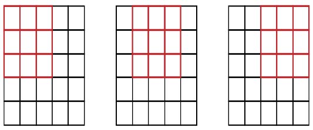

[^图13-2]: 在网格上应用核函数

要生成坐标网格，我们可以使用嵌套列表推导式（nested list comprehension），如下所示：

```python
[[(i,j) for j in range(1,5)] for i in range(1,5)]
```

```text
[[(1, 1), (1, 2), (1, 3), (1, 4)],
[(2, 1), (2, 2), (2, 3), (2, 4)],
[(3, 1), (3, 2), (3, 3), (3, 4)],
[(4, 1), (4, 2), (4, 3), (4, 4)]]
```

> 嵌套列表推导式
>
> 嵌套列表推导式在Python中应用广泛，因此若你此前未接触过，请花几分钟确保理解此处的运作机制，并尝试编写自己的嵌套列表推导式。

以下是在坐标网格上应用我们内核的结果：

```python
rng = range(1,27)
top_edge3 = tensor([[apply_kernel(i,j,top_edge) for j in
                     rng] for i in rng])
show_image(top_edge3);
```

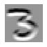

看起来不错！图像顶部边缘为黑色，底部边缘为白色（因为它们与顶部边缘相对）。现在图像中也包含负数，`matplotlib` 已自动调整颜色：白色代表图像中最小的数值，黑色代表最大的数值，而零值则显示为灰色。

我们也可以对左侧边缘尝试相同的方法：

```python
left_edge = tensor([[-1,1,0],
                    [-1,1,0],
                    [-1,1,0]]).float()

left_edge3 = tensor([[apply_kernel(i,j,left_edge) for j in
                      rng] for i in rng])

show_image(left_edge3);
```


正如我们之前提到的，卷积操作是指将卷积核应用于网格的过程。文森特·杜穆兰（Vincent Dumoulin）和弗朗切斯科·维辛（Francesco Visin）的论文 [《深度学习卷积运算指南》](https://oreil.ly/les1R) 中包含大量精彩的示意图，展示了图像卷积核的应用方式。图13-3摘自该论文，底部展示了一幅浅蓝色4×4图像，其上应用着深蓝色3×3核，最终在顶部生成2×2的绿色输出激活图。


[^图13-3]: 将3×3核应用于4×4图像的结果（由Vincent Dumoulin和Francesco Visin提供）

观察结果的形状。若原始图像高度为 `h`，宽度为 `w`，我们能找到多少个 3×3 的窗口？如示例所示，共有 `h-2` × `w-2` 个窗口，因此最终生成的图像高度为 `h-2`，宽度为 `w-2`。

我们不会从头实现这个卷积函数，而是直接使用PyTorch的实现（它比我们用Python能实现的任何方案都快得多）。

#### 使用PyTorch实现卷积

卷积是一种非常重要且广泛使用的操作，PyTorch已将其内置。该函数名为 `F.conv2d`（需注意 `F` 是fastai从 `torch.nn.functional` 导入的模块，此做法符合PyTorch推荐规范）。PyTorch文档指出该函数包含以下参数：

- `input`

  输入张量，形状为 (`minibatch, in_channels, iH, iW`)

- `weight`

  过滤器，形状为 (`out_channels, in_channels, kH, kW`)

这里 `iH,iW` 是图像的高度和宽度（即 `28,28`），而 `kH,kW` 是我们的卷积核的高度和宽度（`3,3`）。但显然，PyTorch期望这两个参数均为阶数为4的张量，而当前我们仅有阶数为2的张量（即矩阵或双轴数组）。

这些额外轴的存在源于PyTorch的几项特殊设计。其首项设计在于PyTorch能够同时对多张图像执行卷积操作。这意味着我们可以一次性对批处理中的所有元素同时调用该操作！

第二个技巧在于PyTorch能够同时应用多个核。因此我们也创建对角线边缘核，然后将所有四个边缘核堆叠成单一张量：

```python
diag1_edge = tensor([[ 0,-1, 1],
                     [-1, 1, 0],
                     [ 1, 0, 0]]).float()
diag2_edge = tensor([[ 1,-1, 0],
                     [ 0, 1,-1],
                     [ 0, 0, 1]]).float()

edge_kernels = torch.stack([left_edge, top_edge, diag1_edge,
                            diag2_edge])
edge_kernels.shape
```

```text
torch.Size([4, 3, 3])
```

要验证这一点，我们需要一个 `DataLoader` 和一个样本小批量。让我们使用数据块API：

```python
mnist = DataBlock((ImageBlock(cls=PILImageBW),
                   CategoryBlock),
                  get_items=get_image_files,
                  splitter=GrandparentSplitter(),
                  get_y=parent_label)
dls = mnist.dataloaders(path)
xb,yb = first(dls.valid)
xb.shape
```

```text
torch.Size([64, 1, 28, 28])
```

默认情况下，fastai 在使用数据块时会将数据放置在 GPU 上。让我们在示例中将其移至 CPU：

```python
xb,yb = to_cpu(xb),to_cpu(yb)
```

每批次包含64张图像，每张图像为单通道，尺寸为28×28像素。 `F.conv2d` 同样可处理多通道（彩色）图像。通道指图像中的单一基本颜色——对于常规全彩图像，通常包含红、绿、蓝三个通道。PyTorch将图像表示为三维张量，其维度如下：

```text
[channels, rows, columns]
```

本章后续内容将介绍如何处理多个通道。传递给 `F.conv2d` 的核函数必须是4阶张量：

```text
[channels_in, features_out, rows, columns]
```

`edge_kernels` 目前缺少以下内容之一：我们需要告知 PyTorch 该核函数的输入通道数为一，具体操作是在 PyTorch 文档标注的 `in_channels` 预期位置插入一个尺寸为一的轴（称为单位轴）。要向张量插入单位轴，我们得使用 `unsqueeze` 方法：

```python
edge_kernels.shape,edge_kernels.unsqueeze(1).shape
```

```text
(torch.Size([4, 3, 3]), torch.Size([4, 1, 3, 3]))
```

现在这是 `edge_kernels` 的正确形状。让我们将所有内容传入 `conv2d` ：

```python
edge_kernels = edge_kernels.unsqueeze(1)
```

```python
batch_features = F.conv2d(xb, edge_kernels)
batch_features.shape
```

输出形状显示我们的小批次包含64张图像、4个卷积核以及26×26的边缘映射图（我们最初使用的是28×28图像，但如前所述每边丢失了一个像素）。可以看出，我们获得的结果与手动操作时完全一致：

```python
show_image(batch_features[0,0]);
```


PyTorch最关键的绝招在于它能利用GPU并行处理所有任务——将多个内核应用于多张图像的多个通道。并行处理大量任务对GPU的高效运作至关重要；若逐个执行这些操作，速度往往会降低数百倍（若使用前文的手动卷积循环，速度甚至会降低数百万倍！）。因此，要成为优秀的深度学习实践者，关键技能之一就是让GPU同时处理大量任务。

如果能在每个轴上保留那两个像素就好了。实现方法是添加填充（padding），即在图像外围增加额外的像素。最常见的做法是添加零值像素。

#### 步长与填充

通过适当的填充，我们可以确保输出激活图与原始图像尺寸一致，这在构建网络架构时能大大简化工作。图13-4展示了添加填充后如何使卷积核能够作用于图像角落区域。


[^图13-4]: 带填充的卷积

采用5×5输入、4×4卷积核和2像素填充后，最终得到一个6×6的激活图，如图13-5所示。

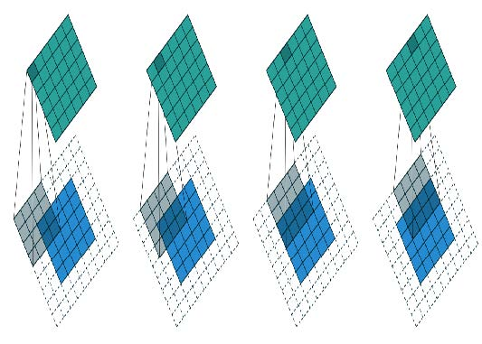

[^图13-5]: 一个4×4核，配以5×5输入和2像素填充（由Vincent Dumoulin和Francesco Visin提供）

若添加尺寸为 `ks` × `ks` 的核（`ks` 为奇数），则为保持相同形状所需的两侧填充量为 `ks//2` 。若 `ks` 为偶数，则顶部/底部与左侧/右侧所需填充量不同，但实际中我们几乎从不使用偶数尺寸的滤波器。

到现在为止，我们在网格上应用卷积核时，每次只移动一个像素。但我们可以跳跃更远的距离；例如，每次应用卷积核后可移动两个像素，如图13-6所示。这被称为步长为2的卷积。实际应用中最常见的核尺寸为3×3，最常用的填充值为1。如后续所示，步长为2的卷积有助于缩小输出尺寸，而步长为1的卷积则能在保持输出尺寸不变的情况下增加层数。

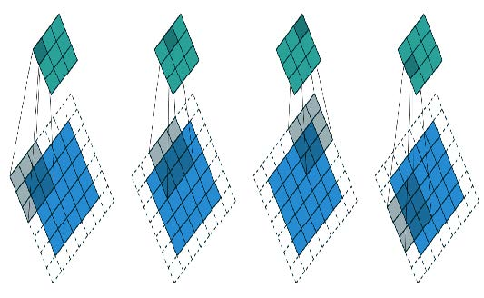

[^图13-6]: 3×3 卷积核，5×5 输入，步长为 2 的卷积，1 像素填充（由 Vincent Dumoulin 和 Francesco Visin 提供）

在尺寸为 `h` × `w` 的图像中，使用填充值1和步长2时，结果尺寸为 `(h+1)//2` × `(w+1)//2` 。各维度的一般公式为：

```python
(n + 2*pad - ks) // stride + 1
```

其中 `pad` 是填充量，`ks` 是核的大小，`stride` 是步长。

现在让我们看看卷积结果的像素值是如何计算的。

#### 理解卷积方程

为快速阐释卷积背后的数学原理，fast.ai学员Matt Kleinsmith提出了一个绝妙方案：[从不同视角展示卷积神经网络](https://oreil.ly/wZuBs) 。这个方案如此精妙且实用，我们在此也一并呈现！

这是我们的3×3像素图像，每个像素都标有字母：


这是我们的核函数，每个权重都标注了希腊字母：


由于滤镜在图像中出现了四次，因此我们得到四个结果：


图13-7展示了我们如何将核函数应用于图像的每个区域以获得相应结果。


[^图13-7]: 应用内核

方程视图如图13-8所示。


[^图13-8]: 方程

请注意，偏置项 `b` 在图像的每个区域中都是相同的。你可以将偏置视为滤波器的一部分，正如权重 ($\alpha,\beta,\gamma,\delta$) 是滤波器的一部分一样。

这里有一个有趣的见解——卷积可以表示为一种特殊的矩阵乘法，如图13-9所示。权重矩阵与传统神经网络中的权重矩阵完全相同。然而，这个权重矩阵具有两个特殊属性：

1. 灰色显示的零值不可训练。这意味着它们在整个优化过程中将保持为零。
2. 部分权重相等，虽然它们可训练（即可改变），但必须保持相等。这些称为共享权重。

这些零值对应滤波器无法处理的像素。权重矩阵的每一行对应滤波器的一次应用。


[^图13-9]: 卷积作为矩阵乘法

既然我们已经理解了卷积的概念，现在就用它来构建神经网络。

### 我们的第一个卷积神经网络

我们没有理由认为某些特定的边缘滤波器是图像识别中最有效的核函数。此外，我们已经看到在后续层中，卷积核会将低层特征进行复杂的变换，但我们尚未掌握如何手动构建这些核函数。

相反，最好直接学习卷积核的值。我们已经知道如何做到这一点——梯度下降！实际上，模型将学习对分类有用的特征。当我们使用卷积层替代（或补充）常规线性层时，便构成了卷积神经网络（convolutional neural network，CNN）。

#### 创建卷积神经网络

让我们回到第4章中的基本神经网络。它被定义如下：

```python
simple_net = nn.Sequential(
    nn.Linear(28*28,30),
    nn.ReLU(),
    nn.Linear(30,1)
)
```

我们可以查看模型的定义：

```python
simple_net
```

```text
Sequential(
(0): Linear(in_features=784, out_features=30, bias=True)
(1): ReLU()
(2): Linear(in_features=30, out_features=1, bias=True)
)
```

现在我们希望创建一个与该线性模型类似的架构，但使用卷积层替代线性层。`nn.Conv2d` 是 `F.conv2d` 的模块等效实现。在构建架构时，它比 `F.conv2d` 更便捷，因为实例化时会自动为我们生成权重矩阵。

以下是一种可能的架构：

```python
broken_cnn = sequential(
    nn.Conv2d(1,30, kernel_size=3, padding=1),
    nn.ReLU(),
    nn.Conv2d(30,1, kernel_size=3, padding=1)
)
```

需要注意的是，我们无需将输入尺寸明确设定为 `28×28` 。这是因为线性层需要为每个像素在权重矩阵中分配权重，因此必须知道像素数量；而卷积操作会自动应用于每个像素。正如前文所述，权重仅取决于输入输出通道数和卷积核尺寸。

思考输出形状会是什么样；然后让我们尝试一下并看看：

```python
broken_cnn(xb).shape
```

```text
torch.Size([64, 1, 28, 28])
```

这无法用于分类任务，因为我们需要每张图像对应单一输出激活值，而非28×28的激活图。解决方法之一是使用足够多次步长为2的卷积，使最终层尺寸为1。经过一次步长为2的卷积后，尺寸将变为14×14；两次后变为7×7；接着依次为4×4、2×2，最终达到尺寸1。

现在我们来尝试一下。首先，我们将定义一个函数，其中包含每次卷积操作中将使用的基本参数：

```python
def conv(ni, nf, ks=3, act=True):
    res = nn.Conv2d(ni, nf, stride=2, kernel_size=ks,
                    padding=ks//2)
    if act: res = nn.Sequential(res, nn.ReLU())
    return res
```

> 重构
>
> 通过这种方式重构神经网络的某些部分，能显著降低因架构不一致导致错误的概率，同时让读者更清晰地看到层结构中哪些部分正在发生实际变化。

当我们使用步长为2的卷积时，通常会同时增加特征数量。这是因为我们在激活图中将激活数量减少了4倍；我们不希望一次就大幅降低层的容量。

> 术语：通道与特征
>
> 这两个术语基本可互换使用，指代权重矩阵的第二轴尺寸，即卷积后每个网格单元对应的激活数量。特征（features）绝不指代输入数据，而通道（channels）既可指代输入数据（通常通道表示颜色），也可指代网络内部的激活状态。

以下是构建简单卷积神经网络的方法：

```python
simple_cnn = sequential(
    conv(1 ,4), #14x14
    conv(4 ,8), #7x7
    conv(8 ,16), #4x4
    conv(16,32), #2x2
    conv(32,2, act=False), #1x1
    Flatten(),
)
```

> JEREMY说
>
> 我喜欢在每次卷积后添加类似此处的注释，以展示每层之后激活图的大小。这些注释假设输入尺寸为28×28。

现在网络输出两个激活值，它们分别映射到标签中的两个可能级别：

```python
simple_cnn(xb).shape
```

```text
torch.Size([64, 2])
```

现在我们可以创建我们的 `Learner` ：

```python
learn = Learner(dls, simple_cnn, loss_func=F.cross_entropy,
metrics=accuracy)
```

要准确了解模型内部的运作情况，我们可以使用 `summary` 函数：

```python
learn.summary()
```

```text
Sequential (Input shape: ['64 x 1 x 28 x 28'])
================================================================
Layer (type) Output Shape Param #
Trainable
================================================================
Conv2d 64 x 4 x 14 x 14 40 True
________________________________________________________________
ReLU 64 x 4 x 14 x 14 0 False
________________________________________________________________
Conv2d 64 x 8 x 7 x 7 296 True
________________________________________________________________
ReLU 64 x 8 x 7 x 7 0 False
________________________________________________________________
Conv2d 64 x 16 x 4 x 4 1,168 True
________________________________________________________________
ReLU 64 x 16 x 4 x 4 0 False
________________________________________________________________
Conv2d 64 x 32 x 2 x 2 4,640 True
________________________________________________________________
ReLU 64 x 32 x 2 x 2 0 False
________________________________________________________________
Conv2d 64 x 2 x 1 x 1 578 True
________________________________________________________________
Flatten 64 x 2 0 False
________________________________________________________________


Total params: 6,722
Total trainable params: 6,722
Total non-trainable params: 0
Optimizer used: <function Adam at 0x7fbc9c258cb0>
Loss function: <function cross_entropy at 0x7fbca9ba0170>
Callbacks:
- TrainEvalCallback
- Recorder
- ProgressCallback
```

请注意，最终 `Conv2d` 层的输出为 `64x2x1x1` 。我们需要移除这些额外的 `1x1` 维度，这正是 `Flatten` 模块的作用。它本质上与PyTorch的 `squeeze` 方法相同，但以模块形式实现。

让我们看看这个模型能否训练成功！由于这是我们首次构建的深度神经网络，我们将采用更低的学习率和更长的训练周期：

```python
learn.fit_one_cycle(2, 0.01)
```

| 迭代轮次 | 训练损失 | 验证损失 | 准确率   | 时间  |
| -------- | -------- | -------- | -------- | ----- |
| 0        | 0.072684 | 0.045110 | 0.990186 | 00:05 |
| 1        | 0.022580 | 0.030775 | 0.990186 | 00:05 |

成功！结果正逐渐接近我们之前获得的 `ResNet18` 效果，尽管还未完全达到，且需要更多训练迭代轮次，同时必须采用更低的学习率。虽然还有些技巧需要掌握，但我们正越来越接近能够从零构建现代卷积神经网络的目标。

#### 理解卷积运算

从摘要中可以看出，我们有一个大小为 `64x1x28x28` 的输入。轴序为 `batch,channel,height,width` 。这通常表示为 `NCHW`（其中 `N` 表示批量大小）。另一方面，TensorFlow使用 `NHWC` 轴序。以下是第一层：

```python
m = learn.model[0]
m
```

```text
Sequential(
(0): Conv2d(1, 4, kernel_size=(3, 3), stride=(2, 2),
padding=(1, 1))
(1): ReLU()
)
```

因此我们有1个输入通道、4个输出通道和一个3×3卷积核。让我们查看第一个卷积的权重：

```python
m[0].weight.shape
```

```text
torch.Size([4, 1, 3, 3])
```

摘要显示我们有40个参数，而 `4×1×3×3` 等于36。另外四个参数是什么？让我们看看偏置项包含什么：

```python
m[0].bias.shape
```

```text
torch.Size([4])
```

现在我们可以利用这些信息来阐明上一节中的陈述：“当使用步长为2的卷积时，我们通常会增加特征数量，因为激活图中的激活数量减少了4倍；我们不希望单次大幅降低层的容量。”

每个通道都对应一个偏置项。（当它们不是输入通道时有时通道被称为特征或滤波器）输出形状为 `64x4x14x14` ，因此这将成为下一层的输入形状。根据摘要，下一层有296个参数。为简化说明，暂忽略批量轴。因此在 `14×14=196` 个位置上，我们需进行 `296-8=288` 次权重乘法（为简化起见忽略偏置项），即本层共需执行 `196×288=56,448` 次乘法运算。下一层将进行 `7×7×(1168-16)=56,448` 次乘法运算。

这里的情况是，我们的步长为2的卷积将网格尺寸从 `14x14` 减半至 `7x7` ，同时我们将滤波器数量从8倍增至16，因此整体计算量并未改变。如果在每层步长为2的卷积层中保持通道数不变，随着网络层级加深，计算量将逐渐减少。但我们知道深层需要计算语义丰富的特征（如眼睛或毛发），因此计算量减少显然不合逻辑。

另一种思考方式是基于感受野（receptive fields）的概念来理解。

#### 感受野

感受野是指参与某一层计算的图像区域。在书籍网站上，你会找到一个名为 `conv-example.xlsx` 的Excel电子表格，其中展示了使用MNIST数字数据集计算两个步长为2的卷积层的过程。每个卷积层仅包含一个卷积核。图13-10展示了当我们点击卷积层2区域的某个单元格（该单元格显示第二个卷积层的输出结果）并选择“追踪前置操作”时所呈现的内容。

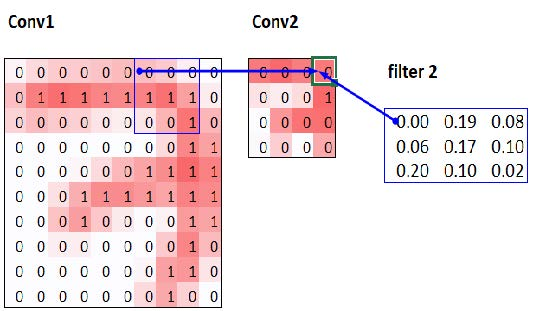

[^图13-10]: Conv2层的直接前置层

此处，绿色边框的单元格是我们点击的单元格，蓝色高亮单元格则是其前置单元格（precedents）——用于计算其值的单元格。这些单元格分别对应输入层（左侧）的3×3区域单元格，以及滤波器（右侧）中的单元格。现在再次点击“追踪前置单元”（trace precedents），即可查看用于计算这些输入值的单元。图13-11展示了此时的情况。

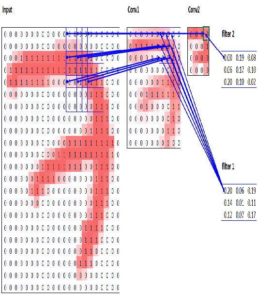

[^图13-11]: Conv2层的次级先例

在此示例中，我们仅有两个卷积层，每层步长均为2，因此现在可追溯至输入图像。我们可以看到，输入层中一个7×7的单元区域被用于计算Conv2层中单个绿色单元。这个7×7区域即为Conv2层中绿色激活单元输入端的感受野。同时可见，由于存在两层结构，现在需要第二个滤波器核。

从这个例子中可以看出，网络层级越深（具体来说，某层之前经过的步长为2的卷积层越多），该层激活的感受野就越大。较大的感受野意味着计算该层每个激活值时会使用输入图像的大片区域。我们已知在网络的深层网络层中存在语义丰富的特征，对应更大的感受野。因此我们预期，为处理这种日益增长的复杂性，每个特征都需要更多的权重。这与上一节所述观点本质相同：当在网络中引入步长为2的卷积时，也应相应增加通道数量。

在撰写本章时，我们面临诸多亟待解答的疑问，只为能向你尽可能清晰地阐释卷积神经网络。信不信由你，我们竟在Twitter（译者注：现在这个社交平台叫做X）上找到了大部分答案。现在让我们稍作停顿，就此话题展开讨论，随后再继续探讨彩色图像的内容。

#### 关于Twitter的说明

我们对社交网络的使用，至少可以说并不频繁。但本书的宗旨是助你成为最优秀的深度学习实践者，若不提及Twitter在我们自身深度学习旅程中的重要性，实属失职。要知道，Twitter还有另一面——远离特朗普和卡戴珊家族的喧嚣，那里每天都有深度学习研究者和实践者交流专业见解。就在撰写本节内容时，杰里米想确认关于步长为2的卷积的论述是否准确，于是他在Twitter上提问：


> 翻译：我忘了为什么我们从步长1卷积配合RAX池化转为步长2卷积？为什么不用步长1卷积配合平均池化（或者说某些现代网络是否采用这种方案）？这只是经验之谈，还是存在更深层的缘由？是否有人做过消融实验？

几分钟后，这个答案就出现了：


> 翻译：这取决于诸多因素：整体网络架构、加速器（CPU vs GPU vs TPU）等。某些Inception模型采用（卷积+卷积反向/平均取值池化）的串联方式，其质量差异微乎其微，某些池化方法更适合残差连接。

克里斯蒂安·塞格迪（Christian Szegedy）是2014年ImageNet冠军模型 [Inception](https://oreil.ly/hGE_Y) 的首要作者，该模型为现代神经网络提供了诸多关键洞见。两小时后，以下内容出现：

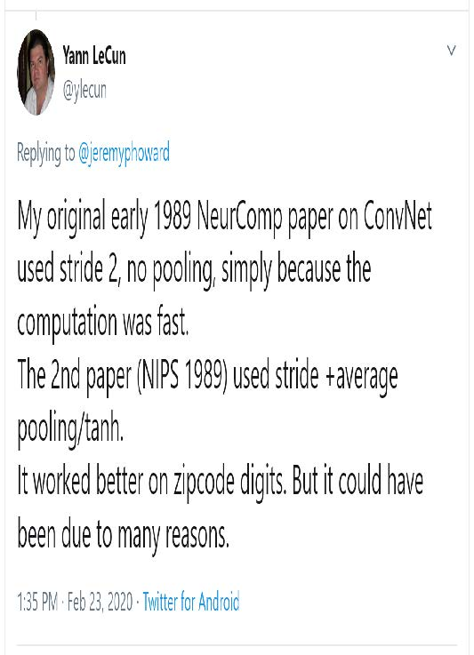

> 翻译：我1989年初发表在《神经计算》上的卷积神经网络论文，采用步长为2且不进行池化的方案，纯粹因为计算速度快。第二篇论文（NIPS 1989）采用了步长+平均池化/双曲正切函数的方案，在邮政编码数字识别上效果更佳，但这可能由多种因素造成。

你认得这个名字吗？你在第二章就见过它，当时我们正在讨论那些奠定当今深度学习基础的图灵奖得主！

杰里米还在推特上寻求帮助，想确认我们在第七章中对标签平滑的描述是否准确，并再次直接获得了克里斯蒂安·塞格迪的回应（标签平滑最初是在Inception论文中提出的）：


> 翻译：这段内容主要由谢尔盖撰写，因此他可能是最合适的咨询对象。我认为你对标签平滑的阐述相当准确，该段落的解读是正确的。

当今深度学习领域的许多顶尖人物都是推特活跃用户，且非常乐于与更广泛的社区互动。一个不错的入门方式是查看杰里米近期点赞的推文列表，或是西尔万的点赞记录。这样你就能看到我们认为值得关注的推特用户列表，这些用户发表的观点既有趣又实用。

Twitter是我们获取有趣论文、软件发布及其他深度学习资讯的主要渠道。若想与深度学习社区建立联系，我们建议你同时参与fast.ai论坛和Twitter互动。

话虽如此，让我们回到本章的核心内容。迄今为止，我们展示的图片示例均为黑白图像，每个像素仅包含一个数值。实际上，大多数彩色图像每个像素包含三个数值来定义颜色。接下来我们将探讨如何处理彩色图像。

### 彩色图像

彩色图像是一个三阶张量：

```python
im = image2tensor(Image.open('images/grizzly.jpg'))
im.shape
```

```text
torch.Size([3, 1000, 846])
```

```python
show_image(im);
```


第一轴包含红、绿、蓝三个通道：

```python
_,axs = subplots(1,3)
for bear,ax,color in zip(im,axs,('Reds','Greens','Blues')):
    show_image(255-bear, ax=ax, cmap=color)
```

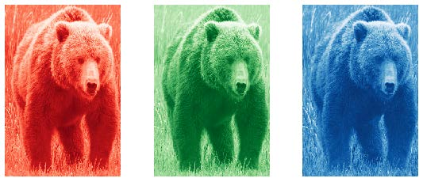

我们已经了解了卷积操作对图像单个通道上单个滤波器的作用（示例基于方形图像）。卷积层会接收具有特定通道数（常规RGB彩色图像的首层为三个通道）的图像，并输出具有不同通道数的图像。如同我们用隐藏层大小表示线性层的神经元数量，我们可以自由设定任意数量的滤波器，每个滤波器都能实现特定功能（例如检测水平边缘、垂直边缘等），从而实现类似第二章所研究的示例效果。

在一个滑动窗口中，我们拥有特定数量的通道，且需要与通道数相等的滤波器（并非所有通道都使用相同的核）。因此我们的核尺寸并非3×3，而是通道输入数 `ch_in` 乘以3×3。在每个通道上，我们将窗口元素与对应滤波器的元素相乘，然后将结果相加（如前所述），并对所有滤波器求和。如图13-12所示的示例中，该窗口上卷积层的结果为红色+绿色+蓝色。


[^图13-12]: 对RGB图像进行卷积

因此，要对彩色图像进行卷积运算，我们需要一个尺寸与图像第一轴匹配的卷积核张量。在图像的每个位置，卷积核与图像块的对应部分进行相乘。

这些数值随后被全部相加，为每个输出特征的每个网格位置生成一个单一数值，如图13-13所示。

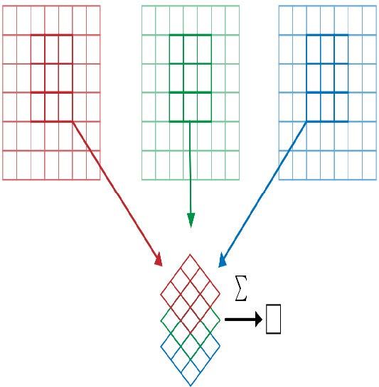

[^图13-13]: 添加RGB滤波器

然后我们有这样的 `ch_out` 滤波器，因此最终卷积层的结果将是一批具有 `ch_out` 通道数、高度和宽度由先前公式给定的图像。这将产生尺寸为 `ch_in x ks x ks` 的 `ch_out` 张量，我们将其表示为一个四维的大张量。在 PyTorch 中，这些权重的维度顺序为 `ch_out x ch_in x ks x ks`。

此外，我们可能需要为每个滤波器设置偏置项。在前例中，卷积层的最终结果将为 $y_R + y_G + y_B + b$ 。与线性层类似，偏置项的数量等于核的数量，因此偏置项是一个大小为 `ch_out` 的向量。

在设置卷积神经网络进行彩色图像训练时，无需特殊机制。只需确保第一层具有三个输入即可。

处理彩色图像的方法多种多样。例如，你可以将图像转为黑白，将RGB颜色空间转换为HSV（色相、饱和度和明度）颜色空间等等。实验表明，只要转换过程中不丢失信息，改变颜色编码方式通常不会影响模型结果。因此，转换为黑白图像是个糟糕的主意，因为它会彻底消除颜色信息（这可能至关重要；例如，某种宠物品种可能具有独特的毛色特征）；但转换为HSV通常不会产生任何影响。

现在你明白齐勒和弗格斯论文中《神经网络学到了什么》第一章的那些图示了！作为回顾，这是他们展示的第一层部分权重的示意图：

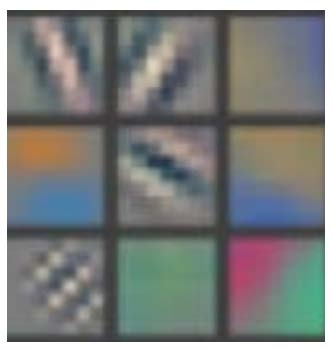

这是将卷积核的三片切片，针对每个输出特征，以图像形式呈现。我们可以看到，尽管神经网络的创建者从未明确设计用于检测边缘等特征的核函数，但神经网络通过随机梯度下降法自动发现了这些特征。

现在让我们看看如何训练这些卷积神经网络，并向大家展示fastai在后台用于高效训练的所有技术。

### 提升训练稳定性

既然我们已经能很好地区分3和7，那就来挑战更难的任务——识别全部10个数字。这意味着我们需要使用 `MNIST` 数据集而非 `MNIST_SAMPLE` ：

```python
path = untar_data(URLs.MNIST)
path.ls()
```

```text
(#2) [Path('testing'),Path('training')]
```

数据存放在名为 `training` 和 `testing` 的两个文件夹中，因此我们需要告知 `GrandparentSplitter` 这一设置（默认使用 `train` 和 `valid`）。我们在 `get_dls` 函数中完成此操作，该函数的定义便于后续灵活调整批量大小：

```python
def get_dls(bs=64):
    return DataBlock(
        blocks=(ImageBlock(cls=PILImageBW), CategoryBlock),
        get_items=get_image_files,
        splitter=GrandparentSplitter('training','testing'),
        get_y=parent_label,
        batch_tfms=Normalize()
    ).dataloaders(path, bs=bs)
    
dls = get_dls()
```

请记住，在使用数据之前先查看它总是明智之举：

```python
dls.show_batch(max_n=9, figsize=(4,4))
```


既然数据已经准备就绪，我们就可以用它来训练一个简单的模型。

#### 简单的基准模型

在本章前文，我们基于 `conv` 函数构建了一个模型，如下所示：

```python
def conv(ni, nf, ks=3, act=True):
    res = nn.Conv2d(ni, nf, stride=2, kernel_size=ks,
                    padding=ks//2)
    if act: res = nn.Sequential(res, nn.ReLU())
    return res
```

让我们从一个基础卷积神经网络作为基线模型开始。我们将沿用之前相同的网络结构，但做一个调整：增加激活层数量。由于需要区分的数值更多，我们很可能需要学习更多的卷积滤波器。

正如我们讨论的那样，每次遇到步长为2的层时，我们通常希望将滤波器数量翻倍。增加整个网络中滤波器数量的一种方法是将第一层的激活数量翻倍——这样后续每层的规模也将达到先前版本的两倍。

但这会引发一个微妙的问题。考虑应用于每个像素的卷积核。默认情况下，我们使用3×3像素的卷积核。因此，每个位置上卷积核作用的像素总数为3×3=9个。先前第一层有四个输出滤波器，这意味着每个位置需要从九个像素中计算四个值。试想若将输出倍增至八个滤波器会怎样。此时应用核时，我们将用九个像素计算八个数值。这意味着模型几乎无法真正学习：输出规模与输入规模几乎相同。神经网络只有在被迫如此时才会创造有用特征——即当某项运算的输出数量显著少于输入数量时。

为了解决这个问题，我们可以在第一层使用更大的卷积核。如果采用5×5像素的卷积核，每次卷积操作将使用25个像素。由此创建八个滤波器意味着神经网络必须发现一些有用的特征：

```py
def simple_cnn():
    return sequential(
        conv(1 ,8, ks=5), #14x14
        conv(8 ,16), #7x7
        conv(16,32), #4x4
        conv(32,64), #2x2
        conv(64,10, act=False), #1x1
        Flatten(),
    )
```

正如你即将看到的，我们可以在模型训练过程中对其进行观察，以寻找优化训练效果的方法。为此，我们使用 `ActivationStats` 回调函数，它会记录每个可训练层的激活值均值、标准差及直方图（如前所述，回调函数用于向训练循环添加行为；其具体工作原理将在第16章探讨）：

```python
from fastai.callback.hook import *
```

我们希望快速训练，这意味着以较高的学习速率进行训练。让我们看看在0.06的学习速率下效果如何：

```python
def fit(epochs=1):
    learn = Learner(dls, simple_cnn(),
                    loss_func=F.cross_entropy,
                    metrics=accuracy,
                    cbs=ActivationStats(with_hist=True))
    learn.fit(epochs, 0.06)
    return learn

learn = fit()
```

| 迭代轮次 | 训练损失 | 验证损失 | 准确率   | 时间  |
| -------- | -------- | -------- | -------- | ----- |
| 0        | 2.307071 | 2.305865 | 0.113500 | 00:16 |

这次训练效果实在不理想！让我们找出原因。

传递给 `Learner` 的回调函数有一个便捷特性：它们会自动以回调类名称（转换为驼峰式命名法）作为变量名自动提供访问。因此，我们的 `ActivationStats` 回调可通过`activation_stats` 访问。相信你还记得 `learn.recorder` ...能猜到它是如何实现的吗？没错，它正是名为 `Recorder` 的回调函数！

`ActivationStats` 包含一些用于绘制训练过程中激活值的实用工具。`plot_layer_stats(idx)`  可绘制第 `idx` 层激活值的均值与标准差，同时显示接近零值的激活比例。以下是第一层的绘图结果：

```python
learn.activation_stats.plot_layer_stats(0)
```


通常我们的模型在训练过程中，各层激活值的均值和标准差应保持一致或至少平滑。接近零的激活值尤其棘手，因为这意味着模型中存在完全无意义的计算（毕竟零的乘积仍是零）。当某层出现零值时，这些零值通常会传递到下一层...进而产生更多零值。以下是网络倒数第二层的示例：

```python
learn.activation_stats.plot_layer_stats(-2)
```

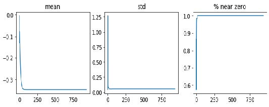

正如预期的那样，随着网络层数的增加，问题在网络末端变得更加严重，因为不稳定性和零激活现象在各层中不断累积。让我们看看如何使训练过程更加稳定。

#### 增加批量大小

提高训练稳定性的一种方法是增加批量大小。较大的批次能获得更精确的梯度，因为它们基于更多数据计算得出。然而，较大的批量意味着每个迭代轮次的批次数量减少，这将降低模型更新权重的机会。让我们看看批量大小为 512 是否有效：

```python
dls = get_dls(512)
```

```python
learn = fit()
```

| 迭代轮次 | 训练损失 | 验证损失 | 准确率   | 时间  |
| -------- | -------- | -------- | -------- | ----- |
| 0        | 2.309385 | 2.302744 | 0.113500 | 00:08 |

让我们看看倒数第二层是什么样子的：

```python
learn.activation_stats.plot_layer_stats(-2)
```


同样，我们的大多数激活值都接近零。让我们看看还能采取哪些措施来提高训练稳定性。

#### 单周期训练

我们的初始权重并不适合我们试图解决的任务。因此，以高学习率开始训练是危险的：正如我们所见，训练很可能立即发散。我们也不希望以高学习率结束训练，以免跳过某个最小值。但训练后期我们需要采用高学习率，因为这样能显著加快训练速度。因此训练过程中应动态调整学习率：从低值开始，逐步提升至高峰值，最终再回落至低值。

莱斯利·史密斯（Leslie Smith）（没错，就是发明学习率查找器的那个家伙！）在其论文 [《超收敛：利用大学习率实现神经网络的快速训练》](https://oreil.ly/EB8NU) 中发展了这一理念。他设计了分阶段的学习率调优方案：第一阶段学习率从最小值递增至最大值（预热，warmup），第二阶段则递减回最小值（退火，annealing）。史密斯将这种组合训练法命名为”单周期训练"（1cycle training）。

单周期训练使我们能够采用远高于其他训练方式的最大学习率，从而带来两大优势：

- 通过采用更高的学习率进行训练，我们能更快地完成训练——史密斯将这种现象称为超收敛。
- 通过采用更高的学习率进行训练，我们能减少过拟合现象，因为我们跳过了尖锐的局部极小值，最终落在了损失函数更平滑（因此更具泛化能力）的部分。

第二个观点颇为有趣且微妙；它基于这样一个观察：一个具有良好泛化能力的模型，其损失值在输入发生微小变化时不会显著改变。若模型以高学习率训练较长时间，且在此过程中能找到较好的损失值，则说明它必然找到了一个泛化能力强的区域——因为模型在批次间会频繁跳跃（这正是高学习率的基本定义）。问题在于，正如我们讨论过的，直接采用高学习率更可能导致损失函数发散而非收敛。因此我们不会直接采用高学习率，而是从低学习率起步——此时损失函数不会发散——并允许优化器通过逐步提升学习率，在参数空间中寻找越来越平滑的区域。

然后，当我们在参数空间中找到一个平滑区域后，我们需要定位该区域的最佳点，这意味着必须再次降低学习率。正因如此，单周期训练法采用了渐进式学习率预热和渐进式学习率冷却机制。许多研究者发现，实践中这种方法能获得更精确的模型并加快训练速度。因此它成为fastai中 `fine_tune` 的默认训练策略。

在第16章中，我们将全面学习梯度下降中的动量（momentum）技术。简而言之，动量是一种使优化器不仅沿梯度方向移动，同时延续先前步长的方向移动的技术。Leslie Smith在 [《神经网络超参数的系统化方法：第一部分》](https://oreil.ly/oL7GT) 中提出了周期动量概念。该方法使动量方向与学习率呈反向变化：高学习率阶段采用较小动量，退火阶段则重新增强动量作用。

我们可以在fastai中通过调用 `fit_one_cycle` 实现单周期训练：

```python
def fit(epochs=1, lr=0.06):
    learn = Learner(dls, simple_cnn(),
                    loss_func=F.cross_entropy,
                    metrics=accuracy,
                    cbs=ActivationStats(with_hist=True))
    learn.fit_one_cycle(epochs, lr)
    return learn

learn = fit()
```

| 迭代轮次 | 训练损失 | 验证损失 | 准确率   | 时间  |
| -------- | -------- | -------- | -------- | ----- |
| 0        | 0.210838 | 0.084827 | 0.974300 | 00:08 |

我们终于取得进展了！现在它能提供合理的准确度。

在训练过程中，我们可通过调用 `learn.recorder` 的 `plot_sched` 方法实时查看学习率和动量参数。`learn.recorder`（顾名思义）会记录训练期间的所有动态，包括损失值、指标以及学习率、动量等超参数：

```python
learn.recorder.plot_sched()
```

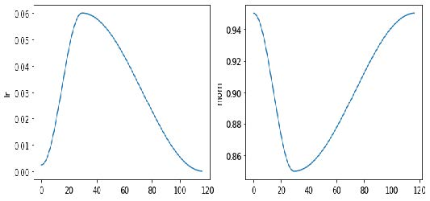

史密斯最初的单周期论文采用了线性预热和线性退火。如您所见，我们在fastai中通过将其与另一种流行方法——余弦退火相结合来改进该方案。`fit_one_cycle` 提供了以下可调整参数：

- `lr_max`

  将会被使用的最高学习率（也可为各层组对应学习率的列表，或包含首尾层组学习率的Python切片对象）

- `div`

  将 `lr_max` 除以该值所得的初始学习率

- `div_final`

  用于计算终止学习率的 `lr_max` 分数值

- `pct_start`

  预热阶段占批次总数的百分比

- `moms`

  元组 (`mom1,mom2,mom3`)，其中 `mom1` 为初始动量，`mom2` 为最小动量，`mom3` 为最终动量

让我们再次查看我们的图层统计数据：

```python
learn.activation_stats.plot_layer_stats(-2)
```

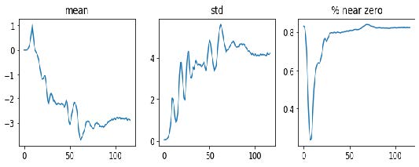

非零权重的比例正在显著改善，尽管它仍然相当高。通过使用 `color_dim` 并传入层索引，我们可以更深入地了解训练过程中的情况：

```python
learn.activation_stats.color_dim(-2)
```

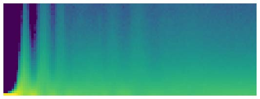

`color_dim` 由fast.ai与学生Stefano Giomo共同开发。Giomo将该理念称为“多彩维度”，并深入阐述了该方法的起源与细节。其基本思路是绘制某一层的激活值直方图，我们期望该直方图能呈现出类似正态分布的平滑模式（图13-14）。


[^图13-14]: 彩色维度直方图（由Stefano Giomo提供）

创建 `color_dim` 时，我们取左侧显示的直方图，将其转换为底部所示的彩色表示形式。随后将其旋转90度，如右侧所示。我们发现对直方图值取对数后，分布关系更为清晰。随后，Giomo描述道：

> 最终图层的绘制方式是将每批次激活值的直方图沿水平轴堆叠。因此可视化中的每个垂直切片代表单批次的激活直方图。颜色强度对应直方图高度，即每个直方图区间内的激活值数量。

图13-15展示了所有这些如何相互配合。

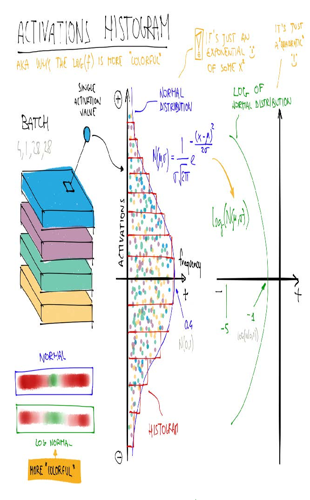

[^图13-15]: 多彩维度概要（由Stefano Giomo提供）

这说明当f服从正态分布时，log(f)比f更丰富多彩，因为取对数会将高斯曲线转化为二次曲线，其峰值更宽。

那么，考虑到这一点，让我们再看看倒数第二层的结果：

```python
learn.activation_stats.color_dim(-2)
```


这张图展现了典型的“训练失败”案例。起始状态下几乎所有激活值都为零——左侧深蓝色区域即为此状态。底部亮黄色区域代表接近零的激活值。随后在最初几批数据中，非零激活值呈指数级增长，但增长过度导致网络崩溃！深蓝色区域重新出现，底部又变为明亮的黄色。这几乎像是训练从头开始重启。随后激活值再次上升又再度崩溃。经过数次循环后，最终激活值分布于整个数值区间。

训练过程若能从一开始就保持平稳，效果会好得多。指数增长后又骤然崩溃的循环往往导致大量接近零的激活值，从而造成训练速度缓慢且最终效果不佳。解决此问题的一种方法是采用批量归一化。

#### 批量归一化

为了解决上一节中出现的训练速度慢且最终结果不佳的问题，我们需要修正初始阶段接近零的激活值占比过大的情况，并在整个训练过程中努力维持激活值的良好分布。

谢尔盖·约菲（Sergey Ioffe）和克里斯蒂安·塞格迪（Christian Szegedy）在2015年的论文 [《批量归一化：通过减少内部协变量偏移加速深度网络训练》](https://oreil.ly/MTZJL) 中提出了解决方案。在摘要中，他们描述了我们所见到的这个问题：

> 训练深度神经网络的复杂性在于，随着前层参数的变化，各层输入的分布也会在训练过程中发生改变。这迫使我们采用更低的学习率并谨慎初始化参数，从而减缓了训练速度……我们将此现象称为内部协变量偏移，并通过归一化层输入来解决该问题。

他们提出的解决方案如下：

> 将归一化纳入模型架构，并在每次训练小批量中执行归一化操作。批量归一化使我们能够使用更高的学习率，同时对初始化操作的要求也更宽松。

该论文一经发布便引起巨大轰动，因为它包含了图13-16中的图表，该图表清晰地证明了批量归一化能够训练出比当前最先进模型（Inception架构）更精确、速度约快5倍的模型。

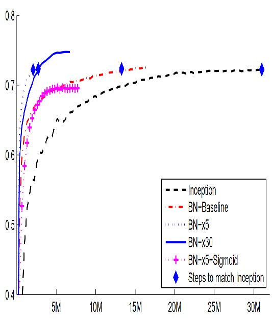

[^图13-16]: 批量归一化的影响（由Sergey Ioffe和Christian Szegedy提供）

批量归一化（常称为batchnorm）的工作原理是计算某一层激活值的均值和标准差，并利用这些参数对激活值进行归一化处理。然而这种方法可能引发问题，因为网络可能需要某些激活值保持极高水平才能实现精准预测。因此他们还添加了两个可学习参数（即在梯度下降步骤中更新），通常称为 `gamma` 和 `beta` 。在将激活值归一化得到新激活向量 `y` 后，批量归一化层会输出 `gamma*y + beta`。

因此我们的激活函数可以具有任意均值或方差，它们与前一层结果的均值和标准差无关。这些统计量是独立学习的，从而简化了模型的训练过程。训练与验证阶段的行为存在差异：训练时采用批次均值与标准差进行数据归一化，而验证阶段则使用训练过程中计算的统计量移动均值进行归一化。

让我们在 `conv` 中添加一个批归一化层：

```python
def conv(ni, nf, ks=3, act=True):
    layers = [nn.Conv2d(ni, nf, stride=2, kernel_size=ks,
                        padding=ks//2)]
    layers.append(nn.BatchNorm2d(nf))
    if act: layers.append(nn.ReLU())
    return nn.Sequential(*layers)
```

然后拟合我们的模型：

```python
learn = fit()
```

| 迭代轮次 | 训练损失 | 验证损失 | 准确率   | 时间  |
| -------- | -------- | -------- | -------- | ----- |
| 0        | 0.130036 | 0.055021 | 0.986400 | 00:10 |

这真是个好结果！让我们来看看 `color_dim`：

```python
learn.activation_stats.color_dim(-4)
```

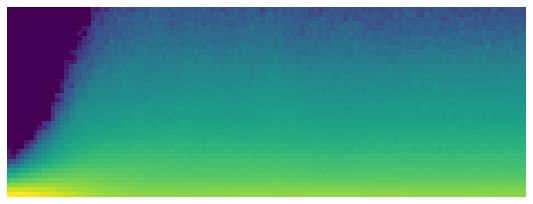

这正是我们所期待的：激活函数平稳发展，没有“崩溃”现象。批归一化在这里确实兑现了它的承诺！事实上，批归一化如此成功，以至于我们几乎在所有现代神经网络中都能看到它（或非常相似的技术）。

关于包含批量正则化层的模型，一个有趣的观察是它们往往比不含该层的模型具有更好的泛化能力。尽管目前尚未看到对此现象的严谨分析，但多数研究者认为原因在于批量正则化为训练过程增添了额外的随机性。每个小批次的均值和标准差都会与其他小批次略有不同。因此，每次激活值都会被不同的数值进行归一化。为了使模型能够做出准确预测，它必须学会对这些变化保持鲁棒性。总体而言，在训练过程中增加额外的随机性通常是有益的。

既然进展顺利，我们再训练几个迭代轮次看看效果如何。事实上，我们应该提高学习率——毕竟批量归一化论文的摘要声称我们应该能够“以更高的学习率进行训练”：

```python
learn = fit(5, lr=0.1)
```

| 迭代轮次 | 训练损失 | 验证损失 | 准确率   | 时间  |
| -------- | -------- | -------- | -------- | ----- |
| 0        | 0.191731 | 0.121738 | 0.960900 | 00:11 |
| 1        | 0.083739 | 0.055808 | 0.981800 | 00:10 |
| 2        | 0.053161 | 0.044485 | 0.987100 | 00:10 |
| 3        | 0.034433 | 0.030233 | 0.990200 | 00:10 |
| 4        | 0.017646 | 0.025407 | 0.991200 | 00:10 |

```python
learn = fit(5, lr=0.1)
```

| 迭代轮次 | 训练损失 | 验证损失 | 准确率   | 时间  |
| -------- | -------- | -------- | -------- | ----- |
| 0        | 0.183244 | 0.084025 | 0.975800 | 00:13 |
| 1        | 0.080774 | 0.067060 | 0.978800 | 00:12 |
| 2        | 0.050215 | 0.062595 | 0.981300 | 00:12 |
| 3        | 0.030020 | 0.030315 | 0.990700 | 00:12 |
| 4        | 0.015131 | 0.025148 | 0.992100 | 00:12 |

至此，可以说我们已经掌握了识别数字的方法！现在该挑战更难的内容了……

### 总结

我们已经看到卷积本质上是一种矩阵乘法，对权重矩阵施加了两个约束：某些元素永远为零，某些元素被绑定（强制保持相同值）。在第1章中，我们回顾了1986年著作《并行分布式处理》提出的八项要求，其中一项正是“单元间的连接模式”。这些约束条件恰恰实现了这一目标：它们强制形成了特定的连接模式。

这些约束使我们在模型中能使用更少的参数，同时不牺牲对复杂视觉特征的表征能力。这意味着我们可以更快地训练更深的模型，且过度拟合更少。尽管普适逼近定理表明全连接网络应能通过单层隐藏层表示任何内容，但实践证明，通过精心设计网络架构，我们能够训练出性能更优的模型。

卷积层是迄今为止神经网络中最常见的连接模式（与常规线性层并列，后者被称为全连接层，fully connected），但未来很可能还会发现更多连接模式。

我们还了解了如何解读网络中各层的激活值，以判断训练是否顺利，以及批量归一化如何帮助规范训练过程并使其更平稳。在下一章中，我们将结合这两种层来构建计算机视觉领域最流行的架构：残差网络（residual network）。

### 问卷调查

1. 什么是特征？
2. 写出顶部边缘检测器的卷积核矩阵。
3. 写出3×3卷积核对图像中单个像素执行的数学运算。
4. 将卷积核应用于3×3全零矩阵时，其输出值是多少？
5. 什么是填充？
6. 什么是步长？
7. 创建嵌套列表推导式完成任意自选任务。
8. PyTorch二维卷积的 `input` 参数与 `weight` 参数形状分别是什么？
9. 什么是通道？
10. 卷积与矩阵乘法之间有何关系？
11. 什么是卷积神经网络？
12. 重构神经网络定义的某些部分有何益处？
13. 什么是 `Flatten` ？它需要在MNIST卷积神经网络的哪个位置使用？为什么？
14. NCHW代表什么？
15. MNIST卷积神经网络第三层为何包含 `7×7×(1168-16)` 次乘法运算？
16. 感受野是什么？
17. 经过两次步长为2的卷积后，激活函数的感受野尺寸是什么？为什么是这样？
18. 亲自运行 `conv-example.xlsx` 文件，尝试调整 `trace precedents` 参数。
19. 查看Jeremy或Sylvain的近期Twitter点赞列表，看看能否发现有趣的资源或灵感。
20. 彩色图像如何表示为张量？
21. 卷积如何处理彩色输入？
22. 我们能用什么方法查看 `DataLoaders` 中的数据？
23. 为何每次stride-2卷积后都要翻倍滤波器数量？
24. 为何在MNIST数据集的首次卷积中使用更大核尺寸（ `simple_cnn` 实现）？
25. `ActivationStats` 为每个层保存哪些信息？
26. 如何在训练后访问学习器的回调函数？
27. `plot_layer_stats` 绘制的三项统计指标分别是什么？x轴代表什么？
28. 激活值接近零会引发什么问题？
29. 使用较大批量训练的优缺点是什么？
30. 为何应避免在训练初期使用高学习率？
31. 什么是单周期训练？
32. 高学习率训练有何优势？
33. 为何训练末期需采用低学习率？
34. 循环动量是什么？
35. 哪个回调函数在训练过程中追踪超参数值（及其他信息）？
36. `color_dim` 图中单列像素代表什么？
37. `color_dim` 中“不良训练”呈现何种形态？原因何在？
38. 批量归一化层包含哪些可训练参数？
39. 训练阶段批量归一化采用何种统计量进行归一化？验证阶段呢？
40. 为何采用批量归一化层的模型泛化能力更强？

#### 进一步研究

1. 除边缘检测器外，计算机视觉领域还采用了哪些其他特征（尤其在深度学习普及之前）？
2. PyTorch中还提供了其他归一化层。尝试使用它们并观察效果。了解其他归一化层的开发背景及其与批量归一化的差异。
3. 尝试将激活函数移至 `conv` 中批量归一化层之后。这样做是否会产生影响？探究推荐的操作顺序及其依据。
