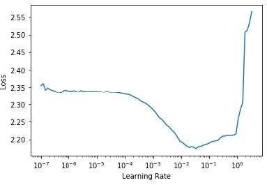
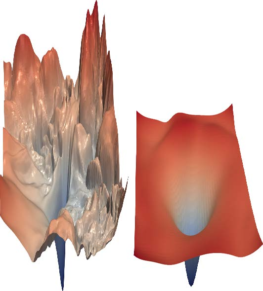

## 14. ResNets（残差神经网络）

在本章中，我们将基于上一章介绍的卷积神经网络，向你介绍ResNet（残差神经网络）架构。该架构由何恺明（Kaiming He）等人于2015年在论文 [《图像识别的深度残差学习》](https://oreil.ly/b68K8) 中提出，至今仍是应用最广泛的模型架构。近期图像模型的发展几乎都沿用了残差连接这一核心技巧，多数情况下只是对原始ResNet架构的局部优化。

我们将首先展示最初设计的ResNet基础模型，随后阐述使其性能更优的现代改进方案。但首先，我们需要一个比MNIST数据集稍具挑战性的问题，因为常规卷积神经网络在此数据集上已接近100%准确率。

### 回到 Imagenette 数据集

当我们的模型准确率已达到前一章MNIST数据集的水平时，评估模型改进效果将变得困难。因此我们将回归Imagenette数据集，挑战更复杂的图像分类问题。为保持计算效率，我们将继续使用小尺寸图像进行训练。

让我们获取数据——我们将使用已调整为160像素的版本以进一步提升速度，并随机裁剪为128像素：

```python
def get_data(url, presize, resize):
    path = untar_data(url)
    return DataBlock(
        blocks=(ImageBlock, CategoryBlock),
        get_items=get_image_files,
        splitter=GrandparentSplitter(valid_name='val'),
        get_y=parent_label, item_tfms=Resize(presize),
        batch_tfms=[*aug_transforms(min_scale=0.5,
                                    size=resize),
                    Normalize.from_stats(*imagenet_stats)],
    ).dataloaders(path, bs=128)
    
dls = get_data(URLs.IMAGENETTE_160, 160, 128)

dls.show_batch(max_n=4)
```


在研究MNIST数据集时，我们处理的是28×28像素的图像。而针对Imagenette数据集，我们将使用128×128像素的图像进行训练。后续我们还希望能够使用更大尺寸的图像——至少达到ImageNet标准的224×224像素。你还记得我们如何从MNIST卷积神经网络中提取每张图像的单一激活向量吗？

我们采用的方法是确保存在足够多的步长为2的卷积，使得最终层的网格尺寸为1。随后我们将最终得到的单元轴展平，从而为每张图像生成一个向量（即一个小批次的激活矩阵）。虽然对Imagenette数据集也可采用相同方法，但这会引发两个问题：

- 我们需要大量步长为2的卷积层才能最终构建出1×1的卷积网络——所需层数可能远超常规选择。
- 该模型仅适用于原始训练尺寸的图像，无法处理其他尺寸的图像。

解决第一个问题的方案之一是将最终卷积层展平，使其能处理除1×1以外的网格尺寸。我们可以像之前那样，通过将每行排列在前一行之后，将矩阵展平为向量。事实上，这是2013年之前卷积神经网络几乎始终采用的方法。最著名的例子是2013年ImageNet冠军模型VGG，至今仍被沿用。但这种架构存在另一缺陷：不仅无法处理训练集以外尺寸的图像，还因展开卷积层导致大量激活值涌入最终层，从而消耗海量内存。因此最终层的权重矩阵体积庞大。

这个问题通过创建全卷积网络（fully convolutional）可以得以解决。全卷积网络的诀窍在于对卷积网格上的激活值取平均值。换言之，我们只需使用以下函数：

```python
def avg_pool(x): return x.mean((2,3))
```

如你所见，该操作是在x轴和y轴上取平均值。此函数将始终将激活值网格转换为每帧图像的单个激活值。PyTorch提供了一个功能更灵活的模块 `nn.AdaptiveAvgPool2d` ，它能将激活值网格平均到任意尺寸的目标区域（尽管我们几乎总是使用尺寸为1的输出）。

因此，全卷积网络包含多个卷积层，其中部分层步长为2，其末端依次连接自适应平均池化层、消除单位轴的展平层，最终接线性层。以下是我们的首个全卷积网络：

```python
def block(ni, nf): return ConvLayer(ni, nf, stride=2)
def get_model():
    return nn.Sequential(
        block(3, 16),
        block(16, 32),
        block(32, 64),
        block(64, 128),
        block(128, 256),
        nn.AdaptiveAvgPool2d(1),
        Flatten(),
        nn.Linear(256, dls.c))
```

我们将用其他变体替换网络中的 `block` 实现，因此不再将其称为卷积层。同时，通过利用fastai的 `ConvLayer` ，我们节省了时间——该组件已提供前一章 `conv` 功能（以及更多扩展功能！）。

> 停下来好好想想
>
> 请思考这个问题：这种方法适用于光学字符识别（OCR）问题（如MNIST）吗？绝大多数处理OCR及类似问题的从业者倾向于使用全卷积网络，因为这几乎是当今主流的解决方案。但这其实毫无意义！试想：若将数字切成碎片、打乱排列，再根据平均形态判断是3还是8——这种方法根本无法区分数字形态！而自适应均值池化本质上正是如此操作！全卷积网络真正适合的场景，仅限于那些不存在单一正确方向或尺寸的对象（例如大多数自然照片）。

完成卷积层处理后，我们将获得尺寸为 `bs × ch × h × w`（批量大小、特定通道数、高度和宽度）的激活值。为将其转换为尺寸为 `bs × ch` 的张量，我们需对最后两个维度取平均值，并像先前模型中那样将末尾的 1×1 维度展平。

这与常规池化不同，因为这些层通常会对给定大小的窗口取平均值（平均池化）或最大值（最大池化）。例如，早期卷积神经网络中广泛使用的尺寸为2的最大池化层，通过取每个2×2窗口（步长为2）的最大值，将图像尺寸在每个维度上缩减一半。

与之前相同，我们可以使用自定义模型定义一个 `Learner` ，然后用之前获取的数据对其进行训练：

```python
def get_learner(m):
    return Learner(dls, m, loss_func=nn.CrossEntropyLoss(),
                   metrics=accuracy
                  ).to_fp16()
    
learn = get_learner(get_model())
```

```python
learn.lr_find()
```

```text
(0.47863011360168456, 3.981071710586548)
```



对于卷积神经网络，3e-3通常是一个不错的学习率，这里似乎也是如此，因此我们尝试使用该参数：

```python
learn.fit_one_cycle(5, 3e-3)
```

| 迭代轮次 | 训练损失 | 验证损失 | 准确率   | 时间  |
| -------- | -------- | -------- | -------- | ----- |
| 0        | 1.901582 | 2.155090 | 0.325350 | 00:07 |
| 1        | 1.559855 | 1.586795 | 0.507771 | 00:07 |
| 2        | 1.296350 | 1.295499 | 0.571720 | 00:07 |
| 3        | 1.144139 | 1.139257 | 0.639236 | 00:07 |
| 4        | 1.049770 | 1.092619 | 0.659108 | 00:07 |

考虑到我们需要从10个类别中选出正确答案，且仅训练了5个迭代轮次，这个开局相当不错！使用更深的模型可以取得远超此效果，但单纯堆叠新层并不会显著提升结果（你可以亲自尝试验证！）。为解决此问题，ResNet引入了跳跃连接（skip connections）的概念。我们将在下一节深入探讨ResNet的这一特性及其他方面。

### 构建现代卷积神经网络：ResNet

现在我们已具备构建自本书开篇以来在计算机视觉任务中使用的模型所需的所有组件：ResNets。我们将阐述其核心原理，并展示相较于先前模型它如何提升Imagenette数据集的识别精度，随后将构建包含所有最新优化方案的版本。

#### 跳跃连接

2015年，ResNet论文的作者们注意到一个令他们感到好奇的现象。即使使用了批归一化，他们发现使用更多层的网络表现反而不如使用较少层的网络——而两个模型之间并无其他差异。最耐人寻味的是，这种差异不仅出现在验证集，训练集同样存在；因此这不仅是泛化问题，更是训练问题。正如论文所阐述：

> 出乎意料的是，这种性能下降并非由过拟合引起，且在深度足够的模型中增加更多层反而会导致训练误差上升——正如[先前报道]所述，并经我们的实验充分验证。

图14-1中的图表说明了这一现象，左侧为训练误差，右侧为测试误差。


[^图14-1]: 不同深度网络的训练（由Kaiming He等人提供）

正如作者在此提及，他们并非首批注意到这一奇特现象的人。但他们率先实现了至关重要的突破：

> 让我们考虑一种较浅的架构及其更深的对应模型，后者在其基础上增加了更多层。通过构造方法，更深的模型存在解法：新增层为恒等映射，其余层则从已学习的较浅模型中复制而来。

由于这是一篇学术论文，该过程的描述方式较为晦涩，但其概念其实非常简单：从一个训练良好的20层神经网络开始，再添加36个完全不起作用的层（例如，它们可以是线性层，单个权重等于1，偏置等于0）。最终得到的56层网络与20层网络表现完全相同，这证明总存在深度网络能达到至少与任何浅层网络相当的性能。但出于某种原因，梯度下降法似乎无法找到这些深度网络。

> 术语：恒等映射
>
> 完全不改变输入内容就直接返回它。这个过程由一个恒等函数完成。

实际上，还有另一种创建额外36层的方法，它要有趣得多。如果我们将所有 `conv(x)` 替换为 `x + conv(x)` ，其中 `conv` 是上一章中添加二次卷积、ReLU激活函数和批量归一化层的函数，会怎样？此外，回顾批归一化层的运算公式：`gamma*y + beta` 。若将这些最终批归一化层的 `gamma` 初始化为零，则额外36层的 `conv(x)` 将始终等于零，意味着 `x+conv(x)` 永远等于 `x` 。

这给我们带来了什么？关键在于，这36个额外层目前是恒等映射（identity mapping,），但它们拥有参数，这意味着它们可被训练。因此我们可以先采用最优的20层模型，添加这36个初始状态为空的额外层，再对整个56层模型进行微调。这36个额外层就能学习到使其发挥最大效用的参数！

ResNet论文提出了一种变体方案，即跳过每隔一次的卷积操作，从而实质上得到 `x+conv2(conv1(x))` 的结构。如图14-2（摘自论文）所示。


[^图14-2]: 一个简单的ResNet模块（由Kaiming He等人提供）

右侧的箭头仅表示 `x+conv2(conv1(x))` 中的 `x` 部分，称为恒等分支（identity branch）或跳跃连接。左侧路径则是 `conv2(conv1(x))` 部分。可将恒等路径理解为从输入到输出的直达通道。

在ResNet中，我们并非先训练较少层数，再在末端添加新层并进行微调。相反，我们全程使用如图14-2所示的ResNet模块构建卷积神经网络，这些模块采用常规方式从零初始化，并通过标准的随机梯度下降算法进行训练。我们依靠跳跃连接使网络更易于通过随机梯度下降进行训练。

还有另一种（基本等效的）方式来理解这些ResNet块。论文是这样描述的：

> 与其期望每几层堆叠层直接拟合期望的底层映射，我们明确让这些层拟合残差映射。形式上，将期望的底层映射记为 $H(x)$，我们让堆叠的非线性层拟合另一映射：$F(x) := H(x)−x$。原始映射被重构为 $F(x)+x$。我们假设优化残差映射比优化原始未参照映射更容易。极端情况下，若恒等映射为最优解，则将残差推至零比用非线性层堆叠拟合恒等映射更为简便。

再次强调，这段文字相当晦涩难懂——让我们尝试用通俗语言重新表述！假设某层的输出结果为x，而我们使用ResNet模块返回 `y = x + block(x)` ，此时我们并非要求该模块预测 `y` 值，而是要求它预测 `y` 与 `x` 之间的差异。因此这些模块的任务并非预测特定特征，而是最小化x与期望值y之间的误差。ResNet的优势在于能学习“不做任何操作”与“通过两个卷积层模块（含可训练权重）”之间的细微差异。其命名由来正是如此：它们预测的是残差（提醒：“残差”即预测值减去目标值）。

这两种思考ResNet的方式都共享一个关键概念：易学性。这是个重要的主题。回顾普适逼近定理，该定理指出足够大的网络能够学习任何事物。这一结论依然成立，但实际情况是：神经网络在理论上能学习的内容，与在现实数据和训练机制下易于学习的内容之间，存在着关键差异。过去十年神经网络的诸多突破，都如同ResNet模块的设计——它们实现了将理论上可行的方案转化为实际可操作方案的突破。

> 真实恒等路径
>
> 原始论文实际上并未在每个模块的最后一个批量归一化层中使用零作为 `gamma` 的初始值；这一技巧是在几年后才出现的。因此原始版本的ResNet在训练初期并未完全通过真实身份路径穿行于各ResNet模块，但具备“穿越”跳跃连接的能力确实显著提升了训练效果。添加批归一化 `gamma` 初始化技巧后，模型得以在更高的学习率下进行训练。

以下是简单ResNet模块的定义（由于 `norm_type=NormType.BatchZero` ，fastai将最后一个批量归一化层的 `gamma` 权重初始化为零）：

```python
class ResBlock(Module):
    def __init__(self, ni, nf):
        self.convs = nn.Sequential(
            ConvLayer(ni,nf),
            ConvLayer(nf,nf, norm_type=NormType.BatchZero))
        
    def forward(self, x): return x + self.convs(x)
```

然而这存在两个问题：它无法处理步长非1的情况，且要求 `ni==nf` 。请稍作停顿仔细思考为何会如此。

问题在于，当某个卷积层的步长为2时，输出激活值的网格尺寸将在每个轴上缩小至输入尺寸的一半。因此在 `forward` 时无法将结果累加回x，因为x与输出激活值的维度不匹配。当 `ni != nf` 时同样存在根本性问题：输入与输出连接的形状差异将导致无法进行加法运算。

要解决这个问题，我们需要一种方法来改变 `x` 的形状，使其与 `self.convs` 的结果匹配。将网格尺寸减半可以通过使用步长为2的平均池化层来实现：即一个从输入中提取2×2补丁并用其平均值替换它们的层。

改变通道数可通过卷积实现。但我们希望这种跳跃连接尽可能接近恒等映射，这意味着要使卷积尽可能简单。最简单的卷积是卷积核大小为1的卷积。这意味着卷积核尺寸为 `ni × nf × 1 × 1`，仅对每个输入像素的通道进行点积运算——完全不涉及像素间的组合。这种1x1卷积在现代卷积神经网络中广泛应用，请花点时间思考其工作原理。

> 术语：1x1卷积
>
> 一种卷积操作，其卷积核尺寸为1。

以下是一个利用这些技巧处理跳过连接中形状变化的ResBlock：

```python
def _conv_block(ni,nf,stride):
    return nn.Sequential(
        ConvLayer(ni, nf, stride=stride),
        ConvLayer(nf, nf, act_cls=None,
                  norm_type=NormType.BatchZero))
    
class ResBlock(Module):
    def __init__(self, ni, nf, stride=1):
        self.convs = _conv_block(ni,nf,stride)
        self.idconv = noop if ni==nf else ConvLayer(ni, nf,
                                                    1, act_cls=None)
        self.pool = noop if stride==1 else nn.AvgPool2d(2,
                                                        ceil_mode=True)
    def forward(self, x):
        return F.relu(self.convs(x) +
                      self.idconv(self.pool(x)))
```

请注意，我们在此使用了 `noop` 函数，该函数仅原样返回其输入（noop是计算机科学术语，代表“无操作”,no operation）。当 `nf==nf` 时，`idconv` 完全不执行任何操作；当 `stride==1` 时，`pool` 同样不执行任何操作——这正是我们在跳跃连接中所需的效果。

此外，你会发现我们已将ReLU函数（`act_cls=None`）从 `convs` 中的最后一个卷积层和 `idconv` 中移除，并将其移至添加跳跃连接之后。这样设计的思路是：整个ResNet模块相当于一个卷积层，而激活函数应位于卷积层之后。

让我们用 `ResBlock` 替换原 `block` 并进行测试：

```python
def block(ni,nf): return ResBlock(ni, nf, stride=2)
learn = get_learner(get_model())
```

```python
learn.fit_one_cycle(5, 3e-3)
```

| 迭代轮次 | 训练损失 | 验证损失 | 准确率   | 时间  |
| -------- | -------- | -------- | -------- | ----- |
| 0        | 1.973174 | 1.845491 | 0.373248 | 00:08 |
| 1        | 1.678627 | 1.778713 | 0.439236 | 00:08 |
| 2        | 1.386163 | 1.596503 | 0.507261 | 00:08 |
| 3        | 1.177839 | 1.102993 | 0.644841 | 00:09 |
| 4        | 1.052435 | 1.038013 | 0.667771 | 00:09 |

情况也好不到哪里去。但这一切的初衷本是让我们能够训练更深的模型，而我们目前尚未真正发挥其优势。要创建深度翻倍的模型，只需将原有 `block` 替换为两个连续的 `ResBlock` 即可：

```python
def block(ni, nf):
    return nn.Sequential(ResBlock(ni, nf, stride=2),
                         ResBlock(nf, nf))
```

```python
learn = get_learner(get_model())
learn.fit_one_cycle(5, 3e-3)
```

| 迭代轮次 | 训练损失 | 验证损失 | 准确率   | 时间  |
| -------- | -------- | -------- | -------- | ----- |
| 0        | 1.964076 | 1.864578 | 0.355159 | 00:12 |
| 1        | 1.636880 | 1.596789 | 0.502675 | 00:12 |
| 2        | 1.335378 | 1.304472 | 0.588535 | 00:12 |
| 3        | 1.089160 | 1.065063 | 0.663185 | 00:12 |
| 4        | 0.942904 | 0.963589 | 0.692739 | 00:12 |

现在我们进展顺利！

ResNet论文的作者们随后赢得了2015年ImageNet挑战赛。当时这无疑是计算机视觉领域最重要的年度赛事。我们已经见证过另一位ImageNet冠军：2013年的获胜者齐勒（Zeiler）和弗格斯（Fergus）。值得注意的是，这两次突破的起点都是实验观察：齐勒和弗格斯关注的是各层实际学习的内容，而ResNet作者则关注哪些类型的网络能够被训练。这种设计和分析深思熟虑的实验的能力，甚至仅仅是看到意外结果时说一句“嗯，这很有意思”，然后最重要的是，以极大的毅力着手弄清楚究竟发生了什么，正是许多科学发现的核心。深度学习正是如此。“嗯，这很有意思”，并最关键的是以极大毅力着手探究究竟发生了什么——正是许多科学发现的核心所在。深度学习不同于纯数学，它是一个高度实验性的领域，因此成为优秀的实践者而非仅是理论家至关重要。

自ResNet问世以来，该模型已被广泛研究并应用于多个领域。其中最具启发性的论文之一是Hao li等人2018年发表的 [《神经网络损失景观可视化》](https://oreil.ly/C9cFi) ，该研究表明跳跃连接有助于平滑损失函数，从而避免陷入陡峭区域，显著简化训练过程。图14-3展示了论文中令人惊叹的示意图，左侧呈现了梯度下降算法在优化常规卷积神经网络时需穿越的崎岖地形，右侧则是ResNet网络平滑的优化路径。



[^图14-3]: ResNet对损失景观的影响图（由Hao Li等人提供）

我们的首个模型已相当出色，但后续研究发现更多可提升其性能的技巧。接下来我们将探讨这些技巧。

#### 尖端ResNet

在 [《卷积神经网络图像分类技巧集》](https://oreil.ly/n-qhd) 一文中，Tong He等人研究了ResNet架构的变体，这些变体在参数数量或计算成本方面几乎不增加额外负担。通过采用改良的ResNet-50架构与混合训练技术，他们在ImageNet数据集上实现了94.6%的前五准确率（top-5 accuracy），而常规ResNet-50模型（未采用混合训练）仅为92.2%。该结果优于深度加倍（同时速度减半且过度拟合风险显著增加）的常规ResNet模型。

> 术语：前五准确率
>
> 一种衡量目标标签出现在模型前5预测中的频率的指标。该指标在ImageNet竞赛中被采用，因为许多图像包含多个物体，或包含易混淆的物体，甚至可能被贴上相似的错误标签。在这些情况下，仅考察第一位准确率可能不够恰当。但随着卷积神经网络性能的显著提升，如今第一位准确率已接近100%，因此部分研究者开始将第一位准确率应用于ImageNet评估。

我们将使用这个调整后的版本来扩展到完整的ResNet，因为它表现明显更优。它与之前的实现略有不同：它并非直接从ResNet模块开始，而是先放置几个卷积层，随后接一个最大池化层。这就是网络前端（称为网络主干（stem））的结构：

```python
def _resnet_stem(*sizes):
    return [
        ConvLayer(sizes[i], sizes[i+1], 3, stride = 2 if
                  i==0 else 1)
        for i in range(len(sizes)-1)
    ] + [nn.MaxPool2d(kernel_size=3, stride=2, padding=1)]
    
_resnet_stem(3,32,32,64)
```

```text
[ConvLayer(
(0): Conv2d(3, 32, kernel_size=(3, 3), stride=(2, 2),
padding=(1, 1))
(1): BatchNorm2d(32, eps=1e-05, momentum=0.1)
(2): ReLU()
), ConvLayer(
(0): Conv2d(32, 32, kernel_size=(3, 3), stride=(1, 1),
padding=(1, 1))
(1): BatchNorm2d(32, eps=1e-05, momentum=0.1)
(2): ReLU()
), ConvLayer(
(0): Conv2d(32, 64, kernel_size=(3, 3), stride=(1, 1),
padding=(1, 1))
(1): BatchNorm2d(64, eps=1e-05, momentum=0.1)
(2): ReLU()
), MaxPool2d(kernel_size=3, stride=2, padding=1,
ceil_mode=False)]
```

> 术语：主干
>
> 卷积神经网络的最初几层。通常情况下，主干部分的结构与卷积神经网络主体不同。

我们采用纯卷积层主干而非ResNet模块的原因，源于对所有深度卷积神经网络的一个重要认识：绝大多数计算都发生在早期层。因此，我们应当尽可能保持早期层的快速与简洁。

要理解为何早期层需要如此多的计算，请考虑对128像素输入图像进行首次卷积时的情况。若采用步长为1的卷积，则需将卷积核应用于128×128像素中的每个像素点——这将产生大量运算！然而在后续层中，网格尺寸可能缩小至4×4甚至2×2，因此需要执行的卷积核应用次数大幅减少。

另一方面，第一层卷积仅有3个输入特征和32个输出特征。由于采用3×3卷积核，其权重参数为3×32×3×3=864个。但最后一层卷积将拥有256个输入特征和512个输出特征，由此产生的权重参数高达1,179,648个！因此前几层承担了绝大多数计算量，而最后几层则占据了绝大多数参数。

ResNet模块比普通卷积模块消耗更多计算资源，因为（在步长为2的情况下）ResNet模块包含三个卷积层和一个池化层。这就是为什么我们希望在ResNet的开头使用普通卷积层。

现在我们准备展示现代ResNet的实现方式，采用“技巧袋”策略。它使用四组ResNet模块，分别配备64、128、256和512个滤波器。每组模块均以步长为2的模块开头，唯独第一组例外——因为它紧接在最大池化层之后：

```python
class ResNet(nn.Sequential):
    def __init__(self, n_out, layers, expansion=1):
        stem = _resnet_stem(3,32,32,64)
        self.block_szs = [64, 64, 128, 256, 512]
        for i in range(1,5): self.block_szs[i] *= expansion
        blocks = [self._make_layer(*o) for o in
                  enumerate(layers)]
        super().__init__(*stem, *blocks,
                         nn.AdaptiveAvgPool2d(1), Flatten(),
                         nn.Linear(self.block_szs[-1],
                                   n_out))
        
    def _make_layer(self, idx, n_layers):
        stride = 1 if idx==0 else 2
        ch_in,ch_out = self.block_szs[idx:idx+2]
        return nn.Sequential(*[
            ResBlock(ch_in if i==0 else ch_out, ch_out,
                     stride if i==0 else 1)
            for i in range(n_layers)
        ])
```

 `_make_layer` 函数的作用是创建一系列 `n_layers` 块。第一个块从 `ch_in` 到 `ch_out` ， `stride` 为指定值；其余均为步长为1的块，张量从 `ch_out` 到 `ch_out` 。定义完这些块后，模型就完全是顺序的，因此我们将其定义为 `nn.Sequential` 的子类。（暂时忽略展开参数；我们将在下一节讨论它。目前该参数设为1，因此不产生任何作用。）

各种版本的模型（ResNet-18、-34、-50等）仅改变了这些组中每个块的数量。这是ResNet-18的定义：

```python
rn = ResNet(dls.c, [2,2,2,2])
```

让我们训练它一会儿，看看它与前一个模型的表现如何：

```python
learn = get_learner(rn)
learn.fit_one_cycle(5, 3e-3)
```

| 迭代轮次 | 训练损失 | 验证损失 | 准确率   | 时间  |
| -------- | -------- | -------- | -------- | ----- |
| 0        | 1.673882 | 1.828394 | 0.413758 | 00:13 |
| 1        | 1.331675 | 1.572685 | 0.518217 | 00:13 |
| 2        | 1.087224 | 1.086102 | 0.650701 | 00:13 |
| 3        | 0.900428 | 0.968219 | 0.684331 | 00:12 |
| 4        | 0.760280 | 0.782558 | 0.757197 | 00:12 |

尽管我们拥有更多通道（因此模型精度更高），但得益于优化的主干处理机制，训练速度与之前同样高效。

为使模型深度增加而不消耗过多计算资源或内存，我们可以采用ResNet论文中为深度达50层及以上的ResNet提出的另一种层：瓶颈层（bottleneck layer）。

#### 瓶颈层

与堆叠两个卷积层（卷积核尺寸为3）不同，瓶颈层采用三层卷积：两层1×1卷积（位于首尾两端）和一层3×3卷积，如图14-4右侧所示。


[^图14-4]: 常规和瓶颈ResNet模块的比较（由He Kaiming等人提供）

为什么这样做有帮助？1×1卷积速度更快，因此即使这个设计看似更复杂，该模块的执行速度仍快于我们之前看到的第一个ResNet模块。这使得我们可以使用更多滤波器：如图所示，输入和输出的滤波器数量增加了四倍（256个而非64个）。1×1卷积先缩减再恢复通道数（故得名瓶颈卷积）。总体效果是我们在相同时间内能使用更多滤波器。

让我们尝试用这个瓶颈设计替换我们的 `ResBlock`：

```python
def _conv_block(ni,nf,stride):
    return nn.Sequential(
        ConvLayer(ni, nf//4, 1),
        ConvLayer(nf//4, nf//4, stride=stride),
        ConvLayer(nf//4, nf, 1, act_cls=None,
                  norm_type=NormType.BatchZero))
```

我们将以此创建一个分组尺寸为( `3,4,6,3` )的ResNet-50网络。现在需要将 `4` 传递给ResNet的 `expansion` 参数，因为我们需要从四倍少的通道开始，最终得到四倍多的通道。

像这样更深的网络在仅训练5个迭代轮次时通常不会显示改进，因此这次我们将训练周期延长至20个迭代轮次，以充分发挥更大模型的潜力。为了获得真正出色的结果，我们还应使用更大尺寸的图像：

```python
dls = get_data(URLs.IMAGENETTE_320, presize=320, resize=224)
```

我们无需为更大的224像素图像做任何额外处理；得益于全卷积网络，它能自动适应。这也解释了为何我们在书中早期就能实现渐进式缩放（progressive resizing）——所用模型均为全卷积结构，甚至能对不同尺寸训练的模型进行微调。现在我们可以训练模型并观察效果：

```python
rn = ResNet(dls.c, [3,4,6,3], 4)
```

```python
learn = get_learner(rn)
learn.fit_one_cycle(20, 3e-3)
```

| 迭代轮次 | 训练损失 | 验证损失 | 准确率   | 时间  |
| -------- | -------- | -------- | -------- | ----- |
| 0        | 1.613448 | 1.473355 | 0.514140 | 00:31 |
| 1        | 1.359604 | 2.050794 | 0.397452 | 00:31 |
| 2        | 1.253112 | 4.511735 | 0.387006 | 00:31 |
| 3        | 1.133450 | 2.575221 | 0.396178 | 00:31 |
| 4        | 1.054752 | 1.264525 | 0.613758 | 00:32 |
| 5        | 0.927930 | 2.670484 | 0.422675 | 00:32 |
| 6        | 0.838268 | 1.724588 | 0.528662 | 00:32 |
| 7        | 0.748289 | 1.180668 | 0.666497 | 00:31 |
| 8        | 0.688637 | 1.245039 | 0.650446 | 00:32 |
| 9        | 0.645530 | 1.053691 | 0.674904 | 00:31 |
| 10       | 0.593401 | 1.180786 | 0.676433 | 00:32 |
| 11       | 0.536634 | 0.879937 | 0.713885 | 00:32 |
| 12       | 0.479208 | 0.798356 | 0.741656 | 00:32 |
| 13       | 0.440071 | 0.600644 | 0.806879 | 00:32 |
| 14       | 0.402952 | 0.450296 | 0.858599 | 00:32 |
| 15       | 0.359117 | 0.486126 | 0.846369 | 00:32 |
| 16       | 0.313642 | 0.442215 | 0.861911 | 00:32 |
| 17       | 0.294050 | 0.485967 | 0.853503 | 00:32 |
| 18       | 0.270583 | 0.408566 | 0.875924 | 00:32 |
| 19       | 0.266003 | 0.411752 | 0.872611 | 00:32 |

我们现在取得了非常好的结果！试试添加混淆器，然后训练一百个迭代轮次——趁你去吃午饭的时候。你将获得一个从零开始训练的、非常精确的图像分类器。

我们在此展示的瓶颈设计通常仅用于ResNet-50、-101和-152模型。ResNet-18和-34模型通常采用前文所述的非瓶颈设计。然而我们发现，即使在较浅的网络中，瓶颈层通常也能发挥更佳效果。这恰恰说明论文中的细微设计往往能沿用多年——即便并非最优方案！质疑既定假设和“众所周知的事实”始终是明智之举，因为这个领域仍处于发展初期，许多细节尚未完善。

### 总结

你现在已经了解了自第一章以来我们用于计算机视觉的模型是如何构建的，它们通过跳跃连接使更深层的模型得以训练。尽管已有大量研究致力于探索更优架构，但所有方案都以不同形式运用这一技巧，为输入到网络末端的传播开辟直通路径。在迁移学习中，ResNet作为预训练模型发挥核心作用。下一章我们将深入剖析，这些模型如何基于ResNet构建的最终细节。

### 问卷调查

1. 在前几章用于MNIST的卷积神经网络中，我们如何得到单个激活向量？为什么它不适用于Imagenette数据集？
2. 对于Imagenette数据集，我们采取了什么替代方案？
3. 什么是自适应池化？
4. 什么是平均池化？
5. 为什么在自适应平均池化层后需要Flatten操作？
6. 什么是跳跃连接？
7. 跳跃连接为何能支持更深层模型的训练？
8. 图14-1展示了什么？如何由此产生跳跃连接的构想？
9. 什么是恒等映射？
10. ResNet模块的基本方程是什么（忽略批量归一化和ReLU层）？
11. ResNet与残差有何关联？
12. 当存在步长为2的卷积时，如何处理跳跃连接？当滤波器数量变化时又如何处理？
14. 如何用向量点积表示1×1卷积？
15. 使用 `F.conv2d` 或 `nn.Conv2d` 创建1×1卷积并应用于图像，图像的形状会发生什么变化？
16. `noop` 函数返回什么值？
17. 解释图14-3所示内容。
18. 何时前五名准确率优于榜首准确率？
19. 卷积神经网络的主干指什么？
20. 为何在卷积神经网络主干中使用普通卷积而非ResNet模块？
21. 瓶颈模块与普通ResNet模块有何区别？
22. 瓶颈模块为何运行速度更快？
23. 全卷积网络（及采用自适应池化的网络）如何实现渐进式尺寸调整？

#### 进一步研究

1. 尝试为MNIST数据集创建一个采用自适应平均池化的全卷积网络（注意此时需要更少的步长为2的卷积层）。与不包含此类池化层的网络相比，其效果如何？
2. 第17章将介绍爱因斯坦求和符号。你可以先跳至相关章节了解原理，再使用 `torch.einsum` 实现1×1卷积操作，并与 `torch.conv2d` 实现的同类操作进行对比。

3. 使用纯PyTorch或纯Python编写前五名准确率函数。
4. 在Imagenette数据集上进行更多轮训练，分别测试启用和禁用标签平滑的效果。查看Imagenette排行榜，观察你的结果能接近榜首成绩到什么程度。阅读相关链接页面，了解领先方法的具体描述。