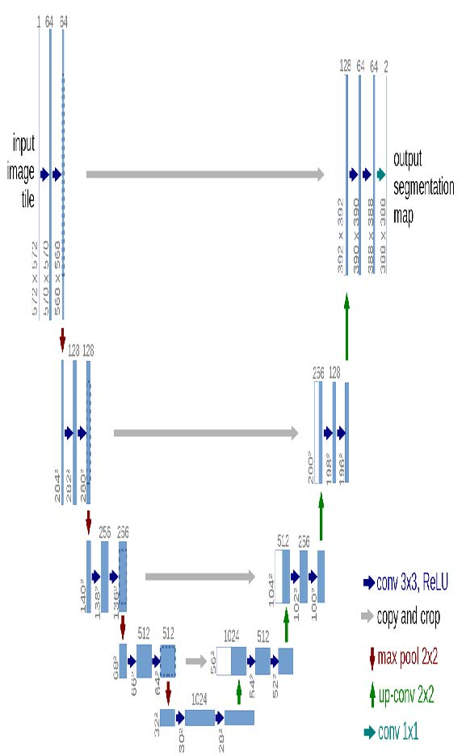
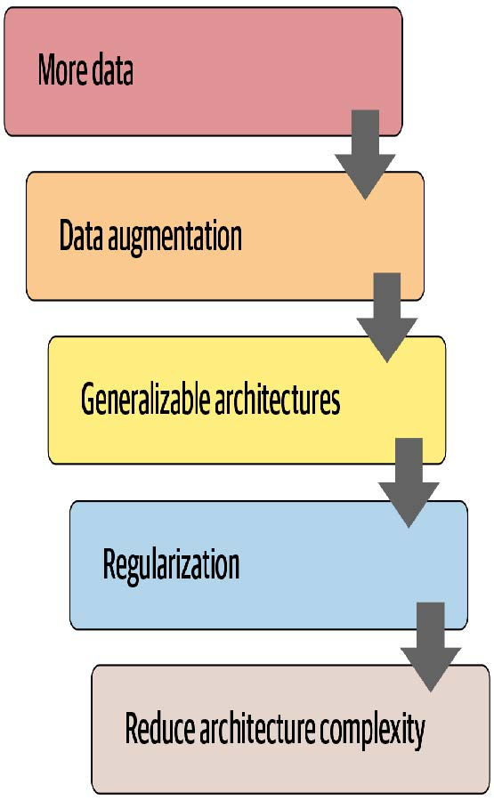

## 15. 深度解析应用程序架构

我们现在处于一个令人振奋的阶段，你应该可以全面理解我们用于计算机视觉、自然语言处理和表格分析等尖端模型的架构了。在本章中，我们将填补关于fastai应用模型运作机制的所有细节空白，并向你展示如何构建这些模型。

我们还将回顾第11章中为孪生网络设计的自定义数据预处理管道，并演示如何利用fastai库中的组件为新任务构建定制化的预训练模型。

我们将从计算机视觉开始。

### 计算机视觉

对于计算机视觉应用，我们根据任务需求使用 `cnn_learner` 和 `unet_learner` 函数构建模型。本节将探讨如何构建本书第一、二部分中使用的 `Learner` 对象。

#### `cnn_learner`

让我们看看使用 `cnn_learner` 函数时会发生什么。首先，我们向该函数传递一个用于构建网络主体的架构。大多数情况下，我们会使用 ResNet，而你已经知道如何创建它，因此无需深入探讨。预训练权重会按需下载并加载到 ResNet 中。

然后，对于迁移学习，需要对网络进行裁剪（cut）。这指的是切除最终层——该层仅负责ImageNet特有的分类任务。实际上，我们不仅切除这一层，而是从自适应平均池化层开始的所有层。其原因稍后将变得清晰。由于不同架构可能采用不同类型的池化层，甚至完全不同的头部结构，我们并非仅通过寻找自适应池化层来决定预训练模型的切割点。而是为每个模型准备了一份信息字典，用于确定其主体结束与头部开始的位置。我们称之为 `model_meta` ——以下是ResNet50的对应信息：

```python
model_meta[resnet50]
```

```text
{'cut': -2,
'split': <function fastai.vision.learner._resnet_split(m)>,
'stats': ([0.485, 0.456, 0.406], [0.229, 0.224, 0.225])}
```

> 术语：（神经网络的）躯干与头部
>
> 神经网络的头部是专门处理特定任务的部分。对于卷积神经网络，通常指自适应平均池化层之后的部分。躯干则涵盖其余所有部分，包括主干（我们在第14章中已学习过）。

如果我们取 `-2` 切割点之前的全部层，就能得到模型中fastai将保留用于迁移学习的部分。现在，我们添加新的头部。这是通过 `create_head` 函数创建的：

```python
create_head(20,2)
```

```text
Sequential(
(0): AdaptiveConcatPool2d(
(ap): AdaptiveAvgPool2d(output_size=1)
(mp): AdaptiveMaxPool2d(output_size=1)
)
(1): Flatten()
(2): BatchNorm1d(20, eps=1e-05, momentum=0.1, affine=True)
(3): Dropout(p=0.25, inplace=False)
(4): Linear(in_features=20, out_features=512, bias=False)
(5): ReLU(inplace=True)
(6): BatchNorm1d(512, eps=1e-05, momentum=0.1,
affine=True)
(7): Dropout(p=0.5, inplace=False)
(8): Linear(in_features=512, out_features=2, bias=False)
)
```

通过这个函数，你可以选择在末端添加多少个额外的线性层，每个层后应用多少比例的dropout，以及使用何种池化方式。默认情况下，fastai会同时应用平均池化和最大池化，并将两者进行拼接（即 `AdaptiveConcatPool2d` 层）。这种方法虽不常见，但近年来在fastai及其他研究机构独立开发，相较于仅使用平均池化，通常能带来小幅性能提升。

fastai 与大多数库略有不同，其默认在卷积神经网络头部添加两个线性层而非一个。正如我们所见，原因在于即使将预训练模型迁移到差异极大的领域时，迁移学习仍可能发挥作用。然而仅使用单个线性层往往难以满足此类场景需求；实践表明采用双线性层能使迁移学习在更多情境下更快速、更便捷地应用。

> 最后一批归一化
>
> 值得关注的 `create_head` 参数是 `bn_final`。将其设为 `True` 将使批量归一化层作为最终层添加。这有助于模型根据输出激活值进行合理缩放。目前尚未见此方法在文献中发表，但实践中我们发现它在所有应用场景中效果良好。

现在让我们看看 `unet_learner` 在第1章展示的分割问题中做了什么。

#### `unet_learner`

深度学习中最引人入胜的架构之一，正是我们在第一章用于分割任务的那种。图像分割是一项极具挑战性的任务，因为其输出本质上是一张图像——或者说一个像素网格，其中每个像素都承载着预测标签。其他任务也采用类似基本设计，例如提升图像分辨率（超分辨率）、为黑白图像上色（着色），或将照片转化为合成画作（风格迁移）——本书在线章节将涵盖这些任务，请务必在本章阅读后查阅。在每种情况下，我们都是从一张图像出发，将其转换为另一张尺寸或宽高比相同的图像，但像素经过某种方式的改变。我们称这些为生成式视觉模型。

我们的做法是采用与上一节完全相同的CNN头部开发方法。例如，我们从ResNet开始，切除自适应池化层及其之后的所有层，然后用自定义头部替换这些层，该头部负责生成任务。

上一句里有太多模糊处理了！我们究竟该如何创建一个能生成图像的卷积神经网络头部？假设我们从一张224像素的输入图像开始，经过ResNet主干网络处理后，最终得到的是一组7×7的卷积激活值网格。如何将这些激活值转换成224像素的分割掩膜？

当然，我们使用神经网络来实现！因此需要某种层来增加卷积神经网络的网格尺寸。一种简单方法是将7×7网格中的每个像素替换为2×2方格中的四个像素。这四个像素将具有相同值——这被称为最近邻插值（nearest neighbor interpolation）。PyTorch提供了一个实现此功能的层，因此可选方案是创建一个包含步长为1的卷积层（例如常包含批归一化和ReLU层）的头部，并在其中穿插2×2最近邻插值层。事实上，你现在就可以尝试！尝试创建一个基于此设计的自定义头部，并在CamVid分割任务上测试。你将发现结果尚可，尽管不如第一章的测试效果出色。

另一种方法是用转置卷积（transposed convolution，也称为半步长卷积，stride half convolution）替代最近邻和卷积组合。该方法与常规卷积完全相同，但会在输入图像所有像素间插入零填充。通过图示最易理解——图15-1摘自第13章讨论的优秀卷积运算论文，展示了3×3转置卷积应用于3×3图像的示意图。


[^图15-1]: 转置卷积（由Vincent Dumoulin和Francesco Visin提供）

如你所见，此操作将增加输入数据的尺寸。你现在可通过fastai的 `ConvLayer` 类进行验证：在自定义头部中传入参数 `transpose=True` ，即可创建转置卷积层替代常规卷积层。

然而，这两种方法都效果不佳。问题在于，我们的7×7网格根本没有足够的信息来生成224×224像素的输出。这要求每个网格单元的激活值必须包含足够的信息，才能完整地重构输出中的每个像素——这要求实在太高了。

解决方案是采用跳跃连接，类似于ResNet网络，但将连接从ResNet主体部分的激活层直接跳转至架构另一侧的转置卷积激活层。如图15-2所示，该方法由Olaf Ronneberger等人于2015年在论文 [《U-Net：用于生物医学图像分割的卷积神经网络》](https://oreil.ly/6ely4) 中提出。尽管该论文聚焦于医学应用，但U-Net彻底革新了各类生成式视觉模型。



[^图15-2]: U-Net架构（由Olaf Ronneberger、Philipp Fischer和Thomas Brox提出）

左侧展示的是卷积神经网络的主体结构（此处采用的是常规卷积神经网络而非ResNet，且使用2×2最大池化替代步长为2的卷积，因为该论文撰写时ResNet尚未出现），右侧则是转置卷积层（“上卷积”，up-conv）。额外的跳跃连接以灰箭头形式从左向右贯穿（有时称为交叉连接，cross connections）。由此可见为什么它被称为U-Net！

在此架构中，转置卷积的输入不仅包含前一层的低分辨率网格，还包含ResNet头部的更高分辨率网格。这使得U-Net能够根据需求利用原始图像的所有信息。U-Net面临的一个挑战是其具体架构取决于图像尺寸。fastai提供独特的 `DynamicUnet` 类，可根据输入数据自动生成适配尺寸的架构。

现在让我们聚焦于一个示例，其中我们将利用 fastai 库来编写自定义模型。

#### 孪生神经网络

让我们回到第11章为孪生网络设置的输入管道。如你所知，它包含一对图像，标签为 `True` 或 `False` ，取决于它们是否属于同一类别。

基于刚才所见内容，让我们为该任务构建一个自定义模型并进行训练。具体如何操作？我们将使用预训练架构，将两张图像输入其中。随后可将结果拼接后送入自定义头部，该头部将返回两个预测结果。在模块层面，其结构如下所示：

```python
class SiameseModel(Module):
    def __init__(self, encoder, head):
        self.encoder,self.head = encoder,head
        
    def forward(self, x1, x2):
        ftrs = torch.cat([self.encoder(x1),
                          self.encoder(x2)], dim=1)
        return self.head(ftrs)
```

要创建我们的编码器，只需像之前所述那样，取一个预训练模型并进行裁剪。`create_body` 函数会为我们完成这项工作，我们只需传入裁剪位置即可。如前所述，根据预训练模型的元数据字典，ResNet模型的裁剪值为 `-2` ：

```python
encoder = create_body(resnet34, cut=-2)
```

然后我们可以创建我们的头部。观察编码器可知，最后一层有512个特征，因此这个头部需要接收 `512×4` 个输入。为什么是4？首先我们需要乘以2，因为我们有两张图像。然后由于我们使用了concat-pool技巧，还需要再乘以2。因此我们按以下方式创建头部：

```python
head = create_head(512*4, 2, ps=0.5)
```

借助我们的编码器和头部，现在我们可以构建模型：

```python
model = SiameseModel(encoder, head)
```

在使用 `Learner` 之前，我们还需要定义两件事。首先，我们必须定义要使用的损失函数。它采用常规的交叉熵，但由于目标值是布尔值，我们需要将其转换为整数，否则PyTorch会抛出错误：

```python
def loss_func(out, targ):
    return nn.CrossEntropyLoss()(out, targ.long())
```

更重要的是，要充分利用迁移学习，我们需要定义一个自定义分割器（splitter）。分割器是一个函数，用于告知fastai库如何将模型拆分为参数组。这些参数组在迁移学习过程中被用于后台操作，仅训练模型的头部参数。

这里我们需要两个参数组：一个用于编码器，一个用于头部。因此我们可以定义以下拆分器（ `params` 只是一个返回给定模块所有参数的函数）：

```python
def siamese_splitter(model):
    return [params(model.encoder), params(model.head)]
```

然后我们可以传递数据、模型、损失函数、分割器以及任何所需的指标来定义 `Learner` 。由于我们没有使用fastai提供的转移学习便捷函数（如 `cnn_learner` ），必须手动调用 `learn.freeze` 方法。这将确保仅训练最后一个参数组（本例中为头部参数）。

```python
learn = Learner(dls, model, loss_func=loss_func,
                splitter=siamese_splitter, metrics=accuracy)

learn.freeze()
```

然后我们可以直接用常规方法训练模型：

```python
learn.fit_one_cycle(4, 3e-3)
```

| 迭代轮次 | 训练损失 | 验证损失 | 准确率   | 时间  |
| -------- | -------- | -------- | -------- | ----- |
| 0        | 0.367015 | 0.281242 | 0.885656 | 00:26 |
| 1        | 0.307688 | 0.214721 | 0.915426 | 00:26 |
| 2        | 0.275221 | 0.170615 | 0.936401 | 00:26 |
| 3        | 0.223771 | 0.159633 | 0.943843 | 00:26 |

现在我们解冻模型，并使用鉴别性学习率（即主体采用较低学习率，头部采用较高学习率）对整个模型进行进一步微调：

```python
learn.unfreeze()
learn.fit_one_cycle(4, slice(1e-6,1e-4))
```

| 迭代轮次 | 训练损失 | 验证损失 | 准确率   | 时间  |
| -------- | -------- | -------- | -------- | ----- |
| 0        | 0.212744 | 0.159033 | 0.944520 | 00:35 |
| 1        | 0.201893 | 0.159615 | 0.942490 | 00:35 |
| 2        | 0.204606 | 0.152338 | 0.945196 | 00:36 |
| 3        | 0.213203 | 0.148346 | 0.947903 | 00:36 |

当我们考虑到采用相同训练方式（未进行数据增强）的分类器错误率高达7%时，94.8%的表现已经非常不错了。

既然我们已经了解了如何创建完整的尖端计算机视觉模型，接下来让我们转向自然语言处理领域。

### 自然语言处理

将AWD-LSTM语言模型转换为迁移学习分类器，就像我们在第10章所做的那样，其过程与本章第一部分对 `cnn_learner` 的操作极为相似。此处无需“元”（meta）字典，因为主体部分无需支持多种架构。我们只需为语言模型的编码器选择堆叠式循环神经网络（单个PyTorch模块）。该编码器将为输入的每个单词提供激活值，因为语言模型需要对每个后续单词进行预测输出。

要据此创建分类器，我们采用ULMFiT论文中描述的“文本分类的批量推导时间传递（BPT3C）”方法：

> 我们将文档划分为固定长度为b的批次。在每个批次的开头，模型会根据前一批次的最终状态进行初始化；我们记录用于均值池化和最大池化的隐藏状态；梯度会反向传播至那些隐藏状态对最终预测产生影响的批次。实际操作中，我们采用可变长度的反向传播序列。

换言之，分类器包含一个 `for` 循环，用于遍历序列中的每批数据。状态在批次间保持不变，且每批次的激活值均被存储。最终，我们采用与计算机视觉模型相同的平均与最大值拼接池化技巧——但这次并非对卷积神经网络的网格单元进行池化，而是对递归神经网络序列进行池化。

对于这个 `for` 循环，我们需要分批收集数据，但每个文本都需要单独处理，因为它们各自带有不同的标签。然而，这些文本的长度很可能不尽相同，这意味着我们无法像处理语言模型那样将它们全部放入同一个数组中。

填充机制正是在此发挥作用：当抓取大量文本时，我们会确定最长文本的长度，然后用名为xxpad的特殊标记填充较短文本。为避免极端情况——例如同一批次中存在2000个词元的文本与仅10个词元的文本（导致大量填充操作和计算资源浪费），我们通过调整随机性确保相似长度的文本被分组处理。训练集中的文本顺序仍保留一定随机性（验证集可按长度排序），但并非完全随机。

这是在创建 `DataLoaders` 时，由fastai库在后台自动完成的。

### 表格化

最后，我们来看看 `fastai.tabular` 模型。（我们无需单独研究协同过滤模型，因为我们已经了解到这些模型要么就是表格模型，要么采用点积方法——而我们之前已经从头实现了这种方法。）

以下是 TabularModel 的 `forward` 方法：

```python
if self.n_emb != 0:
    x = [e(x_cat[:,i]) for i,e in enumerate(self.embeds)]
    x = torch.cat(x, 1)
    x = self.emb_drop(x)
if self.n_cont != 0:
    x_cont = self.bn_cont(x_cont)
    x = torch.cat([x, x_cont], 1) if self.n_emb != 0 else
    x_cont
return self.layers(x)
```

我们在此不展示 `__init__` 方法，因其内容较为简单，但将依次向前分析每行代码。首行仅用于检测是否存在嵌入数据——若仅处理连续变量，可跳过此部分：

```python
if self.n_emb != 0:
```

`self.embeds` 包含嵌入矩阵，因此这将获取每个元素的激活值。

```python
	x = [e(x_cat[:,i]) for i,e in enumerate(self.embeds)]
```

并将它们连接成一个张量：

```python
	x = torch.cat(x, 1)
```

然后应用了dropout机制。你可以通过将 `emb_drop` 传递给 `__init__` 来更改此值：

```python
	x = self.emb_drop(x)
```

现在我们测试是否存在需要处理的连续变量：

```python
if self.n_cont != 0:
```

它们被传递到一个批量归一化层

```	python
	x_cont = self.bn_cont(x_cont)
```

并与嵌入激活值（若有的话）进行连接：

```python
	x = torch.cat([x, x_cont], 1) if self.n_emb != 0 else
x_cont
```

最后，该输入通过线性层进行处理（若 `use_bn` 为 `True`，则每个线性层包含批量归一化；若 `ps` 被设置为某个值或值列表，则包含dropout）：

```python
return self.layers(x)
```

恭喜！现在你已经掌握了fastai库中使用的所有架构细节！

### 总结

正如你所见，深度学习架构的细节如今无需令你望而生畏。你可以深入查看fastai和PyTorch的代码，亲眼见证其运作机制。更重要的是，你得尝试理解这些机制背后的原理。你可以查阅代码中引用的论文，尝试理解代码如何与论文描述的算法相匹配。

现在我们已经研究了模型的所有组成部分以及传入其中的数据，可以思考这对实际深度学习意味着什么。若拥有无限数据、无限内存和无限时间，建议很简单：用所有数据对巨型模型进行长时间训练。但深度学习之所以复杂，恰恰在于数据、内存和时间通常都存在限制。若内存或时间即将耗尽，解决方案是训练更小的模型；若训练时间不足以达到过拟合状态，则意味着未能充分发挥模型的潜力。

因此，第一步是达到可能出现过拟合的程度。然后问题在于如何减少这种过拟合。图15-3展示了我们建议从该阶段开始优先执行的步骤。



[^图15-3]: 减少过拟合的步骤

许多从业者在面对过拟合模型时，往往从这张图的错误起点开始。他们的第一反应是采用更小的模型或增加正则化。除非模型训练耗费过多时间或内存，否则缩小模型规模绝对应该是最后采取的措施。模型规模的缩减会削弱其捕捉数据中微妙关联的能力。

相反，你首先应该寻求创造更多数据。这可能包括：为现有数据添加更多标签；寻找模型可解决的额外任务（或者换个角度思考，识别可建模的不同类型标签）；或通过更多或不同的数据增强技术创建额外的合成数据。得益于Mixup算法及类似方法的发展，如今几乎所有类型的数据都能实现有效的数据增强。

当你收集到认为合理可得的最大数据量，并通过利用所有可获取的标签及实施所有合理的数据增强手段来最大限度地发挥数据效能后，若仍出现过拟合现象，则应考虑采用更具泛化能力的架构。例如，添加批量归一化可能有助于提升泛化能力。

若在充分利用数据并优化架构后仍出现过拟合，可考虑采用正则化技术。通常在最后一层或两层添加dropout能有效正则化模型。但正如我们从AWD-LSTM发展历程所知，在模型各层添加不同类型的dropout往往能获得更显著效果。总体而言，正则化更强的较大模型通常更具灵活性，因此相较于正则化较弱的小型模型，其预测精度往往更高。

只有在考虑过所有这些方案后，我们才会建议你尝试使用更小版本的架构。

### 问卷调查

1. 神经网络的头部是什么？
2. 神经网络的主体是什么？
3. 什么是神经网络的“切割”？为什么在迁移学习中需要这样做？
4. `model_meta` 是什么？尝试打印它以查看内部内容。
5. 阅读 `create_head` 的源代码，确保理解每行代码的作用。
6. 观察 `create_head` 的输出结果，确保理解每层存在的意义，以及 `create_head` 源代码如何生成这些层。
7. 探索如何修改 `create_cnn` 生成的dropout参数、层尺寸及层数，尝试寻找能提升宠物识别器准确率的参数组合。
8. `AdaptiveConcatPool2d` 的功能是什么？
9. 最近邻插值法是什么？如何将其用于卷积激活值的上采样？
10. 转置卷积是什么？其别称是什么？
11. 使用 `transpose=True` 创建转置卷积层，并将其应用于图像。检查输出形状。
12. 绘制U-Net网络架构图。
13. 文本分类的反向传播时间推延（BPT3C）是什么？
14. BPT3C中如何处理不同长度的序列？
15. 尝试在笔记本中分别运行 `TabularModel.forward` 的每行代码（每行代码单独占用一个单元格），并观察各步骤的输入输出形状。
16. `TabularModel` 中 `self.layers` 如何定义？
17. 防止过拟合的五个步骤是什么？
18. 为什么在尝试其他防止过拟合的方法前，不先降低架构复杂度？

#### 进一步研究

1. 编写自定义头部模型，尝试用它训练宠物识别器。看看能否获得比fastai默认模型更好的效果。
2. 在卷积神经网络头部中切换使用 `AdaptiveConcatPool2d` 和 `AdaptiveAvgPool2d` ，观察其效果差异。
3. 为每个ResNet模块编写自定义分割器创建独立参数组，并将主干单独分组。尝试训练后观察宠物识别器的性能提升。
4. 阅读关于生成式图像模型的在线章节，尝试为每个ResNet模块创建独立参数组，并将主干单独分组。尝试训练后观察宠物识别器的性能提升。参数组，并为茎部单独创建一个组。尝试用它进行训练，看看是否能提高宠物识别器的性能。

4. 阅读关于生成式图像模型的在线章节，并创建你自己的着色器、超分辨率模型或风格迁移模型。
5. 使用最近邻插值创建自定义头部，并用它对CamVid进行分割。
