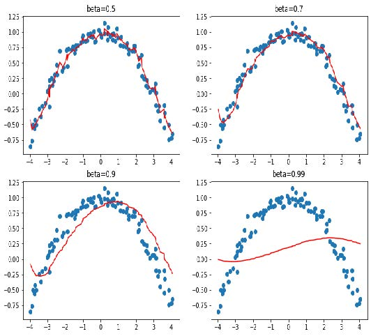
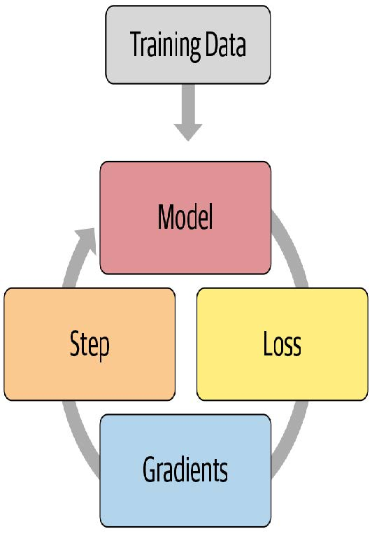
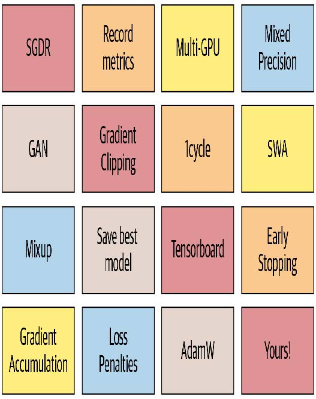

## 16. 训练过程

现在你已经掌握了如何为计算机视觉、自然图像处理、表格分析和协同过滤创建尖端架构，并懂得如何快速训练它们。那么我们完成了吗？还差一点。我们还需要进一步探索训练过程中的某些细节。

我们在第4章阐述了随机梯度下降的基础原理：将小批量数据传递给模型，通过损失函数将其与目标值进行比较，随后计算该损失函数对每个权重的梯度，最后使用公式更新权重：

```python
new_weight = weight - lr * weight.grad
```

我们从头开始在训练循环中实现了这一过程，并发现PyTorch提供了一个简单的 `nn.SGD` 类，它能为我们完成每个参数的计算。在本章中，我们将基于灵活的基础架构构建更高效的优化器。但这并非我们在训练过程中可能需要调整的全部内容。针对训练循环的任何调整，我们都需要一种方式在 SGD 基础架构中插入代码。fastai 库通过回调系统实现这一功能，我们将全面讲解其使用方法。

首先采用标准的梯度下降法作为基准模型，随后我们将介绍最常用的优化器。

### 建立基准模型

首先我们将使用普通的SGD创建基准模型，并与fastai的默认优化器进行比较。我们将从获取Imagenette数据集开始，使用与第14章相同的 `get_data` 函数：

```python
dls = get_data(URLs.IMAGENETTE_160, 160, 128)
```

我们将创建一个未预训练的ResNet-34模型，并传递接收到的任何参数：

```python
def get_learner(**kwargs):
    return cnn_learner(dls, resnet34, pretrained=False,
                       metrics=accuracy, **kwargs).to_fp16()
```

以下是默认的fastai优化器，采用常规的3e-3学习率：

```python
learn = get_learner()
learn.fit_one_cycle(3, 0.003)
```

| 迭代轮次 | 训练损失 | 验证损失 | 准确率   | 时间  |
| -------- | -------- | -------- | -------- | ----- |
| 0        | 2.571932 | 2.685040 | 0.322548 | 00:11 |
| 1        | 1.904674 | 1.852589 | 0.437452 | 00:11 |
| 2        | 1.586909 | 1.374908 | 0.594904 | 00:11 |

现在我们尝试使用普通的SGD。我们可以将 `opt_func`（优化函数）传递给  `cnn_learner`，让fastai使用任意优化器：

```python
learn = get_learner(opt_func=SGD)
```

首先要查看的是 `lr_find`：

```python
learn.lr_find()
```

```text
(0.017378008365631102, 3.019951861915615e-07)
```


看来我们需要使用比平时更高的学习率：

```python
learn.fit_one_cycle(3, 0.03, moms=(0,0,0))
```

| 迭代轮次 | 训练损失 | 验证损失 | 准确率   | 时间  |
| -------- | -------- | -------- | -------- | ----- |
| 0        | 2.969412 | 2.214596 | 0.242038 | 00:09 |
| 1        | 2.442730 | 1.845950 | 0.362548 | 00:09 |
| 2        | 2.157159 | 1.741143 | 0.408917 | 00:09 |

由于动量加速梯度下降法效果显著，fastai在 `fit_one_cycle` 中默认启用该功能，因此我们通过 `moms=(0,0,0)` 将其关闭。动量机制将在后续章节详细讨论。

显然，普通的随机梯度下降法训练速度不如我们期望的快。那么让我们学习一些技巧来实现加速训练吧！

### 通用优化器

要构建我们的加速随机梯度下降技巧，需要从一个灵活的优化器基础开始。在fastai之前，没有库提供这样的基础，但在fastai的开发过程中，我们意识到学术文献中所有优化的改进都可以通过优化器回调（optimizer callbacks）来实现。这些可组合的小代码片段可在优化器中自由组合搭配，构建出完整的优化器步骤。它们由fastai轻量级的 `Optimizer` 类调用。本书中使用的两个关键方法在 `Optimizer` 中的定义如下：

```python
def zero_grad(self):
    for p,*_ in self.all_params():
        p.grad.detach_()
        p.grad.zero_()
        
def step(self):
    for p,pg,state,hyper in self.all_params():
        for cb in self.cbs:
            state = _update(state, cb(p, **{**state,
                                            **hyper}))
            self.state[p] = state
```

正如我们在从头训练MNIST模型时所见， `zero_grad` 只是遍历模型的参数并将梯度设为零。它还会调用 `detach_` ，该函数会清除所有梯度计算的历史记录，因为在 `zero_grad` 之后这些记录就不再需要了。

更有趣的方法是 `step`，它循环遍历回调函数（`cbs`）并调用它们来更新参数（ `_update` 函数仅在 `cb` 返回任何值时调用 `state.update` ）。如你所见，`Optimizer` 本身并不执行任何随机梯度下降步骤。让我们看看如何为 `Optimizer` 添加随机梯度下降功能。

以下是一个执行单次随机梯度下降步长的优化器回调函数，其实现方式是：将梯度与 `-lr` 相乘，并将结果加到参数上（当PyTorch的 `Tensor.add_` 接收两个参数时，会在相加前先进行相乘运算）：

```python
def sgd_cb(p, lr, **kwargs): p.data.add_(-lr, p.grad.data)
```

我们可以使用 `cbs` 参数将此参数传递给 `Optimizer` ；我们需要使用 `partial` 函数，因为 `Learner` 稍后会调用此函数来创建我们的优化器：

```python
opt_func = partial(Optimizer, cbs=[sgd_cb])
```

让我们看看这个能否训练成功：

```python
learn = get_learner(opt_func=opt_func)
learn.fit(3, 0.03)
```

| 迭代轮次 | 训练损失 | 验证损失 | 准确率   | 时间  |
| -------- | -------- | -------- | -------- | ----- |
| 0        | 2.730918 | 2.009971 | 0.332739 | 00:09 |
| 1        | 2.204893 | 1.747202 | 0.441529 | 00:09 |
| 2        | 1.875621 | 1.684515 | 0.445350 | 00:09 |

成功了！原来这就是我们在fastai中从零创建随机梯度下降的方法。现在让我们看看这个“动量”究竟是什么。

### 动量优化器

正如第四章所述，梯度下降法可类比为站在山顶，通过每次沿着最陡坡度方向迈步向下移动。但若让一个球滚下山坡呢？由于具有动量，它在每个位置并不会精确沿着梯度方向滚动。动量更大的球体（例如更重的球）会跳过小凸起和坑洞，更可能抵达崎岖的山底；而乒乓球则会卡在每个细微缝隙中。

那么我们如何将这个想法应用到梯度下降算法中呢？我们可以使用移动平均值，而不是仅使用当前梯度来计算步长：

```python
weight.avg = beta * weight.avg + (1-beta) * weight.grad
new_weight = weight - lr * weight.avg
```

这里 `beta` 是我们选择的一个数值，用于定义动量的大小。若 `beta` 为0，则第一个方程变为 `weight.avg = weight.grad`，最终得到纯粹的梯度下降算法。但若取值接近1时，主方向选择则取前几步的平均值。（如果你有统计学基础，你应该会发现第一个等式对应指数加权移动平均，该方法常用于数据去噪并提取潜在趋势。）

请注意，我们写入 `weight.avg` 是为了强调需要为模型的每个参数分别存储移动平均值（它们各自拥有独立的移动平均值）。

图16-1展示了一个单参数的噪声数据示例，其中动量曲线以红色绘制，参数梯度以蓝色绘制。梯度先增后减，而动量在追踪总体趋势时表现良好，且未过度受噪声影响。


当损失函数存在需要穿越的狭窄峡谷时，该方法效果尤为显著：标准梯度下降会使我们不断在两侧弹跳，而动量梯度下降则会取其平均值，使我们顺畅地沿着侧面滚落。参数 `beta` 决定动量强度： `beta` 值较小时，我们更贴近实际梯度值； `beta` 值较高时，则主要沿梯度平均值方向移动，梯度变化需经过一段时间才会改变这种趋势。

当 `beta` 值较大时，我们可能忽略梯度方向已发生改变，从而在局部小极小值处翻转。这是我们期望的副作用：直观而言，当模型接收新输入时，它会呈现出类似训练集样本的特征，但并非完全相同。该输入对应的损失函数点将接近训练结束时达到的最小值，但并非精确落在该极小值上。因此我们更倾向于在宽广的最小值区域内训练，该区域内邻近点的损失值大致相当（或可理解为损失曲线尽可能平坦的点）。图16-2展示了当 `beta` 值变化时图16-1中曲线的动态变化。



[^图16-2]: 不同β值下的动量

从这些例子中可以看出，过高的 `beta` 值会导致梯度变化被整体忽略。在动量式梯度下降算法中，常用的 `beta` 值为0.9。

`fit_one_cycle` 默认以 0.95 的 `beta` 开始，逐步调整至 0.85，并在训练结束时逐渐恢复至 0.95。让我们看看在普通随机梯度下降中加入动量后训练效果如何。

为增强优化器的运算效率，我们首先需要追踪移动平均梯度，这可通过另一个回调函数实现。当优化器回调函数返回 `dist` 时，该字典将用于更新优化器状态，并在下一步传递回优化器。因此，此回调函数将通过名为 `grad_avg` 的参数追踪梯度平均值：

```python
def average_grad(p, mom, grad_avg=None, **kwargs):
    if grad_avg is None: grad_avg =
    torch.zeros_like(p.grad.data)
    return {'grad_avg': grad_avg*mom + p.grad.data}
```

使用时只需将步骤函数中的 `p.grad.data` 替换为 `grad_avg` 即可：

```python
def momentum_step(p, lr, grad_avg, **kwargs): p.data.add_(-
lr, grad_avg)
```

```python
opt_func = partial(Optimizer, cbs=
[average_grad,momentum_step], mom=0.9)
```

`Learner` 会自动安排 `mom` 和 `lr` ，因此 `fit_one_cycle` 甚至能与我们的自定义优化器配合使用：

```python
learn = get_learner(opt_func=opt_func)
learn.fit_one_cycle(3, 0.03)
```

| 迭代轮次 | 训练损失 | 验证损失 | 准确率   | 时间  |
| -------- | -------- | -------- | -------- | ----- |
| 0        | 2.856000 | 2.493429 | 0.246115 | 00:10 |
| 1        | 2.504205 | 2.463813 | 0.348280 | 00:10 |
| 2        | 2.187387 | 1.755670 | 0.418853 | 00:10 |

```python
learn.recorder.plot_sched()
```


我们仍然没有取得理想的效果，所以让我们看看还能采取哪些措施。

### RMSProp算法

RMSProp是Geoffrey Hinton在其Coursera课程 [《机器学习中的神经网络》](https://oreil.ly/FVcIE) 第6e讲中提出的另一种SGD变体。其与SGD的核心差异在于采用自适应学习率：不再为所有参数使用统一学习率，而是为每个参数分配独立的学习率，并由全局学习率进行调控。通过为需要大幅调整的权重赋予更高学习率，同时为表现良好的权重设置较低学习率，从而显著提升训练速度。

如何决定哪些参数应采用高学习率，哪些不应采用？我们可以观察梯度来判断。若某个参数的梯度长期接近于零，则该参数需要更高的学习率，因为此时损失函数趋于平坦。反之，若梯度波动剧烈，则应谨慎选择较低学习率以避免收敛失败。我们不能简单地取梯度的平均值来判断变化幅度，因为正负数相差较大时平均值接近零。替代方案是采用常规技巧：取绝对值或平方值（然后在求均值后取平方根）。

再次，为确定噪声背后的总体趋势，我们将使用移动平均值——具体而言，是梯度平方的移动平均值。随后通过以下方式更新对应权重：取当前梯度（作为方向）除以该移动平均值的平方根（如此可实现：当平均值较低时，有效学习率相应提高；当平均值较高时，有效学习率相应降低）：

```python
w.square_avg = alpha * w.square_avg + (1-alpha) * (w.grad **
2)
new_w = w - lr * w.grad / math.sqrt(w.square_avg + eps)
```

添加 `eps`（epsilon）参数是为了提高数值稳定性（通常设置为1e-8），而 `alpha` 的默认值通常为0.99。

我们可以像为 `avg_grad` 所做的那样，将此添加到优化器中，但需要额外添加 `**2`：

```python
def average_sqr_grad(p, sqr_mom, sqr_avg=None, **kwargs):
    if sqr_avg is None: sqr_avg =
    torch.zeros_like(p.grad.data)
    return {'sqr_avg': sqr_avg*sqr_mom + p.grad.data**2}
```

我们可以像之前那样定义阶跃函数和优化器：

```python
def rms_prop_step(p, lr, sqr_avg, eps, grad_avg=None,
                  **kwargs):
    denom = sqr_avg.sqrt().add_(eps)
    p.data.addcdiv_(-lr, p.grad, denom)
    opt_func = partial(Optimizer, cbs=
                       [average_sqr_grad,rms_prop_step],
                       sqr_mom=0.99, eps=1e-7)
```

让我们试试看：

```python
learn = get_learner(opt_func=opt_func)
learn.fit_one_cycle(3, 0.003)
```

| 迭代轮次 | 训练损失 | 验证损失 | 准确率   | 时间  |
| -------- | -------- | -------- | -------- | ----- |
| 0        | 2.766912 | 1.845900 | 0.402548 | 00:11 |
| 1        | 2.194586 | 1.510269 | 0.504459 | 00:11 |
| 2        | 1.869099 | 1.447939 | 0.544968 | 00:11 |

好多了！现在我们只需将这些想法整合起来，而我们已有Adam优化器——fastAI的默认优化器。

### Adam优化器

Adam将梯度下降（SGD）与动量和均方根正则化（RMSProp）的理念融合：它采用梯度的移动平均值作为方向，并除以梯度平方的移动平均值的平方根，从而为每个参数提供自适应的学习率。

Adam计算移动平均线的方式还存在另一处差异。它采用无偏移动平均线，即

```python
w.avg = beta * w.avg + (1-beta) * w.grad
unbias_avg = w.avg / (1 - (beta**(i+1)))
```

若当前为第 `i` 次迭代（从0开始计数，与Python一致）。这个除数 `1 - (beta ** (i+1))` 确保无偏平均值更接近初始阶段的梯度（由于 `beta < 1` ，分母很快趋近于1）。

综合以上内容，我们的更新步骤如下：

```python
w.avg = beta1 * w.avg + (1-beta1) * w.grad
unbias_avg = w.avg / (1 - (beta1**(i+1)))
w.sqr_avg = beta2 * w.sqr_avg + (1-beta2) * (w.grad ** 2)
new_w = w - lr * unbias_avg / sqrt(w.sqr_avg + eps)
```

至于RMSProp，`eps` 通常设置为1e-8，而文献建议的 `(beta1,beta2)` 默认值为 `(0.9,0.999)` 。

在fastai中，我们默认使用Adam优化器，因其能加快训练速度，但我们发现 `beta2=0.99` 更适合当前采用的学习率调度方案。 `beta1` 是动量参数，通过 `fit_one_cycle` 调用中的 `moms` 参数进行指定。关于 `eps` 参数，fastai默认值为 1e-5。`eps` 不仅用于数值稳定性控制，更重要的是：较高的 `eps` 值会限制调整后学习率的最大值。以极端情况为例，若 `eps` 设为1，则调整后的学习率永远不会超过基础学习率。

本书不会展示全部代码，你可查阅fastai的GitHub仓库（浏览 `_nbs` 文件夹并搜索名为 `optimizer` 的笔记本）。你将看到我们迄今展示的所有代码，以及Adam等其他优化器，还有大量示例和测试。

从SGD切换到Adam时，一个变化点在于权重衰减的应用方式，这可能带来重要影响。

### 解耦权重衰减

权重衰减（我们在第8章讨论过）等同于（在标准SGD情况下）通过以下方式更新参数：

```python
new_weight = weight - lr*weight.grad - lr*wd*weight
```

该公式的最后一部分解释了此技术的命名依据：每个权重都会按 `lr * wd` 的因子衰减。

权重衰减的另一个名称是L2正则化（L2 regularization），其实现方式是将所有权重平方之和（乘以权重衰减因子）添加到损失函数中。正如我们在第8章所见，这可直接通过梯度表达：

```python
weight.grad += wd*weight
```

对于SGD，这两个公式是等价的。然而，这种等价性仅适用于标准梯度下降，因为正如我们在动量、RMSProp或Adam中看到的那样，其更新公式围绕梯度包含了额外的计算。

大多数库采用第二种公式，但伊利亚·洛什奇洛夫（Ilya Loshchilov）和弗兰克·胡特（Frank Hutter）在 [《解耦权重衰减正则化》](https://oreil.ly/w37Ac) 一文中指出，对于Adam优化器或动量优化器而言，第一种公式才是唯一正确的方法，因此fastai将其设为默认选项。

现在你已知晓隐藏在 `learn.fit_one_cycle` 之后的所有秘密!

优化器仅是训练流程的一部分。当你需要修改fastai的训练循环时，无法直接修改库内的代码。为此，我们设计了一套回调系统，让你能在独立代码块中编写任意调整方案，并自由组合搭配。

### 回调函数

有时需要对训练机制稍作调整。事实上，我们已经见过相关案例：Mixup、fp16训练、训练循环神经网络时每隔一个迭代轮次重置模型等等。那么，我们该如何对训练过程进行这类微调呢？

我们已经了解了基础训练循环，借助 `Optimizer` 类，一个迭代轮次的训练过程如下所示：

```python
for xb,yb in dl:
    loss = loss_func(model(xb), yb)
    loss.backward()
    opt.step()
    opt.zero_grad()
```

图16-3展示了如何进行可视化呈现。



[^图16-3]: 基本训练循环

深度学习从业者定制训练循环的常规做法是复制现有训练循环，然后在其中插入特定修改所需的代码。网上绝大多数代码都是这种形式。但这种做法存在严重问题。

某个经过特定调整的训练循环不太可能满足你的具体需求。训练循环可进行数百种修改，这意味着存在数以十亿计的可能组合。你不能简单地从这个训练循环中复制一个调整，从那个训练循环中复制另一个调整，就期望它们能协同工作。每个调整都基于对运行环境的不同假设，采用不同的命名规范，并要求数据采用不同的格式。

我们需要一种方法，允许用户在训练循环的任意位置插入自定义代码，但必须以一致且明确定义的方式实现。计算机科学家早已提出了一个优雅的解决方案：回调函数。回调函数是由你编写并注入到另一段代码中、在预定义位置执行的代码片段。事实上，多年以来回调机制已在深度学习训练循环中应用。问题在于早期库仅支持在极少数必要位置插入代码——更关键的是，回调功能未能实现其应有的全部潜力。

为了实现与手动复制粘贴训练循环并直接插入代码同样的灵活性，回调函数必须能够读取训练循环中所有可用的信息，根据需要修改所有内容，并完全控制批次、迭代轮次甚至整个训练循环的终止时机。fastai 是首个提供完整功能的库。它修改训练循环使其呈现如图 16-4 所示的结构。


[^图16-4]: 带有回调函数的训练循环

过去几年间，这种方法的有效性已得到充分验证——通过使用fastai回调系统，我们成功实现了每篇尝试的新论文，并满足了用户对修改训练循环的所有需求。训练循环本身无需任何改动。图16-5展示了新增回调中的部分示例。



[^图16-5]: 一些fastai的回调函数

这很重要，因为它意味着无论我们脑海中有何想法都能付诸实践。我们无需深入研究PyTorch或fastai的源代码，也无需拼凑一次性系统来验证想法。当我们通过实现自定义回调函数来拓展思路时，这些功能将与fastai提供的所有特性无缝协同——进度条、混合精度训练、超参数退火等功能皆可自然获得。

另一个优势在于它便于逐步移除或添加功能，并执行消融研究。你只需调整传递给拟合函数的回调函数列表即可。

例如，以下是训练循环中每批次运行的 fastai 源代码：

```python
try:
    self._split(b);
    self('begin_batch')
    self.pred = self.model(*self.xb);
    self('after_pred')
    self.loss = self.loss_func(self.pred, *self.yb);
    self('after_loss')
    if not self.training: return
self.loss.backward();
self('after_backward')
self.opt.step();
self('after_step')
self.opt.zero_grad()
except CancelBatchException:
    self('after_cancel_batch')
finally:
    self('after_batch')
```

形式为 `self(‘...’)` 的调用即为回调函数被调用的位置。如你所见，这发生在每个训练步骤之后。回调函数将接收完整的训练状态，并可对其进行修改。例如，输入数据和目标标签分别存储在 `self.xb` 和 `self.yb` 中；回调函数可修改这些数据以改变训练循环所处理的数据。它还能修改 `self.loss` 甚至梯度值。

让我们通过编写回调函数来看看实际效果如何

#### 编写一个回调函数

当你需要编写自己的回调函数时，可用的事件完整列表如下：

- `begin_fit`

  在执行任何操作前调用；适用于初始化设置。

- `begin_epoch`

  在每个迭代轮次开始时调用；适用于需要在每迭代轮次重置的任何行为。

- `begin_train`

  在迭代轮次的训练阶段开始时调用。

- `begin_batch`

  在每个批次开始时调用，紧接在抽取该批次之后。可用于批次处理的必要配置（如超参数调度）或在输入/目标进入模型前进行修改（例如应用混合操作）。

- `after_pred`

  在模型对批次计算输出后调用。可用于在损失函数接收前修改该输出。

- `after_loss`

  在损失计算完成后、反向传播前调用。可用于向损失添加惩罚项（例如 RNN 训练中的 AR 或 TAR）。

- `after_backward`

  在反向传播完成后、参数更新前调用。可用于在参数更新前修改梯度（例如通过梯度裁剪）。

- `after_step`

  在步长执行后、梯度归零前调用。

- `after_batch`

  在批次结束时调用，用于执行批次间必要的清理操作。

- `after_train`

  在训练阶段结束时调用。

- `begin_validate`

  在迭代轮次验证阶段开始时调用；适用于验证阶段特有的初始化设置。

- `after_validate`

  在迭代轮次验证阶段结束时调用。

- `after_epoch`

  在迭代轮次结束时调用，用于执行下个迭代轮次前的清理工作。

- `after_fit`

  在训练结束时调用，执行最终清理操作。

此列表中的元素可作为特殊变量 `event` 的属性使用，因此你只需在笔记本中输入 `event.` 并按下 Tab 键，即可查看所有选项的列表。

让我们看一个例子。你还记得在第12章中，我们需要确保在每个迭代轮次的训练和验证开始时调用特殊的 `reset` 方法吗？我们使用 fastai 提供的 `ModelResetter` 回调函数来实现这一点。但它究竟是如何工作的呢？以下是该类的完整源代码：

```python
class ModelResetter(Callback):
    def begin_train(self): self.model.reset()
    def begin_validate(self): self.model.reset()
```

是的，其实就是这样！它只是执行了我们在前一段所述的内容：完成一个迭代轮次的训练或验证后，调用一个名为 `reset` 的方法。

回调函数通常像这样“简洁明了”。事实上，我们再来看看另一个示例。以下是添加RNN正则化（AR和TAR）的回调函数在fastai中的源代码：

```python
class RNNRegularizer(Callback):
    def __init__(self, alpha=0., beta=0.):
        self.alpha,self.beta = alpha,beta
        
    def after_pred(self):
        self.raw_out,self.out = self.pred[1],self.pred[2]
        self.learn.pred = self.pred[0]
        
    def after_loss(self):
        if not self.training: return
    
    	if self.alpha != 0.:
            self.learn.loss += self.alpha *
            self.out[-1].float().pow(2).mean()
            if self.beta != 0.:
                h = self.raw_out[-1]
                if len(h)>1:
                    self.learn.loss += self.beta * (h[:,1:] -
                                                    h[:,:-1]                                                   ).float().pow(2).mean()
```

> 自己来写代码：
>
> 请重新阅读《激活正则化与时间激活正则化》，然后再次审视此处的代码。确保你理解其运作机制及背后的原理。

在这两个示例中，请注意我们如何通过直接检查 `self.model` 或 `self.pred` 来访问训练循环的属性。这是因为回调函数总是会尝试从关联的学习器内部获取其自身不具备的属性。这些是 `self.learn.model` 或 `self.learn.pred` 的快捷方式。请注意，它们仅适用于读取属性，而不能用于写入属性——这正是当 `RNNRegularizer` 修改损失值或预测值时，你会看到 `self.learn.loss =` 或 `self.learn.pred =` 的原因。

在编写回调函数时，`Learner` 的以下属性可用：

- `model`

  用于训练/验证的模型。

- `data`

  `DataLoaders` 的底层。

- `loss_func`

  使用的损失函数。

- `opt`

  用于更新模型参数的优化器。

- `opt_func`

  用于创建优化器的函数。

- `cbs`

  包含所有 `Callbacks` 的列表。

- `dl`

  当前用于迭代的 `DataLoader` 。

- `x/xb`

  从 `self.dl` 中提取的最后一个输入（可能被回调函数修改）。`xb` 始终为元组（可能仅含一个元素）。`x` 经过解元组化处理。仅可对 `xb` 进行赋值。

- `y/yb`

  从 `self.dl` 中抽取的最后一个目标值（可能被回调函数修改）。`yb` 始终为元组（可能仅含一个元素），`y` 经过解元组化处理。仅可对 `yb` 进行赋值。

- `pred`

  来自 `self.model` 的最后预测结果（可能被回调函数修改）。

- `loss`

  最后计算的损失值（可能被回调函数修改）。

- `n_epoch`

  本次训练的迭代轮次总数。

- `n_iter`

  当前 `self.dl` 的迭代次数。

- `epoch`

  当前迭代轮次的索引（范围 `0` 至 `n_epoch-1`）。

- `iter`

  当前 `self.dl` 中的迭代索引（范围 `0` 至 `n_iter-1`）。

以下属性由 `TrainEvalCallback` 函数添加，除非你刻意移除了该回调函数，否则应可使用：

- `train_iter`

  自本次训练开始以来完成的训练迭代次数

- `pct_train`

  已完成训练迭代的百分比（范围为0到1）

- `training`

  用于标记当前是否处于训练模式的标志

以下属性由 `Recorder` 添加，除非你刻意移除了该回调函数，否则应始终可用：

- `smooth_loss`

  训练损失的指数平均版本

回调函数也可通过异常系统中断训练循环的任意部分。

#### 回调顺序与异常处理

有时回调函数需要能够指示fastai跳过某个批次或整个迭代轮次，甚至完全停止训练。例如，考虑 `TerminateOnNaNCallback` 这个便捷的回调函数——当损失值变为无穷大或NaN（非数值）时，它会自动终止训练。以下是该回调函数的fastai源代码：

```python
class TerminateOnNaNCallback(Callback):
    run_before=Recorder
    def after_batch(self):
        if torch.isinf(self.loss) or torch.isnan(self.loss):
            raise CancelFitException
```

`raise CancelFitException` 异常的代码行指示训练循环在此处中断训练。训练循环捕获此异常后，将不再执行后续训练或验证操作。可用的回调控制流异常如下：

- `CancelFitException`

  跳过本批次剩余部分，转至 `after_batch`。

- `CancelEpochException`

  跳过本训练迭代轮次剩余部分，转至 `after_train`。

- `CancelTrainException`

  跳过该迭代轮次剩余验证阶段，转至 `after_validate`。

- `CancelValidException`

  跳过该迭代轮次剩余验证阶段，转至 `after_epoch`。

- `CancelBatchException`

  中断训练，转至 `after_fit`。

你可以检测是否发生了上述异常之一，并添加代码，该代码将在以下事件发生后立即执行：

- `after_cancel_batch`

  在 `CancelBatchException` 异常发生后立即到达，在进入 `after_batch` 之前

- `after_cancel_train`

  在 `CancelTrainException` 异常发生后立即到达，在进入 `after_epoch` 之前

- `after_cancel_valid`

  在 `CancelValidException` 异常发生后立即触发，随后进入 `after_epoch`

- `after_cancel_epoch`

  在 `CancelEpochException` 异常发生后立即触发，随后进入 `after_epoch`

- `after_cancel_fit`

  在 `CancelFitException` 异常发生后立即触发，随后进入 `after_fit`

有时回调函数需要按特定顺序调用。例如，在 `TerminateOnNaNCallback` 的情况下，确保 `Recorder` 在该回调函数之后运行其 `after_batch` 方法回调至关重要，这样可以避免记录 `NaN` 损失。你可在回调中指定 `run_before`（该回调必须在…之前执行）或 `run_after`（该回调必须在…之后执行），以确保所需的执行顺序。

### 总结

在本章中，我们深入探讨了训练循环，研究了梯度下降算法的变体及其更强大的原因。在撰写本书时，开发新型优化器仍是活跃的研究领域，因此当你阅读本章时，本书网站可能已发布附录介绍最新变体。请务必了解我们的通用优化器框架如何助你快速实现新型优化器。

我们还研究了强大的回调系统，它允许你在每次训练步骤之间检查和修改任何参数，从而实现对训练循环的全面定制。

### 问卷调查

1. SGD的单步更新公式是什么？请用数学表达式或代码（任选其一）说明。
2. 要使用非默认优化器时，应向 `cnn_learner` 传递什么参数？
3. 什么是优化器回调函数？
4. 优化器中的 `zero_grad` 函数有何作用？
5. 优化器中的 `step` 函数如何实现？通用优化器中如何实现？
6. 重写 `sgd_cb` 函数，用 `+=` 运算符替代 `add_`。
7. 什么是动量法？写出计算公式。
8. 动量的物理类比是什么？它如何应用于模型训练场景？
9. 增大动量值对梯度有何影响？
10. 单轮训练中动量的默认值是多少？
11. 什么是RMSProp？写出计算公式。
12. 梯度的平方值代表什么？
13. Adam 优化器与动量法、RMSProp 的区别？
14. 写出 Adam 优化器的计算公式。
15. 计算若干批次虚拟数据的 `unbias_avg` 和 `w.avg` 值。
16. Adam 优化器中 `eps` 值过高会产生什么影响？
17. 阅读 fastai 仓库中的优化器笔记本并执行。
18. 动态学习率方法（如 Adam法）在何种情况下会改变权重衰减的行为？
19. 训练循环包含哪四个步骤？
20. 为什么使用回调比为每次调整都编写新训练循环更好？
21. fastai 回调系统的哪些设计使其灵活到如同复制粘贴代码片段？
22. 编写回调时如何获取可用事件列表？
23. 编写 `ModelResetter` 回调（不使用 peeking）。
24. 如何在回调内部访问训练循环的必要属性？何时可使用或不可使用其配套快捷方式？
25. 回调如何影响训练循环的控制流？
26. 编写 `TerminateOnNaN` 回调（尽可能不偷看代码）。
27. 如何确保回调在另一个回调之前或之后运行？

#### 进一步研究

1. 查阅《修正Adam算法》论文，使用通用优化器框架实现该算法并进行测试。搜索其他在实践中表现良好的新型优化器，选取其中一种进行实现。
2. 查阅文档中的混合精度回调函数。尝试理解每个事件和代码行所起的作用。
3. 从零开始实现你自己的学习率搜索器版本。将其与fastai的版本进行比较。

4. 查看fastai自带回调函数的源代码。看看能否找到与你目标相似的实现，以获取灵感。

### 深度学习基础：总结

恭喜你——你已经完成了本书“深度学习基础”章节的学习！现在你已掌握fastai所有应用程序和核心架构的构建原理，以及推荐的训练方法——更具备从零构建这些系统的全部知识。虽然你可能无需亲手编写训练循环或批量归一化层，但理解底层机制对调试、性能分析和解决方案部署都很有帮助。

既然你已经理解了fastai应用程序的基础知识，请务必花些时间深入研究笔记本的源代码，并运行和实验其中的部分内容。这将使你更清楚地了解fastai中所有内容的具体开发方式。

在下一部分中，我们将深入探索神经网络的底层机制：我们将研究神经网络实际的前向传播和反向传播过程，并了解可用于提升性能的工具。随后我们将开展一个项目，整合本书所有内容，以此构建用于解释卷积神经网络的工具。最后但同样重要的是，我们将从零开始构建fastai的 `Learner` 类。
