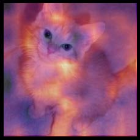

## 18. 利用 CAM 作为 CNN 的解释

既然我们已经掌握了从零构建几乎任何东西的方法，就让我们运用这些知识创造出全新的（且非常实用的！）功能：类激活图。它能帮助我们理解卷积神经网络为何做出特定预测。

在此过程中，我们将了解PyTorch一个之前未曾接触的实用功能——钩子（hook），并应用本书后续章节中介绍的诸多概念。若想真正检验你对本书内容的理解，完成本章学习后，不妨暂时搁置书本，尝试从零开始独立重现此处的所有思路（切勿偷看！）。

### CAM与钩子

类激活图（class activation map，CAM）由Bolei Zhou等人于 [《学习用于判别式定位的深度特征》](https://oreil.ly/5hik3) 中提出。它利用最后一个卷积层（平均池化层之前）的输出与预测结果，生成热力图可视化模型决策依据，是实现模型可解释性的有效工具。

更精确地说，在卷积层的每个位置，我们使用的滤波器数量与最后一个线性层相同。因此，我们可以计算这些激活值与最终权重的点积，从而为特征图上的每个位置获得用于决策的特征得分。

在训练过程中，我们需要一种方法来访问模型内部的激活值。在PyTorch中，这可以通过钩子实现。钩子相当于fastai中的回调函数，但不同之处在于：fastai的 `Learner` 回调允许你在训练循环中注入代码，而钩子则允许你直接在前向和反向传播计算过程中注入代码。我们可以将钩子附加到模型的任意层，它将在计算输出时（前向钩子）或反向传播期间（反向钩子）执行。前向钩子是一个接受三个参数的函数——模块、输入和输出——它可以执行任何你想要的行为。（fastai还提供了一个便捷的 `HookCallback`，本文不作详述，但建议查阅fastai文档；它能让钩子的操作稍显轻松。）

为了便于说明，我们将使用在第1章训练的猫狗识别模型：

```python
path = untar_data(URLs.PETS)/'images'
def is_cat(x): return x[0].isupper()
dls = ImageDataLoaders.from_name_func(
    path, get_image_files(path), valid_pct=0.2, seed=21,
    label_func=is_cat, item_tfms=Resize(224))
learn = cnn_learner(dls, resnet34, metrics=error_rate)
learn.fine_tune(1)
```

| 迭代轮次 | 训练损失 | 验证损失 | 错误率   | 时间  |
| -------- | -------- | -------- | -------- | ----- |
| 0        | 0.141987 | 0.018823 | 0.007442 | 00:16 |
| 0        | 0.050934 | 0.015366 | 0.006766 | 00:21 |

首先，我们将获取一张猫的图片和一批数据：

```python
img = PILImage.create('images/chapter1_cat_example.jpg')
x, = first(dls.test_dl([img]))
```

对于CAM，我们需要存储最后一个卷积层的激活值。我们将钩子函数封装在类中，使其具有可供后续访问的状态，并直接存储输出值的副本：

```python
class Hook():
    def hook_func(self, m, i, o): self.stored = o.detach().clone()
```

然后我们可以实例化一个 `Hook` 并将其附加到目标层，该层是卷积神经网络主体的最后一层：

```python
hook_output = Hook()
hook = learn.model[0].register_forward_hook(hook_output.hook_func)
```

现在我们可以抓取一批数据，并将其输入我们的模型：

```python
with torch.no_grad(): output = learn.model.eval()(x)
```

我们可以访问存储的激活值：

```python
act = hook_output.stored[0]
```

让我们也重新核对一下我们的预测：

```python
F.softmax(output, dim=-1)
```

```text
tensor([[7.3566e-07, 1.0000e+00]], device='cuda:0')
```

我们知道 `0`（代表 `False` ）对应的是“狗”，因为fastai会自动对类别进行排序，但我们仍可通过查看 `dls.vocab` 进行复核：

```python
dls.vocab
```

```text
(#2) [False,True]
```

因此，我们的模型对这张图片是猫的识别结果非常有把握。

要计算权重矩阵（2×激活数量）与激活数据（批量大小×激活×行×列）的点积，我们使用自定义的 `einsum` 函数：

```python
x.shape
```

```text
torch.Size([1, 3, 224, 224])
```

```python
cam_map = torch.einsum('ck,kij->cij', learn.model[1]
[-1].weight, act)
cam_map.shape
```

```text
torch.Size([2, 7, 7])
```

对于批处理中的每张图像和每个类别，我们都会获得一张7×7的特征图，它告诉我们激活值较高的区域和较低的区域。这将使我们能够看到图片的哪些区域影响了模型的决策。

例如，我们可以找出哪些区域促使模型判定该动物是猫（注意需要对输入 `x` 进行 `decode` ，因为它已被 `DataLoader` 归一化处理，且需要转换为 `TensorImage` 类型——本书撰写时PyTorch在索引操作中不保留类型，但你阅读时可能已修复此问题）：

```python
x_dec = TensorImage(dls.train.decode((x,))[0][0])
_,ax = plt.subplots()
x_dec.show(ctx=ax)
ax.imshow(cam_map[1].detach().cpu(), alpha=0.6, extent=
          (0,224,224,0),
          interpolation='bilinear', cmap='magma');
```


在此案例中，亮黄色区域对应高激活度，紫色区域则对应低激活度。由此可见，头部和前爪是促使模型判定为猫咪图片的两大关键区域。

完成钩子操作后，应将其移除，否则可能会导致内存泄漏：

```python
hook.remove()
```

因此通常建议将 `Hook` 类设计为上下文管理器（context manager），在进入钩子时进行注册，离开时予以移除。上下文管理器是 Python 的特殊机制，当对象在 `with` 语句中创建时调用 `__enter__` 方法，并在 `with` 语句结束时调用 `__exit__` 方法。例如，Python 处理 `with open(...) as f`: 结构的方式正是如此——这种常用于文件打开的写法无需显式调用 `close(f)` 即可完成关闭操作。

如果我们将 `Hook` 定义如下：

```python
class Hook():
    def __init__(self, m):
        self.hook = m.register_forward_hook(self.hook_func)
    def hook_func(self, m, i, o): self.stored = o.detach().clone()
    def __enter__(self, *args): return self
    def __exit__(self, *args): self.hook.remove()
```

我们可以这样安全地使用它：

```python
with Hook(learn.model[0]) as hook:
    with torch.no_grad(): output = learn.model.eval()
    (x.cuda())
    act = hook.stored
```

fastai 为你提供了这个 Hook 类，以及其他一些便捷的类，以简化钩子的使用。

该方法虽有用，但仅适用于最后一层。梯度CAM作为其变体，解决了这一问题。

### 梯度CAM

我们刚刚看到的方法只能计算包含最后激活的热力图，因为获得特征后，我们必须将其与最后的权重矩阵相乘。这种方法对网络内部层无效。2016年论文 [《Grad-CAM：为何如此表述？》](https://oreil.ly/4krXE) 提出变体方案，利用目标类别的最终激活梯度。若回顾反向传播原理，由于末层为线性层，其输出对该层输入的梯度恰等于层权重。

随着层数加深，我们仍需梯度，但它们不再等同于权重。我们必须自行计算。PyTorch会在反向传播过程中为我们计算每层的梯度，但不会存储这些梯度（除非张量设置了`requires_grad=True`）。不过，我们可以在反向传播过程中注册一个钩子，PyTorch会将梯度作为参数传递给该钩子，从而实现梯度的存储。为此，我们将使用 `HookBwd` 类——它与 `Hook` 类功能相似，但拦截并存储的是梯度而非激活值：

```python
class HookBwd():
    def __init__(self, m):
        self.hook = m.register_backward_hook(self.hook_func)
    def hook_func(self, m, gi, go): self.stored = go[0].detach().clone()
    def __enter__(self, *args): return self
    def __exit__(self, *args): self.hook.remove()
```

然后对于类索引 1（对应 `True`，即“猫”），我们截取最后卷积层的特征，如同之前所做，并计算该类输出激活的梯度。我们不能直接调用 `output.backward`，因为梯度仅对标量（通常是我们的损失函数）有意义，而 `output` 是阶数为 2 的张量。但若选取单张图像（我们使用索引0）和单个类别（我们使用索引1），即可通过 `output[0,cls].backward` 计算任意权重或激活值相对于该单一值的梯度。我们的钩子函数截获这些梯度，将其作为权重使用：

```python
cls = 1
with HookBwd(learn.model[0]) as hookg:
    with Hook(learn.model[0]) as hook:
        output = learn.model.eval()(x.cuda())
        act = hook.stored
    output[0,cls].backward()
    grad = hookg.stored
```

Grad-CAM的权重由特征图上梯度的平均值给出。然后它与之前完全相同：

```python
w = grad[0].mean(dim=[1,2], keepdim=True)
cam_map = (w * act[0]).sum(0)
_,ax = plt.subplots()
x_dec.show(ctx=ax)
ax.imshow(cam_map.detach().cpu(), alpha=0.6, extent=
          (0,224,224,0),
          interpolation='bilinear', cmap='magma');
```


Grad-CAM的创新之处在于它可应用于任意层。例如，我们将其应用于倒数第二个ResNet组的输出层：

```python
with HookBwd(learn.model[0][-2]) as hookg:
    with Hook(learn.model[0][-2]) as hook:
        output = learn.model.eval()(x.cuda())
        act = hook.stored
    output[0,cls].backward()
    grad = hookg.stored
```

```python
w = grad[0].mean(dim=[1,2], keepdim=True)
cam_map = (w * act[0]).sum(0)
```

现在我们可以查看该层的激活图：

```python
_,ax = plt.subplots()
x_dec.show(ctx=ax)
ax.imshow(cam_map.detach().cpu(), alpha=0.6, extent=
          (0,224,224,0),
          interpolation='bilinear', cmap='magma');
```



### 总结

模型解释是当前活跃的研究领域，本简短章节仅触及了其可能性的表面。类激活图通过展示图像中对特定预测贡献最大的区域，帮助我们理解模型为何得出该结果。这有助于分析误报现象，并找出训练数据中缺失的内容以避免误报。

### 问卷调查

1. 什么是 PyTorch 中的钩子？
2. CAM 使用哪个层的输出？
3. 为什么 CAM 需要钩子？
4. 查看 `ActivationStats` 类的源代码，并观察它如何使用钩子。

5. 编写一个钩子，用于存储模型中指定层的激活值（尽可能别偷看代码）。

6. 为何在获取激活值前调用 `eval` ？为何使用 `no_grad` ？
7. 使用 `torch.einsum` 计算模型主体最后一次激活中每个位置的“狗”或“猫”评分。

8. 如何验证类别顺序（即索引→类别的对应关系）？
9. 显示输入图像时为何使用 `decode`？
10. 什么是上下文管理器？创建时需要定义哪些特殊方法？
11. 为何不能在网络内部层使用普通 CAM？
12. 进行 Grad-CAM 时为何需要在反向传播中注册钩子？
13. 当 `output` 是每张图像每类输出激活的2维张量时，为何不能直接调 `output.backward`？

#### 进一步研究

1. 尝试移除 `keepdim` 参数并观察结果。请查阅 PyTorch 文档中该参数的说明。为何本笔记本需要使用此参数？
2. 创建一个类似于本笔记本的 NLP 项目，用于分析电影评论中哪些词汇对评估特定评论的情感倾向最具影响力。