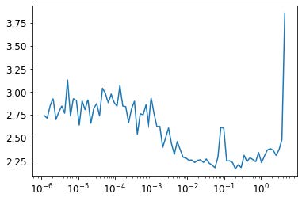

## 19. 从零开始构建fastai的学习器

本章（除结论和在线章节外）将呈现不同于前几章的样貌。它包含远多于前几章的代码，而文字部分则大幅精简。我们将引入新的Python关键字和库，但不作详细讨论。本章旨在成为你重大研究项目的起点。我们将从零开始实现 fastai 和 PyTorch API 的核心组件，仅基于第十七章开发的组件进行构建！最终目标是创建属于你自己的 `Learner` 类及若干回调函数——足以在 Imagenette 数据集上训练模型，并涵盖我们所学每项关键技术的实例。在构建 `Learner` 的过程中，我们将创建自定义版本的 `Module`、`Parameter` 以及并行的`DataLoader`，让你深入理解这些PyTorch类的核心功能。

本章末尾的问卷调查尤为重要。我们将以此为起点，引导你探索诸多有趣的方向。建议你在电脑上同步阅读本章内容，通过大量实验、网络搜索及其他必要途径深入理解相关知识。通过本书前文的学习，你已掌握所需技能与专业知识，我们相信你定能出色完成！

让我们先手动收集一些数据。

### 收集数据

请查看 `untar_data` 的源代码以了解其工作原理。我们将在此处使用它来获取 Imagenette 数据集的 160 像素版本，用于本章：

```python
path = untar_data(URLs.IMAGENETTE_160)
```

要访问图像文件，我们可以使用 `get_image_files`：

```python
t = get_image_files(path)
t[0]
```

```text
Path('/home/jhoward/.fastai/data/imagenette2-
160/val/n03417042/n03417042_3752.JP
> EG')
```

或者我们也可以仅使用Python的标准库中的 `glob` 模块实现相同功能：

```python
from glob import glob
files = L(glob(f'{path}/**/*.JPEG', recursive=True)).map(Path)
files[0]
```

```text
Path('/home/jhoward/.fastai/data/imagenette2-
160/val/n03417042/n03417042_3752.JP
> EG')
```

查看 `get_image_files` 的源代码，你会发现它使用了 Python 的 `os.walk`；这个函数比 `glob` 更快且更灵活，请务必尝试使用它。

我们可以使用Python图像库的 `Image` 类打开图像：

```python
im = Image.open(files[0])
im
```


```python
im_t = tensor(im)
im_t.shape
```

```text
torch.Size([160, 213, 3])
```

这将成为我们自变量的基础。对于因变量，我们可以使用 `pathlib` 中的 `Path.parent`。首先我们需要词汇表。

```python
lbls = files.map(Self.parent.name()).unique(); lbls
```

```text
(#10)
['n03417042','n03445777','n03888257','n03394916','n02979186','n03000684','
> n03425413','n01440764','n03028079','n02102040']
```

反向映射，得益于 `L.val2idx`：

```python
v2i = lbls.val2idx(); v2i
```

```text
{'n03417042': 0,
'n03445777': 1,
'n03888257': 2,
'n03394916': 3,
'n02979186': 4,
'n03000684': 5,
'n03425413': 6,
'n01440764': 7,
'n03028079': 8,
'n02102040': 9}
```

这就是我们需要整合数据集的所有组件。

#### 数据集

PyTorch 中的 `Dataset` 可以是任何支持索引（`__getitem__`）和 `len`计算的对象：

```python
class Dataset:
    def __init__(self, fns): self.fns=fns
    def __len__(self): return len(self.fns)
    def __getitem__(self, i):
        im = Image.open(self.fns[i]).resize((64,64)).convert('RGB')
        y = v2i[self.fns[i].parent.name]
        return tensor(im).float()/255, tensor(y)
```

我们需要一份训练集和验证集文件名的列表，用于传递给 `Dataset.__init__` ：

```python
train_filt = L(o.parent.parent.name=='train' for o in files)
train,valid = files[train_filt],files[~train_filt]
len(train),len(valid)
```

```text
(9469, 3925)
```

现在我们可以试一试：

```python
train_ds,valid_ds = Dataset(train),Dataset(valid)
x,y = train_ds[0]
x.shape,y
```

```text
(torch.Size([64, 64, 3]), tensor(0))
```

```python
show_image(x, title=lbls[y]);
```


如你所见，我们的数据集将自变量和因变量以元组形式返回，这正是我们所需的格式。接下来需要将这些数据整合为小批量。通常使用 `torch.stack` 实现此操作，我们在此也将采用该方法：

```python
def collate(idxs, ds):
    xb,yb = zip(*[ds[i] for i in idxs])
    return torch.stack(xb),torch.stack(yb)
```

以下是一个包含两项内容的小批次处理，用于测试我们的 `collate` 功能：

```python
x,y = collate([1,2], train_ds)
x.shape,y
```

```text
(torch.Size([2, 64, 64, 3]), tensor([0, 0]))
```

现在我们拥有了数据集和排序函数，可以着手创建 `DataLoader` 了。这里我们将添加两项功能：训练集的可选 `shuffle` 机制，以及用于并行执行预处理任务的`ProcessPoolExecutor` 。并行数据加载器至关重要，因为打开和解码JPEG图像的过程非常耗时。单个CPU核心无法快速解码图像以维持现代GPU的满负荷运行。以下是我们的 `DataLoader` 类：

```python
class DataLoader:
    def __init__(self, ds, bs=128, shuffle=False, n_workers=1):
        self.ds,self.bs,self.shuffle,self.n_workers =
        ds,bs,shuffle,n_workers
    def __len__(self): return (len(self.ds)-1)//self.bs+1
    def __iter__(self):
        idxs = L.range(self.ds)
        if self.shuffle: idxs = idxs.shuffle()
        chunks = [idxs[n:n+self.bs] for n in range(0, len(self.ds),
                                                   self.bs)]
        with ProcessPoolExecutor(self.n_workers) as ex:
            yield from ex.map(collate, chunks, ds=self.ds)
```

让我们用训练集和验证集来试试看：

```python
n_workers = min(16, defaults.cpus)
train_dl = DataLoader(train_ds, bs=128, shuffle=True,
n_workers=n_workers)
valid_dl = DataLoader(valid_ds, bs=256, shuffle=False,
n_workers=n_workers)
xb,yb = first(train_dl)
xb.shape,yb.shape,len(train_dl)
```

```text
(torch.Size([128, 64, 64, 3]), torch.Size([128]), 74)
```

这个数据加载器虽然比PyTorch的稍慢，但实现方式简单得多。因此，当你调试复杂的数据加载流程时，不妨尝试手动操作，这样能更清晰地看清具体发生了什么。

为了进行归一化处理，我们需要图像统计信息。通常情况下，在单个训练小批次上计算这些统计信息即可，因为这里不需要精确度：

```python
stats = [xb.mean((0,1,2)),xb.std((0,1,2))]
stats
```

```text
[tensor([0.4544, 0.4453, 0.4141]), tensor([0.2812, 0.2766, 0.2981])]
```

我们的 `Normalize` 类只需存储这些统计数据并应用它们（若想了解为何需要 `to_device` 方法，请尝试将其注释掉，观察后续笔记本中的运行结果）：

```python
class Normalize:
    def __init__(self, stats): self.stats=stats
    def __call__(self, x):
        if x.device != self.stats[0].device:
            self.stats = to_device(self.stats, x.device)
        return (x-self.stats[0])/self.stats[1]
```

我们总喜欢在笔记本上测试我们构建的一切，一完成构建就立即测试：

```python
norm = Normalize(stats)
def tfm_x(x): return norm(x).permute((0,3,1,2))
```

```python
t = tfm_x(x)
t.mean((0,2,3)),t.std((0,2,3))
```

```text
(tensor([0.3732, 0.4907, 0.5633]), tensor([1.0212, 1.0311, 1.0131]))
```

此处 `tfm_x` 不仅执行了 `Normalize` 操作，还把轴序从 `NHWC` 切换为 `NCHW`（若需回顾这些缩写含义，请参阅第 13 章）。PIL 使用 `HWC` 轴序，而该序列无法与 PyTorch 兼容，因此需要进行此 `permute` 操作。

这就是我们模型所需的所有数据。现在我们需要模型本身了！

### 模块与参数

要创建模型，我们需要 `Module`。要创建 `Module`，我们需要 `Parameter`，因此我们从这里开始。回顾第8章所述，`Parameter` 类“除自动调用 `requires_grad_` 外不提供任何功能，仅作为标记用于标识参数包含内容”。以下定义正是如此：

```python
class Parameter(Tensor):
    def __new__(self, x): return Tensor._make_subclass(Parameter, x,
                                                       True)
    def __init__(self, *args, **kwargs): self.requires_grad_()
```

此处的实现略显笨拙：我们必须定义特殊的Python方法 `__new__` 并使用PyTorch内部方法 `_make_subclass`，因为在撰写本文时，PyTorch尚未提供官方支持的API来正确处理此类子类化操作。你阅读本文时此问题可能已修复，请访问本书网站查看最新说明。

我们的 `Parameter` 现在完全像张量那样工作，这正是我们想要的效果：

```python
Parameter(tensor(3.))
```

```text
tensor(3., requires_grad=True)
```

既然我们有了这个，就可以定义 `Module` ：

```python
class Module:
    def __init__(self):
        self.hook,self.params,self.children,self._training = None,[],
        [],False
        
    def register_parameters(self, *ps): self.params += ps
    def register_modules (self, *ms): self.children += ms
    
    @property
    def training(self): return self._training
    @training.setter
    def training(self,v):
        self._training = v
        for m in self.children: m.training=v
        
    def parameters(self):
        return self.params + sum([m.parameters() for m in
                                  self.children], [])
    def __setattr__(self,k,v):
        super().__setattr__(k,v)
        if isinstance(v,Parameter): self.register_parameters(v)
        if isinstance(v,Module): self.register_modules(v)
        
    def __call__(self, *args, **kwargs):
        res = self.forward(*args, **kwargs)
        if self.hook is not None: self.hook(res, args)
        return res
    
    def cuda(self):
        for p in self.parameters(): p.data = p.data.cuda()
```

关键功能在于 `parameters` 的定义：

```python
self.params + sum([m.parameters() for m in self.children], [])
```

这意味着我们可以向任何 `Module` 查询其参数，它都会返回这些参数，包括其所有子模块的参数（递归返回）。但它如何知道自己的参数是什么？这要归功于实现了Python的特殊 `__setattr__` 方法，每当Python为类设置属性时，该方法就会被调用。我们的实现包含以下代码行：

```py
if isinstance(v,Parameter): self.register_parameters(v)
```

如你所见，这里我们使用新的 `Parameter` 类作为“标记”——任何此类对象都会被添加到我们的 `params`中。

Python的 `__call__` 方法允许我们定义当对象被视为函数时发生的行为；我们只需调用`forward`（该方法在此不存在，因此需要由子类添加）。在执行前，若存在钩子则会调用它。现在你可看到 PyTorch 钩子根本不做任何复杂操作——它们只是调用已注册的钩子。

除了这些功能模块外，我们的模块还提供了 `cuda` 和 `training` 属性，我们稍后将使用它们。

现在我们可以创建第一个 `Module` ，即 `ConLayer` ：

```python
class ConvLayer(Module):
    def __init__(self, ni, nf, stride=1, bias=True, act=True):
        super().__init__()
        self.w = Parameter(torch.zeros(nf,ni,3,3))
        self.b = Parameter(torch.zeros(nf)) if bias else None
        self.act,self.stride = act,stride
        init = nn.init.kaiming_normal_ if act else
        nn.init.xavier_normal_
        init(self.w)
        
    def forward(self, x):
        x = F.conv2d(x, self.w, self.b, stride=self.stride, padding=1)
        if self.act: x = F.relu(x)
        return x
```

我们不会从头实现 `F.conv2d` ，因为你应该已经在第17章的问卷中（使用 `unfold` ）完成了这项工作。我们只需创建一个小型类，将其与偏置和权重初始化功能封装起来。现在让我们通过 `Module.parameters` 验证其正确性：

```python
l = ConvLayer(3, 4)
len(l.parameters())
```

```text
2
```

并且我们可以调用它（这将导致 `forward` 被调用）：

```python
xbt = tfm_x(xb)
r = l(xbt)
r.shape
```

```text
torch.Size([128, 4, 64, 64])
```

同样地，我们可以实现 `Linear` ：

```python
class Linear(Module):
    def __init__(self, ni, nf):
        super().__init__()
        self.w = Parameter(torch.zeros(nf,ni))
        self.b = Parameter(torch.zeros(nf))
        nn.init.xavier_normal_(self.w)
        
    def forward(self, x): return x@self.w.t() + self.b
```

并测试其是否正常工作：

```python
l = Linear(4,2)
r = l(torch.ones(3,4))
r.shape
```

```text
torch.Size([3, 2])
```

我们还需创建一个测试模块，用于验证当包含多个参数作为属性时，它们是否均能正确注册：

```python
class T(Module):
    def __init__(self):
        super().__init__()
        self.c,self.l = ConvLayer(3,4),Linear(4,2)
```

由于我们有一个卷积层和一个线性层，每个层都包含权重和偏置，因此总共应有四个参数：

```python
t = T()
len(t.parameters())
```

```text
4
```

我们还应发现，在此类中调用 `cuda` 会将所有这些参数置于GPU上：

```python
t.cuda()
t.l.w.device
```

```text
device(type='cuda', index=5)
```

现在我们可以利用这些组件来构建卷积神经网络。

#### 简易的卷积神经网络

正如我们所见，`Sequential` 类使许多架构更易于实现，因此让我们创建一个：

```python
class Sequential(Module):
    def __init__(self, *layers):
        super().__init__()
        self.layers = layers
        self.register_modules(*layers)
        
    def forward(self, x):
        for l in self.layers: x = l(x)
        return x
```

此处的 `forward`传播方法仅依次调用各层。请注意必须使用我们在 `Module` 中定义的 `register_modules` 方法，否则 `layers` 的内容将不会出现在 `parameters` 中。

> 所有代码都在这里
>
> 请记住，我们在此并未使用任何PyTorch模块功能；所有内容均由我们自行定义。因此，如果你不确定 `register_modules` 的作用或其必要性，请重新审阅 `Module` 模块的代码，看看我们实际编写的内容！

我们可以创建一个简化的 `AdaptivePool` ，仅处理向1×1输出池的聚合操作，并通过使用 `mean` 函数将其展平：

```python
class AdaptivePool(Module):
    def forward(self, x): return x.mean((2,3))
```

这足以让我们创建一个卷积神经网络了！

```python
def simple_cnn():
    return Sequential(
        ConvLayer(3 ,16 ,stride=2), #32
        ConvLayer(16,32 ,stride=2), #16
        ConvLayer(32,64 ,stride=2), # 8
        ConvLayer(64,128,stride=2), # 4
        AdaptivePool(),
        Linear(128, 10)
    )
```

让我们看看我们的参数是否都注册正确：

```python
m = simple_cnn()
len(m.parameters())
```

```text
10
```

现在我们可以尝试添加一个钩子。请注意，我们在 `Module` 中只预留了一个钩子的空间；你可以将其改为列表形式，或使用 `Pipeline` 之类的工具将多个钩子作为单个函数运行：

```python
def print_stats(outp, inp): print
(outp.mean().item(),outp.std().item())
for i in range(4): m.layers[i].hook = print_stats
```

```python
r = m(xbt)
r.shape
```

```text
0.5239089727401733 0.8776043057441711
0.43470510840415955 0.8347987532615662
0.4357188045978546 0.7621666193008423
0.46562111377716064 0.7416611313819885
torch.Size([128, 10])
```

我们拥有数据和模型。现在我们需要一个损失函数。

### 损失函数

我们已经了解了如何定义“负对数似然函数”：

```python
def nll(input, target): return -input[range(target.shape[0]),
target].mean()
```

实际上，这里没有取对数，因为我们采用了与PyTorch相同的定义。这意味着我们需要将log与softmax结合使用：

```python
def log_softmax(x): return
(x.exp()/(x.exp().sum(-1,keepdim=True))).log()
```

```python
sm = log_softmax(r); sm[0][0]
```

```text
tensor(-1.2790, grad_fn=<SelectBackward>)
```

将这些结合起来，我们得到交叉熵损失：

```python
loss = nll(sm, yb)
loss
```

```text
tensor(2.5666, grad_fn=<NegBackward>)
```

请注意该公式
$$
\log(\frac a b)=\log(a)-\log(b)
$$
在计算对数软最大值时提供了简化，该函数先前定义为： `(x.exp()/(x.exp().sum(-1))).log()` ：

```python
def log_softmax(x): return x - x.exp().sum(-1,keepdim=True).log()
sm = log_softmax(r); sm[0][0]
```

```text
tensor(-1.2790, grad_fn=<SelectBackward>)
```

然后，有一种更稳定的方法来计算指数和对数，称为LogSumExp技巧。其核心思想是使用以下公式：
$$
\log\left(\sum_{j=1}^{n} e^{x_{j}}\right) = \log\left(e^{a} \sum_{j=1}^{n} e^{x_{j}-a}\right) = a + \log\left(\sum_{j=1}^{n} e^{x_{j}-a}\right)
$$
其中 $a$ 是 $x_j$ 的最大值

以下是相同内容的代码实现：

```python
x = torch.rand(5)
a = x.max()
x.exp().sum().log() == a + (x-a).exp().sum().log()
```

```python
tensor(True)
```

我们将把这段代码封装成一个函数

```python
def logsumexp(x):
    m = x.max(-1)[0]
    return m + (x-m[:,None]).exp().sum(-1).log()
logsumexp(r)[0]
```

```text
tensor(3.9784, grad_fn=<SelectBackward>)
```

因此我们可以将其用于我们的 `log_softmax` 函数

```python
def log_softmax(x): return x - x.logsumexp(-1,keepdim=True)
```

这与之前的结果相同：

```python
sm = log_softmax(r); sm[0][0]
```

```text
tensor(-1.2790, grad_fn=<SelectBackward>)
```

我们可以使用这些来创建 `cross_entropy`：

```python
def cross_entropy(preds, yb): return nll(log_softmax(preds),
yb).mean()
```

现在让我们将所有这些部分组合起来，创建一个 `Learner` 。

### 学习器

我们拥有数据、模型和损失函数；在拟合模型之前，我们只需再准备一项——优化器！以下是随机梯度下降：

```python
class SGD:
    def __init__(self, params, lr, wd=0.): store_attr(self,
                                                      'params,lr,wd')
    def step(self):
        for p in self.params:
            p.data -= (p.grad.data + p.data*self.wd) * self.lr
            p.grad.data.zero_()
```

正如本书所示，使用 `Learner` 能让工作更轻松。 `Learner` 需要了解我们的训练集和验证集，这意味着我们需要数据加载器来存储它们。我们不需要其他功能，只需一个存储和访问它们的位置：

```python
class DataLoaders:
    def __init__(self, *dls): self.train,self.valid = dls
dls = DataLoaders(train_dl,valid_dl)
```

现在我们可以创建我们的 `Learner` 类了：

```python
class Learner:
    def __init__(self, model, dls, loss_func, lr, cbs, opt_func=SGD):
        store_attr(self, 'model,dls,loss_func,lr,cbs,opt_func')
        for cb in cbs: cb.learner = self
        
    def one_batch(self):
        self('before_batch')
        xb,yb = self.batch
        self.preds = self.model(xb)
        self.loss = self.loss_func(self.preds, yb)
        if self.model.training:
            self.loss.backward()
            self.opt.step()
            self('after_batch')
            
    def one_epoch(self, train):
        self.model.training = train
        self('before_epoch')
        dl = self.dls.train if train else self.dls.valid
        for self.num,self.batch in enumerate(progress_bar(dl,
                                                         leave=False)):
            self.one_batch()
        self('after_epoch')
        
    def fit(self, n_epochs):
        self('before_fit')
        self.opt = self.opt_func(self.model.parameters(), self.lr)
        self.n_epochs = n_epochs
        try:
            for self.epoch in range(n_epochs):
                self.one_epoch(True)
                self.one_epoch(False)
        except CancelFitException: pass
        self('after_fit')
        
    def __call__(self,name):
        for cb in self.cbs: getattr(cb,name,noop)()
```

这是本书中创建的最大类，但每个方法都相当简短，因此通过逐个查看，您应该能够理解其运作机制。

我们将调用的主要方法是 `fit` 。该方法通过以下循环实现：

```python
for self.epoch in range(n_epochs)
```

在每个迭代轮次中，分别针对 `train=True` 和 `train=False` 调用 `self.one_epoch`。随后 `self.one_epoch` 会根据实际情况（在用 `fastprogress.progress_bar` 包装 `DataLoader` 后），分别针对 `dls.train` 或 `dls.valid` 中的每个批次调用 `self.one_batch`。最后， `self.one_batch` 遵循本书贯穿始终的常规步骤集，用于拟合一个迷你批次。

在每个步骤前后，`Learner` 都会调用 `self` ，而 `self` 会调用 `__call__`（这是Python的标准功能）。`__call__` 方法对 `self.cbs` 中的每个回调函数调用 `getattr(cb,name)`，该Python内置函数返回具有指定名称的属性（此处为方法）。例如，当 `self(‘before_fit’)` 被调用时，会为每个定义了该方法的回调函数调用 `cb.before_fit()` 。

如你所见，`Learner` 实际上只是使用了我们的标准训练循环，只是它还会在适当的时候调用回调函数。那么，让我们来定义一些回调函数吧！

#### 回调函数

在 `Learner.__init__` 中，我们有

```python
for cb in cbs: cb.learner = self
```

换句话说，每个回调函数都知道自己被用于哪个学习器。这至关重要，因为否则回调函数既无法从学习器获取信息，也无法修改学习器内部状态。鉴于从学习器获取信息极为常见，我们通过将 `Callback` 定义为 `GetAttr` 的子类来简化操作，并为其设置默认属性 `learner`：

```python
class Callback(GetAttr): _default='learner'
```

`GetAttr` 是 fastai 中的一个类，它为你实现了 Python 的标准 `__getattr__` 和 `__dir__` 方法，因此当你尝试访问不存在的属性时，它会将请求转发至你定义的 `_default` 对象。

例如，我们希望在拟合开始时自动将所有模型参数移至GPU。可通过将 `before_fit` 定义为 `self.learner.model.cuda` 实现；但由于 `learner` 是默认属性，且 `SetupLearnerCB` 继承自 `Callback`（后者继承自 `GetAttr` ），因此可省略 `.learner` 直接调用 `self.model.cuda` ：

```python
class SetupLearnerCB(Callback):
    def before_batch(self):
        xb,yb = to_device(self.batch)
        self.learner.batch = tfm_x(xb),yb
        
    def before_fit(self): self.model.cuda()
```

在 `SetupLearnerCB` 中，我们还通过调用 `to_device(self.batch` )将每个小批量数据移至GPU（也可使用更长的 `to_device(self.learner.batch)` ）。但请注意，在语句 `self.learner.batch = tfm_x(xb),yb` 中，我们不能移除 `.learner`，因为此处是在设置属性而非获取属性。

在尝试我们的 `Learner` 之前，先创建一个回调函数来追踪并打印进度。否则，我们无法真正确定它是否正常工作：

```python
class TrackResults(Callback):
    def before_epoch(self): self.accs,self.losses,self.ns = [],[],[]
    
    def after_epoch(self):
        n = sum(self.ns)
        print(self.epoch, self.model.training,
              sum(self.losses).item()/n, sum(self.accs).item()/n)
        
    def after_batch(self):
        xb,yb = self.batch
        acc = (self.preds.argmax(dim=1)==yb).float().sum()
        self.accs.append(acc)
        n = len(xb)
        self.losses.append(self.loss*n)
        self.ns.append(n)
```

现在，我们准备好首次使用我们的 `Learner` 了！

```python
cbs = [SetupLearnerCB(),TrackResults()]
learn = Learner(simple_cnn(), dls, cross_entropy, lr=0.1, cbs=cbs)
learn.fit(1)
```

```text
0 True 2.1275552130636814 0.2314922378287042
```

```text
0 False 1.9942575636942674 0.2991082802547771
```

令人惊叹的是，我们竟能用如此简洁的代码实现fastai `Learner`中的所有核心思想！现在让我们添加学习率调度功能。

#### 学习率调度

若想获得良好效果，我们需要LR Finder和单周期训练。这两者都是退火回调函数——即在训练过程中逐步调整超参数。以下是 `LRFinder` 的实现：

```python
class LRFinder(Callback):
    def before_fit(self):
        self.losses,self.lrs = [],[]
        self.learner.lr = 1e-6
        
    def before_batch(self):
        if not self.model.training: return
        self.opt.lr *= 1.2
        
    def after_batch(self):
        if not self.model.training: return
    if self.opt.lr>10 or torch.isnan(self.loss): raise CancelFitException
    self.losses.append(self.loss.item())
    self.lrs.append(self.opt.lr)
```

这展示了我们如何使用 `CancelFitException`，它本身是一个空类，仅用于标识异常类型。在 `Learner` 中可以看到该异常已被捕获。（你需要自行添加并测试 `CancelBatchException`、`CancelEpochException` 等异常。）现在让我们将其添加到回调列表中进行测试：

```python
lrfind = LRFinder()
learn = Learner(simple_cnn(), dls, cross_entropy, lr=0.1, cbs=cbs+
[lrfind])
learn.fit(2)
```

```text
0 True 2.6336045582954903 0.11014890695955222
```

```text
0 False 2.230653363853503 0.18318471337579617
```

再看看结果：

```python
plt.plot(lrfind.lrs[:-2],lrfind.losses[:-2])
plt.xscale('log')
```



现在我们可以定义我们的 `OneCycle` 训练回调函数：

```python
class OneCycle(Callback):
    def __init__(self, base_lr): self.base_lr = base_lr
    def before_fit(self): self.lrs = []
    
    def before_batch(self):
        if not self.model.training: return
        n = len(self.dls.train)
        bn = self.epoch*n + self.num
        mn = self.n_epochs*n
        pct = bn/mn
        pct_start,div_start = 0.25,10
        if pct<pct_start:
            pct /= pct_start
            lr = (1-pct)*self.base_lr/div_start + pct*self.base_lr
        else:
            pct = (pct-pct_start)/(1-pct_start)
            lr = (1-pct)*self.base_lr
            self.opt.lr = lr
            self.lrs.append(lr)
```

我们将尝试0.1的LR值：

```python
onecyc = OneCycle(0.1)
learn = Learner(simple_cnn(), dls, cross_entropy, lr=0.1, cbs=cbs+
[onecyc])
```

让我们暂时拟合一下，看看效果如何（书中不会展示全部输出结果——请在笔记本中尝试以查看结果）：

```python
learn.fit(8)
```

最后，我们将验证学习率是否遵循了我们定义的计划（如您所见，这里并未采用余弦退火法）：

```python
plt.plot(onecyc.lrs);
```


### 总结

在本章中，我们通过重新实现的方式探索了fastai库核心概念的具体实现方式。由于内容主要以代码为主，建议你务必通过查阅本书官网上的对应笔记本进行实践操作。既然你已了解其构建原理，下一步请务必查阅 fastai 文档中的中级和高级教程，学习如何定制库中的每个细节。

### 问卷调查

> 实验
>
> 对于要求解释函数或类是什么的问题，你还应完成自己的代码实验。

1. 什么是 `glob` ？
2. 如何使用Python图像库打开图像？
3. `L.map` 的作用是什么？
4. `Self` 的作用是什么？
5. `L.val2idx` 是什么？
6. 创建自定义数据集需要实现哪些方法？
7. 从Imagenette打开图像时为何要调用 `convert` ？
8. `~` 的作用是什么？它如何用于分割训练集和验证集？
9. `~` 是否适用于 `L` 或 `Tensor` 类？对 NumPy 数组、Python 列表或 Pandas DataFrame 又如何？
10. `ProcessPoolExecutor` 是什么？
11. `L.range(self.ds)` 如何工作？
12. `__iter__` 是什么？
13. `first` 是什么？
14. `permute` 是什么？为何需要它？
15. 何谓递归函数？它如何帮助我们定义 `parameters` 方法？
16. 编写递归函数返回斐波那契数列的前20项。
17. `super` 是什么？
18. `Module` 的子类为何需要重写 `forward` 而非定义 `__call__` ？
19. 在 `ConvLayer` 中，`init` 为何依赖 `act`？
20. `Sequential` 为何需要调用 `register_modules`？
21. 编写一个钩子函数，打印每个层激活值的形状。
22. 什么是 LogSumExp 优化技巧？
23. `log_softmax` 有何用处？
24. 什么是 `GetAttr`？它如何帮助回调函数？
25. 重新实现本章中任意一个回调函数，且不继承自 `Callback` 或 `GetAttr` 。
26. `Learner.__call__` 的作用是什么？
27. 什么是 `getattr` ？（注意与 `GetAttr` 的大小写差异！）
28. `fit` 中为何设置 `try` 块？
29. `one_batch` 中为何要检查 `model.training` ？
30. `store_attr` 的作用是什么？
31. `TrackResults.before_epoch` 的目的何在？
32. `model.cuda` 的功能及工作原理是什么？
33. 为何在 `LRFinder` 和 `OneCycle` 中需要检查 `model.training` 状态？
34. 在 `OneCycle` 中实现余弦退火算法。

#### 进一步研究

1. 从零开始编写 `resnet18`（必要时可参考第14章），并使用本章的 `Learner` 进行训练。
2. 从零实现一个批归一化层，并在你自己的 `resnet18` 中使用它。
3. 编写一个用于本章的 `Mixup` 回调函数。
4. 为SGD添加动量。
5. 从 fastai（或其他库）中挑选若干感兴趣的功能，使用本章创建的对象实现它们。
6. 选择一篇尚未在 fastai 或 PyTorch 中实现的研究论文，使用本章创建的对象进行实现。随后：
   - 将该论文移植到 fastai。
   - 向 fastai 提交 pull request，或创建自己的扩展模块并发布。

​	提示：使用 `nbdev` 创建和部署包可能有所帮助。
