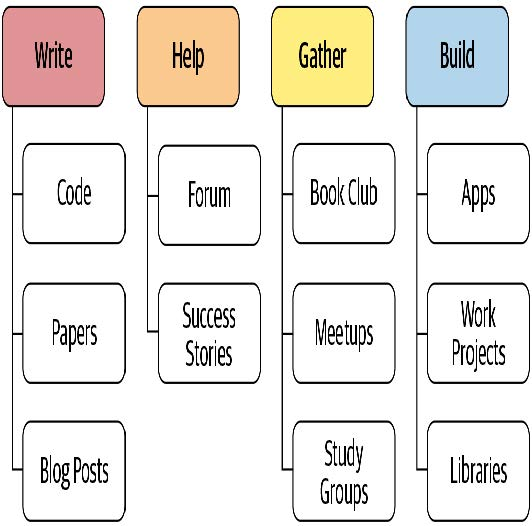

## 20. 结语

恭喜！你做到了！若你已完成所有笔记本的学习，便已加入这个虽小却日益壮大的群体——他们能够驾驭深度学习的力量解决实际问题。你或许并不这么认为——事实上，你很可能确实如此。我们反复观察到，完成fast.ai课程的学生往往严重低估自己作为深度学习实践者的能力。我们同样发现，这些学习者常被传统学术背景的人低估。因此，若想超越自我与他人的预期，合上本书后你将采取的行动，比此前所有努力都更为关键。

最重要的是像动量那样保持持续增长。事实上，正如你从优化器研究中了解到的那样，动量具有自我增强的特性！因此，请思考当下能采取哪些措施来维持并加速你的深度学习之旅。图20-1能为你提供一些思路。

[^图20-1]: 下一步应该做什么

在这本书中，我们多次探讨了写的价值，无论是代码还是散文。但或许你至今的写作量尚未达到预期。没关系！现在正是扭转局面的绝佳时机。此刻你心中有太多话要说。或许你已在数据集上进行过某些实验，而其他人似乎从未以相同视角审视过这些数据。向世界分享你的发现吧！又或许你在阅读过程中萌生了某些灵感——现在正是将这些想法转化为代码的最佳时机。

如果你想分享想法，fast.ai论坛是个相当低调的交流平台。您会发现那里的社区充满支持与帮助，欢迎随时造访并分享你的近况。或者，不妨尝试解答那些比你更早踏上学习之路的伙伴们提出的问题。

若你在深度学习的旅程中取得了一些成就——无论大小——请务必告诉我们！在论坛上分享这些成果尤其有益，因为了解其他学员的成功经验能带来极大的激励作用。

对许多人而言，保持学习旅程连贯性的关键方法或许是围绕学习建立社群。例如，你可以在本地社区组织小型深度学习聚会，组建学习小组，甚至主动在本地聚会上分享你的学习成果或感兴趣的特定领域。不必在意自己尚未成为世界顶尖专家——关键在于你已掌握许多他人尚未了解的知识，因此你的见解很可能受到重视。

另一个被许多人认为有用的社区活动是定期举办的读书会或论文阅读会。你或许能在自己居住的社区找到现有的活动，如果没有的话，不妨尝试发起一个。即使只有另一个人与你共同参与，也能为你提供坚持下去所需的支持与鼓励。

如果你所在的地区不便与志同道合者线下聚会，欢迎光临论坛——那里总有人在组建虚拟学习小组。这类小组通常由一群人每周通过视频聊天聚会，共同探讨深度学习相关议题。

希望到此刻，你已经完成了一些小型项目和实验。我们建议你下一步选择其中一个项目，全力将其打磨到最佳状态。真正将其打磨成你能力范围内最优秀的作品——一件令你真正引以为傲的作品。这将迫使你深入探索某个主题，既能检验你的理解程度，又能让你看到专注投入时能达到的高度。

此外，你或许可以看看fast.ai的免费在线课程，它涵盖了与本书相同的知识内容。有时，通过两种不同方式接触相同内容，能真正帮助你厘清思路。事实上，人类学习研究者发现，学习知识的最佳方式之一就是从不同角度观察同一事物，并通过不同方式进行描述。

你的最终任务，若你选择接受，便是拿起这本书，将其赠予你认识的人——让另一个人开启属于他们自己的深度学习之旅！