## 2. 从模型到生产

我们在第一章看到的那六行代码，只是深度学习实际应用过程中的一小部分。本章将通过计算机视觉示例，全面展示创建深度学习应用的端到端流程。具体而言，我们将构建一个熊分类器！在此过程中，我们将探讨深度学习的能力与局限，探索数据集的创建方法，审视实际应用中的潜在陷阱等。其中许多关键要点同样适用于其他深度学习问题（如第一章所示）。如果你处理的问题与本例的核心要素相似，我们相信你可以用极少代码快速获得卓越成果。

让我们先从如何界定问题开始。

### 深度学习实践

我们已经看到，深度学习能够快速解决许多具有挑战性的问题，且所需代码量极少。作为初学者，存在一类问题具有与示例问题足够的相似性，让你能够迅速获得极具实用价值的结果。然而，深度学习并非魔法！同样的六行代码无法适用于当今人们能想到的所有问题。

低估深度学习的局限性而高估其能力，可能导致令人沮丧的糟糕结果——至少在积累经验并能解决问题之前如此。反之，高估深度学习的局限性而低估其能力，则可能让你因自我否定而放弃尝试解决本可攻克的问题。

我们常与那些既低估深度学习局限性又低估其能力的人交谈。这两种情况都可能带来问题：低估能力意味着你可能连那些可能带来巨大益处的方法都不愿尝试；而低估局限性则可能导致你未能考虑并应对重要问题。

最好的做法是保持开放心态。若你愿意接受深度学习可能以少于预期的数据量或复杂度解决部分问题的可能性，便能设计出一个流程，从而找出与特定问题相关的具体能力与限制。这并非意味着要冒险押注——我们将展示如何逐步部署模型，避免产生重大风险，甚至能在投入生产前进行回测验证。

#### 开始你的项目吧

那么，你该从何处开启深度学习之旅？最关键的是确保你有一个项目可供实践——唯有通过自主项目，你才能真正积累构建和使用模型的实战经验。在选择项目时，最重要的考量因素是数据的可用性。

无论你是为自身学习开展项目，还是为组织实践应用而做，都希望能够快速启动。我们目睹过许多学生、研究者和行业从业者在寻找完美数据集的过程中浪费数月乃至数年光阴。目标并非寻找“完美”的数据集或项目，而是立即行动并在此基础上持续迭代。若采纳此法，当完美主义者仍在规划阶段时，你已完成第三轮学习迭代与能力提升！

我们还建议你在项目中采用端到端的迭代方式；不要耗费数月时间微调模型、打磨完美的图形界面或标注完美的数据集……相反，你应该在合理时间内尽可能完善每个步骤，直至项目完成。例如，若最终目标是开发手机应用程序，那么每次迭代后都应能运行该应用。在早期迭代中，你或许需要采取捷径——例如将所有处理工作转移至远程服务器，仅使用简易响应式网页应用。通过贯穿始终的实践，你将洞悉最棘手的环节，并识别出对最终成果影响最显著的关键部分。

在研读本书的过程中，我们建议你通过运行并调整我们提供的笔记本完成大量小型实验，同时逐步开发自己的项目。这样，你就能在我们讲解各项工具和技术时，同步积累实践经验。

> SYLVAIN说
>
> 要充分利用本书，请在每章之间留出时间进行实践，无论是基于你自己的项目，还是探索我们提供的笔记本。随后尝试用新数据集从头重写这些笔记本。唯有通过大量实践（包括失败），你才能培养出训练模型的直觉。

通过采用端到端迭代方法，你还将更清晰地认识到实际所需的数据量。例如，你可能会发现仅能轻松获取200个标注数据样本，除非你实际尝试，否则无法确定这是否足以支撑应用程序在实践中稳定运行的性能需求。

在组织环境中，通过展示真正可运行的原型，你将能向同事证明你的想法切实可行。我们反复观察到，这正是获得组织对项目支持的关键所在。

由于最容易着手开展的项目是那些已有可用数据的项目，这意味着最容易启动的项目很可能与你正在从事的工作相关——因为你已经掌握了相关工作的数据。例如，若从事音乐行业，你可能接触大量录音资料；若担任放射科医师，则可能掌握海量医学影像；若关注野生动物保护，则可能拥有丰富的野生动物影像资源。

有时你需要发挥些创造力。或许你能找到与自己研究领域相关的机器学习项目，比如某个Kaggle竞赛。有时你不得不做出妥协。或许你找不到完全契合特定项目的精准数据，但可以尝试寻找相近领域的数据，或是测量方式不同、解决问题略有差异的数据集。这类相似项目的实践仍能让你掌握整体流程，并可能发现其他捷径、数据来源等。

尤其当你刚接触深度学习时，不宜贸然涉足差异巨大的领域——那些深度学习尚未应用的领域。因为如果模型初始运行不畅，你将无从分辨是自身操作失误，还是所解决的问题本身就不适用于深度学习。届时你甚至无从寻求帮助。因此最佳策略是：先在网上寻找成功案例，选择与自身目标至少部分相似的方向，将数据转换为他人曾使用的格式（例如将数据转化为图像）。让我们审视深度学习的现状，以便你了解当前深度学习擅长处理哪些类型的问题。

#### 深度的学习现状 

让我们先思考深度学习能否有效解决你想要处理的问题。本节概述了2020年初深度学习的发展现状。然而技术发展日新月异，当你阅读本文时，其中部分限制可能已不复存在。我们将努力保持本书网站的及时更新；此外，通过谷歌搜索“当前人工智能能做什么”，很可能获取到最新信息。

##### 计算机视觉

在许多领域，深度学习尚未被用于图像分析，但在已尝试应用的领域中，几乎无一例外地表明计算机识别图像中物体的能力至少与人类相当——甚至超越了专业人士（如放射科医生）的水平。这被称为物体识别。深度学习同样擅长定位图像中的物体，能够标注其位置并命名每个检测到的物体。这被称为物体检测（在第1章提到的变体中，每个像素会根据其所隶属的物体类型进行分类——这称为分割）。

深度学习算法通常不擅长识别与训练数据结构或风格差异显著的图像。例如，若训练数据中不包含黑白图像，模型对黑白图像的识别效果可能较差；同样地，若训练数据未包含手绘图像，模型对这类图像的识别表现也可能欠佳。虽然没有通用方法能检查训练集中缺失哪些图像类型，但本章将展示几种方法，用于在模型投入生产使用时识别数据中出现的意外图像类型（这被称为域外（out-of-domain）数据检测）。

物体检测系统面临的一大挑战在于图像标注过程耗时且成本高昂。目前众多研究正致力于开发工具，以期加快标注速度、简化标注流程，并减少训练精准物体检测模型所需的人工标注数据。其中一种特别有效的方法是通过合成手段生成输入图像的变体，例如旋转图像或调整亮度与对比度；这种技术称为数据增强，同样适用于文本及其他类型模型。本章将对此进行详细探讨。

另一个需要考虑的点是，尽管你的问题表面上可能不像一个计算机视觉问题，但只要稍加想象，或许就能将其转化为计算机视觉问题。例如，如果你试图分类的是声音，可以尝试将声音转换为声波图像，然后基于这些图像训练模型。

##### 文本（自然语言处理）

计算机擅长根据各类标准对短篇与长篇文档进行分类，例如判定是否为垃圾邮件、情感倾向（如评论是正面还是负面）、作者身份、来源网站等。我们尚未发现该领域存在严谨的研究将计算机与人类进行对比，但根据现有案例观察，深度学习在这些任务上的表现似乎与人类相当。

深度学习同样擅长生成符合语境的文本，例如社交媒体帖子的回复，以及模仿特定作者的写作风格。它还擅长使这类内容对人类更具吸引力——事实上，甚至比人类撰写的文本更具吸引力。然而，深度学习并不擅长生成正确的回答！例如，我们目前尚无可靠方法将医学知识库与深度学习模型结合，以生成医学上准确的自然语言回应。这种缺陷极具危险性——因为系统极易生成看似令人信服、实则完全错误的内容，尤其容易误导非专业人士。

另一个担忧在于，社交媒体上那些符合语境且极具说服力的回应，可能被大规模利用——其规模可能远超以往任何水军工厂的数千倍——从而传播虚假信息、制造动荡并煽动冲突。经验法则表明，文本生成模型在技术上永远会略微领先于自动生成文本的识别模型。例如，人们可能利用能识别人工生成内容的模型来改进生成该内容的生成器，直到分类模型完全丧失识别能力。

尽管存在这些问题，深度学习在自然语言处理领域仍有诸多应用：它可用于将文本从一种语言翻译成另一种语言，将长篇文档摘要为更易快速理解的内容，查找所有提及特定概念的文本，等等。遗憾的是，翻译或摘要结果可能包含完全错误的信息！但其性能已足够出色，许多人正在使用这些系统——例如谷歌在线翻译系统（以及我们所知的所有其他在线服务）都基于深度学习技术。

##### 图文结合

深度学习将文本与图像整合到单一模型中的能力，通常远超大多数人的直觉预期。例如，深度学习模型可通过输入图像及其英文说明进行训练，进而学会为新图像自动生成惊人贴切的说明！但需再次强调前文所述的警示：这些说明的准确性无法得到保证。

鉴于这一严重问题，我们通常建议将深度学习作为模型与人类用户紧密协作的流程环节，而非完全自动化的过程。这种协作模式可能使人类的工作效率比纯手工方法提高数个数量级，同时比单纯依靠人工操作产生更精确的流程结果。

例如，自动系统可直接通过CT扫描识别潜在中风患者，并发送高优先级警报以确保医生可以快速阅片。中风治疗窗口仅有三小时，这种快速反馈机制可能挽救生命。与此同时，所有扫描图像仍可按常规流程发送给放射科医生，确保人工介入环节不受影响。其他深度学习模型能自动测量影像中的特定指标，并将测量结果自动填入报告，既提醒医生注意可能遗漏的发现，又提示其他相关病例的参考信息。

##### 表格化的数据

在分析时间序列和表格数据方面，深度学习近年来取得了重大进展。然而，深度学习通常作为多种模型组合的一部分使用。若您现有的系统已采用随机森林或梯度提升机（您即将了解的流行表格建模工具），那么切换至或添加深度学习可能不会带来显著提升。

深度学习确实极大扩展了可纳入的列类型——例如包含自然语言的列（书名、评论等）以及高基数分类列（即包含大量离散选项的列，如邮政编码或产品ID）。但另一方面，深度学习模型通常比随机森林或梯度提升机耗时更长，不过借助RAPIDS等库（为整个建模流程提供GPU加速）这一情况正在改变。我们在第9章中详细探讨了所有这些方法的优缺点。

##### 推荐系统

推荐系统本质上只是表格数据的一种特殊形式。具体而言，它们通常包含一个高基数分类变量来表示用户，以及另一个表示商品（或类似对象）的分类变量。像亚马逊这样的公司，会将客户历来的所有购买行为表示为一个巨大的稀疏矩阵，其中客户作为行，商品作为列。数据科学家将数据转化为此格式后，便会应用某种协同过滤算法填充矩阵。例如：若用户A购买了商品1和10，用户B购买了商品1、2、4和10，系统便会向A推荐购买商品2和4。

由于深度学习模型擅长处理高基数分类变量，它们在推荐系统领域表现尤为出色。正如处理表格数据时那样，当将这些变量与自然语言或图像等其他类型数据结合时，其优势便充分展现出来。它们还能出色地整合所有这些信息类型，并结合以表格形式呈现的附加元数据，例如用户信息、历史交易记录等。

然而，几乎所有机器学习方法都存在一个缺点：它们只能告诉您你特定用户可能喜欢哪些产品，而无法说明哪些推荐对用户真正有用。许多类型的潜在喜好商品推荐可能毫无价值——例如当用户已熟悉这些商品，或它们只是用户已购商品的不同包装形式（如某套小说的合集套装，而用户早已拥有套装中的每本书）。杰里米喜欢阅读特里·普拉切特（Terry
Pratchett）的作品，而亚马逊曾长期只向他推荐普拉切特的著作（见图2-1），这完全没有帮助——因为他早已知晓这些作品！


[^图2-1]: 一种没那么有用的推荐

##### 其他数据类型

通常你会发现，特定领域的数据类型能很好地融入现有分类体系。例如，蛋白质链与自然语言文档极为相似——它们都是由离散标记组成的长序列，序列中贯穿着复杂的关系与意义。事实上，运用自然语言处理的深度学习方法，已成为当前多种蛋白质分析领域的尖端技术。另一个例子是声音数据，其可转化为频谱图进行图像化处理；针对图像的标准深度学习方法在频谱图上同样表现出色。

##### 驱动链方法

许多精确的模型对任何人都毫无用处，而许多不精确的模型却极具实用价值。为确保建模工作在实践中发挥作用，必须考虑成果的应用场景。2012年，Jeremy与Margit Zwemer、Mike Loukides共同提出了一种名为“驱动链方法”（The Drivetrain Approach）的思考框架来应对这一问题。

如图2-2所示的驱动链方法，已在 [《设计卓越数据产品》](https://oreil.ly/KJIIa) 一书中详细阐述。其基本思路是：首先明确目标，接着思考达成目标所需采取的行动，评估现有（或可获取）的辅助数据资源，最后构建模型以确定最优行动方案，从而实现目标层面的最佳效果。

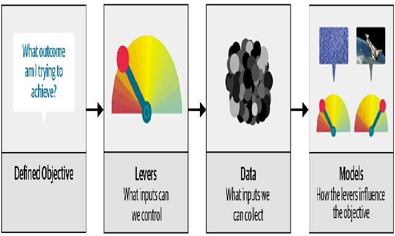

[^图2-2]: 驱动链方法

考虑自动驾驶汽车中的模型：你希望帮助汽车在无需人工干预的情况下安全行驶从点A到点B。卓越的预测建模是解决方案的重要组成部分，但它并非独立存在；随着产品日益复杂，它逐渐融入基础架构之中。使用自动驾驶汽车的用户完全不会意识到，数百（甚至数千）个模型和数千兆字节的数据支撑着它的运行。然而，随着数据科学家构建越来越复杂的产品，他们需要系统化的设计方法。

我们运用数据不仅是为了生成更多数据（以预测形式呈现），更是为了产出可执行的成果。这正是驱动链方法论的核心目标。首先需明确目标——例如谷歌开发首款搜索引擎时，便思考“用户输入搜索词的核心诉求是什么？”由此确立了谷歌的核心目标：“呈现最相关的搜索结果”。下一步是思考可施加哪些杠杆（即采取哪些行动）来更好地实现该目标。对谷歌而言，关键在于搜索结果的排序机制。第三步是考量生成此类排序所需的新数据类型；他们意识到网页间的隐性关联信息——即哪些页面链接到其他页面——可为此目的提供价值。

只有完成这前三步，我们才开始考虑构建预测模型。我们的目标与可用杠杆——即已有的数据和需要补充收集的数据——决定了可构建的模型类型。模型将同时接收杠杆和不可控变量作为输入；通过整合模型输出，即可预测目标的最终状态。

让我们再看一个例子：推荐系统。推荐引擎的目标是通过推荐那些客户在没有推荐的情况下不会购买的商品，以惊喜和愉悦的方式推动额外销售。其杠杆作用在于推荐的排序。要生成能催生新销售的推荐，必须收集新数据。这需要开展大量随机实验，以收集针对不同客户群体、不同推荐方案的海量数据。很少有组织会采取这一步骤；但若缺失此环节，你就无法获取优化推荐所需的关键信息——而优化推荐的真正目标正是提升销售额！

最后，你可以构建两个购买概率模型，分别取决于用户是否看到推荐。这两种概率之差即为给定推荐对顾客的效用函数。当算法推荐顾客已拒绝过的熟悉书籍（两项均值较低）或顾客即使没有推荐也会购买的书籍（两项均值较高且相互抵消）时，该效用函数值将较低。

正如你所见，在实际操作中，模型的实际应用往往需要远不止训练模型那么简单！你通常需要通过实验收集更多数据，并考虑如何将模型整合到正在开发的整体系统中。说到数据，现在让我们聚焦于如何为项目寻找数据。

### 收集数据

对于许多类型的项目，你可能能在网上找到所需的所有数据。本章我们将完成的项目是一款熊探测器，它能区分三种熊：灰熊、黑熊和泰迪熊。互联网上有大量每种熊的图像可供使用，我们只需找到并下载它们的方法即可。

我们为此目的提供了一个工具，你可以使用它跟随本章内容，为自己感兴趣的任何物体创建图像识别应用程序。在fast.ai课程中，数千名学员已在课程论坛展示了他们的成果，内容涵盖从特立尼达的蜂鸟品种到巴拿马的巴士类型——甚至有学员开发了应用程序，帮助未婚妻在圣诞假期辨认他16位表亲！

截至本文撰写之时，必应图片搜索是我们所知查找和下载图片的最佳选择。该服务每月提供1000次免费查询，每次查询最多可下载150张图片。不过，从我们撰写本书到您阅读之时，可能已有更优方案问世，因此请务必访问本书官网查看我们当前的推荐方案。

> 时刻关注最新的服务
>
> 用于创建数据集的服务层出不穷，其功能、接口和定价也经常变化。本节将展示如何使用本书撰写时作为 Azure 认知服务一部分提供的 Bing 图片搜索 API。

要使用必应图片搜索下载图片，你得在微软注册免费账户。你将获得一个密钥，可将其复制并按以下方式输入单元格（将XXX替换为你自己的密钥并执行）：

```python
key = 'XXX'
```

或者，如果你熟悉命令行操作，也可以在终端中通过以下命令设置：

```bash
export AZURE_SEARCH_KEY=your_key_here
```

然后重启Jupyter服务器，在单元格中输入以下内容并执行：

```python
key = os.environ['AZURE_SEARCH_KEY']
```

设置好密钥后，即可使用 `search_images_bing` 函数。该函数由在线笔记本中包含的小型工具类提供（若不确定函数定义位置，只需在笔记本中输入函数名即可查找，如图所示）：

```python
search_images_bing
<function utils.search_images_bing(key, term, min_sz=128)>
```

让我们试试这个函数：

```python
results = search_images_bing(key, 'grizzly bear')
ims = results.attrgot('content_url')
len(ims)

150
```

我们已成功下载了150只灰熊的URL（或者至少是必应图片搜索为该关键词找到的图片）。让我们看看其中一张：

```python
dest = 'images/grizzly.jpg'
download_url(ims[0], dest)
```

```python
im = Image.open(dest)
im.to_thumb(128,128)
```


这似乎效果不错，那么我们来使用fastai的 `download_images` 方法下载每个搜索词的所有URL。我们将把每个URL存放在单独的文件夹中：

```python
bear_types = 'grizzly','black','teddy'
path = Path('bears')

if not path.exists():
    path.mkdir()
    for o in bear_types:
        dest = (path/o)
        dest.mkdir(exist_ok=True)
        results = search_images_bing(key, f'{o} bear')
        download_images(dest, urls=results.attrgot('content_url'))
```

我们的文件夹里保存着图像文件，正如我们所预期的那样：

```python
fns = get_image_files(path)
fns
(#421)
[Path('bears/black/00000095.jpg'),Path('bears/black/00000133.jpg'),Path('
>
bears/black/00000062.jpg'),Path('bears/black/00000023.jpg'),Path('bears/black
>
/00000029.jpg'),Path('bears/black/00000094.jpg'),Path('bears/black/00000124.j
>
pg'),Path('bears/black/00000056.jpeg'),Path('bears/black/00000046.jpg'),Path(
> 'bears/black/00000045.jpg')...]
```

> JEREMY说
>
> 我就是喜欢在Jupyter笔记本里工作！它让我能轻松地逐步构建想要的内容，并在每一步都检查我的工作。我经常犯错，所以这对我真的很有帮助。

我们从互联网上下载文件时，常会遇到部分文件损坏的情况。让我们来检查一下：

```python
failed = verify_images(fns)
failed
(#0) []
```

要删除所有失败的图像，可以使用 `unlink`。与大多数返回集合的 fastai 函数类似， `verify_images` 返回类型为 `L` 的对象，该对象包含 `map` 方法。该方法会对集合中的每个元素调用传递的函数：

```python
failed.map(Path.unlink);
```

> 在Jupyter笔记本中获取帮助
>
> Jupyter笔记本非常适合进行实验并即时查看每个函数的结果，但它还提供了大量功能，帮助你了解如何使用不同函数，甚至直接查看它们的源代码。例如，假设你在单元格中输入以下内容：
>
> ```python
> ??verify_images
> ```
>
> 将弹出一个窗口，显示以下内容：
>
> ```python
> Signature: verify_images(fns)
> Source:
> def verify_images(fns):
> 	"Find images in `fns` that can't be opened"
> 	return L(fns[i] for i,o in
> 		enumerate(parallel(verify_image, fns)) if not o)
> File: ~/git/fastai/fastai/vision/utils.py
> Type: function
> ```
>
> 这告诉我们函数接受哪些参数（`fns`），并展示了源代码及其所属文件。查看该源代码可知，它并行调用 `verify_image` 函数，仅保留该函数返回值为 `False` 的图像文件，这与文档字符串描述一致：它会找出 `fns` 中无法打开的图像文件。
>
> 以下是Jupyter笔记本中其他非常实用的功能：
>
> - 在任何时候，若忘记函数或参数名称的精确拼写，按Tab键即可获得自动补全建议。
> - 在函数括号内同时按下 Shift 和 Tab 键，将弹出显示函数签名及简要说明的窗口。连续按两次可展开文档详情，按三次则在屏幕底部打开完整文档窗口。
> - 在单元格中输入 ?func_name 并执行，将弹出包含函数签名和简要说明的窗口。
> - 在单元格中输入 ??func_name 并执行，将弹出包含函数签名、简要说明及源代码的窗口。
> - 若使用 fastai 库，我们为你新增了 `doc` 函数：在单元格中执行 `doc(func_name)` 将打开一个窗口，显示函数签名、简要说明，以及指向 GitHub 源代码和库文档中完整函数文档的链接。
> - 虽与文档无关但同样实用：若遇到错误需获取帮助，可在任意单元格输入 `%debug` 并执行，即可启动Python调试器，从而检查每个变量的内容。

在此过程中需要注意一点：正如我们在第一章讨论的那样，模型只能反映用于训练它们的数据。而现实世界中充斥着偏颇的数据，这些偏见最终会体现在诸如必应图片搜索（我们曾用其创建数据集）等工具中。例如，假设你想开发一款能帮助用户判断皮肤是否健康的应用，于是你用（比如）“健康皮肤”的搜索结果训练模型。图2-3展示了你可能得到的结果类型。


[^图2-3]: 这是为健康皮肤分类器准备的数据吗？

如果你以此作为训练数据，最终得到的并非健康皮肤检测器，而是年轻白人女性触摸面部检测器！务必仔细思考实际应用中可能遇到的各类数据类型，并仔细核查确保模型源数据涵盖所有类型。（感谢Deb Raji提出健康皮肤的例子。欲深入了解模型偏见，请参阅她的论文 [《可操作性审计：探究公开披露商业AI产品偏颇性能结果的影响》](https://oreil.ly/POS_C) ）

现在我们已经下载了一些数据，需要将其整理成适合模型训练的格式。在fastai中，这意味着创建一个名为 `DataLoaders` 的对象。

### 从数据到  `DataLoaders`

`DataLoaders` 是一个轻量级类，仅用于存储你传入的任何 `DataLoader` 对象，并将其作为 `train` 和 `valid` 提供。尽管它是一个简单的类，但在 fastai 中却至关重要：它为您的模型提供数据。`DataLoaders `的核心功能仅通过以下四行代码实现（它还包含其他一些次要功能，我们暂且略过）：

```python
class DataLoaders(GetAttr):
    def __init__(self, *loaders): self.loaders = loaders
    def __getitem__(self, i): return self.loaders[i]
	train,valid = add_props(lambda i,self: self[i])
```

> 术语：DataLoaders
>
> 一个 fastai 类，用于存储你传递给它的多个 `DataLoader` 对象——通常包含一个 `train` 和 `valid` ，尽管你也可以拥有任意数量的数据集。前两个数据集将作为属性提供。

在书的后半部分，你还将了解到 `Dataset` 和 `Datasets` 类，它们具有相同的关系。要将下载的数据转换为 `DataLoaders` 对象，我们至少需要向fastai提供以下四项信息：

- 我们正在处理哪些类型的数据
- 如何获取项目列表
- 如何标注这些项目
- 如何创建验证集

迄今为止，我们已经看到许多针对特定组合的 *工厂方法* （factory methods），当应用程序和数据结构恰好符合这些预定义方法时，它们非常方便。而当情况并非如此时，fastai提供了一个名为数据块API的极其灵活的系统。借助该API，你可以完全自定义 `DataLoaders` 创建过程的每个阶段。以下是为刚刚下载的数据集创建 `DataLoaders` 所需的步骤：

```python
bears = DataBlock(
    blocks=(ImageBlock, CategoryBlock),
    get_items=get_image_files,
    splitter=RandomSplitter(valid_pct=0.2, seed=42),
    get_y=parent_label,
    item_tfms=Resize(128))
```

让我们依次审视这些参数。首先，我们提供一个元组来指定独立变量和依赖变量的类型：

```python
blocks=(ImageBlock, CategoryBlock)
```

自变量是我们用来进行预测的依据，而因变量则是我们的目标。在此案例中，自变量是一组图像，因变量则是每张图像所属的类别（熊的种类）。在本书后续内容中，我们将看到许多其他类型的数据块。

对于这些 `DataLoaders`  ，我们的底层项目将是文件路径。我们需要告诉 fastai 如何获取这些文件的列表。`get_image_files` 函数接受一个路径参数，并返回该路径下所有图像的列表（默认采用递归方式）：

```python
get_items=get_image_files
```

通常情况下，你下载的数据集已预先定义了验证集。有时通过将训练集和验证集的图像分别存放于不同文件夹实现；有时则提供CSV文件，其中列出每个文件名及其所属数据集。实现方式多种多样，fastai提供通用方法，既可使用其预定义类，也可自行编写实现。

在此情况下，我们希望随机划分训练集和验证集。然而，我们希望每次运行此笔记本时都能获得相同的训练/验证划分，因此我们固定随机种子（计算机实际上并不会真正生成随机数，只是生成看似随机的数字序列；若每次为该序列提供相同的起始点——即种子——则每次都会得到完全相同的序列）。

```python
splitter=RandomSplitter(valid_pct=0.2, seed=42)
```

自变量通常用 `x` 表示，因变量通常用 `y` 表示。在此，我们告知fastai调用何种函数来生成数据集中的标签：

```python
get_y=parent_label
```

`parent_label` 是 fastai 提供的一个函数，它仅用于获取文件所在的文件夹名称。由于我们将每张熊的图像根据熊的类型分别存放在不同的文件夹中，因此该函数将为我们提供所需的标签。

我们的图像尺寸各不相同，这对深度学习构成挑战：我们并非单张输入图像，而是批量处理（即所谓的迷你批次（mini-batch））。为将它们整合成大型数组（通常称为张量（tensor））以供模型处理，所有图像必须统一尺寸。因此需要添加转换操作，将图像尺寸统一调整至相同规格。项转换（Item transforms）是针对每个独立项（无论是图像、类别等）执行的代码片段。fastai内置多种预定义转换，此处我们使用Resize转换并指定128像素的尺寸：

```python
item_tfms=Resize(128)
```

该命令为我们创建了一个 `DataBlock` 对象。它类似于创建 `DataLoaders` 的模板。我们仍需告知fastai实际的数据源——本例中即图像文件所在的路径：

```python
dls = bears.dataloaders(path)
```

`DataLoaders` 包含验证数据加载器和训练数据加载器。`DataLoader` 是一个类，它每次向GPU提供若干个元素的批次。下一章我们将深入探讨该类。当循环遍历数据加载器时，fastai会默认每次提供64个元素，并将其全部堆叠为单个张量。通过调用 `DataLoader` 的 `show_batch` 方法，我们可以查看其中若干元素：

```python
dls.valid.show_batch(max_n=4, nrows=1)
```

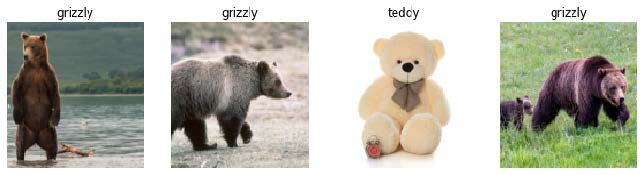

默认情况下，`Resize` 会 *裁剪* （crops）图像以适应请求尺寸的正方形，使用全宽或全高。这可能会导致丢失一些重要细节。或者，你可以要求 fastai 用零（黑色）填充图像，或进行压缩/拉伸：

```python
bears = bears.new(item_tfms=Resize(128, ResizeMethod.Squish))
dls = bears.dataloaders(path)
dls.valid.show_batch(max_n=4, nrows=1)
```

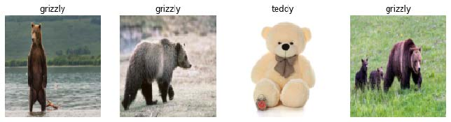

```python
bears = bears.new(item_tfms=Resize(128, ResizeMethod.Pad,
pad_mode='zeros'))
dls = bears.dataloaders(path)
dls.valid.show_batch(max_n=4, nrows=1)
```

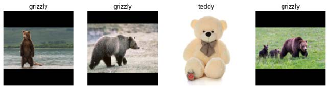

所有这些方法似乎都存在浪费或问题。如果我们压缩或拉伸图像，最终会导致形状不真实，使模型学习到的物体外观与实际不符，这显然会降低识别准确率。如果裁剪图像，则会去除部分用于识别的特征。例如在识别犬猫品种时，裁剪可能导致关键身体部位或面部特征缺失，而这些特征正是区分相似品种的关键。若对图像进行填充，则会产生大量空白区域，不仅造成模型计算资源浪费，还会降低实际使用图像区域的有效分辨率。

相反，我们在实践中通常的做法是随机选取图像的一部分，然后裁剪为仅包含该部分。在每个迭代轮次（即对数据集内所有图像进行一次完整遍历）中，我们随机选取每张图像的不同区域。这意味着模型能够学会聚焦并识别图像中的多样化特征，同时也反映了现实世界中图像的呈现方式：同一物体的不同照片可能存在细微的构图差异。

事实上，一个完全未经训练的神经网络对图像的特性一无所知。它甚至无法识别当物体旋转一度后，它仍然是同一事物的图像！因此，通过训练神经网络识别那些物体位置略有不同、尺寸稍有差异的图像示例，能帮助它理解物体的基本概念，以及物体在图像中的呈现方式。

这里是另一个示例，我们将 `Resize` 替换为 `RandomResizedCrop` ，该变换提供了上述行为。最重要的传入参数是 `min_scale` ，它决定每次操作中图像的最小选取比例：

```python
bears = bears.new(item_tfms=RandomResizedCrop(128, min_scale=0.3))
dls = bears.dataloaders(path)
dls.train.show_batch(max_n=4, nrows=1, unique=True)
```

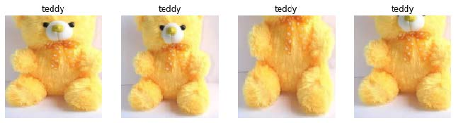

在此，我们使用 `unique=True` 使同一张图像通过不同版本的 `RandomResizedCrop` 变换进行重复处理。

`RandomResizedCrop` 是数据增强这一更普遍技术的一个具体示例。

#### 数据增强

数据增强是指对输入数据进行随机变异处理，使其外观发生改变但不改变数据的含义。常见的图像数据增强技术包括旋转、翻转、透视变形、亮度调整和对比度调整。对于我们在此使用的自然照片图像，`aug_transforms` 函数提供了一套经过验证效果良好的标准增强方案。

由于所有图像现已统一尺寸，我们可以利用GPU对整批图像应用这些增强操作，从而大幅节省时间。要告知fastai对批次应用这些变换，我们使用 `batch_tfms` 参数（注意本例未使用 `RandomResizedCrop`，以便更清晰展示差异；同时采用双倍于默认值的增强量，原因同上）：

```python
bears = bears.new(item_tfms=Resize(128),
batch_tfms=aug_transforms(mult=2))
dls = bears.dataloaders(path)
dls.train.show_batch(max_n=8, nrows=2, unique=True)
```

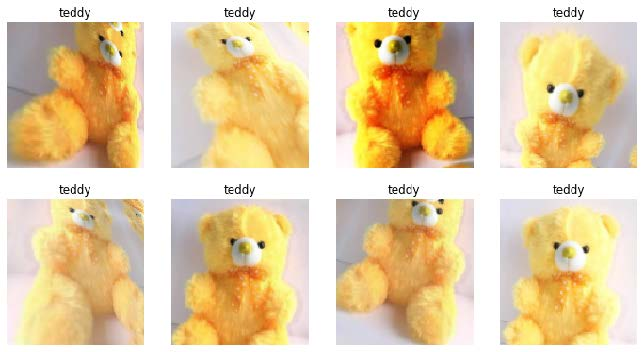

既然我们已经将数据整理成适合模型训练的格式，接下来就用它来训练一个图像分类器吧。

### 训练你的模型，然后用它来清洗你的数据

现在该使用与第一章相同的代码行来训练我们的熊分类器了。由于我们面临的问题数据量有限（每种熊最多150张图片），因此训练模型时将采用 `RandomResizedCrop`方法，图像尺寸设为224像素（这是图像分类中的标准尺寸），并使用默认的 `aug_transforms` 参数：

```python
bears = bears.new(
    item_tfms=RandomResizedCrop(224, min_scale=0.5),
    batch_tfms=aug_transforms())
dls = bears.dataloaders(path)
```

现在我们可以创建我们的 `Learner` 并按常规方式进行微调：

| 迭代轮次 | 训练损失 | 验证损失 | 错误率   | 时间  |
| -------- | -------- | -------- | -------- | ----- |
| 0        | 1.235733 | 0.212541 | 0.087302 | 00:05 |
| 0        | 0.213371 | 0.112450 | 0.023810 | 00:05 |
| 1        | 0.173855 | 0.072306 | 0.023810 | 00:06 |
| 2        | 0.147096 | 0.039068 | 0.015873 | 00:06 |
| 3        | 0.123984 | 0.026801 | 0.015873 | 00:06 |

现在让我们看看模型犯的错误主要是将灰熊误认为泰迪熊（这会危及安全！），还是将灰熊误认为黑熊，抑或其他情况。为可视化呈现，我们可以创建混淆矩阵：

```python
interp = ClassificationInterpretation.from_learner(learn)
interp.plot_confusion_matrix()
```

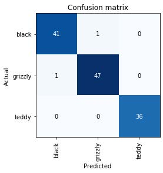

这里行分别代表数据集中所有的黑熊、灰熊和泰迪熊。列分别代表模型预测为黑熊、灰熊和泰迪熊的图像。因此，矩阵对角线显示的是分类正确的图像，非对角线单元格则代表分类错误的图像。这是fastai提供多种模型结果可视化方式之一。该结果（当然！）基于验证集计算得出。通过颜色编码，目标是使除对角线外的所有单元格呈现白色，而对角线区域则显示深蓝色。我们的熊分类器几乎没有出错！

要找出错误的具体发生位置很有帮助，这样就能判断问题是源于数据集（例如根本不是熊的图像，或标注错误）还是模型本身（比如无法处理特殊光照条件下的图像，或角度不同的图像等）。为此，我们可以按损失值对图像进行排序。

*损失值*（loss）是一个数值，当模型预测错误时（特别是当模型对错误答案也充满信心时），或当模型预测正确但对正确答案缺乏信心时，该数值会更高。在第二部分开头，我们将深入学习损失值如何计算以及在训练过程中如何应用。目前，`plot_top_losses` 方法展示了数据集中损失值最高的图像。正如输出标题所示，每张图像都标注了四项信息：预测值、实际值（目标标签）、损失值和置信度。这里的置信度是模型对预测结果赋予的信心水平，取值范围为0到1：

```python
interp.plot_top_losses(5, nrows=1)
```

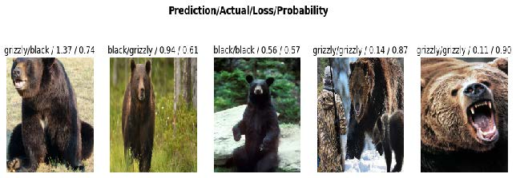

该输出结果表明，损失值最高的图像被系统以高置信度预测为“灰熊”。然而根据我们的Bing图像搜索结果，该图像实际标注为“黑熊”。虽然我们并非熊类专家，但该标签显然存在错误！我们应将其标签修改为“灰熊”。

数据清洗的直观做法是在训练模型前进行。但正如本例所示，模型能帮助我们更快、更轻松地发现数据问题。因此我们通常优先训练一个快速简单的模型，再利用它辅助数据清洗工作。

fastai 包含一个名为 `ImageClassifierCleaner` 的便捷图形界面工具，用于数据清理。该工具允许您选择类别和训练集/验证集，查看损失最高的图像（按顺序排列），并提供菜单选项以选择图像进行删除或重新标注：

```python
cleaner = ImageClassifierCleaner(learn)
cleaner
```

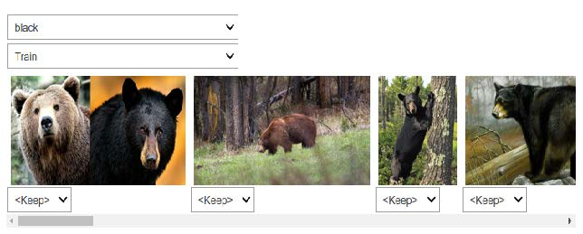

我们发现“黑熊”类别中有一张包含两只熊的图片：一只灰熊，一只黑熊。因此，我们应在此图片下方菜单中选择 `<Delete>`。`ImageClassifierCleaner` 不会自动执行删除或修改标签的操作，它仅返回待修改项目的索引。例如，若要删除（解除关联）所有标记为删除的图像，需执行以下操作：

```python
for idx in cleaner.delete(): cleaner.fns[idx].unlink()
```

要移动已选择不同类别的图片，我们需要运行以下操作：

```python
for idx,cat in cleaner.change(): shutil.move(str(cleaner.fns[idx]),
path/cat)
```

> SYLVAIN说
>
> 数据清洗和模型准备是数据科学家面临的两大挑战，据称耗费了他们90%的时间。fastai库旨在提供工具，使这些工作尽可能轻松。

在本书后续内容中，我们将看到更多基于模型的数据清洗示例。完成数据清洗后，即可重新训练模型。请亲自尝试，看看你的模型的准确率是否有所提升！

> 并不需要大数据
>
> 在完成上述数据集清理步骤后，我们通常能在此任务中实现100%的准确率。即使下载的图像数量远少于当前每类150张的规模，我们依然能获得相同结果。由此可见，所谓深度学习需要海量数据的普遍说法，与事实可能相去甚远！

现在模型已经训练完成，让我们看看如何将其部署到实际应用中。

### 将你的模型转化为在线应用程序

接下来我们将探讨如何将此模型转化为可运行的在线应用程序。我们仅会创建一个基础可运行的原型；本书篇幅有限，无法详尽讲解网络应用程序开发的全部细节。

#### 使用该模型进行推理

当你获得满意的模型后，需要将其保存以便后续复制到生产环境的服务器上使用。请记住，模型由两部分组成：架构和训练参数。最简便的保存方式是同时保存这两部分，这样加载模型时就能确保架构与参数完全匹配。要保存这两部分，请使用 `export` 方法。

该方法甚至省去了定义如何创建 `DataLoaders` 的步骤。这点至关重要，因为否则你将不得不重新定义数据转换方式才能在生产环境中使用模型。fastai默认会自动使用验证集 `DataLoaders` 进行推理，因此数据增强操作不会生效——这通常正是你期望的结果。

当你调用 `export` 时，fastai会保存一个名为 `export.pkl` 的文件：

```python
learn.export()
```

让我们使用 fastai 为 Python 的 Path 类添加的 `ls` 方法来检查文件是否存在：

```python
path = Path()
path.ls(file_exts='.pkl')
(#1) [Path('export.pkl')]
```

无论将应用部署到何处，你都需要此文件。现在，让我们尝试在笔记本中创建一个简单的应用。

当我们使用模型进行预测而非训练时，称为 *推理* （inference.）。要从导出文件创建推理学习器，我们使用`load_learner`函数（在此情况下其实并非必需，因为笔记本中已有可用的学习器；此处演示是为了完整呈现端到端流程）：

```python
learn_inf = load_learner(path/'export.pkl')
```

在进行推理时，我们通常每次只对单张图像进行预测。为此，请向 `predict` 函数传递文件名：

```python
learn_inf.predict('images/grizzly.jpg')

('grizzly', tensor(1), tensor([9.0767e-06, 9.9999e-01, 1.5748e-07]))
```

这返回了三项内容：以你最初提供的相同格式（本例中为字符串）呈现的预测类别、该预测类别的索引，以及各类别的概率值。后两项基于 `DataLoaders` 词汇表中类别的顺序，即存储的所有可能类别列表。推理时，可通过 `Learner` 的属性访问 `DataLoaders` ：

```python
learn_inf.dls.vocab

(#3) ['black','grizzly','teddy']
```

我们在此可见，若使用 `predict` 函数返回的整数在词表中进行索引，则如预期般得到“灰熊”一词。同时请注意，若对概率列表进行索引，可发现该词为灰熊的概率接近1.00。

我们已经掌握了如何从保存的模型中进行预测，因此具备了开始构建应用程序所需的一切。我们可以在Jupyter笔记本中直接实现这一功能。

#### 从模型创建笔记本应用

要在应用程序中使用我们的模型，只需将 `predict` 方法视为常规函数即可。因此，开发人员可利用现有的众多框架和技术，基于该模型创建应用程序。

然而，大多数数据科学家并不熟悉网络应用程序开发领域。因此，让我们尝试使用你目前熟悉的工具：事实证明，仅凭Jupyter笔记本就能创建一个完整的可运行网络应用程序！实现这一目标需要以下两项要素：

- IPython 小部件 (ipywidgets)
- Voilà

IPython小部件是图形用户界面组件，可在网页浏览器中整合JavaScript与Python功能，并能在Jupyter笔记本中创建和使用。例如本章前文介绍的图像清理工具，便是完全通过IPython小部件实现的。但我们不希望要求应用程序用户自行运行Jupyter。

这就是Voilà存在的意义。它是一个系统，能够让由IPython控件组成的应用程序直接提供给终端用户，而用户完全无需使用Jupyter。Voilà利用了笔记本本身就是一种网络应用程序的事实——只是它相当复杂，依赖于另一个网络应用程序：Jupyter本身。本质上，它帮助我们将已隐含创建的复杂网络应用程序（即笔记本）自动转换为更简单、更易部署的网络应用程序，使其像普通网络应用程序而非笔记本那样运行。

但我们仍拥有在笔记本中开发的优势，因此借助 ipywidgets，我们可以逐步构建图形用户界面。我们将采用这种方法创建一个简单的图像分类器。首先，我们需要一个文件上传控件：

```python
btn_upload = widgets.FileUpload()
btn_upload
```


现在我们可以获取图像：

```python
img = PILImage.create(btn_upload.data[-1])
```


我们可以使用一个 `Output` 控件来显示它：

```python
out_pl = widgets.Output()
out_pl.clear_output()
with out_pl: display(img.to_thumb(128,128))
out_pl
```


然后我们就能得到预测结果：

```python
pred,pred_idx,probs = learn_inf.predict(img)
```

并使用 `Label` 来显示它们：

```python
lbl_pred = widgets.Label()
lbl_pred.value = f'Prediction: {pred}; Probability:
{probs[pred_idx]:.04f}'
lbl_pred
```

```text
Prediction: grizzly; Probability: 1.0000
```

我们需要一个按钮来执行分类操作。它的外观与上传按钮完全相同：

```python
btn_run = widgets.Button(description='Classify')
btn_run
```

我们还需要一个点击事件处理程序，即按下时会被调用的函数。我们可以直接复制之前的代码行：

```python
def on_click_classify(change):
    img = PILImage.create(btn_upload.data[-1])
    out_pl.clear_output()
    with out_pl: display(img.to_thumb(128,128))
    pred,pred_idx,probs = learn_inf.predict(img)
    lbl_pred.value = f'Prediction: {pred}; Probability:
    {probs[pred_idx]:.04f}'
btn_run.on_click(on_click_classify)
```

现在吧可以点击按钮进行测试，图像和预测结果将自动更新！

现在我们可以将它们全部放入一个垂直框（`VBox`）中，以完成我们的图形用户界面：

```python
VBox([widgets.Label('Select your bear!'),
	btn_upload, btn_run, out_pl, lbl_pred])
```

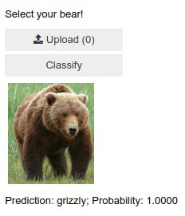

我们已经编写了应用程序所需的所有代码。下一步是将其转换为可部署的形式。

#### 将笔记本变成真正应用程序

现在Jupyter笔记本中的所有功能都已正常运行，我们可以着手创建应用程序了。为此，请新建一个笔记本，仅添加创建并展示所需控件的代码，以及需要显示的文本对应的Markdown格式。请查阅本书代码库中的 `bear_classifier` 笔记本，了解我们创建的简易笔记本应用程序。

若尚未安装Voilà，请将以下代码复制到笔记本单元格中执行：

```bash
!pip install voila
!jupyter serverextension enable voila --sys-prefix
```

以 `!` 开头的单元格不包含 Python 代码，而是包含将被传递至您的 shell（如 bash、Windows PowerShell 等）执行的命令。若您熟悉命令行操作（本书后续将详细探讨），当然也可以直接在终端输入这两行命令（无需 `!` 前缀）。此时第一行将安装 voila 库及应用程序，第二行则将其连接至您现有的 Jupyter 笔记本。

Voilà 运行 Jupyter 笔记本的方式与你当前使用的 Jupyter 笔记本服务器完全相同，但它还实现了至关重要的功能：移除所有单元格输入内容，仅展示输出结果（包括 ipywidgets）以及你的 Markdown 单元格。最终呈现的正是完整的网页应用程序！若要以 Voilà 网络应用形式查看笔记本，请将浏览器地址栏中的“notebooks”替换为“voila/render”。你将看到与笔记本相同的内容，但所有代码单元格均已消失。

当然，你不必使用Voilà或ipywidgets。你的模型本质上只是一个可调用的函数（`pred` , `pred_idx` , `probs = learn.predict(img)` ），因此可在任何框架下使用，部署于任意平台。你还可将通过ipywidgets和Voilà原型化的内容，后续转换为常规Web应用程序。我们在书中展示这种方法，是因为我们认为这对数据科学家及其他非网页开发专家而言，是将模型转化为应用程序的绝佳途径。

我们已经有了应用程序，现在就来部署它吧！

#### 部署你的应用程序

正如你所知，训练几乎任何有用的深度学习模型都需要GPU。那么，在生产环境中使用该模型是否也需要GPU？不需要！你几乎肯定不需要GPU来部署生产环境中的模型。原因有以下几点：

- 正如我们所见，GPU仅在执行大量相同任务的并行处理时才具有优势。若进行图像分类等操作，通常每次仅处理单个用户的图像，且单张图像的处理量往往不足以让GPU持续高效运转。因此CPU通常更具成本效益。
- 另一种方案是等待多个用户提交图像后批量处理，再通过GPU一次性完成计算。但这会导致用户需要等待结果，无法即时获取反馈！且该方案需高流量网站支撑才能实现。若确实需要此功能，可采用微软ONNX Runtime或AWS SageMaker。
- 处理GPU推理涉及显著复杂性。尤其需要手动精细管理GPU内存，并构建严谨的队列系统确保每次仅处理单批次任务。
- CPU服务器市场的竞争远比GPU服务器激烈，因此CPU服务器存在更经济实惠的选择方案。

由于GPU服务的复杂性，许多系统应运而生，试图实现自动化。然而，管理和运行这些系统同样复杂，通常需要将模型编译成该系统专用的不同形式。通常情况下，除非应用程序足够流行，以至于这样做具有明显的经济效益，否则最好避免处理这种复杂性。

至少对于应用程序的初始原型以及任何你想展示的业余项目，你都可以轻松免费托管它们。最佳托管平台与方式会随时间变化，请访问本书官网获取最新建议。本书撰写于2020年初，当前最简便（且免费！）的方案是使用 [Binder](https://mybinder.org/) 。在Binder发布网页应用的步骤如下：

1. 将你的笔记本添加到 GitHub 存储库中。
2. 将该存储库的 URL 粘贴到 Binder 的 URL 字段中，如图 2-4 所示。
3. 将文件下拉菜单切换为URL选项。
4. 在“打开的URL”字段输入 `/voila/render/name.ipynb`（将name替换为你的笔记本名称）。

5. 点击右下角剪贴板按钮复制URL，并将其粘贴至安全位置。
6. 点击启动。

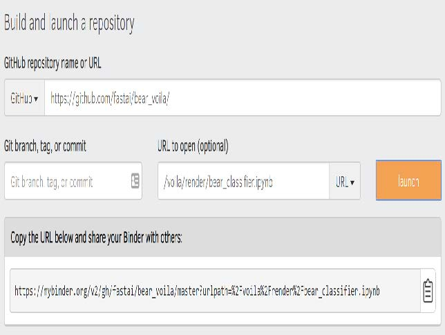

[^图2-4]: 部署到Binder

首次执行此操作时，Binder 构建网站约需 5 分钟。后台正在寻找可运行你应用的虚拟机、分配存储空间，并收集用于 Jupyter、你的笔记本以及将笔记本呈现为网络应用所需的文件。

最后，当应用程序启动运行后，它将引导你的浏览器访问您的新网页应用。你还可以分享已复制的URL链接，让其他人也能访问你的应用。

有关部署网络应用的其他选项（包括免费和付费方案），请务必访问 [本书网站](https://book.fast.ai/) 。

你可能希望将应用程序部署到移动设备或边缘设备（如树莓派）。现有多种库和框架可让你将模型直接集成到移动应用中。然而这些方法往往需要大量额外步骤和冗余代码，且未必支持模型可能使用的所有 PyTorch 和 fastai 层。此外，具体实现方式取决于目标部署的移动设备类型——iOS设备需要特定适配方案，新型Android设备需不同方案，旧版Android设备又需另行处理。因此我们建议尽可能将模型本身部署至服务器，让移动或边缘应用以Web服务形式连接调用。

这种方法有不少优势。初始安装更简单，因为只需部署一个小型图形界面应用程序，它通过连接服务器完成所有繁重工作。更重要的是，核心逻辑的升级可以在服务器端完成，无需分发给所有用户。相较于多数边缘设备，服务器拥有更充裕的内存与处理能力，当模型需求增加时，这些资源也更易于扩展。服务器硬件通常更标准化，且能更好地支持fastai和PyTorch，因此无需将模型编译为其他格式。

当然，这也存在一些弊端。你的应用程序需要网络连接，且每次调用模型时都会产生延迟。（神经网络模型的运行本身就需要时间，因此额外的网络延迟在实际使用中可能不会对用户造成太大影响。事实上，由于服务器端可使用更强大的硬件，整体延迟甚至可能低于本地运行！） 此外，若应用涉及敏感数据，用户可能对数据传输至远程服务器的做法心存顾虑。因此隐私考量有时要求模型必须在边缘设备上运行（通过部署本地服务器——例如置于公司防火墙内——或许能规避此问题）。管理复杂性与扩展服务器同样会产生额外开销，而若模型在边缘设备上运行，每个用户都自带计算资源，这使得随着用户数量增加更易实现扩展（即水平扩展）。

> ALEXIS说
>
> 在工作中，我有机会近距离观察移动机器学习领域正在发生的变化。我们提供一款依赖计算机视觉技术的iPhone应用，多年来一直在云端运行自主开发的计算机视觉模型。当时这是唯一可行的方案，因为这些模型需要大量内存和计算资源，处理输入数据需耗时数分钟。这种方案不仅需要构建模型（很有趣！），还需搭建基础设施来确保一定数量的“计算工作机”始终保持运行（令人担忧），当流量增加时能自动调用更多机器，为大型输入输出数据提供稳定存储空间，并使iOS应用能够实时了解任务执行状态并向用户反馈等。如今苹果提供了将模型转换为设备端高效运行的API，且多数iOS设备都配备了专用机器学习硬件，这已成为主流策略，因此我们的新模型均采用此策略。虽然仍非易事，但对我们而言，为提升用户体验速度并减少服务器维护负担，这笔投入是值得的。现实中，适合你的方案取决于你试图打造的用户体验以及个人能力倾向。若你精通服务器运维，就选择这条路；若你擅长原生移动应用开发，就选择这条路。通往山顶的路，本就有千百条。

总体而言，我们建议在可行的情况下尽可能采用基于CPU的简单服务器方案，只要这种方案还能满足需求。若你足够幸运拥有一个非常成功的应用程序，届时便能证明投资更复杂的部署方案是合理的。

恭喜——你已成功构建深度学习模型并完成部署！现在正是停下来思考可能出现的问题的好时机。

### 如何避免灾难

实际上，深度学习模型只是更大系统中的一环。正如我们在本章开头讨论的，构建数据产品需要考虑从构思到生产部署的端到端全流程。本书无法涵盖部署后数据产品管理的全部复杂性，例如：管理多版本模型、A/B测试、金丝雀式发布（canarying）、数据更新策略（是持续扩充数据集，还是定期清理旧数据？）、处理数据标注、监控全流程、检测模型衰减等问题。

在本节中，我们将概述一些最重要的注意事项；若需更深入探讨部署问题，建议你参阅Emmanuel Ameisin所著的 [《构建机器学习驱动的应用程序》（O’Reilly出版社）](http://shop.oreilly.com/product/0636920215912.do) 一书。

需要考虑的最大问题之一是，理解和测试深度学习模型的行为比编写其他代码困难得多。在常规软件开发中，你可以分析软件执行的具体步骤，并仔细研究哪些步骤符合你试图创建的预期行为。但神经网络的行为并非精确定义，而是源于模型匹配训练数据的过程。

这可能导致灾难性后果！例如，假设我们真的要推出一套熊类探测系统，该系统将安装在国家公园露营地的监控摄像头中，用于向露营者发出熊类接近的警报。如果我们使用基于下载数据集训练的模型，实际应用中就会出现各种问题，例如：

- 处理视频数据而非图像数据
- 处理夜间图像（本数据集可能未包含此类图像）
- 处理低分辨率摄像头图像
- 确保结果返回速度足以满足实际应用需求
- 识别在用户网络照片中罕见姿态的熊（例如背面、部分被灌木遮挡或远离摄像头的位置）

问题很大程度上在于，人们最可能上传到互联网的照片，往往是那些能清晰且富有艺术性地展现拍摄对象的类型——而这并非该系统将接收的输入类型。因此，我们可能需要自行开展大量数据收集和标注工作，才能构建出有用的系统。

这只是域外数据（out-of-domain data）这一更普遍问题的一个例子。也就是说，模型在生产环境中遇到的数据可能与训练期间所见截然不同。对此尚无完整的技术解决方案，我们必须谨慎推进该技术的部署策略。

我们还需谨慎对待其他因素。一个非常普遍的问题是域变化，即模型所处理的数据类型随时间推移而改变。例如，保险公司可能采用深度学习模型作为其定价和风险算法的一部分，但随着时间推移，公司吸引的客户类型及其承保的风险类型可能发生巨大变化，导致原始训练数据不再适用。

域外数据和域迁移问题揭示了一个更广泛的困境：由于神经网络参数数量庞大，我们永远无法完全预知其所有可能的行为模式。这种特性恰恰源于其最突出的优势——灵活性。正是这种灵活性使它们能够解决复杂问题，而这些问题往往连我们都难以明确界定理想的解决方案。然而，好消息是通过精心设计的流程可以缓解这些风险。具体方法因所解决问题的细节而异，但我们将尝试提出一个高层次的解决方案（如图2-5所示），希望能提供有价值的指导。

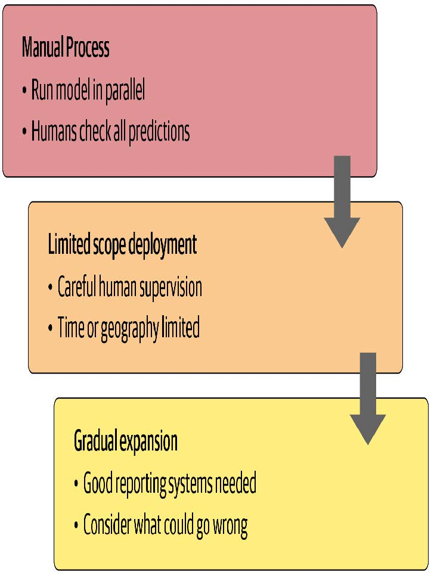

[^图2-5]: 部署过程

在条件允许的情况下，第一步应采用完全手动流程，同时让深度学习模型方案并行运行，但不直接用于驱动任何操作。参与手动流程的人员应查看深度学习输出结果，并核查其合理性。例如，在我们的熊类识别系统中，公园管理员可通过显示所有监控摄像头视频的屏幕，将疑似熊踪迹直接标记为红色。此时管理员仍需保持与模型部署前同等的警觉性——模型仅在协助排查异常问题。

第二步是尝试限制模型的应用范围，并确保其受到人员的严格监督。例如，对模型驱动方法进行地域和时间范围有限的小规模试验。与其在全国所有国家公园部署熊类识别系统，不如选择单一观测点进行为期一周的测试，由护林员在警报发出前逐一核查。

随后应该逐步扩大系统部署范围。在此过程中，务必建立完善的报告机制，确保能及时察觉相较于人工流程的重大操作变动。例如，若某区域新系统上线后熊类警报数量翻倍或减半，则应引起高度警惕。请全面思考系统可能出错的所有途径，进而推演哪些指标、报告或图表能反映这些问题，并确保常规报告中包含相关信息。

> JEREMY说
>
> 二十年前，我创立了一家名为Optimal Decisions的公司，利用机器学习和优化技术帮助大型保险公司制定定价策略，影响着数千亿美元的风险管理。我们运用本文所述方法来管理潜在风险。在与客户合作投入生产前，我们总会通过测试端到端系统对前一年数据进行影响模拟。将新算法投入生产始终是令人提心吊胆的过程，但每次部署都取得了成功。

#### 不可预见的后果与反馈循环

在部署模型时面临的最大挑战之一在于，模型可能改变其所隶属系统的行为模式。例如，假设某项“预测性警务”算法预测特定社区犯罪率将上升，导致更多警力被调往这些社区，进而可能使这些社区的犯罪记录数量增加，如此循环往复。在皇家统计学会论文 [《预测与服务？》](https://oreil.ly/3YEWH) 中，克里斯蒂安·卢姆（Kristian Lum）与威廉·艾萨克（William Isaac）指出：“预测性警务的命名恰如其分——它预测的是未来的警务部署，而非未来的犯罪。”

本案的问题之一在于，当存在偏见时（我们将在下一章深入探讨），反馈循环可能导致这种偏见的负面影响日益恶化。例如，人们担忧这种情况已在美国发生——该国基于种族的逮捕率存在显著偏见。 [美国公民自由联盟指出](https://oreil.ly/A9ijk) ：“尽管使用率大致相当，黑人因大麻被捕的概率是白人的3.73倍。”这种偏见的影响，加上美国多地推行预测性警务算法，促使贝里·威廉姆斯在 [《纽约时报》](https://oreil.ly/xR0di) 撰文写道： “在我职业生涯中备受推崇的技术，如今却被执法部门用于可能导致未来几年内，我现年7岁的儿子仅因种族和居住地就更可能遭受种族定性、被捕——甚至遭遇更糟待遇。”

在部署重要机器学习系统前，一个有益的练习是思考这个问题：“如果它真的、真的非常成功会怎样？”换言之，如果预测能力极强，且其影响行为的能力极其显著，那么谁将受到最大影响？最极端的结果可能呈现何种形态？你又如何知晓真实情况？

这样的思维演练或许能助你制定更周密的部署方案，配备持续监控系统与人工监管机制。当然，若监管意见得不到重视，人工监管便形同虚设——务必确保建立可靠且具有弹性的沟通渠道，使相关人员能够及时掌握问题动态，并具备解决问题的决策权。

### 开始动笔吧！

我们的学生发现，巩固对这些知识理解最有效的方法之一就是动笔写下来。没有什么比尝试向他人讲解某个主题更能检验你对它的理解程度了。即使你永远不会把写的东西给别人看，这也很有帮助——但分享出来效果会更好！因此我们建议，若尚未开始，请创建个人博客。完成本章学习后，你已掌握模型训练与部署方法，正是撰写首篇深度学习实践博客的最佳时机。哪些发现令你惊讶？你所在领域存在哪些深度学习应用机遇？又面临哪些技术障碍？

fast.ai联合创始人Rachel Thomas在 [《为什么你（没错，就是你）应该写博客》](https://oreil.ly/X9-3L) 一文中写道：

> 我给年轻时的自己最重要的建议就是：早点开始写博客。以下是写博客的几个理由：
>
> - 它就像一份简历，但效果更好。我认识几个人，他们的博客文章直接带来了工作机会！
> - 他可以帮助你学习。整理知识总能帮助我梳理自己的想法。检验是否真正理解某件事的标准之一，就是能否向他人解释清楚。写博客正是实现这个目标的好方法。
> - 我的博客文章曾为我赢得会议邀请和演讲机会。正是因为撰写了“我不喜欢TensorFlow”的博文，我受邀参加了TensorFlow开发者峰会（那次经历太棒了！）。
> - 结识新朋友。我曾通过博客结识多位读者，他们主动联系我讨论文章内容。
> - 节省时间。当你反复通过邮件解答相同问题时，不妨将其整理成博客文章——这样下次有人提问时，你就能更高效地分享解决方案。

也许她最重要的建议是：

> 你最适合帮助那些比你落后一步的人。相关知识在你脑海里依然清晰。许多专家早已忘记初学者的感受（或中级学习者的状态），也忘了初次接触某个主题时为何难以理解。你独特的背景、个人风格和知识水平，会为你的写作内容增添别样色彩。

我们在附录A中详细介绍了如何创建博客。若你尚未拥有博客，请立即查阅该附录——我们提供了一种绝佳方案，助您免费开启博客之旅，且完全无广告干扰，甚至还能使用Jupyter Notebook！

### 问卷调查

1. 当前文本模型存在哪些主要缺陷？
2. 文本生成模型可能对社会产生哪些负面影响？
3. 当模型可能出错且错误可能造成危害时，自动化流程的替代方案是什么？
4. 深度学习在处理何种表格数据方面表现尤为出色？
5. 直接将深度学习模型应用于推荐系统的主要弊端是什么？
6. 驱动链方法的具体步骤有哪些？
7. 驱动链方法的步骤如何映射到推荐系统？
8. 使用您整理的数据创建图像识别模型，并将其部署到网络上。
9. 什么是 `DataLoaders`？
10. 创建 `DataLoaders` 时需向fastai提供哪四项参数？
11. `DataBlock` 的 `splitter` 参数有何作用？
12. 如何确保随机分割始终生成相同的验证集？
13. 常用哪些字母表示自变量与因变量？
14. 裁剪（crop）、填充（pad）与压缩（squish）三种缩放方法有何区别？何时应选择其中一种？

15. 什么是数据增强？为何需要它？
16. 举例说明熊分类模型在生产环境中可能表现不佳的情况，原因在于训练数据的结构或风格差异。
17. `item_tfms` 与 `batch_tfms` 有何区别？

18. 什么是混淆矩阵？
19. 导出功能保存什么内容？
20. 当模型用于预测而非训练时，这种操作称为什么？
21. 什么是IPython控件？
22. 何时应使用CPU进行部署？何时更适合使用GPU？
23. 将应用部署到服务器而非客户端（或边缘设备）如手机或电脑的缺点是什么？
24. 实际部署熊类预警系统时可能出现的三类问题示例？
25. 什么是域外数据？
26. 什么是域迁移？
27. 部署流程包含哪三个步骤？

#### 进一步探究

1. 思考驱动链方法如何应用于你感兴趣的项目或问题。
2. 在何种情况下应避免使用特定类型的数据增强？
3. 针对你想应用深度学习的项目，进行思想实验：“如果效果极佳会怎样？”
4. 开设博客并撰写首篇博文。例如，探讨你认为深度学习在感兴趣领域中的潜在应用价值。
