## 3. 数据伦理

> 致谢：瑞秋·托马斯博士（DR. RACHEL THOMAS）
>
> 本章由fastai联合创始人、旧金山大学应用数据伦理中心创始主任瑞秋·托马斯博士共同撰写。其内容主要基于她为 [《数据伦理导论》课程](https://ethics.fast.ai/) 设计的教学大纲部分内容。

正如我们在第1章和第2章所讨论的，机器学习模型有时会出错。它们可能存在缺陷，可能在面对从未见过的数据时表现出我们意料之外的行为。或者它们可能完全按设计运行，却被用于我们极力反对的用途。

由于深度学习是一种极其强大的工具，可应用于众多领域，我们审慎考量选择后果显得尤为重要。伦理学的哲学研究本质上是对是非善恶的探究，包括如何定义这些概念、辨识正确与错误的行为，以及理解行为与后果之间的关联。数据伦理学领域已存在多年，众多学者专注于此。它正被用于协助制定多地政策；被大小企业用于思考如何确保产品开发产生良好社会效益；也被研究者用于确保其工作成果用于善而非恶。

因此，作为深度学习从业者，你很可能会在某个时刻面临需要考虑数据伦理的处境。那么，什么是数据伦理？它属于伦理学的子领域，我们就从这里开始探讨。

> JEREMY说
>
> 在大学里，伦理学哲学是我主攻的方向（若非中途辍学投身现实世界，它本该成为我的毕业论文主题）。基于多年伦理学研究，我可以明确告诉你：关于是非善恶的本质、其存在性、辨别标准、善恶之分乃至其他相关议题，世人从未达成共识。所以别对理论抱太大期望！我们这里要聚焦于实例和思考起点，而非理论本身。

在回答 [“什么是伦理学？”](https://oreil.ly/nyVh4) 这个问题时，马克库拉（Markkula Center）应用伦理学中心指出该术语指代以下内容：

- 已经确立的善恶标准，规定着人类应有的行为准则
- 个人道德标准的研究与发展

没有标准答案清单，没有行为准则清单。伦理问题错综复杂且因情境而异，它牵涉众多利益相关者的立场。伦理意识如同肌肉，需要持续锻炼与实践。本章旨在为你提供指引标识，助你在这一旅程中前行。

识别伦理问题最好在协作团队中完成。这是真正融合多元视角的唯一途径。不同背景的人能发现你可能忽略的细节。团队协作对许多“能力建设”活动都大有裨益，包括这项工作。

本章固然不是本书中唯一探讨数据伦理的部分，但专门留出篇幅集中讨论这一议题颇有裨益。为了理清思路，或许最简便的方式是审视若干实例。因此我们精选了三个案例，认为它们能有效阐释若干核心议题。

### 数据伦理的关键示例

我们将从三个具体案例开始，这些案例揭示了技术领域中三种常见的伦理问题（本章后续部分将深入探讨这些问题）：

溯源程序：阿肯色州漏洞百出的医疗算法让患者束手无策。

反馈循环：YouTube（译者注：国外一家著名的视频网站）的推荐系统助推了阴谋论的爆发。

偏见：当在谷歌上搜索一个传统非裔美国人姓名时，它会显示犯罪背景调查的广告。

事实上，在本章介绍的每个概念中，我们都会提供至少一个具体实例。对于每个实例，请思考：若身处该情境，你会采取何种行动？又会遇到哪些阻碍？你会如何应对这些阻碍？需要警惕哪些问题？

#### 漏洞与补救措施：用于医疗福利的漏洞算法

The Verge（译者注：一家知名的美国科技媒体网站） 调查了美国半数以上州用于决定民众医疗保障额度使用的软件，并在题为 [《算法削减你的医疗保障会发生什么》](https://oreil.ly/25drC) 的文章中记录了调查结果。该算法在阿肯色州实施后，数百人（其中许多是重度残疾人士）的医疗保障遭到大幅削减。

例如，脑瘫患者塔米·多布斯需要护理员协助起床、如厕、进食等日常活动，她的护理时长却突然被削减了每周20小时。她无法获得任何关于医疗服务被削减的解释。最终，法庭审理揭露算法软件实施存在缺陷，对糖尿病患者和脑瘫患者造成了负面影响。然而，多布斯和其他依赖这些医疗福利的人仍生活在恐惧中——他们担心自己的福利可能再次遭遇突然且无法解释的削减。

#### 反馈循环：YouTube的推荐系统

当模型开始控制下一轮数据采集时，便可能形成反馈循环。软件自身会迅速使返回的数据产生偏差。

例如，YouTube拥有19亿用户，每天观看超过10亿小时的视频。其推荐算法（由谷歌构建）旨在优化观看时长，约70%的观看内容都由该算法推荐产生。但问题在于：这导致失控的反馈循环，促使《纽约时报》在2019年2月刊发标题为 [“YouTube助推阴谋论爆发，能否遏制？”](https://oreil.ly/Lt3aU) 的报道。表面上，推荐系统在预测用户偏好的内容，但它们同样拥有决定用户可见内容的巨大权力。

#### 偏见：拉坦妮娅·斯威尼教授遭“逮捕”

拉坦妮娅·斯威尼（Latanya Sweeney）博士是哈佛大学教授兼该校数据隐私实验室主任。在题为 [《在线广告投放中的歧视现象》](https://oreil.ly/1qBxU) （见图3-1）的论文中，她描述了自己发现的现象：当谷歌搜索她的名字时，会出现“拉坦妮娅·斯威尼被捕？”的广告，尽管她是唯一已知的拉坦妮娅·斯威尼且从未被捕。然而当她搜索其他名字，如“柯尔斯滕·林奎斯特”（Kirsten Lindquist）时，却获得更中立的广告——尽管该人曾三次被捕。

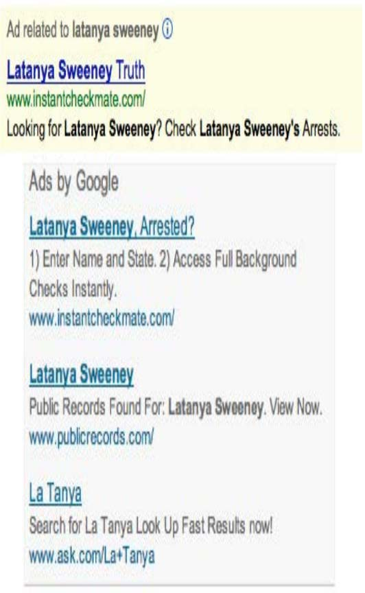

[^图3-1]: 谷歌搜索显示关于拉坦妮娅·斯威尼教授的逮捕记录广告（其实她从来没被捕过）

作为一名计算机科学家，她系统地研究了这一现象，并分析了超过2000个名字。她发现了一个明显的规律：历史上黑人名字会收到暗示当事人有犯罪记录的广告，而传统白人名字则收到更多中立的广告。

这是偏见的典型例子。它可能对人们的生活产生重大影响——例如，当求职者被谷歌搜索时，可能会显示其存在犯罪记录，而实际上他们并无犯罪史。

#### 为什么这很重要？

面对这些问题时，人们常会自然而然地反问：“那又怎样？这跟我有什么关系？我只是个数据科学家，不是政客。我不是公司里那些决定公司方向的高管，我只是想尽可能构建出最精准的预测模型。”

这些都是非常合理的问题。但我们将尝试说服你，答案在于：所有训练模型的人都必须考虑其模型的使用方式，并思考如何最大限度确保模型被积极利用。你可以采取相应措施，若不采取行动，后果可能相当严重。

当技术人员不惜一切代价专注于技术时，会发生什么可怕的事情？IBM（译者注：国际商业机器公司，美国一家有名的全球公司）与纳粹德国的故事便是其中一个特别骇人的例子。2001年，瑞士法官裁定“有理由推断IBM的技术援助便利了纳粹实施反人类罪行——这些罪行同样涉及IBM机器进行的会计核算与分类工作，并在集中营内部直接应用”。

要知道，IBM曾向纳粹提供数据制表产品，这些产品正是大规模追踪犹太人及其他群体灭绝行动的必需工具。此事由公司高层主导，其营销对象正是希特勒及其领导团队。公司总裁托马斯·沃森（Thomas Watson）亲自批准于1939年推出特殊IBM字母排序机，用于组织波兰犹太人的驱逐行动。图3-2所示为阿道夫·希特勒（最左侧）与IBM首席执行官老汤姆·沃森（左起第二位）会晤场景，此后不久希特勒于1937年授予沃森一枚特殊的“帝国服务勋章”。

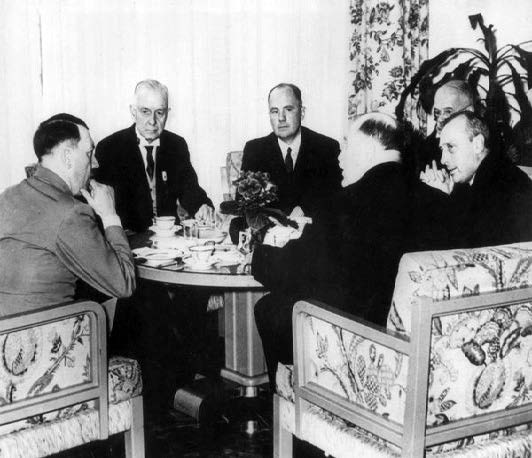

[^图3-2]: IBM首席执行官老汤姆·沃森会见阿道夫·希特勒

但这并非孤立事件——该组织的参与范围极其广泛。IBM及其子公司定期在集中营现场提供培训和维护服务：打印卡片、配置机器，并频繁维修故障设备。IBM在其打孔卡系统中建立了分类体系，用于记录每个人的死亡方式、所属群体，以及在庞大的大屠杀系统中追踪所需的后勤信息（见图3-3）。集中营中犹太人的代码为8：约600万人因此丧生。罗姆人（吉普赛人）的编码为12（纳粹将其标记为“反社会分子”，在“吉普赛人营”中逾30万人遇害）。普通处决编码为4，毒气室死亡编码为6。

[^图3-3]: IBM在集中营使用的穿孔卡片

当然，参与项目的经理、工程师和技术人员只是过着平凡的生活。照顾家人，周日去教堂，尽己所能做好本职工作。服从命令。营销人员也只是竭尽所能达成业务发展目标。正如《IBM与大屠杀》（Dialog Press出版）作者埃德温·布莱克所言：“对盲目的技术官僚而言，手段比目的更重要。犹太民族的毁灭变得微不足道——因为当全球饥民排起长队时，IBM技术成就带来的振奋感反而因可观利润而倍增。”

请稍作停顿思考：若你发现自己曾参与的系统最终伤害了社会，你会作何感受？你是否愿意了解真相？如何确保此类情况不再发生？我们在此描述的是最极端的情况，但当今社会已能观察到许多与人工智能和机器学习相关的负面后果，本章将探讨其中部分现象。

这不仅是道德负担。有时技术人员会为自己的行为付出非常直接的代价。例如，大众汽车因柴油排放测试作弊丑闻而成为首个入狱者的人，既不是负责该项目的经理，也不是公司掌舵的高管，而是工程师詹姆斯·梁（James Liang）——他只是执行了指令而已。

当然，事情并非全是坏处——如果你参与的项目最终对哪怕一个人产生了巨大的积极影响，这绝对会让你感到非常棒！

好的，希望我们已经说服你应该关注这个问题。但你该怎么做？作为数据科学家，我们天生倾向于通过优化某些指标来改进模型。但优化指标未必能带来更好的结果。即使确实有助于创造更佳结果，它也几乎肯定不是唯一重要的因素。试想从研究者或实践者开发模型算法，到最终用于决策的整个流程。若想获得理想结果，必须将这条完整管道视为一个整体来考量。

通常，从一端到另一端存在一条非常长的链条。如果你是一名研究人员，甚至可能不知道自己的研究是否会被用于任何用途，或者你参与的是数据收集工作——这在整个流程中更为早期——那么这种情况尤为明显。但没有人比你更适合向这条链条中的所有参与者说明你工作的能力、限制和细节。虽然没有万能良方能确保你的工作被正确运用，但通过参与流程并提出关键问题，至少能确保核心议题可以得到充分考量。

有时，面对工作请求的正确回应就是直接说“不”。然而我们常听到的却是：“如果我不做，别人也会做。” 但请想想：既然他们选中你，说明你就是最合适的人选——若你拒绝，这个项目就失去了最佳执行者。倘若前五位被邀请者都拒绝，那岂不是更好！

### 将机器学习与产品设计相结合

想必你从事这项工作的初衷，是希望它能有所用武之地。否则，不过是虚掷光阴。因此，我们不妨先假设你的工作终将有所成就。如今，当你收集数据并构建模型时，需要做出诸多抉择： 你将以何种聚合级别存储数据？该选用哪种损失函数？验证集与训练集如何划分？是优先考虑实现简易性、推理速度，还是模型准确性？模型如何处理域外数据项？它能否进行微调，还是必须定期从头重新训练？

这些不仅是算法问题，更是数据产品设计问题。但产品经理、高管、评审、记者、医生——无论最终开发和使用该系统的人是谁（你的模型是该系统的一部分）——都难以理解你所做的决策，更别说去改变它们。

例如，两项研究发现亚马逊的面部识别软件会产生不准确且存在种族偏见的识别结果。亚马逊辩称研究人员本应修改默认参数，却未解释这如何能改变偏颇的识别结果。更甚者，事实证明亚马逊并未指导使用其软件的警察部门进行参数调整。显然，开发这些算法的研究人员与负责编写警方使用指南的亚马逊文档人员之间存在巨大隔阂。

缺乏紧密整合导致整个社会、警方和亚马逊都陷入严重困境。事实证明，其系统竟错误地将28名国会议员与罪犯照片匹配！而被错误匹配的国会议员中，有色人种比例明显偏高（如图3-4所示）。

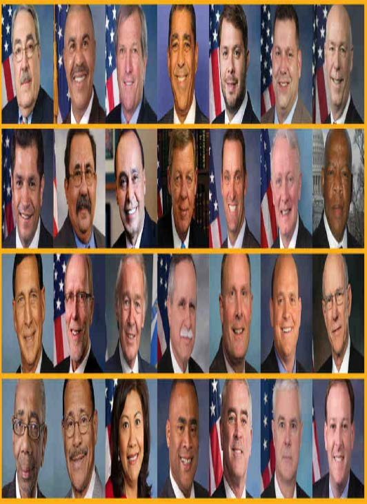

[^图3-4]: 国会议员被亚马逊软件匹配到罪犯照片

数据科学家需要成为跨学科团队的一员。而研究人员则需要与最终使用其研究成果的人群紧密合作。更理想的是，领域专家自身能够掌握足够知识，从而能够独立训练和调试某些模型——希望此刻正有几位读者正在研读本书！

现代职场是一个高度专业化的场所。每个人往往都有明确界定的职责范围。尤其在大公司里，要了解整个项目的全貌往往很困难。有时企业甚至会刻意模糊项目目标——如果他们知道员工可能不喜欢答案的话。这种做法通常通过最大限度地将项目拆分成独立模块来实现。

换言之，我们并非说这一切都轻而易举。这很艰难。真的非常艰难。我们都必须竭尽全力。我们常观察到，那些深入参与项目高层级事务、致力于发展跨学科能力和团队的人员，往往成为组织中最重要且回报丰厚的成员。这类工作通常深受高层管理者的重视，即便有时会让中层管理者感到颇为不适。

### 有关数据伦理的话题 

数据伦理是一个广阔的领域，我们无法面面俱到。因此，我们将重点探讨几个我们认为特别相关的主题：

- 诉求与问责机制的必要性
- 反馈循环
- 偏见
- 虚假信息

让我们一个一个来看看

#### 诉求与问责机制

在复杂系统中，人们往往难以明确责任归属。这种现象虽可理解，却难以产生良好结果。以阿肯色州医疗系统为例：程序漏洞导致脑瘫患者丧失必要医疗保障时，算法开发者将责任推给政府官员，而政府官员又归咎于软件实施者。纽约大学教授 [达娜·博伊德（Danah Boyd）](https://oreil.ly/KK5Hf) 对此现象作出如下描述："官僚体系常被用来转移或逃避责任……当今的算法系统正在延续这种官僚作风。"

追溯机制之所以如此必要，还因为数据往往存在错误。审计和错误修正机制至关重要。加州执法部门维护的疑似帮派成员数据库被发现存在大量错误，其中包括42名未满周岁的婴儿（其中28人被标记为“承认帮派成员身份”）。该数据库缺乏错误修正机制，也未建立入库人员后续移除流程。另一个例子是美国信用报告系统：联邦贸易委员会（FTC）2012年对信用报告的大规模研究发现，26%的消费者档案中至少存在一项错误，其中5%的错误可能造成毁灭性后果。

然而，纠正此类错误的过程极其缓慢且不透明。当公共广播电台记者 [鲍比·阿林（Bobby Allyn）](https://oreil.ly/BUD6h) 发现自己被错误地登记为有枪支犯罪记录时，他花了“十多次电话沟通、一位县法院书记员的亲力亲为以及六周时间才解决问题。而且这还是在我以记者身份联系该公司公关部门之后才实现的。”

作为机器学习从业者，我们并不总是认为理解算法最终如何在实践中实现是我们的责任。但我们必须这样做。

#### 反馈循环

我们在第一章中阐述了算法如何与环境交互以形成反馈循环，通过预测强化现实世界中的行动，进而产生更趋同方向的预测。以YouTube推荐系统为例： 几年前，谷歌团队曾阐述如何引入强化学习（与深度学习密切相关，但损失函数代表的是行动发生后可能延迟很久的结果）来改进YouTube推荐系统。他们描述了如何运用算法优化推荐机制，从而最大化用户观看时长。

然而，人类往往容易被争议性内容吸引。这意味着关于阴谋论之类的视频开始被推荐系统越来越多地推荐。更重要的是，研究发现对阴谋论感兴趣的人群恰恰也是大量观看在线视频的人群！因此他们开始越来越沉迷于YouTube。随着YouTube上观看阴谋论视频的人数激增，算法开始推荐更多阴谋论及其他极端主义内容，这又吸引更多极端主义者观看YouTube视频，进而导致更多观众产生极端思想——如此循环往复，最终使算法推荐更多极端内容。整个系统陷入失控的恶性循环。

这种现象并非仅限于此类内容。2019年6月，《纽约时报》发表了一篇题为 [《YouTube数字游乐场：恋童癖者的敞开大门》](https://oreil.ly/81BEy) 的文章，探讨YouTube的推荐系统。文章开篇便讲述了这样一个令人毛骨悚然的故事：

> 克里斯蒂安娜·C（Christiane C）起初并未在意，当她10岁的女儿和朋友上传一段在后院泳池玩耍的视频时……几天后……该视频已获得数千次观看。不久后，观看量飙升至40万次……“我再次看到视频时，被这个数字吓到了，”克里斯蒂安娜说。她的担忧并非多余。研究团队发现，YouTube的自动推荐系统已开始将该视频推送给观看过其他未成年半裸儿童视频的用户。
>
> 单独来看，每段视频或许都纯属无心之作，比如孩子拍摄的家庭录像。任何暴露隐私的画面都转瞬即逝，看似偶然出现。但当它们被组合在一起时，其共同特征便变得无可辩驳。

YouTube的推荐算法开始为恋童癖者策划播放列表，筛选出那些偶然包含未发育完全、衣着暴露的儿童的无辜家庭录像。

谷歌内部没有人计划创建一个将家庭视频转化为恋童癖者色情内容的系统。那么究竟发生了什么？

问题的一部分在于指标在驱动财务重要系统中的核心地位。当算法需要优化某个指标时，正如你所见，它会竭尽全力优化该数值。这往往导致各种边界情况的出现，而与系统交互的人类会主动寻找、发现并利用这些边界情况和反馈循环来谋取私利。

有迹象表明，YouTube的推荐系统在2018年正是如此运作。《卫报》曾刊登题为 [《前YouTube内部人士如何调查其秘密算法》](https://oreil.ly/yjnPT) 的文章，讲述了前YouTube工程师纪尧姆·夏斯洛（Guillaume Chaslot）创建追踪此类问题的 [网站](https://algotransparency.org/) 的故事。夏斯洛在罗伯特·穆勒（Robert Mueller）的《关于俄罗斯干预2016年总统选举的调查报告》发布后，公布了图3-5所示图表。

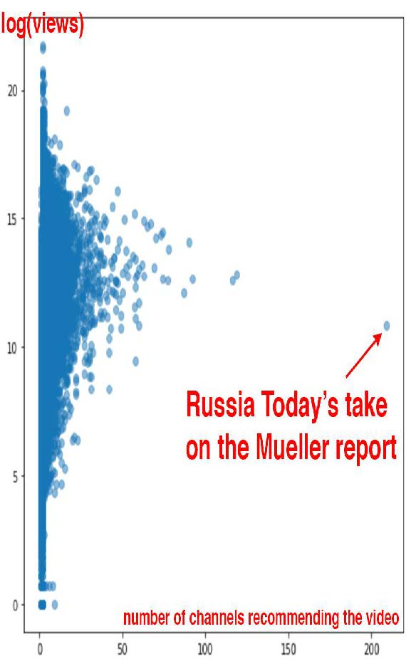

[^图3-5]: 穆勒报告的报道

俄罗斯今日电视台对穆勒报告的报道在推荐频道数量上呈现极端异常值。这表明这家俄罗斯国有媒体可能成功操纵了YouTube的推荐算法。遗憾的是，此类系统的缺乏透明度使得我们难以揭露正在讨论的问题。

本书的审稿人之一奥雷利安·热龙（Aurélien Géron）曾于2013至2016年间领导YouTube的视频分类团队（远早于本书所述事件）。他指出问题不仅在于涉及人类的反馈循环，更存在无需人类参与的反馈循环！他向我们举了一个YouTube的实例：

> 识别视频核心主题的一个重要信号是其所属频道。例如，上传至烹饪频道的视频极可能属于烹饪类。但如何判断频道主题？部分依据正是频道内视频的主题！你发现循环了吗？例如，许多视频的描述中会标注拍摄使用的相机型号。因此，部分视频可能被归类为“摄影”主题。若频道存在此类误分类视频，该频道就可能被归为“摄影”频道，导致未来该频道的视频更容易被错误归类为“摄影”主题。这甚至可能引发失控的病毒式分类！打破这种反馈循环的一种方法是：在分类视频时同时使用包含频道信号和不包含频道信号两种方式。随后在分类频道时，仅采用不包含频道信号所得的分类结果。如此便切断了反馈循环。

在应对这些问题方面，已有个人和组织付出了积极努力。Meetup首席机器学习工程师埃文·埃斯托拉（Evan Estola）曾探讨过这样一个现象：男性对技术聚会的兴趣远高于女性。若将性别纳入考量，Meetup的算法可能会减少向女性推荐技术聚会，导致参与者减少，进而使算法推荐更少活动，形成自我强化的反馈循环。为此，埃文团队作出道德抉择：在推荐算法中明确排除性别因素，避免形成此类反馈循环。令人欣慰的是，该公司不仅未盲目追求指标优化，更深入考量了算法的影响。埃文指出：“你需要决定算法中哪些特征不应使用……最优算法未必是最适合投入生产的方案。”

尽管Meetup选择避免这种结果，但Facebook（译者注：国外一家著名的社交网站）却提供了任由失控的反馈循环肆意蔓延的典型案例。如同YouTube，它往往通过向用户推荐更多阴谋论内容，加剧其对单一阴谋论的极端化倾向。正如研究虚假信息扩散的学者蕾妮·迪雷斯塔（Renee DiResta,）所写：

> 一旦人们加入某个阴谋论倾向的[Facebook]群组，算法就会将他们推送至大量同类群组。加入反疫苗群组后，推荐列表里就会出现反转基因、化学烟雾观察、地平说（没错，真实存在）以及“自然疗法治愈癌症”等群组。推荐引擎非但没有将用户从兔子洞中拉出，反而将他们推得更深。

必须牢记的是，此类行为确实可能发生，当你在自身项目中察觉到最初迹象时，要么预判反馈循环的形成，要么采取积极行动予以打破。另一项需注意的是偏见——正如前章简要讨论过的，偏见与反馈循环的交互作用往往会引发极大困扰。

#### 偏见

关于偏见的网络讨论往往很快就会变得相当混乱。“偏见”一词具有多种不同的含义。统计学家常常认为，当数据伦理学家谈论偏见时，他们指的是偏见这一术语的统计学定义——但事实并非如此。他们当然也不是在谈论模型参数中出现的权重偏差和系统偏差！

他们所讨论的是社会科学中的偏见概念。在 [《理解机器学习意外后果的框架》](https://oreil.ly/aF33V) 一文中，麻省理工学院的哈里尼·苏雷什（Harini Suresh）和约翰·古塔格（John Guttag）描述了机器学习中的六种偏见类型，如图3-6所示。

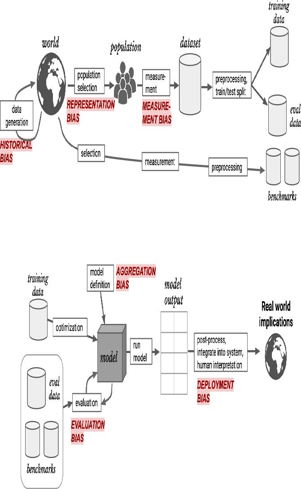

[^图3-6]: 机器学习中的偏见可能来自多种来源（由哈里尼·苏雷什和约翰·V·古塔格提供）

我们将探讨其中四种偏见类型，这些是我们自身工作中发现最具帮助的偏见（其他偏见详情请参阅论文）。

##### 历史偏见

历史偏见源于人类的偏见、流程的偏见以及社会的偏见。Suresh和Guttag指出：“历史偏见是数据生成过程第一步中存在的基本结构性问题，即使在完美的采样和特征选择条件下仍可能存在。”

例如，以下是芝加哥大学森迪尔·穆莱纳坦（Sendhil Mullainathan）在《纽约时报》文章 [《即使我们怀有善意，种族偏见依然存在》](https://oreil.ly/cBQop) 中列举的美国历史上种族偏见的几个例子：

- 当医生看到相同的病历时，他们对黑人患者建议进行心脏导管检查（一项有益的检查）的可能性要低得多。
- 在讨价还价购买二手车时，黑人最初被报价高出700美元，且获得的让步幅度要小得多。
- 在Craigslist上回应公寓租赁广告时，使用黑人名字比使用白人名字获得的回复更少。
- 全白人陪审团对黑人被告的定罪率比白人被告高出16个百分点，但当陪审团中有一名黑人成员时，对两者的定罪率持平。

COMPAS算法在美国广泛用于量刑和保释决定，是重要算法的典型案例。经 [ProPublica](https://oreil.ly/1XocO) 测试，该算法在实际应用中存在明显种族偏见（图3-7）。

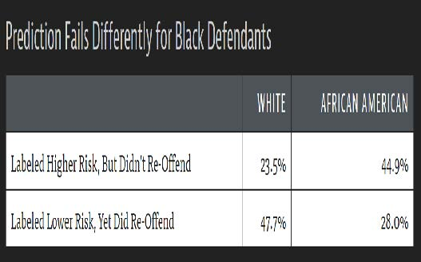

[^图3-7]: COMPAS算法的结果

任何涉及人类的数据集都可能存在此类偏见：医疗数据、销售数据、住房数据、政治数据等等。由于潜在偏见如此普遍，数据集中的偏见也极为普遍。种族偏见甚至出现在计算机视觉领域，如图3-8所示——一位谷歌相册用户在推特上分享的自动分类照片便是例证。

[^图3-8]: 其中一个标签完全错误……

是的，你看到的正是你所想的那样：谷歌相册竟将一位黑人用户与朋友的合影标记为“大猩猩”！这一算法失误引发了媒体的广泛关注。“我们对此深感震惊并诚挚致歉，”该公司的一位女发言人表示，“自动图像标注技术显然仍有大量改进空间，我们正在研究如何防止此类错误再次发生。”

遗憾的是，当输入数据存在问题时，修复机器学习系统中的问题相当困难。正如《卫报》的报道所示（图3-9），谷歌的首次尝试未能令人信服。

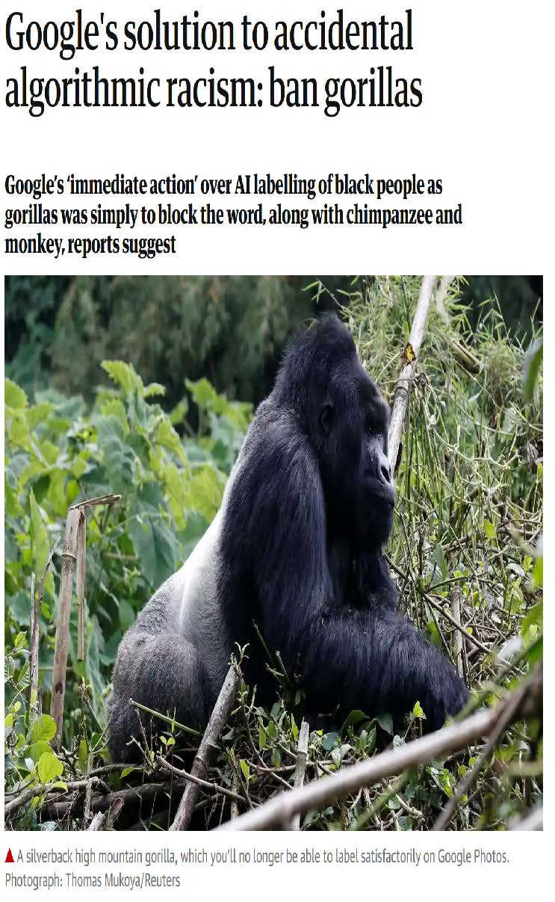

[^图3-9]: 谷歌对该问题的首次回应

此类问题绝非谷歌独有。麻省理工学院的研究人员对最流行的在线计算机视觉API进行了研究，以评估其准确性。但他们并未仅计算单一准确率数值，而是针对四个不同群体分别评估了准确性，如图3-10所示。

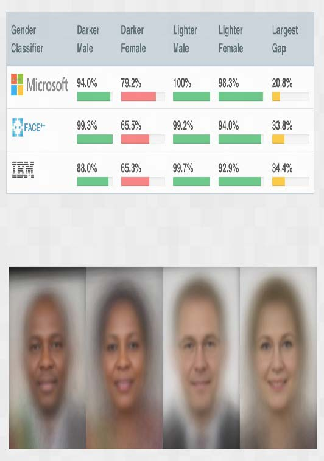

[^图3-10]: 不同人脸识别系统按性别和种族划分的错误率

例如，IBM的系统对肤色较深的女性识别错误率高达34.7%，而对肤色较浅的男性仅为0.3%——错误率相差超过100倍！有人错误地认为这种差异仅仅是因为计算机更难识别深色皮肤。然而实际情况是：在该结果引发负面舆论后，所有涉事公司都大幅改进深肤色识别模型，一年后其准确度已接近浅肤色水平。这表明开发者未能使用包含足够深肤色样本的数据集，也未对深肤色样本进行产品测试。

麻省理工学院研究员乔伊·布奥拉姆维尼（Joy Buolamwini）警告道：“我们正以过度自信却准备不足的姿态迈入自动化时代。若未能打造符合伦理且包容多元的人工智能，我们很可能在机器中立性的幌子下，丧失民权运动与性别平等领域取得的成果。”

问题的一部分似乎在于用于训练模型的流行数据集构成存在系统性失衡。Shreya Shankar等人在论文 [《无表征则无分类：评估发展中国家开放数据集中的地理多样性问题》](https://oreil.ly/VqtOA) 的摘要中指出："我们分析了两个大型公开图像数据集以评估地理多样性，发现这些数据集似乎存在明显的欧美中心化表征偏见。此外，我们分析基于这些数据集训练的分类器，评估训练分布的影响，发现不同地域图像的相对性能存在显著差异。"图3-11展示了论文中的图表之一，呈现了当时（直至本书撰写时仍属）最重要的两个模型训练图像数据集的地理构成。

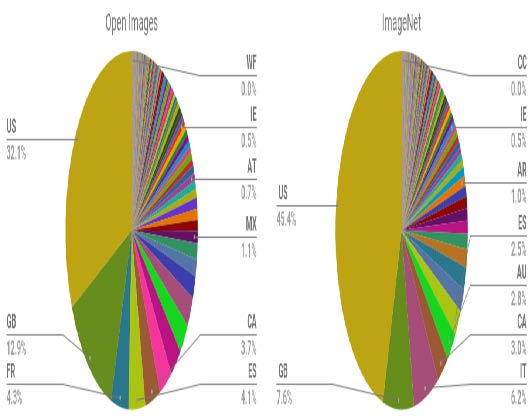

[^图3-11]: 流行训练集中的图像来源

绝大多数图像来自美国及其他西方国家，导致基于ImageNet训练的模型在识别其他国家和文化场景时表现欠佳。例如研究发现，此类模型在识别低收入国家常见的家居物品（如肥皂、香料、沙发或床铺）时表现更差。图3-12展示了Facebook AI研究所Terrance DeVries等人在论文 [《物体识别对所有人有效吗？》](https://oreil.ly/BkFjL) 中用于说明此问题的图像。

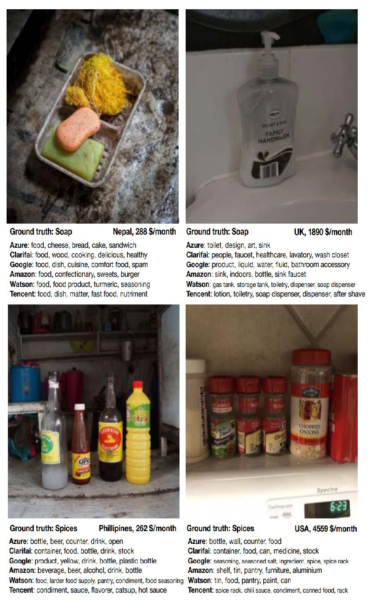

[^图3-12]: 物体检测实战

在这个例子中，我们可以看到低收入肥皂的示例与准确结果相去甚远，每项商业图像识别服务都将“食物”预测为最可能的答案！

此外，正如我们稍后将讨论的那样，绝大多数人工智能研究者和开发者都是年轻的白人男性。我们所见的大多数项目，其用户测试主要依赖于产品开发团队的亲朋好友。鉴于此，我们刚才讨论的那类问题也就不足为奇了。

在自然语言处理模型的数据文本中也存在类似的历史偏见。这种偏见在下游机器学习任务中以多种形式显现。例如，据广泛报道，直到去年，谷歌翻译在将土耳其语中性代词“o”译为英语时仍存在系统性偏见：当该代词用于常与男性关联的职业时，系统会使用“he”；而用于常与女性关联的职业时，则使用“she”（图3-13）。

[^图3-13]: 文本数据集中的性别偏见

我们同样能在网络广告中观察到此类偏见。例如，穆罕默德·阿里（Muhammad Ali）等人2019年的 [一项研究](https://oreil.ly/UGxuh) 发现，即便广告投放者并无刻意歧视之意，Facebook仍会根据种族和性别向截然不同的受众展示广告。内容相同的房产广告，若配图分别展示白人家庭或黑人家庭，就会被推送给不同种族的受众群体。

##### 测量偏见

在《美国经济评论》发表的 [《机器学习是否会自动化道德风险与错误》](https://oreil.ly/79Qtn) 一文中，森迪尔·穆莱纳坦（Sendhil Mullainathan）与齐亚德·奥伯迈尔（Ziad Obermeyer）构建了一个模型试图解答此问题：利用历史电子健康记录（EHR）数据，哪些因素最能预测中风风险？该模型得出的首要预测因子如下：

- 既往卒中
- 心血管疾病
- 意外损伤
- 良性乳房肿块
- 结肠镜检查
- 鼻窦炎

然而，只有前两项与中风有关！根据我们迄今的研究，你大概能猜到原因。我们并未真正测量中风——这种情况发生于脑部区域因供血中断而缺氧时。我们实际测量的是：哪些人出现症状、就医、接受相应检查并最终确诊为中风。实际上，中风本身并非与这份完整清单唯一的关联因素——它还与“就医倾向”相关（而就医倾向又受多重因素影响：医疗资源可及性、自付费用能力、是否遭遇种族/性别医疗歧视等）！若你因意外受伤就医的概率较高，那么当你发生中风时，同样更可能及时就医。

这是测量偏见的一个例子。当我们的模型因测量对象错误、测量方式不当或将测量结果不恰当地纳入模型而产生误差时，就会出现这种情况。

##### 聚合偏见

聚合偏见发生于模型未能以整合所有相关因素的方式聚合数据，或模型未包含必要的交互项、非线性项等情形。此类偏差在医疗领域尤为常见。例如，糖尿病治疗方案常基于简单的单变量统计数据，且研究对象往往是规模较小且异质性强的群体。结果分析常忽略不同种族或性别差异。然而研究表明，糖尿病患者的并发症存在种族差异，且糖化血红蛋白水平（一种用于诊断和监测糖尿病的常用指标）在不同种族和性别群体中呈现复杂差异。然而研究表明，不同种族的糖尿病患者会出现不同的并发症，且HbA1c水平（广泛用于糖尿病诊断和监测）在种族与性别间存在复杂差异。这可能导致误诊或治疗失误，因为医疗决策基于的模型未纳入这些关键变量及其交互作用。

##### 表征偏见

论文 [《偏见在生物学中：高风险情境下语义表征偏见的案例研究》](https://oreil.ly/0iowq) 摘要指出，职业领域存在性别失衡现象（例如女性更可能从事护士职业，男性更可能担任牧师），并指出”性别间真实阳性率的差异与现有职业性别失衡相关，这种关联可能加剧现有失衡"。

换言之，研究人员发现预测职业的模型不仅反映了基础人群中实际存在的性别失衡现象，更能将其放大！此类表征偏见相当普遍，尤其常见于简单模型。当存在清晰易见的潜在关联时，简单模型往往会假设这种关联始终成立。如论文图3-14所示，对于女性占比更高的职业，模型往往会高估该职业的普遍程度。

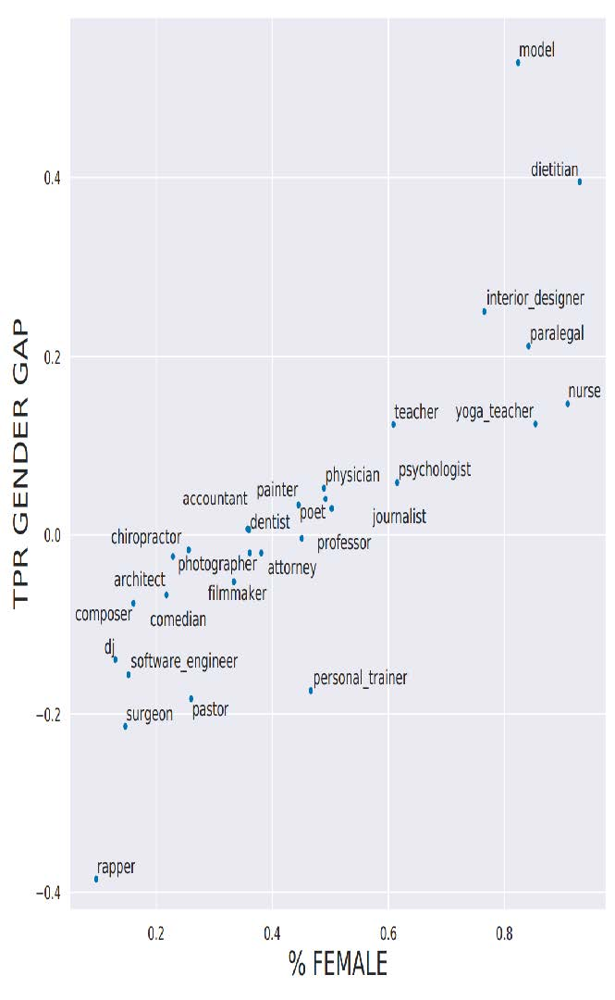

[^图3-14]: 职业预测模型误差与该职业女性占比的对比图

例如，在训练数据集中，女性外科医生占比为14.6%，但在模型预测中，真实阳性结果中女性占比仅为11.6%。因此该模型正在放大训练数据集中存在的偏见。

既然我们已经认识到这些偏见确实存在，我们该如何做才能减轻它们的影响？

##### 应对不同类型的偏见

不同类型的偏见需要不同的缓解方法。虽然收集更多样化的数据集可以解决代表性偏见，但这无法解决历史偏见或测量偏见。所有数据集都存在偏见。完全消除偏见的数据集是不存在的。该领域众多研究者正趋向于一套提案，旨在更完善地记录决策过程、背景信息及具体细节——包括特定数据集的创建方式与原因、适用场景以及局限性。如此一来，使用特定数据集的人员就不会因其偏见和局限性而措手不及。

我们常听到这样的疑问：“人类本就存在偏见，算法偏见又算什么？”这个问题频繁出现，提问者必定有其逻辑依据，但对我们而言却显得缺乏说服力！无论逻辑是否成立，关键在于认识到算法（尤其是机器学习算法！）与人类存在本质差异。请思考以下关于机器学习算法的要点：

- 机器学习会形成反馈循环

  微小的偏见可能因反馈循环而呈指数级快速放大

- 机器学习会放大偏见

  人类偏见可能导致更严重的机器学习偏见

- 算法与人类的运用方式不同

  人类决策者与算法决策者在实践中并非可互换的即插即用模式。具体示例详见下页列表。

- 技术即力量

  而力量伴随着责任。

正如阿肯色州医疗保健案例所示，机器学习在实践中往往并非因能带来更佳效果而被采用，而是因为它更廉价、更高效。凯茜·奥尼尔在其著作《数学毁灭武器》（皇冠出版社）中揭示了一种模式：特权阶层由人处理事务，而穷人则由算法处理事务。这只是算法与人类决策者存在差异的诸多表现之一，其他差异还包括：

- 人们更倾向于认为算法具有客观性或无差错性（即使存在人工干预选项）。
- 算法在实施时往往缺乏申诉机制。
- 算法通常被大规模应用。
- 算法系统成本低廉。

即使没有偏见，算法（尤其是深度学习，因为它是一种如此高效且可扩展的算法）也可能引发负面社会问题，例如被用于传播虚假信息时。

##### 虚假信息

虚假信息（Disinformation）的历史可追溯至数百甚至数千年前。其目的未必在于让人们相信虚假之事，而往往用于制造不和谐与不确定性，使人们放弃寻求真相。当人们收到相互矛盾的说法时，便可能认为自己永远无法分辨该相信谁或相信什么。

有些人认为虚假信息主要是指虚假信息或假新闻，但实际上，虚假信息往往包含真相的种子，或是被断章取义的半真半假内容。拉迪斯拉夫·比特曼（Ladislav Bittman）曾是苏联情报官员，后来叛逃至美国，并在1970至1980年代撰写了多部关于虚假信息在苏联宣传行动中作用的著作。他在《克格勃与苏联虚假信息》（Pergamon出版社）中写道：“大多数宣传活动都是精心设计的混合体，包含事实、半真半假、夸大其词和蓄意谎言。”

近年来，美国对此深有体会——联邦调查局详细披露了2016年大选中与俄罗斯有关的大规模虚假信息行动。了解该行动中使用的虚假信息手段具有重要教育意义。例如，联邦调查局发现俄罗斯虚假信息行动常同时组织两场独立的假“草根”抗议活动——针对同一议题的正反双方各一场——并让双方在同一时间抗议！《休斯顿纪事报》曾报道过其中一场离奇事件（图3-15）：

> 一个自称“德克萨斯之心”的团体在社交媒体上组织了这场抗议活动——他们声称这是反对德克萨斯州“伊斯兰化”的行动。在特拉维斯街的一侧，我发现约有10名抗议者；另一侧则聚集着约50名反抗议者。但我始终找不到集会组织者。没有“德克萨斯之心”。我觉得很奇怪，并在文章中提到：什么组织会在自己组织的活动中缺席？现在我知道原因了。显然，集会组织者当时正在俄罗斯圣彼得堡。“德克萨斯之心”正是特别检察官罗伯特·穆勒近期起诉书中提及的网络水军团体之一，该起诉书指控俄罗斯人试图干预美国总统选举。

[^图3-15]: 由德克萨斯之心团体主办的活动

虚假信息往往涉及协调一致的虚假行为。例如，欺诈性账户可能试图营造出许多人持有特定观点的假象。尽管我们多数人自诩思想独立，但实际上人类进化过程中形成了受内群体影响、对抗外群体的倾向。网络讨论既能塑造我们的观点，也能改变我们认为可接受观点的边界。人类是社会性动物，因此极易受周遭人群影响。激进化现象日益在网络环境中滋生——这种影响正源自网络论坛与社交平台构筑的虚拟空间。

通过自动生成的文本传播虚假信息已成为一个尤为突出的问题，这源于深度学习技术带来的巨大能力提升。我们在第十章深入探讨语言模型创建时将对此问题进行详细讨论。

一种提议的方法是开发某种形式的数字签名，以无缝方式实现它，并建立规范要求我们仅信任经过验证的内容。艾伦人工智能研究所所长奥伦·埃齐奥尼（Oren Etzioni）在题为 [《如何防范基于人工智能的伪造？》](https://oreil.ly/8z7wm) 的文章中提出这样的方案： “人工智能正使高保真伪造变得廉价且自动化，这可能对民主、安全和社会造成灾难性后果。人工智能伪造的幽灵警示我们必须采取行动，使数字签名成为验证数字内容的必要手段。”

虽然我们无法详尽探讨深度学习乃至更广泛的算法所引发的所有伦理问题，但希望这篇简短的导论能成为您深入研究的有用起点。接下来我们将探讨如何识别伦理问题以及如何应对这些问题。

### 识别并处理伦理问题

错误难免发生。发现错误并妥善处理，应成为任何包含机器学习（以及许多其他系统）的设计组成部分。数据伦理领域提出的问题往往复杂且涉及多学科，但我们必须致力于解决这些问题。

那么我们能做什么？这是一个宏大话题，但以下是解决伦理问题的一些步骤：

- 分析你正在参与的项目。
- 在公司内部建立流程，以发现并应对道德风险。
- 支持良好的政策制定。
- 提升多样性。

让我们逐步走一遍每个步骤，从分析你正在进行的项目开始。

#### 分析你正在参与的项目

在考量工作中的伦理影响时，人们很容易忽略重要问题。一个极具帮助的方法就是提出正确的问题。瑞秋·托马斯建议在数据项目开发过程中持续思考以下问题：

- 我们真的应该这样做吗？
- 数据中存在哪些偏见？
- 代码和数据能否接受审计？
- 不同子群体的错误率是多少？
- 基于简单规则的替代方案准确度如何？
- 处理申诉或错误有哪些流程？
- 开发团队的多元化程度如何？

这些问题或许能帮助你识别悬而未决的问题，并找到更易理解和掌控的替代方案。除了提出正确的问题，考虑实施实践和流程同样至关重要。

在此阶段需要考虑的一点是，你正在收集和存储哪些数据。数据往往会被用于与原始意图不同的目的。例如，IBM早在纳粹大屠杀之前就已开始向纳粹德国销售产品，包括协助阿道夫·希特勒于1933年进行的人口普查——该普查有效识别出远超德国此前认知的犹太人群体。同样，美国人口普查数据曾被用于在二战期间拘禁日裔美国人（他们是美国公民）。必须认识到收集的数据和图像日后可能被武器化。哥伦比亚大学教授蒂姆·吴（Tim Wu） [写道](https://oreil.ly/6L0QM) ：“你必须假设Facebook或安卓系统保存的任何个人数据，都是全球政府试图获取或窃贼企图盗取的目标。”

#### 实施流程

马克库拉（Markkula）中心发布了 [《工程/设计实践伦理工具包》](https://oreil.ly/vDGGC) ，其中包含可在贵公司实施的具体实践措施，包括定期开展主动扫描以主动搜寻伦理风险（类似于网络安全渗透测试的方式）、扩大伦理圈以纳入各类利益相关者的视角，以及考虑恶意行为者（恶意行为者可能如何滥用、窃取、曲解、黑客攻击、破坏或武器化你正在构建的内容）。

即使团队缺乏多样性，你仍可尝试主动纳入更广泛群体的视角，思考以下问题（由马克库拉中心提供）：

- 我们究竟默认了谁的利益、需求、技能、经历和价值观，而非真正征询过他们的意见？
- 哪些利益相关者将直接受到我们产品的影响？他们的利益如何得到保障？我们如何确知他们的真实诉求——是否曾主动询问过？
- 哪些群体或个人将受到重大间接影响？
- 哪些未预期的用户可能使用本产品，或将其用于我们最初未设想的用途？

#### 伦理视角

马克库拉中心提供的另一项实用资源是其 [《技术与工程实践中的概念框架》](https://oreil.ly/QnRTt) 。该框架探讨了不同基础伦理视角如何帮助识别具体问题，并提出了以下方法与关键问题：

- 权利方法论

  哪种方案最能尊重所有相关方的权利？

- 正义方法论

  哪种方案能平等或比例地对待所有人？

- 功利主义方法论

  哪种选择能创造最大效益并造成最小伤害？

- 共同利益方法论

  哪种选择最能服务于整个社区，而非仅惠及部分成员？

- 美德方法论

​	哪种选择能引导我成为理想中的自己？

马克库拉的建议包括更深入地探讨这些视角，其中包括从后果的角度审视项目：

- 该项目将直接影响哪些群体？间接影响哪些群体？
- 综合来看，其影响是否可能利大于弊？具体涉及哪些类型的利弊？
- 我们是否考虑了所有相关类型的危害/效益（心理、政治、环境、道德、认知、情感、制度、文化）？
- 该项目可能如何影响后代？
- 项目造成的危害风险是否会不成比例地落在社会弱势群体身上？项目收益是否会不成比例地流向富裕阶层？
- 我们是否充分考虑了“双重用途”及意外的下游影响？

与此相对的另一种视角是义务论视角，它着重关注基本的是非概念：

- 我们必须尊重他人的哪些权利及履行哪些义务？
- 该项目可能如何影响每位利益相关者的尊严与自主权？
- 哪些信任与正义考量与本设计/项目相关？
- 该项目是否涉及对他人相互冲突的道德义务，或利益相关者权利的冲突？如何对这些义务进行优先排序？

要为这类问题构思完整且考虑全面的答案，最有效的方法之一就是确保提问者具有多样性。

#### 多样性的力量

根据 [Element AI的一项研究](https://oreil.ly/sO09p) ，目前人工智能研究人员中女性占比不足12%。在种族和年龄构成方面，相关数据同样严峻。当团队成员背景高度相似时，他们对伦理风险的认知盲区往往也趋于一致。《哈佛商业评论》发表的多项研究表明，多元化团队具有诸多优势，包括：

- [“多样性如何推动创新”](https://oreil.ly/WRFSm)
- [“认知多样性更强的团队解决问题更快”](https://oreil.ly/vKy5b)
- [“多元化团队为何更聪明”](https://oreil.ly/SFVBF)
- [“捍卫你的研究：什么让团队更聪明？更多女性”](https://oreil.ly/A1A5n)

多样性有助于更早发现问题，并考虑更广泛的解决方案。例如，Tracy Chou是Quora的早期工程师。她在 [描述自身经历时](https://oreil.ly/n7WSn) 提到，曾积极倡导公司内部添加一项功能，用于屏蔽网络喷子及其他不良用户。她回忆道：“我迫切希望参与该功能开发，因为我本人在网站上曾遭受敌意和辱骂（性别因素很可能是原因之一）……但若没有这种个人经历，Quora团队很可能不会在平台早期就优先开发屏蔽按钮。” 骚扰行为常迫使边缘群体成员离开在线平台，因此该功能对维护Quora社区生态至关重要。

需要理解的关键点在于，女性离开科技行业的比例是男性的两倍有余。 [《哈佛商业评论》](https://oreil.ly/ZIC7t) 指出，科技行业女性离职率达41%，而男性仅为17%。对超过200本书籍、白皮书及文章的分析表明，她们离职的根本原因在于“遭受不公平对待：薪酬偏低、晋升通道受限、职业发展受阻”。

研究证实了若干阻碍女性在职场晋升的因素。女性在绩效评估中常收到模糊的反馈和人格批评，而男性则获得与业务成果挂钩的可操作性建议（这更有助于提升）。女性常被排除在更具创造性与创新性的岗位之外，也难以获得有助于晋升的高曝光度“挑战性”任务。有研究发现，即使朗读相同文本，男性声音仍被认为比女性声音更具说服力、更基于事实且更符合逻辑。

统计数据显示，接受指导对男性的职业发展有帮助，但对女性却不然。原因在于：当女性接受指导时，得到的建议往往是关于如何改变自我、提升自我认知；而男性获得的指导，则是对其权威的公开认可。猜猜哪种方式对晋升更有助益？

只要合格女性持续退出科技行业，单纯增加女孩编程教育就无法解决困扰该领域的多样性问题。尽管有色人种女性面临更多额外障碍，多样性举措却往往主要聚焦白人女性。在对60名从事STEM研究的有色人种女性的 [访谈](https://oreil.ly/t5C6b) 中，100%的人曾遭受歧视。

科技行业的招聘流程尤其存在缺陷。Triplebyte公司的一项研究揭示了这种弊端——该公司致力于为企业匹配软件工程师，并在招聘过程中实施标准化技术面试。该公司掌握着一组引人入胜的数据：300多名工程师在标准化考试中的表现，以及他们在多家企业面试过程中的实际表现。[Triplebyte研究](https://oreil.ly/2Wtw4) 的首要发现是：“各公司寻求的程序员类型，往往与其业务需求或实际业务关联甚微。这些偏好更多反映了企业文化和创始人的背景。”

这对试图进入深度学习领域的人来说是个挑战，因为如今大多数公司的深度学习团队都由学者创立。这些团队往往寻找“和他们相似”的人——即能解决复杂数学问题、理解晦涩术语的人。他们并不总是懂得如何识别真正擅长运用深度学习解决实际问题的人才。

这为那些愿意超越地位和血统，专注于成果的企业提供了巨大机遇！

#### 公平性、问责制与透明度

计算机科学家专业协会ACM主办了一场名为“公平性、责任性与透明度会议”(ACM FAccT)的数据伦理会议，该会议曾使用缩写FAT，现改用争议较小的FAccT。微软公司亦设有专注于人工智能公平性、责任性、透明度与伦理（FATE）的研究团队。本节中，我们将使用缩写词FAccT来指代公平性、责任性与透明度这三个核心概念。

FAccT是某些人审视伦理问题时采用的视角。

索伦·巴罗卡斯等人撰写的免费在线书籍 [《公平性与机器学习：局限与机遇》](https://fairmlbook.org/) 为此提供了有益参考，该书“从将公平性视为核心关切而非事后考虑的角度审视机器学习”。但书中同时警示：“本书范围刻意保持狭窄……将机器学习伦理局限于技术框架的处理方式，对技术人员和企业而言或许颇具诱惑力——既能聚焦技术干预，又能规避权力与责任等更深层议题。我们对此类诱惑提出警示。”本文不拟概述FAccT伦理框架（该框架在前述著作中有更详尽阐述），而是着重探讨此类狭隘框架的局限性。

检验伦理框架是否完备的有效方法之一，是尝试构思一个案例，使该框架与我们自身的伦理直觉产生分歧。奥斯·凯斯等人通过其论文 [《覆盖提案：分析并改进将老年人转化为高营养浆液的算法系统》](https://oreil.ly/_qug9) 对此进行了生动阐释。论文摘要指出：

> 算法系统的伦理影响在人机交互领域及更广泛的技术设计、开发与政策研究群体中已引发广泛讨论。本文探讨将一项重要的伦理框架——公平性、问责性与透明度（FAT）——应用于解决粮食安全与人口老龄化等社会问题的算法方案。通过采用多种标准化的算法审计与评估方法，我们显著提升了该算法对FAT框架的遵循度，从而构建出更具伦理性与公益性的系统。我们探讨了该方法如何为其他研究者或从业者提供指导，使其在各自领域内确保算法系统产生更优的伦理成果。

本文中，颇具争议的提案（“将老年人转化为高营养浆液”）与研究结果（“极大提升算法对FAT框架的遵循度，从而构建出更符合伦理且有益的系统”）之间存在矛盾——至少可以说如此！

在哲学领域，尤其是伦理学领域，这是一种最有效的工具之一：首先设计出一个流程、定义或问题集等，旨在解决某个问题。接着尝试构想一个案例，使该看似合理的解决方案最终导致一个无人能接受的结论。这将促使人们进一步完善解决方案。

迄今为止，我们主要探讨了你和你的组织能够采取的行动。但有时个人或组织的努力远远不够，政府也需要考虑政策层面的影响。

### 政策的作用

我们常与那些渴望技术或设计方案能彻底解决我们讨论的问题的人交谈；例如，通过技术手段消除数据偏见，或制定降低技术成瘾性的设计准则。尽管这些措施可能有所助益，但不足以解决导致当前局面的根本问题。例如，只要制造成瘾性技术有利可图，企业就会继续这么做，无论其副作用是否助长阴谋论并污染信息生态系统。尽管个别设计师可能尝试调整产品设计，但在根本的利润激励机制改变之前，我们不会看到实质性变革。

#### 监管的有效性

要了解哪些因素能促使企业采取具体行动，不妨看看Facebook的以下两则行为案例。2018年，联合国调查发现Facebook在缅甸罗兴亚少数民族持续遭受种族灭绝中扮演了“决定性角色”。联合国秘书长安东尼奥·古特雷斯（Antonio Guterres）曾称该群体为“全球遭受最严重歧视的民族之一，甚至可能是最严重的”。早在2013年，当地活动人士就警告Facebook高管，其平台正被用于传播仇恨言论并煽动暴力。2015年，他们更被提醒脸书在缅甸可能扮演与卢旺达种族灭绝期间广播电台相同的角色（该事件造成百万人死亡）。然而截至2015年底，Facebook仅雇佣了四名会说缅甸语的承包商。一位知情人士指出："这并非事后诸葛亮。问题的严重性早已昭然若揭。“扎克伯格在国会听证会上承诺将招聘”数十名员工"应对缅甸种族灭绝问题（2018年作此承诺时，种族灭绝行为已持续多年，包括2017年8月后若开邦北部至少288个村庄遭焚毁）。

这与Facebook [在德国迅速招聘1200名员工](https://oreil.ly/q_8Dz) 形成鲜明对比，其目的是试图规避德国新颁布的反仇恨言论法律所规定的巨额罚款（最高可达5000万欧元）。显然，在此事件中，Facebook对经济处罚的威胁反应更为强烈，而非对少数民族遭受系统性摧残的关注。

在 [一篇探讨隐私问题的文章](https://oreil.ly/K5YKf) 中，马切伊·切格洛夫斯基（Maciej Ceglowski）将隐私议题与环境运动进行了类比：

> 这项监管项目在发达国家取得如此成功，以至于我们几乎忘记了没有它的日子。如今在雅加达和德里夺走数千人生命的窒息性雾霾，曾是伦敦的标志性景象。俄亥俄州的库雅霍加河曾长期处于可燃状态。在未预见后果的典型案例中，汽油添加的四乙基铅导致全球暴力犯罪率持续攀升长达五十年。这些危害绝非靠“用钱包投票”、或“审慎审查合作企业的环保政策”、或“停止使用相关技术”就能解决。唯有跨越管辖边界的协同监管——有时需高度技术化——才能扭转局面。某些领域如禁止消耗臭氧层的商用制冷剂，更需要全球共识。如今我们亟需在隐私法领域实现类似的视角转变。

#### 权利与政策

清洁的空气和饮用水是公共产品，仅凭个人市场决策几乎无法保护，而需要协调一致的监管行动。同样，技术滥用导致的诸多意外后果所造成的危害也涉及公共产品，例如信息环境污染或环境隐私恶化。隐私权常被视为个人权利，但广泛监控对社会的影响（即使少数人能够选择退出监控）依然存在。

我们在科技领域看到的问题，许多本质上是人权问题，例如当存在偏见的算法建议对黑人被告判处更长刑期时，当特定招聘广告仅向年轻人展示时，或是当警方使用人脸识别技术识别抗议者时。解决人权问题的适当途径，通常应通过法律途径。

我们既需要监管和法律层面的变革，也需要个人行为的道德规范。仅靠个人行为改变无法解决利润激励机制错位、外部性问题（即企业获取巨额利润的同时将成本与危害转嫁给整个社会）或系统性缺陷。然而法律永远无法覆盖所有边际案例，因此至关重要的是，每位软件开发者和数据科学家都应具备在实践中做出道德决策的能力。

#### 汽车：历史先例

我们面临的问题错综复杂，没有简单的解决方案。这或许令人沮丧，但当我们回顾人类历史上攻克的其他重大挑战时，仍能找到希望。例如提升汽车安全性的运动——该案例被蒂姆尼特·格布鲁等人收录于 [《数据集数据表》](https://oreil.ly/nqG_r) 中，并在设计播客 [《99% Invisible》](https://oreil.ly/2HGPd) 中有所探讨。早期汽车没有安全带，仪表盘上的金属旋钮在碰撞时可能刺穿头骨，普通平板玻璃车窗碎裂时极具杀伤力，不可折叠的方向柱会将驾驶员刺穿。然而，汽车制造商甚至拒绝将安全性视为可改善的议题，普遍认为汽车本就如此，问题根源在于使用者本身。

消费者安全活动家和倡导者历经数十年的努力，才改变了全国的舆论导向，使人们开始思考汽车公司或许应承担某些责任，而这些责任应通过法规来解决。当可折叠转向柱被发明时，由于缺乏经济激励，这项技术在数年内都未能得到应用。通用汽车公司曾雇佣私家侦探试图挖掘消费者安全倡导者拉尔夫·纳德（Ralph Nader）的丑闻。安全带强制安装、碰撞测试假人和可折叠转向柱的普及都是重大胜利。直至2011年，汽车制造商才被强制要求使用代表普通女性体型（而非仅限男性）的碰撞测试假人；此前同等撞击强度下，女性受伤概率比男性高出40%。这生动揭示了偏见、政策与技术如何产生重大后果。

### 结语

在二进制逻辑的工作背景中成长起来的人，最初可能会因伦理问题缺乏明确答案而感到沮丧。然而，我们的工作如何影响世界——包括意外后果以及工作成果被恶意利用——这些影响正是我们能够（也应该！）考虑的最重要问题。尽管没有现成的答案，但存在明确的陷阱需要规避，也有可遵循的实践路径，能引导我们走向更符合伦理的行为。

许多人（包括我们！）都在寻求更令人满意、更扎实的答案，以应对技术带来的有害影响。然而，鉴于我们面临的问题具有复杂、深远且跨学科的特性，并不存在简单的解决方案。朱莉娅·安格温（Julia Angwin）——这位曾任职于ProPublica的高级记者，专注于算法偏见与监控议题（也是2016年调查COMPAS再犯率算法的调查员之一，该调查促成了FAccT领域的诞生）——在 [2019年的一次访谈中](https://oreil.ly/o7FpP) 指出：

> 我坚信要解决问题，必须先诊断问题，而我们目前仍处于诊断阶段。若回顾世纪之交的工业化浪潮，我们经历了约三十年的童工现象、无限制工时、恶劣工作环境。当时需要大量记者揭露丑闻并倡导改革，才能诊断出问题本质，进而通过社会运动推动法律变革。我认为我们正经历数据信息的第二次工业化浪潮……我自认为的职责是尽可能清晰地揭示其弊端，并精准诊断这些问题以便找到解决方案。这是艰巨的工作，需要更多人共同参与。

令人欣慰的是，安格温认为我们目前仍主要处于诊断阶段：若你对这些问题的理解尚不完整，这实属正常且自然。尽管我们尚未找到“解药”，但持续努力以更深入理解并应对当前面临的问题至关重要。

本书审稿人之一弗雷德·门罗（Fred Monroe）曾从事对冲基金交易工作。他读完本章后指出，书中讨论的诸多问题（如数据分布与模型训练数据存在巨大差异、模型部署后反馈循环的影响等）同样是构建盈利交易模型的关键议题。考量社会影响所需采取的措施，与评估组织、市场及客户影响的举措存在高度重叠——因此深入思考伦理问题，同样有助于全面优化数据产品的成功路径！

### 问卷调查

1. 伦理学是否提供了一份“正确答案”清单？
2. 在思考伦理问题时，与不同背景的人合作有何助益？
3. IBM在纳粹德国扮演了什么角色？该公司为何参与其中？员工又为何参与？
4. 在大众汽车柴油门丑闻中，首位入狱者的角色是什么？

5. 加州执法部门维护的疑似帮派成员数据库存在什么问题？
6. 为何YouTube的推荐算法会向恋童癖者推荐半裸儿童视频，尽管谷歌员工从未编程此功能？
7. 指标中心化存在哪些问题？
8. Meetup.com为何未在其技术聚会推荐系统中纳入性别因素？
9. 据Suresh和Guttag所述，机器学习中存在哪六种偏见类型？
10. 请举出美国历史上两种种族偏见实例。
11. ImageNet中的图像主要来自哪些来源？
12. 在论文《机器学习是否会自动化道德风险与错误？》中，为何发现鼻窦炎可预测中风？
13. 什么是表征偏差？
14. 在决策应用层面，机器与人类有何差异？
15. 虚假信息是否等同于“假新闻”？
16. 为何通过自动生成文本传播的虚假信息是特别严重的问题？
17. 马克库拉中心提出的五种伦理视角是什么？
18. 在哪些领域政策是解决数据伦理问题的合适工具？

#### 进一步研究

1. 阅读文章 [《算法裁减医疗资源时会发生什么》](https://oreil.ly/5Ziok) 。未来如何避免此类问题？
2. 调研YouTube推荐系统及其社会影响。你认为推荐系统是否必然存在负面反馈循环？谷歌可采取哪些措施避免此类循环？政府又该如何应对？
3. 阅读论文 [《在线广告投放中的歧视现象》](https://oreil.ly/jgKpM) 。你认为谷歌是否应对斯威尼博士遭遇的事件负责？何种应对措施更为恰当？
4. 跨学科团队如何帮助规避负面后果？
5. 阅读论文 [《机器学习是否会自动化道德风险与错误？》](https://oreil.ly/tLLOf) 你认为应采取哪些行动应对文中指出的问题？

6. 阅读文章 [《如何防范基于AI的伪造技术？》](https://oreil.ly/6MQe4) 你认为埃齐奥尼提出的方案可行吗？为什么？

7. 完成“分析你正在参与的项目”部分。
8. 思考你的团队是否需要增加多样性。若需改进，哪些方法可能有效？

### 实践中的深度学习：完结撒花！

恭喜！你已完成本书第一部分的学习。在本节中，我们试图向你展示深度学习的强大能力，以及如何运用它来创建实际应用和产品。此时若能花些时间实践所学内容，你将从本书中获得更多收获。或许你已在阅读过程中实践过这些内容——若果真如此，太棒了！若尚未尝试，也完全不必担心——现在正是开始亲身实践的最佳时机。

若你尚未访问本书官网，请立即前往。确保你已完成笔记本运行环境的配置至关重要。成为高效的深度学习实践者关键在于实践，因此你需要进行模型训练。若尚未启动笔记本，请立即运行！同时请务必查看网站上的重要更新或通知；深度学习领域变化迅速，而我们无法修改书中印刷内容，因此网站才是获取最新信息的可靠渠道。

请确保你已完成以下步骤：

1. 连接到任意一个本书网站推荐的GPU Jupyter服务器。
2. 亲自运行第一个笔记本。
3. 上传你在第一个笔记本中找到的图像；然后尝试上传几张不同类型的图像，观察结果。
4. 运行第二个笔记本，根据你构思的图像搜索查询收集自己的数据集。
5. 思考如何运用深度学习技术助力个人项目，包括可利用的数据类型、可能遇到的难题，以及实际操作中如何缓解这些问题。

在本书的下一部分，你将深入理解深度学习的运作原理与核心机制，而非仅停留在实践应用层面。这种原理性认知对从业者和研究者都至关重要——在这个新兴领域中，几乎每个项目都需要进行不同程度的定制化调整与故障排查。你对深度学习基础理解得越透彻，你的模型就越优秀。这些基础知识对高管、产品经理等群体重要性较低（尽管仍有价值，欢迎继续阅读！），但对亲自训练和部署模型的任何人而言都至关重要。
