# 第二部分：理解fastai的应用

## 4. 幕后揭秘：训练数字分类器

在第二章了解了训练各类模型的过程后，现在让我们深入探究其内部机制，具体了解其运作原理。我们将从计算机视觉入手，介绍深度学习的基础工具与核心概念。

准确地说，我们将探讨数组与张量的作用，以及广播机制——一种能有力地表达其应用的强大技术。我们将阐释随机梯度下降（SGD）机制，即通过自动更新权重实现学习的过程。我们将探讨基础分类任务中损失函数的选择策略，以及小批量训练的作用机制。同时阐述基础神经网络的数学原理，最终将所有知识点整合应用。

在后续章节中，我们将深入探讨其他应用场景，并观察这些概念与工具如何实现泛化应用。但本章的核心在于奠定基础。坦率地说，这也使得本章成为最难理解的部分之一——因为所有概念都相互依存。如同拱门结构，唯有每块石料各就其位，整体架构才能稳固支撑。同样如同拱门，一旦建成，它便成为能支撑其他事物的强大结构。但搭建过程需要些耐心。

让我们开始吧。第一步是思考图像在计算机中是如何表示的。

### 像素：计算机视觉的基础

要理解计算机视觉模型的工作原理，我们首先需要了解计算机如何处理图像。我们将使用计算机视觉领域最著名的数据集之一——MNIST进行实验。该数据集包含手写数字图像，由美国国家标准与技术研究院收集，并由扬·勒丘恩（Yann Lecun）及其团队整理成机器学习数据集。1998年，勒丘恩在LeNet-5系统中应用MNIST数据集，该系统首次实现了手写数字序列的实用级识别能力。这堪称人工智能发展史上最重要的突破之一。

> 坚韧不拔的精神与深度学习
>
> 深度学习的故事，是少数几位执着研究者坚韧不拔的奋斗史。在经历了早期的希望（以及炒作！）之后，神经网络在1990年代和2000年代一度失宠，仅有少数研究者仍在努力使其有效运作。其中三位——扬·勒丘恩（Yann Lecun）、约书亚·本吉奥（Yoshua Bengio）和杰弗里·辛顿（Geoffrey Hinton）——在克服了机器学习与统计学界普遍的怀疑与冷遇后，于2018年荣获计算机科学最高荣誉图灵奖（被公认为“计算机科学领域的诺贝尔奖”）。
>
> 辛顿曾讲述过这样的现象：那些成果远超以往任何研究的学术论文，仅仅因为采用了神经网络技术，就会被顶尖期刊和会议拒稿。勒库恩在卷积神经网络领域的研究（我们将在下一节探讨）证明了这类模型能够识别手写文本——这是前所未有的突破。然而这项突破性成果却被多数研究者忽视，即便当时它已在商业领域应用，处理了全美10%的支票读取任务！
>
> 除了这三位图灵奖得主，还有许多其他研究者为推动人工智能发展付出了艰辛努力。例如，尤尔根·施密德胡伯（Jurgen Schmidhuber）（许多人认为他本应共享图灵奖）开创了诸多重要理念，包括与学生塞普·霍赫赖特（Sepp Hochreiter）共同研发长短期记忆（LSTM）架构（该架构广泛应用于语音识别及其他文本建模任务，并在第1章的IMDb示例中使用）。或许最关键的是，保罗·韦伯斯（Paul Werbos）于1974年发明了神经网络的反向传播算法——本章展示的这项技术已成为神经网络训练的通用方法（Werbos 1994）。这项突破性成果在数十年间几乎无人问津，如今却被公认为现代人工智能最重要的基石。
>
> 这里有我们所有人都能学到的东西！在深度学习的征途中，你将遭遇诸多障碍——既有技术层面的阻碍，也有（更为棘手的）来自身边那些不相信你成功的人的质疑。唯一能确保失败的方法，就是停止尝试。我们发现，所有从fast.ai成长为世界级实践者的学员，唯一共同的特质就是——他们都极其坚韧不拔。

在本入门教程中，我们将尝试创建一个模型，使其能够将任意图像分类为3或7。现在，让我们下载包含仅这些数字图像的MNIST样本：

```python
path = untar_data(URLs.MNIST_SAMPLE)
```

我们可以使用 fastai 添加的 `ls` 方法查看此目录中的内容。该方法返回一个名为` L` 的特殊 fastai 类对象，它不仅具备 Python 内置 `list` 的所有功能，还提供了更多扩展功能。其中一项便捷特性是：打印时会先显示项目总数再列出具体内容（若超过10项则仅显示前几项）：

```python
path.ls()

(#9)
[Path('cleaned.csv'),Path('item_list.txt'),Path('trained_model.pkl'),Path('
>
models'),Path('valid'),Path('labels.csv'),Path('export.pkl'),Path('history.cs
> v'),Path('train')]
```

MNIST数据集遵循机器学习数据集的通用布局：训练集与验证集（和/或测试集）分别存放在独立文件夹中。让我们看看训练集内部包含哪些内容：

```python
(path/'train').ls()

(#2) [Path('train/7'),Path('train/3')]
```

有一个3的文件夹，还有一个7的文件夹。用机器学习术语来说，我们称“3”和“7”是该数据集中的标签（或目标值）。让我们查看其中一个文件夹（使用 `sorted` 确保我们看到相同的文件顺序）：

```python
threes = (path/'train'/'3').ls().sorted()
sevens = (path/'train'/'7').ls().sorted()
threes

(#6131)
[Path('train/3/10.png'),Path('train/3/10000.png'),Path('train/3/10011.pn
>
g'),Path('train/3/10031.png'),Path('train/3/10034.png'),Path('train/3/10042.p
>
ng'),Path('train/3/10052.png'),Path('train/3/1007.png'),Path('train/3/10074.p
> ng'),Path('train/3/10091.png')...]
```

正如我们所料，这里充满了图像文件。现在让我们看一个。这是一张手写数字3的图像，取自著名的MNIST手写数字数据集。

```python
im3_path = threes[1]
im3 = Image.open(im3_path)
im3
```

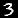

这里我们使用了Python图像库（PIL）中的 `Image` 类，这是用于打开、处理和查看图像最广泛使用的Python软件包。Jupyter能够识别PIL图像，因此会自动为我们显示图像。

在计算机中，一切都以数字形式呈现。要查看构成图像的数字，我们需要将其转换为NumPy数组或PyTorch张量。例如，图像的一部分转换为NumPy数组后如下所示：

```python
array(im3)[4:10,4:10]
```

```text
array([[ 0, 0, 0, 0, 0, 0],
	[ 0, 0, 0, 0, 0, 29],
	[ 0, 0, 0, 48, 166, 224],
	[ 0, 93, 244, 249, 253, 187],
	[ 0, 107, 253, 253, 230, 48],
	[ 0, 3, 20, 20, 15, 0]], dtype=uint8)
```

`4:10` 表示我们请求了从索引 4（包含）到 10（不包含）的行（译者注：这是Python的切片，它总是遵循左闭右开的原则），以及相同的列范围。NumPy 的索引方向是从上到下、从左到右，因此该区域位于图像左上角附近。以下是 PyTorch 张量对应的表示形式：

```python
tensor(im3)[4:10,4:10]
```

```text
tensor([[ 0, 0, 0, 0, 0, 0],
	[ 0, 0, 0, 0, 0, 29],
	[ 0, 0, 0, 48, 166, 224],
	[ 0, 93, 244, 249, 253, 187],
	[ 0, 107, 253, 253, 230, 48],
	[ 0, 3, 20, 20, 15, 0]], dtype=torch.uint8)
```

我们可以对数组进行切片操作，仅提取包含数字顶部的部分，然后使用Pandas数据框通过渐变色对数值进行编码，这清晰地展示了图像如何由像素值生成：

```python
im3_t = tensor(im3)
df = pd.DataFrame(im3_t[4:15,4:22])
df.style.set_properties(**{'fontsize':'
6pt'}).background_gradient('Greys')
```

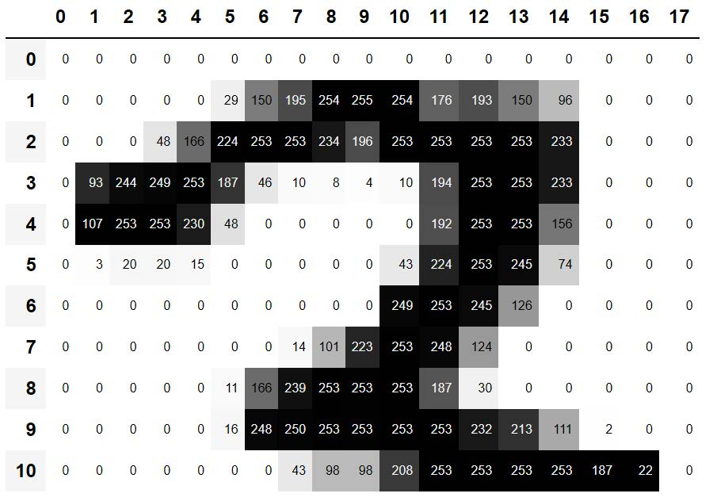

你可以看到背景中的白色像素存储为数字0，黑色存储为数字255，而灰色调则介于两者之间。整张图像包含28个横向像素和28个纵向像素，总计768个像素点。（这远小于手机摄像头拍摄的数百万像素图像，但作为初学阶段的学习和实验对象非常合适。我们很快会逐步过渡到更大尺寸的全彩图像。）

那么，现在你已经了解了计算机眼中图像的模样，让我们回顾我们的目标：创建一个能够识别数字3和7的模型。你将如何让计算机实现这个功能呢？

> 停下来思考一下！
>
> 在继续阅读之前，请花片刻时间思考计算机如何识别这两个数字。它可能关注哪些特征？如何识别这些特征？又如何将它们组合起来？学习的最佳方式是自己尝试解决问题，而非直接阅读他人答案；因此请暂时放下这本书，拿纸笔记录下你的想法。

### 首次尝试：像素相似度

那么，这里有一个初步想法：我们是否可以先计算所有数字“3”的像素平均值，再对数字“7”进行同样的操作？这样就能得到两个组平均值，定义我们所说的“理想”数字3和数字7。接着，要将图像分类为某个数字，我们只需判断图像与这两个理想数字中的哪个更相似。这种方法显然比毫无头绪要好得多，因此可以作为良好的基准方案。

> 术语：基准方案（baseline）
>
> 一个你确信能表现不错的简单模型。它应该易于实现且便于测试，这样你就能逐一验证改进方案，确保它们始终优于基准模型。若没有合理的基准模型作为起点，就很难判断那些花哨的模型是否真正有效。建立基准的有效方法之一是像我们在此所做的那样：构思一个简单易实现的模型。另一种方法是寻找解决过类似问题的案例，下载相关代码并在你的数据集上运行。理想情况下，两种方法都尝试！

我们简单模型的第一步是计算两个组中每个像素值的平均值。在此过程中，我们将学习许多实用的Python数值编程技巧！

让我们创建一个张量，将所有3的值堆叠在一起。我们已经知道如何创建包含单张图像的张量。要创建包含目录中所有图像的张量，我们将首先使用Python列表推导式生成单张图像张量的普通列表。

在开发过程中，我们将使用Jupyter进行一些小测试——例如，确保返回的项数看起来合理：

```python
seven_tensors = [tensor(Image.open(o)) for o in sevens]
three_tensors = [tensor(Image.open(o)) for o in threes]
len(three_tensors),len(seven_tensors)
```

```text
(6131, 6265)
```

> 列表推导式
>
> 列表推导式和字典推导式是Python的一项绝妙特性。许多Python程序员——包括本书作者——每天都在使用它们，它们是“地道Python”的重要组成部分。但来自其他语言的程序员可能从未见过它们。网络上已有大量优质教程可供查阅，因此我们在此不再赘述。以下提供简要说明和示例供您入门：列表推导式格式如下：`new_list = [f(o) for o in a_list if o>0]`。该表达式将返回 `a_list` 中所有大于 0 的元素，并在返回前通过函数 `f` 进行处理。其结构包含三部分：迭代集合（`a_list`）、可选过滤条件（`if o>0`）以及对每个元素执行的操作（`f(o)`）。这种写法不仅更简洁，而且比用循环创建相同列表的替代方法快得多。

我们还将检查其中一张图像是否正常显示。由于现在我们处理的是张量（Jupyter默认会将其打印为数值），而非PIL图像（Jupyter默认会显示图像），因此需要使用fastai的`show_image` 函数来显示图像：

```python
show_image(three_tensors[1]);
```


对于每个像素位置，我们需要计算所有图像中该像素的强度平均值。为此，首先将列表中的所有图像合并为单个三维张量。描述此类张量最常见的方式是将其称为三阶张量。我们常需将集合中的单个张量堆叠成单一张量。不出所料，PyTorch内置名为`stack`的函数可用于此目的。

PyTorch 中某些操作（如计算均值）需要我们将整数 *类型转换* （cast）为浮点类型。由于后续会用到，我们现在也需将堆叠张量转换为浮点类型。在 PyTorch 中进行类型转换非常简单：只需写出目标类型名称，并将其作为方法调用即可。

通常，当图像采用浮点数表示时，像素值预期在0到1之间，因此我们在此处也需除以255：

```python
stacked_sevens = torch.stack(seven_tensors).float()/255
stacked_threes = torch.stack(three_tensors).float()/255
stacked_threes.shape
```

```text
torch.Size([6131, 28, 28])
```

张量的最重要属性或许是其形状。这揭示了每个轴的长度。在此案例中，我们可知共有6,131张图像，每张尺寸为28×28像素。这个张量本身并未明确规定：第一轴代表图像数量、第二轴代表高度、第三轴代表宽度——张量的语义完全取决于我们如何构建它。对PyTorch而言，它只是内存中的一组数字。

张量的形状长度即为其阶数（rank）：

```python
len(stacked_threes.shape)
```

```python
3
```

你必须牢记并熟练运用这些张量术语：阶数指张量的轴数或维数；形状指张量各轴的大小。

> ALEXIS说
>
> 请注意，“维度”一词有时具有双重含义。我们生活在“三维空间”中，物理位置可由长度为3的向量 `v` 描述。但根据PyTorch的定义，属性 `v.ndim`（看似表示v的“维数”）却等于1而非3！为什么？因为v作为向量属于阶数为1的张量，意味着它仅有一条轴（即使该轴长度为3）。换言之，“维度”有时指轴的长度（如“空间是三维的”），有时指阶数或轴的数量（如“矩阵有两个维度”）。当概念混淆时，我发现将所有表述转化为“阶数”、“轴”和“长度”这三个明确术语会很有帮助。

我们也可以直接使用 `ndim` 获取张量的阶数：

```python
stacked_threes.ndim
```

```python
3
```

最后，我们可以计算出理想的3维张量形态。通过对堆叠后的3阶张量沿0维方向求均值，即可得到所有图像张量的平均值。该维度正是索引所有图像的维度。

换言之，对于每个像素位置，这将计算该像素在所有图像中的平均值。结果将是每个像素位置对应一个数值，即一张单一图像。如下所示：

```python
mean3 = stacked_threes.mean(0)
show_image(mean3);
```

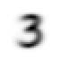

根据该数据集，这是理想的“3”数值！（你或许不喜欢，但这就是峰值“3”的性能的表现形态。）你可以看到：当所有图像都认为该区域应为暗部时，它呈现出极深的暗度；而在图像存在分歧的区域，则会变得纤细而模糊。

现在我们对7也做同样的事情，但把所有步骤合并在一起以节省时间：

```python
mean7 = stacked_sevens.mean(0)
show_image(mean7);
```

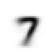

现在我们选取任意一个3，并测量它与我们“理想数字”之间的距离。

> 停下来思考一下！
>
> 如何计算特定图像与我们每个理想数字的相似度？请记得在继续之前暂时放下这本书，先记下一些想法！研究表明，当你通过解决问题、进行实验和亲自尝试新想法来参与学习过程时，记忆力和理解力会显著提升。

以下是“3”的示例：

```python
a_3 = stacked_threes[1]
show_image(a_3);
```

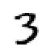

如何判断它与理想数字3的距离？我们不能简单地将该图像像素与理想数字像素之间的差异相加。某些差异为正值，某些为负值，这些差异会相互抵消，导致某些区域过暗、某些区域过亮的图像可能显示为与理想数字的总差异为零。这会产生误导！

为避免这种情况，数据科学家主要采用两种方法来衡量此情境中的距离：

- 取差值绝对值的均值（绝对值是将负值替换为正值的函数）。这称为平均绝对差或L1范数。

- 取差值平方的均值（使所有值变为正值），然后求平方根（取消平方操作）。这称为均方根误差（RMSE）或L2范数。

> 忘记数学也没关系
>
> 本书通常假设读者已完成高中数学课程，并至少记得其中部分内容——但谁都会遗忘某些知识！这完全取决于你在此期间恰好练习过哪些内容。也许你已经忘记了平方根是什么，或者它们确切的运作方式。没关系！每当遇到本书未充分阐述的数学概念时，请务必暂停推进，立即查阅相关资料。确保你理解其基本原理、运作机制及应用场景。可通过可汗学院等优质资源重温知识点，例如该平台就提供了精彩的平方根入门教程。

现在让我们同时尝试这两种方法：

```python
dist_3_abs = (a_3 - mean3).abs().mean()
dist_3_sqr = ((a_3 - mean3)**2).mean().sqrt()
dist_3_abs,dist_3_sqr
```

```text
(tensor(0.1114), tensor(0.2021))
```

```python
dist_7_abs = (a_3 - mean7).abs().mean()
dist_7_sqr = ((a_3 - mean7)**2).mean().sqrt()
dist_7_abs,dist_7_sqr
```

```python
(tensor(0.1586), tensor(0.3021))
```

在这两种情况下，我们的3与“理想”3之间的距离都小于到理想7的距离，因此在这种情况下，我们的简单模型将给出正确的预测。

PyTorch 已将这两种损失函数都作为内置功能提供。您可以在 `torch.nn.functional` 中找到它们，PyTorch 团队建议导入时使用 `F`（在 fastai 中默认即以此名称提供）：

```python
F.l1_loss(a_3.float(),mean7), F.mse_loss(a_3,mean7).sqrt()
```

```text
(tensor(0.1586), tensor(0.3021))
```

此处 `MSE` 代表均方误差（mean squared error），`l1` 指代数学术语中的均值绝对值（数学中称为L1范数）。

> SYLVAIN说
>
> 直观而言，L1范数与均方误差（MSE）的区别在于：后者对较大误差的惩罚力度大于前者（而对小误差则更为宽容）。

> JEREMY说
>
> 初次见到这个L1玩意儿时，我查了查它到底是什么意思。在谷歌上发现它是一种使用绝对值的向量范数（vector norm），于是又查了“向量范数”开始阅读： 设V为实数或复数域F上的向量空间，V上的范数即为满足下列性质的任意非负值函数p: V → \[0,+∞): 对所有a ∈ F及所有u, v ∈ V，p(u + v) ≤ p(u) + p(v)...然后我就没再读下去。“唉，我永远搞不懂数学！”我第n次这样想着。后来我发现，每当这些复杂的数学术语在实践中出现时，其实都能用一小段代码替代！比如L1损失就是 `(a-b).abs().mean()`，其中a和b是张量。数学家们的思维方式确实与我不同……本书将确保每次出现数学术语时，都会同步给出对应的代码片段，并用通俗易懂的语言解释其原理。

我们刚刚完成了对PyTorch张量的各种数学运算。如果你之前用PyTorch做过数值编程，可能会发现这些操作与NumPy数组类似。让我们来看看这两种重要的数据结构。

#### NumPy数组与PyTorch张量

[NumPy](https://numpy.org/) 是 Python 中最广泛使用的科学计算和数值编程库。它提供了与 PyTorch 类似的功能和 API，但不支持使用 GPU 或计算梯度——这两者对深度学习都至关重要。因此，在本书中，我们将在可能的情况下普遍使用 PyTorch 张量而非 NumPy 数组。

（请注意，fastai 为 NumPy 和 PyTorch 添加了一些功能，使它们在某些方面更相似。如果本书中的任何代码在你的计算机上无法运行，可能是你忘记在笔记本开头添加类似以下的导入语句：`from fastai.vision.all import *`。）

但什么是数组和张量，你又为何需要关注它们？

相较于许多语言，Python运行速度较慢。在Python、NumPy或PyTorch中表现出色的高效代码，很可能是为编译对象编写的封装层——这些对象通常用其他语言（特别是C语言）编写并经过优化。事实上，NumPy数组和PyTorch张量完成计算的速度，可能比使用纯Python快数千倍。

NumPy数组是一种多维数据表，其中所有元素类型相同。由于数据类型不受限制，数组甚至可以包含嵌套数组，其中最内层数组可能具有不同尺寸——这种结构称为锯齿状数组。所谓“多维数据表”，例如包括：列表（一维）、表格或矩阵（二维）、表格的表格（三维）等等。若元素均为整型或浮点型等简单类型，NumPy将以紧凑的C语言数据结构存储于内存中。这正是NumPy的优势所在：其丰富的运算符与方法能以与优化C语言相同的运算速度处理这些紧凑结构，因为它们本身就是用优化C语言编写的。

PyTorch张量与NumPy数组几乎相同，但存在一项额外限制，该限制解锁了更多功能。两者相同之处在于，它们都是多维数据表，且所有元素类型一致。然而，其限制在于张量不能随意使用任意类型——所有分量必须采用单一基本数值类型。因此张量不如真正的阵列阵列灵活。例如 PyTorch 张量不能具有锯齿状结构，始终保持规则的多维矩形结构。

NumPy 在这些结构上支持的大多数方法和运算符，PyTorch 同样支持，但 PyTorch 张量还具备额外功能。其中一项重要能力是这些结构可驻留在 GPU 上，此时其计算将针对 GPU 进行优化，运行速度将大幅提升（前提是处理大量数据值）。此外，PyTorch能自动计算这些运算的导数，包括复合运算的导数。正如你将看到的，若缺少此功能，深度学习在实际应用中将难以实现。

> SYLVAIN说
>
> 如果你不知道什么是C语言，别担心：你完全不需要它。简而言之，它是一种低级语言（低级意味着更接近计算机内部使用的语言），与Python相比速度极快。在Python编程中若想利用其速度优势，请尽量避免编写循环，改用直接操作数组或张量的命令。

对于Python程序员而言，或许最重要的编程技能就是掌握如何高效使用数组/张量API。本书后续将展示更多技巧，但现阶段您需要了解的核心要点如下：

要创建数组或张量，请将列表（或列表的列表，或列表的列表的列表等）传递给 `array` 或 `tensor`：

```python
data = [[1,2,3],[4,5,6]]
arr = array (data)
tns = tensor(data)
```

```python
arr # numpy
```

```python
array([[1, 2, 3],
	[4, 5, 6]])
```

```python
tns # pytorch
```

```python
tensor([[1, 2, 3],
	[4, 5, 6]])
```

以下所有操作均在张量上展示，但其语法和结果与NumPy数组完全相同。

你可以选择一行（请注意，与Python中的列表类似，张量采用0索引，因此1指代第二行/列）：

```python
tns[1]
```

```text
tensor([4, 5, 6])
```

或者通过使用 `:` 表示所有第一个轴（我们有时将张量/数组的维度称为轴）：

```python
tns[:,1]
```

```python
tensor([2, 5])
```

你可以结合Python切片语法（`[起始:终止]`，且 `终止` 不包含）来选择行或列的一部分：

```python
tns[1,1:3]
```

```text
tensor([5, 6])
```

并且你可以使用标准运算符，例如 `+` 、`-` 、`*` 和 ` /`：

```python
tns+1
```

```text
tensor([[2, 3, 4],
	[5, 6, 7]])
```

张量具有类型：

```python
tns.type()
```

```text
'torch.LongTensor'
```

并将根据需要自动更改该类型；例如，从 `int` 到 `float`：

```python
tns*1.5
```

```text
tensor([[1.5000, 3.0000, 4.5000],
	[6.0000, 7.5000, 9.0000]])
```

那么，我们的基准模型是否有效？要量化这一点，我们必须定义一个指标。

### 使用广播计算指标

请记住，度量值是基于模型预测结果和数据集中的正确标签计算得出的数值，用于评估模型性能。例如，我们可以使用上一节中提到的任一函数——均方误差或均方根误差，并计算它们在整个数据集上的平均值。然而，这些数值对大多数人而言并不直观；实际应用中，我们通常采用准确率作为分类模型的评估指标。

正如我们讨论过的，我们希望在验证集上计算指标。这样做是为了避免无意中出现过拟合——即训练出的模型仅在训练数据上表现良好。虽然当前尝试的像素相似度模型本身不存在这种风险（因其不含训练组件），但我们仍将遵循常规做法使用验证集，为后续的二次尝试做好准备。

要获得验证集，我们需要从训练数据中完全剔除部分数据，确保模型完全无法接触这些数据。事实上，MNIST数据集的创建者已经为我们做好了这项工作。还记得那个名为 `valid` 的独立目录吗？这个目录正是为此而设！

那么首先，让我们从该目录中创建 "3"和 "7" 的张量。这些张量将用于计算衡量初始模型质量的指标，该指标通过评估与理想图像的距离来实现：

```python
valid_3_tens = torch.stack([tensor(Image.open(o))
                            for o in (path/'valid'/'3').ls()])
valid_3_tens = valid_3_tens.float()/255
valid_7_tens = torch.stack([tensor(Image.open(o))
                            for o in (path/'valid'/'7').ls()])
valid_7_tens = valid_7_tens.float()/255
valid_3_tens.shape,valid_7_tens.shape
```

```text
(torch.Size([1010, 28, 28]), torch.Size([1028, 28, 28]))
```

养成边操作边检查形状的习惯很有必要。这里我们看到两个张量：一个表示由1,010张28×28图像组成的3验证集，另一个表示由1,028张28×28图像组成的7验证集。

我们最终要编写一个函数 `is_3`，用于判断任意图像更接近于数字3还是数字7。该函数将通过比较图像与两个“理想数字”的相似度来实现判断。为此，我们需要定义距离的概念——即一个计算两幅图像之间距离的函数。

我们可以编写一个简单的函数，使用与上一节中编写的表达式非常相似的表达式来计算均方根误差：

```python
def mnist_distance(a,b): return (a-b).abs().mean((-1,-2))
mnist_distance(a_3, mean3)
```

```text
tensor(0.1114)
```

这是我们先前计算的两幅图像间距离值，即理想图像 `mean_3` 与任意样本图像 `a_3`，它们均为形状为 `[28,28]` 的单图像张量。

但要计算整体准确率的度量指标，我们需要为验证集中的每张图像计算其与理想值3的距离。如何进行这项计算？我们可以遍历验证集张量 `valid_3_tens` 中所有单张图像张量，该张量形状为 `[1010,28,28]`，代表1010张图像。但存在更优解法

当我们使用这个完全相同的距离函数——它原本是为比较两张单一图像而设计的——但将代表 3s 验证集的张量 `valid_3_tens` 作为参数传入时，会发生一件有趣的事情：

```python
valid_3_dist = mnist_distance(valid_3_tens, mean3)
valid_3_dist, valid_3_dist.shape
```

```text
(tensor([0.1050, 0.1526, 0.1186, ..., 0.1122, 0.1170, 0.1086]),
torch.Size([1010]))
```

与其抱怨形状不匹配，它反而将每张图像的距离作为向量（即秩为1的张量）返回，长度为1,010（即验证集中3的数量）。这是怎么回事？

再看一遍我们的函数 `mnist_distance`，你会发现其中包含了减法运算（`a-b`）。关键技巧在于：当PyTorch尝试对不同秩的两个张量执行简单减法时，会自动启用广播机制——它会将秩较小的张量自动扩展为与秩较大张量相同的尺寸。广播功能极大简化了张量编程的复杂性，是张量编程的核心特性之一。

在广播操作后，两个参数张量具有相同的秩，PyTorch 应用其对同秩张量的常规逻辑：对两个张量的每个对应元素执行操作，并返回张量结果。例如：

```python
tensor([1,2,3]) + tensor([1,1,1])
```

```text
tensor([2, 3, 4])
```

因此在此情况下，PyTorch 将 `mean3`（一个表示单张图像的 2 维张量）视为 1,010 张相同图像的副本，然后将这些副本分别从验证集中的每个 3 中减去。你认为这个张量的形状会是什么？在查看答案之前，请尝试自己推导：

```python
(valid_3_tens-mean3).shape
```

```text
torch.Size([1010, 28, 28])
```

我们正在计算理想值3与验证集中的1,010个3之间的差异，针对每张28×28的图像分别计算，最终形成 `[1010,28,28]` 的形状。

关于广播机制的实现方式，有几点重要说明：这些特性不仅使其在表达能力方面具有价值，更在性能层面展现出显著优势：

- PyTorch 实际上并未复制 `mean3` 1,010 次。它只是模拟出该形状的张量，但并未分配额外内存。
- 所有计算都在C语言环境中完成（若使用GPU，则通过CUDA实现——相当于GPU端的C语言），其运行速度比纯Python快数万倍（在GPU上甚至可达数百万倍！）。

这适用于PyTorch中所有广播操作、元素级运算及函数。 *掌握这项技术是编写高效PyTorch代码的关键所在*。

在 `mnist_distance` 中，我们看到可以 `abs`。现在你可能已经猜到，当应用于张量时，它会做什么。它将该方法应用于张量中的每个单独元素，并返回一个包含结果的张量（即，它以元素方式应用该方法）。因此，在此情况下，我们将得到 1,010 个绝对值。

最后，我们的函数调用 `mean(-1,-2)`。元组 `(-1,-2)` 代表一组轴范围。在Python中，`-1` 表示最后一个元素，`-2` 表示倒数第二个元素。因此在此情况下，这告诉PyTorch我们需要对张量最后两个轴索引的值进行均值计算。最后两个轴分别对应图像的水平和垂直维度。对最后两个轴求均值后，我们仅剩下张量的第一个轴，该轴索引图像元素，因此最终尺寸为( `1010` )。换言之，我们对每张图像中所有像素的强度值进行了平均计算。

在本书后续章节中，特别是第17章，我们将深入学习广播技术，并定期进行实践操作。

我们可以使用 `mnist_distance` 来判断图像是否为数字 3，具体逻辑如下：若待判数字与标准 3 之间的距离小于其与标准 7 的距离，则判定为 3。该函数将自动执行广播操作并逐元素应用，这与所有 PyTorch 函数和运算符的行为一致：

```python
def is_3(x): return mnist_distance(x,mean3) < mnist_distance(x,mean7)
```

让我们用我们的示例案例来测试一下：

```python
is_3(a_3), is_3(a_3).float()
```

```text
(tensor(True), tensor(1.))
```

请注意，当我们将布尔响应转换为浮点数时，`True` 对应`1.0`，而 `False` 对应 `0.0`。

得益于广播机制，我们还可以在完整的 "3" 验证集上进行测试：

```python
is_3(valid_3_tens)
```

```text
tensor([True, True, True, ..., True, True, True])
```

现在我们可以计算每个3和7的准确率，方法是取该函数在所有3上的平均值，以及其在所有7上的逆函数的平均值：

```python
accuracy_3s = is_3(valid_3_tens).float() .mean()
accuracy_7s = (1 - is_3(valid_7_tens).float()).mean()
accuracy_3s,accuracy_7s,(accuracy_3s+accuracy_7s)/2
```

```text
(tensor(0.9168), tensor(0.9854), tensor(0.9511))
```

这看起来是个不错的开端！我们在3和7的识别上都达到了90%以上的准确率，并且学会了如何通过广播操作便捷地定义指标。但说实话：3和7的外观差异非常明显。而且目前我们只识别了10个数字中的2个。所以我们需要做得更好！

要做得更好，或许是时候尝试一种真正具备学习能力的系统——它能够自动调整自身以提升性能。换言之，现在是时候探讨训练过程和梯度下降法了。

### 随机梯度下降法

你还记得亚瑟·塞缪尔对机器学习的描述吗？我们在第一章中曾引用过他的话。

> 假设我们设计某种自动测试机制，用于评估当前权重分配方案在实际性能方面的有效性，并提供调整权重分配的机制以实现性能最大化。无需深入探讨具体流程细节，即可预见该机制完全可实现自动化运行，且如此编程的机器将能够从经验中“学习”。

正如我们讨论的那样，这是实现模型不断改进的关键——它能够学习。但我们的像素相似度方法并未真正实现这一点。我们既没有权重分配机制，也没有通过测试权重分配效果来改进的方法。换言之，我们无法通过调整参数集来真正提升像素相似度方法的性能。要发挥深度学习的强大能力，首先必须按照塞缪尔描述的方式来表征任务。

与其试图寻找图像与“理想图像”之间的相似性，我们不妨逐个分析每个像素，为每个像素赋予权重值，使得权重值最高的那部分像素，对应特定类别中最可能呈现黑色的区域。例如，位于右下方的像素在识别数字7时激活概率较低，因此应赋予其较低的权重；但这些像素在识别数字8时激活概率较高，故应赋予其较高的权重。这可通过函数形式及各类别对应的权重值集来表示——例如数字8的概率：

```python
def pr_eight(x,w) = (x*w).sum()
```

在此我们假设 `X` 是图像，以向量形式表示——换言之，所有行被首尾相接堆叠成一条长线。同时假设权重为向量 `W` 。若存在此函数，我们只需某种方式更新权重使其略有改善。通过这种方法，我们可以重复此步骤多次，使权重不断优化，直至达到最佳状态。

我们希望找到向量 `W` 的具体值，使得对于数字8的图像，函数结果值较高；对于非数字8的图像，函数结果值较低。寻找最佳向量 `W` 的过程，本质上是在探索识别8的最佳函数。（由于尚未采用深度神经网络，我们目前受限于函数的处理能力——本章后续将解决这一限制。）

具体而言，将此函数转换为机器学习分类器所需的步骤如下：

1. *初始化* （Initialize）权重。
2. 对每张图像，使用这些权重 *预测* （predict）其是否呈现为数字3或7。
3. 根据这些预测结果，计算模型性能指标（即 *损失值* （loss））。
4. 计算 *梯度* （gradient），该值衡量每个权重变化对损失值的影响。
5. 根据计算结果 *调整* （Step）（即改变）所有权重值。
6. 返回步骤2 *重复* （repeat）整个过程。
7. 持续迭代直至决定 *终止* （stop）训练（例如模型达到预期精度或训练时间超限）。

如图4-1所示的这七个步骤，是所有深度学习模型训练的核心。深度学习竟完全依赖于这些步骤，这令人极其惊讶且违背直觉。如此简单的过程竟能解决如此复杂的问题，实在令人惊叹。但正如你将看到的，它确实做到了！

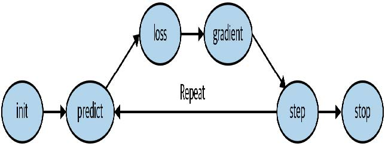

[^图4-1]: 梯度下降过程

实现这七个步骤的方法多种多样，我们将在本书后续章节中逐步学习这些方法。这些细节对深度学习从业者至关重要，但实际上每个步骤的通用方法都遵循着一些基本原则。以下是一些指导方针：

- 初始化

  我们将参数初始化为随机值。这听起来或许令人惊讶。我们当然可以选择其他初始化方式，例如将参数设为该类别中像素被激活的百分比——但既然我们已知存在优化权重的常规方法，事实证明直接采用随机权重作为起点完全可行。

- 损失值

  这正是塞缪尔所指的——通过实际性能来检验当前权重分配的有效性。我们需要一个函数，当模型性能良好时返回较小的数值（标准做法是将小损失视为良好，大损失视为不良，尽管这仅是约定俗成的做法）。

- 调整

  判断权重应微增还是微减的简易方法就是直接尝试：将权重小幅调整后，观察损失值是上升还是下降。找到正确方向后，可逐步增减调整幅度，直至找到效果最佳的数值。但这种方法效率十分低下！正如我们将要看到的，微积分的魔力让我们无需逐次尝试微调，就能直接确定每个权重的调整方向和大致幅度。实现方法是计算梯度——这本质上是性能优化手段，通过较慢的手动过程同样能获得完全相同的结果。

- 停止

  在确定模型需要训练的迭代轮次数量后（前文列表中已给出若干建议），我们便执行该决策。对于我们的数字分类器，我们将持续训练直至模型准确率开始下降，或训练时间耗尽。

在将这些步骤应用于图像分类问题之前，让我们通过一个更简单的案例来说明它们的运作方式。首先定义一个极其简单的函数——二次函数，假设这是我们的损失函数，其中 `x` 是该函数的权重参数：

```python
def f(x): return x**2
```

以下是该函数的图：

```python
plot_function(f, 'x', 'x**2')
```

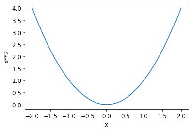

我们之前描述的步骤序列首先为某个参数选择一个随机值，然后计算损失值：

```python
plot_function(f, 'x', 'x**2')
plt.scatter(-1.5, f(-1.5), color='red');
```

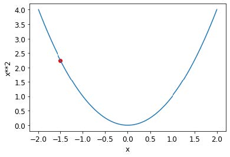

现在我们观察参数增减一点点时会发生什么——即调整。这本质上就是特定点处的斜率：

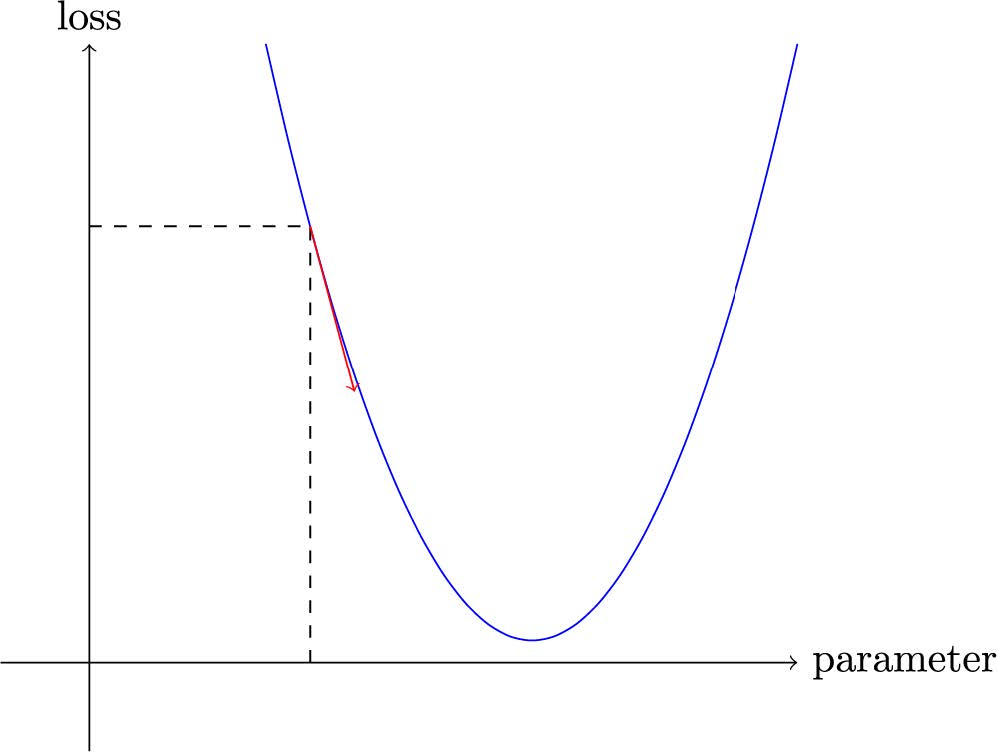

我们可以沿着斜率方向稍微改变权重，重新计算损失和调整值，并重复几次。最终，我们将到达曲线上的最低点：

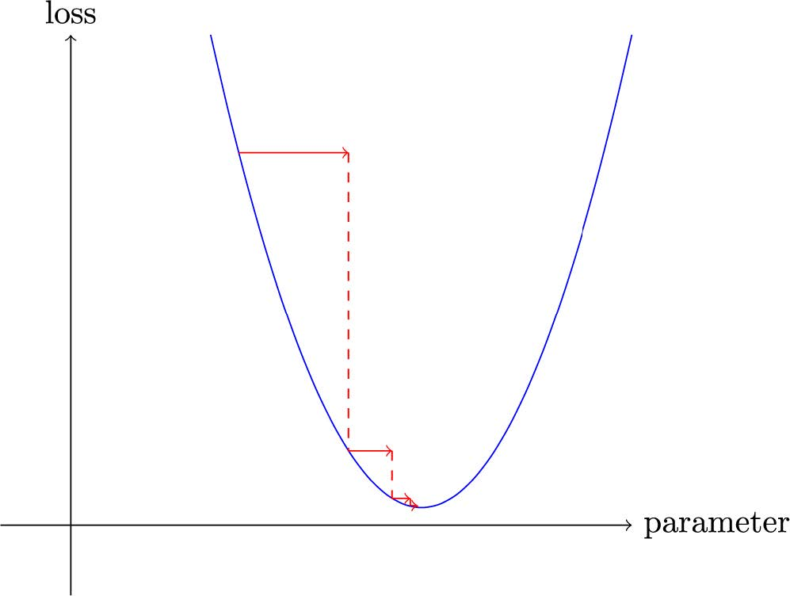

这个基本思想可以追溯到艾萨克·牛顿（Isaac Newton），他指出我们可以以此方式优化任意函数。无论函数变得多么复杂，这种梯度下降的基本方法都不会发生显著改变。本书后续章节中出现的细微变化，仅在于通过寻找更优的步长来提升计算效率的实用技巧。

#### 计算梯度

关键的一步在于计算梯度。正如我们所提到的，我们使用微积分进行性能优化；它能让我们更快速地计算出，当调整参数增减时损失函数将上升还是下降。换言之，梯度会告诉我们需要调整每个权重多少，才能使模型表现更优。

你可能还记得高中微积分课上学到的知识：函数的导数能告诉你参数变化会如何改变结果。如果忘了也别担心，高中毕业后忘记微积分的人可不少！但在继续学习前，你需要对导数有基本的直观理解。若相关概念仍模糊不清，建议前往可汗学院完成基础导数课程。无需掌握具体计算方法，只需理解导数的本质即可。

关于导数的关键点在于：对于任何函数——例如上一节中出现的二次函数——我们都能计算其导数。导数本身是另一种函数，它计算的是变化率而非数值本身。例如，二次函数在数值3处的导数，揭示了该函数在3处的变化速率。更具体地说，你可能记得梯度定义为升高/水平移动，即函数值的变化除以参数值的变化。当我们知道函数将如何变化时，就知道该如何使其更小。这正是机器学习的关键：找到改变函数参数的方法使其更小。微积分为我们提供了计算捷径——导数，它使我们能够直接计算函数的梯度。

需要注意的一点是，我们的函数包含大量需要调整的权重，因此在计算导数时，我们不会得到一个数值，而是会得到许多数值——每个权重对应一个梯度。但这里并无数学上的复杂之处；你可以先计算某个权重的导数，将其他权重视为常量，然后对每个权重重复此过程。所有权重的梯度都是通过这种方式计算得出的。

我们刚才提到，你无需亲自计算任何梯度。这怎么可能？令人惊叹的是，PyTorch能够自动计算几乎任何函数的导数！更令人赞叹的是，它执行得非常迅速。大多数情况下，其速度至少与你手动创建的任何导数函数相当。让我们通过一个示例来验证。

首先，让我们选取一个需要计算梯度的张量值：

```python
xt = tensor(3.).requires_grad_()
```

你应该注意到了那个特殊的`requires_grad_`方法了吧？这就是我们用来告诉PyTorch的魔法咒语——我们需要计算该变量在该值处的梯度。它本质上是在给变量打标签，这样PyTorch就会记住如何计算你后续请求的其他直接计算操作的梯度。

> ALEXIS说
>
> 如果你之前有数学或物理背景，这个API可能会让你感到困惑。在那些领域中，函数的“梯度”只是另一个函数（即其导数），因此你可能会期望梯度相关的API返回一个新函数。但在深度学习中，“梯度”通常指函数导数在特定参数值处的数值。PyTorch 的 API 同样将焦点放在参数上，而非你实际计算梯度的函数本身。初看或许令人费解，但这只是视角的差异。

现在我们用该值计算函数。请注意PyTorch不仅打印计算结果，还标注了它拥有一个梯度函数——该函数将在需要时用于计算梯度：

```python
yt = f(xt)
yt
```

```text
tensor(9., grad_fn=<PowBackward0>)
```

最后，我们让PyTorch为我们计算梯度：

```python
yt.backward()
```

此处的“反向”指的是反向传播（backpropagation），这是计算每层导数的命名过程。我们将在第17章中具体探讨其实现方式——届时将从零开始计算深度神经网络的梯度。该过程称为网络的反向传播，与用于计算激活值的前向传播相对应。若将 `backward` 直接命名为 `calculate_grad`，事情或许会简单些，但深度学习从业者确实热衷于在任何可能的地方添加专业术语！

现在我们可以检查张量的 `grad` 属性来查看梯度：

```python
xt.grad
```

```text
tensor(6.)
```

如果你还记得高中微积分的规则，`x**2` 的导数是 `2*x` ，而我们有 `x=3` ，因此梯度应为 `2*3=6` ——这正是PyTorch为我们计算出的结果！

现在我们将重复前面的步骤，但这次为函数提供一个向量参数：

```python
xt = tensor([3.,4.,10.]).requires_grad_()
xt
```

```text
tensor([ 3., 4., 10.], requires_grad=True)
```

我们将向函数添加 `sum` 方法，使其能够接收向量（即秩为1的张量）并返回标量（即秩为0的张量）：

```python
def f(x): return (x**2).sum()

yt = f(xt)
yt
```

```text
tensor(125., grad_fn=<SumBackward0>)
```

我们的梯度为 `2*xt` ，正如我们所预期的那样！

```python
yt.backward()
xt.grad
```

```text
tensor([ 6., 8., 20.])
```

梯度仅告诉我们函数的斜率，却无法精确指示参数应调整的幅度。但它们确实能提供某种参考：若斜率极大，可能意味着需要进行更多调整；反之若斜率极小，则暗示我们已接近最优值。

#### 调整学习率

根据梯度值决定如何调整参数，是深度学习过程中至关重要的一环。几乎所有方法都基于一个基本思路：将梯度乘以某个小数值，即学习率（LR）。学习率通常取值于0.001至0.1之间，但理论上可设为任意数值。人们常通过尝试不同学习率，在训练后筛选出最佳模型参数（本书后续将介绍更优方法——学习率搜索器）。选定学习率后，可通过以下简单函数调整参数：

```python
w -= w.grad * lr
```

这被称为参数步进（stepping），采用优化步长法（optimization step）。

如果你选择的学习率过低，可能意味着需要执行大量迭代步骤。图4-2对此进行了说明。

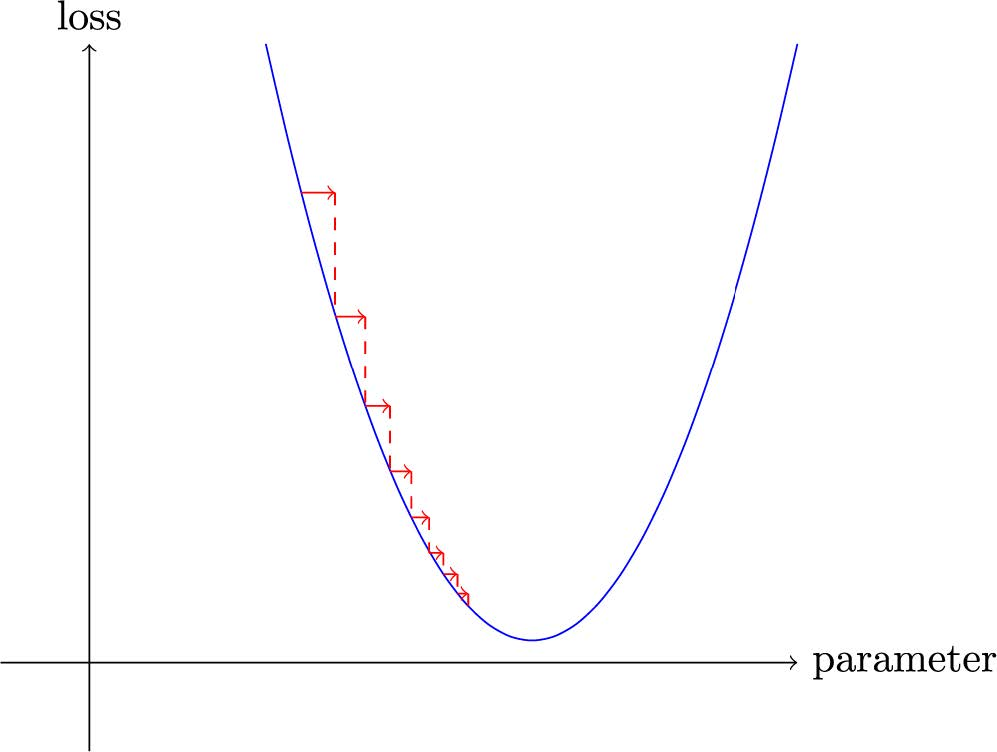

[^图4-2]: 低学习率的梯度下降法

但选择过高的学习率会更糟——它会导致损失进一步恶化，正如我们在图4-3中所见！

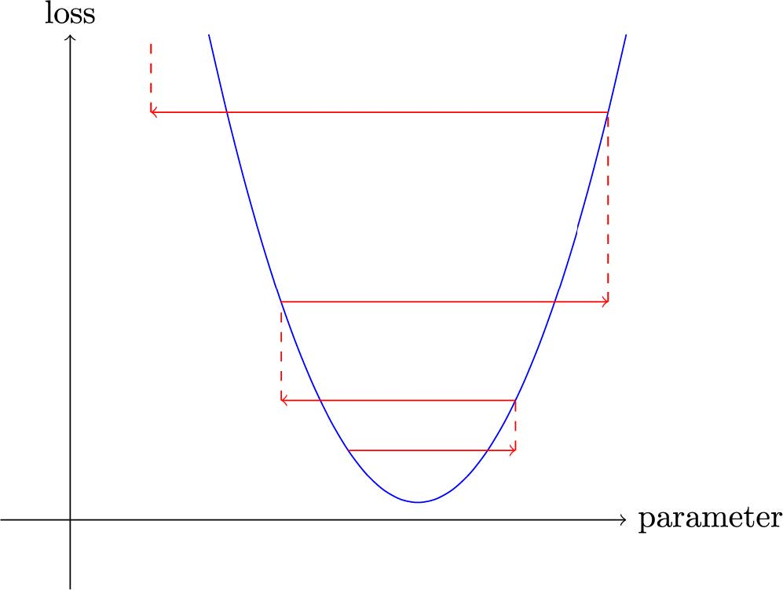

[^图4-3]: 高学习率的梯度下降法

若学习率过高，模型可能出现“弹跳”现象而非收敛；图4-4展示了这种情况如何导致训练过程需要大量迭代才能成功。

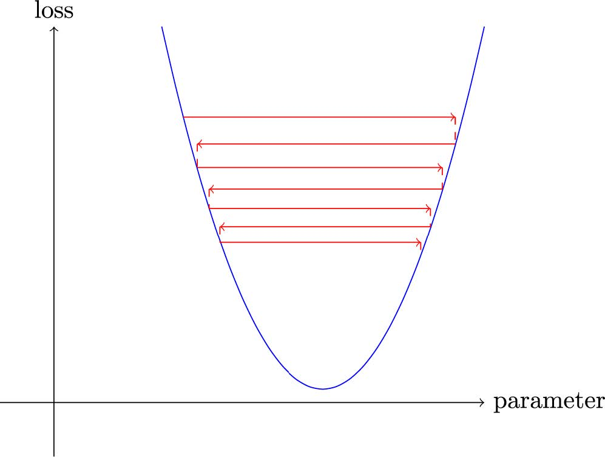

[^图4-4]: 带弹跳学习率的梯度下降法

现在让我们通过一个端到端的示例来应用所有这些内容。

#### 一个端到端梯度下降示例

我们已经了解了如何使用梯度来最小化损失。现在，让我们通过一个随机梯度下降（SGD）的示例，看看如何利用寻找极小值的过程来训练模型，使其更好地拟合数据。

让我们从一个简单的合成示例模型开始。想象你在测量过山车翻越山脊顶部时的速度。它会从高速开始，然后在爬坡时逐渐减速；在山顶达到最慢速度，随后在下坡时再次加速。你需要构建一个描述速度随时间变化的模型。若你每秒手动测量20秒内的速度，数据可能呈现如下形态：

```python
time = torch.arange(0,20).float(); time
```

```text
tensor([ 0., 1., 2., 3., 4., 5., 6., 7., 8., 9., 10., 11., 12.,
13.,
> 14., 15., 16., 17., 18., 19.])
```

```python
speed = torch.randn(20)*3 + 0.75*(time-9.5)**2 + 1
plt.scatter(time,speed);
```

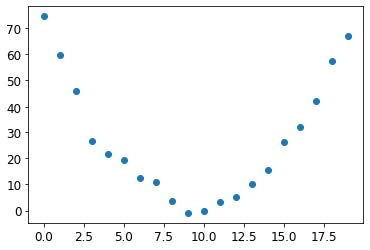

我们添加了一点随机噪声，因为手动测量不够精确。这意味着要回答“过山车速度是多少”的问题并不容易。使用梯度下降法，我们可以尝试寻找与观测数据匹配的函数。由于无法考虑所有可能的函数，我们假设其为二次函数，即形式为 `a*(time**2)+(b*time)+c` 的函数。

我们需要明确区分函数的输入（测量过山车速度的时刻）与参数（定义所测二次曲线值的数值）。因此，我们将参数集中到一个参数中，从而在函数签名中将输入 `t` 与参数 `params` 分离：

```python
def f(t, params):
    a,b,c = params
    return a*(t**2) + (b*t) + c
```

换言之，我们将寻找最优拟合函数的问题简化为寻找最佳二次函数。这极大简化了问题，因为每个二次函数都完全由三个参数 `a`、`b` 和 `c` 定义。因此，要找到最佳二次函数，我们只需确定 `a`、`b` 和 `c` 的最佳取值即可。

如果我们能为二次函数的三个参数解决这个问题，就能将同样的方法应用于其他参数更复杂的函数——例如神经网络。让我们先找出函数 `f` 的参数，然后再回来用神经网络对MNIST数据集进行同样的处理。

我们首先需要明确“最佳”的定义。通过选择损失函数（loss function）来精确定义这一概念，该函数将根据预测值与目标值返回数值，其中函数值越低对应的预测效果越“优越”。对于连续型数据，通常采用均方误差（mean squared error）作为衡量标准：

```python
def mse(preds, targets): return ((preds-targets)**2).mean()
```

现在，让我们逐步完成七步流程

##### 步骤 1：初始化参数

首先，我们将参数初始化为随机值，并通过 `requires_grad_` 告知 PyTorch 我们需要追踪它们的梯度：

```python
params = torch.randn(3).requires_grad_()
```

##### 步骤2：计算预测值

然后，我们来计算预测值：

```python
preds = f(time, params)
```

让我们创建一个小函数来看看我们的预测与目标值有多接近，并看看结果：

```python
def show_preds(preds, ax=None):
    if ax is None: ax=plt.subplots()[1]
    ax.scatter(time, speed)
    ax.scatter(time, to_np(preds), color='red')
    ax.set_ylim(-300,100)
    
show_preds(preds)
```

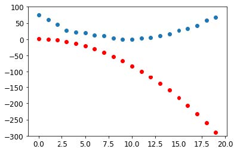

这看起来并不太接近——我们的随机参数表明过山车最终会倒退行驶，因为我们测得的是负速度！

##### 步骤3：计算损失

我们按以下方式计算损失：

```python
loss = mse(preds, speed)
loss
```

```text
tensor(25823.8086, grad_fn=<MeanBackward0>)
```

我们的目标是改进这一点。为此，我们需要了解梯度。

##### 步骤4：计算梯度

下一步是计算梯度，或者说，参数需要如何变化的近似值：

```python
loss.backward()
params.grad
```

```text
tensor([-53195.8594, -3419.7146, -253.8908])
```

```python
params.grad * 1e-5
```

```text
tensor([-0.5320, -0.0342, -0.0025])
```

我们可以利用这些梯度来优化参数。我们需要设定一个学习率（具体实践方法将在下一章讨论；目前暂设为1e-5或0.00001）：

```python
params
```

```text
tensor([-0.7658, -0.7506, 1.3525], requires_grad=True)
```

##### 步骤5：调整权重

现在我们需要根据刚刚计算出的梯度更新参数：

```python
lr = 1e-5
params.data -= lr * params.grad.data
params.grad = None
```

> ALEXIS说
>
> 理解这部分需要回顾最近我们讲的内容。为计算梯度，我们对 `loss` 函数调用`backward` 。但该 `loss` 函数本身由 `mse` 计算得出，而 `mse` 又以 `preds` 作为输入，`preds` 通过函数 `f` 计算获得，`f` 的输入是 `params` 参数——这正是我们最初调用 `required_grads_` 的对象，正是这个原始调用使我们现在能够对损失函数调用 `backward` 。这串函数调用链体现了函数的数学复合特性，使PyTorch能在底层运用微积分链式法则计算梯度。

让我们看看损失是否有所改善：

```python
preds = f(time,params)
mse(preds, speed)
```

```text
tensor(5435.5366, grad_fn=<MeanBackward0>)
```

再来看看这个图：

```python
show_preds(preds)
```

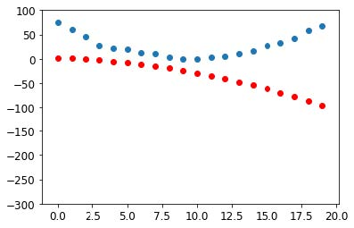

我们需要重复执行这个操作几次，因此我们将创建一个函数来应用单一步骤：

```python
def apply_step(params, prn=True):
    preds = f(time, params)
    loss = mse(preds, speed)
    loss.backward()
    params.data -= lr * params.grad.data
    params.grad = None
    if prn: print(loss.item())
    return preds
```

##### 步骤6：重复该过程

现在我们开始迭代。通过循环执行多次改进，我们希望最终获得理想结果：

```python
for i in range(10): apply_step(params)
```

```text
5435.53662109375
1577.4495849609375
847.3780517578125
709.22265625
683.0757446289062
678.12451171875
677.1839599609375
677.0025024414062
676.96435546875
676.9537353515625
```

损失值正在下降，正如我们所期望的那样！但仅关注这些损失数值会掩盖一个事实：每次迭代都在尝试完全不同的二次函数，这是在寻找最佳二次函数的过程中。如果我们不输出损失函数，而是在每个步骤绘制该函数，就能直观地看到这个过程。这样就能观察到曲线如何逐渐逼近数据的最佳二次函数：

```python
_,axs = plt.subplots(1,4,figsize=(12,3))
for ax in axs: show_preds(apply_step(params, False), ax)
plt.tight_layout()
```

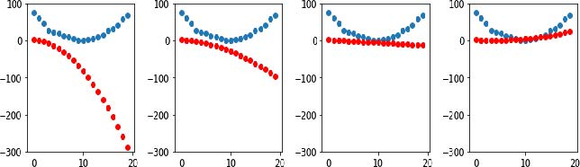

##### 步骤7：终止

我们只是随意决定在10个迭代轮次后停止训练。实际操作中，我们会像之前讨论的那样，通过观察训练集和验证集的损失值以及评估指标来决定何时停止训练。

#### 梯度下降法的总结

既然你已经了解了每个步骤的运作机制，让我们重新审视梯度下降过程的图形化表示（图4-5），并进行简要回顾。


[^图4-5]: 梯度下降过程

最初，我们模型的权重可以是随机的（从头开始训练），也可以来自预训练模型（迁移学习）。在第一种情况下，输入得到的输出结果与预期目标毫无关联；即使在第二种情况下，预训练模型也可能难以胜任我们特定的目标任务。因此模型需要学习更优的权重参数。

我们首先通过损失函数将模型输出的结果与目标值进行比较（我们拥有标注数据，因此知道模型应给出何种结果），该函数返回一个数值，我们需要通过调整权重使其尽可能降低。为此，我们从训练集中提取若干数据项（如图像）并输入模型。通过损失函数比对对应目标值，所得分数反映预测偏差程度。随后我们微调权重参数以实现预测精度的小幅提升。

为了解如何调整权重以改善损失函数表现，我们运用微积分计算梯度值（实际上由PyTorch自动完成）。不妨通过一个类比来理解： 假设你在山里迷路，车停在最低处。要找到回车的位置，你可能会随机方向乱逛，但这可能帮不上什么忙。既然知道车辆在最低点，你最好顺着山坡往下走。只要始终朝着最陡的下坡方向前进，最终就能抵达目的地。我们利用梯度大小（即斜坡陡峭程度）来决定步幅大小；具体而言，将梯度乘以我们设定的学习率来确定步长。随后持续迭代直至抵达最低点——即停车场所在位置——此时即可停止。

我们刚才所见的内容均可直接应用于MNIST数据集，损失函数除外。现在让我们探讨如何定义一个有效的训练目标函数。

### MNIST的损失函数

我们已经有了我们的 `xs`——即我们的自变量，也就是图像本身。我们将把它们全部拼接成一个张量，同时将它们从矩阵列表（三阶张量）转换为向量列表（二阶张量）。可通过 PyTorch 的 `view` 方法实现，该方法能在不改变张量内容的前提下调整其形状。参数 `-1` 在 `view` 中具有特殊含义，表示“使该轴尽可能大以容纳所有数据”：

```python
train_x = torch.cat([stacked_threes, stacked_sevens]).view(-1, 28*28)
```

每张图像都需要一个标签。我们将用1表示 "3"，用0表示 "7" ：

```python
train_y = tensor([1]*len(threes) + [0]*len(sevens)).unsqueeze(1)
train_x.shape,train_y.shape
```

```text
(torch.Size([12396, 784]), torch.Size([12396, 1]))
```

PyTorch 中的 `Datadet` 在索引时必须返回 `(x, y)` 元组。Python 提供的 `zip` 函数结合列表使用，可轻松实现此功能：

```python
dset = list(zip(train_x,train_y))
x,y = dset[0]
x.shape,y
```

```text
(torch.Size([784]), tensor([1]))
```

```python
valid_x = torch.cat([valid_3_tens, valid_7_tens]).view(-1, 28*28)
valid_y = tensor([1]*len(valid_3_tens) +
[0]*len(valid_7_tens)).unsqueeze(1)
valid_dset = list(zip(valid_x,valid_y))
```

现在我们需要为每个像素赋予一个（初始随机）权重（这是我们七步流程中的初始化步骤）：

```python
def init_params(size, std=1.0): return
(torch.randn(size)*std).requires_grad_()

weights = init_params((28*28,1))
```

函数 `weights*pixels` 的灵活性不足——当像素值为 0 时，该函数始终等于 0（即其截距为 0）。你可能还记得中学数学中直线的公式为 `y=w*x+b`；我们仍然需要 `b` 项。我们将同样将其初始化为一个随机数：

```python
bias = init_params(1)
```

在神经网络中，方程 `y=w*x+b` 中的 `w` 被称为权重（weights），`b` 则称为偏置（bias）。权重与偏置共同构成参数（parameters）。

> 术语：参数
>
> 模型的权重和偏置。权重即公式 `w*x+b` 中的 `w`，偏置则是该公式中的 `b`。

现在我们可以为一张图像计算预测结果：

```python
(train_x[0]*weights.T).sum() + bias
```

```text
tensor([20.2336], grad_fn=<AddBackward0>)
```

虽然我们可以使用Python的 `for` 循环来计算每张图像的预测结果，但这种方式会非常缓慢。由于Python循环无法在GPU上运行，且Python本身在循环处理方面效率较低，我们需要尽可能利用高级函数将计算逻辑封装到模型中。

在此情况下，存在一种极其便捷的数学运算，可计算矩阵每行对应的 `w*x` 值——这被称为矩阵乘法。图4-6展示了矩阵乘法的具体形式。

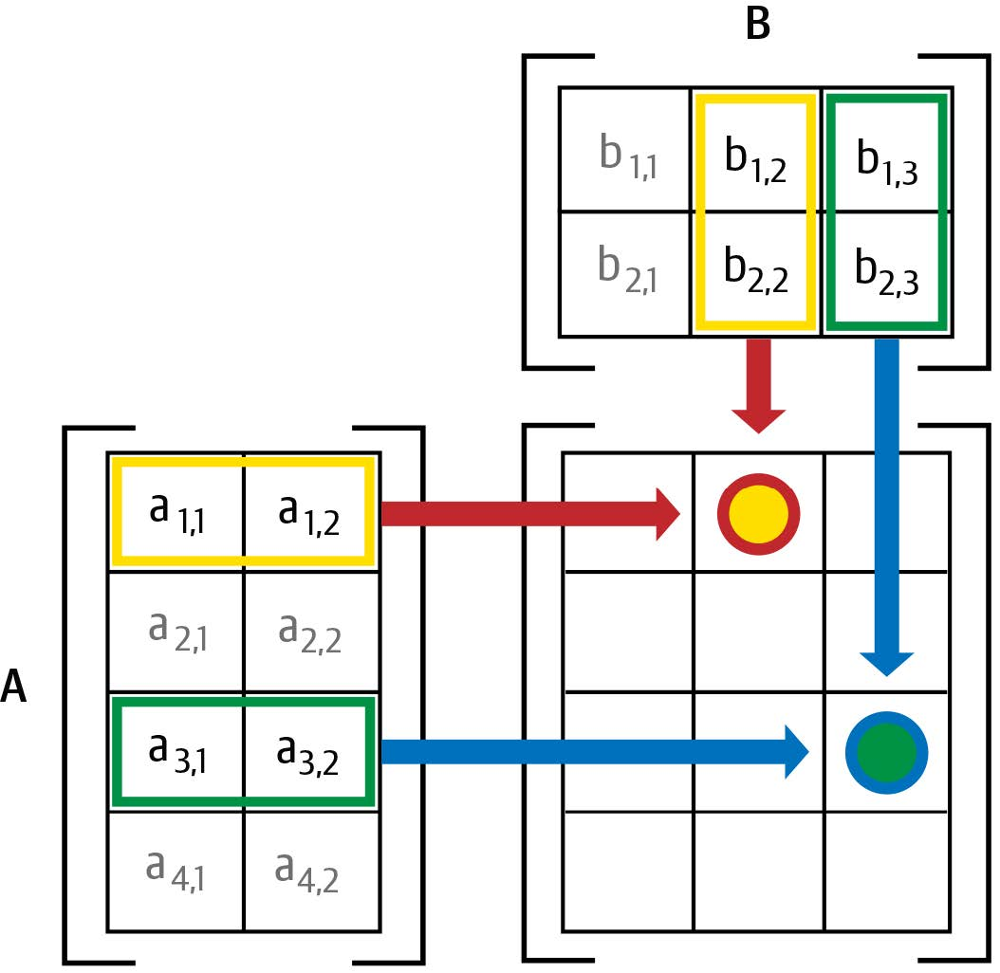

[^图4-6]: 矩阵乘法

这张图展示了两个矩阵 `A` 和 `B` 的相乘过程。结果矩阵 `AB` 的每个元素，都是通过将 `A` 矩阵对应行中的每个元素与 `B` 矩阵对应列中的每个元素相乘后求和得出的。例如，第1行第2列（带红框的黄点）的计算方式为：`a1,1 * b1,2 + a1,2 * b2,2`。若需复习矩阵乘法，建议参阅可汗学院的《矩阵乘法入门》，因这是深度学习中最核心的数学运算。

在 Python 中，矩阵乘法使用 `@` 运算符表示。让我们试试看：

```python
def linear1(xb): return xb@weights + bias
preds = linear1(train_x)
preds
```

```text
tensor([[20.2336],
	[17.0644],
	[15.2384],
	...,
	[18.3804],
	[23.8567],
	[28.6816]], grad_fn=<AddBackward0>)
```

第一个元素与我们之前计算的结果一致，这符合预期。这个公式——`批量 @ 权重 + 偏置`——是任何神经网络的两个基本公式之一（另一个是激活函数，我们稍后会看到）。

让我们检查准确性。要判断输出是3还是7，只需检查它是否大于0，因此每个元素的准确率可通过广播运算（无需循环！）按以下方式计算：

```python
corrects = (preds>0.0).float() == train_y
corrects
```

```text
tensor([[ True],
	[ True],
	[ True],
	...,
	[False],
	[False],
	[False]])
```

```python
corrects.float().mean().item()
```

```text
0.4912068545818329
```

现在让我们看看当其中一个权重发生微小变化时，准确率的变化情况：

```python
weights[0] *= 1.0001

preds = linear1(train_x)
((preds>0.0).float() == train_y).float().mean().item()
```

```text
0.4912068545818329
```

正如我们所见，要使用梯度下降法改进模型，我们需要梯度；而要计算梯度，则需要一个能反映模型优劣的损失函数。这是因为梯度衡量的是当权重发生微小调整时，损失函数的变化程度。

因此，我们需要选择一个损失函数。最直接的方法是将准确率（即我们的评估指标）直接作为损失函数。在这种情况下，我们将对每张图像进行预测计算，收集这些预测值以计算整体准确率，然后根据该整体准确率计算每个权重的梯度。

很遗憾，我们这里遇到了一个严重的技术问题。函数的梯度即其斜率或陡度，可定义为纵坐标变化量除以横坐标变化量——即函数值上升或下降的幅度除以输入值的变化量。数学表达式如下：

```python
(y_new – y_old) / (x_new – x_old)
```

当 `x_new` 与 `x_old` 非常相似时，即两者差异极小时，这种方法能很好地近似梯度值。但准确率仅在预测值从3变为7或从7变为3时才会发生变化。问题在于：权重从 `x_old` 到 `x_new` 的微小变化通常不会引发预测结果改变，因此 `(y_new – y_old)` 几乎总是等于 0。换言之，梯度在绝大多数位置都趋近于零。

权重值的微小变化通常不会改变准确率。这意味着将准确率作为损失函数毫无意义——若采用此方法，绝大多数情况下梯度值将为零，模型将无法从该数值中学习。

> SYLVAIN说
>
> 从数学角度而言，精度是一个几乎处处恒定的函数（仅在阈值0.5处例外），因此其导数几乎处处为零（在阈值处为无穷大）。这导致梯度值要么为零要么为无穷大，对模型更新毫无用处。

相反，我们需要一种损失函数，当权重带来略微更好的预测时，它能产生略微更小的损失。那么“略微更好的预测”具体是什么样子的呢？在这种情况下，这意味着：如果正确答案是3，分数会略高一些；如果正确答案是7，分数会略低一些。

现在我们来编写这样一个函数。它应该采用什么形式？

损失函数接收的不是图像本身，而是模型给出的预测结果。因此我们定义一个参数 `prds`，其取值范围在 0 到 1 之间，每个值代表模型预测某张图像为 3 的概率。这是一个向量（即阶数为 1 的张量），通过图像索引进行映射。

损失函数的目的是衡量预测值与真实值（即目标值，又称标签）之间的差异。因此，我们再创建一个名为 `trgts` 的参数，其值为 0 或 1，用于指示图像是否实际属于类别 3。它同样是一个向量（即另一个阶数为 1 的张量），通过图像索引进行标记。

例如，假设我们有三张已知数字为3、7和3的图像。假设模型以高置信度（`0.9`）预测第一张是3，以较低置信度（`0.4`）预测第二张是7，并以中等置信度（`0.2`）错误预测最后一张是7。这意味着损失函数将接收以下值作为输入：

```python
trgts = tensor([1,0,1])
prds = tensor([0.9, 0.4, 0.2])
```

以下是我们首次尝试设计的损失函数，用于衡量 `predictions` 与 `targets` 之间的距离：

```python
def mnist_loss(predictions, targets):
    return torch.where(targets==1, 1-predictions, predictions).mean()
```

我们正在使用一个新函数 `torch.where(a,b,c)`。它相当于运行列表推导式 `[b[i] if a[i] else c[i] for i in range(len(a))]`，但能在张量上以C/CUDA速度运行。通俗来说，该函数会测量每个预测值与理想值1之间的距离（当预测值应为1时），以及与理想值0之间的距离（当预测值应为0时），最终计算所有距离的平均值。

> 读读文档吧
>
> 了解PyTorch这类函数至关重要，因为在Python中遍历张量时，其运行速度取决于Python而非C/CUDA！现在请尝试运行 `help(torch.where)` 查看该函数文档，或者更推荐直接访问PyTorch文档网站查阅。

让我们在 `prds` 和 `trgts` 上试试看：

```python
torch.where(trgts==1, 1-prds, prds)
```

```text
tensor([0.1000, 0.4000, 0.8000])
```

可以看出，当预测更准确时，该函数返回的数值更低；当准确预测更可靠（绝对值更高）时，返回值更低；当不准确预测更不可靠时，返回值同样更低。在PyTorch中，我们始终认为损失函数的数值越低越好。由于最终损失需要一个标量值，`mnist_loss` 会取前一个张量的均值：

```python
mnist_loss(prds,trgts)
```

```text
tensor(0.4333)
```

例如，如果我们将对某个“错误”目标的预测值从 `0.2` 改为 `0.8` ，损失值就会下降，这表明该预测更准确：

```python
mnist_loss(tensor([0.9, 0.4, 0.8]),trgts)
```

```text
tensor(0.2333)
```

当前我们定义的 `mnist_loss` 存在一个问题，即它假设预测值始终在0到1之间。因此我们需要确保实际情况确实如此！恰巧存在一个能实现此功能的函数——让我们来看看。

#### Sigmoid函数

`sigmoid` 函数始终输出介于 0 到 1 之间的数值。其定义如下：

```python
def sigmoid(x): return 1/(1+torch.exp(-x))
```

PyTorch 为我们定义了一个加速版本，因此我们实际上不需要自己实现。这是深度学习中的一个重要函数，因为我们经常需要确保数值在 0 到 1 之间。它的实现如下：

```python
plot_function(torch.sigmoid, title='Sigmoid', min=-4, max=4)
```

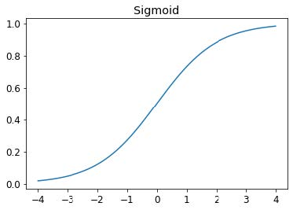

如你所见，它能将任何输入值（无论是正数还是负数）平滑转换为0到1之间的输出值。这条平滑曲线仅呈上升趋势，这使得梯度下降法更容易找到有意义的梯度。

让我们更新 `mnist_loss`，使其首先对输入应用 `sigmoid` 函数：

```python
def mnist_loss(predictions, targets):
    predictions = predictions.sigmoid()
    return torch.where(targets==1, 1-predictions, predictions).mean()
```

现在我们可以确信，即使预测值不在0到1之间，损失函数依然有效。唯一的要求是：更高的预测值对应更高的置信度。

在定义了损失函数之后，现在正是回顾我们为何这样做的最佳时机。毕竟我们原本已有整体准确率这一度量指标，那么为何还要定义损失函数呢？

关键区别在于：度量标准旨在驱动人类理解，而损失函数则用于驱动自动学习。要实现自动学习，损失函数必须是具有有效导数的函数。它不能存在大面积平坦区段和剧烈跳变，而必须保持合理平滑。因此我们设计了能对置信度微小变化作出响应的损失函数。该要求意味着损失函数有时无法完全体现我们的实际目标，而是我们在真实目标与可通过梯度优化的函数之间做出的折中。系统会为数据集中的每个项目计算损失值，并在每个训练周期结束时对所有损失值取平均，最终报告该周期的整体均值。

另一方面，指标是我们关注的数字。这些值会在每个训练迭代轮次结束时输出，用于评估模型表现。在判断模型性能时，我们必须学会关注这些指标而非损失值。

#### SGD 和小批量训练

既然我们已经有了适合驱动SGD的损失函数，就可以考虑学习过程下一阶段涉及的细节了——即根据梯度来改变或更新权重。这被称为优化步骤（optimization step）。

要执行优化步骤，我们需要计算一个或多个数据项的损失值。该使用多少个数据项呢？我们可以对整个数据集进行计算并取平均值，也可以仅对单个数据项计算。但这两种方法都不理想。计算整个数据集的损失值耗时过长；仅计算单个数据项的损失值又无法充分利用信息，导致梯度不精确且不稳定。这样做虽然费力更新权重，却只考虑了模型在该单个数据项上性能的提升。

因此我们采取折中方案：每次计算少量数据项的平均损失值。这被称为小批量（mini-batch）。小批量中的数据项数量称为批量大小。更大的批量意味着你能从损失函数中获得更精确、更稳定的数据集梯度估计，但训练耗时更长，每个迭代轮次处理的迷你批次数量也会减少。选择合适的批量大小是深度学习从业者为快速准确训练模型必须做出的决策之一。本书将探讨如何做出这个选择。

使用小批量训练而非对单个数据项计算梯度的另一个重要原因在于：实际训练中我们几乎总是在GPU等加速器上进行。这类加速器只有在同时处理大量任务时才能发挥高效性能，因此为其提供海量数据进行处理非常有益。使用小批量处理正是实现这一目标的最佳方式之一。但需注意，若一次性提供过多数据，加速器将面临内存不足的困境——让GPU高效运转同样需要技巧！

正如你在第二章关于数据增强的讨论中所见，若能在训练过程中引入变量，我们就能获得更好的泛化能力。其中一种简单而有效的方法，就是改变每个小批次中包含的数据项。与其在每个迭代轮次期间按顺序遍历数据集，我们通常的做法是在创建小批次前随机打乱数据集顺序。PyTorch 和 fastai 提供了一个名为 `DataLoader` 的类，它能自动完成数据打乱和小批次整理工作。

`DataLoader` 可接收任何 Python 集合，并将其转换为遍历多个批次的迭代器，例如：

```python
coll = range(15)
dl = DataLoader(coll, batch_size=5, shuffle=True)
list(dl)
```

```text
[tensor([ 3, 12, 8, 10, 2]),
tensor([ 9, 4, 7, 14, 5]),
tensor([ 1, 13, 0, 6, 11])]
```

训练模型时，我们需要的并非任意Python集合，而是包含自变量和因变量（即模型的输入与目标）的集合。在PyTorch中，包含自变量与因变量元组的集合称为数据集（`Dataset`）。以下是一个极其简单的数据集示例：

```python
ds = L(enumerate(string.ascii_lowercase))
ds
```

```text
(#26) [(0, 'a'),(1, 'b'),(2, 'c'),(3, 'd'),(4, 'e'),(5, 'f'),(6, 'g'),(7,
> 'h'),(8, 'i'),(9, 'j')...]
```

当我们将 `Dataset` 传递给 `DataLoader` 时，我们会得到许多批次，这些批次本身是张量元组，代表着独立变量和依赖变量的批次：

```python
dl = DataLoader(ds, batch_size=6, shuffle=True)
list(dl)
```

```text
[(tensor([17, 18, 10, 22, 8, 14]), ('r', 's', 'k', 'w', 'i', 'o')),
(tensor([20, 15, 9, 13, 21, 12]), ('u', 'p', 'j', 'n', 'v', 'm')),
(tensor([ 7, 25, 6, 5, 11, 23]), ('h', 'z', 'g', 'f', 'l', 'x')),
(tensor([ 1, 3, 0, 24, 19, 16]), ('b', 'd', 'a', 'y', 't', 'q')),
(tensor([2, 4]), ('c', 'e'))]
```

现在，我们准备使用SGD编写模型的第一个训练循环！

### 整合所有内容

现在是时候实现图4-1中所示的过程了。在代码中，我们的过程将在每个迭代轮次中以类似以下方式实现：

```python
for x,y in dl:
    pred = model(x)
    loss = loss_func(pred, y)
    loss.backward()
    parameters -= parameters.grad * lr
```

首先，让我们重新初始化参数：

```python
weights = init_params((28*28,1))
bias = init_params(1)
```

`DataLoader` 可从 `Dataset` 创建：

```python
dl = DataLoader(dset, batch_size=256)
xb,yb = first(dl)
xb.shape,yb.shape
```

```text
(torch.Size([256, 784]), torch.Size([256, 1]))
```

我们将对验证集执行相同的操作：

```python
valid_dl = DataLoader(valid_dset, batch_size=256)
```

让我们创建一个大小为4的小批次用于测试：

```python
batch = train_x[:4]
batch.shape
```

```text
torch.Size([4, 784])
```

```python
preds = linear1(batch)
preds
```

```text
tensor([[-11.1002],
	[ 5.9263],
	[ 9.9627],
	[ -8.1484]], grad_fn=<AddBackward0>)
```

```python
loss = mnist_loss(preds, train_y[:4])
loss
```

```text
tensor(0.5006, grad_fn=<MeanBackward0>)
```

现在我们可以计算梯度：

```python
loss.backward()
weights.grad.shape,weights.grad.mean(),bias.grad
```

```text
(torch.Size([784, 1]), tensor(-0.0001), tensor([-0.0008]))
```

让我们把这些都封装到一个函数中：

```python
def calc_grad(xb, yb, model):
    preds = model(xb)
    loss = mnist_loss(preds, yb)
    loss.backward()
```

然后测试一下：

```python
calc_grad(batch, train_y[:4], linear1)
weights.grad.mean(),bias.grad
```

```text
(tensor(-0.0002), tensor([-0.0015]))
```

但看我们调用两次会发生什么：

```python
calc_grad(batch, train_y[:4], linear1)
weights.grad.mean(),bias.grad
```

```text
(tensor(-0.0003), tensor([-0.0023]))
```

梯度发生了变化！这是因为`loss.backward`会将 `loss` 的梯度添加到当前存储的任何梯度中。因此，我们必须先将当前梯度设置为0：

```python
weights.grad.zero_()
bias.grad.zero_();
```

> 原地操作(IN-PLACE OPERATIONS)
>
> PyTorch 中名称以下划线结尾的方法会就地修改其对象。例如，`bias.zero_` 将张量 `bias` 的所有元素设置为 `0`。

我们仅剩的步骤是根据梯度和学习率更新权重与偏置。执行此操作时，必须告知PyTorch不要对该步骤求导——否则在计算下一批次的导数时会导致混乱！若对张量的 `data` 属性进行赋值，PyTorch将不会对该步骤求导。以下是我们一个迭代轮次的基本训练循环：

```python
def train_epoch(model, lr, params):
    for xb,yb in dl:
        calc_grad(xb, yb, model)
        for p in params:
            p.data -= p.grad*lr
            p.grad.zero_()
```

我们还想通过验证集的准确率来检验模型表现。判断输出值代表3还是7时，只需检查其是否大于0。因此每个元素的准确率可通过广播运算（无需循环！）按以下方式计算：

```python
(preds>0.0).float() == train_y[:4]
```

```text
tensor([[False],
	[ True],
	[ True],
	[False]])
```

这便为我们提供了用于计算验证准确率的函数：

```python
def batch_accuracy(xb, yb):
    preds = xb.sigmoid()
    correct = (preds>0.5) == yb
    return correct.float().mean()
```

我们来测一下能不能正常运行：

```python
batch_accuracy(linear1(batch), train_y[:4])
```

```text
tensor(0.5000)
```

然后将批次合并：

```python
def validate_epoch(model):
    accs = [batch_accuracy(model(xb), yb) for xb,yb in valid_dl]
    return round(torch.stack(accs).mean().item(), 4)

validate_epoch(linear1)
```

```text
0.5219
```

这就是我们的起点。让我们训练一个迭代轮次，看看准确率是否有所提升：

```python
lr = 1.
params = weights,bias
train_epoch(linear1, lr, params)
validate_epoch(linear1)
```

```text
0.6883
```

再做几个：

```python
for i in range(20):
    train_epoch(linear1, lr, params)
    print(validate_epoch(linear1), end=' ')
```

```text
0.8314 0.9017 0.9227 0.9349 0.9438 0.9501 0.9535 0.9564 0.9594 0.9618
0.9613
> 0.9638 0.9643 0.9652 0.9662 0.9677 0.9687 0.9691 0.9691 0.9696
```

看起来不错！我们已经达到了与“像素相似度”方法相当的精度，并且构建了一个可供扩展的通用基础框架。下一步我们将创建一个对象来处理梯度下降步骤。在PyTorch中，这个对象被称为优化器（optimizer）。

#### 创建优化器

由于这是如此基础的通用框架，PyTorch提供了一些实用类来简化实现过程。首先我们可以将线性函数替换为PyTorch的 `nn.Linear` 模块。模块是继承自PyTorch `nn.Module` 类的对象。该类的对象行为与标准Python函数完全一致，即通过括号调用时，它们将返回模型的激活值。

`nn.Linear` 实现了 `init_params` 和 `linear` 的组合功能。它将权重和偏置整合到单个类中。以下是复制上一节模型的实现方式：

```python
linear_model = nn.Linear(28*28,1)
```

每个PyTorch模块都清楚自身可训练的参数；这些参数可通过 `parameters` 方法获取：

```python
w,b = linear_model.parameters()
w.shape,b.shape
```

```text
(torch.Size([1, 784]), torch.Size([1]))
```

我们可以利用这些信息创建一个优化器：

```python
class BasicOptim:
    def __init__(self,params,lr): self.params,self.lr = list(params),lr
    
    def step(self, *args, **kwargs):
        for p in self.params: p.data -= p.grad.data * self.lr
        
    def zero_grad(self, *args, **kwargs):
        for p in self.params: p.grad = None
```

我们可以传递模型的参数来创建优化器：

```python
opt = BasicOptim(linear_model.parameters(), lr)
```

我们的训练循环现在可以简化为：

```python
def train_epoch(model):
    for xb,yb in dl:
        calc_grad(xb, yb, model)
        opt.step()
        opt.zero_grad()
```

我们的验证函数完全不需要改变：

```python
validate_epoch(linear_model)
```

```text
0.4157
```

让我们把这个小训练循环封装成函数，这样会更简洁：

```python
def train_model(model, epochs):
    for i in range(epochs):
        train_epoch(model)
        print(validate_epoch(model), end=' ')
```

结果与上一节相同：

```python
train_model(linear_model, 20)
```

```text
0.4932 0.8618 0.8203 0.9102 0.9331 0.9468 0.9555 0.9629 0.9658 0.9673
0.9687
> 0.9707 0.9726 0.9751 0.9761 0.9761 0.9775 0.978 0.9785 0.9785
```

fastai 提供了 `SGD` 类，默认情况下，它与我们的 `BasicOptim` 实现相同功能：

```python
linear_model = nn.Linear(28*28,1)
opt = SGD(linear_model.parameters(), lr)
train_model(linear_model, 20)
```

```text
0.4932 0.852 0.8335 0.9116 0.9326 0.9473 0.9555 0.9624 0.9648 0.9668
0.9692
> 0.9712 0.9731 0.9746 0.9761 0.9765 0.9775 0.978 0.9785 0.9785
```

fastai 还提供了 `Learner.fit` 方法，我们可以使用它来替代 `train_model`。要创建一个 `Learner`，我们首先需要创建 `DataLoaders`，通过传入我们的训练集和验证集 `DataLoaders`：

```python
dls = DataLoaders(dl, valid_dl)
```

要创建一个无需应用程序（如 `cnn_learner`）的 `Learner`，我们需要传入本章创建的所有元素： `DataLoaders` 、模型、优化函数（将接收参数）、损失函数，以及可选的打印指标：

```python
learn = Learner(dls, nn.Linear(28*28,1), opt_func=SGD,
loss_func=mnist_loss, metrics=batch_accuracy)
```

现在我们可以调用 `fit`：

```python
learn.fit(10, lr=lr)
```

| 迭代轮次 | 训练损失 | 验证损失 | 批准确度 | 时间  |
| -------- | -------- | -------- | -------- | ----- |
| 0        | 0.636857 | 0.503549 | 0.495584 | 00:00 |
| 1        | 0.545725 | 0.170281 | 0.866045 | 00:00 |
| 2        | 0.199223 | 0.184893 | 0.831207 | 00:00 |
| 3        | 0.086580 | 0.107836 | 0.911187 | 00:00 |
| 4        | 0.045185 | 0.078481 | 0.932777 | 00:00 |
| 5        | 0.029108 | 0.062792 | 0.946516 | 00:00 |
| 6        | 0.022560 | 0.053017 | 0.955348 | 00:00 |
| 7        | 0.019687 | 0.046500 | 0.962218 | 00:00 |
| 8        | 0.018252 | 0.041929 | 0.965162 | 00:00 |
| 9        | 0.017402 | 0.038573 | 0.967615 | 00:00 |

如你所见，PyTorch 和 fastai 的类并没有什么神奇之处。它们只是预先打包的便捷组件，能让你的工作轻松不少！（它们还提供了许多额外功能，我们将在后续章节中使用。）

借助这些课程，我们现在可以将线性模型替换为神经网络。

### 添加非线性项

到目前为止，我们已经建立了一个优化函数参数的通用流程，并将其应用于一个简单的线性分类器——这种分类器在功能上存在局限性。要使其更复杂（并能处理更多任务），我们需要在两个线性分类器之间添加非线性元素（即不同于ax+b的形式）——这正是神经网络的本质所在。

以下是基本神经网络的完整定义：

```python
def simple_net(xb):
    res = xb@w1 + b1
    res = res.max(tensor(0.0))
    res = res@w2 + b2
    return res
```

就是这样！`simple_net` 中只有两个线性分类器，它们之间连接了一个 `max` 函数。

此处，`w1` 和 `w2` 是权重张量，`b1` 和 `b2` 是偏置张量；即，这些参数最初是随机初始化的，正如我们在上一节中所做的那样：

```python
w1 = init_params((28*28,30))
b1 = init_params(30)
w2 = init_params((30,1))
b2 = init_params(1)
```

关键点在于 `w1` 有30个输出激活（这意味着 `w2` 必须有30个输入激活，因此两者匹配）。这意味着第一层能够构建30种不同的特征，每种特征代表不同像素组合。你可以将这个 `30` 改为任意值，从而调整模型的复杂程度。

那个小小的函数 `res.max(tensor(0.0))` 被称为整流线性单元（rectified linear unit），也称 ReLU。我们都认同“整流线性单元”听起来相当高深复杂……但实际上它不过就是 `res.max(tensor(0.0))` ——换句话说，就是把所有负数替换为零。这个微小函数在PyTorch中也以 `F.relu` 的形式提供：

```python
plot_function(F.relu)
```

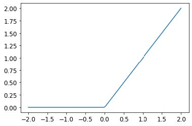

> JEREMY说
>
> 深度学习领域存在大量专业术语，例如整流线性单元（rectified linear unit）等。正如本例所示，绝大多数术语的复杂程度其实只需一行简短代码即可实现。现实情况是，学者们为发表论文需要让内容显得尽可能高深精妙，而引入专业术语正是常用手段。遗憾的是，这导致该领域显得远比实际更令人望而生畏、难以入门。学习术语确实必要，否则论文和教程对你而言将毫无意义。但这并不意味着你需要畏惧术语。只需记住：当遇到陌生词汇时，它们几乎必然指向极其简单的概念。

我们的基本思路是通过增加线性层的数量，使模型进行更多计算，从而能够拟合更复杂的函数。但直接将多个线性层串联起来毫无意义，因为当我们反复进行乘法运算后再累加时，完全可以用不同项相乘后仅累加一次的方式替代！也就是说，任意数量的线性层串联结构，都可以用参数不同的单个线性层来替代。

但若在它们之间插入非线性函数（如 `max` 函数），上述关系便不再成立。此时每个线性层与其他层基本解耦，能够独立完成其特定任务。 `max` 函数尤为有趣，因为它本质上相当于一个简单的 `if` 语句。

> SYLVAIN说
>
> 从数学角度而言，两个线性函数的复合仍是一个线性函数。因此，我们可以随意堆叠多个线性分类器，只要它们之间不包含非线性函数，其效果就等同于单个线性分类器。

令人惊叹的是，数学上可以证明：只要找到 `w1` 和 `w2` 的正确参数，并使这些矩阵足够大，这个小函数就能以任意高的精度解决任何可计算问题。对于任意扭曲的函数，我们都可以将其近似为多条连线组合而成；要使其更接近波浪函数，只需使用更短的线条即可。；要使其更接近原始曲线，只需使用更短的直线即可。这被称为通用逼近定理（universal approximation theorem）。我们这里的三行代码被称为层（layers）。第一层和第三层称为线性层（linear layers），而第二行代码则被称为非线性函数（nonlinearity）或激活函数（activation function）。

与上一节相同，我们可以通过利用 PyTorch 的特性，用更简洁的代码替代这段代码。

```python
simple_net = nn.Sequential(
    nn.Linear(28*28,30),
    nn.ReLU(),
    nn.Linear(30,1)
)
```

`nn.Sequential` 会创建一个模块，该模块将依次调用列出的各个层或函数。

`nn.ReLU` 是 PyTorch 中的一个模块，其功能与 `F.relu` 函数完全相同。模型中可用的多数函数都有对应的模块形式。通常只需将 `F` 替换为 `nn` 并调整大小写即可。使用`nn.Sequential` 时，PyTorch要求采用模块版本。由于模块属于类，我们需要进行实例化，因此本例中使用 `nn.ReLU` 。

由于 `nn.Sequential` 是模块，我们可以获取其参数，该操作将返回其所包含所有模块的完整参数列表。让我们试试看！由于这是更深层的模型，我们将采用更低的学习率并增加几个迭代轮次：

```python
learn = Learner(dls, simple_net, opt_func=SGD,
                loss_func=mnist_loss, metrics=batch_accuracy)
```

```python
learn.fit(40, 0.1)
```

为节省篇幅，我们在这里没有展示40行输出结果；训练过程已记录于 `learn.recorder` 文件中，输出表格存储在 `values` 属性内，因此我们可以绘制训练过程中的准确率曲线：

```python
plt.plot(L(learn.recorder.values).itemgot(2));
```

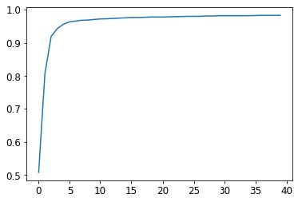

我们可以查看最终的准确率：

```python
learn.recorder.values[-1][2]
```

```text
0.982826292514801
```

此时此刻，我们拥有某种相当神奇的东西：

- 一个能够以任意精度解决任何问题的函数（神经网络），前提是拥有正确的参数集
- 一种为任意函数寻找最佳参数集的方法（随机梯度下降）

这就是深度学习能创造如此惊人成果的原因。我们发现许多学生必须迈出的最大一步就是相信这些简单的技术组合真的能解决任何问题。这似乎好得难以置信——事情肯定比这更困难复杂吧？我们的建议是：亲自动手试试！我们刚刚在MNIST数据集上进行了验证，你已看到结果。由于我们全程亲手实现（梯度计算除外），你完全可以确信背后不存在任何特殊魔法。

#### 深入探索

我们没有必要仅限于两个线性层。只要在每对线性层之间添加非线性变换，我们就可以随意增加层数。然而正如你将了解到的那样，模型越深，实际优化参数就越困难。本书后续章节将介绍一些简单却极具成效的深度模型训练技巧。

我们已知单个非线性函数配合两个线性层便足以近似任意函数。那么为何还要使用更深的模型？关键在于性能表现。采用更深的模型（即更多层结构）时，我们无需使用过多参数；实践证明，使用较小矩阵搭配更多层结构，反而能获得优于大矩阵少层结构的预测效果。

这意味着我们可以更快地训练模型，且占用的内存更少。在1990年代，研究人员过于专注于普遍逼近定理，鲜少有人尝试使用多个非线性函数。这种理论性强而实用性弱的基础理论，使该领域发展停滞了多年。然而部分研究者仍坚持探索深度模型，最终成功证明这些模型在实际应用中表现更优。随后理论研究揭示了其背后的原理。如今，仅采用单一非线性变换的神经网络已极为罕见。

当我们使用与第1章相同的方法训练一个18层模型时，会发生以下情况：

```python
dls = ImageDataLoaders.from_folder(path)
learn = cnn_learner(dls, resnet18, pretrained=False,
                    loss_func=F.cross_entropy, metrics=accuracy)
learn.fit_one_cycle(1, 0.1)
```

| 迭代轮次 | 训练损失 | 验证损失 | 准确度   | 时间  |
| -------- | -------- | -------- | -------- | ----- |
| 0        | 0.082089 | 0.009578 | 0.997056 | 00:11 |

近乎100%的准确率！这与我们简单的神经网络相比有着天壤之别。但正如你在本书后续内容中将了解到的那样，只需掌握几个小技巧，你就能从零开始获得如此出色的结果。你已经掌握了关键的基础知识。（当然，即使你精通所有技巧，也几乎总是会选择使用PyTorch和fastai提供的预构建类，因为它们能让你免于亲自处理所有细节。）

### 术语回顾

恭喜：你现在已经掌握了从零开始创建并训练深度神经网络的方法！我们经历了相当多的步骤才走到这一步，但你可能会惊讶于它实际上是多么简单。

既然我们已走到这一步，现在正是定义并回顾一些术语和关键概念的好时机。

神经网络包含大量数字，但它们仅分为两类：计算出的数值，以及用于计算这些数值的参数。这为我们提供了需要掌握的两个最重要的术语：

- 激活值（Activations）

  经计算得出的数值（包括线性层与非线性层计算结果）

- 参数（Parameters）

  随机初始化并经过优化的数值（即定义模型的数值）

在本书中，我们将频繁讨论激活值和参数。请牢记它们具有特定含义——它们是数值。这些并非抽象概念，而是模型中实际存在的具体数值。成为优秀的深度学习实践者，关键在于养成观察激活函数与参数的习惯，通过绘制图表来检验它们是否正常运作。

我们的激活值和参数都封装在张量（tensors）中。这些本质上是形状规则的数组——例如矩阵。矩阵具有行和列，我们称之为轴（axes）或维度（dimensions.）。张量的维数即为其阶数（rank）。存在一些特殊张量：

- 0阶：标量（scalar）
- 1阶：向量（vector）
- 2阶：矩阵（matrix）

神经网络包含多个层。每层要么是线性（linear）的，要么是非线性（nonlinear）的。我们通常在神经网络中交替使用这两种层。有时人们将线性层及其后续的非线性层统称为单一层。是的，这确实容易混淆。有时非线性层也被称为激活函数（activation function）。

表4-1总结了与梯度下降法（SGD）相关的关键概念。

| 英文原文         | 术语     | 含义                                                         |
| ---------------- | -------- | ------------------------------------------------------------ |
| ReLU             | ReLU函数 | 一种对负数返回0，并对正数保持不变的函数。                    |
| Mini-batch       | 小批次   | 一小批输入和标签被聚合到两个数组中。梯度下降步长在此批次上进行更新（而非整个迭代轮次）。 |
| Forward pass     | 前向传播 | 将模型应用于某些输入并计算预测结果。                         |
| Loss             | 损失     | 一个代表模型表现优劣的值。                                   |
| Gradient         | 梯度     | 模型中某参数对损失的导数。                                   |
| Backward pass    | 反向传播 | 计算损失函数对所有模型参数的梯度。                           |
| Gradient descent | 梯度下降 | 沿着与梯度相反的方向移动一步，使模型参数略微得到改进。       |
| Learning rate    | 学习率   | 在应用梯度下降法更新模型参数时，我们采取的步长大小           |

> 提醒：选择你自己的冒险
>
> 你是否因迫不及待想一探究竟而跳过了第二章和第三章？那么，现在就提醒你：请立刻返回第二章，因为你很快就会需要这些知识！

### 问卷调查

1. 计算机如何表示灰度图像？彩色图像呢？
2. `MNIST_SAMPLE` 数据集中的文件和文件夹是如何组织的？原因何在？

3. 解释基于“像素相似度”的数字分类方法如何运作。
4. 什么是列表推导式？请创建一个从列表中筛选奇数并将其翻倍的示例。
5. 什么是三阶张量？

6. 张量的阶数与形状有何区别？如何从形状中获取阶数？
7. RMSE和L1范数是什么？
8. 如何对数千个数字同时进行计算，且计算速度比Python循环快数千倍？
9. 创建一个包含1到9的3×3张量或数组。将其翻倍。选取右下角四个数字。

10. 什么是广播？
11. 评估指标通常使用训练集还是验证集计算？为什么？

12. 什么是随机梯度下降（SGD）？
13. SGD为何采用小批量训练？
14. 机器学习中SGD的七个步骤是什么？
15. 如何初始化模型权重？
16. 什么是损失？
17. 为何不能始终使用高学习率？
18. 什么是梯度？
19. 你是否需要掌握梯度计算方法？
20. 为何不能将准确率作为损失函数？
21. 绘制sigmoid函数曲线。其形状有何特殊性？
22. 损失函数与度量指标有何区别？
23. 使用学习率计算新权重的函数是什么？
24. `DataLoader` 类的作用是什么？
25. 编写伪代码展示SGD在每个迭代轮次中的基本步骤。
26. 创建一个函数，如果传入两个参数 `[1,2,3,4]` 和 `'abcd'` 之后返回了 `[(1, ‘a’), (2, ‘b’), (3, ‘c’), (4, ‘d’)]` ，该输出数据结构有何特殊之处？

27. PyTorch 中 `view` 方法的作用是什么？
28. 神经网络中的偏置参数是什么？为何我们需要它们？

29. Python中的 `@` 运算符有何作用？
30. `backward` 方法执行什么操作？
31. 为什么需要将梯度归零？
32. 训练模型时需向 `Learner` 传递哪些参数？
33. 请用Python或伪代码展示训练循环的基本步骤。
34. 什么是ReLU？请绘制其在 `-2` 到 `+2` 区间内的曲线图。
35. 什么是激活函数？
36. `F.relu` 与 `nn.ReLU` 之间有何区别？
37. 普适逼近定理表明仅用单个非线性函数即可任意精确地逼近任意函数。那么为什么我们通常使用多个？

#### 进一步探究

1. 基于本章展示的训练循环，从零开始实现你自己的 `Learner`。
2. 使用完整的MNIST数据集（所有数字，不仅限于3和7）完成本章所有步骤。这是个重大项目，完成它需要花费相当多的时间！你需要自行开展研究，以解决过程中遇到的各种障碍。
