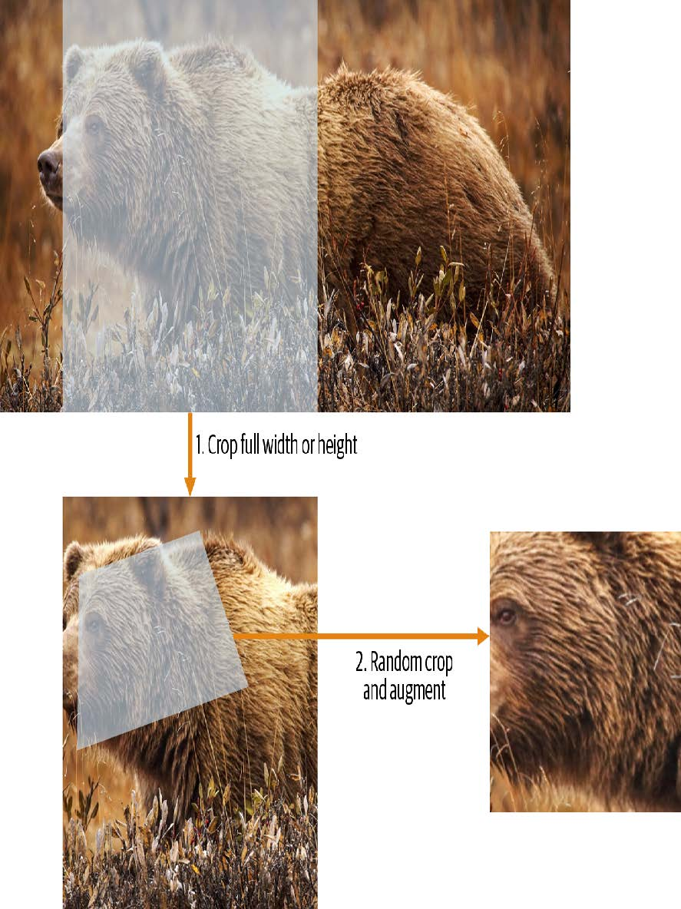
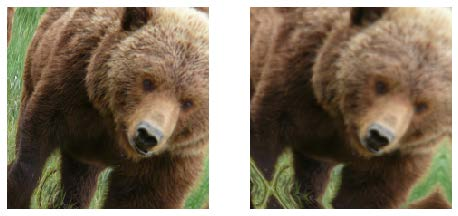
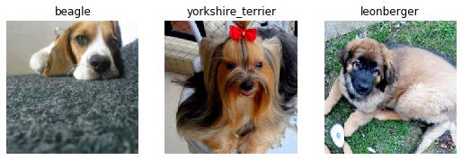
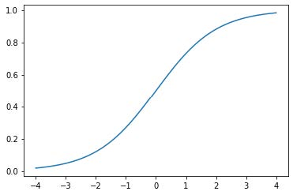
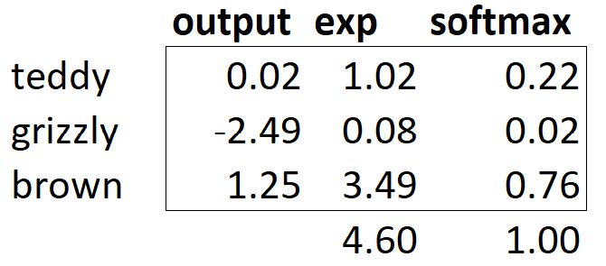

## 5. 图像分类

既然你已经理解了深度学习的本质、应用场景以及如何创建和部署模型，现在是时候深入探索了！在理想状态下，深度学习从业者无需了解底层运作的每个细节。但现实世界远非如此。事实上，要让模型真正有效且稳定运行，你必须精准把控大量细节，并持续进行多项验证。这个过程需要你能够透视神经网络在训练和预测过程中的内部运作，发现潜在问题并掌握解决的方法。

因此，从本书此处开始，我们将深入探讨深度学习的运作机制。计算机视觉模型、自然语言处理模型、表格模型等的架构是什么？如何构建符合特定领域需求的架构？如何从训练过程中获得最佳结果？如何提升运行速度？当数据集发生变化时需要调整哪些要素？

我们将从重温第一章中探讨过的基本应用开始，但会着重实现两点：

- 优化这些应用。
- 将其应用于更广泛的数据类型。

要完成这两项任务，我们必须掌握深度学习拼图的所有组成部分。这包括不同类型的神经网络层、正则化方法、优化器、如何将层组合成网络架构、标注技术等等。不过我们不会一次性地把所有知识点倒给你，而是根据项目需求循序渐进地引入这些内容，以解决实际项目中遇到的具体问题。

### 从猫狗到宠物品种

在我们的第一个模型中，我们学会了如何区分狗和猫。就在几年前，这还被视为极具挑战性的任务——如今却变得轻而易举！我们无法通过这个案例展示模型训练的细节精妙之处，因为无需关注任何细节就能获得近乎完美的结果。但事实证明，同一数据集还能让我们攻克更艰巨的难题：识别每张图片中宠物的具体品种。

在第一章中，我们将应用场景视为已解决的问题。但现实世界并非如此运作。我们从一个完全陌生的数据集开始。接着必须摸索其构成方式，探索如何从中提取所需数据，并理解这些数据的形态特征。本书后续内容将向你展示如何在实践中解决这些问题，涵盖所有必要的过渡步骤——既要深入理解处理中的数据，又要同步验证建模过程。

我们已经下载了宠物数据集，并可通过与第1章相同的代码获取该数据集的路径：

```python
from fastai2.vision.all import *
path = untar_data(URLs.PETS)
```

若要理解如何从每张图片中提取每只宠物的品种，我们需要先了解数据的布局方式。这类数据布局细节是深度学习拼图中至关重要的一环。数据通常以以下两种形式之一提供：

- 代表数据项的独立文件，例如文本文档或图像，可能组织在文件夹中，或通过文件名体现这些项的相关信息
- 数据表格（例如CSV格式），其中每行代表一个数据项，可能包含文件名以建立表格数据与其他格式数据（如文本文档和图像）之间的关联

这些规则存在例外情况——尤其在基因组学等领域，那里可能存在二进制数据库格式甚至网络流——但总体而言，你将处理的大多数数据集都将采用这两种格式的某种组合形式。

要查看数据集中的内容，我们可以使用 `ls` 方法：

```python
path.ls()
```

```text
(#3) [Path('annotations'),Path('images'),Path('models')]
```

我们可以看到，该数据集提供了图像（images）目录和注释（annotations）目录。[数据集网站](https://oreil.ly/xveoN) 说明注释目录包含宠物位置信息而非物种信息。本章将进行分类任务而非定位任务，也就是说我们关注的是宠物的种类而非位置。因此，我们暂时忽略注释目录。现在，让我们查看图像目录：

```python
(path/"images").ls()
```

```text
(#7394)
[Path('images/great_pyrenees_173.jpg'),Path('images/wheaten_terrier_46.j
>
pg'),Path('images/Ragdoll_262.jpg'),Path('images/german_shorthaired_3.jpg'),P
>
ath('images/american_bulldog_196.jpg'),Path('images/boxer_188.jpg'),Path('ima
>
ges/staffordshire_bull_terrier_173.jpg'),Path('images/basset_hound_71.jpg'),P
>
ath('images/staffordshire_bull_terrier_37.jpg'),Path('images/yorkshire_terrie
> r_18.jpg')...]
```

fastai 中大多数返回集合的函数和方法都使用名为 `L` 的类。该类可视为普通 Python 列表类型的增强版本，为常见操作提供了额外便利。例如，当我们在笔记本中显示该类对象时，其呈现格式如上面所示。首先显示的是集合中项的数量，前缀为 `#`。在前面的输出中，你还会注意到列表末尾带有省略号。这意味着仅显示了前几个元素——这其实是件好事，毕竟我们可不想在屏幕上看到超过7000个文件名！

通过分析这些文件名，我们可以看出它们的结构特征。每个文件名包含宠物品种名称，随后是一个下划线（`_`），接着是一个数字，最后是文件扩展名。我们需要编写一段代码从单个路径中提取品种信息。Jupyter笔记本能轻松实现这一点，因为我们可以逐步构建出可用的功能模块，然后将其应用于整个数据集。此时我们必须十分谨慎，避免过早下结论。例如你仔细观察会发现，某些宠物品种名称包含多个单词，因此不能简单地在首个下划线处截断。为了验证我们的代码，我们选取其中一个文件名：

```python
fname = (path/"images").ls()[0]
```

从这类字符串中提取信息的最强大且灵活的方式是使用 *正则表达式*（regular expression，也称为regex）。正则表达式是一种特殊的字符串，采用正则表达式语言编写，用于定义通用规则来判定另一个字符串是否通过测试（即“匹配”该正则表达式），同时也可从中提取特定部分或多个部分。在此场景中，我们需要一个能从文件名中提取宠物品种的正则表达式。

我们在此无法提供完整的正则表达式教程，但网上有许多优秀的教程可供参考，而且我们知道许多读者早已熟悉这个强大的工具。如果你还没掌握，也完全不必担心——这正是弥补这一缺憾的绝佳机会！我们认为正则表达式是编程工具箱中最实用的工具之一，许多学员都告诉我们这是他们最期待学习的内容。现在就去谷歌搜索“正则表达式教程”吧，浏览完相关资料后再回到这里。本书官网也提供了我们精选的教程列表。

> ALEXIS说
>
> 正则表达式不仅实用性极强，其起源也颇具趣味。之所以称为“正则”，是因为它们最初是“正则语言”的范例——这种语言属于乔姆斯基层次结构中的最低层级。该语法分类体系由语言学家诺姆·乔姆斯基（Noam Chomsky）创立，他同时撰写了开创性著作《句法结构》——这部开创性著作致力于探索人类语言背后的形式语法。这正是计算机科学的魅力所在：你每日随手取用的工具，其设计理念或许源自太空飞船。

编写正则表达式时，最佳的入门方式是先用一个示例进行测试。让我们使用 `findall` 方法，将正则表达式应用于 `fname` 对象的文件名：

```python
re.findall(r'(.+)_\d+.jpg$', fname.name)
```

```text
['great_pyrenees']
```

此正则表达式提取所有位于最后一个下划线前的字符，前提是后续字符为数字，且文件后缀为JPEG格式。

既然我们已确认正则表达式适用于示例，现在就用它来标注整个数据集。fastai 提供了多种用于标注的类。对于正则表达式标注，我们可以使用 `RegexLabeller` 类。在本示例中，我们使用第2章介绍的数据块API（实际上我们几乎总是使用数据块API——它比第1章介绍的简单工厂方法灵活得多）：

```python
pets = DataBlock(blocks = (ImageBlock, CategoryBlock),
                 get_items=get_image_files,
                 splitter=RandomSplitter(seed=42),
                 get_y=using_attr(RegexLabeller(r'(.+)_\d+.jpg$'),
                                  'name'),
                 item_tfms=Resize(460),
                 batch_tfms=aug_transforms(size=224, min_scale=0.75))
dls = pets.dataloaders(path/"images")
```

这个 `DataBlock` 的调用中有两行代码是我们之前未曾见过的关键部分：

```python
item_tfms=Resize(460),
batch_tfms=aug_transforms(size=224, min_scale=0.75)
```

这些代码实现了我们称为预尺寸化（presizing）的fastai数据增强策略。预尺寸化是一种特殊的图像增强方式，旨在最大限度减少数据破坏的同时保持良好性能。

### 预尺寸化

我们需要图像具有相同的尺寸，以便它们能够组合成张量传递给GPU。同时，我们希望尽量减少执行的不同增强计算的数量。性能要求表明，我们应尽可能将增强变换组合为更少的变换（以降低计算量和有损操作次数），并将图像转换为统一尺寸（以提升GPU处理效率）。

我们的挑战在于，若在缩小至增强尺寸后执行，多种常见的数据增强变换可能会引入虚假的空白区域、降低数据质量，或两者兼而有之。例如，将图像旋转45度会使新边界范围的角落区域出现空白，这无法为模型提供任何学习信息。许多旋转和缩放操作需要通过插值生成像素。这些插值像素虽源自原始图像数据，但质量仍会降低。

为应对这些挑战，预尺寸调整采用了如图5-1所示的两种策略：

1. 将图像调整为相对“较大”的尺寸——即尺寸显著大于目标训练尺寸。
2. 将所有常见的增强操作（包括调整为最终目标尺寸）组合为一项操作，并在处理结束时仅在GPU上执行一次组合操作，而非分别执行各项操作并进行多次插值。

第一步是调整尺寸，生成足够大的图像以保留余量，从而我们能在内部区域进行进一步的增强变换而不产生空白区域。该变换通过采用大裁剪尺寸调整为正方形实现。在训练集上，裁剪区域随机选取，裁剪尺寸则选取覆盖图像宽度或高度中较小者。第二步中，所有数据增强操作均交由GPU处理，所有潜在的破坏性操作会被集中执行，并在最后进行单次插值处理。



[^图5-1]: 在训练集上预先调整尺寸

这张图展示了两个步骤：

1. 裁剪完整宽度或高度：该操作位于 `item_tfms` 中，因此在图像复制到GPU前会应用于每张图像。此步骤用于确保所有图像尺寸一致。在训练集上，裁剪区域随机选择；在验证集上，始终选择图像的中心正方形区域。
2. 随机裁剪与数据增强：该操作位于 `batch_tfms` 中，因此在GPU上对整个批次批量处理，效率极高。在验证集上，此处仅执行调整至模型所需最终尺寸的操作。而在训练集上，则优先执行随机裁剪及其他增强操作。

要在fastai中实现此流程，需将 `Resize` 作为项目转换使用较大尺寸，并将`RandomResizedCrop` 作为批量转换使用较小尺寸。若在 `aug_transforms` 函数中包含`min_scale` 参数（如前文 `DataBlock` 调用所示），系统将自动添加 `RandomResizedCrop` 。你也可在初始 `Resize` 操作中使用 `pad` 或 `squish` 替代默认的 `crop` 操作。

图5-2展示了两种图像处理方式的差异：右侧图像经过放大、插值、旋转，再进行二次插值（这是其他所有深度学习库采用的方法）；左侧图像则将放大与旋转作为单一操作处理，仅进行一次插值（fastai方法）。



[^图5-2]: fastai的数据增强策略（左）与传统方法（右）的对比

可以看出右侧图像的清晰度较低，左下角存在反射填充伪影；此外左上角的草丛已完全消失。实践表明，预尺寸处理能显著提升模型精度，同时通常还能加快处理速度。

fastai库还提供了简便的方法，可在训练模型前检查数据状态，这是极其重要的一步。接下来我们将探讨这些方法。

#### 检查和调试数据块

我们永远不能想当然地认为代码运行完美无缺。编写数据块就像绘制蓝图。代码中存在语法错误时，系统会提示报错信息，但无法保证模板能按预期处理数据源。因此在训练模型前，务必始终检查数据。

你可以使用 `show_batch` 方法实现：

```python
dls.show_batch(nrows=1, ncols=3)
```



请仔细查看每张图片，确认每张图片的标签是否与该宠物品种相符。数据科学家处理的数据往往不如领域专家熟悉：例如，我其实并不认识其中许多宠物品种。由于我并非宠物品种专家，此时我会使用谷歌图片搜索部分品种，确保图片与输出结果中的样貌相符。

如果在构建数据块时出现错误，你很可能在此步骤之前无法察觉。为了排查此类问题，我们建议你使用 `summary` 方法。该方法将尝试根据你提供的源数据创建批处理任务，并生成大量详细信息。此外，若操作失败，你将精确定位错误发生点，库文件也会尝试提供帮助。例如常见错误是忘记使用 `Resize` 转换，导致图片尺寸不统一而无法批量处理。此类情况下的摘要示例如下（注：具体文本可能随版本更新，但可供参考）：

```python
pets1 = DataBlock(blocks = (ImageBlock, CategoryBlock),
                  get_items=get_image_files,
                  splitter=RandomSplitter(seed=42),
                  get_y=using_attr(RegexLabeller(r'(.+)_\d+.jpg$'),
                                   'name'))
pets1.summary(path/"images")
```

```text
Setting-up type transforms pipelines
Collecting items from /home/sgugger/.fastai/data/oxford-iiit-pet/images
Found 7390 items
2 datasets of sizes 5912,1478
Setting up Pipeline: PILBase.create
Setting up Pipeline: partial -> Categorize
Building one sample
Pipeline: PILBase.create
starting from
/home/sgugger/.fastai/data/oxford-iiitpet/
images/american_bulldog_83.jpg
applying PILBase.create gives
PILImage mode=RGB size=375x500
Pipeline: partial -> Categorize
starting from
/home/sgugger/.fastai/data/oxford-iiitpet/
images/american_bulldog_83.jpg
applying partial gives
american_bulldog
applying Categorize gives
TensorCategory(12)
Final sample: (PILImage mode=RGB size=375x500, TensorCategory(12))
Setting up after_item: Pipeline: ToTensor
Setting up before_batch: Pipeline:
Setting up after_batch: Pipeline: IntToFloatTensor
Building one batch
Applying item_tfms to the first sample:
Pipeline: ToTensor
starting from
(PILImage mode=RGB size=375x500, TensorCategory(12))
applying ToTensor gives
(TensorImage of size 3x500x375, TensorCategory(12))
Adding the next 3 samples
No before_batch transform to apply
Collating items in a batch
Error! It's not possible to collate your items in a batch
Could not collate the 0-th members of your tuples because got the
following
shapes:
torch.Size([3, 500, 375]),torch.Size([3, 375, 500]),torch.Size([3, 333,
500]),
torch.Size([3, 375, 500])
```

你可以清楚地看到我们如何收集数据并进行拆分，如何从文件名转换为样本（元组(image, category)），随后应用了哪些项目转换，以及为何无法将这些样本批量归集（因形状不一致所致）。

当你认为数据看起来正确时，我们通常建议下一步应使用它来训练一个简单模型。我们常看到人们过度拖延实际模型的训练过程，结果导致他们无法了解基准结果的真实表现。或许你的问题根本不需要复杂的领域特定工程处理，又或许数据似乎完全无法训练模型——这些都是你需要尽早确认的关键信息。

在本次初步测试中，我们将沿用第一章中使用的简单模型：

```python
learn = cnn_learner(dls, resnet34, metrics=error_rate)
learn.fine_tune(2)
```

| 迭代轮次 | 训练损失 | 验证损失 | 错误率   | 时间  |
| -------- | -------- | -------- | -------- | ----- |
| 0        | 1.491732 | 0.337355 | 0.108254 | 00:18 |
| 0        | 0.503154 | 0.293404 | 0.096076 | 00:23 |
| 1        | 0.314759 | 0.225316 | 0.066306 | 00:23 |

正如我们之前简要讨论过的，拟合模型时显示的表格展示了每次训练的迭代轮次后的结果。请记住，一个迭代轮次指的是对数据集中所有图像进行一次完整遍历的过程。表格列出的内容包括：训练集样本的平均损失值、验证集的损失值，以及我们请求的任何指标——本例中即错误率。

请记住，损失函数就是我们用来优化模型参数的函数，不管它是什么种类。但我们尚未实际告知fastai应使用哪种损失函数。那么它会怎么做？fastai通常会根据数据类型和模型类型自动选择合适的损失函数。本例中，我们处理的是图像数据且结果为分类变量，因此fastai默认采用 *交叉熵损失* （cross-entropy loss）。

### 交叉熵损失

交叉熵损失是一种损失函数，它与上一章中使用的类似，但（正如我们将看到的）具有两个优势：

- 即使因变量具有超过两个类别时，该方法依然有效。
- 它能实现更快且更可靠的训练过程。

要理解交叉熵损失函数如何处理超过两类的因变量，我们首先需要了解损失函数实际处理的数据和激活函数的具体形态。

#### 查看激活项和标签

让我们来看看模型的激活情况。要从我们的 `DataLoaders` 中获取一批真实数据，我们可以使用 `one_batch` 方法：

```python
x,y = dls.one_batch()
```

如你所见，这将以小批量形式返回因变量和自变量。让我们看看因变量包含哪些内容：

```python
y
```

```text
TensorCategory([11, 0, 0, 5, 20, 4, 22, 31, 23, 10, 20, 2, 3, 27,
18, 23,
> 33, 5, 24, 7, 6, 12, 9, 11, 35, 14, 10, 15, 3, 3, 21, 5, 19,
14, 12,
> 15, 27, 1, 17, 10, 7, 6, 15, 23, 36, 1, 35, 6,
4, 29, 24, 32, 2, 14, 26, 25, 21, 0, 29, 31, 18, 7, 7, 17],
> device='cuda:5')
```

我们的批量大小为64，因此该张量包含64行。每行是一个介于0到36之间的整数，代表37种可能的宠物品种。我们可通过 `Learner.get_preds` 函数查看预测结果（即神经网络最终层的激活值）。该函数接受数据集索引（0表示训练集，1表示验证集）或批次迭代器作为参数。因此，我们只需传递包含批次的简单列表即可获取预测结果。默认情况下该函数会返回预测值和目标值，但由于我们已拥有目标值，可通过将目标值赋给特殊变量 `_ `来忽略目标值：

```python
preds,_ = learn.get_preds(dl=[(x,y)])
preds[0]
```

```text
tensor([7.9069e-04, 6.2350e-05, 3.7607e-05, 2.9260e-06, 1.3032e-05,
2.5760e-05,
> 6.2341e-08, 3.6400e-07, 4.1311e-06, 1.3310e-04, 2.3090e-03, 9.9281e-
01,
> 4.6494e-05, 6.4266e-07, 1.9780e-06, 5.7005e-07,
3.3448e-06, 3.5691e-03, 3.4385e-06, 1.1578e-05, 1.5916e-06,
8.5567e-08,
> 5.0773e-08, 2.2978e-06, 1.4150e-06, 3.5459e-07, 1.4599e-04, 5.6198e-
08,
> 3.4108e-07, 2.0813e-06, 8.0568e-07, 4.3381e-07,
1.0069e-05, 9.1020e-07, 4.8714e-06, 1.2734e-06, 2.4735e-06])
```

实际预测结果是37个介于0和1之间的概率值，它们相加总和为1：

```python
len(preds[0]),preds[0].sum()
```

```text
(37, tensor(1.0000))
```

为了将模型的激活值转换为这样的预测结果，我们使用了一种称为softmax激活函数的算法。

#### Softmax

在我们的分类模型中，我们使用最终层的softmax激活函数，以确保激活值均介于0到1之间，且其总和为1。

Softmax 与我们之前看到的 sigmoid 函数类似。作为回顾，sigmoid 的形式如下：

```python
plot_function(torch.sigmoid, min=-4,max=4)
```



我们可以将此函数应用于神经网络中单列激活值，并得到一列介于0到1之间的数值，因此它作为最终层的激活函数非常实用。

现在考虑一下，如果我们希望在目标中包含更多类别（例如37种宠物品种），会发生什么情况。这意味着我们需要的激活值将不止一列：每个类别都需要一个激活值。例如，我们可以创建一个预测3和7的神经网络，该网络返回两个激活值，每个类别对应一个——这将是构建更通用方法的良好开端。本例中我们使用标准差为2的随机数（即 `randn` 乘以2），假设拥有六张图像和两个可能类别（第一列代表3类，第二列代表7类）：

```python
acts = torch.randn((6,2))*2
acts
```

```text
tensor([[ 0.6734, 0.2576],
	[ 0.4689, 0.4607],
	[-2.2457, -0.3727],
	[ 4.4164, -1.2760],
	[ 0.9233, 0.5347],
	[ 1.0698, 1.6187]])
```

我们不能直接对这个取sigmoid函数，因为我们得到的行和并不等于1（我们希望3的概率加上7的概率之和等于1）：

```python
acts.sigmoid()
```

```text
tensor([[0.6623, 0.5641],
	[0.6151, 0.6132],
	[0.0957, 0.4079],
	[0.9881, 0.2182],
	[0.7157, 0.6306],
	[0.7446, 0.8346]])
```

在第4章中，我们的人工神经网络为每张图像生成单一激活值，并将其传入 `sigmoid` 函数。该激活值代表模型对输入为数字3的置信度。二元问题是分类问题的特例，因为目标可视为单一布尔值——正如我们在 `mnist_loss` 中的处理方式。但二元问题也可置于更普遍的分类器框架下思考——即具有任意数量类别的分类器：本例中恰巧有两个类别。正如熊分类器所示，我们的神经网络将为每个类别返回一个激活值。

那么在二进制情况下，这些激活值究竟代表什么？单对激活值仅表示输入属于3与属于7的相对置信度。整体数值高低并不重要——关键在于哪个值更高，以及两者差距的大小。

我们预期既然这只是同一问题的另一种表述方式，我们应该能够直接对神经网络的双激活版本应用 `sigmoid` 函数。事实确实如此！我们只需计算神经网络激活值之间的差值——这反映了我们对输入是3而非7的置信度差异——然后对该差值进行sigmoid变换：

```python
(acts[:,0]-acts[:,1]).sigmoid()
```

```text
tensor([0.6025, 0.5021, 0.1332, 0.9966, 0.5959, 0.3661])
```

第二列（即出现7的概率）只需用1减去该值即可。现在我们需要一种方法，使其也能处理超过两列的情况。事实证明，这个名为 `softmax` 的函数正是为此而生：

```python
def softmax(x): return exp(x) / exp(x).sum(dim=1, keepdim=True)
```

> 术语：指数函数（EXPONENTIAL FUNCTION，EXP）
>
> 定义为 `e**x`，其中 e 是约等于 2.718 的特殊常数。它是自然对数函数的反函数。请注意 `exp` 函数始终为正且增长极快！

让我们验证 `softmax` 函数对第一列返回的值与 `sigmoid` 函数相同，而对第二列返回的值是从1减去这些值的结果：

```python
sm_acts = torch.softmax(acts, dim=1)
sm_acts
```

```text
tensor([[0.6025, 0.3975],
	[0.5021, 0.4979],
	[0.1332, 0.8668],
	[0.9966, 0.0034],
	[0.5959, 0.4041],
	[0.3661, 0.6339]])
```

`softmax` 是 `sigmoid` 函数在多类别分类中的对应形式——当类别数超过两个且各类别概率之和必须为1时，我们必须使用它；即使只有两个类别，我们也常使用它以保持一致性。我们当然可以设计其他满足所有激活值在0到1之间且总和为1的函数；但没有其他函数能像sigmoid函数那样具有平滑对称的特性。此外，稍后我们将看到softmax函数与下一节要探讨的损失函数配合使用效果极佳。

如果我们有三个输出激活值（例如在熊分类器中），那么对单张熊图像计算softmax的流程大致如图5-3所示。



[^图5-3]: 熊分类器中softmax函数的应用示例

# P331

